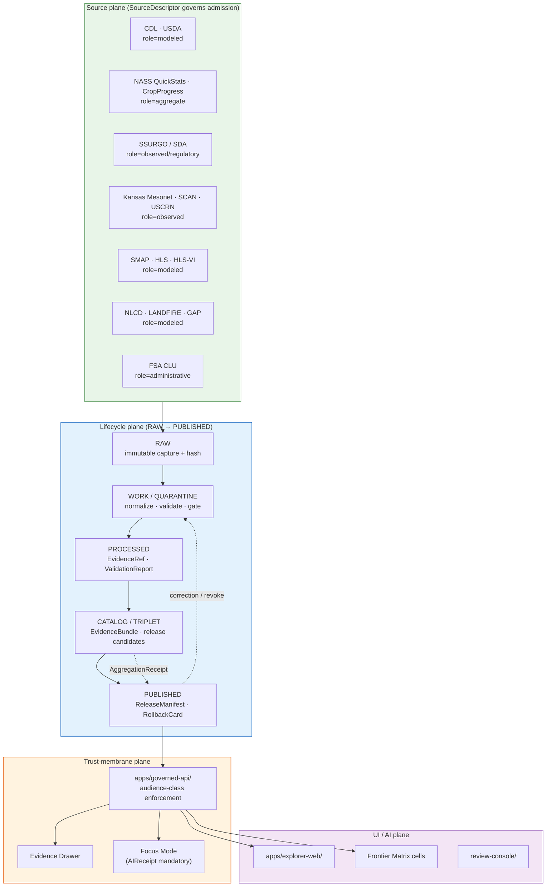
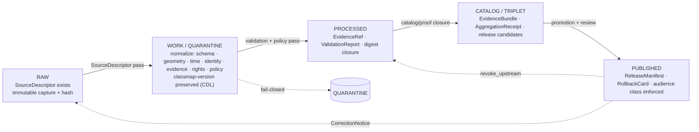
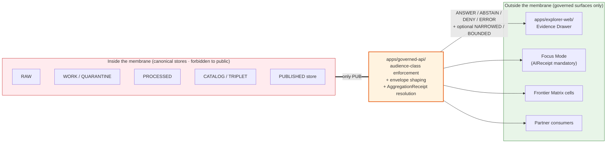

<!-- [KFM_META_BLOCK_V2]
doc_id: kfm://doc/domains/agriculture/architecture
title: Kansas Frontier Matrix — Agriculture Domain Architecture
type: standard
subtype: domain-architecture
version: v1 (draft)
status: draft
owners: TODO — Docs steward + Agriculture domain steward + Architecture steward + Policy steward
created: 2026-05-26
updated: 2026-05-26
policy_label: public
related:
  - docs/doctrine/ai-build-operating-contract.md
  - docs/doctrine/directory-rules.md
  - docs/doctrine/trust-membrane.md
  - docs/doctrine/lifecycle-law.md
  - docs/doctrine/policy-aware.md
  - docs/doctrine/evidence-first.md
  - docs/doctrine/ai-as-assistant.md
  - docs/doctrine/corrections-are-first-class.md
  - docs/domains/agriculture/README.md
  - docs/domains/agriculture/api-contracts.md
  - docs/domains/agriculture/policy/README.md
  - docs/domains/agriculture/runbooks/README.md
  - docs/domains/agriculture/sublanes/README.md
  - docs/domains/agriculture/sublanes/cropland.md
tags: [kfm, domain, agriculture, architecture, doctrine-adjacent, contract-v3]
notes:
  - Pinned to CONTRACT_VERSION = "3.0.0".
  - Single-file ARCHITECTURE.md pattern (PROPOSED canonical); reconciles with prior flora/architecture/README.md divergence (NEEDS VERIFICATION).
  - All repo paths PROPOSED until mounted-repo inspection.
[/KFM_META_BLOCK_V2] -->

<a id="top"></a>

# Kansas Frontier Matrix — Agriculture Domain Architecture

> The architectural contract for the **Agriculture** bounded context: ownership boundaries, object families, source-role discipline, lifecycle pipeline, trust-membrane placement, sublane decomposition, cross-lane edges, sensitivity posture, and governed-AI behavior — bounded by `ai-build-operating-contract.md` v3.0.

[](#top)
[](../../doctrine/ai-build-operating-contract.md)
[](./README.md)
[](../../doctrine/policy-aware.md)
[](../../doctrine/trust-membrane.md)
[](#sec-11-sensitivity)
[](#sec-18-changelog)

**Status:** `draft` · **Version:** `v1 (draft)` · **Owners:** *TODO* · **Updated:** 2026-05-26 · **Pinned to:** `CONTRACT_VERSION = "3.0.0"`

> [!IMPORTANT]
> **Architecture vs API contract.** This document is the **architectural contract** for the Agriculture bounded context (responsibility, identity, lifecycle, trust posture). It does **not** specify the wire-level API or envelope schemas — those live in [`api-contracts.md`](./api-contracts.md). Where the two documents touch (outcome grammar, audience class, aggregation receipt), this doc cites the API contract rather than re-stating it. `[CONFIRMED relationship; PROPOSED paths.]`

> [!NOTE]
> **Sibling orientation.** This doc orbits five sibling docs created in this corpus session:
> [`README.md`](./README.md) (landing) ·
> [`api-contracts.md`](./api-contracts.md) (wire contract) ·
> [`policy/README.md`](./policy/README.md) (sensitivity / release / review) ·
> [`runbooks/README.md`](./runbooks/README.md) (operational procedures) ·
> [`sublanes/README.md`](./sublanes/README.md) (five-axis sublane decomposition).

### Contents

1. [Purpose & scope](#sec-1-purpose)
2. [Authority & placement](#sec-2-authority)
3. [Architectural overview](#sec-3-overview)
4. [Bounded context & ubiquitous language](#sec-4-bounded-context)
5. [Object families](#sec-5-objects)
6. [Source families & role assignments](#sec-6-sources)
7. [Pipeline shape (RAW → PUBLISHED)](#sec-7-pipeline)
8. [Trust-membrane placement](#sec-8-membrane)
9. [Sublane decomposition](#sec-9-sublanes)
10. [Cross-lane relations](#sec-10-cross-lane)
11. [Sensitivity, rights, and publication posture](#sec-11-sensitivity)
12. [Map & viewing products](#sec-12-viewing)
13. [Governed AI behavior](#sec-13-ai)
14. [Companion artifacts](#sec-14-companions)
15. [Open questions register](#sec-15-open-questions)
16. [Open verification backlog](#sec-16-backlog)
17. [Changelog](#sec-17-changelog)
18. [Definition of done](#sec-18-dod)
19. [Related docs](#sec-19-related)

---

<a id="sec-1-purpose"></a>

## 1. Purpose & scope

The Agriculture bounded context governs **agricultural aggregate observations, soil/moisture/vegetation context, crop progress, suitability, stress indicators, irrigation links, conservation-practice context, agricultural-economy observations, and public-safe products** for Kansas. `[CONFIRMED dossier / PROPOSED implementation — Atlas §9.A; DOM-AG; ENCY.]`

| In scope | Out of scope (owned elsewhere) |
|---|---|
| Crop observations, field candidates, crop rotation, yield observations (aggregate), irrigation links, conservation-practice context. | Canonical soil map-unit and horizon semantics → **Soil**. |
| Soil-crop suitability, drought and pest stress indicators, supply-chain nodes, agricultural-economy observations. | Water observations, hydrograph, NFHL zones → **Hydrology**. |
| Aggregation receipts for county/HUC/grid-level publication. | Ownership, title, parcels, living-person privacy → **People/Land**. |
| Source-role anti-collapse rules specific to CDL/NASS/SSURGO/mesonet/satellite. | Critical-infrastructure deny lane → **Settlements/Infrastructure**. |
| Cross-lane edges to Soil, Hydrology, Atmosphere, People/Land, Hazards, Frontier Matrix. | Specific wire-level DTOs and envelope schemas → [`api-contracts.md`](./api-contracts.md). |

`[CONFIRMED scope — Atlas §9.B; DOM-AG; ENCY.]`

[Back to top](#top)

---

<a id="sec-2-authority"></a>

## 2. Authority & placement

### 2.1 Authority stack

This document derives its authority from the layers below, **in order**. A lower layer MUST NOT silently override a higher one; conflicts MUST be filed as drift entries against the higher layer.

1. [`docs/doctrine/ai-build-operating-contract.md`](../../doctrine/ai-build-operating-contract.md) v3.0 — canonical operating contract (`CONTRACT_VERSION = "3.0.0"`).
2. [`docs/doctrine/directory-rules.md`](../../doctrine/directory-rules.md) — placement protocol; root folders are responsibility roots, not topic buckets.
3. [`docs/doctrine/trust-membrane.md`](../../doctrine/trust-membrane.md) — the boundary every Agriculture envelope warrants.
4. [`docs/doctrine/lifecycle-law.md`](../../doctrine/lifecycle-law.md) — `RAW → WORK / QUARANTINE → PROCESSED → CATALOG / TRIPLET → PUBLISHED`.
5. [`docs/doctrine/policy-aware.md`](../../doctrine/policy-aware.md) — finite policy outcomes.
6. [`docs/doctrine/evidence-first.md`](../../doctrine/evidence-first.md) — cite-or-abstain.
7. [`docs/doctrine/ai-as-assistant.md`](../../doctrine/ai-as-assistant.md) — AI is interpretive, never root truth.
8. [`docs/doctrine/corrections-are-first-class.md`](../../doctrine/corrections-are-first-class.md) — `CorrectionNotice` workflow.
9. KFM Atlas chapters: §9 (Agriculture), §20.x (Master atlases), §24.x (extended master atlases including source-role anti-collapse, sensitivity tiers, capability matrix). `[CONFIRMED references; documents PROPOSED at the listed paths.]`

### 2.2 RFC 2119 conformance

This document uses RFC 2119 / RFC 8174 conformance language per `directory-rules.md` §2.2 and operating contract §5.1.1:

- **MUST / MUST NOT** — non-negotiable.
- **SHOULD / SHOULD NOT** — strong default; deviations require ADR or drift-register entry.
- **MAY** — permitted; no justification required.

### 2.3 Path placement (Directory Rules basis)

Per Directory Rules §12 (Domain Placement Law), Agriculture artifacts live as **lanes inside responsibility roots**, not as a root-level `agriculture/` folder. All paths below are **PROPOSED** until mounted-repo inspection.

```text
docs/
  domains/agriculture/
    README.md                       # landing
    ARCHITECTURE.md                 # this file
    api-contracts.md                # wire-level interface contract
    policy/README.md                # sensitivity / release / review aspect index
    runbooks/README.md              # ops procedures
    sublanes/README.md              # 5-axis sublane decomposition
    sublanes/cropland.md            # worked topical-sublane profile
schemas/contracts/v1/domains/agriculture/
  crop_observation.schema.json
  field_candidate.schema.json
  yield_observation.schema.json
  ... (one schema per object family)
schemas/contracts/v1/receipts/
  aggregation_receipt.schema.json   # PROPOSED home; ADR-S-03 pending
contracts/domains/agriculture/      # semantic Markdown only — no .schema.json
policy/
  sensitivity/agriculture/
  release/agriculture/
  domains/agriculture/
tests/domains/agriculture/
  contract/   schemas/   policy/   fixtures/
data/raw/agriculture/    work/agriculture/    quarantine/agriculture/
data/processed/agriculture/   catalog/domain/agriculture/   triplets/agriculture/
data/published/agriculture/   data/registry/sources/agriculture/
release/candidates/agriculture/   manifests/agriculture/
docs/runbooks/agriculture/         # subfolder pattern; OPEN-DR-02 pending
```

`[PROPOSED placement — Directory Rules §6 + §12; NEEDS VERIFICATION against mounted repo. ADR-0001 (schema home), ADR-0003 (policy singular), ADR-S-03 (aggregation-receipt home) all unresolved.]`

### 2.4 Trust-membrane placement

The Agriculture **public reader** path MUST route through `apps/governed-api/`. Direct reads against canonical/internal stores (`data/raw/...`, `data/work/...`, `data/quarantine/...`, candidate catalogs, direct model runtimes) are **forbidden** for any public client per [`trust-membrane.md`](../../doctrine/trust-membrane.md). `[CONFIRMED doctrine — Atlas §24.9.2; DIRRULES.]`

[Back to top](#top)

---

<a id="sec-3-overview"></a>

## 3. Architectural overview

### 3.1 Layered architecture



### 3.2 Plane responsibilities

| Plane | Responsibility | Sovereign authority? |
|---|---|---|
| **Source plane** | Bounded source admission; per-source `SourceDescriptor` with role + rights + cadence + sensitivity + access method. | No — sources are evidence inputs, not truth carriers. |
| **Lifecycle plane** | Stage-by-stage promotion with explicit gates; `RAW → WORK / QUARANTINE → PROCESSED → CATALOG / TRIPLET → PUBLISHED`. | The lifecycle invariant; canonical truth lives here. |
| **Trust-membrane plane** | The only path to public clients; audience-class enforcement; `RuntimeResponseEnvelope` shaping; outcome finite. | Authority delegate — speaks for the lifecycle plane to consumers. |
| **UI / AI plane** | Trust-visible exploration; Evidence Drawer rendering; Focus Mode synthesis with `AIReceipt`. | No — UI/AI interprets governed outputs; never substitutes for evidence. |

`[CONFIRMED doctrine — KFM Unified Implementation Architecture Build Manual §4; Atlas §20.1, §24.9.2.]`

[Back to top](#top)

---

<a id="sec-4-bounded-context"></a>

## 4. Bounded context & ubiquitous language

### 4.1 Owns

The Agriculture bounded context **owns** the following object families (full table at [§5](#sec-5-objects)):

- Crop Observation · Field Candidate · Crop Rotation · Yield Observation · Irrigation Link · Conservation Practice · Soil Crop Suitability · Agricultural Economy Observation · SupplyChainNode · Drought Stress Indicator · Pest Stress Indicator · Aggregation Receipt.

`[CONFIRMED — Atlas §9.B; DOM-AG.]`

### 4.2 Does NOT own

The Agriculture bounded context **explicitly does not own**:

- **Soil** owns canonical soil map-unit and horizon semantics (Agriculture consumes via MUKEY joins and suitability support, never re-publishes Soil truth as Agriculture truth).
- **Hydrology** owns water observations, flood context, and NFHL regulatory zones (Agriculture consumes irrigation / drought / water-use context).
- **People/Land** owns ownership, title, parcels, and living-person privacy (Agriculture's farm/operator and parcel-sensitive contexts remain **restricted by default**).
- **Atmosphere/Air** owns weather, heat, smoke, vegetation-stress meteorological context.
- **Hazards** owns regulatory hazard authority and alert framing.

`[CONFIRMED — Atlas §9.B, §24.4.7; DOM-AG.]`

### 4.3 Ubiquitous language (Agriculture-scoped)

> [!NOTE]
> Each term below is `CONFIRMED` as Agriculture vocabulary; **field realization** (the exact schema-level field name) is `PROPOSED` and resolves at [`api-contracts.md`](./api-contracts.md) §5.

| Term | Definition (Agriculture-scoped) | Citation |
|---|---|---|
| **Crop Observation** | A point-in-time observation of crop type, condition, or phenology at a defined spatial scope (field, county, grid cell). | `[DOM-AG] [ENCY]` |
| **Field Candidate** | A proposed field-level extent awaiting validation; never PUBLISHED without promotion. Sensitive operator joins fail closed. | `[DOM-AG] [ENCY]` |
| **Crop Rotation** | A temporal sequence of crop types over a defined spatial scope. | `[DOM-AG] [ENCY]` |
| **Yield Observation** | An aggregate yield reading over a defined spatial scope; carries `AggregationReceipt` when not field-level. | `[DOM-AG] [ENCY]` |
| **Irrigation Link** | A relation between a field/parcel and an irrigation source/withdrawal; respects Hydrology source authority. | `[DOM-AG] [ENCY]` |
| **Conservation Practice** | Context for a recorded or modeled conservation practice; framed by Habitat quality scores, **never used as instruction**. | `[DOM-AG] [DOM-HAB]` |
| **Soil Crop Suitability** | A modeled-product join over Soil map-units; cites Soil with model identity + run receipt. | `[DOM-AG] [DOM-SOIL]` |
| **Drought Stress Indicator** | Modeled indicator of drought stress; context for Hazards, **not regulatory**. | `[DOM-AG] [DOM-HAZ]` |
| **Pest Stress Indicator** | Agriculture-owned modeled pest indicator; Fauna is the source of taxonomic identity only. | `[DOM-AG] [DOM-FAUNA]` |
| **Aggregation Receipt** | Receipt that accompanies every aggregate publication; records the aggregation scope, method, suppression threshold, and source manifest. | `[DOM-AG] [ENCY]` |
| **MUKEY · COKEY · CHKEY** | Soil map-unit / component / horizon identifiers (Soil-owned); Agriculture cites, does not redefine. | `[DOM-AG] [DOM-SOIL]` |
| **VWC** | Volumetric water content (soil moisture); unit/depth/QC normalization mandatory at WORK. | `[DOM-AG] [DOM-SOIL]` |
| **Spec hash** | Stable hash of the spec under which a record was admitted; preserved through promotion. | `[ENCY]` |

[Back to top](#top)

---

<a id="sec-5-objects"></a>

## 5. Object families

**Identity rule (all rows):** *PROPOSED deterministic basis* — `source_id + object_role + temporal_scope + normalized_digest`. Set at admission; never edited in-place; corrections produce a new descriptor + `CorrectionNotice`.

**Temporal handling (all rows):** *CONFIRMED* — `source_time`, `observed_time`, `valid_time`, `retrieval_time`, `release_time`, and `correction_time` stay **distinct** where material.

| Object family | Owner | Default source role | Sensitivity default | Schema home (PROPOSED) |
|---|---|---|---|---|
| **Crop Observation** | Agriculture | observed *or* modeled (per source) | aggregate-safe; field-level → DENY public | `schemas/contracts/v1/domains/agriculture/crop_observation.schema.json` |
| **Field Candidate** | Agriculture | candidate | DENY public until promoted | `schemas/contracts/v1/domains/agriculture/field_candidate.schema.json` |
| **Crop Rotation** | Agriculture | observed *or* modeled | aggregate-safe; field-level → DENY public | `schemas/contracts/v1/domains/agriculture/crop_rotation.schema.json` |
| **Yield Observation** | Agriculture | aggregate | aggregate-safe; field-level → DENY public | `schemas/contracts/v1/domains/agriculture/yield_observation.schema.json` |
| **Irrigation Link** | Agriculture | observed *or* administrative | operator/parcel join → DENY public | `schemas/contracts/v1/domains/agriculture/irrigation_link.schema.json` |
| **Conservation Practice** | Agriculture | administrative *or* observed | operator-identifiable → DENY public | `schemas/contracts/v1/domains/agriculture/conservation_practice.schema.json` |
| **Soil Crop Suitability** | Agriculture | modeled | aggregate-safe | `schemas/contracts/v1/domains/agriculture/soil_crop_suitability.schema.json` |
| **Agricultural Economy Observation** | Agriculture | aggregate | aggregate-safe | `schemas/contracts/v1/domains/agriculture/agricultural_economy_observation.schema.json` |
| **SupplyChainNode** | Agriculture | administrative | operator-identifiable → DENY public | `schemas/contracts/v1/domains/agriculture/supply_chain_node.schema.json` |
| **Drought Stress Indicator** | Agriculture | modeled | aggregate-safe; never alert | `schemas/contracts/v1/domains/agriculture/drought_stress_indicator.schema.json` |
| **Pest Stress Indicator** | Agriculture | modeled | aggregate-safe; never alert | `schemas/contracts/v1/domains/agriculture/pest_stress_indicator.schema.json` |
| **Aggregation Receipt** | Cross-cutting (Agriculture is a primary citer) | — | required on every Agriculture aggregate publication | `schemas/contracts/v1/receipts/aggregation_receipt.schema.json` (PROPOSED; ADR-S-03 pending) |

`[CONFIRMED object-family spine / PROPOSED implementation — Atlas §9.E, §24.13; DOM-AG; ENCY.]`

> [!IMPORTANT]
> **`AggregationReceipt` is load-bearing for Agriculture.** Every Agriculture envelope whose `evidence_refs[]` includes `role = aggregate` MUST resolve an `AggregationReceipt`. Without it, the envelope MUST `ABSTAIN` with reason `aggregation_receipt_missing`. `[CONFIRMED centrality — Atlas §24.13; PROPOSED schema home — ADR-S-03.]`

[Back to top](#top)

---

<a id="sec-6-sources"></a>

## 6. Source families & role assignments

> [!IMPORTANT]
> **Source-role anti-collapse is enforced at admission.** A source's role is set in its `SourceDescriptor` and is **preserved through every promotion**. Promotion MUST NOT upgrade an observation to a regulation, a model to an aggregate, or a candidate to a verified record — those are separate governed transitions per Atlas §24.1. `[CONFIRMED doctrine — Atlas §24.1, §24.9.3 governance-process anti-patterns.]`

### 6.1 Source family table

| Source family | Role (CONFIRMED) | Rights / sensitivity | Freshness | Status |
|---|---|---|---|---|
| **SSURGO / Soil Data Access** | observed (pedon) *or* regulatory (hydrologic group) | rights NEEDS VERIFICATION; sensitive joins fail closed | source-vintage | `[DOM-AG]` |
| **gSSURGO** | modeled (rasterized derivative) | inherits SSURGO; never re-labeled `observed` | source-vintage | `[DOM-AG]` |
| **Kansas Mesonet** | observed (station readings) | rights NEEDS VERIFICATION (OQ-AG-API-10) | hourly to daily | `[DOM-AG]` |
| **NRCS SCAN** | observed (station readings) | open with attribution | hourly to daily | `[DOM-AG]` |
| **NOAA USCRN** | observed (station readings) | open | hourly | `[DOM-AG]` |
| **NASA SMAP** | modeled (gridded retrieval) | open with attribution | 1–3 day | `[DOM-AG]` |
| **NASA HLS / HLS-VI** | modeled (vegetation index) | open with attribution | per scene cadence | `[DOM-AG]` |
| **USDA NASS QuickStats / Crop Progress** | aggregate (county/state) | open; **never field-level public** | weekly to annual | `[DOM-AG]` (OQ-AG-API-09) |
| **USDA CDL** | modeled (classification raster) | open with attribution; **never `observed`** | annual | `[DOM-AG]` |
| **NLCD / LANDFIRE / GAP** | modeled (classification raster) | open with attribution | episodic | `[DOM-AG]` |
| **USDA PLANTS** | administrative (taxonomic registry) | open | episodic | `[DOM-AG]` |
| **FSA CLU** | administrative | restricted; **DENY public** | episodic | `[DOM-AG]` |

`[CONFIRMED source families / PROPOSED rights resolution — Atlas §9.D; DOM-AG; OQ-AG-API-09 / -10 pending.]`

### 6.2 Source-role anti-collapse — Agriculture-specific DENY rows

| Collapse pattern | Denied outcome | Required guardrail |
|---|---|---|
| **CDL labeled or queried as `observed`** crop occurrence. | DENY publication; ABSTAIN at AI surface. | Source role `modeled` preserved; `run_receipt` cited; UI banner if rendered. |
| **NASS aggregate cited as field-level truth.** | DENY join from aggregate cell to single field; ABSTAIN at AI surface. | `AggregationReceipt`; geometry-scope guard; matrix-cell semantics. |
| **Drought / pest stress indicator framed as alert / instruction.** | DENY publication as life-safety guidance. | KFM is **not** an alert authority; route to Hazards / Air with regulatory provenance. |
| **Conservation practice framed as land-management instruction.** | DENY publication as instruction. | Habitat-quality framing only; never imperative. |
| **Person-parcel join published.** | DENY public; HOLD for steward review. | `RedactionReceipt`; aggregate generalization; sensitivity reviewer. |

`[CONFIRMED — Atlas §24.1.2 anti-collapse failure modes; §24.9.2 trust-membrane anti-patterns; DOM-AG.]`

[Back to top](#top)

---

<a id="sec-7-pipeline"></a>

## 7. Pipeline shape (RAW → PUBLISHED)

Agriculture follows the canonical KFM lifecycle. Each stage has a **gate** that MUST pass before promotion; failure routes to QUARANTINE, never to the next stage.



### 7.1 Gate matrix

| Stage | Gate (MUST pass) | Required artifacts | Cropland-specific note |
|---|---|---|---|
| **RAW** | `SourceDescriptor` exists with role + rights + sensitivity + access method + cadence. | `SourceDescriptor` · raw payload hash · source-time | CDL: capture `classmap_version` at admission; preserved forever. |
| **WORK / QUARANTINE** | Validation **and** policy gate pass, **or** quarantine reason recorded. | Validation events · policy events · quarantine reason if held | NASS: unit/scope normalization; reject any field-level claim. |
| **PROCESSED** | `EvidenceRef` resolvable + `ValidationReport` pass + digest closure. | `EvidenceRef` · `ValidationReport` · `RunReceipt` | Soil-moisture: unit/depth/QC normalization MUST be present. |
| **CATALOG / TRIPLET** | Catalog/proof closure passes; release candidate framed. | `EvidenceBundle` · `AggregationReceipt` (if aggregate) · candidate manifest | Aggregate yield: `AggregationReceipt` REQUIRED for any non-field-level publication. |
| **PUBLISHED** | `ReleaseManifest` valid + correction path + rollback target + review state recorded + audience class enforced. | `ReleaseManifest` · `RollbackCard` · `PolicyDecision` · `PromotionDecision` | Field-level claims: **never** PUBLISHED for `audience_class ∈ { public, partner }`. |

`[CONFIRMED doctrine / PROPOSED lane application — Atlas §9.H; DIRRULES; DOM-AG; ENCY.]`

> [!WARNING]
> **`PUBLISHED` is a state, not a directory.** Moving a file into `data/published/agriculture/` does **not** publish it. Publication requires the gate at `PUBLISHED` to pass and a `PromotionDecision` emitted. Direct writes to the published store bypass the trust membrane and are forbidden. `[CONFIRMED — DIRRULES §13; Atlas §24.9.2.]`

[Back to top](#top)

---

<a id="sec-8-membrane"></a>

## 8. Trust-membrane placement

Every public Agriculture response MUST cross the trust membrane exactly once, via `apps/governed-api/` (PROPOSED home). The membrane shapes the response into a finite `RuntimeResponseEnvelope` per [`api-contracts.md`](./api-contracts.md) §4.



### 8.1 Audience-class enforcement

Per atlas card `KFM-P9-PROG-0069`, every Agriculture surface MUST classify each endpoint or resource as one of:

| Audience class | Allowed envelope fields | Forbidden |
|---|---|---|
| `public` | Aggregate observations · public-safe context · model outputs with `run_receipt` · regulatory cites. | Field-level identifiable claims · operator joins · raw bytes · candidate records. |
| `partner` | Same as `public` **plus** named-agreement scope (rights-bounded). | Identifiable operator/parcel joins. |
| `steward` | Operator-identifiable context **with** `ReviewRecord` + `PolicyDecision`. | Anything outside the steward's named scope. |
| `internal` | Build / debug / audit only. | **MUST NEVER** appear in `public` or `partner` envelopes. |
| `denied` | — | Returns `DENY` with reason; envelope carries no claim. |

`[CONFIRMED — atlas card KFM-P9-PROG-0069; PROPOSED enforcement in apps/governed-api/.]`

> [!CAUTION]
> **Source-vintage / classmap-version pinning.** Agriculture cross-vintage joins (e.g., CDL 2014 + CDL 2024) MUST preserve each source's `classmap_version` through the envelope. Public envelopes that mix vintages without explicit pinning MUST `ABSTAIN` with reason `classmap_version_mismatch`. `[CONFIRMED — atlas card KFM-P25-PROG-0005.]`

[Back to top](#top)

---

<a id="sec-9-sublanes"></a>

## 9. Sublane decomposition

The Agriculture domain decomposes along **five axes**, each axis a sublane with its own sensitivity, source-role mix, and publication posture. The decomposition is **PROPOSED** at v1; the canonical reference is [`sublanes/README.md`](./sublanes/README.md), with [`sublanes/cropland.md`](./sublanes/cropland.md) as the worked example.

| Sublane (axis) | Primary objects | Default audience | Default sensitivity | Worked profile |
|---|---|---|---|---|
| **Cropland** | Crop Observation · Field Candidate · Crop Rotation | aggregate-safe · `public` | field-level → DENY public | [`sublanes/cropland.md`](./sublanes/cropland.md) |
| **Soil-moisture & climate context** | Soil Moisture Observation (cited from Soil) · Drought Stress Indicator | aggregate-safe · `public` | station-level: open; site-precise: steward | `sublanes/soil-moisture.md` (TODO) |
| **Vegetation index & remote sensing** | HLS / HLS-VI · SMAP · CDL-derived | aggregate-safe · `public` | classmap-version pinned | `sublanes/vegetation-index.md` (TODO) |
| **Suitability & conservation** | Soil Crop Suitability · Conservation Practice | aggregate-safe · `public` | operator-identifiable → DENY public | `sublanes/suitability.md` (TODO) |
| **Drought, pest & stress** | Drought Stress Indicator · Pest Stress Indicator | aggregate-safe · `public` | never `regulatory`; never alert | `sublanes/stress.md` (TODO) |

`[PROPOSED 5-axis decomposition; CONFIRMED that each axis is a distinct publication posture per Atlas §9 + §24.4.7. ADR-AG-SUB-01 PROPOSED to ratify.]`

[Back to top](#top)

---

<a id="sec-10-cross-lane"></a>

## 10. Cross-lane relations

> [!NOTE]
> Edges below preserve **ownership, source role, sensitivity, and `EvidenceBundle` support**. Where a relation conflicts with the Atlas v1.0 per-domain F-section, **v1.0 governs**.

| This domain | Related lane | Relation type | Default disposition |
|---|---|---|---|
| Agriculture | **Soil** | MUKEY joins; suitability support. | Agriculture **cites** Soil; never re-publishes Soil truth. `[Atlas §24.4.7.]` |
| Agriculture | **Hydrology** | Irrigation, drought, water-use context. | Agriculture consumes Hydrology gauge / NFHL with **regulatory provenance preserved**. `[Atlas §24.4.7.]` |
| Agriculture | **Atmosphere / Air** | Weather, heat, smoke, vegetation-stress meteorological context. | Agriculture consumes; AODRaster cited with model identity. |
| Agriculture | **People / Land** | Farm/operator and parcel-sensitive contexts. | **DENY public** by default; person-parcel joins fail closed. `[Atlas §24.4.7.]` |
| Agriculture | **Habitat** | Conservation-practice framing only. | Habitat-quality score framing; **never instruction**. `[Atlas §24.4.4.]` |
| Agriculture | **Fauna** | Pest stress indicators (Agriculture-owned). | Fauna provides **taxonomic identity only**. `[Atlas §24.4.5.]` |
| Agriculture | **Flora** | Invasive-plant management framing. | Flora context informs framing; **never instruction**. `[Atlas §24.4.6.]` |
| Agriculture | **Geology** | Resource and parent-material context (advisory). | Advisory; not regulatory; not aggregate. `[Atlas §24.4.8.]` |
| Agriculture | **Hazards** | Drought / pest stress as hazard context. | Context only; KFM is **not** an alert authority. `[Atlas §24.9.2.]` |
| Agriculture | **Frontier Matrix** | Aggregate county-year crop and yield observations are matrix-cell inputs. | `AggregationReceipt` REQUIRED on each input; correction cascades to consumed cells. `[Atlas §24.4.7; trust-membrane.md §8.]` |

[Back to top](#top)

---

<a id="sec-11-sensitivity"></a>

## 11. Sensitivity, rights, and publication posture

> [!CAUTION]
> **Operator / parcel / field-level data are sensitive by default.** Any Agriculture artifact that would expose those fields MUST route through the §23.2 sensitive-domain matrix in [`ai-build-operating-contract.md`](../../doctrine/ai-build-operating-contract.md) before publication. Exact identifiers and restricted-source-derived fields MUST NOT appear publicly without steward clearance and a `RedactionReceipt`. `[CONFIRMED — operating contract §23; trust-membrane.md §7.]`

### 11.1 Tier matrix (extends Atlas §24.5.2)

| Sublane / object | Default tier | Allowed transforms | Required gates |
|---|---|---|---|
| Public-safe aggregate (county/HUC/state crop & yield) | **T0** | — | Standard release. |
| Field-level aggregate-derived (e.g., CDL-derived field stats) | **T1** | Generalize to county/HUC; suppress when below k-anon threshold. | `AggregationReceipt` + `RedactionReceipt` if generalized. |
| Private operator (FSA CLU; private yield; pesticide records) | **T4** | None to public; T3 only under named agreement. | Sovereignty / steward review + `PolicyDecision`. |
| Person-parcel join (operator × parcel) | **T4** | Aggregate over k-anon threshold; suppress otherwise. | `RedactionReceipt` + `ReviewRecord` + `PolicyDecision`. |
| Drought / pest stress (modeled) | **T0** | — | Standard release; **never** as alert. |
| Conservation-practice context | **T1** | Generalize to non-identifiable framing. | Steward review if operator-identifiable. |

`[CONFIRMED — Atlas §24.5.1 tier scheme; PROPOSED per-sublane assignments. ADR-S-05 (sensitivity tier scheme) pending.]`

### 11.2 Deny-by-default register

| Pattern | Disposition | Reason |
|---|---|---|
| Field-level NASS publication. | **DENY** public. | Aggregate-cited-as-field violates source-role anti-collapse. |
| Person-parcel join publication. | **DENY** public. | Living-person sensitivity per Atlas §24.5.2. |
| FSA CLU publication. | **DENY** public. | Restricted source terms. |
| Pesticide records publication. | **DENY** public. | Private operator data. |
| Proprietary yield publication. | **DENY** public. | Private operator data. |
| Drought / pest stress framed as alert / instruction. | **DENY** publication. | KFM is not an alert authority. |
| Conservation practice framed as instruction. | **DENY** publication. | Framing only; not imperative. |

`[CONFIRMED — Atlas §20.5 Deny-by-Default Register; DOM-AG.]`

[Back to top](#top)

---

<a id="sec-12-viewing"></a>

## 12. Map & viewing products

### 12.1 Public-safe viewing products

`PROPOSED` Agriculture viewing products per Atlas §9.G:

- Public-safe crop progress maps (county/HUC aggregates).
- Aggregate crop-condition view (NASS-derived, with `AggregationReceipt`).
- Soil-crop suitability map (modeled, with `run_receipt`).
- Station soil-moisture series (point observations + `EvidenceBundle`).
- Satellite / grid moisture context (SMAP, with model identity).
- Vegetation-index context (HLS-VI, with classmap-version pin).
- Drought / pest stress indicators (modeled, framed as context only).

### 12.2 Cross-cutting viewing products

`CONFIRMED` cross-cutting products per Atlas §20.1 apply uniformly: Evidence Drawer, time-aware state, trust badges, sensitivity-redacted view, correction / stale-state view, and governed Focus Mode.

### 12.3 Forbidden viewing products

| Pattern | Why forbidden |
|---|---|
| Field-level crop identification on public maps. | Source-role anti-collapse (CDL as observed). |
| Operator-identifiable yield map. | Sensitivity tier T4. |
| Drought / pest "alert" overlay. | KFM is not an alert authority. |
| Conservation-practice "recommendation" overlay. | Framing only; never instruction. |

`[CONFIRMED — Atlas §9.I, §24.9.2; DOM-AG.]`

[Back to top](#top)

---

<a id="sec-13-ai"></a>

## 13. Governed AI behavior

> [!WARNING]
> **AI text treated as evidence is the highest-severity anti-pattern at every Agriculture Focus Mode surface.** Disposition: `DENY` at publication, `ABSTAIN` at Focus, `AIReceipt` mandatory. `[CONFIRMED — Atlas §24.9.2; ai-as-assistant.md.]`

### 13.1 Permitted AI behaviors

AI **MAY**, at the Agriculture surface:

- Summarize released Agriculture `EvidenceBundles` with citations resolving to the bundle.
- Compare evidence across released sources within the same sensitivity tier.
- Explain limitations (freshness, source role, aggregation scope, uncertainty bounds).
- Draft steward-review notes for sensitive-lane material (never publish those notes).
- Emit `NARROWED` / `BOUNDED` outcomes when scope or confidence justifies it (per operating contract §21.2; admission to v1 schema pending OQ-AG-API-06).

### 13.2 Required AI behaviors

AI **MUST**:

- `ABSTAIN` when evidence is insufficient, missing, stale, freshness-window-lapsed, revoked-upstream, or unresolved.
- `DENY` when policy, rights, sensitivity, or release state blocks the request (sensitive lanes default here).
- `ERROR` on malformed input, missing schema, or contract violation; **MUST NOT** silently fall through to another lane.
- Emit `AIReceipt` for **every** Focus Mode answer (`ANSWER` / `ABSTAIN` / `DENY` / `NARROWED` / `BOUNDED` alike).
- Emit `GENERATED_RECEIPT.json` for every AI-authored merge touching this surface, with `contract_version = "3.0.0"` pinned. `[CONFIRMED — operating contract §34.]`

### 13.3 Forbidden AI behaviors

AI **MUST NOT**:

- Substitute fluent language for evidence (cite-or-abstain).
- Read directly from `RAW` / `WORK` / `QUARANTINE` / candidate stores (forbidden by trust membrane).
- Cross-lane-join to identifiable operator / parcel (DENY default).
- Frame any answer as an alert, life-safety guidance, or operational instruction.
- Upgrade a source role through generation (e.g., narrating a modeled CDL value as `observed`).

`[CONFIRMED — Atlas §9.L, §24.9.2; ai-as-assistant.md; ai-build-operating-contract.md §32–§34.]`

[Back to top](#top)

---

<a id="sec-14-companions"></a>

## 14. Companion artifacts

| Companion | Role | Path |
|---|---|---|
| Agriculture landing page | Domain orientation | [`README.md`](./README.md) |
| Wire-level interface contract | DTO / envelope schema specification | [`api-contracts.md`](./api-contracts.md) |
| Policy aspect index | Sensitivity / release / review rules | [`policy/README.md`](./policy/README.md) |
| Runbooks aspect index | Operational procedures | [`runbooks/README.md`](./runbooks/README.md) |
| Sublane decomposition | 5-axis sublane index | [`sublanes/README.md`](./sublanes/README.md) |
| Cropland sublane profile | Worked topical-sublane example | [`sublanes/cropland.md`](./sublanes/cropland.md) |
| Source registry summary | Source admission record | `docs/domains/agriculture/SOURCES.md` (TODO) |
| Sensitivity detail | Deny-by-default lanes detail | `docs/domains/agriculture/SENSITIVITY.md` (TODO) |
| Source refresh runbook | Agriculture source refresh procedure | `docs/runbooks/agriculture/SOURCE_REFRESH_RUNBOOK.md` (PROPOSED) |
| Correction runbook | Agriculture correction propagation procedure | `docs/runbooks/agriculture/CORRECTION_RUNBOOK.md` (PROPOSED) |
| Rollback runbook | Agriculture rollback procedure | `docs/runbooks/agriculture/ROLLBACK_RUNBOOK.md` (PROPOSED) |

[Back to top](#top)

---

<a id="sec-15-open-questions"></a>

## 15. Open questions register

| ID | Question | Owner role | Resolution path |
|---|---|---|---|
| **OQ-AG-ARCH-01** | Is `docs/domains/agriculture/ARCHITECTURE.md` the canonical home, or is `docs/domains/agriculture/architecture/README.md` (the flora pattern) canonical? | Docs steward + Architecture steward | ADR; reconcile with flora divergence already flagged in user memory. |
| **OQ-AG-ARCH-02** | Final 5-axis sublane names (cropland · soil-moisture · vegetation-index · suitability · stress) and ratification timing. | Agriculture domain steward | ADR-AG-SUB-01 (PROPOSED). |
| **OQ-AG-ARCH-03** | Whether Agriculture has its own `policy/sensitivity/agriculture/` tree or shares with Soil / People. | Policy steward | Mounted-repo inspection. |
| **OQ-AG-ARCH-04** | Whether `data/registry/sources/agriculture/` exists; if not, whether to create it or share with `data/registry/sources/`. | Source steward | Directory Rules §6 inspection. |
| **OQ-AG-ARCH-05** | Whether `AggregationReceipt` is a shared receipt class (cross-cutting) or an Agriculture-specific class. | Contract / schema steward | ADR-S-03. |
| **OQ-AG-ARCH-06** | Whether `classmap_version` pinning is enforced at WORK (admission) or at PROCESSED (validation). | Architecture steward + Build owner | ADR; align with KFM-P25-PROG-0005. |
| **OQ-AG-ARCH-07** | Audience-class enforcement — middleware in `apps/governed-api/`, schema-level (envelope `audience_class` field), or both? | API owner + Architecture steward | ADR; aligns with [`api-contracts.md`](./api-contracts.md) OQ-AG-API-08. |
| **OQ-AG-ARCH-08** | Whether the `docs/runbooks/agriculture/` subfolder pattern is canonical (Pattern A) or whether flat-with-domain-prefix (Pattern B) wins. | Docs steward | Directory Rules OPEN-DR-02; ADR. |
| **OQ-AG-ARCH-09** | Are pest stress observations Agriculture-owned across the entire surface, or do Fauna observations of disease/mortality cross the line? | Agriculture domain steward + Fauna steward | Cross-lane edge reconciliation per Atlas §24.4.5 / §24.4.7. |
| **OQ-AG-ARCH-10** | k-anonymity threshold values for county / HUC / grid public release. | Sensitivity reviewer + Policy steward | ADR; aligns with `api-contracts.md` OQ-AG-API-12. |

[Back to top](#top)

---

<a id="sec-16-backlog"></a>

## 16. Open verification backlog

> Items below are verification work this document cannot complete without a mounted repository. Each item MUST be tracked in `docs/registers/VERIFICATION_BACKLOG.md` (PROPOSED) until closed.

<details>
<summary><strong>Verification items (13 rows) — click to expand</strong></summary>

| # | Item | What to check | Owner |
|---:|---|---|---|
| 1 | `docs/domains/agriculture/` presence and sibling READMEs | All five sibling docs (`README.md`, `api-contracts.md`, `policy/`, `runbooks/`, `sublanes/`) exist and cross-reference. | Docs steward |
| 2 | `schemas/contracts/v1/domains/agriculture/` presence | All twelve object-family schemas present; each pinned to `contract_version = "3.0.0"`. | Contract / schema steward |
| 3 | `apps/governed-api/` route registry | Confirm route convention for Agriculture endpoints. | API owner |
| 4 | `policy/sensitivity/agriculture/` artifacts | Per-sublane sensitivity rules present (`cropland/`, `soil_moisture/`, `vegetation_index/`, `suitability/`, `stress/`). | Policy steward |
| 5 | `policy/release/agriculture/` artifacts | Per-audience-class release rules present. | Policy steward |
| 6 | `data/registry/sources/agriculture/` | Admitted-source coverage for the twelve source families in §6.1. | Source steward |
| 7 | NASS / QuickStats / Crop Progress source activation | `SourceActivationDecision` status. | Source steward |
| 8 | Kansas Mesonet / HLS / SMAP terms | Rights records in source registry. | Source steward + Rights-holder rep |
| 9 | `AggregationReceipt` schema home | Resolve ADR-S-03. | Contract / schema steward |
| 10 | `RuntimeResponseEnvelope.audience_class` enum | Confirm `public / partner / steward / internal / denied` enforced. | Architecture steward |
| 11 | Source-role anti-collapse validators | Confirm validators reject CDL-as-observed, NASS-as-field, etc. | Build owner |
| 12 | `classmap_version` pin propagation | Confirm CDL classmap_version preserved at WORK and through envelope. | Build owner |
| 13 | Correction-propagation cascade test | Confirm Frontier Matrix cells downgrade to `ABSTAIN revoked_upstream` on Agriculture correction. | Architecture steward |

</details>

`[All items open; resolution path varies per row.]`

[Back to top](#top)

---

<a id="sec-17-changelog"></a>

## 17. Changelog

> Per operating contract [§37](../../doctrine/ai-build-operating-contract.md): `MINOR` rows clarify or extend without breaking; `MAJOR` rows change operating law and require receipt re-issuance.

### 17.1 v1 (initial draft — current)

| Change | Type (§37) | Reason |
|---|---|---|
| Initial creation of `docs/domains/agriculture/ARCHITECTURE.md`. | new | Establish architectural contract for the Agriculture bounded context, distinct from the wire-level [`api-contracts.md`](./api-contracts.md). |
| Adopted single-file `ARCHITECTURE.md` pattern (PROPOSED canonical) rather than `architecture/README.md` folder pattern. | new | Reconcile divergence with prior flora `architecture/README.md` (OQ-AG-ARCH-01). Decision pending ADR. |
| Authority stack pinned to `CONTRACT_VERSION = "3.0.0"`; nine-layer stack named in §2.1. | new | Operating contract §1 + §5 conformance. |
| Adopted Atlas §9 A–N skeleton, re-organized as architectural sections rather than dossier sections. | new | Make the doc usable as an architectural contract while preserving traceability to Atlas. |
| Source families table with explicit role assignments per Atlas §24.1. | new | Source-role anti-collapse foundation. |
| Five-axis sublane decomposition (cropland · soil-moisture · vegetation-index · suitability · stress). | new | PROPOSED per OQ-AG-ARCH-02; aligns with `sublanes/README.md`. |
| `AggregationReceipt` centrality elevated to IMPORTANT callout in §5. | new | Atlas §24.13 centrality claim. |
| Sensitive-domain CAUTION callout in §11 routes through operating contract §23.2 matrix. | new | Sensitive-domain handling required by contract. |
| Companion sections (Open Qs, Verification Backlog, Changelog, DoD). | new | Doctrine-adjacent doc convention. |

> **Backward compatibility (n/a — initial version).** Future v1 → v2 changes MUST preserve all v1 anchors (`#sec-1-purpose` through `#sec-19-related`) and all OQ-AG-ARCH-NN ids.

[Back to top](#top)

---

<a id="sec-18-dod"></a>

## 18. Definition of done

A repository implementation of this document conforms when **all** of the following hold:

- [ ] `docs/domains/agriculture/ARCHITECTURE.md` exists at its agreed home (pending OQ-AG-ARCH-01).
- [ ] KFM Meta Block v2 present and `contract_version: "3.0.0"` pinned.
- [ ] All five sibling docs cross-reference this document.
- [ ] [`api-contracts.md`](./api-contracts.md) cross-references this doc as the architectural contract.
- [ ] All twelve object-family schemas authored under `schemas/contracts/v1/domains/agriculture/`.
- [ ] `AggregationReceipt` schema present at its agreed home (ADR-S-03).
- [ ] `apps/governed-api/` (or its ADR-equivalent) exists and enforces audience-class boundaries.
- [ ] Source-role anti-collapse validators (CDL-as-observed, NASS-as-field, etc.) ship with both valid and invalid fixtures; invalid fixtures fail for the expected reason.
- [ ] Person-parcel-join `DENY` default enforced.
- [ ] Field-level NASS `DENY` enforced.
- [ ] Every published Agriculture aggregate envelope carries `aggregation_receipt`.
- [ ] `RAW` / `WORK` / `QUARANTINE` / candidate stores never appear on public surfaces.
- [ ] Correction-propagation cascade emits `CorrectionNotice` and triggers downstream `EvidenceRef` re-evaluation.
- [ ] `RollbackCard` target preserved for every published Agriculture release.
- [ ] Every AI-authored merge touching this surface emits `GENERATED_RECEIPT.json` per operating contract §34.
- [ ] Drift between this document and live state logged in `docs/registers/DRIFT_REGISTER.md`.
- [ ] All open questions in §15 resolved or assigned to ADRs with active owners.
- [ ] All verification items in §16 tracked in `docs/registers/VERIFICATION_BACKLOG.md`.
- [ ] CODEOWNERS coverage for `docs/domains/agriculture/` confirmed.
- [ ] `GENERATED_RECEIPT.json` for this document wired into CI.

[Back to top](#top)

---

<a id="sec-19-related"></a>

## 19. Related docs

### 19.1 Operating doctrine

- [`docs/doctrine/ai-build-operating-contract.md`](../../doctrine/ai-build-operating-contract.md) — canonical operating contract; **`CONTRACT_VERSION = "3.0.0"`**.
- [`docs/doctrine/directory-rules.md`](../../doctrine/directory-rules.md) — placement protocol.

### 19.2 Trust-boundary doctrine

- [`docs/doctrine/trust-membrane.md`](../../doctrine/trust-membrane.md)
- [`docs/doctrine/policy-aware.md`](../../doctrine/policy-aware.md)
- [`docs/doctrine/lifecycle-law.md`](../../doctrine/lifecycle-law.md)
- [`docs/doctrine/evidence-first.md`](../../doctrine/evidence-first.md)
- [`docs/doctrine/ai-as-assistant.md`](../../doctrine/ai-as-assistant.md)
- [`docs/doctrine/corrections-are-first-class.md`](../../doctrine/corrections-are-first-class.md)

### 19.3 Agriculture sibling docs

- [`docs/domains/agriculture/README.md`](./README.md)
- [`docs/domains/agriculture/api-contracts.md`](./api-contracts.md)
- [`docs/domains/agriculture/policy/README.md`](./policy/README.md)
- [`docs/domains/agriculture/runbooks/README.md`](./runbooks/README.md)
- [`docs/domains/agriculture/sublanes/README.md`](./sublanes/README.md)
- [`docs/domains/agriculture/sublanes/cropland.md`](./sublanes/cropland.md)

### 19.4 Adjacent-domain architecture (for cross-lane edges)

- `docs/domains/soil/ARCHITECTURE.md` *(TODO — pattern reconciliation per OQ-AG-ARCH-01)*
- `docs/domains/hydrology/ARCHITECTURE.md` *(TODO)*
- `docs/domains/atmosphere/ARCHITECTURE.md` *(TODO)*
- `docs/domains/people-dna-land/ARCHITECTURE.md` *(TODO)*
- `docs/domains/habitat/ARCHITECTURE.md` *(TODO)*
- `docs/domains/fauna/ARCHITECTURE.md` *(TODO)*
- `docs/domains/flora/architecture/README.md` *(PROPOSED — pattern divergence flagged; reconcile per OQ-AG-ARCH-01)*

### 19.5 ADR backlog (relevant to this doc)

- `docs/adr/ADR-0001-schema-home.md` — schema-home authority. *(NEEDS VERIFICATION.)*
- `docs/adr/ADR-0003-policy-singular.md` — `policy/` singular as canonical. *(PROPOSED.)*
- `docs/adr/ADR-S-03-aggregation-receipt-home.md` — `AggregationReceipt` schema home. *(PROPOSED.)*
- `docs/adr/ADR-S-04-source-role-enum.md` — source-role enum evolution. *(PROPOSED.)*
- `docs/adr/ADR-S-05-sensitivity-tier.md` — sensitivity tier scheme. *(PROPOSED.)*
- `docs/adr/ADR-AG-ARCH-01-architecture-doc-pattern.md` — single-file `ARCHITECTURE.md` vs `architecture/README.md`. *(PROPOSED — see OQ-AG-ARCH-01.)*
- `docs/adr/ADR-AG-SUB-01-sublane-axes.md` — Agriculture 5-axis sublane ratification. *(PROPOSED — see OQ-AG-ARCH-02.)*

### 19.6 Cross-cutting references

- KFM Atlas chapters: §9 (Agriculture), §20.x (Master atlases), §24.1 (source-role anti-collapse), §24.4.7 (Agriculture cross-lane edges), §24.5 (sensitivity tier scheme), §24.9.2 (trust-membrane anti-patterns), §24.13 (Object Family × Domain matrix).
- `contracts/OBJECT_MAP.md` — cross-cutting object-family crosswalk *(PROPOSED)*.
- `docs/standards/PROV.md` — W3C PROV-O / PAV provenance crosswalk *(NEEDS VERIFICATION; naming variance OPEN-DR-01)*.

---

<sub>**Last reviewed:** 2026-05-26 · **Owners:** *TODO — Docs steward + Agriculture domain steward + Architecture steward + Policy steward* · **Version:** `v1 (draft)` · **Status:** `draft` · `PROPOSED` paths / `NEEDS VERIFICATION` placements · **Pinned to:** `CONTRACT_VERSION = "3.0.0"` · [Back to top](#top)</sub>
