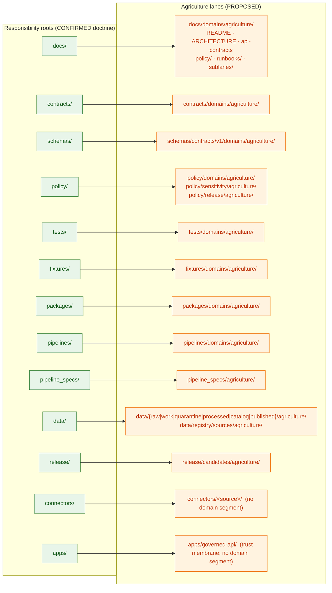
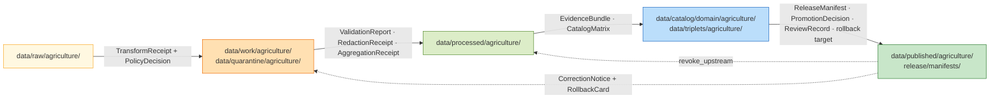

<!-- [KFM_META_BLOCK_V2]
doc_id: kfm://doc/domains/agriculture/canonical-paths
title: Agriculture — Canonical Paths
type: standard
subtype: domain-canonical-paths
version: v2 (draft)
status: draft
owners: TODO — Docs steward · Agriculture domain steward · Directory Rules WG
created: 2026-05-15
updated: 2026-05-26
policy_label: public
contract_version: "3.0.0"
related:
  - docs/doctrine/ai-build-operating-contract.md
  - docs/doctrine/directory-rules.md
  - docs/doctrine/trust-membrane.md
  - docs/doctrine/policy-aware.md
  - docs/doctrine/lifecycle-law.md
  - docs/doctrine/evidence-first.md
  - docs/doctrine/ai-as-assistant.md
  - docs/doctrine/corrections-are-first-class.md
  - docs/architecture/domain-placement-law.md
  - docs/domains/agriculture/README.md
  - docs/domains/agriculture/ARCHITECTURE.md
  - docs/domains/agriculture/api-contracts.md
  - docs/domains/agriculture/policy/README.md
  - docs/domains/agriculture/runbooks/README.md
  - docs/domains/agriculture/sublanes/README.md
  - docs/domains/agriculture/sublanes/cropland.md
  - schemas/contracts/v1/domains/agriculture/
  - policy/domains/agriculture/
  - data/published/layers/agriculture/
  - release/candidates/agriculture/
tags: [kfm, domain, agriculture, directory-rules, canonical-paths, doctrine-adjacent, contract-v3]
notes:
  - Realizes Directory Rules §12 (Domain Placement Law) for the Agriculture lane.
  - Pinned to CONTRACT_VERSION = "3.0.0".
  - Path-only crosswalk; nothing here decides meaning, shape, policy, or release outcomes.
  - All Agriculture-specific paths are PROPOSED until the mounted repo confirms them.
  - External standards are NOT cited; this doc is grounded in project doctrine only.
[/KFM_META_BLOCK_V2] -->

<a id="top"></a>

# Agriculture — Canonical Paths

> Where Agriculture-domain files belong inside the KFM responsibility-rooted monorepo, and where they must not be placed. A **path-only** crosswalk — meaning lives in [`ARCHITECTURE.md`](./ARCHITECTURE.md), wire shape lives in [`api-contracts.md`](./api-contracts.md), release outcomes live in [`policy/README.md`](./policy/README.md).

[](#sec-3-truth-posture)
[](../../doctrine/ai-build-operating-contract.md)
[](#sec-2-doctrinal-basis)
[](#sec-2-doctrinal-basis)
[-success)](#sec-4-domain-identity)
[](#sec-3-truth-posture)
[](#sec-19-last-updated)

| Status | Owners | Last updated | Pinned to |
|---|---|---|---|
| `draft` (PROPOSED paths) | TODO — Docs steward · Agriculture domain steward · Directory Rules WG | 2026-05-26 | `CONTRACT_VERSION = "3.0.0"` |

> [!IMPORTANT]
> **What this doc is — and what it is not.** This is the **placement** doctrine for Agriculture files: *where* a file goes once you know what it is. It does **not** decide:
> - what an Agriculture object *means* → [`ARCHITECTURE.md`](./ARCHITECTURE.md) §4 + `contracts/domains/agriculture/`,
> - the *machine shape* of an Agriculture envelope or DTO → [`api-contracts.md`](./api-contracts.md) §5 + `schemas/contracts/v1/domains/agriculture/`,
> - whether something can be *published* → [`policy/README.md`](./policy/README.md) + `policy/domains/agriculture/`,
> - what is *true* about a crop, field, suitability score, or aggregation → `data/proofs/...` (`EvidenceBundle`s referenced from canonical records).
> Reach for the right sibling doc when the question is not "where does this go?".

### Contents

1. [Purpose](#sec-1-purpose)
2. [Doctrinal basis](#sec-2-doctrinal-basis)
3. [Truth posture](#sec-3-truth-posture)
4. [Domain identity](#sec-4-domain-identity)
5. [The lane fan — Agriculture across responsibility roots](#sec-5-lane-fan)
6. [Canonical paths — full crosswalk](#sec-6-crosswalk)
7. [Lifecycle lanes under `data/`](#sec-7-lifecycle)
8. [Release lanes](#sec-8-release)
9. [Cross-lane and multi-domain files](#sec-9-cross-lane)
10. [Compatibility roots — agriculture-relevant guidance](#sec-10-compat)
11. [Anti-patterns for the Agriculture lane](#sec-11-anti-patterns)
12. [Pipeline shape (RAW → PUBLISHED)](#sec-12-pipeline)
13. [Sensitivity and deny-default lanes](#sec-13-sensitivity)
14. [Placement protocol — Agriculture cheatsheet](#sec-14-protocol)
15. [Open questions register](#sec-15-open-questions)
16. [Open verification backlog](#sec-16-backlog)
17. [Changelog](#sec-17-changelog)
18. [Definition of done](#sec-18-dod)
19. [Related docs](#sec-19-related)

---

<a id="sec-1-purpose"></a>

## 1. Purpose

This document is the **path-only crosswalk** for the Agriculture domain. It answers one question:

> *"Where in the KFM monorepo does this Agriculture-domain file belong?"*

It is a **CONFIRMED doctrine / PROPOSED realization** document: the Directory Rules pattern it applies is project doctrine, but every concrete Agriculture path below is `PROPOSED` until verified against the mounted repository. `[CONFIRMED — directory-rules.md §§2.5, 5, 12.]`

> [!IMPORTANT]
> A path being listed here is **not** evidence that the path exists. It is evidence of where it would belong if it did. Treat every Agriculture-specific path as `PROPOSED` until a mounted-repo inspection upgrades it. `[CONFIRMED — ai-build-operating-contract.md §13 repository preflight.]`

[Back to top](#top)

---

<a id="sec-2-doctrinal-basis"></a>

## 2. Doctrinal basis

This document MUST obey the doctrinal stack below, in order. A lower row cannot silently override a higher one; conflicts MUST be filed as drift entries against the higher row.

| Rule | Source | Status |
|---|---|---|
| Operating law for all AI-authored or AI-touched repo work (`CONTRACT_VERSION = "3.0.0"`). | [`ai-build-operating-contract.md`](../../doctrine/ai-build-operating-contract.md) §1 + §5 | **CONFIRMED doctrine** |
| Files are placed by **responsibility root**, not by topic name. | Directory Rules §§3, 4 | **CONFIRMED doctrine** |
| A domain MUST NOT become a root folder. The domain appears as a **segment** under each responsibility root. | Directory Rules §12 (Domain Placement Law) | **CONFIRMED doctrine** |
| The lifecycle invariant is `RAW → WORK / QUARANTINE → PROCESSED → CATALOG / TRIPLET → PUBLISHED`. Promotion is a **governed state transition**, not a file move. | [`lifecycle-law.md`](../../doctrine/lifecycle-law.md); Directory Rules §9.1; ENCY Appendix E | **CONFIRMED doctrine** |
| Public / UI / AI surfaces consume the trust membrane (`apps/governed-api/`), never canonical / internal stores. | [`trust-membrane.md`](../../doctrine/trust-membrane.md); Directory Rules §§7.1, 13.5 | **CONFIRMED doctrine** |
| Compatibility roots (e.g., `policies/`, `jsonschema/`, `ui/`, `web/`) MUST NOT evolve independently of their canonical homes. | Directory Rules §§8, 8.3 | **CONFIRMED doctrine** |
| Connectors emit to `data/raw/<domain>/...` or `data/quarantine/...`; pipelines promote. **Watcher-as-non-publisher.** | Directory Rules §§7.3, 19 | **CONFIRMED doctrine** |
| Finite policy outcomes; sensitive lanes default to `DENY`. | [`policy-aware.md`](../../doctrine/policy-aware.md) | **CONFIRMED doctrine** |
| `EvidenceBundle` outranks generated language; cite-or-abstain is the default truth posture. | [`evidence-first.md`](../../doctrine/evidence-first.md) | **CONFIRMED doctrine** |
| AI is interpretive, never root truth; `AIReceipt` mandatory at Focus Mode. | [`ai-as-assistant.md`](../../doctrine/ai-as-assistant.md) | **CONFIRMED doctrine** |
| Corrections are first-class; `CorrectionNotice` + `RollbackCard` lineage preserved. | [`corrections-are-first-class.md`](../../doctrine/corrections-are-first-class.md) | **CONFIRMED doctrine** |

### 2.1 RFC 2119 conformance

This document uses RFC 2119 / RFC 8174 language per directory-rules.md §2.2 and operating contract §5.1.1: **MUST / MUST NOT** non-negotiable; **SHOULD / SHOULD NOT** strong default; **MAY** permitted.

> [!NOTE]
> The Atlas v1.1 §24.13 crosswalk maps Agriculture to `schemas/contracts/v1/agriculture/` and `contracts/agriculture/` with the note *"Aggregation receipts central; private-join denial defaults."* That mapping is consistent with — and refined by — the lane fan in [§5](#sec-5-lane-fan) below. `[CONFIRMED — ENCY §24.13.]`

[Back to top](#top)

---

<a id="sec-3-truth-posture"></a>

## 3. Truth posture

This document uses the operating contract §8 truth labels. Apply the **narrowest** truthful label.

| Label | Meaning here |
|---|---|
| **CONFIRMED** | The Directory Rules pattern (§§3–13) is project doctrine and applies uniformly. |
| **INFERRED** | Where the Agriculture dossier and the encyclopedia agree on a lane (e.g., `policy/domains/agriculture/` for aggregate-only release rules), the lane is INFERRED from doctrine plus dossier; path strings remain PROPOSED. |
| **PROPOSED** | Every Agriculture-specific path below is a **proposed realization** of the Domain Placement Law for the `agriculture` segment. Implementation in the live repo is not asserted. |
| **UNKNOWN** | Whether each path **exists in the mounted repo** is UNKNOWN in this session. |
| **NEEDS VERIFICATION** | Specific source-family activations, layer-registry entries, and policy-bundle file names are NEEDS VERIFICATION; this doc names the lanes, not the contents. |
| **CONFLICTED** | Where two prior-pass docs disagree on a path or convention (e.g., `pipelines/domains/agriculture/` vs topical pipelines), the row is CONFLICTED until an ADR resolves it. |
| **LINEAGE** | Prior-pass paths kept here for traceability only; not current authority by themselves. |

> [!CAUTION]
> **Memory is not evidence.** If a path below does not appear in the mounted repository, the **doctrine** stands and the **path is PROPOSED**; you MUST NOT promote a PROPOSED path to fact by repeating it. `[CONFIRMED — operating contract §13.]`

[Back to top](#top)

---

<a id="sec-4-domain-identity"></a>

## 4. Domain identity

CONFIRMED doctrine / PROPOSED implementation. The Agriculture domain governs:

> Crop observations, field candidates, crop rotation, yield observations, irrigation context, conservation-practice context, soil-crop suitability, agricultural-economy observations, supply-chain nodes, drought and pest stress indicators, and **aggregation receipts** — with public-safe products and source-rights-respecting joins. `[CONFIRMED — DOM-AG; ENCY §7.7; Atlas §9.]`

The full architectural breakdown — object families, bounded context, source-role anti-collapse, sublane decomposition, cross-lane edges, sensitivity tiers, and governed AI behavior — lives in [`ARCHITECTURE.md`](./ARCHITECTURE.md). The wire-level envelope and DTO shapes live in [`api-contracts.md`](./api-contracts.md). This document touches those questions only insofar as they affect *placement*.

Explicitly **not owned** by Agriculture (relevant to placement choices):

| Other domain | What it owns | Agriculture's correct response (PROPOSED) |
|---|---|---|
| **Soil** | Canonical soil map-unit and horizon semantics. | Cite via `schemas/contracts/v1/domains/soil/`; never re-publish under `schemas/contracts/v1/domains/agriculture/`. |
| **Hydrology** | Water observations, flood context, NFHL regulatory zones. | Cite via `schemas/contracts/v1/domains/hydrology/`; preserve regulatory provenance. |
| **People / Land** | Ownership, title, parcels, living-person privacy. | Cite via `schemas/contracts/v1/domains/people/`; `policy/sensitivity/people/` cross-references; **person-parcel joins fail closed**. |
| **Atmosphere / Air** | Weather, heat, smoke observations. | Cite via `schemas/contracts/v1/domains/air/`. |
| **Habitat / Fauna / Flora** | Habitat patches, taxonomy, vegetation communities. | Cite for framing; Agriculture-owned `PestStressIndicator` consumes Fauna for taxonomic identity only. |

When a file straddles those boundaries, see [§9](#sec-9-cross-lane).

[Back to top](#top)

---

<a id="sec-5-lane-fan"></a>

## 5. The lane fan — Agriculture across responsibility roots

The Agriculture domain "fans out" across the canonical responsibility roots. The root stays **stable and boring**; the domain segment grows inside each lane. The diagram below is a doctrine-derived view of that fan; the responsibility roots are CONFIRMED doctrine, the Agriculture segments are PROPOSED.



> [!NOTE]
> The diagram intentionally omits `tools/`, `scripts/`, `infra/`, `runtime/`, `configs/`, `migrations/`, and `examples/`. Agriculture-domain files **MAY** appear in those roots, but only at lane-internal or cross-domain positions explained in [§9](#sec-9-cross-lane) — never as a root-level `agriculture/` folder.

[Back to top](#top)

---

<a id="sec-6-crosswalk"></a>

## 6. Canonical paths — full crosswalk

The table below is the **PROPOSED realization** of Directory Rules §12 for the `agriculture` segment. The pattern in the right column is CONFIRMED doctrine; the agriculture-specific paths shown are PROPOSED.

| Responsibility | Canonical Agriculture path (PROPOSED) | Owns / contains | Rule |
|---|---|---|---|
| Human-facing doctrine | `docs/domains/agriculture/` (incl. `README.md`, [`ARCHITECTURE.md`](./ARCHITECTURE.md), [`api-contracts.md`](./api-contracts.md), [`policy/README.md`](./policy/README.md), [`runbooks/README.md`](./runbooks/README.md), [`sublanes/README.md`](./sublanes/README.md), [`sublanes/cropland.md`](./sublanes/cropland.md)) | Domain README, architectural contract, wire-level contract, sibling aspect READMEs, dossier crosswalks, runbooks. | DIRRULES §§3, 12 |
| Object meaning (semantic Markdown) | `contracts/domains/agriculture/` | Definitions for `CropObservation`, `FieldCandidate`, `CropRotation`, `YieldObservation`, `IrrigationLink`, `ConservationPractice`, `SoilCropSuitability`, `AgriculturalEconomyObservation`, `SupplyChainNode`, `DroughtStressIndicator`, `PestStressIndicator`, `AggregationReceipt`. **No `.schema.json` files here.** | DIRRULES §§3, 6.3, 12; DOM-AG; ENCY §7.7 |
| Machine shape (JSON Schema) | `schemas/contracts/v1/domains/agriculture/` | JSON Schemas for the object families above; validator-facing shape. Pinned to `contract_version = "3.0.0"` where applicable. | DIRRULES §§5, 12, 13.1 (ADR-0001 canonical schema home) |
| Receipt schemas (cross-cutting; Agriculture is a primary citer) | `schemas/contracts/v1/receipts/` (PROPOSED home; ADR-S-03 pending) | `AggregationReceipt`, `RedactionReceipt`, `GENERATED_RECEIPT`, `RunReceipt`, `AIReceipt`. | DIRRULES §§5, 12; operating contract §34 + §47 |
| Policy bundles (Agriculture-specific) | `policy/domains/agriculture/` | Aggregate-only public release rules; farm/operator deny-default; private-join deny rules; rights/sensitivity bundles. | DIRRULES §§3, 6.5, 12 |
| Policy bundles (sensitivity-specific) | `policy/sensitivity/agriculture/` | Per-sublane sensitivity decisions (cropland, soil-moisture, vegetation-index, suitability, stress). | DIRRULES §§6.5, 12 |
| Policy bundles (release-specific) | `policy/release/agriculture/` | Per-audience-class release rules (`public/`, `partner/`, `steward/`, `internal/`, `denied/`). | DIRRULES §§6.5, 12 |
| Enforceability proof | `tests/domains/agriculture/` | Contract, schema, policy, validator, pipeline, and runtime-proof tests for Agriculture. | DIRRULES §6.6 |
| Test inputs | `fixtures/domains/agriculture/` *or* `tests/fixtures/domains/agriculture/` | Golden, valid, invalid Agriculture fixtures. **One authority only**, per §6.6 README rule. | DIRRULES §6.6 |
| Domain library | `packages/domains/agriculture/` | Reusable Agriculture code (e.g., aggregation-receipt builders, suitability joiners). Reusable only — one-shot logic stays in `pipelines/` or `tools/`. | DIRRULES §7.2 |
| Executable pipelines | `pipelines/domains/agriculture/` *or* topical paths under `pipelines/{ingest,normalize,validate,catalog,triplets,publish,rollback}/` with `<run>/<domain>=agriculture` | Pipeline steps; promotion machinery for Agriculture-specific stages. | DIRRULES §7.4 |
| Declarative pipeline configuration | `pipeline_specs/agriculture/` | What runs (specs), not how. | DIRRULES §7.4 |
| Lifecycle data | `data/raw/agriculture/`, `data/work/agriculture/`, `data/quarantine/agriculture/`, `data/processed/agriculture/`, `data/catalog/domain/agriculture/`, `data/published/layers/agriculture/` | One entry per lifecycle phase; promotion is a governed state transition. | DIRRULES §9.1 |
| Source registry (per-source) | `data/registry/sources/agriculture/` *or* `data/registry/agriculture/` | `SourceDescriptor` entries for NASS, NRCS/SSURGO, Mesonet, SMAP, HLS-VI, USCRN, SCAN, CDL, NLCD, LANDFIRE, GAP, PLANTS, FSA CLU — each source's role + rights/sensitivity. | DIRRULES §9.1 |
| Receipts (lifecycle-bound) | `data/receipts/{ingest,validation,pipeline,ai,release}/...` with run-id paths citing the Agriculture domain | `RunReceipt`, `TransformReceipt`, `AggregationReceipt`, `RedactionReceipt`, `ValidationReport`, `AIReceipt`, `GENERATED_RECEIPT.json`. **NOT** under `artifacts/`. | DIRRULES §§9.1, 13.2; operating contract §34 |
| Proofs (evidence) | `data/proofs/evidence_bundle/...`, `data/proofs/proof_pack/...` | `EvidenceBundle`s and proof packs referenced by Agriculture claims. | DIRRULES §§9.1, 19 |
| Release decisions | `release/candidates/agriculture/`, `release/manifests/...`, `release/correction_notices/...`, `release/rollback_cards/...` | Domain-specific release **candidates** live under `release/candidates/agriculture/`; the **decision artifacts** live in shared release sub-trees. | DIRRULES §§9, 19 |
| Source-specific fetch / admit | `connectors/<source>/` — e.g., `connectors/nrcs/`, `connectors/usda-nass/`, `connectors/kansas-mesonet/`, `connectors/nasa-earthdata/` (all PROPOSED) | Connectors are **source-scoped**, not domain-scoped. Output goes to `data/raw/agriculture/<source_id>/<run_id>/`. | DIRRULES §7.3 |
| Trust-membrane surface (cross-domain) | `apps/governed-api/` (no agriculture segment) | `AgricultureDecisionEnvelope`, `LayerManifest` resolver, Evidence Drawer payload, Focus Mode answer — all exposed here. | DIRRULES §7.1; DOM-AG §J; `api-contracts.md` §3 |
| Domain-specific runbooks | `docs/runbooks/agriculture/` (Pattern A) *or* `docs/runbooks/agriculture_<topic>.md` (Pattern B) | Source-refresh, correction-cascade, rollback, ingest-failure, and quarantine-disposition procedures. Pattern resolution pending Directory Rules OPEN-DR-02. | DIRRULES §6.1.1 |

<details>
<summary><strong>Reference: full domain-segment template (CONFIRMED pattern, agriculture substituted)</strong></summary>

```text
docs/domains/agriculture/
  README.md
  ARCHITECTURE.md
  api-contracts.md
  CANONICAL_PATHS.md             # this file
  policy/README.md
  runbooks/README.md
  sublanes/README.md
  sublanes/cropland.md
contracts/domains/agriculture/   # semantic Markdown only — no .schema.json
schemas/contracts/v1/domains/agriculture/
schemas/contracts/v1/receipts/   # AggregationReceipt, GENERATED_RECEIPT, etc.
policy/domains/agriculture/
policy/sensitivity/agriculture/
policy/release/agriculture/
tests/domains/agriculture/
fixtures/domains/agriculture/    # OR tests/fixtures/domains/agriculture/
packages/domains/agriculture/
pipelines/domains/agriculture/   # OR topical pipelines with agriculture lanes
pipeline_specs/agriculture/
data/raw/agriculture/
data/work/agriculture/
data/quarantine/agriculture/
data/processed/agriculture/
data/catalog/domain/agriculture/
data/triplets/agriculture/
data/published/agriculture/
data/published/layers/agriculture/
data/registry/sources/agriculture/   # OR data/registry/agriculture/
release/candidates/agriculture/
docs/runbooks/agriculture/           # subfolder pattern (PROPOSED canonical)
```

Source: Directory Rules §12, with `<domain>` replaced by `agriculture`. The pattern is CONFIRMED doctrine; the specific listings above are PROPOSED until repo verification.

</details>

[Back to top](#top)

---

<a id="sec-7-lifecycle"></a>

## 7. Lifecycle lanes under `data/`

CONFIRMED doctrine: the lifecycle invariant is `RAW → WORK / QUARANTINE → PROCESSED → CATALOG / TRIPLET → PUBLISHED`, with receipts, proofs, registry, and rollback emitted *alongside* the lifecycle directories. `[CONFIRMED — DIRRULES §9.1; lifecycle-law.md.]`

| Lifecycle phase | Agriculture path (PROPOSED) | What admissibly lives here | What MUST NOT live here |
|---|---|---|---|
| **RAW** | `data/raw/agriculture/<source_id>/<run_id>/` | Immutable connector output with `SourceDescriptor`, hashes, ingest receipt. NASS / QuickStats payload snapshots; SSURGO / Soil Data Access extracts; Kansas Mesonet pulls; SMAP / HLS-VI fetched products; CDL classmap-version pinned at admission. | Normalized objects; published layers; AI-generated content; any operator-private field-level join. |
| **WORK** | `data/work/agriculture/<run_id>/` | Transformation candidates; intermediate normalized features awaiting validation; aggregation drafts. | Anything claimed as "released" or "canonical"; sensitive joins without a `RedactionReceipt`. |
| **QUARANTINE** | `data/quarantine/agriculture/<reason>/<run_id>/` | Material with rights, sensitivity, validation, source-role, evidence, temporal, or policy defects. Each path carries a structured `reason`. | Silent re-admission to WORK without a recorded transition and receipt. |
| **PROCESSED** | `data/processed/agriculture/<dataset_id>/<version>/` | Validated normalized objects (`CropObservation`, `FieldCandidate`, `YieldObservation`, `SoilCropSuitability`, `AggregationReceipt`, etc.) that have passed transformation checks. | A public surface; tiles or API payloads (those are PUBLISHED). |
| **CATALOG / TRIPLET** | `data/catalog/domain/agriculture/`, `data/triplets/agriculture/` | Catalog records, `EvidenceBundle`s, graph / triplet projections, release candidates. | Anything not citing an `EvidenceRef`. |
| **PUBLISHED** | `data/published/agriculture/`, `data/published/layers/agriculture/`, `data/published/api_payloads/...`, `data/published/pmtiles/...`, `data/published/geoparquet/...` | Released, policy-allowed, reviewable, rollback-capable Agriculture artifacts referenced by a `ReleaseManifest`. | A connector or watcher write; a route that bypasses `apps/governed-api/`. |

> [!WARNING]
> A pipeline writing **directly** from `data/raw/agriculture/` to `data/published/layers/agriculture/` is a **lifecycle skip** — a §13.5 anti-pattern — regardless of how clean the bytes look. Every phase MUST run; promotion is a governed state transition.

[Back to top](#top)

---

<a id="sec-8-release"></a>

## 8. Release lanes

The Agriculture lane uses the shared release tree; the **candidates** are domain-segmented, the **decisions** are not.

| Object | Canonical home (PROPOSED) | Notes |
|---|---|---|
| `ReleaseCandidate` (Agriculture) | `release/candidates/agriculture/` | Pre-release artifact bundles awaiting review / decision. |
| `ReleaseManifest` | `release/manifests/` *(no domain segment)* | The release decision artifact. Layer-internal manifests MAY live within `data/published/layers/agriculture/<layer>/` per [§15 / OQ-AG-CP-10](#sec-15-open-questions). |
| `PromotionDecision` | `release/promotion_decisions/` | The governed state-transition record into PUBLISHED. |
| `CorrectionNotice` | `release/correction_notices/` | Public notice of a corrected Agriculture claim. |
| `RollbackCard` | `release/rollback_cards/` | Rollback decision artifact. |
| `WithdrawalNotice` | `release/withdrawal_notices/` | Notice that a published artifact has been withdrawn. |
| Release signatures | `release/signatures/` | DSSE / Sigstore / cosign signatures on release artifacts. |
| Alias-revert receipts (data plane) | `data/rollback/agriculture/<release_id>/` | Data-plane revert receipts; OPEN per Directory Rules §18. |

> [!IMPORTANT]
> Release manifests **MUST NOT** be placed in `artifacts/`. That is anti-pattern §13.2 / §13.5. The `artifacts/` root, if present, is build / docs / qa / temporary only. Trust-bearing receipts live under `data/receipts/` and release decisions live under `release/`.

[Back to top](#top)

---

<a id="sec-9-cross-lane"></a>

## 9. Cross-lane and multi-domain files

CONFIRMED doctrine: a cross-domain file lives under the **lowest common responsibility root** that owns its responsibility, **without** a domain segment. `[CONFIRMED — DIRRULES §12.]`

| Scenario (PROPOSED) | Correct placement | Wrong placement |
|---|---|---|
| Agriculture × Soil **MUKEY join** validator | `tools/validators/joins/agriculture-soil/` (cross-domain segment of `tools/`) | `tools/validators/domains/agriculture/soil-join/` |
| Agriculture × Hydrology **irrigation / water-use context** schema | `schemas/contracts/v1/joins/agriculture-hydrology/` or topical cross-domain schema dir | `schemas/contracts/v1/domains/agriculture/hydrology-ext/` |
| Agriculture × Atmosphere/Air **vegetation-stress** doctrine note | `docs/architecture/cross-domain/vegetation-stress.md` | `docs/domains/agriculture/atmosphere-stress.md` |
| Agriculture × People/Land **farm / operator privacy** policy | `policy/sensitivity/people/` *and* `policy/domains/agriculture/` (deny-default reference) | A single domain folder claiming joint authority |
| Agriculture × Frontier Matrix **aggregate-to-matrix-cell** cascade | `policy/matrix/` (cross-domain) referencing `policy/domains/agriculture/` | `policy/domains/agriculture/matrix-cascade/` |
| **`AggregationReceipt`** definition (an Agriculture-owned object family that is also referenced by Soil / Hydrology contexts) | `contracts/domains/agriculture/aggregation-receipt.md` + schema in `schemas/contracts/v1/receipts/aggregation_receipt.schema.json` *(ADR-S-03)* | A cross-domain meaning location; Agriculture owns the family per DOM-AG §B. |

> [!TIP]
> When in doubt, ask: *"Whose responsibility is this file primarily fulfilling?"* If exactly one domain owns the responsibility, the domain segment applies. If multiple share it, no domain segment — use the cross-domain segment of the responsibility root.

[Back to top](#top)

---

<a id="sec-10-compat"></a>

## 10. Compatibility roots — agriculture-relevant guidance

Compatibility roots (if present) MUST declare their class (`legacy`, `mirror`, `deprecated`, `external-export`, `transitional`) per Directory Rules §8.

| Compatibility root | Agriculture implication (PROPOSED) | Canonical home |
|---|---|---|
| `policies/` | Any agriculture-named files here are mirrors of `policy/domains/agriculture/` or legacy. | `policy/domains/agriculture/` |
| `jsonschema/` | Any agriculture schemas here are mirrors of `schemas/contracts/v1/domains/agriculture/`. | `schemas/contracts/v1/domains/agriculture/` |
| `ui/`, `web/`, `styles/`, `viewer_templates/` | Agriculture UI fragments here are transitional; canonical UI lives in `apps/explorer-web/` (deployable shell) + `packages/ui/` + `packages/maplibre-runtime/`. | `apps/explorer-web/`, `packages/ui/`, `packages/maplibre-runtime/` |
| `artifacts/` | **No** Agriculture release manifest, receipt, `EvidenceBundle`, or proof belongs here. | `data/receipts/`, `data/proofs/`, `release/` |

> [!CAUTION]
> Compatibility roots **MUST NOT evolve independently** of canonical homes (§8.3). New Agriculture rules, fields, and policy updates land in canonical first; mirrors regenerate or migrate.

[Back to top](#top)

---

<a id="sec-11-anti-patterns"></a>

## 11. Anti-patterns for the Agriculture lane

Each of the patterns below has appeared in KFM-class repositories. Watch for them.

| Anti-pattern | Symptom | Fix (PROPOSED) |
|---|---|---|
| **Agriculture as root folder** | `agriculture/` at repo root with its own `data/`, `schemas/`, `policy/`, `docs/`. | Migrate piece-by-piece into the lane fan in [§5](#sec-5-lane-fan). Preserve `docs/domains/agriculture/README.md` as the domain README. `[DIRRULES §13.4]` |
| **Parallel schema homes** | Both `contracts/domains/agriculture/<x>.schema.json` and `schemas/contracts/v1/domains/agriculture/<x>.schema.json` exist and diverge. | `schemas/contracts/v1/...` is canonical per ADR-0001; `contracts/` retains semantic Markdown only. `[DIRRULES §13.1]` |
| **Trust content in `artifacts/`** | Agriculture release manifests or `EvidenceBundle`s under `artifacts/`. | Migrate to `release/manifests/` and `data/proofs/`. `[DIRRULES §13.5]` |
| **Public route reads canonical store** | `apps/explorer-web/` reading `data/processed/agriculture/` or `data/catalog/domain/agriculture/` directly. | Route reads MUST go through `apps/governed-api/`. `[DIRRULES §13.5; trust-membrane.md.]` |
| **Connector publishes** | A NASS / SSURGO / Mesonet connector writes to `data/processed/agriculture/` or `data/published/layers/agriculture/`. | Connectors emit to `data/raw/agriculture/...` or `data/quarantine/agriculture/...`; pipelines promote. `[DIRRULES §§7.3, 13.5]` |
| **Watcher publishes** | A worker writes to `data/catalog/domain/agriculture/` or `data/published/layers/agriculture/`. | Watchers emit receipts and candidate decisions only — **watcher-as-non-publisher**. `[DIRRULES §§13.5, 19]` |
| **Lifecycle skip** | A pipeline writes directly from `data/raw/agriculture/...` to `data/published/layers/agriculture/...`. | Every phase MUST run; promotion is a governed state transition. `[DIRRULES §13.5]` |
| **Farm / operator field-level join in a public lane** | Field-level joins of NASS QuickStats with operator identity surfacing in `data/published/layers/agriculture/`. | Quarantine with reason; refer to `policy/domains/agriculture/` and `policy/sensitivity/people/`; aggregate or redact before publication. `[DOM-AG §I; ENCY §7.7]` |
| **Aggregation-only fail-open** | Aggregate satellite or stats products silently treated as field-level truth. | `AggregationReceipt` MUST accompany the claim; `policy/domains/agriculture/` denies field-level claims drawn from aggregate-only sources. `[DOM-AG §K; Atlas §24.13.]` |
| **Missing `contract_version` pin** *(v3 addition)* | An Agriculture `RuntimeResponseEnvelope` or `GENERATED_RECEIPT.json` ships without `contract_version: "3.0.0"`. | Pin all v3-era envelopes and receipts; CI gate rejects unpinned artifacts. `[Operating contract §37.]` |
| **AI-authored merge without `GENERATED_RECEIPT`** *(v3 addition)* | An AI-authored patch lands without a paired `GENERATED_RECEIPT.json`. | Operating contract §34 requires `GENERATED_RECEIPT.json` for every AI-authored merge. `[Operating contract §34; §47.]` |
| **Source-role upgrade via promotion** *(v3 emphasis)* | A `modeled` CDL product promoted into a `data/published/...` lane labeled `observed`. | Source role is fixed at admission; never upgraded by promotion. `[Atlas §24.1; §24.9.3.]` |
| **Admin-shortcut as normal public path** *(v3 emphasis)* | An internal Agriculture endpoint exposed without audience-class enforcement. | Admin shortcuts MUST be justified, constrained, audited, kept out of the normal public path. `[Operating contract §10; trust-membrane.md §7.]` |

[Back to top](#top)

---

<a id="sec-12-pipeline"></a>

## 12. Pipeline shape (RAW → PUBLISHED)

CONFIRMED doctrine / PROPOSED lane application: Agriculture follows the universal lifecycle. The table below maps each gate to the path lane that hosts its artifacts. `[CONFIRMED — DOM-AG §H; DIRRULES §9.1; lifecycle-law.md.]`



| Gate | Pre-condition | Required artifacts (PROPOSED) | Failure-closed outcome |
|---|---|---|---|
| Admission (→ RAW) | Source identity, rights, source-role intent established. | `SourceDescriptor` (role, authority, rights, sensitivity, cadence); payload hash; CDL `classmap_version` pinned. | Candidate awaiting steward. |
| Normalization (RAW → WORK / QUARANTINE) | Schema, geometry, time, identity, evidence, rights, policy rules runnable. | `TransformReceipt`; working `ValidationReport`; `PolicyDecision`; QUARANTINE for failures. | Quarantine with reason. |
| Validation (WORK → PROCESSED) | Validators deterministic; required receipts present. | `ValidationReport` pass; `RedactionReceipt` if sensitivity applies; `AggregationReceipt` if applies. | Stay in WORK; structured FAIL. |
| Catalog closure (PROCESSED → CATALOG / TRIPLET) | `EvidenceRef`s resolve; catalog matrix and digests close. | `CatalogMatrix` entry; `EvidenceBundle`; graph / triplet projections. | HOLD at PROCESSED. |
| Release (CATALOG → PUBLISHED) | Review state where required; release authority distinct from author when materiality applies. | `ReleaseManifest`; `PromotionDecision`; rollback target; correction path; `ReviewRecord` if required; audience class enforced. | HOLD at CATALOG. |
| Correction | Detected error or new evidence; downstream derivatives identified. | `CorrectionNotice`; `RollbackCard` if reverting; downstream `EvidenceRef` re-evaluation triggered. | No silent overwrite of published surfaces. |
| AI-authored merge *(v3)* | The change is AI-authored. | `GENERATED_RECEIPT.json` pinned to `contract_version = "3.0.0"`, with `truth_labels[]`, `validation_gates[]`, `human_review.state ∈ { approved, override_record_attached }`. | Merge blocked; receipt rejected at CI. |

[Back to top](#top)

---

<a id="sec-13-sensitivity"></a>

## 13. Sensitivity and deny-default lanes

Agriculture has a particularly sharp **aggregate-public / field-private** boundary. The lanes below codify that.

> [!CAUTION]
> **Sensitive-domain handling routes through operating contract §23.2.** Agriculture touches operator, parcel, field-level, private-yield, pesticide-record, and FSA CLU lanes — all sensitive-domain by the contract's matrix. Any artifact that would expose those fields MUST be supported by the §23.2 disposition (`DENY` public · `GENERALIZE` before publication · `REDACT` when needed · `QUARANTINE` uncertain source material · `REQUIRE` steward review · `REQUIRE` transform receipt · `ABSTAIN` when support is inadequate). `[CONFIRMED — operating contract §23; trust-membrane.md §7.]`

> [!WARNING]
> Aggregate statistics and satellite products **MUST NOT become field/operator truth.** Farm/operator private data, proprietary yield, pesticide records, and private-sensitive joins **fail closed**. `[CONFIRMED — DOM-AG §I; ENCY §7.7.]`

| Sensitivity surface | Lane (PROPOSED) | Posture |
|---|---|---|
| Public-safe aggregate layers (county / HUC / grid) | `data/published/layers/agriculture/aggregate/...` | `ANSWER` (with `AggregationReceipt`). |
| Field-level NASS-derived claims | `data/quarantine/agriculture/field-level-claim/...` *and* `policy/domains/agriculture/deny-field-level.rego` (PROPOSED filename) | `DENY` by policy; refer up for review. |
| Operator-identifying joins | `data/quarantine/agriculture/operator-join/...` + `policy/sensitivity/people/` cross-reference | `DENY` by policy; redaction REQUIRED before any release. |
| Proprietary yield / pesticide records | `data/quarantine/agriculture/proprietary/...` | `DENY` unless rights and review explicit. |
| FSA CLU joins | `data/quarantine/agriculture/clu-join/...` | `DENY` by policy; restricted source terms. |
| Drought / pest stress indicators (aggregate) | `data/published/layers/agriculture/stress/...` | `ANSWER` with non-emergency disclaimer; **KFM is not an alert authority**. |
| Conservation-practice context (operator-identifiable) | `data/quarantine/agriculture/conservation-practice/...` | `DENY` until generalized; framing only, never instruction. |

> [!NOTE]
> The sensitivity defaults above are doctrine-derived and PROPOSED as path-level expressions. Actual rule filenames, tier assignments, and review thresholds are `NEEDS VERIFICATION` and SHOULD be confirmed in `policy/domains/agriculture/` and the per-source registry. The full tier matrix lives at [`ARCHITECTURE.md`](./ARCHITECTURE.md) §11.

[Back to top](#top)

---

<a id="sec-14-protocol"></a>

## 14. Placement protocol — Agriculture cheatsheet

When you are about to add or move an Agriculture-domain file, walk this five-step protocol from Directory Rules §4.

1. **Identify the responsibility.** Pick exactly one of: `docs` · `contracts` · `schemas` · `policy` · `tests` · `fixtures` · `tools` · `scripts` · `apps` · `packages` · `connectors` · `pipelines` · `pipeline_specs` · `data` · `release` · `runtime` · `infra` · `configs` · `migrations` · `examples`.
2. **Identify the lifecycle phase (`data/` only).** `raw` · `work` · `quarantine` · `processed` · `catalog` · `triplets` · `published` · `receipts` · `proofs` · `registry` · `rollback`.
3. **Identify the domain.** If Agriculture-specific, the path includes the `agriculture` segment **inside** the responsibility root — never as a root. If cross-domain, no domain segment — see [§9](#sec-9-cross-lane).
4. **Confirm authority.** The owning root MUST exist; if creating it, ship a per-root `README.md` meeting Directory Rules §15 in the same change.
5. **Cite the rule** in the PR description (e.g., *"DIRRULES §12 + this CANONICAL_PATHS §6 row 4"*). If no rule justifies the path, mark it `PROPOSED` or `NEEDS VERIFICATION` and open a drift entry.
6. *(v3 addition)* **Pin and receipt.** If the change is AI-authored, attach a `GENERATED_RECEIPT.json` pinned to `contract_version = "3.0.0"` per operating contract §34. If the change touches a schema or envelope, pin `contract_version` there too.

> [!TIP]
> The reviewer's one-line check (DIRRULES §4 Step 5):
> *"Does the path encode the right responsibility, the right lifecycle phase (if data), and the right domain segment — and does this PR cite a rule for it?"*

[Back to top](#top)

---

<a id="sec-15-open-questions"></a>

## 15. Open questions register

| ID | Question | Owner role | Resolution path |
|---|---|---|---|
| **OQ-AG-CP-01** | Whether `pipelines/domains/agriculture/` or topical `pipelines/{ingest,...}/agriculture/` is the chosen layout in the current repo. | Build owner + Architecture steward | Mounted-repo inspection of `pipelines/`. |
| **OQ-AG-CP-02** | Whether `fixtures/` (root) or `tests/fixtures/` is the authority for Agriculture fixtures. | QA steward | Mounted-repo inspection; per-root README declaration. `[DIRRULES §6.6]` |
| **OQ-AG-CP-03** | Whether `data/registry/sources/agriculture/` or `data/registry/agriculture/` is the per-source registry path for Agriculture. | Source steward | Mounted-repo inspection of `data/registry/`. |
| **OQ-AG-CP-04** | Whether `triplets/` (plural) or `triplet/` (singular) is the chosen `data/` sibling. This doc uses plural. | Architecture steward | One-line ADR to freeze it. `[DIRRULES §18]` |
| **OQ-AG-CP-05** | Whether `data/rollback/agriculture/` (data plane) and `release/rollback_cards/` (release plane) co-exist or merge. | Release steward | ADR. `[DIRRULES §18]` |
| **OQ-AG-CP-06** | Whether `apps/api/` and `apps/governed-api/` co-exist for Agriculture endpoints. | API owner | Mounted-repo inspection + ADR. `[DIRRULES §18]` |
| **OQ-AG-CP-07** | NASS / QuickStats / Crop Progress activation, source-role assignments, and policy-bundle filenames in `policy/domains/agriculture/`. | Source steward + Policy steward | Mounted-repo files, registry entries, tests, emitted artifacts. `[DOM-AG §N; ENCY]` |
| **OQ-AG-CP-08** | Kansas Mesonet, HLS-VI, SMAP, USCRN, SCAN product term and rights validation. | Source steward + Rights-holder rep | Source registry entries; rights review records. `[DOM-AG §N]` |
| **OQ-AG-CP-09** | Agriculture API route name(s), DTO names, and Layer Manifest registry entries. | API owner | Mounted-repo inspection of `apps/governed-api/` and `data/registry/layers/`. `[DOM-AG §J]` Resolves alongside [`api-contracts.md`](./api-contracts.md) OQ-AG-API-01 / -05. |
| **OQ-AG-CP-10** | Whether a layer-internal manifest convention under `data/published/layers/agriculture/<layer>/manifest.*` exists in addition to `release/manifests/`. | Release steward | ADR or mounted-repo inspection. `[DIRRULES §18]` |
| **OQ-AG-CP-11** *(v2)* | Whether `docs/runbooks/agriculture/` (subfolder, Pattern A) or `docs/runbooks/agriculture_<topic>.md` (flat, Pattern B) is canonical. | Docs steward | Directory Rules OPEN-DR-02; ADR. |
| **OQ-AG-CP-12** *(v2)* | Whether `schemas/contracts/v1/receipts/` is the canonical home for `AggregationReceipt` and `GENERATED_RECEIPT.json`, or whether they live under per-class subdirs. | Contract / schema steward | ADR-S-03. Resolves alongside [`api-contracts.md`](./api-contracts.md) OQ-AG-API-07 / -15. |
| **OQ-AG-CP-13** *(v2)* | Whether `policy/sensitivity/agriculture/` + `policy/release/agriculture/` are siblings of `policy/domains/agriculture/`, or substructures within it. | Policy steward | ADR-AG-POL-01 (PROPOSED). |

[Back to top](#top)

---

<a id="sec-16-backlog"></a>

## 16. Open verification backlog

Items below are verification work this document cannot complete without a mounted repository. Each item MUST be tracked in `docs/registers/VERIFICATION_BACKLOG.md` (PROPOSED) until closed.

<details>
<summary><strong>Verification items (13 rows) — click to expand</strong></summary>

| # | Item | What to check | Owner | Settles which OQ |
|---:|---|---|---|---|
| 1 | `docs/domains/agriculture/` siblings | All seven sibling docs present and cross-referencing (`README.md`, `ARCHITECTURE.md`, `api-contracts.md`, `CANONICAL_PATHS.md`, `policy/README.md`, `runbooks/README.md`, `sublanes/README.md`). | Docs steward | — |
| 2 | `pipelines/agriculture/` layout | Confirm Pattern A (`pipelines/domains/agriculture/`) vs Pattern B (topical with agriculture lanes). | Build owner | OQ-AG-CP-01 |
| 3 | `fixtures/` authority | Confirm `fixtures/` or `tests/fixtures/` is canonical for Agriculture. | QA steward | OQ-AG-CP-02 |
| 4 | `data/registry/.../agriculture/` | Confirm sources path. | Source steward | OQ-AG-CP-03 |
| 5 | `data/triplets/` vs `data/triplet/` | Confirm plural. | Architecture steward | OQ-AG-CP-04 |
| 6 | `data/rollback/` vs `release/rollback_cards/` | Confirm co-existence vs merge. | Release steward | OQ-AG-CP-05 |
| 7 | `apps/api/` vs `apps/governed-api/` | Confirm boundary. | API owner | OQ-AG-CP-06 |
| 8 | NASS / QuickStats / Crop Progress activation | `SourceActivationDecision` status. | Source steward | OQ-AG-CP-07 |
| 9 | Kansas Mesonet / HLS / SMAP / USCRN / SCAN rights | Source registry records. | Source steward + Rights rep | OQ-AG-CP-08 |
| 10 | Agriculture API route names + Layer Manifest | Mounted-repo inspection. | API owner | OQ-AG-CP-09 |
| 11 | Layer-internal manifest convention | ADR or inspection. | Release steward | OQ-AG-CP-10 |
| 12 | `docs/runbooks/agriculture/` pattern | Directory Rules OPEN-DR-02. | Docs steward | OQ-AG-CP-11 |
| 13 | `schemas/contracts/v1/receipts/` home | ADR-S-03 status. | Contract / schema steward | OQ-AG-CP-12 |
| 14 | `policy/{sensitivity,release}/agriculture/` vs subdir | ADR-AG-POL-01 status. | Policy steward | OQ-AG-CP-13 |

</details>

`[All items open; resolution path varies per row. Drift register entries appropriate when mounted-repo evidence contradicts a PROPOSED path here.]`

[Back to top](#top)

---

<a id="sec-17-changelog"></a>

## 17. Changelog

> Per operating contract [§37](../../doctrine/ai-build-operating-contract.md): `MINOR` rows clarify or extend without breaking; `MAJOR` rows change operating law and require receipt re-issuance.

### 17.1 v1 → v2 (current revision)

| § | Change | Type (§37) | Reason |
|---|---|---|---|
| Meta block | Added `subtype: domain-canonical-paths`; added `contract_version: "3.0.0"`; refreshed `updated:` to 2026-05-26; expanded `related[]` to include the v3 doctrine stack (operating contract, trust-membrane, policy-aware, lifecycle-law, evidence-first, ai-as-assistant, corrections-are-first-class) and the sibling docs (`ARCHITECTURE.md`, `api-contracts.md`, `policy/README.md`, `runbooks/README.md`, `sublanes/README.md`, `sublanes/cropland.md`); expanded `tags[]`. | clarification | Operating contract §1 + §5 conformance; sibling-doc cross-reference. |
| Title / badge row | Added `Contract: v3.0.0` badge; updated `Last updated` badge to 2026-05-26; added `Pinned to` column in the meta table. | clarification | Contract pinning visibility. |
| Top IMPORTANT callout | Rewrote to make the four "this doc is not" responsibilities explicit (meaning · shape · publication · truth) and route each to the correct sibling doc. | clarification | Disambiguate this doc's scope against the new `ARCHITECTURE.md` and `api-contracts.md`. |
| §2 Doctrinal basis | Expanded from 6 to 11 rows: added operating-contract row, trust-membrane row, policy-aware row, evidence-first row, ai-as-assistant row, corrections-are-first-class row. Added §2.1 RFC 2119 conformance. | clarification | v3 doctrine stack named explicitly. |
| §3 Truth posture | Added **CONFLICTED** and **LINEAGE** rows; reordered to put INFERRED above PROPOSED per operating contract §8. | clarification | Operating contract §8 label set. |
| §4 Domain identity | Cross-referenced `ARCHITECTURE.md` for the full breakdown; left the placement-relevant subset here. Expanded the "not owned" table to include Habitat / Fauna / Flora with their Agriculture-relation notes. | clarification | Avoid duplicating the architectural contract; tighten cross-domain crosswalk. |
| §5 Lane fan | Added `apps/` responsibility root and `apps/governed-api/` lane to the diagram. Expanded the `docs/domains/agriculture/` node to list the seven sibling docs. Expanded the `policy/` node to show the three policy lanes (`domains/`, `sensitivity/`, `release/`). | clarification | Reflect sibling docs created this session; reflect operating contract §23 sensitivity routing. |
| §6 Crosswalk | Added rows for **receipt schemas** (`schemas/contracts/v1/receipts/`), **policy/sensitivity/agriculture/**, **policy/release/agriculture/**, and **docs/runbooks/agriculture/**. Tightened the "Object meaning" row to explicitly forbid `.schema.json` under `contracts/`. Tightened the "Trust-membrane surface" row to cross-reference `api-contracts.md` §3. Added a `GENERATED_RECEIPT.json` mention to the receipts row. Updated the `<details>` template tree to include the seven sibling docs and the three policy lanes. | new + clarification | Sibling docs created this session; v3 operating contract §34 + §47 conformance. |
| §7 Lifecycle lanes | Added CDL `classmap_version` admission note to the RAW row. Added `data/triplets/agriculture/` to the CATALOG row. | clarification | Atlas card KFM-P25-PROG-0005 classmap-version preservation. |
| §8 Release lanes | Expanded from 5 to 8 rows: added `PromotionDecision`, `WithdrawalNotice`, and `release/signatures/`. | clarification | Operating contract §47 companion artifacts. |
| §9 Cross-lane | Added Agriculture × Frontier Matrix row. Pointed `AggregationReceipt` schema to `schemas/contracts/v1/receipts/aggregation_receipt.schema.json` per ADR-S-03. | new | Atlas §24.4.7 cross-lane edges; ADR-S-03. |
| §10 Compatibility roots | Updated `packages/maplibre/` reference to `packages/maplibre-runtime/` per Directory Rules v1.3. | housekeeping | Directory Rules v1.3. |
| §11 Anti-patterns | Added four v3-era rows: **missing `contract_version` pin**, **AI-authored merge without `GENERATED_RECEIPT`**, **source-role upgrade via promotion**, **admin-shortcut as normal public path**. | new | Operating contract §34, §37; Atlas §24.1, §24.9.3. |
| §12 Pipeline shape | Added back-edges from PUB to WQ (`CorrectionNotice + RollbackCard`) and from PUB to PROC (`revoke_upstream`). Added classmap-version note to admission. Added `PromotionDecision` to release gate. Added **AI-authored merge** gate row requiring `GENERATED_RECEIPT.json`. | new | trust-membrane.md §8 correction cascade; operating contract §34 AI-authored merge discipline. |
| §13 Sensitivity | Added `[!CAUTION]` callout routing through operating contract §23.2 sensitive-domain matrix. Added FSA CLU joins row and Conservation-practice (operator-identifiable) row. Cross-referenced `ARCHITECTURE.md` §11 for the full tier matrix. | new | Operating contract §23.2; ARCHITECTURE.md tier matrix. |
| §14 Placement protocol | Added Step 6 (v3 addition): pin `contract_version` and attach `GENERATED_RECEIPT.json` for AI-authored merges. | new | Operating contract §34 + §37. |
| §15 | Split prior §15 into §15 (Open questions) and §16 (Open verification backlog); renamed IDs from `AG-CP-NN` to `OQ-AG-CP-NN` for cross-corpus citability; added OQ-AG-CP-11 / -12 / -13 for v3-specific questions. | new | Doctrine-doc companion sections; cross-corpus citability. |
| §16 Verification backlog | Created as a new companion section (was rolled into §15 in v1); table moved into a `<details>` collapsible. | new | Doctrine-doc companion section convention. |
| §17 Changelog | Created as a new companion section. | new | Doctrine-doc companion section convention. |
| §18 Definition of done | Created as a new companion section. | new | Doctrine-doc companion section convention. |
| §19 Related docs (renumbered) | Expanded to include the v3 doctrine stack and the six sibling docs created this session; renumbered v1 §16 → v2 §19. | clarification | Sibling docs created this session. |
| Footer | Bumped version to `v2 (draft)`; updated last-reviewed; added contract pin. | housekeeping | Routine v1 → v2 hygiene. |

> **Backward compatibility (v1 → v2).** All v1 anchors are preserved (renumbered `#1-purpose` → `#sec-1-purpose` etc. — anchors added for new sections). The v1 `AG-CP-NN` ids are now `OQ-AG-CP-NN`; legacy `AG-CP-NN` deep-links MAY break and SHOULD be updated.

[Back to top](#top)

---

<a id="sec-18-dod"></a>

## 18. Definition of done

A repository implementation of this document conforms when **all** of the following hold:

### 18.1 Document conformance
- [ ] `docs/domains/agriculture/CANONICAL_PATHS.md` exists with KFM Meta Block v2 and `contract_version: "3.0.0"`.
- [ ] All seven sibling docs (`README.md`, `ARCHITECTURE.md`, `api-contracts.md`, `CANONICAL_PATHS.md`, `policy/README.md`, `runbooks/README.md`, `sublanes/README.md`) exist and cross-reference each other.

### 18.2 Path conformance
- [ ] Every Agriculture file lives at a path that matches a row in §6 or §7, or has a documented exception in a per-root README.
- [ ] No `agriculture/` root-level folder exists.
- [ ] No `.schema.json` files live under `contracts/`.
- [ ] No release manifests, receipts, or `EvidenceBundle`s live under `artifacts/`.
- [ ] `data/registry/sources/agriculture/` (or its ADR-equivalent) contains `SourceDescriptor` entries for every admitted Agriculture source.

### 18.3 Lifecycle conformance
- [ ] No pipeline writes directly from `data/raw/agriculture/...` to `data/published/...`.
- [ ] No connector or watcher writes to `data/processed/...`, `data/catalog/...`, or `data/published/...`.
- [ ] Every published Agriculture aggregate envelope carries `aggregation_receipt`.
- [ ] `CDL classmap_version` pinned at admission and preserved through publication.

### 18.4 Sensitivity conformance
- [ ] Person-parcel-join `DENY` default enforced in `policy/sensitivity/agriculture/` and `policy/sensitivity/people/`.
- [ ] Field-level NASS `DENY` enforced in `policy/domains/agriculture/`.
- [ ] FSA CLU publication `DENY` enforced.

### 18.5 AI authoring discipline
- [ ] Every AI-authored merge touching Agriculture paths emits a `GENERATED_RECEIPT.json` with `contract_version = "3.0.0"`.
- [ ] CI rejects unpinned `contract_version` on v3-era envelopes and receipts.

### 18.6 Governance hygiene
- [ ] Drift between this document and live state logged in `docs/registers/DRIFT_REGISTER.md`.
- [ ] All open questions in §15 resolved or assigned to ADRs with active owners.
- [ ] All verification items in §16 tracked in `docs/registers/VERIFICATION_BACKLOG.md`.
- [ ] `GENERATED_RECEIPT.json` for this document itself is wired into CI.

[Back to top](#top)

---

<a id="sec-19-related"></a>

## 19. Related docs

### 19.1 Operating doctrine

- [`docs/doctrine/ai-build-operating-contract.md`](../../doctrine/ai-build-operating-contract.md) — canonical operating contract; **`CONTRACT_VERSION = "3.0.0"`**.
- [`docs/doctrine/directory-rules.md`](../../doctrine/directory-rules.md) — CONFIRMED doctrine; this doc realizes §12 for Agriculture.

### 19.2 Trust-boundary doctrine

- [`docs/doctrine/trust-membrane.md`](../../doctrine/trust-membrane.md)
- [`docs/doctrine/policy-aware.md`](../../doctrine/policy-aware.md)
- [`docs/doctrine/lifecycle-law.md`](../../doctrine/lifecycle-law.md)
- [`docs/doctrine/evidence-first.md`](../../doctrine/evidence-first.md)
- [`docs/doctrine/ai-as-assistant.md`](../../doctrine/ai-as-assistant.md)
- [`docs/doctrine/corrections-are-first-class.md`](../../doctrine/corrections-are-first-class.md)

### 19.3 Agriculture sibling docs

- [`docs/domains/agriculture/README.md`](./README.md) — domain landing.
- [`docs/domains/agriculture/ARCHITECTURE.md`](./ARCHITECTURE.md) — architectural contract (meaning / identity / lifecycle / trust posture).
- [`docs/domains/agriculture/api-contracts.md`](./api-contracts.md) — wire-level interface contract.
- [`docs/domains/agriculture/policy/README.md`](./policy/README.md) — policy aspect index.
- [`docs/domains/agriculture/runbooks/README.md`](./runbooks/README.md) — runbooks aspect index.
- [`docs/domains/agriculture/sublanes/README.md`](./sublanes/README.md) — 5-axis sublane decomposition.
- [`docs/domains/agriculture/sublanes/cropland.md`](./sublanes/cropland.md) — worked topical-sublane profile.
- `docs/domains/agriculture/SOURCES.md` — source registry crosswalk *(TODO)*.
- `docs/domains/agriculture/POLICY.md` — policy summary *(TODO; may merge into `policy/README.md`)*.
- `docs/domains/agriculture/PIPELINE.md` — RAW → PUBLISHED runbook *(TODO; may merge into `runbooks/README.md`)*.

### 19.4 Architecture and runtime

- `docs/architecture/domain-placement-law.md` — PROPOSED architectural doctrine doc.
- `docs/architecture/governed-ai/FOCUS_FLOW.md` — cross-cutting Focus Mode flow *(PROPOSED)*.
- `docs/architecture/ui/EVIDENCE_DRAWER.md` — Evidence Drawer payload contract *(PROPOSED)*.

### 19.5 ADR backlog (relevant to this doc)

- `docs/adr/ADR-0001-schema-home.md` — schema-home authority (`schemas/contracts/v1/`). *(NEEDS VERIFICATION.)*
- `docs/adr/ADR-0003-policy-singular.md` — `policy/` singular as canonical. *(PROPOSED.)*
- `docs/adr/ADR-S-03-receipt-schema-home.md` — receipt schema home (`AggregationReceipt`, `GENERATED_RECEIPT`). *(PROPOSED — see OQ-AG-CP-12.)*
- `docs/adr/ADR-AG-POL-01-policy-layout.md` — `policy/sensitivity/agriculture/` + `policy/release/agriculture/` as siblings of `policy/domains/agriculture/`. *(PROPOSED — see OQ-AG-CP-13.)*

### 19.6 Canonical-target paths

- [`schemas/contracts/v1/domains/agriculture/`](../../../schemas/contracts/v1/domains/agriculture/) — PROPOSED canonical schema home.
- [`policy/domains/agriculture/`](../../../policy/domains/agriculture/) — PROPOSED canonical policy home.
- [`release/candidates/agriculture/`](../../../release/candidates/agriculture/) — PROPOSED domain release-candidate lane.

> [!NOTE]
> All sibling links above are PROPOSED targets. If a file does not exist, do not silently create it from this list — open the per-root README, confirm authority, and ship the file as a sourced contribution. `[DIRRULES §15]`

[Back to top](#top)

---

<a id="sec-19-last-updated"></a>

### Last updated

`2026-05-26` · Owners: TODO — Docs steward · Agriculture domain steward · Directory Rules WG · Version `v2 (draft)` · Pinned to `CONTRACT_VERSION = "3.0.0"`

[Back to top](#top)
