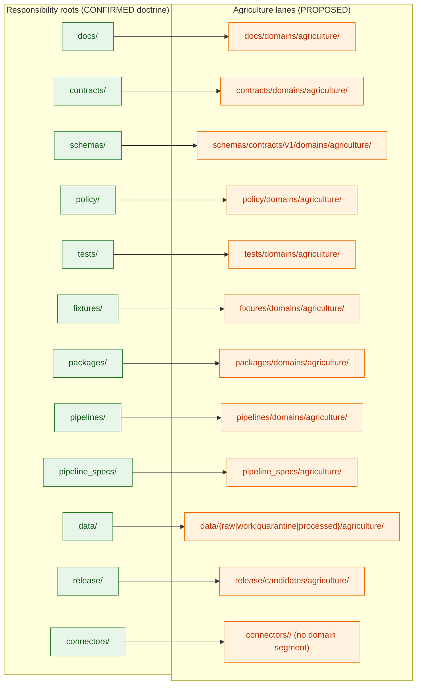

<!-- [KFM_META_BLOCK_V2]
doc_id: kfm://doc/domains/agriculture/canonical-paths
title: Agriculture — Canonical Paths
type: standard
version: v1
status: draft
owners: TODO (Agriculture domain stewards · Directory Rules WG)
created: 2026-05-15
updated: 2026-05-15
policy_label: public
related:
  - docs/domains/agriculture/README.md
  - docs/directory-rules.md
  - docs/architecture/domain-placement-law.md
  - schemas/contracts/v1/domains/agriculture/
  - policy/domains/agriculture/
  - data/published/layers/agriculture/
  - release/candidates/agriculture/
tags: [kfm, domain, agriculture, directory-rules, canonical-paths]
notes:
  - Realizes Directory Rules §12 (Domain Placement Law) for the Agriculture lane.
  - All Agriculture-specific paths are PROPOSED until the mounted repo confirms them.
  - External standards are NOT cited; this doc is grounded in project doctrine only.
[/KFM_META_BLOCK_V2] -->

# Agriculture — Canonical Paths

> Where Agriculture-domain files belong inside the KFM responsibility-rooted monorepo, and where they must not be placed. A path-only crosswalk; nothing here decides meaning, shape, policy, or release.

[](#status)
[](#authority-and-scope)
[](#doctrinal-basis)
[-success)](#domain-identity)
[](#truth-posture)
[](#last-updated)

| Status | Owners | Last updated |
|---|---|---|
| draft (PROPOSED) | TODO — Agriculture domain stewards · Directory Rules WG | 2026-05-15 |

---

## Mini-TOC

1. [Purpose](#1-purpose)
2. [Doctrinal basis](#2-doctrinal-basis)
3. [Truth posture](#3-truth-posture)
4. [Domain identity](#4-domain-identity)
5. [The lane fan — Agriculture across responsibility roots](#5-the-lane-fan--agriculture-across-responsibility-roots)
6. [Canonical paths — full crosswalk](#6-canonical-paths--full-crosswalk)
7. [Lifecycle lanes under `data/`](#7-lifecycle-lanes-under-data)
8. [Release lanes](#8-release-lanes)
9. [Cross-lane and multi-domain files](#9-cross-lane-and-multi-domain-files)
10. [Compatibility roots — agriculture-relevant guidance](#10-compatibility-roots--agriculture-relevant-guidance)
11. [Anti-patterns for the Agriculture lane](#11-anti-patterns-for-the-agriculture-lane)
12. [Pipeline shape (RAW → PUBLISHED)](#12-pipeline-shape-raw--published)
13. [Sensitivity and deny-default lanes](#13-sensitivity-and-deny-default-lanes)
14. [Placement protocol — Agriculture cheatsheet](#14-placement-protocol--agriculture-cheatsheet)
15. [Open questions and verification backlog](#15-open-questions-and-verification-backlog)
16. [Related docs](#16-related-docs)

---

## 1. Purpose

This document is the **path-only crosswalk** for the Agriculture domain. It answers one question:

> *"Where in the KFM monorepo does this Agriculture-domain file belong?"*

It does **not** decide:

- What an Agriculture object **means** — that lives under `contracts/domains/agriculture/`.
- The **machine shape** of an object — that lives under `schemas/contracts/v1/domains/agriculture/`.
- Whether something can be **published** — that lives under `policy/domains/agriculture/` and the release machinery.
- What is **true** about a crop, field, soil-crop suitability, or aggregation receipt — that lives in `data/proofs/` as `EvidenceBundle`s referenced from canonical records.

This is a **CONFIRMED doctrine / PROPOSED realization** document: the Directory Rules pattern it applies is project doctrine, but every concrete Agriculture path below is `PROPOSED` until verified against the mounted repository. [DIRRULES §§2.5, 5, 12]

> [!IMPORTANT]
> A path being listed here is **not** evidence the path exists. It is evidence of where it would belong if it did. Treat every Agriculture-specific path as `PROPOSED` until a mounted-repo inspection upgrades it.

---

## 2. Doctrinal basis

| Rule | Source | Status |
|---|---|---|
| Files are placed by **responsibility root**, not by topic name. | Directory Rules §§3, 4 | CONFIRMED doctrine |
| A domain MUST NOT become a root folder. The domain appears as a **segment** under each responsibility root. | Directory Rules §12 (Domain Placement Law) | CONFIRMED doctrine |
| The lifecycle invariant is **RAW → WORK / QUARANTINE → PROCESSED → CATALOG / TRIPLET → PUBLISHED**. Promotion is a governed state transition, not a file move. | Directory Rules §9.1; ENCY Appendix E | CONFIRMED doctrine |
| Public/UI/AI surfaces consume the trust membrane (`apps/governed-api/`), never canonical/internal stores. | Directory Rules §§7.1, 13.5 | CONFIRMED doctrine |
| Compatibility roots (e.g., `policies/`, `jsonschema/`, `ui/`, `web/`) MUST NOT evolve independently of their canonical homes. | Directory Rules §§8, 8.3 | CONFIRMED doctrine |
| Connectors emit to `data/raw/<domain>/...` or `data/quarantine/...`; pipelines promote. **Watcher-as-non-publisher.** | Directory Rules §§7.3, 19 | CONFIRMED doctrine |

> [!NOTE]
> The Atlas v1.1 §24.13 crosswalk maps Agriculture to `schemas/contracts/v1/agriculture/` and `contracts/agriculture/` with the note *"Aggregation receipts central; private-join denial defaults."* That mapping is consistent with — and refined by — the lane fan in §5 below. [ENCY §24.13]

[Back to top ↑](#agriculture--canonical-paths)

---

## 3. Truth posture

This document uses the KFM truth labels. Apply the **narrowest** truthful label.

| Label | Meaning here |
|---|---|
| **CONFIRMED** | The Directory Rules pattern (§§3–13) is project doctrine and applies uniformly. |
| **PROPOSED** | Every Agriculture-specific path below is a **proposed realization** of the Domain Placement Law for the `agriculture` segment. Implementation in the live repo is not asserted. |
| **INFERRED** | Where the Agriculture dossier and the encyclopedia agree on a lane (e.g., `policy/domains/agriculture/` for aggregate-only release rules), the lane is INFERRED from doctrine plus dossier; path strings remain PROPOSED. |
| **UNKNOWN** | Whether each path **exists in the mounted repo** is UNKNOWN in this session. |
| **NEEDS VERIFICATION** | Specific source-family activations, layer registry entries, and policy bundle file names are NEEDS VERIFICATION; this doc names the lanes, not the contents. |

> [!CAUTION]
> Memory is not evidence. If a path below does not appear in the mounted repository, the **doctrine** stands and the **path is PROPOSED**; do not promote a PROPOSED path to fact by repeating it.

---

## 4. Domain identity

CONFIRMED doctrine / PROPOSED implementation. The Agriculture domain governs:

> Crop observations, field candidates, crop rotation, yield observations, irrigation context, conservation practice context, soil-crop suitability, agricultural economy observations, supply-chain nodes, drought and pest stress indicators, and **aggregation receipts** — with public-safe products and source-rights-respecting joins. [DOM-AG; ENCY §7.7]

Explicitly **not owned** by Agriculture (relevant to placement choices):

- **Soil** owns canonical soil map-unit and horizon semantics. → `schemas/contracts/v1/domains/soil/` (PROPOSED).
- **Hydrology** owns water observations and flood context. → `schemas/contracts/v1/domains/hydrology/` (PROPOSED).
- **People / Land** owns ownership, title, parcels, and living-person privacy. → `schemas/contracts/v1/domains/people/`; `policy/sensitivity/people/` (PROPOSED).
- **Atmosphere / Air** owns weather, heat, and smoke observations. → `schemas/contracts/v1/domains/air/` (PROPOSED).

When a file straddles those boundaries, see §9 (Cross-lane and multi-domain files).

[Back to top ↑](#agriculture--canonical-paths)

---

## 5. The lane fan — Agriculture across responsibility roots

The Agriculture domain "fans out" across the canonical responsibility roots. The root stays **stable and boring**; the domain segment grows inside each lane. The diagram below is a doctrine-derived placeholder of that fan; the responsibility roots are CONFIRMED doctrine, the Agriculture segments are PROPOSED.



> [!NOTE]
> The diagram intentionally omits `tools/`, `scripts/`, `apps/`, `infra/`, `runtime/`, `configs/`, `migrations/`, and `examples/`. Agriculture-domain files **may** appear in those roots, but only at lane-internal or cross-domain positions explained in §9 — never as a root-level `agriculture/` folder.

[Back to top ↑](#agriculture--canonical-paths)

---

## 6. Canonical paths — full crosswalk

The table below is the **PROPOSED realization** of Directory Rules §12 for the `agriculture` segment. The pattern in the right column is CONFIRMED doctrine; the agriculture-specific paths shown are PROPOSED.

| Responsibility | Canonical Agriculture path (PROPOSED) | Owns / contains | Rule |
|---|---|---|---|
| Human-facing doctrine | `docs/domains/agriculture/` | Domain README, this canonical-paths doc, dossier crosswalks, runbooks. | DIRRULES §§3, 12 |
| Object meaning (semantic Markdown) | `contracts/domains/agriculture/` | Definitions for `CropObservation`, `FieldCandidate`, `CropRotation`, `YieldObservation`, `IrrigationLink`, `ConservationPractice`, `SoilCropSuitability`, `AgriculturalEconomyObservation`, `SupplyChainNode`, `DroughtStressIndicator`, `PestStressIndicator`, `AggregationReceipt`. | DIRRULES §§3, 12; DOM-AG; ENCY §7.7 |
| Machine shape (JSON Schema) | `schemas/contracts/v1/domains/agriculture/` | Schemas for the object families above; validator-facing shape. | DIRRULES §§5, 12, 13.1 (ADR-0001 canonical schema home) |
| Policy bundles | `policy/domains/agriculture/` | Aggregate-only public release rules; farm/operator deny-default; private-join deny rules; rights/sensitivity bundles. | DIRRULES §§3, 12 |
| Enforceability proof | `tests/domains/agriculture/` | Contract, schema, policy, validator, pipeline, and runtime-proof tests for Agriculture. | DIRRULES §6.6 |
| Test inputs | `fixtures/domains/agriculture/` *or* `tests/fixtures/domains/agriculture/` | Golden, valid, invalid Agriculture fixtures. **One authority only**, per §6.6 README rule. | DIRRULES §6.6 |
| Domain library | `packages/domains/agriculture/` | Reusable Agriculture code (e.g., aggregation receipt builders, suitability joiners). Reusable only — one-shot logic stays in `pipelines/` or `tools/`. | DIRRULES §7.2 |
| Executable pipelines | `pipelines/domains/agriculture/` *or* topical paths under `pipelines/{ingest,normalize,validate,catalog,triplets,publish,rollback}/` with `<run>/<domain>=agriculture` | Pipeline steps; promotion machinery for Agriculture-specific stages. | DIRRULES §7.4 |
| Declarative pipeline configuration | `pipeline_specs/agriculture/` | What runs (specs), not how. | DIRRULES §7.4 |
| Lifecycle data | `data/raw/agriculture/`, `data/work/agriculture/`, `data/quarantine/agriculture/`, `data/processed/agriculture/`, `data/catalog/domain/agriculture/`, `data/published/layers/agriculture/` | One entry per lifecycle phase; promotion is a governed state transition. | DIRRULES §9.1 |
| Source registry (per-source) | `data/registry/sources/agriculture/` *or* `data/registry/agriculture/` | `SourceDescriptor` entries for NASS, NRCS/SSURGO, Mesonet, SMAP, HLS-VI, USCRN, SCAN, etc. (each source's role + rights/sensitivity). | DIRRULES §9.1 |
| Receipts (lifecycle-bound) | `data/receipts/{ingest,validation,pipeline,ai,release}/...` with run-id paths citing the Agriculture domain | `RunReceipt`, `TransformReceipt`, `AggregationReceipt`, `RedactionReceipt`, `ValidationReport`, `AIReceipt`. **Not** under `artifacts/`. | DIRRULES §§9.1, 13.2 |
| Proofs (evidence) | `data/proofs/evidence_bundle/...`, `data/proofs/proof_pack/...` | `EvidenceBundle`s and proof packs referenced by Agriculture claims. | DIRRULES §§9.1, 19 |
| Release decisions | `release/candidates/agriculture/`, `release/manifests/...`, `release/correction_notices/...`, `release/rollback_cards/...` | Domain-specific release **candidates** live under `release/candidates/agriculture/`; the **decision artifacts** live in shared release sub-trees. | DIRRULES §§9, 19 |
| Source-specific fetch / admit | `connectors/<source>/` — e.g., `connectors/nrcs/`, `connectors/usda-nass/`, `connectors/kansas-mesonet/`, `connectors/nasa-earthdata/` (all PROPOSED) | Connectors are **source-scoped**, not domain-scoped. Output goes to `data/raw/agriculture/<source_id>/<run_id>/`. | DIRRULES §7.3 |
| Trust-membrane surface (cross-domain) | `apps/governed-api/` (no agriculture segment) | Agriculture Decision Envelope, Layer Manifest resolver, Evidence Drawer payload, Focus Mode answer — all exposed here. | DIRRULES §7.1; DOM-AG §J |

<details>
<summary><strong>Reference: full domain-segment template (CONFIRMED pattern, agriculture substituted)</strong></summary>

```text
docs/domains/agriculture/
contracts/domains/agriculture/
schemas/contracts/v1/domains/agriculture/
policy/domains/agriculture/
tests/domains/agriculture/
fixtures/domains/agriculture/                 # OR tests/fixtures/domains/agriculture/
packages/domains/agriculture/
pipelines/domains/agriculture/                # OR topical pipelines with agriculture lanes
pipeline_specs/agriculture/
data/raw/agriculture/
data/work/agriculture/
data/quarantine/agriculture/
data/processed/agriculture/
data/catalog/domain/agriculture/
data/published/layers/agriculture/
data/registry/sources/agriculture/            # OR data/registry/agriculture/
release/candidates/agriculture/
```

Source: Directory Rules §12, with `<domain>` replaced by `agriculture`. The pattern is CONFIRMED doctrine; the specific listings above are PROPOSED until repo verification.

</details>

[Back to top ↑](#agriculture--canonical-paths)

---

## 7. Lifecycle lanes under `data/`

CONFIRMED doctrine: the lifecycle invariant is **RAW → WORK / QUARANTINE → PROCESSED → CATALOG / TRIPLET → PUBLISHED**, with receipts, proofs, registry, and rollback emitted *alongside* the lifecycle directories. [DIRRULES §9.1]

| Lifecycle phase | Agriculture path (PROPOSED) | What admissibly lives here | What MUST NOT live here |
|---|---|---|---|
| RAW | `data/raw/agriculture/<source_id>/<run_id>/` | Immutable connector output with `SourceDescriptor`, hashes, ingest receipt. NASS/QuickStats payload snapshots; SSURGO/Soil Data Access extracts; Kansas Mesonet pulls; SMAP/HLS-VI fetched products. | Normalized objects; published layers; AI-generated content; any operator-private field-level join. |
| WORK | `data/work/agriculture/<run_id>/` | Transformation candidates; intermediate normalized features awaiting validation; aggregation drafts. | Anything claimed as "released" or "canonical"; sensitive joins without a redaction receipt. |
| QUARANTINE | `data/quarantine/agriculture/<reason>/<run_id>/` | Material with rights, sensitivity, validation, source-role, evidence, temporal, or policy defects. Each path carries a structured `reason`. | Silent re-admission to WORK without a recorded transition and receipt. |
| PROCESSED | `data/processed/agriculture/<dataset_id>/<version>/` | Validated normalized objects (Crop Observation, Field Candidate, Yield Observation, Soil Crop Suitability, Aggregation Receipt, etc.) that have passed transformation checks. | A public surface; tiles or API payloads (those are PUBLISHED). |
| CATALOG / TRIPLET | `data/catalog/domain/agriculture/`, `data/triplets/...` | Catalog records, EvidenceBundles, graph/triplet projections, release candidates. | Anything not citing an `EvidenceRef`. |
| PUBLISHED | `data/published/layers/agriculture/`, `data/published/api_payloads/...`, `data/published/pmtiles/...`, `data/published/geoparquet/...` | Released, policy-allowed, reviewable, rollback-capable Agriculture artifacts referenced by a `ReleaseManifest`. | A connector or watcher write; a route that bypasses `apps/governed-api/`. |

> [!WARNING]
> A pipeline writing **directly** from `data/raw/agriculture/` to `data/published/layers/agriculture/` is a lifecycle skip — a §13.5 anti-pattern — regardless of how clean the bytes look. Every phase MUST run; promotion is a governed state transition.

[Back to top ↑](#agriculture--canonical-paths)

---

## 8. Release lanes

The Agriculture lane uses the shared release tree; the **candidates** are domain-segmented, the **decisions** are not.

| Object | Canonical home (PROPOSED) | Notes |
|---|---|---|
| `ReleaseCandidate` (Agriculture) | `release/candidates/agriculture/` | Pre-release artifact bundles awaiting review/decision. |
| `ReleaseManifest` | `release/manifests/` *(no domain segment)* | The release decision artifact. Layer-internal manifests MAY live within `data/published/layers/agriculture/<layer>/` per §18 OPEN-Q. |
| `CorrectionNotice` | `release/correction_notices/` | Public notice of a corrected Agriculture claim. |
| `RollbackCard` | `release/rollback_cards/` | Rollback decision artifact. |
| Alias-revert receipts (data plane) | `data/rollback/agriculture/<release_id>/` | Data-plane revert receipts; OPEN per §18 of Directory Rules. |

> [!IMPORTANT]
> Release manifests **MUST NOT** be placed in `artifacts/`. That is anti-pattern §13.2 / §13.5. The `artifacts/` root, if present, is build/docs/qa/temporary only.

[Back to top ↑](#agriculture--canonical-paths)

---

## 9. Cross-lane and multi-domain files

CONFIRMED doctrine: a cross-domain file lives under the **lowest common responsibility root** that owns its responsibility, **without** a domain segment. [DIRRULES §12]

| Scenario (PROPOSED) | Correct placement | Wrong placement |
|---|---|---|
| Agriculture × Soil **MUKEY join** validator | `tools/validators/joins/agriculture-soil/` (cross-domain segment of `tools/`) | `tools/validators/domains/agriculture/soil-join/` |
| Agriculture × Hydrology **irrigation/water-use context** schema | `schemas/contracts/v1/joins/agriculture-hydrology/` or topical cross-domain schema dir | `schemas/contracts/v1/domains/agriculture/hydrology-ext/` |
| Agriculture × Atmosphere/Air **vegetation stress** doctrine note | `docs/architecture/cross-domain/vegetation-stress.md` | `docs/domains/agriculture/atmosphere-stress.md` |
| Agriculture × People/Land **farm/operator privacy** policy | `policy/sensitivity/people/` *and* `policy/domains/agriculture/` (deny-default reference) | A single domain folder claiming joint authority |
| **AggregationReceipt** definition (an Agriculture-owned object family that is also referenced by Soil/Hydrology contexts) | `contracts/domains/agriculture/aggregation-receipt.md` + schema in `schemas/contracts/v1/domains/agriculture/` | A cross-domain location; Agriculture owns the family per DOM-AG §B. |

> [!TIP]
> When in doubt, ask: *"Whose responsibility is this file primarily fulfilling?"* If exactly one domain owns the responsibility, the domain segment applies. If multiple share it, no domain segment — use the cross-domain segment of the responsibility root.

[Back to top ↑](#agriculture--canonical-paths)

---

## 10. Compatibility roots — agriculture-relevant guidance

Compatibility roots (if present) MUST declare their class (`legacy`, `mirror`, `deprecated`, `external-export`, `transitional`) per Directory Rules §8.

| Compatibility root | Agriculture implication (PROPOSED) | Canonical home |
|---|---|---|
| `policies/` | Any agriculture-named files here are mirrors of `policy/domains/agriculture/` or legacy. | `policy/domains/agriculture/` |
| `jsonschema/` | Any agriculture schemas here are mirrors of `schemas/contracts/v1/domains/agriculture/`. | `schemas/contracts/v1/domains/agriculture/` |
| `ui/`, `web/`, `styles/`, `viewer_templates/` | Agriculture UI fragments here are transitional; canonical UI lives in `apps/explorer-web/` (deployable shell) + `packages/ui/` + `packages/maplibre/`. | `apps/explorer-web/`, `packages/ui/`, `packages/maplibre/` |
| `artifacts/` | **No** Agriculture release manifest, receipt, EvidenceBundle, or proof belongs here. | `data/receipts/`, `data/proofs/`, `release/` |

> [!CAUTION]
> Compatibility roots **MUST NOT evolve independently** of canonical homes (§8.3). New Agriculture rules, fields, and policy updates land in canonical first; mirrors regenerate or migrate.

[Back to top ↑](#agriculture--canonical-paths)

---

## 11. Anti-patterns for the Agriculture lane

Each of the patterns below has appeared in KFM-class repositories. Watch for them.

| Anti-pattern | Symptom | Fix (PROPOSED) |
|---|---|---|
| **Agriculture as root folder** | `agriculture/` at repo root with its own `data/`, `schemas/`, `policy/`, `docs/`. | Migrate piece-by-piece into the lane fan in §5. Preserve `docs/domains/agriculture/README.md` as the domain README. [DIRRULES §13.4] |
| **Parallel schema homes** | Both `contracts/domains/agriculture/<x>.schema.json` and `schemas/contracts/v1/domains/agriculture/<x>.schema.json` exist and diverge. | `schemas/contracts/v1/...` is canonical per ADR-0001; `contracts/` retains semantic Markdown only. [DIRRULES §13.1] |
| **Trust content in `artifacts/`** | Agriculture release manifests or EvidenceBundles under `artifacts/`. | Migrate to `release/manifests/` and `data/proofs/`. [DIRRULES §13.5] |
| **Public route reads canonical store** | `apps/explorer-web/` reading `data/processed/agriculture/` or `data/catalog/domain/agriculture/` directly. | Route reads MUST go through `apps/governed-api/`. [DIRRULES §13.5] |
| **Connector publishes** | A NASS / SSURGO / Mesonet connector writes to `data/processed/agriculture/` or `data/published/layers/agriculture/`. | Connectors emit to `data/raw/agriculture/...` or `data/quarantine/agriculture/...`; pipelines promote. [DIRRULES §§7.3, 13.5] |
| **Watcher publishes** | A worker writes to `data/catalog/domain/agriculture/` or `data/published/layers/agriculture/`. | Watchers emit receipts and candidate decisions only — watcher-as-non-publisher. [DIRRULES §§13.5, 19] |
| **Lifecycle skip** | A pipeline writes directly from `data/raw/agriculture/...` to `data/published/layers/agriculture/...`. | Every phase must run; promotion is a governed state transition. [DIRRULES §13.5] |
| **Farm/operator field-level join in a public lane** | Field-level joins of NASS QuickStats with operator identity surfacing in `data/published/layers/agriculture/`. | Quarantine with reason; refer to `policy/domains/agriculture/` and `policy/sensitivity/people/`; aggregate or redact before publication. [DOM-AG §I; ENCY §7.7] |
| **Aggregation-only fail-open** | Aggregate satellite or stats products silently treated as field-level truth. | `AggregationReceipt` MUST accompany the claim; `policy/domains/agriculture/` denies field-level claims drawn from aggregate-only sources. [DOM-AG §K] |

[Back to top ↑](#agriculture--canonical-paths)

---

## 12. Pipeline shape (RAW → PUBLISHED)

CONFIRMED doctrine / PROPOSED lane application: Agriculture follows the universal lifecycle. The table below maps each gate to the path lane that hosts its artifacts. [DOM-AG §H; DIRRULES §9.1]

```mermaid
flowchart LR
    RAW["data/raw/agriculture/"] -->|TransformReceipt + PolicyDecision| WQ["data/work/agriculture/<br/>· data/quarantine/agriculture/"]
    WQ -->|ValidationReport · RedactionReceipt · AggregationReceipt| PROC["data/processed/agriculture/"]
    PROC -->|EvidenceBundle · CatalogMatrix| CAT["data/catalog/domain/agriculture/<br/>· data/triplets/..."]
    CAT -->|ReleaseManifest · ReviewRecord · rollback target| PUB["data/published/layers/agriculture/<br/>· release/manifests/"]
    PUB -.->|CorrectionNotice + RollbackCard| PUB

    classDef raw fill:#fff8e1,stroke:#f9a825;
    classDef work fill:#ffe0b2,stroke:#ef6c00;
    classDef proc fill:#dcedc8,stroke:#558b2f;
    classDef cat fill:#bbdefb,stroke:#1565c0;
    classDef pub fill:#c8e6c9,stroke:#2e7d32;
    class RAW raw
    class WQ work
    class PROC proc
    class CAT cat
    class PUB pub
```



| Gate | Pre-condition | Required artifacts (PROPOSED) | Failure-closed outcome |
|---|---|---|---|
| Admission (→ RAW) | Source identity, rights, source-role intent established. | `SourceDescriptor` (role, authority, rights, sensitivity, cadence); payload hash. | Candidate awaiting steward. |
| Normalization (RAW → WORK / QUARANTINE) | Schema, geometry, time, identity, evidence, rights, policy rules runnable. | `TransformReceipt`; working `ValidationReport`; `PolicyDecision`; QUARANTINE for failures. | Quarantine with reason. |
| Validation (WORK → PROCESSED) | Validators deterministic; required receipts present. | `ValidationReport` pass; `RedactionReceipt` if sensitivity applies; `AggregationReceipt` if applies. | Stay in WORK; structured FAIL. |
| Catalog closure (PROCESSED → CATALOG / TRIPLET) | `EvidenceRef`s resolve; catalog matrix and digests close. | `CatalogMatrix` entry; `EvidenceBundle`; graph/triplet projections. | HOLD at PROCESSED. |
| Release (CATALOG → PUBLISHED) | Review state where required; release authority distinct from author when materiality applies. | `ReleaseManifest`; rollback target; correction path; `ReviewRecord` if required. | HOLD at CATALOG. |
| Correction | Detected error or new evidence; downstream derivatives identified. | `CorrectionNotice`; `RollbackCard` if reverting. | No silent overwrite of published surfaces. |

[Back to top ↑](#agriculture--canonical-paths)

---

## 13. Sensitivity and deny-default lanes

Agriculture has a particularly sharp **aggregate-public / field-private** boundary. The lanes below codify that.

> [!WARNING]
> Aggregate statistics and satellite products **must not become field/operator truth.** Farm/operator private data, proprietary yield, pesticide records, and private-sensitive joins **fail closed**. [DOM-AG §I; ENCY §7.7]

| Sensitivity surface | Lane (PROPOSED) | Posture |
|---|---|---|
| Public-safe aggregate layers (county/HUC/grid) | `data/published/layers/agriculture/aggregate/...` | ANSWER (with `AggregationReceipt`). |
| Field-level NASS-derived claims | `data/quarantine/agriculture/field-level-claim/...` *and* `policy/domains/agriculture/deny-field-level.rego` (PROPOSED filename) | DENY by policy; refer up for review. |
| Operator-identifying joins | `data/quarantine/agriculture/operator-join/...` + `policy/sensitivity/people/` cross-reference | DENY by policy; redaction required before any release. |
| Proprietary yield / pesticide records | `data/quarantine/agriculture/proprietary/...` | DENY unless rights and review explicit. |
| Drought / pest stress indicators (aggregate) | `data/published/layers/agriculture/stress/...` | ANSWER with non-emergency disclaimer; KFM is not an alert authority. |

> [!NOTE]
> The sensitivity defaults above are doctrine-derived and PROPOSED as path-level expressions. Actual rule filenames, tier assignments, and review thresholds are NEEDS VERIFICATION and should be confirmed in `policy/domains/agriculture/` and the per-source registry.

[Back to top ↑](#agriculture--canonical-paths)

---

## 14. Placement protocol — Agriculture cheatsheet

When you are about to add or move an Agriculture-domain file, walk this five-step protocol from Directory Rules §4.

1. **Identify the responsibility.** Pick exactly one of: docs · contracts · schemas · policy · tests · fixtures · tools · scripts · apps · packages · connectors · pipelines · pipeline_specs · data · release · runtime · infra · configs · migrations · examples.
2. **Identify the lifecycle phase (data only).** raw · work · quarantine · processed · catalog · triplets · published · receipts · proofs · registry · rollback.
3. **Identify the domain.** If Agriculture-specific, the path includes the `agriculture` segment *inside* the responsibility root — never as a root. If cross-domain, no domain segment — see §9.
4. **Confirm authority.** The owning root MUST exist; if creating it, ship a per-root `README.md` meeting §15 of Directory Rules in the same change.
5. **Cite the rule** in the PR description (e.g., *"DIRRULES §12 + this CANONICAL_PATHS §6 row 4"*). If no rule justifies the path, mark it **PROPOSED** or **NEEDS VERIFICATION** and open a drift entry.

> [!TIP]
> The reviewer's one-line check (DIRRULES §4 Step 5):
> *"Does the path encode the right responsibility, the right lifecycle phase (if data), and the right domain segment — and does this PR cite a rule for it?"*

[Back to top ↑](#agriculture--canonical-paths)

---

## 15. Open questions and verification backlog

| # | Item | Status | Evidence that would settle it |
|---|---|---|---|
| AG-CP-01 | Whether `pipelines/domains/agriculture/` or topical `pipelines/{ingest,...}/agriculture/` is the chosen layout in the current repo. | NEEDS VERIFICATION | Mounted-repo inspection of `pipelines/`. |
| AG-CP-02 | Whether `fixtures/` (root) or `tests/fixtures/` is the authority for Agriculture fixtures. | NEEDS VERIFICATION | Mounted-repo inspection; per-root README declaration. [DIRRULES §6.6] |
| AG-CP-03 | Whether `data/registry/sources/agriculture/` or `data/registry/agriculture/` is the per-source registry path for Agriculture. | NEEDS VERIFICATION | Mounted-repo inspection of `data/registry/`. |
| AG-CP-04 | Whether `triplets/` (plural) or `triplet/` (singular) is the chosen `data/` sibling. This doc uses plural. | OPEN | One-line ADR to freeze it. [DIRRULES §18] |
| AG-CP-05 | Whether `data/rollback/agriculture/` (data plane) and `release/rollback_cards/` (release plane) co-exist or merge. | OPEN | ADR. [DIRRULES §18] |
| AG-CP-06 | Whether `apps/api/` and `apps/governed-api/` co-exist for Agriculture endpoints. | OPEN | Mounted-repo inspection + ADR. [DIRRULES §18] |
| AG-CP-07 | NASS/QuickStats and Crop Progress activation, source-role assignments, and policy-bundle filenames in `policy/domains/agriculture/`. | NEEDS VERIFICATION | Mounted-repo files, registry entries, tests, emitted artifacts. [DOM-AG §N; ENCY] |
| AG-CP-08 | Kansas Mesonet, HLS-VI, SMAP, USCRN, SCAN product term and rights validation. | NEEDS VERIFICATION | Source registry entries; rights review records. [DOM-AG §N] |
| AG-CP-09 | Agriculture API route name(s), DTO names, and Layer Manifest registry entries. | UNKNOWN | Mounted-repo inspection of `apps/governed-api/` and `data/registry/layers/`. [DOM-AG §J] |
| AG-CP-10 | Whether a layer-internal manifest convention under `data/published/layers/agriculture/<layer>/manifest.*` exists in addition to `release/manifests/`. | OPEN | ADR or mounted-repo inspection. [DIRRULES §18] |

> [!NOTE]
> Each row above is a candidate entry for `docs/registers/VERIFICATION_BACKLOG.md`. A `DRIFT_REGISTER.md` entry is appropriate when mounted-repo evidence contradicts the PROPOSED path here.

[Back to top ↑](#agriculture--canonical-paths)

---

## 16. Related docs

- [`docs/directory-rules.md`](../../directory-rules.md) — CONFIRMED doctrine; this doc realizes §12 for Agriculture.
- [`docs/domains/agriculture/README.md`](./README.md) — Domain README (TODO if not yet present).
- [`docs/domains/agriculture/SOURCES.md`](./SOURCES.md) — PROPOSED source registry crosswalk for NASS, NRCS, Mesonet, SMAP, HLS-VI.
- [`docs/domains/agriculture/POLICY.md`](./POLICY.md) — PROPOSED Agriculture policy summary.
- [`docs/domains/agriculture/PIPELINE.md`](./PIPELINE.md) — PROPOSED RAW → PUBLISHED runbook.
- [`docs/architecture/domain-placement-law.md`](../../architecture/domain-placement-law.md) — PROPOSED architectural doctrine doc.
- [`schemas/contracts/v1/domains/agriculture/`](../../../schemas/contracts/v1/domains/agriculture/) — PROPOSED canonical schema home.
- [`policy/domains/agriculture/`](../../../policy/domains/agriculture/) — PROPOSED canonical policy home.
- [`release/candidates/agriculture/`](../../../release/candidates/agriculture/) — PROPOSED domain release-candidate lane.

> [!NOTE]
> All sibling links above are PROPOSED targets. If a file does not exist, do not silently create it from this list — open the per-root README, confirm authority, and ship the file as a sourced contribution. [DIRRULES §15]

---

### Last updated

`2026-05-15` · Owners: TODO — Agriculture domain stewards · Directory Rules WG · Version `v1` (draft)

[Back to top ↑](#agriculture--canonical-paths)
