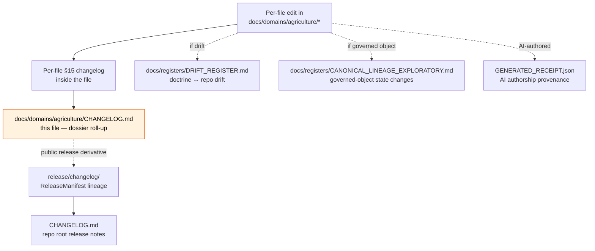

<!-- [KFM_META_BLOCK_V2]
doc_id: kfm://doc/docs-domains-agriculture-changelog
title: Agriculture Dossier — Changelog
type: standard
version: v1
status: draft
owners: <TODO: agriculture-steward; docs-steward>
created: 2026-05-27
updated: 2026-05-27
policy_label: public
related:
  - docs/doctrine/ai-build-operating-contract.md
  - docs/doctrine/directory-rules.md
  - docs/domains/agriculture/README.md
  - docs/domains/agriculture/VERIFICATION_BACKLOG.md
  - docs/domains/agriculture/atmosphere-stress.md
  - docs/registers/DRIFT_REGISTER.md
  - docs/registers/CANONICAL_LINEAGE_EXPLORATORY.md
  - CHANGELOG.md
  - release/changelog/
tags: [kfm, agriculture, changelog, dossier, governance]
notes:
  - CONTRACT_VERSION = "3.0.0" (pinned per ai-build-operating-contract.md §37).
  - Domain-scoped dossier changelog; rolls up per-file §15 changelogs.
  - Not a release changelog (release/changelog/) and not the root CHANGELOG.md.
[/KFM_META_BLOCK_V2] -->

# Agriculture Dossier — Changelog

> Dossier-scoped, chronological roll-up of material edits to files under `docs/domains/agriculture/`. Tracks **document lifecycle** per `ai-build-operating-contract.md` §37, not release-manifest lineage.

  
  
  
  
  
  
  
  <!-- TODO: replace with live Shields.io endpoints (CI status, last-updated, entry count) once verified against the mounted repo. -->

**Status:** draft · **Owners:** _TODO: agriculture-steward; docs-steward_ · **Last updated:** 2026-05-27

> [!IMPORTANT]
> This is a **dossier-level roll-up**, not an authoritative ledger. The authoritative per-file changelog lives **inside each file** (typically §15 per the KFM v3.0 doctrine companion-section pattern). The authoritative **release** lineage lives in `release/changelog/`, anchored to `ReleaseManifest` records. Conflicts between this file and any per-file changelog go to `docs/registers/DRIFT_REGISTER.md` per Directory Rules §2.5 — and the per-file changelog wins.

---

## 0. Status & Authority

| Field | Value |
|---|---|
| **Document type** | Dossier-scoped changelog (standard doc, domain-scoped). |
| **Edition** | v1 draft. |
| **Proposed repo path** | `docs/domains/agriculture/CHANGELOG.md` |
| **Placement basis** | **CONFIRMED** — Directory Rules §4 Step 3 (domain-segment under canonical responsibility root `docs/`); KFM Encyclopedia §6.2 (per-domain dossiers under `docs/domains/<domain>/`). **PROPOSED** as a sibling convention to `VERIFICATION_BACKLOG.md`. |
| **ADR-class check** | **Not ADR-class.** Directory Rules §2.4 triggers (canonical-root change, schema-home change, lifecycle-phase split, parallel home for schemas / contracts / policy / sources / registries / releases / proofs / receipts, invariant bend) do **not** apply: this file rolls up *edits to docs*, not authority for any §2.4(5) object family. Recorded for review at [OQ-AG-CHG-01](#8-open-questions-register). |
| **Operating contract** | `ai-build-operating-contract.md` — `CONTRACT_VERSION = "3.0.0"` — §37 MAJOR/MINOR/PATCH triggers govern entry types here. |
| **Authoritative tier** | Per-file §15 changelog inside each dossier doc **wins** over this file on conflict. |
| **Status of this file in any repo** | `draft` until reviewed and merged. AI-authored — `GENERATED_RECEIPT.json` required at merge per contract §34. |
| **Required reviewers** | Docs steward + agriculture-domain steward. |

---

## Contents

1. [Purpose and scope](#1-purpose-and-scope)
2. [Source authority](#2-source-authority)
3. [What counts as a dossier change](#3-what-counts-as-a-dossier-change)
4. [Versioning conventions](#4-versioning-conventions)
5. [Current dossier file versions](#5-current-dossier-file-versions)
6. [Release history](#6-release-history)
7. [Relationship to other change-tracking artifacts](#7-relationship-to-other-change-tracking-artifacts)
8. [Open questions register](#8-open-questions-register)
9. [Open verification backlog](#9-open-verification-backlog)
10. [Definition of done](#10-definition-of-done)
11. [Related docs](#11-related-docs)

---

## 1. Purpose and scope

A reader who needs the **answer to "what changed in the Agriculture dossier between dates X and Y"** should get it here, in one place, with pointers to the per-file §15 changelog for evidence.

### What this file is

- A chronological roll-up of material edits to documents under `docs/domains/agriculture/`.
- A snapshot of **current dossier file versions** (§5) so reviewers can see at a glance what state the dossier is in.
- A signpost (§7) clarifying how this file relates to per-file changelogs, the root `CHANGELOG.md`, `release/changelog/`, the drift register, the canonical lineage register, and `GENERATED_RECEIPT.json` provenance.

### What this file is not

| Out of scope | Lives in |
|---|---|
| Per-file edit history | §15-style changelog inside each dossier file (PROPOSED v3.0 convention). |
| Repo-wide release history | `CHANGELOG.md` at the repo root (Directory Rules §5). |
| `ReleaseManifest` lineage | `release/changelog/` keyed to release IDs (PROPOSED repo guide). |
| Drift between doctrine and repo | `docs/registers/DRIFT_REGISTER.md`. |
| State-change lineage for governed objects | `docs/registers/CANONICAL_LINEAGE_EXPLORATORY.md`. |
| AI-authoring provenance | `GENERATED_RECEIPT.json` per artifact (contract §34). |

> [!NOTE]
> If a per-file §15 changelog and this roll-up disagree, the per-file changelog wins and the conflict is filed to `docs/registers/DRIFT_REGISTER.md` per Directory Rules §2.5. This roll-up is a convenience; per-file changelogs are authority.

[↑ Back to top](#contents)

---

## 2. Source authority

CONFIRMED authority ladder for this file:

1. **`ai-build-operating-contract.md` v3.0 §37** — MAJOR / MINOR / PATCH triggers and the `CONTRACT_VERSION` pin govern every entry here.
2. **`ai-build-operating-contract.md` §34** — `GENERATED_RECEIPT.json` provenance for AI-authored edits. Each entry that records an AI-authored change SHOULD reference a receipt (PROPOSED in §6 footnote).
3. **`directory-rules.md` §2.5, §4, §6.1** — placement, drift handling, per-domain dossier placement under `docs/domains/<domain>/`.
4. **Per-file §15 changelogs** — authoritative on conflict; this file rolls them up.

External sources consulted: **none**. The roll-up is grounded entirely in KFM-internal doctrine and in the in-session authoring record.

[↑ Back to top](#contents)

---

## 3. What counts as a dossier change

A dossier change is a **material edit** to a document under `docs/domains/agriculture/`. The triggers below mirror contract §37.1 and §37.2.

| Edit type | Counts as | Notes |
|---|---|---|
| Operating-law-equivalent text added/changed/removed | **MAJOR** entry | Doctrine-adjacent docs only. Rare for dossier docs; usually triggers ADR per contract §37.2. |
| New section, new companion section, new table, clarification | **MINOR** entry | Most dossier evolution lands here. |
| Typo, link repair, formatting, badge target refresh, last-updated bump | **PATCH** entry | Group multiple PATCH edits into a single entry when they happen together. |
| New file added to the dossier | **MINOR** entry | New file gets its own row in §5 and a "v1 initial draft" line in §6. |
| File renamed or moved | **MINOR** entry | If anchors break, label as **MAJOR** for that file. |
| File deprecated or superseded | **MAJOR** entry | Preserve the prior file as `LINEAGE` (contract §37.5); link the superseding file. |
| Owner change | PATCH entry | Record in §0 of the affected file and roll up here. |

What does **not** count: trivial whitespace, internal tool-only metadata updates with no semantic effect, and `GENERATED_RECEIPT.json` re-emissions that do not change the artifact content.

> [!TIP]
> A useful rule of thumb: if the change needs an entry in the affected file's own §15 changelog, it needs an entry here. If it does not, neither does this file.

[↑ Back to top](#contents)

---

## 4. Versioning conventions

CONFIRMED (contract §37.1). All dossier files follow semantic versioning:

- **MAJOR** (`vN.0`) — change that requires re-issuing existing receipts, breaks consumer expectations, or amends doctrine-equivalent text. Rare; usually paired with an ADR (§37.2).
- **MINOR** (`vN.M`) — new section / table / clarification / companion artifact without breaking prior reference.
- **PATCH** (`vN.M.P`) — typo / formatting / link repair / status-table refresh.

`CONTRACT_VERSION` (currently `"3.0.0"`) is **separate** from per-file version and **separate** from this dossier changelog's own version. It pins the *operating contract* the file was authored under, not the file itself.

| Dimension | Lives where | Example |
|---|---|---|
| Per-file version | Inside the file's meta block (`version:`) and §0 table | `VERIFICATION_BACKLOG.md` is at `v1.1`. |
| Dossier-level entry | This file (§6) | "2026-05-27 — VERIFICATION_BACKLOG v1 → v1.1 (MINOR)." |
| Operating contract version | `ai-build-operating-contract.md` §0 and every receipt/PR body | `CONTRACT_VERSION = "3.0.0"`. |
| Release lineage | `release/changelog/` | Keyed to `ReleaseManifest` IDs; not authored by this file. |

[↑ Back to top](#contents)

---

## 5. Current dossier file versions

PROPOSED snapshot of the Agriculture dossier as of 2026-05-27. Files marked _not yet authored_ are referenced from other dossier docs but have no in-session authoring record. Mounted-repo presence is **NEEDS VERIFICATION** for every row.

| File | Current version | Status | Last touched | Notes |
|---|---|---|---|---|
| [`VERIFICATION_BACKLOG.md`](./VERIFICATION_BACKLOG.md) | v1.1 | draft | 2026-05-27 | Per-file §15 changelog tracks v1 → v1.1 (MINOR). Authoritative on conflict. |
| [`atmosphere-stress.md`](./atmosphere-stress.md) | v1 | draft | 2026-05-27 | Cross-lane reference (Agriculture × Atmosphere/Air). |
| [`CHANGELOG.md`](./CHANGELOG.md) | v1 | draft | 2026-05-27 | This file. |
| [`README.md`](./README.md) | — | _not yet authored_ | — | Referenced as TODO from sibling docs. Per Directory Rules §15 contract; per Encyclopedia §6.2 dossier pattern. |
| `ARCHITECTURE.md` | — | _not yet authored_ | — | Referenced from Encyclopedia §6.2 dossier pattern. |
| `PRESERVATION_MATRIX.md` | — | _not yet authored_ | — | Referenced from Encyclopedia §6.2 dossier pattern. |

> [!WARNING]
> Rows marked _not yet authored_ are **not** drift entries. Drift is a contradiction between doctrine and repo; absence of a planned file is a gap, not a contradiction. If a referenced file is later found to exist in the mounted repo, the discovery becomes a §6 entry and (if it conflicts with sibling-doc TODO references) a drift entry.

[↑ Back to top](#contents)

---

## 6. Release history

Newest first. Each entry names the affected file, the version bump, the change type per contract §37, and a short rationale. Where AI authored the change, a `GENERATED_RECEIPT.json` is expected per contract §34 (status noted).

### 2026-05-27 — Dossier bootstrap (initial drafts)

Three files entered the Agriculture dossier in a single working session.

| File | From → To | Type (§37) | Summary | Receipt status |
|---|---|---|---|---|
| `CHANGELOG.md` | — → v1 (draft) | new | First placement of this file. Establishes dossier-scoped change-tracking convention; defers ADR-class question to [OQ-AG-CHG-01](#8-open-questions-register). | `GENERATED_RECEIPT.json` planned (PROPOSED). |
| `atmosphere-stress.md` | — → v1 (draft) | new | First placement. Per-edge governance reference for Agriculture × Atmosphere/Air; documents source-role anti-collapse discipline (Atlas v1.1 Ch. 24.1) and `T4 fail-closed` boundary where stress products approach farm/operator scope (intersects AG-VB-03). | `GENERATED_RECEIPT.json` planned (PROPOSED). |
| `VERIFICATION_BACKLOG.md` | v1 (draft) → v1.1 (draft) | MINOR — clarification + housekeeping | Added §0 Status & Authority table; pinned `CONTRACT_VERSION = "3.0.0"`; promoted placement basis to CONFIRMED per Encyclopedia §6.2 + Directory Rules §4 Step 3 + §6.1; added doctrine companion sections (§§13–16: Open questions register, Open verification backlog, Changelog, Definition of done); added anti-pattern row referencing contract §8 (labels-as-rhetoric); added `GENERATED_RECEIPT.json` requirement to §11 step 5. Section anchors §§1–12 preserved. Anchor `#13-related-docs` renumbered to `#17-related-docs` — flagged as the file's backward-compat note. | `GENERATED_RECEIPT.json` planned (PROPOSED). |

**Open seams introduced.** All three files reference paths (`policy/sensitivity/agriculture/`, `schemas/contracts/v1/domains/agriculture/`, `data/registry/sources/agriculture/`, etc.) that remain **PROPOSED** until repo mount verifies them. Schema-home convention conflict between Atlas Ch. 24.13 (`schemas/contracts/v1/agriculture/`) and Directory Rules §4 Step 3 (`schemas/contracts/v1/domains/agriculture/`) is surfaced in `VERIFICATION_BACKLOG.md` §14 item 7 and `atmosphere-stress.md` [OQ-AG-ATM-04] — not silently smoothed.

### 2026-05-15 — VERIFICATION_BACKLOG.md initial placement

| File | From → To | Type (§37) | Summary | Receipt status |
|---|---|---|---|---|
| `VERIFICATION_BACKLOG.md` | — → v1 (draft) | new | First placement. Items copied verbatim from Atlas v1.0 Ch. 9 §N. PROPOSED item handles `AG-VB-01`…`AG-VB-04` introduced for local reference only. | Receipt status **UNKNOWN** for this earlier authoring session. |

[↑ Back to top](#contents)

---

## 7. Relationship to other change-tracking artifacts

PROPOSED orientation diagram. Each artifact tracks a different object of change; together they form the dossier's accountability surface.

| Artifact | What it tracks | Authoritative on conflict |
|---|---|---|
| Per-file §15 changelog | Atomic edits to one file | **YES** — wins over this roll-up. |
| `docs/domains/agriculture/CHANGELOG.md` (this) | Dossier-scoped roll-up | NO — convenience layer. |
| `docs/registers/DRIFT_REGISTER.md` | Doctrine ↔ repo disagreements | YES — for drift specifically. |
| `docs/registers/CANONICAL_LINEAGE_EXPLORATORY.md` | Governed-object state changes (per §11 step 5 of the verification backlog) | YES — for governed objects. |
| `GENERATED_RECEIPT.json` | Per-artifact AI provenance | YES — for AI authorship facts. |
| `release/changelog/` | `ReleaseManifest`-keyed release lineage | YES — for releases. |
| Root `CHANGELOG.md` | Repo-wide release notes | YES — for repo-level releases. |

> [!IMPORTANT]
> This file MUST NOT be used as evidence for a release, a governed-object state change, or an AI-authorship claim. Those go to `release/changelog/`, `CANONICAL_LINEAGE_EXPLORATORY.md`, and `GENERATED_RECEIPT.json` respectively. Citing the dossier changelog as a substitute is the **"backfilled receipt"** anti-pattern (contract §38 item 28).

[↑ Back to top](#contents)

---

## 8. Open questions register

PROPOSED. Questions about the design of this file itself.

| ID | Question | Owner role | Resolution path |
|---|---|---|---|
| **OQ-AG-CHG-01** | Should per-domain `CHANGELOG.md` be a canonical pattern across all 16 domains, or remain per-domain optional? If canonical, recorded in Directory Rules §6.1 with a per-root README contract. | Docs steward + each domain steward | ADR or Directory Rules amendment. |
| **OQ-AG-CHG-02** | Should this file be machine-readable (e.g., emit a sibling `CHANGELOG.agriculture.yaml`) for CI dashboards and automated dossier health reporting? | Docs steward + AI surface steward | ADR; cross-reference contract §35 health signals. |
| **OQ-AG-CHG-03** | Should entries from before this file existed (e.g., 2026-05-15 `VERIFICATION_BACKLOG.md` v1) be reconstructed from `GENERATED_RECEIPT.json` history when receipts become available, or left as PROPOSED reconstruction? | Docs steward | Process note in this file; backfill receipts where possible. |
| **OQ-AG-CHG-04** | What is the relationship between this dossier changelog and a future `docs/registers/DOMAIN_CHANGELOG_INDEX.md` (if one is created to roll up across all domains)? Is the index a new register home that needs §2.4(5) ADR review? | Docs steward | ADR if/when index is proposed. |
| **OQ-AG-CHG-05** | Should `_not yet authored_` rows in §5 be promoted to entries here (as "expected files") or remain a snapshot field only? | Docs steward + agriculture steward | Convention vote. |

[↑ Back to top](#contents)

---

## 9. Open verification backlog

PROPOSED. Items that remain `NEEDS VERIFICATION` for this file before promotion from `draft` to `published`.

1. Confirm placement at `docs/domains/agriculture/CHANGELOG.md` exists (or land it there).
2. Confirm sibling files referenced in §5 exist where stated, and that mounted-repo versions match the declared per-file versions.
3. Confirm `release/changelog/` exists in the mounted repo with the layout assumed in §7 (per repo guide).
4. Confirm root `CHANGELOG.md` exists (Directory Rules §5 lists it as a root file).
5. Confirm `GENERATED_RECEIPT.json` planned for this file's own authorship is wired into CI at merge with `CONTRACT_VERSION = "3.0.0"`.
6. Confirm `agriculture-steward` and `docs-steward` are roles defined in `CODEOWNERS`.
7. Confirm the 2026-05-15 `VERIFICATION_BACKLOG.md` v1 entry can be reconstructed from a prior receipt (OQ-AG-CHG-03); otherwise leave its `Receipt status` as **UNKNOWN**.

[↑ Back to top](#contents)

---

## 10. Definition of done

This document is done enough to enter the repository when:

- it is placed at `docs/domains/agriculture/CHANGELOG.md` per Directory Rules §4 Step 3;
- the docs steward and the agriculture-domain steward have reviewed and approved it;
- it is linked from `docs/domains/agriculture/README.md` (when that README exists);
- the dossier-changelog pattern does not conflict with accepted ADRs (no §2.4 trigger is anticipated; flagged at OQ-AG-CHG-01);
- any conflict between this roll-up and a per-file §15 changelog is logged in `docs/registers/DRIFT_REGISTER.md` and resolved in favor of the per-file changelog;
- the `GENERATED_RECEIPT.json` planned for AI authorship is wired into CI per contract §34 with `CONTRACT_VERSION = "3.0.0"`;
- §§8–9 (Open questions, Open verification) are stable enough to merge as draft (resolution does not block first placement);
- future changes follow contract §37 lifecycle and update §§5–6 accordingly.

[↑ Back to top](#contents)

---

## 11. Related docs

PROPOSED links. All paths are PROPOSED until verified against a mounted repo.

- [`docs/doctrine/ai-build-operating-contract.md`](../../doctrine/ai-build-operating-contract.md) — _TODO_ — operating contract v3.0; §37 lifecycle and `CONTRACT_VERSION` pin.
- [`docs/doctrine/directory-rules.md`](../../doctrine/directory-rules.md) — _TODO_ — placement, drift handling, root-tree convention.
- [`./README.md`](./README.md) — _TODO_ — Agriculture domain README (not yet authored).
- [`./VERIFICATION_BACKLOG.md`](./VERIFICATION_BACKLOG.md) — Agriculture verification backlog (current edition v1.1 draft).
- [`./atmosphere-stress.md`](./atmosphere-stress.md) — Agriculture × Atmosphere/Air cross-lane reference (v1 draft).
- [`docs/registers/DRIFT_REGISTER.md`](../../registers/DRIFT_REGISTER.md) — _TODO_ — drift entries.
- [`docs/registers/CANONICAL_LINEAGE_EXPLORATORY.md`](../../registers/CANONICAL_LINEAGE_EXPLORATORY.md) — _TODO_ — governed-object state-change lineage.
- [`CHANGELOG.md`](../../../CHANGELOG.md) — _TODO_ — root repo-wide changelog (Directory Rules §5).
- [`release/changelog/`](../../../release/changelog/) — _TODO_ — release lineage directory.

---

> [!NOTE]
> **Last updated:** 2026-05-27 · **Edition:** v1 draft · **`CONTRACT_VERSION = "3.0.0"`** · **Authority:** Per-file §15 changelogs (authoritative) + this roll-up (convenience).

[↑ Back to top](#contents)
