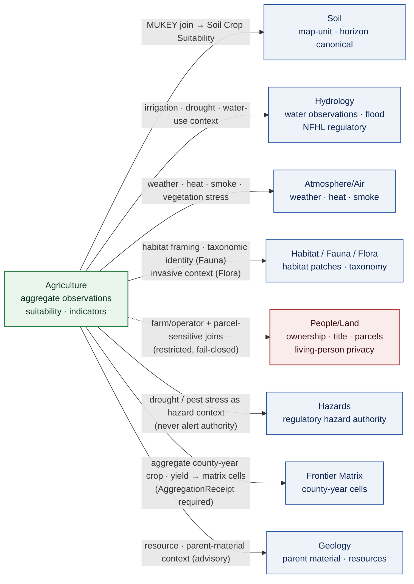
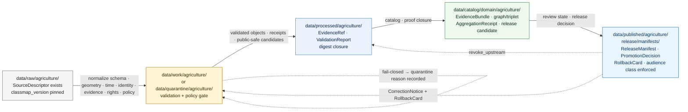

<!-- [KFM_META_BLOCK_V2]
doc_id: kfm://doc/agriculture-continuity-inventory
title: Agriculture Domain — Continuity Inventory
type: standard
subtype: domain-continuity-register
version: v2 (draft)
status: draft
owners: TODO — Agriculture Domain Steward · Docs Steward · Policy Steward
created: 2026-05-15
updated: 2026-05-26
policy_label: public
contract_version: "3.0.0"
related:
  - docs/doctrine/ai-build-operating-contract.md
  - docs/doctrine/directory-rules.md
  - docs/doctrine/trust-membrane.md
  - docs/doctrine/lifecycle-law.md
  - docs/doctrine/policy-aware.md
  - docs/doctrine/evidence-first.md
  - docs/doctrine/ai-as-assistant.md
  - docs/doctrine/corrections-are-first-class.md
  - docs/doctrine/authority-ladder.md
  - docs/domains/agriculture/README.md
  - docs/domains/agriculture/ARCHITECTURE.md
  - docs/domains/agriculture/api-contracts.md
  - docs/domains/agriculture/CANONICAL_PATHS.md
  - docs/domains/agriculture/policy/README.md
  - docs/domains/agriculture/runbooks/README.md
  - docs/domains/agriculture/sublanes/README.md
  - docs/domains/agriculture/sublanes/cropland.md
  - docs/registers/VERIFICATION_BACKLOG.md
  - docs/registers/DRIFT_REGISTER.md
tags: [kfm, domain, agriculture, continuity, inventory, lifecycle, governance, doctrine-adjacent, contract-v3]
notes:
  - Pinned to CONTRACT_VERSION = "3.0.0".
  - Continuity register — explains and inventories; does not decide truth, rights, sensitivity, release, source authority, or review state.
  - Doctrine grounded in DOM-AG, ENCY, DIRRULES, MAP-MASTER, GAI; implementation maturity remains UNKNOWN absent mounted repo.
  - All path-shaped claims are PROPOSED until verified.
[/KFM_META_BLOCK_V2] -->

<a id="top"></a>

# 🌾 Agriculture — Continuity Inventory

> A doctrine-grounded register of what the **Agriculture** domain owns, where it sits in the KFM trust membrane, which source and object families carry forward from prior passes, and which implementation claims remain **PROPOSED** until the repository, schemas, contracts, policy, tests, and release surfaces are verified.


| Field | Value |
|---|---|
| **Document type** | Domain continuity register (standard doc; doctrine-adjacent) |
| **Domain** | Agriculture |
| **Pinned to** | `CONTRACT_VERSION = "3.0.0"` |
| **Authority of doctrine recorded here** | CONFIRMED (from `[DOM-AG]`, `[ENCY]`, `[DIRRULES]`, `[MAP-MASTER]`, `[GAI]`, `[AIBOC]`) |
| **Authority of any specific repo path quoted here** | PROPOSED until verified against mounted-repo evidence |
| **Owners** | TODO — Agriculture Domain Steward · Docs Steward · Policy Steward |
| **Status** | `draft` |
| **Last reviewed** | 2026-05-26 |

> [!IMPORTANT]
> **What this doc is — and what it is not.** This is the **continuity register** for the Agriculture domain: a navigable inventory of doctrine, source families, object families, lifecycle posture, and carry-forward state. It is the **bridge** between Agriculture doctrine and the four sibling implementation contracts:
> - what an Agriculture object *means and how the bounded context is shaped* → [`ARCHITECTURE.md`](./ARCHITECTURE.md),
> - the *wire-level envelope and DTO* for governed APIs → [`api-contracts.md`](./api-contracts.md),
> - *where Agriculture files belong* in the monorepo → [`CANONICAL_PATHS.md`](./CANONICAL_PATHS.md),
> - *publication, sensitivity, and review* decisions → [`policy/README.md`](./policy/README.md).
> Reach for the right sibling doc when the question is not "what carries forward from prior KFM passes?".

> [!CAUTION]
> **No mounted repository was inspected this session.** Every file path, schema identifier, route, validator name, fixture name, manifest path, and release surface in this inventory is **PROPOSED** until reconciled with the actual repository under Directory Rules §4 (Placement Protocol) and §15 (Required README Contract). Doctrine recorded from the attached KFM corpus is **CONFIRMED** as doctrine; its **implementation maturity remains UNKNOWN.** `[CONFIRMED — operating contract §13 repository preflight.]`

---

## 📑 Contents

1. [Purpose & how to read this file](#sec-1-purpose)
2. [Doctrinal basis & authority stack](#sec-2-authority)
3. [Domain identity & one-line purpose](#sec-3-identity)
4. [Scope, boundary, and explicit non-ownership](#sec-4-scope)
5. [Ubiquitous language register](#sec-5-language)
6. [Source families inventory](#sec-6-sources)
7. [Object families inventory](#sec-7-objects)
8. [Cross-lane relations](#sec-8-cross-lane)
9. [Map & viewing products](#sec-9-viewing)
10. [Pipeline shape (lifecycle)](#sec-10-pipeline)
11. [Sensitivity, rights, and publication posture](#sec-11-sensitivity)
12. [API, contract, and schema surfaces](#sec-12-surfaces)
13. [Validators, tests, fixtures](#sec-13-validators)
14. [Governed AI behavior](#sec-14-ai)
15. [Publication, correction, and rollback](#sec-15-publication)
16. [Continuity & carry-forward state](#sec-16-continuity)
17. [Open questions register](#sec-17-open-questions)
18. [Open verification backlog](#sec-18-backlog)
19. [Changelog](#sec-19-changelog)
20. [Definition of done](#sec-20-dod)
21. [Related docs](#sec-21-related)

---

<a id="sec-1-purpose"></a>

## 1 · Purpose & how to read this file

The **Continuity Inventory** is a single navigable register for the Agriculture domain. It catalogues:

- The domain's **identity, scope, and explicit non-ownership** so reviewers can detect drift quickly.
- The **ubiquitous language**, **source families**, and **object families** that anchor every Agriculture artifact.
- The **lifecycle, governance, and trust posture** the domain MUST obey to participate in KFM's trust membrane.
- The **carry-forward state** (`RETAINED` / `EXPANDED` / `NEW` / `SUPERSEDED` / `LINEAGE`) of each doctrine element relative to prior KFM passes.
- The **open verification items** that block treating any of the above as implementation fact.

> [!NOTE]
> **Read this as a register, not a runbook.** Implementation belongs in `contracts/`, `schemas/`, `policy/`, `tests/`, `tools/`, `pipelines/`, `pipeline_specs/`, and `release/` lanes (placement specified in [`CANONICAL_PATHS.md`](./CANONICAL_PATHS.md)). This document **explains and inventories**; it does not decide truth, rights, sensitivity, release, source authority, or review state. `[CONFIRMED — DIRRULES; ENCY.]`

### 1.1 How truth labels are used here

This document uses the operating contract §8 truth labels. Apply the **narrowest** truthful label.

| Label | Meaning in this inventory |
|---|---|
| **CONFIRMED** | Verified this session from attached KFM doctrine (`[DOM-AG]`, `[ENCY]`, `[DIRRULES]`, `[MAP-MASTER]`, `[GAI]`, `[AIBOC]`). |
| **INFERRED** | Reasonably derivable from doctrine but not directly stated. |
| **PROPOSED** | Design, path, route, or schema name not yet verified against a mounted repo. |
| **UNKNOWN** | Not resolvable without further evidence. |
| **NEEDS VERIFICATION** | Checkable against the repo / source endpoints / rights terms; not yet checked this session. |
| **CONFLICTED** | Two prior-session sources disagree, or doctrine and implementation appear inconsistent. |
| **LINEAGE** | Prior-pass artifact preserving history, rationale, or continuity; not current authority by itself. |

### 1.2 RFC 2119 conformance

This document uses RFC 2119 / RFC 8174 language per `directory-rules.md` §2.2 and operating contract §5.1.1: **MUST / MUST NOT** non-negotiable; **SHOULD / SHOULD NOT** strong default; **MAY** permitted.

[⤴ Back to top](#top)

---

<a id="sec-2-authority"></a>

## 2 · Doctrinal basis & authority stack

This document MUST obey the doctrinal stack below, in order. A lower row cannot silently override a higher one; conflicts MUST be filed as drift entries against the higher row.

| Layer | Source | Status |
|---|---|---|
| Operating law for all AI-authored or AI-touched repo work (`CONTRACT_VERSION = "3.0.0"`) | [`ai-build-operating-contract.md`](../../doctrine/ai-build-operating-contract.md) | **CONFIRMED doctrine** |
| Placement protocol; Domain Placement Law | [`directory-rules.md`](../../doctrine/directory-rules.md) §§3, 4, 12 | **CONFIRMED doctrine** |
| Trust-boundary contract every envelope warrants | [`trust-membrane.md`](../../doctrine/trust-membrane.md) | **CONFIRMED doctrine** |
| Lifecycle invariant (`RAW → WORK / QUARANTINE → PROCESSED → CATALOG / TRIPLET → PUBLISHED`) | [`lifecycle-law.md`](../../doctrine/lifecycle-law.md); DIRRULES §9.1 | **CONFIRMED doctrine** |
| Finite policy outcomes; sensitive lanes default to `DENY` | [`policy-aware.md`](../../doctrine/policy-aware.md) | **CONFIRMED doctrine** |
| Cite-or-abstain truth posture | [`evidence-first.md`](../../doctrine/evidence-first.md) | **CONFIRMED doctrine** |
| AI is interpretive, never root truth; `AIReceipt` mandatory at Focus Mode | [`ai-as-assistant.md`](../../doctrine/ai-as-assistant.md) | **CONFIRMED doctrine** |
| `CorrectionNotice` + `RollbackCard` lineage preserved | [`corrections-are-first-class.md`](../../doctrine/corrections-are-first-class.md) | **CONFIRMED doctrine** |
| Authority ladder for cross-document precedence | [`authority-ladder.md`](../../doctrine/authority-ladder.md) v1.1 | **CONFIRMED doctrine** |
| Agriculture domain doctrine baseline | Atlas v1.1 §9 (Agriculture A–N); §24.1; §24.4.7; §24.5; §24.9; §24.13 (`[DOM-AG]`, `[ENCY]`) | **CONFIRMED doctrine** |

[⤴ Back to top](#top)

---

<a id="sec-3-identity"></a>

## 3 · Domain identity & one-line purpose

**CONFIRMED doctrine / PROPOSED implementation:** The Agriculture domain governs **agricultural aggregate observations, soil/moisture/vegetation context, crop progress, suitability, stress indicators, irrigation links, conservation-practice context, agricultural-economy observations, and public-safe products**, with bounded AI and governed publication. `[CONFIRMED — DOM-AG; ENCY §7.7; Atlas §9.A.]`

The Agriculture domain participates in KFM as a **lane**, not a root folder. Per Directory Rules §12 (Domain Placement Law), all Agriculture-specific files live as `<domain>` segments inside responsibility roots — never as `agriculture/` at the repo root. The complete path crosswalk lives in [`CANONICAL_PATHS.md`](./CANONICAL_PATHS.md); the architectural breakdown lives in [`ARCHITECTURE.md`](./ARCHITECTURE.md). This register links to those rather than duplicating them.

### 3.1 PROPOSED Agriculture lane spread (summary)

> [!NOTE]
> The tree below is a **summary**; the full path crosswalk with rule citations lives in [`CANONICAL_PATHS.md`](./CANONICAL_PATHS.md) §6. **None of these paths is asserted to exist in the current repository.** Each lane MUST be created (or confirmed) with a per-root or per-lane `README.md` that meets Directory Rules §15 before files are added.

```text
# docs / contracts / schemas / policy lanes — meaning, shape, admissibility
docs/domains/agriculture/                          # PROPOSED — human-facing domain register
  README.md · ARCHITECTURE.md · api-contracts.md   #   sibling docs in this lane
  CANONICAL_PATHS.md · CONTINUITY_INVENTORY.md     #   (this file)
  policy/README.md · runbooks/README.md            #   aspect indices
  sublanes/README.md · sublanes/cropland.md        #   sublane decomposition

contracts/domains/agriculture/                     # PROPOSED — object meaning (no .schema.json)
schemas/contracts/v1/domains/agriculture/          # PROPOSED — canonical machine schemas (ADR-0001)
schemas/contracts/v1/receipts/                     # PROPOSED — AggregationReceipt, GENERATED_RECEIPT (ADR-S-03)
policy/domains/agriculture/                        # PROPOSED — admissibility & release policy bundles
policy/sensitivity/agriculture/                    # PROPOSED — per-sublane sensitivity rules
policy/release/agriculture/                        # PROPOSED — per-audience-class release rules

# tests / fixtures / tools / packages lanes — proof, examples, validators, libs
tests/domains/agriculture/                         # PROPOSED — enforceability proof
fixtures/domains/agriculture/                      # PROPOSED — golden/valid/invalid sample inputs
packages/domains/agriculture/                      # PROPOSED — shared libs (if needed)
tools/validators/agriculture/                      # PROPOSED — Agriculture-specific validators

# pipelines lanes — executable + declarative
pipelines/domains/agriculture/                     # PROPOSED — executable pipeline logic
pipeline_specs/agriculture/                        # PROPOSED — declarative pipeline configuration

# data lifecycle lanes — RAW → PUBLISHED, plus emitted proof/receipts
data/raw/agriculture/                              # PROPOSED — immutable source payload / reference
data/work/agriculture/                             # PROPOSED — normalization workspace
data/quarantine/agriculture/                       # PROPOSED — held failures w/ recorded reason
data/processed/agriculture/                        # PROPOSED — validated normalized objects + receipts
data/catalog/domain/agriculture/                   # PROPOSED — catalog records + EvidenceBundles
data/triplets/agriculture/                         # PROPOSED — graph/triplet projections
data/published/agriculture/                        # PROPOSED — public-safe released artifacts
data/published/layers/agriculture/                 # PROPOSED — released layer artifacts
data/registry/sources/agriculture/                 # PROPOSED — Agriculture source registry entries

# release lane — release decisions, manifests, rollback, correction
release/candidates/agriculture/                    # PROPOSED — release candidates pending governance

# trust-membrane surface (no agriculture segment)
apps/governed-api/                                 # PROPOSED — public path; audience-class enforcement
```

`[CONFIRMED — DIRRULES §12, §4, §15; DOM-AG; ENCY.]`

[⤴ Back to top](#top)

---

<a id="sec-4-scope"></a>

## 4 · Scope, boundary, and explicit non-ownership

> [!NOTE]
> Boundary discipline is what keeps cross-domain coupling honest. The Agriculture domain *uses* hydrology, soil, atmosphere, and people/land context — but it **MUST NOT republish their canonical truth as Agriculture truth.** `[CONFIRMED — DOM-AG; ENCY §7.7.]`

### 4.1 Owned object families

The following object families are owned by Agriculture (the domain is responsible for their meaning, shape, sensitivity policy, lifecycle, and release decisions). The full architectural breakdown lives at [`ARCHITECTURE.md`](./ARCHITECTURE.md) §5. `[CONFIRMED — DOM-AG §B; ENCY.]`

- Crop Observation · Field Candidate · Crop Rotation · Yield Observation · Irrigation Link · Conservation Practice · Soil Crop Suitability · Agricultural Economy Observation · Supply Chain Node · Drought Stress Indicator · Pest Stress Indicator · **Aggregation Receipt** (load-bearing).

### 4.2 Explicit non-ownership

| Concern | Owning lane | Why Agriculture does not own it | Agriculture's correct response (PROPOSED) |
|---|---|---|---|
| Canonical soil map-unit & horizon semantics | **Soil** | Soil owns SSURGO map-unit/horizon truth; Agriculture *joins* via MUKEY. | Cite via `schemas/contracts/v1/domains/soil/`; never re-publish under `schemas/contracts/v1/domains/agriculture/`. |
| Water observations, flood context, NFHL regulatory zones | **Hydrology** | Agriculture references irrigation/drought/water-use *as context*. | Cite via `schemas/contracts/v1/domains/hydrology/`; preserve regulatory provenance. |
| Weather, heat, smoke, atmospheric context | **Atmosphere / Air** | Used as input; not republished as Agriculture canonical. | Cite via `schemas/contracts/v1/domains/air/`. |
| Ownership, title, parcels, living-person privacy | **People / Land** | Farm/operator and parcel-sensitive joins remain restricted. | Cite via `schemas/contracts/v1/domains/people/`; person-parcel joins **fail closed**. |
| Habitat patches, taxonomy, vegetation communities | **Habitat / Fauna / Flora** | Used for framing; Pest Stress Indicator consumes Fauna for *taxonomic identity only*. | Cite for framing; never as instruction. |
| Critical-asset deny lane | **Settlements / Infrastructure** | Not Agriculture's lane. | DENY public; route to Settlements/Infrastructure policy. |

`[CONFIRMED — DOM-AG §B; Atlas §24.4.7; ENCY.]`

[⤴ Back to top](#top)

---

<a id="sec-5-language"></a>

## 5 · Ubiquitous language register

The following terms are **CONFIRMED** as Agriculture's ubiquitous language. Field realization (the concrete schema fields, code identifiers, and validators that carry these terms) is **PROPOSED** until repo evidence settles the names. KFM-specific casing and compound terms are preserved exactly. `[CONFIRMED — DOM-AG §C; ENCY.]`

| Term | Role in Agriculture | Field realization | Source |
|---|---|---|---|
| **Crop Observation** | Evidence of a crop observed at a place/time, with source-role and rights binding | PROPOSED | `[DOM-AG] [ENCY]` |
| **Field Candidate** | Candidate field polygon (provisional until evidence + rights pass) | PROPOSED | `[DOM-AG] [ENCY]` |
| **Crop Rotation** | Sequenced crop history for a field | PROPOSED | `[DOM-AG] [ENCY]` |
| **Yield Observation** | Aggregate / permissioned yield evidence | PROPOSED | `[DOM-AG] [ENCY]` |
| **Irrigation Link** | Provisional/observed irrigation relationship | PROPOSED | `[DOM-AG] [ENCY]` |
| **Conservation Practice** | Practice-context record (framing only — never instruction) | PROPOSED | `[DOM-AG] [ENCY]` |
| **Soil Crop Suitability** | Soil ↔ crop suitability derivative | PROPOSED | `[DOM-AG] [ENCY]` |
| **Agricultural Economy Observation** | Economic observation tied to agriculture | PROPOSED | `[DOM-AG] [ENCY]` |
| **Supply Chain Node** | Supply-chain context node | PROPOSED | `[DOM-AG] [ENCY]` |
| **Drought Stress Indicator** | Public-safe drought stress derivative (never alert authority) | PROPOSED | `[DOM-AG] [ENCY]` |
| **Pest Stress Indicator** | Public-safe pest stress derivative (Fauna provides taxonomic identity only) | PROPOSED | `[DOM-AG] [ENCY]` |
| **Aggregation Receipt** | Receipt proving aggregation thresholds satisfied | PROPOSED | `[DOM-AG] [ENCY]` |
| **MUKEY · COKEY · CHKEY** | Soil map-unit / component / horizon identifiers (Soil-owned; Agriculture cites) | PROPOSED | `[DOM-AG] [DOM-SOIL]` |
| **VWC** | Volumetric water content (station / gridded soil moisture) | PROPOSED | `[DOM-AG] [ENCY]` |
| **Spec hash** | Deterministic identity component for normalized digest | PROPOSED | `[DOM-AG] [ENCY]` |
| **classmap_version** *(v2 addition)* | CDL classification map version; pinned at admission, preserved through publication | PROPOSED | `[Atlas KFM-P25-PROG-0005]` |

### 5.1 Cross-cutting terms used by Agriculture (owned elsewhere)

`SourceDescriptor` · `EvidenceRef` · `EvidenceBundle` · `DatasetVersion` · `ValidationReport` · `RunReceipt` · `AIReceipt` · `GENERATED_RECEIPT` · `RuntimeResponseEnvelope` · `PolicyDecision` · `PromotionDecision` · `ReleaseManifest` · `LayerManifest` · `CorrectionNotice` · `RollbackCard` · `ReviewRecord` · `RedactionReceipt` · `WithdrawalNotice` — all CONFIRMED doctrine terms (operating contract §9 glossary); PROPOSED Agriculture-specific projections. `[CONFIRMED — operating contract §9; ENCY; GAI.]`

[⤴ Back to top](#top)

---

<a id="sec-6-sources"></a>

## 6 · Source families inventory

**CONFIRMED source families** for Agriculture (from `[DOM-AG]` and the Domain Encyclopedia). Rights, current terms, endpoint surface, cadence, and activation status are **NEEDS VERIFICATION** until confirmed against the source registry and live endpoints. Sensitive joins fail closed by default. `[CONFIRMED — DOM-AG §D; ENCY.]`

| Source family | Typical role (CONFIRMED) | Rights / sensitivity | Freshness | Status |
|---|---|---|---|---|
| **SSURGO / Soil Data Access** | observed (pedon) *or* regulatory (hydrologic group) | Rights NEEDS VERIFICATION; sensitive joins fail closed | Source-vintage specific | `[DOM-AG] [ENCY]` |
| **gSSURGO** | modeled (rasterized derivative) | Inherits SSURGO; never re-labeled `observed` | Source-vintage specific | `[DOM-AG] [ENCY]` |
| **Kansas Mesonet** | observed (weather / soil moisture station readings) | Rights NEEDS VERIFICATION | Sub-daily / daily cadence | `[DOM-AG] [ENCY]` |
| **NRCS SCAN** | observed (soil moisture / climate station readings) | Open with attribution (NEEDS VERIFICATION) | Sub-daily cadence | `[DOM-AG] [ENCY]` |
| **NOAA USCRN** | observed (climate reference network) | Open (NEEDS VERIFICATION) | Sub-daily / hourly cadence | `[DOM-AG] [ENCY]` |
| **NASA SMAP** | modeled (gridded retrieval) | Open with attribution; aggregation discipline applies | 1–3 day | `[DOM-AG] [ENCY]` |
| **NASA HLS / HLS-VI** | modeled (vegetation index) | Open with attribution | Per-scene cadence | `[DOM-AG] [ENCY]` |
| **USDA NASS QuickStats / Crop Progress** | aggregate (county / state) | Open; **field-level claims fail closed** | Weekly to annual | `[DOM-AG] [ENCY]` |
| **USDA CDL** *(v2 explicit row)* | modeled (classification raster) | Open with attribution; **never `observed`** | Annual | `[DOM-AG] [Atlas §24.1]` |
| **NLCD / LANDFIRE / GAP** *(v2 explicit row)* | modeled (classification raster) | Open with attribution | Episodic | `[DOM-AG]` |
| **USDA PLANTS** *(v2 explicit row)* | administrative (taxonomic registry) | Open | Episodic | `[DOM-AG]` |
| **FSA CLU** *(v2 explicit row)* | administrative | **Restricted; DENY public** | Episodic | `[DOM-AG]` |
| NRCS Conservation Practice data | observed *or* administrative | Rights NEEDS VERIFICATION | Source-vintage specific | `[ENCY]` |
| Irrigation / water-use sources (where permitted) | observed / administrative | Rights & sensitivity NEEDS VERIFICATION | Source-cadence specific | `[ENCY]` |
| Crop insurance / market / economy (where permitted) | aggregate / administrative | Rights NEEDS VERIFICATION; permission-bound | Source-cadence specific | `[ENCY]` |
| Local extension sources | observed / administrative | Rights NEEDS VERIFICATION | Source-cadence specific | `[ENCY]` |

> [!WARNING]
> **Source-role discipline is non-negotiable.** A NASS *aggregate* MUST NOT be silently promoted to a field-level claim; an SMAP/HLS *gridded product* MUST NOT become field-level truth; a private operator dataset MUST NOT leak through suitability or stress derivatives. Source-role is set at admission (`SourceDescriptor`) and **preserved through every promotion**. Promotion does not upgrade an observation to a regulation, a model to an aggregate, or a candidate to a verified record. `[CONFIRMED — Atlas §24.1; §24.9.3; DOM-AG.]`

> [!IMPORTANT]
> **Agriculture-specific source-role DENY rows** (drawn from [`ARCHITECTURE.md`](./ARCHITECTURE.md) §6.2):
> - **CDL labeled as `observed`** → DENY publication; ABSTAIN at AI surface.
> - **NASS aggregate cited as field-level truth** → DENY join; ABSTAIN at AI.
> - **Drought / pest stress as alert or instruction** → DENY publication; KFM is not an alert authority.
> - **Conservation practice as land-management instruction** → DENY publication.
> - **Person-parcel join published** → DENY public; HOLD for steward review.

[⤴ Back to top](#top)

---

<a id="sec-7-objects"></a>

## 7 · Object families inventory

**CONFIRMED owned object set** (from `[DOM-AG]`). Identity rule is **PROPOSED**: `source_id + object_role + temporal_scope + normalized_digest`. **CONFIRMED temporal posture:** source, observed, valid, retrieval, release, and correction times stay distinct where material. `[CONFIRMED — DOM-AG §E; ENCY.]`

<details open>
<summary><strong>Object families — full table (click to collapse)</strong></summary>

| Object family | Owner | Default source role | Sensitivity default | Schema home (PROPOSED) |
|---|---|---|---|---|
| **Crop Observation** | Agriculture | observed *or* modeled (per source) | aggregate-safe; field-level → DENY public | `schemas/contracts/v1/domains/agriculture/crop_observation.schema.json` |
| **Field Candidate** | Agriculture | candidate | DENY public until promoted | `schemas/contracts/v1/domains/agriculture/field_candidate.schema.json` |
| **Crop Rotation** | Agriculture | observed *or* modeled | aggregate-safe; field-level → DENY public | `schemas/contracts/v1/domains/agriculture/crop_rotation.schema.json` |
| **Yield Observation** | Agriculture | aggregate | aggregate-safe; field-level → DENY public | `schemas/contracts/v1/domains/agriculture/yield_observation.schema.json` |
| **Irrigation Link** | Agriculture | observed *or* administrative | operator/parcel join → DENY public | `schemas/contracts/v1/domains/agriculture/irrigation_link.schema.json` |
| **Conservation Practice** | Agriculture | administrative *or* observed | operator-identifiable → DENY public | `schemas/contracts/v1/domains/agriculture/conservation_practice.schema.json` |
| **Soil Crop Suitability** | Agriculture | modeled | aggregate-safe | `schemas/contracts/v1/domains/agriculture/soil_crop_suitability.schema.json` |
| **Agricultural Economy Observation** | Agriculture | aggregate | aggregate-safe | `schemas/contracts/v1/domains/agriculture/agricultural_economy_observation.schema.json` |
| **Supply Chain Node** | Agriculture | administrative | operator-identifiable → DENY public | `schemas/contracts/v1/domains/agriculture/supply_chain_node.schema.json` |
| **Drought Stress Indicator** | Agriculture | modeled | aggregate-safe; never alert | `schemas/contracts/v1/domains/agriculture/drought_stress_indicator.schema.json` |
| **Pest Stress Indicator** | Agriculture | modeled | aggregate-safe; never alert | `schemas/contracts/v1/domains/agriculture/pest_stress_indicator.schema.json` |
| **Aggregation Receipt** | Cross-cutting (Agriculture is a primary citer) | — | required on every Agriculture aggregate publication | `schemas/contracts/v1/receipts/aggregation_receipt.schema.json` (PROPOSED home; ADR-S-03 pending) |

`[CONFIRMED object-family spine / PROPOSED schema homes — DOM-AG §E; Atlas §24.13; ENCY.]`

</details>

> [!IMPORTANT]
> **`AggregationReceipt` is load-bearing for Agriculture.** Every Agriculture envelope whose `evidence_refs[]` includes `role = aggregate` MUST resolve an `AggregationReceipt`. Without it, the envelope MUST `ABSTAIN` with reason `aggregation_receipt_missing`. `[CONFIRMED — Atlas §24.13; ARCHITECTURE.md §5.]`

[⤴ Back to top](#top)

---

<a id="sec-8-cross-lane"></a>

## 8 · Cross-lane relations

CONFIRMED relation set / PROPOSED field realization. Every cross-lane relation MUST preserve **ownership, source role, sensitivity, and `EvidenceBundle` support**. `[CONFIRMED — DOM-AG §F; Atlas §24.4.7.]`



| This domain | Related lane | Relation type | Default disposition |
|---|---|---|---|
| Agriculture | **Soil** | MUKEY joins; suitability support | Agriculture **cites** Soil; never re-publishes Soil truth. |
| Agriculture | **Hydrology** | Irrigation, drought, water-use context | Agriculture consumes Hydrology with **regulatory provenance preserved**. |
| Agriculture | **Atmosphere / Air** | Weather, heat, smoke, vegetation-stress context | Agriculture consumes; AODRaster cited with model identity. |
| Agriculture | **People / Land** | Farm/operator + parcel-sensitive contexts | **DENY public** by default; person-parcel joins fail closed. |
| Agriculture | **Habitat** | Conservation-practice framing only | Habitat-quality score framing; **never instruction**. |
| Agriculture | **Fauna** | Pest stress indicators (Agriculture-owned) | Fauna provides **taxonomic identity only**. |
| Agriculture | **Flora** | Invasive-plant management framing | Flora context informs framing; **never instruction**. |
| Agriculture | **Geology** | Resource and parent-material context (advisory) | Advisory; not regulatory; not aggregate. |
| Agriculture | **Hazards** | Drought / pest stress as hazard context | Context only; **KFM is not an alert authority**. |
| Agriculture | **Frontier Matrix** | Aggregate county-year crop & yield → matrix cells | `AggregationReceipt` REQUIRED; correction cascades to consumed cells. |

`[CONFIRMED — DOM-AG §F; Atlas §24.4.4–§24.4.8.]`

[⤴ Back to top](#top)

---

<a id="sec-9-viewing"></a>

## 9 · Map & viewing products

**PROPOSED** Agriculture-specific viewing products (status: PROPOSED until layer registry, layer manifests, and release manifests are verified): `[CONFIRMED scope — DOM-AG §G; PROPOSED implementation.]`

- Public-safe **crop progress** maps (county / HUC aggregates)
- Aggregate **crop-condition** view (NASS-derived; carries `AggregationReceipt`)
- **Soil ↔ crop suitability** map (modeled; carries `run_receipt`)
- **Station soil-moisture** series (point observations + `EvidenceBundle`)
- **Satellite/grid moisture** context (SMAP, with model identity)
- **Vegetation index** context (HLS / HLS-VI, with `classmap_version` pin)
- **Drought / pest stress** indicators (modeled; framed as context only)

### 9.1 CONFIRMED cross-cutting viewing products

These apply to Agriculture surfaces just as they apply to every other domain: `[CONFIRMED — MAP-MASTER; GAI; ENCY §20.1.]`

- **Evidence Drawer** (resolved from governed API, not built from raw map properties)
- **Time-aware state** (timeline, compare mode, generation-aware temporal model)
- **Trust badges** (rendered from resolved evidence + policy state, not from layer style)
- **Sensitivity-redacted view** (public / redacted vs steward / exact)
- **Correction / stale-state view**
- **Governed Focus Mode** (AI is interpretive; `EvidenceBundle` outranks generated language)

### 9.2 Forbidden viewing products

| Pattern | Why forbidden |
|---|---|
| Field-level crop identification on public maps. | Source-role anti-collapse (CDL as observed). |
| Operator-identifiable yield map. | Sensitivity tier T4. |
| Drought / pest "alert" overlay. | KFM is not an alert authority. |
| Conservation-practice "recommendation" overlay. | Framing only; never instruction. |

> [!IMPORTANT]
> Map products are **derived surfaces**, not canonical truth. Layers carry **proof / release refs** and are served by governed APIs; the renderer is not the source of authority. `[CONFIRMED — DIRRULES §7.1; MAP-MASTER.]`

[⤴ Back to top](#top)

---

<a id="sec-10-pipeline"></a>

## 10 · Pipeline shape (lifecycle)

**CONFIRMED doctrine / PROPOSED Agriculture-specific realization.** Agriculture follows the KFM lifecycle invariant. Promotion is a **governed state transition, not a file move.** `[CONFIRMED — DIRRULES §9.1; DOM-AG §H; lifecycle-law.md.]`



| Stage | Handling | Gate (MUST pass) | Status |
|---|---|---|---|
| **RAW** | Capture immutable source payload / reference with source role, rights, sensitivity, citation, time, hash. CDL: `classmap_version` pinned at admission. | `SourceDescriptor` exists | PROPOSED |
| **WORK / QUARANTINE** | Normalize schema, geometry, time, identity, evidence, rights, policy; hold failures. | Validation **and** policy gate pass, **or** quarantine reason recorded | PROPOSED |
| **PROCESSED** | Emit validated normalized objects, receipts, public-safe candidates. | `EvidenceRef` resolvable + `ValidationReport` pass + digest closure | PROPOSED |
| **CATALOG / TRIPLET** | Emit catalog records, `EvidenceBundle`s, graph / triplet projections, release candidates. | Catalog / proof closure passes; `AggregationReceipt` for aggregates | PROPOSED |
| **PUBLISHED** | Serve released public-safe artifacts through governed APIs and manifests. | `ReleaseManifest` valid + `PromotionDecision` + correction path + rollback target + review state + audience class enforced | PROPOSED |
| **AI-authored merge** *(v2 row)* | Any AI-authored change to Agriculture artifacts. | `GENERATED_RECEIPT.json` pinned to `contract_version = "3.0.0"` with `truth_labels[]`, `validation_gates[]`, `human_review.state ∈ { approved, override_record_attached }` | PROPOSED (operating contract §34) |

`[CONFIRMED — DOM-AG; ENCY; DIRRULES; operating contract §34.]`

> [!WARNING]
> **`PUBLISHED` is a state, not a directory.** A pipeline writing **directly** from `data/raw/agriculture/` to `data/published/layers/agriculture/` is a **lifecycle skip** — Directory Rules §13.5 anti-pattern — regardless of how clean the bytes look. Every phase MUST run; promotion is a governed state transition. `[CONFIRMED — DIRRULES §13.5.]`

[⤴ Back to top](#top)

---

<a id="sec-11-sensitivity"></a>

## 11 · Sensitivity, rights, and publication posture

> [!CAUTION]
> **Sensitive-domain handling routes through operating contract §23.2.** Agriculture touches operator, parcel, field-level, private-yield, pesticide-record, and FSA CLU lanes — all sensitive-domain under the contract's matrix. Any artifact that would expose those fields MUST be supported by the §23.2 disposition (`DENY` public · `GENERALIZE` before publication · `REDACT` when needed · `QUARANTINE` uncertain source material · `REQUIRE` steward review · `REQUIRE` transform receipt · `ABSTAIN` when support is inadequate). `[CONFIRMED — operating contract §23; trust-membrane.md §7.]`

> [!WARNING]
> **Aggregate and satellite products MUST NOT become field/operator truth.** Farm/operator private data, proprietary yield, pesticide records, and private-sensitive joins **fail closed** by default. Public release requires evidence, source-role correctness, rights resolution, sensitivity check, validation, review state, release state, correction path, and rollback target. `[CONFIRMED — DOM-AG §I; ENCY §7.7; DIRRULES.]`

### 11.1 Tier matrix (extends Atlas §24.5.2)

The full tier matrix lives at [`ARCHITECTURE.md`](./ARCHITECTURE.md) §11. The continuity-relevant rows:

| Sublane / object | Default tier | Allowed transforms | Required gates |
|---|---|---|---|
| Public-safe aggregate (county / HUC / state crop & yield) | **T0** | — | Standard release. |
| Field-level aggregate-derived (CDL-derived field stats) | **T1** | Generalize to county / HUC; suppress below k-anon | `AggregationReceipt` + `RedactionReceipt` if generalized. |
| Private operator (FSA CLU; private yield; pesticide records) | **T4** | None to public; T3 only under named agreement | Sovereignty / steward review + `PolicyDecision`. |
| Person-parcel join (operator × parcel) | **T4** | Aggregate over k-anon; suppress otherwise | `RedactionReceipt` + `ReviewRecord` + `PolicyDecision`. |
| Drought / pest stress (modeled) | **T0** | — | Standard release; **never as alert**. |
| Conservation-practice context | **T1** | Generalize to non-identifiable framing | Steward review if operator-identifiable. |

`[CONFIRMED — Atlas §24.5.1 tier scheme; PROPOSED per-sublane assignments; ADR-S-05 pending.]`

### 11.2 CONFIRMED doctrine items

- **Cite-or-abstain** is the default truth posture for any Agriculture claim presented publicly. `[evidence-first.md; GAI.]`
- **Default deny** for unreviewed exact sensitive Agriculture locations or private data on public surfaces. `[DOM-AG; policy-aware.md.]`
- **Unclear rights, unresolved source role, missing evidence, unresolved sensitivity, or absent release state blocks public promotion.** `[ENCY; DIRRULES.]`
- **Public products aggregate to county / HUC / grid thresholds** where field-level publication would be sensitive; redactions and generalizations record transforms and reasons via `RedactionReceipt`. `[DOM-AG; ENCY.]`
- **Source-role is fixed at admission** and never upgraded by promotion. `[Atlas §24.1.]`

[⤴ Back to top](#top)

---

<a id="sec-12-surfaces"></a>

## 12 · API, contract, and schema surfaces

> [!IMPORTANT]
> **All surfaces in this section are PROPOSED.** Exact route names, DTO names, schema homes, and policy-bundle paths are subject to Directory Rules §4 placement and §2.4 ADR review. The wire-level interface contract lives in [`api-contracts.md`](./api-contracts.md). Routes MUST traverse the governed-API trust membrane — no direct reads of canonical stores from public clients. `[CONFIRMED — DIRRULES §7.1; trust-membrane.md; api-contracts.md.]`

| Endpoint / artifact (PROPOSED) | DTO / schema (PROPOSED) | Finite outcomes | Status |
|---|---|---|---|
| Agriculture feature/detail resolver — route TBD | `AgricultureDecisionEnvelope` | `ANSWER` / `ABSTAIN` / `DENY` / `ERROR` (+ optional `NARROWED` / `BOUNDED` per operating contract §21.2) | PROPOSED; route name UNKNOWN |
| Agriculture layer manifest resolver | `LayerManifest` / domain layer descriptor | `ANSWER` / `DENY` / `ERROR` | PROPOSED; public-safe release only |
| Agriculture Evidence Drawer payload | `EvidenceDrawerPayload` + `EvidenceBundle` projection | `ANSWER` / `ABSTAIN` / `DENY` / `ERROR` | PROPOSED; evidence- & policy-filtered |
| Agriculture Focus Mode answer | `RuntimeResponseEnvelope` + `AIReceipt` | `ANSWER` / `ABSTAIN` / `DENY` / `ERROR` (+ optional `NARROWED` / `BOUNDED`) | PROPOSED; AI never root truth |
| Correction submit (cross-domain) | `CorrectionNoticeCandidate` | `ACCEPTED` / `DENY` / `ERROR` (workflow outcomes) | PROPOSED |
| Review decision (cross-domain) | `ReviewRecord` | `ALLOW` / `RESTRICT` / `DENY` / `HOLD` / `ERROR` (policy-gate outcomes) | PROPOSED |
| AI-authored merge receipt *(v2)* | `GENERATED_RECEIPT.json` | — (artifact, not envelope) | PROPOSED; operating contract §34 |

### 12.1 Outcome-grammar reconciliation

> [!IMPORTANT]
> Three outcome vocabularies coexist on Agriculture surfaces. Confusing them is a [`api-contracts.md`](./api-contracts.md) §4 violation:
> - **Runtime outcomes** (`ANSWER` / `ABSTAIN` / `DENY` / `ERROR` + optional `NARROWED` / `BOUNDED`) — what Focus Mode and governed API return.
> - **Policy-gate outcomes** (`ALLOW` / `RESTRICT` / `DENY` / `HOLD` / `ERROR`) — what `PolicyDecision` records. `HOLD` is gate-level, never runtime.
> - **Workflow outcomes** (`ACCEPTED` / `DENY` / `ERROR`) — what correction-submit and similar intake workflows return.
>
> `[CONFIRMED — operating contract §8 + §21.2; Atlas §24.3.1.]`

**PROPOSED schema home (per ADR-0001 default):** `schemas/contracts/v1/domains/agriculture/`. Any deviation requires an ADR per Directory Rules §2.4. **PROPOSED receipt schema home (ADR-S-03):** `schemas/contracts/v1/receipts/`. `[CONFIRMED — DIRRULES; ADR-0001; ADR-S-03 PROPOSED.]`

[⤴ Back to top](#top)

---

<a id="sec-13-validators"></a>

## 13 · Validators, tests, fixtures

PROPOSED validator / test families specifically for Agriculture (status: PROPOSED until `tests/domains/agriculture/` and `fixtures/domains/agriculture/` are inspected): `[CONFIRMED scope — DOM-AG §K; PROPOSED implementation.]`

| Family | Purpose | Status |
|---|---|---|
| **SSURGO / SDA lineage tests** | Confirm Soil source-role correctness in suitability joins | PROPOSED |
| **Soil-moisture unit / depth / QC tests** | Validate VWC units, depths, station QC | PROPOSED |
| **Crop-progress aggregate-only tests** | Block field-level claims from aggregate NASS sources | PROPOSED |
| **Vegetation index mask / time tests** | Validate HLS / HLS-VI masking, time alignment | PROPOSED |
| **Policy deny tests** | Field-level NASS claims → DENY by default | PROPOSED |
| **Catalog closure tests** | Confirm `EvidenceBundle` closure for catalog entries | PROPOSED |
| **`classmap_version` pin propagation** *(v2)* | CDL `classmap_version` preserved RAW → PUBLISHED | PROPOSED |
| **`AggregationReceipt` presence** *(v2)* | Aggregate-bearing envelopes carry resolvable `AggregationReceipt` | PROPOSED |
| **Audience-class enforcement** *(v2)* | `internal` / `denied` never appear in `public` / `partner` envelopes | PROPOSED |
| **Person-parcel-join DENY** *(v2)* | Person-parcel joins blocked from public surfaces | PROPOSED |
| **Source-role anti-collapse** *(v2)* | CDL ≠ observed; NASS ≠ field-level; stress ≠ alert | PROPOSED |
| **`contract_version` pin** *(v2)* | v3-era envelopes and receipts pinned to `"3.0.0"` | PROPOSED |
| **`GENERATED_RECEIPT.json` presence** *(v2)* | AI-authored merges paired with receipt | PROPOSED |
| **Revocation propagation** *(v2)* | `revoke_upstream` cascade to Frontier Matrix cells | PROPOSED |

### 13.1 Cross-cutting test families

CONFIRMED cross-cutting test families (apply across domains, including Agriculture): schema validation · source-descriptor validation · rights validation · sensitivity validation · evidence closure · temporal logic · geometry validity · citation validation · release-manifest validation · rollback drill · no-network fixtures · non-regression tests. `[CONFIRMED — ENCY.]`

> [!NOTE]
> **No-network fixtures are required.** Agriculture tests MUST run deterministically without live source endpoints; fixture data lives in `fixtures/domains/agriculture/` and follows golden / valid / invalid conventions. `[CONFIRMED — DIRRULES §4; ENCY.]`

[⤴ Back to top](#top)

---

<a id="sec-14-ai"></a>

## 14 · Governed AI behavior

**CONFIRMED doctrine / PROPOSED implementation.** AI is **interpretive, not the root truth source**. `EvidenceBundle` outranks generated language. `[CONFIRMED — GAI; ai-as-assistant.md; ENCY.]`

| AI action | Allowed when… | Outcome |
|---|---|---|
| Summarize released Agriculture `EvidenceBundle`s | Evidence and policy support exist | `ANSWER` + `AIReceipt` |
| Compare evidence across sources | All cited `EvidenceBundle`s released or review-authorized | `ANSWER` + `AIReceipt` |
| Explain limitations / stale state | Always permitted | `ANSWER` + `AIReceipt` |
| Draft steward-review notes | Permitted in steward surfaces | `ANSWER` + `AIReceipt` |
| Emit `NARROWED` / `BOUNDED` outcomes *(v2)* | Scope or confidence justifies it | `NARROWED` / `BOUNDED` + `AIReceipt` (pending OQ-AG-API-06) |
| Make field-level claim from aggregate source | **NEVER** | `DENY` + `AIReceipt` |
| Frame any answer as alert or instruction | **NEVER** | `DENY` + `AIReceipt` |
| Cross-lane-join to identifiable operator / parcel | **NEVER** | `DENY` + `AIReceipt` |
| Answer when evidence insufficient, stale, or revoked upstream | — | `ABSTAIN` + `AIReceipt` |
| Answer when rights / sensitivity / release state blocks | — | `DENY` + `AIReceipt` |
| AI-authored merge to Agriculture artifacts *(v2)* | Merge proceeds with all gates green | `GENERATED_RECEIPT.json` emitted (`contract_version = "3.0.0"`, `human_review.state ≠ pending`) |

> [!WARNING]
> **AI text treated as evidence is the highest-severity anti-pattern at every Agriculture Focus Mode surface.** Disposition: `DENY` at publication, `ABSTAIN` at Focus, `AIReceipt` mandatory. `[CONFIRMED — Atlas §24.9.2; ai-as-assistant.md.]`

`AIReceipt` and `RuntimeResponseEnvelope` carry `outcome ∈ { ANSWER, ABSTAIN, DENY, ERROR, NARROWED, BOUNDED }`, `evidence_refs`, `policy_decision`, `citation_validation`, and `contract_version = "3.0.0"`. `[CONFIRMED — operating contract §9 + §21.2; GAI; ENCY.]`

[⤴ Back to top](#top)

---

<a id="sec-15-publication"></a>

## 15 · Publication, correction, and rollback

**CONFIRMED doctrine / PROPOSED implementation.** Agriculture publication requires: `[CONFIRMED — DOM-AG §M; ENCY Appendix E; corrections-are-first-class.md.]`

1. `ReleaseManifest` for the artifact set
2. `EvidenceBundle` support for every claim that depends on evidence
3. Validation & policy gate pass; `AggregationReceipt` for aggregates
4. Review state where required by sensitivity or source role
5. `PromotionDecision` recording the governed state transition
6. **Correction path** (how a published artifact gets corrected without rewriting history)
7. **Stale-state rule** (how a published artifact ages out or is flagged)
8. **Rollback target** (`RollbackCard` — the prior known-good state the system can return to)
9. **Audience-class enforcement** (`public` / `partner` / `steward` / `internal` / `denied`) — *v2*
10. **`contract_version` pin** on the envelope (`"3.0.0"`) — *v2*

> [!WARNING]
> **Watchers do not publish. Connectors do not publish.** Connectors emit to `data/raw/` or `data/quarantine/`; pipelines promote through governed state transitions; release decisions land in `release/candidates/agriculture/` and are decided under the §2.4 ADR + §15 README discipline. `[CONFIRMED — DIRRULES §13.5; §7.1; §7.3.]`

### 15.1 Correction propagation cascade

When a published Agriculture claim is corrected, downstream `EvidenceRef`s MUST be re-evaluated. In particular:

- Frontier Matrix cells that consumed the corrected Agriculture aggregate downgrade to `ABSTAIN evidence.revoked_upstream` at their next call.
- `CorrectionNotice` MUST list the invalidated derivatives.
- `RollbackCard` MUST be issued if reverting to a prior published state.

`[CONFIRMED — trust-membrane.md §8; Atlas §24.4.7; corrections-are-first-class.md.]`

[⤴ Back to top](#top)

---

<a id="sec-16-continuity"></a>

## 16 · Continuity & carry-forward state

This section is the **continuity register**: which doctrine elements come into Agriculture from prior KFM passes, which are retained, expanded, or new, and which are open for verification or supersession.

### 16.1 Source authority for this inventory

| Source ID (in this session) | Document | Role |
|---|---|---|
| `[AIBOC]` *(v2)* | `ai-build-operating-contract.md` v3.0 | Operating law for AI-authored or AI-touched repo work |
| `[DIRRULES]` | `directory-rules.md` v1.2 / v1.3 | Placement, lifecycle, trust membrane |
| `[DOM-AG]` | Domains Culmination Atlas v1.1 — Agriculture chapter | Domain doctrine baseline |
| `[ENCY]` | KFM Domain & Capability Encyclopedia | Cross-domain doctrine, Appendix E (release/correction/rollback) |
| `[MAP-MASTER]` | Master MapLibre Components-Functions-Features v2.1 | Map surfaces, trust-visible UI |
| `[GAI]` | Whole-UI + Governed AI Expansion Report | Governed AI behavior, finite outcomes |
| `[ATLAS-EXT]` *(v2)* | Atlas Chapter 24 (extended master atlases) | Source-role anti-collapse, sensitivity tiers, anti-patterns, cross-lane edges |

### 16.2 Doctrine carry-forward (this Agriculture register vs. prior passes)

| Doctrine element | Carry-forward state | Status this session | Notes |
|---|---|---|---|
| Domain identity & one-line purpose | RETAINED | CONFIRMED doctrine | From `[DOM-AG]` / `[ENCY]` |
| Owned object families (12 items) | RETAINED | CONFIRMED doctrine | Full table at [`ARCHITECTURE.md`](./ARCHITECTURE.md) §5 |
| Source families list | EXPANDED *(v2)* | CONFIRMED doctrine | CDL, NLCD/LANDFIRE/GAP, PLANTS, FSA CLU rows added explicitly |
| Cross-lane relations (Soil / Hyd / Atm / People-Land) | EXPANDED *(v2)* | CONFIRMED doctrine | Habitat / Fauna / Flora / Geology / Hazards / Frontier Matrix added per Atlas §24.4.7 |
| Lifecycle invariant (RAW → PUBLISHED) | RETAINED | CONFIRMED doctrine | Promotion = governed state transition |
| Sensitivity / publication posture | EXPANDED *(v2)* | CONFIRMED doctrine | Tier matrix added per Atlas §24.5; sensitive-domain CAUTION callout |
| Governed AI behavior (finite outcomes) | EXPANDED *(v2)* | CONFIRMED doctrine | `NARROWED` / `BOUNDED` admitted per operating contract §21.2; `GENERATED_RECEIPT` row added |
| API / contract / schema surfaces | EXPANDED *(v2)* | PROPOSED | Outcome-grammar reconciliation block added; receipt schema home cited |
| Validator / test families | EXPANDED *(v2)* | PROPOSED | Eight v2-era validator rows added (classmap, AggregationReceipt, audience-class, person-parcel, source-role, contract_version, GENERATED_RECEIPT, revocation) |
| PROPOSED Agriculture lane spread | EXPANDED *(v2)* | PROPOSED | `policy/sensitivity/agriculture/`, `policy/release/agriculture/`, `schemas/contracts/v1/receipts/`, `data/triplets/agriculture/` added |
| Operating-contract pin (`contract_version = "3.0.0"`) | NEW *(v2)* | CONFIRMED doctrine | Pinned at meta, badge row, §15, §20 |
| Sensitive-domain handling routing (§23.2) | NEW *(v2)* | CONFIRMED doctrine | CAUTION callout at §11 |
| `GENERATED_RECEIPT` discipline | NEW *(v2)* | CONFIRMED doctrine | Per operating contract §34 |

### 16.3 Supersession & drift

No prior Agriculture doctrine is **superseded** by this register; this file is a **carry-forward register**, not an authority change. Any structural change to the lane spread, schema home, or release surface requires an **ADR per Directory Rules §2.4** and a corresponding entry in `docs/registers/DRIFT_REGISTER.md`. `[CONFIRMED — DIRRULES §2.4; §13.]`

[⤴ Back to top](#top)

---

<a id="sec-17-open-questions"></a>

## 17 · Open questions register

| ID | Question | Owner role | Resolution path |
|---|---|---|---|
| **OQ-AG-CI-01** | Whether this file is `docs/domains/agriculture/CONTINUITY_INVENTORY.md` or merges into `README.md`. | Docs steward | ADR; align with sibling-doc layout under [`CANONICAL_PATHS.md`](./CANONICAL_PATHS.md) §6. |
| **OQ-AG-CI-02** | Whether `data/registry/sources/agriculture/` or `data/registry/agriculture/` is canonical. | Source steward | Mounted-repo inspection; resolves alongside `CANONICAL_PATHS.md` OQ-AG-CP-03. |
| **OQ-AG-CI-03** | Final form of `AggregationReceipt` schema (cross-cutting vs Agriculture-owned). | Contract / schema steward | ADR-S-03; resolves alongside `api-contracts.md` OQ-AG-API-07 + `CANONICAL_PATHS.md` OQ-AG-CP-12. |
| **OQ-AG-CI-04** | Whether `NARROWED` / `BOUNDED` outcomes are admitted on Agriculture surfaces at v1, v1.1, or only after ADR. | Architecture steward | ADR; resolves alongside `api-contracts.md` OQ-AG-API-06. |
| **OQ-AG-CI-05** | Whether `policy/sensitivity/agriculture/` + `policy/release/agriculture/` are siblings of `policy/domains/agriculture/`. | Policy steward | ADR-AG-POL-01; resolves alongside `CANONICAL_PATHS.md` OQ-AG-CP-13. |
| **OQ-AG-CI-06** | Whether `docs/runbooks/agriculture/` (subfolder, Pattern A) or flat-with-domain-prefix (Pattern B) is canonical. | Docs steward | Directory Rules OPEN-DR-02; resolves alongside `CANONICAL_PATHS.md` OQ-AG-CP-11. |
| **OQ-AG-CI-07** | Pest stress observations Agriculture-owned vs Fauna disease/mortality boundary. | Agriculture domain steward + Fauna steward | Cross-lane edge reconciliation per Atlas §24.4.5 / §24.4.7. |
| **OQ-AG-CI-08** | k-anonymity threshold values for county / HUC / grid public release. | Sensitivity reviewer + Policy steward | ADR; resolves alongside `api-contracts.md` OQ-AG-API-12. |
| **OQ-AG-CI-09** | Push-style vs pull-style revocation propagation to Frontier Matrix cells. | Architecture steward | Reconcile with `trust-membrane.md` §8; resolves alongside `api-contracts.md` OQ-AG-API-16. |
| **OQ-AG-CI-10** | Whether to merge this register into `README.md` or keep as a sibling doc. | Docs steward | Sibling-doc layout decision. |

[⤴ Back to top](#top)

---

<a id="sec-18-backlog"></a>

## 18 · Open verification backlog

These items block treating any of §12–§15 as implementation fact. Each item MUST also appear in `docs/registers/VERIFICATION_BACKLOG.md` with an owner and target date. `[CONFIRMED — DIRRULES §18; ENCY.]`

<details open>
<summary><strong>Verification items (14 rows) — click to collapse</strong></summary>

| # | Item | Evidence that would settle it | Status |
|---:|---|---|---|
| 1 | **NASS / QuickStats / Crop Progress activation.** Verify source-role assignments, registry entries, and admission status. | Mounted-repo files, source-registry entries, fixtures, tests, emitted artifacts. | NEEDS VERIFICATION |
| 2 | **Kansas Mesonet / HLS / SMAP product terms.** Verify rights, attribution, redistribution. | Source rights records, `SourceDescriptor`, license inspection. | NEEDS VERIFICATION |
| 3 | **Public-release sensitivity rules for farm/operator joins.** Verify deny-default enforcement. | Policy bundles in `policy/sensitivity/agriculture/`, redaction validators, review records. | NEEDS VERIFICATION |
| 4 | **Agriculture API and layer registry.** Verify route map and `LayerCatalogItem` entries. | Governed-API route map, layer manifests, `data/registry/layers/`. | NEEDS VERIFICATION |
| 5 | **Schema home (`schemas/contracts/v1/domains/agriculture/`).** Verify ADR-0001 conformance. | Mounted-repo presence; schema-registry inspection. | NEEDS VERIFICATION |
| 6 | **Validator / test inventory matches `tests/domains/agriculture/`.** | Repo inspection; test discovery. | NEEDS VERIFICATION |
| 7 | **Release surface (`release/candidates/agriculture/`).** Verify release-manifest presence. | Repo inspection; release manifest presence. | NEEDS VERIFICATION |
| 8 | **`AggregationReceipt` schema & emission rule.** Verify ADR-S-03 status. | Receipt schema, emitter pipeline spec, fixture parity. | NEEDS VERIFICATION |
| 9 | **Focus Mode Agriculture-specific templates & deny reasons.** | Focus Mode templates, `AIReceipt` fixtures. | NEEDS VERIFICATION |
| 10 | **Correction & rollback drill** for at least one Agriculture release. | `RollbackCard`, `CorrectionNotice`, drill receipt. | NEEDS VERIFICATION |
| 11 | **`contract_version` pin propagation** *(v2)*. Verify `"3.0.0"` on Agriculture envelopes and receipts. | Schema inspection; CI gate logs. | NEEDS VERIFICATION |
| 12 | **`GENERATED_RECEIPT.json` schema home** *(v2)*. Verify `schemas/contracts/v1/receipts/generated_receipt.schema.json` exists. | Schema-registry inspection. | NEEDS VERIFICATION |
| 13 | **Audience-class enforcement wiring** *(v2)*. Verify `internal` / `denied` never appear in `public` / `partner` envelopes. | API audit logs; route-test outputs. | NEEDS VERIFICATION |
| 14 | **Source-role anti-collapse validators** *(v2)*. Verify CDL-as-observed, NASS-as-field, drought-as-alert all DENY. | Validator presence + invalid fixtures failing for the expected reason. | NEEDS VERIFICATION |

</details>

`[All items open; resolution path varies per row. Drift register entries appropriate when mounted-repo evidence contradicts a PROPOSED claim here.]`

[⤴ Back to top](#top)

---

<a id="sec-19-changelog"></a>

## 19 · Changelog

> Per operating contract [§37](../../doctrine/ai-build-operating-contract.md): `MINOR` rows clarify or extend without breaking; `MAJOR` rows change operating law and require receipt re-issuance.

### 19.1 v1 → v2 (current revision)

| § | Change | Type (§37) | Reason |
|---|---|---|---|
| Meta block | Added `subtype: domain-continuity-register`; added `contract_version: "3.0.0"`; refreshed `updated:` to 2026-05-26; expanded `related[]` to include the v3 doctrine stack (operating contract, trust-membrane, policy-aware, lifecycle-law, evidence-first, ai-as-assistant, corrections-are-first-class) and the sibling docs (`ARCHITECTURE.md`, `api-contracts.md`, `CANONICAL_PATHS.md`, `policy/README.md`, `runbooks/README.md`, `sublanes/README.md`, `sublanes/cropland.md`); expanded `tags[]`. | clarification | Operating contract §1 + §5 conformance; sibling-doc cross-reference. |
| Title / badge row | Added `Contract: v3.0.0` badge; updated `Last updated` badge to 2026-05-26; added `Pinned to` row in the meta table. | clarification | Contract pinning visibility. |
| Top IMPORTANT callout | Rewrote to route the four "this doc is not" responsibilities (meaning, wire shape, placement, publication) to the correct sibling docs. | clarification | Disambiguate this register's scope against the four sibling docs. |
| §1 Purpose | Added §1.1 truth-label table (with `CONFLICTED` and `LINEAGE` rows). Added §1.2 RFC 2119 conformance. | clarification | Operating contract §8 label set; §5.1.1 RFC 2119 conformance. |
| §2 Authority stack *(new)* | Added entire section naming the 10-layer doctrine stack (operating contract through Atlas v1.1). | new | v3 doctrine stack named explicitly. |
| §3 (was §2) Identity | Cross-referenced [`ARCHITECTURE.md`](./ARCHITECTURE.md) and [`CANONICAL_PATHS.md`](./CANONICAL_PATHS.md). Expanded the PROPOSED lane spread to include the seven sibling docs, the three policy lanes, receipt schemas, triplets lane, and trust-membrane surface. | clarification | Reflect sibling docs created this session; avoid duplicating their content. |
| §4 (was §3) Scope | Expanded "explicit non-ownership" table from 4 to 6 rows: added Habitat / Fauna / Flora and Settlements/Infrastructure; added "correct response" column with PROPOSED paths. | clarification | Atlas §24.4.4–§24.4.8 cross-lane coverage. |
| §5 (was §4) Language | Added `MUKEY / COKEY / CHKEY` row (cross-domain identifiers) and `classmap_version` row (v2 addition). Reorganized cross-cutting terms list to include `GENERATED_RECEIPT`, `PromotionDecision`, `RedactionReceipt`, `WithdrawalNotice`. | clarification | Atlas KFM-P25-PROG-0005; operating contract §9 glossary. |
| §6 (was §5) Sources | Added four v2 explicit rows: **USDA CDL** (modeled), **NLCD / LANDFIRE / GAP** (modeled), **USDA PLANTS** (administrative), **FSA CLU** (administrative; DENY). Added IMPORTANT callout listing Agriculture-specific source-role DENY rows from [`ARCHITECTURE.md`](./ARCHITECTURE.md) §6.2. | new | Atlas §24.1 source-role anti-collapse register; ARCHITECTURE.md cross-reference. |
| §7 (was §6) Objects | Reformatted object-families table to match [`ARCHITECTURE.md`](./ARCHITECTURE.md) §5 (owner, default source role, sensitivity default, schema home). Added IMPORTANT callout on `AggregationReceipt` centrality. Table is now expanded-by-default. | clarification | Align with sibling doc; Atlas §24.13 centrality. |
| §8 (was §7) Cross-lane | Expanded Mermaid diagram from 4 to 9 lane nodes (added Habitat / Fauna / Flora cluster, Hazards, Frontier Matrix, Geology). Expanded relation table from 4 to 10 rows. | new | Atlas §24.4.4–§24.4.8 full cross-lane coverage. |
| §9 (was §8) Viewing | Added §9.1 cross-cutting products subsection; added §9.2 forbidden viewing products table. | new | Atlas §9.G; §24.9.2 anti-patterns. |
| §10 (was §9) Pipeline | Updated Mermaid diagram: added `classmap_version` admission note, `AggregationReceipt` at CAT, `PromotionDecision` + audience class at PUB, back-edges (`CorrectionNotice + RollbackCard`, `revoke_upstream`). Added AI-authored merge gate row. | new | Operating contract §34; trust-membrane.md §8. |
| §11 (was §10) Sensitivity | Added top `[!CAUTION]` callout routing through operating contract §23.2. Added §11.1 tier matrix (extends Atlas §24.5.2). Renamed §11.2 to "CONFIRMED doctrine items" and added source-role fixity row. | new | Operating contract §23; Atlas §24.5. |
| §12 (was §11) Surfaces | Added optional `NARROWED` / `BOUNDED` extension to runtime outcome rows. Added `HOLD` to review-decision row (was implicit). Added `GENERATED_RECEIPT.json` row (v2). Added §12.1 outcome-grammar reconciliation callout. Cross-referenced [`api-contracts.md`](./api-contracts.md) as the authoritative wire contract. | new | Operating contract §8 + §21.2; api-contracts.md §4. |
| §13 (was §12) Validators | Added eight v2-era validator rows: `classmap_version` pin, `AggregationReceipt` presence, audience-class enforcement, person-parcel DENY, source-role anti-collapse, `contract_version` pin, `GENERATED_RECEIPT` presence, revocation propagation. Split cross-cutting families into §13.1. | new | Operating contract §34 + §37; Atlas §24.1 + §24.9.2. |
| §14 (was §13) AI behavior | Added `NARROWED` / `BOUNDED` row; added "frame as alert/instruction NEVER" row; added "cross-lane-join to operator/parcel NEVER" row; added AI-authored merge → `GENERATED_RECEIPT` row. Added WARNING callout on AI-text-as-evidence anti-pattern. Updated outcome list to include `NARROWED` / `BOUNDED`. | new | Operating contract §21.2 + §34; Atlas §24.9.2. |
| §15 (was §14) Publication | Expanded required-support list from 7 to 10 items; added `PromotionDecision`, audience-class enforcement, `contract_version` pin. Added §15.1 correction-propagation cascade subsection. | new | Operating contract §34; trust-membrane.md §8. |
| §16 (was §15) Continuity | Added `[AIBOC]` and `[ATLAS-EXT]` source-authority rows. Marked 6 of 10 doctrine-carry-forward rows as EXPANDED (v2). Added 3 NEW (v2) rows: contract pin, sensitive-domain routing, `GENERATED_RECEIPT` discipline. | clarification | v2 carry-forward state visibility. |
| §17 Open questions register *(new section)* | Created with 10 `OQ-AG-CI-NN` rows tied back to sibling-doc OQs. | new | Doctrine-doc companion section convention. |
| §18 (was §16) Backlog | Renamed to "Open verification backlog"; reformatted as numbered table inside `<details open>`; added rows 11–14 for v2-era items (contract pin, `GENERATED_RECEIPT` schema home, audience-class wiring, source-role anti-collapse validators). | new | Doctrine-doc companion section convention. |
| §19 Changelog *(new section)* | Created. | new | Doctrine-doc companion section convention. |
| §20 Definition of done *(new section)* | Created. | new | Doctrine-doc companion section convention. |
| §21 (was §17) Related docs | Reorganized into six subsections (operating doctrine · trust-boundary doctrine · Agriculture sibling docs · architecture & runtime · ADR backlog · canonical-target paths). Added the four sibling docs created this session. | clarification | Sibling docs created this session; operating contract §47 companion artifacts index. |
| Footer | Bumped version to `v2 (draft)`; updated last-reviewed; added contract pin. | housekeeping | Routine v1 → v2 hygiene. |

> **Backward compatibility (v1 → v2).** All v1 section content is preserved (most v1 rows expanded; nothing removed). Sections were renumbered (`§14` → `§15` etc.) to accommodate the new §2 (Authority Stack) and the four companion sections (§17–§20). The v1 `AG-VB-NN` ids in the verification backlog are now numbered 1–14 in the same table; the v1 `AG-VB-NN` deep-links MAY break and SHOULD be updated.

[⤴ Back to top](#top)

---

<a id="sec-20-dod"></a>

## 20 · Definition of done

A repository implementation of this register conforms when **all** of the following hold:

### 20.1 Document conformance
- [ ] `docs/domains/agriculture/CONTINUITY_INVENTORY.md` exists with KFM Meta Block v2 and `contract_version: "3.0.0"`.
- [ ] All sibling docs (`README.md`, `ARCHITECTURE.md`, `api-contracts.md`, `CANONICAL_PATHS.md`, `policy/README.md`, `runbooks/README.md`, `sublanes/README.md`) exist and cross-reference each other.

### 20.2 Doctrine conformance
- [ ] Every CONFIRMED doctrine claim in §3–§15 has a corresponding row in the sibling docs that does **not** contradict it.
- [ ] Every PROPOSED path matches a row in [`CANONICAL_PATHS.md`](./CANONICAL_PATHS.md) §6 or §7, or has a documented exception in a per-root README.
- [ ] Every Agriculture envelope ships pinned to `contract_version = "3.0.0"`.
- [ ] Every Agriculture aggregate envelope carries `aggregation_receipt`.
- [ ] `CDL classmap_version` pinned at admission and preserved through publication.
- [ ] Source-role anti-collapse validators (CDL-as-observed, NASS-as-field, stress-as-alert) ship with both valid and invalid fixtures; invalid fixtures fail for the expected reason.

### 20.3 Sensitivity conformance
- [ ] Person-parcel-join `DENY` default enforced.
- [ ] Field-level NASS `DENY` enforced.
- [ ] FSA CLU publication `DENY` enforced.
- [ ] Drought / pest stress never framed as alert / instruction.

### 20.4 AI authoring discipline
- [ ] Every AI-authored merge touching Agriculture artifacts emits a `GENERATED_RECEIPT.json` with `contract_version = "3.0.0"`, populated `truth_labels[]`, `validation_gates[]`, and `human_review.state ∈ { approved, override_record_attached }`.
- [ ] CI rejects unpinned `contract_version` on v3-era envelopes and receipts.

### 20.5 Governance hygiene
- [ ] Drift between this document and live state logged in `docs/registers/DRIFT_REGISTER.md`.
- [ ] All open questions in §17 resolved or assigned to ADRs with active owners.
- [ ] All verification items in §18 tracked in `docs/registers/VERIFICATION_BACKLOG.md`.
- [ ] CODEOWNERS coverage for `docs/domains/agriculture/` confirmed.
- [ ] `GENERATED_RECEIPT.json` for this document wired into CI.

[⤴ Back to top](#top)

---

<a id="sec-21-related"></a>

## 21 · Related docs

> [!NOTE]
> Links are **repo-relative PROPOSED paths**. They may not all exist yet; mark any missing target as a `VERIFICATION_BACKLOG.md` entry under §18 rather than treating a broken link as evidence the target was deleted.

### 21.1 Operating doctrine

- [`docs/doctrine/ai-build-operating-contract.md`](../../doctrine/ai-build-operating-contract.md) — canonical operating contract; **`CONTRACT_VERSION = "3.0.0"`**.
- [`docs/doctrine/directory-rules.md`](../../doctrine/directory-rules.md) — placement, lifecycle, trust-membrane authority.
- [`docs/doctrine/authority-ladder.md`](../../doctrine/authority-ladder.md) — source authority order.

### 21.2 Trust-boundary doctrine

- [`docs/doctrine/trust-membrane.md`](../../doctrine/trust-membrane.md)
- [`docs/doctrine/policy-aware.md`](../../doctrine/policy-aware.md)
- [`docs/doctrine/lifecycle-law.md`](../../doctrine/lifecycle-law.md)
- [`docs/doctrine/evidence-first.md`](../../doctrine/evidence-first.md)
- [`docs/doctrine/ai-as-assistant.md`](../../doctrine/ai-as-assistant.md)
- [`docs/doctrine/corrections-are-first-class.md`](../../doctrine/corrections-are-first-class.md)

### 21.3 Agriculture sibling docs

- [`docs/domains/agriculture/README.md`](./README.md) — domain landing.
- [`docs/domains/agriculture/ARCHITECTURE.md`](./ARCHITECTURE.md) — architectural contract.
- [`docs/domains/agriculture/api-contracts.md`](./api-contracts.md) — wire-level interface contract.
- [`docs/domains/agriculture/CANONICAL_PATHS.md`](./CANONICAL_PATHS.md) — path-only crosswalk.
- [`docs/domains/agriculture/policy/README.md`](./policy/README.md) — policy aspect index.
- [`docs/domains/agriculture/runbooks/README.md`](./runbooks/README.md) — runbooks aspect index.
- [`docs/domains/agriculture/sublanes/README.md`](./sublanes/README.md) — 5-axis sublane decomposition.
- [`docs/domains/agriculture/sublanes/cropland.md`](./sublanes/cropland.md) — worked topical-sublane profile.

### 21.4 Architecture and runtime

- `docs/architecture/contract-schema-policy-split.md` — schema-home & policy-home split *(PROPOSED)*.
- `docs/architecture/domain-placement-law.md` — Domain Placement Law architecture *(PROPOSED)*.
- `docs/architecture/governed-ai/FOCUS_FLOW.md` — cross-cutting Focus Mode flow *(PROPOSED)*.
- `docs/architecture/ui/EVIDENCE_DRAWER.md` — Evidence Drawer payload contract *(PROPOSED)*.

### 21.5 ADR backlog (relevant to this doc)

- `docs/adr/ADR-0001-schema-home.md` — schema-home authority. *(NEEDS VERIFICATION.)*
- `docs/adr/ADR-0003-policy-singular.md` — `policy/` singular as canonical. *(PROPOSED.)*
- `docs/adr/ADR-S-03-receipt-schema-home.md` — receipt schema home. *(PROPOSED.)*
- `docs/adr/ADR-S-04-source-role-enum.md` — source-role enum evolution. *(PROPOSED.)*
- `docs/adr/ADR-S-05-sensitivity-tier.md` — sensitivity tier scheme. *(PROPOSED.)*
- `docs/adr/ADR-AG-POL-01-policy-layout.md` — `policy/sensitivity/agriculture/` + `policy/release/agriculture/` layout. *(PROPOSED.)*

### 21.6 Registers and standards

- `docs/registers/VERIFICATION_BACKLOG.md` — open verification items.
- `docs/registers/DRIFT_REGISTER.md` — drift entries.
- `docs/standards/PROV.md` — provenance standards crosswalk *(naming variance OPEN-DR-01)*.
- `docs/standards/PMTILES.md` — tile delivery governance profile.
- `docs/standards/ISO-19115.md` — geographic metadata crosswalk.

---

<sub>Last updated: **2026-05-26** · Doc owner: **TODO — Agriculture Domain Steward · Docs Steward · Policy Steward** · Version: **v2 (draft)** · Status: **`draft`** · Pinned to: **`CONTRACT_VERSION = "3.0.0"`** · [⤴ Back to top](#top)</sub>
