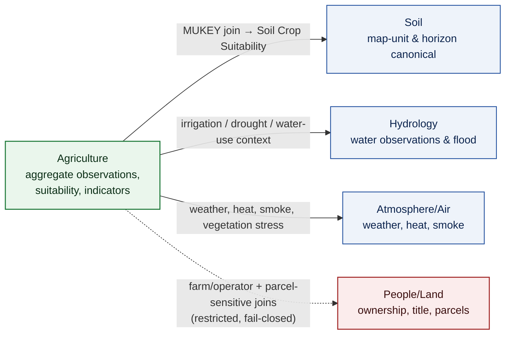

<!-- [KFM_META_BLOCK_V2]
doc_id: kfm://doc/agriculture-continuity-inventory-v1
title: Agriculture Domain — Continuity Inventory
type: standard
version: v1
status: draft
owners: Agriculture Domain Steward (PLACEHOLDER); Docs Steward
created: 2026-05-15
updated: 2026-05-15
policy_label: public
related:
  - docs/domains/agriculture/README.md
  - docs/doctrine/directory-rules.md
  - docs/doctrine/lifecycle-law.md
  - docs/doctrine/authority-ladder.md
  - docs/doctrine/trust-membrane.md
  - docs/registers/VERIFICATION_BACKLOG.md
  - docs/registers/DRIFT_REGISTER.md
tags: [kfm, domain, agriculture, continuity, inventory, lifecycle, governance]
notes:
  - "Repo not mounted this session; all path-shaped claims are PROPOSED until verified."
  - "Doctrine grounded in DOM-AG, ENCY, DIRRULES, MAP-MASTER, GAI."
[/KFM_META_BLOCK_V2] -->

# 🌾 Agriculture — Continuity Inventory

> A doctrine-grounded register of what the **Agriculture** domain owns, where it sits in the KFM trust membrane, which source and object families carry forward from prior passes, and which implementation claims remain **PROPOSED** until the repository, schemas, contracts, policy, tests, and release surfaces are verified.

<!-- Badges: placeholders allowed until canonical Shields.io endpoints are confirmed. -->


| Field | Value |
|---|---|
| **Document type** | Domain continuity register (standard doc) |
| **Domain** | Agriculture |
| **Authority of doctrine recorded here** | CONFIRMED (from `[DOM-AG]`, `[ENCY]`, `[DIRRULES]`, `[MAP-MASTER]`, `[GAI]`) |
| **Authority of any specific repo path quoted here** | PROPOSED until verified against mounted-repo evidence |
| **Owners** | Agriculture Domain Steward (PLACEHOLDER) · Docs Steward |
| **Status** | Draft |
| **Last reviewed** | 2026-05-15 |

> [!IMPORTANT]
> **No mounted repository was inspected this session.** Every file path, schema identifier, route, validator name, fixture name, manifest path, and release surface in this inventory is **PROPOSED** until reconciled with the actual repository under Directory Rules §4 (Placement Protocol) and §15 (Required README Contract). Doctrine recorded from the attached KFM corpus is **CONFIRMED** as doctrine; its **implementation maturity remains UNKNOWN.**

---

## 📑 Contents

1. [Purpose & how to read this file](#1--purpose--how-to-read-this-file)
2. [Domain identity & one-line purpose](#2--domain-identity--one-line-purpose)
3. [Scope, boundary, and explicit non-ownership](#3--scope-boundary-and-explicit-non-ownership)
4. [Ubiquitous language register](#4--ubiquitous-language-register)
5. [Source families inventory](#5--source-families-inventory)
6. [Object families inventory](#6--object-families-inventory)
7. [Cross-lane relations](#7--cross-lane-relations)
8. [Map & viewing products](#8--map--viewing-products)
9. [Pipeline shape (lifecycle)](#9--pipeline-shape-lifecycle)
10. [Sensitivity, rights, and publication posture](#10--sensitivity-rights-and-publication-posture)
11. [API, contract, and schema surfaces](#11--api-contract-and-schema-surfaces)
12. [Validators, tests, fixtures](#12--validators-tests-fixtures)
13. [Governed AI behavior](#13--governed-ai-behavior)
14. [Publication, correction, and rollback](#14--publication-correction-and-rollback)
15. [Continuity & carry-forward state](#15--continuity--carry-forward-state)
16. [Verification backlog & open questions](#16--verification-backlog--open-questions)
17. [Related docs](#17--related-docs)

---

## 1 · Purpose & how to read this file

The **Continuity Inventory** is a single navigable register for the Agriculture domain. It catalogues:

- The domain's **identity, scope, and explicit non-ownership** so reviewers can detect drift quickly.
- The **ubiquitous language**, **source families**, and **object families** that anchor every Agriculture artifact.
- The **lifecycle, governance, and trust posture** the domain must obey to participate in KFM's trust membrane.
- The **carry-forward state** (RETAINED / EXPANDED / NEW / SUPERSEDED) of each doctrine element relative to prior KFM passes.
- The **open verification items** that block treating any of the above as implementation fact.

> [!NOTE]
> **Read this as a register, not a runbook.** Implementation belongs in `contracts/`, `schemas/`, `policy/`, `tests/`, `tools/`, `pipelines/`, `pipeline_specs/`, and `release/` lanes. This document **explains and inventories**; it does not decide truth, rights, sensitivity, release, source authority, or review state. `[DIRRULES]` `[ENCY]`

### How truth labels are used here

| Label | Meaning in this inventory |
|---|---|
| **CONFIRMED** | Verified this session from attached KFM doctrine (`[DOM-AG]`, `[ENCY]`, `[DIRRULES]`, `[MAP-MASTER]`, `[GAI]`). |
| **PROPOSED** | Design, path, route, or schema name not yet verified against a mounted repo. |
| **INFERRED** | Reasonably derivable from doctrine but not directly stated. |
| **NEEDS VERIFICATION** | Checkable against the repo / source endpoints / rights terms; not yet checked this session. |
| **UNKNOWN** | Not resolvable without further evidence. |

[⤴ Back to top](#-agriculture--continuity-inventory)

---

## 2 · Domain identity & one-line purpose

**CONFIRMED doctrine / PROPOSED implementation:** The Agriculture domain governs **agricultural aggregate observations, soil/moisture/vegetation context, crop progress, suitability, stress indicators, irrigation links, conservation-practice context, agricultural-economy observations, and public-safe products**, with bounded AI and governed publication. `[DOM-AG]` `[ENCY]`

The Agriculture domain participates in KFM as a **lane**, not a root folder. Per Directory Rules §12 (Domain Placement Law), all Agriculture-specific files live as `<domain>` segments inside responsibility roots — never as `agriculture/` at the repo root. `[DIRRULES]`

### PROPOSED Agriculture lane spread

> [!CAUTION]
> The tree below is **PROPOSED** placement under Directory Rules §12. **None of these paths is asserted to exist in the current repository.** Each lane should be created (or confirmed) with a per-root or per-lane `README.md` that meets the §15 Required README Contract before files are added.

```text
# docs / contracts / schemas / policy lanes — meaning, shape, admissibility
docs/domains/agriculture/                          # PROPOSED — human-facing domain register (this file lives here)
contracts/domains/agriculture/                     # PROPOSED — Agriculture object-family meaning (semantic Markdown)
schemas/contracts/v1/domains/agriculture/          # PROPOSED — canonical machine schemas (per ADR-0001 default)
policy/domains/agriculture/                        # PROPOSED — admissibility & release policy bundles

# tests / fixtures / tools / packages lanes — proof, examples, validators, libs
tests/domains/agriculture/                         # PROPOSED — enforceability proof
fixtures/domains/agriculture/                      # PROPOSED — golden/valid/invalid sample inputs
packages/domains/agriculture/                      # PROPOSED — shared libs (if needed)
tools/validators/agriculture/                      # PROPOSED — Agriculture-specific validators (cross-domain shared validators live elsewhere)

# pipelines lanes — executable + declarative
pipelines/domains/agriculture/                     # PROPOSED — executable pipeline logic
pipeline_specs/agriculture/                        # PROPOSED — declarative pipeline configuration

# data lifecycle lanes — RAW → PUBLISHED, plus emitted proof/receipts
data/raw/agriculture/                              # PROPOSED — immutable source payload / reference
data/work/agriculture/                             # PROPOSED — normalization workspace
data/quarantine/agriculture/                       # PROPOSED — held failures w/ recorded reason
data/processed/agriculture/                        # PROPOSED — validated normalized objects + receipts
data/catalog/domain/agriculture/                   # PROPOSED — catalog records + EvidenceBundles
data/published/layers/agriculture/                 # PROPOSED — public-safe released artifacts
data/registry/sources/agriculture/                 # PROPOSED — Agriculture source registry entries

# release lane — release decisions, manifests, rollback, correction
release/candidates/agriculture/                    # PROPOSED — release candidates pending governance
```

`[DIRRULES §12]` `[DIRRULES §4]` `[ENCY]` `[DOM-AG]`

[⤴ Back to top](#-agriculture--continuity-inventory)

---

## 3 · Scope, boundary, and explicit non-ownership

> [!NOTE]
> Boundary discipline is what keeps cross-domain coupling honest. The Agriculture domain *uses* hydrology, soil, atmosphere, and people/land context — but it **must not republish their canonical truth as Agriculture truth.** `[DOM-AG]` `[ENCY]`

### 3.1 Owned object families (CONFIRMED / PROPOSED field realization)

The following object families are owned by Agriculture (the domain is responsible for their meaning, shape, sensitivity policy, lifecycle, and release decisions): `[DOM-AG]` `[ENCY]`

- Crop Observation
- Field Candidate
- Crop Rotation
- Yield Observation
- Irrigation Link
- Conservation Practice
- Soil Crop Suitability
- Agricultural Economy Observation
- Supply Chain Node
- Drought Stress Indicator
- Pest Stress Indicator
- Aggregation Receipt

### 3.2 Explicit non-ownership

| Concern | Owning lane | Why Agriculture does not own it |
|---|---|---|
| Canonical soil map-unit & horizon semantics | Soil | Soil owns SSURGO map-unit/horizon truth; Agriculture *joins* via MUKEY. `[DOM-AG]` |
| Water observations & flood context | Hydrology | Agriculture references irrigation/drought/water-use *as context*. `[DOM-AG]` |
| Weather, heat, smoke, atmospheric context | Atmosphere/Air | Used as input; not republished as Agriculture canonical. `[DOM-AG]` |
| Ownership, title, parcels, living-person privacy | People/Land | Farm/operator and parcel-sensitive joins remain restricted. `[DOM-AG]` |

[⤴ Back to top](#-agriculture--continuity-inventory)

---

## 4 · Ubiquitous language register

The following terms are **CONFIRMED** as Agriculture's ubiquitous language. Field realization (the concrete schema fields, code identifiers, and validators that carry these terms) is **PROPOSED** until repo evidence settles the names. KFM-specific casing and compound terms are preserved exactly. `[DOM-AG]` `[ENCY]`

| Term | Role in Agriculture | Field realization | Source |
|---|---|---|---|
| **Crop Observation** | Evidence of a crop observed at a place/time, with source-role and rights binding | PROPOSED | `[DOM-AG]` `[ENCY]` |
| **Field Candidate** | Candidate field polygon (provisional until evidence + rights pass) | PROPOSED | `[DOM-AG]` `[ENCY]` |
| **Crop Rotation** | Sequenced crop history for a field | PROPOSED | `[DOM-AG]` `[ENCY]` |
| **Yield Observation** | Aggregate / permissioned yield evidence | PROPOSED | `[DOM-AG]` `[ENCY]` |
| **Irrigation Link** | Provisional/observed irrigation relationship | PROPOSED | `[DOM-AG]` `[ENCY]` |
| **Conservation Practice** | Practice-context record | PROPOSED | `[DOM-AG]` `[ENCY]` |
| **Soil Crop Suitability** | Soil ↔ crop suitability derivative | PROPOSED | `[DOM-AG]` `[ENCY]` |
| **Agricultural Economy Observation** | Economic observation tied to agriculture | PROPOSED | `[DOM-AG]` `[ENCY]` |
| **Supply Chain Node** | Supply-chain context node | PROPOSED | `[DOM-AG]` `[ENCY]` |
| **Drought Stress Indicator** | Public-safe drought stress derivative | PROPOSED | `[DOM-AG]` `[ENCY]` |
| **Pest Stress Indicator** | Public-safe pest stress derivative | PROPOSED | `[DOM-AG]` `[ENCY]` |
| **Aggregation Receipt** | Receipt proving aggregation thresholds satisfied | PROPOSED | `[DOM-AG]` `[ENCY]` |
| **VWC** | Volumetric water content (station / gridded soil moisture) | PROPOSED | `[DOM-AG]` `[ENCY]` |
| **Spec hash** | Deterministic identity component for normalized digest | PROPOSED | `[DOM-AG]` `[ENCY]` |

### Cross-cutting terms used by Agriculture (owned elsewhere)

`EvidenceBundle` · `EvidenceRef` · `SourceDescriptor` · `DatasetVersion` · `ValidationReport` · `RunReceipt` · `DecisionEnvelope` · `RuntimeResponseEnvelope` · `ReleaseManifest` · `LayerManifest` · `CorrectionNotice` · `RollbackCard` · `ReviewRecord` · `AIReceipt` — all CONFIRMED doctrine terms; PROPOSED Agriculture-specific projections. `[ENCY]` `[GAI]`

[⤴ Back to top](#-agriculture--continuity-inventory)

---

## 5 · Source families inventory

**CONFIRMED source families** for Agriculture (from `[DOM-AG]` and the Domain Encyclopedia). Rights, current terms, endpoint surface, cadence, and activation status are **NEEDS VERIFICATION** until confirmed against the source registry and live endpoints. Sensitive joins fail closed by default. `[DOM-AG]` `[ENCY]`

| Source family | Typical role | Rights / sensitivity | Freshness | Status |
|---|---|---|---|---|
| SSURGO / Soil Data Access | Authority / observation / context | Rights NEEDS VERIFICATION; sensitive joins fail closed | Source-vintage specific | `[DOM-AG]` `[ENCY]` |
| gSSURGO | Authority / observation / context | Rights NEEDS VERIFICATION | Source-vintage specific | `[DOM-AG]` `[ENCY]` |
| Kansas Mesonet | Observation (weather / soil moisture) | Rights NEEDS VERIFICATION | Sub-daily/daily cadence | `[DOM-AG]` `[ENCY]` |
| NRCS SCAN | Observation (soil moisture / climate) | Rights NEEDS VERIFICATION | Sub-daily cadence | `[DOM-AG]` `[ENCY]` |
| NOAA USCRN | Observation (climate reference network) | Rights NEEDS VERIFICATION | Sub-daily/hourly cadence | `[DOM-AG]` `[ENCY]` |
| NASA SMAP | Observation / model (soil moisture grids) | Rights NEEDS VERIFICATION; aggregation discipline applies | Product-cadence specific | `[DOM-AG]` `[ENCY]` |
| NASA HLS / HLS-VI | Observation / model (vegetation index context) | Rights NEEDS VERIFICATION | Product-cadence specific | `[DOM-AG]` `[ENCY]` |
| USDA NASS QuickStats / Crop Progress | Authority / observation (aggregate) | Rights NEEDS VERIFICATION; **field-level claims fail closed** | Survey/release cadence | `[DOM-AG]` `[ENCY]` |
| NRCS Conservation Practice data | Observation / context | Rights NEEDS VERIFICATION | Source-vintage specific | `[ENCY]` |
| Irrigation / water-use sources (where permitted) | Observation / context | Rights & sensitivity NEEDS VERIFICATION | Source-cadence specific | `[ENCY]` |
| Crop insurance / market / economy (where permitted) | Observation / context | Rights NEEDS VERIFICATION; permission-bound | Source-cadence specific | `[ENCY]` |
| Local extension sources | Observation / context | Rights NEEDS VERIFICATION | Source-cadence specific | `[ENCY]` |

> [!WARNING]
> **Source role discipline is non-negotiable.** A NASS *aggregate* must not be silently promoted to a field-level claim; an SMAP/HLS *gridded product* must not become field-level truth; a private operator dataset must not leak through suitability or stress derivatives. Source-role-mismatch tests are a required validator family (see §12). `[DOM-AG]` `[ENCY]`

[⤴ Back to top](#-agriculture--continuity-inventory)

---

## 6 · Object families inventory

**CONFIRMED owned object set** (from `[DOM-AG]`). Identity rule is **PROPOSED**: `source_id + object_role + temporal_scope + normalized_digest`. **CONFIRMED temporal posture:** source, observed, valid, retrieval, release, and correction times stay distinct where material. `[DOM-AG]` `[ENCY]`

<details>
<summary><strong>Object families — full table (click to expand)</strong></summary>

| Object family | Purpose | Identity rule (PROPOSED) | Temporal posture (CONFIRMED) |
|---|---|---|---|
| Crop Observation | Agriculture crop observation evidence / released derivative | source_id + role + scope + normalized digest | source / observed / valid / retrieval / release / correction times distinct |
| Field Candidate | Provisional field polygon evidence | source_id + role + scope + normalized digest | as above |
| Crop Rotation | Sequenced rotation history | source_id + role + scope + normalized digest | as above |
| Yield Observation | Aggregate/permissioned yield evidence | source_id + role + scope + normalized digest | as above |
| Irrigation Link | Irrigation relationship evidence | source_id + role + scope + normalized digest | as above |
| Conservation Practice | Practice-context evidence | source_id + role + scope + normalized digest | as above |
| Soil Crop Suitability | Suitability derivative (joins Soil) | source_id + role + scope + normalized digest | as above |
| Agricultural Economy Observation | Economic observation evidence | source_id + role + scope + normalized digest | as above |
| Supply Chain Node | Supply-chain context node | source_id + role + scope + normalized digest | as above |
| Drought Stress Indicator | Public-safe drought stress derivative | source_id + role + scope + normalized digest | as above |
| Pest Stress Indicator | Public-safe pest stress derivative | source_id + role + scope + normalized digest | as above |
| Aggregation Receipt | Receipt proving aggregation thresholds | source_id + role + scope + normalized digest | as above |

`[DOM-AG]` `[ENCY]`

</details>

[⤴ Back to top](#-agriculture--continuity-inventory)

---

## 7 · Cross-lane relations

CONFIRMED relation set / PROPOSED field realization. Every cross-lane relation **must preserve ownership, source role, sensitivity, and EvidenceBundle support.** `[DOM-AG]` `[ENCY]`



> [!NOTE]
> This diagram is a **CONFIRMED-doctrine sketch / PROPOSED edge labels**. Edge field names, join keys beyond MUKEY, and exact sensitivity transforms are NEEDS VERIFICATION against contracts/schemas/policy in the mounted repo. `[DOM-AG]` `[ENCY]` `[DIRRULES]`

| This domain | Related lane | Relation type | Constraint |
|---|---|---|---|
| Agriculture | Soil | MUKEY joins; suitability support | Preserve ownership, source role, sensitivity, evidence support |
| Agriculture | Hydrology | Irrigation, drought, water-use context | Preserve ownership, source role, sensitivity, evidence support |
| Agriculture | Atmosphere/Air | Weather, heat, smoke, vegetation stress | Preserve ownership, source role, sensitivity, evidence support |
| Agriculture | People/Land | Farm/operator + parcel-sensitive contexts | Restricted by default; fail-closed for unreviewed joins |

`[DOM-AG]` `[ENCY]`

[⤴ Back to top](#-agriculture--continuity-inventory)

---

## 8 · Map & viewing products

**PROPOSED** Agriculture-specific viewing products (status: PROPOSED until layer registry, layer manifests, and release manifests are verified): `[DOM-AG]` `[ENCY]`

- Public-safe **crop progress** maps
- Aggregate **crop-condition** view
- **Soil ↔ crop suitability** map
- **Station soil-moisture** series
- **Satellite/grid moisture** context (SMAP)
- **Vegetation index** context (HLS / HLS-VI)
- **Drought/pest stress** indicators

**CONFIRMED cross-cutting viewing products** (apply to Agriculture surfaces just as they apply to every other domain): `[MAP-MASTER]` `[GAI]`

- **Evidence Drawer** (resolved from governed API, not built from raw map properties)
- **Time-aware state** (timeline, compare mode, generation-aware temporal model)
- **Trust badges** (rendered from resolved evidence + policy state, not from layer style)
- **Sensitivity-redacted view** (public/redacted vs steward/exact)
- **Correction / stale-state view**
- **Governed Focus Mode** (AI is interpretive; EvidenceBundle outranks generated language)

> [!IMPORTANT]
> Map products are **derived surfaces**, not canonical truth. Layers carry **proof/release refs** and are served by governed APIs; the renderer is not the source of authority. `[DIRRULES §7.1]` `[MAP-MASTER]`

[⤴ Back to top](#-agriculture--continuity-inventory)

---

## 9 · Pipeline shape (lifecycle)

**CONFIRMED doctrine / PROPOSED Agriculture-specific realization.** Agriculture follows the KFM lifecycle invariant. Promotion is a **governed state transition, not a file move.** `[DIRRULES]` `[DOM-AG]` `[ENCY]`

```mermaid
flowchart LR
    RAW["data/raw/agriculture/<br/>SourceDescriptor exists"]:::raw
    WORK["data/work/agriculture/<br/>or data/quarantine/agriculture/<br/>validation + policy gate"]:::work
    PROC["data/processed/agriculture/<br/>EvidenceRef + ValidationReport<br/>+ digest closure"]:::proc
    CAT["data/catalog/domain/agriculture/<br/>EvidenceBundle + graph/triplet<br/>+ release candidate"]:::cat
    PUB["data/published/layers/agriculture/<br/>ReleaseManifest + correction path<br/>+ rollback target"]:::pub

    RAW -->|"normalize schema/geometry/time/<br/>identity/evidence/rights/policy"| WORK
    WORK -->|"emit validated objects<br/>+ receipts + public-safe candidates"| PROC
    PROC -->|"catalog/proof closure"| CAT
    CAT -->|"review state + release decision"| PUB
    WORK -. "fail-closed → quarantine reason recorded" .-> WORK

    classDef raw fill:#f5f5f5,stroke:#666,color:#222;
    classDef work fill:#fff5d6,stroke:#a47200,color:#3a2a00;
    classDef proc fill:#eaf3fb,stroke:#1f6feb,color:#0b234d;
    classDef cat fill:#eef9ee,stroke:#2a7a3a,color:#0b2e16;
    classDef pub fill:#e9f5ff,stroke:#0a5fb5,color:#06325f;
```



| Stage | Handling | Gate | Status |
|---|---|---|---|
| **RAW** | Capture immutable source payload/reference with source role, rights, sensitivity, citation, time, hash | `SourceDescriptor` exists | PROPOSED |
| **WORK / QUARANTINE** | Normalize schema, geometry, time, identity, evidence, rights, policy; hold failures | Validation & policy gate pass, or quarantine reason recorded | PROPOSED |
| **PROCESSED** | Emit validated normalized objects, receipts, public-safe candidates | `EvidenceRef`, `ValidationReport`, digest closure exist | PROPOSED |
| **CATALOG / TRIPLET** | Emit catalog records, `EvidenceBundle`s, graph/triplet projections, release candidates | Catalog/proof closure passes | PROPOSED |
| **PUBLISHED** | Serve released public-safe artifacts through governed APIs and manifests | `ReleaseManifest` + correction path + rollback target + review/policy state | PROPOSED |

`[DOM-AG]` `[ENCY]` `[DIRRULES]`

[⤴ Back to top](#-agriculture--continuity-inventory)

---

## 10 · Sensitivity, rights, and publication posture

> [!CAUTION]
> **Aggregate and satellite products must not become field/operator truth.** Farm/operator private data, proprietary yield, pesticide records, and private-sensitive joins **fail closed** by default. Public release requires evidence, source-role correctness, rights resolution, sensitivity check, validation, review state, release state, correction path, and rollback target. `[DOM-AG]` `[ENCY]` `[DIRRULES]`

CONFIRMED doctrine items:

- **Cite-or-abstain** is the default truth posture for any Agriculture claim presented publicly. `[ENCY]` `[GAI]`
- **Default deny** for unreviewed exact sensitive Agriculture locations or private data on public surfaces. `[DOM-AG]` `[ENCY]`
- **Unclear rights, unresolved source role, missing evidence, unresolved sensitivity, or absent release state blocks public promotion.** `[ENCY]` `[DIRRULES]`
- **Public products aggregate to county / HUC / grid thresholds** where field-level publication would be sensitive; redactions and generalizations record transforms and reasons. `[DOM-AG]` `[ENCY]`

[⤴ Back to top](#-agriculture--continuity-inventory)

---

## 11 · API, contract, and schema surfaces

> [!IMPORTANT]
> **All surfaces in this section are PROPOSED.** Exact route names, DTO names, schema homes, and policy bundle paths are subject to Directory Rules §4 placement and §2.4 ADR review. Routes must traverse the governed-API trust membrane (no direct reads of canonical stores from public clients). `[DIRRULES §7.1]` `[ENCY]`

| Endpoint / artifact (PROPOSED) | DTO / schema (PROPOSED) | Finite outcomes | Status |
|---|---|---|---|
| Agriculture feature/detail resolver — route TBD | `AgricultureDecisionEnvelope` | ANSWER / ABSTAIN / DENY / ERROR | PROPOSED; route name UNKNOWN |
| Agriculture layer manifest resolver | `LayerManifest` / domain layer descriptor | ANSWER / DENY / ERROR | PROPOSED; public-safe release only |
| Agriculture Evidence Drawer payload | `EvidenceDrawerPayload` + `EvidenceBundle` projection | ANSWER / ABSTAIN / DENY / ERROR | PROPOSED; evidence- & policy-filtered |
| Agriculture Focus Mode answer | `RuntimeResponseEnvelope` + `AIReceipt` | ANSWER / ABSTAIN / DENY / ERROR | PROPOSED; AI never root truth |
| Correction submit (cross-domain) | `CorrectionNoticeCandidate` | ACCEPTED / DENY / ERROR | PROPOSED |
| Review decision (cross-domain) | `ReviewRecord` | ALLOW / RESTRICT / DENY / ERROR | PROPOSED |

**PROPOSED schema home (per ADR-0001 default):** `schemas/contracts/v1/domains/agriculture/`. Any deviation requires an ADR per Directory Rules §2.4. `[DIRRULES]`

[⤴ Back to top](#-agriculture--continuity-inventory)

---

## 12 · Validators, tests, fixtures

PROPOSED validator/test families specifically for Agriculture (status: PROPOSED until `tests/domains/agriculture/` and `fixtures/domains/agriculture/` are inspected): `[DOM-AG]` `[ENCY]`

| Family | Purpose | Status |
|---|---|---|
| **SSURGO / SDA lineage tests** | Confirm Soil source-role correctness in suitability joins | PROPOSED |
| **Soil-moisture unit/depth/QC tests** | Validate VWC units, depths, station QC | PROPOSED |
| **Crop-progress aggregate-only tests** | Block field-level claims from aggregate NASS sources | PROPOSED |
| **Vegetation index mask/time tests** | Validate HLS/HLS-VI masking, time alignment | PROPOSED |
| **Policy deny tests** | Field-level NASS claims → DENY by default | PROPOSED |
| **Catalog closure tests** | Confirm `EvidenceBundle` closure for catalog entries | PROPOSED |

CONFIRMED cross-cutting test families (apply across domains, including Agriculture): schema validation, source descriptor validation, rights validation, sensitivity validation, evidence closure, temporal logic, geometry validity, citation validation, release-manifest validation, rollback drill, no-network fixtures, non-regression tests. `[ENCY]`

> [!NOTE]
> **No-network fixtures are required.** Agriculture tests must run deterministically without live source endpoints; fixture data lives in `fixtures/domains/agriculture/` and follows golden/valid/invalid conventions. `[DIRRULES §4]` `[ENCY]`

[⤴ Back to top](#-agriculture--continuity-inventory)

---

## 13 · Governed AI behavior

**CONFIRMED doctrine / PROPOSED implementation.** AI is **interpretive, not the root truth source**. `EvidenceBundle` outranks generated language. `[GAI]` `[ENCY]`

| AI action | Allowed when… | Outcome |
|---|---|---|
| Summarize released Agriculture EvidenceBundles | Evidence and policy support exist | ANSWER + `AIReceipt` |
| Compare evidence across sources | All cited EvidenceBundles are released or review-authorized | ANSWER + `AIReceipt` |
| Explain limitations / stale state | Always permitted | ANSWER + `AIReceipt` |
| Draft steward-review notes | Permitted in steward surfaces | ANSWER + `AIReceipt` |
| Make field-level claim from aggregate source | **NEVER** | DENY |
| Answer when evidence insufficient | — | ABSTAIN + `AIReceipt` |
| Answer when rights / sensitivity / release state blocks | — | DENY + `AIReceipt` |

`AIReceipt` and `RuntimeResponseEnvelope` carry outcome ∈ {ANSWER, ABSTAIN, DENY, ERROR}, `evidence_refs`, `policy_decision`, and `citation_validation`. `[GAI]` `[ENCY]`

[⤴ Back to top](#-agriculture--continuity-inventory)

---

## 14 · Publication, correction, and rollback

**CONFIRMED doctrine / PROPOSED implementation.** Agriculture publication requires: `[DOM-AG]` `[ENCY]`

1. `ReleaseManifest` for the artifact set
2. `EvidenceBundle` support for every claim that depends on evidence
3. Validation & policy gate pass
4. Review state where required by sensitivity or source role
5. Correction path (how a published artifact gets corrected without rewriting history)
6. **Stale-state rule** (how a published artifact ages out or is flagged)
7. **Rollback target** (the prior known-good state the system can return to)

> [!WARNING]
> **Watchers do not publish. Connectors do not publish.** Connectors emit to `data/raw/` or `data/quarantine/`; pipelines promote through governed state transitions; release decisions land in `release/candidates/agriculture/` and are decided under the §2.4 ADR + §15 README discipline. `[DIRRULES §13.5]` `[DIRRULES §7.1]`

[⤴ Back to top](#-agriculture--continuity-inventory)

---

## 15 · Continuity & carry-forward state

This section is the **continuity register**: which doctrine elements come into Agriculture from prior KFM passes, which are retained, expanded, or new, and which are open for verification or supersession.

### 15.1 Source authority for this inventory

| Source ID (in this session) | Document | Role |
|---|---|---|
| `[DOM-AG]` | Domains Culmination Atlas v1.1 — Agriculture chapter | Domain doctrine baseline |
| `[ENCY]` | KFM Domain & Capability Encyclopedia | Cross-domain doctrine, Appendix E (release/correction/rollback) |
| `[DIRRULES]` | Directory Rules | Placement, lifecycle, trust membrane |
| `[MAP-MASTER]` | Master MapLibre Components-Functions-Features | Map surfaces, trust-visible UI |
| `[GAI]` | Whole-UI + Governed AI Expansion Report | Governed AI behavior, finite outcomes |

### 15.2 Doctrine carry-forward (this Agriculture register vs. prior passes)

| Doctrine element | Carry-forward state | Status this session | Notes |
|---|---|---|---|
| Domain identity & one-line purpose | RETAINED | CONFIRMED doctrine | From `[DOM-AG]` / `[ENCY]` `[DOM-AG]` |
| Owned object families (12 items) | RETAINED | CONFIRMED doctrine | From `[DOM-AG]` |
| Source families list | RETAINED | CONFIRMED doctrine | Rights / endpoint terms NEEDS VERIFICATION |
| Cross-lane relations (Soil / Hyd / Atm / People-Land) | RETAINED | CONFIRMED doctrine | Field realization PROPOSED |
| Lifecycle invariant (RAW → PUBLISHED) | RETAINED | CONFIRMED doctrine | Promotion = governed state transition `[DIRRULES]` |
| Sensitivity / publication posture | RETAINED | CONFIRMED doctrine | Aggregate-default; fail-closed sensitive joins |
| Governed AI behavior (ANSWER/ABSTAIN/DENY/ERROR) | RETAINED | CONFIRMED doctrine | `[GAI]` |
| API/contract/schema surfaces | EXPANDED | PROPOSED | Inventory drawn from `[ENCY]` Section J + `[DOM-AG]` |
| Validator/test families | EXPANDED | PROPOSED | Inventory from `[DOM-AG]` Section K |
| PROPOSED Agriculture lane spread (Directory Rules §12) | NEW (in this file) | PROPOSED | Reproduced from `[DIRRULES §12]` |

### 15.3 Supersession & drift

No prior Agriculture doctrine is **superseded** by this register; this file is a **carry-forward register**, not an authority change. Any structural change to the lane spread, schema home, or release surface requires an **ADR per Directory Rules §2.4** and a corresponding entry in `docs/registers/DRIFT_REGISTER.md`. `[DIRRULES §2.4]` `[DIRRULES §13]`

[⤴ Back to top](#-agriculture--continuity-inventory)

---

## 16 · Verification backlog & open questions

These items block treating any of §11–§14 as implementation fact. Each item should also appear in `docs/registers/VERIFICATION_BACKLOG.md` with an owner and target date. `[DIRRULES §18]` `[ENCY]`

| # | Item | Evidence that would settle it | Status |
|---|---|---|---|
| AG-VB-01 | Verify NASS / QuickStats and Crop Progress activation | Mounted repo files, source-registry entries, fixtures, tests, emitted artifacts | NEEDS VERIFICATION |
| AG-VB-02 | Verify Kansas Mesonet and HLS / SMAP product terms | Source rights records, source descriptor, license inspection | NEEDS VERIFICATION |
| AG-VB-03 | Verify public-release sensitivity rules for farm/operator joins | Policy bundles, redaction validators, review records | NEEDS VERIFICATION |
| AG-VB-04 | Verify Agriculture API and layer registry | Governed-API route map, `LayerCatalogItem` entries, layer manifests | NEEDS VERIFICATION |
| AG-VB-05 | Confirm schema home: `schemas/contracts/v1/domains/agriculture/` vs. alternate | ADR-0001 conformance check; presence in mounted repo | NEEDS VERIFICATION |
| AG-VB-06 | Confirm validator/test inventory (§12) matches `tests/domains/agriculture/` | Repo inspection; test discovery | NEEDS VERIFICATION |
| AG-VB-07 | Confirm release surface: `release/candidates/agriculture/` vs. alternate | Repo inspection; release manifest presence | NEEDS VERIFICATION |
| AG-VB-08 | Confirm Aggregation Receipt schema & emission rule | Receipt schema, emitter pipeline spec, fixture parity | NEEDS VERIFICATION |
| AG-VB-09 | Confirm Focus Mode Agriculture-specific template set & deny reasons | Focus Mode templates, AIReceipt fixtures | NEEDS VERIFICATION |
| AG-VB-10 | Confirm correction & rollback drill exists for at least one Agriculture release | Rollback card, correction notice, drill receipt | NEEDS VERIFICATION |

[⤴ Back to top](#-agriculture--continuity-inventory)

---

## 17 · Related docs

> [!NOTE]
> Links are **repo-relative PROPOSED paths**. They may not all exist yet; mark any missing target as a `VERIFICATION_BACKLOG.md` entry under §16 rather than treating a broken link as evidence the target was deleted.

- `../../doctrine/directory-rules.md` — placement, lifecycle, trust-membrane authority
- `../../doctrine/lifecycle-law.md` — lifecycle invariant (PROPOSED home)
- `../../doctrine/authority-ladder.md` — source authority order (PROPOSED home)
- `../../doctrine/trust-membrane.md` — public path discipline (PROPOSED home)
- `../../doctrine/truth-posture.md` — cite-or-abstain (PROPOSED home)
- `../../registers/VERIFICATION_BACKLOG.md` — open verification items (PROPOSED home)
- `../../registers/DRIFT_REGISTER.md` — drift entries (PROPOSED home)
- `../../architecture/contract-schema-policy-split.md` — schema-home & policy-home split (PROPOSED home)
- `../../standards/PROV.md` — provenance standards crosswalk
- `../../standards/PMTILES.md` — tile delivery governance profile
- `../../standards/ISO-19115.md` — geographic metadata crosswalk
- `./README.md` — Agriculture domain landing page (PROPOSED)

---

<sub>Last updated: **2026-05-15** · Doc owner: **Agriculture Domain Steward (PLACEHOLDER)** · Reviewers: **Docs Steward + Policy Steward** · [⤴ Back to top](#-agriculture--continuity-inventory)</sub>
