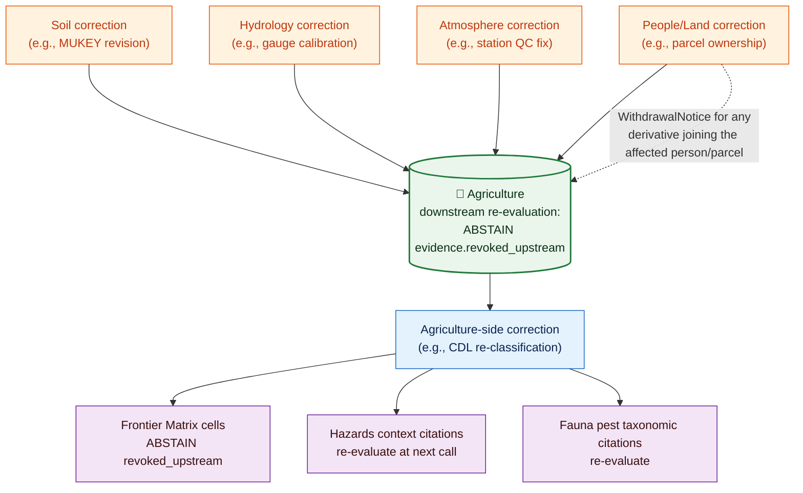

<!-- [KFM_META_BLOCK_V2]
doc_id: kfm://doc/domains/agriculture/cross-lane
title: Agriculture — Cross-Lane Edge Contracts
type: standard
subtype: domain-cross-lane
version: v1 (draft)
status: draft
owners: TODO — Agriculture Domain Steward · Architecture Steward · Policy Steward · Cross-Domain Reviewers (Soil · Hydrology · Atmosphere · People/Land · Habitat · Fauna · Flora · Geology · Hazards · Frontier Matrix)
created: 2026-05-26
updated: 2026-05-26
policy_label: public
contract_version: "3.0.0"
related:
  - docs/doctrine/ai-build-operating-contract.md
  - docs/doctrine/directory-rules.md
  - docs/doctrine/trust-membrane.md
  - docs/doctrine/lifecycle-law.md
  - docs/doctrine/policy-aware.md
  - docs/doctrine/evidence-first.md
  - docs/doctrine/ai-as-assistant.md
  - docs/doctrine/corrections-are-first-class.md
  - docs/domains/agriculture/README.md
  - docs/domains/agriculture/ARCHITECTURE.md
  - docs/domains/agriculture/api-contracts.md
  - docs/domains/agriculture/CANONICAL_PATHS.md
  - docs/domains/agriculture/CONTINUITY_INVENTORY.md
  - docs/domains/agriculture/policy/README.md
  - docs/domains/agriculture/sublanes/README.md
tags: [kfm, domain, agriculture, cross-lane, edges, integration, doctrine-adjacent, contract-v3]
notes:
  - Per-edge operational contract for every Agriculture cross-lane relationship.
  - Pinned to CONTRACT_VERSION = "3.0.0".
  - Sibling docs reference cross-lane edges; this doc specifies them.
  - All identity/join-key claims and validator names are PROPOSED until repo verification.
  - Where Atlas v1.0 disagrees with this doc, Atlas v1.0 governs and the conflict is filed against this doc.
[/KFM_META_BLOCK_V2] -->

# 🌾 Agriculture — Cross-Lane Edge Contracts

> The per-edge operational contract for every cross-lane relationship the Agriculture bounded context owns or participates in. Specifies which objects flow across each edge, on what identity / join keys, under what source-role discipline, what sensitivity transforms apply, what outcomes are returned, what validators enforce it, and how corrections cascade across the edge.

| Status | Owners | Last updated | Pinned to |
|---|---|---|---|
| `draft` | TODO — Agriculture Domain Steward · Architecture Steward · Policy Steward · Cross-Domain Reviewers | 2026-05-26 | `CONTRACT_VERSION = "3.0.0"` |

> [!IMPORTANT]
> **What this doc is — and what it is not.** This is the **per-edge operational contract** for Agriculture cross-lane relationships. The architectural overview lives in [`ARCHITECTURE.md`](./ARCHITECTURE.md) §10; the wire-level envelope contract lives in [`api-contracts.md`](./api-contracts.md) §9; the carry-forward register lives in [`CONTINUITY_INVENTORY.md`](./CONTINUITY_INVENTORY.md) §8. **This doc is where you go when the question is *"how exactly does this edge work?"***.

> [!CAUTION]
> **Source-role discipline applies on every edge.** A cross-lane edge **never** upgrades a source role. A NASS aggregate joined to a People/Land parcel is still an aggregate; an SMAP modeled grid joined to a Soil map-unit is still modeled; a CDL classification joined to a Hydrology HUC is still modeled. Promotion across an edge is forbidden. `[CONFIRMED — Atlas §24.1, §24.9.3.]`

> [!WARNING]
> **Where Atlas v1.0 disagrees with this doc, Atlas v1.0 governs.** This doc captures the per-edge specifics that the Atlas summarizes; any divergence is treated as a drift entry against this file, **not** a correction to Atlas. `[CONFIRMED — ENCY §24 reading guidance.]`

### Contents

1. [Purpose & scope](#sec-1-purpose)
2. [Authority & basis](#sec-2-authority)
3. [Edge taxonomy](#sec-3-taxonomy)
4. [Master edge map](#sec-4-master-map)
5. [Edge: Agriculture × Soil](#sec-5-soil)
6. [Edge: Agriculture × Hydrology](#sec-6-hydrology)
7. [Edge: Agriculture × Atmosphere / Air](#sec-7-atmosphere)
8. [Edge: Agriculture × Habitat](#sec-8-habitat)
9. [Edge: Agriculture × Fauna](#sec-9-fauna)
10. [Edge: Agriculture × Flora](#sec-10-flora)
11. [Edge: Agriculture × Geology](#sec-11-geology)
12. [Edge: Agriculture × Hazards](#sec-12-hazards)
13. [Edge: Agriculture × People / Land](#sec-13-people-land)
14. [Edge: Agriculture × Frontier Matrix](#sec-14-frontier-matrix)
15. [Touch edges (rare, advisory)](#sec-15-touch-edges)
16. [Correction propagation across edges](#sec-16-correction-cascade)
17. [Cross-lane validators](#sec-17-validators)
18. [Forbidden edges (anti-patterns)](#sec-18-forbidden)
19. [Open questions register](#sec-19-open-questions)
20. [Open verification backlog](#sec-20-backlog)
21. [Changelog](#sec-21-changelog)
22. [Definition of done](#sec-22-dod)
23. [Related docs](#sec-23-related)

---

## 1 · Purpose & scope

This document specifies, for each cross-lane edge that Agriculture participates in:

- **Direction** — does Agriculture *consume from* the other lane, *cite into* the other lane, or *inform* (advisory) the other lane?
- **Object families** that flow across the edge.
- **Identity / join keys** (PROPOSED; verifiable against schemas).
- **Source-role discipline** (which roles are admissible on this edge; which are forbidden).
- **Sensitivity disposition** (default tier; required transforms; deny rules).
- **Outcome grammar** the edge returns when invoked through the trust membrane.
- **Validators** that enforce edge conformance.
- **Correction-cascade direction** when an upstream claim is corrected.

It does **not** specify wire-level DTO field names (those live in [`api-contracts.md`](./api-contracts.md) §5) or repo placement (that lives in [`CANONICAL_PATHS.md`](./CANONICAL_PATHS.md) §9). Where this doc touches those concerns, it cross-references.

[⤴ Back to top](#top)

---

## 2 · Authority & basis

| Layer | Source | Status |
|---|---|---|
| Operating law for AI-authored or AI-touched repo work (`CONTRACT_VERSION = "3.0.0"`) | [`ai-build-operating-contract.md`](../../doctrine/ai-build-operating-contract.md) | **CONFIRMED doctrine** |
| Placement protocol; Domain Placement Law | [`directory-rules.md`](../../doctrine/directory-rules.md) §§3, 4, 12 | **CONFIRMED doctrine** |
| Trust-boundary contract; correction-propagation cascade | [`trust-membrane.md`](../../doctrine/trust-membrane.md) §7–§8 | **CONFIRMED doctrine** |
| Finite policy outcomes; sensitive lanes default to `DENY` | [`policy-aware.md`](../../doctrine/policy-aware.md) | **CONFIRMED doctrine** |
| Cite-or-abstain truth posture | [`evidence-first.md`](../../doctrine/evidence-first.md) | **CONFIRMED doctrine** |
| AI is interpretive, never root truth | [`ai-as-assistant.md`](../../doctrine/ai-as-assistant.md) | **CONFIRMED doctrine** |
| `CorrectionNotice` + `RollbackCard` lineage | [`corrections-are-first-class.md`](../../doctrine/corrections-are-first-class.md) | **CONFIRMED doctrine** |
| Agriculture cross-lane edge baseline | Atlas v1.1 §9.F + §24.4.7 (`[DOM-AG]`, `[ENCY]`) | **CONFIRMED doctrine** |
| Habitat → Agriculture edges | Atlas §24.4.4 | **CONFIRMED doctrine** |
| Fauna → Agriculture edges | Atlas §24.4.5 | **CONFIRMED doctrine** |
| Flora → Agriculture edges | Atlas §24.4.6 | **CONFIRMED doctrine** |
| Geology → Agriculture edges | Atlas §24.4.8 | **CONFIRMED doctrine** |
| Source-role anti-collapse register | Atlas §24.1 | **CONFIRMED doctrine** |
| Object-family × Domain matrix | Atlas §24.13 | **CONFIRMED doctrine** |

### 2.1 RFC 2119 conformance

**MUST / MUST NOT** non-negotiable; **SHOULD / SHOULD NOT** strong default; **MAY** permitted. Per `directory-rules.md` §2.2 and operating contract §5.1.1.

[⤴ Back to top](#top)

---

## 3 · Edge taxonomy

Every cross-lane edge falls into exactly one of the categories below. The category determines what kind of contract the edge has.

| Category | Definition | Example |
|---|---|---|
| **Consume from owner** | Agriculture reads objects from the owning lane via `EvidenceRef`, never re-publishes the source content as Agriculture truth. | Agriculture consumes Soil's `SoilMapUnit` (MUKEY) for `SoilCropSuitability`. |
| **Cite into owner's lane** | Agriculture provides context that the owning lane may cite. | Agriculture's `DroughtStressIndicator` cited as context by Hazards (advisory only). |
| **Inform (advisory)** | Agriculture provides context the other lane *may* use, with no obligation; never regulatory. | Agriculture's `PestStressIndicator` informs Fauna disease surveillance — advisory only. |
| **Restricted (deny-default)** | Edge is **denied by default**; promotion requires explicit steward review + named agreement. | Agriculture × People/Land: any join that resolves to identifiable operator/parcel. |
| **Forbidden** | Edge MUST NOT exist; surfacing the edge is a §13.5 anti-pattern or a §24.9.2 trust-membrane violation. | Agriculture-as-alert-authority to Hazards; Agriculture-as-regulatory to Hydrology. |
| **Reciprocal (matrix-cell)** | Agriculture publishes inputs to Frontier Matrix cells; the matrix cell's correction cascades back as `revoke_upstream`. | Agriculture county-year aggregates → Frontier Matrix cells. |

**Default disposition.** Edges with `restricted` or unresolved category default to `DENY` per [`policy-aware.md`](../../doctrine/policy-aware.md).

[⤴ Back to top](#top)

---

## 4 · Master edge map

```mermaid
flowchart TB
    AG["🌾 Agriculture<br/>aggregate observations · suitability<br/>stress indicators · supply chain"]:::ag

    SOIL["🌱 Soil<br/>map-unit · horizon canonical"]:::ctx
    HYD["💧 Hydrology<br/>water observations · NFHL regulatory"]:::ctx
    ATM["☁️ Atmosphere / Air<br/>weather · heat · smoke"]:::ctx
    HAB["🌿 Habitat<br/>habitat patches · quality scores"]:::ctx
    FAUNA["🦌 Fauna<br/>taxonomy · occurrence"]:::ctx
    FLORA["🌻 Flora<br/>vegetation community · invasive"]:::ctx
    GEO["⛰ Geology<br/>parent material · resources"]:::ctx
    HAZ["⚠️ Hazards<br/>regulatory hazard authority"]:::ctx
    MX["🗓 Frontier Matrix<br/>county-year cells"]:::ctx

    PPL["🛡 People / Land<br/>ownership · title · parcels<br/>living-person privacy"]:::sens
    SETTLE["🛡 Settlements / Infrastructure<br/>critical assets"]:::sens
    ARCH["🛡 Archaeology<br/>cultural heritage"]:::sens

    AG -->|"MUKEY join · suitability support<br/>(consumes from owner)"| SOIL
    AG -->|"irrigation · drought · water-use context<br/>(consumes from owner)"| HYD
    AG -->|"weather · heat · smoke · vegetation stress<br/>(consumes from owner)"| ATM
    AG <-->|"conservation-practice framing<br/>(consumes ↔ informs)"| HAB
    AG <-->|"pest-stress (Agriculture-owned)<br/>· taxonomic identity (Fauna-owned)"| FAUNA
    AG <-->|"invasive-plant management framing<br/>(consumes ↔ informs)"| FLORA
    AG -->|"parent-material context (advisory)<br/>(consumes from owner)"| GEO
    AG -->|"drought / pest stress as hazard context<br/>(cite — never alert)"| HAZ
    AG <-->|"aggregate county-year → matrix cells<br/>(reciprocal; AggregationReceipt required)"| MX

    AG -.->|"farm/operator + parcel joins<br/>(RESTRICTED · fail-closed)"| PPL
    AG -.->|"critical-asset overlap<br/>(advisory only)"| SETTLE
    AG -.->|"ethnobotanical context<br/>(steward-reviewed; rare)"| ARCH

    classDef ag fill:#eaf6ec,stroke:#1f7a3a,stroke-width:2px,color:#0b2e16;
    classDef ctx fill:#eef3fa,stroke:#1f4e9d,stroke-width:1.2px,color:#0b234d;
    classDef sens fill:#fbecec,stroke:#a32a2a,stroke-width:1.5px,color:#3a0e0e;
```

### 4.1 Master edge inventory

| # | Edge | Category | Atlas reference | Default disposition |
|---:|---|---|---|---|
| 1 | Agriculture × **Soil** | consume from owner | §24.4.7 + §9.F | `ANSWER` (with MUKEY join) |
| 2 | Agriculture × **Hydrology** | consume from owner | §24.4.7 + §9.F | `ANSWER` (with regulatory provenance preserved) |
| 3 | Agriculture × **Atmosphere / Air** | consume from owner | §24.4.7 + §9.F | `ANSWER` (with model identity) |
| 4 | Agriculture × **Habitat** | reciprocal (consumes + informs) | §24.4.4 + §24.4.7 | `ANSWER` (framing only) |
| 5 | Agriculture × **Fauna** | reciprocal (taxonomic + pest) | §24.4.5 + §24.4.7 | `ANSWER` (taxonomic identity only) |
| 6 | Agriculture × **Flora** | reciprocal (invasive + management) | §24.4.6 + §24.4.7 | `ANSWER` (framing only) |
| 7 | Agriculture × **Geology** | consume from owner (advisory) | §24.4.8 | `ANSWER` (advisory) |
| 8 | Agriculture × **Hazards** | cite into owner's lane | §24.4.7 + §24.9.2 | `ANSWER` (context only; never alert) |
| 9 | Agriculture × **People / Land** | **restricted (deny-default)** | §24.4.7 + §24.5.2 | `DENY` public; HOLD for steward |
| 10 | Agriculture × **Frontier Matrix** | reciprocal (matrix-cell) | §24.4.7 + §24.13 | `ANSWER` (with `AggregationReceipt`) |
| 11 | Agriculture × **Settlements / Infrastructure** | touch (advisory) | §24.4 *(implicit)* | `ANSWER` (advisory; not regulatory) |
| 12 | Agriculture × **Archaeology** | touch (steward-reviewed; rare) | §24.4.6 *(via Flora)* | `HOLD` until steward review |

[⤴ Back to top](#top)

---

## 5 · Edge: Agriculture × Soil

| Field | Value |
|---|---|
| **Category** | Consume from owner |
| **Direction** | Agriculture **consumes** Soil objects via `EvidenceRef`. Agriculture **MUST NOT** re-publish Soil objects as Agriculture canonical. |
| **Atlas reference** | §24.4.7 · §9.F · Atlas §24.13 (object-family × domain matrix) |
| **Object families consumed (Soil-owned)** | `SoilMapUnit` · `SoilComponent` · `Horizon` · `SoilProperty` · `Hydrologic Soil Group` · `Pedon` · `SuitabilityRating` |
| **Object families produced (Agriculture-owned)** | `SoilCropSuitability` (consumes Soil; produces Agriculture-modeled derivative) |
| **Identity / join keys (PROPOSED)** | **`MUKEY`** (map-unit) · `COKEY` (component) · `CHKEY` (horizon). Set at admission in Soil's `SourceDescriptor`; preserved verbatim across the join. |
| **Source-role discipline** | Agriculture's downstream object inherits `role = modeled`. Soil's `Pedon` data crossing as `observed` MUST NOT be relabeled `modeled` after the join. SSURGO `Hydrologic Soil Group` crosses as `regulatory` and MUST stay `regulatory`. `[Atlas §24.1.]` |
| **Sensitivity disposition** | T0 (open) for aggregate suitability over public-safe Soil units. Field-level joins follow Agriculture's field-level deny-default (see §13 People/Land). |
| **Outcome grammar** | `ANSWER` when MUKEY resolves and Soil `EvidenceBundle` is releaseable; `ABSTAIN` if Soil source is stale or revoked upstream; `ERROR` on malformed MUKEY. |
| **Validators (PROPOSED)** | `validate_mukey_join` · `validate_soil_role_preservation` · `validate_hydrologic_group_regulatory` · `validate_suitability_run_receipt` |
| **Correction cascade** | Soil-side correction (`CorrectionNotice` on `SoilMapUnit`) → Agriculture `SoilCropSuitability` downgrades to `ABSTAIN evidence.revoked_upstream` on next call per [`trust-membrane.md`](../../doctrine/trust-membrane.md) §8. |
| **Forbidden** | Re-publishing `SoilMapUnit` under `schemas/contracts/v1/domains/agriculture/`. Re-labeling Soil's `Pedon` as Agriculture `CropObservation`. Joining sensitive Soil pedon coords into a public Agriculture surface without `RedactionReceipt`. |

> [!NOTE]
> **MUKEY is the load-bearing join key for the Agriculture × Soil edge.** Any Agriculture object that joins to Soil but cannot resolve MUKEY MUST `ABSTAIN` with reason `mukey_unresolved`. `[CONFIRMED — DOM-AG §C; Atlas §24.4.7.]`

[⤴ Back to top](#top)

---

## 6 · Edge: Agriculture × Hydrology

| Field | Value |
|---|---|
| **Category** | Consume from owner |
| **Direction** | Agriculture **consumes** Hydrology objects for irrigation, drought, and water-use context. Agriculture **MUST NOT** re-publish Hydrology objects as Agriculture canonical. |
| **Atlas reference** | §24.4.7 · §9.F |
| **Object families consumed (Hydrology-owned)** | `Watershed` · `HUCUnit` · `HydroFeature` · `ReachIdentity` · `GaugeSite` · `FlowObservation` · `Water Quality Observation` · `Groundwater Well` · `NFHLZone` · `Observed Flood Event` |
| **Object families produced (Agriculture-owned)** | `IrrigationLink` (consumes Hydrology gauge / withdrawal; produces Agriculture-observed link record) |
| **Identity / join keys (PROPOSED)** | **`huc_id`** (HUC-8 / HUC-10 / HUC-12) · `reach_id` (NHD reach) · `gauge_id`. Set at admission in Hydrology's `SourceDescriptor`. |
| **Source-role discipline** | `NFHLZone` is `regulatory` and MUST stay `regulatory` — **never relabeled as observed flood event**. `GaugeSite` readings are `observed` and stay `observed`. `[Atlas §24.1; §24.1.2 anti-collapse failure modes.]` |
| **Sensitivity disposition** | T0 for aggregate HUC-level joins. Field-level irrigation withdrawals linked to identifiable operators follow Agriculture's deny-default. |
| **Outcome grammar** | `ANSWER` when HUC or reach resolves and Hydrology `EvidenceBundle` is releaseable; `ABSTAIN` if upstream gauge is stale per freshness window. |
| **Validators (PROPOSED)** | `validate_huc_join` · `validate_nfhl_regulatory_preservation` · `validate_gauge_id_resolves` · `validate_irrigation_link_rights` |
| **Correction cascade** | Hydrology-side correction → Agriculture `IrrigationLink` and downstream `DroughtStressIndicator` (where it cites flow data) downgrade to `ABSTAIN`. |
| **Forbidden** | Citing `NFHLZone` as if it were an observed flood event in Agriculture context. Re-publishing flow observations under Agriculture. Joining private water-withdrawal records into a public Agriculture surface. |

> [!IMPORTANT]
> **NFHL regulatory provenance MUST be preserved across this edge.** Agriculture surfaces that cite NFHL regulatory zones MUST render them with the regulatory banner per [`api-contracts.md`](./api-contracts.md) §3 — never as observed events. `[CONFIRMED — Atlas §24.1.2; §24.9.2.]`

[⤴ Back to top](#top)

---

## 7 · Edge: Agriculture × Atmosphere / Air

| Field | Value |
|---|---|
| **Category** | Consume from owner |
| **Direction** | Agriculture **consumes** Atmosphere/Air objects for weather, heat, smoke, and vegetation-stress meteorological context. |
| **Atlas reference** | §24.4.7 · §9.F |
| **Object families consumed (Atmosphere-owned)** | `AirStation` · `AirObservation` · `PM2.5 Observation` · `Ozone Observation` · `SmokeContext` · `AODRaster` · `Weather Station` · `Weather Observation` |
| **Object families produced (Agriculture-owned)** | `DroughtStressIndicator` · `PestStressIndicator` (both consume Atmosphere context as inputs) |
| **Identity / join keys (PROPOSED)** | `station_id` · `grid_cell_id` (for `AODRaster`) · temporal window. |
| **Source-role discipline** | `AirObservation` is `observed`; `AODRaster` is `modeled`. Agriculture's `DroughtStressIndicator` inherits `role = modeled` whether built from observed weather or modeled grids. `[Atlas §24.1.]` |
| **Sensitivity disposition** | T0. No sensitive joins on this edge by default. |
| **Outcome grammar** | `ANSWER` with model identity cited; `ABSTAIN` if upstream station offline or freshness window lapsed. |
| **Validators (PROPOSED)** | `validate_station_id_resolves` · `validate_aod_raster_role` · `validate_stress_indicator_model_identity` |
| **Correction cascade** | Atmosphere-side correction → Agriculture `DroughtStressIndicator` re-evaluates inputs at next call. |
| **Forbidden** | Framing Agriculture-derived stress indicators as **alerts** or **life-safety guidance**. KFM is not an alert authority. `[Atlas §24.9.2.]` |

[⤴ Back to top](#top)

---

## 8 · Edge: Agriculture × Habitat

| Field | Value |
|---|---|
| **Category** | Reciprocal (consumes ↔ informs) |
| **Direction** | Habitat **provides** habitat-quality framing for Agriculture's `ConservationPractice`; Agriculture **provides** conservation-practice candidates that Habitat **frames** — never as instruction. |
| **Atlas reference** | §24.4.4 (Habitat owns) · §24.4.7 (Agriculture owns) |
| **Object families consumed (Habitat-owned)** | `HabitatPatch` · `Habitat Quality Score` · `EcologicalSystem` · `StewardshipZone` |
| **Object families produced (Agriculture-owned)** | `ConservationPractice` (framed by Habitat-quality scores; never an imperative recommendation) |
| **Identity / join keys (PROPOSED)** | `habitat_patch_id` · `ecological_system_id` · spatial intersection. |
| **Source-role discipline** | `HabitatPatch` is `modeled` (often a derivative of land-cover classification); preserved as modeled across the edge. |
| **Sensitivity disposition** | T0 for public-safe habitat patches; sensitive habitat (e.g., rare-species habitat) is owned by Habitat and **denied** to Agriculture for public surfaces. `[Atlas §24.4.4.]` |
| **Outcome grammar** | `ANSWER` (framing only); never an instruction outcome. |
| **Validators (PROPOSED)** | `validate_habitat_patch_id_resolves` · `validate_conservation_practice_not_instruction` |
| **Correction cascade** | Habitat-side correction → Agriculture `ConservationPractice` framing re-evaluates. |
| **Forbidden** | Agriculture framing Habitat-derived context as **land-management instruction**. Agriculture publishing sensitive habitat coordinates received from Habitat. `[Atlas §24.4.4.]` |

> [!NOTE]
> **Conservation-practice framing, not instruction.** Agriculture's `ConservationPractice` MUST be framed as context, not as imperative guidance to landowners. Any text or surface that resolves to instruction MUST `DENY` publication. `[CONFIRMED — Atlas §24.4.4.]`

[⤴ Back to top](#top)

---

## 9 · Edge: Agriculture × Fauna

| Field | Value |
|---|---|
| **Category** | Reciprocal (taxonomic + pest stress) |
| **Direction** | Fauna **provides** taxonomic identity to Agriculture's `PestStressIndicator`. Agriculture **owns** the pest-stress indicator itself; Fauna is the source of *taxonomic identity only*. |
| **Atlas reference** | §24.4.5 (Fauna owns disease/mortality) · §24.4.7 (Agriculture owns pest stress) |
| **Object families consumed (Fauna-owned)** | `Taxon` · `Taxon Crosswalk` · `Conservation Status` · `DiseaseObservation` (advisory) |
| **Object families produced (Agriculture-owned)** | `PestStressIndicator` (consumes Fauna taxonomy + Agriculture observation; produces Agriculture-modeled indicator) |
| **Identity / join keys (PROPOSED)** | `taxon_id` (e.g., ITIS TSN, GBIF taxon key) · `taxon_authority`. |
| **Source-role discipline** | Fauna `Taxon` is `administrative` (registry record). Agriculture's `PestStressIndicator` inherits `role = modeled`. Fauna `Occurrence Restricted` MUST NOT cross to Agriculture public surfaces. |
| **Sensitivity disposition** | T0 for public taxonomic identity. Sensitive Fauna occurrence (e.g., rare-species locations) is owned by Fauna and **denied** to Agriculture's public surfaces. `[Atlas §24.4.5.]` |
| **Outcome grammar** | `ANSWER` (with taxonomic citation); `ABSTAIN` if taxon authority cannot be resolved. |
| **Validators (PROPOSED)** | `validate_taxon_id_resolves` · `validate_pest_stress_not_alert` · `validate_no_restricted_occurrence_leak` |
| **Correction cascade** | Fauna-side taxonomic correction (e.g., taxon revision) → Agriculture `PestStressIndicator` re-evaluates taxon citation. |
| **Forbidden** | Framing pest stress as an **alert** to land managers. Citing Fauna `Occurrence Restricted` in any Agriculture public surface. Agriculture publishing Fauna `DiseaseObservation` as Agriculture truth. `[Atlas §24.4.5; §24.9.2.]` |

[⤴ Back to top](#top)

---

## 10 · Edge: Agriculture × Flora

| Field | Value |
|---|---|
| **Category** | Reciprocal (invasive + management framing) |
| **Direction** | Flora **provides** invasive-plant context for Agriculture's management framing. Agriculture **provides** crop / vegetation observations that Flora may cite (advisory). |
| **Atlas reference** | §24.4.6 (Flora owns) · §24.4.7 (Agriculture owns) |
| **Object families consumed (Flora-owned)** | `Plant Taxon` · `FloraTaxon Crosswalk` · `InvasivePlantRecord` · `Vegetation Community` |
| **Object families that may inform Flora** | Agriculture's `CropObservation` (advisory; Flora MAY cite for vegetation-community framing) |
| **Identity / join keys (PROPOSED)** | `taxon_id` · `vegetation_community_id`. |
| **Source-role discipline** | Flora `InvasivePlantRecord` is `observed`; preserved as observed across the edge. |
| **Sensitivity disposition** | T0 for public invasive-plant context; sensitive Flora records (e.g., rare-plant exact location) owned by Flora and **denied** to Agriculture's public surfaces. `[Atlas §24.4.6.]` |
| **Outcome grammar** | `ANSWER` (framing only); never instruction. |
| **Validators (PROPOSED)** | `validate_invasive_plant_record_role` · `validate_no_rare_plant_location_leak` · `validate_management_framing_not_instruction` |
| **Correction cascade** | Flora-side correction → Agriculture invasive-plant framing re-evaluates. |
| **Forbidden** | Agriculture publishing Flora rare-plant coordinates. Agriculture framing Flora context as **eradication instruction**. `[Atlas §24.4.6.]` |

[⤴ Back to top](#top)

---

## 11 · Edge: Agriculture × Geology

| Field | Value |
|---|---|
| **Category** | Consume from owner (advisory) |
| **Direction** | Geology **provides** parent-material and resource context (advisory). Agriculture **MUST NOT** treat Geology context as regulatory or aggregate. |
| **Atlas reference** | §24.4.8 |
| **Object families consumed (Geology-owned)** | `SurficialUnit` · `Lithology` · `Geologic Unit` · `BoreholeReference` (advisory only) |
| **Object families produced (Agriculture-owned)** | Agriculture's `SoilCropSuitability` MAY cite parent material; the citation is advisory only. |
| **Identity / join keys (PROPOSED)** | `geologic_unit_id` · spatial intersection. |
| **Source-role discipline** | Geology objects cross as `observed` (field-mapped) or `modeled` (compiled units). Agriculture preserves the role. |
| **Sensitivity disposition** | T0. No sensitive joins on this edge. |
| **Outcome grammar** | `ANSWER` (advisory citation only). |
| **Validators (PROPOSED)** | `validate_geologic_unit_id_resolves` · `validate_advisory_only_not_regulatory` |
| **Correction cascade** | Geology-side correction → Agriculture citations re-evaluate (typically low-frequency edge). |
| **Forbidden** | Treating Geology context as **regulatory** authority in Agriculture surfaces. Using Geology `ResourceEstimate` as Agriculture canonical truth. `[Atlas §24.4.8.]` |

[⤴ Back to top](#top)

---

## 12 · Edge: Agriculture × Hazards

| Field | Value |
|---|---|
| **Category** | Cite into owner's lane (context only) |
| **Direction** | Agriculture's stress indicators **cite into** Hazards as hazard context. Agriculture **MUST NOT** frame its output as alert or life-safety guidance. |
| **Atlas reference** | §24.4.7 · §24.9.2 (KFM-as-alert-authority anti-pattern) |
| **Object families Hazards consumes from Agriculture** | `DroughtStressIndicator` · `PestStressIndicator` (both as hazard context only) |
| **Object families produced (Hazards-owned)** | Hazards' `Hazard Event` and `Advisory Context` MAY cite Agriculture stress indicators. |
| **Identity / join keys (PROPOSED)** | `temporal_window` · `spatial_scope` (county / HUC / grid). |
| **Source-role discipline** | Agriculture's stress indicators cross as `modeled`; Hazards preserves the role and **never** relabels them `regulatory`. |
| **Sensitivity disposition** | T0. Public-safe by default. |
| **Outcome grammar** | `ANSWER` (with non-emergency disclaimer); never an alert outcome. |
| **Validators (PROPOSED)** | `validate_stress_indicator_not_alert` · `validate_hazard_citation_provenance` · `validate_no_life_safety_framing` |
| **Correction cascade** | Agriculture-side correction → Hazards re-evaluates context citations. |
| **Forbidden** | **KFM-as-alert-authority** — the highest-severity anti-pattern at this edge. Agriculture stress data MUST NOT be presented as a regulatory hazard determination, life-safety guidance, or emergency response instruction. `[CONFIRMED — Atlas §24.9.2; DOM-AG §G.]` |

> [!WARNING]
> **KFM is not an alert authority.** Any rendering of Agriculture-derived drought or pest indicators in a manner that resolves to "alert," "advisory," "warning," or "emergency guidance" is a §24.9.2 anti-pattern and MUST `DENY` at publication. Authoritative alerts are owned by Hazards / Atmosphere / Hydrology under their regulatory provenance. `[CONFIRMED — Atlas §24.9.2.]`

[⤴ Back to top](#top)

---

## 13 · Edge: Agriculture × People / Land

| Field | Value |
|---|---|
| **Category** | **Restricted (deny-default)** |
| **Direction** | Agriculture **MAY** consume People/Land context **only** under explicit steward review + named agreement + `RedactionReceipt`. **The default disposition is `DENY` public.** |
| **Atlas reference** | §24.4.7 · §24.5.2 (sensitivity tier matrix) · operating contract §23.2 (sensitive-domain matrix) |
| **Object families consumed (People/Land-owned; restricted)** | `LandParcel` · `Person Assertion` · `PersonCanonical` · `Residence Event` |
| **Object families produced (Agriculture-owned; restricted)** | `FieldCandidate` (when resolved to identifiable parcel) · `SupplyChainNode` (when resolved to identifiable operator) |
| **Identity / join keys (PROPOSED)** | `parcel_id` · `operator_id`. **Resolving these to identifiable people MUST trigger DENY public + HOLD for steward review.** |
| **Source-role discipline** | People/Land objects cross as `administrative`. Agriculture MUST NOT relabel them `observed` even when joined to Agriculture observations. |
| **Sensitivity disposition** | **T4** (denied) for any join that resolves to identifiable operator/parcel. **T1** (generalized) only after aggregation to county/HUC/grid above the k-anon threshold + `RedactionReceipt`. `[Atlas §24.5.2.]` |
| **Outcome grammar** | `DENY` (with reason `person_parcel_join_denied`) by default; `ANSWER` only with explicit steward `ALLOW` + `RedactionReceipt`. |
| **Validators (PROPOSED)** | `validate_no_person_parcel_join_public` · `validate_k_anon_threshold` · `validate_redaction_receipt_present` · `validate_steward_allow_for_named_agreement` |
| **Correction cascade** | People/Land-side correction → Agriculture immediately withdraws any derivative that joined the affected person/parcel; `WithdrawalNotice` issued. |
| **Forbidden** | Publishing any Agriculture surface that joins to identifiable operator or parcel **without** steward `ALLOW` + `RedactionReceipt`. Publishing FSA CLU (operator-identifiable) on any public surface. Publishing private yield records. Publishing pesticide-use records keyed to operator. `[CONFIRMED — Atlas §24.5.2; DOM-AG §I; operating contract §23.2.]` |

> [!CAUTION]
> **This edge is the single highest-sensitivity edge Agriculture owns.** The full §23.2 sensitive-domain matrix applies: `DENY` public · `GENERALIZE` before publication · `REDACT` when needed · `QUARANTINE` uncertain source material · `REQUIRE` steward review · `REQUIRE` transform receipt · `ABSTAIN` when support is inadequate. `[CONFIRMED — operating contract §23.2; trust-membrane.md §7.]`

[⤴ Back to top](#top)

---

## 14 · Edge: Agriculture × Frontier Matrix

| Field | Value |
|---|---|
| **Category** | Reciprocal (matrix-cell input) |
| **Direction** | Agriculture **publishes** aggregate county-year crop and yield observations as Frontier Matrix cell inputs. Frontier Matrix cells **cascade corrections** back to Agriculture via `revoke_upstream`. |
| **Atlas reference** | §24.4.7 · §24.13 (object-family × domain matrix) · trust-membrane.md §8 (correction propagation) |
| **Object families Agriculture publishes to matrix** | `Yield Observation` (county-year aggregate) · `CropObservation` (county-year aggregate) · `Agricultural Economy Observation` (county-year aggregate) |
| **Object families consumed from Matrix** | Frontier Matrix `GeographyVersion` (county-year boundary) · `Population Observation` (denominator for per-capita ag economy figures) |
| **Identity / join keys (PROPOSED)** | `county_fips` · `year` · `geography_version_id`. **Every input MUST resolve to a specific `GeographyVersion`** — county boundaries are not assumed stable across time. |
| **Source-role discipline** | Agriculture inputs are `aggregate`; Frontier Matrix cells preserve the aggregate role. |
| **Sensitivity disposition** | T0 for public-safe aggregates above k-anon thresholds. |
| **Outcome grammar** | `ANSWER` with **`AggregationReceipt` REQUIRED**; `ABSTAIN aggregation_receipt_missing` otherwise. |
| **Validators (PROPOSED)** | `validate_aggregation_receipt_present` · `validate_county_fips_resolves` · `validate_geography_version_pinned` · `validate_revocation_propagation_test` |
| **Correction cascade** | **Bidirectional.** Agriculture-side correction → emits `CorrectionNotice`; downstream Frontier Matrix cells downgrade to `ABSTAIN evidence.revoked_upstream` at next call. Matrix-side correction (e.g., `GeographyVersion` revision) → Agriculture re-evaluates which county-year scope applied. `[CONFIRMED — trust-membrane.md §8.]` |
| **Forbidden** | Publishing field-level Agriculture data to a matrix cell (matrix cells are inherently aggregate). Publishing without `AggregationReceipt`. Citing a county-year aggregate as a per-place truth (Atlas §24.1.2 anti-collapse failure). |

> [!IMPORTANT]
> **`AggregationReceipt` is load-bearing on this edge.** Every Agriculture input to a Frontier Matrix cell MUST resolve an `AggregationReceipt`. The validator at this edge — `validate_aggregation_receipt_present` — is in §17 below and is one of the most consequential cross-lane validators in KFM. `[CONFIRMED — Atlas §24.13; ARCHITECTURE.md §5.]`

[⤴ Back to top](#top)

---

## 15 · Touch edges (rare, advisory)

These edges are real but exercised rarely. They are listed for completeness so the trust-membrane validators do not silently allow them as if they were unspecified.

### 15.1 Agriculture × Settlements / Infrastructure

| Field | Value |
|---|---|
| **Category** | Touch (advisory) |
| **Direction** | Agriculture **MAY** cite Settlements / Infrastructure context (e.g., grain elevator location, rail siding) where it bears on `SupplyChainNode`. **Critical-asset deny lane** rules apply. |
| **Atlas reference** | §24.4 (implicit) · §24.5.2 (critical-asset deny lane) |
| **Sensitivity disposition** | Critical-asset locations are **denied** to public Agriculture surfaces. Aggregate supply-chain context is acceptable. |
| **Forbidden** | Publishing critical-asset coordinates on any public Agriculture surface. |

### 15.2 Agriculture × Archaeology

| Field | Value |
|---|---|
| **Category** | Touch (steward-reviewed; rare) |
| **Direction** | Ethnobotanical context (via Flora) **MAY** bound archaeological site interpretation; never overrides cultural-heritage authority. Direct Agriculture × Archaeology citations are rare and require **steward review**. |
| **Atlas reference** | §24.4.6 (via Flora) |
| **Sensitivity disposition** | **T4 (denied)** for archaeological site coordinates. Any Agriculture surface that resolves to an archaeological location MUST `HOLD` for sovereignty + steward review. `[Atlas §24.5.2.]` |
| **Forbidden** | Publishing archaeological coordinates derived from Agriculture observations. Treating Agriculture context as overriding cultural-heritage authority. |

[⤴ Back to top](#top)

---

## 16 · Correction propagation across edges

When a published Agriculture claim is corrected, the correction propagates across every edge that consumed the corrected claim. Conversely, when an upstream lane corrects a claim that Agriculture consumed, Agriculture re-evaluates the affected derivatives.

### 16.1 Cascade map

### 16.2 Cascade matrix

| Originating correction | Affected Agriculture object(s) | Propagation outcome | Required artifact(s) |
|---|---|---|---|
| Soil `SoilMapUnit` revision (MUKEY change) | `SoilCropSuitability` | `ABSTAIN evidence.revoked_upstream` at next call | `CorrectionNotice` (Soil-side); Agriculture re-evaluates on next request |
| Hydrology `GaugeSite` calibration / `NFHLZone` revision | `IrrigationLink` · `DroughtStressIndicator` | `ABSTAIN evidence.revoked_upstream` | `CorrectionNotice` (Hydrology-side) |
| Atmosphere `Weather Station` QC fix | `DroughtStressIndicator` · `PestStressIndicator` | Re-evaluate at next call (freshness window) | `CorrectionNotice` (Atmosphere-side) |
| People/Land parcel-ownership correction | Any Agriculture derivative joining the affected person/parcel | **Immediate `WithdrawalNotice`** for affected derivatives | `WithdrawalNotice` · `RollbackCard` |
| Agriculture-side correction (e.g., CDL re-classification) | All downstream consumers (Matrix cells; Hazards citations; Fauna pest citations) | Downstream consumers `ABSTAIN evidence.revoked_upstream` at next call | `CorrectionNotice` (Agriculture-side) · `RollbackCard` if reverting |
| Fauna taxonomic revision | `PestStressIndicator` (taxon citation) | Re-evaluate taxon citation at next call | `CorrectionNotice` (Fauna-side) |
| Frontier Matrix `GeographyVersion` revision | Agriculture county-year aggregates | Re-evaluate county boundary at next call; aggregations may need re-run | `CorrectionNotice` (Matrix-side) |

`[CONFIRMED — trust-membrane.md §8; corrections-are-first-class.md; Atlas §24.4.7.]`

### 16.3 Push vs pull propagation

Whether revocation propagates **push** (proactive cell re-evaluation) or **pull** (cells re-evaluate on next call) is **OQ-AG-CL-09** below. Until resolved, this doc assumes **pull** propagation (consistent with trust-membrane.md §8 default), with the People/Land cascade as the exception (immediate `WithdrawalNotice` per §13).

[⤴ Back to top](#top)

---

## 17 · Cross-lane validators

Validators below enforce edge-level conformance. Every validator MUST ship with both valid and invalid fixtures; invalid fixtures MUST fail for the expected reason. `[CONFIRMED — operating contract §6 + §10; DIRRULES §6.6.]`

### 17.1 Edge-conformance validators

| Validator (PROPOSED name) | Enforces | Edge | Status |
|---|---|---|---|
| `validate_mukey_join` | MUKEY resolves; Soil `EvidenceBundle` releaseable | §5 Soil | PROPOSED |
| `validate_soil_role_preservation` | Soil `Pedon` not relabeled `modeled` after join | §5 Soil | PROPOSED |
| `validate_hydrologic_group_regulatory` | SSURGO Hydrologic Group preserved as `regulatory` | §5 Soil | PROPOSED |
| `validate_suitability_run_receipt` | `SoilCropSuitability` carries `run_receipt` | §5 Soil | PROPOSED |
| `validate_huc_join` | HUC id resolves; Hydrology `EvidenceBundle` releaseable | §6 Hydrology | PROPOSED |
| `validate_nfhl_regulatory_preservation` | NFHL zones rendered as regulatory, never observed | §6 Hydrology | PROPOSED |
| `validate_gauge_id_resolves` | Gauge id resolves; freshness window respected | §6 Hydrology | PROPOSED |
| `validate_irrigation_link_rights` | Irrigation withdrawal records respect rights | §6 Hydrology | PROPOSED |
| `validate_station_id_resolves` | Atmosphere station id resolves | §7 Atmosphere | PROPOSED |
| `validate_aod_raster_role` | AODRaster preserved as `modeled` | §7 Atmosphere | PROPOSED |
| `validate_stress_indicator_model_identity` | Stress indicator carries model identity + run receipt | §7 Atmosphere | PROPOSED |
| `validate_habitat_patch_id_resolves` | Habitat patch id resolves | §8 Habitat | PROPOSED |
| `validate_conservation_practice_not_instruction` | Conservation-practice text not framed as instruction | §8 Habitat | PROPOSED |
| `validate_taxon_id_resolves` | Fauna taxon id resolves; taxonomic authority preserved | §9 Fauna | PROPOSED |
| `validate_pest_stress_not_alert` | Pest stress not framed as alert | §9 Fauna | PROPOSED |
| `validate_no_restricted_occurrence_leak` | Fauna `Occurrence Restricted` never crosses to Agriculture public | §9 Fauna | PROPOSED |
| `validate_invasive_plant_record_role` | Flora `InvasivePlantRecord` preserved as `observed` | §10 Flora | PROPOSED |
| `validate_no_rare_plant_location_leak` | Rare-plant coordinates never published via Agriculture | §10 Flora | PROPOSED |
| `validate_management_framing_not_instruction` | Invasive-plant management framing not framed as instruction | §10 Flora | PROPOSED |
| `validate_geologic_unit_id_resolves` | Geology unit id resolves | §11 Geology | PROPOSED |
| `validate_advisory_only_not_regulatory` | Geology citation not framed as regulatory | §11 Geology | PROPOSED |
| `validate_stress_indicator_not_alert` | Agriculture stress not framed as alert/life-safety | §12 Hazards | PROPOSED |
| `validate_hazard_citation_provenance` | Agriculture citation in Hazards preserves Agriculture provenance | §12 Hazards | PROPOSED |
| `validate_no_life_safety_framing` | No life-safety guidance text in Agriculture surfaces | §12 Hazards | PROPOSED |
| **`validate_no_person_parcel_join_public`** *(load-bearing)* | Person-parcel join never on public surface | §13 People/Land | PROPOSED |
| `validate_k_anon_threshold` | Aggregates above k-anon threshold before public release | §13 People/Land | PROPOSED |
| `validate_redaction_receipt_present` | RedactionReceipt accompanies any generalization | §13 People/Land | PROPOSED |
| `validate_steward_allow_for_named_agreement` | Named-agreement releases carry steward `ALLOW` | §13 People/Land | PROPOSED |
| **`validate_aggregation_receipt_present`** *(load-bearing)* | Every aggregate-bearing envelope carries `AggregationReceipt` | §14 Frontier Matrix | PROPOSED |
| `validate_county_fips_resolves` | County FIPS resolves to Matrix `GeographyVersion` | §14 Frontier Matrix | PROPOSED |
| `validate_geography_version_pinned` | `GeographyVersion` pinned per county-year | §14 Frontier Matrix | PROPOSED |
| `validate_revocation_propagation_test` | Correction cascade reaches Matrix cells | §14 Frontier Matrix | PROPOSED |
| `validate_critical_asset_deny` | Critical-asset coordinates never on public Agriculture surface | §15.1 Settlements | PROPOSED |
| `validate_archaeology_hold` | Any Agriculture surface resolving to archaeology HOLDs for steward | §15.2 Archaeology | PROPOSED |

### 17.2 Cross-cutting validators (apply to every edge)

- `validate_source_role_preserved_across_join` — source role at admission preserved through cross-lane edge.
- `validate_no_source_role_upgrade` — joins MUST NOT upgrade `modeled → observed`, `aggregate → field-level`, `candidate → verified`.
- `validate_evidence_ref_resolves` — every cross-lane `EvidenceRef` resolves to a releaseable `EvidenceBundle`.
- `validate_contract_version_pin` — every cross-lane envelope pinned to `contract_version = "3.0.0"`.
- `validate_audience_class_enforcement` — `internal` / `denied` never appear in `public` / `partner` cross-lane envelopes.

`[CONFIRMED — Atlas §24.1, §24.9.2; operating contract §6 + §34.]`

[⤴ Back to top](#top)

---

## 18 · Forbidden edges (anti-patterns)

Each pattern below MUST be enforced as `DENY` by the appropriate validator. Forbidden edges are not "edges we haven't built yet" — they are edges that MUST NOT exist.

| Forbidden pattern | Where it shows up | DENY surface | Reason |
|---|---|---|---|
| **Aggregate cited as per-place observation** (NASS county-yield rendered as field truth) | §14 Matrix; §13 People/Land | Validator at envelope shaping | Source-role anti-collapse (Atlas §24.1.2). |
| **Modeled product labeled as observed** (CDL classification rendered as field observation) | §5 Soil; §11 Geology; §6 Hydrology | `validate_no_source_role_upgrade` | Source-role anti-collapse. |
| **Regulatory zone labeled as observed event** (NFHL flood zone rendered as flood event) | §6 Hydrology | `validate_nfhl_regulatory_preservation` | Source-role anti-collapse. |
| **Person-parcel-join on public surface** (operator × parcel resolvable to identifiable person) | §13 People/Land | `validate_no_person_parcel_join_public` | Sensitivity tier T4 default. |
| **Stress indicator framed as alert** (drought / pest as life-safety guidance) | §12 Hazards | `validate_no_life_safety_framing` | KFM is not an alert authority (Atlas §24.9.2). |
| **Conservation practice framed as instruction** (Agriculture telling landowners what to do) | §8 Habitat | `validate_conservation_practice_not_instruction` | Framing only, never imperative (Atlas §24.4.4). |
| **Invasive-plant management framed as eradication instruction** | §10 Flora | `validate_management_framing_not_instruction` | Framing only (Atlas §24.4.6). |
| **Restricted occurrence leak** (Fauna sensitive occurrence in Agriculture public surface) | §9 Fauna | `validate_no_restricted_occurrence_leak` | Atlas §24.4.5. |
| **Rare-plant location leak** (Flora rare-plant coords in Agriculture public surface) | §10 Flora | `validate_no_rare_plant_location_leak` | Atlas §24.4.6. |
| **Archaeology location leak** (Agriculture surface resolving to archaeology site) | §15.2 Archaeology | `validate_archaeology_hold` | Sovereignty + cultural-heritage authority (Atlas §24.5.2). |
| **Critical-asset coords on public surface** | §15.1 Settlements | `validate_critical_asset_deny` | Critical-asset deny lane (Atlas §24.5.2). |
| **Geology context cited as regulatory** | §11 Geology | `validate_advisory_only_not_regulatory` | Atlas §24.4.8. |
| **Cross-lane edge bypasses governed API** (public client reads canonical store directly) | All edges | Trust-membrane validator | DIRRULES §13.5; trust-membrane.md. |
| **AI generates a cross-lane fact** (Focus Mode invents a join not supported by EvidenceBundle) | All edges (Focus Mode) | `validate_no_uncited_join` | Cite-or-abstain (evidence-first.md; Atlas §24.9.2). |
| **Source-role upgrade via promotion** (CDL `modeled` promoted to `observed` after join) | All edges | `validate_no_source_role_upgrade` | Atlas §24.9.3 governance-process anti-pattern. |
| **AI-authored cross-lane merge without GENERATED_RECEIPT** | All edges (AI-authored merges) | `validate_generated_receipt_present` | Operating contract §34. |

`[CONFIRMED — Atlas §24.1.2, §24.4.4–§24.4.8, §24.5.2, §24.9.2, §24.9.3; trust-membrane.md; operating contract §34.]`

[⤴ Back to top](#top)

---

## 19 · Open questions register

| ID | Question | Owner role | Resolution path |
|---|---|---|---|
| **OQ-AG-CL-01** | Final join keys for each edge (MUKEY confirmed for Soil; `huc_id` / `reach_id` for Hydrology; `taxon_id` for Fauna; others PROPOSED). | Contract / schema steward | Schema authoring + ADR per edge. |
| **OQ-AG-CL-02** | Whether `parcel_id` is a People/Land canonical identifier or an Agriculture-derived identifier. | People/Land steward + Agriculture steward | ADR; resolves alongside [`api-contracts.md`](./api-contracts.md) OQ-AG-API-11. |
| **OQ-AG-CL-03** | Exact k-anon threshold values for the §13 People/Land edge. | Sensitivity reviewer + Policy steward | ADR; resolves alongside `api-contracts.md` OQ-AG-API-12. |
| **OQ-AG-CL-04** | Whether the `validate_no_person_parcel_join_public` validator is schema-level (envelope `audience_class` enum) or middleware-level (`apps/governed-api/`). | API owner + Architecture steward | ADR; resolves alongside `api-contracts.md` OQ-AG-API-08 + `CANONICAL_PATHS.md` OQ-AG-CP-09. |
| **OQ-AG-CL-05** | Whether Fauna `DiseaseObservation` crosses to Agriculture as advisory or is purely Fauna-owned with no Agriculture edge. | Fauna steward + Agriculture domain steward | Atlas §24.4.5 reconciliation; ADR if Agriculture surfaces cite. |
| **OQ-AG-CL-06** | Whether Geology `ResourceEstimate` is a real edge or strictly forbidden. | Geology steward + Agriculture domain steward | Atlas §24.4.8 reconciliation. |
| **OQ-AG-CL-07** | Whether Frontier Matrix `GeographyVersion` pinning is at the envelope or at the upstream aggregation. | Architecture steward + Matrix steward | ADR. |
| **OQ-AG-CL-08** | Whether `WithdrawalNotice` is the right artifact for People/Land cascade, or whether a new `EmergencyRedactionReceipt` is needed. | Policy steward + Sensitivity reviewer | ADR. |
| **OQ-AG-CL-09** | Push-style vs pull-style revocation propagation. This doc currently assumes pull (with People/Land exception). | Architecture steward | Reconcile with trust-membrane.md §8; resolves alongside `api-contracts.md` OQ-AG-API-16. |
| **OQ-AG-CL-10** | Whether the Agriculture × Frontier Matrix edge requires a dedicated `MatrixCellInput` envelope distinct from `AgricultureDecisionEnvelope`. | Architecture steward + Matrix steward | ADR; resolves alongside `api-contracts.md` OQ-AG-API-05. |
| **OQ-AG-CL-11** | Whether `validate_aggregation_receipt_present` is a single validator across all aggregate-bearing envelopes, or per-edge. | Contract / schema steward | ADR. |
| **OQ-AG-CL-12** | Whether the Settlements/Infrastructure touch edge (§15.1) requires its own validators or is fully covered by `validate_critical_asset_deny`. | Settlements steward + Agriculture domain steward | Cross-lane edge enumeration; ADR if new edge. |

[⤴ Back to top](#top)

---

## 20 · Open verification backlog

> Items below are verification work this document cannot complete without a mounted repository. Each item MUST be tracked in `docs/registers/VERIFICATION_BACKLOG.md` (PROPOSED) until closed.

<strong>Verification items (14 rows) — click to collapse</strong>

| # | Item | What to check | Owner | Settles which OQ |
|---:|---|---|---|---|
| 1 | Mounted-repo presence of cross-lane validator suite under `tools/validators/joins/` | All §17 validators present with valid + invalid fixtures. | Build owner + QA steward | — |
| 2 | MUKEY join schema present | `schemas/contracts/v1/joins/agriculture-soil/mukey_join.schema.json` (PROPOSED). | Contract / schema steward | OQ-AG-CL-01 |
| 3 | HUC / reach join schema present | `schemas/contracts/v1/joins/agriculture-hydrology/` (PROPOSED). | Contract / schema steward | OQ-AG-CL-01 |
| 4 | `validate_no_person_parcel_join_public` deployed and gating publication | CI workflow; envelope schema enforcement. | Policy steward + API owner | OQ-AG-CL-04 |
| 5 | k-anon threshold values ratified | ADR + `policy/sensitivity/agriculture/k_anon.rego` (PROPOSED). | Sensitivity reviewer | OQ-AG-CL-03 |
| 6 | `validate_aggregation_receipt_present` deployed | CI workflow; envelope schema enforcement. | Build owner | OQ-AG-CL-11 |
| 7 | Frontier Matrix `GeographyVersion` pin propagation tested | End-to-end test from Agriculture aggregate to Matrix cell. | Architecture steward + Matrix steward | OQ-AG-CL-07 |
| 8 | Correction cascade end-to-end test | Soil correction → Agriculture `ABSTAIN` → Matrix `revoke_upstream`. | Architecture steward | OQ-AG-CL-09 |
| 9 | People/Land `WithdrawalNotice` cascade tested | Person/parcel correction → immediate withdrawal. | Policy steward | OQ-AG-CL-08 |
| 10 | NFHL regulatory preservation tested | NFHL zone in Agriculture surface rendered as regulatory. | Build owner | — |
| 11 | Restricted-occurrence non-leak tested | Fauna `Occurrence Restricted` excluded from Agriculture public envelopes. | Build owner + Fauna steward | — |
| 12 | Rare-plant non-leak tested | Flora rare-plant coords excluded from Agriculture public envelopes. | Build owner + Flora steward | — |
| 13 | Critical-asset non-leak tested | Settlements critical-asset coords excluded. | Build owner + Settlements steward | OQ-AG-CL-12 |
| 14 | `validate_no_uncited_join` deployed at Focus Mode | AI cannot fabricate cross-lane joins. | AI surface steward | — |

`[All items open; resolution path varies per row.]`

[⤴ Back to top](#top)

---

## 21 · Changelog

> Per operating contract [§37](../../doctrine/ai-build-operating-contract.md): `MINOR` rows clarify or extend without breaking; `MAJOR` rows change operating law and require receipt re-issuance.

### 21.1 v1 (initial draft — current)

| Change | Type (§37) | Reason |
|---|---|---|
| Initial creation of `docs/domains/agriculture/CROSS_LANE.md`. | new | Establish per-edge operational contract for Agriculture cross-lane relationships; gap-fill against `ARCHITECTURE.md` §10, `api-contracts.md` §9, `CONTINUITY_INVENTORY.md` §8. |
| Authority stack pinned to `CONTRACT_VERSION = "3.0.0"`. | new | Operating contract §1 + §5 conformance. |
| Edge taxonomy with six categories (consume · cite · inform · restricted · forbidden · reciprocal). | new | Standard vocabulary for edge contracts. |
| Master edge map (Mermaid) and inventory table covering 12 edges (10 primary + 2 touch). | new | Single navigable view across all edges. |
| Per-edge sections (§5–§15) following a standard 12-field template (category · direction · atlas reference · object families consumed/produced · join keys · source-role discipline · sensitivity · outcome · validators · correction cascade · forbidden). | new | Make each edge an inspectable contract. |
| Correction-cascade Mermaid + matrix at §16. | new | Operational handle on trust-membrane.md §8 propagation. |
| Cross-lane validator catalog at §17 with 33+ validators. | new | Build-time enforceability for every edge. |
| Forbidden-edges register at §18 with 16 anti-patterns mapped to DENY validators. | new | Make forbidden edges visible to reviewers. |
| Companion sections (Open Qs, Verification Backlog, Changelog, DoD). | new | Doctrine-doc convention. |

> **Backward compatibility (n/a — initial version).** Future v1 → v2 changes MUST preserve all v1 anchors (`#sec-1-purpose` through `#sec-23-related`) and all OQ-AG-CL-NN ids.

[⤴ Back to top](#top)

---

## 22 · Definition of done

A repository implementation of this document conforms when **all** of the following hold:

### 22.1 Document conformance
- [ ] `docs/domains/agriculture/CROSS_LANE.md` exists with KFM Meta Block v2 and `contract_version: "3.0.0"`.
- [ ] All five sibling docs (`README.md`, `ARCHITECTURE.md`, `api-contracts.md`, `CANONICAL_PATHS.md`, `CONTINUITY_INVENTORY.md`) cross-reference this document.

### 22.2 Edge coverage
- [ ] Every edge in §4 has a per-edge section (§5–§15) populated with the 12-field template.
- [ ] Every edge has at least one PROPOSED join-key documented or labeled UNKNOWN with an open question.
- [ ] Every restricted edge (§13 People/Land, §15.1 Settlements, §15.2 Archaeology) ships with an explicit DENY default in policy.

### 22.3 Validator coverage
- [ ] Every validator named in §17 ships with both valid and invalid fixtures under `tests/domains/agriculture/cross-lane/`.
- [ ] Every invalid fixture fails for the expected reason.
- [ ] Load-bearing validators (`validate_no_person_parcel_join_public`, `validate_aggregation_receipt_present`) are wired into CI as blocking gates.
- [ ] Cross-cutting validators (§17.2) are wired into the schema-validation pipeline.

### 22.4 Source-role and sensitivity conformance
- [ ] Source-role preservation tested across every cross-lane join (no upgrades).
- [ ] Person-parcel-join `DENY` default enforced on every public Agriculture envelope.
- [ ] Restricted-occurrence non-leak tests pass (Fauna, Flora, Archaeology).
- [ ] Critical-asset non-leak tests pass (Settlements/Infrastructure).
- [ ] NFHL regulatory preservation tested.

### 22.5 Correction cascade
- [ ] End-to-end correction-cascade test passes for Soil → Agriculture → Frontier Matrix.
- [ ] People/Land cascade triggers immediate `WithdrawalNotice` for affected Agriculture derivatives.
- [ ] Push vs pull propagation decision (OQ-AG-CL-09) ratified by ADR.

### 22.6 AI authoring discipline
- [ ] `validate_no_uncited_join` deployed at the Focus Mode surface.
- [ ] AI-authored cross-lane merges emit `GENERATED_RECEIPT.json` per operating contract §34.

### 22.7 Governance hygiene
- [ ] All open questions in §19 resolved or assigned to ADRs with active owners.
- [ ] All verification items in §20 tracked in `docs/registers/VERIFICATION_BACKLOG.md`.
- [ ] Drift between this document and live state logged in `docs/registers/DRIFT_REGISTER.md`.
- [ ] CODEOWNERS coverage extends to cross-domain reviewers for each edge.
- [ ] `GENERATED_RECEIPT.json` for this document wired into CI.

[⤴ Back to top](#top)

---

## 23 · Related docs

### 23.1 Operating doctrine

- [`docs/doctrine/ai-build-operating-contract.md`](../../doctrine/ai-build-operating-contract.md) — canonical operating contract; **`CONTRACT_VERSION = "3.0.0"`**.
- [`docs/doctrine/directory-rules.md`](../../doctrine/directory-rules.md) — placement protocol.

### 23.2 Trust-boundary doctrine

- [`docs/doctrine/trust-membrane.md`](../../doctrine/trust-membrane.md) §7–§8 — trust contract + correction propagation.
- [`docs/doctrine/policy-aware.md`](../../doctrine/policy-aware.md)
- [`docs/doctrine/lifecycle-law.md`](../../doctrine/lifecycle-law.md)
- [`docs/doctrine/evidence-first.md`](../../doctrine/evidence-first.md)
- [`docs/doctrine/ai-as-assistant.md`](../../doctrine/ai-as-assistant.md)
- [`docs/doctrine/corrections-are-first-class.md`](../../doctrine/corrections-are-first-class.md)

### 23.3 Agriculture sibling docs

- [`docs/domains/agriculture/README.md`](./README.md) — domain landing.
- [`docs/domains/agriculture/ARCHITECTURE.md`](./ARCHITECTURE.md) — architectural contract (cross-lane summary at §10).
- [`docs/domains/agriculture/api-contracts.md`](./api-contracts.md) — wire-level interface contract (cross-lane envelope details at §9).
- [`docs/domains/agriculture/CANONICAL_PATHS.md`](./CANONICAL_PATHS.md) — path crosswalk (cross-lane file placement at §9).
- [`docs/domains/agriculture/CONTINUITY_INVENTORY.md`](./CONTINUITY_INVENTORY.md) — continuity register (cross-lane relations at §8).
- [`docs/domains/agriculture/policy/README.md`](./policy/README.md) — sensitivity / release / review aspect index.
- [`docs/domains/agriculture/sublanes/README.md`](./sublanes/README.md) — 5-axis sublane decomposition.

### 23.4 Adjacent-domain architecture (cross-lane peers)

- `docs/domains/soil/ARCHITECTURE.md` *(TODO — when authored, the §5 Soil edge contract here should reconcile with Soil's own cross-lane register)*
- `docs/domains/hydrology/ARCHITECTURE.md` *(TODO)*
- `docs/domains/atmosphere/ARCHITECTURE.md` *(TODO)*
- `docs/domains/habitat/ARCHITECTURE.md` *(TODO)*
- `docs/domains/fauna/ARCHITECTURE.md` *(TODO)*
- `docs/domains/flora/architecture/README.md` *(PROPOSED — pattern divergence flagged per OQ-AG-ARCH-01)*
- `docs/domains/geology/ARCHITECTURE.md` *(TODO)*
- `docs/domains/hazards/ARCHITECTURE.md` *(TODO)*
- `docs/domains/people-dna-land/ARCHITECTURE.md` *(TODO — required to ratify the §13 People/Land restricted edge)*
- `docs/domains/frontier-matrix/ARCHITECTURE.md` *(TODO — required to ratify the §14 Matrix reciprocal edge)*

### 23.5 ADR backlog

- `docs/adr/ADR-AG-CL-01-edge-join-keys.md` — final join keys per edge. *(PROPOSED — see OQ-AG-CL-01.)*
- `docs/adr/ADR-AG-CL-02-person-parcel-enforcement.md` — schema-level vs middleware-level enforcement of person-parcel DENY. *(PROPOSED — see OQ-AG-CL-04.)*
- `docs/adr/ADR-AG-CL-03-revocation-propagation.md` — push vs pull propagation. *(PROPOSED — see OQ-AG-CL-09.)*
- `docs/adr/ADR-AG-CL-04-matrix-cell-envelope.md` — dedicated `MatrixCellInput` envelope vs reuse of `AgricultureDecisionEnvelope`. *(PROPOSED — see OQ-AG-CL-10.)*

### 23.6 Cross-cutting

- `contracts/OBJECT_MAP.md` — cross-cutting object-family crosswalk *(PROPOSED)*.
- KFM Atlas chapters: §9 (Agriculture), §24.1 (source-role anti-collapse), §24.4.4–§24.4.8 (cross-lane edges), §24.5 (sensitivity tiers), §24.9.2 (anti-patterns), §24.13 (object-family × domain matrix).

---

**Last reviewed:** 2026-05-26 · **Owners:** *TODO — Agriculture Domain Steward · Architecture Steward · Policy Steward · Cross-Domain Reviewers* · **Version:** `v1 (draft)` · **Status:** `draft` · `PROPOSED` join keys / `NEEDS VERIFICATION` validator names · **Pinned to:** `CONTRACT_VERSION = "3.0.0"` · [⤴ Back to top](#top)
