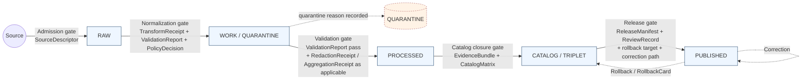
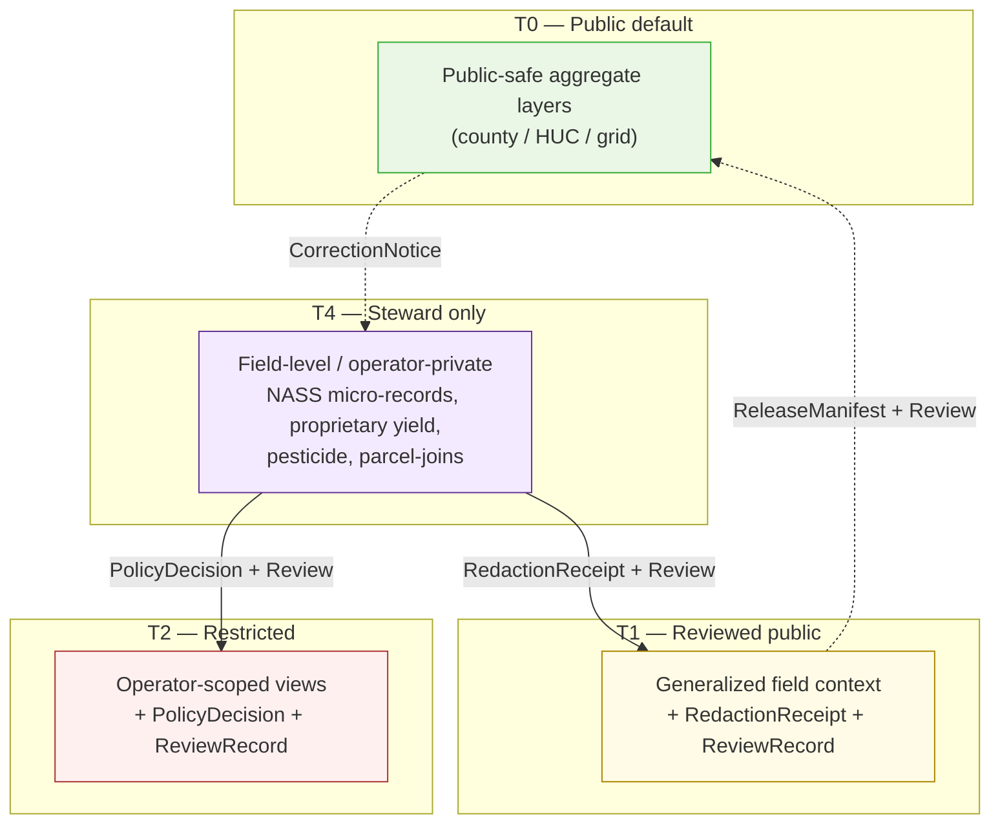
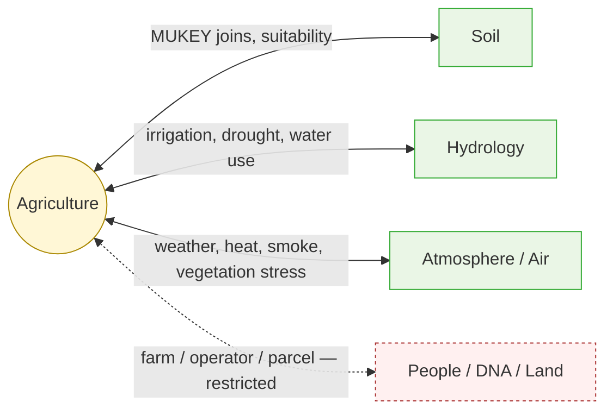

<!-- [KFM_META_BLOCK_V2]
doc_id: kfm://doc/agriculture-data-lifecycle
title: Agriculture — Data Lifecycle
type: standard
version: v1
status: draft
owners: <agriculture-domain-steward> <pipeline-steward>   <!-- PROPOSED placeholders; confirm via CODEOWNERS -->
created: 2026-05-15
updated: 2026-05-15
policy_label: public
related:
  - docs/domains/agriculture/README.md
  - docs/doctrine/lifecycle-law.md
  - docs/doctrine/directory-rules.md
  - docs/architecture/governed-api.md
  - docs/standards/PROV.md
tags: [kfm, domain, agriculture, lifecycle, governance, evidence]
notes:
  - Mounted repo not inspected this session; all path-shaped claims PROPOSED.
  - Aligns with Atlas v1.1 §24.6 Master Pipeline Gate Reference.
[/KFM_META_BLOCK_V2] -->

# Agriculture — Data Lifecycle

> Governed RAW → PUBLISHED lifecycle for the Agriculture domain: phase obligations, promotion gates, receipts, and public-safe aggregation discipline. Cite-or-abstain; field-level claims default-deny.


**Status:** draft · **Owners:** _agriculture-domain-steward, pipeline-steward_ (PROPOSED — confirm via CODEOWNERS) · **Last updated:** 2026-05-15

> [!IMPORTANT]
> This document describes **doctrine** (CONFIRMED) and the **PROPOSED** Agriculture-specific application of that doctrine. The mounted repository was not inspected in this session: every file path, contract name, schema home, validator name, route name, and pipeline spec listed here is **PROPOSED** and is not evidence of implementation. Resolve under Directory Rules §4 and §2.4 (ADR).

---

## Mini-TOC

1. [Scope and boundary](#1-scope-and-boundary)
2. [Lifecycle invariant](#2-lifecycle-invariant)
3. [Phase obligations](#3-phase-obligations)
4. [Promotion gates](#4-promotion-gates)
5. [Receipts and proof objects emitted](#5-receipts-and-proof-objects-emitted)
6. [Sensitivity, rights, and public-safe aggregation](#6-sensitivity-rights-and-public-safe-aggregation)
7. [Source families and source roles](#7-source-families-and-source-roles)
8. [Proposed file homes](#8-proposed-file-homes)
9. [Validators, tests, and fixtures](#9-validators-tests-and-fixtures)
10. [Cross-lane couplings](#10-cross-lane-couplings)
11. [Failure-closed semantics](#11-failure-closed-semantics)
12. [Verification backlog and open questions](#12-verification-backlog-and-open-questions)
13. [Related docs](#13-related-docs)

---

## 1. Scope and boundary

**CONFIRMED doctrine / PROPOSED implementation.** The Agriculture domain governs agricultural aggregate observations, soil/moisture/vegetation context, crop progress, suitability, stress indicators, irrigation links, conservation practice context, agricultural economy observations, and public-safe products. \[DOM-AG] \[ENCY]

The Agriculture domain **owns**:

- `CropObservation`, `FieldCandidate`, `CropRotation`, `YieldObservation`
- `IrrigationLink`, `ConservationPractice`, `SoilCropSuitability`
- `AgriculturalEconomyObservation`, `SupplyChainNode`
- `DroughtStressIndicator`, `PestStressIndicator`
- `AggregationReceipt` (domain-specific receipt class)

The Agriculture domain **does not own** (these stay with their owning lanes):

| Boundary | Owning domain | Reason |
|---|---|---|
| Canonical soil map-unit and horizon semantics | Soil | Source-role authority lives with Soil. |
| Water observations and flood context | Hydrology | Authority anti-collapse. |
| Ownership, title, parcels, living-person privacy | People / DNA / Land | Sensitivity and consent boundaries. |
| Bedrock/surficial lithology | Geology | Subsurface authority is geologic, not agricultural. |
| Air-quality, smoke, AOD authority | Atmosphere / Air | Regulatory and observed contexts live there. |

> [!NOTE]
> Cross-lane joins (soil × agriculture, hydrology × agriculture, atmosphere × agriculture) are permitted under the cross-lane relation rule: **the join MUST preserve ownership, source role, sensitivity, and `EvidenceBundle` support of each side.** It MUST NOT collapse one lane's authority into another. \[DOM-AG] \[ENCY]

---

## 2. Lifecycle invariant

**CONFIRMED doctrine.** Every domain — Agriculture included — follows the universal KFM lifecycle invariant. Promotion is a **governed state transition**, not a file move. A path-level move that bypasses validators, policy gates, evidence-bundle creation, catalog closure, and release-decision recording is a violation of the invariant regardless of which directory the bytes ended up in. \[DIRRULES §9.1] \[ENCY]



> [!IMPORTANT]
> Two rules survive every Agriculture pipeline change:
> 1. **No skip.** A pipeline that writes directly from `RAW` to `PROCESSED` or `PUBLISHED` is a lifecycle-skip violation. \[DIRRULES §13.5]
> 2. **No silent promotion.** A normalization failure quarantines with a recorded reason; it never advances. \[ENCY §24.6.1]

---

## 3. Phase obligations

The five universal lifecycle stages, instantiated for Agriculture. Stage names, gate conditions, and "Status" in the **doctrine** column are CONFIRMED; everything in the **Agriculture realization** column is PROPOSED until the mounted repo is inspected.

| Stage | Doctrine (CONFIRMED) | Agriculture realization (PROPOSED) |
|---|---|---|
| **RAW** | Capture immutable source payload or reference with source role, rights, sensitivity, citation, time, and hash. Gate: `SourceDescriptor` exists. | Immutable capture of NASS CDL/QuickStats/Crop Progress payloads or references, SSURGO/SDA exports, Kansas Mesonet REST snapshots, NRCS SCAN hourly observations, NOAA USCRN, NASA SMAP, NASA HLS / HLS-VI scenes, NRCS conservation practice extracts. One `SourceDescriptor` per source family with role, rights, sensitivity, cadence. |
| **WORK / QUARANTINE** | Normalize schema, geometry, time, identity, evidence, rights, and policy. Hold failures. Gate: validation and policy pass, **or** quarantine reason is recorded. | Schema/geometry/time/unit normalization (e.g., VWC depth/units, NDVI mask/time, MUKEY linkage). `TransformReceipt` for projection/generalization. Quarantine on rights ambiguity, source-role mismatch, unit/QC failures, sensitive-join attempts, or stale-source headers. |
| **PROCESSED** | Emit validated normalized objects, receipts, and public-safe candidates. Gate: `EvidenceRef`, `ValidationReport`, and digest closure exist. | Validated `CropObservation`, `SoilCropSuitability`, `IrrigationLink`, etc. with closure between `EvidenceRef` → `EvidenceBundle` candidate, with `AggregationReceipt` attached for county / HUC / grid roll-ups, and `RedactionReceipt` for any operator/field-level material. |
| **CATALOG / TRIPLET** | Emit catalog records, `EvidenceBundle`s, graph/triplet projections, release candidates. Gate: catalog/proof closure passes. | Catalog entries for Agriculture layers, `EvidenceBundle` per published claim, graph/triplet projections derived **only** from released or review-authorized evidence (not from RAW or WORK). |
| **PUBLISHED** | Serve released public-safe artifacts through governed APIs and manifests. Gate: `ReleaseManifest`, correction path, rollback target, and review/policy state exist. | Public-safe layers (CDL crop map, county/HUC aggregation, soil-crop suitability, drought/pest stress indicators, conservation practices where permitted). Served through `apps/governed-api/`. Field-level detail denied by default. |

> [!CAUTION]
> Aggregate statistics and satellite products **MUST NOT** become field/operator truth. A QuickStats county aggregate cited as a field-level claim is a doctrine violation. Farm/operator private data, proprietary yield, pesticide records, and private-sensitive joins **fail closed**. \[DOM-AG] \[ENCY]

[Back to top](#mini-toc)

---

## 4. Promotion gates

**CONFIRMED doctrine.** Each phase transition is a gate; the gate fails closed if its required artifacts are missing. The table below mirrors the Master Pipeline Gate Reference (Atlas §24.6.1) and pins which gates have Agriculture-specific obligations. \[ENCY §24.6] \[DIRRULES]

| Gate (transition) | Pre-condition | Required artifacts (CONFIRMED minimum) | Agriculture-specific obligation (PROPOSED) | Failure-closed outcome |
|---|---|---|---|---|
| **Admission** (— → RAW) | Source identity, rights, and source-role intent set at discovery. | `SourceDescriptor` (role, authority, rights, sensitivity, cadence); payload/reference hash. | NASS / SSURGO / Mesonet / SCAN / USCRN / SMAP / HLS rights and current terms recorded; written-consent flag where required (e.g., Mesonet feeds). | Not admitted; logged as candidate awaiting steward. |
| **Normalization** (RAW → WORK / QUARANTINE) | Schema, geometry, time, identity, evidence, rights, policy rules are runnable. | `TransformReceipt`; `ValidationReport` (working set); `PolicyDecision`; QUARANTINE for failures. | Unit/depth normalization for soil moisture; mask/time normalization for vegetation index; MUKEY identity stability for SSURGO joins. | Quarantine with reason. Never silently promotes. |
| **Validation** (WORK → PROCESSED) | Validators deterministic and tied to fixtures; required receipts present. | `ValidationReport` pass; `RedactionReceipt` if sensitivity applies; `AggregationReceipt` if applies. | County / HUC / grid `AggregationReceipt` attached to any published aggregate; `RedactionReceipt` for any field-level or operator-level material withheld or generalized. | Stay in WORK; structured FAIL outcome. |
| **Catalog closure** (PROCESSED → CATALOG / TRIPLET) | `EvidenceRef`s resolve; catalog matrix and digests close. | `CatalogMatrix` entry; `EvidenceBundle`; graph/triplet projections if applicable. | Closure proof that every Agriculture claim resolves to an `EvidenceBundle` whose digest is reproducible; graph/triplet projections built only from released or review-authorized evidence. | HOLD at PROCESSED; no public edge. |
| **Release** (CATALOG → PUBLISHED) | Review state where required; release authority distinct from author when material. | `ReleaseManifest`; rollback target; correction path; `ReviewRecord` (if required). | Steward review for any joins touching farm/operator/parcel context; release-authority separation when public-safety, rights, or sensitivity materiality applies. | HOLD at CATALOG; no public surface change. |
| **Correction** (PUBLISHED → PUBLISHED′) | Detected error or new evidence; downstream derivatives identified. | `CorrectionNotice`; derivative invalidation list; `ReviewRecord`. | Downstream invalidation cascade for any cached aggregate, graph projection, or AI-summarized answer that referenced the corrected claim. | Hold prior release readable but flagged stale until rollback or supersession completes. |

> [!NOTE]
> **Reading rule:** a tier or release upgrade always needs both a transform receipt and a review record where review applies; a downgrade (correction / rollback / restriction) never needs both — a correction alone is sufficient to remove or restrict. \[ENCY §24.5.3]

[Back to top](#mini-toc)

---

## 5. Receipts and proof objects emitted

**CONFIRMED doctrine.** A receipt is a structured, persisted record of a governed operation — never optional when the operation is consequential. _If no receipt exists, the operation did not happen in the governed sense._ \[ENCY §24.2]

### 5.1 Receipt ↔ phase matrix for Agriculture

| Receipt | RAW | WORK / QUAR. | PROCESSED | CATALOG / TRIPLET | PUBLISHED | Agriculture note (PROPOSED) |
|---|:---:|:---:|:---:|:---:|:---:|---|
| `SourceDescriptor` | • | • | • | • | • | One per source family (NASS, SSURGO, Mesonet, SCAN, USCRN, SMAP, HLS, NRCS-CP). |
| `TransformReceipt` |  | • | • | • |  | Projection, generalization, snap, simplification — e.g., field-polygon generalization to county / HUC. |
| `RedactionReceipt` |  | • | • | • | • | Mandatory whenever operator/field-level content is withheld, masked, or fuzzed to publish public-safe aggregate. |
| `AggregationReceipt` |  | • | • | • | • | **Domain-specific.** Pins geometry scope (county / HUC / grid), inputs, and uncertainty for every public Agriculture aggregate. |
| `ModelRunReceipt` |  | • | • | • |  | When source role is `modeled` (drought stress, pest stress, NDVI-derived indicators). |
| `RepresentationReceipt` |  |  | • | • | • | For any visualization or representation that could be mistaken for direct observation (synthetic surfaces, model rasters). |
| `AIReceipt` |  | • | • | • | • _(Focus Mode only)_ | Required when AI summarizes a released Agriculture `EvidenceBundle`. AI never reads RAW/WORK. |
| `ReviewRecord` |  | • | • | • | • | Required for joins touching farm/operator/parcel context or any release with materiality. |
| `PolicyDecision` | • | • | • | • | • | Allow / deny / restrict / abstain on every consequential surface. |
| `ValidationReport` |  | • | • | • |  | Validator outcomes per gate (schema, source, evidence, lifecycle, etc.). |
| `ReleaseManifest` |  |  |  | • | • | Contents, digests, signatures, rollback target. |
| `CorrectionNotice` |  |  |  | • | • | Post-publication correction lineage. |
| `RollbackCard` |  |  |  | • | • | Release reversal with target prior `ReleaseManifest`. |
| `RealityBoundaryNote` |  |  | • | • | • | For synthetic / modeled / reconstructed Agriculture surfaces (e.g., gridded moisture context vs station truth). |
| `MatrixCellReceipt` |  |  | • | • | • | When Agriculture data feeds a Frontier Matrix cell (county × crop-year × indicator). |

_A dot means the receipt is normally emitted, amended, or referenced at that phase. Receipts created earlier remain referenced (not duplicated) at later phases via `EvidenceRef`._ \[ENCY §24.2.2]

### 5.2 The Agriculture-specific receipt: `AggregationReceipt`

> [!IMPORTANT]
> Agriculture is one of the lanes where **`AggregationReceipt` is central**. Aggregation is what makes public Agriculture data safe; without a receipt, the aggregate has no audit trail proving it was not derived from a denied join or from un-aggregated operator material. \[ENCY §24.2.1]

PROPOSED minimum content (subject to schema PR / ADR):

- `aggregation_method` — e.g., area-weighted mean, sum, count, median.
- `geometry_scope` — county FIPS, HUC, grid cell ID, with explicit threshold.
- `inputs[]` — `EvidenceRef`s for every contributing observation, with source role pinned.
- `cell_count` and `suppression_rule` — minimum-N rule that defends operator privacy.
- `uncertainty` — quantitative or qualitative, with the basis recorded.
- `time_scope` — observed window, retrieval window, release window.
- `actor` and `timestamp` — who/when in the governed sense.

[Back to top](#mini-toc)

---

## 6. Sensitivity, rights, and public-safe aggregation

**CONFIRMED / PROPOSED.** Field polygons may be sensitive; public products aggregate to county / HUC / grid thresholds; aggregate statistics and satellite products must not become field/operator truth; farm/operator private data, proprietary yield, pesticide records, and private-sensitive joins **fail closed**. \[DOM-AG] \[ENCY]



PROPOSED Agriculture tier defaults, drawn from doctrine and the sensitivity-tier matrix:

| Object class | Default tier | Allowed transforms | Required gates |
|---|---|---|---|
| Operator-named records, proprietary yield, pesticide records | **T4** | Aggregation (county/HUC) + `AggregationReceipt` → T1; or operator-scoped restricted view → T2 only. | Steward review + `RedactionReceipt` + `PolicyDecision`. |
| Private farm/operator × parcel joins | **T4** | None to public; restricted view only with consent and named-party agreement. | `ReviewRecord` + `PolicyDecision`. |
| Field polygons (private/operator-traceable) | **T4** | Generalize to public-safe geometry + `RedactionReceipt`. | `RedactionReceipt` + `ReviewRecord`. |
| NASS CDL crop map | **T1** | Aggregate / generalized public-safe layer. | `AggregationReceipt` where applicable. |
| NASS QuickStats county aggregates | **T0** | None needed (already aggregated). | `AggregationReceipt` to pin geometry scope. |
| Kansas Mesonet / SCAN / USCRN station series | **T1 or T0** | Released as observed station series with source-role pinned. | `SourceDescriptor` + rights verification. |
| Gridded SMAP / HLS moisture or vegetation index | **T0** | Released as model/observed context with `RealityBoundaryNote` where modeled. | `RealityBoundaryNote` + `ModelRunReceipt` where modeled. |
| Drought / pest stress indicators | **T1** | Released as indicators with explicit uncertainty. | `ModelRunReceipt` + uncertainty fields. |

> [!WARNING]
> A QuickStats county aggregate plotted on a single field is a doctrine violation regardless of how the UI labels it. The policy gate **MUST** deny any Agriculture API surface that asks for a field-level claim against an aggregate-only source. \[DOM-AG K] \[ENCY]

[Back to top](#mini-toc)

---

## 7. Source families and source roles

**CONFIRMED doctrine / NEEDS VERIFICATION terms.** Source families and their rights / sensitivity posture are listed in the Atlas chapter 9 for Agriculture. Current terms for several feeds (Mesonet attribution, AirNow bulk limits, SMAP/HLS product license) **need verification** before public release. \[DOM-AG D] \[ENCY] \[NEW-IDEAS 5-8-26]

| Source family | Role(s) | Rights / sensitivity | Status |
|---|---|---|---|
| USDA NASS QuickStats / Crop Progress | authority / observation / aggregate | terms NEEDS VERIFICATION; sensitive joins fail closed | PROPOSED activation |
| USDA NASS CDL | authority / observation / aggregate | terms NEEDS VERIFICATION; aggregate-only public role | PROPOSED activation |
| SSURGO / Soil Data Access | authority / observation | static survey vs observation distinction REQUIRED; rights current terms NEEDS VERIFICATION | PROPOSED |
| gSSURGO (gridded) | authority / observation | as SSURGO | PROPOSED |
| NRCS conservation practice data | authority / observation | rights and current terms NEEDS VERIFICATION | PROPOSED |
| Kansas Mesonet | observation | rights / consent / attribution NEEDS VERIFICATION | PROPOSED |
| NRCS SCAN | observation | rights / consent NEEDS VERIFICATION | PROPOSED |
| NOAA USCRN | observation | rights / freshness NEEDS VERIFICATION | PROPOSED |
| NASA SMAP | model / observation | product license / freshness NEEDS VERIFICATION; modeled values require `RealityBoundaryNote` | PROPOSED |
| NASA HLS / HLS-VI | observation / model | product license / freshness NEEDS VERIFICATION | PROPOSED |
| Irrigation / water use sources | context | rights / source role distinct from Hydrology authority | PROPOSED |
| Crop insurance / market / economy (where permitted) | context | restricted by default; case-by-case rights | PROPOSED |
| Local extension sources | context | case-by-case rights | PROPOSED |

> [!NOTE]
> **Source-role anti-collapse.** Each source family must carry a stable `source_id` and a pinned source role (`authority`, `observation`, `context`, `modeled`, `regulatory`, `aggregate`, `synthetic`, `candidate`). Collapsing modeled-grid moisture into "observed soil moisture" is a recorded anti-pattern. \[ENCY §24.1] \[DOM-AG]

[Back to top](#mini-toc)

---

## 8. Proposed file homes

> [!IMPORTANT]
> **PROPOSED, not implementation.** The mounted repo was not inspected this session. Every path below is governed by Directory Rules §4 (Placement Protocol) and §12 (Domain Placement Law). A domain MUST NOT become a root folder; `agriculture` appears only as a **segment** inside the appropriate responsibility root. \[DIRRULES §12]

### 8.1 Responsibility-root crosswalk for the lane

| Responsibility root | Agriculture-segment PROPOSED path | Purpose |
|---|---|---|
| `docs/` | `docs/domains/agriculture/` | This document and other human-facing Agriculture doctrine. |
| `contracts/` | `contracts/domains/agriculture/` | Object meaning: `CropObservation`, `FieldCandidate`, `AggregationReceipt`, etc. |
| `schemas/` | `schemas/contracts/v1/domains/agriculture/` _or_ `schemas/contracts/v1/agriculture/` | Machine shape (per ADR-0001). Exact subpath PROPOSED; needs ADR confirmation. |
| `policy/` | `policy/domains/agriculture/` | Allow / deny / restrict / abstain rules; default-deny on field-level NASS claims; default-deny on operator/parcel joins. |
| `tests/` | `tests/domains/agriculture/` | Proof tests for validators, policies, lifecycle gates. |
| `fixtures/` | `fixtures/domains/agriculture/` | Synthetic, public-safe fixtures (e.g., county crop-year panel; no-network fixture). |
| `tools/` | `tools/validators/<topic>/` (cross-domain) or `tools/validators/agriculture/` (domain-specific, PROPOSED) | Validators, generators. Cross-domain validators stay un-segmented. |
| `connectors/` | `connectors/agriculture/` | Source-specific fetchers/admitters (NASS, SSURGO/SDA, Mesonet, SCAN, USCRN, SMAP, HLS). |
| `pipelines/` | `pipelines/domains/agriculture/` | Executable promotion logic. |
| `pipeline_specs/` | `pipeline_specs/agriculture/` | Declarative pipeline configuration. |
| `packages/` | `packages/domains/agriculture/` | Shared Agriculture-only library code (only if used by multiple deployables). |
| `data/` | (see §8.2) | Lifecycle phases. |
| `release/` | `release/candidates/agriculture/` | Release decisions (manifests, rollback cards) for Agriculture lanes. |

### 8.2 Lifecycle layout under `data/`

```
data/
├── raw/
│   └── agriculture/<source_id>/<run_id>/             # immutable capture
├── work/
│   └── agriculture/<run_id>/                         # normalization in flight
├── quarantine/
│   └── agriculture/<reason>/<run_id>/                # held failures, reason recorded
├── processed/
│   └── agriculture/<dataset_id>/<version>/           # validated normalized objects
├── catalog/
│   └── domain/agriculture/                           # catalog records, EvidenceBundles
├── triplets/
│   └── graph_deltas/agriculture/                     # graph/triplet projections
├── published/
│   └── layers/agriculture/                           # public-safe layers, served via governed-api
├── receipts/
│   ├── ingest/agriculture/<run_id>/
│   ├── validation/agriculture/<run_id>/
│   ├── pipeline/agriculture/<run_id>/
│   └── release/agriculture/<release_id>/
├── proofs/
│   ├── evidence_bundle/agriculture/<bundle_id>/
│   ├── validation_report/agriculture/<run_id>/
│   └── proof_pack/agriculture/<release_id>/
├── rollback/
│   └── agriculture/<release_id>/
└── registry/
    ├── sources/agriculture/                          # SourceDescriptors for NASS, SSURGO, ...
    └── layers/agriculture/                           # layer registry for public-safe products
```

> [!CAUTION]
> Three drift patterns to actively prevent in this lane:
> 1. **Lifecycle skip** — a pipeline that writes from `data/raw/agriculture/` directly to `data/published/layers/agriculture/`. Forbidden. \[DIRRULES §13.5]
> 2. **Connector-publishes** — a connector that writes anywhere outside `data/raw/agriculture/` or `data/quarantine/agriculture/`. Forbidden. Connectors do not publish. \[DIRRULES §13.5]
> 3. **Domain-as-root** — a top-level `agriculture/` folder containing its own `data/`, `schemas/`, `policy/`. Forbidden. \[DIRRULES §12]

[Back to top](#mini-toc)

---

## 9. Validators, tests, and fixtures

PROPOSED Agriculture validator / test families. Names below are doctrinal categories, not file commitments; exact validator IDs and command surfaces are UNKNOWN until the repo is inspected. \[DOM-AG K] \[ENCY]

| Validator / test family | PROPOSED purpose | Phase | Failure-closed outcome |
|---|---|---|---|
| SSURGO / SDA lineage tests | MUKEY identity stability; static-survey vs observation distinction. | WORK → PROCESSED | quarantine on identity drift |
| Soil-moisture unit / depth / QC tests | VWC units, sensor depth, QC flags, missing-data handling. | WORK → PROCESSED | quarantine on unit/depth ambiguity |
| Crop progress aggregate-only tests | Confirm no field-level shape is derivable from QuickStats / Crop Progress. | WORK → PROCESSED | DENY |
| Vegetation index mask / time tests | Cloud/snow mask present; time window correct; sensor versioning recorded. | WORK → PROCESSED | quarantine on mask absence |
| Policy denial for field-level NASS claims | Negative test: any field-level claim from an aggregate-only source returns DENY. | governed-api / Focus Mode | DENY |
| Catalog closure tests | Every Agriculture claim resolves to an `EvidenceBundle`; digests reproducible. | PROCESSED → CATALOG | HOLD at PROCESSED |
| Public-safe redaction tests | Confirm `RedactionReceipt` is present whenever generalization or suppression occurs. | PROCESSED / PUBLISHED | DENY |
| Aggregation-receipt presence tests | Every public Agriculture aggregate has an `AggregationReceipt` pinning geometry, inputs, suppression rule. | PROCESSED / PUBLISHED | DENY |
| Stale-source fixture | Stale headers from upstream feed trigger `ABSTAIN` or stale badge. | governed-api | `ABSTAIN` |
| No-network fixture | Synthetic Agriculture source family that runs end-to-end with no live network. | all | n/a (test harness) |
| Rollback drill | Reverse a published Agriculture release; downstream caches and graph projections invalidated. | PUBLISHED → CATALOG | rollback success or alarm |

<details>
<summary><strong>PROPOSED first thin-slice (county-year crop panel)</strong></summary>

PROPOSED first-credible thin-slice for Agriculture, drawn from the encyclopedia's per-domain thin-slice plan: a **county-level crop-year panel** using CDL/QuickStats + SSURGO suitability + a Kansas Mesonet weather fixture, with **field-level detail denied by default**. \[ENCY §7.7]

Closure criteria (PROPOSED):

1. One county FIPS, one crop year, one crop.
2. One `EvidenceBundle` joining: CDL aggregate, QuickStats county aggregate, SSURGO suitability, Mesonet station series.
3. One `AggregationReceipt` per public aggregate.
4. One `RedactionReceipt` proving the field-level path is denied.
5. One `ReleaseManifest` with rollback target and correction path.
6. One negative test: a field-level claim against the same county is rejected with DENY and a stable reason code.

</details>

[Back to top](#mini-toc)

---

## 10. Cross-lane couplings

Agriculture sits in the middle of several cross-domain joins. The cross-lane relation rule applies: **the join MUST preserve ownership, source role, sensitivity, and `EvidenceBundle` support** of each side. \[DOM-AG F] \[ENCY]



| Counterpart lane | Relation | Constraint |
|---|---|---|
| **Soil** | MUKEY joins; soil-crop suitability support. | Preserve Soil's authority on map-unit and horizon semantics. |
| **Hydrology** | Irrigation, drought, water-use context. | Preserve Hydrology's authority on water observations and floods. |
| **Atmosphere / Air** | Weather, heat, smoke, vegetation stress. | Preserve Atmosphere/Air's authority and the regulatory/observed/modeled split. |
| **People / DNA / Land** | Farm/operator and parcel-sensitive contexts. | **Restricted by default.** Joins require consent or named-party agreement; living-person and parcel-private rules apply. |

[Back to top](#mini-toc)

---

## 11. Failure-closed semantics

Every governed surface that touches Agriculture data emits a finite outcome. \[ENCY §24.3] \[GAI]

| Outcome | Meaning | Agriculture example (PROPOSED) |
|---|---|---|
| **ANSWER** | The request is admissible, evidence-supported, and policy-permitted. | County-level QuickStats aggregate, with `AggregationReceipt` and `EvidenceBundle` resolvable. |
| **ABSTAIN** | Evidence is insufficient or stale; the surface refuses to fabricate. | Mesonet feed past freshness window; SMAP scene not available for the requested date. |
| **DENY** | Rights, sensitivity, source-role, release-state, or policy blocks the request. | Field-level claim against an aggregate-only source; operator/parcel join without consent. |
| **ERROR** | Structural failure (schema, validator crash, missing receipt). Fail closed; report. | `EvidenceRef` does not resolve; `AggregationReceipt` missing for a public aggregate. |

> [!IMPORTANT]
> **Governed AI behavior.** AI may summarize released Agriculture `EvidenceBundle`s, compare evidence, explain limitations, and draft steward-review notes. AI **MUST `ABSTAIN`** when evidence is insufficient and **MUST `DENY`** where policy, rights, sensitivity, or release state blocks the request. AI never reads RAW or WORK content. \[GAI] \[DOM-AG L]

[Back to top](#mini-toc)

---

## 12. Verification backlog and open questions

Items deliberately left unresolved in this session. Each is settled by a specific class of repo evidence; do not promote to fact without it. \[DOM-AG N] \[ENCY]

| Item | Evidence that would settle it | Status |
|---|---|---|
| Verify NASS / QuickStats and Crop Progress activation. | Mounted repo files, schemas, registry entries, tests, logs, release manifests. | NEEDS VERIFICATION |
| Verify Mesonet and HLS / SMAP product terms. | Source-rights records and `SourceDescriptor` entries. | NEEDS VERIFICATION |
| Verify public release sensitivity rules for farm / operator joins. | `policy/domains/agriculture/` content and accepted ADRs. | NEEDS VERIFICATION |
| Verify Agriculture API surface and route names. | `apps/governed-api/` route registry and OpenAPI/contract files. | UNKNOWN |
| Verify Agriculture layer registry entries. | `data/registry/layers/agriculture/` content. | UNKNOWN |
| Confirm exact schema subpath (`schemas/contracts/v1/agriculture/` vs `schemas/contracts/v1/domains/agriculture/`). | ADR-0001 amendment or repo inspection. | NEEDS VERIFICATION |
| Confirm `AggregationReceipt` schema home (per-domain vs shared `schemas/contracts/v1/receipts/`). | ADR per backlog item ADR-S-03 in the Master Open-ADR Backlog. | NEEDS VERIFICATION |
| Confirm CODEOWNERS for Agriculture lane. | `.github/CODEOWNERS` inspection. | UNKNOWN |
| Confirm suppression-N rule for `AggregationReceipt`. | Policy file or ADR. | UNKNOWN |
| Confirm rollback drill cadence for Agriculture releases. | Runbook in `docs/runbooks/`. | UNKNOWN |

[Back to top](#mini-toc)

---

## 13. Related docs

> [!NOTE]
> Links below use repo-relative paths. They are **PROPOSED** until the mounted repo is inspected; some may be `TODO` placeholders rather than real targets at the time this document was first authored.

- [`docs/domains/agriculture/README.md`](./README.md) — Agriculture domain landing page (PROPOSED).
- [`docs/doctrine/lifecycle-law.md`](../../doctrine/lifecycle-law.md) — Lifecycle-law doctrine (PROPOSED path).
- [`docs/doctrine/directory-rules.md`](../../doctrine/directory-rules.md) — Directory Rules (CONFIRMED authority for placement).
- [`docs/doctrine/trust-membrane.md`](../../doctrine/trust-membrane.md) — Governed-API trust membrane (PROPOSED).
- [`docs/architecture/governed-api.md`](../../architecture/governed-api.md) — Governed API surface (PROPOSED).
- [`docs/standards/PROV.md`](../../standards/PROV.md) — W3C PROV-O / PAV crosswalk (CONFIRMED prior doc in this Project).
- [`docs/standards/ISO-19115.md`](../../standards/ISO-19115.md) — ISO 19115 geographic metadata crosswalk (CONFIRMED prior doc in this Project).
- [`docs/standards/OAI-PMH.md`](../../standards/OAI-PMH.md) — OAI-PMH harvest conformance brief (CONFIRMED prior doc in this Project).
- [`docs/standards/OGC-API-TILES.md`](../../standards/OGC-API-TILES.md) — OGC API Tiles profile (CONFIRMED prior doc in this Project).
- [`docs/standards/PMTILES.md`](../../standards/PMTILES.md) — PMTiles v3 profile (CONFIRMED prior doc in this Project).
- [`docs/registers/VERIFICATION_BACKLOG.md`](../../registers/VERIFICATION_BACKLOG.md) — Shared verification backlog (PROPOSED).
- [`docs/adr/`](../../adr/) — Open ADRs, especially **ADR-0001 (schema home)**, **ADR-S-03 (receipt schema layout)** in the Master Open-ADR Backlog.

<!-- TODO: replace placeholder targets with verified relative paths after repo mount. -->

---

<sub>**Citation keys.** `[DIRRULES]` Directory Rules (this repo). `[ENCY]` KFM Domain and Capability Encyclopedia v0.1. `[DOM-AG]` Domains Atlas v1.1 §9 Agriculture. `[GAI]` Whole-UI + Governed-AI Expansion Report. `[MAP-MASTER]` Master MapLibre Components / Functions / Features. `[NEW-IDEAS 5-8-26]` Newer Ideas dossier dated 2026-05-08.</sub>

---

**Last updated:** 2026-05-15 · **Doc version:** v1 · **Status:** draft

[Back to top](#agriculture--data-lifecycle)
