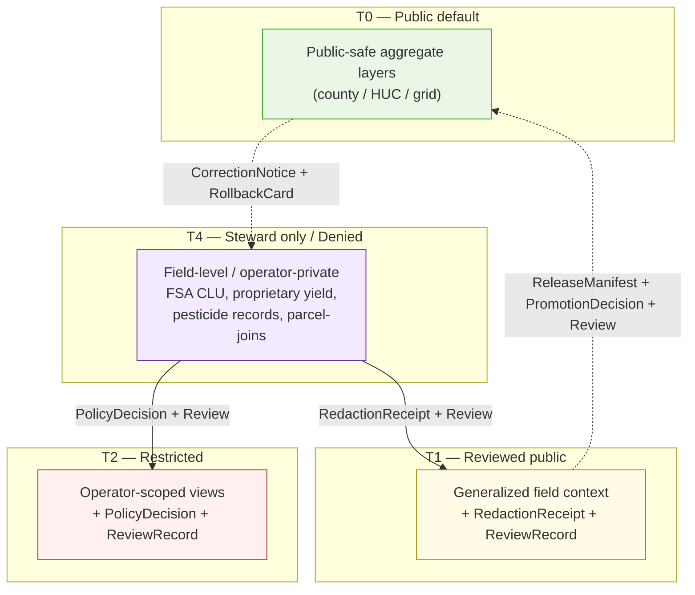

<!-- [KFM_META_BLOCK_V2]
doc_id: kfm://doc/agriculture-data-lifecycle
title: Agriculture — Data Lifecycle
type: standard
subtype: domain-data-lifecycle
version: v2 (draft)
status: draft
owners: TODO — Agriculture Domain Steward · Pipeline Steward · Policy Steward · Docs Steward
created: 2026-05-15
updated: 2026-05-26
policy_label: public
contract_version: "3.0.0"
related:
  - docs/doctrine/ai-build-operating-contract.md
  - docs/doctrine/directory-rules.md
  - docs/doctrine/lifecycle-law.md
  - docs/doctrine/trust-membrane.md
  - docs/doctrine/policy-aware.md
  - docs/doctrine/evidence-first.md
  - docs/doctrine/ai-as-assistant.md
  - docs/doctrine/corrections-are-first-class.md
  - docs/domains/agriculture/README.md
  - docs/domains/agriculture/ARCHITECTURE.md
  - docs/domains/agriculture/api-contracts.md
  - docs/domains/agriculture/CANONICAL_PATHS.md
  - docs/domains/agriculture/CONTINUITY_INVENTORY.md
  - docs/domains/agriculture/CROSS_LANE.md
  - docs/domains/agriculture/policy/README.md
  - docs/domains/agriculture/runbooks/README.md
  - docs/domains/agriculture/sublanes/README.md
  - docs/architecture/governed-api.md
  - docs/standards/PROV.md
tags: [kfm, domain, agriculture, lifecycle, governance, evidence, doctrine-adjacent, contract-v3]
notes:
  - Pinned to CONTRACT_VERSION = "3.0.0".
  - Aligns with Atlas v1.1 §24.6 Master Pipeline Gate Reference.
  - Mounted repo not inspected this session; all path-shaped claims PROPOSED.
  - This doc is the lifecycle-and-gates contract; placement at CANONICAL_PATHS.md, edges at CROSS_LANE.md, wire at api-contracts.md.
[/KFM_META_BLOCK_V2] -->

<a id="top"></a>

# 🌾 Agriculture — Data Lifecycle

> The governed `RAW → WORK / QUARANTINE → PROCESSED → CATALOG / TRIPLET → PUBLISHED` lifecycle for the Agriculture domain: phase obligations, promotion gates, receipts, public-safe aggregation discipline, and failure-closed outcomes. Cite-or-abstain; field-level claims deny-by-default.


| Status | Owners | Last updated | Pinned to |
|---|---|---|---|
| `draft` | TODO — Agriculture Domain Steward · Pipeline Steward · Policy Steward · Docs Steward | 2026-05-26 | `CONTRACT_VERSION = "3.0.0"` |

> [!IMPORTANT]
> **What this doc is — and what it is not.** This is the **lifecycle-and-gates contract** for the Agriculture domain: how data moves through phases, what each gate requires, what receipts each phase emits, what failure-closed outcomes look like. It does **not** decide:
> - *what* an Agriculture object means → [`ARCHITECTURE.md`](./ARCHITECTURE.md),
> - the *wire shape* of a governed-API envelope → [`api-contracts.md`](./api-contracts.md),
> - *where* lifecycle artifacts physically live → [`CANONICAL_PATHS.md`](./CANONICAL_PATHS.md) §7,
> - *how* corrections cross domain boundaries → [`CROSS_LANE.md`](./CROSS_LANE.md) §16,
> - the *carry-forward state* of doctrine from prior passes → [`CONTINUITY_INVENTORY.md`](./CONTINUITY_INVENTORY.md).
> Reach for the right sibling doc when the question is not "what does this phase or gate require?".

> [!CAUTION]
> **No mounted repository was inspected this session.** Every file path, contract name, schema home, validator name, route name, and pipeline-spec listed here is **PROPOSED** and is not evidence of implementation. Resolve under Directory Rules §4 (Placement Protocol) and §2.4 (ADR). `[CONFIRMED — operating contract §13 repository preflight.]`

---

## 📑 Contents

1. [Scope & boundary](#sec-1-scope)
2. [Authority & basis](#sec-2-authority)
3. [Lifecycle invariant](#sec-3-invariant)
4. [Phase obligations](#sec-4-phase-obligations)
5. [Promotion gates](#sec-5-gates)
6. [Receipts and proof objects emitted](#sec-6-receipts)
7. [Sensitivity, rights, and public-safe aggregation](#sec-7-sensitivity)
8. [Source families and source roles](#sec-8-sources)
9. [Proposed file homes](#sec-9-homes)
10. [Validators, tests, and fixtures](#sec-10-validators)
11. [Cross-lane couplings](#sec-11-cross-lane)
12. [Failure-closed semantics](#sec-12-failure-closed)
13. [Governed AI behavior at the lifecycle](#sec-13-ai)
14. [Correction, supersession, and rollback](#sec-14-correction)
15. [Open questions register](#sec-15-open-questions)
16. [Open verification backlog](#sec-16-backlog)
17. [Changelog](#sec-17-changelog)
18. [Definition of done](#sec-18-dod)
19. [Related docs](#sec-19-related)

---

<a id="sec-1-scope"></a>

## 1 · Scope & boundary

**CONFIRMED doctrine / PROPOSED implementation.** The Agriculture domain governs agricultural aggregate observations, soil/moisture/vegetation context, crop progress, suitability, stress indicators, irrigation links, conservation-practice context, agricultural-economy observations, and public-safe products. `[DOM-AG; ENCY §7.7.]`

The Agriculture domain **owns**:

- `CropObservation` · `FieldCandidate` · `CropRotation` · `YieldObservation`
- `IrrigationLink` · `ConservationPractice` · `SoilCropSuitability`
- `AgriculturalEconomyObservation` · `SupplyChainNode`
- `DroughtStressIndicator` · `PestStressIndicator`
- `AggregationReceipt` — **load-bearing for this domain**

The Agriculture domain **does not own** (these stay with their owning lanes; full edge contracts at [`CROSS_LANE.md`](./CROSS_LANE.md)):

| Boundary | Owning domain | Reason |
|---|---|---|
| Canonical soil map-unit and horizon semantics | **Soil** | Source-role authority lives with Soil; MUKEY is the join. |
| Water observations, flood context, NFHL regulatory zones | **Hydrology** | Authority anti-collapse; regulatory provenance preserved. |
| Ownership, title, parcels, living-person privacy | **People / DNA / Land** | Sensitivity and consent boundaries; person-parcel joins fail closed. |
| Bedrock / surficial lithology | **Geology** | Subsurface authority is geologic, not agricultural; advisory only. |
| Air-quality, smoke, AOD authority | **Atmosphere / Air** | Regulatory and observed contexts owned there. |
| Habitat patches, taxonomy, vegetation communities | **Habitat / Fauna / Flora** | Pest Stress consumes Fauna for taxonomic identity only. |
| Regulatory hazard authority and alert framing | **Hazards** | KFM is **not** an alert authority. |

> [!NOTE]
> Cross-lane joins (Soil × Agriculture, Hydrology × Agriculture, Atmosphere × Agriculture, etc.) MUST preserve **ownership, source role, sensitivity, and `EvidenceBundle` support** of each side. Per-edge contracts — join keys, source-role discipline, sensitivity disposition, correction cascade — live in [`CROSS_LANE.md`](./CROSS_LANE.md). `[CONFIRMED — DOM-AG §F; Atlas §24.4.7.]`

[⤴ Back to top](#top)

---

<a id="sec-2-authority"></a>

## 2 · Authority & basis

This document MUST obey the doctrinal stack below, in order. A lower row cannot silently override a higher one; conflicts MUST be filed as drift entries against the higher row.

| Layer | Source | Status |
|---|---|---|
| Operating law for AI-authored or AI-touched repo work (`CONTRACT_VERSION = "3.0.0"`) | [`ai-build-operating-contract.md`](../../doctrine/ai-build-operating-contract.md) | **CONFIRMED doctrine** |
| Lifecycle invariant (RAW → … → PUBLISHED) | [`lifecycle-law.md`](../../doctrine/lifecycle-law.md); DIRRULES §9.1; ENCY Appendix E | **CONFIRMED doctrine** |
| Placement protocol; Domain Placement Law | [`directory-rules.md`](../../doctrine/directory-rules.md) §§3, 4, 12, 13.5 | **CONFIRMED doctrine** |
| Trust-boundary contract; correction propagation | [`trust-membrane.md`](../../doctrine/trust-membrane.md) §7–§8 | **CONFIRMED doctrine** |
| Finite policy outcomes | [`policy-aware.md`](../../doctrine/policy-aware.md) | **CONFIRMED doctrine** |
| Cite-or-abstain truth posture | [`evidence-first.md`](../../doctrine/evidence-first.md) | **CONFIRMED doctrine** |
| AI is interpretive, never root truth | [`ai-as-assistant.md`](../../doctrine/ai-as-assistant.md) | **CONFIRMED doctrine** |
| `CorrectionNotice` + `RollbackCard` lineage | [`corrections-are-first-class.md`](../../doctrine/corrections-are-first-class.md) | **CONFIRMED doctrine** |
| Master Pipeline Gate Reference | Atlas §24.6.1 (`[ENCY]`) | **CONFIRMED doctrine** |
| Master Receipt Catalog | Atlas §24.2 (`[ENCY]`) | **CONFIRMED doctrine** |
| Agriculture domain doctrine baseline | Atlas v1.1 §9 + §24.4.7 (`[DOM-AG]`) | **CONFIRMED doctrine** |

### 2.1 RFC 2119 conformance

**MUST / MUST NOT** non-negotiable; **SHOULD / SHOULD NOT** strong default; **MAY** permitted. Per `directory-rules.md` §2.2 and operating contract §5.1.1.

[⤴ Back to top](#top)

---

<a id="sec-3-invariant"></a>

## 3 · Lifecycle invariant

**CONFIRMED doctrine.** Every domain — Agriculture included — follows the universal KFM lifecycle invariant. **Promotion is a governed state transition, not a file move.** A path-level move that bypasses validators, policy gates, evidence-bundle creation, catalog closure, and release-decision recording is a violation of the invariant regardless of which directory the bytes ended up in. `[CONFIRMED — DIRRULES §9.1; lifecycle-law.md; ENCY.]`

```mermaid
flowchart LR
    A((Source)) -->|Admission gate<br/>SourceDescriptor<br/>+ classmap_version (CDL)| R[RAW]
    R -->|Normalization gate<br/>TransformReceipt + ValidationReport + PolicyDecision| W[WORK / QUARANTINE]
    W -. quarantine reason recorded .-> Q[(QUARANTINE)]
    W -->|Validation gate<br/>ValidationReport pass<br/>+ RedactionReceipt / AggregationReceipt as applicable| P[PROCESSED]
    P -->|Catalog closure gate<br/>EvidenceBundle + CatalogMatrix| C[CATALOG / TRIPLET]
    C -->|Release gate<br/>ReleaseManifest + PromotionDecision<br/>+ ReviewRecord + rollback target<br/>+ audience class enforced| PUB[PUBLISHED]
    PUB -.->|Correction<br/>CorrectionNotice| W
    PUB -.->|Rollback<br/>RollbackCard| C
    PUB -.->|revoke_upstream<br/>cascade to consumers| P

    classDef stage fill:#eef6ff,stroke:#357,stroke-width:1px;
    classDef quar fill:#fff3e6,stroke:#a55,stroke-width:1px,stroke-dasharray: 3 3;
    class R,W,P,C,PUB stage;
    class Q quar;
```

> [!IMPORTANT]
> **Two non-negotiable rules** survive every Agriculture pipeline change:
> 1. **No skip.** A pipeline that writes directly from `RAW` to `PROCESSED` or `PUBLISHED` is a lifecycle-skip violation. `[CONFIRMED — DIRRULES §13.5.]`
> 2. **No silent promotion.** A normalization failure quarantines with a recorded reason; it never advances. `[CONFIRMED — ENCY §24.6.1.]`

> [!WARNING]
> **`PUBLISHED` is a state, not a directory.** Writing a file into `data/published/agriculture/` does **not** publish it. Publication requires the release gate to pass and a `PromotionDecision` emitted. Direct writes to the published store bypass the trust membrane and are forbidden. `[CONFIRMED — DIRRULES §13.5; trust-membrane.md.]`

[⤴ Back to top](#top)

---

<a id="sec-4-phase-obligations"></a>

## 4 · Phase obligations

The five universal lifecycle stages, instantiated for Agriculture. Stage names, gate conditions, and "Status" in the **doctrine** column are CONFIRMED; everything in the **Agriculture realization** column is PROPOSED until the mounted repo is inspected.

| Stage | Doctrine (CONFIRMED) | Agriculture realization (PROPOSED) |
|---|---|---|
| **RAW** | Capture immutable source payload or reference with source role, rights, sensitivity, citation, time, and hash. Gate: `SourceDescriptor` exists. | Immutable capture of NASS CDL / QuickStats / Crop Progress payloads or references, SSURGO / SDA exports, Kansas Mesonet REST snapshots, NRCS SCAN hourly observations, NOAA USCRN, NASA SMAP, NASA HLS / HLS-VI scenes, NRCS conservation-practice extracts. One `SourceDescriptor` per source family with role, rights, sensitivity, cadence. **CDL `classmap_version` pinned at admission and preserved forever.** *(v2 addition.)* |
| **WORK / QUARANTINE** | Normalize schema, geometry, time, identity, evidence, rights, and policy. Hold failures. Gate: validation **and** policy pass, **or** quarantine reason is recorded. | Schema / geometry / time / unit normalization (VWC depth/units, NDVI mask/time, MUKEY linkage). `TransformReceipt` for projection / generalization. Quarantine on rights ambiguity, source-role mismatch, unit/QC failures, sensitive-join attempts, stale-source headers, or `classmap_version` mismatch across vintages. |
| **PROCESSED** | Emit validated normalized objects, receipts, and public-safe candidates. Gate: `EvidenceRef`, `ValidationReport`, and digest closure exist. | Validated `CropObservation`, `SoilCropSuitability`, `IrrigationLink`, etc., with closure between `EvidenceRef` → `EvidenceBundle` candidate, `AggregationReceipt` attached for county / HUC / grid roll-ups, and `RedactionReceipt` for any operator/field-level material. |
| **CATALOG / TRIPLET** | Emit catalog records, `EvidenceBundle`s, graph/triplet projections, release candidates. Gate: catalog/proof closure passes. | Catalog entries for Agriculture layers, `EvidenceBundle` per published claim, graph/triplet projections derived **only** from released or review-authorized evidence (never from RAW / WORK / QUARANTINE / candidate). |
| **PUBLISHED** | Serve released public-safe artifacts through governed APIs and manifests. Gate: `ReleaseManifest`, `PromotionDecision`, correction path, rollback target, and review/policy state exist; **audience class enforced** *(v2)*. | Public-safe layers (CDL crop map, county/HUC aggregation, soil-crop suitability, drought/pest stress indicators, conservation practices where permitted). Served through `apps/governed-api/` only. Field-level detail denied by default. `contract_version = "3.0.0"` pinned on every envelope. *(v2.)* |

> [!CAUTION]
> Aggregate statistics and satellite products **MUST NOT** become field/operator truth. A QuickStats county aggregate cited as a field-level claim is a doctrine violation. Farm/operator private data, proprietary yield, pesticide records, and private-sensitive joins **fail closed**. `[CONFIRMED — DOM-AG §I; Atlas §24.1.2; §24.9.2.]`

[⤴ Back to top](#top)

---

<a id="sec-5-gates"></a>

## 5 · Promotion gates

**CONFIRMED doctrine.** Each phase transition is a gate; the gate fails closed if its required artifacts are missing. The table below mirrors the Master Pipeline Gate Reference (Atlas §24.6.1) and pins which gates have Agriculture-specific obligations. `[CONFIRMED — ENCY §24.6; DIRRULES.]`

| Gate (transition) | Pre-condition | Required artifacts (CONFIRMED minimum) | Agriculture-specific obligation (PROPOSED) | Failure-closed outcome |
|---|---|---|---|---|
| **Admission** (— → RAW) | Source identity, rights, and source-role intent set at discovery. | `SourceDescriptor` (role, authority, rights, sensitivity, cadence); payload/reference hash. | NASS / SSURGO / Mesonet / SCAN / USCRN / SMAP / HLS rights and current terms recorded; CDL `classmap_version` pinned; written-consent flag where required (e.g., Mesonet feeds). | Not admitted; logged as candidate awaiting steward. |
| **Normalization** (RAW → WORK / QUARANTINE) | Schema, geometry, time, identity, evidence, rights, policy rules are runnable. | `TransformReceipt`; `ValidationReport` (working set); `PolicyDecision`; QUARANTINE for failures. | Unit/depth normalization for soil moisture; mask/time normalization for vegetation index; MUKEY identity stability for SSURGO joins. | Quarantine with reason. Never silently promotes. |
| **Validation** (WORK → PROCESSED) | Validators deterministic and tied to fixtures; required receipts present. | `ValidationReport` pass; `RedactionReceipt` if sensitivity applies; `AggregationReceipt` if applies. | County / HUC / grid `AggregationReceipt` attached to any published aggregate; `RedactionReceipt` for any field-level or operator-level material withheld or generalized; source-role anti-collapse validators pass (CDL ≠ observed; NASS ≠ field; stress ≠ alert). | Stay in WORK; structured FAIL outcome. |
| **Catalog closure** (PROCESSED → CATALOG / TRIPLET) | `EvidenceRef`s resolve; catalog matrix and digests close. | `CatalogMatrix` entry; `EvidenceBundle`; graph/triplet projections if applicable. | Closure proof that every Agriculture claim resolves to an `EvidenceBundle` whose digest is reproducible; graph/triplet projections built only from released or review-authorized evidence. | HOLD at PROCESSED; no public edge. |
| **Release** (CATALOG → PUBLISHED) | Review state where required; release authority distinct from author when material. | `ReleaseManifest`; `PromotionDecision` *(v2 — operating contract §47)*; rollback target; correction path; `ReviewRecord` (if required); **`contract_version = "3.0.0"` pin** *(v2)*; **audience class enforced** *(v2)*. | Steward review for any joins touching farm/operator/parcel context; release-authority separation when public-safety, rights, or sensitivity materiality applies; CDL classmap-version pinned end-to-end. | HOLD at CATALOG; no public surface change. |
| **Correction** (PUBLISHED → PUBLISHED′) | Detected error or new evidence; downstream derivatives identified. | `CorrectionNotice`; derivative invalidation list; `ReviewRecord`; `RollbackCard` if reverting. | Downstream invalidation cascade for any cached aggregate, graph projection, Frontier Matrix cell, or AI-summarized answer that referenced the corrected claim — see [`CROSS_LANE.md`](./CROSS_LANE.md) §16. | Hold prior release readable but flagged stale until rollback or supersession completes. |
| **AI-authored merge** *(v2 row)* | The change to lifecycle artifacts is AI-authored. | `GENERATED_RECEIPT.json` pinned to `contract_version = "3.0.0"` with `truth_labels[]`, `validation_gates[]`, `human_review.state ∈ { approved, override_record_attached }`. | Applies to AI-authored pipeline specs, validators, schemas, policy bundles touching Agriculture lifecycle. | Merge blocked; receipt rejected at CI. |

> [!NOTE]
> **Reading rule:** a tier or release upgrade always needs both a transform receipt and a review record where review applies; a downgrade (correction / rollback / restriction) never needs both — a correction alone is sufficient to remove or restrict. `[CONFIRMED — ENCY §24.5.3.]`

[⤴ Back to top](#top)

---

<a id="sec-6-receipts"></a>

## 6 · Receipts and proof objects emitted

**CONFIRMED doctrine.** A receipt is a structured, persisted record of a governed operation — never optional when the operation is consequential. **If no receipt exists, the operation did not happen in the governed sense.** `[CONFIRMED — ENCY §24.2.]`

### 6.1 Receipt ↔ phase matrix for Agriculture

| Receipt | RAW | WORK / QUAR. | PROCESSED | CATALOG / TRIPLET | PUBLISHED | Agriculture note (PROPOSED) |
|---|:---:|:---:|:---:|:---:|:---:|---|
| `SourceDescriptor` | • | • | • | • | • | One per source family (NASS, CDL, SSURGO, Mesonet, SCAN, USCRN, SMAP, HLS, NRCS-CP, FSA CLU, NLCD/LANDFIRE/GAP, PLANTS). |
| `TransformReceipt` |  | • | • | • |  | Projection, generalization, snap, simplification — e.g., field-polygon generalization to county / HUC. |
| `RedactionReceipt` |  | • | • | • | • | Mandatory whenever operator/field-level content is withheld, masked, or fuzzed to publish public-safe aggregate. |
| **`AggregationReceipt`** *(load-bearing)* |  | • | • | • | • | **Domain-specific.** Pins geometry scope (county / HUC / grid), inputs, suppression rule, uncertainty for every public Agriculture aggregate. |
| `ModelRunReceipt` |  | • | • | • |  | When source role is `modeled` (CDL, drought / pest stress, NDVI-derived indicators, SMAP/HLS). |
| `RepresentationReceipt` |  |  | • | • | • | For any visualization or representation that could be mistaken for direct observation (synthetic surfaces, model rasters). |
| `AIReceipt` |  | • | • | • | • _(Focus Mode only)_ | Required when AI summarizes a released Agriculture `EvidenceBundle`. AI never reads RAW / WORK. |
| `ReviewRecord` |  | • | • | • | • | Required for joins touching farm/operator/parcel context or any release with materiality. |
| `PolicyDecision` | • | • | • | • | • | `ALLOW` / `RESTRICT` / `DENY` / `HOLD` / `ERROR` on every consequential surface. |
| `ValidationReport` |  | • | • | • |  | Validator outcomes per gate (schema, source, evidence, lifecycle, etc.). |
| `RunReceipt` | • | • | • | • |  | Process memory: inputs, outputs, hashes, tool versions, times, failures. |
| `ReleaseManifest` |  |  |  | • | • | Contents, digests, signatures, rollback target. |
| `PromotionDecision` *(v2)* |  |  |  | • | • | Records the governed state-transition decision into PUBLISHED. |
| `CorrectionNotice` |  |  |  | • | • | Post-publication correction lineage. |
| `RollbackCard` |  |  |  | • | • | Release reversal with target prior `ReleaseManifest`. |
| `WithdrawalNotice` *(v2)* |  |  |  | • | • | Used for People/Land cascade per [`CROSS_LANE.md`](./CROSS_LANE.md) §13. |
| `RealityBoundaryNote` |  |  | • | • | • | For synthetic / modeled / reconstructed Agriculture surfaces (e.g., gridded moisture context vs station truth). |
| `MatrixCellReceipt` |  |  | • | • | • | When Agriculture data feeds a Frontier Matrix cell (county × crop-year × indicator). |
| **`GENERATED_RECEIPT.json`** *(v2 — operating contract §34)* |  |  |  |  | • | Mandatory for every AI-authored merge touching Agriculture lifecycle. Pinned to `contract_version = "3.0.0"`. |

_A dot means the receipt is normally emitted, amended, or referenced at that phase. Receipts created earlier remain referenced (not duplicated) at later phases via `EvidenceRef`._ `[CONFIRMED — ENCY §24.2.2.]`

### 6.2 The Agriculture-specific receipt: `AggregationReceipt`

> [!IMPORTANT]
> **Agriculture is the lane where `AggregationReceipt` is most load-bearing.** Aggregation is what makes public Agriculture data safe; without a receipt, the aggregate has no audit trail proving it was not derived from a denied join or from un-aggregated operator material. Every Agriculture envelope whose `evidence_refs[]` includes `role = aggregate` MUST resolve an `AggregationReceipt`; without it, the envelope MUST `ABSTAIN` with reason `aggregation_receipt_missing`. `[CONFIRMED — Atlas §24.13; ARCHITECTURE.md §5.]`

PROPOSED minimum content (subject to schema PR / ADR-S-03; resolves alongside [`api-contracts.md`](./api-contracts.md) OQ-AG-API-07):

- `aggregation_method` — e.g., area-weighted mean, sum, count, median.
- `geometry_scope` — county FIPS, HUC, grid cell ID, with explicit threshold.
- `inputs[]` — `EvidenceRef`s for every contributing observation, with source role pinned.
- `cell_count` and `suppression_rule` — minimum-N rule that defends operator privacy.
- `uncertainty` — quantitative or qualitative, with the basis recorded.
- `time_scope` — observed window, retrieval window, release window.
- `actor` and `timestamp` — who/when in the governed sense.
- `geography_version_id` *(v2)* — pinned when the aggregate feeds a Frontier Matrix cell.

### 6.3 The v3 receipt: `GENERATED_RECEIPT.json`

> [!IMPORTANT]
> **Every AI-authored merge that touches Agriculture lifecycle artifacts (pipelines, schemas, policy bundles, validators, fixtures, runbooks) MUST emit a `GENERATED_RECEIPT.json`** per operating contract §34. The receipt MUST pin `contract_version = "3.0.0"`, list `artifact_paths[]`, populate `truth_labels[]`, populate `validation_gates[]` outcomes, and have `human_review.state ∈ { approved, override_record_attached }` before merge. PROPOSED schema home: `schemas/contracts/v1/receipts/generated_receipt.schema.json` (ADR-S-03). `[CONFIRMED — operating contract §34, §47.]`

[⤴ Back to top](#top)

---

<a id="sec-7-sensitivity"></a>

## 7 · Sensitivity, rights, and public-safe aggregation

> [!CAUTION]
> **Sensitive-domain handling routes through operating contract §23.2.** Agriculture touches operator, parcel, field-level, private-yield, pesticide-record, and FSA CLU lanes — all sensitive-domain under the contract's matrix. Any artifact that would expose those fields MUST be supported by the §23.2 disposition (`DENY` public · `GENERALIZE` before publication · `REDACT` when needed · `QUARANTINE` uncertain source material · `REQUIRE` steward review · `REQUIRE` transform receipt · `ABSTAIN` when support is inadequate). `[CONFIRMED — operating contract §23; trust-membrane.md §7.]`

**CONFIRMED / PROPOSED.** Field polygons may be sensitive; public products aggregate to county / HUC / grid thresholds; aggregate statistics and satellite products **MUST NOT** become field/operator truth; farm/operator private data, proprietary yield, pesticide records, and private-sensitive joins **fail closed**. `[CONFIRMED — DOM-AG §I; ENCY.]`



### 7.1 PROPOSED Agriculture tier defaults

| Object class | Default tier | Allowed transforms | Required gates |
|---|---|---|---|
| FSA CLU (operator-identifiable) *(v2 explicit)* | **T4** | None to public; T3 only under named-party agreement. | `PolicyDecision = DENY` for public; `ReviewRecord` for T3. |
| Operator-named records, proprietary yield, pesticide records | **T4** | Aggregation (county/HUC) + `AggregationReceipt` → T1; or operator-scoped restricted view → T2 only. | Steward review + `RedactionReceipt` + `PolicyDecision`. |
| Private farm/operator × parcel joins | **T4** | None to public; restricted view only with consent and named-party agreement. | `ReviewRecord` + `PolicyDecision`. |
| Field polygons (private/operator-traceable) | **T4** | Generalize to public-safe geometry + `RedactionReceipt`. | `RedactionReceipt` + `ReviewRecord`. |
| NASS CDL crop map | **T1** | Aggregate / generalized public-safe layer. | `AggregationReceipt` where applicable; classmap_version pin. |
| NASS QuickStats county aggregates | **T0** | None needed (already aggregated). | `AggregationReceipt` to pin geometry scope + suppression rule. |
| Kansas Mesonet / SCAN / USCRN station series | **T1 or T0** | Released as observed station series with source-role pinned. | `SourceDescriptor` + rights verification. |
| Gridded SMAP / HLS moisture or vegetation index | **T0** | Released as model/observed context with `RealityBoundaryNote` where modeled. | `RealityBoundaryNote` + `ModelRunReceipt` where modeled. |
| Drought / pest stress indicators | **T1** | Released as **context indicators with explicit uncertainty**; never as alert. | `ModelRunReceipt` + uncertainty fields + no-life-safety-framing validator. |
| Conservation-practice context (operator-identifiable) *(v2 explicit)* | **T4** | Generalize to non-identifiable framing → T1. | `RedactionReceipt` + steward review. |

`[CONFIRMED scheme — Atlas §24.5.1; PROPOSED per-row assignments; ADR-S-05 pending. Full matrix at [`ARCHITECTURE.md`](./ARCHITECTURE.md) §11.]`

> [!WARNING]
> A QuickStats county aggregate plotted on a single field is a doctrine violation regardless of how the UI labels it. The policy gate **MUST** deny any Agriculture API surface that asks for a field-level claim against an aggregate-only source. `[CONFIRMED — DOM-AG §K; Atlas §24.1.2 anti-collapse failure modes.]`

[⤴ Back to top](#top)

---

<a id="sec-8-sources"></a>

## 8 · Source families and source roles

**CONFIRMED doctrine / NEEDS VERIFICATION terms.** Source families and their rights / sensitivity posture are listed in the Atlas chapter 9 for Agriculture. Current terms for several feeds (Mesonet attribution, SMAP/HLS product license) **need verification** before public release. `[CONFIRMED scope — DOM-AG §D; ENCY.]`

| Source family | Role(s) | Rights / sensitivity | Status |
|---|---|---|---|
| **USDA NASS QuickStats / Crop Progress** | aggregate | terms NEEDS VERIFICATION; **field-level claims fail closed** | PROPOSED activation |
| **USDA NASS CDL** *(v2 explicit)* | modeled (classification raster) | terms NEEDS VERIFICATION; **never `observed`**; `classmap_version` pinned at admission | PROPOSED activation |
| **SSURGO / Soil Data Access** | observed (pedon) *or* regulatory (hydrologic group) | static survey vs observation distinction REQUIRED; rights current terms NEEDS VERIFICATION | PROPOSED |
| **gSSURGO (gridded)** | modeled (rasterized derivative) | inherits SSURGO; never relabeled `observed` | PROPOSED |
| **NRCS conservation-practice data** | observed *or* administrative | rights and current terms NEEDS VERIFICATION | PROPOSED |
| **Kansas Mesonet** | observed | rights / consent / attribution NEEDS VERIFICATION | PROPOSED |
| **NRCS SCAN** | observed | rights / consent NEEDS VERIFICATION | PROPOSED |
| **NOAA USCRN** | observed | rights / freshness NEEDS VERIFICATION | PROPOSED |
| **NASA SMAP** | modeled (gridded retrieval) | product license / freshness NEEDS VERIFICATION; modeled values require `RealityBoundaryNote` | PROPOSED |
| **NASA HLS / HLS-VI** | modeled (vegetation index) | product license / freshness NEEDS VERIFICATION | PROPOSED |
| **NLCD / LANDFIRE / GAP** *(v2 explicit)* | modeled (classification raster) | open with attribution | PROPOSED |
| **USDA PLANTS** *(v2 explicit)* | administrative (taxonomic registry) | open | PROPOSED |
| **FSA CLU** *(v2 explicit)* | administrative | **restricted; DENY public** | PROPOSED |
| Irrigation / water-use sources | observed *or* administrative | rights / source role distinct from Hydrology authority | PROPOSED |
| Crop insurance / market / economy (where permitted) | aggregate *or* administrative | restricted by default; case-by-case rights | PROPOSED |
| Local extension sources | observed *or* administrative | case-by-case rights | PROPOSED |

> [!IMPORTANT]
> **Source-role anti-collapse.** Each source family carries a stable `source_id` and a pinned source role (`observed` · `regulatory` · `modeled` · `aggregate` · `administrative` · `candidate` · `synthetic`). Collapsing modeled-grid moisture into "observed soil moisture", or NASS-aggregate into "field truth", is a recorded anti-pattern. Source role is set at admission and **preserved through every promotion** — never upgraded. `[CONFIRMED — Atlas §24.1, §24.9.3; DOM-AG.]`

### 8.1 Agriculture-specific source-role DENY rows

Drawn from [`ARCHITECTURE.md`](./ARCHITECTURE.md) §6.2 and [`CROSS_LANE.md`](./CROSS_LANE.md) §18; enforced as `DENY` validators at the relevant gate:

- **CDL labeled or queried as `observed`** crop occurrence → `DENY` at publication; `ABSTAIN` at AI surface.
- **NASS aggregate cited as field-level truth** → `DENY` join from aggregate cell to single field; `ABSTAIN` at AI.
- **Drought / pest stress framed as alert / instruction** → `DENY` publication as life-safety guidance.
- **Conservation practice framed as land-management instruction** → `DENY` publication.
- **Person-parcel join published** → `DENY` public; `HOLD` for steward review.

`[CONFIRMED — Atlas §24.1.2 anti-collapse failure modes; §24.9.2 trust-membrane anti-patterns.]`

[⤴ Back to top](#top)

---

<a id="sec-9-homes"></a>

## 9 · Proposed file homes

> [!IMPORTANT]
> **PROPOSED, not implementation.** The full path crosswalk with rule citations lives in [`CANONICAL_PATHS.md`](./CANONICAL_PATHS.md) §6 and §7. This section is a **summary** of the lifecycle-relevant homes; for the canonical reference, consult that doc.

### 9.1 Responsibility-root crosswalk for the lane (lifecycle-relevant)

| Responsibility root | Agriculture-segment PROPOSED path | Purpose |
|---|---|---|
| `docs/` | `docs/domains/agriculture/` | This document and other human-facing Agriculture doctrine. |
| `contracts/` | `contracts/domains/agriculture/` | Object meaning: `CropObservation`, `FieldCandidate`, `AggregationReceipt`, etc. **No `.schema.json` here.** |
| `schemas/` | `schemas/contracts/v1/domains/agriculture/` | Machine shape (per ADR-0001). Pinned to `contract_version = "3.0.0"` where applicable. |
| `schemas/` (receipts) | `schemas/contracts/v1/receipts/` *(v2)* | `AggregationReceipt`, `GENERATED_RECEIPT`, `RunReceipt`, `AIReceipt`. ADR-S-03 pending. |
| `policy/` | `policy/domains/agriculture/` · `policy/sensitivity/agriculture/` · `policy/release/agriculture/` *(v2 — sensitivity & release lanes)* | Allow / deny / restrict / abstain rules; default-deny on field-level NASS claims; default-deny on operator/parcel joins; per-audience-class release rules. |
| `tests/` | `tests/domains/agriculture/` | Proof tests for validators, policies, lifecycle gates. |
| `fixtures/` | `fixtures/domains/agriculture/` | Synthetic, public-safe fixtures (e.g., county crop-year panel; no-network fixture). |
| `tools/` | `tools/validators/<topic>/` (cross-domain) or `tools/validators/agriculture/` (domain-specific, PROPOSED) | Validators, generators. Cross-domain validators stay un-segmented. |
| `connectors/` | `connectors/<source>/` *(source-scoped, not domain-scoped)* | Source-specific fetchers/admitters (NASS, SSURGO/SDA, Mesonet, SCAN, USCRN, SMAP, HLS, FSA, NLCD/LANDFIRE/GAP, PLANTS). |
| `pipelines/` | `pipelines/domains/agriculture/` | Executable promotion logic. |
| `pipeline_specs/` | `pipeline_specs/agriculture/` | Declarative pipeline configuration. |
| `packages/` | `packages/domains/agriculture/` | Shared Agriculture-only library code. |
| `data/` | (see §9.2) | Lifecycle phases. |
| `release/` | `release/candidates/agriculture/` | Release **candidates** for Agriculture; release **decisions** (`release/manifests/`, `release/promotion_decisions/`, `release/rollback_cards/`, `release/correction_notices/`, `release/withdrawal_notices/`, `release/signatures/`) are cross-domain. |
| `apps/` | `apps/governed-api/` *(no agriculture segment)* | Trust-membrane surface; audience-class enforcement. |

### 9.2 Lifecycle layout under `data/`

```
data/
├── raw/
│   └── agriculture/<source_id>/<run_id>/             # immutable capture; classmap_version pinned (CDL)
├── work/
│   └── agriculture/<run_id>/                         # normalization in flight
├── quarantine/
│   └── agriculture/<reason>/<run_id>/                # held failures, structured reason
├── processed/
│   └── agriculture/<dataset_id>/<version>/           # validated normalized objects
├── catalog/
│   └── domain/agriculture/                           # catalog records, EvidenceBundles
├── triplets/
│   └── graph_deltas/agriculture/                     # graph/triplet projections
├── published/
│   ├── agriculture/                                  # public-safe artifacts, served via governed-api
│   └── layers/agriculture/                           # released layer artifacts
├── receipts/
│   ├── ingest/agriculture/<run_id>/
│   ├── validation/agriculture/<run_id>/
│   ├── pipeline/agriculture/<run_id>/
│   ├── ai/agriculture/<run_id>/                       # AIReceipts and GENERATED_RECEIPT.json (v2)
│   └── release/agriculture/<release_id>/
├── proofs/
│   ├── evidence_bundle/agriculture/<bundle_id>/
│   ├── validation_report/agriculture/<run_id>/
│   └── proof_pack/agriculture/<release_id>/
├── rollback/
│   └── agriculture/<release_id>/                     # alias-revert receipts (data plane)
└── registry/
    ├── sources/agriculture/                          # SourceDescriptors for NASS, SSURGO, ...
    └── layers/agriculture/                           # layer registry for public-safe products
```

> [!CAUTION]
> Three drift patterns to actively prevent in this lane:
> 1. **Lifecycle skip** — a pipeline that writes from `data/raw/agriculture/` directly to `data/published/...`. Forbidden. `[DIRRULES §13.5.]`
> 2. **Connector-publishes** — a connector that writes anywhere outside `data/raw/agriculture/` or `data/quarantine/agriculture/`. Forbidden. Connectors do not publish. `[DIRRULES §13.5; §7.3.]`
> 3. **Domain-as-root** — a top-level `agriculture/` folder containing its own `data/`, `schemas/`, `policy/`. Forbidden. `[DIRRULES §12.]`
>
> A fourth v2 drift pattern:
>
> 4. **Trust content in `artifacts/`** — Agriculture release manifests, EvidenceBundles, or receipts under `artifacts/`. Forbidden. Trust-bearing receipts live under `data/receipts/` and `data/proofs/`; release decisions live under `release/`. `[DIRRULES §13.5.]`

[⤴ Back to top](#top)

---

<a id="sec-10-validators"></a>

## 10 · Validators, tests, and fixtures

PROPOSED Agriculture validator / test families. Names below are doctrinal categories, not file commitments; exact validator IDs and command surfaces are UNKNOWN until the repo is inspected. `[CONFIRMED scope — DOM-AG §K; PROPOSED implementation.]`

| Validator / test family | PROPOSED purpose | Phase | Failure-closed outcome |
|---|---|---|---|
| SSURGO / SDA lineage tests | MUKEY identity stability; static-survey vs observation distinction. | WORK → PROCESSED | quarantine on identity drift |
| Soil-moisture unit / depth / QC tests | VWC units, sensor depth, QC flags, missing-data handling. | WORK → PROCESSED | quarantine on unit/depth ambiguity |
| Crop progress aggregate-only tests | Confirm no field-level shape is derivable from QuickStats / Crop Progress. | WORK → PROCESSED | DENY |
| Vegetation index mask / time tests | Cloud/snow mask present; time window correct; sensor versioning recorded. | WORK → PROCESSED | quarantine on mask absence |
| Policy denial for field-level NASS claims | Negative test: any field-level claim from an aggregate-only source returns DENY. | governed-api / Focus Mode | DENY |
| Catalog closure tests | Every Agriculture claim resolves to an `EvidenceBundle`; digests reproducible. | PROCESSED → CATALOG | HOLD at PROCESSED |
| Public-safe redaction tests | Confirm `RedactionReceipt` present whenever generalization or suppression occurs. | PROCESSED / PUBLISHED | DENY |
| `AggregationReceipt` presence tests | Every public Agriculture aggregate has an `AggregationReceipt` pinning geometry, inputs, suppression rule. | PROCESSED / PUBLISHED | DENY |
| Stale-source fixture | Stale headers from upstream feed trigger `ABSTAIN` or stale badge. | governed-api | `ABSTAIN` |
| No-network fixture | Synthetic Agriculture source family that runs end-to-end with no live network. | all | n/a (test harness) |
| Rollback drill | Reverse a published Agriculture release; downstream caches and graph projections invalidated. | PUBLISHED → CATALOG | rollback success or alarm |
| **CDL `classmap_version` pin propagation** *(v2)* | CDL classmap_version preserved RAW → PUBLISHED. | all phases | `ABSTAIN classmap_version_mismatch` |
| **Source-role anti-collapse** *(v2)* | CDL ≠ observed; NASS ≠ field; stress ≠ alert; gSSURGO ≠ observed. | WORK → PROCESSED | DENY |
| **Audience-class enforcement** *(v2)* | `internal` / `denied` never appear in `public` / `partner` envelopes. | PUBLISHED | DENY |
| **Person-parcel-join DENY** *(v2)* | Person-parcel joins blocked from public surfaces. | PROCESSED → PUBLISHED | DENY |
| **`contract_version` pin** *(v2)* | v3-era envelopes and receipts pinned to `"3.0.0"`. | PUBLISHED | DENY/ERROR |
| **`GENERATED_RECEIPT.json` presence** *(v2)* | AI-authored merges paired with receipt. | merge gate | merge blocked |
| **Revocation propagation** *(v2)* | `revoke_upstream` cascade reaches consumers (Frontier Matrix cells, AI summaries). | post-correction | derivative invalidation visible |

<details>
<summary><strong>PROPOSED first thin-slice (county-year crop panel)</strong></summary>

PROPOSED first-credible thin-slice for Agriculture, drawn from the encyclopedia's per-domain thin-slice plan: a **county-level crop-year panel** using CDL/QuickStats + SSURGO suitability + a Kansas Mesonet weather fixture, with **field-level detail denied by default**. `[CONFIRMED — ENCY §7.7.]`

Closure criteria (PROPOSED):

1. One county FIPS, one crop year, one crop.
2. One `EvidenceBundle` joining: CDL aggregate, QuickStats county aggregate, SSURGO suitability, Mesonet station series.
3. One `AggregationReceipt` per public aggregate.
4. One `RedactionReceipt` proving the field-level path is denied.
5. One `ReleaseManifest` + `PromotionDecision` with rollback target and correction path.
6. One negative test: a field-level claim against the same county is rejected with DENY and a stable reason code.
7. *(v2)* One `GENERATED_RECEIPT.json` for the pipeline-spec PR that wires the slice in CI.
8. *(v2)* `contract_version = "3.0.0"` pinned on the released envelope.

</details>

[⤴ Back to top](#top)

---

<a id="sec-11-cross-lane"></a>

## 11 · Cross-lane couplings

Agriculture sits in the middle of several cross-domain joins. The cross-lane relation rule applies: **the join MUST preserve ownership, source role, sensitivity, and `EvidenceBundle` support** of each side. Per-edge contracts (join keys, source-role discipline, validators, correction cascade) live in [`CROSS_LANE.md`](./CROSS_LANE.md). `[CONFIRMED — DOM-AG §F; Atlas §24.4.7.]`

```mermaid
flowchart LR
    AG((Agriculture))
    SOIL[Soil]
    HYD[Hydrology]
    AIR[Atmosphere / Air]
    HAB[Habitat]
    FAUNA[Fauna]
    FLORA[Flora]
    GEO[Geology]
    HAZ[Hazards]
    MX[Frontier Matrix]
    PPL[People / DNA / Land]

    AG <-->|MUKEY · suitability| SOIL
    AG <-->|irrigation · drought · water-use| HYD
    AG <-->|weather · heat · smoke · veg stress| AIR
    AG <-->|conservation framing| HAB
    AG <-->|pest stress (Ag) · taxonomy (Fauna)| FAUNA
    AG <-->|invasive framing| FLORA
    AG -->|parent material (advisory)| GEO
    AG -->|stress as hazard context — never alert| HAZ
    AG <-->|aggregate → matrix cells<br/>AggregationReceipt required| MX
    AG -.->|farm/operator/parcel — RESTRICTED| PPL

    classDef ag fill:#fff7d6,stroke:#a80;
    classDef ok fill:#eaf6e6,stroke:#3a3;
    classDef restricted fill:#fff0f0,stroke:#a33,stroke-dasharray:3 3;
    class AG ag;
    class SOIL,HYD,AIR,HAB,FAUNA,FLORA,GEO,HAZ,MX ok;
    class PPL restricted;
```

| Counterpart lane | Relation | Constraint (summary; full contract at [`CROSS_LANE.md`](./CROSS_LANE.md)) |
|---|---|---|
| **Soil** | MUKEY joins; soil-crop suitability support. | Preserve Soil's authority on map-unit and horizon semantics. |
| **Hydrology** | Irrigation, drought, water-use context. | Preserve regulatory provenance on NFHL; never relabel as observed event. |
| **Atmosphere / Air** | Weather, heat, smoke, vegetation stress. | Preserve regulatory/observed/modeled split; model identity cited. |
| **Habitat** | Conservation-practice framing. | Framing only; never instruction. |
| **Fauna** | Pest stress (Agriculture-owned) + taxonomic identity (Fauna-owned). | No restricted-occurrence leak; never frame stress as alert. |
| **Flora** | Invasive-plant management framing. | No rare-plant location leak; framing only. |
| **Geology** | Parent-material context. | Advisory only; never regulatory or aggregate. |
| **Hazards** | Drought / pest stress as hazard context. | **KFM is not an alert authority.** |
| **Frontier Matrix** | Aggregate county-year crop & yield → matrix cells. | `AggregationReceipt` REQUIRED; correction cascades to consumed cells. |
| **People / DNA / Land** | Farm/operator/parcel-sensitive contexts. | **Restricted by default.** Joins require consent or named-party agreement; living-person rules apply. |

[⤴ Back to top](#top)

---

<a id="sec-12-failure-closed"></a>

## 12 · Failure-closed semantics

Every governed surface that touches Agriculture data emits a finite outcome. The three outcome vocabularies are distinct and MUST NOT be confused. `[CONFIRMED — ENCY §24.3; operating contract §8 + §21.2; GAI.]`

### 12.1 Runtime outcomes (`RuntimeResponseEnvelope` · `AIReceipt`)

| Outcome | Meaning | Agriculture example (PROPOSED) |
|---|---|---|
| **`ANSWER`** | Request admissible, evidence-supported, policy-permitted. | County-level QuickStats aggregate, with `AggregationReceipt` and `EvidenceBundle` resolvable. |
| **`ABSTAIN`** | Evidence insufficient or stale; the surface refuses to fabricate. | Mesonet feed past freshness window; SMAP scene not available for the requested date; CDL `classmap_version` mismatch. |
| **`DENY`** | Rights, sensitivity, source-role, release-state, or policy blocks the request. | Field-level claim against an aggregate-only source; operator/parcel join without consent. |
| **`ERROR`** | Structural failure (schema, validator crash, missing receipt). Fail closed; report. | `EvidenceRef` does not resolve; `AggregationReceipt` missing for a public aggregate. |
| **`NARROWED`** *(v2 optional extension)* | Answer issued within a tighter scope than requested. | County-level answer when field-level was asked but only aggregate evidence supports it. |
| **`BOUNDED`** *(v2 optional extension)* | Answer issued with explicit confidence / coverage bounds. | Drought stress indicator with explicit uncertainty bounds. |

### 12.2 Policy-gate outcomes (`PolicyDecision`)

`ALLOW` · `RESTRICT` · `DENY` · `HOLD` · `ERROR`. These are gate-level, **not** runtime — `HOLD` in particular never appears on a runtime envelope. `[CONFIRMED — operating contract §8; api-contracts.md §4.2.]`

### 12.3 Workflow outcomes (correction submit, review intake)

`ACCEPTED` · `DENY` · `ERROR`. Intake-only; no public claim emitted by `ACCEPTED` alone. `[CONFIRMED — operating contract §8; api-contracts.md §4.3.]`

> [!IMPORTANT]
> **The three vocabularies MUST NOT be conflated.** Confusing them is a §13.5 anti-pattern. Where a row in this doc references a gate or workflow outcome, it is named explicitly. The wire-level contract lives at [`api-contracts.md`](./api-contracts.md) §4. `[CONFIRMED — operating contract §21.2; Atlas §24.3.1.]`

[⤴ Back to top](#top)

---

<a id="sec-13-ai"></a>

## 13 · Governed AI behavior at the lifecycle

**CONFIRMED doctrine.** AI is **interpretive, never the root truth source**. `EvidenceBundle` outranks generated language. `[CONFIRMED — GAI; ai-as-assistant.md.]`

### 13.1 What AI MAY do at the Agriculture lifecycle

- Summarize **released** Agriculture `EvidenceBundle`s with citations resolving to the bundle.
- Compare evidence across **released** sources within the same sensitivity tier.
- Explain limitations (freshness, source role, aggregation scope, uncertainty bounds, classmap_version).
- Draft steward-review notes for sensitive-lane material.
- Emit `NARROWED` / `BOUNDED` when scope or confidence justifies it *(v2; pending OQ-AG-API-06 ratification)*.

### 13.2 What AI MUST do at the Agriculture lifecycle

- `ABSTAIN` when evidence is insufficient, missing, stale, freshness-window-lapsed, revoked-upstream, classmap-version-mismatched, or unresolved.
- `DENY` when policy, rights, sensitivity, or release state blocks the request.
- `ERROR` on malformed input, missing schema, contract violation; never silently fall through.
- Emit `AIReceipt` for **every** Focus Mode answer.
- Emit `GENERATED_RECEIPT.json` for every AI-authored merge touching the Agriculture lifecycle, pinned to `contract_version = "3.0.0"` *(v2 — operating contract §34)*.

### 13.3 What AI MUST NOT do at the Agriculture lifecycle

- Read directly from `RAW` / `WORK` / `QUARANTINE` / candidate stores.
- Make field-level claims from aggregate sources.
- Frame any answer as alert, life-safety guidance, or operational instruction.
- Cross-lane-join to identifiable operator / parcel.
- Upgrade a source role through generation (e.g., narrating a modeled CDL value as `observed`).
- Substitute fluent language for evidence (cite-or-abstain).

> [!WARNING]
> **AI text treated as evidence is the highest-severity anti-pattern at every Agriculture Focus Mode surface.** Disposition: `DENY` at publication, `ABSTAIN` at Focus, `AIReceipt` mandatory. `[CONFIRMED — Atlas §24.9.2; ai-as-assistant.md.]`

[⤴ Back to top](#top)

---

<a id="sec-14-correction"></a>

## 14 · Correction, supersession, and rollback

**CONFIRMED doctrine.** Agriculture publication requires a correction path, a stale-state rule, and a rollback target. Full cross-lane cascade map lives at [`CROSS_LANE.md`](./CROSS_LANE.md) §16. `[CONFIRMED — DOM-AG §M; ENCY Appendix E; corrections-are-first-class.md; trust-membrane.md §8.]`

### 14.1 Correction cascade summary

When a published Agriculture claim is corrected, downstream `EvidenceRef`s MUST be re-evaluated:

- **Frontier Matrix cells** that consumed the corrected Agriculture aggregate downgrade to `ABSTAIN evidence.revoked_upstream` at their next call.
- **Hazards context citations** that referenced the corrected stress indicator re-evaluate at next call.
- **AI-summarized Focus Mode answers** that cited the corrected `EvidenceBundle` re-evaluate; cached summaries marked stale.
- **`CorrectionNotice`** MUST list invalidated derivatives.
- **`RollbackCard`** MUST be issued if reverting to a prior published state.

### 14.2 People/Land cascade (immediate withdrawal)

When a People/Land correction (e.g., parcel-ownership revision) affects any Agriculture derivative that joined the affected person/parcel, the cascade is **immediate**: `WithdrawalNotice` issued; affected derivatives withdrawn from public surfaces before any further request can hit them. `[CONFIRMED — CROSS_LANE.md §16.2; operating contract §23.]`

### 14.3 Push vs pull propagation

This doc assumes **pull** propagation (consumers re-evaluate on next call) consistent with trust-membrane.md §8 default, **except** for the People/Land cascade (immediate push via `WithdrawalNotice`). The push-vs-pull decision is OQ-AG-DL-09 below.

[⤴ Back to top](#top)

---

<a id="sec-15-open-questions"></a>

## 15 · Open questions register

| ID | Question | Owner role | Resolution path |
|---|---|---|---|
| **OQ-AG-DL-01** | Final schema home for `AggregationReceipt` (per-domain vs cross-cutting `schemas/contracts/v1/receipts/`). | Contract / schema steward | ADR-S-03; resolves alongside `api-contracts.md` OQ-AG-API-07 + `CANONICAL_PATHS.md` OQ-AG-CP-12. |
| **OQ-AG-DL-02** | Suppression-N rule for `AggregationReceipt` (k-anon threshold values). | Sensitivity reviewer + Policy steward | ADR; resolves alongside `api-contracts.md` OQ-AG-API-12. |
| **OQ-AG-DL-03** | Whether CDL `classmap_version` enforcement is at WORK admission or at PROCESSED validation. | Architecture steward + Build owner | ADR; aligns with Atlas card KFM-P25-PROG-0005. |
| **OQ-AG-DL-04** | Whether `RuntimeResponseEnvelope.contract_version` is `const` ("3.0.0") or `pattern` (admits v3.x minor evolution). | Architecture steward | ADR; resolves alongside `api-contracts.md` OQ-AG-API-15. |
| **OQ-AG-DL-05** | Whether `NARROWED` / `BOUNDED` are admitted on Agriculture surfaces at v1, v1.1, or only after ADR. | Architecture steward | ADR; resolves alongside `api-contracts.md` OQ-AG-API-06. |
| **OQ-AG-DL-06** | Whether Agriculture corrections share the global queue or have a domain-tagged queue. | API owner + Policy steward | Inspect `apps/governed-api/` route map + `policy/review/`. |
| **OQ-AG-DL-07** | Final form of `obligations` block on Agriculture envelopes. | Contract / schema steward | ADR + `EvidenceBundle` schema confirmation. |
| **OQ-AG-DL-08** | Aggregate-threshold values for county / HUC / grid public release. | Policy steward + Agriculture domain steward | ADR + `policy/domains/agriculture/`. |
| **OQ-AG-DL-09** | Push-style vs pull-style revocation propagation (this doc currently assumes pull, with People/Land exception). | Architecture steward | Reconcile with trust-membrane.md §8; resolves alongside `api-contracts.md` OQ-AG-API-16 + `CROSS_LANE.md` OQ-AG-CL-09. |
| **OQ-AG-DL-10** | NASS / QuickStats / Crop Progress source-activation status under KFM. | Source steward | Mounted-repo source registry; `SourceActivationDecision`. |
| **OQ-AG-DL-11** | Mesonet / HLS / SMAP product terms (rights, redistribution, attribution). | Source steward + Rights-holder representative | Source-terms records in `data/registry/sources/agriculture/`. |
| **OQ-AG-DL-12** | Rollback drill cadence for Agriculture releases. | Pipeline steward | Runbook in `docs/runbooks/agriculture/ROLLBACK_RUNBOOK.md` (PROPOSED). |
| **OQ-AG-DL-13** | CDL classmap-version cross-vintage join policy (mix prohibited; pin required; CDL 2014 + CDL 2024 ABSTAIN). | Architecture steward | ADR; aligns with `api-contracts.md` CAUTION callout. |
| **OQ-AG-DL-14** | Whether Agriculture-side `MatrixCellReceipt` is a distinct receipt class or a specialization of `AggregationReceipt`. | Contract / schema steward + Matrix steward | ADR; resolves alongside `CROSS_LANE.md` OQ-AG-CL-10. |

[⤴ Back to top](#top)

---

<a id="sec-16-backlog"></a>

## 16 · Open verification backlog

> Items below are verification work this document cannot complete without a mounted repository. Each item MUST be tracked in `docs/registers/VERIFICATION_BACKLOG.md` (PROPOSED) until closed.

<details open>
<summary><strong>Verification items (14 rows) — click to collapse</strong></summary>

| # | Item | Evidence that would settle it | Owner | Settles which OQ |
|---:|---|---|---|---|
| 1 | NASS / QuickStats / Crop Progress activation | Mounted-repo files, schemas, registry entries, tests, logs, release manifests. | Source steward | OQ-AG-DL-10 |
| 2 | Mesonet / HLS / SMAP product terms | Source-rights records and `SourceDescriptor` entries. | Source steward + Rights rep | OQ-AG-DL-11 |
| 3 | Public-release sensitivity rules for farm/operator joins | `policy/domains/agriculture/` content and accepted ADRs. | Policy steward + Sensitivity reviewer | OQ-AG-DL-02 / -08 |
| 4 | Agriculture API surface and route names | `apps/governed-api/` route registry and OpenAPI/contract files. | API owner | Resolves alongside `api-contracts.md` OQ-AG-API-01. |
| 5 | Agriculture layer registry entries | `data/registry/layers/agriculture/` content. | Source steward | — |
| 6 | Schema subpath (`schemas/contracts/v1/domains/agriculture/` confirmation) | ADR-0001 ratification + repo inspection. | Contract / schema steward | — |
| 7 | `AggregationReceipt` schema home | ADR-S-03 status. | Contract / schema steward | OQ-AG-DL-01 |
| 8 | CODEOWNERS for Agriculture lane | `.github/CODEOWNERS` inspection. | Docs steward | — |
| 9 | Suppression-N rule for `AggregationReceipt` | Policy file or ADR. | Policy steward | OQ-AG-DL-02 |
| 10 | Rollback drill cadence for Agriculture releases | Runbook in `docs/runbooks/agriculture/`. | Pipeline steward | OQ-AG-DL-12 |
| 11 | `contract_version` pin propagation *(v2)* | Schema inspection; CI gate logs. | Build owner + Contract steward | OQ-AG-DL-04 |
| 12 | `GENERATED_RECEIPT.json` schema home *(v2)* | `schemas/contracts/v1/receipts/generated_receipt.schema.json` presence. | Contract / schema steward | — |
| 13 | Source-role anti-collapse validators deployed *(v2)* | Validator presence + invalid fixtures failing for expected reason. | Build owner | — |
| 14 | CDL classmap-version pin propagation end-to-end *(v2)* | Pipeline test: CDL ingest → publication preserves classmap_version. | Build owner | OQ-AG-DL-03 / -13 |

</details>

`[All items open; resolution path varies per row.]`

[⤴ Back to top](#top)

---

<a id="sec-17-changelog"></a>

## 17 · Changelog

> Per operating contract [§37](../../doctrine/ai-build-operating-contract.md): `MINOR` rows clarify or extend without breaking; `MAJOR` rows change operating law and require receipt re-issuance.

### 17.1 v1 → v2 (current revision)

| § | Change | Type (§37) | Reason |
|---|---|---|---|
| Meta block | Added `subtype: domain-data-lifecycle`; added `contract_version: "3.0.0"`; refreshed `updated:` to 2026-05-26; expanded `related[]` to include the v3 doctrine stack (operating contract, trust-membrane, policy-aware, evidence-first, ai-as-assistant, corrections-are-first-class) and the five sibling docs (`ARCHITECTURE.md`, `api-contracts.md`, `CANONICAL_PATHS.md`, `CONTINUITY_INVENTORY.md`, `CROSS_LANE.md`); expanded `tags[]`. | clarification | Operating contract §1 + §5 conformance; sibling-doc cross-reference. |
| Title / badge row | Added `Contract: v3.0.0` badge; added `Aggregation: load-bearing` badge; updated `Last reviewed` to 2026-05-26; added `Pinned to` column in meta table. | clarification | Contract pinning visibility; aggregation centrality. |
| Top IMPORTANT callout | Rewrote to route the five "this doc is not" responsibilities (meaning, wire shape, placement, edges, carry-forward) to the correct sibling docs. | clarification | Disambiguate against the five sibling docs created this session. |
| §1 Scope & boundary | Expanded "does not own" table from 5 to 7 rows (added Habitat/Fauna/Flora and Hazards). Tightened cross-reference to [`CROSS_LANE.md`](./CROSS_LANE.md). | clarification | Atlas §24.4.4–§24.4.8 coverage. |
| §2 Authority & basis *(new section)* | Added 11-layer doctrine stack. Added §2.1 RFC 2119 conformance. | new | v3 doctrine stack named explicitly. |
| §3 (was §2) Lifecycle invariant | Updated Mermaid: added `classmap_version (CDL)` to admission gate; added `PromotionDecision` + `audience class enforced` to release gate; added `CorrectionNotice → WORK` and `RollbackCard → CATALOG` back-edges; added `revoke_upstream cascade to consumers` back-edge. Added WARNING callout on `PUBLISHED` as state vs directory. | new | Operating contract §47 release artifacts; trust-membrane.md §8 cascade. |
| §4 (was §3) Phase obligations | Added CDL `classmap_version` pinning at RAW. Added `PromotionDecision` + audience-class enforcement + `contract_version` pin at PUBLISHED. Added `classmap_version` mismatch as quarantine reason at WORK. | new | Atlas KFM-P25-PROG-0005; operating contract §34 + §47. |
| §5 (was §4) Gates | Added `PromotionDecision`, `contract_version = "3.0.0"` pin, and audience-class enforcement to Release gate. Added source-role anti-collapse validators to Validation gate. Added `RollbackCard` to Correction gate. Added v2 row: **AI-authored merge** gate requiring `GENERATED_RECEIPT.json`. | new | Operating contract §34 + §47; Atlas §24.1. |
| §6 (was §5) Receipts | Added `RunReceipt` row (filled in RAW–CATALOG, per Atlas §24.2). Added `PromotionDecision` row *(v2)*. Added `WithdrawalNotice` row *(v2)*. Added `GENERATED_RECEIPT.json` row *(v2 — operating contract §34)*. Renamed §5.2 to §6.2 and added `geography_version_id` field for Matrix-feeding aggregates. Added §6.3 explicitly devoted to `GENERATED_RECEIPT.json`. | new | Operating contract §34 + §47; CROSS_LANE.md §14. |
| §7 (was §6) Sensitivity | Added top `[!CAUTION]` callout routing through operating contract §23.2 sensitive-domain matrix. Added FSA CLU row (v2 explicit) and Conservation-practice operator-identifiable row (v2 explicit). Updated tier-diagram to include `PromotionDecision` and `CorrectionNotice + RollbackCard`. Cross-referenced [`ARCHITECTURE.md`](./ARCHITECTURE.md) §11 for full matrix. | new | Operating contract §23.2; Atlas §24.5; ARCHITECTURE.md. |
| §8 (was §7) Sources | Added explicit rows: USDA CDL (modeled), NLCD/LANDFIRE/GAP (modeled), USDA PLANTS (administrative), FSA CLU (administrative; DENY). Added §8.1 Agriculture-specific source-role DENY rows. | new | Atlas §24.1 source-role anti-collapse register. |
| §9 (was §8) Homes | Added `schemas/contracts/v1/receipts/` row for `AggregationReceipt` + `GENERATED_RECEIPT.json`. Added `policy/sensitivity/agriculture/` and `policy/release/agriculture/` lanes. Added `data/receipts/ai/agriculture/` for `AIReceipt` + `GENERATED_RECEIPT.json`. Added v2 drift pattern #4: **trust content in `artifacts/`**. Cross-referenced [`CANONICAL_PATHS.md`](./CANONICAL_PATHS.md) §6 + §7 as the canonical reference. | new | Operating contract §34 + §47; CANONICAL_PATHS.md. |
| §10 (was §9) Validators | Added seven v2-era validator rows: `classmap_version` pin propagation, source-role anti-collapse, audience-class enforcement, person-parcel-join DENY, `contract_version` pin, `GENERATED_RECEIPT.json` presence, revocation propagation. Updated thin-slice closure criteria to include `PromotionDecision`, `GENERATED_RECEIPT.json`, and `contract_version` pin. | new | Operating contract §34 + §37; Atlas §24.1 + §24.9.2. |
| §11 (was §10) Cross-lane | Expanded Mermaid from 4 to 10 lane nodes (added Habitat / Fauna / Flora / Geology / Hazards / Frontier Matrix). Expanded constraint table from 4 to 10 rows. Cross-referenced [`CROSS_LANE.md`](./CROSS_LANE.md) as the authoritative per-edge contract. | new | Atlas §24.4.4–§24.4.8; CROSS_LANE.md. |
| §12 (was §11) Failure-closed | Split into §12.1 runtime outcomes, §12.2 policy-gate outcomes, §12.3 workflow outcomes. Added `NARROWED` / `BOUNDED` rows (v2 optional extensions). Added [!IMPORTANT] outcome-grammar reconciliation callout. | new | Operating contract §8 + §21.2; api-contracts.md §4. |
| §13 Governed AI behavior *(new section)* | Created with §13.1 MAY, §13.2 MUST, §13.3 MUST NOT subsections. Includes AI-authored merge → `GENERATED_RECEIPT.json` requirement. | new | Operating contract §34; Atlas §24.9.2; ai-as-assistant.md. |
| §14 Correction, supersession, and rollback *(new section)* | Created with §14.1 cascade summary, §14.2 People/Land immediate-withdrawal exception, §14.3 push-vs-pull. | new | trust-membrane.md §8; corrections-are-first-class.md; CROSS_LANE.md §16. |
| §15 Open questions register *(new section)* | Created with 14 OQ-AG-DL-NN rows tied back to sibling-doc OQs. | new | Doctrine-doc companion section convention. |
| §16 (was §12) Verification backlog | Renamed to "Open verification backlog"; reformatted as numbered table inside `<details open>`; added rows 11–14 for v2-era items. | new | Doctrine-doc companion section convention. |
| §17 Changelog *(new section)* | Created. | new | Doctrine-doc companion section convention. |
| §18 Definition of done *(new section)* | Created. | new | Doctrine-doc companion section convention. |
| §19 (was §13) Related docs | Reorganized into six subsections (operating doctrine · trust-boundary doctrine · Agriculture sibling docs · architecture & runtime · ADR backlog · standards & registers). Added the five sibling docs created this session. | clarification | Sibling docs created this session; operating contract §47 companion artifacts. |
| Footer | Bumped version to `v2 (draft)`; updated last-reviewed; added contract pin. | housekeeping | Routine v1 → v2 hygiene. |

> **Backward compatibility (v1 → v2).** All v1 anchors are mapped to `#sec-N-slug` IDs. The v1 numeric "Mini-TOC" anchors (`#1-scope-and-boundary` etc.) WILL break for external deep links; v2 contents links work correctly. Section renumbering (v1 §11 → v2 §12, etc.) accommodates the four new companion sections (§15, §17, §18) and the new §2 Authority Stack and §13/§14 Governed AI + Correction sections.

[⤴ Back to top](#top)

---

<a id="sec-18-dod"></a>

## 18 · Definition of done

A repository implementation of this document conforms when **all** of the following hold:

### 18.1 Document conformance
- [ ] `docs/domains/agriculture/DATA_LIFECYCLE.md` exists with KFM Meta Block v2 and `contract_version: "3.0.0"`.
- [ ] All sibling docs (`README.md`, `ARCHITECTURE.md`, `api-contracts.md`, `CANONICAL_PATHS.md`, `CONTINUITY_INVENTORY.md`, `CROSS_LANE.md`) cross-reference this document.

### 18.2 Lifecycle conformance
- [ ] Every Agriculture file lives at a path that matches a row in [`CANONICAL_PATHS.md`](./CANONICAL_PATHS.md) §6 or §7.
- [ ] No pipeline writes directly from `data/raw/agriculture/...` to `data/processed/...` or `data/published/...`.
- [ ] No connector or watcher writes to `data/processed/...`, `data/catalog/...`, or `data/published/...`.
- [ ] Every gate in §5 ships with both pass and fail test cases; fail cases fail for the expected reason.
- [ ] Every published Agriculture aggregate envelope carries an `AggregationReceipt`.
- [ ] CDL `classmap_version` pinned at admission and preserved through publication.
- [ ] `contract_version = "3.0.0"` pinned on every Agriculture envelope and v3-era receipt.

### 18.3 Receipt conformance
- [ ] `AggregationReceipt` schema at its agreed home (ADR-S-03).
- [ ] `GENERATED_RECEIPT.json` schema at `schemas/contracts/v1/receipts/generated_receipt.schema.json`.
- [ ] Receipts in §6.1 emit at the indicated phases; CI rejects missing receipts at the relevant gates.

### 18.4 Sensitivity & rights conformance
- [ ] Sensitive-domain handling routes through operating contract §23.2 matrix.
- [ ] Person-parcel-join `DENY` default enforced.
- [ ] Field-level NASS `DENY` enforced.
- [ ] FSA CLU publication `DENY` enforced.
- [ ] Drought / pest stress never framed as alert / instruction.

### 18.5 AI authoring discipline
- [ ] Every AI-authored merge touching Agriculture lifecycle artifacts emits a `GENERATED_RECEIPT.json` pinned to `contract_version = "3.0.0"` with `truth_labels[]`, `validation_gates[]`, and `human_review.state ∈ { approved, override_record_attached }`.
- [ ] CI rejects AI-authored merges without a valid receipt.

### 18.6 Correction & rollback
- [ ] Correction-propagation cascade emits `CorrectionNotice` and triggers downstream `EvidenceRef` re-evaluation.
- [ ] People/Land cascade triggers immediate `WithdrawalNotice`.
- [ ] `RollbackCard` target preserved for every published Agriculture release; rehearsal recorded.

### 18.7 Governance hygiene
- [ ] All open questions in §15 resolved or assigned to ADRs with active owners.
- [ ] All verification items in §16 tracked in `docs/registers/VERIFICATION_BACKLOG.md`.
- [ ] Drift between this document and live state logged in `docs/registers/DRIFT_REGISTER.md`.
- [ ] CODEOWNERS coverage for `docs/domains/agriculture/` confirmed.
- [ ] `GENERATED_RECEIPT.json` for this document wired into CI.

[⤴ Back to top](#top)

---

<a id="sec-19-related"></a>

## 19 · Related docs

> [!NOTE]
> Links below use repo-relative paths. They are **PROPOSED** until the mounted repo is inspected; some may be `TODO` placeholders rather than real targets at the time this document was first authored.

### 19.1 Operating doctrine

- [`docs/doctrine/ai-build-operating-contract.md`](../../doctrine/ai-build-operating-contract.md) — canonical operating contract; **`CONTRACT_VERSION = "3.0.0"`**.
- [`docs/doctrine/directory-rules.md`](../../doctrine/directory-rules.md) — placement, lifecycle, trust-membrane authority.

### 19.2 Trust-boundary doctrine

- [`docs/doctrine/lifecycle-law.md`](../../doctrine/lifecycle-law.md)
- [`docs/doctrine/trust-membrane.md`](../../doctrine/trust-membrane.md)
- [`docs/doctrine/policy-aware.md`](../../doctrine/policy-aware.md)
- [`docs/doctrine/evidence-first.md`](../../doctrine/evidence-first.md)
- [`docs/doctrine/ai-as-assistant.md`](../../doctrine/ai-as-assistant.md)
- [`docs/doctrine/corrections-are-first-class.md`](../../doctrine/corrections-are-first-class.md)

### 19.3 Agriculture sibling docs

- [`docs/domains/agriculture/README.md`](./README.md) — domain landing.
- [`docs/domains/agriculture/ARCHITECTURE.md`](./ARCHITECTURE.md) — architectural contract (object families, sublanes, identity rules, sensitivity tier matrix).
- [`docs/domains/agriculture/api-contracts.md`](./api-contracts.md) — wire-level interface contract (envelopes, DTOs, outcome grammar).
- [`docs/domains/agriculture/CANONICAL_PATHS.md`](./CANONICAL_PATHS.md) — path-only crosswalk (full placement rules).
- [`docs/domains/agriculture/CONTINUITY_INVENTORY.md`](./CONTINUITY_INVENTORY.md) — carry-forward register.
- [`docs/domains/agriculture/CROSS_LANE.md`](./CROSS_LANE.md) — per-edge cross-lane contracts.
- [`docs/domains/agriculture/policy/README.md`](./policy/README.md) — sensitivity / release / review aspect index.
- [`docs/domains/agriculture/runbooks/README.md`](./runbooks/README.md) — operational runbooks.
- [`docs/domains/agriculture/sublanes/README.md`](./sublanes/README.md) — 5-axis sublane decomposition.

### 19.4 Architecture & runtime

- [`docs/architecture/governed-api.md`](../../architecture/governed-api.md) — Governed API surface *(PROPOSED home)*.
- `docs/architecture/governed-ai/FOCUS_FLOW.md` — cross-cutting Focus Mode flow *(PROPOSED)*.
- `docs/architecture/ui/EVIDENCE_DRAWER.md` — Evidence Drawer payload contract *(PROPOSED)*.

### 19.5 ADR backlog (relevant to this doc)

- `docs/adr/ADR-0001-schema-home.md` — schema-home authority. *(NEEDS VERIFICATION.)*
- `docs/adr/ADR-0003-policy-singular.md` — `policy/` singular as canonical. *(PROPOSED.)*
- `docs/adr/ADR-S-03-receipt-schema-home.md` — receipt schema home (`AggregationReceipt`, `GENERATED_RECEIPT`). *(PROPOSED.)*
- `docs/adr/ADR-S-04-source-role-enum.md` — source-role enum evolution. *(PROPOSED.)*
- `docs/adr/ADR-S-05-sensitivity-tier.md` — sensitivity tier scheme. *(PROPOSED.)*

### 19.6 Standards & registers

- [`docs/standards/PROV.md`](../../standards/PROV.md) — W3C PROV-O / PAV provenance crosswalk *(naming variance OPEN-DR-01)*.
- [`docs/standards/ISO-19115.md`](../../standards/ISO-19115.md) — ISO 19115 geographic metadata crosswalk.
- [`docs/standards/OAI-PMH.md`](../../standards/OAI-PMH.md) — OAI-PMH harvest conformance brief.
- [`docs/standards/OGC-API-TILES.md`](../../standards/OGC-API-TILES.md) — OGC API Tiles profile.
- [`docs/standards/PMTILES.md`](../../standards/PMTILES.md) — PMTiles v3 profile.
- [`docs/registers/VERIFICATION_BACKLOG.md`](../../registers/VERIFICATION_BACKLOG.md) — shared verification backlog.
- [`docs/registers/DRIFT_REGISTER.md`](../../registers/DRIFT_REGISTER.md) — drift entries.

---

<sub>**Citation keys.** `[DIRRULES]` Directory Rules. `[ENCY]` KFM Domain and Capability Encyclopedia. `[DOM-AG]` Domains Atlas v1.1 §9 Agriculture. `[GAI]` Whole-UI + Governed-AI Expansion Report. `[MAP-MASTER]` Master MapLibre Components / Functions / Features. `[AIBOC]` `ai-build-operating-contract.md` v3.0.</sub>

---

<sub>**Last updated:** 2026-05-26 · **Doc owner:** *TODO — Agriculture Domain Steward · Pipeline Steward · Policy Steward · Docs Steward* · **Version:** `v2 (draft)` · **Status:** `draft` · **Pinned to:** `CONTRACT_VERSION = "3.0.0"` · [⤴ Back to top](#top)</sub>
