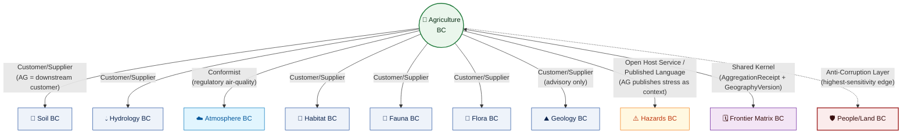
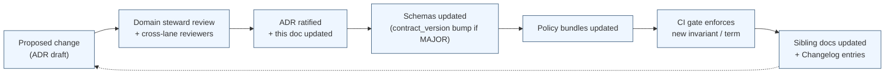

<!-- [KFM_META_BLOCK_V2]
doc_id: kfm://doc/domains/agriculture/domain
title: Agriculture — Domain Definition (Bounded Context, Ubiquitous Language, Conceptual Model)
type: standard
subtype: domain-bounded-context
version: v1 (draft)
status: draft
owners: TODO — Agriculture Domain Steward · Domain Architect · Docs Steward
created: 2026-05-26
updated: 2026-05-26
policy_label: public
contract_version: "3.0.0"
related:
  - docs/doctrine/ai-build-operating-contract.md
  - docs/doctrine/directory-rules.md
  - docs/doctrine/trust-membrane.md
  - docs/doctrine/lifecycle-law.md
  - docs/doctrine/policy-aware.md
  - docs/doctrine/evidence-first.md
  - docs/doctrine/ai-as-assistant.md
  - docs/doctrine/corrections-are-first-class.md
  - docs/domains/agriculture/README.md
  - docs/domains/agriculture/ARCHITECTURE.md
  - docs/domains/agriculture/api-contracts.md
  - docs/domains/agriculture/CANONICAL_PATHS.md
  - docs/domains/agriculture/CONTINUITY_INVENTORY.md
  - docs/domains/agriculture/CROSS_LANE.md
  - docs/domains/agriculture/DATA_LIFECYCLE.md
  - docs/domains/agriculture/policy/README.md
  - docs/domains/agriculture/sublanes/README.md
tags: [kfm, domain, agriculture, bounded-context, ubiquitous-language, ddd, conceptual-model, doctrine-adjacent, contract-v3]
notes:
  - Pinned to CONTRACT_VERSION = "3.0.0".
  - Authoritative domain glossary for Agriculture; sibling docs reference this register.
  - DDD framing per Atlas card KFM-P1-IDEA-0049 / KFM-P9-FEAT-0005 + MapLibre v2.1 Appendix B DDD Pattern Crosswalk.
  - All path-shaped and identifier claims are PROPOSED until mounted-repo verification.
[/KFM_META_BLOCK_V2] -->

<a id="top"></a>

# 🌾 Agriculture — Domain Definition

> The **bounded context, ubiquitous language, and conceptual model** for the Agriculture domain. This document is the authoritative domain glossary and DDD building-block register for Agriculture; sibling docs reference its definitions rather than redefining them. Cite-or-abstain; aggregate-default; field-level claims fail closed.

[](#sec-1-vision)
[](../../doctrine/ai-build-operating-contract.md)
[](#sec-4-language)
[](#sec-2-authority)
[](#sec-3-bounded-context)
[](#sec-5-3-aggregates)
[](#sec-13-changelog)

| Status | Owners | Last updated | Pinned to |
|---|---|---|---|
| `draft` | TODO — Agriculture Domain Steward · Domain Architect · Docs Steward | 2026-05-26 | `CONTRACT_VERSION = "3.0.0"` |

> [!IMPORTANT]
> **What this doc is — and what it is not.** This is the **bounded-context, ubiquitous-language, and conceptual-model** authority for Agriculture. It defines *what the domain is*, *what its terms mean*, *which conceptual building blocks it uses* (entities, value objects, aggregates, services, domain events), and *what invariants must always hold*. It does **not** decide:
> - the *physical architecture* (sublanes, lifecycle pipeline diagram, trust-membrane placement) → [`ARCHITECTURE.md`](./ARCHITECTURE.md),
> - the *wire shape* of governed-API envelopes → [`api-contracts.md`](./api-contracts.md),
> - the *placement* of files in the monorepo → [`CANONICAL_PATHS.md`](./CANONICAL_PATHS.md),
> - the *lifecycle phases and gates* → [`DATA_LIFECYCLE.md`](./DATA_LIFECYCLE.md),
> - the *per-edge cross-lane contracts* → [`CROSS_LANE.md`](./CROSS_LANE.md),
> - the *carry-forward state* of doctrine → [`CONTINUITY_INVENTORY.md`](./CONTINUITY_INVENTORY.md).
> Reach for the right sibling doc when the question is not "what does this term mean?" or "what are the domain rules that must always hold?".

> [!NOTE]
> **Authoritative-glossary rule.** When this document and a sibling disagree on the *meaning* of an Agriculture term, **this document governs** and the sibling is filed as drift against itself. When this document and a sibling disagree on *placement, wire shape, lifecycle, edges, or carry-forward*, **the sibling governs** and this document is filed as drift. `[CONFIRMED — operating contract §47 separation of concerns.]`

> [!CAUTION]
> **No mounted repository was inspected this session.** Every file path, schema identifier, route, validator name, and concrete identifier listed here is **PROPOSED** until reconciled with the actual repository. Doctrine recorded from the attached KFM corpus is **CONFIRMED** as doctrine; its **implementation maturity remains UNKNOWN.** `[CONFIRMED — operating contract §13 repository preflight.]`

### Contents

1. [Domain vision statement](#sec-1-vision)
2. [Authority & basis](#sec-2-authority)
3. [Bounded context definition](#sec-3-bounded-context)
4. [Ubiquitous language](#sec-4-language)
5. [Conceptual model](#sec-5-model)
   - 5.1 [Entities](#sec-5-1-entities)
   - 5.2 [Value Objects](#sec-5-2-value-objects)
   - 5.3 [Aggregates](#sec-5-3-aggregates)
   - 5.4 [Domain Services](#sec-5-4-services)
   - 5.5 [Domain Events](#sec-5-5-events)
   - 5.6 [Repositories & Factories](#sec-5-6-repositories)
6. [Domain invariants](#sec-6-invariants)
7. [Domain policies](#sec-7-policies)
8. [Context map (DDD patterns)](#sec-8-context-map)
9. [Anti-corruption layers](#sec-9-acl)
10. [Domain model evolution](#sec-10-evolution)
11. [Open questions register](#sec-11-open-questions)
12. [Open verification backlog](#sec-12-backlog)
13. [Changelog](#sec-13-changelog)
14. [Definition of done](#sec-14-dod)
15. [Related docs](#sec-15-related)

---

<a id="sec-1-vision"></a>

## 1 · Domain vision statement

> The Agriculture domain exists to make Kansas's agricultural reality — what was grown, where soil supports what crops, where moisture and weather stressed which fields, how aggregate output and supply chains moved over time — **inspectable, citeable, public-safe, and correctable**, without ever exposing operator identity or treating an aggregate as a field-level truth.

`[CONFIRMED scope — DOM-AG §A; ENCY §7.7.]` `[PROPOSED articulation — this document; first-draft vision statement.]`

Three things this vision **rejects**:

1. **Surveillance-grade resolution.** Agriculture is not a tool for tracking what an individual operator did on an individual parcel; field-level operator-identifying joins are **denied by default**.
2. **Decision authority over real-world farm operations.** Agriculture provides *context* and *citations*, not *instructions*. The domain is not an alert authority, not a regulatory authority, and not a land-management instruction system.
3. **Confidence without evidence.** Every Agriculture claim resolves to an `EvidenceBundle`. Where the evidence is absent, stale, or revoked upstream, the domain `ABSTAIN`s. The domain never fabricates fluent language to substitute for cite-able evidence.

Three things this vision **affirms**:

1. **Public-safe aggregation.** The default unit of public publication is the aggregate (county / HUC / grid), with an `AggregationReceipt` proving the aggregation was derived honestly and above any suppression threshold.
2. **Cross-domain humility.** Agriculture *consumes* Soil, Hydrology, Atmosphere/Air, Habitat/Fauna/Flora, and Geology context — never republishes their authority. Per-edge contracts at [`CROSS_LANE.md`](./CROSS_LANE.md).
3. **Correctability over permanence.** Every published Agriculture artifact ships with a correction path and a rollback target. Corrections cascade through `EvidenceRef`s to downstream consumers (Frontier Matrix cells, AI summaries, Hazards citations).

[⤴ Back to top](#top)

---

<a id="sec-2-authority"></a>

## 2 · Authority & basis

This document MUST obey the doctrinal stack below, in order. A lower row cannot silently override a higher one; conflicts MUST be filed as drift entries against the higher row.

| Layer | Source | Status |
|---|---|---|
| Operating law for AI-authored or AI-touched repo work (`CONTRACT_VERSION = "3.0.0"`) | [`ai-build-operating-contract.md`](../../doctrine/ai-build-operating-contract.md) | **CONFIRMED doctrine** |
| Placement protocol; Domain Placement Law | [`directory-rules.md`](../../doctrine/directory-rules.md) §§3, 4, 12 | **CONFIRMED doctrine** |
| Trust-boundary contract; correction propagation | [`trust-membrane.md`](../../doctrine/trust-membrane.md) §7–§8 | **CONFIRMED doctrine** |
| Lifecycle invariant | [`lifecycle-law.md`](../../doctrine/lifecycle-law.md) | **CONFIRMED doctrine** |
| Cite-or-abstain truth posture | [`evidence-first.md`](../../doctrine/evidence-first.md) | **CONFIRMED doctrine** |
| AI is interpretive, never root truth | [`ai-as-assistant.md`](../../doctrine/ai-as-assistant.md) | **CONFIRMED doctrine** |
| Corrections are first-class | [`corrections-are-first-class.md`](../../doctrine/corrections-are-first-class.md) | **CONFIRMED doctrine** |
| Domains as bounded contexts | Atlas cards KFM-P1-IDEA-0049 · KFM-P9-FEAT-0005 · KFM-P\{PASS\}-IDEA-\{NNNN\} (`KFM Domains as DDD Bounded Contexts with Context Map Pattern`) | **CONFIRMED doctrine** |
| DDD Pattern Crosswalk | MapLibre v2.1 Appendix B (`SRC-DDD` + KFM application) | **CONFIRMED doctrine** |
| DDD building-blocks reference | `DomainDriven_Design_Reference.pdf` (Evans) — paraphrased; KFM doctrine outranks | **CONFIRMED external reference** |
| Agriculture domain doctrine baseline | Atlas v1.1 §9.A–§9.N (`[DOM-AG]`); ENCY §7.7 | **CONFIRMED doctrine** |

### 2.1 DDD vocabulary discipline

This document uses Domain-Driven Design vocabulary (**Bounded Context**, **Ubiquitous Language**, **Entity**, **Value Object**, **Aggregate**, **Domain Service**, **Domain Event**, **Repository**, **Factory**, **Anti-Corruption Layer**, **Shared Kernel**, **Customer/Supplier**, **Conformist**, **Open Host Service**, **Published Language**) per the DDD reference and the Atlas crosswalk. **KFM doctrine outranks DDD vocabulary in any conflict.** DDD terms are a *crosswalk language* for naming what KFM already does; they do not introduce new operating rules. `[CONFIRMED — Atlas seed cards; MapLibre v2.1 Appendix B.]`

### 2.2 RFC 2119 conformance

**MUST / MUST NOT** non-negotiable; **SHOULD / SHOULD NOT** strong default; **MAY** permitted. Per `directory-rules.md` §2.2 and operating contract §5.1.1.

[⤴ Back to top](#top)

---

<a id="sec-3-bounded-context"></a>

## 3 · Bounded context definition

> **Bounded context (DDD definition).** *"A description of a boundary (typically a subsystem, or the work of a particular team) within which a particular model is defined and applicable."* `[CONFIRMED — DDD Reference, Definitions.]`

The Agriculture bounded context is the boundary within which the Agriculture **ubiquitous language** (§4) applies and within which the Agriculture **conceptual model** (§5) governs meaning, shape, identity, and invariants. Outside this boundary, terms like *"observation"*, *"yield"*, *"suitability"*, *"field"*, and *"stress"* belong to other domains and may mean different things.

### 3.1 What is inside the boundary

- All twelve Agriculture-owned object families (full table at §5).
- All Agriculture-owned domain services (§5.4).
- All Agriculture-owned domain events (§5.5).
- The Agriculture-specific source-role vocabulary (per [`ARCHITECTURE.md`](./ARCHITECTURE.md) §6 + [`DATA_LIFECYCLE.md`](./DATA_LIFECYCLE.md) §8).
- The Agriculture sensitivity tier matrix (per [`ARCHITECTURE.md`](./ARCHITECTURE.md) §11).
- The Agriculture sublane decomposition (cropland · soil-moisture · vegetation-index · suitability · stress) per [`sublanes/README.md`](./sublanes/README.md).

### 3.2 What is outside the boundary

| Concern | Owning bounded context | Why outside Agriculture |
|---|---|---|
| Soil map-unit, horizon, pedon semantics | **Soil** | Soil is the authority for sub-surface units; Agriculture *cites* via MUKEY but never redefines Soil terms. |
| Water observations, flood events, NFHL regulatory zones | **Hydrology** | Regulatory provenance preserved by Hydrology; Agriculture treats water context as input. |
| Living-person privacy, ownership, title, parcels | **People / DNA / Land** | Person-parcel joins are the highest-sensitivity edge; Agriculture passes through an Anti-Corruption Layer (§9). |
| Weather observations, air-quality, smoke, AOD | **Atmosphere / Air** | Regulatory/observed/modeled distinctions owned by Atmosphere; Agriculture consumes as context. |
| Habitat patches, ecological systems, stewardship zones | **Habitat** | Habitat-quality scores frame conservation context; Agriculture consumes for framing, never instruction. |
| Taxonomic identity (species), disease/mortality | **Fauna** | Fauna owns taxonomic authority; Agriculture's `PestStressIndicator` consumes for taxonomic identity only. |
| Plant taxonomy, vegetation communities, invasive records | **Flora** | Flora-owned authority; Agriculture consumes for invasive-management framing. |
| Bedrock, surficial lithology, parent material | **Geology** | Subsurface authority is geologic, not agricultural; advisory only. |
| Regulatory hazard authority, alerts, life-safety | **Hazards** | KFM is *not* an alert authority; Agriculture publishes stress *context*, never an alert. |
| County/state geography versioning | **Frontier Matrix** | Geography evolves; Agriculture pins `geography_version_id` at aggregation. |

### 3.3 Boundary diagram

```mermaid
flowchart TB
    subgraph AG_BC["Agriculture Bounded Context"]
        direction TB
        UL["📖 Ubiquitous Language<br/>(§4)"]
        ENT["🧱 Entities<br/>(§5.1)"]
        VO["💎 Value Objects<br/>(§5.2)"]
        AGG["📦 Aggregates<br/>(§5.3 — AggregationReceipt LOAD-BEARING)"]
        SVC["⚙️ Domain Services<br/>(§5.4)"]
        EV["📡 Domain Events<br/>(§5.5)"]
        INV["🛡 Invariants<br/>(§6)"]
    end

    SOIL[(Soil BC)]:::other
    HYD[(Hydrology BC)]:::other
    AIR[(Atmosphere BC)]:::other
    HAB[(Habitat BC)]:::other
    FAUNA[(Fauna BC)]:::other
    FLORA[(Flora BC)]:::other
    GEO[(Geology BC)]:::other
    HAZ[(Hazards BC)]:::other
    MX[(Frontier Matrix BC)]:::other
    PPL[(People/Land BC)]:::sensitive

    AG_BC -- "cites · consumes" --> SOIL
    AG_BC -- "cites · consumes" --> HYD
    AG_BC -- "cites · consumes" --> AIR
    AG_BC <-- "framing only" --> HAB
    AG_BC <-- "taxonomic identity" --> FAUNA
    AG_BC <-- "invasive framing" --> FLORA
    AG_BC -- "advisory" --> GEO
    AG_BC -- "context · never alert" --> HAZ
    AG_BC <-- "shared kernel: AggregationReceipt + GeographyVersion" --> MX
    AG_BC -.- "ANTI-CORRUPTION LAYER (§9)" .-> PPL

    classDef other fill:#eef3fa,stroke:#1f4e9d,color:#0b234d;
    classDef sensitive fill:#fbecec,stroke:#a32a2a,color:#3a0e0e;
```

[⤴ Back to top](#top)

---

<a id="sec-4-language"></a>

## 4 · Ubiquitous language

> **Ubiquitous Language (DDD definition).** *"A language structured around the domain model and used by all team members within a bounded context to connect all the activities of the team with the software."* `[CONFIRMED — DDD Reference, Definitions.]`

This section is the **authoritative Agriculture glossary**. Every term below appears in identical form in `ARCHITECTURE.md` §4.3, `api-contracts.md` §5, `CONTINUITY_INVENTORY.md` §5, and `DATA_LIFECYCLE.md` §6 — but **this register governs the meaning**. KFM-specific casing and compound terms are preserved verbatim per operating contract §11.

### 4.1 Agriculture-owned terms (CONFIRMED definitions)

| Term | Definition | Role in model | Source |
|---|---|---|---|
| **Crop Observation** | A cite-able record of a crop's presence, condition, or yield at a place and time, with source-role and rights binding. | Entity (§5.1) | `[DOM-AG §B]` |
| **Field Candidate** | A provisional field-boundary polygon awaiting evidence + rights resolution before promotion. **Not** an authoritative field; remains `candidate` source-role. | Entity (§5.1) | `[DOM-AG §B]` |
| **Crop Rotation** | A temporally ordered sequence of crops on a field or zone, derived from observations. | Entity (§5.1) | `[DOM-AG §B]` |
| **Yield Observation** | Aggregate (county/HUC) or permissioned yield evidence; **never field-level when source is aggregate-only**. | Entity (§5.1) | `[DOM-AG §B]` |
| **Irrigation Link** | An observed or administrative relationship between a water source/withdrawal and an Agriculture context (field, district). | Entity (§5.1) | `[DOM-AG §B]` |
| **Conservation Practice** | A context record describing a conservation practice (e.g., cover crop, terrace) — framing only, never instruction. | Entity (§5.1) | `[DOM-AG §B]` |
| **Soil Crop Suitability** | A modeled value scoring soil-crop compatibility for a given soil unit, crop, and assumptions. | Value Object (§5.2) | `[DOM-AG §B]` |
| **Agricultural Economy Observation** | A cite-able economic observation tied to agriculture (e.g., county-year price, production value). | Entity (§5.1) | `[DOM-AG §B]` |
| **Supply Chain Node** | A node in the agricultural supply chain (e.g., elevator, processor) with administrative source-role. | Entity (§5.1) | `[DOM-AG §B]` |
| **Drought Stress Indicator** | A modeled value indicating drought stress over a geography/time, with explicit uncertainty; **never an alert**. | Value Object (§5.2) | `[DOM-AG §B]` |
| **Pest Stress Indicator** | A modeled value indicating pest stress over a geography/time, with explicit uncertainty; **never an alert**. Consumes Fauna for taxonomic identity. | Value Object (§5.2) | `[DOM-AG §B]` |
| **Aggregation Receipt** | A receipt proving that aggregation thresholds were satisfied: aggregation method, geometry scope, inputs, suppression rule, uncertainty, time scope. | Value Object (§5.2) — **load-bearing** | `[DOM-AG §B]` |

### 4.2 Agriculture-used identifiers and values

| Term | Definition | Role in model | Source |
|---|---|---|---|
| **MUKEY** | SSURGO map-unit identifier. **Owned by Soil**; Agriculture cites it as a value. | Value Object (cross-domain) | `[DOM-AG §C; Soil BC]` |
| **COKEY** · **CHKEY** | Soil component / horizon identifiers (Soil-owned). | Value Object (cross-domain) | `[Soil BC]` |
| **VWC** | Volumetric water content (station or gridded soil moisture). | Value Object | `[DOM-AG §C]` |
| **NDVI** | Normalized Difference Vegetation Index (HLS-VI-derived value). | Value Object | `[DOM-AG §C]` |
| **classmap_version** | CDL classification map version; pinned at admission, preserved through publication. | Value Object — pin reference | `[Atlas KFM-P25-PROG-0005]` |
| **county_fips** · **huc_id** · **reach_id** · **station_id** · **grid_cell_id** · **taxon_id** | Cross-lane join keys (PROPOSED names; PER edge contracts at [`CROSS_LANE.md`](./CROSS_LANE.md)). | Value Object (cross-domain) | `[CROSS_LANE.md §5–§14]` |
| **geography_version_id** | Frontier Matrix geography version pin used by Agriculture aggregates feeding matrix cells. | Value Object (cross-domain) | `[Frontier Matrix BC]` |

### 4.3 Cross-cutting governance terms used by Agriculture

These terms are **owned by KFM doctrine globally**; Agriculture uses them but does not define them. Their canonical definitions live in operating contract §9 glossary.

`SourceDescriptor` · `EvidenceRef` · `EvidenceBundle` · `DatasetVersion` · `ValidationReport` · `RunReceipt` · `AIReceipt` · `GENERATED_RECEIPT` · `RuntimeResponseEnvelope` · `PolicyDecision` · `PromotionDecision` · `ReleaseManifest` · `LayerManifest` · `MapReleaseManifest` · `CorrectionNotice` · `RollbackCard` · `WithdrawalNotice` · `ReviewRecord` · `RedactionReceipt` · `RealityBoundaryNote` · `ModelRunReceipt` · `RepresentationReceipt` · `MatrixCellReceipt` · `Citation` · `Geometry Fingerprint` · `spec_hash`.

> [!IMPORTANT]
> **Compound terminology is verbatim.** Per operating contract §11, the compound terms above MUST be preserved exactly (capitalization, hyphenation, casing). Paraphrasing breaks cross-document coherence. `[CONFIRMED — operating contract §11.]`

[⤴ Back to top](#top)

---

<a id="sec-5-model"></a>

## 5 · Conceptual model

> **Building blocks (DDD).** *"Entities are objects defined by identity over time rather than attributes."* / *"Value Objects describe or compute some characteristic of a thing — many objects have no conceptual identity."* / *"Aggregates — cluster of associated objects treated as a unit for data changes, with a root entity."* / *"Services — operations that don't belong to a particular entity or value object."* `[CONFIRMED — DDD Reference §II.]`

The Agriculture conceptual model maps the bounded context's twelve owned object families and their operations to DDD building blocks. The full architectural breakdown (lifecycle, sublanes, trust posture) lives at [`ARCHITECTURE.md`](./ARCHITECTURE.md); this section provides the **DDD-typed view**.

<a id="sec-5-1-entities"></a>

### 5.1 Entities

> Entities have **identity that persists through state changes**. Two entities are the same if their identity matches, regardless of attribute changes.

| Entity | Identity (PROPOSED) | Lifecycle phase admissibility | Notes |
|---|---|---|---|
| **Crop Observation** | `source_id + observation_id + temporal_scope` | RAW → PUBLISHED | Source-role at admission preserved; never relabeled. |
| **Field Candidate** | `source_id + field_id` | RAW → PROCESSED (never PUBLISHED public when operator-identifiable) | Remains `candidate` source-role until evidence + rights resolve. |
| **Crop Rotation** | `field_or_zone_id + observed_window` | PROCESSED → PUBLISHED | Derived from Crop Observation entities; itself an entity (the rotation has identity over time). |
| **Yield Observation** | `aggregate_scope + crop + year + source_id` | PROCESSED → PUBLISHED | **Aggregate-scoped identity**; field-level admission denied for aggregate-only sources. |
| **Irrigation Link** | `link_record_id + temporal_scope` | RAW → PUBLISHED *(aggregate)* / DENY *(operator-identifiable)* | Operator-identifiable joins fail closed. |
| **Conservation Practice** | `practice_record_id + practice_year` | RAW → PROCESSED → PUBLISHED *(generalized)* | Operator-identifiable practices generalize before publication. |
| **Agricultural Economy Observation** | `aggregate_scope + indicator + year + source_id` | PROCESSED → PUBLISHED | Per-capita figures require Frontier Matrix population denominator with pinned `geography_version_id`. |
| **Supply Chain Node** | `node_id + administrative_year` | RAW → PUBLISHED *(non-critical)* / DENY *(critical-asset)* | Critical-asset overlap denies publication. |

> [!NOTE]
> **`SoilCropSuitability`, `DroughtStressIndicator`, `PestStressIndicator`, and `AggregationReceipt` are value objects, not entities** — they are defined by attributes, not identity. They appear inside aggregates (§5.3). The aggregate has identity; the value object inside does not. `[CONFIRMED — DDD Reference §II.]`

<a id="sec-5-2-value-objects"></a>

### 5.2 Value Objects

> Value objects are **defined by their attributes; immutable; no thread of identity**. *"Treat the value object as immutable. Make all operations Side-effect-free Functions that don't depend on any mutable state."* `[CONFIRMED — DDD Reference §II.]`

| Value Object | Defined by (attributes) | Used in aggregate(s) | Notes |
|---|---|---|---|
| **Aggregation Receipt** *(load-bearing)* | `aggregation_method + geometry_scope + inputs[] + suppression_rule + uncertainty + time_scope + actor + timestamp + geography_version_id` | Every public aggregate aggregate (§5.3) | Without this VO, the aggregate envelope MUST `ABSTAIN`. |
| **Soil Crop Suitability** value | `mukey + crop + scoring_method + score + confidence` | `SoilCropSuitability aggregate` | Modeled; never observed. |
| **Drought Stress Indicator** value | `geography_scope + temporal_window + indicator_method + score + uncertainty + model_identity` | `StressIndicator aggregate` | Modeled; never alert; never instruction. |
| **Pest Stress Indicator** value | `geography_scope + temporal_window + indicator_method + score + uncertainty + model_identity + taxon_id` | `StressIndicator aggregate` | Fauna provides `taxon_id` only. |
| **Redaction Receipt** | `transform + reason + actor + timestamp` | Any public Agriculture aggregate where sensitivity required redaction | Cross-cutting VO. |
| **VWC** measurement | `value + unit + depth + qc_flags` | `CropObservation aggregate` (when soil-moisture-bearing) | Station- or grid-sourced. |
| **NDVI** value | `value + sensor + classmap_version + mask_flags` | `StressIndicator aggregate` · `CropObservation aggregate` (when HLS-VI-bearing) | classmap_version pin required. |
| **Citation** | `source_id + locator + retrieval_time` | All Agriculture aggregates | Cross-cutting VO; preserved through promotion. |
| **Geometry Fingerprint** | `geometry_hash + crs + simplification_level` | `CropObservation`, `FieldCandidate`, `IrrigationLink` aggregates | Cross-cutting VO. |
| **MUKEY** reference | `mukey_value + ssurgo_vintage` | `SoilCropSuitability aggregate` | Soil-owned identifier used here as a value. |
| **classmap_version** reference | `version_id + product_year` | `CropObservation aggregate` (CDL-derived) · `StressIndicator aggregate` (HLS-VI-derived) | Pinned at admission. |

<a id="sec-5-3-aggregates"></a>

### 5.3 Aggregates

> **Aggregates** are *"cluster\[s\] of associated objects treated as a unit for data changes, with a root entity"*. External references resolve **only** to the aggregate root. Invariants hold across the aggregate; the root enforces them. `[CONFIRMED — DDD Reference §II.]`

| Aggregate | Root entity | Contained value objects / receipts | Invariant enforced by root |
|---|---|---|---|
| **CropObservation aggregate** | `CropObservation` | `Aggregation Receipt` (if aggregate role) · `Citation` · `Geometry Fingerprint` · `VWC` (if soil-moisture-bearing) · `classmap_version` (if CDL-derived) · `EvidenceRef[]` | Source-role at admission preserved; aggregate role requires `Aggregation Receipt`. |
| **FieldCandidate aggregate** | `FieldCandidate` | `Geometry Fingerprint` · `Citation` · `SourceDescriptor` reference · `ValidationReport` reference | Remains `candidate`; never promoted to operator-identifiable public surface. |
| **CropRotation aggregate** | `Crop Rotation` | List of `CropObservation` aggregate references · `Citation` · time-window VOs | All cited Crop Observations released or review-authorized. |
| **YieldObservation aggregate** | `Yield Observation` | `Aggregation Receipt` *(MANDATORY)* · `Citation` · `geography_version_id` · `EvidenceRef[]` | Aggregate-scope identity; field-level admission denied. |
| **IrrigationLink aggregate** | `Irrigation Link` | `Citation` · `huc_id` / `gauge_id` value · `EvidenceRef[]` · `Redaction Receipt` (if generalized) | Operator-identifiable joins fail closed. |
| **ConservationPractice aggregate** | `Conservation Practice` | `Citation` · `Redaction Receipt` (if operator-identifiable generalized) | Framing only; never instruction. |
| **SoilCropSuitability aggregate** | `SoilCropSuitability` value lifted to *aggregate root via spec-hash identity* | `MUKEY` reference · `crop` value · `score` value · `ModelRunReceipt` · `EvidenceBundle` reference | Soil authority preserved; modeled-role preserved. |
| **AgriculturalEconomyObservation aggregate** | `Agricultural Economy Observation` | `Aggregation Receipt` · `Citation` · `geography_version_id` · `EvidenceRef[]` | Per-capita figures require pinned population denominator. |
| **SupplyChainNode aggregate** | `Supply Chain Node` | `Citation` · `Geometry Fingerprint` (generalized) · `EvidenceRef[]` | Critical-asset coordinates denied to public. |
| **StressIndicator aggregate** | `DroughtStressIndicator` value *or* `PestStressIndicator` value (lifted to root via spec-hash identity) | `model_identity` · `uncertainty` · `taxon_id` (for pest) · `classmap_version` · `ModelRunReceipt` · `EvidenceBundle` reference | Never alert; never instruction. |
| **AgricultureLayer aggregate** *(release-time)* | `LayerManifest` | `Aggregation Receipt` · `ReleaseManifest` · `PromotionDecision` · `RollbackCard` target · audience-class pin | Audience-class enforced before publication. |

> [!IMPORTANT]
> **`AggregationReceipt` is the load-bearing value object of the Agriculture bounded context.** Every aggregate whose evidence includes `role = aggregate` MUST resolve an `AggregationReceipt`. Without it, the aggregate root enforces an `ABSTAIN aggregation_receipt_missing` outcome. This invariant is restated formally at §6 and validated by `validate_aggregation_receipt_present` per [`CROSS_LANE.md`](./CROSS_LANE.md) §17. `[CONFIRMED — Atlas §24.13; ARCHITECTURE.md §5.]`

<a id="sec-5-4-services"></a>

### 5.4 Domain Services

> *"When a significant process or transformation in the domain is not a natural responsibility of an entity or value object, add an operation to the model as a standalone interface declared as a service."* `[CONFIRMED — DDD Reference §II.]`

Agriculture domain services operate on aggregates and emit value objects + domain events. They are **stateless** and **deterministic given the same inputs and the same `EvidenceBundle` snapshot**.

| Service | Operation | Inputs | Outputs | Emits |
|---|---|---|---|---|
| **AggregationService** | Aggregate field-level / point observations to county / HUC / grid scope above suppression-N threshold. | `CropObservation` aggregates · `geography_scope` · `suppression_rule` | Aggregated CropObservation aggregate + `Aggregation Receipt` value | `AggregationReceiptIssued` event |
| **SuitabilityService** | Compute `SoilCropSuitability` value from Soil + crop inputs. | `MUKEY` reference · `crop` · scoring method | `SoilCropSuitability` value + `ModelRunReceipt` | `SoilCropSuitabilityComputed` event |
| **DroughtStressIndicatorService** | Derive drought stress indicator from Atmosphere + Hydrology + soil-moisture inputs. | Weather / station / SMAP / soil-moisture inputs · time window · scope | `DroughtStressIndicator` value + `ModelRunReceipt` | `DroughtStressIndicatorComputed` event |
| **PestStressIndicatorService** | Derive pest stress indicator from Agriculture observation + Fauna taxonomic identity. | Crop observation context · Fauna `taxon_id` · season window | `PestStressIndicator` value + `ModelRunReceipt` | `PestStressIndicatorComputed` event |
| **RedactionService** | Generalize sensitive geometry / suppress identifying attributes; emit transform receipt. | Sensitive aggregate · `transform` policy | Generalized aggregate + `Redaction Receipt` | `RedactionReceiptIssued` event |
| **PromotionService** | Execute the lifecycle gate from CATALOG → PUBLISHED with all required artifacts. | CATALOG-state aggregate · `ReleaseManifest` candidate · `ReviewRecord` (if required) | PUBLISHED-state aggregate + `PromotionDecision` | `AgricultureArtifactPromoted` event |
| **CorrectionService** | Issue `CorrectionNotice`, identify downstream derivatives, optionally trigger `RollbackCard`. | Detected error · evidence · published target | `CorrectionNotice` + downstream invalidation list | `CorrectionNoticeEmitted` event |
| **WithdrawalService** *(People/Land cascade)* | Immediate withdrawal of any Agriculture derivative joining an affected person/parcel. | Upstream People/Land `CorrectionNotice` | `WithdrawalNotice` + invalidated derivatives | `WithdrawalNoticeIssued` event |

> [!NOTE]
> **`apps/governed-api/` is itself a domain service** in the DDD sense — the operation "answer an Agriculture query under the trust membrane" is not a natural responsibility of any single aggregate. It is the service that mediates between the Agriculture model and the outside world. `[CONFIRMED — MapLibre v2.1 Appendix B (governed API as Domain Service); trust-membrane.md.]`

<a id="sec-5-5-events"></a>

### 5.5 Domain Events

> *"Something happened that domain experts care about."* Domain events are **immutable, time-stamped records** of state changes. They flow forward to consumers; they do not flow backward. `[CONFIRMED — DDD Reference §II.]`

| Domain Event | Trigger | Carries | Consumed by |
|---|---|---|---|
| `CropObservationAdmitted` | Crop Observation aggregate enters RAW. | `source_id` · `observation_id` · `classmap_version` (if CDL) | Validation pipeline. |
| `FieldCandidatePromoted` | FieldCandidate aggregate transitions PROCESSED → CATALOG. | `field_id` · `evidence_refs` | Catalog closure pipeline. |
| `AggregationReceiptIssued` | `AggregationService` emits a new `Aggregation Receipt`. | Receipt content · scope · suppression rule | Release pipeline · Frontier Matrix consumers. |
| `SoilCropSuitabilityComputed` | `SuitabilityService` emits a new value. | MUKEY · crop · score · model run | Catalog · governed-api consumers. |
| `DroughtStressIndicatorComputed` · `PestStressIndicatorComputed` | Stress services emit a new value. | Geography · time · uncertainty | Hazards (as context) · governed-api consumers. |
| `AgricultureArtifactPromoted` | `PromotionService` records a `PromotionDecision` (CATALOG → PUBLISHED). | `ReleaseManifest` · audience-class | Public surface; Frontier Matrix cells. |
| `CorrectionNoticeEmitted` | `CorrectionService` issues a correction. | Invalidated `EvidenceRef`s · downstream derivatives | Downstream consumers — propagate per [`CROSS_LANE.md`](./CROSS_LANE.md) §16. |
| `WithdrawalNoticeIssued` | People/Land cascade triggers `WithdrawalService`. | Affected derivatives | Immediate withdrawal at public surface. |
| `RollbackCardIssued` | Reversion to prior known-good state. | Target prior `ReleaseManifest` · cause | Release rollback pipeline. |

> [!IMPORTANT]
> **AI does not emit domain events.** Per `ai-as-assistant.md`, AI is interpretive — it summarizes events that already happened; it never *causes* a state change in the Agriculture model. An `AIReceipt` records that an AI interpretation occurred, but the interpretation itself is not a domain event. `[CONFIRMED — ai-as-assistant.md; GAI.]`

<a id="sec-5-6-repositories"></a>

### 5.6 Repositories & Factories

> *"Repositories mediate between the domain and data-mapping layers."* / *"Factories encapsulate the knowledge needed to create complex objects and aggregates."* `[CONFIRMED — DDD Reference §II.]`

| Pattern | Agriculture realization (PROPOSED) | Notes |
|---|---|---|
| **Repository (read)** | Governed API resolvers under `apps/governed-api/` — mediating access to released Agriculture aggregates. | Public clients **never** access canonical stores directly; the repository is the trust-membrane surface. `[trust-membrane.md.]` |
| **Repository (steward)** | Restricted query interface for stewards to inspect QUARANTINE, candidate, and review-state aggregates. | Steward-only; deny audience-class for public. |
| **Source registry** | `data/registry/sources/agriculture/` — `SourceDescriptor` entries for every admitted source family. | The registry **is** a domain repository in the DDD sense. |
| **Schema registry** | `schemas/contracts/v1/domains/agriculture/` + `schemas/contracts/v1/receipts/`. | Cross-cutting; not Agriculture-exclusive. |
| **Factory (entity creation)** | Connector + admission service pair: `connectors/<source>/` emits raw; `AggregationService` and `SuitabilityService` build downstream aggregates. | The pipeline **is** the factory in the DDD sense — composition of `SourceDescriptor` + payload → aggregate root. |

[⤴ Back to top](#top)

---

<a id="sec-6-invariants"></a>

## 6 · Domain invariants

> An invariant is a **rule that MUST always hold true within the bounded context**, across all states of all aggregates, regardless of which service is executing. Aggregates enforce invariants at their root.

The Agriculture bounded context has **seven load-bearing invariants**. Any aggregate, service, or envelope that violates an invariant MUST fail closed and emit the appropriate outcome (`DENY` / `ABSTAIN` / `ERROR`).

| # | Invariant | Statement | Where enforced | Failure outcome |
|---|---|---|---|---|
| **INV-AG-01** | **Aggregation Invariant** | Every public Agriculture aggregate whose `evidence_refs[]` includes `role = aggregate` MUST resolve an `AggregationReceipt`. | `apps/governed-api/`; envelope schema; `validate_aggregation_receipt_present`. | `ABSTAIN aggregation_receipt_missing` |
| **INV-AG-02** | **Source-Role Invariant** | Source role at admission (`SourceDescriptor.source_role`) is preserved through every promotion. No upgrade from `modeled → observed`, `aggregate → field-level`, `candidate → verified`, or `administrative → regulatory`. | Every lifecycle gate; `validate_no_source_role_upgrade`. | `DENY` at gate; `ABSTAIN` at AI surface. |
| **INV-AG-03** | **Field-Level Deny Invariant** | A field-level claim drawn from an aggregate-only source (e.g., NASS QuickStats county aggregate cited as a per-field truth) is denied at every surface. | `policy/domains/agriculture/`; envelope schema; `validate_no_field_level_from_aggregate`. | `DENY` |
| **INV-AG-04** | **Person-Parcel Deny Invariant** | A join that resolves to an identifiable operator × parcel pair is denied on every public surface. Promotion to public requires explicit steward `ALLOW` + `RedactionReceipt`. | `policy/sensitivity/agriculture/`; `validate_no_person_parcel_join_public`. | `DENY person_parcel_join_denied` |
| **INV-AG-05** | **AI-Not-Truth Invariant** | AI text is never the root truth source. `EvidenceBundle` outranks generated language. Where evidence is insufficient, the AI surface MUST `ABSTAIN`. | Focus Mode; `validate_no_uncited_join`; AI surface contract. | `ABSTAIN` |
| **INV-AG-06** | **Lifecycle Invariant** | Promotion is a governed state transition. No skipping. No silent promotion. No connector or watcher writes to PROCESSED / CATALOG / PUBLISHED. | Lifecycle gates; `validate_lifecycle_skip`; Directory Rules §13.5. | `DENY` at gate; merge blocked. |
| **INV-AG-07** | **Alert-Authority Invariant** | KFM is not an alert authority. Agriculture stress indicators (`DroughtStressIndicator`, `PestStressIndicator`) MUST NOT be framed as alerts, life-safety guidance, or operational instructions. | Publication surface; `validate_no_life_safety_framing`; Atlas §24.9.2. | `DENY` at publication; `ABSTAIN` at AI. |

> [!CAUTION]
> **The seven invariants are non-negotiable.** They are restated in [`ARCHITECTURE.md`](./ARCHITECTURE.md) §9 (architectural form), [`api-contracts.md`](./api-contracts.md) §6 (envelope-level enforcement), [`DATA_LIFECYCLE.md`](./DATA_LIFECYCLE.md) §5 (gate-level enforcement), [`CROSS_LANE.md`](./CROSS_LANE.md) §17 (cross-lane validators), and [`policy/README.md`](./policy/README.md) (policy-level enforcement). **If any sibling weakens an invariant, the sibling is wrong** and this doc governs. `[CONFIRMED — operating contract §47 separation of concerns.]`

[⤴ Back to top](#top)

---

<a id="sec-7-policies"></a>

## 7 · Domain policies

Domain **policies** (in the DDD sense) are decisions about admissibility, sensitivity, and release that operate on the model. They differ from invariants: invariants are rules that **always** hold; policies are decisions that **vary by context** (audience class, sensitivity tier, source role, review state).

| Policy class | Governs | Canonical home | Outcome vocabulary |
|---|---|---|---|
| **Admission policy** | Whether a source is admitted to RAW. | `policy/domains/agriculture/admission/` | `ALLOW` / `DENY` / `HOLD` |
| **Sensitivity policy** | Whether an aggregate may be published, and at which audience class. | `policy/sensitivity/agriculture/` | `ALLOW` / `RESTRICT` / `DENY` / `HOLD` |
| **Release policy** | Whether a CATALOG → PUBLISHED transition is permitted, and under what review. | `policy/release/agriculture/` | `ALLOW` / `RESTRICT` / `DENY` / `HOLD` |
| **AI surface policy** | Whether AI may summarize / compare / explain at Focus Mode. | `policy/ai/agriculture/` *(PROPOSED)* | `ANSWER` / `ABSTAIN` / `DENY` *(runtime; via AIReceipt)* |
| **Correction policy** | Whether a `CorrectionNotice` is processed, and what derivatives invalidate. | `policy/correction/agriculture/` *(PROPOSED)* | `ACCEPTED` / `DENY` / `ERROR` *(workflow)* |

> [!IMPORTANT]
> **Policy outcomes are not runtime outcomes.** `ALLOW` / `RESTRICT` / `DENY` / `HOLD` are **policy-gate** outcomes recorded on a `PolicyDecision`. They feed but are not identical to **runtime** outcomes (`ANSWER` / `ABSTAIN` / `DENY` / `ERROR` + optional `NARROWED` / `BOUNDED`). Confusing the two is an [`api-contracts.md`](./api-contracts.md) §4 violation. `[CONFIRMED — operating contract §8 + §21.2.]`

Full policy aspect index lives at [`policy/README.md`](./policy/README.md); this section is the *domain-model view* of policies, not the policy authoring guide.

[⤴ Back to top](#top)

---

<a id="sec-8-context-map"></a>

## 8 · Context map (DDD patterns)

> *"A Context Map is a realistic large-scale view of model development across contexts with explicit translation."* `[CONFIRMED — DDD Reference §III.]`

The Agriculture bounded context relates to every other KFM bounded context via a DDD context-map pattern. Per-edge operational contracts (join keys, validators, correction cascade) live in [`CROSS_LANE.md`](./CROSS_LANE.md). This section names the **pattern** in DDD vocabulary.



### 8.1 Context-map pattern inventory

| Edge | DDD pattern | What the pattern means here | Per-edge contract |
|---|---|---|---|
| Agriculture × **Soil** | **Customer/Supplier** | Agriculture is the downstream customer; Soil is the upstream supplier. Agriculture's needs (MUKEY-resolvable suitability joins) are negotiated as supplier obligations on Soil. | [`CROSS_LANE.md`](./CROSS_LANE.md) §5 |
| Agriculture × **Hydrology** | **Customer/Supplier** | As Soil. NFHL regulatory provenance preserved across the edge. | [`CROSS_LANE.md`](./CROSS_LANE.md) §6 |
| Agriculture × **Atmosphere / Air** | **Conformist** *(for regulatory air-quality)* + **Customer/Supplier** *(for weather/AOD)* | Agriculture conforms to Atmosphere's regulatory/observed/modeled distinction; does not negotiate over it. For non-regulatory weather, Customer/Supplier. | [`CROSS_LANE.md`](./CROSS_LANE.md) §7 |
| Agriculture × **Habitat** | **Customer/Supplier** *(reciprocal)* | Habitat supplies framing context; Agriculture supplies conservation-practice candidates. Reciprocal because both consume each other for framing. | [`CROSS_LANE.md`](./CROSS_LANE.md) §8 |
| Agriculture × **Fauna** | **Customer/Supplier** *(reciprocal)* | Fauna supplies taxonomic identity for pest stress; Agriculture supplies pest stress as Fauna-disease context. | [`CROSS_LANE.md`](./CROSS_LANE.md) §9 |
| Agriculture × **Flora** | **Customer/Supplier** *(reciprocal)* | Flora supplies invasive context; Agriculture supplies vegetation observation context. | [`CROSS_LANE.md`](./CROSS_LANE.md) §10 |
| Agriculture × **Geology** | **Customer/Supplier** *(advisory)* | Geology supplies parent-material context; advisory only, never regulatory. | [`CROSS_LANE.md`](./CROSS_LANE.md) §11 |
| Agriculture × **Hazards** | **Open Host Service + Published Language** | Agriculture publishes stress indicators as a *published language* that Hazards (and others) MAY consume as context. Agriculture is the **open host**; the published language is `DroughtStressIndicator` + `PestStressIndicator` schemas. **KFM is not an alert authority** — the published language MUST NOT be framed as alerts. | [`CROSS_LANE.md`](./CROSS_LANE.md) §12 |
| Agriculture × **Frontier Matrix** | **Shared Kernel** | `AggregationReceipt` schema + `GeographyVersion` pin form a shared kernel between Agriculture and Frontier Matrix. The shared kernel requires intimate coordination — changes to either side MUST coordinate. | [`CROSS_LANE.md`](./CROSS_LANE.md) §14 |
| Agriculture × **People / DNA / Land** | **Anti-Corruption Layer** | The People/Land identity model **MUST NOT** leak into the Agriculture model. An ACL translates between the two: any data crossing this edge passes through `validate_no_person_parcel_join_public` and an explicit `RedactionService` step. | [`CROSS_LANE.md`](./CROSS_LANE.md) §13 + §9 below |

> [!NOTE]
> **The Shared Kernel with Frontier Matrix is the highest-coordination edge.** DDD warns that a Shared Kernel works only between closely coordinated teams. In KFM, the "team" is the doctrine: changes to `AggregationReceipt` or `GeographyVersion` MUST coordinate with the Frontier Matrix domain steward via ADR. `[CONFIRMED — DDD Reference §III; MapLibre v2.1 Appendix B OPEN-DDD-02; KFM-P\{PASS\}-IDEA-\{NNNN\} dependencies.]`

[⤴ Back to top](#top)

---

<a id="sec-9-acl"></a>

## 9 · Anti-corruption layers

> *"An Anti-Corruption Layer is an isolating layer that translates between bounded contexts to prevent external models from corrupting the domain."* `[CONFIRMED — DDD Reference §III.]`

The Agriculture bounded context maintains **three classes** of anti-corruption layers:

### 9.1 ACL-1 — Against People/Land identity-model leakage *(highest priority)*

The People/Land bounded context models living-person identity, ownership, parcels, residence events. **None of those concepts has any presence inside the Agriculture model.** When Agriculture observations resolve to a parcel or operator, the ACL:

1. **Refuses** to import People/Land entity definitions into Agriculture aggregates.
2. **Translates** any inbound reference via `RedactionService` before the data enters an Agriculture aggregate destined for any audience class other than `steward` / `internal`.
3. **Validates** at every boundary crossing via `validate_no_person_parcel_join_public` — the load-bearing cross-lane validator at [`CROSS_LANE.md`](./CROSS_LANE.md) §17.
4. **Audits** every translation as a `RedactionReceipt` value object inside the Agriculture aggregate.

> [!CAUTION]
> **ACL-1 is non-negotiable.** A direct join from `LandParcel` (People/Land BC) to `CropObservation` (Agriculture BC) without the ACL translation step is the **highest-severity DDD violation** in the Agriculture bounded context. It collapses two bounded contexts into one and corrupts the Agriculture model. `[CONFIRMED — operating contract §23.2; trust-membrane.md §7; Atlas §24.4.7 + §24.9.2.]`

### 9.2 ACL-2 — Against deprecated Atlas v1.0 source-role vocabulary

Earlier KFM passes (Atlas v1.0 era) used a looser source-role vocabulary that did not yet distinguish `aggregate` from `observed` or `modeled` from `regulatory`. v1.1 introduced the source-role anti-collapse register (Atlas §24.1). The ACL between Agriculture and any v1.0 corpus material:

1. **Translates** v1.0 source-role labels to the v1.1 vocabulary at admission.
2. **Quarantines** any v1.0 material whose source-role cannot be translated unambiguously.
3. **Records** the translation as a `TransformReceipt` value object.

This ACL is one-way: v1.1 vocabulary does not flow back into v1.0 documents.

### 9.3 ACL-3 — Against external system models *(connector-level)*

NASS, SSURGO, Mesonet, SMAP, HLS, FSA CLU, and other external systems each have their own data model. The KFM **source watchers** (`connectors/<source>/`) act as ACLs:

1. **Translate** external schemas into Agriculture-internal schemas at admission.
2. **Refuse** to import external-system terminology into Agriculture's ubiquitous language (e.g., NASS uses "commodity" — Agriculture's term is `crop`).
3. **Validate** source-role assignment at admission (`SourceDescriptor`).
4. **Record** every translation as `TransformReceipt`s.

`[CONFIRMED — MapLibre v2.1 Appendix B: "Source watchers (CDL, PLANTS, MAIAC, FIRMS, SMAP, AirNow, Mesonet, GBIF, SSURGO)" as Anti-Corruption Layer.]`

[⤴ Back to top](#top)

---

<a id="sec-10-evolution"></a>

## 10 · Domain model evolution

The Agriculture bounded context will evolve. **The ubiquitous language evolves before the code.** Changes to terms, entities, aggregates, services, events, invariants, or context-map patterns flow through a structured process:



### 10.1 Evolution-change classification

Per operating contract §37:

| Change class | Examples | Impact | `contract_version` |
|---|---|---|---|
| **MINOR** | Clarify an existing term's wording; add a non-load-bearing value object; add a domain event consumer. | Backward-compatible. | Unchanged. |
| **MAJOR** | Add or remove a load-bearing invariant; change an aggregate root; rename a term in the ubiquitous language; redraw a context-map pattern. | Breaking. Receipt re-issuance required. | Bumped (e.g., `3.0.0 → 4.0.0`). |
| **DEPRECATION** | Mark a term, entity, or pattern as `LINEAGE`; route consumers to a successor. | Time-bounded; tombstoned after the deprecation window. | `LINEAGE` marker; `contract_version` may bump. |

### 10.2 Refactoring toward deeper insight

> *"The growth of the model is driven by refactoring toward deeper insight."* `[CONFIRMED — DDD Reference §I.]`

The Agriculture model is **not** expected to be correct in its first draft. Refactoring toward deeper insight is anticipated — for example:

- The `PestStressIndicator` vs Fauna `DiseaseObservation` boundary may move; current placement is per Atlas §24.4.5 but flagged at [`CROSS_LANE.md`](./CROSS_LANE.md) OQ-AG-CL-05.
- The `MatrixCellReceipt` may absorb into `AggregationReceipt` or vice versa; flagged at OQ-AG-DL-14.
- The `policy/sensitivity/agriculture/` vs `policy/domains/agriculture/sensitivity/` layout may consolidate; flagged at OQ-AG-CP-13.

Each refactoring is governed by ADR + this document's changelog (§13). **No refactoring is silent.**

[⤴ Back to top](#top)

---

<a id="sec-11-open-questions"></a>

## 11 · Open questions register

| ID | Question | Owner role | Resolution path |
|---|---|---|---|
| **OQ-AG-DOM-01** | Whether `Crop Rotation` is an entity (has identity over time) or a value object (derived view of Crop Observation aggregates). | Domain architect + Agriculture domain steward | ADR; this doc currently treats as entity per DDD identity-over-time. |
| **OQ-AG-DOM-02** | Whether `SoilCropSuitability` should be an aggregate root in its own right (current §5.3) or only a value object inside a `CropSuitabilityAssessment` entity. | Domain architect | ADR; depends on whether suitability needs identity beyond its inputs. |
| **OQ-AG-DOM-03** | Whether `apps/governed-api/` is best characterized as a Domain Service or as a Repository in DDD vocabulary. | Architecture steward + Domain architect | DDD-style review; resolves alongside MapLibre v2.1 Appendix B classification. |
| **OQ-AG-DOM-04** | Whether the Agriculture × Atmosphere relationship is Conformist (for regulatory air-quality) or Customer/Supplier across the board. | Atmosphere steward + Agriculture domain steward | Cross-lane edge reconciliation; ADR. |
| **OQ-AG-DOM-05** | Whether `MUKEY` is a value object inside Agriculture's bounded context, or only an identifier passed through the Soil ACL. | Soil steward + Agriculture domain steward | ADR; impacts whether MUKEY validation is Agriculture's responsibility or Soil's. |
| **OQ-AG-DOM-06** | Whether the seven invariants in §6 are exhaustive, or whether `INV-AG-08` should formalize "cite-or-abstain" as its own invariant (currently subsumed under INV-AG-05). | Domain architect | ADR; this doc treats cite-or-abstain as a property of the AI-not-truth invariant. |
| **OQ-AG-DOM-07** | Whether the Shared Kernel with Frontier Matrix is the `AggregationReceipt` schema alone, the `GeographyVersion` value alone, or both jointly. | Frontier Matrix steward + Agriculture domain steward | ADR; resolves alongside `CROSS_LANE.md` OQ-AG-CL-10. |
| **OQ-AG-DOM-08** | Whether the deprecation of v1.0 source-role vocabulary requires a separate ADR or rides ADR-S-04. | Contract / schema steward | ADR-S-04 ratification. |
| **OQ-AG-DOM-09** | Whether the AI surface MAY emit domain events (currently §5.5 forbids) under any condition. | AI surface steward + Domain architect | This doc's current answer is NO; revisit only if a strong use case emerges. |
| **OQ-AG-DOM-10** | Whether `RedactionService` is one service or multiple specialized services per sublane (cropland · soil-moisture · vegetation-index · suitability · stress). | Domain architect + Policy steward | Resolves alongside `sublanes/README.md` sublane decomposition. |
| **OQ-AG-DOM-11** | Whether the People/Land ACL (§9.1) is implemented as a single anti-corruption layer or as multiple per-edge translators (one per Agriculture aggregate that could touch People/Land). | Architecture steward + Policy steward | ADR; this doc's current answer is single ACL with multiple translation rules. |
| **OQ-AG-DOM-12** | Whether `LayerManifest` belongs to Agriculture as an aggregate root or is a cross-cutting entity owned by the publication system. | Architecture steward | ADR; this doc treats as Agriculture-owned aggregate root at release-time. |

[⤴ Back to top](#top)

---

<a id="sec-12-backlog"></a>

## 12 · Open verification backlog

> Items below are verification work this document cannot complete without a mounted repository. Each item MUST be tracked in `docs/registers/VERIFICATION_BACKLOG.md` (PROPOSED) until closed.

<details open>
<summary><strong>Verification items (12 rows) — click to collapse</strong></summary>

| # | Item | What to check | Owner | Settles which OQ |
|---:|---|---|---|---|
| 1 | Every entity in §5.1 has a corresponding schema under `schemas/contracts/v1/domains/agriculture/`. | Schema-registry inspection. | Contract / schema steward | — |
| 2 | Every value object in §5.2 has a corresponding schema (either Agriculture-owned or cross-cutting). | Schema-registry inspection. | Contract / schema steward | — |
| 3 | `AggregationReceipt` schema present at agreed home. | ADR-S-03 ratification + repo inspection. | Contract / schema steward | OQ-AG-DOM-07 |
| 4 | All seven invariants in §6 have corresponding validators with valid + invalid fixtures. | `tests/domains/agriculture/` inspection. | Build owner + QA steward | — |
| 5 | `validate_no_person_parcel_join_public` deployed and gating publication. | CI workflow; envelope schema enforcement. | Policy steward + API owner | — |
| 6 | `validate_aggregation_receipt_present` deployed and gating publication. | CI workflow; envelope schema enforcement. | Build owner | — |
| 7 | Every domain service in §5.4 has a corresponding implementation under `packages/domains/agriculture/` or `pipelines/domains/agriculture/`. | Repo inspection. | Build owner | OQ-AG-DOM-10 |
| 8 | Every domain event in §5.5 has a corresponding event-schema definition and consumer registry. | Repo inspection. | Architecture steward | OQ-AG-DOM-09 |
| 9 | The three ACL classes in §9 have corresponding implementation surfaces (connectors as ACL-3; redaction pipeline as ACL-1; vocab translator as ACL-2). | Repo inspection. | Policy steward + Architecture steward | OQ-AG-DOM-11 |
| 10 | Sibling docs' ubiquitous-language sections (`ARCHITECTURE.md` §4.3, `CONTINUITY_INVENTORY.md` §5, `DATA_LIFECYCLE.md` §6) match this document's §4 verbatim for term definitions. | Cross-document diff. | Docs steward | — |
| 11 | `contract_version = "3.0.0"` pin propagation across Agriculture envelopes and receipts. | Schema inspection; CI logs. | Build owner | — |
| 12 | `GENERATED_RECEIPT.json` for this document wired into CI. | CI workflow inspection. | Build owner | — |

</details>

`[All items open; resolution path varies per row.]`

[⤴ Back to top](#top)

---

<a id="sec-13-changelog"></a>

## 13 · Changelog

> Per operating contract [§37](../../doctrine/ai-build-operating-contract.md): `MINOR` rows clarify or extend without breaking; `MAJOR` rows change operating law and require receipt re-issuance.

### 13.1 v1 (initial draft — current)

| Change | Type (§37) | Reason |
|---|---|---|
| Initial creation of `docs/domains/agriculture/DOMAIN.md`. | new | Establish bounded-context, ubiquitous-language, and conceptual-model authority for Agriculture; gap-fill against the seven existing sibling docs (`README.md`, `ARCHITECTURE.md`, `api-contracts.md`, `CANONICAL_PATHS.md`, `CONTINUITY_INVENTORY.md`, `CROSS_LANE.md`, `DATA_LIFECYCLE.md`). |
| Authority stack pinned to `CONTRACT_VERSION = "3.0.0"`. | new | Operating contract §1 + §5 conformance. |
| DDD framing per Atlas card KFM-P1-IDEA-0049 + MapLibre v2.1 Appendix B DDD Pattern Crosswalk. | new | Establish the doc as the DDD-typed view of the Agriculture domain. |
| §1 Domain vision statement with three "rejects" and three "affirms". | new | First articulation of the Agriculture domain vision in narrative form. |
| §3 Bounded context definition (inside / outside / boundary diagram). | new | Make the boundary explicit; the seven sibling docs reference but do not define the boundary. |
| §4 Ubiquitous language as **authoritative** glossary (with note that sibling-doc disagreements default to this doc on meaning). | new | Establish the single source of truth for term meaning. |
| §5 Conceptual model: 8-entity table · 10-value-object table · 11-aggregate table · 8-domain-service table · 9-domain-event table · repositories/factories. | new | DDD building-blocks applied to Agriculture. |
| §6 Seven load-bearing invariants (INV-AG-01 through INV-AG-07). | new | Make the non-negotiable rules explicit and validator-mapped. |
| §7 Domain policies as classes (admission · sensitivity · release · AI surface · correction). | new | Domain-model view of policies, distinct from `policy/README.md`. |
| §8 Context map with explicit DDD patterns (Customer/Supplier · Conformist · Anti-Corruption Layer · Shared Kernel · Open Host Service + Published Language). | new | Name each cross-lane edge in DDD vocabulary, complementing operational contract at `CROSS_LANE.md`. |
| §9 Three anti-corruption layers (People/Land · v1.0 vocabulary · external systems via source watchers). | new | Make ACL-1 (People/Land) the highest-priority ACL; align ACL-3 with MapLibre v2.1 Appendix B classification of source watchers. |
| §10 Domain model evolution (refactoring toward deeper insight; MINOR/MAJOR/DEPRECATION classification). | new | Govern how the model changes; tie to operating contract §37. |
| Companion sections (§11 Open Qs · §12 Backlog · §13 Changelog · §14 DoD). | new | Doctrine-doc convention. |

> **Backward compatibility (n/a — initial version).** Future v1 → v2 changes MUST preserve all v1 anchors (`#sec-1-vision` through `#sec-15-related`) and all `OQ-AG-DOM-NN` ids.

[⤴ Back to top](#top)

---

<a id="sec-14-dod"></a>

## 14 · Definition of done

A repository implementation of this document conforms when **all** of the following hold:

### 14.1 Document conformance
- [ ] `docs/domains/agriculture/DOMAIN.md` exists with KFM Meta Block v2 and `contract_version: "3.0.0"`.
- [ ] All seven sibling docs (`README.md`, `ARCHITECTURE.md`, `api-contracts.md`, `CANONICAL_PATHS.md`, `CONTINUITY_INVENTORY.md`, `CROSS_LANE.md`, `DATA_LIFECYCLE.md`) cross-reference this document.

### 14.2 Bounded-context conformance
- [ ] Every Agriculture-owned entity / value object / aggregate / service / event in §5 has a corresponding schema or implementation surface.
- [ ] Sibling docs' ubiquitous-language sections match §4 verbatim for term definitions.
- [ ] Boundary diagram at §3.3 reconciled with `CROSS_LANE.md` §4 master edge map.

### 14.3 Invariant conformance
- [ ] All seven invariants (INV-AG-01 through INV-AG-07) have corresponding validators with valid + invalid fixtures.
- [ ] Load-bearing validators (`validate_aggregation_receipt_present`, `validate_no_person_parcel_join_public`, `validate_no_life_safety_framing`) wired into CI as blocking gates.
- [ ] Invariant violations fail closed at the expected surface (envelope · gate · AI · publication).

### 14.4 Context-map conformance
- [ ] Each DDD pattern in §8 reconciled with the per-edge contract at [`CROSS_LANE.md`](./CROSS_LANE.md) §5–§14.
- [ ] Shared Kernel with Frontier Matrix has an ADR governing changes (`AggregationReceipt` + `GeographyVersion`).
- [ ] ACL-1 (People/Land) implementation surface present and tested.

### 14.5 Evolution discipline
- [ ] Every term change goes through the §10 evolution flow.
- [ ] MAJOR changes bump `contract_version`.
- [ ] Deprecations are time-bounded and tombstoned.

### 14.6 Governance hygiene
- [ ] All open questions in §11 resolved or assigned to ADRs with active owners.
- [ ] All verification items in §12 tracked in `docs/registers/VERIFICATION_BACKLOG.md`.
- [ ] Drift between this document and live state logged in `docs/registers/DRIFT_REGISTER.md`.
- [ ] CODEOWNERS coverage extends to the Agriculture Domain Steward + Domain Architect + Docs Steward.
- [ ] `GENERATED_RECEIPT.json` for this document wired into CI.

[⤴ Back to top](#top)

---

<a id="sec-15-related"></a>

## 15 · Related docs

### 15.1 Operating doctrine

- [`docs/doctrine/ai-build-operating-contract.md`](../../doctrine/ai-build-operating-contract.md) — canonical operating contract; **`CONTRACT_VERSION = "3.0.0"`**.
- [`docs/doctrine/directory-rules.md`](../../doctrine/directory-rules.md) — placement protocol.

### 15.2 Trust-boundary doctrine

- [`docs/doctrine/trust-membrane.md`](../../doctrine/trust-membrane.md) §7–§8 — trust contract + correction propagation.
- [`docs/doctrine/lifecycle-law.md`](../../doctrine/lifecycle-law.md)
- [`docs/doctrine/policy-aware.md`](../../doctrine/policy-aware.md)
- [`docs/doctrine/evidence-first.md`](../../doctrine/evidence-first.md)
- [`docs/doctrine/ai-as-assistant.md`](../../doctrine/ai-as-assistant.md)
- [`docs/doctrine/corrections-are-first-class.md`](../../doctrine/corrections-are-first-class.md)

### 15.3 Agriculture sibling docs

- [`docs/domains/agriculture/README.md`](./README.md) — domain landing.
- [`docs/domains/agriculture/ARCHITECTURE.md`](./ARCHITECTURE.md) — architectural contract.
- [`docs/domains/agriculture/api-contracts.md`](./api-contracts.md) — wire-level interface contract.
- [`docs/domains/agriculture/CANONICAL_PATHS.md`](./CANONICAL_PATHS.md) — path-only crosswalk.
- [`docs/domains/agriculture/CONTINUITY_INVENTORY.md`](./CONTINUITY_INVENTORY.md) — carry-forward register.
- [`docs/domains/agriculture/CROSS_LANE.md`](./CROSS_LANE.md) — per-edge cross-lane contracts.
- [`docs/domains/agriculture/DATA_LIFECYCLE.md`](./DATA_LIFECYCLE.md) — lifecycle phases and gates.
- [`docs/domains/agriculture/policy/README.md`](./policy/README.md) — policy aspect index.
- [`docs/domains/agriculture/sublanes/README.md`](./sublanes/README.md) — 5-axis sublane decomposition.

### 15.4 DDD reference & atlas crosswalk

- `DomainDriven_Design_Reference.pdf` (Evans) — external reference language; **KFM doctrine outranks**.
- Atlas v1.1 §9 (Agriculture chapter A–N) — `[DOM-AG]`.
- Atlas v1.1 §24.13 — object-family × domain matrix.
- MapLibre v2.1 Appendix B — DDD Pattern Crosswalk (`SRC-DDD` + KFM application).
- Atlas seed cards: KFM-P1-IDEA-0049 · KFM-P9-FEAT-0005 · KFM-P\{PASS\}-IDEA-\{NNNN\} — *"KFM Domains as DDD Bounded Contexts with Context Map Pattern"*.

### 15.5 ADR backlog (relevant to this doc)

- `docs/adr/ADR-S-03-receipt-schema-home.md` — receipt schema home (`AggregationReceipt`, `GENERATED_RECEIPT`). *(PROPOSED.)*
- `docs/adr/ADR-S-04-source-role-enum.md` — source-role enum evolution. *(PROPOSED.)*
- `docs/adr/ADR-S-05-sensitivity-tier.md` — sensitivity tier scheme. *(PROPOSED.)*
- `docs/adr/ADR-AG-DOM-01-crop-rotation-entity.md` — `Crop Rotation` as entity vs value object. *(PROPOSED — see OQ-AG-DOM-01.)*
- `docs/adr/ADR-AG-DOM-02-suitability-aggregate-root.md` — `SoilCropSuitability` as aggregate root vs value object. *(PROPOSED — see OQ-AG-DOM-02.)*
- `docs/adr/ADR-AG-DOM-03-shared-kernel-matrix.md` — Shared Kernel composition with Frontier Matrix. *(PROPOSED — see OQ-AG-DOM-07.)*

### 15.6 Registers and standards

- `docs/registers/VERIFICATION_BACKLOG.md` — open verification items.
- `docs/registers/DRIFT_REGISTER.md` — drift entries.
- `docs/standards/PROV.md` — provenance standards crosswalk *(naming variance OPEN-DR-01)*.

---

<sub>**Last reviewed:** 2026-05-26 · **Owners:** *TODO — Agriculture Domain Steward · Domain Architect · Docs Steward* · **Version:** `v1 (draft)` · **Status:** `draft` · **Pinned to:** `CONTRACT_VERSION = "3.0.0"` · **Citation keys:** `[DIRRULES]` Directory Rules · `[ENCY]` KFM Domain & Capability Encyclopedia · `[DOM-AG]` Domains Atlas v1.1 §9 · `[GAI]` Whole-UI + Governed-AI Expansion Report · `[MAP-MASTER]` MapLibre v2.1 · `[AIBOC]` `ai-build-operating-contract.md` v3.0 · `[DDD]` `DomainDriven_Design_Reference.pdf` (Evans). · [⤴ Back to top](#top)</sub>
