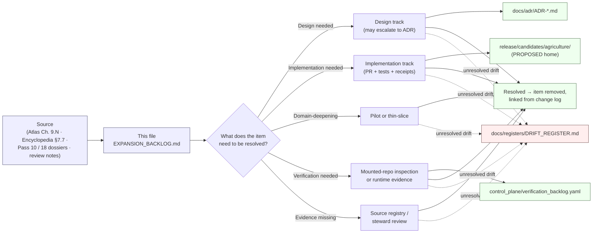

<!-- [KFM_META_BLOCK_V2]
doc_id: kfm://doc/docs-domains-agriculture-expansion-backlog
title: Agriculture Domain — Expansion Backlog
type: standard
version: v1
status: draft
owners: Agriculture domain steward; Docs steward
created: 2026-05-15
updated: 2026-05-15
policy_label: public
related:
  - docs/domains/agriculture/README.md
  - docs/registers/VERIFICATION_BACKLOG.md
  - docs/registers/DRIFT_REGISTER.md
  - docs/adr/
  - control_plane/verification_backlog.yaml
  - contracts/domains/agriculture/
  - schemas/contracts/v1/domains/agriculture/
  - policy/domains/agriculture/
  - tests/domains/agriculture/
  - pipelines/domains/agriculture/
  - release/candidates/agriculture/
tags: [kfm, agriculture, backlog, verification, expansion, governance]
notes:
  - All file paths under contracts, schemas, policy, tests, pipelines, data, and release are PROPOSED per Directory Rules until verified against mounted-repo evidence.
  - Items carried forward from Domains Culmination Atlas v1.1, Chapter 9.N are CONFIRMED as a project-authored backlog; their resolution remains NEEDS VERIFICATION.
[/KFM_META_BLOCK_V2] -->

# Agriculture — Expansion Backlog

> Working list of design, implementation, domain-deepening, verification, missing-evidence, and pilot items required to move the Agriculture domain from **CONFIRMED doctrine** to **CONFIRMED implementation** along the KFM lifecycle.

| Field | Value |
|---|---|
| **Status** | `draft` — initial seed from doctrinal sources |
| **Authority class** | Working register (refines but cannot contradict Directory Rules, the Domains Atlas, or the Encyclopedia) |
| **Owners** | Agriculture domain steward · Docs steward · Release authority (where promotion-gated) |
| **Last updated** | 2026-05-15 |
| **Supersedes** | none |
| **Related ADRs** | none yet authored against this file; ADR-S items in Atlas v1.1 Ch. 24.12 are tracked below |

---

## Table of Contents

- [1. Purpose and scope](#1-purpose-and-scope)
- [2. How items enter and leave this backlog](#2-how-items-enter-and-leave-this-backlog)
- [3. Carry-forward from Domains Atlas v1.1 (Ch. 9.N)](#3-carry-forward-from-domains-atlas-v11-ch-9n)
- [4. Backlog by track](#4-backlog-by-track)
  - [4.1 Design track](#41-design-track)
  - [4.2 Implementation track](#42-implementation-track)
  - [4.3 Domain-deepening track](#43-domain-deepening-track)
  - [4.4 Verification track](#44-verification-track)
  - [4.5 Missing-evidence track](#45-missing-evidence-track)
  - [4.6 Pilots track](#46-pilots-track)
- [5. Open questions](#5-open-questions)
- [6. Cross-lane verification touchpoints](#6-cross-lane-verification-touchpoints)
- [7. Related Open-ADR items](#7-related-open-adr-items)
- [8. Related docs and registers](#8-related-docs-and-registers)
- [Appendix A — Priority rubric and item identifiers](#appendix-a--priority-rubric-and-item-identifiers)
- [Appendix B — Source short-names used here](#appendix-b--source-short-names-used-here)

---

## 1. Purpose and scope

This file is the Agriculture domain's **expansion backlog**: a working list of the design decisions, implementation increments, domain-deepening pilots, verification items, missing-evidence gaps, and pilot programs the domain needs in order to move from **CONFIRMED doctrine** toward **CONFIRMED implementation** along the canonical lifecycle `RAW → WORK / QUARANTINE → PROCESSED → CATALOG / TRIPLET → PUBLISHED`. [DIRRULES] [ENCY] [DOM-AG]

The backlog is deliberately **not** a release plan, a roadmap commitment, a ticket queue, or an authority for repo-state claims. Per **Truth Posture** and **Cite-or-Abstain**, items here are admissible work — not assertions that the work has happened. [ENCY] [INDEX-18]

> [!NOTE]
> **Doctrine vs. implementation.** Agriculture's domain identity, ubiquitous language, object families, source families, pipeline shape, sensitivity posture, and verification questions are **CONFIRMED** in the Domains Culmination Atlas v1.1 Ch. 9 and the Encyclopedia §7.7. Every implementation-shaped claim downstream of those — paths, schemas, tests, routes, CI, deployment, dashboards, fixtures — defaults to **PROPOSED** or **NEEDS VERIFICATION** until inspected in a mounted repo. [DOM-AG] [ENCY] [DIRRULES]

> [!IMPORTANT]
> **Sensitivity remains the dominant constraint.** Agriculture's public surfaces aggregate to **county / HUC / grid** thresholds; field-level operator data, proprietary yield, pesticide, and private-sensitive joins **fail closed** by default. Backlog items that touch field-level resolution, operator identity, or private joins MUST land behind a documented policy review and an AggregationReceipt or RedactionReceipt. [DOM-AG] [ENCY] [GAI]

### What is in scope here

- Items naming Agriculture-specific objects from the canonical spine: **Crop Observation, Field Candidate, Crop Rotation, Yield Observation, Irrigation Link, Conservation Practice, Soil Crop Suitability, Agricultural Economy Observation, SupplyChainNode, Drought Stress Indicator, Pest Stress Indicator, Aggregation Receipt**. [DOM-AG] [ENCY]
- Items naming Agriculture's documented source families: **USDA NASS CDL · NASS QuickStats / Crop Progress · NRCS conservation practice / SCAN · SSURGO / gSSURGO / Soil Data Access · Kansas Mesonet · NOAA USCRN · NASA SMAP · NASA HLS / HLS-VI**, plus irrigation/water-use, crop insurance/market, and local extension sources where rights permit. [DOM-AG] [ENCY]
- Items that resolve a NEEDS VERIFICATION or UNKNOWN status named in Atlas Ch. 9.N or in the Pass 18 / Pass 10 expansion dossiers. [DOM-AG] [INDEX-18] [INDEX-10]

### What is out of scope here

- **Cross-domain or repo-wide** doctrinal questions (schema-home, sensitivity-tier scheme, source-role vocabulary, AI-receipt schema) belong in `docs/registers/VERIFICATION_BACKLOG.md` or in an ADR; they are referenced from §7 but not owned here. [DIRRULES] [ENCY]
- **Adjacent-domain truth** — Soil owns canonical map-unit/horizon semantics; Hydrology owns water observations and flood context; People/Land owns living-person privacy, title, parcels. Agriculture cites these but does not redefine them. [DOM-AG] [ENCY]
- **AI-as-truth** behavior. Per the Governed AI rule, AI may summarize released Agriculture EvidenceBundles, compare evidence, and ABSTAIN/DENY appropriately — but AI is interpretive, never root truth. AI-behavior backlog lives in the Governed AI dossier; only Agriculture-specific Focus Mode templates appear here. [GAI] [DOM-AG]

---

## 2. How items enter and leave this backlog

The diagram is **PROPOSED** in its routing details (exact ADR home, exact candidate path, exact register filename) and **CONFIRMED** in its principle: items resolve by producing **admissible evidence** — an accepted ADR, a passing test, a release receipt, a steward review, or a source-rights confirmation — not by editorial assertion. [DIRRULES §2.1] [ENCY] [INDEX-10]

**Lifecycle of a backlog entry**

1. **Surfaced** — added with an identifier (`AG-EXP-###` for new; `DOM-AG-N###` for items carried forward from Atlas Ch. 9.N).
2. **Classified** — assigned a track (design / implementation / domain-deepening / verification / missing-evidence / pilot) and a priority (H / M / L or P0 / P1, see [Appendix A](#appendix-a--priority-rubric-and-item-identifiers)).
3. **Routed** — linked to the artifact that would resolve it (ADR, schema, fixture, policy bundle, dataset registry entry, release manifest, dashboard, runbook).
4. **Resolved or aged** — closed when the artifact is admitted; aged-entry policy follows the per-root README cadence (older than ~6 months → flagged for review). [DIRRULES §15]

---

## 3. Carry-forward from Domains Atlas v1.1 (Ch. 9.N)

The Domains Culmination Atlas v1.1 names four agriculture-specific verification items in Chapter 9, Section N. These are reproduced verbatim below and tracked as the spine of this backlog. **CONFIRMED** that the Atlas authored these items; the items themselves are **NEEDS VERIFICATION** until settled against mounted-repo evidence. [DOM-AG] [ENCY]

| ID | Item to verify | Evidence that would settle it | Status |
|---|---|---|---|
| `DOM-AG-N001` | Verify NASS/QuickStats and Crop Progress activation. | mounted repo files, schemas, registry entries, tests, logs, emitted artifacts, review records, or release manifests | NEEDS VERIFICATION |
| `DOM-AG-N002` | Verify Mesonet and HLS/SMAP product terms. | (same as above) | NEEDS VERIFICATION |
| `DOM-AG-N003` | Verify public release sensitivity rules for farm/operator joins. | (same as above) | NEEDS VERIFICATION |
| `DOM-AG-N004` | Verify Agriculture API and layer registry. | (same as above) | NEEDS VERIFICATION |

> [!TIP]
> Each `DOM-AG-N###` item is settled by an **artifact**, not a paragraph. The Atlas's "evidence that would settle it" column is the closure rule: a SourceDescriptor with current rights for `DOM-AG-N002`; a `policy/domains/agriculture/` bundle with passing deny-tests for `DOM-AG-N003`; a `LayerManifest` and a route in `apps/governed-api/` for `DOM-AG-N004`; and a `data/registry/sources/agriculture/` entry plus a `RunReceipt` for `DOM-AG-N001`. [DOM-AG] [ENCY] [DIRRULES]

---

## 4. Backlog by track

The six-track structure (Design / Implementation / Domain-Deepening / Verification / Missing-Evidence / Pilots) mirrors the Pass 10 expansion-dossier pattern. **CONFIRMED** that this is the project's organizing convention; **PROPOSED** as the convention for Agriculture's lane specifically. [INDEX-10]

### 4.1 Design track

Decisions that should land before implementation hardens. Several may escalate to an ADR per Directory Rules §2.4.

| ID | Item | Priority | Notes |
|---|---|---|---|
| `AG-EXP-D01` | Define **public-safe aggregation thresholds** (county / HUC level, grid pixel, minimum cell-count, k-anonymity floor) for Crop Observation, Yield Observation, and stress indicators. | H | Aggregation Receipt is a canonical object family; threshold rules must be schema-bound, not editorial. [DOM-AG] [ENCY] |
| `AG-EXP-D02` | Define **field-polygon sensitivity classification** and the gate between Field Candidate (internal) and any public-safe derivative. | H | Field polygons may be sensitive; default-deny posture required. [DOM-AG] [ENCY] |
| `AG-EXP-D03` | Decide **CropObservation identity rule** (PROPOSED basis: `source id + object role + temporal scope + normalized digest`) and freeze in a contract under `contracts/domains/agriculture/`. | H | Identity-rule freeze is needed before processed-tier promotion. [DOM-AG] |
| `AG-EXP-D04` | Decide **CropRotation derivation policy** (multi-year CDL inputs, minimum span, confidence threshold, derivative status). | M | CropRotation is documented as a canonical object; derivation method is not. [DOM-AG] |
| `AG-EXP-D05` | Design the **IrrigationLink** join semantics against Hydrology water-use observations (relation type, sensitivity carry-over, EvidenceBundle support). | M | Cross-lane relation rule must preserve ownership, source role, and sensitivity. [DOM-AG] [ENCY] |
| `AG-EXP-D06` | Design **AggregationReceipt** schema (inputs, threshold parameters, suppression record, output cell list, digest). | H | Listed as a canonical object family but schema home is PROPOSED. [DOM-AG] |
| `AG-EXP-D07` | Design the **AgricultureDecisionEnvelope** finite-outcome contract (`ANSWER / ABSTAIN / DENY / ERROR`). | M | Atlas Ch. 9.J flags route TBD and DTO PROPOSED. [DOM-AG] |
| `AG-EXP-D08` | Decide **Drought / Pest Stress Indicator** model class (rule-based aggregate, statistical anomaly, or trained model) and the model-card requirement before publication. | M | AI/model outputs are interpretive; cannot stand as root truth. [GAI] [DOM-AG] |
| `AG-EXP-D09` | Resolve the **CDL pixel-vs-aggregate** publication boundary: which products are CDL-pixel raster-released and which are NASS-aggregate only. | H | First credible thin slice depends on this. [DOM-AG] [ENCY] |
| `AG-EXP-D10` | Define **stale-state policy** for cadence-bound sources (QuickStats refresh, HLS revisit, SMAP latency) and the badging rule on dashboards. | M | Stale-state rule is required in Agriculture publication gates. [DOM-AG] [MAP-MASTER] |

### 4.2 Implementation track

PROPOSED implementation increments. Each item is **PROPOSED**; none is a claim that work exists in the mounted repo.

| ID | Item | Priority | PROPOSED home(s) |
|---|---|---|---|
| `AG-EXP-I01` | Author a first Agriculture **SourceDescriptor** set covering NASS CDL, QuickStats, SSURGO, Kansas Mesonet, NOAA USCRN, NASA SMAP, NASA HLS/HLS-VI, NRCS SCAN. | H | `data/registry/sources/agriculture/` |
| `AG-EXP-I02` | Add Agriculture **contract** stubs for the 12 canonical object families. | H | `contracts/domains/agriculture/` |
| `AG-EXP-I03` | Add Agriculture **schemas** matching those contracts. | H | `schemas/contracts/v1/domains/agriculture/` |
| `AG-EXP-I04` | Author Agriculture **policy bundles** for the deny defaults: field-level NASS denial, farm/operator join denial, private-yield denial, unreviewed-rotation denial. | H | `policy/domains/agriculture/` |
| `AG-EXP-I05` | Author Agriculture **test set** covering the validators named in Atlas Ch. 9.K. | H | `tests/domains/agriculture/` |
| `AG-EXP-I06` | Add **fixtures** for the thin-slice plan (county-year panel, SSURGO suitability, Mesonet weather; field-level detail denied). | H | `fixtures/domains/agriculture/` |
| `AG-EXP-I07` | Stand up an Agriculture **pipeline** that walks `RAW → WORK / QUARANTINE → PROCESSED → CATALOG / TRIPLET → PUBLISHED` end-to-end with one CDL crop-year tile. | M | `pipelines/domains/agriculture/`, `pipeline_specs/agriculture/` |
| `AG-EXP-I08` | Emit Agriculture **LayerManifest** for the public-safe crop / soil-suitability / stress-indicator layers. | M | `data/published/layers/agriculture/` |
| `AG-EXP-I09` | Wire the Agriculture **Evidence Drawer payload** projection for the public CDL/QuickStats layer features. | M | `apps/governed-api/` (route TBD) |
| `AG-EXP-I10` | Author Agriculture **Focus Mode templates** with mandatory AIReceipt emission and citation validation. | L | `policy/runtime/`, `apps/governed-api/` |
| `AG-EXP-I11` | Author Agriculture **ReleaseManifest** + **RollbackCard** templates for first release candidate. | M | `release/candidates/agriculture/` |

### 4.3 Domain-deepening track

Pilots and thin-slices that deepen Agriculture's evidence base before broad publication.

| ID | Item | Priority | Notes |
|---|---|---|---|
| `AG-EXP-DD01` | Run the **first credible thin slice**: county-level crop-year panel using CDL/QuickStats + SSURGO suitability + Kansas Mesonet weather fixture, with field-level detail denied by default. | H | This is the Atlas's named thin slice for Agriculture. [DOM-AG] [ENCY] |
| `AG-EXP-DD02` | Pilot **CropRotation detection** on a single county across ≥ 3 consecutive CDL years, with steward review of confidence thresholds. | M | CropRotation is named as an analytical function. [DOM-AG] |
| `AG-EXP-DD03` | Pilot **Soil-Crop Suitability** on a single county joining SSURGO MUKEY components with CDL year, including SoilTimeCaveat handling. | M | Cross-lane relation with Soil. [DOM-AG] [ENCY] |
| `AG-EXP-DD04` | Pilot a **Drought Stress Indicator** dashboard combining Mesonet VWC, NOAA USCRN, NASA SMAP, and NASS Crop Progress condition reports for one growing season. | M | Multi-source pilot exercises stale-state and source-role rules. [DOM-AG] |
| `AG-EXP-DD05` | Pilot **public-safe aggregation tests** end-to-end: derive a public county product from raw inputs and verify the AggregationReceipt closes the redaction chain. | H | Public-safe aggregation tests are named in Atlas Ch. 9.K. [DOM-AG] |
| `AG-EXP-DD06` | Pilot **HLS-VI vegetation-index** context layer integration with Hydrology drought indicators. | L | Cross-lane evidence carry-over. [DOM-AG] |

### 4.4 Verification track

Items that need to be checked, not designed or built. Includes the four Atlas Ch. 9.N items by reference plus extensions.

| ID | Item | Priority | What would settle it |
|---|---|---|---|
| `DOM-AG-N001` | NASS / QuickStats and Crop Progress **activation**. | H | SourceDescriptor + RunReceipt + at least one validated dataset version. [DOM-AG] |
| `DOM-AG-N002` | Mesonet and HLS / SMAP **product terms**. | H | Current rights/license text captured in SourceDescriptor; cadence and redistribution class recorded. [DOM-AG] |
| `DOM-AG-N003` | Public release **sensitivity rules** for farm/operator joins. | H | Policy bundle with passing deny-tests in `policy/domains/agriculture/`. [DOM-AG] |
| `DOM-AG-N004` | Agriculture **API and layer registry**. | H | LayerManifest in `data/published/layers/agriculture/` + a route in `apps/governed-api/`. [DOM-AG] |
| `AG-EXP-V01` | Verify **MUKEY join discipline** with Soil (preserve ownership, source role, sensitivity, EvidenceBundle support). | M | Cross-domain join test fixture + ReviewRecord. [DOM-AG] [ENCY] |
| `AG-EXP-V02` | Verify **stale-state badging** on all Agriculture map layers (freshness badge present, retrieval/source/release times distinct). | M | Map shell proof + LayerManifest inspection. [MAP-MASTER] [DOM-AG] |
| `AG-EXP-V03` | Verify **AI ABSTAIN / DENY behavior** for Agriculture Focus Mode answers when evidence is insufficient or rights are unresolved. | M | Focus mock proof + AIReceipt + citation-validation report. [GAI] [DOM-AG] |
| `AG-EXP-V04` | Verify **rollback drill** for an Agriculture release (release dry-run → rollback card → restored prior manifest). | L | Release dry-run + RollbackCard + restored prior ReleaseManifest. [DOM-AG] [ENCY] |

### 4.5 Missing-evidence track

Items where the project corpus does not yet supply enough to design or implement responsibly.

| ID | Item | Priority |
|---|---|---|
| `AG-EXP-ME01` | Concrete **aggregation thresholds** per public product (county minimum farm-count, HUC pixel-count floor, grid k-anonymity equivalents). | H |
| `AG-EXP-ME02` | Concrete **debounce / refresh cadence** per source family (NASS, Mesonet, USCRN, SCAN, SMAP, HLS). | M |
| `AG-EXP-ME03` | **Rights status** clarification for NRCS conservation practice data at public-release granularity. | H |
| `AG-EXP-ME04` | **Stale-state thresholds** per product class (how stale is too stale for a map badge vs. quarantine vs. withdrawal). | M |
| `AG-EXP-ME05` | **Drought / Pest Stress Indicator validation metrics** and model-card template content. | M |
| `AG-EXP-ME06` | Documentation of **Kansas Mesonet redistribution terms** for derived public-safe layers. | M |

### 4.6 Pilots track

Bounded experiments with explicit acceptance criteria.

| ID | Item | Priority |
|---|---|---|
| `AG-EXP-P01` | Pilot a **no-network fixture** for the full Agriculture thin slice; prove RAW→PUBLISHED runs in CI without external calls. | H |
| `AG-EXP-P02` | Pilot **AggregationReceipt verifier** on a county CDL → public-safe county product transform. | H |
| `AG-EXP-P03` | Pilot **SoilTimeCaveat propagation** through SSURGO → SoilCropSuitability → Agriculture Evidence Drawer payload. | M |
| `AG-EXP-P04` | Pilot **graph projection safety**: confirm Agriculture triples do not leak field-level identity through joins. | M |
| `AG-EXP-P05` | Pilot a **correction-and-rollback** flow against a deliberately faulty CropObservation release. | L |

---

## 5. Open questions

Grouped by what the question needs to be resolved — more evidence, more design, more implementation, or more verification — following the Pass 10 dossier convention. [INDEX-10]

<strong>Evidence-needed questions</strong>

- What are the **current redistribution and rights terms** for Kansas Mesonet, NASA SMAP, NASA HLS / HLS-VI, NRCS SCAN, and NOAA USCRN at the public-derivative level (not just the raw data level)?
- Which **NASS QuickStats / Crop Progress** series are usable as primary observation and which only as context, by source role?
- What is the **current API stability posture** of USDA NASS endpoints (CDL service, QuickStats API, Crop Progress release schedule)?
- Are there **per-county or per-region overrides** required for sensitivity thresholds (e.g., counties with very few operators)?

<strong>Design-needed questions</strong>

- Is the **AggregationReceipt** a stand-alone object or a sub-component of a wider RedactionReceipt family? (Affects schema home.)
- Should **Field Candidate** ever be promoted to a published object, or is it permanently internal? (Affects pipeline rules.)
- Where does **AgriculturalEconomyObservation** stop and **Frontier Matrix economic observation** begin?
- Should **IrrigationLink** carry a separate sensitivity tier from CropObservation when joined?
- How is **SupplyChainNode** sensitivity handled when it implies identifying a private operator?

<strong>Implementation-needed questions</strong>

- What is the **canonical schema location** for Agriculture? PROPOSED `schemas/contracts/v1/domains/agriculture/` per ADR-0001 default; needs verification against mounted repo. [DIRRULES]
- What does the **first credible thin slice** look like as a deployable artifact set (a runnable pipeline spec, a published LayerManifest, a governed-API route, a UI feature flag)?
- What does the **public Agriculture route surface** look like in `apps/governed-api/` (feature lookup, evidence bundle resolution, layer manifest, Evidence Drawer payload, Focus Mode answer)?
- Where do **CDL and HLS raster proofs** live in the lifecycle (`data/raw/agriculture/` then `data/processed/agriculture/`, with receipts under `data/receipts/` and proofs under `data/proofs/`)? [DIRRULES]

<strong>Verification-needed questions</strong>

- Do the policy bundles in `policy/domains/agriculture/` actually **deny field-level NASS claims**, farm/operator joins, and unreviewed CropRotation derivations in CI as well as at runtime?
- Does every Agriculture **EvidenceBundle** carry a citation set sufficient to support the public claim it backs?
- Does every Agriculture **AggregationReceipt** record the suppression decisions it made (cells dropped, counts below threshold)?
- Do the Agriculture **release manifests** include a stale-state rule, a correction path, and a rollback target?
- Does the Agriculture **Focus Mode** ABSTAIN cleanly when rights are unresolved, and DENY cleanly when policy / sensitivity blocks the request? [GAI]

---

## 6. Cross-lane verification touchpoints

Agriculture cites four adjacent lanes and must preserve ownership, source role, sensitivity, and EvidenceBundle support across each. **CONFIRMED** cross-lane targets per Atlas Ch. 9.F; **PROPOSED** that each verification step lands as an explicit test fixture. [DOM-AG] [ENCY]

| Touchpoint | Related lane | Backlog item(s) | Constraint |
|---|---|---|---|
| MUKEY joins and suitability support | **Soil** | `AG-EXP-DD03`, `AG-EXP-V01` | Soil owns canonical SoilMapUnit / SoilComponent semantics; Agriculture cites, never redefines. |
| Irrigation, drought, water-use context | **Hydrology** | `AG-EXP-D05`, `AG-EXP-DD04`, `AG-EXP-DD06` | IrrigationLink must not promote sensitive water-rights data into a public Agriculture layer. |
| Weather, heat, smoke, vegetation stress | **Atmosphere/Air** | `AG-EXP-DD04`, `AG-EXP-V02` | Mesonet, USCRN, SMAP, and HLS-VI products keep their source-role badges through the join. |
| Farm/operator and parcel-sensitive contexts | **People/Land** | `AG-EXP-D02`, `DOM-AG-N003`, `AG-EXP-P04` | Living-person and parcel-private joins **fail closed**. |

---

## 7. Related Open-ADR items

Several items in the Atlas v1.1 **Master Open-ADR Backlog (Ch. 24.12)** are not Agriculture-owned but materially affect this lane. They are tracked here for visibility; ownership stays with the cited owner. [ENCY Ch. 24.12] [DIRRULES]

| ADR-S id (Atlas) | Question | Why it matters for Agriculture |
|---|---|---|
| `ADR-S-01` | Canonical schema home (`schemas/contracts/v1/…`) | Determines where Agriculture schemas physically land. |
| `ADR-S-03` | Receipt class home (single root vs. per-domain) | Where AggregationReceipt and RedactionReceipt schemas live. |
| `ADR-S-04` | Source-role enum — canonical vocabulary, evolution rule | Required by every Agriculture SourceDescriptor. |
| `ADR-S-05` | Sensitivity tier scheme (T0–T4) | Sets the default tier for CropObservation aggregate vs. Field Candidate. |

> [!NOTE]
> When any of these ADR-S items land, the relevant Agriculture backlog entries above SHOULD be revisited to confirm or amend their PROPOSED placement and schema homes.

---

## 8. Related docs and registers

- `docs/domains/agriculture/README.md` — `TODO` domain landing page (PROPOSED, NEEDS VERIFICATION whether present in mounted repo)
- `docs/registers/VERIFICATION_BACKLOG.md` — repo-wide verification register; cross-cutting Agriculture items mirror here
- `docs/registers/DRIFT_REGISTER.md` — unresolved drift, including any Agriculture path conflicts
- `docs/adr/` — accepted ADRs; ADR-0001 (schema home) and any future Agriculture-touching ADR-S items
- `control_plane/verification_backlog.yaml` — machine-readable companion to the verification track
- `contracts/domains/agriculture/` · `schemas/contracts/v1/domains/agriculture/` · `policy/domains/agriculture/` · `tests/domains/agriculture/` · `fixtures/domains/agriculture/` · `pipelines/domains/agriculture/` · `pipeline_specs/agriculture/` · `data/{raw,work,quarantine,processed,catalog,published,registry,receipts,proofs}/agriculture/` · `release/candidates/agriculture/` — all PROPOSED per Directory Rules §12, all NEEDS VERIFICATION against mounted repo

---

## Appendix A — Priority rubric and item identifiers

<strong>Priority labels</strong>

This file uses two priority schemes side by side, both **PROPOSED** for Agriculture:

- **H / M / L** — Pass 10 convention. **High** = load-bearing or unblocks downstream items; **Medium** = important but not blocking; **Low** = valuable but lower-leverage. [INDEX-10]
- **P0 / P1** (used in cross-references) — Pass 18 convention. **P0** = required for the next dossier closure or the first credible thin slice; **P1** = required before broad publication. [INDEX-18]

The two schemes are roughly aligned: P0 ≈ H, P1 ≈ M.

<strong>Identifier conventions</strong>

- `DOM-AG-N###` — verbatim carry-forward from Atlas Ch. 9.N (Verification backlog). **CONFIRMED** authored by the Atlas; **NEEDS VERIFICATION** as resolved.
- `AG-EXP-D##` — Design-track items added in this file.
- `AG-EXP-I##` — Implementation-track items added in this file.
- `AG-EXP-DD##` — Domain-deepening / pilot items.
- `AG-EXP-V##` — Verification-track items not carried forward from the Atlas.
- `AG-EXP-ME##` — Missing-evidence items.
- `AG-EXP-P##` — Pilot-track items.
- `ADR-S-##` — Open-ADR items defined in Atlas v1.1 Ch. 24.12 (owned outside this file).

Identifiers are intentionally short and human-readable; they are not durable URIs. If this backlog grows beyond ~50 items per track, consider rolling identifiers into `control_plane/verification_backlog.yaml`.

<strong>Status taxonomy used in this file</strong>

| Label | Meaning |
|---|---|
| **CONFIRMED** | Verified this session from attached doctrine (Atlas, Encyclopedia, Directory Rules, Pass 10 / 18 dossiers, Unified Manual). |
| **INFERRED** | Reasonably derivable from visible evidence but not directly stated. |
| **PROPOSED** | Design, path, placement, or recommendation not yet verified in implementation. |
| **NEEDS VERIFICATION** | Checkable against mounted repo, ADRs, source-rights records, or runtime evidence — not yet checked. |
| **UNKNOWN** | Not resolvable without more evidence. |

The Atlas itself states: "CONFIRMED doctrine / PROPOSED implementation" for every domain including Agriculture. This file inherits that posture. [DOM-AG] [ENCY]

---

## Appendix B — Source short-names used here

The short-name citation set is reused from the Atlas v1.1 master ledger to keep references stable across `docs/`. [ENCY] [DIRRULES]

| Short-name | Source | What it carries |
|---|---|---|
| `[DOM-AG]` | Agriculture dossier / Domains Atlas Ch. 9 | Agriculture domain doctrine (identity, language, objects, sources, pipeline, sensitivity, API, tests, verification) |
| `[ENCY]` | Encyclopedia | Cross-domain object spine, operating law, viewing modes, knowledge systems |
| `[DIRRULES]` | Directory Rules | Canonical placement, lifecycle law, README contract, ADR discipline |
| `[MAP-MASTER]` | Master MapLibre Components | Renderer downstream of trust, LayerManifest, badging |
| `[GAI]` | Governed AI dossier | AIReceipt, Focus Mode, ABSTAIN/DENY behavior |
| `[INDEX-10]` | Pass 10 Idea Index / Expansion Dossier | Six-track expansion-backlog convention, H/M/L priority |
| `[INDEX-18]` | Pass 18 Idea Index / Category Atlas | P0/P1 priority, AG-### identifiers, expansion agenda pattern |
| `[UNIFIED]` | Unified Implementation Architecture Build Manual | Phase 5 Agriculture lane scope (§6.12) |
| `[UIAI]` | Whole-UI + Governed AI Expansion Report | UI / Focus Mode binding to Evidence Drawer and AIReceipt |

---

### Footer

| Field | Value |
|---|---|
| **Last updated** | 2026-05-15 |
| **Doc status** | `draft` |
| **Implementation status** | PROPOSED — no mounted repo inspected this session |
| **Owners** | Agriculture domain steward · Docs steward |
| **Next review** | Whenever a related ADR-S item lands, a mounted-repo inspection happens, or a domain steward closes any `DOM-AG-N###` item |

