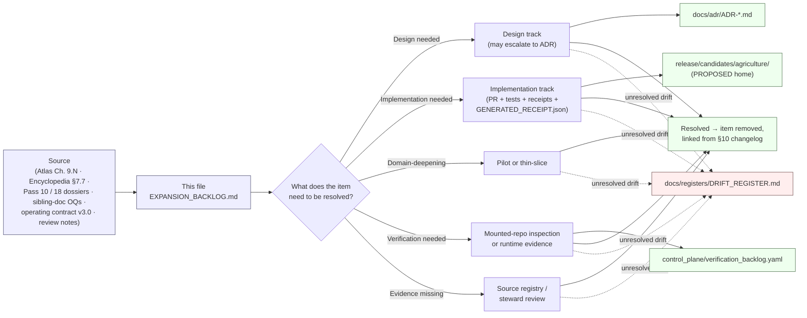

<!-- [KFM_META_BLOCK_V2]
doc_id: kfm://doc/docs-domains-agriculture-expansion-backlog
title: Agriculture Domain — Expansion Backlog
type: standard
subtype: domain-expansion-backlog
version: v2 (draft)
status: draft
owners: TODO — Agriculture Domain Steward · Docs Steward · Release Authority (where promotion-gated) · Domain Architect
created: 2026-05-15
updated: 2026-05-26
policy_label: public
contract_version: "3.0.0"
related:
  - docs/doctrine/ai-build-operating-contract.md
  - docs/doctrine/directory-rules.md
  - docs/doctrine/trust-membrane.md
  - docs/doctrine/lifecycle-law.md
  - docs/doctrine/policy-aware.md
  - docs/doctrine/evidence-first.md
  - docs/doctrine/ai-as-assistant.md
  - docs/doctrine/corrections-are-first-class.md
  - docs/domains/agriculture/README.md
  - docs/domains/agriculture/DOMAIN.md
  - docs/domains/agriculture/ARCHITECTURE.md
  - docs/domains/agriculture/api-contracts.md
  - docs/domains/agriculture/CANONICAL_PATHS.md
  - docs/domains/agriculture/CONTINUITY_INVENTORY.md
  - docs/domains/agriculture/CROSS_LANE.md
  - docs/domains/agriculture/DATA_LIFECYCLE.md
  - docs/domains/agriculture/policy/README.md
  - docs/domains/agriculture/runbooks/README.md
  - docs/domains/agriculture/sublanes/README.md
  - docs/registers/VERIFICATION_BACKLOG.md
  - docs/registers/DRIFT_REGISTER.md
  - docs/adr/
  - control_plane/verification_backlog.yaml
tags: [kfm, agriculture, backlog, verification, expansion, governance, doctrine-adjacent, contract-v3]
notes:
  - Pinned to CONTRACT_VERSION = "3.0.0".
  - Work-tracking register; aggregates open items from Atlas Ch. 9.N and the eight Agriculture sibling docs.
  - All file paths under contracts/, schemas/, policy/, tests/, pipelines/, data/, release/ are PROPOSED per Directory Rules until verified against mounted-repo evidence.
  - Items carried forward from Domains Culmination Atlas v1.1 Ch. 9.N are CONFIRMED as a project-authored backlog; their resolution remains NEEDS VERIFICATION.
[/KFM_META_BLOCK_V2] -->

# 🌾 Agriculture — Expansion Backlog

> Working register of design, implementation, domain-deepening, verification, missing-evidence, and pilot items required to move the Agriculture domain from **CONFIRMED doctrine** to **CONFIRMED implementation** along the KFM lifecycle. Aggregates open items from Atlas Ch. 9.N + every Agriculture sibling doc's Open Questions register.

| Field | Value |
|---|---|
| **Status** | `draft` — v2 integration pass aligned with operating contract v3.0 and eight sibling docs |
| **Authority class** | Working register (refines but cannot contradict Directory Rules, the Domains Atlas, the Encyclopedia, the operating contract, or any sibling doc's Open Questions register) |
| **Owners** | TODO — Agriculture Domain Steward · Docs Steward · Release Authority (where promotion-gated) · Domain Architect |
| **Last updated** | 2026-05-26 |
| **Pinned to** | `CONTRACT_VERSION = "3.0.0"` |
| **Supersedes** | v1 (2026-05-15) |
| **Related ADRs** | ADR-S-01 through ADR-S-05 (Atlas v1.1 Ch. 24.12); ADR-AG-POL-01, ADR-AG-ARCH-01, ADR-AG-SUB-01, ADR-AG-CL-01–04, ADR-AG-DOM-01–03 (Agriculture-specific) — all PROPOSED until ratified |

> [!IMPORTANT]
> **What this doc is — and what it is not.** This is the **work-tracking register** for the Agriculture domain: design decisions to make, implementation increments to ship, pilots to run, verifications to close, missing evidence to chase. It does **not** decide:
> - the *meaning* of an Agriculture term → [`DOMAIN.md`](./DOMAIN.md),
> - the *physical architecture* (sublanes, lifecycle pipeline) → [`ARCHITECTURE.md`](./ARCHITECTURE.md),
> - the *wire shape* of governed-API envelopes → [`api-contracts.md`](./api-contracts.md),
> - the *placement* of files in the monorepo → [`CANONICAL_PATHS.md`](./CANONICAL_PATHS.md),
> - the *lifecycle phases and gates* → [`DATA_LIFECYCLE.md`](./DATA_LIFECYCLE.md),
> - the *per-edge cross-lane contracts* → [`CROSS_LANE.md`](./CROSS_LANE.md),
> - the *carry-forward state of doctrine* → [`CONTINUITY_INVENTORY.md`](./CONTINUITY_INVENTORY.md).
> Reach for the right sibling doc when the question is not "what work still needs to happen here?".

> [!CAUTION]
> **No mounted repository was inspected this session.** Every file path, schema home, route name, validator name, and ADR status is **PROPOSED** until reconciled with the actual repository. Items here are admissible *work* — not assertions that the work has happened. `[CONFIRMED — operating contract §13 repository preflight; §8 truth posture.]`

---

## 📑 Table of Contents

1. [Purpose and scope](#sec-1-purpose)
2. [Authority & basis](#sec-2-authority)
3. [How items enter and leave this backlog](#sec-3-lifecycle)
4. [Carry-forward from Domains Atlas v1.1 (Ch. 9.N)](#sec-4-carry-forward)
5. [Backlog by track](#sec-5-tracks)
   - 5.1 [Design track](#sec-5-1-design)
   - 5.2 [Implementation track](#sec-5-2-implementation)
   - 5.3 [Domain-deepening track](#sec-5-3-deepening)
   - 5.4 [Verification track](#sec-5-4-verification)
   - 5.5 [Missing-evidence track](#sec-5-5-evidence)
   - 5.6 [Pilots track](#sec-5-6-pilots)
6. [Open questions register — sibling-doc aggregation](#sec-6-oq-register)
7. [Open questions register — by resolution path](#sec-7-oq-by-path)
8. [Cross-lane verification touchpoints](#sec-8-cross-lane)
9. [Related Open-ADR items](#sec-9-adrs)
10. [Changelog](#sec-10-changelog)
11. [Definition of done](#sec-11-dod)
12. [Related docs and registers](#sec-12-related)
13. [Appendix A — Priority rubric and item identifiers](#sec-appendix-a)
14. [Appendix B — Source short-names](#sec-appendix-b)

---

## 1 · Purpose and scope

This file is the Agriculture domain's **expansion backlog**: a working list of the design decisions, implementation increments, domain-deepening pilots, verification items, missing-evidence gaps, and pilot programs the domain needs in order to move from **CONFIRMED doctrine** toward **CONFIRMED implementation** along the canonical lifecycle `RAW → WORK / QUARANTINE → PROCESSED → CATALOG / TRIPLET → PUBLISHED`. `[CONFIRMED — DIRRULES §9.1; ENCY; DOM-AG.]`

The backlog is deliberately **not** a release plan, a roadmap commitment, a ticket queue, or an authority for repo-state claims. Per **Truth Posture** and **Cite-or-Abstain**, items here are admissible work — not assertions that the work has happened. `[CONFIRMED — operating contract §8; evidence-first.md; INDEX-18.]`

> [!NOTE]
> **Doctrine vs. implementation.** Agriculture's domain identity, ubiquitous language, object families, source families, pipeline shape, sensitivity posture, cross-lane edges, and verification questions are **CONFIRMED** in the eight Agriculture sibling docs created in this corpus + the Domains Culmination Atlas v1.1 Ch. 9 + the Encyclopedia §7.7. Every implementation-shaped claim downstream of those — paths, schemas, tests, routes, CI, deployment, dashboards, fixtures, validators, receipts — defaults to **PROPOSED** or **NEEDS VERIFICATION** until inspected in a mounted repo. `[CONFIRMED — DOM-AG; ENCY; DIRRULES; AIBOC §13.]`

> [!IMPORTANT]
> **Sensitivity remains the dominant constraint.** Agriculture's public surfaces aggregate to **county / HUC / grid** thresholds; field-level operator data, proprietary yield, pesticide records, FSA CLU, and private-sensitive joins **fail closed** by default. Backlog items that touch field-level resolution, operator identity, or private joins MUST land behind a documented policy review and an `AggregationReceipt` or `RedactionReceipt`. The full sensitive-domain disposition matrix applies — see operating contract §23.2. `[CONFIRMED — DOM-AG; ENCY §7.7; operating contract §23.2; GAI.]`

> [!CAUTION]
> **`AggregationReceipt`, `contract_version = "3.0.0"` pin, `GENERATED_RECEIPT.json`, and person-parcel-join DENY are the four load-bearing v3 conformance items.** Every backlog row that touches publication ships with one or more of these obligations attached. `[CONFIRMED — operating contract §34 + §47; api-contracts.md §6; CROSS_LANE.md §17.]`

### 1.1 What is in scope here

- Items naming Agriculture-specific objects from the canonical spine: **Crop Observation, Field Candidate, Crop Rotation, Yield Observation, Irrigation Link, Conservation Practice, Soil Crop Suitability, Agricultural Economy Observation, SupplyChainNode, Drought Stress Indicator, Pest Stress Indicator, Aggregation Receipt**. `[CONFIRMED — DOMAIN.md §5; DOM-AG; ENCY.]`
- Items naming Agriculture's documented source families: **USDA NASS CDL · NASS QuickStats / Crop Progress · NRCS conservation practice / SCAN · SSURGO / gSSURGO / Soil Data Access · Kansas Mesonet · NOAA USCRN · NASA SMAP · NASA HLS / HLS-VI · FSA CLU · NLCD / LANDFIRE / GAP · USDA PLANTS**, plus irrigation/water-use, crop insurance/market, and local extension sources where rights permit. `[CONFIRMED — DATA_LIFECYCLE.md §8; CONTINUITY_INVENTORY.md §6; DOM-AG.]`
- Items that resolve a `NEEDS VERIFICATION` or `UNKNOWN` status named in Atlas Ch. 9.N, in the Pass 18 / Pass 10 expansion dossiers, or in any of the eight Agriculture sibling docs' Open Questions registers (§6 aggregates these). `[CONFIRMED — DOM-AG; INDEX-18; INDEX-10; sibling docs.]`
- Items required for `CONTRACT_VERSION = "3.0.0"` conformance (the v3-era additions at §5). *(v2 addition.)*

### 1.2 What is out of scope here

- **Cross-domain or repo-wide** doctrinal questions (schema-home, sensitivity-tier scheme, source-role vocabulary, AI-receipt schema) belong in `docs/registers/VERIFICATION_BACKLOG.md` or in an ADR; they are referenced from §9 but not owned here. `[CONFIRMED — DIRRULES; ENCY.]`
- **Adjacent-domain truth** — Soil owns canonical map-unit/horizon semantics; Hydrology owns water observations and flood context; People/Land owns living-person privacy, title, parcels. Agriculture cites these via the cross-lane contracts at [`CROSS_LANE.md`](./CROSS_LANE.md) but does not redefine them.
- **AI-as-truth** behavior. Per the Governed AI rule and operating contract §34, AI may summarize released Agriculture `EvidenceBundle`s, compare evidence, and `ABSTAIN` / `DENY` appropriately — but AI is interpretive, never root truth. AI-behavior backlog lives in the Governed AI dossier; only Agriculture-specific Focus Mode templates appear here. `[CONFIRMED — GAI; ai-as-assistant.md; DOM-AG.]`

### 1.3 RFC 2119 conformance

**MUST / MUST NOT** non-negotiable; **SHOULD / SHOULD NOT** strong default; **MAY** permitted. Per `directory-rules.md` §2.2 and operating contract §5.1.1.

---

## 2 · Authority & basis

This document MUST obey the doctrinal stack below, in order. A lower row cannot silently override a higher one; conflicts MUST be filed as drift entries against the higher row.

| Layer | Source | Status |
|---|---|---|
| Operating law for AI-authored or AI-touched repo work (`CONTRACT_VERSION = "3.0.0"`) | [`ai-build-operating-contract.md`](../../doctrine/ai-build-operating-contract.md) | **CONFIRMED doctrine** |
| Placement protocol; Domain Placement Law | [`directory-rules.md`](../../doctrine/directory-rules.md) §§3, 4, 12 | **CONFIRMED doctrine** |
| Trust-boundary contract; correction propagation | [`trust-membrane.md`](../../doctrine/trust-membrane.md) §7–§8 | **CONFIRMED doctrine** |
| Lifecycle invariant | [`lifecycle-law.md`](../../doctrine/lifecycle-law.md) | **CONFIRMED doctrine** |
| Finite policy outcomes | [`policy-aware.md`](../../doctrine/policy-aware.md) | **CONFIRMED doctrine** |
| Cite-or-abstain truth posture | [`evidence-first.md`](../../doctrine/evidence-first.md) | **CONFIRMED doctrine** |
| AI is interpretive, never root truth | [`ai-as-assistant.md`](../../doctrine/ai-as-assistant.md) | **CONFIRMED doctrine** |
| Corrections are first-class | [`corrections-are-first-class.md`](../../doctrine/corrections-are-first-class.md) | **CONFIRMED doctrine** |
| Agriculture bounded-context authority | [`DOMAIN.md`](./DOMAIN.md) | **CONFIRMED doctrine (this corpus)** |
| Agriculture architectural authority | [`ARCHITECTURE.md`](./ARCHITECTURE.md) | **CONFIRMED doctrine (this corpus)** |
| Agriculture wire-level authority | [`api-contracts.md`](./api-contracts.md) | **CONFIRMED doctrine (this corpus)** |
| Agriculture placement authority | [`CANONICAL_PATHS.md`](./CANONICAL_PATHS.md) | **CONFIRMED doctrine (this corpus)** |
| Agriculture lifecycle authority | [`DATA_LIFECYCLE.md`](./DATA_LIFECYCLE.md) | **CONFIRMED doctrine (this corpus)** |
| Agriculture per-edge cross-lane authority | [`CROSS_LANE.md`](./CROSS_LANE.md) | **CONFIRMED doctrine (this corpus)** |
| Agriculture carry-forward register | [`CONTINUITY_INVENTORY.md`](./CONTINUITY_INVENTORY.md) | **CONFIRMED doctrine (this corpus)** |
| Agriculture domain doctrine baseline | Atlas v1.1 §9 (`[DOM-AG]`); ENCY §7.7 | **CONFIRMED doctrine** |
| Master Open-ADR Backlog | Atlas v1.1 Ch. 24.12 (`[ENCY]`) | **CONFIRMED doctrine** |

---

## 3 · How items enter and leave this backlog

The diagram is **PROPOSED** in its routing details (exact ADR home, exact candidate path, exact register filename) and **CONFIRMED** in its principle: items resolve by producing **admissible evidence** — an accepted ADR, a passing test, a release receipt, a steward review, or a source-rights confirmation — not by editorial assertion. *v2 addition:* AI-authored merges of any closure artifact emit a `GENERATED_RECEIPT.json` per operating contract §34. `[CONFIRMED — DIRRULES §2.1; ENCY; INDEX-10; operating contract §34.]`

### 3.1 Lifecycle of a backlog entry

1. **Surfaced** — added with an identifier (`AG-EXP-###` for new; `DOM-AG-N###` for items carried forward from Atlas Ch. 9.N; `OQ-AG-<sibling>-NN` references when aggregating from a sibling doc).
2. **Classified** — assigned a track (design / implementation / domain-deepening / verification / missing-evidence / pilot) and a priority (H / M / L or P0 / P1, see [Appendix A](#sec-appendix-a)).
3. **Routed** — linked to the artifact that would resolve it (ADR, schema, fixture, policy bundle, dataset registry entry, release manifest, dashboard, runbook, validator).
4. **Resolved or aged** — closed when the artifact is admitted and (for AI-authored closures) the `GENERATED_RECEIPT.json` is signed; aged-entry policy follows the per-root README cadence (older than ~6 months → flagged for review). `[DIRRULES §15; operating contract §34.]`

---

## 4 · Carry-forward from Domains Atlas v1.1 (Ch. 9.N)

The Domains Culmination Atlas v1.1 names four agriculture-specific verification items in Chapter 9, Section N. These are reproduced verbatim below and tracked as the spine of this backlog. **CONFIRMED** that the Atlas authored these items; the items themselves are **NEEDS VERIFICATION** until settled against mounted-repo evidence. `[CONFIRMED — DOM-AG §N; ENCY.]`

| ID | Item to verify | Evidence that would settle it | Status |
|---|---|---|---|
| `DOM-AG-N001` | Verify NASS / QuickStats and Crop Progress activation. | mounted repo files, schemas, registry entries, tests, logs, emitted artifacts, review records, or release manifests | `NEEDS VERIFICATION` |
| `DOM-AG-N002` | Verify Mesonet and HLS / SMAP product terms. | (same as above) | `NEEDS VERIFICATION` |
| `DOM-AG-N003` | Verify public release sensitivity rules for farm / operator joins. | (same as above) | `NEEDS VERIFICATION` |
| `DOM-AG-N004` | Verify Agriculture API and layer registry. | (same as above) | `NEEDS VERIFICATION` |

> [!TIP]
> Each `DOM-AG-N###` item is settled by an **artifact**, not a paragraph. The Atlas's "evidence that would settle it" column is the closure rule: a `SourceDescriptor` with current rights for `DOM-AG-N002`; a `policy/domains/agriculture/` bundle with passing deny-tests for `DOM-AG-N003`; a `LayerManifest` and a route in `apps/governed-api/` for `DOM-AG-N004`; and a `data/registry/sources/agriculture/` entry plus a `RunReceipt` for `DOM-AG-N001`. `[CONFIRMED — DOM-AG; ENCY; DIRRULES.]`

---

## 5 · Backlog by track

The six-track structure (Design / Implementation / Domain-Deepening / Verification / Missing-Evidence / Pilots) mirrors the Pass 10 expansion-dossier pattern. **CONFIRMED** that this is the project's organizing convention; **PROPOSED** as the convention for Agriculture's lane specifically. `[INDEX-10.]`

### 5.1 Design track

Decisions that should land before implementation hardens. Several may escalate to an ADR per Directory Rules §2.4.

| ID | Item | Priority | Notes |
|---|---|---|---|
| `AG-EXP-D01` | Define **public-safe aggregation thresholds** (county / HUC level, grid pixel, minimum cell-count, k-anonymity floor) for `Crop Observation`, `Yield Observation`, and stress indicators. | H | `AggregationReceipt` is load-bearing; threshold rules must be schema-bound, not editorial. Resolves alongside `OQ-AG-API-12` + `OQ-AG-DL-02` + `OQ-AG-DOM-07`. `[DOMAIN.md §6 INV-AG-01; api-contracts.md §6.]` |
| `AG-EXP-D02` | Define **field-polygon sensitivity classification** and the gate between `Field Candidate` (internal) and any public-safe derivative. | H | Field polygons may be sensitive; default-deny posture required. Resolves alongside `OQ-AG-DOM-11`. `[DOM-AG §I; ENCY §7.7.]` |
| `AG-EXP-D03` | Decide **CropObservation identity rule** (PROPOSED basis: `source_id + observation_id + temporal_scope`) and freeze in a contract under `contracts/domains/agriculture/`. | H | Identity-rule freeze is needed before processed-tier promotion. `[DOMAIN.md §5.1.]` |
| `AG-EXP-D04` | Decide **CropRotation derivation policy** (multi-year CDL inputs with `classmap_version` pin per vintage; minimum span; confidence threshold; entity-vs-VO classification). | M | CropRotation entity-vs-VO is `OQ-AG-DOM-01`; derivation method is undocumented. `[DOMAIN.md §5.1; OQ-AG-DOM-01.]` |
| `AG-EXP-D05` | Design the **IrrigationLink** join semantics against Hydrology water-use observations (relation type, sensitivity carry-over, `EvidenceBundle` support, `huc_id`/`reach_id`/`gauge_id` join keys). | M | Cross-lane relation rule preserves ownership, source role, sensitivity. `[CROSS_LANE.md §6; OQ-AG-CL-01.]` |
| `AG-EXP-D06` | Design **`AggregationReceipt`** schema (inputs, threshold parameters, suppression record, output cell list, digest, `geography_version_id` for Matrix-feeding aggregates). | H | Schema home is `OQ-AG-API-07` / `OQ-AG-CP-12` / `OQ-AG-DL-01`; ADR-S-03 pending. `[DOMAIN.md §5.2; DATA_LIFECYCLE.md §6.2.]` |
| `AG-EXP-D07` | Design the **`AgricultureDecisionEnvelope`** finite-outcome contract (`ANSWER` / `ABSTAIN` / `DENY` / `ERROR` + optional `NARROWED` / `BOUNDED`). | M | Route TBD = `OQ-AG-API-01`; outcome admissions = `OQ-AG-API-06`. `[api-contracts.md §3; DOM-AG §J.]` |
| `AG-EXP-D08` | Decide **Drought / Pest Stress Indicator** model class (rule-based aggregate, statistical anomaly, or trained model) and the model-card requirement before publication. | M | AI/model outputs are interpretive; cannot stand as root truth. Stress NEVER framed as alert per INV-AG-07. `[GAI; DOMAIN.md §6 INV-AG-07.]` |
| `AG-EXP-D09` | Resolve the **CDL pixel-vs-aggregate** publication boundary: which products are CDL-pixel raster-released and which are NASS-aggregate only. **Pin `classmap_version` at admission**. | H | First credible thin slice depends on this. Resolves alongside `OQ-AG-DL-03` + `OQ-AG-DL-13`. `[DOM-AG; ENCY; Atlas KFM-P25-PROG-0005.]` |
| `AG-EXP-D10` | Define **stale-state policy** for cadence-bound sources (QuickStats refresh, HLS revisit, SMAP latency) and the badging rule on dashboards. | M | Stale-state rule required in Agriculture publication gates. `[DOM-AG; MAP-MASTER.]` |
| **`AG-EXP-D11`** *(v2)* | Design **`GENERATED_RECEIPT.json`** schema for AI-authored Agriculture artifacts. | H | Operating contract §34 requires it; schema home `OQ-AG-CP-12`; resolves alongside ADR-S-03. `[Operating contract §34; DATA_LIFECYCLE.md §6.3.]` |
| **`AG-EXP-D12`** *(v2)* | Design **`contract_version`** pin enforcement strategy (const vs pattern admission) on Agriculture envelopes and receipts. | H | `OQ-AG-API-15` + `OQ-AG-DL-04`. `[api-contracts.md §5; operating contract §37.]` |
| **`AG-EXP-D13`** *(v2)* | Design **audience-class enforcement** (`public` / `partner` / `steward` / `internal` / `denied`) on Agriculture envelopes; validator boundary between schema and middleware. | H | `OQ-AG-API-08` + `OQ-AG-CL-04` + `OQ-AG-CP-09`. `[api-contracts.md §6; CROSS_LANE.md §17.]` |
| **`AG-EXP-D14`** *(v2)* | Design **CDL `classmap_version`** admission rule, vintage-pin propagation, and cross-vintage join policy (mix prohibited; CDL 2014 + CDL 2024 → `ABSTAIN`). | H | `OQ-AG-DL-13`; aligns with Atlas KFM-P25-PROG-0005. `[DATA_LIFECYCLE.md §4; api-contracts.md.]` |
| **`AG-EXP-D15`** *(v2)* | Design **`WithdrawalNotice`** semantics for the immediate People/Land cascade per `CROSS_LANE.md` §13. | M | `OQ-AG-CL-08`. `[CROSS_LANE.md §13; trust-membrane.md §8.]` |
| **`AG-EXP-D16`** *(v2)* | Design **`PromotionDecision`** artifact schema for CATALOG → PUBLISHED transitions. | M | Operating contract §47. `[DATA_LIFECYCLE.md §5.]` |
| **`AG-EXP-D17`** *(v2)* | Design **policy layout** decision: `policy/sensitivity/agriculture/` + `policy/release/agriculture/` as siblings of `policy/domains/agriculture/`, or substructures. | M | `OQ-AG-CP-13` + `OQ-AG-CI-05`. `[CANONICAL_PATHS.md §6; ADR-AG-POL-01 pending.]` |
| **`AG-EXP-D18`** *(v2)* | Design **AI-surface policy** for Agriculture Focus Mode (allow/deny matrix for `NARROWED` / `BOUNDED` emission). | M | `OQ-AG-DOM-09`. `[DOMAIN.md §7; api-contracts.md.]` |
| **`AG-EXP-D19`** *(v2)* | Design **`MatrixCellInput` envelope** distinction from `AgricultureDecisionEnvelope`, or confirm reuse. | M | `OQ-AG-API-05` + `OQ-AG-CL-10` + `OQ-AG-DL-14` + `OQ-AG-DOM-07`. `[api-contracts.md §3; CROSS_LANE.md §14.]` |

### 5.2 Implementation track

PROPOSED implementation increments. Each item is **PROPOSED**; none is a claim that work exists in the mounted repo.

| ID | Item | Priority | PROPOSED home(s) |
|---|---|---|---|
| `AG-EXP-I01` | Author a first Agriculture **SourceDescriptor** set covering NASS CDL, QuickStats, SSURGO, Kansas Mesonet, NOAA USCRN, NASA SMAP, NASA HLS/HLS-VI, NRCS SCAN, **FSA CLU**, **NLCD/LANDFIRE/GAP**, **USDA PLANTS** *(v2)*. | H | `data/registry/sources/agriculture/` |
| `AG-EXP-I02` | Add Agriculture **contract** stubs for the 12 canonical object families. **No `.schema.json` here.** | H | `contracts/domains/agriculture/` |
| `AG-EXP-I03` | Add Agriculture **schemas** matching those contracts. Pin `contract_version: "3.0.0"` *(v2)*. | H | `schemas/contracts/v1/domains/agriculture/` |
| `AG-EXP-I04` | Author Agriculture **policy bundles** for the deny defaults: field-level NASS denial, farm/operator join denial, private-yield denial, FSA CLU denial, unreviewed-rotation denial. | H | `policy/domains/agriculture/` · `policy/sensitivity/agriculture/` · `policy/release/agriculture/` *(v2)* |
| `AG-EXP-I05` | Author Agriculture **test set** covering the validators named in `ARCHITECTURE.md` §6 and `CROSS_LANE.md` §17. | H | `tests/domains/agriculture/` |
| `AG-EXP-I06` | Add **fixtures** for the thin-slice plan (county-year panel, SSURGO suitability, Mesonet weather; field-level detail denied). | H | `fixtures/domains/agriculture/` |
| `AG-EXP-I07` | Stand up an Agriculture **pipeline** that walks `RAW → WORK / QUARANTINE → PROCESSED → CATALOG / TRIPLET → PUBLISHED` end-to-end with one CDL crop-year tile (`classmap_version` pinned). | M | `pipelines/domains/agriculture/`, `pipeline_specs/agriculture/` |
| `AG-EXP-I08` | Emit Agriculture **`LayerManifest`** for the public-safe crop / soil-suitability / stress-indicator layers; audience-class enforced. | M | `data/published/layers/agriculture/` |
| `AG-EXP-I09` | Wire the Agriculture **Evidence Drawer payload** projection for the public CDL/QuickStats layer features. | M | `apps/governed-api/` (route TBD = `OQ-AG-API-01`) |
| `AG-EXP-I10` | Author Agriculture **Focus Mode templates** with mandatory `AIReceipt` emission and citation validation. | L | `policy/runtime/`, `apps/governed-api/` |
| `AG-EXP-I11` | Author Agriculture **`ReleaseManifest`** + **`PromotionDecision`** + **`RollbackCard`** templates for first release candidate. | M | `release/candidates/agriculture/` · `release/manifests/` · `release/promotion_decisions/` · `release/rollback_cards/` *(v2)* |
| **`AG-EXP-I12`** *(v2)* | Implement **`validate_aggregation_receipt_present`** — every aggregate-bearing envelope carries resolvable `AggregationReceipt`. | H | `tools/validators/agriculture/` · CI gate |
| **`AG-EXP-I13`** *(v2)* | Implement **`validate_no_person_parcel_join_public`** — load-bearing People/Land deny validator. | H | `tools/validators/joins/agriculture-people/` · CI gate |
| **`AG-EXP-I14`** *(v2)* | Implement **`validate_no_source_role_upgrade`** — source role at admission preserved through every promotion. | H | `tools/validators/agriculture/` · CI gate |
| **`AG-EXP-I15`** *(v2)* | Implement **`validate_classmap_version_pin`** — CDL `classmap_version` preserved `RAW → PUBLISHED`. | H | `tools/validators/agriculture/` · CI gate |
| **`AG-EXP-I16`** *(v2)* | Implement **`validate_no_life_safety_framing`** — Agriculture stress indicators never framed as alerts. | H | `tools/validators/agriculture/` · CI gate |
| **`AG-EXP-I17`** *(v2)* | Wire **`GENERATED_RECEIPT.json`** CI gate for every AI-authored Agriculture merge. | H | `.github/workflows/`; `schemas/contracts/v1/receipts/generated_receipt.schema.json` |
| **`AG-EXP-I18`** *(v2)* | Wire **`contract_version = "3.0.0"`** pin CI gate on all Agriculture envelopes and receipts. | H | `.github/workflows/`; envelope schemas |
| **`AG-EXP-I19`** *(v2)* | Implement **`RedactionService`** for the People/Land ACL (per `DOMAIN.md` §9.1). | M | `packages/domains/agriculture/redaction/` |
| **`AG-EXP-I20`** *(v2)* | Implement **source watchers as Anti-Corruption Layers** per MapLibre v2.1 Appendix B classification — NASS, CDL, SSURGO, Mesonet, SMAP, HLS, FSA, NLCD/LANDFIRE/GAP, PLANTS. | M | `connectors/<source>/` |
| **`AG-EXP-I21`** *(v2)* | Implement the **seven invariants** from `DOMAIN.md` §6 as a single invariant-suite under CI. | H | `tests/domains/agriculture/invariants/` |
| **`AG-EXP-I22`** *(v2)* | Implement the **33+ cross-lane validators** from `CROSS_LANE.md` §17 with valid + invalid fixtures. | M | `tools/validators/joins/` |

### 5.3 Domain-deepening track

Pilots and thin-slices that deepen Agriculture's evidence base before broad publication.

| ID | Item | Priority | Notes |
|---|---|---|---|
| `AG-EXP-DD01` | Run the **first credible thin slice**: county-level crop-year panel using CDL/QuickStats + SSURGO suitability + Kansas Mesonet weather fixture, with field-level detail denied by default. **v2 closure criteria** include `PromotionDecision`, `GENERATED_RECEIPT.json`, `contract_version = "3.0.0"` pin. | H | Atlas's named thin slice for Agriculture. `[DOM-AG; ENCY; DATA_LIFECYCLE.md §10.]` |
| `AG-EXP-DD02` | Pilot **CropRotation detection** on a single county across ≥ 3 consecutive CDL years, with steward review of confidence thresholds. | M | CropRotation is named as an analytical function; resolves OQ-AG-DOM-01 boundary. `[DOM-AG; DOMAIN.md §5.1.]` |
| `AG-EXP-DD03` | Pilot **Soil-Crop Suitability** on a single county joining SSURGO MUKEY components with CDL year, including SoilTimeCaveat handling. | M | Cross-lane relation with Soil per `CROSS_LANE.md` §5. `[DOM-AG; ENCY.]` |
| `AG-EXP-DD04` | Pilot a **Drought Stress Indicator** dashboard combining Mesonet VWC, NOAA USCRN, NASA SMAP, and NASS Crop Progress condition reports for one growing season — **never framed as alert**. | M | Multi-source pilot exercises stale-state, source-role, and INV-AG-07 rules. `[DOM-AG; DOMAIN.md §6.]` |
| `AG-EXP-DD05` | Pilot **public-safe aggregation tests** end-to-end: derive a public county product from raw inputs and verify the `AggregationReceipt` closes the redaction chain. | H | Atlas Ch. 9.K named test. `[DOM-AG; CROSS_LANE.md §14.]` |
| `AG-EXP-DD06` | Pilot **HLS-VI vegetation-index** context layer integration with Hydrology drought indicators. | L | Cross-lane evidence carry-over. `[DOM-AG; CROSS_LANE.md §7.]` |

### 5.4 Verification track

Items that need to be checked, not designed or built. Includes the four Atlas Ch. 9.N items by reference plus extensions.

| ID | Item | Priority | What would settle it |
|---|---|---|---|
| `DOM-AG-N001` | NASS / QuickStats and Crop Progress **activation**. | H | `SourceDescriptor` + `RunReceipt` + at least one validated dataset version. `[DOM-AG.]` |
| `DOM-AG-N002` | Mesonet and HLS / SMAP **product terms**. | H | Current rights/license text captured in `SourceDescriptor`; cadence and redistribution class recorded. `[DOM-AG.]` |
| `DOM-AG-N003` | Public release **sensitivity rules** for farm/operator joins. | H | Policy bundle with passing deny-tests in `policy/domains/agriculture/`. `[DOM-AG.]` |
| `DOM-AG-N004` | Agriculture **API and layer registry**. | H | `LayerManifest` in `data/published/layers/agriculture/` + a route in `apps/governed-api/`. `[DOM-AG.]` |
| `AG-EXP-V01` | Verify **MUKEY join discipline** with Soil (preserve ownership, source role, sensitivity, `EvidenceBundle` support). | M | Cross-domain join test fixture + `ReviewRecord`. `[CROSS_LANE.md §5.]` |
| `AG-EXP-V02` | Verify **stale-state badging** on all Agriculture map layers (freshness badge present, retrieval/source/release times distinct). | M | Map shell proof + `LayerManifest` inspection. `[MAP-MASTER; DOM-AG.]` |
| `AG-EXP-V03` | Verify **AI ABSTAIN / DENY behavior** for Agriculture Focus Mode answers when evidence is insufficient or rights are unresolved. | M | Focus mock proof + `AIReceipt` + citation-validation report. `[GAI; DOM-AG.]` |
| `AG-EXP-V04` | Verify **rollback drill** for an Agriculture release. | L | Release dry-run + `RollbackCard` + restored prior `ReleaseManifest`. `[DOM-AG; ENCY.]` |
| **`AG-EXP-V05`** *(v2)* | Verify `AggregationReceipt` schema deployed at agreed home. | H | ADR-S-03 ratified; `schemas/contracts/v1/receipts/aggregation_receipt.schema.json` present. |
| **`AG-EXP-V06`** *(v2)* | Verify **CDL `classmap_version`** end-to-end pin propagation `RAW → PUBLISHED`. | H | Pipeline test: ingest CDL with pinned vintage; verify pin persists at publication. `[Atlas KFM-P25-PROG-0005.]` |
| **`AG-EXP-V07`** *(v2)* | Verify **all seven invariants** from `DOMAIN.md` §6 (INV-AG-01 through INV-AG-07). | H | Invariant suite ships with valid + invalid fixtures; invalid fixtures fail for the expected reason. |
| **`AG-EXP-V08`** *(v2)* | Verify **all 33+ cross-lane validators** from `CROSS_LANE.md` §17 deployed. | M | Each validator has fixtures + CI presence. |
| **`AG-EXP-V09`** *(v2)* | Verify **ubiquitous-language consistency** across all sibling docs (`DOMAIN.md` §4 ↔ `ARCHITECTURE.md` §4.3 ↔ `CONTINUITY_INVENTORY.md` §5 ↔ `DATA_LIFECYCLE.md` §6 ↔ `api-contracts.md` §5). | M | Cross-document diff; flag any term whose definition diverges. `[DOMAIN.md §4 governs.]` |
| **`AG-EXP-V10`** *(v2)* | Verify **push-vs-pull revocation propagation** decision (`OQ-AG-API-16` / `OQ-AG-CL-09` / `OQ-AG-DL-09`). | M | ADR + end-to-end test: Soil correction → Agriculture `ABSTAIN` → Frontier Matrix `revoke_upstream`. |
| **`AG-EXP-V11`** *(v2)* | Verify **audience-class enforcement** (`internal` / `denied` never appear in `public` / `partner` envelopes). | H | API audit logs; route-test outputs. |
| **`AG-EXP-V12`** *(v2)* | Verify **person-parcel-join DENY** at every public Agriculture surface. | H | `validate_no_person_parcel_join_public` deployed; invalid fixture fails for expected reason. |
| **`AG-EXP-V13`** *(v2)* | Verify **FSA CLU publication DENY** enforced. | H | Policy bundle + deny test. |

### 5.5 Missing-evidence track

Items where the project corpus does not yet supply enough to design or implement responsibly.

| ID | Item | Priority |
|---|---|---|
| `AG-EXP-ME01` | Concrete **aggregation thresholds** per public product (county minimum farm-count, HUC pixel-count floor, grid k-anonymity equivalents). | H |
| `AG-EXP-ME02` | Concrete **debounce / refresh cadence** per source family (NASS, Mesonet, USCRN, SCAN, SMAP, HLS). | M |
| `AG-EXP-ME03` | **Rights status** clarification for NRCS conservation practice data at public-release granularity. | H |
| `AG-EXP-ME04` | **Stale-state thresholds** per product class (how stale is too stale for a map badge vs. quarantine vs. withdrawal). | M |
| `AG-EXP-ME05` | **Drought / Pest Stress Indicator validation metrics** and model-card template content. | M |
| `AG-EXP-ME06` | Documentation of **Kansas Mesonet redistribution terms** for derived public-safe layers. | M |
| **`AG-EXP-ME07`** *(v2)* | Status of **ADR-AG-POL-01** (policy layout: `policy/sensitivity/agriculture/` + `policy/release/agriculture/` as siblings vs substructures). | H |
| **`AG-EXP-ME08`** *(v2)* | Status of **ADR-AG-DOM-01 / -02 / -03** (DDD classifications: CropRotation entity-vs-VO; SoilCropSuitability aggregate root; governed-API as Service vs Repository). | M |
| **`AG-EXP-ME09`** *(v2)* | Status of **ADR-AG-CL-01 through -04** (cross-lane: edge join keys; person-parcel enforcement; revocation propagation; matrix-cell envelope). | M |
| **`AG-EXP-ME10`** *(v2)* | Status of **ADR-S-03** (receipt schema home for `AggregationReceipt`, `GENERATED_RECEIPT`). | H |
| **`AG-EXP-ME11`** *(v2)* | Status of **ADR-AG-ARCH-01** (architectural pattern: single-file `ARCHITECTURE.md` vs. `architecture/README.md` folder per Flora divergence). | L |
| **`AG-EXP-ME12`** *(v2)* | Status of **ADR-AG-SUB-01** (sublane axes — cropland · soil-moisture · vegetation-index · suitability · stress). | M |
| **`AG-EXP-ME13`** *(v2)* | Resolution of **FSA CLU rights and access** — currently default-DENY but specific access agreement terms `UNKNOWN`. | M |

### 5.6 Pilots track

Bounded experiments with explicit acceptance criteria.

| ID | Item | Priority |
|---|---|---|
| `AG-EXP-P01` | Pilot a **no-network fixture** for the full Agriculture thin slice; prove `RAW → PUBLISHED` runs in CI without external calls. | H |
| `AG-EXP-P02` | Pilot **`AggregationReceipt` verifier** on a county CDL → public-safe county product transform. | H |
| `AG-EXP-P03` | Pilot **SoilTimeCaveat propagation** through SSURGO → `SoilCropSuitability` → Agriculture Evidence Drawer payload. | M |
| `AG-EXP-P04` | Pilot **graph projection safety**: confirm Agriculture triples do not leak field-level identity through joins. | M |
| `AG-EXP-P05` | Pilot a **correction-and-rollback** flow against a deliberately faulty `CropObservation` release. | L |
| **`AG-EXP-P06`** *(v2)* | Pilot **ACL-1 (People/Land)** translation through `RedactionService` for a deliberately operator-identifiable input fixture. | H |
| **`AG-EXP-P07`** *(v2)* | Pilot **`GENERATED_RECEIPT.json`** emission for an AI-authored Agriculture PR (e.g., a schema-stub PR). | H |
| **`AG-EXP-P08`** *(v2)* | Pilot **immediate-withdrawal cascade** for People/Land → Agriculture: trigger a `WithdrawalNotice` and verify all Agriculture derivatives withdrawn before next request. | M |
| **`AG-EXP-P09`** *(v2)* | Pilot **Shared Kernel with Frontier Matrix**: change `AggregationReceipt` schema and verify coordinated update with Matrix BC steward. | L |

---

## 6 · Open questions register — sibling-doc aggregation

*v2 addition.* Every Agriculture sibling doc maintains its own Open Questions register. This section aggregates those registers for cross-corpus visibility. **The owning sibling doc remains authoritative** for question text and resolution path; this table is a navigation index.

| Sibling doc | OQ range | Count | Topic focus |
|---|---|---|---|
| [`DOMAIN.md`](./DOMAIN.md) | `OQ-AG-DOM-01` through `OQ-AG-DOM-12` | 12 | DDD classification (entity vs VO vs aggregate); ACL implementation; invariant exhaustiveness; Shared Kernel composition. |
| [`ARCHITECTURE.md`](./ARCHITECTURE.md) | `OQ-AG-ARCH-01` through `OQ-AG-ARCH-10` | 10 | Architectural pattern (single-file vs folder); sublane axes; source-role assignments; sensitivity tier matrix. |
| [`api-contracts.md`](./api-contracts.md) | `OQ-AG-API-01` through `OQ-AG-API-16` | 16 | Route names; DTO field names; envelope shape; outcome admissions (`NARROWED` / `BOUNDED`); receipt schema homes; person-parcel enforcement; revocation propagation. |
| [`CANONICAL_PATHS.md`](./CANONICAL_PATHS.md) | `OQ-AG-CP-01` through `OQ-AG-CP-13` | 13 | Pipelines layout; fixtures authority; registry path; runbooks pattern; receipt schema home; policy/sensitivity/release split. |
| [`CONTINUITY_INVENTORY.md`](./CONTINUITY_INVENTORY.md) | `OQ-AG-CI-01` through `OQ-AG-CI-10` | 10 | Doc placement; registry path; AggregationReceipt schema; NARROWED/BOUNDED admission; policy layout; runbooks pattern; pest-stress boundary; k-anon thresholds; revocation propagation; README merge. |
| [`CROSS_LANE.md`](./CROSS_LANE.md) | `OQ-AG-CL-01` through `OQ-AG-CL-12` | 12 | Edge join keys; parcel_id ownership; k-anon thresholds; person-parcel enforcement; Fauna disease boundary; Geology edge; Matrix GeographyVersion; WithdrawalNotice; revocation; MatrixCellInput envelope; AggregationReceipt scope; Settlements touch. |
| [`DATA_LIFECYCLE.md`](./DATA_LIFECYCLE.md) | `OQ-AG-DL-01` through `OQ-AG-DL-14` | 14 | AggregationReceipt schema home; suppression-N rule; classmap_version enforcement stage; contract_version admission; NARROWED/BOUNDED; correction queue; obligations block; aggregate thresholds; revocation propagation; NASS activation; Mesonet/HLS/SMAP rights; rollback drill cadence; classmap cross-vintage join; MatrixCellReceipt class. |
| **Total** | — | **87 OQs** | aggregated open questions across the eight Agriculture docs |

### 6.1 Cross-corpus convergence

Many OQs across sibling docs resolve **jointly** — answering one settles others. The convergence map below identifies the load-bearing question clusters:

| Convergence cluster | Joint OQs | Settles which backlog items |
|---|---|---|
| **`AggregationReceipt` schema home** | `OQ-AG-API-07` + `OQ-AG-CP-12` + `OQ-AG-CI-03` + `OQ-AG-DL-01` + `OQ-AG-DOM-02` | `AG-EXP-D06`, `AG-EXP-D11`, `AG-EXP-V05`, `AG-EXP-ME10` |
| **k-anon threshold values** | `OQ-AG-API-12` + `OQ-AG-CL-03` + `OQ-AG-DL-02` + `OQ-AG-CI-08` | `AG-EXP-D01`, `AG-EXP-ME01` |
| **Person-parcel enforcement (schema vs middleware)** | `OQ-AG-API-08` + `OQ-AG-CL-04` + `OQ-AG-CP-09` | `AG-EXP-D13`, `AG-EXP-I13`, `AG-EXP-V12` |
| **Push vs pull revocation propagation** | `OQ-AG-API-16` + `OQ-AG-CL-09` + `OQ-AG-DL-09` + `OQ-AG-CI-09` | `AG-EXP-V10` |
| **`NARROWED` / `BOUNDED` outcome admission** | `OQ-AG-API-06` + `OQ-AG-CI-04` + `OQ-AG-DL-05` + `OQ-AG-DOM-09` | `AG-EXP-D07`, `AG-EXP-D18` |
| **CDL `classmap_version` enforcement** | `OQ-AG-DL-03` + `OQ-AG-DL-13` | `AG-EXP-D09`, `AG-EXP-D14`, `AG-EXP-I15`, `AG-EXP-V06` |
| **Policy layout (sensitivity/release as siblings)** | `OQ-AG-CP-13` + `OQ-AG-CI-05` | `AG-EXP-D17`, `AG-EXP-ME07` |
| **Runbooks pattern (subfolder vs flat)** | `OQ-AG-CP-11` + `OQ-AG-CI-06` | (governance hygiene; resolves Directory Rules OPEN-DR-02) |
| **`MatrixCellInput` envelope** | `OQ-AG-API-05` + `OQ-AG-CL-10` + `OQ-AG-DL-14` + `OQ-AG-DOM-07` | `AG-EXP-D19` |
| **DDD classifications** | `OQ-AG-DOM-01` + `OQ-AG-DOM-02` + `OQ-AG-DOM-03` | `AG-EXP-D03`, `AG-EXP-D04`, `AG-EXP-ME08` |

> [!TIP]
> **Settling a convergence cluster has high leverage.** A single ADR addressing `AggregationReceipt` schema home, for example, closes five OQs across five sibling docs and four backlog items. Prioritize convergence-cluster ADRs over single-doc OQs where possible. `[CONFIRMED — operating contract §47 separation of concerns + ADR economy.]`

---

## 7 · Open questions register — by resolution path

The v1 grouping is preserved: what each open question needs to be resolved (more evidence, more design, more implementation, or more verification), following the Pass 10 dossier convention. `[INDEX-10.]`

<strong>Evidence-needed questions</strong>

- What are the **current redistribution and rights terms** for Kansas Mesonet, NASA SMAP, NASA HLS / HLS-VI, NRCS SCAN, and NOAA USCRN at the public-derivative level (not just the raw data level)?
- Which **NASS QuickStats / Crop Progress** series are usable as primary observation and which only as context, by source role?
- What is the **current API stability posture** of USDA NASS endpoints (CDL service, QuickStats API, Crop Progress release schedule)?
- Are there **per-county or per-region overrides** required for sensitivity thresholds (e.g., counties with very few operators)?
- *(v2)* What are the current **FSA CLU access agreement terms**, and which T3 audience-class agreements (if any) are in force?
- *(v2)* What is the current **`classmap_version`** vocabulary across CDL vintages (2008–2025)?

<strong>Design-needed questions</strong>

- Is the **`AggregationReceipt`** a stand-alone object or a sub-component of a wider `RedactionReceipt` family? (Affects schema home; convergence cluster above.)
- Should **`Field Candidate`** ever be promoted to a published object, or is it permanently internal? (Affects pipeline rules.)
- Where does **`AgriculturalEconomyObservation`** stop and **Frontier Matrix economic observation** begin?
- Should **`IrrigationLink`** carry a separate sensitivity tier from `CropObservation` when joined?
- How is **`SupplyChainNode`** sensitivity handled when it implies identifying a private operator?
- *(v2)* Is **`CropRotation`** an entity (identity over time) or a value object (derived view)? See `OQ-AG-DOM-01`.
- *(v2)* Is the People/Land ACL **a single ACL with multiple translation rules** or **multiple per-edge ACLs**? See `OQ-AG-DOM-11`.

<strong>Implementation-needed questions</strong>

- What is the **canonical schema location** for Agriculture? PROPOSED `schemas/contracts/v1/domains/agriculture/` per ADR-0001 default; needs verification against mounted repo. `[DIRRULES.]`
- What does the **first credible thin slice** look like as a deployable artifact set (a runnable pipeline spec, a published `LayerManifest`, a governed-API route, a UI feature flag)?
- What does the **public Agriculture route surface** look like in `apps/governed-api/` (feature lookup, evidence bundle resolution, layer manifest, Evidence Drawer payload, Focus Mode answer)?
- Where do **CDL and HLS raster proofs** live in the lifecycle (`data/raw/agriculture/` then `data/processed/agriculture/`, with receipts under `data/receipts/` and proofs under `data/proofs/`)? `[DIRRULES.]`
- *(v2)* What is the **CI gate boundary** between schema-level validation (envelope rejection at parse time) and middleware-level validation (runtime DENY)? See `OQ-AG-API-08`.

<strong>Verification-needed questions</strong>

- Do the policy bundles in `policy/domains/agriculture/` actually **deny field-level NASS claims**, farm/operator joins, and unreviewed `CropRotation` derivations in CI as well as at runtime?
- Does every Agriculture **`EvidenceBundle`** carry a citation set sufficient to support the public claim it backs?
- Does every Agriculture **`AggregationReceipt`** record the suppression decisions it made (cells dropped, counts below threshold)?
- Do the Agriculture **release manifests** include a stale-state rule, a correction path, and a rollback target?
- Does the Agriculture **Focus Mode** `ABSTAIN` cleanly when rights are unresolved, and `DENY` cleanly when policy / sensitivity blocks the request? `[GAI.]`
- *(v2)* Does the People/Land **`WithdrawalNotice` cascade** actually trigger immediate withdrawal of affected Agriculture derivatives?
- *(v2)* Is the **`contract_version = "3.0.0"`** pin enforced on every Agriculture envelope and v3-era receipt?
- *(v2)* Is **`GENERATED_RECEIPT.json`** emitted for every AI-authored Agriculture merge?

---

## 8 · Cross-lane verification touchpoints

Agriculture cites adjacent lanes and must preserve ownership, source role, sensitivity, and `EvidenceBundle` support across each. **CONFIRMED** cross-lane targets per Atlas §24.4.4–§24.4.8 and `CROSS_LANE.md`; **PROPOSED** that each verification step lands as an explicit test fixture. *(v2 expansion: from 4 lanes to 10 lanes.)* `[CONFIRMED — DOM-AG §F; Atlas §24.4.7.]`

| Touchpoint | Related lane | Backlog item(s) | Constraint |
|---|---|---|---|
| MUKEY joins and suitability support | **Soil** | `AG-EXP-DD03`, `AG-EXP-V01` | Soil owns canonical SoilMapUnit / SoilComponent semantics; Agriculture cites, never redefines. `[CROSS_LANE.md §5.]` |
| Irrigation, drought, water-use context | **Hydrology** | `AG-EXP-D05`, `AG-EXP-DD04`, `AG-EXP-DD06` | `IrrigationLink` must not promote sensitive water-rights data into a public Agriculture layer; NFHL regulatory provenance preserved. `[CROSS_LANE.md §6.]` |
| Weather, heat, smoke, vegetation stress | **Atmosphere / Air** | `AG-EXP-DD04`, `AG-EXP-V02` | Mesonet, USCRN, SMAP, and HLS-VI products keep their source-role badges through the join. `[CROSS_LANE.md §7.]` |
| **Conservation-practice framing** *(v2)* | **Habitat** | `AG-EXP-D08`, `AG-EXP-DD02` | Framing only; never instruction. `[CROSS_LANE.md §8.]` |
| **Pest stress + taxonomic identity** *(v2)* | **Fauna** | `AG-EXP-D08` | Fauna provides taxonomic identity only; restricted occurrences never cross. `[CROSS_LANE.md §9.]` |
| **Invasive-plant management framing** *(v2)* | **Flora** | `AG-EXP-D08` | Framing only; rare-plant locations never cross. `[CROSS_LANE.md §10.]` |
| **Parent material (advisory)** *(v2)* | **Geology** | `AG-EXP-DD03` | Advisory only; never regulatory. `[CROSS_LANE.md §11.]` |
| **Stress as hazard context (never alert)** *(v2)* | **Hazards** | `AG-EXP-D08`, `AG-EXP-I16` | KFM is not an alert authority; Agriculture cites into Hazards; Hazards owns alert authority. `[CROSS_LANE.md §12.]` |
| **Farm/operator and parcel-sensitive contexts** | **People / Land** | `AG-EXP-D02`, `DOM-AG-N003`, `AG-EXP-P04`, `AG-EXP-P06`, `AG-EXP-I13`, `AG-EXP-I19`, `AG-EXP-V12` | Living-person and parcel-private joins **fail closed**; ACL-1 in `DOMAIN.md` §9.1 is the highest-priority cross-lane discipline. `[CROSS_LANE.md §13; DOMAIN.md §9.1.]` |
| **Aggregate county-year → matrix cells (reciprocal)** *(v2)* | **Frontier Matrix** | `AG-EXP-D06`, `AG-EXP-D19`, `AG-EXP-P09`, `AG-EXP-V10` | `AggregationReceipt` REQUIRED; correction cascades to consumed cells; Shared Kernel coordination per `DOMAIN.md` §8. `[CROSS_LANE.md §14.]` |
| **Critical-asset overlap (advisory)** *(v2)* | **Settlements / Infrastructure** | (touch edge) | Critical-asset coordinates DENY public per `CROSS_LANE.md` §15.1. |
| **Ethnobotanical context (steward-reviewed; rare)** *(v2)* | **Archaeology** | (touch edge) | HOLD for steward review per `CROSS_LANE.md` §15.2. |

---

## 9 · Related Open-ADR items

Items in the Atlas v1.1 **Master Open-ADR Backlog (Ch. 24.12)** and Agriculture-specific ADRs surfaced this corpus. **CONFIRMED authority for cross-cutting items** (ADR-S-NN, owned outside this file); **PROPOSED for Agriculture-specific items** (ADR-AG-NN, may be authored against this file). `[CONFIRMED — ENCY Ch. 24.12; DIRRULES.]`

### 9.1 Cross-cutting Open-ADR items (Atlas Ch. 24.12)

| ADR id | Question | Why it matters for Agriculture |
|---|---|---|
| `ADR-S-01` | Canonical schema home (`schemas/contracts/v1/…`). | Determines where Agriculture schemas physically land. |
| `ADR-S-03` | Receipt class home (single root vs. per-domain). | Where `AggregationReceipt`, `GENERATED_RECEIPT`, and `RedactionReceipt` schemas live; convergence cluster. |
| `ADR-S-04` | Source-role enum — canonical vocabulary, evolution rule. | Required by every Agriculture `SourceDescriptor`; INV-AG-02 enforcement. |
| `ADR-S-05` | Sensitivity tier scheme (T0–T4). | Sets the default tier for `CropObservation` aggregate vs. `Field Candidate` vs. FSA CLU. |

### 9.2 Agriculture-specific ADRs *(v2)*

| ADR id | Question | Surfaced in | Settles which OQs |
|---|---|---|---|
| `ADR-AG-POL-01` | Policy layout: `policy/sensitivity/agriculture/` + `policy/release/agriculture/` as siblings of `policy/domains/agriculture/`? | `CANONICAL_PATHS.md` · `CONTINUITY_INVENTORY.md` · `DATA_LIFECYCLE.md` | `OQ-AG-CP-13` · `OQ-AG-CI-05` |
| `ADR-AG-ARCH-01` | Architectural pattern: single-file `ARCHITECTURE.md` vs `architecture/README.md` folder (Flora divergence). | `ARCHITECTURE.md` | `OQ-AG-ARCH-01` |
| `ADR-AG-SUB-01` | Sublane axes (cropland · soil-moisture · vegetation-index · suitability · stress). | `ARCHITECTURE.md` · `sublanes/README.md` | (sublane decomposition) |
| `ADR-AG-CL-01` | Edge join keys (MUKEY confirmed for Soil; `huc_id`/`reach_id` for Hydrology; `taxon_id` for Fauna; others PROPOSED). | `CROSS_LANE.md` | `OQ-AG-CL-01` |
| `ADR-AG-CL-02` | Person-parcel enforcement (schema vs middleware). | `CROSS_LANE.md` · `api-contracts.md` · `CANONICAL_PATHS.md` | `OQ-AG-CL-04` · `OQ-AG-API-08` · `OQ-AG-CP-09` |
| `ADR-AG-CL-03` | Revocation propagation (push vs pull). | `CROSS_LANE.md` · `api-contracts.md` · `DATA_LIFECYCLE.md` | `OQ-AG-CL-09` · `OQ-AG-API-16` · `OQ-AG-DL-09` |
| `ADR-AG-CL-04` | Matrix-cell envelope (`MatrixCellInput` distinct or reuse). | `CROSS_LANE.md` · `api-contracts.md` · `DATA_LIFECYCLE.md` · `DOMAIN.md` | `OQ-AG-CL-10` · `OQ-AG-API-05` · `OQ-AG-DL-14` · `OQ-AG-DOM-07` |
| `ADR-AG-DOM-01` | `Crop Rotation` as entity vs value object. | `DOMAIN.md` | `OQ-AG-DOM-01` |
| `ADR-AG-DOM-02` | `SoilCropSuitability` as aggregate root vs VO inside `CropSuitabilityAssessment` entity. | `DOMAIN.md` | `OQ-AG-DOM-02` |
| `ADR-AG-DOM-03` | `apps/governed-api/` classification: Domain Service vs Repository. | `DOMAIN.md` | `OQ-AG-DOM-03` |

> [!NOTE]
> When any of these ADR items land, the relevant Agriculture backlog entries above SHOULD be revisited to confirm or amend their PROPOSED placement, schema homes, and validator wiring. *Settling a convergence cluster (§6.1) closes multiple OQs simultaneously.*

---

## 10 · Changelog

> Per operating contract [§37](../../doctrine/ai-build-operating-contract.md): `MINOR` rows clarify or extend without breaking; `MAJOR` rows change operating law and require receipt re-issuance.

### 10.1 v1 → v2 (current revision)

| § | Change | Type (§37) | Reason |
|---|---|---|---|
| Meta block | Added `subtype: domain-expansion-backlog`; added `contract_version: "3.0.0"`; refreshed `updated:` to 2026-05-26; expanded `related[]` to include the v3 doctrine stack and the eight Agriculture sibling docs; expanded `tags[]`. | clarification | Operating contract §1 + §5 conformance; sibling-doc cross-reference. |
| Title / badge row | Added `Contract: v3.0.0` badge; added `Aggregation: load-bearing` badge; updated `Last updated` badge; added `Pinned to` row in meta table. | clarification | Contract pinning visibility; aggregation centrality. |
| Top IMPORTANT callout | Rewrote to route the seven "this doc is not" responsibilities to the seven sibling docs. | clarification | Disambiguate this register's scope against the eight siblings created this session. |
| New §2 Authority & basis | 17-row doctrine stack including all eight sibling docs as authority layers. | new | v3 doctrine stack named explicitly. |
| §1 Purpose | Added §1.1 in-scope (with v2 source-family expansion: FSA CLU · NLCD/LANDFIRE/GAP · PLANTS); §1.2 out-of-scope; §1.3 RFC 2119 conformance. Added v3 conformance CAUTION callout. | new | v3 sources; v3 conformance items called out explicitly. |
| §3 (was §2) Lifecycle | Updated diagram to add `GENERATED_RECEIPT.json` to the implementation track. Added v2 item to lifecycle Step 4 (AI-authored closures require receipt). | new | Operating contract §34. |
| §4 (was §3) Carry-forward | Preserved verbatim. | housekeeping | No change to Atlas Ch. 9.N carry-forward. |
| §5 (was §4) Tracks | Added 9 v2 design items (D11–D19); 11 v2 implementation items (I12–I22); 8 v2 verification items (V05–V13); 7 v2 missing-evidence items (ME07–ME13); 4 v2 pilot items (P06–P09). Updated existing rows to cross-reference sibling-doc OQs. Updated DD01 thin-slice closure criteria to include `PromotionDecision`, `GENERATED_RECEIPT.json`, `contract_version` pin. | new | v3 conformance items; sibling-doc OQs aggregated. |
| **§6 OQ register — sibling-doc aggregation** *(new section)* | Created with 87-OQ aggregation table across the eight Agriculture docs + §6.1 convergence-cluster map. | new | Make sibling-doc OQ surface inspectable from one place. |
| §7 (was §5) OQ by resolution path | Preserved v1 grouping (evidence/design/implementation/verification); added v2 rows for FSA CLU rights, `classmap_version` vocabulary, CropRotation entity-vs-VO, People/Land ACL composition, CI gate boundary, WithdrawalNotice cascade, contract_version pin, GENERATED_RECEIPT emission. | new | v2 questions added; v1 preserved. |
| §8 (was §6) Cross-lane touchpoints | Expanded from 4 rows to 12 rows (added Habitat, Fauna, Flora, Geology, Hazards, Frontier Matrix, Settlements touch, Archaeology touch). | new | Atlas §24.4.4–§24.4.8; `CROSS_LANE.md` full edge inventory. |
| §9 (was §7) Open-ADR items | Split into §9.1 cross-cutting (Atlas Ch. 24.12) and §9.2 Agriculture-specific (10 ADR-AG-NN items surfaced this corpus). | new | Agriculture-specific ADRs surfaced from sibling docs. |
| **§10 Changelog** *(new section)* | Created. | new | Doctrine-doc companion section convention. |
| **§11 Definition of done** *(new section)* | Created. | new | Doctrine-doc companion section convention. |
| §12 (was §8) Related docs | Expanded to include the eight Agriculture sibling docs and the v3 doctrine stack. | clarification | Sibling docs created this session. |
| Appendix A | Added `CONFLICTED` and `LINEAGE` rows to the status taxonomy table. | clarification | Operating contract §8 label set. |
| Appendix B | Added `[AIBOC]` entry for operating contract v3.0. Preserved all v1 entries. | clarification | v3 doctrine stack visibility. |
| Footer | Bumped version to `v2 (draft)`; updated last-reviewed; added contract pin. | housekeeping | Routine v1 → v2 hygiene. |

> **Backward compatibility (v1 → v2).** All v1 content preserved (no items removed; many rows cross-referenced to sibling-doc OQs). Sections renumbered to accommodate the new §2 Authority Stack, the new §6 OQ aggregation, the new §10 Changelog, and the new §11 DoD: v1 §2 → v2 §3, v1 §3 → v2 §4, v1 §4 → v2 §5, v1 §5 → v2 §7 (with v2 §6 inserted), v1 §6 → v2 §8, v1 §7 → v2 §9, v1 §8 → v2 §12. v1 anchors mapped to `#sec-N-slug` IDs; legacy `#N-slug` deep links MAY break and SHOULD be updated. The v1 backlog item IDs (`DOM-AG-N001` through `AG-EXP-P05`) are preserved verbatim; v2 adds items numbered above the v1 ranges (D11+, I12+, V05+, ME07+, P06+).

---

## 11 · Definition of done

A repository implementation of this backlog conforms when **all** of the following hold:

### 11.1 Document conformance
- [ ] `docs/domains/agriculture/EXPANSION_BACKLOG.md` exists with KFM Meta Block v2 and `contract_version: "3.0.0"`.
- [ ] All eight Agriculture sibling docs cross-reference this document.
- [ ] §6 OQ aggregation table is kept in sync with sibling-doc OQ registers; cross-corpus diff CI passes.

### 11.2 Backlog hygiene
- [ ] Every item has a tracked ID, a track classification, a priority, and a route-to-resolution link.
- [ ] Every closed item is logged in §10 changelog with the closure artifact.
- [ ] Aged items (>6 months unresolved) flagged for review per `DIRRULES §15`.
- [ ] All four Atlas Ch. 9.N items (`DOM-AG-N001` through `DOM-AG-N004`) tracked in `control_plane/verification_backlog.yaml`.

### 11.3 Convergence-cluster discipline
- [ ] Every convergence cluster identified in §6.1 has either (a) an ADR ratifying the shared answer, or (b) an open ADR draft with active owners across the affected siblings.
- [ ] Closing a convergence cluster updates **every** affected sibling doc's OQ register in the same PR.

### 11.4 v3 conformance items
- [ ] `AggregationReceipt` schema deployed at agreed home (resolves AG-EXP-D06 + AG-EXP-V05 + AG-EXP-ME10).
- [ ] `GENERATED_RECEIPT.json` schema deployed and CI-gated (resolves AG-EXP-D11 + AG-EXP-I17 + AG-EXP-P07).
- [ ] `contract_version = "3.0.0"` pin enforced on every Agriculture envelope and v3-era receipt (resolves AG-EXP-D12 + AG-EXP-I18 + AG-EXP-V11).
- [ ] Audience-class enforcement deployed (resolves AG-EXP-D13 + AG-EXP-V11).
- [ ] CDL `classmap_version` end-to-end pin propagation verified (resolves AG-EXP-D14 + AG-EXP-I15 + AG-EXP-V06).
- [ ] All seven invariants from `DOMAIN.md` §6 implemented as validators with valid + invalid fixtures (resolves AG-EXP-I21 + AG-EXP-V07).
- [ ] All 33+ cross-lane validators from `CROSS_LANE.md` §17 deployed (resolves AG-EXP-I22 + AG-EXP-V08).

### 11.5 Sensitivity & rights conformance
- [ ] Person-parcel-join `DENY` default enforced via load-bearing validator (resolves AG-EXP-I13 + AG-EXP-V12).
- [ ] FSA CLU publication `DENY` enforced (resolves AG-EXP-V13).
- [ ] All v2 sensitive-domain disposition rows from operating contract §23.2 met.

### 11.6 Governance hygiene
- [ ] All open questions in §6 and §7 either resolved or assigned to ADRs with active owners.
- [ ] All verification items in §5.4 tracked in `docs/registers/VERIFICATION_BACKLOG.md`.
- [ ] Drift between this document and live state logged in `docs/registers/DRIFT_REGISTER.md`.
- [ ] CODEOWNERS coverage extends to all four owner roles in the meta block.
- [ ] `GENERATED_RECEIPT.json` for this document wired into CI.

---

## 12 · Related docs and registers

### 12.1 Operating doctrine

- [`docs/doctrine/ai-build-operating-contract.md`](../../doctrine/ai-build-operating-contract.md) — canonical operating contract; **`CONTRACT_VERSION = "3.0.0"`**.
- [`docs/doctrine/directory-rules.md`](../../doctrine/directory-rules.md) — placement, lifecycle, trust-membrane authority.

### 12.2 Trust-boundary doctrine

- [`docs/doctrine/trust-membrane.md`](../../doctrine/trust-membrane.md)
- [`docs/doctrine/lifecycle-law.md`](../../doctrine/lifecycle-law.md)
- [`docs/doctrine/policy-aware.md`](../../doctrine/policy-aware.md)
- [`docs/doctrine/evidence-first.md`](../../doctrine/evidence-first.md)
- [`docs/doctrine/ai-as-assistant.md`](../../doctrine/ai-as-assistant.md)
- [`docs/doctrine/corrections-are-first-class.md`](../../doctrine/corrections-are-first-class.md)

### 12.3 Agriculture sibling docs (the eight)

- [`docs/domains/agriculture/README.md`](./README.md) — domain landing.
- [`docs/domains/agriculture/DOMAIN.md`](./DOMAIN.md) — bounded-context + ubiquitous-language + conceptual-model authority.
- [`docs/domains/agriculture/ARCHITECTURE.md`](./ARCHITECTURE.md) — architectural contract.
- [`docs/domains/agriculture/api-contracts.md`](./api-contracts.md) — wire-level interface contract.
- [`docs/domains/agriculture/CANONICAL_PATHS.md`](./CANONICAL_PATHS.md) — path-only crosswalk.
- [`docs/domains/agriculture/CONTINUITY_INVENTORY.md`](./CONTINUITY_INVENTORY.md) — carry-forward register.
- [`docs/domains/agriculture/CROSS_LANE.md`](./CROSS_LANE.md) — per-edge cross-lane contracts.
- [`docs/domains/agriculture/DATA_LIFECYCLE.md`](./DATA_LIFECYCLE.md) — lifecycle phases and gates.

### 12.4 Agriculture sub-aspects

- [`docs/domains/agriculture/policy/README.md`](./policy/README.md) — policy aspect index.
- [`docs/domains/agriculture/runbooks/README.md`](./runbooks/README.md) — operational runbooks.
- [`docs/domains/agriculture/sublanes/README.md`](./sublanes/README.md) — 5-axis sublane decomposition.

### 12.5 Registers

- [`docs/registers/VERIFICATION_BACKLOG.md`](../../registers/VERIFICATION_BACKLOG.md) — repo-wide verification register; cross-cutting Agriculture items mirror here.
- [`docs/registers/DRIFT_REGISTER.md`](../../registers/DRIFT_REGISTER.md) — unresolved drift, including any Agriculture path conflicts.
- [`control_plane/verification_backlog.yaml`](../../../control_plane/verification_backlog.yaml) — machine-readable companion to the verification track.

### 12.6 ADRs

- `docs/adr/ADR-0001-schema-home.md` — schema-home authority. *(NEEDS VERIFICATION.)*
- `docs/adr/ADR-0003-policy-singular.md` — `policy/` singular as canonical. *(PROPOSED.)*
- `docs/adr/ADR-S-03-receipt-schema-home.md` — receipt schema home. *(PROPOSED — see §9.1.)*
- `docs/adr/ADR-S-04-source-role-enum.md` — source-role enum evolution. *(PROPOSED.)*
- `docs/adr/ADR-S-05-sensitivity-tier.md` — sensitivity tier scheme. *(PROPOSED.)*
- `docs/adr/ADR-AG-*` — Agriculture-specific ADRs surfaced this corpus. *(All PROPOSED — see §9.2.)*

### 12.7 PROPOSED implementation homes (per Directory Rules §12)

`contracts/domains/agriculture/` · `schemas/contracts/v1/domains/agriculture/` · `schemas/contracts/v1/receipts/` · `policy/domains/agriculture/` · `policy/sensitivity/agriculture/` · `policy/release/agriculture/` · `tests/domains/agriculture/` · `fixtures/domains/agriculture/` · `pipelines/domains/agriculture/` · `pipeline_specs/agriculture/` · `data/{raw,work,quarantine,processed,catalog,published,registry,receipts,proofs}/agriculture/` · `data/triplets/agriculture/` · `release/candidates/agriculture/` — all PROPOSED per Directory Rules §12, all NEEDS VERIFICATION against mounted repo. Full crosswalk at [`CANONICAL_PATHS.md`](./CANONICAL_PATHS.md).

---

## Appendix A — Priority rubric and item identifiers

<strong>Priority labels</strong>

This file uses two priority schemes side by side, both **PROPOSED** for Agriculture:

- **H / M / L** — Pass 10 convention. **High** = load-bearing or unblocks downstream items; **Medium** = important but not blocking; **Low** = valuable but lower-leverage. `[INDEX-10.]`
- **P0 / P1** (used in cross-references) — Pass 18 convention. **P0** = required for the next dossier closure or the first credible thin slice; **P1** = required before broad publication. `[INDEX-18.]`

The two schemes are roughly aligned: P0 ≈ H, P1 ≈ M.

<strong>Identifier conventions</strong>

- `DOM-AG-N###` — verbatim carry-forward from Atlas Ch. 9.N (Verification backlog). **CONFIRMED** authored by the Atlas; **NEEDS VERIFICATION** as resolved.
- `AG-EXP-D##` — Design-track items added in this file.
- `AG-EXP-I##` — Implementation-track items added in this file.
- `AG-EXP-DD##` — Domain-deepening / pilot items.
- `AG-EXP-V##` — Verification-track items not carried forward from the Atlas.
- `AG-EXP-ME##` — Missing-evidence items.
- `AG-EXP-P##` — Pilot-track items.
- `OQ-AG-<sibling>-NN` — Open-question references to sibling docs (e.g., `OQ-AG-API-07` references `api-contracts.md` Open Questions register, item 07). *(v2 addition.)*
- `ADR-S-##` — Open-ADR items defined in Atlas v1.1 Ch. 24.12 (owned outside this file).
- `ADR-AG-##-name` — Agriculture-specific ADRs surfaced this corpus (e.g., `ADR-AG-POL-01`, `ADR-AG-DOM-02`). *(v2 addition.)*

Identifiers are intentionally short and human-readable; they are not durable URIs. If this backlog grows beyond ~50 items per track, consider rolling identifiers into `control_plane/verification_backlog.yaml`.

<strong>Status taxonomy used in this file</strong>

| Label | Meaning |
|---|---|
| **CONFIRMED** | Verified this session from attached doctrine (operating contract, Atlas, Encyclopedia, Directory Rules, Pass 10 / 18 dossiers, Unified Manual, sibling docs). |
| **INFERRED** | Reasonably derivable from visible evidence but not directly stated. |
| **PROPOSED** | Design, path, placement, or recommendation not yet verified in implementation. |
| **NEEDS VERIFICATION** | Checkable against mounted repo, ADRs, source-rights records, or runtime evidence — not yet checked. |
| **UNKNOWN** | Not resolvable without more evidence. |
| **CONFLICTED** *(v2)* | Two prior-session sources disagree, or doctrine and implementation appear inconsistent. |
| **LINEAGE** *(v2)* | Prior-pass artifact preserving history, rationale, or continuity; not current authority by itself. |

The Atlas itself states: "CONFIRMED doctrine / PROPOSED implementation" for every domain including Agriculture. This file inherits that posture. `[DOM-AG; ENCY.]`

---

## Appendix B — Source short-names

The short-name citation set is reused from the Atlas v1.1 master ledger to keep references stable across `docs/`. `[ENCY; DIRRULES.]`

| Short-name | Source | What it carries |
|---|---|---|
| `[AIBOC]` *(v2)* | `ai-build-operating-contract.md` v3.0 | Operating law; `CONTRACT_VERSION = "3.0.0"`; truth labels; sensitive-domain disposition; `GENERATED_RECEIPT.json` discipline; `contract_version` pin; AI-authored-merge requirements |
| `[DOM-AG]` | Agriculture dossier / Domains Atlas Ch. 9 | Agriculture domain doctrine (identity, language, objects, sources, pipeline, sensitivity, API, tests, verification) |
| `[ENCY]` | Encyclopedia | Cross-domain object spine, operating law, viewing modes, knowledge systems, master receipt catalog (§24.2), master pipeline gate reference (§24.6) |
| `[DIRRULES]` | Directory Rules | Canonical placement, lifecycle law, README contract, ADR discipline |
| `[MAP-MASTER]` | Master MapLibre Components v2.1 | Renderer downstream of trust, `LayerManifest`, badging, **DDD Pattern Crosswalk (Appendix B)** |
| `[GAI]` | Governed AI dossier | `AIReceipt`, Focus Mode, `ABSTAIN` / `DENY` behavior |
| `[INDEX-10]` | Pass 10 Idea Index / Expansion Dossier | Six-track expansion-backlog convention, H/M/L priority |
| `[INDEX-18]` | Pass 18 Idea Index / Category Atlas | P0/P1 priority, `AG-###` identifiers, expansion agenda pattern |
| `[UNIFIED]` | Unified Implementation Architecture Build Manual | Phase 5 Agriculture lane scope (§6.12); domain-lane minimum contract (§10) |
| `[UIAI]` | Whole-UI + Governed AI Expansion Report | UI / Focus Mode binding to Evidence Drawer and `AIReceipt` |
| `[DDD]` *(v2)* | `DomainDriven_Design_Reference.pdf` (Evans) | Bounded Context, Ubiquitous Language, Entity, Value Object, Aggregate, Service, Domain Event, Anti-Corruption Layer, Shared Kernel — paraphrased; KFM doctrine outranks. |

---

### Footer

| Field | Value |
|---|---|
| **Last updated** | 2026-05-26 |
| **Doc status** | `draft` |
| **Doc version** | `v2 (draft)` |
| **Implementation status** | `PROPOSED` — no mounted repo inspected this session |
| **Pinned to** | `CONTRACT_VERSION = "3.0.0"` |
| **Owners** | TODO — Agriculture Domain Steward · Docs Steward · Release Authority · Domain Architect |
| **Next review** | Whenever a related ADR-S or ADR-AG item lands, a mounted-repo inspection happens, a sibling doc's OQ register changes, or a domain steward closes any `DOM-AG-N###` item |

