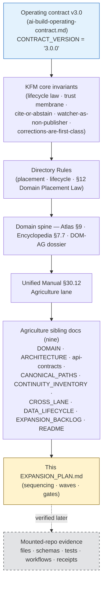
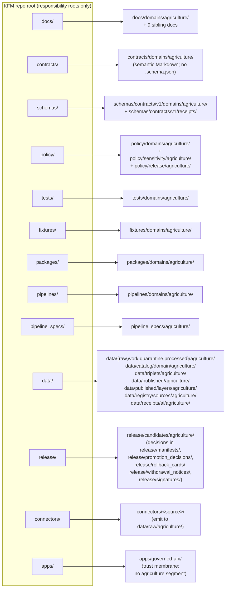
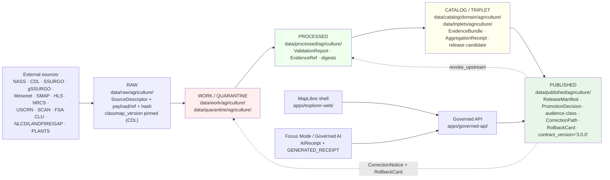
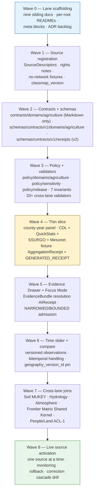

<!-- [KFM_META_BLOCK_V2]
doc_id: kfm://doc/domains/agriculture/expansion-plan
title: Agriculture Domain — Expansion Plan
type: standard
subtype: domain-expansion-plan
version: v2 (draft)
status: draft
owners: TODO — Agriculture Domain Steward · Docs Steward · Release Authority · Domain Architect · Pipeline Steward
created: 2026-05-15
updated: 2026-05-26
policy_label: public
contract_version: "3.0.0"
related:
  - docs/doctrine/ai-build-operating-contract.md
  - docs/doctrine/directory-rules.md
  - docs/doctrine/lifecycle-law.md
  - docs/doctrine/trust-membrane.md
  - docs/doctrine/policy-aware.md
  - docs/doctrine/evidence-first.md
  - docs/doctrine/ai-as-assistant.md
  - docs/doctrine/corrections-are-first-class.md
  - docs/domains/agriculture/README.md
  - docs/domains/agriculture/DOMAIN.md
  - docs/domains/agriculture/ARCHITECTURE.md
  - docs/domains/agriculture/api-contracts.md
  - docs/domains/agriculture/CANONICAL_PATHS.md
  - docs/domains/agriculture/CONTINUITY_INVENTORY.md
  - docs/domains/agriculture/CROSS_LANE.md
  - docs/domains/agriculture/DATA_LIFECYCLE.md
  - docs/domains/agriculture/EXPANSION_BACKLOG.md
  - docs/domains/agriculture/policy/README.md
  - docs/domains/agriculture/runbooks/README.md
  - docs/domains/agriculture/sublanes/README.md
  - docs/registers/VERIFICATION_BACKLOG.md
  - docs/registers/DRIFT_REGISTER.md
  - docs/adr/ADR-0001-schema-home.md
  - docs/domains/soil/EXPANSION_PLAN.md
  - docs/domains/hydrology/EXPANSION_PLAN.md
  - docs/domains/atmosphere/EXPANSION_PLAN.md
tags: [kfm, domain, agriculture, expansion-plan, lifecycle, governance, doctrine-adjacent, contract-v3]
notes:
  - Pinned to CONTRACT_VERSION = "3.0.0".
  - Sequenced execution plan; companion to EXPANSION_BACKLOG.md (work register).
  - All file paths PROPOSED pending mounted-repo verification.
  - Source rights for NASS, SSURGO, Mesonet, SMAP, HLS remain NEEDS VERIFICATION.
[/KFM_META_BLOCK_V2] -->

<a id="top"></a>

# 🌾 Agriculture Domain — Expansion Plan

> Sequenced, evidence-first plan to bring the Agriculture lane online behind the KFM trust membrane — from source registration to a first county-level, public-safe thin slice. Companion to [`EXPANSION_BACKLOG.md`](./EXPANSION_BACKLOG.md) (work register) and to the nine Agriculture sibling docs that govern doctrine.

[](#sec-1-scope)
[](../../doctrine/ai-build-operating-contract.md)
[](#sec-2-authority)
[](#sec-2-authority)
[](#sec-5-pipeline)
[](#sec-7-sensitivity)
[](#sec-7-sensitivity)
[](#sec-14-thin-slice)
[](#sec-19-changelog)

| Status | Owners | Last updated | Pinned to |
|---|---|---|---|
| `draft` — PROPOSED | TODO — Agriculture Domain Steward · Docs Steward · Release Authority · Domain Architect · Pipeline Steward | 2026-05-26 | `CONTRACT_VERSION = "3.0.0"` |

> [!IMPORTANT]
> **What this doc is — and what it is not.** This is the **sequenced execution plan** for the Agriculture lane: ordered waves of work, each with explicit evidence, validators, and rollback. It does **not** decide:
> - the *meaning* of an Agriculture term → [`DOMAIN.md`](./DOMAIN.md),
> - the *physical architecture* → [`ARCHITECTURE.md`](./ARCHITECTURE.md),
> - the *wire shape* of envelopes → [`api-contracts.md`](./api-contracts.md),
> - the *placement* of files → [`CANONICAL_PATHS.md`](./CANONICAL_PATHS.md),
> - the *lifecycle phases and gates* → [`DATA_LIFECYCLE.md`](./DATA_LIFECYCLE.md),
> - the *per-edge cross-lane contracts* → [`CROSS_LANE.md`](./CROSS_LANE.md),
> - the *carry-forward state of doctrine* → [`CONTINUITY_INVENTORY.md`](./CONTINUITY_INVENTORY.md),
> - the *work-tracking register itself* → [`EXPANSION_BACKLOG.md`](./EXPANSION_BACKLOG.md).
> Reach for the right sibling doc when the question is not "in what order does the work happen?".

> [!CAUTION]
> **This plan is doctrine-grounded and implementation-pending.** The Agriculture lane is **CONFIRMED doctrine / PROPOSED implementation** in current KFM materials. No mounted-repository evidence was available during drafting, so every file path, route, package, fixture, validator, and test command below is **PROPOSED** until verified. Promotion of Agriculture material to public surfaces requires the standard governed gates: source rights, evidence closure, public-safe aggregation, validation, policy, review where required, `ReleaseManifest`, `PromotionDecision`, correction path, rollback target, and (for AI-authored artifacts) `GENERATED_RECEIPT.json`. `[CONFIRMED — operating contract §13, §34, §47.]`

---

## 📑 Mini-TOC

1. [Scope and boundary](#sec-1-scope)
2. [Authority and source basis](#sec-2-authority)
3. [Repo fit — lane placement](#sec-3-placement)
4. [Ubiquitous language and object families](#sec-4-language)
5. [Pipeline shape (RAW → PUBLISHED)](#sec-5-pipeline)
6. [Sources and source roles](#sec-6-sources)
7. [Sensitivity, rights, and publication posture](#sec-7-sensitivity)
8. [Cross-lane relations](#sec-8-cross-lane)
9. [API, contract, and schema surfaces](#sec-9-api)
10. [Validators, tests, and fixtures](#sec-10-validators)
11. [Governed AI behavior](#sec-11-ai)
12. [Publication, correction, and rollback](#sec-12-publication)
13. [Sequenced expansion plan — waves](#sec-13-waves)
14. [Thin slice — first credible vertical](#sec-14-thin-slice)
15. [Risks and mitigations](#sec-15-risks)
16. [Verification backlog](#sec-16-backlog)
17. [Open questions](#sec-17-open-questions)
18. [Definition of done](#sec-18-dod)
19. [Changelog](#sec-19-changelog)
20. [Related docs](#sec-20-related)

---

<a id="sec-1-scope"></a>

## 1 · Scope and boundary

**Mission (CONFIRMED doctrine / PROPOSED implementation).** Govern agricultural aggregate observations, soil/moisture/vegetation context, crop progress, suitability, stress indicators, irrigation links, conservation-practice context, agricultural-economy observations, and public-safe products — without publishing private farm operations, field-level sensitive details, or source-rights-limited data without review. `[CONFIRMED — DOM-AG; ENCY §7.7; ATLAS §9; DOMAIN.md §1.]`

**This domain owns** (CONFIRMED domain scope / PROPOSED field realization): `CropObservation` · `FieldCandidate` · `CropRotation` · `YieldObservation` · `IrrigationLink` · `ConservationPractice` · `SoilCropSuitability` · `AgriculturalEconomyObservation` · `SupplyChainNode` · `DroughtStressIndicator` · `PestStressIndicator` · `AggregationReceipt` (**load-bearing**). `[CONFIRMED — ATLAS §9.B; ENCY §7.7.C; DOMAIN.md §5.]`

**This domain explicitly does NOT own** (full breakdown at [`DOMAIN.md`](./DOMAIN.md) §3.2):

| Concern | Owning lane | Why this matters |
|---|---|---|
| Canonical soil map-unit and horizon semantics | **Soil** | Suitability joins use Soil's MUKEY identity, not Agriculture's. |
| Water observations, flood context, NFHL regulatory zones | **Hydrology** | Irrigation, drought, and water-use links cite Hydrology evidence; NFHL regulatory provenance preserved. |
| Weather, smoke, heat, vegetation-stress meteorological drivers | **Atmosphere / Air** | Mesonet, normals, and AOD / smoke products sourced from Atmosphere. |
| Ownership, title, parcels, living-person privacy, operator identity | **People / Land** | Farm/operator and parcel-sensitive joins restricted by default; ACL-1 in `DOMAIN.md` §9.1. |
| Habitat patches, taxonomic identity, vegetation communities | **Habitat / Fauna / Flora** | Conservation-practice framing; pest-stress taxonomy; invasive-plant context. |
| Regulatory hazard authority and alert framing | **Hazards** | KFM is **not** an alert authority; Agriculture publishes context only. |
| County / state geography versioning | **Frontier Matrix** | Geography evolves; Agriculture pins `geography_version_id` at aggregation. |

`[CONFIRMED — ATLAS §9.B + §9.F; ENCY §7.7.A; DOMAIN.md §3.2; CROSS_LANE.md.]`

> [!NOTE]
> Aggregate statistics and satellite products **MUST NOT** become field/operator truth. Farm/operator private data, proprietary yield, pesticide records, FSA CLU, and private-sensitive joins **fail closed** under the KFM trust membrane. `[CONFIRMED — ATLAS §9.I; ENCY §7.7; operating contract §23.2; DOMAIN.md §6 INV-AG-03.]`

[Back to top](#top)

---

<a id="sec-2-authority"></a>

## 2 · Authority and source basis

Authority for this plan resolves in the order below. Lower layers may clarify higher ones; they never silently override.



| Layer | Source | Status |
|---|---|---|
| Operating law for AI-authored or AI-touched repo work (`CONTRACT_VERSION = "3.0.0"`) | [`ai-build-operating-contract.md`](../../doctrine/ai-build-operating-contract.md) | **CONFIRMED doctrine** |
| Core invariants | [`lifecycle-law.md`](../../doctrine/lifecycle-law.md) · [`trust-membrane.md`](../../doctrine/trust-membrane.md) · [`evidence-first.md`](../../doctrine/evidence-first.md) · [`policy-aware.md`](../../doctrine/policy-aware.md) · [`ai-as-assistant.md`](../../doctrine/ai-as-assistant.md) · [`corrections-are-first-class.md`](../../doctrine/corrections-are-first-class.md) | **CONFIRMED doctrine** |
| Directory Rules | [`directory-rules.md`](../../doctrine/directory-rules.md) §§3, 4, 12, 15 | **CONFIRMED doctrine** / **PROPOSED** specific paths |
| Domain spine | Atlas v1.1 §9 (`[DOM-AG]`); ENCY §7.7 | **CONFIRMED doctrine** / **PROPOSED implementation** |
| Unified plan | Unified Implementation Architecture Build Manual §30.12 (`[UNIFIED]`) | **CONFIRMED doctrine** / **PROPOSED implementation** |
| Agriculture bounded-context authority | [`DOMAIN.md`](./DOMAIN.md) | **CONFIRMED doctrine (this corpus)** |
| Agriculture architectural authority | [`ARCHITECTURE.md`](./ARCHITECTURE.md) | **CONFIRMED doctrine (this corpus)** |
| Agriculture wire-level authority | [`api-contracts.md`](./api-contracts.md) | **CONFIRMED doctrine (this corpus)** |
| Agriculture placement authority | [`CANONICAL_PATHS.md`](./CANONICAL_PATHS.md) | **CONFIRMED doctrine (this corpus)** |
| Agriculture lifecycle authority | [`DATA_LIFECYCLE.md`](./DATA_LIFECYCLE.md) | **CONFIRMED doctrine (this corpus)** |
| Agriculture cross-lane authority | [`CROSS_LANE.md`](./CROSS_LANE.md) | **CONFIRMED doctrine (this corpus)** |
| Agriculture carry-forward register | [`CONTINUITY_INVENTORY.md`](./CONTINUITY_INVENTORY.md) | **CONFIRMED doctrine (this corpus)** |
| Agriculture work register | [`EXPANSION_BACKLOG.md`](./EXPANSION_BACKLOG.md) | **CONFIRMED doctrine (this corpus)** |
| Mounted repo | n/a in this session | **UNKNOWN** — `NEEDS VERIFICATION` |

### 2.1 RFC 2119 conformance

**MUST / MUST NOT** non-negotiable; **SHOULD / SHOULD NOT** strong default; **MAY** permitted. Per `directory-rules.md` §2.2 and operating contract §5.1.1.

[Back to top](#top)

---

<a id="sec-3-placement"></a>

## 3 · Repo fit — lane placement

The Agriculture lane follows **Directory Rules §12 Domain Placement Law**: a domain MUST NOT become a root folder; it lives as a segment inside responsibility roots. Full crosswalk at [`CANONICAL_PATHS.md`](./CANONICAL_PATHS.md) §6.



`[CONFIRMED lane pattern per DIRRULES §12; PROPOSED specific paths per CANONICAL_PATHS.md.]`

<details>
<summary><b>PROPOSED lane paths (text form)</b></summary>

```text
docs/domains/agriculture/
  README.md · DOMAIN.md · ARCHITECTURE.md · api-contracts.md
  CANONICAL_PATHS.md · CONTINUITY_INVENTORY.md · CROSS_LANE.md
  DATA_LIFECYCLE.md · EXPANSION_BACKLOG.md · EXPANSION_PLAN.md (this file)
  policy/README.md · runbooks/README.md · sublanes/README.md

contracts/domains/agriculture/        # semantic Markdown only — no .schema.json
schemas/contracts/v1/domains/agriculture/
schemas/contracts/v1/receipts/        # AggregationReceipt, GENERATED_RECEIPT
policy/domains/agriculture/
policy/sensitivity/agriculture/       # v2 lane
policy/release/agriculture/           # v2 lane
tests/domains/agriculture/
fixtures/domains/agriculture/
packages/domains/agriculture/
pipelines/domains/agriculture/
pipeline_specs/agriculture/
data/raw/agriculture/
data/work/agriculture/
data/quarantine/agriculture/
data/processed/agriculture/
data/catalog/domain/agriculture/
data/triplets/agriculture/
data/published/agriculture/
data/published/layers/agriculture/
data/registry/sources/agriculture/
data/receipts/ai/agriculture/         # AIReceipt + GENERATED_RECEIPT.json
release/candidates/agriculture/
```

All paths are **PROPOSED** until verified against mounted-repo evidence. If a different convention already exists in the repo, open an entry in `docs/registers/DRIFT_REGISTER.md` rather than silently conforming. `[DIRRULES §2.5.]`

</details>

> [!CAUTION]
> Do **not** create a root-level `agriculture/` folder. A domain folder at repo root is an Anti-Pattern (`DIRRULES §13.4`) — it fragments the lifecycle and competes with responsibility roots. The lane pattern above is the only sanctioned placement. `[CONFIRMED — CANONICAL_PATHS.md §11.]`

[Back to top](#top)

---

<a id="sec-4-language"></a>

## 4 · Ubiquitous language and object families

**Ubiquitous-language discipline.** Agriculture terms keep their meaning *inside the Agriculture bounded context*; cross-lane joins translate, they do not collapse. **[`DOMAIN.md`](./DOMAIN.md) §4 governs the meaning** of every term below; this section is a navigation summary. `[CONFIRMED — DOMAIN.md §4; ATLAS §9.C; DDD.]`

| Term | Role | Status |
|---|---|---|
| `CropObservation` | Entity — cite-able crop record with source-role binding | CONFIRMED term / PROPOSED realization |
| `FieldCandidate` | Entity — provisional polygon; **never** equated with operator/parcel truth | CONFIRMED term / PROPOSED realization |
| `CropRotation` | Entity (per `DOMAIN.md` §5.1) — multi-year sequence | CONFIRMED term / PROPOSED realization; ADR-AG-DOM-01 pending |
| `YieldObservation` | Entity — aggregate-scope yield; field-level fails closed | CONFIRMED term / PROPOSED realization |
| `IrrigationLink` | Entity — Agriculture↔Hydrology relation preserving water-use ownership | CONFIRMED term / PROPOSED realization |
| `ConservationPractice` | Entity — NRCS-style practice context; framing only, never instruction | CONFIRMED term / PROPOSED realization |
| `SoilCropSuitability` | Value Object (aggregate root via spec-hash) — Agriculture↔Soil suitability keyed on MUKEY | CONFIRMED term / PROPOSED realization; ADR-AG-DOM-02 pending |
| `AgriculturalEconomyObservation` | Entity — economy signals admissible under release policy | CONFIRMED term / PROPOSED realization |
| `SupplyChainNode` | Entity — public-safe supply-chain node; critical-asset coords DENY | CONFIRMED term / PROPOSED realization |
| `DroughtStressIndicator` | Value Object — evidence-bounded modeled stress signal; **never alert** | CONFIRMED term / PROPOSED realization |
| `PestStressIndicator` | Value Object — modeled stress + Fauna taxonomic identity only; **never alert** | CONFIRMED term / PROPOSED realization |
| **`AggregationReceipt`** *(load-bearing)* | Value Object — receipt for aggregation transforms; required on every public aggregate | CONFIRMED object family / PROPOSED implementation; ADR-S-03 pending |
| `VWC` | Value Object — volumetric water content (soil-moisture context) | CONFIRMED term / PROPOSED realization |
| `classmap_version` *(v2)* | Value Object — CDL classification map version; pinned at admission | CONFIRMED term / PROPOSED realization; Atlas KFM-P25-PROG-0005 |
| `Spec hash` | Value Object — deterministic normalized digest carried in identity rules | CONFIRMED term / PROPOSED realization |

`[CONFIRMED — DOMAIN.md §4 + §5; ATLAS §9.C, §9.E; ENCY §7.7.C.]`

**Identity rule (PROPOSED).** Each Agriculture object resolves identity from `source_id + object_role + temporal_scope + normalized_digest`. Source, observed, valid, retrieval, release, and correction times **stay distinct where material**. `[CONFIRMED — DOMAIN.md §5.1; ATLAS §9.E.]`

[Back to top](#top)

---

<a id="sec-5-pipeline"></a>

## 5 · Pipeline shape (RAW → PUBLISHED)

The Agriculture lane follows the **CONFIRMED** KFM lifecycle invariant. Promotion is a **governed state transition, not a file move**. Full gate-by-gate contract at [`DATA_LIFECYCLE.md`](./DATA_LIFECYCLE.md) §5. `[CONFIRMED — DIRRULES §9.1; ATLAS §9.H; DATA_LIFECYCLE.md.]`



| Stage | Handling | Gate (MUST pass) | Status |
|---|---|---|---|
| **RAW** | Capture immutable source payload or reference with source role, rights, sensitivity, citation, time, and hash. **CDL `classmap_version` pinned**. *(v2.)* | `SourceDescriptor` exists. | PROPOSED |
| **WORK / QUARANTINE** | Normalize schema, geometry, time, identity, evidence, rights, and policy; hold failures. | Validation **and** policy gate pass, **or** quarantine reason recorded. | PROPOSED |
| **PROCESSED** | Emit validated normalized objects, receipts, and public-safe candidates. | `EvidenceRef`, `ValidationReport`, and digest closure exist. | PROPOSED |
| **CATALOG / TRIPLET** | Emit catalog records, `EvidenceBundle`s, graph/triplet projections, release candidates. | Catalog/proof closure passes; `AggregationReceipt` for aggregates. *(v2.)* | PROPOSED |
| **PUBLISHED** | Serve released public-safe artifacts through governed APIs and manifests. | `ReleaseManifest` + `PromotionDecision` + correction path + rollback target + review/policy state + audience class + `contract_version` pin. *(v2.)* | PROPOSED |
| **AI-authored merge** *(v2 row)* | Any AI-authored change to Agriculture lifecycle artifacts. | `GENERATED_RECEIPT.json` pinned to `contract_version = "3.0.0"` with `truth_labels[]`, `validation_gates[]`, `human_review.state ∈ { approved, override_record_attached }`. | PROPOSED |

`[CONFIRMED — ATLAS §9.H; DATA_LIFECYCLE.md §4 + §5; operating contract §34 + §47.]`

> [!WARNING]
> **No lifecycle skip.** Connectors emit only to `data/raw/agriculture/` (or `data/quarantine/agriculture/` on failure). They do not publish. Watchers emit receipts and candidate decisions only — **watcher-as-non-publisher**. Public clients read only via the governed API. `[CONFIRMED — DIRRULES §13.5; trust-membrane.md §7.]`

[Back to top](#top)

---

<a id="sec-6-sources"></a>

## 6 · Sources and source roles

Source-role discipline is non-negotiable. Each source is recorded with role (`observed` / `regulatory` / `modeled` / `aggregate` / `administrative` / `candidate` / `synthetic`), rights, sensitivity, and freshness cadence. Rights and current terms remain **NEEDS VERIFICATION** in this session. Full per-source breakdown at [`DATA_LIFECYCLE.md`](./DATA_LIFECYCLE.md) §8 + [`CONTINUITY_INVENTORY.md`](./CONTINUITY_INVENTORY.md) §6. `[CONFIRMED scope — ATLAS §9.D; ENCY §7.7.B.]`

| Source family | Typical role(s) | Rights / sensitivity | Freshness | Status |
|---|---|---|---|---|
| **USDA NASS CDL** *(v2 explicit)* | modeled (classification raster) | rights NEEDS VERIFICATION; **never `observed`**; `classmap_version` pinned at admission | annual | PROPOSED |
| **USDA NASS QuickStats / Crop Progress** | aggregate | rights NEEDS VERIFICATION; **field-level public DENY** | weekly / annual | PROPOSED |
| **NRCS SSURGO / Soil Data Access** | observed (pedon) *or* regulatory (hydrologic group) | rights NEEDS VERIFICATION; survey-vintage specific | vintage-specific | PROPOSED |
| **gSSURGO** | modeled (rasterized derivative) | inherits SSURGO; never relabeled `observed` | gridded vintage | PROPOSED |
| **Kansas Mesonet** | observed | rights NEEDS VERIFICATION | sub-daily | PROPOSED |
| **NRCS SCAN** | observed | rights NEEDS VERIFICATION | sub-daily | PROPOSED |
| **NOAA USCRN** | observed | rights NEEDS VERIFICATION | sub-daily | PROPOSED |
| **NASA SMAP** | modeled (gridded retrieval) | rights NEEDS VERIFICATION; modeled values require `RealityBoundaryNote` | daily-ish | PROPOSED |
| **NASA HLS / HLS-VI** | modeled (vegetation index) | rights NEEDS VERIFICATION; cloud/AOD gating required | 2–3 day revisit | PROPOSED |
| **NLCD / LANDFIRE / GAP** *(v2 explicit)* | modeled (classification raster) | open with attribution | episodic | PROPOSED |
| **USDA PLANTS** *(v2 explicit)* | administrative (taxonomic registry) | open | episodic | PROPOSED |
| **FSA CLU** *(v2 explicit)* | administrative | **restricted; DENY public** | episodic | PROPOSED |
| Crop insurance / market / economy | aggregate / administrative | rights NEEDS VERIFICATION; many unavailable for redistribution | varies | PROPOSED |
| Local extension sources | observed / administrative | rights NEEDS VERIFICATION | varies | PROPOSED |

`[CONFIRMED — ATLAS §9.D; ENCY §7.7.B; DATA_LIFECYCLE.md §8.]`

> [!IMPORTANT]
> **Source-role anti-collapse.** Source role is set at admission (`SourceDescriptor`) and **preserved through every promotion**. Promotion does NOT upgrade `modeled → observed`, `aggregate → field-level`, `candidate → verified`, or `administrative → regulatory`. INV-AG-02 enforces this; `validate_no_source_role_upgrade` ships with the lane. `[CONFIRMED — Atlas §24.1; §24.9.3; DOMAIN.md §6 INV-AG-02.]`

> [!CAUTION]
> **Agriculture-specific source-role DENY rows** (per [`ARCHITECTURE.md`](./ARCHITECTURE.md) §6.2):
> - **CDL labeled as `observed`** → DENY publication; ABSTAIN at AI surface.
> - **NASS aggregate cited as field-level truth** → DENY join; ABSTAIN at AI.
> - **Drought / pest stress framed as alert or instruction** → DENY publication; KFM is not an alert authority.
> - **Conservation practice framed as land-management instruction** → DENY publication.
> - **Person-parcel join published** → DENY public; HOLD for steward review.

[Back to top](#top)

---

<a id="sec-7-sensitivity"></a>

## 7 · Sensitivity, rights, and publication posture

> [!CAUTION]
> **Sensitive-domain handling routes through operating contract §23.2.** Agriculture touches operator, parcel, field-level, private-yield, pesticide-record, and FSA CLU lanes — all sensitive-domain under the contract's matrix. Any artifact that would expose those fields MUST be supported by the §23.2 disposition (`DENY` public · `GENERALIZE` before publication · `REDACT` when needed · `QUARANTINE` uncertain source material · `REQUIRE` steward review · `REQUIRE` transform receipt · `ABSTAIN` when support is inadequate). `[CONFIRMED — operating contract §23.2; trust-membrane.md §7.]`

| Posture | Rule | Source |
|---|---|---|
| **Aggregate-only public** | Public products aggregate to county / HUC / grid thresholds. Field-level public DENY by default. | `[ENCY §7.7.D; ATLAS §9.I.]` |
| **Operator/farm sensitivity** | Farm/operator private data, proprietary yield, pesticide records, **FSA CLU**, and private-sensitive joins **fail closed**. | `[ATLAS §9.I; DATA_LIFECYCLE.md §7.]` |
| **Aggregate ≠ ground truth** | Aggregate statistics and satellite products MUST NOT become field/operator truth. INV-AG-03 enforces. | `[ATLAS §9.I; DOMAIN.md §6.]` |
| **Promotion preconditions** | Unclear rights, unresolved source role, missing evidence, unresolved sensitivity, or absent release state **blocks public promotion**. | `[ENCY; DIRRULES; DATA_LIFECYCLE.md §5.]` |
| **Cross-lane redaction** | Joins to People/Land remain restricted by default; redaction transforms emit `RedactionReceipt`. ACL-1 in `DOMAIN.md` §9.1. | `[ATLAS §9.F; CROSS_LANE.md §13.]` |
| **Source-role fixity** *(v2)* | Source role at admission is preserved through every promotion. INV-AG-02. | `[Atlas §24.1; DOMAIN.md §6.]` |
| **Alert-authority discipline** *(v2)* | Drought / pest stress indicators MUST NOT be framed as alerts or life-safety guidance. INV-AG-07. KFM is not an alert authority. | `[Atlas §24.9.2; DOMAIN.md §6.]` |
| **Audience-class enforcement** *(v2)* | `internal` / `denied` MUST NOT appear in `public` / `partner` envelopes. | `[api-contracts.md §6; CROSS_LANE.md §17.]` |
| **`contract_version` pin** *(v2)* | Every Agriculture envelope and v3-era receipt pinned to `"3.0.0"`. | `[Operating contract §37; api-contracts.md §5.]` |
| **`GENERATED_RECEIPT.json` for AI-authored** *(v2)* | Every AI-authored merge emits a receipt; CI blocks otherwise. | `[Operating contract §34; DATA_LIFECYCLE.md §6.3.]` |

### 7.1 Sensitivity tier defaults (PROPOSED summary)

The full tier matrix lives at [`ARCHITECTURE.md`](./ARCHITECTURE.md) §11. Execution-plan-relevant rows:

- **T0 (public default):** Public-safe aggregates (county / HUC / state crop & yield); drought/pest stress (context only).
- **T1 (reviewed public):** Generalized field context with `RedactionReceipt`; CDL aggregated; Mesonet/SCAN/USCRN station series.
- **T2 (restricted):** Operator-scoped views under named agreement.
- **T4 (steward only / denied):** FSA CLU; operator-named records; proprietary yield; pesticide records; person-parcel joins.

> [!IMPORTANT]
> **DENY-by-default surfaces:** unreviewed exact sensitive Agriculture locations or private operator data are denied to the public visitor; access requires policy approval and a redaction receipt. `[CONFIRMED — ENCY §7.7.L; DOMAIN.md §7.]`

[Back to top](#top)

---

<a id="sec-8-cross-lane"></a>

## 8 · Cross-lane relations

Per-edge operational contracts (join keys, source-role discipline, sensitivity disposition, validators, correction cascade) live at [`CROSS_LANE.md`](./CROSS_LANE.md). This section is a navigation summary; the **DDD context-map view** lives at [`DOMAIN.md`](./DOMAIN.md) §8. `[CONFIRMED — DOM-AG §F; Atlas §24.4.7.]`

| Related lane | Relation | DDD pattern | Constraint | Status |
|---|---|---|---|---|
| **Soil** | MUKEY joins; suitability support | Customer/Supplier | Preserve ownership, source role, sensitivity, `EvidenceBundle` support. | CONFIRMED relation / PROPOSED join validators |
| **Hydrology** | Irrigation, drought, water-use context | Customer/Supplier | Preserve regulatory provenance on NFHL. | CONFIRMED relation / PROPOSED |
| **Atmosphere / Air** | Weather, heat, smoke, vegetation stress | Conformist + Customer/Supplier | Preserve regulatory/observed/modeled split. | CONFIRMED relation / PROPOSED |
| **Habitat** *(v2)* | Conservation-practice framing | Customer/Supplier (reciprocal) | Framing only; never instruction. | CONFIRMED relation / PROPOSED |
| **Fauna** *(v2)* | Pest stress + taxonomic identity | Customer/Supplier (reciprocal) | Fauna provides taxonomic identity only. | CONFIRMED relation / PROPOSED |
| **Flora** *(v2)* | Invasive-plant management framing | Customer/Supplier (reciprocal) | Framing only; rare-plant locations never cross. | CONFIRMED relation / PROPOSED |
| **Geology** *(v2)* | Parent material (advisory) | Customer/Supplier (advisory) | Advisory only; never regulatory. | CONFIRMED relation / PROPOSED |
| **Hazards** *(v2)* | Drought / pest stress as hazard context | Open Host Service + Published Language | Context only; **KFM is not an alert authority**. | CONFIRMED relation / PROPOSED |
| **Frontier Matrix** *(v2)* | Aggregate county-year → matrix cells | **Shared Kernel** (`AggregationReceipt` + `GeographyVersion`) | Reciprocal; `AggregationReceipt` REQUIRED. | CONFIRMED relation / PROPOSED |
| **People / Land** | Farm/operator and parcel-sensitive contexts | **Anti-Corruption Layer** (ACL-1) | **Restricted by default**; default-DENY for living-person and operator linkage. | CONFIRMED relation / PROPOSED |
| **Settlements / Infrastructure** *(v2 touch)* | Critical-asset overlap | Touch (advisory) | Critical-asset coords DENY public. | CONFIRMED relation / PROPOSED |
| **Archaeology** *(v2 touch)* | Ethnobotanical context | Touch (steward-reviewed; rare) | HOLD for steward review. | CONFIRMED relation / PROPOSED |

`[CONFIRMED — ATLAS §9.F + §24.4.4–§24.4.8; CROSS_LANE.md §4–§15; DOMAIN.md §8.]`

[Back to top](#top)

---

<a id="sec-9-api"></a>

## 9 · API, contract, and schema surfaces

All surfaces are governed; finite outcomes are **three distinct vocabularies** (do not conflate): runtime `ANSWER` / `ABSTAIN` / `DENY` / `ERROR` (+ optional `NARROWED` / `BOUNDED` *(v2)*); policy-gate `ALLOW` / `RESTRICT` / `DENY` / `HOLD` / `ERROR`; workflow `ACCEPTED` / `DENY` / `ERROR`. Routes shown are **PROPOSED**; exact route names remain **UNKNOWN** without mounted-repo evidence. Full wire-level contract at [`api-contracts.md`](./api-contracts.md). `[CONFIRMED — ATLAS §9.J; api-contracts.md §3 + §4.]`

| Surface | DTO / schema | Outcomes | Status |
|---|---|---|---|
| Agriculture feature / detail resolver | `AgricultureDecisionEnvelope` | `ANSWER` / `ABSTAIN` / `DENY` / `ERROR` *(+ optional `NARROWED` / `BOUNDED`)* | PROPOSED route; resolves `OQ-AG-API-01` |
| Agriculture layer manifest resolver | `LayerManifest` / domain layer descriptor | `ANSWER` / `DENY` / `ERROR` | PROPOSED; public-safe release only |
| Agriculture Evidence Drawer payload | `EvidenceDrawerPayload` + `EvidenceBundle` projection | `ANSWER` / `ABSTAIN` / `DENY` / `ERROR` | PROPOSED; evidence + policy filtered |
| Agriculture Focus Mode answer | `RuntimeResponseEnvelope` + `AIReceipt` | `ANSWER` / `ABSTAIN` / `DENY` / `ERROR` *(+ optional `NARROWED` / `BOUNDED`)* | PROPOSED; AI never root truth |
| Correction submit | `CorrectionNoticeCandidate` | `ACCEPTED` / `DENY` / `ERROR` *(workflow)* | PROPOSED |
| Review decision | `ReviewRecord` | `ALLOW` / `RESTRICT` / `DENY` / `HOLD` / `ERROR` *(policy-gate)* | PROPOSED |
| AI-authored merge receipt *(v2)* | `GENERATED_RECEIPT.json` | — (artifact, not envelope) | PROPOSED; operating contract §34 |

**Schema home (CONFIRMED via ADR-0001).** `schemas/contracts/v1/domains/agriculture/...` is the default machine-schema home; receipts at `schemas/contracts/v1/receipts/` (ADR-S-03 pending). Divergent schemas under `contracts/domains/agriculture/` are **lineage / CONFLICTED** and require migration. Semantic Markdown for object meaning lives under `contracts/domains/agriculture/` (**no `.schema.json` files here**). `[CONFIRMED — DIRRULES §6.3–6.4, §13.1; ADR-0001; api-contracts.md §5.]`

[Back to top](#top)

---

<a id="sec-10-validators"></a>

## 10 · Validators, tests, and fixtures

Domain-specific validators expand the cross-cutting baseline (schema validation, source-descriptor validation, rights validation, sensitivity validation, evidence closure, temporal logic, geometry validity, policy deny tests, citation validation, release-manifest validation, rollback drill, no-network fixtures, non-regression). `[CONFIRMED — ENCY §7.7.K.]`

### 10.1 Agriculture-specific validators (PROPOSED)

`[CONFIRMED scope — ATLAS §9.K; ARCHITECTURE.md §6; CROSS_LANE.md §17.]`

- SSURGO / Soil Data Access lineage tests · `validate_mukey_join`
- Soil-moisture unit/depth/QC tests
- Crop-progress aggregate-only tests (reject field-level claims)
- Vegetation-index mask/time tests (cloud / AOD gating)
- Policy denial for field-level NASS claims
- Catalog closure tests
- Public-safe redaction / generalization tests
- Source-role mismatch denial tests
- Stale-state handling tests
- Cross-lane join tests (Soil MUKEY, Hydrology water-use, Atmosphere stress drivers)

### 10.2 v2 validators (load-bearing) — operating contract conformance

| Validator | Purpose | Phase | Source |
|---|---|---|---|
| **`validate_aggregation_receipt_present`** | Every aggregate-bearing envelope carries resolvable `AggregationReceipt`. | PROCESSED / PUBLISHED | INV-AG-01 |
| **`validate_no_person_parcel_join_public`** | Person-parcel joins blocked from public surfaces. | PUBLISHED | INV-AG-04 |
| **`validate_no_source_role_upgrade`** | Source role preserved through every promotion. | all phases | INV-AG-02 |
| **`validate_classmap_version_pin`** | CDL `classmap_version` preserved RAW → PUBLISHED. | all phases | DATA_LIFECYCLE.md §4 |
| **`validate_no_life_safety_framing`** | Agriculture stress never framed as alert. | PUBLISHED | INV-AG-07 |
| **`validate_audience_class_enforcement`** | `internal` / `denied` never in `public` / `partner` envelopes. | PUBLISHED | api-contracts.md §6 |
| **`validate_contract_version_pin`** | Every Agriculture envelope pinned to `"3.0.0"`. | PUBLISHED | Operating contract §37 |
| **`validate_generated_receipt_present`** | AI-authored merges paired with `GENERATED_RECEIPT.json`. | merge gate | Operating contract §34 |
| **`validate_revocation_propagation_test`** | Correction cascade reaches Frontier Matrix cells. | post-correction | trust-membrane.md §8 |

`[CONFIRMED — DOMAIN.md §6 invariant register; CROSS_LANE.md §17.]`

### 10.3 Fixture posture (PROPOSED)

No-network synthetic fixtures land first under `fixtures/domains/agriculture/`. Live source activation happens **one source at a time** with rights, tests, monitoring, and a rollback target. `[CONFIRMED — ATLAS §21 phase 17; DATA_LIFECYCLE.md §10.]`

[Back to top](#top)

---

<a id="sec-11-ai"></a>

## 11 · Governed AI behavior

Full per-action AI matrix lives at [`DOMAIN.md`](./DOMAIN.md) §13. Execution-plan summary:

> [!NOTE]
> AI **MAY** summarize **released** Agriculture `EvidenceBundle`s, compare evidence, explain limitations, and draft steward-review notes. AI **MUST `ABSTAIN`** when evidence is insufficient and **MUST `DENY`** where policy, rights, sensitivity, or release state blocks the request. AI **MUST NOT** read RAW / WORK / QUARANTINE / candidate content. AI is **never** root truth. `[CONFIRMED — GAI; ai-as-assistant.md; ATLAS §9.L; DOMAIN.md §13.]`

Every Focus Mode answer for Agriculture emits an `AIReceipt` and `RuntimeResponseEnvelope` with finite outcome, `evidence_refs`, `policy_decision`, `citation_validation`, and `contract_version = "3.0.0"`. Every AI-authored merge of Agriculture artifacts emits a `GENERATED_RECEIPT.json`. *(v2.)* `[CONFIRMED — ENCY §7.7.H–I; operating contract §34.]`

[Back to top](#top)

---

<a id="sec-12-publication"></a>

## 12 · Publication, correction, and rollback

Agriculture publication requires **all** of: `ReleaseManifest` · `PromotionDecision` *(v2)* · `EvidenceBundle` · validation / policy support · review state where required · correction path · stale-state rule · rollback target · audience-class enforcement *(v2)* · `contract_version = "3.0.0"` pin *(v2)*. Promotion is a governed state transition, not a file move. Full gate-by-gate contract at [`DATA_LIFECYCLE.md`](./DATA_LIFECYCLE.md) §5. `[CONFIRMED — ENCY Appendix E; ATLAS §9.M; corrections-are-first-class.md; operating contract §47.]`

| Object | Role |
|---|---|
| `ReleaseManifest` | Authorizes a released set of Agriculture artifacts. |
| `PromotionDecision` *(v2)* | Records the governed state-transition decision into PUBLISHED. |
| `EvidenceBundle` | Resolves every public claim to its evidence. |
| `CorrectionNotice` | Records correctable failures without rewriting history. |
| `RollbackCard` | Preserves history while repointing current release state. |
| `WithdrawalNotice` *(v2)* | Used for People/Land cascade per [`CROSS_LANE.md`](./CROSS_LANE.md) §13. |
| `AggregationReceipt` / `RedactionReceipt` | Records the public-safe transform applied. |
| `GENERATED_RECEIPT.json` *(v2)* | Records AI-authored merges per operating contract §34. |

### 12.1 Correction cascade

When a published Agriculture claim is corrected, downstream `EvidenceRef`s MUST re-evaluate. Frontier Matrix cells downgrade to `ABSTAIN evidence.revoked_upstream`; AI summaries marked stale; People/Land corrections trigger immediate `WithdrawalNotice` per [`CROSS_LANE.md`](./CROSS_LANE.md) §16. `[CONFIRMED — trust-membrane.md §8; DATA_LIFECYCLE.md §14.]`

[Back to top](#top)

---

<a id="sec-13-waves"></a>

## 13 · Sequenced expansion plan — waves

This sequencing is **PROPOSED**. It aligns with the Encyclopedia's Phase 5 (domain expansion) and the Unified Manual's Part V lane template. Each wave is a reversible increment with explicit evidence, validators, and rollback. **Each wave's backlog items are tracked in [`EXPANSION_BACKLOG.md`](./EXPANSION_BACKLOG.md)** — this section is the *ordering*; the backlog is the *register*. `[CONFIRMED — ENCY Phase 5; UNIFIED §30.12.]`



| Wave | Goal | Evidence required | Validation path | Rollback | Backlog rows (per [`EXPANSION_BACKLOG.md`](./EXPANSION_BACKLOG.md)) | Status |
|---|---|---|---|---|---|---|
| **W0** | Lane scaffolding | Nine Agriculture sibling docs + per-root READMEs + Directory Rules §15 contract | Docs link check · README presence scan · sibling-doc OQ aggregation (§6 of backlog) | Revert PR; preserve as lineage | — | **W0 complete (this corpus)** |
| **W1** | Agriculture source registry + no-network fixtures | `SourceDescriptor` + synthetic fixtures + `classmap_version` pin on CDL | Schema · source · rights validators · `validate_classmap_version_pin` | Revert PR; no public artifact | `AG-EXP-I01`, `AG-EXP-D14`, `AG-EXP-I15`, `AG-EXP-P01` | PROPOSED |
| **W2** | Object meaning + machine shape + receipt schemas | `contracts/` Markdown + `schemas/contracts/v1/domains/agriculture/*.schema.json` + `schemas/contracts/v1/receipts/aggregation_receipt.schema.json` + `schemas/contracts/v1/receipts/generated_receipt.schema.json` | Schema valid/invalid fixtures · `contract_version` pin validator | Schema mirror; ADR if home changes | `AG-EXP-I02`, `AG-EXP-I03`, `AG-EXP-D06`, `AG-EXP-D11`, `AG-EXP-D12`, `AG-EXP-V05` | PROPOSED |
| **W3** | Admissibility + invariant enforcement | Policy bundles + sensitivity rules + rights enforcement + 7 invariants + 33+ cross-lane validators | Policy tests + negative fixtures + `validate_aggregation_receipt_present` + `validate_no_person_parcel_join_public` + `validate_no_source_role_upgrade` + `validate_no_life_safety_framing` | Revert policy bundle; fail closed | `AG-EXP-I04`, `AG-EXP-I05`, `AG-EXP-I12` through `AG-EXP-I22`, `AG-EXP-V07`, `AG-EXP-V08` | PROPOSED |
| **W4** | First credible thin slice | County-year panel (CDL/QuickStats + SSURGO + Mesonet) + `AggregationReceipt` + `PromotionDecision` + `GENERATED_RECEIPT.json` + `contract_version = "3.0.0"` pin | Aggregate-only tests + evidence closure + `validate_aggregation_receipt_present` | Disable layer; revert layer registry; `RollbackCard` | `AG-EXP-DD01`, `AG-EXP-DD05`, `AG-EXP-P02`, `AG-EXP-I06`, `AG-EXP-I07`, `AG-EXP-I08`, `AG-EXP-I11` | PROPOSED |
| **W5** | Trust-visible UI + governed AI | `EvidenceBundle` for one feature; `AIReceipt` over released evidence; `NARROWED` / `BOUNDED` admission decision | Evidence closure + citation tests + `AIReceipt` schema validation | Disable Focus adapter | `AG-EXP-I09`, `AG-EXP-I10`, `AG-EXP-D07`, `AG-EXP-D18`, `AG-EXP-V03` | PROPOSED |
| **W6** | Time slider + compare | Versioned observations/layers; `geography_version_id` pinning for Matrix-feeding aggregates | Temporal logic tests + classmap-version pin propagation | Revert temporal config | `AG-EXP-V06`, `AG-EXP-V10` | PROPOSED |
| **W7** | Cross-lane joins | Soil MUKEY · Hydrology irrigation · Atmosphere stress drivers · Frontier Matrix Shared Kernel · People/Land ACL-1 translation | Cross-lane join tests + 33+ validators from `CROSS_LANE.md` §17 + ACL-1 redaction drill | Disable join layer | `AG-EXP-D05`, `AG-EXP-DD03`, `AG-EXP-DD04`, `AG-EXP-V01`, `AG-EXP-I13`, `AG-EXP-I19`, `AG-EXP-P06`, `AG-EXP-P08`, `AG-EXP-P09` | PROPOSED |
| **W8** | Live source activation + correction drill | Source terms · monitoring · alerting · rollback · `CorrectionNotice` cascade test · `WithdrawalNotice` cascade test | Source descriptor + freshness + integration + revocation propagation | Disable `SourceDescriptor` | `DOM-AG-N001` through `DOM-AG-N004`, `AG-EXP-V04`, `AG-EXP-P05` | PROPOSED |

> [!TIP]
> Treat each wave as an independent PR (or small PR stack). Cite the Directory Rules basis in the PR body. Open a [`docs/registers/VERIFICATION_BACKLOG.md`](../../registers/VERIFICATION_BACKLOG.md) entry for anything that cannot yet be proven against a mounted repo. **For AI-authored PRs, attach `GENERATED_RECEIPT.json`** per operating contract §34. `[CONFIRMED — DIRRULES §4 Step 5; operating contract §34.]`

[Back to top](#top)

---

<a id="sec-14-thin-slice"></a>

## 14 · Thin slice — first credible vertical

**CONFIRMED thin-slice plan (per ATLAS / ENCY).** A county-level crop-year panel using CDL / QuickStats + SSURGO suitability + Kansas Mesonet weather fixture, **with field-level detail denied by default**. `[CONFIRMED — ENCY §7.7; ATLAS §9 thin slice; DATA_LIFECYCLE.md §10.]`

| Aspect | PROPOSED detail |
|---|---|
| Aggregation unit | County (FIPS) over crop year |
| Inputs | NASS CDL raster (year T) with `classmap_version` pinned · NASS QuickStats county totals · SSURGO suitability summary (dominant component) · Kansas Mesonet station summary |
| Public products | Crop-year panel page · CDL crop map (county-aggregate) · SSURGO suitability map · Mesonet station time series |
| Sensitivity | `DENY` field-level detail; `DENY` operator/farm joins; aggregate-only |
| Evidence | One `EvidenceBundle` per panel cell, citing every source contribution and `AggregationReceipt` |
| Validators | aggregate-only test · vegetation-index mask/time test · SSURGO lineage · Mesonet unit/depth/QC · policy deny for field-level NASS · `validate_aggregation_receipt_present` · `validate_no_source_role_upgrade` · `validate_classmap_version_pin` · `validate_contract_version_pin` *(v2)* |
| Failure handling | Cell unevidenced → `ABSTAIN` at API; aggregation breach → `DENY`; rights gap → quarantine; classmap-version mismatch → `ABSTAIN classmap_version_mismatch` |
| Release artifacts *(v2)* | `ReleaseManifest` + `PromotionDecision` + `RollbackCard` target + audience-class pin |
| Receipts *(v2)* | `AggregationReceipt` (load-bearing) + `RunReceipt` + `AIReceipt` if Focus Mode bound; `GENERATED_RECEIPT.json` if AI-authored |
| Rollback | `RollbackCard` repoints release state; old manifest retained |

### 14.1 Thin-slice acceptance criteria *(v2)*

Per [`DATA_LIFECYCLE.md`](./DATA_LIFECYCLE.md) §10 + [`EXPANSION_BACKLOG.md`](./EXPANSION_BACKLOG.md) §5.3 `AG-EXP-DD01`:

1. One county FIPS, one crop year, one crop.
2. One `EvidenceBundle` joining: CDL aggregate (with `classmap_version` pin), QuickStats county aggregate, SSURGO suitability, Mesonet station series.
3. One `AggregationReceipt` per public aggregate.
4. One `RedactionReceipt` proving the field-level path is denied.
5. One `ReleaseManifest` + `PromotionDecision` with rollback target and correction path.
6. One negative test: a field-level claim against the same county is rejected with `DENY` and a stable reason code.
7. *(v2)* One `GENERATED_RECEIPT.json` for the pipeline-spec PR that wires the slice in CI.
8. *(v2)* `contract_version = "3.0.0"` pinned on the released envelope.

[Back to top](#top)

---

<a id="sec-15-risks"></a>

## 15 · Risks and mitigations

| Risk | Mitigation | Source |
|---|---|---|
| Rights uncertainty | Block public release until source terms and redistribution class are recorded in `SourceDescriptor`. | `[ENCY §7.7.M.]` |
| Sensitive location exposure | Default redaction / generalization, restricted views, and geoprivacy transform receipts. ACL-1 (`DOMAIN.md` §9.1) translates People/Land joins. | `[ENCY §7.7.M; DOMAIN.md §9.]` |
| False precision | Show uncertainty / support, scale and source-role badges; abstain on over-precise claims. INV-AG-03 enforces. | `[ENCY §7.7.M; DOMAIN.md §6.]` |
| Source authority confusion | Use source-role registry and separate observed / regulatory / modeled / aggregate / administrative contexts. INV-AG-02 enforces. | `[ENCY §7.7.M; Atlas §24.1.]` |
| Model hallucination | Citation validation, finite outcomes, no direct model-to-public path. INV-AG-05 enforces. | `[ENCY §7.7.M; GAI; DOMAIN.md §6.]` |
| Stale data | Freshness badges, retrieval / source / release time, and stale-state policy. | `[ENCY §7.7.M; DATA_LIFECYCLE.md §10.]` |
| Rollback complexity | `ReleaseManifest` + `RollbackCard` + rollback drill for every release. | `[ENCY §7.7.M.]` |
| Schema-home drift | Single canonical home (`schemas/contracts/v1/...`); ADR-0001 governs migration. | `[DIRRULES §6.4, §13.1.]` |
| Domain folder at repo root | Apply Domain Placement Law §12; migrate to responsibility-root lanes. | `[DIRRULES §12, §13.4.]` |
| **AI text treated as evidence** *(v2)* | Cite-or-abstain; `AIReceipt` mandatory; AI never reads RAW/WORK. INV-AG-05 + Atlas §24.9.2 anti-pattern. | `[Atlas §24.9.2; ai-as-assistant.md.]` |
| **Source-role upgrade via promotion** *(v2)* | INV-AG-02 + `validate_no_source_role_upgrade` ship with the lane. | `[Atlas §24.9.3.]` |
| **Alert framing of stress indicators** *(v2)* | INV-AG-07 + `validate_no_life_safety_framing`. KFM is not an alert authority. | `[Atlas §24.9.2; DOMAIN.md §6.]` |
| **CDL classmap-version drift** *(v2)* | `classmap_version` pinned at admission; cross-vintage joins ABSTAIN. | `[Atlas KFM-P25-PROG-0005; DATA_LIFECYCLE.md.]` |
| **Missing `GENERATED_RECEIPT.json` on AI-authored merge** *(v2)* | CI gate rejects unpinned receipts; merge blocked. | `[Operating contract §34.]` |
| **Person-parcel-join leakage** *(v2)* | INV-AG-04 + `validate_no_person_parcel_join_public` load-bearing validator + ACL-1 redaction. | `[Operating contract §23.2; DOMAIN.md §6 + §9.]` |
| **FSA CLU publication** *(v2)* | T4 default; explicit DENY validator; named-agreement only at T3. | `[DATA_LIFECYCLE.md §7.1; DOMAIN.md §6.]` |
| **Audience-class confusion** *(v2)* | `validate_audience_class_enforcement` prevents `internal` / `denied` in `public` / `partner` envelopes. | `[api-contracts.md §6.]` |
| **Correction cascade silently bypassed** *(v2)* | `validate_revocation_propagation_test` end-to-end test; `WithdrawalNotice` for People/Land. | `[trust-membrane.md §8; CROSS_LANE.md §16.]` |

[Back to top](#top)

---

<a id="sec-16-backlog"></a>

## 16 · Verification backlog

The Agriculture verification surface is **owned by [`EXPANSION_BACKLOG.md`](./EXPANSION_BACKLOG.md)** §5.4. This section preserves the four Atlas Ch. 9.N items as the visible spine and points to the backlog doc for the full v2 register (14 verification items including the v3 conformance items).

### 16.1 Atlas Ch. 9.N carry-forward

| # | Item to verify | Evidence that would settle it | Status |
|---|---|---|---|
| `DOM-AG-N001` | Verify NASS / QuickStats and Crop Progress activation. | mounted-repo files, schemas, registry entries, tests, logs, emitted artifacts, review records, or release manifests | NEEDS VERIFICATION |
| `DOM-AG-N002` | Verify Mesonet and HLS / SMAP product terms. | as above | NEEDS VERIFICATION |
| `DOM-AG-N003` | Verify public release sensitivity rules for farm / operator joins. | as above | NEEDS VERIFICATION |
| `DOM-AG-N004` | Verify Agriculture API and layer registry. | as above | NEEDS VERIFICATION |

### 16.2 v2 conformance verification (cross-reference to backlog)

For the full v2 register (14 verification items at [`EXPANSION_BACKLOG.md`](./EXPANSION_BACKLOG.md) §5.4), see particularly:

- `AG-EXP-V05` — `AggregationReceipt` schema deployed (ADR-S-03)
- `AG-EXP-V06` — CDL `classmap_version` end-to-end pin propagation
- `AG-EXP-V07` — Seven invariants from `DOMAIN.md` §6 (INV-AG-01 through INV-AG-07)
- `AG-EXP-V08` — 33+ cross-lane validators from `CROSS_LANE.md` §17
- `AG-EXP-V09` — Ubiquitous-language consistency across all sibling docs
- `AG-EXP-V10` — Push-vs-pull revocation propagation (ADR-AG-CL-03)
- `AG-EXP-V11` — Audience-class enforcement
- `AG-EXP-V12` — Person-parcel-join DENY
- `AG-EXP-V13` — FSA CLU publication DENY

`[CONFIRMED — EXPANSION_BACKLOG.md §5.4.]`

[Back to top](#top)

---

<a id="sec-17-open-questions"></a>

## 17 · Open questions

This section preserves the v1 question set with v2 expansion. The cross-corpus convergence map at [`EXPANSION_BACKLOG.md`](./EXPANSION_BACKLOG.md) §6.1 identifies which questions resolve jointly across sibling docs.

### 17.1 v1 question set

1. **Field-polygon strategy.** Should `FieldCandidate` be derived from CDL pixel clustering, FSA CLU (where rights permit), or only stewarded inputs? *NEEDS VERIFICATION; ADR-class once data is reachable.*
2. **County / HUC / grid threshold standard.** What is the canonical public-safe aggregation grain for Agriculture across products (county-only vs HUC12 vs k-anonymous grid)? *NEEDS VERIFICATION; convergence cluster with OQ-AG-API-12 / OQ-AG-CL-03 / OQ-AG-DL-02.*
3. **HLS / SMAP cloud + AOD gating.** Adopt the persistence + AOD thresholds discussed in the vegetation-anomaly lane (e.g., 0.5 DEGRADED / 0.8 QUARANTINE), or define Agriculture-specific ones? *NEEDS VERIFICATION; ADR-class.*
4. **Aggregation receipt scope.** Does `AggregationReceipt` cover redaction *and* aggregation, or do we split it into `AggregationReceipt` + `RedactionReceipt`? *NEEDS VERIFICATION; ADR-S-03 convergence cluster.*
5. **Crop-rotation evidence horizon.** Minimum number of CDL years (each with its own `classmap_version` pinned) before a `CropRotation` is publishable? *NEEDS VERIFICATION.*
6. **Mesonet variable canonicalization.** Standard variable codes, units, and depth conventions for soil moisture (`VWC`) across Mesonet / SCAN / USCRN? *NEEDS VERIFICATION.*
7. **Conservation practice rights.** Which NRCS conservation-practice fields are publishable vs. restricted? *NEEDS VERIFICATION.*
8. **Economy source whitelist.** Which agricultural-economy sources are admissible for public release (license + redistribution)? *NEEDS VERIFICATION.*

### 17.2 v2 question set

9. **`CropRotation` entity vs value object** *(v2)*. Per DDD framing in `DOMAIN.md`. Resolves `OQ-AG-DOM-01`; ADR-AG-DOM-01 pending.
10. **`SoilCropSuitability` aggregate root** *(v2)*. Value object inside a `CropSuitabilityAssessment` entity, or aggregate root via spec-hash identity? Resolves `OQ-AG-DOM-02`; ADR-AG-DOM-02 pending.
11. **`apps/governed-api/` DDD classification** *(v2)*. Domain Service vs Repository in DDD vocabulary? Resolves `OQ-AG-DOM-03`; ADR-AG-DOM-03 pending.
12. **Person-parcel enforcement boundary** *(v2)*. Schema-level enum vs middleware validator? Resolves `OQ-AG-API-08` / `OQ-AG-CL-04` / `OQ-AG-CP-09`; ADR-AG-CL-02 pending.
13. **Push vs pull revocation propagation** *(v2)*. This plan currently assumes pull (with People/Land exception). Resolves `OQ-AG-API-16` / `OQ-AG-CL-09` / `OQ-AG-DL-09`; ADR-AG-CL-03 pending.
14. **`NARROWED` / `BOUNDED` outcome admission** *(v2)*. At v1, v1.1, or only after ADR? Resolves `OQ-AG-API-06` / `OQ-AG-CI-04` / `OQ-AG-DL-05` / `OQ-AG-DOM-09`.
15. **`MatrixCellInput` envelope** *(v2)*. Distinct from `AgricultureDecisionEnvelope` or reuse? Resolves `OQ-AG-API-05` / `OQ-AG-CL-10` / `OQ-AG-DL-14` / `OQ-AG-DOM-07`; ADR-AG-CL-04 pending.
16. **Policy layout** *(v2)*. `policy/sensitivity/agriculture/` + `policy/release/agriculture/` as siblings of `policy/domains/agriculture/`? Resolves `OQ-AG-CP-13` / `OQ-AG-CI-05`; ADR-AG-POL-01 pending.
17. **Runbooks pattern** *(v2)*. `docs/runbooks/agriculture/` (subfolder) vs flat? Resolves `OQ-AG-CP-11` / `OQ-AG-CI-06`.

### 17.3 Open ADR candidates (PROPOSED)

- `ADR-AG-01` — `FieldCandidate` derivation policy.
- `ADR-AG-02` — Public-safe aggregation grain (k-anonymity floor).
- `ADR-AG-03` — HLS/SMAP gating thresholds.
- `ADR-AG-04` — `AggregationReceipt` vs `RedactionReceipt` split.
- `ADR-AG-POL-01` — Policy layout (`policy/sensitivity/agriculture/` + `policy/release/agriculture/`).
- `ADR-AG-ARCH-01` — Architectural pattern (single-file vs folder).
- `ADR-AG-SUB-01` — Sublane axes (cropland · soil-moisture · vegetation-index · suitability · stress).
- `ADR-AG-CL-01` through `-04` — Cross-lane: edge join keys; person-parcel enforcement; revocation propagation; matrix-cell envelope.
- `ADR-AG-DOM-01` through `-03` — DDD classifications: CropRotation entity-vs-VO; SoilCropSuitability aggregate root; governed-API as Service vs Repository.
- `ADR-S-03` — Receipt class home (cross-cutting; Atlas Ch. 24.12).
- `ADR-S-04` — Source-role enum evolution (cross-cutting).
- `ADR-S-05` — Sensitivity tier scheme (cross-cutting).

[Back to top](#top)

---

<a id="sec-18-dod"></a>

## 18 · Definition of done

This plan conforms when **all** of the following hold:

### 18.1 Document conformance
- [ ] `docs/domains/agriculture/EXPANSION_PLAN.md` exists with KFM Meta Block v2 and `contract_version: "3.0.0"`.
- [ ] All ten Agriculture sibling docs cross-reference this document.
- [ ] §13 wave table is kept in sync with `EXPANSION_BACKLOG.md` §5 track tables.

### 18.2 Wave conformance
- [ ] Every wave in §13 has explicit evidence, validators, rollback, and a backlog cross-reference.
- [ ] Wave W0 (lane scaffolding) is complete (all nine sibling docs exist).
- [ ] Each subsequent wave's backlog items are tracked in `EXPANSION_BACKLOG.md` with active owners.
- [ ] No wave skips: W1 precedes W2 precedes W3 etc.; thin slice (W4) requires W1–W3 closed.

### 18.3 v3 conformance items
- [ ] `AggregationReceipt` schema deployed (resolves convergence cluster + ADR-S-03).
- [ ] `GENERATED_RECEIPT.json` schema deployed and CI-gated for AI-authored merges.
- [ ] `contract_version = "3.0.0"` pin enforced on every Agriculture envelope and v3-era receipt.
- [ ] Audience-class enforcement deployed (`validate_audience_class_enforcement`).
- [ ] CDL `classmap_version` end-to-end pin propagation verified.
- [ ] All seven invariants from `DOMAIN.md` §6 implemented as validators with valid + invalid fixtures.
- [ ] All 33+ cross-lane validators from `CROSS_LANE.md` §17 deployed.

### 18.4 Sensitivity & rights conformance
- [ ] Person-parcel-join `DENY` default enforced via load-bearing validator (W3 + W7 + W8).
- [ ] FSA CLU publication `DENY` enforced.
- [ ] Drought / pest stress never framed as alert / instruction (INV-AG-07).
- [ ] All Mesonet / HLS / SMAP / NASS source-terms recorded in `SourceDescriptor` (resolves `DOM-AG-N001` / `-N002`).

### 18.5 Thin slice closure (W4)
- [ ] Thin-slice acceptance criteria at §14.1 all met.
- [ ] `RollbackCard` + correction-cascade drill rehearsed.
- [ ] Negative test (field-level claim → `DENY`) ships with the thin slice.

### 18.6 Governance hygiene
- [ ] All open questions in §17 resolved or assigned to ADRs with active owners.
- [ ] All verification items in §16 tracked in `docs/registers/VERIFICATION_BACKLOG.md`.
- [ ] Drift between this document and live state logged in `docs/registers/DRIFT_REGISTER.md`.
- [ ] CODEOWNERS coverage extends to all five owner roles in the meta block.
- [ ] `GENERATED_RECEIPT.json` for this document wired into CI.

[Back to top](#top)

---

<a id="sec-19-changelog"></a>

## 19 · Changelog

> Per operating contract [§37](../../doctrine/ai-build-operating-contract.md): `MINOR` rows clarify or extend without breaking; `MAJOR` rows change operating law and require receipt re-issuance.

### 19.1 v0.1 → v2 (current revision)

| § | Change | Type (§37) | Reason |
|---|---|---|---|
| Meta block | Added `subtype: domain-expansion-plan`; added `contract_version: "3.0.0"`; refreshed `updated:` to 2026-05-26; expanded `related[]` to include the v3 doctrine stack and the nine Agriculture sibling docs; expanded `tags[]`. | clarification | Operating contract §1 + §5 conformance; sibling-doc cross-reference. |
| Title / badge row | Added `Contract: v3.0.0` badge; added `Authority: execution-plan` badge; added `Aggregation: load-bearing` badge; updated `Last reviewed` badge; added `Pinned to` column. | clarification | Contract pinning visibility. |
| Top IMPORTANT callout | Rewrote to route the eight "this doc is not" responsibilities to the eight sibling docs. Added CAUTION callout listing v3 conformance items. | clarification | Disambiguate against the nine sibling docs created this session. |
| §1 Scope | Expanded "does not own" table from 4 to 7 rows (added Habitat/Fauna/Flora, Hazards, Frontier Matrix). Cross-referenced `DOMAIN.md` §3.2. Added FSA CLU to fail-closed register. | clarification | Atlas §24.4.4–§24.4.8 coverage. |
| §2 Authority | Updated Mermaid diagram: added operating contract layer at top; added nine sibling docs as an authority layer. Expanded authority table from 7 rows to 16 rows. Added §2.1 RFC 2119 conformance. | new | v3 doctrine stack named explicitly. |
| §3 Placement | Updated Mermaid: added `apps/` root + `apps/governed-api/`. Updated PROPOSED paths to include the nine sibling docs, `schemas/contracts/v1/receipts/`, the three policy lanes, `data/triplets/agriculture/`, `data/published/agriculture/`, `data/receipts/ai/agriculture/`, and the v2 release-decision sublanes. | new | Reflects CANONICAL_PATHS.md §6 + §7. |
| §4 Language | Cross-referenced `DOMAIN.md` §4 as the authoritative glossary. Updated entity-vs-VO classifications per `DOMAIN.md` §5. Added `classmap_version` row. | clarification | `DOMAIN.md` is now authoritative for term meaning. |
| §5 Pipeline | Updated Mermaid: added `classmap_version` to RAW admission; added `AggregationReceipt` to CAT; added `PromotionDecision` + audience class + `contract_version` pin to PUB; added correction-cascade back-edges (`CorrectionNotice + RollbackCard` to WORK; `revoke_upstream` to PROCESSED); added AI Focus Mode + `GENERATED_RECEIPT` to the AI node. Added v2 row to gate table for AI-authored merge. | new | Operating contract §34 + §47; DATA_LIFECYCLE.md §5. |
| §6 Sources | Added four v2 explicit rows (CDL, NLCD/LANDFIRE/GAP, PLANTS, FSA CLU). Added IMPORTANT callout on source-role anti-collapse (INV-AG-02). Added CAUTION callout listing Agriculture-specific source-role DENY rows. | new | Atlas §24.1 + §24.9.3; ARCHITECTURE.md §6.2. |
| §7 Sensitivity | Added top CAUTION callout routing through operating contract §23.2 sensitive-domain matrix. Expanded posture table from 5 rows to 11 rows (added source-role fixity, alert-authority discipline, audience-class enforcement, contract_version pin, GENERATED_RECEIPT requirement). Added §7.1 tier defaults summary. | new | Operating contract §23.2; v3 conformance items. |
| §8 Cross-lane | Expanded relation table from 5 rows to 12 rows (added Habitat, Fauna, Flora, Geology, Hazards, Frontier Matrix, Settlements touch, Archaeology touch). Added DDD pattern column. | new | Atlas §24.4.4–§24.4.8; CROSS_LANE.md §4; DOMAIN.md §8. |
| §9 API | Added optional `NARROWED` / `BOUNDED` to runtime outcome rows (v2). Added `HOLD` to review-decision row. Added `GENERATED_RECEIPT.json` row (v2). Added receipt schema home note. | new | Operating contract §8 + §21.2; api-contracts.md §4. |
| §10 Validators | Split into §10.1 v1 validator catalog (preserved) and §10.2 v2 load-bearing validators (nine new). Added §10.3 fixture posture. | new | DOMAIN.md §6 invariants; CROSS_LANE.md §17. |
| §11 AI | Added MUST NOT clause (no RAW/WORK/QUARANTINE/candidate read). Added `contract_version` pin to receipt emission. Added `GENERATED_RECEIPT.json` for AI-authored merges. | new | Operating contract §34; ai-as-assistant.md. |
| §12 Publication | Expanded required-objects table from 5 rows to 8 rows (added `PromotionDecision`, `WithdrawalNotice`, `GENERATED_RECEIPT.json`). Added §12.1 correction cascade subsection. | new | Operating contract §47; CROSS_LANE.md §16. |
| §13 Waves | Updated wave node labels to reference the nine sibling docs (W0), `classmap_version` (W1), receipt schemas (W2), 7 invariants + 33+ validators (W3), `GENERATED_RECEIPT.json` (W4), `NARROWED` / `BOUNDED` (W5), `geography_version_id` (W6), Shared Kernel + ACL-1 (W7), correction-cascade drill (W8). Added backlog-row cross-references column. Marked W0 complete (this corpus). | new | This corpus represents W0 completion; subsequent waves now have specific backlog item routing. |
| §14 Thin slice | Added `classmap_version` pin to inputs. Added v2 validators (`validate_aggregation_receipt_present`, `validate_no_source_role_upgrade`, etc.). Added v2 receipt list. Added v2 acceptance criteria (`PromotionDecision`, `GENERATED_RECEIPT.json`, `contract_version` pin). | new | DATA_LIFECYCLE.md §10; EXPANSION_BACKLOG.md §5.3 AG-EXP-DD01. |
| §15 Risks | Added nine v2 risk rows (AI text as evidence, source-role upgrade, alert framing, classmap drift, missing GENERATED_RECEIPT, person-parcel leakage, FSA CLU publication, audience-class confusion, correction cascade bypass). | new | v3 conformance + sibling-doc invariants. |
| §16 Backlog | Split into §16.1 Atlas Ch. 9.N (preserved) and §16.2 v2 conformance cross-reference to EXPANSION_BACKLOG.md §5.4 (9 v2 verification items named). | new | Avoid duplicating EXPANSION_BACKLOG.md content; route to authoritative register. |
| §17 Open questions | Preserved v1 question set as §17.1. Added §17.2 with 9 v2 questions (CropRotation entity-vs-VO, SoilCropSuitability aggregate root, governed-API classification, person-parcel enforcement, revocation propagation, NARROWED/BOUNDED admission, MatrixCellInput envelope, policy layout, runbooks pattern). Expanded §17.3 ADR candidates from 4 to 13. | new | Cross-corpus convergence visibility. |
| §18 Definition of done *(new section)* | Created with six DoD subsections (document, wave, v3 conformance, sensitivity & rights, thin slice closure, governance hygiene). | new | Doctrine-doc companion section convention. |
| §19 Changelog *(new section)* | Created. | new | Doctrine-doc companion section convention. |
| §20 (was §18) Related docs | Reorganized into six subsections. Added the nine Agriculture sibling docs. | clarification | Sibling docs created this session. |
| Footer | Bumped version to `v2 (draft)`; updated last-reviewed; added contract pin. | housekeeping | Routine v0.1 → v2 hygiene. |

> **Backward compatibility (v0.1 → v2).** All v0.1 content preserved (most rows expanded; nothing removed). Sections renumbered to accommodate the new §18 Definition of done and §19 Changelog. The v0.1 numeric anchors (`#1-scope-and-boundary` etc.) WILL break for external deep links; v2 contents links use `#sec-N-slug` IDs. Section renumbering: v0.1 §16 verification backlog → v2 §16 (content split into §16.1 + §16.2); v0.1 §17 open questions → v2 §17 (split into §17.1 + §17.2 + §17.3); v0.1 §18 related docs → v2 §20.

[Back to top](#top)

---

<a id="sec-20-related"></a>

## 20 · Related docs

### 20.1 Operating doctrine

- [`docs/doctrine/ai-build-operating-contract.md`](../../doctrine/ai-build-operating-contract.md) — canonical operating contract; **`CONTRACT_VERSION = "3.0.0"`**.
- [`docs/doctrine/directory-rules.md`](../../doctrine/directory-rules.md) — canonical placement and lifecycle doctrine.

### 20.2 Trust-boundary doctrine

- [`docs/doctrine/lifecycle-law.md`](../../doctrine/lifecycle-law.md) — RAW → PUBLISHED invariant.
- [`docs/doctrine/trust-membrane.md`](../../doctrine/trust-membrane.md) — public-path discipline.
- [`docs/doctrine/policy-aware.md`](../../doctrine/policy-aware.md)
- [`docs/doctrine/evidence-first.md`](../../doctrine/evidence-first.md)
- [`docs/doctrine/ai-as-assistant.md`](../../doctrine/ai-as-assistant.md)
- [`docs/doctrine/corrections-are-first-class.md`](../../doctrine/corrections-are-first-class.md)

### 20.3 Agriculture sibling docs (the nine)

- [`docs/domains/agriculture/README.md`](./README.md) — domain landing.
- [`docs/domains/agriculture/DOMAIN.md`](./DOMAIN.md) — bounded-context + ubiquitous-language + conceptual-model authority.
- [`docs/domains/agriculture/ARCHITECTURE.md`](./ARCHITECTURE.md) — architectural contract.
- [`docs/domains/agriculture/api-contracts.md`](./api-contracts.md) — wire-level interface contract.
- [`docs/domains/agriculture/CANONICAL_PATHS.md`](./CANONICAL_PATHS.md) — path-only crosswalk.
- [`docs/domains/agriculture/CONTINUITY_INVENTORY.md`](./CONTINUITY_INVENTORY.md) — carry-forward register.
- [`docs/domains/agriculture/CROSS_LANE.md`](./CROSS_LANE.md) — per-edge cross-lane contracts.
- [`docs/domains/agriculture/DATA_LIFECYCLE.md`](./DATA_LIFECYCLE.md) — lifecycle phases and gates.
- [`docs/domains/agriculture/EXPANSION_BACKLOG.md`](./EXPANSION_BACKLOG.md) — work-tracking register (companion to this plan).

### 20.4 Agriculture sub-aspects

- [`docs/domains/agriculture/policy/README.md`](./policy/README.md) — policy aspect index.
- [`docs/domains/agriculture/runbooks/README.md`](./runbooks/README.md) — operational runbooks.
- [`docs/domains/agriculture/sublanes/README.md`](./sublanes/README.md) — 5-axis sublane decomposition.

### 20.5 Adjacent-domain Expansion Plans

- [`docs/domains/soil/EXPANSION_PLAN.md`](../soil/EXPANSION_PLAN.md) — adjacent lane (MUKEY joins). *TODO confirm.*
- [`docs/domains/hydrology/EXPANSION_PLAN.md`](../hydrology/EXPANSION_PLAN.md) — irrigation / drought context. *TODO confirm.*
- [`docs/domains/atmosphere/EXPANSION_PLAN.md`](../atmosphere/EXPANSION_PLAN.md) — weather / stress drivers. *TODO confirm.*

### 20.6 Registers and ADRs

- [`docs/adr/ADR-0001-schema-home.md`](../../adr/ADR-0001-schema-home.md) — schema-home rule.
- [`docs/registers/VERIFICATION_BACKLOG.md`](../../registers/VERIFICATION_BACKLOG.md) — verification items.
- [`docs/registers/DRIFT_REGISTER.md`](../../registers/DRIFT_REGISTER.md) — drift entries.

---

<sub>Citations used above are KFM short-names: <b>[AIBOC]</b> ai-build-operating-contract.md v3.0 · <b>[DIRRULES]</b> Directory Rules · <b>[ENCY]</b> KFM Domain &amp; Capability Encyclopedia · <b>[ATLAS]</b> KFM Domains Culmination Atlas v1.1 · <b>[DOM-AG]</b> Agriculture dossier · <b>[UNIFIED]</b> Unified Implementation Architecture Build Manual · <b>[INDEX-18]</b> Pass 18 Idea Index · <b>[GAI]</b> Governed AI dossier · <b>[DDD]</b> Domain-Driven Design Reference.</sub>

---

**Last reviewed:** 2026-05-26 · **Status:** `draft` (PROPOSED) · **Doc version:** `v2 (draft)` · **Authority:** CONFIRMED doctrine / PROPOSED implementation · **Pinned to:** `CONTRACT_VERSION = "3.0.0"` · [Back to top](#top)
