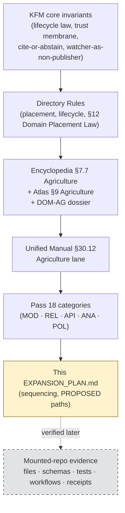
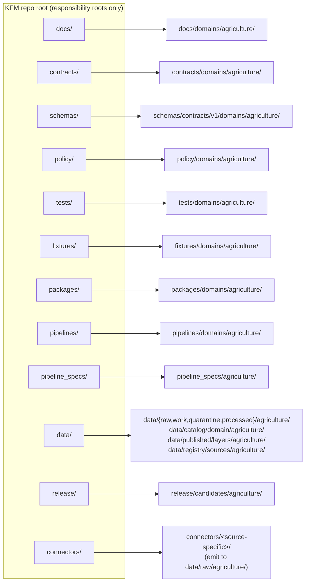
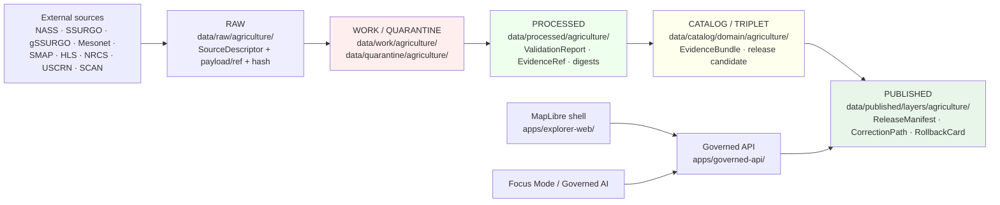
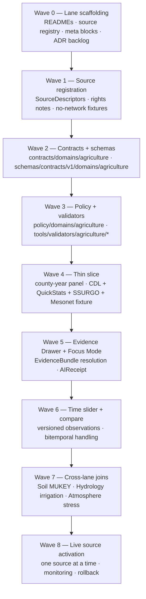

<!-- [KFM_META_BLOCK_V2]
doc_id: kfm://doc/domains/agriculture/expansion-plan
title: Agriculture Domain — Expansion Plan
type: standard
version: v0.1
status: draft
owners: Agriculture domain steward; Docs steward
created: 2026-05-15
updated: 2026-05-15
policy_label: public
related:
  - docs/domains/agriculture/README.md
  - docs/domains/README.md
  - docs/doctrine/directory-rules.md
  - docs/doctrine/lifecycle-law.md
  - docs/doctrine/trust-membrane.md
  - docs/adr/ADR-0001-schema-home.md
  - docs/registers/VERIFICATION_BACKLOG.md
  - docs/registers/DRIFT_REGISTER.md
  - docs/domains/soil/EXPANSION_PLAN.md
  - docs/domains/hydrology/EXPANSION_PLAN.md
  - docs/domains/atmosphere/EXPANSION_PLAN.md
tags: [kfm, domain, agriculture, expansion-plan, lifecycle, governance]
notes:
  - All file paths are PROPOSED pending mounted-repo verification.
  - Source rights for NASS, SSURGO, Mesonet, SMAP, HLS remain NEEDS VERIFICATION.
[/KFM_META_BLOCK_V2] -->

# Agriculture Domain — Expansion Plan

> Sequenced, evidence-first plan to bring the Agriculture lane online behind the KFM trust membrane — from source registration to a first county-level, public-safe thin slice.

[](#)
[](#authority-and-source-basis)
[](#authority-and-source-basis)
[](#5-pipeline-shape-raw--published)
[](#7-sensitivity-rights-and-publication-posture)
[](#7-sensitivity-rights-and-publication-posture)
[](#)

| Status | Owners | Last updated |
|---|---|---|
| Draft — PROPOSED | Agriculture domain steward · Docs steward · *TODO confirm CODEOWNERS* | 2026-05-15 |

> [!IMPORTANT]
> This plan is **doctrine-grounded and implementation-pending**. The Agriculture lane is **CONFIRMED doctrine / PROPOSED implementation** in current KFM materials. No mounted-repository evidence was available during drafting, so every file path, route, package, fixture, validator, and test command below is **PROPOSED** until verified. Promotion of Agriculture material to public surfaces requires the standard governed gates: source rights, evidence closure, public-safe aggregation, validation, policy, review where required, release manifest, correction path, and rollback target.

---

## Mini-TOC

1. [Scope and boundary](#1-scope-and-boundary)
2. [Authority and source basis](#2-authority-and-source-basis)
3. [Repo fit — lane placement](#3-repo-fit--lane-placement)
4. [Ubiquitous language and object families](#4-ubiquitous-language-and-object-families)
5. [Pipeline shape (RAW → PUBLISHED)](#5-pipeline-shape-raw--published)
6. [Sources and source roles](#6-sources-and-source-roles)
7. [Sensitivity, rights, and publication posture](#7-sensitivity-rights-and-publication-posture)
8. [Cross-lane relations](#8-cross-lane-relations)
9. [API, contract, and schema surfaces](#9-api-contract-and-schema-surfaces)
10. [Validators, tests, and fixtures](#10-validators-tests-and-fixtures)
11. [Governed AI behavior](#11-governed-ai-behavior)
12. [Publication, correction, and rollback](#12-publication-correction-and-rollback)
13. [Sequenced expansion plan — waves](#13-sequenced-expansion-plan--waves)
14. [Thin slice — first credible vertical](#14-thin-slice--first-credible-vertical)
15. [Risks and mitigations](#15-risks-and-mitigations)
16. [Verification backlog](#16-verification-backlog)
17. [Open questions](#17-open-questions)
18. [Related docs](#18-related-docs)

---

## 1. Scope and boundary

**Mission (CONFIRMED doctrine / PROPOSED implementation).** Govern agricultural aggregate observations, soil/moisture/vegetation context, crop progress, suitability, stress indicators, irrigation links, conservation practice context, agricultural economy observations, and public-safe products — without publishing private farm operations, field-level sensitive details, or source-rights-limited data without review. [DOM-AG] [ENCY §7.7] [ATLAS §9]

**This domain owns** (CONFIRMED domain scope / PROPOSED field realization): `CropObservation`, `FieldCandidate`, `CropRotation`, `YieldObservation`, `IrrigationLink`, `ConservationPractice`, `SoilCropSuitability`, `AgriculturalEconomyObservation`, `SupplyChainNode`, `DroughtStressIndicator`, `PestStressIndicator`, `AggregationReceipt`. [ATLAS §9.B] [ENCY §7.7.C]

**This domain explicitly does NOT own**:

| Concern | Owning lane | Why this matters |
|---|---|---|
| Canonical soil map-unit and horizon semantics | Soil | Suitability joins use Soil's MUKEY identity, not Agriculture's. |
| Water observations, flood context, water-use truth | Hydrology | Irrigation, drought, and water-use links travel through Hydrology evidence. |
| Weather, smoke, heat, vegetation-stress weather drivers | Atmosphere / Air | Mesonet, normals, and AOD/smoke products are sourced from Atmosphere. |
| Ownership, title, parcels, living-person privacy, operator identity | People / Land | Farm/operator and parcel-sensitive joins remain restricted by default. |

[ATLAS §9.B, §9.F] [ENCY §7.7.A]

> [!NOTE]
> Aggregate statistics and satellite products **must not become field/operator truth**. Farm/operator private data, proprietary yield, pesticide records, and private-sensitive joins **fail closed** under the KFM trust membrane. [ATLAS §9.I] [ENCY §7.7]

[Back to top](#mini-toc)

---

## 2. Authority and source basis

Authority for this plan resolves in the order below. Lower layers may clarify higher ones; they never silently override.



| Layer | Source | Status |
|---|---|---|
| Core invariants | KFM lifecycle law, trust membrane, cite-or-abstain | **CONFIRMED doctrine** |
| Directory Rules | `docs/doctrine/directory-rules.md` (§3, §4, §12, §15) | **CONFIRMED doctrine** / **PROPOSED** specific paths |
| Domain spine | `kfm_encyclopedia.pdf` §7.7; `KFM_Domains_Culmination_Atlas_v1_1.pdf` §9; DOM-AG dossier | **CONFIRMED doctrine** / **PROPOSED implementation** |
| Unified plan | `KFM_Unified_Implementation_Architecture_Build_Manual.pdf` §30.12 | **CONFIRMED doctrine** / **PROPOSED implementation** |
| Pass 18 expansion surface | MOD, REL, API, ANA, POL categories | **CONFIRMED source support** / **PROPOSED synthesis** |
| Mounted repo | n/a in this session | **UNKNOWN** — `NEEDS VERIFICATION` |

[Back to top](#mini-toc)

---

## 3. Repo fit — lane placement

The Agriculture lane follows **Directory Rules §12 Domain Placement Law**: a domain MUST NOT become a root folder; it lives as a segment inside responsibility roots.



[CONFIRMED lane pattern per DIRRULES §12; PROPOSED specific paths.]

<details>
<summary><b>PROPOSED lane paths (text form)</b></summary>

```text
docs/domains/agriculture/
contracts/domains/agriculture/
schemas/contracts/v1/domains/agriculture/
policy/domains/agriculture/
tests/domains/agriculture/
fixtures/domains/agriculture/
packages/domains/agriculture/
pipelines/domains/agriculture/
pipeline_specs/agriculture/
data/raw/agriculture/
data/work/agriculture/
data/quarantine/agriculture/
data/processed/agriculture/
data/catalog/domain/agriculture/
data/published/layers/agriculture/
data/registry/sources/agriculture/
release/candidates/agriculture/
```

All paths are **PROPOSED** until verified against mounted-repo evidence. If a different convention already exists in the repo, open an entry in `docs/registers/DRIFT_REGISTER.md` rather than silently conforming. [DIRRULES §2.5]

</details>

> [!CAUTION]
> Do **not** create a root-level `agriculture/` folder. A domain folder at repo root is an Anti-Pattern (DIRRULES §13.4) — it fragments the lifecycle and competes with responsibility roots. The lane pattern above is the only sanctioned placement.

[Back to top](#mini-toc)

---

## 4. Ubiquitous language and object families

**Ubiquitous-language discipline.** Agriculture terms keep their meaning *inside the Agriculture bounded context*; cross-lane joins translate, they do not collapse. Glossary entries below are CONFIRMED as terms and **PROPOSED as field realizations** until schemas and fixtures land. [ATLAS §9.C] [DDD]

| Term | Role | Status |
|---|---|---|
| `CropObservation` | Aggregate or evidence-anchored observation of a crop signal | CONFIRMED term / PROPOSED realization |
| `FieldCandidate` | Inferred field polygon, **never** equated with operator/parcel truth | CONFIRMED term / PROPOSED realization |
| `CropRotation` | Multi-year sequence over an aggregation unit or candidate | CONFIRMED term / PROPOSED realization |
| `YieldObservation` | Public-safe yield evidence; proprietary yield fails closed | CONFIRMED term / PROPOSED realization |
| `IrrigationLink` | Agriculture↔Hydrology relation preserving water-use ownership | CONFIRMED term / PROPOSED realization |
| `ConservationPractice` | NRCS-style practice context, where rights permit | CONFIRMED term / PROPOSED realization |
| `SoilCropSuitability` | Agriculture↔Soil suitability join keyed on MUKEY | CONFIRMED term / PROPOSED realization |
| `AgriculturalEconomyObservation` | Economy signals admissible under release policy | CONFIRMED term / PROPOSED realization |
| `SupplyChainNode` | Public-safe node in agricultural supply networks | CONFIRMED term / PROPOSED realization |
| `DroughtStressIndicator` | Evidence-bounded stress signal (not a forecast) | CONFIRMED term / PROPOSED realization |
| `PestStressIndicator` | Evidence-bounded stress signal | CONFIRMED term / PROPOSED realization |
| `AggregationReceipt` | Receipt for any aggregation/redaction transform applied for public safety | CONFIRMED object family / PROPOSED implementation |
| `VWC` | Volumetric water content (soil-moisture context) | CONFIRMED term / PROPOSED realization |
| `Spec hash` | Deterministic normalized digest carried in identity rules | CONFIRMED term / PROPOSED realization |

[ATLAS §9.C, §9.E] [ENCY §7.7.C]

**Identity rule (PROPOSED).** Each Agriculture object resolves identity from *source id + object role + temporal scope + normalized digest*. Source, observed, valid, retrieval, release, and correction times **stay distinct where material**. [ATLAS §9.E]

[Back to top](#mini-toc)

---

## 5. Pipeline shape (RAW → PUBLISHED)

The Agriculture lane follows the **CONFIRMED** KFM lifecycle invariant. Promotion is a **governed state transition, not a file move**. [DIRRULES] [ATLAS §9.H]



| Stage | Handling | Gate | Status |
|---|---|---|---|
| **RAW** | Capture immutable source payload or reference with source role, rights, sensitivity, citation, time, and hash. | `SourceDescriptor` exists. | PROPOSED |
| **WORK / QUARANTINE** | Normalize schema, geometry, time, identity, evidence, rights, and policy; hold failures. | Validation and policy gate pass, or quarantine reason is recorded. | PROPOSED |
| **PROCESSED** | Emit validated normalized objects, receipts, and public-safe candidates. | `EvidenceRef`, `ValidationReport`, and digest closure exist. | PROPOSED |
| **CATALOG / TRIPLET** | Emit catalog records, `EvidenceBundle`s, graph/triplet projections, and release candidates. | Catalog/proof closure passes. | PROPOSED |
| **PUBLISHED** | Serve released public-safe artifacts through governed APIs and manifests. | `ReleaseManifest`, correction path, rollback target, and review/policy state exist. | PROPOSED |

[ATLAS §9.H]

> [!WARNING]
> **No lifecycle skip.** Connectors emit only to `data/raw/agriculture/` (or `data/quarantine/agriculture/` on failure). They do not publish. Watchers emit receipts and candidate decisions only — **watcher-as-non-publisher**. Public clients read only via the governed API. [DIRRULES §13.5; trust membrane]

[Back to top](#mini-toc)

---

## 6. Sources and source roles

Source-role discipline is non-negotiable. Each source is recorded with role (authority / observation / context / model), rights, sensitivity, and freshness cadence. Rights and current terms remain **NEEDS VERIFICATION** in this session. [ATLAS §9.D] [ENCY §7.7.B]

| Source family | Typical role(s) | Rights / sensitivity | Freshness | Status |
|---|---|---|---|---|
| USDA NASS CDL | observation / context | rights NEEDS VERIFICATION; aggregate-only for public | annual product cadence | PROPOSED |
| USDA NASS QuickStats / Crop Progress | authority / observation | rights NEEDS VERIFICATION; field-level public DENY | weekly / annual | PROPOSED |
| NRCS SSURGO / Soil Data Access | authority / context | rights NEEDS VERIFICATION; survey-vintage specific | vintage-specific | PROPOSED |
| gSSURGO | context / model | rights NEEDS VERIFICATION | gridded vintage | PROPOSED |
| Kansas Mesonet | authority / observation | rights NEEDS VERIFICATION | sub-daily | PROPOSED |
| NRCS SCAN | observation | rights NEEDS VERIFICATION | sub-daily | PROPOSED |
| NOAA USCRN | observation | rights NEEDS VERIFICATION | sub-daily | PROPOSED |
| NASA SMAP | model / context | rights NEEDS VERIFICATION | daily-ish | PROPOSED |
| NASA HLS / HLS-VI | observation / context | rights NEEDS VERIFICATION; cloud/AOD gating required | 2-3 day revisit | PROPOSED |
| Crop insurance / market / economy | context | rights NEEDS VERIFICATION; many sources unavailable for redistribution | varies | PROPOSED |
| Local extension sources | context | rights NEEDS VERIFICATION | varies | PROPOSED |

[ATLAS §9.D] [ENCY §7.7.B; Appendix sources]

> [!NOTE]
> Source **roles** distinguish *authority* (e.g., regulatory or steward truth), *observation* (measured), *context* (background), and *model* (derived). Source-role collapse is a Master Failure Mode — every Agriculture object must carry its source role explicitly. [ATLAS §24.9.2]

[Back to top](#mini-toc)

---

## 7. Sensitivity, rights, and publication posture

| Posture | Rule | Source |
|---|---|---|
| **Aggregate-only public** | Public products aggregate to county / HUC / grid thresholds. Field-level public DENY by default. | [ENCY §7.7.D] [ATLAS §9.I] |
| **Operator/farm sensitivity** | Farm/operator private data, proprietary yield, pesticide records, and private-sensitive joins **fail closed**. | [ATLAS §9.I] |
| **Aggregate ≠ ground truth** | Aggregate statistics and satellite products must not become field/operator truth. | [ATLAS §9.I] |
| **Promotion preconditions** | Unclear rights, unresolved source role, missing evidence, unresolved sensitivity, or absent release state **blocks public promotion**. | [ENCY] [DIRRULES] |
| **Cross-lane redaction** | Joins to People/Land remain restricted by default; redaction transforms emit `AggregationReceipt`/redaction receipts. | [ATLAS §9.F] |

> [!IMPORTANT]
> **DENY-by-default surfaces:** unreviewed exact sensitive Agriculture locations or private operator data are denied for the public visitor; access requires policy approval and a redaction receipt. [ENCY §7.7.L]

[Back to top](#mini-toc)

---

## 8. Cross-lane relations

| Related lane | Relation | Constraint | Status |
|---|---|---|---|
| Soil | MUKEY joins and suitability support | Must preserve ownership, source role, sensitivity, and `EvidenceBundle` support. | CONFIRMED relation / PROPOSED join validators |
| Hydrology | Irrigation, drought, water-use context | Same. Water observations remain Hydrology truth. | CONFIRMED relation / PROPOSED |
| Atmosphere / Air | Weather, heat, smoke, vegetation stress | Same. Mesonet / normals / AOD remain Atmosphere truth. | CONFIRMED relation / PROPOSED |
| People / Land | Farm/operator and parcel-sensitive contexts | **Restricted by default**; default-DENY for living-person and operator linkage. | CONFIRMED relation / PROPOSED |
| Hazards | Drought monitor, freeze/heat events as context | Hazards remains contextual; never collapses warnings into truth. | INFERRED relation / PROPOSED |

[ATLAS §9.F] [ENCY §7.7.A]

[Back to top](#mini-toc)

---

## 9. API, contract, and schema surfaces

All surfaces are governed; finite outcomes are `ANSWER / ABSTAIN / DENY / ERROR`. Routes shown are **PROPOSED**; exact route names remain **UNKNOWN** without mounted-repo evidence. [ATLAS §9.J] [ENCY §7.7.J]

| Surface | DTO / schema | Outcomes | Status |
|---|---|---|---|
| Agriculture feature / detail resolver | `AgricultureDecisionEnvelope` | ANSWER / ABSTAIN / DENY / ERROR | PROPOSED route; e.g. `GET /api/v1/domains/agriculture/features/{id}` |
| Agriculture layer manifest resolver | `LayerManifest` / domain layer descriptor | ANSWER / DENY / ERROR | PROPOSED; public-safe release only |
| Agriculture Evidence Drawer payload | `EvidenceDrawerPayload` + `EvidenceBundle` projection | ANSWER / ABSTAIN / DENY / ERROR | PROPOSED; evidence + policy filtered |
| Agriculture Focus Mode answer | Runtime Response Envelope + `AIReceipt` | ANSWER / ABSTAIN / DENY / ERROR | PROPOSED; AI never root truth |
| Correction submit | `CorrectionNoticeCandidate` | ACCEPTED / DENY / ERROR | PROPOSED |
| Review decision | `ReviewRecord` | ALLOW / RESTRICT / DENY / ERROR | PROPOSED |

**Schema home (CONFIRMED via ADR-0001).** `schemas/contracts/v1/domains/agriculture/...` is the default machine-schema home. Divergent schemas under `contracts/domains/agriculture/` are **lineage / CONFLICTED** and require migration. Semantic Markdown for object meaning lives under `contracts/domains/agriculture/`. [DIRRULES §6.3–6.4, §13.1] [ADR-0001]

[Back to top](#mini-toc)

---

## 10. Validators, tests, and fixtures

Domain-specific validators expand the cross-cutting baseline (schema validation, source descriptor validation, rights validation, sensitivity validation, evidence closure, temporal logic, geometry validity, policy deny tests, citation validation, release manifest validation, rollback drill, no-network fixtures, non-regression). [ENCY §7.7.K]

**Agriculture-specific validators (PROPOSED).** [ATLAS §9.K]

- SSURGO / Soil Data Access lineage tests.
- Soil-moisture unit/depth/QC tests.
- Crop progress aggregate-only tests (reject field-level claims).
- Vegetation-index mask/time tests (cloud / AOD gating).
- Policy denial for field-level NASS claims.
- Catalog closure tests.
- Public-safe redaction / generalization tests.
- Source-role mismatch denial tests.
- Stale-state handling tests.
- Cross-lane join tests (Soil MUKEY, Hydrology water-use, Atmosphere stress drivers).

**Fixture posture (PROPOSED).** No-network synthetic fixtures land first under `fixtures/domains/agriculture/`. Live source activation happens **one source at a time** with rights, tests, monitoring, and a rollback target. [ATLAS §21 phase 17]

[Back to top](#mini-toc)

---

## 11. Governed AI behavior

> [!NOTE]
> AI may summarize **released** Agriculture `EvidenceBundle`s, compare evidence, explain limitations, and draft steward-review notes. AI must **ABSTAIN** when evidence is insufficient and **DENY** where policy, rights, sensitivity, or release state blocks the request. AI is **never** root truth. [GAI] [ATLAS §9.L]

Every Focus Mode answer for Agriculture emits an `AIReceipt` and `RuntimeResponseEnvelope` with finite outcome, `evidence_refs`, `policy_decision`, and `citation_validation`. [ENCY §7.7.H–I]

[Back to top](#mini-toc)

---

## 12. Publication, correction, and rollback

Agriculture publication requires **all** of: `ReleaseManifest`, `EvidenceBundle`, validation / policy support, review state where required, correction path, stale-state rule, and rollback target. Promotion is a governed state transition, not a file move. [ENCY Appendix E] [ATLAS §9.M]

| Object | Role |
|---|---|
| `ReleaseManifest` | Authorizes a released set of Agriculture artifacts. |
| `EvidenceBundle` | Resolves every public claim to its evidence. |
| `CorrectionNotice` | Records correctable failures without rewriting history. |
| `RollbackCard` | Preserves history while repointing current release state. |
| `AggregationReceipt` / redaction receipt | Records the public-safe transform applied. |

[Back to top](#mini-toc)

---

## 13. Sequenced expansion plan — waves

This sequencing is **PROPOSED**. It aligns with the Encyclopedia's Phase 5 (domain expansion) and the Unified Manual's Part V lane template. Each wave is a reversible increment with explicit evidence, validators, and rollback. [ENCY Phase 5] [UNIFIED §30.12]



| Wave | Goal | Evidence required | Validation path | Rollback | Status |
|---|---|---|---|---|---|
| **W0** | Lane scaffolding | This plan + per-root READMEs + Directory Rules §15 contract | Docs link check · README presence scan | Revert PR; preserve as lineage | PROPOSED |
| **W1** | Agriculture source registry + no-network fixture | `SourceDescriptor` + synthetic fixture | Schema · source · rights validators | Revert PR; no public artifact | PROPOSED |
| **W2** | Object meaning + machine shape | `contracts/` Markdown + `schemas/contracts/v1/domains/agriculture/*.schema.json` | Schema valid/invalid fixtures | Schema mirror; ADR if home changes | PROPOSED |
| **W3** | Admissibility | Policy bundles + sensitivity rules + rights enforcement | Policy tests + negative fixtures | Revert policy bundle; fail closed | PROPOSED |
| **W4** | First credible thin slice | County-year panel (CDL/QuickStats + SSURGO + Mesonet) | Aggregate-only tests + evidence closure | Disable layer; revert layer registry | PROPOSED |
| **W5** | Trust-visible UI + governed AI | `EvidenceBundle` for one feature; `AIReceipt` over released evidence | Evidence closure + citation tests | Disable Focus adapter | PROPOSED |
| **W6** | Time slider + compare | Versioned observations/layers | Temporal logic tests | Revert temporal config | PROPOSED |
| **W7** | Cross-lane joins | Soil MUKEY · Hydrology irrigation · Atmosphere stress drivers | Cross-lane join tests | Disable join layer | PROPOSED |
| **W8** | Live source activation | Source terms · monitoring · alerting · rollback | Source descriptor + freshness + integration | Disable `SourceDescriptor` | PROPOSED |

> [!TIP]
> Treat each wave as an independent PR (or small PR stack). Cite the Directory Rules basis in the PR body. Open a `VERIFICATION_BACKLOG.md` entry for anything that cannot yet be proven against a mounted repo.

[Back to top](#mini-toc)

---

## 14. Thin slice — first credible vertical

**CONFIRMED thin-slice plan (per ATLAS / ENCY).** A county-level crop-year panel using CDL / QuickStats + SSURGO suitability + Kansas Mesonet weather fixture, **with field-level detail denied by default**. [ENCY §7.7] [ATLAS §9 thin slice]

| Aspect | PROPOSED detail |
|---|---|
| Aggregation unit | County (FIPS) over crop year |
| Inputs | NASS CDL raster (year T) · NASS QuickStats county totals · SSURGO suitability summary (dominant component) · Kansas Mesonet station summary |
| Public products | Crop-year panel page · CDL crop map (county-aggregate) · SSURGO suitability map · Mesonet station time series |
| Sensitivity | DENY field-level detail; DENY operator/farm joins; aggregate-only |
| Evidence | One `EvidenceBundle` per panel cell, citing every source contribution and aggregation receipt |
| Validators | aggregate-only test · vegetation-index mask/time test · SSURGO lineage · Mesonet unit/depth/QC · policy deny for field-level NASS |
| Failure handling | Cell unevidenced → ABSTAIN at API; aggregation breach → DENY; rights gap → quarantine |
| Rollback | `RollbackCard` repoints release state; old manifest retained |

[Back to top](#mini-toc)

---

## 15. Risks and mitigations

| Risk | Mitigation | Source |
|---|---|---|
| Rights uncertainty | Block public release until source terms and redistribution class are recorded. | [ENCY §7.7.M] |
| Sensitive location exposure | Default redaction / generalization, restricted views, and geoprivacy transform receipts. | [ENCY §7.7.M] |
| False precision | Show uncertainty / support, scale and source-role badges; abstain on over-precise claims. | [ENCY §7.7.M] |
| Source authority confusion | Use source-role registry and separate observation / model / regulatory / legal / status contexts. | [ENCY §7.7.M] |
| Model hallucination | Citation validation, finite outcomes, no direct model-to-public path. | [ENCY §7.7.M] [GAI] |
| Stale data | Freshness badges, retrieval / source / release time, and stale-state policy. | [ENCY §7.7.M] |
| Rollback complexity | `ReleaseManifest` + `RollbackCard` + rollback drill for every release. | [ENCY §7.7.M] |
| Schema-home drift | Single canonical home (`schemas/contracts/v1/...`); ADR-0001 governs migration. | [DIRRULES §6.4, §13.1] |
| Domain folder at repo root | Apply Domain Placement Law §12; migrate to responsibility-root lanes. | [DIRRULES §12, §13.4] |

[Back to top](#mini-toc)

---

## 16. Verification backlog

Carried over from [ATLAS §9.N]; expand as new items surface.

| # | Item to verify | Evidence that would settle it | Status |
|---|---|---|---|
| 1 | Verify NASS / QuickStats and Crop Progress activation. | mounted-repo files, schemas, registry entries, tests, logs, emitted artifacts, review records, or release manifests | NEEDS VERIFICATION |
| 2 | Verify Mesonet and HLS / SMAP product terms. | as above | NEEDS VERIFICATION |
| 3 | Verify public release sensitivity rules for farm / operator joins. | as above | NEEDS VERIFICATION |
| 4 | Verify Agriculture API and layer registry. | as above | NEEDS VERIFICATION |
| 5 | Verify SSURGO/SDA lineage test coverage. | tests under `tests/domains/agriculture/` + fixtures | NEEDS VERIFICATION |
| 6 | Verify policy-deny path for field-level NASS claims. | policy tests + negative fixtures | NEEDS VERIFICATION |
| 7 | Verify CODEOWNERS entry for Agriculture lane. | `CODEOWNERS` (root or `.github/CODEOWNERS`) | NEEDS VERIFICATION |
| 8 | Verify schema-home convention: `schemas/contracts/v1/domains/agriculture/`. | actual schema files under that path | NEEDS VERIFICATION |
| 9 | Verify connector → `data/raw/agriculture/` discipline (no publishing). | connector code + emitted artifacts | NEEDS VERIFICATION |
| 10 | Verify Evidence Drawer wiring for an Agriculture feature. | `EvidenceDrawerPayload` fixture + UI/route binding | NEEDS VERIFICATION |

[Back to top](#mini-toc)

---

## 17. Open questions

1. **Field-polygon strategy.** Should `FieldCandidate` be derived from CDL pixel clustering, NASS CLU (where rights permit), or only stewarded inputs? *NEEDS VERIFICATION; ADR-class once data is reachable.*
2. **County / HUC / grid threshold standard.** What is the canonical public-safe aggregation grain for Agriculture across products (county-only vs HUC12 vs k-anonymous grid)? *NEEDS VERIFICATION.*
3. **HLS / SMAP cloud + AOD gating.** Adopt the persistence + AOD thresholds discussed in the New_Ideas vegetation-anomaly lane (e.g., 0.5 DEGRADED / 0.8 QUARANTINE), or define Agriculture-specific ones? *NEEDS VERIFICATION; ADR-class.*
4. **Aggregation receipt scope.** Does `AggregationReceipt` cover redaction *and* aggregation, or do we split it into `AggregationReceipt` + `RedactionReceipt`? *NEEDS VERIFICATION; ADR-class.*
5. **Crop-rotation evidence horizon.** Minimum number of CDL years before a `CropRotation` is publishable? *NEEDS VERIFICATION.*
6. **Mesonet variable canonicalization.** Standard variable codes, units, and depth conventions for soil moisture (VWC) across Mesonet / SCAN / USCRN? *NEEDS VERIFICATION.*
7. **Conservation practice rights.** Which NRCS conservation practice fields are publishable vs. restricted? *NEEDS VERIFICATION.*
8. **Economy source whitelist.** Which agricultural-economy sources are admissible for public release (license + redistribution)? *NEEDS VERIFICATION.*

Open ADR candidates (PROPOSED): `ADR-AG-01 FieldCandidate derivation policy`, `ADR-AG-02 Public-safe aggregation grain`, `ADR-AG-03 HLS/SMAP gating thresholds`, `ADR-AG-04 Aggregation vs Redaction receipt split`.

[Back to top](#mini-toc)

---

## 18. Related docs

- [`docs/doctrine/directory-rules.md`](../../doctrine/directory-rules.md) — canonical placement and lifecycle doctrine.
- [`docs/doctrine/lifecycle-law.md`](../../doctrine/lifecycle-law.md) — RAW → PUBLISHED invariant. *TODO confirm path.*
- [`docs/doctrine/trust-membrane.md`](../../doctrine/trust-membrane.md) — public-path discipline. *TODO confirm path.*
- [`docs/domains/README.md`](../README.md) — domain lane index. *TODO confirm presence.*
- [`docs/domains/agriculture/README.md`](./README.md) — Agriculture lane landing page. *TODO confirm presence.*
- [`docs/domains/soil/EXPANSION_PLAN.md`](../soil/EXPANSION_PLAN.md) — adjacent lane (MUKEY joins). *TODO confirm.*
- [`docs/domains/hydrology/EXPANSION_PLAN.md`](../hydrology/EXPANSION_PLAN.md) — irrigation / drought context. *TODO confirm.*
- [`docs/domains/atmosphere/EXPANSION_PLAN.md`](../atmosphere/EXPANSION_PLAN.md) — weather / stress drivers. *TODO confirm.*
- [`docs/adr/ADR-0001-schema-home.md`](../../adr/ADR-0001-schema-home.md) — schema-home rule. *TODO confirm path.*
- [`docs/registers/VERIFICATION_BACKLOG.md`](../../registers/VERIFICATION_BACKLOG.md) — verification items.
- [`docs/registers/DRIFT_REGISTER.md`](../../registers/DRIFT_REGISTER.md) — drift entries.

---

<sub>Citations used above are KFM short-names: <b>[DIRRULES]</b> Directory Rules · <b>[ENCY]</b> KFM Domain &amp; Capability Encyclopedia · <b>[ATLAS]</b> KFM Domains Culmination Atlas v1.1 · <b>[DOM-AG]</b> Agriculture dossier · <b>[UNIFIED]</b> Unified Implementation Architecture Build Manual · <b>[INDEX-18]</b> Pass 18 Idea Index · <b>[GAI]</b> Governed AI dossier · <b>[DDD]</b> Domain-Driven Design Reference.</sub>

---

**Last reviewed:** 2026-05-15 · **Status:** Draft (PROPOSED) · **Authority:** CONFIRMED doctrine / PROPOSED implementation · [Back to top](#mini-toc)
