# Agriculture — File System Plan

> Canonical placement map for the **Agriculture** domain across KFM's responsibility roots: where every Agriculture file lives, what each lane owns, which lanes carry trust, and what does *not* belong here. Anchored in Directory Rules §12 (Domain Placement Law). All concrete paths are **PROPOSED** until verified against mounted-repo evidence.

<!-- [KFM_META_BLOCK_V2]
doc_id: kfm://doc/agriculture-file-system-plan
title: Agriculture — File System Plan
type: standard
version: v1
status: draft
owners: Agriculture domain steward (PROPOSED); Docs steward
created: 2026-05-15
updated: 2026-05-15
policy_label: public
related:
  - docs/doctrine/directory-rules.md
  - docs/domains/README.md
  - docs/domains/agriculture/README.md          # PROPOSED, NEEDS VERIFICATION
  - docs/doctrine/lifecycle-law.md              # PROPOSED, NEEDS VERIFICATION
  - kfm://contract/SourceDescriptor
  - kfm://contract/EvidenceBundle
  - kfm://contract/AggregationReceipt
tags: [kfm, domain:agriculture, placement, doctrine, file-system-plan]
notes:
  - "All concrete paths PROPOSED until verified against mounted-repo evidence."
  - "Filename `FILE_SYSTEM_PLAN.md` is PROPOSED; the convention NEEDS VERIFICATION against other domain folders."
  - "External research: none performed; KFM project knowledge supplied all material."
[/KFM_META_BLOCK_V2] -->


<!-- TODO replace with live workflow badges once repo is mounted:


-->

**Status:** `draft` · **Owners:** Agriculture domain steward (PROPOSED) · Docs steward · **Updated:** `2026-05-15`

---

## Quick jump

- [1 — Scope & authority](#1--scope--authority)
- [2 — Agriculture in one paragraph](#2--agriculture-in-one-paragraph)
- [3 — The Agriculture lane pattern](#3--the-agriculture-lane-pattern)
- [4 — Per-lane contents](#4--per-lane-contents)
- [5 — Lifecycle layout under `data/`](#5--lifecycle-layout-under-data)
- [6 — Source registry roster](#6--source-registry-roster)
- [7 — Sensitivity & rights overlay](#7--sensitivity--rights-overlay)
- [8 — Cross-domain seams](#8--cross-domain-seams)
- [9 — What does **not** go here](#9--what-does-not-go-here)
- [10 — Validation hooks & test homes](#10--validation-hooks--test-homes)
- [11 — Verification backlog & open questions](#11--verification-backlog--open-questions)
- [12 — Related docs](#12--related-docs)

---

## 1 — Scope & authority

This document is a **placement map**, not a feature plan. It tells contributors and reviewers where Agriculture-domain files belong inside the KFM monorepo, and where they do **not** belong. It does not decide *whether* a file should exist; that is decided by `contracts/`, `schemas/`, `policy/`, source descriptors, ADRs, and reviews. It does not define field shapes; that is `schemas/`' job. It does not decide allow/deny; that is `policy/`' job.

**Authority basis** (in order):

1. **CONFIRMED doctrine** — Directory Rules §3–§4 (responsibility roots & placement protocol), §12 (Domain Placement Law), §15 (Required README Contract) [`docs/doctrine/directory-rules.md`, this session's mounted copy].
2. **CONFIRMED dossier lineage** — Agriculture domain identity, ownership boundary, source families, object families, pipeline shape, and sensitivity posture from the Domain & Capability Encyclopedia §7.7 and the Domains Culmination Atlas v1.1 §9 (Agriculture).
3. **PROPOSED placements** — every concrete path written in this file. The live repository is not mounted in this session; paths are derived from doctrine, not verified against repo state.

> [!IMPORTANT]
> Directory Rules §12 is non-negotiable: **a domain MUST NOT become a root folder.** An `agriculture/` directory at repo root would violate the responsibility-root invariant. Agriculture is a **segment** inside each responsibility root, never a root itself.

[Back to top](#agriculture--file-system-plan)

---

## 2 — Agriculture in one paragraph

CONFIRMED dossier / PROPOSED implementation: the Agriculture domain governs **agricultural aggregate observations, soil/moisture/vegetation context, crop progress, suitability, stress indicators, irrigation links, conservation practice context, agricultural economy observations, and public-safe products** for Kansas-first scope. It **owns**: `Crop Observation`, `Field Candidate`, `Crop Rotation`, `Yield Observation`, `Irrigation Link`, `Conservation Practice`, `Soil Crop Suitability`, `Agricultural Economy Observation`, `SupplyChainNode`, `Drought Stress Indicator`, `Pest Stress Indicator`, `AggregationReceipt`. It explicitly **does not own** canonical soil map-unit and horizon semantics (Soil), water observations and flood context (Hydrology), or ownership/title/parcels and living-person privacy (People/Land).

Agriculture's first credible thin slice (PROPOSED): a county-level crop-year panel using USDA NASS CDL/QuickStats plus SSURGO suitability and a Kansas Mesonet weather fixture, **with field-level detail denied by default.**

[Back to top](#agriculture--file-system-plan)

---

## 3 — The Agriculture lane pattern

Directory Rules §12 prescribes a uniform lane pattern for every domain. Agriculture instantiates that pattern as follows.

### 3.1 Visual map

```mermaid
flowchart TB
  ROOT["KFM repo root<br/>(MUST stay boring & stable — §3, §5)"]:::root

  ROOT --> D["docs/"]:::lane
  ROOT --> C["contracts/"]:::lane
  ROOT --> S["schemas/contracts/v1/"]:::lane
  ROOT --> P["policy/"]:::lane
  ROOT --> T["tests/"]:::lane
  ROOT --> F["fixtures/"]:::lane
  ROOT --> PK["packages/"]:::lane
  ROOT --> PL["pipelines/"]:::lane
  ROOT --> PS["pipeline_specs/"]:::lane
  ROOT --> CN["connectors/"]:::lane
  ROOT --> DA["data/"]:::lane
  ROOT --> RL["release/"]:::lane

  D --> Dag["domains/agriculture/"]:::ag
  C --> Cag["domains/agriculture/"]:::ag
  S --> Sag["domains/agriculture/"]:::ag
  P --> Pag["domains/agriculture/"]:::ag
  T --> Tag["domains/agriculture/"]:::ag
  F --> Fag["domains/agriculture/"]:::ag
  PK --> PKag["domains/agriculture/"]:::ag
  PL --> PLag["domains/agriculture/"]:::ag
  PS --> PSag["agriculture/"]:::ag
  CN --> CNag["(nrcs, usda-nass,<br/>kansas-mesonet, …)"]:::ag
  DA --> DAag["{raw, work, quarantine,<br/>processed, catalog,<br/>published, registry}/<br/>… /agriculture/"]:::ag
  RL --> RLag["candidates/agriculture/"]:::ag

  NOROOT["agriculture/ at repo root<br/>FORBIDDEN — §12"]:::forbidden
  ROOT -. "rejects" .-> NOROOT

  classDef root fill:#1f2937,stroke:#0b0f17,color:#fff
  classDef lane fill:#e5e7eb,stroke:#374151,color:#111
  classDef ag fill:#dcfce7,stroke:#166534,color:#064e3b
  classDef forbidden fill:#fee2e2,stroke:#991b1b,color:#7f1d1d,stroke-dasharray:4 3
```



> [!NOTE]
> The diagram is structurally faithful to Directory Rules §12 but the **existence** of any specific path below is PROPOSED. Mounted-repo inspection is required to confirm that the lane already exists, is empty, or needs scaffolding via a per-root README (§15) in the same change.

### 3.2 Canonical Agriculture lane paths (PROPOSED)

| # | Responsibility root | Lane path | What lives here | Status |
|---|---|---|---|---|
| 1 | `docs/` (human explanation) | `docs/domains/agriculture/` | Domain README, this FILE_SYSTEM_PLAN.md, dossier-derived doctrine, runbooks, ADR pointers, verification backlog. | PROPOSED |
| 2 | `contracts/` (object meaning, Markdown) | `contracts/domains/agriculture/` | Semantic Markdown for `CropObservation`, `FieldCandidate`, `YieldObservation`, `SoilCropSuitability`, `AggregationReceipt`, etc. — meaning, invariants, temporal handling. | PROPOSED |
| 3 | `schemas/` (machine shape, JSON Schema) | `schemas/contracts/v1/domains/agriculture/` | `*.schema.json` for the same object families. Canonical per **ADR-0001** schema-home rule. | PROPOSED |
| 4 | `policy/` (admissibility, allow/deny/restrict/abstain) | `policy/domains/agriculture/` | Domain-specific Rego/OPA (or equivalent) policy bundles for sensitivity, source-role, aggregation thresholds, field-level denial. | PROPOSED |
| 5 | `tests/` (proof) | `tests/domains/agriculture/` | Schema validation, source-descriptor, rights, sensitivity, evidence closure, temporal logic, geometry validity, policy deny, citation validation, release manifest, rollback drill, non-regression tests. | PROPOSED |
| 6 | `fixtures/` (sample data for tests) | `fixtures/domains/agriculture/` | Synthetic, no-network golden/valid/invalid samples: `SourceDescriptor`, `EvidenceBundle`, `LayerManifest`, one `CropObservation`, one `AggregationReceipt`. | PROPOSED |
| 7 | `packages/` (shared libraries) | `packages/domains/agriculture/` | Reusable Agriculture-specific code (e.g., CDL parsing, suitability scoring, drought-indicator math). Reusable across deployables only. | PROPOSED |
| 8 | `pipelines/` (executable pipeline logic) | `pipelines/domains/agriculture/` | Ingest/normalize/validate/catalog/publish/rollback step implementations for Agriculture. | PROPOSED |
| 9 | `pipeline_specs/` (declarative configuration) | `pipeline_specs/agriculture/` | What should run (declarative YAML/JSON), distinct from how it runs (§7.4). | PROPOSED |
| 10 | `connectors/` (source-specific fetch & admission) | `connectors/nrcs/`, `connectors/usda-nass/`, `connectors/kansas-mesonet/`, `connectors/nasa-smap/`, `connectors/nasa-hls/`, `connectors/noaa-uscrn/`, … | Source-specific fetchers. Output **MUST** land in `data/raw/agriculture/<source_id>/<run_id>/` or `data/quarantine/...` (§7.3). Connectors **MUST NOT** publish or mutate canonical truth. | PROPOSED |
| 11 | `data/` (lifecycle) | `data/raw/agriculture/`, `data/work/agriculture/`, `data/quarantine/agriculture/`, `data/processed/agriculture/`, `data/catalog/domain/agriculture/`, `data/published/layers/agriculture/`, `data/registry/sources/agriculture/`, `data/rollback/agriculture/` | The lifecycle invariant. See §5. | PROPOSED |
| 12 | `release/` (release decisions) | `release/candidates/agriculture/` | Release candidates only; `ReleaseManifest`, `RollbackCard`, `CorrectionNotice` artifacts live under the canonical `release/manifests/`, `release/rollback_cards/`, `release/correction_notices/` per Directory Rules §20. | PROPOSED |

> [!TIP]
> When in doubt, re-read Directory Rules §4 ("Where Does This File Go?"). The decision is always: **pick the responsibility, then the lifecycle phase (if `data/`), then the domain segment, then confirm authority.** Topic ("agriculture") never selects a root.

[Back to top](#agriculture--file-system-plan)

---

## 4 — Per-lane contents

This section narrows the table above into a contents-and-rules sketch per lane. Every claim about specific files is PROPOSED until repo inspection.

### 4.1 `docs/domains/agriculture/`

Human-facing landing for the Agriculture domain. Files PROPOSED:

```text
docs/domains/agriculture/
├── README.md                       # Domain landing per Directory Rules §15
├── FILE_SYSTEM_PLAN.md             # THIS FILE
├── SCOPE_AND_BOUNDARY.md           # PROPOSED; from dossier §B
├── UBIQUITOUS_LANGUAGE.md          # PROPOSED; from dossier §C
├── OBJECTS.md                      # PROPOSED; from dossier §E
├── PIPELINE_SHAPE.md               # PROPOSED; RAW → PUBLISHED for Agriculture
├── SENSITIVITY_POSTURE.md          # PROPOSED; from dossier §I
├── VERIFICATION_BACKLOG.md         # PROPOSED; from dossier §N
└── runbooks/                       # PROPOSED; subfolder convention NEEDS VERIFICATION
    └── SOURCE_REFRESH_RUNBOOK.md   # PROPOSED
```

> [!CAUTION]
> The `runbooks/` subfolder placement under `docs/domains/agriculture/` is a PROPOSED convention. Directory Rules §6.1 also lists a top-level `docs/runbooks/` home. Resolve via README or ADR before files diverge.

### 4.2 `contracts/domains/agriculture/`

Markdown-only object-meaning documents — what each object family *means*, what its fields intend, what invariants it carries. No JSON Schema files here (those live in `schemas/`). Per ADR-0001, divergence between `contracts/` and `schemas/` is the most common KFM drift; **only Markdown semantics here.**

### 4.3 `schemas/contracts/v1/domains/agriculture/`

Machine-checkable shape (JSON Schema, JSON-LD context as applicable). Canonical home per ADR-0001 schema rule. Each object family from the dossier (`CropObservation`, `FieldCandidate`, `CropRotation`, `YieldObservation`, `IrrigationLink`, `ConservationPractice`, `SoilCropSuitability`, `AgriculturalEconomyObservation`, `SupplyChainNode`, `DroughtStressIndicator`, `PestStressIndicator`, `AggregationReceipt`) gets one schema, plus paired `schemas/tests/valid/...` and `schemas/tests/invalid/...` fixtures.

### 4.4 `policy/domains/agriculture/`

Allow/deny/restrict/abstain logic specific to Agriculture. Required gates (PROPOSED, from dossier §I/§K):

- Field-level publication of NASS-derived data → **DENY** by default until aggregation threshold + `AggregationReceipt` are present.
- Farm/operator private data, proprietary yield, pesticide records, private-sensitive joins → **fail closed**.
- Unclear rights, unresolved source role, missing evidence, unresolved sensitivity, or absent release state → **block public promotion** (per Encyclopedia + Directory Rules).

### 4.5 `tests/domains/agriculture/` and `fixtures/domains/agriculture/`

Tests *prove* the policy and schema rules are enforceable; fixtures *supply* the no-network material. Per the dossier validator backlog:

- SSURGO/SDA lineage tests.
- Soil-moisture unit/depth/QC tests.
- Crop progress aggregate-only tests.
- Vegetation index mask/time tests.
- Policy denial for field-level NASS claims.
- Catalog closure tests.
- Plus the cross-cutting set: schema, source descriptor, rights, sensitivity, evidence closure, temporal logic, geometry validity, citation validation, release manifest, rollback drill.

### 4.6 `connectors/<source>/`

Connectors are source-keyed, **not** domain-keyed. There is no `connectors/agriculture/`. Agriculture's source families show up as siblings: `connectors/usda-nass/`, `connectors/nrcs/`, `connectors/kansas-mesonet/`, `connectors/nasa-smap/`, `connectors/nasa-hls/`, `connectors/noaa-uscrn/`, etc. Each connector's output **MUST** route to `data/raw/agriculture/<source_id>/<run_id>/` (or `data/quarantine/...` on admission failure).

> [!IMPORTANT]
> Connectors are watchers, not publishers. Per the watcher-as-non-publisher invariant: connectors emit observations, receipts, and candidate decisions only — they **MUST NOT** publish, mutate canonical truth, or write to `data/processed/`, `data/catalog/`, or `data/published/`.

### 4.7 `packages/domains/agriculture/` vs. `pipelines/domains/agriculture/` vs. `pipeline_specs/agriculture/`

A common drift point. The split, per Directory Rules §7.1–§7.4:

- **`packages/`** — reusable libraries used by multiple deployables (e.g., a CDL crop-class parser, a vegetation-index normalizer, a county-aggregation helper). If it runs once as a workflow step, it does **not** belong here.
- **`pipelines/`** — *how* the pipeline runs (executable step logic for ingest, normalize, validate, catalog, publish, rollback).
- **`pipeline_specs/`** — *what* should run (declarative configuration: source IDs, schedule, output paths, gates).

[Back to top](#agriculture--file-system-plan)

---

## 5 — Lifecycle layout under `data/`

CONFIRMED doctrine: the KFM lifecycle invariant is

> **RAW → WORK / QUARANTINE → PROCESSED → CATALOG / TRIPLET → PUBLISHED**

Promotion is a **governed state transition, not a file move**. A path-level move that bypasses validators, policy gates, `EvidenceBundle` creation, catalog closure, and release-decision recording violates the invariant regardless of where the bytes ended up.

### 5.1 Per-phase paths (PROPOSED)

| Phase | Path (PROPOSED) | Pre-gate artifact required | Failure-closed outcome |
|---|---|---|---|
| **RAW** | `data/raw/agriculture/<source_id>/<run_id>/` | `SourceDescriptor` (role, authority, rights, sensitivity, cadence); payload hash. | Source not admitted; logged as candidate awaiting steward. |
| **WORK** | `data/work/agriculture/<run_id>/` | `TransformReceipt`; working `ValidationReport`; `PolicyDecision`. | Move to QUARANTINE with reason. |
| **QUARANTINE** | `data/quarantine/agriculture/<reason>/<run_id>/` | Quarantine reason recorded. | Never silently promotes. |
| **PROCESSED** | `data/processed/agriculture/<dataset_id>/<version>/` | `ValidationReport` pass; `RedactionReceipt` if sensitivity applies; `AggregationReceipt` if applies. | Stay in WORK; structured FAIL outcome. |
| **CATALOG / TRIPLET** | `data/catalog/domain/agriculture/`, `data/triplets/graph_deltas/` (cross-domain), `data/triplets/exports/` | `CatalogMatrix` entry; `EvidenceBundle`; graph/triplet projections. | HOLD at PROCESSED; structured FAIL; no public edge. |
| **PUBLISHED** | `data/published/layers/agriculture/`, `data/published/api_payloads/...`, `data/published/pmtiles/...`, `data/published/geoparquet/...` | `ReleaseManifest`; rollback target; correction path; `ReviewRecord` if required. | HOLD at CATALOG; no public surface change. |
| **CORRECTION** | (no path move; emits `CorrectionNotice` under `release/correction_notices/`) | New evidence; downstream derivatives identified. | Demote / republish per correction policy. |
| **ROLLBACK** | `data/rollback/agriculture/<release_id>/` + `release/rollback_cards/...` | `RollbackCard` decision artifact. | Restore prior `ReleaseManifest`. |

### 5.2 Alongside (not replacing) the lifecycle

Directory Rules §4 Step 2 is explicit: `receipts/`, `proofs/`, `registry/`, and `rollback/` are emitted **alongside** lifecycle directories, not in their place. Agriculture-touching content lands in these cross-cutting siblings:

```text
data/receipts/{ingest,validation,pipeline,ai,release}/...    # tagged with run/source/domain
data/proofs/{evidence_bundle,proof_pack,validation_report,citation_validation}/...
data/registry/sources/agriculture/         # SourceDescriptor entries
data/registry/layers/                      # cross-cutting; Agriculture layers indexed here
data/registry/sensitivity/                 # cross-cutting; rules referenced by policy/domains/agriculture/
data/rollback/agriculture/<release_id>/
```

> [!WARNING]
> `data/receipts/` and `data/proofs/` are **cross-cutting** sibling roots — there is no `data/receipts/agriculture/` separate authority. Per Directory Rules §13.2, mixing `artifacts/`, `data/proofs/`, `data/receipts/`, and `release/` is one of the four named drift patterns. If something is a release manifest, it belongs in `release/manifests/`; if it is a build output, it does not belong in `data/proofs/`.

[Back to top](#agriculture--file-system-plan)

---

## 6 — Source registry roster

CONFIRMED dossier roster — Agriculture's key source families. Roles, rights, freshness, and sensitivity flags are **NEEDS VERIFICATION** for any specific dataset version; the table reflects dossier-level posture only.

| Source family | Source role(s) (per dossier) | Rights / sensitivity posture | Freshness | Connector home (PROPOSED) | Registry entry (PROPOSED) |
|---|---|---|---|---|---|
| **USDA NASS** — CDL & QuickStats / Crop Progress | authority / observation / context / aggregate | rights & current terms NEEDS VERIFICATION; **field-level claims DENY by default**; aggregate only on public path | source-vintage / cadence specific | `connectors/usda-nass/` | `data/registry/sources/agriculture/usda-nass.yaml` |
| **NRCS** — Conservation Practice data | authority / observation / context | rights NEEDS VERIFICATION; sensitive joins fail closed | varies | `connectors/nrcs/` | `data/registry/sources/agriculture/nrcs.yaml` |
| **SSURGO / Soil Data Access** | authority / observation / context / model | rights NEEDS VERIFICATION; sensitive joins fail closed | source-vintage specific | `connectors/nrcs/ssurgo/` or `connectors/ssurgo/` (NEEDS VERIFICATION) | `data/registry/sources/agriculture/ssurgo.yaml` |
| **gSSURGO** | authority / observation / context / model | as SSURGO | source-vintage specific | as SSURGO | `data/registry/sources/agriculture/gssurgo.yaml` |
| **NRCS SCAN** (Soil Climate Analysis Network) | authority / observation | rights NEEDS VERIFICATION | cadence: hourly station feeds | `connectors/nrcs/scan/` or `connectors/nrcs-scan/` | `data/registry/sources/agriculture/nrcs-scan.yaml` |
| **NOAA USCRN** | authority / observation | rights NEEDS VERIFICATION | cadence specific | `connectors/noaa-uscrn/` | `data/registry/sources/agriculture/noaa-uscrn.yaml` |
| **NASA SMAP** | authority / observation / model | rights NEEDS VERIFICATION | satellite cadence | `connectors/nasa-smap/` | `data/registry/sources/agriculture/nasa-smap.yaml` |
| **NASA HLS / HLS-VI** | authority / observation / model | rights NEEDS VERIFICATION | satellite cadence | `connectors/nasa-hls/` | `data/registry/sources/agriculture/nasa-hls.yaml` |
| **Kansas Mesonet** | authority / observation | rights NEEDS VERIFICATION (may require attribution / written consent) | high-frequency station feeds | `connectors/kansas-mesonet/` | `data/registry/sources/agriculture/kansas-mesonet.yaml` |
| Crop insurance / market / economy sources | observation / aggregate / context (where permitted) | rights uncertain; **may DENY by default** | varies | `connectors/<source>/` (PROPOSED per-source) | `data/registry/sources/agriculture/<source>.yaml` |
| Local extension sources | observation / context | rights per-source | varies | `connectors/<source>/` | `data/registry/sources/agriculture/<source>.yaml` |

> [!NOTE]
> The **`source_role`** field on each `SourceDescriptor` is canonical (per Atlas §24.1.3). Values include `observed`, `regulatory`, `modeled`, `aggregate`, `administrative`, `candidate`, `synthetic`. Role is set at admission and never edited in place; corrections produce a new descriptor and a `CorrectionNotice`. NEEDS VERIFICATION: actual field presence and naming in the mounted `SourceDescriptor` schema.

[Back to top](#agriculture--file-system-plan)

---

## 7 — Sensitivity & rights overlay

> [!WARNING]
> **Agriculture publishes aggregates and public-safe products, not field/operator truth.** The dossier is explicit: "Aggregate statistics and satellite products must not become field/operator truth; farm/operator private data, proprietary yield, pesticide records, and private-sensitive joins fail closed."

### 7.1 Default-deny conditions

CONFIRMED doctrine — the following block public promotion regardless of which path they sit in:

- Unclear rights.
- Unresolved source role.
- Missing or unresolvable `EvidenceRef` → `EvidenceBundle`.
- Unresolved sensitivity classification.
- Absent or revoked release state.
- Unreviewed exact sensitive Agriculture locations or private data.

### 7.2 Spatial generalization

CONFIRMED dossier: field polygons may be sensitive; public products **aggregate to county / HUC / grid thresholds**. Aggregation transforms emit an `AggregationReceipt`. Where redaction or generalization is applied, a `RedactionReceipt` is emitted. Both are first-class artifacts under `data/receipts/` and are referenced from the publishing `EvidenceBundle`.

### 7.3 Where these overlays live in the file system

| Concern | Home (PROPOSED) |
|---|---|
| Domain-specific allow/deny rules | `policy/domains/agriculture/` |
| Cross-cutting sensitivity classes | `policy/sensitivity/` (canonical) |
| Cross-cutting rights enforcement | `policy/rights/` (canonical) |
| Per-source rights records | `data/registry/rights/`, referenced from `data/registry/sources/agriculture/<source>.yaml` |
| `AggregationReceipt` / `RedactionReceipt` instances | `data/receipts/{aggregation,redaction}/...` (NEEDS VERIFICATION on subdirectory naming) |
| Policy denial tests | `tests/domains/agriculture/policy_deny/` (PROPOSED) |

> [!IMPORTANT]
> Agriculture **MUST NOT** create parallel `policy/`, `policies/`, or `rights/` homes at the domain level (e.g., `docs/domains/agriculture/policy/` masquerading as authority). Parallel authority is Directory Rules drift pattern §13.1. Domain-level admissibility lives under `policy/domains/agriculture/`; the rest is cross-cutting.

[Back to top](#agriculture--file-system-plan)

---

## 8 — Cross-domain seams

CONFIRMED dossier cross-lane relations. These seams are *referential* — Agriculture cites these lanes' authoritative objects; it does not own them and does not duplicate their files.

| Agriculture references… | Related lane | Relation | Constraint |
|---|---|---|---|
| `Soil` | `domains/soil/` | MUKEY joins; suitability support. | Preserve ownership, source role, sensitivity, and `EvidenceBundle` support. |
| `Hydrology` | `domains/hydrology/` | Irrigation, drought, water-use context. | Same. |
| `Atmosphere/Air` | `domains/atmosphere/` (or `domains/atmosphere-air/`, NEEDS VERIFICATION on slug) | Weather, heat, smoke, vegetation stress. | Same. |
| `People/Land` | `domains/people-dna-land/` | Farm/operator and parcel-sensitive contexts remain **restricted**. | Default-deny on living-person/operator joins. |

### 8.1 Where cross-domain logic actually goes

Per Directory Rules §12 "Multi-domain and cross-cutting files":

- A shared validator (e.g., a soil × agriculture suitability checker) → `tools/validators/<topic>/...`, **not** under one domain.
- A cross-domain schema (e.g., a join descriptor used by both Soil and Agriculture) → `schemas/contracts/v1/<topic>/...`, **not** `schemas/contracts/v1/domains/agriculture/`.
- Cross-domain doctrine → `docs/architecture/<topic>.md`, **not** `docs/domains/agriculture/`.

> [!CAUTION]
> A soil-crop-suitability validator is a tempting candidate for `tests/domains/agriculture/`. If it depends only on Soil ownership of MUKEY semantics, it likely belongs in `tools/validators/suitability/` instead. Decide by responsibility, not by which domain hands it the inputs.

[Back to top](#agriculture--file-system-plan)

---

## 9 — What does **not** go here

Common drift attractors for Agriculture-flavored contributions. Reject these placements during PR review.

| Attempted placement | Why it's wrong | Correct home (PROPOSED) |
|---|---|---|
| `agriculture/` at repo root | Violates Directory Rules §3 and §12. Domain names MUST NOT become root folders. | The lane pattern in §3.2 of this doc. |
| `docs/domains/agriculture/<x>.schema.json` | `docs/` explains; `schemas/` is the machine shape home. | `schemas/contracts/v1/domains/agriculture/<x>.schema.json` |
| `docs/domains/agriculture/<rule>.rego` | Policy decides; docs describe. | `policy/domains/agriculture/<rule>.rego` |
| `contracts/domains/agriculture/<x>.schema.json` | ADR-0001: `schemas/contracts/v1/...` is the canonical schema home. `contracts/` retains semantic Markdown only. | `schemas/contracts/v1/domains/agriculture/<x>.schema.json` |
| `connectors/agriculture/` | Connectors are **source-keyed**, not domain-keyed. | `connectors/<source-id>/` (e.g., `connectors/usda-nass/`) |
| `data/raw/usda-nass/...` (no domain segment) | Lifecycle paths include the domain segment per Directory Rules §4 Step 3. | `data/raw/agriculture/usda-nass/<run_id>/` |
| `data/receipts/agriculture/...` as a separate authority | `data/receipts/` is cross-cutting; per Directory Rules §13.2 mixing receipt homes is drift. | `data/receipts/{ingest,validation,pipeline,ai,release}/...` with `domain: agriculture` tag inside the receipt. |
| Release manifests in `data/published/...` or `artifacts/` | Release manifests are release decisions, not data and not build outputs. | `release/manifests/` (canonical per §20). |
| Agriculture county-aggregation helper in `tools/scripts/aggregate.py` (one-off) | Long-lived trust-bearing helpers must graduate. | `tools/` (if cross-cutting), `packages/domains/agriculture/` (if reusable), or `pipelines/domains/agriculture/` (if a workflow step). |
| Field-level NASS map under `data/published/layers/agriculture/` | Field-level NASS claims **DENY** per dossier §I and policy gate. | Public lane carries county/HUC/grid aggregates with `AggregationReceipt` only. |
| AI-generated crop-condition narrative published without an `AIReceipt` and `EvidenceBundle` | Cite-or-abstain rule; AI is interpretive, not root truth. | Focus Mode answer with `RuntimeResponseEnvelope` (`ANSWER` / `ABSTAIN` / `DENY` / `ERROR`) + `AIReceipt` + citation validation. |

[Back to top](#agriculture--file-system-plan)

---

## 10 — Validation hooks & test homes

PROPOSED Agriculture-specific validator backlog (from dossier §K). Each has a corresponding test home and fixture set.

<details>
<summary><strong>Expand: per-validator placement plan (PROPOSED)</strong></summary>

| Validator | Test home (PROPOSED) | Fixture home (PROPOSED) | Implementation home (PROPOSED) |
|---|---|---|---|
| Schema validation for each Agriculture object family | `tests/domains/agriculture/schema/` | `fixtures/domains/agriculture/{valid,invalid}/` | `tools/validators/evidence_bundle/`, `tools/validators/source_descriptor/`, or `tools/validators/domains/agriculture/` (PROPOSED; placement depends on reuse scope) |
| SSURGO/SDA lineage tests | `tests/domains/agriculture/ssurgo_lineage/` | `fixtures/domains/agriculture/ssurgo/` | `tools/validators/domains/agriculture/` (PROPOSED) |
| Soil-moisture unit/depth/QC tests | `tests/domains/agriculture/soil_moisture/` | `fixtures/domains/agriculture/soil_moisture/` | `tools/validators/domains/agriculture/` (PROPOSED) |
| Crop-progress aggregate-only tests | `tests/domains/agriculture/aggregate_only/` | `fixtures/domains/agriculture/nass_quickstats/` | `tools/validators/domains/agriculture/` (PROPOSED) |
| Vegetation index mask/time tests | `tests/domains/agriculture/veg_index/` | `fixtures/domains/agriculture/hls_vi/` | `tools/validators/domains/agriculture/` (PROPOSED) |
| Policy deny for field-level NASS claims | `tests/domains/agriculture/policy_deny/` | `fixtures/domains/agriculture/field_level_attempt/` | `policy/domains/agriculture/` rules + `tools/validators/promotion_gate/` |
| Catalog closure tests | `tests/domains/agriculture/catalog_closure/` | `fixtures/domains/agriculture/catalog/` | `tools/validators/evidence_bundle/`, `tools/validators/promotion_gate/` |
| Rollback drill | `tests/domains/agriculture/rollback_drill/` | `fixtures/domains/agriculture/release/` | `pipelines/rollback/`, `release/` |
| No-network agriculture proof fixture | n/a — base fixture | `fixtures/domains/agriculture/no_network/` | n/a |

</details>

> [!NOTE]
> A validator that is reused across more than one domain (e.g., generic `AggregationReceipt` closure checking) belongs under `tools/validators/<topic>/` rather than `tools/validators/domains/agriculture/`. Picking the wrong placement here creates the §12 "domain segment instead of topic segment" drift.

[Back to top](#agriculture--file-system-plan)

---

## 11 — Verification backlog & open questions

PROPOSED items requiring mounted-repo evidence or steward decision before any placement is treated as fact.

| # | Item to verify | Evidence that would settle it | Status |
|---|---|---|---|
| V-01 | Existence of `docs/domains/agriculture/` in the live repo. | Mounted-repo `ls`. | NEEDS VERIFICATION |
| V-02 | Filename convention: is `FILE_SYSTEM_PLAN.md` the right name, or do other domains use a different slug? | Sibling docs under `docs/domains/<other>/`. | NEEDS VERIFICATION |
| V-03 | Domain slug for Atmosphere/Air: `atmosphere/` vs `atmosphere-air/`. | Existing `docs/domains/` siblings. | NEEDS VERIFICATION |
| V-04 | Subfolder convention for runbooks: `docs/domains/agriculture/runbooks/` vs `docs/runbooks/agriculture/`. | Mounted repo + existing runbook examples. | NEEDS VERIFICATION |
| V-05 | Connector slug naming: `connectors/usda-nass/` vs `connectors/nass/` vs `connectors/usda/nass/`. | Existing connector siblings. | NEEDS VERIFICATION |
| V-06 | Whether `data/registry/sources/agriculture/` (domain-segmented) or `data/registry/sources/<source-id>/` (source-keyed) is canonical for source descriptors. Directory Rules §4 Step 3 shows both forms. | Mounted-repo `data/registry/` + an ADR if available. | NEEDS VERIFICATION |
| V-07 | Concrete county/HUC/grid aggregation thresholds for public Agriculture surfaces. | `policy/domains/agriculture/aggregation_thresholds.*` once present. | UNKNOWN |
| V-08 | Source-rights and current terms for each source family in §6. | Per-source registry entries + steward sign-off. | NEEDS VERIFICATION |
| V-09 | Whether a Kansas Mesonet connector exists or requires written consent before admission. | Source intake record + rights documentation. | NEEDS VERIFICATION |
| V-10 | ADR coverage for the Agriculture lane scaffold (per-root READMEs in the same change). | `docs/adr/` + per-root README scan. | NEEDS VERIFICATION |
| V-11 | Whether `pipeline_specs/agriculture/` is preferred over `pipeline_specs/domains/agriculture/`. Directory Rules §12 shows `pipeline_specs/<domain>/` (no `domains/` segment) — confirm against repo state. | Mounted repo. | INFERRED (no-`domains/`) |
| V-12 | Agreement on `triplets/` vs `triplet/` form in `data/`. Directory Rules §18 lists this as an open question. | ADR. | OPEN |

[Back to top](#agriculture--file-system-plan)

---

## 12 — Related docs

> Placeholder list. All target paths are PROPOSED; replace with verified relative links after mounted-repo inspection.

- `docs/doctrine/directory-rules.md` — **CONFIRMED** authority for placement. (This document mirrors the project's mounted `directory-rules.md`.)
- `docs/domains/README.md` — Domains landing. PROPOSED relative link: [`../README.md`](../README.md).
- `docs/domains/agriculture/README.md` — Domain landing per §15 contract. **TODO** PROPOSED.
- `docs/architecture/contract-schema-policy-split.md` — Authority split: meaning vs shape vs admissibility. **NEEDS VERIFICATION**.
- `docs/adr/ADR-0001-schema-home.md` — Canonical schema-home rule. **NEEDS VERIFICATION**.
- `docs/standards/PROV.md` — Provenance reference. **NEEDS VERIFICATION**.
- `contracts/domains/agriculture/` — Object meaning Markdown. **TODO**.
- `schemas/contracts/v1/domains/agriculture/` — Object machine shape. **TODO**.
- `policy/domains/agriculture/` — Admissibility rules. **TODO**.

---

## Footer

**Last updated:** 2026-05-15 · **Version:** v1 (draft) · **Truth posture:** doctrine CONFIRMED; all concrete paths PROPOSED until mounted-repo verification.

[Back to top](#agriculture--file-system-plan)
