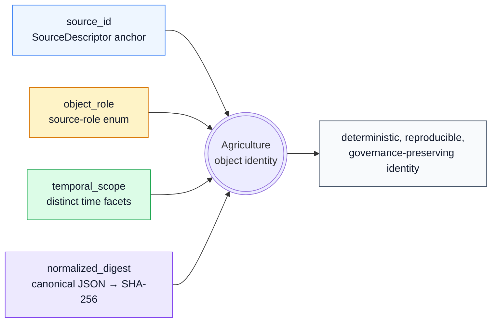
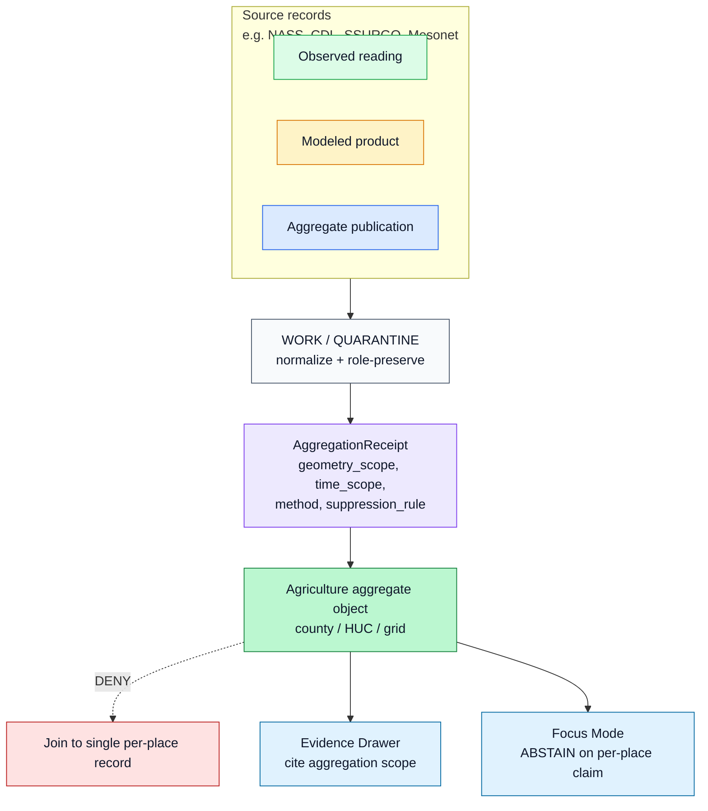
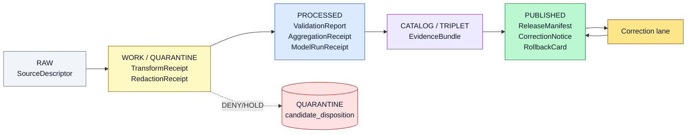

<!-- [KFM_META_BLOCK_V2]
doc_id: kfm://doc/domains/agriculture/identity-model
title: Agriculture Domain — Identity Model
type: standard
version: v1
status: draft
owners: <DOM-AG steward + Docs steward — placeholder, NEEDS VERIFICATION>
created: 2026-05-15
updated: 2026-05-15
policy_label: public
related:
  - docs/domains/agriculture/README.md
  - docs/doctrine/directory-rules.md
  - docs/doctrine/lifecycle-law.md
  - docs/doctrine/trust-membrane.md
  - docs/architecture/source-role-anti-collapse.md
  - schemas/contracts/v1/agriculture/
  - schemas/contracts/v1/source/source-descriptor.json
  - schemas/contracts/v1/receipts/
tags: [kfm, agriculture, identity, evidence, governance, source-role, lifecycle]
notes:
  - Identity rule per object family is PROPOSED deterministic basis until schemas and validators are mounted.
  - Temporal distinctness (source/observed/valid/retrieval/release/correction) is CONFIRMED doctrine.
  - All repo-shaped paths are PROPOSED until verified against mounted-repo evidence.
[/KFM_META_BLOCK_V2] -->

# Agriculture Domain — Identity Model

> How the Agriculture lane decides *what counts as the same thing* — across source, role, time, lifecycle stage, and release state — without collapsing observed evidence, modeled estimates, aggregate publications, candidates, and synthetic content into a single misleading record.

<p>
  
  
  
  
  
  
</p>

**Status:** draft · **Owners:** DOM-AG steward + Docs steward *(placeholder — NEEDS VERIFICATION)* · **Last updated:** 2026-05-15

---

## Quick jump

- [1. Scope and posture](#1-scope-and-posture)
- [2. Doctrinal basis](#2-doctrinal-basis)
- [3. The four-part identity basis](#3-the-four-part-identity-basis-proposed)
- [4. Identity by object family](#4-identity-by-object-family)
- [5. Source role as a first-class identity attribute](#5-source-role-as-a-first-class-identity-attribute)
- [6. Temporal identity](#6-temporal-identity)
- [7. Aggregation, geometry scope, and the matrix-cell rule](#7-aggregation-geometry-scope-and-the-matrix-cell-rule)
- [8. Candidate vs. canonical (the FieldCandidate case)](#8-candidate-vs-canonical-the-fieldcandidate-case)
- [9. Identity across the pipeline](#9-identity-across-the-pipeline-raw--published)
- [10. Cross-lane identity constraints](#10-cross-lane-identity-constraints)
- [11. Anti-collapse failure modes (DENY conditions)](#11-anti-collapse-failure-modes-deny-conditions)
- [12. Resolution: EvidenceRef → EvidenceBundle](#12-resolution-evidenceref--evidencebundle)
- [13. Validators, tests, fixtures (PROPOSED)](#13-validators-tests-fixtures-proposed)
- [14. API and contract surfaces (PROPOSED)](#14-api-and-contract-surfaces-proposed)
- [15. Open questions and verification backlog](#15-open-questions-and-verification-backlog)
- [Related docs](#related-docs)

---

## 1. Scope and posture

This document defines the **identity model for the Agriculture lane** of the Kansas Frontier Matrix (KFM) — how every Agriculture object is given a stable, governed identity that survives correction, promotion, and rollback without losing the distinctions that matter for trust.

**Authority of the model below — CONFIRMED doctrine.** The lifecycle, source-role anti-collapse, temporal distinctness, and trust-membrane rules that this document operationalizes are baseline KFM doctrine from the encyclopedia, the Domains Culmination Atlas, and Directory Rules.

**Authority of any specific repo-shaped claim — PROPOSED.** The repository is not mounted in this session. Schema homes, validator filenames, route names, fixture paths, CODEOWNERS, and CI wiring are PROPOSED until verified against mounted-repo evidence.

> [!IMPORTANT]
> Identity in KFM is **not** a primary key trick. Identity is a contract between source role, evidence, time, sensitivity, and release state. A change to any of those is a *new* identity, not a silent edit. Promotion does not upgrade an observation to a regulation, a model to an aggregate, or a candidate to a verified record.

[Back to top ↑](#agriculture-domain--identity-model)

---

## 2. Doctrinal basis

The Agriculture identity model is governed by, and subordinate to, these higher-authority KFM rules:

| # | Doctrinal source | What it constrains here | Status |
|---|---|---|---|
| 1 | Lifecycle invariant: `RAW → WORK/QUARANTINE → PROCESSED → CATALOG/TRIPLET → PUBLISHED` | Identity must survive every governed transition; promotion is a state change, not a file move. | **CONFIRMED** doctrine |
| 2 | Source-role anti-collapse (Atlas §24.1) | Identity preserves `observed / regulatory / modeled / aggregate / administrative / candidate / synthetic` from admission through release. | **CONFIRMED** doctrine |
| 3 | Temporal distinctness | `source / observed / valid / retrieval / release / correction` times stay distinct *where material*. | **CONFIRMED** doctrine |
| 4 | Trust-membrane rule | Public-route reads go through governed APIs; candidate records may never be published; aggregates may never be joined to a single per-place record. | **CONFIRMED** doctrine |
| 5 | DDD entity/value object distinction *(REF-DDD)* | Entities carry identity across changing attributes; value objects do not — Agriculture must classify each object family explicitly. | **CONFIRMED** principle |
| 6 | Deterministic content-addressed identity for EvidenceBundle / EvidenceRef (`spec_hash`, SHA-256, canonical JSON) | Identity at the *evidence* layer is content-addressed and reproducible across runs. | **PROPOSED** (draft ADR — `New_Ideas_5-8-26`) |
| 7 | Directory Rules §12 (Domain Placement Law) | Agriculture lives as a lane (`docs/domains/agriculture/`, `schemas/contracts/v1/agriculture/`, …), never as a root folder. | **CONFIRMED** doctrine |

[Back to top ↑](#agriculture-domain--identity-model)

---

## 3. The four-part identity basis (PROPOSED)

Across every KFM domain, the Domains Culmination Atlas records the same **PROPOSED deterministic basis** for object identity:

> **`source id` + `object role` + `temporal scope` + `normalized digest`**

Agriculture inherits this basis without modification. Each part has a specific job:



| Part | What it anchors | Why it's required | Status |
|---|---|---|---|
| **`source_id`** | The originating dataset / record / observation via `SourceDescriptor` (rights, role, authority, sensitivity, cadence, ingest hash). | Identity must trace back to an admissible source; orphan claims fail closed. | PROPOSED basis · CONFIRMED requirement |
| **`object_role`** | The KFM object-family class *plus* the source-role tag (`observed`, `aggregate`, `modeled`, …). | A CDL pixel and a NASS county total are not the same `CropObservation` even if they share location and year. Role-conflation is a DENY condition. | PROPOSED basis · CONFIRMED rule |
| **`temporal_scope`** | A bounded set of time facets material to the claim: source, observed, valid, retrieval, release, correction. | The same field can produce different observations across crop years, growing seasons, and retrieval vintages — and each must be distinguishable. | PROPOSED basis · CONFIRMED rule |
| **`normalized_digest`** | A cryptographic digest (SHA-256) over the canonical JSON serialization of meaning-bearing fields (excluding transport/runtime fields). | Eliminates ambiguity from key order, whitespace, encoding; path/location moves don't rotate identity, but semantic changes do. | PROPOSED (draft ADR) |

<details>
<summary><strong>Normalization rules referenced from the draft Evidence Identity ADR</strong> (PROPOSED — see <code>New_Ideas_5-8-26</code>; NEEDS VERIFICATION in mounted repo)</summary>

- Canonical JSON serialization: UTF-8, sorted keys, no whitespace variance.
- **Include** in the hash: `object_type`, `schema_version`, `source_refs`, `dataset_refs`, `evidence_refs`, `object_refs`, `policy_label`, `rights_status`, `sensitivity`, and any other field that changes the evidentiary meaning.
- **Exclude** from the hash: transport / runtime / transient fields (timestamps in transit, storage URLs, signatures, nonces).
- Algorithm fixed at SHA-256 for v1; migration requires an ADR and dual-hash compatibility window.
- Derived IDs (illustrative): `bundle_id = "eb-" + base32(lowercase(SHA-256(spec_hash)))[:26]`; `evidence_ref_id = "er-" + …`.
- **Status:** the draft ADR labels `tools/validators/evidence/validate_identity.py` and `schemas/evidence/spec_normalization.md` as `NEEDS_VERIFICATION`. Treat the formulas above as the proposed shape, not as proof of implementation.

</details>

[Back to top ↑](#agriculture-domain--identity-model)

---

## 4. Identity by object family

CONFIRMED doctrine / PROPOSED implementation: every Agriculture object below applies the four-part deterministic identity basis from §3, with temporal facets kept distinct where material. The DDD column (whether the object behaves as an **entity** with identity continuity or a **value object** describing characteristics) is INFERRED from the object's role; it should be confirmed in the canonical contracts under `schemas/contracts/v1/agriculture/` *(PROPOSED schema home — NEEDS VERIFICATION)*.

| Object family | Default DDD posture (INFERRED) | Identity basis (PROPOSED) | Notes on continuity |
|---|---|---|---|
| **CropObservation** | Entity | `source_id` + `observed`/`aggregate`/`modeled` role + crop year + observed time + normalized digest | Same field across years = distinct identities; same year across sources = distinct identities. |
| **FieldCandidate** | Entity (candidate-disposition) | `source_id` + `candidate` role + admission time + normalized digest | Never published until merged; see §8. |
| **CropRotation** | Entity | `source_id` + role + sequence span + normalized digest | Identity rotates when the sequence definition or window changes. |
| **YieldObservation** | Entity | `source_id` + role + crop year + observed/valid time + normalized digest | Field-level YieldObservation is private-sensitive by default; aggregate forms differ in identity from per-field forms. |
| **IrrigationLink** | Entity (relation root) | `source_id` + role + temporal scope + normalized digest of endpoints | Endpoints (water source ↔ field) are identity-affecting; sensitivity on operator side restricts public surface. |
| **ConservationPractice** | Entity | `source_id` + role + practice period + normalized digest | Per-operator detail restricted; aggregate forms public-safe. |
| **SoilCropSuitability** | Entity (model-bearing) | `source_id` + `modeled` role + parameter version + normalized digest | Requires `ModelRunReceipt`; modeled label is identity-affecting. |
| **AgriculturalEconomyObservation** | Entity | `source_id` + `observed`/`aggregate` role + period + normalized digest | Market/economy aggregates carry geometry-scope tokens in identity. |
| **SupplyChainNode** | Entity | `source_id` + role + temporal scope + normalized digest | Edges may be sensitive; public surface restricts attributes. |
| **DroughtStressIndicator** | Entity (model-bearing) | `source_id` + `modeled` role + indicator window + normalized digest | Indicator ≠ ground truth; identity carries `role_model_run_ref`. |
| **PestStressIndicator** | Entity (model-bearing) | `source_id` + `modeled` role + indicator window + normalized digest | Same constraint as DroughtStressIndicator. |
| **AggregationReceipt** | Value-bearing entity (proof object) | `source_id` chain + `aggregate` role + geometry scope + time scope + normalized digest | Anchors every aggregate publication; pins geometry-scope token to prevent matrix-cell drift. |

> [!NOTE]
> Several Agriculture objects are simultaneously **entity-shaped** (carry identity across changes) and **bear value-object components** (e.g., a `GeometryScopeValue`, a `TimeIntervalValue`, a `DigestValue`). The DDD inventory cards (KFM-P18-INV-268, KFM-P18-INV-…) flag value-object candidates including `CoordinateValue`, `TimeIntervalValue`, `DigestValue`, `CitationValue`, and `PolicyLabelValue`. Confirm classification in `contracts/agriculture/` when mounted.

[Back to top ↑](#agriculture-domain--identity-model)

---

## 5. Source role as a first-class identity attribute

CONFIRMED doctrine: KFM treats **source role** as part of identity, not metadata applied after the fact. Atlas §24.1 names this the *source-role anti-collapse rule*. The role is set at admission via `SourceDescriptor` and **preserved through every promotion** — it is never edited in place; corrections produce a new descriptor and a `CorrectionNotice`.

The PROPOSED `source_role` enum from Atlas §24.1.3 (subject to mounted-schema verification):

| Role | Definition (CONFIRMED doctrine) | Typical Agriculture example | Identity consequence |
|---|---|---|---|
| `observed` | A direct reading or first-hand record tied to a place and time. | Mesonet soil-moisture sample; NRCS SCAN reading; field-level pedon description. | May feed modeled or aggregate products; never relabeled. |
| `regulatory` | An authoritative determination by a regulatory body with legal/administrative force. | (Less common in Agriculture; appears at boundaries with NFHL or water-rights.) | Distinct identity channel; never collapsed with observed event. |
| `modeled` | A derived product with inputs, assumptions, fitted parameters; uncertainty preserved. | SoilCropSuitability raster; DroughtStressIndicator; PestStressIndicator; satellite vegetation index derived product. | Requires `role_model_run_ref` → `ModelRunReceipt`; identity carries model identity, version, parameters. |
| `aggregate` | A published summary, total, or average over a unit (county, HUC, year, decade). | USDA NASS QuickStats county totals; Crop Progress weekly aggregate; decadal climate normal joined to crop product. | Requires `role_aggregation_unit` token (county / HUC / tract / year / decade); **never joined to a single per-place record**. |
| `administrative` | A compiled record produced for registration/accounting purposes. | NRCS conservation practice rosters; farm program participation compilations *(where permitted)*. | Cited as administrative context; never collapsed with observed events. |
| `candidate` | A proposed record awaiting validation, dedup, or steward review. | Unmerged crop observation from a quarantined connector; FieldCandidate before promotion. | Identity is *legitimate* but bears `role_candidate_disposition`; no PUBLISHED edge until merged. |
| `synthetic` | Content from simulation, reconstruction, AI, or interpolation. | AI-drafted summary of a crop-progress EvidenceBundle; reconstructed historical agricultural scene. | Carries `Reality Boundary Note` and `RepresentationReceipt`; must never be presented as observed reality. |

> [!CAUTION]
> **Three identity collapses are particularly acute for Agriculture:**
> 1. Treating a USDA NASS county total as a field-level truth. → `DENY` join from aggregate cell to single record.
> 2. Treating a SoilCropSuitability raster as an observation. → `DENY` at publication; `ABSTAIN` at AI surface.
> 3. Treating an unmerged `FieldCandidate` as a published feature. → `DENY` at trust membrane; route to `QUARANTINE`.

[Back to top ↑](#agriculture-domain--identity-model)

---

## 6. Temporal identity

CONFIRMED doctrine across every KFM domain: **source, observed, valid, retrieval, release, and correction times stay distinct where material.** Agriculture inherits this requirement and adds two domain-specific temporal anchors that the encyclopedia names explicitly: **crop year** and **growing season**.

| Time facet | What it pins | Agriculture example | Identity consequence |
|---|---|---|---|
| `source_time` | When the source itself published or stamped the record. | NASS report publication date; CDL annual release date. | Two retrievals of the same CDL year share `source_time` but may differ on `retrieval_time`. |
| `observed_time` | When the phenomenon was observed in the world. | Mesonet timestamp on a soil-moisture reading; field-level scouting visit. | Required for `observed`-role objects; absence is a DENY/ABSTAIN trigger. |
| `valid_time` | The interval the claim is asserted to be valid for. | Crop year (e.g., 2024 growing season); HLS-VI compositing window. | Pins the assertion window; a record asserted for "2024" is not the same identity as "2024 revised". |
| `retrieval_time` | When KFM fetched the source. | Connector ingestion timestamp. | Distinct from source time; drift is detectable via retrieval-time deltas. |
| `release_time` | When the governed publication occurred. | `ReleaseManifest.time` for the public-safe county-aggregate layer. | Distinct from observed/valid; required for PUBLISHED records. |
| `correction_time` | When a correction was published. | `CorrectionNotice.time` invalidating a prior county-aggregate cell. | Identity is preserved across correction; the correction is a *new* receipt linked to the prior identity. |
| `crop_year` *(domain-specific)* | The annualized agricultural year used by source systems. | NASS QuickStats crop year. | Identity-affecting for `CropObservation`, `YieldObservation`, `CropRotation`. |
| `growing_season` *(domain-specific)* | The season window for the crop. | Winter wheat 2023–2024; corn 2024. | Identity-affecting for stress indicators and yield observations. |

> [!TIP]
> A claim that does not carry a material temporal facet should trigger **ABSTAIN** at validation. The trust-membrane rule is: *do not publish a crop observation whose `observed_time` and `valid_time` cannot be distinguished from `retrieval_time`*.

[Back to top ↑](#agriculture-domain--identity-model)

---

## 7. Aggregation, geometry scope, and the matrix-cell rule

CONFIRMED doctrine (Atlas §24.1.2): for Agriculture, **aggregate cited as per-place truth** is a top-tier DENY condition. Identity must encode the aggregation scope so that downstream joins, AI surfaces, and Focus Mode can refuse misapplied geometry.

PROPOSED *(per encyclopedia §7.7.D)* aggregation thresholds: public products aggregate to **county / HUC / grid** thresholds. Field-level detail is denied by default.

**Required identity surface for every aggregate-role Agriculture object:**

- `role_aggregation_unit` (geometry-scope token: `county`, `HUC`, `tract`, `grid_cell`, `year`, `decade`, …) — MUST be present when `source_role = aggregate`.
- A linked `AggregationReceipt` (see §9) containing:
  - `geometry_scope`
  - `time_scope`
  - `aggregation_method`
  - `input_source_refs`
  - `suppression_rule`
  - `output_unit`



[Back to top ↑](#agriculture-domain--identity-model)

---

## 8. Candidate vs. canonical (the FieldCandidate case)

CONFIRMED doctrine: a `candidate`-role record may carry legitimate identity in `WORK / QUARANTINE`, but **must not appear on a PUBLISHED surface** without an explicit governed promotion that resolves identity, evidence, and policy.

`FieldCandidate` is the Agriculture lane's canonical example:

| State | `role_candidate_disposition` | Identity stable? | Surfaces it may appear on |
|---|---|---|---|
| Admitted from connector | `pending` | Yes — has source_id + role + temporal + digest | Steward review queue only |
| Reviewed and accepted | `merged` | Yes — and may now carry a canonical identity link | Eligible for promotion to canonical Agriculture object |
| Rejected | `rejected` | Yes — preserved for audit | Audit views only |
| Held in quarantine | `quarantined` | Yes — but never promoted as-is | QUARANTINE views only |

> [!WARNING]
> Identity is preserved across promotion, but **role does not auto-upgrade**. A `FieldCandidate` becoming a published `CropObservation` is a governed state transition with its own `ReviewRecord`, `PolicyDecision`, and (if applicable) `RedactionReceipt` — not a silent rename.

[Back to top ↑](#agriculture-domain--identity-model)

---

## 9. Identity across the pipeline (RAW → PUBLISHED)

CONFIRMED doctrine / PROPOSED lane application: Agriculture follows the KFM lifecycle invariant. At each phase, identity is **preserved** (not minted anew) and accompanied by phase-appropriate receipts.

| Phase | What identity carries | Receipts referenced (PROPOSED shape) | Gate |
|---|---|---|---|
| **RAW** | `source_id`, `source_role`, rights, sensitivity, citation, ingest hash, source time. | `SourceDescriptor` exists. | SourceDescriptor admitted. |
| **WORK / QUARANTINE** | Above + normalized schema, geometry, time, candidate disposition, redactions in progress. | `TransformReceipt`, `RedactionReceipt`, `PolicyDecision`, `ValidationReport` (running). | Validation & policy gates pass, or quarantine reason recorded. |
| **PROCESSED** | Above + normalized digest computed; `EvidenceRef` resolves; public-safe candidates emitted. | `ValidationReport` (closed), `AggregationReceipt` (if applicable), `ModelRunReceipt` (if modeled). | `EvidenceRef` + digest closure. |
| **CATALOG / TRIPLET** | Above + catalog record, `EvidenceBundle`, graph/triplet projections, release candidate. | `EvidenceBundle`, catalog closure. | Catalog/proof closure passes. |
| **PUBLISHED** | Above + release identity link, rollback target, correction path. | `ReleaseManifest`, `CorrectionNotice` (post-publication), `RollbackCard`. | ReleaseManifest + review/policy state + rollback target. |



> [!NOTE]
> **Promotion is a governed state transition, not a file move.** A record moving from `data/processed/agriculture/` to `data/catalog/domain/agriculture/` *(PROPOSED paths per Directory Rules §12)* without the matching `EvidenceBundle`, `ValidationReport`, and `ReviewRecord` is a lifecycle skip — the watcher-as-non-publisher invariant forbids it.

[Back to top ↑](#agriculture-domain--identity-model)

---

## 10. Cross-lane identity constraints

CONFIRMED / PROPOSED: Agriculture relates to four other lanes. Identity-bearing joins must preserve ownership, source role, sensitivity, and `EvidenceBundle` support on **both sides** of the relation.

| Related lane | Relation | Identity-bearing fields involved | Constraint |
|---|---|---|---|
| **Soil** | MUKEY joins and suitability support. | Soil MUKEY (canonical in Soil lane); Agriculture suitability identity carries the MUKEY reference, not the soil unit semantics. | Soil owns canonical soil map-unit and horizon semantics; Agriculture cites them, does not author them. |
| **Hydrology** | Irrigation, drought, water-use context. | Water-source identifiers; HUC scope tokens. | Hydrology owns water observations and flood context; Agriculture's `IrrigationLink` references but does not redefine them. |
| **Atmosphere / Air** | Weather, heat, smoke, vegetation stress. | Station IDs; gridded product run receipts. | Identity of stress indicators preserves the upstream Air model identity. |
| **People / Land** | Farm/operator and parcel-sensitive contexts remain **restricted**. | Operator identifiers; parcel geometry. | People/Land owns ownership, title, parcels, and living-person privacy. Agriculture **never** publishes farm/operator detail without review. |

> [!CAUTION]
> Joining Agriculture identity to People/Land identity on operator or parcel keys is **deny-by-default** at the trust membrane. Aggregate Agriculture × People/Land cross-tabs require an `AggregationReceipt` with explicit suppression rules.

[Back to top ↑](#agriculture-domain--identity-model)

---

## 11. Anti-collapse failure modes (DENY conditions)

CONFIRMED doctrine — Agriculture-relevant rows from Atlas §24.1.2:

| Collapse pattern | Denied outcome | Required guardrail |
|---|---|---|
| Modeled product (SoilCropSuitability, stress indicator) labeled or queried as observed. | `DENY` at publication; `ABSTAIN` at AI surface. | `ModelRunReceipt` + uncertainty surface + role-preserving DTO field. |
| Aggregate (NASS county total, decadal normal) cited as a per-place truth. | `DENY` join from aggregate cell to single record; `ABSTAIN` at AI. | `AggregationReceipt`; geometry-scope guard; matrix-cell semantics. |
| Candidate record exposed on a public surface. | `DENY` at trust membrane; route to `QUARANTINE`. | Promotion gate; no `PUBLISHED` edge from `WORK / QUARANTINE`. |
| Synthetic content (AI summary of a crop bundle; reconstructed scene) presented as observed reality. | `DENY` publication; `HOLD` for steward review; `ABSTAIN` at AI. | `Reality Boundary Note`; `RepresentationReceipt`; UI badge. |
| AI text treated as evidence on a Focus Mode surface. | `DENY` publication; `ABSTAIN`; `AIReceipt` mandatory. | Cite-or-abstain rule; release state required. |
| Field-level NASS / private farm data published without review. | `DENY` publication. | Policy denial test for field-level NASS claims; rights validator. |

[Back to top ↑](#agriculture-domain--identity-model)

---

## 12. Resolution: EvidenceRef → EvidenceBundle

PROPOSED — adapted from the draft Evidence Identity ADR *(`New_Ideas_5-8-26`; NEEDS VERIFICATION in mounted repo)*. The resolution path applies uniformly across domains; Agriculture is no exception.

1. Read `evidence_ref.spec_hash`.
2. Look up the bundle whose `spec_hash` equals the ref's hash in the governed catalog/index.
3. Verify that the looked-up `bundle.bundle_id` recomputes from the same `spec_hash`. If not, **DENY**.
4. Verify policy / sensitivity / release state appropriate to the requesting surface; on failure, **ABSTAIN** or **DENY** per gate posture.

```text
EvidenceRef                EvidenceBundle
┌───────────────┐          ┌───────────────────────────────┐
│ spec_hash     │──lookup──▶│ spec_hash (must match)        │
│ (SHA-256 over │          │ bundle_id = "eb-" + base32(…) │
│  canonical    │          │ source_refs[], dataset_refs[] │
│  normalized   │          │ object_refs[], evidence_refs[]│
│  spec)        │          │ policy_label, rights, sensit. │
└───────────────┘          └───────────────────────────────┘
        │                                │
        └────── recompute bundle_id ─────┘
                          │
                          ▼
          ANSWER  /  ABSTAIN  /  DENY  /  ERROR
```

| Failure mode | Outcome | Reason code (PROPOSED) |
|---|---|---|
| Missing bundle (lookup miss). | ABSTAIN (validator) → DENY (policy) for publication. | `ResolutionError.missing_bundle` |
| `ref.spec_hash` ≠ `bundle.spec_hash`. | DENY. | `ResolutionError.hash_mismatch` |
| Non-deterministic serialization yields different bytes for same logical spec. | ERROR. | `NormalizationError.nondeterministic_serialization` |
| Unsupported / unknown fields with meaning excluded from hash. | DENY. | `NormalizationError.field_exclusion_violation` |
| Hash algorithm tag drift. | DENY. | `HashAlgoUnsupported` |

[Back to top ↑](#agriculture-domain--identity-model)

---

## 13. Validators, tests, fixtures (PROPOSED)

PROPOSED — the encyclopedia §7.7.K and the Atlas Agriculture chapter list the following validator families. **No mounted-repo evidence in this session confirms presence.** Treat each as a target, not a state.

- SSURGO / SDA lineage tests.
- Soil-moisture unit / depth / QC tests.
- Crop-progress aggregate-only tests.
- Vegetation-index mask/time tests.
- Policy denial for field-level NASS claims.
- Catalog closure tests.
- Identity-specific tests (adapted from the draft Evidence Identity ADR):
  - **T1 — Round-trip determinism** across language runtimes (TS/Python/Go) yields identical hex for `spec_hash` and identical derived IDs.
  - **T2 — Whitespace / key-order irrelevance** in canonical normalization.
  - **T3 — Semantic change rotates hash** (e.g., changing `rights_status` rotates `spec_hash` and IDs).
  - **T4 — Resolution happy path** (ref → bundle match → recomputed ID match → `ANSWER`).
  - **T5 — Missing bundle** → `ABSTAIN`/`DENY`.
  - **T6 — Hash mismatch** → `DENY`.
  - **T7 — Cross-run stability** across machines/containers.
  - **T8 — Algo tag enforcement** → non-SHA-256 inputs DENY.

[Back to top ↑](#agriculture-domain--identity-model)

---

## 14. API and contract surfaces (PROPOSED)

PROPOSED — Atlas §9.J and §24.13 indicate the following surfaces. **Exact route names, DTO field names, and schema paths are NEEDS VERIFICATION** against mounted-repo evidence.

| Endpoint / artifact | DTO / schema | Finite outcomes | Status |
|---|---|---|---|
| Agriculture feature/detail resolver (route TBD). | `AgricultureDecisionEnvelope` | `ANSWER / ABSTAIN / DENY / ERROR` | PROPOSED governed API surface; route UNKNOWN. |
| Agriculture layer manifest resolver. | `LayerManifest` / domain layer descriptor | `ANSWER / DENY / ERROR` | PROPOSED; public-safe release only. |
| Agriculture Evidence Drawer payload. | `EvidenceDrawerPayload` + `EvidenceBundle` projection | `ANSWER / ABSTAIN / DENY / ERROR` | PROPOSED; evidence and policy filtered. |
| Agriculture Focus Mode answer. | `RuntimeResponseEnvelope` + `AIReceipt` | `ANSWER / ABSTAIN / DENY / ERROR` | PROPOSED; AI never root truth. |
| Schema responsibility root. | `schemas/contracts/v1/agriculture/` *(PROPOSED home per Directory Rules §7.4 / Atlas §24.13)* | finite validator outcomes | PROPOSED — verify against ADR-0001 and mounted repo. |

[Back to top ↑](#agriculture-domain--identity-model)

---

## 15. Open questions and verification backlog

| Item | Evidence that would settle it | Status |
|---|---|---|
| Confirm `schemas/contracts/v1/agriculture/` as canonical schema home for Agriculture identity-bearing types. | Mounted repo; ADR-0001 confirmation; existing schema files. | NEEDS VERIFICATION |
| Confirm `source_role` enum field names and shape in mounted `SourceDescriptor`. | Mounted `schemas/contracts/v1/source/source-descriptor.json`. | NEEDS VERIFICATION |
| Confirm `AggregationReceipt` field shape (`geometry_scope`, `time_scope`, `aggregation_method`, `suppression_rule`, …). | Mounted `schemas/contracts/v1/receipts/`. | NEEDS VERIFICATION |
| Confirm Evidence Identity ADR adoption (`spec_hash` algorithm, ID derivation, `tools/validators/evidence/validate_identity.py`). | Accepted ADR; mounted validator; CI gates. | NEEDS VERIFICATION |
| Confirm policy denial for field-level NASS claims is implemented. | Mounted `policy/domains/agriculture/`; passing policy-deny test. | NEEDS VERIFICATION |
| Confirm aggregation-only test for crop-progress publication exists and passes. | Mounted `tests/domains/agriculture/`; CI run record. | NEEDS VERIFICATION |
| Confirm DDD entity vs value-object classification per Agriculture object family. | Mounted `contracts/agriculture/`; per-object semantic Markdown. | NEEDS VERIFICATION |
| Decide whether `FieldCandidate` carries a separate identity space from canonical Agriculture object families or a shared one with `candidate_disposition`. | ADR or `contracts/agriculture/FieldCandidate.md`. | OPEN |
| Confirm cross-lane join policy enforcement with People/Land for operator/parcel keys. | Mounted policy test + Focus Mode regression. | NEEDS VERIFICATION |
| Confirm CODEOWNERS for `docs/domains/agriculture/`. | Mounted `.github/CODEOWNERS` or `CODEOWNERS`. | NEEDS VERIFICATION |

[Back to top ↑](#agriculture-domain--identity-model)

---

## Related docs

- [`docs/domains/agriculture/README.md`](./README.md) *(PROPOSED — domain landing page; existence NEEDS VERIFICATION)*
- [`docs/domains/agriculture/SENSITIVITY.md`](./SENSITIVITY.md) *(PROPOSED — sensitivity & publication posture)*
- [`docs/domains/agriculture/SOURCES.md`](./SOURCES.md) *(PROPOSED — source families, roles, freshness)*
- [`docs/doctrine/directory-rules.md`](../../doctrine/directory-rules.md) — Directory Rules §12 Domain Placement Law.
- [`docs/doctrine/lifecycle-law.md`](../../doctrine/lifecycle-law.md) — RAW → PUBLISHED governance.
- [`docs/doctrine/trust-membrane.md`](../../doctrine/trust-membrane.md) — public-route discipline.
- [`docs/architecture/source-role-anti-collapse.md`](../../architecture/source-role-anti-collapse.md) *(PROPOSED — derived from Atlas §24.1)*
- [`docs/architecture/evidence-identity.md`](../../architecture/evidence-identity.md) *(PROPOSED — ADR/whitepaper for `spec_hash`, normalization, resolution)*

---

## Appendix A — Identity-bearing receipt families (collapsed reference)

<details>
<summary><strong>Receipts that carry or constrain Agriculture identity</strong> (PROPOSED shape — verify against mounted <code>schemas/contracts/v1/receipts/</code>)</summary>

| Receipt | Purpose | Agriculture trigger | Required content (PROPOSED) |
|---|---|---|---|
| `SourceDescriptor` | Records source identity, rights, role, sensitivity, cadence at admission. Anchors every downstream receipt. | Every Agriculture source admission (NASS, CDL, SSURGO, Mesonet, SCAN, …). | `source_id`, `source_role`, `authority`, `rights`, `sensitivity`, `cadence`, ingest hash, time, citation. |
| `TransformReceipt` | Records a spatial or attribute transform applied to a feature. | Geometry normalization; CRS reprojection; generalization for public-safe maps. | `input_geom_hash`, `output_geom_hash`, `transform`, `parameters`, `tolerance`, timestamp, actor. |
| `RedactionReceipt` | Records a public-safe transformation that removed/masked/fuzzed/withheld content. | Field-level NASS suppression; operator-attribute redaction. | `policy_ref`, `redaction_method`, `kept_fields`, `removed_fields`, geometry transform, reviewer. |
| `AggregationReceipt` | Records an aggregation step and pins geometry scope. | County crop-progress; HUC water-use aggregate; decadal climate normal joined to crop product. | `geometry_scope`, `time_scope`, `aggregation_method`, `input_source_refs`, `suppression_rule`, `output_unit`. |
| `ModelRunReceipt` | Records a modeled output: model identity, version, inputs, parameters, uncertainty, validation. | SoilCropSuitability raster; DroughtStressIndicator; PestStressIndicator. | `model_id`, `model_version`, `inputs[]`, `parameters`, `run_time`, `uncertainty_surface_ref`, `validation_ref`. |
| `ValidationReport` | Records the outcome of a validator run. | Every WORK→PROCESSED and PROCESSED→CATALOG transition. | `validator_id`, `target`, `passes[]`, `failures[]`, time, deterministic inputs. |
| `EvidenceBundle` | The resolved evidentiary container — source list, excerpts, provenance, policy/review/release state. | Required for every Agriculture claim that surfaces in the Evidence Drawer or Focus Mode. | Per draft Evidence Identity ADR: `spec_hash`, refs, policy_label, rights_status, sensitivity. |
| `ReviewRecord` | Records a steward / rights-holder / policy review of a candidate transition. | Promotion of `FieldCandidate` → canonical; release approval of sensitive aggregate. | `reviewer`, `role`, decision (`ALLOW / RESTRICT / DENY / HOLD`), `evidence_refs[]`, `policy_ref`, time. |
| `PolicyDecision` | Records a policy evaluation: which rule, against which object, with which outcome. | Every governed gate touching Agriculture. | `policy_id`, `target_object`, `decision`, `reason_code`, time, `evidence_refs[]`. |
| `ReleaseManifest` | Records the contents, version, signatures, and rollback target for a release. | Every PUBLISHED Agriculture layer / dataset / report. | `release_id`, `contents[]`, digests, `evidence_refs[]`, `rollback_target`, time. |
| `CorrectionNotice` | Records that a published claim was corrected. | Republished county aggregate; revised crop-year roll-up. | `claim_ref`, `prior_release_ref`, `change_summary`, `invalidates[]`, `review_ref`, time. |
| `RollbackCard` | Records a rollback decision. | Failed release; correction-driven retraction. | `release_id`, `rollback_to`, reason, `invalidates[]`, `review_ref`, time. |
| `AIReceipt` | Records a governed AI answer; mandatory at Focus Mode. | Any AI-drafted summary of an Agriculture EvidenceBundle. | `prompt_scope`, `evidence_refs[]`, `policy_ref`, outcome, `reason_code`, `model_id`, time. |
| `RealityBoundaryNote` | Public-facing statement that a carrier is synthetic / reconstructed. | Reconstructed historical agricultural scene; AI-drafted text. | `scope`, `method_summary`, `evidence_refs[]`, `visibility`. |

</details>

## Appendix B — Source-role enum (collapsed reference)

<details>
<summary><strong>Full <code>source_role</code> descriptor surface</strong> (PROPOSED — Atlas §24.1.3; NEEDS VERIFICATION in mounted <code>schemas/contracts/v1/source/source-descriptor.json</code>)</summary>

| Field | Type / vocabulary | Required? | Notes |
|---|---|---|---|
| `source_role` | enum: `observed` \| `regulatory` \| `modeled` \| `aggregate` \| `administrative` \| `candidate` \| `synthetic` | MUST | Set at admission. Never edited in place; corrections produce a new descriptor and a `CorrectionNotice`. |
| `role_authority` | string (issuing body / model identity / steward) | MUST when role ∈ `{regulatory, modeled, aggregate}` | Disambiguates the authoring authority for downstream cite text. |
| `role_aggregation_unit` | geometry-scope token (`county`, `HUC`, `tract`, `year`, `decade`, …) | MUST when `source_role = aggregate` | Prevents geometry-scope drift on join. |
| `role_model_run_ref` | `EvidenceRef` → `ModelRunReceipt` | MUST when `source_role = modeled` | Pins inputs, parameters, version. |
| `role_synthetic_basis` | structured: `{ method, inputs, reality_boundary_note_ref }` | MUST when `source_role = synthetic` | Records what is and is not real in the carrier. |
| `role_candidate_disposition` | enum: `pending` \| `merged` \| `rejected` \| `quarantined` | MUST when `source_role = candidate` | Tracks promotion state; `PUBLISHED` edge forbidden until merged. |

</details>

---

**Related:** [`README.md`](./README.md) · [`SENSITIVITY.md`](./SENSITIVITY.md) · [`SOURCES.md`](./SOURCES.md) · [Directory Rules](../../doctrine/directory-rules.md) · [Source-Role Anti-Collapse](../../architecture/source-role-anti-collapse.md)

**Last updated:** 2026-05-15 · [Back to top ↑](#agriculture-domain--identity-model)
