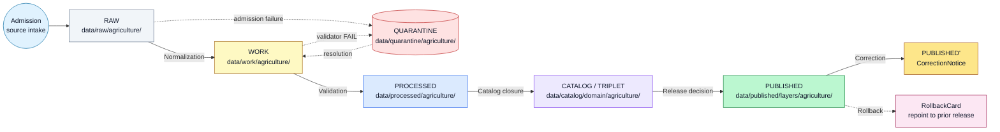
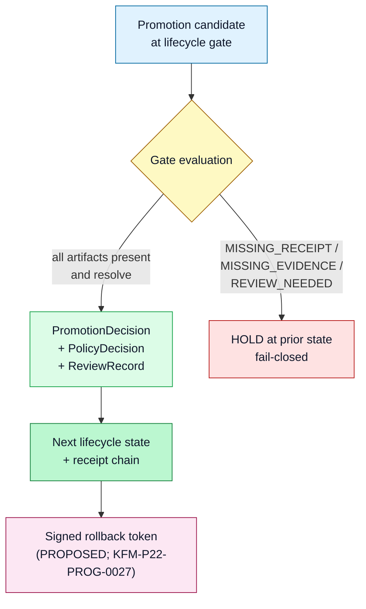

<!-- [KFM_META_BLOCK_V2]
doc_id: kfm://doc/domains/agriculture/lifecycle
title: Agriculture Domain — Lifecycle
type: standard
version: v1
status: draft
owners: <DOM-AG steward + Docs steward — placeholder, NEEDS VERIFICATION>
created: 2026-05-26
updated: 2026-05-26
policy_label: public
related:
  - docs/doctrine/ai-build-operating-contract.md
  - docs/doctrine/directory-rules.md
  - docs/doctrine/lifecycle-law.md
  - docs/doctrine/trust-membrane.md
  - docs/domains/agriculture/README.md
  - docs/domains/agriculture/FILE_SYSTEM_PLAN.md
  - docs/domains/agriculture/IDENTITY_MODEL.md
  - docs/domains/agriculture/SENSITIVITY.md
  - docs/domains/agriculture/SOURCES.md
  - schemas/contracts/v1/domains/agriculture/
  - schemas/contracts/v1/receipts/
  - policy/domains/agriculture/
tags: [kfm, agriculture, lifecycle, governance, promotion, correction, rollback, RAW-to-PUBLISHED]
notes:
  - Pinned to ai-build-operating-contract.md v3.0; CONTRACT_VERSION = "3.0.0".
  - Lifecycle invariant RAW → WORK / QUARANTINE → PROCESSED → CATALOG / TRIPLET → PUBLISHED is CONFIRMED doctrine.
  - Promotion is a governed state transition; never a file move.
  - All concrete paths are PROPOSED until verified against mounted-repo evidence.
  - Sensitive-domain disposition derives from operating contract §23.2; AI-authored changes require GENERATED_RECEIPT.json per §34.
[/KFM_META_BLOCK_V2] -->

# Agriculture Domain — Lifecycle

> How the Agriculture lane moves source material from admission to public release — through `RAW → WORK / QUARANTINE → PROCESSED → CATALOG / TRIPLET → PUBLISHED` — with promotion as a **governed state transition**, not a file move. Corrections, supersession, and rollback are first-class outcomes.

  
  
  
  
  
  
  
  
  

**Status:** draft · **Owners:** DOM-AG steward + Docs steward *(placeholder — NEEDS VERIFICATION)* · **Last updated:** 2026-05-26 · **Contract version:** `CONTRACT_VERSION = "3.0.0"`

---

## Quick jump

- [1. Scope and posture](#1-scope-and-posture)
- [2. The lifecycle invariant](#2-the-lifecycle-invariant)
- [3. Phase walk-through](#3-phase-walk-through-agriculture-specifics)
  - [3.1 RAW](#31-raw)
  - [3.2 WORK / QUARANTINE](#32-work--quarantine)
  - [3.3 PROCESSED](#33-processed)
  - [3.4 CATALOG / TRIPLET](#34-catalog--triplet)
  - [3.5 PUBLISHED](#35-published)
- [4. Promotion as a governed state transition](#4-promotion-as-a-governed-state-transition)
- [5. Corrections and supersession](#5-corrections-and-supersession-published--published)
- [6. Rollback](#6-rollback-published--prior-release)
- [7. Universal closure rules](#7-universal-closure-rules)
- [8. Gate failures — reason codes](#8-gate-failures--reason-codes)
- [9. Trust-membrane discipline](#9-trust-membrane-discipline)
- [10. Sensitivity & rights overlay](#10-sensitivity--rights-overlay)
- [11. Receipt families anchoring each phase](#11-receipt-families-anchoring-each-phase)
- [12. AI surfaces and the lifecycle](#12-ai-surfaces-and-the-lifecycle)
- [13. Validators, tests, fixtures (PROPOSED)](#13-validators-tests-fixtures-proposed)
- [14. Verification backlog](#14-verification-backlog)
- [15. Conformance language](#15-conformance-language)
- [16. Open questions register](#16-open-questions-register)
- [17. Changelog](#17-changelog)
- [18. Definition of done](#18-definition-of-done)
- [Related docs](#related-docs)
- [Appendix A — Worked Agriculture lifecycle examples](#appendix-a--worked-agriculture-lifecycle-examples-illustrative)

---

## 1. Scope and posture

This document defines **how Agriculture data moves through the KFM governed lifecycle** — from admission of a source payload, through normalization and validation, to catalog closure and finally to public release. It is the operational counterpart to the placement map in [`FILE_SYSTEM_PLAN.md`](./FILE_SYSTEM_PLAN.md) and the identity model in [`IDENTITY_MODEL.md`](./IDENTITY_MODEL.md). It does not define field shapes (`schemas/`), object meanings (`contracts/`), or admissibility rules (`policy/`); it defines the **governed state transitions** those artifacts gate.

**Authority of the model below — CONFIRMED doctrine.**

1. `ai-build-operating-contract.md` v3.0 §1 (Operating Law), §8 (truth labels), §10 (invariants), §11 (placement), §13 (repository preflight), §23.2 (sensitive-domain matrix), §34 (`GENERATED_RECEIPT`), §37 (versioning). `CONTRACT_VERSION = "3.0.0"` is pinned by this document and MUST appear on every `GENERATED_RECEIPT.json` produced for changes to this lane.
2. Directory Rules §3–§4 (responsibility roots + placement protocol), §9.1 (`data/` lifecycle), §12 (Domain Placement Law), §15 (per-root README contract).
3. Domains Culmination Atlas v1.1 §9.H (Agriculture pipeline shape), §9.I (sensitivity), §9.M (publication / correction / rollback), §24.6 (Master Pipeline Gate Reference), §24.9 (failure-mode register).
4. KFM Encyclopedia §7.7 (Agriculture identity, sources, sensitivity).

**Authority of any specific repo-shaped claim — PROPOSED.** The repository is not mounted in this session. Schema homes, validator filenames, route names, fixture paths, CODEOWNERS, and CI wiring are PROPOSED until verified against mounted-repo evidence.

> [!IMPORTANT]
> **Promotion is a governed state transition, not a file move.** A path-level move that bypasses validators, policy gates, `EvidenceBundle` creation, catalog closure, and release-decision recording violates the lifecycle invariant **regardless of where the bytes ended up**. Watchers and connectors emit candidates and receipts; they MUST NOT publish.

> [!NOTE]
> **Repository preflight (per operating contract §13).** Every concrete path, schema name, route name, validator filename, and CI wiring claim below is `PROPOSED` until inspected against actual repository evidence. External research is **not** a substitute for mounted-repo evidence on KFM-specific repo-state claims (operating contract §12). Reviewers MUST run the Directory Rules §16 path-validation checklist before treating any path here as canonical.

[Back to top ↑](#agriculture-domain--lifecycle)

---

## 2. The lifecycle invariant

CONFIRMED doctrine — the KFM lifecycle invariant is:

> **`RAW → WORK / QUARANTINE → PROCESSED → CATALOG / TRIPLET → PUBLISHED`**

Agriculture follows this invariant uniformly (Atlas §9.H). Corrections re-publish through the same gates; rollback repoints the current release to a prior `ReleaseManifest`.

> [!TIP]
> **Reading note.** Each arrow is a *gate*, not a folder move. The gate has a pre-condition, requires named artifacts, and has a failure-closed outcome (next section onward). Bytes may live in a directory before their state has been promoted; the lifecycle state is carried by the catalog and the release manifest, not by the path.

[Back to top ↑](#agriculture-domain--lifecycle)

---

## 3. Phase walk-through (Agriculture specifics)

### 3.1 RAW

**Purpose.** Capture immutable source payload or reference with `source_id`, `source_role`, rights, sensitivity, citation, time, and hash. No public client EVER reads from RAW.

| Aspect | Detail |
|---|---|
| **PROPOSED path** | `data/raw/agriculture/<source_id>/<run_id>/` |
| **Required artifact at entry** | `SourceDescriptor` (role, authority, rights, sensitivity, cadence); payload hash. |
| **Pre-condition for admission** | Source identity and rights minimally established at discovery; source-role intent is set at admission and never edited in place. |
| **Failure-closed outcome** | Source not admitted; logged as candidate awaiting steward review. |
| **Agriculture sources typically landing here** | USDA NASS (CDL, QuickStats, Crop Progress); NRCS (Conservation Practice, SSURGO/Soil Data Access, SCAN); NASA SMAP; NASA HLS / HLS-VI; NOAA USCRN; Kansas Mesonet. |
| **Watcher posture** | Connectors and watchers MAY emit candidate events and `RunReceipt` records. They MUST NOT publish, mutate canonical truth, or skip phases. |

> [!CAUTION]
> **Source-role anti-collapse rule.** A USDA NASS county total admitted as `aggregate` MUST NOT be relabeled `observed` downstream. A SoilCropSuitability product admitted as `modeled` MUST NOT be presented as `observed`. Role is set at admission and survives every promotion; corrections produce a new `SourceDescriptor` and a `CorrectionNotice`, never an in-place edit.

### 3.2 WORK / QUARANTINE

**Purpose.** Normalize schema, geometry, time, identity, evidence, rights, and policy; hold failures.

| Aspect | Detail |
|---|---|
| **PROPOSED path (WORK)** | `data/work/agriculture/<run_id>/` |
| **PROPOSED path (QUARANTINE)** | `data/quarantine/agriculture/<reason>/<run_id>/` |
| **Required artifacts** | `TransformReceipt`; working `ValidationReport`; `PolicyDecision`. `RedactionReceipt` when sensitivity transforms applied. |
| **Pre-condition for WORK→PROCESSED gate** | Schema, geometry, time, identity, evidence, rights, and policy rules are runnable. |
| **Failure-closed outcome** | Move to QUARANTINE with a recorded reason. NEVER silently promotes. |
| **Agriculture-specific failure paths** | Field-level NASS attempt → `policy_deny`; missing aggregation receipt for an aggregate-role object → `aggregation_missing`; unresolved Mesonet rights → `rights_unknown`. |

> [!WARNING]
> A record may move from WORK to QUARANTINE many times before it advances. QUARANTINE is a **first-class resting state**, not a discard pile. Quarantine reasons are auditable and tracked in the registry.

### 3.3 PROCESSED

**Purpose.** Emit validated, normalized objects plus the receipts and public-safe candidates the next phase will close on.

| Aspect | Detail |
|---|---|
| **PROPOSED path** | `data/processed/agriculture/<dataset_id>/<version>/` |
| **Required artifacts** | `ValidationReport` (closed); `RedactionReceipt` if sensitivity applies; `AggregationReceipt` if aggregation applies; `ModelRunReceipt` if `source_role = modeled`. |
| **Pre-condition for PROCESSED→CATALOG gate** | `EvidenceRef` resolves; `ValidationReport` passes; `normalized_digest` closure exists. |
| **Failure-closed outcome** | Stay in WORK; structured FAIL outcome; no catalog edge. |
| **Agriculture-specific gates** | Field-level NASS publication remains **DENY by default** even at PROCESSED. Public surfaces consume only county / HUC / grid aggregates. `AggregationReceipt` is mandatory for every aggregate-role object. |

### 3.4 CATALOG / TRIPLET

**Purpose.** Emit catalog records, `EvidenceBundle`, graph / triplet projections, and release candidates.

| Aspect | Detail |
|---|---|
| **PROPOSED path (CATALOG)** | `data/catalog/domain/agriculture/` |
| **PROPOSED path (TRIPLET)** | `data/triplets/graph_deltas/`, `data/triplets/exports/` *(cross-cutting; not domain-segmented)* |
| **Required artifacts** | `CatalogMatrix` entry; `EvidenceBundle`; graph / triplet projections (where applicable). |
| **Pre-condition for CATALOG→PUBLISHED gate** | Catalog / proof closure passes; every `EvidenceRef` resolves to its `EvidenceBundle`. |
| **Failure-closed outcome** | HOLD at PROCESSED; structured FAIL outcome; no public edge. |
| **Closure rule** | A transition is closed only when (i) the required artifacts exist, (ii) every required artifact *resolves* (not merely references) the artifacts it depends on, and (iii) the policy gate evaluated and recorded its decision. |

### 3.5 PUBLISHED

**Purpose.** Serve released public-safe artifacts through governed APIs, layer manifests, and PMTiles / GeoParquet / API payloads.

| Aspect | Detail |
|---|---|
| **PROPOSED paths** | `data/published/layers/agriculture/`, `data/published/api_payloads/...`, `data/published/pmtiles/...`, `data/published/geoparquet/...` |
| **Required artifacts** | `ReleaseManifest`; rollback target; correction path; `ReviewRecord` (where required). |
| **Pre-condition for release** | Review state where required; release authority distinct from the original author when materiality applies. |
| **Failure-closed outcome** | HOLD at CATALOG; no public surface change. |
| **Public-surface posture for Agriculture** | Aggregates and public-safe products only. Field-level / operator / parcel-sensitive detail remains restricted (operating contract §23.2 row family; see §10). |

> [!IMPORTANT]
> PUBLISHED is the **only** state from which the governed API may emit `ANSWER`. Public clients, normal UI surfaces, and released AI surfaces MUST NOT reach RAW, WORK, QUARANTINE, canonical / internal stores, graph internals, vector indexes, source APIs, or direct model runtimes.

[Back to top ↑](#agriculture-domain--lifecycle)

---

## 4. Promotion as a governed state transition

CONFIRMED doctrine (`KFM-P1-IDEA-0056`): promotion is a **reviewed, receipt-emitting state transition**, not a file move and not a UI action. Every promotion produces a record that can be inspected, refused, or rolled back later.

**Required posture for every Agriculture promotion (PROPOSED minimum):**

- A `PromotionDecision` records candidate identity, gate results, the consulted `PolicyDecision`, the receipt digest, and the promotion status.
- A `ReviewRecord` is produced where review materiality applies — including all releases of sensitive-aggregate products, all sensitive cross-lane joins (operator / parcel), and any AI-authored Markdown or schema landing in this lane.
- A rollback target — typically a signed rollback token or `RollbackCard` repointing the current release alias to a prior verified `spec_hash` — is identified **before** PUBLISHED.

> [!NOTE]
> Per operating contract §33, separation-of-duties applies when materiality justifies it. The release authority for a sensitive Agriculture aggregate SHOULD differ from the original author.

[Back to top ↑](#agriculture-domain--lifecycle)

---

## 5. Corrections and supersession (PUBLISHED → PUBLISHED')

CONFIRMED doctrine: a published Agriculture claim is **never silently edited**. Detected errors and new evidence produce a `CorrectionNotice` and either a `ReleaseManifest` update or a supersession entry. Downstream derivatives that depend on the prior claim are listed and invalidated explicitly.

| Aspect | Detail |
|---|---|
| **Pre-condition** | Detected error or new evidence; downstream derivatives identified. |
| **Required artifacts** | `CorrectionNotice`; `ReviewRecord`; invalidation list; `ReleaseManifest` update **or** supersession entry. |
| **Failure-closed outcome** | Stale-state announcement; no silent edit. |
| **Agriculture-specific examples** | Republished county aggregate after NASS revision; corrected `SoilCropSuitability` raster after a fitted-parameter update; revised crop-year roll-up after a CDL re-release. |

> [!CAUTION]
> A correction MAY demote a published claim from public visibility back into a restricted tier (e.g., when new sensitivity evidence emerges). Per operating contract §23.2, **downgrade requires only a `CorrectionNotice` + `ReviewRecord`** — no transform receipt — because downgrade strictly reduces public exposure.

A **superseded correction proof** (`KFM-P23-PROG-0027`): the older release card is **retained**, not deleted; the supersession appendix records the prior `release_id`, the replacing `release_id`, and the reason. Lineage is preserved.

[Back to top ↑](#agriculture-domain--lifecycle)

---

## 6. Rollback (PUBLISHED → prior release)

CONFIRMED doctrine: a release MAY be rolled back to a verified prior `ReleaseManifest`. Rollback is itself a `PromotionDecision` with negative direction (operating contract §36.7), accompanied by a `RollbackCard` that records reason, target, and invalidated derivatives.

| Aspect | Detail |
|---|---|
| **Pre-condition** | Failed release, post-publication failure, or correction-driven retraction; targeted prior release identified. |
| **Required artifacts** | `RollbackCard`; `CorrectionNotice`; `ReleaseManifest` reverts to prior release; downstream derivative invalidation list. |
| **Failure-closed outcome** | Held at current state until rollback validated. |
| **PROPOSED path for rollback artifacts** | `data/rollback/agriculture/<release_id>/` + canonical `release/rollback_cards/...` |
| **Signed rollback token (PROPOSED — `KFM-P22-PROG-0027`)** | Each promotion SHOULD produce a signed rollback token that can repoint the current alias to a verified prior `spec_hash` and write a new revert receipt. Tied to the Evidence Identity ADR; status NEEDS VERIFICATION. |

[Back to top ↑](#agriculture-domain--lifecycle)

---

## 7. Universal closure rules

CONFIRMED doctrine (Atlas §24.6.2). Every lifecycle gate in this lane MUST satisfy all three rules below. The closure rule applies uniformly across Agriculture phases — no gate is exempt.

1. **Artifact existence.** Every required artifact for the gate exists.
2. **Resolution closure.** Every required artifact *resolves* — not merely references — the artifacts it depends on:
   - `EvidenceRef → EvidenceBundle`
   - `source_id → SourceDescriptor`
   - `model_id → ModelRunReceipt`
3. **Policy gate recorded.** The policy gate evaluated and recorded its decision (a `PolicyDecision` exists, with reason code).

If any one of (1)–(3) is missing, the transition **fails closed** and the prior state is preserved. Bytes do not move; the catalog does not record a closure; the release manifest does not advance.

> [!IMPORTANT]
> Closure is **not** a happy-path concept. A validator that only proves the success case is incomplete (Directory Rules §7.5 negative-state rule). Agriculture validators MUST exercise DENY / ABSTAIN / ERROR paths and emit reason codes on failure.

[Back to top ↑](#agriculture-domain--lifecycle)

---

## 8. Gate failures — reason codes

PROPOSED catalog (Atlas §24.6.3). Failures produce a structured reason code; the Agriculture lane reuses the universal catalog and adds Agriculture-specific patterns it inherits from the source-role and aggregation rules.

| Failure family | Reason code (PROPOSED) | Gate(s) where it fires | Recovery path |
|---|---|---|---|
| Missing required artifact | `MISSING_RECEIPT`, `MISSING_EVIDENCE`, `MISSING_REVIEW` | Normalization / Validation / Catalog / Release | Re-emit missing receipt; re-run review; re-validate. |
| Schema / contract mismatch | `SCHEMA_MISMATCH`, `CONTRACT_DRIFT` | Normalization / Validation | Schema fix and/or ADR; re-run validator. |
| Rights / sensitivity unresolved | `RIGHTS_UNKNOWN`, `SENSITIVITY_UNRESOLVED` | Admission / Validation / Catalog / Release | Steward review; rights resolution; tier reassignment. |
| Source-role collapse risk | `ROLE_COLLAPSE`, `ROLE_DOWNCAST_FORBIDDEN` | Validation / Catalog / Release | Restore source role; refuse upcast. |
| Review state inadequate | `REVIEW_NEEDED`, `REVIEW_INSUFFICIENT`, `REVIEW_REJECTED` | Catalog / Release | Run required review; supply `ReviewRecord`. |
| Release infrastructure error | `RELEASE_MANIFEST_INVALID`, `ROLLBACK_TARGET_MISSING` | Release | Manifest fix; supply rollback target. |
| **Agriculture-specific** | `AGG_RECEIPT_MISSING` *(aggregate-role object without `AggregationReceipt`)* | Validation / Catalog | Emit `AggregationReceipt` with geometry scope and suppression rule. |
| **Agriculture-specific** | `FIELD_LEVEL_PUBLISH_DENY` *(NASS field-level publication attempt)* | Validation / Catalog / Release | Aggregate to county / HUC / grid; emit `AggregationReceipt`. |
| **Agriculture-specific** | `MODEL_RUN_RECEIPT_MISSING` *(modeled-role object without `ModelRunReceipt`)* | Validation / Catalog | Emit `ModelRunReceipt` with model identity, parameters, uncertainty. |
| **Operating contract §34** | `GENERATED_RECEIPT_MISSING` *(AI-authored artifact merged without receipt)* | CI / Release | PR includes a well-formed `GENERATED_RECEIPT.json` with `human_review.state == approved`. |

[Back to top ↑](#agriculture-domain--lifecycle)

---

## 9. Trust-membrane discipline

CONFIRMED doctrine (Atlas §24.9.2). The **trust membrane** is the rule that public surfaces never reach internal lifecycle stores. For Agriculture:

| Anti-pattern | Denied outcome | Counter-rule |
|---|---|---|
| Public client reads `RAW` / `WORK` / `QUARANTINE`. | Trust membrane bypassed; promotion gates skipped. | DENY at governed API; layer manifest resolver MUST refuse non-PUBLISHED. |
| Map shell consumes canonical / internal store directly. | Renderer becomes the public surface and inherits no governance. | DENY at MapLibre shell wiring; layer registry references only PUBLISHED. |
| AI returns uncited language about an Agriculture claim. | Generated text substitutes for evidence; cite-or-abstain rule broken. | Focus Mode MUST `ABSTAIN` or `DENY`; `AIReceipt` mandatory. |
| Watcher publishes a record on a successful change-detect event. | Watcher-as-publisher invariant violated. | Watchers emit candidates and `RunReceipt` only; promotion requires a separate governed gate. |
| Artifact directory holds release manifests. | `artifacts/` collapses build output, process memory, and trust-bearing records. | Release manifests live under `release/manifests/`; receipts under `data/receipts/`; proofs under `data/proofs/` (Directory Rules §8.2, §13.2). |

> [!WARNING]
> The watcher-as-non-publisher invariant is non-negotiable for this lane. A connector or scheduled job MAY say *"something changed"* and emit a `RunReceipt`; it CANNOT make a public release true by itself.

[Back to top ↑](#agriculture-domain--lifecycle)

---

## 10. Sensitivity & rights overlay

CONFIRMED doctrine (Atlas §9.I + operating contract §23.2). Agriculture publishes **aggregates and public-safe products, not field/operator truth**. Farm/operator private data, proprietary yield, pesticide records, and private-sensitive joins **fail closed**.

> [!CAUTION]
> **Sensitive-domain disposition (operating contract §23.2).** Agriculture matches the §23.2 row family covering *private-sensitive joins, operator/farm identity, and exact field geometry*. The most restrictive applicable disposition applies: **DENY public exact exposure**, **GENERALIZE before publication** (county / HUC / grid), **REDACT** where applicable, **QUARANTINE** uncertain source material, **REQUIRE** steward review, **REQUIRE** transform receipt (`AggregationReceipt` or `RedactionReceipt`), **ABSTAIN** when support is inadequate. Exact field coordinates, operator identity, and restricted-source-derived joins MUST NOT appear on a public surface absent steward clearance and a published `RedactionReceipt`.

**Lifecycle-relevant default-deny conditions** (block public promotion regardless of phase):

- Unclear rights.
- Unresolved source role.
- Missing or unresolvable `EvidenceRef → EvidenceBundle`.
- Unresolved sensitivity classification.
- Absent or revoked release state.
- Unreviewed exact sensitive Agriculture locations or private data.

**Tier transitions for Agriculture (Atlas §24.5).** Tier upgrades (toward more public) always need both a transform receipt *and* a review record. Tier downgrades (toward less public) need only a `CorrectionNotice` — downgrade strictly reduces public exposure.

[Back to top ↑](#agriculture-domain--lifecycle)

---

## 11. Receipt families anchoring each phase

PROPOSED shape — verify against mounted `schemas/contracts/v1/receipts/`. The receipt-to-phase mapping below is CONFIRMED doctrine (Atlas §24.2.2); the concrete schema layout is `NEEDS VERIFICATION`.

| Receipt | RAW | WORK / QUARANTINE | PROCESSED | CATALOG / TRIPLET | PUBLISHED |
|---|:---:|:---:|:---:|:---:|:---:|
| `SourceDescriptor` | ● | ● | ● | ● | ● |
| `TransformReceipt` |   | ● | ● | ● |   |
| `RedactionReceipt` |   | ● | ● | ● | ● |
| `AggregationReceipt` |   | ● | ● | ● | ● |
| `ModelRunReceipt` |   | ● | ● | ● | ● |
| `RepresentationReceipt` |   |   | ● | ● | ● |
| `AIReceipt` |   |   |   |   | ● *(Focus Mode only)* |
| `ReviewRecord` |   | ● | ● | ● | ● |
| `PolicyDecision` | ● | ● | ● | ● | ● |
| `ValidationReport` |   | ● | ● | ● |   |
| `EvidenceBundle` |   |   | ● | ● | ● |
| `PromotionDecision` |   | ● | ● | ● | ● |
| `ReleaseManifest` |   |   |   |   | ● |
| `CorrectionNotice` |   |   |   |   | ● *(post-release)* |
| `RollbackCard` |   |   |   |   | ● *(rollback)* |
| `GENERATED_RECEIPT.json` *(operating contract §34)* | per artifact, when AI-authored | per artifact | per artifact | per artifact | per artifact |

> [!NOTE]
> A dot means the receipt is normally emitted, amended, or referenced at that phase. Receipts created earlier remain *referenced* (not duplicated) at later phases via `EvidenceRef`.

[Back to top ↑](#agriculture-domain--lifecycle)

---

## 12. AI surfaces and the lifecycle

CONFIRMED doctrine: AI is interpretive, not the root truth source (operating contract §1, §19). For Agriculture:

| AI behavior | Lifecycle phase | Required posture |
|---|---|---|
| Summarize a released Agriculture `EvidenceBundle`. | PUBLISHED only. | `AIReceipt` mandatory; cite-or-abstain. |
| Compare two released aggregates. | PUBLISHED only. | Both bundles resolved; `RuntimeResponseEnvelope` returns `ANSWER` / `ABSTAIN` / `DENY` / `ERROR`. Optional `NARROWED` / `BOUNDED` when evidence is partial. |
| Draft a steward-review note. | Any phase, internal only. | Receipt produced; not published. |
| Answer a Focus Mode question whose evidence is field-level NASS. | n/a — pre-policy. | `DENY` with reason. |
| Answer a Focus Mode question whose evidence is stale. | PUBLISHED with `SOURCE_STALE` flag. | `ABSTAIN` or `NARROWED`, per gate posture. |
| Author a schema, contract, policy, validator, or doc landing in this lane. | n/a — authoring. | `GENERATED_RECEIPT.json` required per operating contract §34. CI MUST DENY merge if missing. |

> [!IMPORTANT]
> **AI-authored changes to this lane require a `GENERATED_RECEIPT.json`** (operating contract §34). The receipt MUST pin `CONTRACT_VERSION = "3.0.0"` and reference artifact paths, model identity, inputs, validation gates, and human-review state. A receipt with `human_review.state == "pending"` is well-formed but **not mergeable** until state transitions to `approved` or an `override_record` is populated.

[Back to top ↑](#agriculture-domain--lifecycle)

---

## 13. Validators, tests, fixtures (PROPOSED)

PROPOSED — from Atlas §9.K plus lifecycle-specific gates added here. **No mounted-repo evidence in this session confirms presence.** Treat each as a target, not a state.

Agriculture-specific lifecycle validators:

- SSURGO / SDA lineage tests (source-role preservation across normalization).
- Soil-moisture unit / depth / QC tests (PROCESSED gate).
- Crop-progress aggregate-only tests (CATALOG / RELEASE gate).
- Vegetation-index mask / time tests (PROCESSED gate).
- Policy denial for field-level NASS claims (`FIELD_LEVEL_PUBLISH_DENY` reason code).
- Catalog closure tests (`EvidenceRef` → `EvidenceBundle` resolution).

Cross-cutting lifecycle validators that Agriculture exercises:

- `MISSING_RECEIPT` / `MISSING_EVIDENCE` / `MISSING_REVIEW` enforcement at every gate.
- `ROLE_COLLAPSE` / `ROLE_DOWNCAST_FORBIDDEN` enforcement (source-role preservation).
- `AGG_RECEIPT_MISSING` (aggregate-role object without `AggregationReceipt`).
- `MODEL_RUN_RECEIPT_MISSING` (modeled-role object without `ModelRunReceipt`).
- `RELEASE_MANIFEST_INVALID` / `ROLLBACK_TARGET_MISSING` at release gate.
- `GENERATED_RECEIPT_MISSING` at CI gate for AI-authored artifacts (operating contract §34.4).
- Rollback drill: restore prior `ReleaseManifest`; invalidate listed derivatives.
- Correction round-trip: prior release retained as `LINEAGE`; supersession entry recorded.

> [!NOTE]
> Reusable lifecycle validators (e.g., generic `AggregationReceipt` closure, generic gate closure) belong under `tools/validators/<topic>/`, not `tools/validators/domains/agriculture/` (Directory Rules §12). CI MUST invoke the canonical validator orchestrator (Directory Rules §7.5 / OPEN-DR-03); individual validators MUST NOT be wired directly.

[Back to top ↑](#agriculture-domain--lifecycle)

---

## 14. Verification backlog

Items that block promotion of this document from `draft` to `published` until resolved by mounted-repo inspection or steward decision.

| # | Item to verify | Evidence that would settle it | Status |
|---|---|---|---|
| L-01 | Existence and shape of `data/raw/agriculture/<source_id>/<run_id>/` in the live repo. | Mounted-repo `ls`; existing source descriptors. | NEEDS VERIFICATION |
| L-02 | Existence and shape of `data/work/` / `data/quarantine/` / `data/processed/` / `data/catalog/domain/` / `data/published/layers/` for `agriculture/`. | Mounted repo. | NEEDS VERIFICATION |
| L-03 | Whether `data/registry/sources/agriculture/<source>.yaml` (domain-segmented) or `data/registry/sources/<source-id>/` (source-keyed) is canonical. | Mounted repo + ADR. | CONFLICTED → ADR |
| L-04 | Whether `data/triplets/` (plural) or `data/triplet/` (singular) is canonical. | ADR. | CONFLICTED → ADR |
| L-05 | Concrete county / HUC / grid aggregation thresholds for public Agriculture surfaces. | `policy/domains/agriculture/aggregation_thresholds.*`. | UNKNOWN |
| L-06 | `PromotionDecision` schema and field shape. | Mounted `schemas/contracts/v1/receipts/promotion_decision.schema.json`. | NEEDS VERIFICATION |
| L-07 | `AggregationReceipt` schema and field shape (`geometry_scope`, `time_scope`, `aggregation_method`, `input_source_refs`, `suppression_rule`, `output_unit`). | Mounted `schemas/contracts/v1/receipts/`. | NEEDS VERIFICATION |
| L-08 | Signed rollback token spec (KFM-P22-PROG-0027) and adoption status. | Evidence Identity ADR + mounted `release/rollback_cards/...`. | NEEDS VERIFICATION |
| L-09 | CI wiring that fails on missing `GENERATED_RECEIPT.json` for AI-authored Agriculture artifacts. | Mounted workflow + a passing/failing receipt fixture. | NEEDS VERIFICATION |
| L-10 | Validator orchestrator entrypoint (`tools/validate_all.py` vs `tools/validators/validate_all.py`) — ties to Directory Rules OPEN-DR-03. | Mounted repo + ADR. | CONFLICTED → ADR |
| L-11 | `RuntimeResponseEnvelope` shape including optional `NARROWED` / `BOUNDED` extensions. | Mounted `schemas/contracts/v1/runtime/`. | NEEDS VERIFICATION |
| L-12 | `SOURCE_STALE` posture rules for specific Agriculture sources (NASS late-release; Mesonet sensor drift). | Freshness policy under `policy/domains/agriculture/`. | UNKNOWN |

[Back to top ↑](#agriculture-domain--lifecycle)

---

## 15. Conformance language

This document uses **RFC 2119 / RFC 8174** conformance language, consistent with `directory-rules.md` §2.2 and `ai-build-operating-contract.md` §5.1.1:

- **MUST / MUST NOT** — non-negotiable. Output that violates a MUST does not satisfy this lifecycle absent an approved ADR.
- **SHOULD / SHOULD NOT** — strong default. Deviation requires a brief justification in the PR body and a drift register entry.
- **MAY** — permitted; no justification required; stay consistent within the lane.

Truth labels used in this document follow `ai-build-operating-contract.md` §8: `CONFIRMED`, `PROPOSED`, `UNKNOWN`, `NEEDS VERIFICATION`, `INFERRED`, `CONFLICTED`, `LINEAGE`, `EXPLORATORY`, `EXTERNAL`. Runtime outcomes (`ANSWER`, `ABSTAIN`, `DENY`, `ERROR`, `NARROWED`, `BOUNDED`, `SOURCE_STALE`) appear only in `RuntimeResponseEnvelope`, `PolicyDecision`, `AIReceipt`, and audit-log records — never as rhetorical hedging in authoring prose.

[Back to top ↑](#agriculture-domain--lifecycle)

---

## 16. Open questions register

Questions that require an ADR or steward decision (distinct from §14, which is settleable by mounted-repo inspection).

| ID | Question | Owner role | Resolution path |
|---|---|---|---|
| OQ-AG-LC-01 | What concrete county / HUC / grid aggregation thresholds apply on the public Agriculture surface? | Agriculture domain steward + Policy steward | `policy/domains/agriculture/aggregation_thresholds.*`. |
| OQ-AG-LC-02 | Is `PromotionDecision` a domain-local receipt class, or a cross-cutting class under `schemas/contracts/v1/receipts/`? Ties to Atlas ADR-S-03. | Schemas steward + Architecture steward | ADR-S-03 acceptance. |
| OQ-AG-LC-03 | Are signed rollback tokens (KFM-P22-PROG-0027) the canonical rollback artifact, or are they an enhancement layered on `RollbackCard`? | Architecture steward + Release steward | Evidence Identity ADR + signing ADR. |
| OQ-AG-LC-04 | Does Agriculture adopt the DSSE / in-toto promotion statement schema (KFM-P22-PROG-0023) for promotion attestations? | Security steward + Architecture steward | Promotion-attestation ADR. |
| OQ-AG-LC-05 | What policy applies when Focus Mode AI summarizes an Agriculture `EvidenceBundle` whose `SOURCE_STALE` flag is set? | AI surface steward + Policy steward | AI-surface ADR. |
| OQ-AG-LC-06 | Are operator / parcel joins ever permitted on a public surface under an `AggregationReceipt` with explicit suppression? | Policy steward + Rights steward + People/Land steward | Cross-lane policy ADR; ties to operating contract §23.2 interpretation. |
| OQ-AG-LC-07 | Does PROCESSED → CATALOG closure require *both* a `ValidationReport` pass *and* a `PolicyDecision`, or is the policy decision implicit in the validator's policy-gate hook? | Validation steward + Policy steward | Validator-orchestrator ADR; ties to Directory Rules OPEN-DR-03. |
| OQ-AG-LC-08 | What is the canonical correction-superseded retention policy for Agriculture releases (preserve all, prune by age, archive externally)? | Release steward + Docs steward | Retention ADR. |
| OQ-AG-LC-09 | Does this document itself require a `GENERATED_RECEIPT.json` at merge, and what does it list as artifacts? | Docs steward | Operating contract §34.2(1) interpretation; see Section 2 of the change PR. |
| OQ-AG-LC-10 | Where do Agriculture rollback drills live as fixtures — `fixtures/domains/agriculture/rollback/` or a cross-cutting `fixtures/rollback/`? | Tests steward | Mounted-repo inspection + ADR if currently inconsistent. |

[Back to top ↑](#agriculture-domain--lifecycle)

---

## 17. Changelog

| Version | Date | Change | Type (per contract §37) | Reason |
|---|---|---|---|---|
| v1 (draft) | 2026-05-26 | Initial draft of the Agriculture lifecycle: phase-by-phase walk-through; promotion as governed state transition; corrections, supersession, rollback; universal closure rules; gate-failure reason codes (universal + Agriculture-specific); trust-membrane discipline; sensitivity overlay aligned to operating contract §23.2; receipt-to-phase mapping; AI surfaces; validators / tests / fixtures backlog. Includes Open questions register, Verification backlog, Conformance language, and Definition of done. Pinned to `ai-build-operating-contract.md` v3.0; `CONTRACT_VERSION = "3.0.0"`. | new | First articulation of lifecycle operationalization for the Agriculture lane; companion to `FILE_SYSTEM_PLAN.md` and `IDENTITY_MODEL.md`. |

> **Backward compatibility.** This is the inaugural edition; no prior anchors exist. Anchor stability MUST be preserved on any v1.x edit.

[Back to top ↑](#agriculture-domain--lifecycle)

---

## 18. Definition of done

This document is done enough to enter the repository when:

- it is placed at `docs/domains/agriculture/LIFECYCLE.md` per Directory Rules §6.1 and §12;
- the Agriculture domain steward and the Docs steward both review it;
- it is linked from `docs/domains/agriculture/README.md`, from `docs/domains/agriculture/FILE_SYSTEM_PLAN.md` (Related docs), and from `docs/domains/agriculture/IDENTITY_MODEL.md` (Related docs);
- it does not conflict with accepted ADRs (in particular ADR-0001 schema-home; any future Atlas ADR-S-03 receipt-class-home resolution; any future Evidence Identity / signing ADR);
- any conflict with current repo conventions is logged in `docs/registers/DRIFT_REGISTER.md`;
- the §14 verification items are each either resolved or carried forward to `docs/registers/VERIFICATION_BACKLOG.md` with an owner;
- the §16 open questions are each tracked against an ADR or steward decision;
- the `GENERATED_RECEIPT.json` planned in the change PR is wired into CI and references `CONTRACT_VERSION = "3.0.0"`;
- future changes follow the operating contract §37 lifecycle (MAJOR for operating-law or receipt-schema changes; MINOR for elaboration or gap closure; PATCH for typos and link repair).

[Back to top ↑](#agriculture-domain--lifecycle)

---

## Related docs

- [`docs/doctrine/ai-build-operating-contract.md`](../../doctrine/ai-build-operating-contract.md) — **CONFIRMED** canonical operating contract pinned at `CONTRACT_VERSION = "3.0.0"`. NEEDS VERIFICATION on relative path.
- [`docs/doctrine/directory-rules.md`](../../doctrine/directory-rules.md) — Canonical placement and lifecycle doctrine. NEEDS VERIFICATION on relative path.
- [`docs/doctrine/lifecycle-law.md`](../../doctrine/lifecycle-law.md) — RAW → PUBLISHED governance. PROPOSED.
- [`docs/doctrine/trust-membrane.md`](../../doctrine/trust-membrane.md) — Public-route discipline. PROPOSED.
- [`docs/domains/agriculture/README.md`](./README.md) — Domain landing. **TODO** PROPOSED.
- [`docs/domains/agriculture/FILE_SYSTEM_PLAN.md`](./FILE_SYSTEM_PLAN.md) — Companion placement map for the Agriculture lane.
- [`docs/domains/agriculture/IDENTITY_MODEL.md`](./IDENTITY_MODEL.md) — Companion identity model for Agriculture objects.
- [`docs/domains/agriculture/SENSITIVITY.md`](./SENSITIVITY.md) — Sensitivity & publication posture. **TODO** PROPOSED.
- [`docs/domains/agriculture/SOURCES.md`](./SOURCES.md) — Source families, roles, freshness. **TODO** PROPOSED.
- [`docs/registers/DRIFT_REGISTER.md`](../../registers/DRIFT_REGISTER.md) — Drift entries for any deviation from this lifecycle. NEEDS VERIFICATION.

---

## Appendix A — Worked Agriculture lifecycle examples (illustrative)

> The two flows below are **illustrative**, not implementation. They use the doctrine above to show how a typical source admission and a typical correction move through the gates. Every concrete path is PROPOSED.

<strong>Example A — USDA NASS QuickStats county aggregate (illustrative happy path)</strong>

1. **Admission.** Connector `connectors/usda-nass/` fetches QuickStats county-aggregate payload. Connector emits a `RunReceipt` and lands the payload at `data/raw/agriculture/usda-nass/<run_id>/` with a `SourceDescriptor` setting `source_role = aggregate`, `role_aggregation_unit = county`, `rights = NEEDS VERIFICATION`. **Gate passes.**
2. **Normalization (RAW → WORK).** Schema / time / geometry normalized; `TransformReceipt` emitted; `PolicyDecision` records `RIGHTS_UNKNOWN` if rights remain unresolved → move to QUARANTINE with reason. Otherwise move to `data/work/agriculture/<run_id>/`.
3. **Validation (WORK → PROCESSED).** Validators run: aggregate-only test passes (no field-level claim); SSURGO/SDA lineage test n/a; `AggregationReceipt` emitted with `geometry_scope = county`, `time_scope = crop_year`, `aggregation_method = nass_published_total`, `suppression_rule = nass_suppression_codes`. `ValidationReport` closes pass.
4. **Catalog closure (PROCESSED → CATALOG / TRIPLET).** `EvidenceBundle` resolved; `CatalogMatrix` entry recorded; release candidate emitted.
5. **Release (CATALOG → PUBLISHED).** `PromotionDecision` recorded; `ReviewRecord` produced (sensitive lane); `ReleaseManifest` written under `release/manifests/...`; `RollbackCard` target identified. Public layer lands at `data/published/layers/agriculture/...`.
6. **AI surface.** Focus Mode MAY summarize this `EvidenceBundle`; `AIReceipt` mandatory; `RuntimeResponseEnvelope` returns `ANSWER` with cited bundle; **DENY** any per-place claim joining this aggregate to a single field.

<strong>Example B — NASS revision triggers a correction (illustrative)</strong>

1. **Detection.** Connector or watcher detects a NASS revision for the prior crop-year aggregate; emits a candidate-change event and `RunReceipt`. **No publish.**
2. **Re-admission.** New `SourceDescriptor` with new `source_id`/`run_id`; prior descriptor retained as `LINEAGE`.
3. **Re-flow.** New payload progresses through RAW → WORK → PROCESSED → CATALOG with its own validation / aggregation receipts.
4. **Correction (PUBLISHED → PUBLISHED').** `CorrectionNotice` records: `claim_ref` (prior release), `prior_release_ref`, `change_summary` (NASS revision), `invalidates[]` (list of downstream layers / API payloads / Focus Mode answers depending on the prior). `ReviewRecord` records the steward decision.
5. **Release update or supersession.** Either the `ReleaseManifest` is updated (in place by version) or a supersession entry is recorded pointing forward to the new release. Prior release card is **retained**, not deleted.
6. **Rollback option.** If the correction itself is found to be in error post-publication, the `RollbackCard` repoints the current alias to the prior verified `spec_hash`; downstream derivatives are re-invalidated and a new `CorrectionNotice` chains the lineage.

---

**Related:** [`README.md`](./README.md) · [`FILE_SYSTEM_PLAN.md`](./FILE_SYSTEM_PLAN.md) · [`IDENTITY_MODEL.md`](./IDENTITY_MODEL.md) · [`SENSITIVITY.md`](./SENSITIVITY.md) · [`SOURCES.md`](./SOURCES.md) · [AI Build Operating Contract](../../doctrine/ai-build-operating-contract.md) · [Directory Rules](../../doctrine/directory-rules.md)

**Last updated:** 2026-05-26 · **Version:** v1 (draft) · **Contract version:** `CONTRACT_VERSION = "3.0.0"` · [Back to top ↑](#agriculture-domain--lifecycle)
