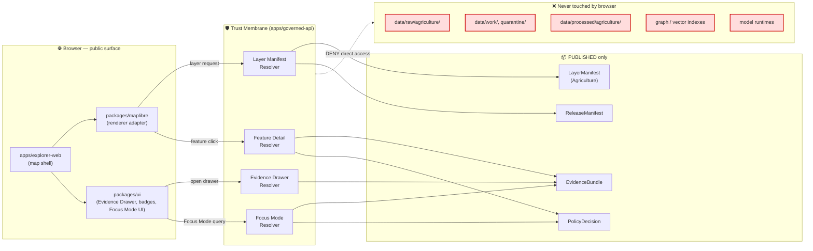
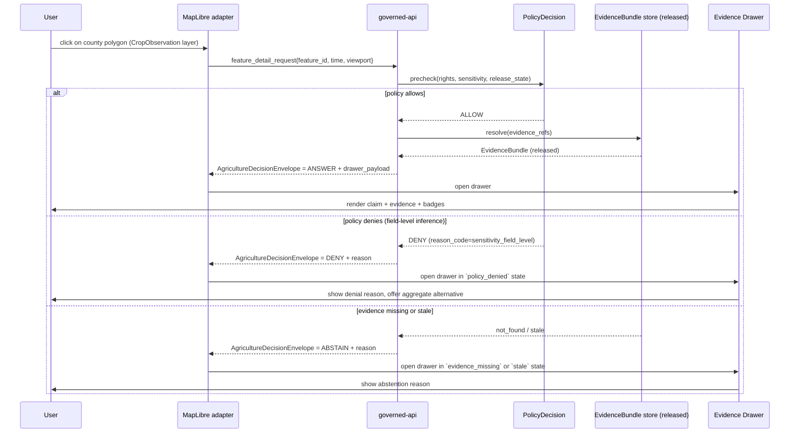
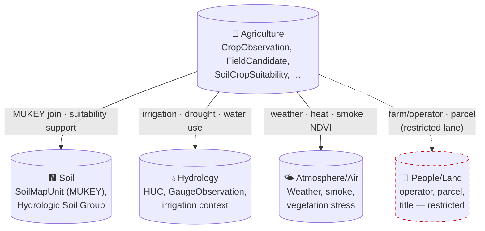

<!-- [KFM_META_BLOCK_V2]
doc_id: kfm://doc/agriculture/map-ui-contracts
title: Agriculture — Map & UI Contracts
type: standard
version: v1
status: draft
owners: TODO (agriculture-domain-steward, ui-architecture-steward)
created: 2026-05-15
updated: 2026-05-15
policy_label: public
related:
  - docs/domains/agriculture/README.md
  - docs/domains/agriculture/POLICY.md
  - docs/architecture/ui/README.md
  - docs/architecture/governed-api.md
  - docs/architecture/map-shell.md
  - docs/doctrine/trust-membrane.md
  - docs/doctrine/lifecycle-law.md
  - contracts/OBJECT_MAP.md
  - schemas/contracts/v1/domains/agriculture/
  - schemas/contracts/v1/layers/
  - schemas/contracts/v1/ui/evidence_drawer_payload.schema.json
  - schemas/contracts/v1/runtime/decision_envelope.schema.json
tags: [kfm, agriculture, ui, maplibre, governed-api, evidence-drawer, focus-mode]
notes:
  - All paths in this document are PROPOSED until verified against mounted-repo evidence.
  - Agriculture map products are aggregate-only by default; field-level joins fail closed.
[/KFM_META_BLOCK_V2] -->

# 🌾 Agriculture — Map & UI Contracts

*The contract between the Agriculture domain and KFM's map shell, Evidence Drawer, trust badges, and Focus Mode — what the UI may show, must deny, and how every claim resolves to evidence.*


> **Status:** draft · **Owners:** `agriculture-domain-steward`, `ui-architecture-steward` *(TODO — confirm CODEOWNERS)* · **Last updated:** 2026-05-15

---

## Mini-TOC

1. [Scope](#1-scope)
2. [Repo fit](#2-repo-fit)
3. [Doctrine in one diagram](#3-doctrine-in-one-diagram)
4. [Surface inventory](#4-surface-inventory)
5. [Public-safety defaults](#5-public-safety-defaults)
6. [DTO & schema home](#6-dto--schema-home)
7. [Finite outcomes per surface](#7-finite-outcomes-per-surface)
8. [Evidence Drawer payload — Agriculture profile](#8-evidence-drawer-payload--agriculture-profile)
9. [Trust-visible state](#9-trust-visible-state)
10. [Focus Mode for Agriculture](#10-focus-mode-for-agriculture)
11. [Cross-lane relations on the map](#11-cross-lane-relations-on-the-map)
12. [Anti-patterns](#12-anti-patterns)
13. [Validators & tests](#13-validators--tests)
14. [Verification backlog](#14-verification-backlog)
15. [Related docs](#15-related-docs)

---

## 1. Scope

**CONFIRMED doctrine.** This document defines the *map and UI contract* for the Agriculture domain: every governed surface that a public client (the MapLibre shell, the Evidence Drawer, the time slider, Focus Mode, the layer catalog) may consume when rendering Agriculture content, and the trust obligations each surface inherits.

It does **not** define:

- The semantic meaning of Agriculture object families — that lives in `contracts/domains/agriculture/` *(PROPOSED path)*.
- Field-level JSON shape — that lives in `schemas/contracts/v1/domains/agriculture/` *(PROPOSED path, per ADR-0001)*.
- Admissibility, rights, or sensitivity policy — that lives in `policy/domains/agriculture/` *(PROPOSED path)*.
- Pipeline mechanics for RAW → PUBLISHED promotion — that lives in `pipelines/domains/agriculture/` and `pipeline_specs/agriculture/` *(PROPOSED paths)*.

This is the **interface seam** between domain truth and the user-facing renderer.

> [!IMPORTANT]
> **All paths cited below are PROPOSED.** No mounted repository was inspected in this session. The Atlas dossier (`[DOM-AG]`), the Encyclopedia (`[ENCY]`), the Whole-UI Expansion Report (`[UIAI-WHOLE]`), the MapLibre Operating Manual (`[UIAI-MAP]`), and Directory Rules (`[DIRRULES]`) establish doctrine; repository implementation maturity is **UNKNOWN** until verified.

[↑ Back to top](#mini-toc)

---

## 2. Repo fit

| Aspect | Value | Status |
|---|---|---|
| Home | `docs/domains/agriculture/MAP_UI_CONTRACTS.md` | **PROPOSED** *(per Directory Rules §12, Domain Placement Law)* |
| Authority root | `docs/` (explains; does not decide alone) | CONFIRMED doctrine |
| Sibling docs (same lane) | `README.md`, `SOURCES.md`, `POLICY.md`, `LIFECYCLE.md`, `OBJECTS.md` | **PROPOSED** *(typical KFM domain doc family)* |
| Upstream authority | `docs/architecture/map-shell.md`, `docs/architecture/governed-api.md`, `docs/doctrine/trust-membrane.md` | **PROPOSED** *(canonical architecture homes per Directory Rules §6.1)* |
| Downstream consumers | `apps/explorer-web/`, `packages/maplibre/`, `packages/ui/`, `apps/governed-api/` | **PROPOSED** *(per Directory Rules §13.3 canonical UI shell)* |
| Schema home | `schemas/contracts/v1/` | **CONFIRMED** doctrine per ADR-0001 *(schema-home rule)* |

[↑ Back to top](#mini-toc)

---

## 3. Doctrine in one diagram

**CONFIRMED doctrine.** Agriculture map UI sits behind the trust membrane: the browser **never** reaches RAW, WORK, QUARANTINE, canonical stores, graph stores, model runtimes, or unpublished candidates. Every render-time claim resolves through `apps/governed-api/` to released `EvidenceBundle` content.



**Reading the diagram:** The arrow from `MapLibre adapter` to `Layer Manifest Resolver` represents a governed API call returning a versioned `LayerManifest` for an *already-released* Agriculture layer. The dashed line is the deny-by-default boundary: any path that would let the browser bypass the membrane is a §13 anti-pattern per Directory Rules.

[↑ Back to top](#mini-toc)

---

## 4. Surface inventory

**CONFIRMED dossier / PROPOSED implementation.** The Agriculture domain exposes the following map-facing surfaces. Exact routes are **UNKNOWN** until verified against `apps/governed-api/` and any OpenAPI contract.

| # | Surface | Purpose | DTO / Envelope | Status |
|---|---|---|---|---|
| 1 | Agriculture layer-manifest resolver | Return `LayerManifest` for a published Agriculture layer | `LayerManifest` | **PROPOSED**; public-safe only |
| 2 | Agriculture layer-catalog item | List-level discovery + trust-badge inputs | `LayerCatalogItem` | **PROPOSED** |
| 3 | Agriculture feature/detail resolver | Resolve a clicked feature to its evidence-backed payload | `AgricultureDecisionEnvelope` | **PROPOSED**; exact route **UNKNOWN** |
| 4 | Agriculture Evidence Drawer payload | Drawer payload for a clicked feature, layer, or claim | `EvidenceDrawerPayload` + `EvidenceBundle` projection | **PROPOSED** |
| 5 | Agriculture Focus Mode answer | Evidence-bounded synthesis over released Agriculture content | `RuntimeResponseEnvelope` + `AIReceipt` | **PROPOSED**; AI is never root truth |
| 6 | Agriculture time-slider state | Filter by valid / observed / source / release time, with stale badges | `MapContextEnvelope` (time fields) | **PROPOSED** |
| 7 | Agriculture correction surface | Submit correction notice against a published Agriculture artifact | `CorrectionNoticeCandidate` | **PROPOSED** |

> [!NOTE]
> Surfaces 1–3 are the **mandatory** map-shell path for any released Agriculture layer. Surfaces 4–7 are required where the layer participates in click-resolution, AI synthesis, time-aware playback, or public correction respectively.

[↑ Back to top](#mini-toc)

---

## 5. Public-safety defaults

This is the most consequential section. Agriculture sensitivity is **asymmetric**: aggregate observations may be public, but field-level joins to operators, parcels, or proprietary records default to deny.

### 5.1 Aggregation thresholds (CONFIRMED dossier / PROPOSED thresholds)

| Product class | Public default | Forbidden combination | Citation |
|---|---|---|---|
| Crop progress map | Aggregated to county / HUC / grid | Per-field, per-operator NASS attribution | `[DOM-AG]` `[ENCY]` |
| Crop-condition view | County or HUC aggregate; CDL summary | Joining CDL pixels to operator identity | `[DOM-AG]` `[ENCY]` |
| Soil-crop suitability map | Map-unit-level (SSURGO) | Disclosing private operator suitability advice | `[DOM-AG]` `[DOM-SOIL]` `[ENCY]` |
| Station soil-moisture series | Public station identifier + observation | Private operator station feeds without rights | `[DOM-AG]` `[ENCY]` |
| Satellite / grid moisture context | Pixel or grid cell, with caveat | Imputing operator-level decisions from a pixel | `[DOM-AG]` `[ENCY]` |
| Vegetation index context | Pixel / scene level, masked | Treating NDVI as a yield prediction without evidence | `[DOM-AG]` `[ENCY]` |
| Drought / pest stress indicators | Aggregate stress class | Geocoding stress to specific farm operations | `[DOM-AG]` `[ENCY]` |

### 5.2 Field-level denial doctrine

> [!CAUTION]
> **PROPOSED policy class — field-level denial defaults.** Per the Agriculture dossier, *"farm/operator private data, proprietary yield, pesticide records, and private-sensitive joins fail closed."* `[DOM-AG] [ENCY]`
>
> Implementation consequence: the feature-detail resolver **MUST** return `DENY` (with `reason_code = sensitivity_field_level`) when a request would expose:
> - Per-field operator identity bound to CDL or QuickStats observation.
> - Per-operator yield, insurance, or pesticide records absent explicit rights + steward review.
> - Sensitive joins linking NASS aggregate cells to identifiable persons or parcels (the People/Land domain owns living-person privacy; Agriculture **does not own** that surface).

### 5.3 Aggregate-is-not-truth

> [!WARNING]
> **CONFIRMED doctrine.** *"Aggregate statistics and satellite products must not become field/operator truth."* `[DOM-AG] [ENCY]`
>
> The UI **MUST NOT** present a county-aggregated `CropObservation` as the answer to a feature-level question. The Evidence Drawer must show the aggregation receipt (`AggregationReceipt`) and any generalization transform. Popups are navigation into evidence, not authoritative claim containers (`KFM-P18-INV-333`, CONFIRMED Phase 5 source).

[↑ Back to top](#mini-toc)

---

## 6. DTO & schema home

**CONFIRMED schema-home rule (ADR-0001) / PROPOSED Agriculture-specific paths.** The canonical machine-schema home is `schemas/contracts/v1/...`. Agriculture-specific DTOs **MUST NOT** be duplicated under `contracts/` as parallel JSON Schema; `contracts/` holds semantic Markdown only.

```text
schemas/contracts/v1/
├── domains/
│   └── agriculture/                                    # Agriculture object schemas
│       ├── crop_observation.schema.json                # PROPOSED
│       ├── field_candidate.schema.json                 # PROPOSED
│       ├── crop_rotation.schema.json                   # PROPOSED
│       ├── yield_observation.schema.json               # PROPOSED
│       ├── irrigation_link.schema.json                 # PROPOSED
│       ├── conservation_practice.schema.json           # PROPOSED
│       ├── soil_crop_suitability.schema.json           # PROPOSED
│       ├── agricultural_economy_observation.schema.json# PROPOSED
│       ├── supply_chain_node.schema.json               # PROPOSED
│       ├── drought_stress_indicator.schema.json        # PROPOSED
│       ├── pest_stress_indicator.schema.json           # PROPOSED
│       └── aggregation_receipt.schema.json             # PROPOSED
├── layers/
│   ├── layer_manifest.schema.json                      # PROPOSED (cross-domain)
│   ├── layer_descriptor.schema.json                    # PROPOSED
│   └── layer_catalog_item.schema.json                  # PROPOSED
├── ui/
│   └── evidence_drawer_payload.schema.json             # PROPOSED
├── runtime/
│   ├── decision_envelope.schema.json                   # PROPOSED
│   └── runtime_response_envelope.schema.json           # PROPOSED
├── focus/
│   ├── focus_request.schema.json                       # PROPOSED
│   ├── focus_response.schema.json                      # PROPOSED
│   └── citation_validation_report.schema.json          # PROPOSED
└── evidence/
    └── kfm_geo_manifest.schema.json                    # PROPOSED (PMTiles/COG manifest)
```

> [!NOTE]
> **CONFIRMED doctrine** that the layer / UI / runtime / focus / evidence DTOs above are the named contract objects (per `[UIAI-WHOLE]` §16 contracts and schemas table). **PROPOSED** that each `.schema.json` lives at the exact path shown. Verification requires inspecting `schemas/contracts/v1/` in the mounted repo.

[↑ Back to top](#mini-toc)

---

## 7. Finite outcomes per surface

**CONFIRMED doctrine.** Every governed surface returns a finite outcome from `{ANSWER, ABSTAIN, DENY, ERROR}` (plus `HOLD`, `PASS`, `FAIL` for upstream validator-class surfaces). The MapLibre adapter and Evidence Drawer **MUST** render each outcome distinctly and **MUST NOT** flatten them into a single error state. `[GAI] [ENCY] §24.3`

| Surface | ANSWER | ABSTAIN | DENY | ERROR | Forbidden |
|---|---|---|---|---|---|
| Layer-manifest resolver | Layer ready + `ReleaseManifest` valid | n/a *(layer is or isn't released)* | Layer not released; policy revoked; rights expired | Schema malformed; infra failure | Returning `WORK` or `CATALOG` layer to public clients |
| Feature/detail resolver | Evidence-supported feature payload + `EvidenceBundle` ref | Evidence insufficient; citations cannot be validated | Sensitivity / rights / release state forbids | Schema / contract violation | Returning unreleased candidate as ANSWER; exposing internal store IDs |
| Evidence Drawer payload | Drawer renders claim + support + limitations | No `EvidenceBundle` resolvable for claim | Restricted lane (e.g., operator join) | Payload schema invalid | Drawer creates a *new* claim in-browser |
| Focus Mode answer | Citation-validated synthesis over released Agriculture evidence | Evidence stale, missing, or uncitable | Policy denies (e.g., field-level inference) | Adapter or model failure | Browser calls model runtime directly; uncited claim emitted |
| Correction submission | Correction accepted into review queue | n/a | Submitter rights / sensitivity blocks | Schema invalid | Auto-publication of correction without review |

> [!IMPORTANT]
> **ABSTAIN is not ERROR.** The UI **MUST** show ABSTAIN with a *reason* (e.g., "no released `EvidenceBundle` for this feature in this time window") so the user does not interpret it as a system failure. Similarly, DENY **MUST** carry a `reason_code` that distinguishes rights, sensitivity, release state, and policy outcomes. `[KFM-P18-INV-223]` `[KFM-P18-INV-224]`

[↑ Back to top](#mini-toc)

---

## 8. Evidence Drawer payload — Agriculture profile

**CONFIRMED doctrine for cross-cutting fields / PROPOSED Agriculture-specific projection.** The `EvidenceDrawerPayload` is the trust surface for every clicked Agriculture feature. It is **the** payload — popups, badges, and inline labels may *summarize* but **MUST NOT** substitute for the drawer (`[UIAI-MAP]`, `ML-N-102` through `ML-N-112` extractions, CONFIRMED).

### 8.1 Required fields (cross-cutting)

The drawer payload must carry, per `[UIAI-WHOLE]` §19.1:

| Field | Purpose | Status |
|---|---|---|
| `drawer_id` | Stable identifier for this drawer instance | CONFIRMED doctrine |
| `opened_from` | Surface that opened the drawer (feature click, badge, story node, layer header) | CONFIRMED doctrine |
| `claim` or `layer_assertion` | The thing being supported | CONFIRMED doctrine |
| `decision_envelope` | The finite outcome that produced this drawer | CONFIRMED doctrine |
| `evidence_refs` | List of `EvidenceRef` pointers | CONFIRMED doctrine |
| `evidence_bundle_ref` | Bundle the refs resolve to | CONFIRMED doctrine |
| `source_role` | Authority/observation/aggregator/model | CONFIRMED doctrine |
| `knowledge_character` | Observed / modeled / regulatory / interpretive | CONFIRMED doctrine |
| `valid_time` · `observed_time` | Temporal scope | CONFIRMED doctrine |
| `freshness` | Fresh / stale / unknown chip state | CONFIRMED doctrine |
| `release_state` | Released / candidate / withdrawn | CONFIRMED doctrine |
| `review_state` | Steward review status | CONFIRMED doctrine |
| `rights` · `sensitivity` | Rights status + sensitivity class | CONFIRMED doctrine |
| `correction_state` | Active correction notice, if any | CONFIRMED doctrine |
| `provenance` · `transforms` | Generalization, aggregation, redaction history | CONFIRMED doctrine |

### 8.2 Agriculture-specific projection (PROPOSED)

For Agriculture content, the drawer **SHOULD** additionally surface:

```text
PROPOSED additional drawer fields for Agriculture:

  aggregation_unit:         "county" | "HUC8" | "grid_cell" | "map_unit" | "station" | …
  aggregation_receipt_ref:  ref to AggregationReceipt (NEEDS VERIFICATION as object family)
  crop_year:                integer (NASS crop year)
  growing_season:           label (e.g., "2025 winter wheat")
  source_role_chip:         "NASS (observation_aggregator)" | "SSURGO (authoritative_static)" |
                            "Kansas Mesonet (observation_station)" | "HLS/SMAP (model_or_grid)" | …
  generalization_notice:    "field geometries not exposed at this scale"
  field_level_denial:       boolean — true when underlying request would have leaked operator
```

> [!TIP]
> Negative drawer states are **first-class** (`[UIAI-WHOLE]` §19.1, CONFIRMED): `evidence_missing`, `restricted`, `stale`, `conflict`, `invalid_payload`, `policy_denied`. The Agriculture profile **MUST** render `restricted` distinctly from `evidence_missing` so a user can distinguish "we have no published evidence" from "we are not allowed to show it."

### 8.3 Drawer flow — feature click on a published Agriculture layer



[↑ Back to top](#mini-toc)

---

## 9. Trust-visible state

**CONFIRMED doctrine.** Every Agriculture layer **MUST** surface trust state visibly. The shell renders this through compact, accessible badges; the Evidence Drawer renders the full state. *Badges are summaries, never proof substitutes* (`ML-061-090`, CONFIRMED).

| Badge | States | Source field | Anti-pattern (forbidden) |
|---|---|---|---|
| Freshness | fresh · stale · unknown | `freshness` in `LayerManifest` | Hiding stale state to keep the map "clean" |
| Source role | authority · observation · aggregator · model | `source_role` in `EvidenceBundle` | Treating an aggregator as if it were an authority |
| Release state | released · candidate · withdrawn · superseded | `release_state` in `ReleaseManifest` | Showing a `CATALOG` layer to public users |
| Review state | reviewed · pending · expired | `review_state` | Implying review where none occurred |
| Sensitivity | public · generalized · restricted · denied | `sensitivity` class | Using a sensitivity badge as a substitute for the redaction transform receipt |
| Correction | active correction · superseded · clean | `correction_state` | Hiding an active correction notice |
| Aggregation (Agriculture-specific) | aggregated · pixel · station · map-unit | `aggregation_unit` *(PROPOSED)* | Implying field-level accuracy from an aggregate |

> [!NOTE]
> **CONFIRMED accessibility doctrine** (`ML-S-061`, `ML-057-018`): badge overlays MUST be keyboard-accessible, contrast-checked, and snapshot-tested. **PROPOSED**: visual regression suite for Agriculture badge clusters at the county / HUC / map-unit zoom thresholds.

[↑ Back to top](#mini-toc)

---

## 10. Focus Mode for Agriculture

**CONFIRMED doctrine / PROPOSED Agriculture implementation.** Focus Mode is evidence-bounded synthesis over **released** content only. AI is interpretive, never root truth. `[GAI]` `[UIAI-WHOLE]` `[UIAI-MAP]`

### 10.1 Required flow

1. **Define scope** — viewport, layers, time window, requested evidence depth.
2. **Policy precheck** — rights, sensitivity, release state must all permit.
3. **Retrieve admissible released evidence** — published Agriculture `EvidenceBundle` only; never RAW / WORK / QUARANTINE / PROCESSED / CATALOG candidates.
4. **Resolve `EvidenceRef` → `EvidenceBundle`**.
5. **Call backend model adapter** *(through `apps/governed-api/`; the browser never calls Ollama, OpenAI, or any model runtime directly)*.
6. **Validate citations** — every cited `EvidenceRef` must resolve and be admissible (`CitationValidationReport`).
7. **Policy postcheck** — no leakage of restricted content into the synthesis output.
8. **Return** `RuntimeResponseEnvelope` with finite outcome + `AIReceipt`.

### 10.2 Agriculture-specific Focus rules

> [!CAUTION]
> Focus Mode **MUST DENY** any request that would:
>
> - Infer field-level operator behavior, yield, or compliance from aggregate NASS / CDL evidence.
> - Combine satellite/grid moisture or NDVI with operator identity.
> - Treat a vegetation index as an observed yield.
> - Replace emergency or regulatory advisories (drought, pest quarantine) with synthesized text.
>
> Focus Mode **MUST ABSTAIN** when:
>
> - No released `EvidenceBundle` exists for the scope.
> - Evidence is stale and no released alternative is found.
> - Citations cannot be validated.

### 10.3 Receipt obligation

**CONFIRMED doctrine.** Every Focus Mode answer **MUST** emit an `AIReceipt` carrying `outcome ∈ {ANSWER, ABSTAIN, DENY, ERROR}`, `evidence_refs`, `policy_decision`, and `citation_validation`. No receipt → no answer. `[GAI]` `[ENCY] §24.3`

[↑ Back to top](#mini-toc)

---

## 11. Cross-lane relations on the map

**CONFIRMED doctrine / PROPOSED cross-lane bindings.** Agriculture layers commonly compose with other domains. Each composition must preserve ownership, source role, sensitivity, and `EvidenceBundle` support `[DOM-AG] [ENCY]`.



| Cross-lane edge | Permitted on map | Forbidden | Owning constraint |
|---|---|---|---|
| Agriculture ↔ Soil | SSURGO MUKEY join surfaces in the drawer; suitability map composed | Replacing canonical SSURGO map-unit semantics | Soil **owns** map-unit truth `[DOM-SOIL]` |
| Agriculture ↔ Hydrology | HUC overlays; irrigation links; drought context | Replacing canonical water observation truth | Hydrology **owns** water observations + flood context `[DOM-HYD]` |
| Agriculture ↔ Atmosphere/Air | Weather context; soil moisture station; vegetation-index stress | Treating a model field as an observation | Atmosphere/Air **owns** observation/model boundary `[DOM-AIR]` |
| Agriculture ↔ People/Land | Aggregate-only context | **Any** operator-identity or parcel-level join in public layers | People/Land **owns** living-person privacy, title, parcels `[DOM-PEOPLE]` |

> [!IMPORTANT]
> The People/Land edge is **dashed and restricted on purpose.** Cross-domain composition that crosses into operator or parcel identity is a deny-default lane and requires policy review per `policy/sensitivity/people/` *(PROPOSED path)*.

[↑ Back to top](#mini-toc)

---

## 12. Anti-patterns

Forbidden in Agriculture map UI work. Each anti-pattern below corresponds to a Directory Rules §13 drift pattern, a `[UIAI-*]` cited rule, or an Atlas §I/J doctrinal constraint.

| Anti-pattern | Why it's forbidden | Citation |
|---|---|---|
| Browser reads `data/processed/` or `data/catalog/` directly | Violates trust membrane | DirRules §7.1 / §13.5 |
| Popup text treated as authoritative claim | Popups are navigation, not evidence | `KFM-P18-INV-333` |
| Badge used as proof substitute | Badges summarize; only the drawer + bundle prove | `ML-061-090`, `ML-S-056` |
| Field-level NASS attribution in a public layer | Violates aggregate-only doctrine | `[DOM-AG]` `[ENCY]` |
| Joining CDL pixels to operator identity for a public layer | Violates field-level denial | `[DOM-AG]` `[ENCY]` |
| Treating an NDVI tile as a yield observation | Conflates source role | `[DOM-AG]` `[DOM-AIR]` `[ENCY]` |
| Showing a `CATALOG` or `WORK` Agriculture layer to the public | Violates lifecycle law | DirRules §3 / §13.5 |
| Browser calls Ollama / OpenAI / model runtime directly | Violates Focus Mode contract | `[UIAI-WHOLE]` §19.2 |
| Adapter resolves `EvidenceBundle` in the browser | Adapter does not resolve evidence | `[UIAI-WHOLE]` §18 |
| Creating a new schema home (`contracts/<x>.schema.json`) parallel to `schemas/contracts/v1/` | Violates ADR-0001 | DirRules §13.1 |
| Hiding stale state because "the map looks better" | Violates trust-visible state | `ML-061-094`, `ML-S-058` |
| Emitting a Focus Mode answer without `AIReceipt` | Violates receipt obligation | `[GAI]` `[ENCY]` |

[↑ Back to top](#mini-toc)

---

## 13. Validators & tests

**CONFIRMED doctrine / PROPOSED Agriculture test homes.** Per Directory Rules §6 and the domain pattern, Agriculture tests live in `tests/domains/agriculture/` with fixtures in `fixtures/domains/agriculture/`. Cross-cutting UI fixtures live in `tests/fixtures/ui/`, `tests/fixtures/focus/`, and `tests/fixtures/layers/` per `[UIAI-WHOLE]` §16.

<details>
<summary><strong>Required validators for Agriculture map UI (PROPOSED list)</strong></summary>

- **Schema validation** — every emitted `LayerManifest`, `EvidenceDrawerPayload`, `AgricultureDecisionEnvelope`, `RuntimeResponseEnvelope`, `AggregationReceipt` validates against `schemas/contracts/v1/`. *(PROPOSED)*
- **SSURGO / SDA lineage tests** — soil-crop suitability chains back to a SSURGO `SourceDescriptor`. `[DOM-AG]` `[ENCY]` *(PROPOSED)*
- **Soil-moisture unit / depth / QC tests** — Kansas Mesonet and equivalent station feeds normalize to canonical units and depths. `[DOM-AG]` *(PROPOSED)*
- **Crop progress aggregate-only tests** — every released crop progress artifact carries an `AggregationReceipt`; no field-level resolution leaks. `[DOM-AG]` *(PROPOSED)*
- **Vegetation index mask / time tests** — HLS / NDVI / EVI products carry valid masks and time bounds; no model-as-observation drift. `[DOM-AG]` `[DOM-AIR]` *(PROPOSED)*
- **Field-level NASS denial test** — feature-detail resolver returns `DENY` with `reason_code=sensitivity_field_level` for any request that would expose operator identity. `[DOM-AG]` `[ENCY]` *(PROPOSED)*
- **Catalog closure tests** — every published Agriculture layer's `LayerManifest` resolves to released `EvidenceBundle` + `ReleaseManifest`. `[DOM-AG]` *(PROPOSED)*
- **Drawer negative-state fixtures** — `evidence_missing`, `restricted`, `stale`, `conflict`, `invalid_payload`, `policy_denied` each render correctly. `[UIAI-WHOLE]` §19.1 *(PROPOSED)*
- **Citation validation negative fixtures** — `CitationValidationReport` fails closed when any cited `EvidenceRef` does not resolve in the current scope. `[UIAI-WHOLE]` §16 *(PROPOSED)*
- **Focus Mode finite-outcome tests** — `ANSWER / ABSTAIN / DENY / ERROR` for Agriculture-scoped Focus queries, including the field-level inference deny case. `[GAI]` *(PROPOSED)*
- **Trust-badge accessibility tests** — keyboard, contrast, screen-reader, snapshot. `ML-057-018`, `ML-S-061` *(PROPOSED)*
- **Stale-source UI tests** — Mesonet outage → stale chip; HLS retrieval-stale → degraded badge. `ML-061-094` *(PROPOSED)*
- **No-live-network fixture pipeline** — every Agriculture test runs against pinned fixtures; no live network. `[DOM-AG]` *(PROPOSED)*

</details>

[↑ Back to top](#mini-toc)

---

## 14. Verification backlog

| # | Item | Evidence that would settle it | Status |
|---|---|---|---|
| V-AG-MUI-01 | Whether `apps/governed-api/` exposes Agriculture surfaces and at what routes | Mounted repo: routes file, OpenAPI contract, integration tests | **NEEDS VERIFICATION** |
| V-AG-MUI-02 | Whether `schemas/contracts/v1/domains/agriculture/` exists and which schemas are present | Mounted repo file listing + JSON Schema validation run | **NEEDS VERIFICATION** |
| V-AG-MUI-03 | Whether `LayerManifest`, `EvidenceDrawerPayload`, `DecisionEnvelope` schemas are landed under `schemas/contracts/v1/` | Mounted repo + schema-validation CI logs | **NEEDS VERIFICATION** |
| V-AG-MUI-04 | Whether the MapLibre adapter (`packages/maplibre/`) wires feature-click to `feature_detail_request` | Mounted repo + e2e test | **NEEDS VERIFICATION** |
| V-AG-MUI-05 | Whether Evidence Drawer renders `policy_denied` and `restricted` as distinct states | UI snapshot tests | **NEEDS VERIFICATION** |
| V-AG-MUI-06 | Whether Focus Mode emits `AIReceipt` for every Agriculture-scoped answer | `AIReceipt` fixtures + integration test | **NEEDS VERIFICATION** |
| V-AG-MUI-07 | Whether public release sensitivity rules for farm/operator joins are encoded in `policy/domains/agriculture/` | Mounted policy bundle + negative fixtures | **NEEDS VERIFICATION** |
| V-AG-MUI-08 | Whether aggregation thresholds (county / HUC / grid) are canonical or configurable | Policy + control-plane register | **NEEDS VERIFICATION** |
| V-AG-MUI-09 | Whether the `AggregationReceipt` object family is implemented or pending | `schemas/contracts/v1/` + contracts steward review | **NEEDS VERIFICATION** |
| V-AG-MUI-10 | Whether `[DOM-AG]` (Agriculture Domain Implementation Dossier REVISED 2026-04-21) reflects current code state | Cross-check Atlas vs. mounted repo | **NEEDS VERIFICATION** |

[↑ Back to top](#mini-toc)

---

## 15. Related docs

> [!NOTE]
> Linked paths are **PROPOSED** per Directory Rules §6 and §12 lane pattern; verify in the mounted repo.

- [`docs/domains/agriculture/README.md`](./README.md) — Agriculture domain landing page *(PROPOSED)*
- [`docs/domains/agriculture/SOURCES.md`](./SOURCES.md) — NASS, SSURGO, Mesonet, HLS, SMAP source roles *(PROPOSED)*
- [`docs/domains/agriculture/POLICY.md`](./POLICY.md) — Agriculture sensitivity, rights, aggregation policy *(PROPOSED)*
- [`docs/domains/agriculture/LIFECYCLE.md`](./LIFECYCLE.md) — RAW → PUBLISHED lane mechanics *(PROPOSED)*
- [`docs/domains/agriculture/OBJECTS.md`](./OBJECTS.md) — Object family details *(PROPOSED)*
- [`docs/architecture/map-shell.md`](../../architecture/map-shell.md) — Canonical map shell architecture *(PROPOSED)*
- [`docs/architecture/governed-api.md`](../../architecture/governed-api.md) — Trust-membrane API doctrine *(PROPOSED)*
- [`docs/architecture/ui/README.md`](../../architecture/ui/README.md) — UI architecture *(PROPOSED, per `[UIAI-WHOLE]` §24)*
- [`docs/doctrine/trust-membrane.md`](../../doctrine/trust-membrane.md) — Trust membrane doctrine *(PROPOSED)*
- [`docs/doctrine/lifecycle-law.md`](../../doctrine/lifecycle-law.md) — Lifecycle invariants *(PROPOSED)*
- [`docs/doctrine/directory-rules.md`](../../doctrine/directory-rules.md) — Placement rules
- [`docs/adr/ADR-0001-schema-home.md`](../../adr/ADR-0001-schema-home.md) — Schema-home rule *(PROPOSED)*
- [`contracts/OBJECT_MAP.md`](../../../contracts/OBJECT_MAP.md) — Object-to-schema crosswalk *(PROPOSED)*

### Domain neighbors

- [`docs/domains/soil/`](../soil/) · [`docs/domains/hydrology/`](../hydrology/) · [`docs/domains/atmosphere/`](../atmosphere/) · [`docs/domains/people-dna-land/`](../people-dna-land/)

### Cross-cutting

- [`docs/architecture/governed-ai/`](../../architecture/governed-ai/) — Focus Mode and AI receipt doctrine *(PROPOSED)*
- [`docs/runbooks/ui_VALIDATION.md`](../../runbooks/ui_VALIDATION.md) *(PROPOSED)*
- [`docs/runbooks/ui_ROLLBACK.md`](../../runbooks/ui_ROLLBACK.md) *(PROPOSED)*
- [`docs/registers/VERIFICATION_BACKLOG.md`](../../registers/VERIFICATION_BACKLOG.md) *(PROPOSED)*

---

<sub>**Authority:** doctrine confirmed; implementation details proposed unless verified against mounted-repo evidence. · **Lifecycle:** RAW → WORK / QUARANTINE → PROCESSED → CATALOG / TRIPLET → PUBLISHED — promotion is a governed state transition, not a file move. · **Trust posture:** cite-or-abstain. · **Default for field-level Agriculture data on public surfaces:** DENY.</sub>

<sub>**Last updated:** 2026-05-15 · **Doc version:** v1 (draft) · [↑ Back to top](#mini-toc)</sub>
