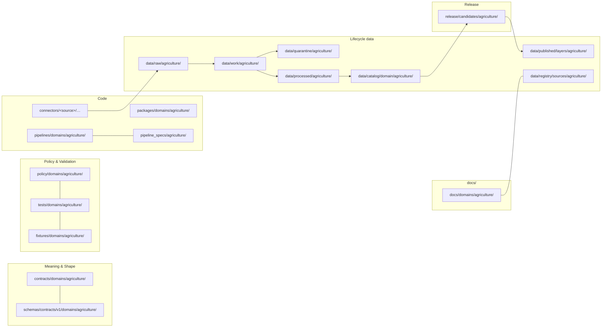
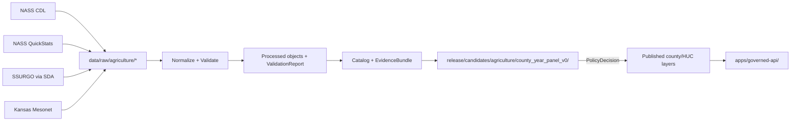

<!-- [KFM_META_BLOCK_V2]
doc_id: kfm://doc/00000000-0000-0000-0000-000000000000
title: Agriculture — Missing or Planned Files
type: standard
version: v1
status: draft
owners: agriculture-stewards (TODO confirm CODEOWNERS)
created: 2026-05-15
updated: 2026-05-26
policy_label: public
related:
  - ai-build-operating-contract.md
  - directory-rules.md
  - docs/domains/agriculture/README.md
  - docs/registers/VERIFICATION_BACKLOG.md
  - docs/registers/DRIFT_REGISTER.md
  - docs/adr/README.md
tags: [kfm, domain, agriculture, planning, backlog]
notes:
  - Pinned to CONTRACT_VERSION = "3.0.0".
  - Conformance language follows RFC 2119 / RFC 8174 per directory-rules.md §2.2.
  - Repository is not mounted in this session; all path-shaped claims are PROPOSED.
  - This file is a planning inventory, not a status report.
  - Sensitive-domain routing deferred to ai-build-operating-contract.md §23.2.
[/KFM_META_BLOCK_V2] -->

# 🌾 Agriculture — Missing or Planned Files

> **Purpose.** Inventory the files that the Agriculture domain is doctrinally expected to grow into across every responsibility root, distinguishing what is **PROPOSED** by KFM doctrine from what is **NEEDS VERIFICATION**, **UNKNOWN**, **CONFLICTED**, or pending an **ADR**. This is a planning artifact, not a status claim.

<p>
  
  
  
  
  
  
  
  
  
</p>

**Status** · `draft` &nbsp;·&nbsp; **Owners** · `agriculture-stewards` *(TODO confirm CODEOWNERS)* &nbsp;·&nbsp; **Updated** · `2026-05-26` &nbsp;·&nbsp; **Contract** · `CONTRACT_VERSION = "3.0.0"`

> [!CAUTION]
> **Sensitive-domain routing.** Agriculture touches **private land and land-ownership assertions**, **restricted source terms** (NASS confidentiality of operator/establishment data), and **agricultural-operator joins**. Disposition for any concrete artifact under this inventory MUST be routed through `ai-build-operating-contract.md` §23.2 (Sensitive-Domain Decision Matrix). The most restrictive applicable row applies. Default posture for field-level or operator-resolved Agriculture data is **DENY public exact exposure**, **GENERALIZE** before publication, **REQUIRE steward review**, and **REQUIRE a `RedactionReceipt`** for any aggregation. See [§4.4 `policy/domains/agriculture/`](#44-policydomainsagriculture). Disposition is not re-derived here.

---

## 📑 Contents

1. [Scope & posture](#1-scope--posture)
2. [Evidence basis](#2-evidence-basis)
3. [Agriculture lane map](#3-agriculture-lane-map)
4. [Missing or planned files — by responsibility root](#4-missing-or-planned-files--by-responsibility-root)
   - 4.1 [`docs/domains/agriculture/`](#41-docsdomainsagriculture)
   - 4.2 [`contracts/domains/agriculture/`](#42-contractsdomainsagriculture)
   - 4.3 [`schemas/contracts/v1/domains/agriculture/`](#43-schemascontractsv1domainsagriculture)
   - 4.4 [`policy/domains/agriculture/`](#44-policydomainsagriculture)
   - 4.5 [`tests/domains/agriculture/` + `fixtures/domains/agriculture/`](#45-testsdomainsagriculture--fixturesdomainsagriculture)
   - 4.6 [`pipelines/domains/agriculture/` + `pipeline_specs/agriculture/`](#46-pipelinesdomainsagriculture--pipeline_specsagriculture)
   - 4.7 [`connectors/<source>/…` (Agriculture sources)](#47-connectorssource-agriculture-sources)
   - 4.8 [`data/<phase>/agriculture/`](#48-dataphaseagriculture)
   - 4.9 [`data/registry/sources/agriculture/`](#49-dataregistrysourcesagriculture)
   - 4.10 [`release/candidates/agriculture/`](#410-releasecandidatesagriculture)
   - 4.11 [`packages/domains/agriculture/`](#411-packagesdomainsagriculture)
5. [First credible thin slice — county crop-year panel](#5-first-credible-thin-slice--county-crop-year-panel)
6. [Verification backlog](#6-verification-backlog)
7. [Open ADRs touched by this inventory](#7-open-adrs-touched-by-this-inventory)
8. [Open questions register](#8-open-questions-register)
9. [Changelog](#9-changelog)
10. [Definition of done](#10-definition-of-done)
11. [Related docs](#11-related-docs)

---

## 1. Scope & posture

This file enumerates the **paths and artifacts that the Agriculture domain is doctrinally expected to host**, organized along the lane pattern from `directory-rules.md` §12 (Domain Placement Law). Each entry is labeled with a truth posture so the reader can distinguish doctrine-grounded intent from current implementation state.

> [!IMPORTANT]
> **Repository is not mounted in this session.** Nothing in this file asserts that a path exists, is wired, or is enforced. Every concrete path is `PROPOSED` unless verified against a mounted repo, schema validator output, test result, or release receipt. *(Atlas v1.1 §9 N; ENCY Appendix J–K; DIRRULES §1; `ai-build-operating-contract.md` §11.)*

> [!NOTE]
> This is a **planning inventory**, not a runbook and not an ADR. Where an entry has architectural consequences (e.g., the home of `AggregationReceipt` schemas, new connector roots), it is flagged for **ADR triage** rather than resolved here. Conformance keywords (MUST, SHOULD, MAY) follow RFC 2119 / RFC 8174 per `directory-rules.md` §2.2 and `ai-build-operating-contract.md` §5.1.1.

### 1.1 What this file is

- A **lane-by-lane checklist** of Agriculture files the project expects under Directory Rules §12.
- A **bridge** from the Atlas v1.1 §9 dossier and Encyclopedia §7.7 into concrete planning entries.
- A **source of seed entries** for `docs/registers/VERIFICATION_BACKLOG.md` and the Agriculture portion of the per-domain Definition of Done.

### 1.2 What this file is **not**

- ❌ A repo status report — it does not claim any path is present.
- ❌ An ADR — schema-home, receipt-home, and connector-root questions are flagged, not decided.
- ❌ A schedule — it does not assign owners, dates, or priority beyond doctrine.
- ❌ A public commitment — public-facing roadmaps live in `docs/governance/` or release notes, not here.

### 1.3 Truth labels used

This file uses the authoring labels from `ai-build-operating-contract.md` §8: **CONFIRMED**, **INFERRED**, **PROPOSED**, **UNKNOWN**, **NEEDS VERIFICATION**, **CONFLICTED**, **LINEAGE**, **EXPLORATORY**, **EXTERNAL**. Runtime outcomes (`ANSWER` / `ABSTAIN` / `DENY` / `ERROR` / `NARROWED` / `BOUNDED` / `SOURCE_STALE`) are not used as rhetorical hedging in prose. Memory is not evidence.

---

## 2. Evidence basis

| Source ID | Document | Role here | Citation |
|---|---|---|---|
| `OPCON` | `ai-build-operating-contract.md` (v3.0; `CONTRACT_VERSION = "3.0.0"`) | Canonical operating contract; §23.2 sensitive-domain matrix; §8 truth labels; §34 receipt discipline | CONFIRMED doctrine |
| `DIRRULES` | `directory-rules.md` (in project) | Authority on lane placement (§4, §12, §13, §15) | CONFIRMED |
| `ATLAS-v1.1` | `KFM_Domains_Culmination_Atlas_v1_1.pdf` | Agriculture dossier (Atlas §9 A–N) | CONFIRMED doctrine |
| `ENCY` | `kfm_encyclopedia.pdf` | Agriculture domain entry (§7.7) and verification appendices J–K | CONFIRMED doctrine |
| `UIAI` | `KFM_Whole_UI_Governed_AI_Expansion_Report.pdf` | Domain/source/runbook README expectations (§24 propagation matrix) | CONFIRMED doctrine |
| `MAP-MASTER` | `Master_MapLibre_Components-Functions-Features_compressed.pdf` | Map-publication and release-gate posture for layers | CONFIRMED doctrine |
| `BUILD-MANUAL` | `KFM_Unified_Implementation_Architecture_Build_Manual.pdf` | Final-checklist alignment for proof-slice readiness | CONFIRMED doctrine |

> [!NOTE]
> No external (web) research was performed for this file. All claims are KFM-internal doctrine. External *standards* (STAC, JSON Schema, OGC, etc.) are referenced in linked sibling docs and do not appear as authority for entries here. Per `ai-build-operating-contract.md` §5 and the v3.0 prompt's `<external_research>` rule, external sources MUST NOT be used to make KFM repo-state or doctrine claims.

---

## 3. Agriculture lane map

The lanes below are the canonical placement targets for Agriculture per `directory-rules.md` §12. **The lanes themselves are CONFIRMED doctrine; their contents in this repo are PROPOSED until verified.**



> [!CAUTION]
> A domain MUST NOT become a root folder. Agriculture **does not** get an `agriculture/` root. Every agriculture-related file lives as a **segment** inside an owning responsibility root. *(DIRRULES §12.)*

[⤴ Back to top](#-contents)

---

## 4. Missing or planned files — by responsibility root

For each lane the table lists files **the Agriculture dossier and Directory Rules together imply should exist**. Every row is `PROPOSED` unless otherwise noted. Per-row status is a **planning** label, not a repo claim.

Legend: 🟦 *intent grounded in Atlas/Encyclopedia* · 🟨 *lane required by Directory Rules contract* · 🟧 *blocked on an ADR* · ⛔ *deny-by-default scope*

### 4.1 `docs/domains/agriculture/`

| File (PROPOSED) | Purpose | Truth label | Doctrine basis |
|---|---|---|---|
| `README.md` | Per-folder README per `DIRRULES §15` (purpose, authority class, what belongs / does not belong). | 🟨 PROPOSED · required by §15 | DIRRULES §15 |
| `DOMAIN.md` | Agriculture domain dossier mirror of Atlas v1.1 §9 (identity, scope, ubiquitous language, object families). | 🟦 PROPOSED | ATLAS-v1.1 §9 A–E; ENCY §7.7 |
| `SOURCES.md` | Source-family overview keyed to `data/registry/sources/agriculture/`. | 🟦 PROPOSED | ATLAS-v1.1 §9 D; ENCY §7.7 B |
| `SENSITIVITY.md` | Domain-specific tier matrix (T0–T4) for field-level vs aggregate products; farm/operator joins default ≥ T3. | 🟦 PROPOSED | ATLAS-v1.1 §24.5; ENCY §7.7; OPCON §23.2 |
| `LIFECYCLE.md` | RAW → WORK/QUARANTINE → PROCESSED → CATALOG/TRIPLET → PUBLISHED for Agriculture. | 🟦 PROPOSED | DIRRULES §0; ATLAS-v1.1 §9 H |
| `CROSS_LANE.md` | Cross-lane relations to Soil (MUKEY/suitability), Hydrology (irrigation/drought), Atmosphere (weather/stress), People/Land (restricted joins). | 🟦 PROPOSED | ATLAS-v1.1 §9 F |
| `CONTINUITY_NOTES.md` | Renames, lineage, and supersessions; entry-point for drift register. | 🟦 PROPOSED | UIAI §24 |
| `MISSING_OR_PLANNED_FILES.md` | *(this file)* — lane-by-lane planning inventory. | PROPOSED · self | — |

[⤴ Back to top](#-contents)

### 4.2 `contracts/domains/agriculture/`

`contracts/` defines **object meaning** in Markdown (DIRRULES §6.3). Each object family from Atlas v1.1 §9 E SHOULD have a meaning page.

| File (PROPOSED) | Object family | Truth label |
|---|---|---|
| `README.md` | Folder contract per §15 | 🟨 PROPOSED |
| `crop_observation.md` | `CropObservation` | 🟦 PROPOSED |
| `field_candidate.md` | `FieldCandidate` | 🟦 PROPOSED |
| `crop_rotation.md` | `CropRotation` | 🟦 PROPOSED |
| `yield_observation.md` | `YieldObservation` | 🟦 PROPOSED |
| `irrigation_link.md` | `IrrigationLink` | 🟦 PROPOSED |
| `conservation_practice.md` | `ConservationPractice` | 🟦 PROPOSED |
| `soil_crop_suitability.md` | `SoilCropSuitability` | 🟦 PROPOSED |
| `agricultural_economy_observation.md` | `AgriculturalEconomyObservation` | 🟦 PROPOSED |
| `supply_chain_node.md` | `SupplyChainNode` | 🟦 PROPOSED |
| `drought_stress_indicator.md` | `DroughtStressIndicator` | 🟦 PROPOSED |
| `pest_stress_indicator.md` | `PestStressIndicator` | 🟦 PROPOSED |
| `aggregation_receipt.md` | `AggregationReceipt` *(may belong under `contracts/runtime/` — see §7 ADR-S-03)* | 🟧 PROPOSED · ADR-class |

[⤴ Back to top](#-contents)

### 4.3 `schemas/contracts/v1/domains/agriculture/`

`schemas/contracts/v1/...` is the **canonical machine-schema home** per `ADR-0001` (DIRRULES §6.4, §13.1). One JSON Schema per object family, mirrored by `schemas/tests/valid/` and `schemas/tests/invalid/` fixtures.

<details>
<summary><b>Planned schema files (click to expand)</b></summary>

| File (PROPOSED) | Pairs with contract |
|---|---|
| `README.md` | folder README (§15) |
| `crop_observation.schema.json` | `crop_observation.md` |
| `field_candidate.schema.json` | `field_candidate.md` |
| `crop_rotation.schema.json` | `crop_rotation.md` |
| `yield_observation.schema.json` | `yield_observation.md` |
| `irrigation_link.schema.json` | `irrigation_link.md` |
| `conservation_practice.schema.json` | `conservation_practice.md` |
| `soil_crop_suitability.schema.json` | `soil_crop_suitability.md` |
| `agricultural_economy_observation.schema.json` | `agricultural_economy_observation.md` |
| `supply_chain_node.schema.json` | `supply_chain_node.md` |
| `drought_stress_indicator.schema.json` | `drought_stress_indicator.md` |
| `pest_stress_indicator.schema.json` | `pest_stress_indicator.md` |
| `aggregation_receipt.schema.json` *(home pending ADR — may live under `schemas/contracts/v1/receipts/` instead)* | `aggregation_receipt.md` |

</details>

> [!WARNING]
> **No parallel schema homes.** Any `contracts/<domain>/<x>.schema.json` discovered later is **CONFLICTED / LEGACY** under ADR-0001 and MUST migrate to `schemas/contracts/v1/...`. *(DIRRULES §13.1.)*

[⤴ Back to top](#-contents)

### 4.4 `policy/domains/agriculture/`

`policy/` is the **canonical singular** for admissibility (DIRRULES §6.5). Any `policies/` mirror is compatibility-only.

| File (PROPOSED) | Purpose | Truth label |
|---|---|---|
| `README.md` | Folder contract per §15 | 🟨 PROPOSED |
| `sensitivity.<ext>` | Field-level vs aggregate redaction rules; farm/operator joins fail closed. | 🟦 PROPOSED · syntax NEEDS VERIFICATION (Rego/OPA assumed) |
| `rights.<ext>` | Per-source license posture (NASS, NRCS, SSURGO/SDA, Mesonet, NASA HLS/SMAP, NOAA USCRN). | 🟦 PROPOSED |
| `promotion.<ext>` | Agriculture-specific gates for `PROCESSED → CATALOG → PUBLISHED`. | 🟦 PROPOSED |
| `redaction_profiles.yaml` | County/HUC/grid generalization profiles invoked by `AggregationReceipt`. | 🟦 PROPOSED |
| `deny_by_default/<...>` | ⛔ Unreviewed exact sensitive Agriculture locations or private operator data → DENY. | ⛔ DENY-by-default · ATLAS §9 L; OPCON §23.2 |

[⤴ Back to top](#-contents)

### 4.5 `tests/domains/agriculture/` + `fixtures/domains/agriculture/`

Atlas v1.1 §9 K names the required validators. Each validator SHOULD have at least one positive and one negative fixture, with **no-network** fixtures preferred for the first proof slice.

| Test family (PROPOSED) | What it proves | Truth label |
|---|---|---|
| `schema_validation/` | JSON Schema conformance per object family | 🟦 PROPOSED |
| `source_descriptor/` | `SourceDescriptor` shape and required fields | 🟦 PROPOSED |
| `rights_validation/` | License / rights closure per source family | 🟦 PROPOSED |
| `sensitivity_validation/` | Tier assignment + transform receipts | 🟦 PROPOSED |
| `evidence_closure/` | `EvidenceRef → EvidenceBundle` resolves before release | 🟦 PROPOSED |
| `temporal_logic/` | Distinct observed / source / retrieval / release / correction times | 🟦 PROPOSED |
| `geometry_validity/` | Field polygon / county / HUC integrity | 🟦 PROPOSED |
| `policy_deny/` | DENY paths fire (e.g., field-level operator joins to public) | 🟦 PROPOSED |
| `citation_validation/` | Claims carry resolvable citations | 🟦 PROPOSED |
| `release_manifest/` | `ReleaseManifest` schema + binding | 🟦 PROPOSED |
| `rollback_drill/` | `RollbackCard` restores prior released manifest | 🟦 PROPOSED |
| `no_network/` | Pipelines run on fixtures, no live external calls | 🟦 PROPOSED |
| `non_regression/` | Prior lineage preserved on re-promotion | 🟦 PROPOSED |
| `aggregation_threshold/` | Public-safe county/HUC/grid thresholds enforced | 🟦 PROPOSED |
| `source_role_mismatch/` | Source-role downcast/upcast rejected | 🟦 PROPOSED |
| `stale_state/` | Stale-data badge or `SOURCE_STALE` runtime outcome fires as required | 🟦 PROPOSED |

Companion fixtures (PROPOSED) live under `fixtures/domains/agriculture/`:

```text
fixtures/domains/agriculture/
├── README.md
├── no_network/
│   ├── county_year_panel/                   # the first-slice fixture
│   ├── ssurgo_county/                       # county-clipped SSURGO subset
│   ├── mesonet_station_series/              # short station window
│   └── nass_quickstats_county/              # county QuickStats panel
├── valid/                                    # positive fixtures per object family
└── invalid/                                  # negative fixtures matched to deny tests
```

> [!TIP]
> Per DIRRULES §13.5 (Fixture sprawl), the project MUST pick **one** fixture home authority for Agriculture (`fixtures/domains/agriculture/` is the lane home; `tests/fixtures/` is acceptable only if the repo already centralizes there). Document the rule in both READMEs. See [OQ-AG-02](#8-open-questions-register).

[⤴ Back to top](#-contents)

### 4.6 `pipelines/domains/agriculture/` + `pipeline_specs/agriculture/`

`pipeline_specs/` is **what** runs (declarative); `pipelines/` is **how** it runs (executable). *(DIRRULES §7.4.)*

| Pipeline / spec (PROPOSED) | Stage(s) | Truth label |
|---|---|---|
| `ingest_nass_cdl/` · `nass_cdl.yaml` | RAW · NASS Cropland Data Layer | 🟦 PROPOSED |
| `ingest_nass_quickstats/` · `nass_quickstats.yaml` | RAW · NASS QuickStats / Crop Progress | 🟦 PROPOSED |
| `ingest_ssurgo_sda/` · `ssurgo_sda.yaml` | RAW · SSURGO via Soil Data Access | 🟦 PROPOSED |
| `ingest_mesonet/` · `mesonet.yaml` | RAW · Kansas Mesonet REST | 🟦 PROPOSED |
| `ingest_nrcs_scan/` · `nrcs_scan.yaml` | RAW · NRCS SCAN | 🟦 PROPOSED |
| `ingest_noaa_uscrn/` · `noaa_uscrn.yaml` | RAW · NOAA USCRN | 🟦 PROPOSED |
| `ingest_smap/` · `smap.yaml` | RAW · NASA SMAP soil moisture | 🟦 PROPOSED |
| `ingest_hls_vi/` · `hls_vi.yaml` | RAW · NASA HLS / HLS-VI | 🟦 PROPOSED |
| `normalize/` | WORK · schema/geometry/time/identity | 🟦 PROPOSED |
| `validate/` | WORK · validators in `tests/domains/agriculture/` | 🟦 PROPOSED |
| `catalog/` | CATALOG · `EvidenceBundle` + `LayerManifest` candidates | 🟦 PROPOSED |
| `publish_aggregates/` · `county_year_panel.yaml` | PUBLISHED · public-safe county/HUC aggregates | 🟦 PROPOSED |
| `rollback/` | Release rollback via `RollbackCard` | 🟦 PROPOSED |

[⤴ Back to top](#-contents)

### 4.7 `connectors/<source>/…` (Agriculture sources)

> [!NOTE]
> Connectors are **source-specific**, not domain-specific — they live as their own roots, not under `connectors/domains/agriculture/`. *(DIRRULES §7.3.)*  Each connector outputs to `data/raw/agriculture/<source_id>/<run_id>/` only.

| Connector path (PROPOSED) | Source family | Truth label |
|---|---|---|
| `connectors/usda/nass/` *(new root segment)* | USDA NASS CDL + QuickStats / Crop Progress | 🟦 PROPOSED · root-segment NEEDS VERIFICATION |
| `connectors/nrcs/ssurgo/` | SSURGO / Soil Data Access | 🟦 PROPOSED |
| `connectors/nrcs/scan/` | NRCS SCAN | 🟦 PROPOSED |
| `connectors/kansas/mesonet/` | Kansas Mesonet | 🟦 PROPOSED |
| `connectors/noaa/uscrn/` | NOAA USCRN | 🟦 PROPOSED |
| `connectors/nasa/smap/` *(new root segment)* | NASA SMAP | 🟦 PROPOSED · root-segment NEEDS VERIFICATION |
| `connectors/nasa/hls/` *(new root segment)* | NASA HLS / HLS-VI | 🟦 PROPOSED · root-segment NEEDS VERIFICATION |

> [!WARNING]
> **Connectors MUST NOT publish.** A connector that writes to `data/processed/`, `data/catalog/`, or `data/published/` is an anti-pattern per DIRRULES §13.5. *(Promotion is a governed state transition, not a connector side-effect.)*

[⤴ Back to top](#-contents)

### 4.8 `data/<phase>/agriculture/`

Each lifecycle phase has its own Agriculture lane. Receipts, proofs, registry, and rollback content are emitted **alongside** these lanes — never as a replacement. *(DIRRULES §4 step 2; §6.)*

| Lane (PROPOSED) | Phase | Notes |
|---|---|---|
| `data/raw/agriculture/<source_id>/<run_id>/` | RAW | Immutable connector output + ingest receipts |
| `data/work/agriculture/` | WORK | In-flight normalization & validation |
| `data/quarantine/agriculture/` | QUARANTINE | Records held for rights / sensitivity / source-role review |
| `data/processed/agriculture/` | PROCESSED | Normalized objects + `ValidationReport` + digest closure |
| `data/catalog/domain/agriculture/` | CATALOG | `EvidenceBundle`s, graph/triplet projections, release candidates |
| `data/published/layers/agriculture/` | PUBLISHED | Public-safe layers behind `apps/governed-api/` only |

[⤴ Back to top](#-contents)

### 4.9 `data/registry/sources/agriculture/`

One `SourceDescriptor` per source family from Atlas v1.1 §9 D. Each descriptor names source role, rights, cadence, steward, sensitivity tier, and release class.

```text
data/registry/sources/agriculture/
├── README.md
├── nass_cdl.yaml
├── nass_quickstats.yaml
├── ssurgo_sda.yaml
├── gssurgo.yaml
├── mesonet.yaml
├── nrcs_scan.yaml
├── noaa_uscrn.yaml
├── smap.yaml
└── hls_vi.yaml
```

All entries 🟦 PROPOSED; rights for every entry are **NEEDS VERIFICATION** per Atlas §9 D.

[⤴ Back to top](#-contents)

### 4.10 `release/candidates/agriculture/`

Release decisions, not artifacts. Released artifacts live in `data/published/`; **decisions** live here.

| File (PROPOSED) | Purpose |
|---|---|
| `county_year_panel_v0/release_manifest.json` | First-slice `ReleaseManifest` binding evidence, policy, sensitivity, rollback target |
| `county_year_panel_v0/rollback_card.json` | Drilled rollback target for the first slice |
| `county_year_panel_v0/promotion_decision.json` | Recorded `PolicyDecision`: promotion / deny / abstain |

[⤴ Back to top](#-contents)

### 4.11 `packages/domains/agriculture/`

> [!NOTE]
> A package belongs here **only if it is reusable across deployables**. A one-off pipeline step does not get a package home — it belongs in `pipelines/` or `tools/`. *(DIRRULES §7.2.)* Until a reusable surface is identified, this lane is `UNKNOWN` whether it should exist at all. See [OQ-AG-03](#8-open-questions-register).

| Candidate (PROPOSED) | Truth label |
|---|---|
| `packages/domains/agriculture/` | UNKNOWN · NEEDS VERIFICATION that a reusable agriculture package is justified before creation |

[⤴ Back to top](#-contents)

---

## 5. First credible thin slice — county crop-year panel

The Agriculture dossier names a **county-level crop-year panel** as the first credible slice. Building it exercises every gate without exposing field-level sensitivity.



**Slice acceptance (PROPOSED, per Build Manual §31 alignment):**

- [ ] `SourceDescriptor` for each source admitted with rights confirmed.
- [ ] No-network fixture passes for `nass_cdl`, `nass_quickstats`, `ssurgo_sda`, `mesonet`.
- [ ] `EvidenceRef → EvidenceBundle` resolves for every public claim.
- [ ] Sensitivity policy DENIES field-level operator joins by default.
- [ ] `AggregationReceipt` recorded for county/HUC roll-ups.
- [ ] `ReleaseManifest` + `RollbackCard` exist before public surface binds.
- [ ] Public surface reads only via `apps/governed-api/`, never `data/processed/`.

[⤴ Back to top](#-contents)

---

## 6. Verification backlog

Lifted from Atlas v1.1 §9 N and ENCY Appendix J–K, scoped to Agriculture. Each item is **NEEDS VERIFICATION** until evidence (mounted repo files, schemas, registry entries, tests, logs, emitted artifacts, review records, or release manifests) is produced in a session.

| # | Item | Evidence that would settle it | Status |
|---|---|---|---|
| AG-V-01 | NASS / QuickStats / Crop Progress source activation | source descriptor in `data/registry/sources/agriculture/`, ingest receipt | NEEDS VERIFICATION |
| AG-V-02 | Kansas Mesonet and NASA HLS / SMAP product terms | rights record per descriptor; license check in policy tests | NEEDS VERIFICATION |
| AG-V-03 | Public release sensitivity rules for farm/operator joins | policy fixtures + deny tests in `tests/domains/agriculture/policy_deny/` | NEEDS VERIFICATION |
| AG-V-04 | Agriculture API surface and layer registry | route under `apps/governed-api/` + `LayerManifest` in catalog | NEEDS VERIFICATION |
| AG-V-05 | `AggregationReceipt` schema home | ADR-S-03 resolution; presence at canonical home | NEEDS VERIFICATION · ADR-class |
| AG-V-06 | New connector roots (`connectors/usda/`, `connectors/nasa/`) | per-root READMEs declaring class and source descriptor reference | NEEDS VERIFICATION |
| AG-V-07 | Per-source rights closure (SSURGO, gSSURGO, Mesonet, SCAN, USCRN, SMAP, HLS, NASS) | rights record + test | NEEDS VERIFICATION |
| AG-V-08 | Aggregation threshold values (county/HUC/grid) | values committed in `policy/domains/agriculture/redaction_profiles.yaml` | NEEDS VERIFICATION |

[⤴ Back to top](#-contents)

---

## 7. Open ADRs touched by this inventory

These are not decided here. Listed so reviewers can route the right question to `docs/adr/`.

| Reference | Question | Why ADR-class |
|---|---|---|
| ADR-S-01 | Confirm `schemas/contracts/v1/...` as canonical schema home (or amend). | DIRRULES §2.4(3) — schema-home is ADR-required. |
| ADR-S-03 | Receipt class home: `schemas/contracts/v1/receipts/` vs. `schemas/contracts/v1/domains/agriculture/receipts/` for `AggregationReceipt`. | New parallel home is ADR-class per DIRRULES §2.4(5). |
| ADR-S-04 | Source-role enum — vocabulary stability across Agriculture sources. | Source-role anti-collapse is doctrine-significant. |
| ADR-S-05 | Sensitivity tier scheme (T0–T4) for Agriculture lanes — adopt or revise. | Affects per-domain release posture and redaction profiles. |
| ADR-CN-01 *(PROPOSED title)* | New connector roots `connectors/usda/`, `connectors/nasa/` — accept or fold into existing roots. | DIRRULES §2.4(1) — new root requires ADR. |

[⤴ Back to top](#-contents)

---

## 8. Open questions register

These are unresolved questions specific to this planning inventory that are **not** covered by an existing ADR or Verification backlog item. Each question carries an owner role and a resolution path so the docs steward can route it.

| ID | Question | Owner role | Resolution path |
|---|---|---|---|
| OQ-AG-01 | Should `MISSING_OR_PLANNED_FILES.md` be retired (or moved to a register form) once Agriculture lanes materialize, or kept as a living planning surface? | docs-steward | Cadence rule recorded in §10 Definition of done; revisit at v2 promotion. |
| OQ-AG-02 | Fixture home for Agriculture: `fixtures/domains/agriculture/` or `tests/fixtures/agriculture/`? | qa-steward | Inspect repo once mounted; document the rule in both READMEs; ADR if ambiguous. *(DIRRULES §13.5.)* |
| OQ-AG-03 | When is `packages/domains/agriculture/` justified? What reusable surface across deployables exists or is anticipated? | package-steward | Identify a concrete cross-deployable consumer before creation; otherwise lane stays UNKNOWN. |
| OQ-AG-04 | Does sensitivity disposition for ethnobotanical / traditional agricultural knowledge route through Agriculture sensitivity policy or through People/DNA/Land sovereignty review? | sensitivity-steward · sovereignty-reviewer | Cross-lane policy review; ADR if cross-cutting. *(OPCON §23.2 may already cover.)* |
| OQ-AG-05 | Confirm CODEOWNERS membership for `agriculture-stewards`. | repo-admin | Inspect `.github/CODEOWNERS` once repo is mounted; update meta block. |
| OQ-AG-06 | Does `AggregationReceipt` belong under `contracts/domains/agriculture/` or `contracts/runtime/`? | contracts-steward | Resolved jointly with ADR-S-03; placeholder retained in §4.2 until decided. |

[⤴ Back to top](#-contents)

---

## 9. Changelog

| Change | Type (per `ai-build-operating-contract.md` §37) | Reason |
|---|---|---|
| Pinned `CONTRACT_VERSION = "3.0.0"` in meta block, badge row, status line, and footer. | clarification | v3.0 contract requires the pin in every doctrine-adjacent doc. |
| Added top-of-file `> [!CAUTION]` callout for sensitive-domain routing per OPCON §23.2. | new | Agriculture touches restricted source terms (NASS confidentiality) and private-land assertions; routing was implicit in §4.4 only. |
| Added Section 8 *Open questions register* with `OQ-AG-01..06`. | new | v3.0 companion-section pattern; surfaces planning-doc questions not covered by existing ADRs or backlog. |
| Added Section 9 *Changelog* (this section). | new | v3.0 companion-section pattern. |
| Added Section 10 *Definition of done*. | new | Gives the doc a verifiable promotion path from `draft` to `published`. |
| Added §1.3 *Truth labels used* and an RFC 2119 conformance note in §1. | clarification | Aligns with OPCON §5.1.1, §8, and DIRRULES §2.2. |
| Added `ai-build-operating-contract.md` and `directory-rules.md` to meta block `related:`. | clarification | Doctrine-adjacent linkage; v3.0 expectation. |
| Updated `updated:` field and *Last reviewed* badge to `2026-05-26`. | housekeeping | Revision date. |
| Selectively promoted lowercase "should" to RFC 2119 SHOULD / MUST in §4.2, §4.5, §4.7. | clarification | Preserves prose voice while making conformance explicit where confidence warrants. |
| Renumbered *Related docs* from §8 to §11 to seat the new companion sections before it. | reconciliation | v3.0 companion-section template places Open Qs / Changelog / DoD before *Related docs*. |
| Tightened terminology in §4.10 (`PolicyDecision`) and §5 (`PolicyDecision` edge label). | clarification | Preserves KFM compound-term casing per OPCON Non-negotiables. |

> [!NOTE]
> **Backward compatibility.** Anchor `#8-related-docs` becomes `#11-related-docs`. All other anchors (`#1-scope--posture` through `#7-open-adrs-touched-by-this-inventory`) are preserved. Any external link to `MISSING_OR_PLANNED_FILES.md#8-related-docs` MUST be updated. Flagged in Section 2 (Notes & Citations) for the docs steward.

[⤴ Back to top](#-contents)

---

## 10. Definition of done

This document is done enough to enter the repository when:

- it is placed under `docs/domains/agriculture/MISSING_OR_PLANNED_FILES.md` (or the agreed alternate per `directory-rules.md` §12);
- a docs steward **and** the `agriculture-stewards` team review and approve it;
- it is linked from `docs/domains/agriculture/README.md` and from `docs/registers/VERIFICATION_BACKLOG.md`;
- it does not conflict with accepted ADRs (in particular `ADR-S-01`, `ADR-S-03`, and any `ADR-CN-01` outcome);
- any conflict with current repo conventions is logged in `docs/registers/DRIFT_REGISTER.md`;
- the `GENERATED_RECEIPT.json` planned in Section 2 (Notes & Citations) is produced and wired into CI per `ai-build-operating-contract.md` §34;
- the meta-block `doc_id` placeholder is replaced with an issued `kfm://doc/<uuid>`;
- CODEOWNERS for `agriculture-stewards` is confirmed (resolves [OQ-AG-05](#8-open-questions-register));
- the cadence rule for revisiting this inventory is recorded — **PROPOSED**: re-review on every Agriculture-touching ADR ratification and at minimum quarterly; retire to a register form when Section 4 occupancy exceeds ~70% (resolves [OQ-AG-01](#8-open-questions-register));
- future changes follow the operating contract's §37 lifecycle.

[⤴ Back to top](#-contents)

---

## 11. Related docs

> [!NOTE]
> The links below are **relative path placeholders** until the corresponding files are confirmed in a mounted repo. If any of them are not yet present, treat the link target as `TODO`.

- `ai-build-operating-contract.md` *(present in project knowledge; canonical operating contract; pin `CONTRACT_VERSION = "3.0.0"`)*
- `directory-rules.md` *(present in project knowledge)*
- `docs/domains/agriculture/README.md` *(TODO)*
- `docs/domains/agriculture/DOMAIN.md` *(TODO)*
- `docs/domains/agriculture/SENSITIVITY.md` *(TODO)*
- `docs/registers/VERIFICATION_BACKLOG.md` *(TODO)*
- `docs/registers/DRIFT_REGISTER.md` *(TODO)*
- `docs/registers/OBJECT_FAMILY_MAP.md` *(TODO)*
- `docs/adr/README.md` *(TODO)*
- `docs/standards/PROV.md` — provenance crosswalk *(present per project knowledge; verify path against repo)*

[⤴ Back to top](#-contents)

---

<sub>**Last reviewed:** 2026-05-26 · planning artifact · pinned to `CONTRACT_VERSION = "3.0.0"` · all paths PROPOSED unless verified · [⤴ Back to top](#-contents)</sub>
