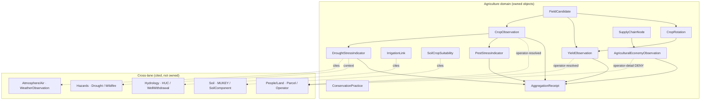
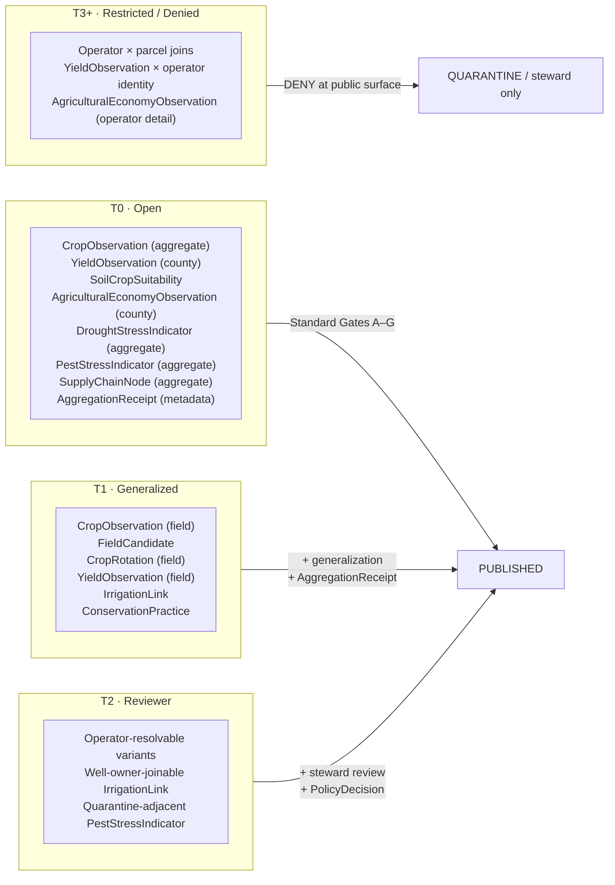

<!-- [KFM_META_BLOCK_V2]
doc_id: kfm://doc/00000000-0000-0000-0000-000000000000
title: Agriculture — Object Families
type: standard
version: v1
status: draft
owners: agriculture-stewards (TODO confirm CODEOWNERS)
created: 2026-05-26
updated: 2026-05-26
policy_label: public
related:
  - ai-build-operating-contract.md
  - directory-rules.md
  - docs/domains/agriculture/README.md
  - docs/domains/agriculture/DOMAIN.md
  - docs/domains/agriculture/SENSITIVITY.md
  - docs/domains/agriculture/CROSS_LANE.md
  - docs/domains/agriculture/MISSING_OR_PLANNED_FILES.md
  - contracts/domains/agriculture/
  - schemas/contracts/v1/domains/agriculture/
  - policy/domains/agriculture/
  - docs/registers/OBJECT_FAMILY_MAP.md
  - docs/registers/VERIFICATION_BACKLOG.md
tags: [kfm, domain, agriculture, objects, ubiquitous-language]
notes:
  - Pinned to CONTRACT_VERSION = "3.0.0".
  - Conformance language follows RFC 2119 / RFC 8174 per directory-rules.md §2.2.
  - Repository is not mounted in this session; all path-shaped claims are PROPOSED.
  - This file catalogs Agriculture object families per Atlas v1.1 §9 E.
  - Field-level realizations are PROPOSED until contracts/schemas land.
  - Sensitive-domain routing deferred to ai-build-operating-contract.md §23.2.
[/KFM_META_BLOCK_V2] -->

# 🌾 Agriculture — Object Families

> **Purpose.** Catalog the **object families** the Agriculture domain owns, the meaning each carries inside KFM, the sensitivity defaults that govern release, and the cross-lane edges each family creates. This is the canonical reading aid bridging Atlas v1.1 §9 E and the eventual `contracts/domains/agriculture/` + `schemas/contracts/v1/domains/agriculture/` machinery.

<p>
  
  
  
  
  
  
  
  
  
</p>

**Status** · `draft` &nbsp;·&nbsp; **Owners** · `agriculture-stewards` *(TODO confirm CODEOWNERS)* &nbsp;·&nbsp; **Updated** · `2026-05-26` &nbsp;·&nbsp; **Contract** · `CONTRACT_VERSION = "3.0.0"`

> [!CAUTION]
> **Sensitive-domain routing.** Several Agriculture object families (notably `FieldCandidate`, `YieldObservation`, `AgriculturalEconomyObservation`, `SupplyChainNode`) carry operator-resolvable or private-parcel-adjacent semantics. Disposition for any concrete public surface MUST be routed through `ai-build-operating-contract.md` §23.2 (Sensitive-Domain Decision Matrix). The most restrictive applicable row applies. Default posture for field-level or operator-resolved Agriculture data is **DENY public exact exposure → GENERALIZE → REQUIRE steward review → REQUIRE `AggregationReceipt` or `RedactionReceipt`**. Disposition is **not** re-derived here.

---

## 📑 Contents

1. [Scope & posture](#1-scope--posture)
2. [Evidence basis](#2-evidence-basis)
3. [What Agriculture owns — and does not](#3-what-agriculture-owns--and-does-not)
4. [Object family catalog](#4-object-family-catalog)
5. [Object relationships](#5-object-relationships)
6. [Per-object detail](#6-per-object-detail)
   - 6.1 [`CropObservation`](#61-cropobservation)
   - 6.2 [`FieldCandidate`](#62-fieldcandidate)
   - 6.3 [`CropRotation`](#63-croprotation)
   - 6.4 [`YieldObservation`](#64-yieldobservation)
   - 6.5 [`IrrigationLink`](#65-irrigationlink)
   - 6.6 [`ConservationPractice`](#66-conservationpractice)
   - 6.7 [`SoilCropSuitability`](#67-soilcropsuitability)
   - 6.8 [`AgriculturalEconomyObservation`](#68-agriculturaleconomyobservation)
   - 6.9 [`SupplyChainNode`](#69-supplychainnode)
   - 6.10 [`DroughtStressIndicator`](#610-droughtstressindicator)
   - 6.11 [`PestStressIndicator`](#611-peststressindicator)
   - 6.12 [`AggregationReceipt`](#612-aggregationreceipt)
7. [Source-role anti-collapse](#7-source-role-anti-collapse)
8. [Cross-lane relations](#8-cross-lane-relations)
9. [Sensitivity defaults & gate map](#9-sensitivity-defaults--gate-map)
10. [Identity, temporal, and digest rules](#10-identity-temporal-and-digest-rules)
11. [Open questions register](#11-open-questions-register)
12. [Verification backlog](#12-verification-backlog)
13. [Changelog](#13-changelog)
14. [Definition of done](#14-definition-of-done)
15. [Related docs](#15-related-docs)

---

## 1. Scope & posture

This file is the **object-family reference** for the Agriculture domain. For every family named in Atlas v1.1 §9 E it captures: the family's meaning inside KFM, sensitivity defaults, identity rule, temporal axes, cross-lane edges, expected contract and schema homes, and pointers to the validators and fixtures that will prove the family enforceable.

> [!IMPORTANT]
> **Repository is not mounted in this session.** Object **names** and **doctrine-level definitions** are `CONFIRMED` from Atlas v1.1 §9 E and ENCY §7.7. Concrete **field realizations**, **schema paths**, **route names**, and **policy bundle membership** are `PROPOSED` until verified against a mounted repo or accepted ADR. *(`ai-build-operating-contract.md` §11.)*

> [!NOTE]
> This is a **reference document**, not a runbook and not a contract. Field shapes named in §6 are **illustrative** (per `<formatting_mandate>`) and MUST be re-grounded in the matching `contracts/domains/agriculture/<object>.md` and `schemas/contracts/v1/domains/agriculture/<object>.schema.json` before any production use. Conformance keywords (MUST, SHOULD, MAY) follow RFC 2119 / RFC 8174 per `directory-rules.md` §2.2 and `ai-build-operating-contract.md` §5.1.1.

### 1.1 What this file is

- A **canonical catalog** of Agriculture object families per Atlas v1.1 §9 E.
- A **bridge** from Atlas dossier semantics into eventual `contracts/` / `schemas/` machinery.
- A **reference** for reviewers checking source-role discipline, cross-lane edges, and sensitivity defaults.

### 1.2 What this file is **not**

- ❌ A schema definition — JSON Schemas live under `schemas/contracts/v1/domains/agriculture/`.
- ❌ A semantic contract — full Markdown contracts live under `contracts/domains/agriculture/`.
- ❌ A policy bundle — admissibility rules live under `policy/domains/agriculture/`.
- ❌ A repo status report — it does not claim any contract, schema, or test exists today.

### 1.3 Truth labels used

This file uses the authoring labels from `ai-build-operating-contract.md` §8: **CONFIRMED**, **INFERRED**, **PROPOSED**, **UNKNOWN**, **NEEDS VERIFICATION**, **CONFLICTED**, **LINEAGE**, **EXPLORATORY**, **EXTERNAL**. Runtime outcomes (`ANSWER` / `ABSTAIN` / `DENY` / `ERROR` / `NARROWED` / `BOUNDED` / `SOURCE_STALE`) are not used as rhetorical hedging in prose. Memory is not evidence.

[⤴ Back to top](#-contents)

---

## 2. Evidence basis

| Source ID | Document | Role here | Citation |
|---|---|---|---|
| `OPCON` | `ai-build-operating-contract.md` (v3.0; `CONTRACT_VERSION = "3.0.0"`) | Canonical operating contract; §8 truth labels; §23.2 sensitive-domain matrix; §34 receipt discipline | CONFIRMED doctrine |
| `DIRRULES` | `directory-rules.md` (v1.3) | Authority on lane placement (§6.3, §6.4, §6.5, §12) | CONFIRMED doctrine |
| `ATLAS-v1.1` | `Kansas Frontier Matrix - Domains v1.1 + Pass 23/32 Consolidated Atlas` | Agriculture dossier (Atlas §9 A–N); object family spine; cross-lane edges; sensitivity defaults | CONFIRMED doctrine |
| `ENCY` | `KFM_Encyclopedia.md` / `kfm_unified_doctrine_synthesis.md` | Agriculture domain entry (§7.7); per-domain sensitivity matrix (§16); cross-lane anti-collapse (§17) | CONFIRMED doctrine |
| `BUILD-MANUAL` | `KFM_Unified_Implementation_Architecture_Build_Manual.md` | Object map (§7.1); Promotion Gates A–G (§6.2); lifecycle table (§6.1) | CONFIRMED doctrine |
| `DDD` | `DomainDriven_Design_Reference.pdf` | Ubiquitous-language and bounded-context discipline | CONFIRMED doctrine |

> [!NOTE]
> No external (web) research was performed for this file. All claims are KFM-internal doctrine. Per `ai-build-operating-contract.md` §5 and the v3.0 prompt's `<external_research>` rule, external sources MUST NOT be used to make KFM repo-state or doctrine claims.

[⤴ Back to top](#-contents)

---

## 3. What Agriculture owns — and does not

**Owned (CONFIRMED per Atlas v1.1 §9 B):**

The Agriculture domain owns: `CropObservation`, `FieldCandidate`, `CropRotation`, `YieldObservation`, `IrrigationLink`, `ConservationPractice`, `SoilCropSuitability`, `AgriculturalEconomyObservation`, `SupplyChainNode`, `DroughtStressIndicator`, `PestStressIndicator`, `AggregationReceipt`.

**Explicitly not owned (CONFIRMED per Atlas v1.1 §9 B):**

| Concept | Owning domain | Reason |
|---|---|---|
| Soil map-unit and horizon semantics (MUKEY, COKEY, CHKEY, horizon properties) | **Soil** | Soil owns canonical pedologic semantics; Agriculture **cites** via `SoilCropSuitability`. |
| Water observations, flood context, HUC identity | **Hydrology** | Agriculture **cites** for irrigation and drought; never asserts. |
| Weather / climate observations | **Atmosphere/Air** | Agriculture **cites** as drought/stress context. |
| Ownership, title, parcels, living-person privacy | **People / DNA / Land** | Agriculture **MUST NOT** join farm/operator × parcel to public release. |
| Hazard event truth | **Hazards** | Agriculture surfaces drought stress; alert authority remains with Hazards. |

> [!IMPORTANT]
> **Non-ownership is a publication constraint, not a citation ban.** Agriculture's domain logic may *reference* a Soil `MUKEY` or a Hydrology `HUC12` via `EvidenceRef`, but it MUST NOT redefine, override, or republish those objects under Agriculture authority. Citation preserves `EvidenceBundle`, source role, sensitivity tier, and release state of the cited family.

[⤴ Back to top](#-contents)

---

## 4. Object family catalog

Twelve families, each `CONFIRMED` as a named object per Atlas v1.1 §9 E, with `PROPOSED` field realizations until contracts/schemas land. Sensitivity defaults reflect Atlas v1.1 §24.5.2 / ENCY §16; final values MUST be ratified via ADR-S-05.

| # | Object family | Owning lane | Sensitivity default | Identity basis (PROPOSED) | Contract path *(PROPOSED)* | Schema path *(PROPOSED)* |
|---|---|---|---|---|---|---|
| 1 | `CropObservation` | Observation | T0 (aggregate) / T1 (field candidate) | `source_id` + `object_role` + `temporal_scope` + `normalized_digest` | `contracts/domains/agriculture/crop_observation.md` | `schemas/contracts/v1/domains/agriculture/crop_observation.schema.json` |
| 2 | `FieldCandidate` | Observation candidate | T1 default · **T3+ if operator-resolvable** | same | `…/field_candidate.md` | `…/field_candidate.schema.json` |
| 3 | `CropRotation` | Derived observation | T0 (aggregate) / T1 (field) | same | `…/crop_rotation.md` | `…/crop_rotation.schema.json` |
| 4 | `YieldObservation` | Observation | T0 (aggregate) / T1 (field) · **T3+ if operator-resolvable** | same | `…/yield_observation.md` | `…/yield_observation.schema.json` |
| 5 | `IrrigationLink` | Cross-domain edge (Hydrology) | T1 default · **T2 if well-owner joinable** | same | `…/irrigation_link.md` | `…/irrigation_link.schema.json` |
| 6 | `ConservationPractice` | Practice observation | T1 default · **T2 if operator-resolvable** | same | `…/conservation_practice.md` | `…/conservation_practice.schema.json` |
| 7 | `SoilCropSuitability` | Derived model | T0 | same | `…/soil_crop_suitability.md` | `…/soil_crop_suitability.schema.json` |
| 8 | `AgriculturalEconomyObservation` | Aggregate observation | T0 (county/region) · **DENY operator detail** | same | `…/agricultural_economy_observation.md` | `…/agricultural_economy_observation.schema.json` |
| 9 | `SupplyChainNode` | Topology node | T0 (aggregate) · T1+ (specific facility) | same | `…/supply_chain_node.md` | `…/supply_chain_node.schema.json` |
| 10 | `DroughtStressIndicator` | Derived indicator | T0 (aggregate) / T1 (field) | same | `…/drought_stress_indicator.md` | `…/drought_stress_indicator.schema.json` |
| 11 | `PestStressIndicator` | Derived indicator | T0 (aggregate) / T1 (field) · **T2+ if quarantine-adjacent** | same | `…/pest_stress_indicator.md` | `…/pest_stress_indicator.schema.json` |
| 12 | `AggregationReceipt` | Receipt | T0 (receipt metadata only; payload-bound by source tier) | `aggregation_method` + `inputs_digest` + `threshold_profile` + `run_id` | `…/aggregation_receipt.md` *(🟧 ADR-S-03)* | `…/aggregation_receipt.schema.json` *(home pending ADR — may live under `schemas/contracts/v1/receipts/`)* |

Legend: 🟧 *blocked on an ADR*

> [!WARNING]
> **Sensitivity defaults are not field-level rules.** A `YieldObservation` joined to a parcel polygon and an operator name is operator-resolved and crosses to **T3 / DENY** even if the row above shows `T0` for the aggregate variant. Tier is resolved against the *actual* shape released, not against the family name. *(ENCY §16; Atlas v1.1 §24.5.2.)*

[⤴ Back to top](#-contents)

---

## 5. Object relationships



> [!NOTE]
> Solid arrows = within-domain composition. Dotted "cites" arrows = cross-lane `EvidenceRef`. Dotted "DENY" arrows = sensitivity edges that MUST be denied at public release per ENCY §17.

[⤴ Back to top](#-contents)

---

## 6. Per-object detail

For each family below: **purpose** is paraphrased from Atlas §9 E; **key fields** are PROPOSED illustrative shapes pending contract authorship; **identity** and **temporal** rules apply uniformly per §10.

### 6.1 `CropObservation`

- **Purpose.** Captures a crop's presence, stage, or condition at a place and time. Atlas v1.1 §9 E.
- **Owning lane.** Observation.
- **Source roles (anti-collapse).** `authority` (NASS Crop Progress at state aggregate), `observation` (Mesonet station, USCRN, SCAN), `context` (HLS-VI imagery), `model` (CDL classified raster, SMAP-derived moisture). Roles MUST remain distinct on every record.
- **Key fields *(PROPOSED, illustrative)*.** `observation_id`, `source_id`, `source_role`, `crop_code` (USDA NASS code), `stage` (BBCH or NASS Crop Progress phase), `condition_class` (good/fair/poor where source-applicable), `geometry` (point/polygon/raster cell), `support_geometry` (county/HUC/grid cell), `observed_time`, `valid_time`, `retrieval_time`, `evidence_ref`, `spec_hash`.
- **Sensitivity default.** T0 aggregate / T1 field candidate. **T3+ if operator-resolvable.**
- **Cross-lane edges.** Frontier Matrix (county-year panels); Hazards (drought).
- **Cites.** Soil (`SoilCropSuitability` lookup); Atmosphere (`WeatherObservation` for stress context).
- **Required gates at release.** A–G (per Build Manual §6.2). Aggregation tier ⇒ `AggregationReceipt` required.

[⤴ Back to top](#-contents)

### 6.2 `FieldCandidate`

- **Purpose.** A candidate field polygon — typically derived from satellite classification (CDL/HLS) or boundary inference — proposed for observation but not asserted as an operator-confirmed field.
- **Owning lane.** Observation candidate.
- **Source roles.** Almost always `model` (CDL-classified field) or `observation` (Mesonet station footprint as proxy). Source role MUST be carried.
- **Key fields *(PROPOSED, illustrative)*.** `candidate_id`, `source_id`, `source_role`, `geometry` (polygon), `support_geometry` (county), `inferred_crop_code`, `confidence`, `observed_time`, `evidence_ref`, `spec_hash`.
- **Sensitivity default.** **T1** baseline; **T3 if joined to operator identity** (ENCY §17).
- **Cross-lane edges.** None at public release — operator joins DENY.
- **Required gates.** A–G. **Operator-resolvable releases require steward review + `RedactionReceipt` + `PolicyDecision`.**

> [!WARNING]
> A `FieldCandidate` is **not** a survey-confirmed field. Treating it as one is a source-role collapse (`model` → `authority`) and MUST be denied at promotion.

[⤴ Back to top](#-contents)

### 6.3 `CropRotation`

- **Purpose.** A multi-year sequence of crops over the same place; usually derived from longitudinal `CropObservation` series.
- **Owning lane.** Derived observation.
- **Source roles.** `model` (rotation inferred from CDL series), `observation` (rotation declared by survey).
- **Key fields *(PROPOSED, illustrative)*.** `rotation_id`, `support_geometry`, `sequence[]` (`{year, crop_code, observed_evidence_ref}`), `start_year`, `end_year`, `evidence_ref`, `spec_hash`.
- **Sensitivity default.** T0 (aggregate) / T1 (field-level).
- **Cross-lane edges.** Soil (rotation × suitability discussion); Frontier Matrix (county histories).

[⤴ Back to top](#-contents)

### 6.4 `YieldObservation`

- **Purpose.** Crop yield value over a place and a period; from authority aggregates (NASS QuickStats county) or observation panels.
- **Owning lane.** Observation.
- **Source roles.** `authority` (NASS county estimates), `observation` (field-reported), `aggregate` (computed roll-up).
- **Key fields *(PROPOSED, illustrative)*.** `yield_id`, `source_id`, `source_role`, `crop_code`, `yield_value`, `yield_unit`, `support_geometry`, `valid_time` (typically crop year), `evidence_ref`, `spec_hash`.
- **Sensitivity default.** **T0 aggregate (county/region) / T1 field. T3+ DENY when operator-resolvable.**
- **Cross-lane edges.** Frontier Matrix; Hazards (drought attribution).

> [!CAUTION]
> Per ENCY §17, joining `YieldObservation` × `FieldCandidate` × parcel × operator is a known **source-role collapse and privacy violation pattern.** Public release MUST DENY. *(`policy/domains/agriculture/sensitivity.<ext>`.)*

[⤴ Back to top](#-contents)

### 6.5 `IrrigationLink`

- **Purpose.** Records the relationship between an agricultural place and its water source / withdrawal authorization; e.g., field → groundwater well, field → surface diversion.
- **Owning lane.** Cross-domain edge (Hydrology-cited).
- **Source roles.** `authority` (state water-right records), `observation` (Mesonet station near pivot), `context` (well-log neighborhood).
- **Key fields *(PROPOSED, illustrative)*.** `link_id`, `agricultural_place_ref` (field/parcel), `water_source_ref` (well / diversion / HUC reach), `right_kind`, `right_status`, `evidence_ref`, `spec_hash`.
- **Sensitivity default.** **T1**; **T2 if well-owner joinable**.
- **Cross-lane edges.** Hydrology (well, withdrawal); People/Land (water-right ownership).

[⤴ Back to top](#-contents)

### 6.6 `ConservationPractice`

- **Purpose.** Records a documented or modeled conservation practice (cover crop, no-till, contour, riparian buffer, terrace) at a place.
- **Owning lane.** Practice observation.
- **Source roles.** `authority` (NRCS practice records when public), `model` (RS-classified), `context` (county practice survey).
- **Key fields *(PROPOSED, illustrative)*.** `practice_id`, `practice_code` (NRCS CPS code when applicable), `support_geometry`, `valid_time_range`, `evidence_ref`, `spec_hash`.
- **Sensitivity default.** **T1**; **T2 if operator-resolvable**.
- **Cross-lane edges.** Soil (erosion outcomes); Hydrology (riparian).

[⤴ Back to top](#-contents)

### 6.7 `SoilCropSuitability`

- **Purpose.** Derived score / rating expressing the suitability of a soil for a crop; usually a join over `SoilMapUnit` / `SoilComponent` × crop-specific parameters.
- **Owning lane.** Derived model (Agriculture-owned because the **scoring** lives here; the **soil truth** does not).
- **Source roles.** `model` (always). Source-role collapse to `authority` is forbidden.
- **Key fields *(PROPOSED, illustrative)*.** `suitability_id`, `mukey_ref` (Soil cite), `crop_code`, `score`, `score_scheme`, `model_version`, `evidence_ref`, `spec_hash`.
- **Sensitivity default.** **T0**.
- **Cross-lane edges.** Soil (`MUKEY`, `SoilComponent`).

> [!NOTE]
> `SoilCropSuitability` is **modeled, not measured.** UI surfaces MUST present it with a source-role indicator (`model`) so reviewers and the public are not silently shown a model output as observed truth. (ENCY §17.)

[⤴ Back to top](#-contents)

### 6.8 `AgriculturalEconomyObservation`

- **Purpose.** Aggregate economic indicators for agriculture at a place and time — acreage planted/harvested, gross value, sales by commodity, etc.
- **Owning lane.** Aggregate observation.
- **Source roles.** `authority` (NASS QuickStats / Census of Agriculture), `aggregate` (computed roll-up).
- **Key fields *(PROPOSED, illustrative)*.** `economy_obs_id`, `indicator_code`, `value`, `unit`, `support_geometry`, `valid_time`, `evidence_ref`, `spec_hash`.
- **Sensitivity default.** **T0 county/region. DENY operator-detail level** (NASS confidentiality and KFM policy compose).
- **Cross-lane edges.** Frontier Matrix; Settlements (market towns historically).

[⤴ Back to top](#-contents)

### 6.9 `SupplyChainNode`

- **Purpose.** A node in agricultural movement infrastructure — elevator, processing plant, storage facility, market — used to anchor downstream commodity flow.
- **Owning lane.** Topology node.
- **Source roles.** `authority` (regulatory facility registries), `context` (industry directories), `observation` (field survey).
- **Key fields *(PROPOSED, illustrative)*.** `node_id`, `node_kind`, `geometry`, `capacity` (where rights allow), `valid_time_range`, `evidence_ref`, `spec_hash`.
- **Sensitivity default.** **T0 aggregate; T1+ specific facility detail**. Where rights restrict capacity disclosure, **DENY** capacity at public surface.
- **Cross-lane edges.** Roads/Rail (corridor adjacency); Settlements (host town).

[⤴ Back to top](#-contents)

### 6.10 `DroughtStressIndicator`

- **Purpose.** Derived indicator tracking drought-driven crop stress at a place — typically a composite over `WeatherObservation`, soil moisture (`VWC`), and vegetation index (`NDVI` / HLS-VI).
- **Owning lane.** Derived indicator.
- **Source roles.** `model` (always — composite by construction).
- **Key fields *(PROPOSED, illustrative)*.** `indicator_id`, `support_geometry`, `valid_time`, `index_value`, `index_scheme`, `input_evidence_refs[]`, `model_version`, `evidence_ref`, `spec_hash`.
- **Sensitivity default.** **T0 aggregate / T1 field-level**.
- **Cross-lane edges.** Atmosphere (weather inputs); Hazards (drought context); Hydrology (water-stress context).

[⤴ Back to top](#-contents)

### 6.11 `PestStressIndicator`

- **Purpose.** Derived indicator tracking pest pressure or detection at a place; composite over scouting reports, regulatory pest detections, and modeled outbreak surfaces.
- **Owning lane.** Derived indicator.
- **Source roles.** `model` (composite), `authority` (regulatory detection record where public), `observation` (scout report).
- **Key fields *(PROPOSED, illustrative)*.** `indicator_id`, `pest_taxon_ref`, `support_geometry`, `valid_time`, `index_value`, `index_scheme`, `input_evidence_refs[]`, `evidence_ref`, `spec_hash`.
- **Sensitivity default.** **T0 aggregate / T1 field-level**; **T2+ if quarantine-adjacent** (regulatory disclosure constraints).
- **Cross-lane edges.** Atmosphere (vector conditions); Flora (host); Fauna (vector).

[⤴ Back to top](#-contents)

### 6.12 `AggregationReceipt`

- **Purpose.** Receipt that proves a public-safe aggregate was produced from individually sensitive inputs using a declared aggregation method and threshold profile. Required at promotion whenever an Agriculture release moves field-level inputs to a public aggregate surface.
- **Owning lane.** Receipt *(home pending ADR-S-03)*.
- **Source roles.** N/A — receipt object, not an observation.
- **Key fields *(PROPOSED, illustrative)*.** `receipt_id`, `aggregation_method`, `threshold_profile_ref` (e.g., `policy/domains/agriculture/redaction_profiles.yaml#county_yield_v1`), `inputs_evidence_refs[]`, `inputs_digest`, `output_evidence_ref`, `policy_decision_ref`, `run_id`, `tool_versions`, `spec_hash`.
- **Sensitivity default.** **T0 receipt metadata** (the receipt itself can be public). **Payload sensitivity is bound by the source tier; the receipt does not launder it.**
- **Required gates.** Emitted at Gate E (Evidence closure) and referenced at Gate G (Review / release / rollback). Per Build Manual §6.2.

> [!IMPORTANT]
> `AggregationReceipt` is the load-bearing object for Agriculture's most common transformation — *field → county/HUC aggregate*. Its home ([`schemas/contracts/v1/domains/agriculture/`](#43-schemascontractsv1domainsagriculture) vs. `schemas/contracts/v1/receipts/`) is **open under ADR-S-03**. Until ADR resolution, treat the schema home as `PROPOSED` and DO NOT author parallel definitions.

[⤴ Back to top](#-contents)

---

## 7. Source-role anti-collapse

Every Agriculture object family carries `source_role`. The seven roles are CONFIRMED doctrine; the collapse patterns below are the **most common** failure modes for Agriculture specifically.

| Collapse pattern | Failure | Counter-rule |
|---|---|---|
| `model` → `authority` | CDL-classified raster ("model") rendered or cited as if NASS QuickStats ("authority"). | UI MUST surface source-role badge; AI surfaces MUST disclose model origin. |
| `aggregate` → `observation` | County-aggregate `YieldObservation` cited as if a field measurement. | Support geometry MUST be carried; aggregate ≠ point. |
| `context` → `authority` | Mesonet station readings ("observation") generalized into authoritative crop-condition claims for the surrounding county. | Spatial scope of "observation" MUST NOT be silently extended. |
| `model` cited as observed | A `DroughtStressIndicator` value rendered without disclosing it is a composite model output. | Indicator surfaces MUST carry `model_version` + input EvidenceRefs. |
| Operator inferred from aggregate | `YieldObservation` × `FieldCandidate` × parcel implies operator yield. | DENY at public surface. Per ENCY §17. |

> [!CAUTION]
> Source-role collapse is the **single most common silent failure** named in ENCY §17. KFM-policy treats it as a publication defect, not a stylistic quibble. Agriculture is especially exposed because aggregates and models look like observations on a map.

[⤴ Back to top](#-contents)

---

## 8. Cross-lane relations

Per Atlas v1.1 §9 F and ENCY §17. Every cross-lane edge MUST preserve the cited family's `EvidenceBundle`, `source_role`, sensitivity tier, and release state.

| This domain | Related lane | Relation | Constraint |
|---|---|---|---|
| Agriculture | Soil | `MUKEY` joins; suitability lookup. | `SoilCropSuitability` cites `SoilMapUnit` / `SoilComponent` via `EvidenceRef`; never republishes soil truth. |
| Agriculture | Hydrology | Irrigation; drought; water-use context. | `IrrigationLink` cites well / diversion / HUC; never republishes water-right truth. |
| Agriculture | Atmosphere/Air | Weather; heat; smoke; vegetation stress. | `DroughtStressIndicator` cites `WeatherObservation`; never republishes weather authority. |
| Agriculture | People/Land | Farm/operator and parcel-sensitive contexts. | **Operator × parcel joins DENY at public release.** Aggregation receipts required for any roll-up that touches operator identity. |
| Agriculture | Hazards | Drought attribution; wildfire context. | Agriculture MUST NOT make alert-authority claims; Hazards is the alert lane. |
| Agriculture | Frontier Matrix | County-year panels; settlement-era agricultural histories. | `CropObservation`, `YieldObservation`, `AgriculturalEconomyObservation` feed Matrix cells with source-role + uncertainty preserved. |
| Agriculture | Roads/Rail | `SupplyChainNode` corridor adjacency. | `SupplyChainNode` references Roads/Rail topology; never owns it. |

[⤴ Back to top](#-contents)

---

## 9. Sensitivity defaults & gate map



> [!IMPORTANT]
> The promotion gates A–G (per Build Manual §6.2) apply uniformly: **A** Source identity, **B** Rights and terms, **C** Sensitivity, **D** Schema/contract, **E** Evidence closure, **F** Catalog/provenance, **G** Review/release/rollback. For Agriculture, **C** is the single highest-frequency failure point, driven by operator-resolvable joins.

[⤴ Back to top](#-contents)

---

## 10. Identity, temporal, and digest rules

These rules apply uniformly to every Agriculture object family except `AggregationReceipt` (which has its own identity rule in §6.12). Per Atlas v1.1 §9 E *Identity rule* and *Temporal handling* columns.

**Identity (PROPOSED deterministic basis):**

```text
object_id = digest(
  source_id,         # which source produced this record
  object_role,       # the family's role (observation / model / aggregate / ...)
  temporal_scope,    # observed_time + valid_time + support_geometry
  normalized_digest  # JCS-canonicalized payload SHA-256
)
```

**Temporal axes (CONFIRMED, MUST stay distinct where material):**

| Time | What it records |
|---|---|
| `source_time` | When the source produced the record. |
| `observed_time` | When the phenomenon was observed in the field. |
| `valid_time` | The period over which the observation/value is asserted to hold. |
| `retrieval_time` | When KFM fetched the source payload. |
| `release_time` | When KFM made the public-safe derivative available. |
| `correction_time` | When a correction was applied (if any). |

**Digest discipline.** Every record carries `spec_hash` computed via JCS canonicalization + SHA-256 per RFC 8785. The `spec_hash` is the cross-system integrity pin; downstream caches and tile sidecars MUST verify it before binding a layer.

> [!NOTE]
> The `spec_hash` is a uniform discipline across KFM, named in the Agriculture ubiquitous-language (Atlas v1.1 §9 C). It is referenced here for completeness; the canonical definition lives in the operating contract and the relevant standards doc.

[⤴ Back to top](#-contents)

---

## 11. Open questions register

| ID | Question | Owner role | Resolution path |
|---|---|---|---|
| OQ-AG-OBJ-01 | Final canonical home for `AggregationReceipt` schema: `schemas/contracts/v1/domains/agriculture/` vs. `schemas/contracts/v1/receipts/`? | contracts-steward · receipt-steward | ADR-S-03 resolution; until then, single schema authored under the agreed home; **no parallel definitions**. |
| OQ-AG-OBJ-02 | Per-family canonical key-field set (the illustrative shapes in §6 are PROPOSED). | contracts-steward · agriculture-stewards | Authored in `contracts/domains/agriculture/<object>.md`; mirrored in `schemas/contracts/v1/domains/agriculture/<object>.schema.json`. |
| OQ-AG-OBJ-03 | Crop-code vocabulary: USDA NASS codes only, or also OGC SOSA / SDG-aligned codes? | contracts-steward · interop-reviewer | Choose authoritative code list per family; record in `contracts/domains/agriculture/crop_observation.md`. |
| OQ-AG-OBJ-04 | Should `FieldCandidate` carry `confidence` as a numeric score, a categorical class, or both? | contracts-steward · model-reviewer | Schema authoring decision; if both, name them distinctly. |
| OQ-AG-OBJ-05 | `SoilCropSuitability` score scheme — adopt NRCS Land Capability Classes, a continuous index, or both with `score_scheme`? | model-reviewer · soil-steward | Resolved jointly with Soil domain since suitability is a cross-lane derivative. |
| OQ-AG-OBJ-06 | Threshold profiles for `AggregationReceipt`: county minimum cell counts, HUC k-anonymity thresholds, etc. | sensitivity-steward · agriculture-stewards | Committed to `policy/domains/agriculture/redaction_profiles.yaml`; tested by `tests/domains/agriculture/aggregation_threshold/`. |
| OQ-AG-OBJ-07 | Is `SupplyChainNode` Agriculture-owned, or shared with Roads/Rail? | contracts-steward · roads-rail-steward | Cross-lane review; ADR if cross-cutting. Current posture: Agriculture-owned, Roads/Rail-cited. |
| OQ-AG-OBJ-08 | How is `model_version` represented for derived indicators (`DroughtStressIndicator`, `PestStressIndicator`, `SoilCropSuitability`)? | model-reviewer | Semver vs. git-SHA vs. KFM-issued model id; choose once and apply consistently. |

[⤴ Back to top](#-contents)

---

## 12. Verification backlog

Items that MUST remain `NEEDS VERIFICATION` until evidence (mounted repo files, schemas, registry entries, tests, logs, emitted artifacts, review records, or release manifests) is produced.

| # | Item | Evidence that would settle it | Status |
|---|---|---|---|
| AG-OBJ-V-01 | Each of the 12 object families has a paired `contracts/domains/agriculture/<object>.md` + `schemas/contracts/v1/domains/agriculture/<object>.schema.json`. | Files present; ADR-0001 alignment verified. | NEEDS VERIFICATION |
| AG-OBJ-V-02 | Schema-home for `AggregationReceipt` ratified by ADR-S-03. | Accepted ADR. | NEEDS VERIFICATION |
| AG-OBJ-V-03 | Per-family identity rule encoded in canonical id-derivation code under `packages/` or `tools/`. | Source + tests. | NEEDS VERIFICATION |
| AG-OBJ-V-04 | `source_role` enum (per ADR-S-04) used uniformly across all 12 family schemas. | Schema audit + validator. | NEEDS VERIFICATION |
| AG-OBJ-V-05 | Operator × parcel join DENY paths fire in `tests/domains/agriculture/policy_deny/`. | Negative-fixture test pass. | NEEDS VERIFICATION |
| AG-OBJ-V-06 | `AggregationReceipt` is emitted by every aggregate-tier promotion involving Agriculture. | Receipts in `data/receipts/` + release-manifest references. | NEEDS VERIFICATION |
| AG-OBJ-V-07 | Cross-lane `EvidenceRef` integrity (Agriculture → Soil/Hydrology/Atmosphere/Frontier Matrix). | Citation-validation tests pass. | NEEDS VERIFICATION |
| AG-OBJ-V-08 | UI surfaces display `source_role` badge for every Agriculture object family. | Map-shell + Evidence Drawer review. | NEEDS VERIFICATION |

[⤴ Back to top](#-contents)

---

## 13. Changelog

| Change | Type (per `ai-build-operating-contract.md` §37) | Reason |
|---|---|---|
| v1 creation (this file). | new | First canonical Agriculture object-family reference at the doc-tree level, bridging Atlas v1.1 §9 E to forthcoming `contracts/` + `schemas/` machinery. |
| Pinned `CONTRACT_VERSION = "3.0.0"` in meta block, badge row, status line, footer. | clarification | Doctrine-adjacent doc requirement. |
| Added top-of-file `> [!CAUTION]` callout for sensitive-domain routing per OPCON §23.2. | new | Several Agriculture objects (`FieldCandidate`, `YieldObservation`, `AgriculturalEconomyObservation`, `SupplyChainNode`) carry operator-resolvable or private-parcel-adjacent semantics. |
| Source-role anti-collapse §7 surfaced as its own section, not buried per-object. | new | ENCY §17 names this as the single most common silent failure; Agriculture is especially exposed (aggregates and models read as observations on a map). |
| Per-object key fields marked as `PROPOSED, illustrative`. | clarification | Until `contracts/domains/agriculture/<object>.md` authoring lands, field shapes are reference-only. |

> [!NOTE]
> **Backward compatibility.** This is a new file; no anchor changes apply. Future revisions SHOULD preserve §1–§10 anchors. Companion-section anchors (§11–§15) follow the v3.0 template ordering.

[⤴ Back to top](#-contents)

---

## 14. Definition of done

This document is done enough to enter the repository when:

- it is placed under `docs/domains/agriculture/OBJECTS.md` per `directory-rules.md` §12;
- a docs steward **and** `agriculture-stewards` review and approve it;
- it is linked from `docs/domains/agriculture/README.md`, `docs/domains/agriculture/DOMAIN.md`, and `docs/registers/OBJECT_FAMILY_MAP.md`;
- it does not conflict with accepted ADRs (in particular `ADR-0001`, `ADR-S-03`, `ADR-S-04`, `ADR-S-05`);
- any conflict with current repo conventions is logged in `docs/registers/DRIFT_REGISTER.md`;
- the `GENERATED_RECEIPT.json` planned in Section 2 (Notes & Citations) is produced and wired into CI per `ai-build-operating-contract.md` §34;
- the meta-block `doc_id` placeholder is replaced with an issued `kfm://doc/<uuid>`;
- the CODEOWNERS entry for `agriculture-stewards` is confirmed;
- the cadence rule for revisiting this catalog is recorded — **PROPOSED**: re-review whenever (a) Atlas v1.1 §9 E adds or removes a family, (b) any Agriculture-touching ADR ratifies, or (c) any Agriculture contract or schema lands; and at minimum quarterly;
- future changes follow the operating contract's §37 lifecycle (defaulting to MINOR for object-set or sensitivity-default changes; MAJOR if a family is removed or its identity rule changes).

[⤴ Back to top](#-contents)

---

## 15. Related docs

> [!NOTE]
> The links below are **relative path placeholders** until the corresponding files are confirmed in a mounted repo. If any are not yet present, treat the link target as `TODO`.

- `ai-build-operating-contract.md` *(present in project knowledge; canonical operating contract; `CONTRACT_VERSION = "3.0.0"`)*
- `directory-rules.md` *(present in project knowledge)*
- `docs/domains/agriculture/README.md` *(TODO)*
- `docs/domains/agriculture/DOMAIN.md` *(TODO)*
- `docs/domains/agriculture/SENSITIVITY.md` *(TODO)*
- `docs/domains/agriculture/CROSS_LANE.md` *(TODO)*
- `docs/domains/agriculture/MISSING_OR_PLANNED_FILES.md` *(planning inventory)*
- `contracts/domains/agriculture/` *(TODO; per-object semantic contracts)*
- `schemas/contracts/v1/domains/agriculture/` *(TODO; per-object JSON Schemas; ADR-0001)*
- `policy/domains/agriculture/` *(TODO; sensitivity, rights, promotion, redaction profiles)*
- `tests/domains/agriculture/` + `fixtures/domains/agriculture/` *(TODO)*
- `docs/registers/OBJECT_FAMILY_MAP.md` *(TODO; cross-domain object family register)*
- `docs/registers/VERIFICATION_BACKLOG.md` *(TODO)*
- `docs/registers/DRIFT_REGISTER.md` *(TODO)*
- `docs/adr/README.md` *(TODO; ADR-0001 schema-home; ADR-S-03 receipt-home; ADR-S-04 source-role vocabulary; ADR-S-05 sensitivity tier scheme)*

[⤴ Back to top](#-contents)

---

<sub>**Last reviewed:** 2026-05-26 · domain-reference artifact · pinned to `CONTRACT_VERSION = "3.0.0"` · all field realizations PROPOSED unless verified · [⤴ Back to top](#-contents)</sub>
