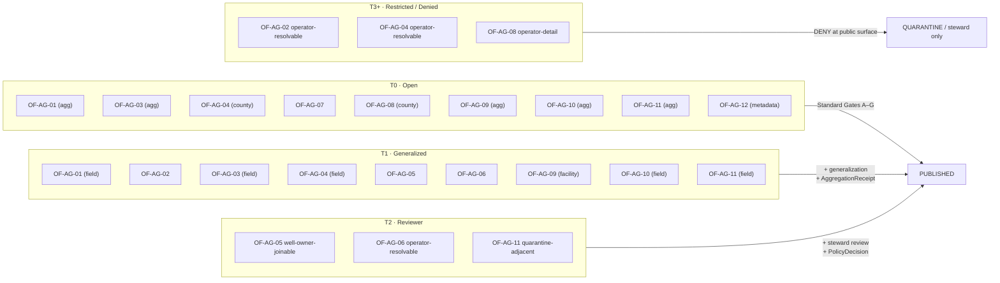

<!-- [KFM_META_BLOCK_V2]
doc_id: kfm://doc/00000000-0000-0000-0000-000000000000
title: Agriculture — Object Family Register
type: standard
version: v1
status: draft
owners: agriculture-stewards (TODO confirm CODEOWNERS)
created: 2026-05-26
updated: 2026-05-26
policy_label: public
related:
  - ai-build-operating-contract.md
  - directory-rules.md
  - docs/domains/agriculture/README.md
  - docs/domains/agriculture/DOMAIN.md
  - docs/domains/agriculture/OBJECTS.md
  - docs/domains/agriculture/SENSITIVITY.md
  - docs/domains/agriculture/CROSS_LANE.md
  - docs/domains/agriculture/MISSING_OR_PLANNED_FILES.md
  - contracts/domains/agriculture/
  - schemas/contracts/v1/domains/agriculture/
  - policy/domains/agriculture/
  - tests/domains/agriculture/
  - fixtures/domains/agriculture/
  - docs/registers/OBJECT_FAMILY_MAP.md
  - docs/registers/VERIFICATION_BACKLOG.md
tags: [kfm, domain, agriculture, register, object-families]
notes:
  - Pinned to CONTRACT_VERSION = "3.0.0".
  - Conformance language follows RFC 2119 / RFC 8174 per directory-rules.md §2.2.
  - Repository is not mounted in this session; all path-shaped claims are PROPOSED.
  - This file is a per-domain register; OBJECTS.md is the narrative reference.
  - Sensitive-domain routing deferred to ai-build-operating-contract.md §23.2.
[/KFM_META_BLOCK_V2] -->

# 🌾 Agriculture — Object Family Register

> **Purpose.** The **register-form** inventory of Agriculture object families, keyed by stable family ID, listing canonical placement (contract path, schema path, policy paths, fixture paths, validators), sensitivity defaults, source-role set, and cross-lane citation edges. This file feeds the cross-domain `docs/registers/OBJECT_FAMILY_MAP.md` and is designed to be consumed by tooling and reviewers. For per-family narrative, definitions, and key-field discussion, see `docs/domains/agriculture/OBJECTS.md`.

<p>
  
  
  
  
  
  
  
  
  
  
</p>

**Status** · `draft` &nbsp;·&nbsp; **Owners** · `agriculture-stewards` *(TODO confirm CODEOWNERS)* &nbsp;·&nbsp; **Updated** · `2026-05-26` &nbsp;·&nbsp; **Contract** · `CONTRACT_VERSION = "3.0.0"` &nbsp;·&nbsp; **Companion** · [`OBJECTS.md`](OBJECTS.md)

> [!CAUTION]
> **Sensitive-domain routing.** Several Agriculture object families carry operator-resolvable, private-parcel-adjacent, or quarantine-adjacent semantics. Disposition for any concrete public surface MUST be routed through `ai-build-operating-contract.md` §23.2 (Sensitive-Domain Decision Matrix). The most restrictive applicable row applies. Default posture for field-level or operator-resolved Agriculture data is **DENY public exact exposure → GENERALIZE → REQUIRE steward review → REQUIRE `AggregationReceipt` or `RedactionReceipt`**. Disposition is **not** re-derived here.

---

## 📑 Contents

1. [Scope & posture](#1-scope--posture)
2. [Evidence basis](#2-evidence-basis)
3. [Register conventions](#3-register-conventions)
4. [Master register](#4-master-register)
5. [Per-family register entries](#5-per-family-register-entries)
   - 5.01 [`OF-AG-01 · CropObservation`](#501-of-ag-01--cropobservation)
   - 5.02 [`OF-AG-02 · FieldCandidate`](#502-of-ag-02--fieldcandidate)
   - 5.03 [`OF-AG-03 · CropRotation`](#503-of-ag-03--croprotation)
   - 5.04 [`OF-AG-04 · YieldObservation`](#504-of-ag-04--yieldobservation)
   - 5.05 [`OF-AG-05 · IrrigationLink`](#505-of-ag-05--irrigationlink)
   - 5.06 [`OF-AG-06 · ConservationPractice`](#506-of-ag-06--conservationpractice)
   - 5.07 [`OF-AG-07 · SoilCropSuitability`](#507-of-ag-07--soilcropsuitability)
   - 5.08 [`OF-AG-08 · AgriculturalEconomyObservation`](#508-of-ag-08--agriculturaleconomyobservation)
   - 5.09 [`OF-AG-09 · SupplyChainNode`](#509-of-ag-09--supplychainnode)
   - 5.10 [`OF-AG-10 · DroughtStressIndicator`](#510-of-ag-10--droughtstressindicator)
   - 5.11 [`OF-AG-11 · PestStressIndicator`](#511-of-ag-11--peststressindicator)
   - 5.12 [`OF-AG-12 · AggregationReceipt`](#512-of-ag-12--aggregationreceipt)
6. [Source-role matrix](#6-source-role-matrix)
7. [Citing-domains crosswalk](#7-citing-domains-crosswalk)
8. [Sensitivity tier rollup](#8-sensitivity-tier-rollup)
9. [Open questions register](#9-open-questions-register)
10. [Verification backlog](#10-verification-backlog)
11. [Changelog](#11-changelog)
12. [Definition of done](#12-definition-of-done)
13. [Related docs](#13-related-docs)

---

## 1. Scope & posture

This file is the **per-domain register** of Agriculture object families. It is intentionally terse, table-driven, and ID-keyed; it complements (it does **not** replace) the narrative reference in [`docs/domains/agriculture/OBJECTS.md`](OBJECTS.md).

| Role | This file (`OBJECT_FAMILIES.md`) | Companion (`OBJECTS.md`) |
|---|---|---|
| Form | Register / inventory | Narrative reference |
| Audience | Reviewers, tooling, ADR authors | Contributors learning the domain |
| Per-family depth | Placement + IDs + sensitivity + sources | Meaning + key fields + cross-lane edges |
| Authority for IDs | **This file** (`OF-AG-NN`) | — |
| Authority for meaning | — | `OBJECTS.md` §6 |
| Authority for placement contracts | **This file** (PROPOSED until verified) | — |

> [!IMPORTANT]
> **Repository is not mounted in this session.** Object **names** and **doctrine-level placement** are `CONFIRMED` from Atlas v1.1 §9 E, ENCY §7.7, and `directory-rules.md` §6 / §12. Concrete **contract files**, **schema files**, **policy bundles**, **validators**, and **fixtures** are `PROPOSED` until verified against a mounted repo or accepted ADR. *(`ai-build-operating-contract.md` §11.)*

### 1.1 What this file is

- The **authoritative ID register** for Agriculture object families (`OF-AG-01` … `OF-AG-12`).
- A **placement contract** between family IDs and their `contracts/` / `schemas/` / `policy/` / `tests/` / `fixtures/` paths.
- A **feeder** for `docs/registers/OBJECT_FAMILY_MAP.md` (cross-domain register).
- A **sensitive-domain index** showing which families default to which tier and which escalations apply.

### 1.2 What this file is **not**

- ❌ A schema definition — JSON Schemas live under `schemas/contracts/v1/domains/agriculture/`.
- ❌ A semantic contract — Markdown contracts live under `contracts/domains/agriculture/`.
- ❌ A policy bundle — admissibility rules live under `policy/domains/agriculture/`.
- ❌ A narrative reference — narrative lives in [`OBJECTS.md`](OBJECTS.md).
- ❌ A repo status report — no row claims a contract, schema, policy, or test exists today.

### 1.3 Truth labels used

This file uses the authoring labels from `ai-build-operating-contract.md` §8: **CONFIRMED**, **INFERRED**, **PROPOSED**, **UNKNOWN**, **NEEDS VERIFICATION**, **CONFLICTED**, **LINEAGE**, **EXPLORATORY**, **EXTERNAL**. Runtime outcomes (`ANSWER` / `ABSTAIN` / `DENY` / `ERROR` / `NARROWED` / `BOUNDED` / `SOURCE_STALE`) are not used as rhetorical hedging in prose. Memory is not evidence.

[⤴ Back to top](#-contents)

---

## 2. Evidence basis

| Source ID | Document | Role here | Citation |
|---|---|---|---|
| `OPCON` | `ai-build-operating-contract.md` (v3.0; `CONTRACT_VERSION = "3.0.0"`) | Operating contract; §8 truth labels; §23.2 sensitive-domain matrix; §34 receipt discipline; §37 lifecycle | CONFIRMED doctrine |
| `DIRRULES` | `directory-rules.md` (v1.3) | Lane placement (§6.3, §6.4, §6.5, §12); register-file pattern (§15) | CONFIRMED doctrine |
| `ATLAS-v1.1` | `Kansas Frontier Matrix - Domains v1.1 + Pass 23/32 Consolidated Atlas` | Agriculture dossier (§9 A–N); object family spine; cross-lane edges; sensitivity defaults | CONFIRMED doctrine |
| `ENCY` | `KFM_Encyclopedia.md` / `kfm_unified_doctrine_synthesis.md` | Per-domain sensitivity matrix (§16); cross-lane anti-collapse (§17); object family index | CONFIRMED doctrine |
| `BUILD-MANUAL` | `KFM_Unified_Implementation_Architecture_Build_Manual.md` | Object map (§7.1); Promotion Gates A–G (§6.2); lifecycle table (§6.1) | CONFIRMED doctrine |
| `OBJECTS-MD` | `docs/domains/agriculture/OBJECTS.md` | Companion narrative reference (this register cross-links to OBJECTS.md §6.N for per-family detail) | CONFIRMED (this session) |

> [!NOTE]
> No external (web) research was performed for this file. All claims are KFM-internal doctrine. Per `ai-build-operating-contract.md` §5 and the v3.0 prompt's `<external_research>` rule, external sources MUST NOT be used to make KFM repo-state or doctrine claims.

[⤴ Back to top](#-contents)

---

## 3. Register conventions

### 3.1 Family ID format

```text
OF-AG-NN   where   OF = Object Family
                   AG = Agriculture (domain code)
                   NN = zero-padded ordinal in Atlas v1.1 §9 E order
```

- IDs are **stable**. Once issued, a family ID MUST NOT be reused for a different family.
- A family may be **retired** (status `LEGACY` or `DEPRECATED`) without renumbering survivors.
- A new family receives `OF-AG-13`, `OF-AG-14`, …, appended in order of ADR ratification.

### 3.2 Status values

Per `ai-build-operating-contract.md` §8 and `directory-rules.md` §15:

| Status | Meaning here |
|---|---|
| `ACTIVE` | Family is named in current doctrine and intended for build. (Used here as `CONFIRMED name` + `PROPOSED placement`.) |
| `PROPOSED` | Family is named but not yet ADR-ratified for Agriculture specifically. |
| `CONFLICTED` | Doctrine and implementation disagree, or two homes compete. |
| `LEGACY` | Retained for lineage; no new authority. |
| `DEPRECATED` | Slated for removal; migration path declared. |

All twelve current families are `ACTIVE` at the doctrine level.

### 3.3 Path placeholders

Every placement path in §4 and §5 is `PROPOSED` per `<repository_preflight>` until a mounted repo confirms it. Per ADR-0001, the canonical schema home is `schemas/contracts/v1/domains/agriculture/`; the canonical contract home is `contracts/domains/agriculture/`; the canonical policy home is `policy/domains/agriculture/` (singular, per ADR-0003 PROPOSED).

### 3.4 Row schema for the master register

Each row in §4 carries: `family_id`, `name`, `owning_lane`, `status`, `contract_path`, `schema_path`, `primary_policy_paths`, `primary_validator_refs`, `sensitivity_default`, `source_role_set`, `cites`, `cited_by`. Per-family detail in §5 expands the same row into a stable form.

[⤴ Back to top](#-contents)

---

## 4. Master register

> Twelve object families, ordered as Atlas v1.1 §9 E. All twelve **names** are CONFIRMED; all placement paths are PROPOSED.

| ID | Name | Owning lane | Sensitivity default | Source roles *(subset)* | Cites | Cited by |
|---|---|---|---|---|---|---|
| `OF-AG-01` | `CropObservation` | Observation | T0 agg · T1 field | authority · observation · model · aggregate | Soil · Atmosphere | Frontier Matrix · Hazards |
| `OF-AG-02` | `FieldCandidate` | Observation candidate | T1 · T3+ if op-resolvable | model · observation | — | (none at public release) |
| `OF-AG-03` | `CropRotation` | Derived observation | T0 agg · T1 field | model · observation | Soil | Soil · Frontier Matrix |
| `OF-AG-04` | `YieldObservation` | Observation | T0 agg · T1 field · **T3+ if op-resolvable** | authority · observation · aggregate | Atmosphere | Frontier Matrix · Hazards |
| `OF-AG-05` | `IrrigationLink` | Cross-domain edge (Hydrology) | T1 · T2 if well-owner joinable | authority · observation · context | Hydrology · People/Land | Hydrology · Frontier Matrix |
| `OF-AG-06` | `ConservationPractice` | Practice observation | T1 · T2 if op-resolvable | authority · model · context | Soil · Hydrology | Soil · Frontier Matrix |
| `OF-AG-07` | `SoilCropSuitability` | Derived model | T0 | model | Soil | Frontier Matrix · UI |
| `OF-AG-08` | `AgriculturalEconomyObservation` | Aggregate observation | T0 county · **DENY op-detail** | authority · aggregate | Settlements | Frontier Matrix · Settlements |
| `OF-AG-09` | `SupplyChainNode` | Topology node | T0 agg · T1+ facility detail | authority · observation · context | Roads/Rail · Settlements | Roads/Rail · Frontier Matrix |
| `OF-AG-10` | `DroughtStressIndicator` | Derived indicator | T0 agg · T1 field | model | Atmosphere · Hydrology | Hazards · Frontier Matrix |
| `OF-AG-11` | `PestStressIndicator` | Derived indicator | T0 agg · T1 field · **T2+ if quarantine-adjacent** | model · authority · observation | Atmosphere · Flora · Fauna | Hazards · Frontier Matrix |
| `OF-AG-12` | `AggregationReceipt` | Receipt *(🟧 home pending ADR-S-03)* | T0 metadata · payload-bound | n/a (receipt) | (all OF-AG-01..11) | Catalog · Release |

Legend: 🟧 *blocked on an ADR*. Source-role subsets are exhaustive for the family; not every source-role role applies to every family.

[⤴ Back to top](#-contents)

---

## 5. Per-family register entries

Each entry below is a **register row** with stable fields. For narrative meaning, key-field discussion, and source-role anti-collapse examples, see [`OBJECTS.md` §6.N](OBJECTS.md#6-per-object-detail).

### 5.01 `OF-AG-01 · CropObservation`

- **Status.** `ACTIVE` · CONFIRMED name (Atlas v1.1 §9 E) · PROPOSED placement.
- **Owning lane.** Observation.
- **Contract path** *(PROPOSED).* `contracts/domains/agriculture/crop_observation.md`
- **Schema path** *(PROPOSED).* `schemas/contracts/v1/domains/agriculture/crop_observation.schema.json`
- **Primary policy paths** *(PROPOSED).* `policy/domains/agriculture/sensitivity.<ext>` · `policy/domains/agriculture/rights.<ext>` · `policy/domains/agriculture/promotion.<ext>`
- **Primary validator refs** *(PROPOSED).* `tests/domains/agriculture/schema_validation/` · `…/source_descriptor/` · `…/temporal_logic/` · `…/geometry_validity/` · `…/evidence_closure/` · `…/citation_validation/`
- **Fixture roots** *(PROPOSED).* `fixtures/domains/agriculture/valid/crop_observation/` · `…/invalid/crop_observation/` · `…/no_network/nass_quickstats_county/`
- **Source-role set.** `authority` (NASS Crop Progress aggregate) · `observation` (Mesonet, USCRN, SCAN) · `context` (HLS-VI imagery) · `model` (CDL classified raster) · `aggregate` (roll-up).
- **Sensitivity default.** T0 (aggregate) · T1 (field candidate).
- **Sensitivity escalation.** T3+ if joined to operator identity. DENY operator × parcel joins at public release.
- **Cites.** Soil (`SoilCropSuitability` lookup) · Atmosphere (`WeatherObservation` for stress context).
- **Cited by.** Frontier Matrix (county-year panels) · Hazards (drought).
- **Identity rule.** Per [`OBJECTS.md` §10](OBJECTS.md#10-identity-temporal-and-digest-rules).
- **Promotion-gate critical for.** Gate C (Sensitivity) when support geometry is field-level; Gate E (Evidence closure).
- **Narrative reference.** [`OBJECTS.md` §6.1](OBJECTS.md#61-cropobservation).
- **Open questions.** `OQ-AG-OBJ-02`, `OQ-AG-OBJ-03`, `OQ-AG-OBJ-06`.

[⤴ Back to top](#-contents)

### 5.02 `OF-AG-02 · FieldCandidate`

- **Status.** `ACTIVE` · CONFIRMED name · PROPOSED placement.
- **Owning lane.** Observation candidate.
- **Contract path** *(PROPOSED).* `contracts/domains/agriculture/field_candidate.md`
- **Schema path** *(PROPOSED).* `schemas/contracts/v1/domains/agriculture/field_candidate.schema.json`
- **Primary policy paths** *(PROPOSED).* `policy/domains/agriculture/sensitivity.<ext>` · `policy/domains/agriculture/redaction_profiles.yaml`
- **Primary validator refs** *(PROPOSED).* `tests/domains/agriculture/schema_validation/` · `…/geometry_validity/` · `…/policy_deny/` (operator-join paths) · `…/source_role_mismatch/`
- **Fixture roots** *(PROPOSED).* `fixtures/domains/agriculture/valid/field_candidate/` · `…/invalid/field_candidate/` · `…/no_network/county_year_panel/`
- **Source-role set.** `model` (CDL-classified field) · `observation` (Mesonet station footprint as proxy).
- **Sensitivity default.** T1.
- **Sensitivity escalation.** **T3+ if joined to operator identity** (ENCY §17). DENY at public surface.
- **Cites.** — *(it produces candidates rather than citing other lanes by default)*.
- **Cited by.** None at public release (operator joins DENY).
- **Identity rule.** Per [`OBJECTS.md` §10](OBJECTS.md#10-identity-temporal-and-digest-rules).
- **Promotion-gate critical for.** Gate C (Sensitivity); Gate G (Review) for any operator-resolvable variant.
- **Narrative reference.** [`OBJECTS.md` §6.2](OBJECTS.md#62-fieldcandidate).
- **Open questions.** `OQ-AG-OBJ-04` (confidence representation).

> [!WARNING]
> A `FieldCandidate` is **not** a survey-confirmed field. Treating it as one is a source-role collapse (`model` → `authority`) and MUST be denied at promotion.

[⤴ Back to top](#-contents)

### 5.03 `OF-AG-03 · CropRotation`

- **Status.** `ACTIVE` · CONFIRMED name · PROPOSED placement.
- **Owning lane.** Derived observation.
- **Contract path** *(PROPOSED).* `contracts/domains/agriculture/crop_rotation.md`
- **Schema path** *(PROPOSED).* `schemas/contracts/v1/domains/agriculture/crop_rotation.schema.json`
- **Primary policy paths** *(PROPOSED).* `policy/domains/agriculture/sensitivity.<ext>` · `policy/domains/agriculture/promotion.<ext>`
- **Primary validator refs** *(PROPOSED).* `tests/domains/agriculture/temporal_logic/` · `…/non_regression/` · `…/source_role_mismatch/`
- **Fixture roots** *(PROPOSED).* `fixtures/domains/agriculture/valid/crop_rotation/` · `…/invalid/crop_rotation/`
- **Source-role set.** `model` (rotation inferred from CDL series) · `observation` (rotation declared by survey).
- **Sensitivity default.** T0 (aggregate) · T1 (field-level).
- **Sensitivity escalation.** T3+ if operator-resolvable.
- **Cites.** Soil (rotation × suitability discussion).
- **Cited by.** Soil · Frontier Matrix (county histories).
- **Identity rule.** Per [`OBJECTS.md` §10](OBJECTS.md#10-identity-temporal-and-digest-rules).
- **Promotion-gate critical for.** Gate D (Schema) for multi-year sequence shape; Gate E (Evidence closure) for series provenance.
- **Narrative reference.** [`OBJECTS.md` §6.3](OBJECTS.md#63-croprotation).

[⤴ Back to top](#-contents)

### 5.04 `OF-AG-04 · YieldObservation`

- **Status.** `ACTIVE` · CONFIRMED name · PROPOSED placement.
- **Owning lane.** Observation.
- **Contract path** *(PROPOSED).* `contracts/domains/agriculture/yield_observation.md`
- **Schema path** *(PROPOSED).* `schemas/contracts/v1/domains/agriculture/yield_observation.schema.json`
- **Primary policy paths** *(PROPOSED).* `policy/domains/agriculture/sensitivity.<ext>` · `policy/domains/agriculture/deny_by_default/` · `policy/domains/agriculture/redaction_profiles.yaml`
- **Primary validator refs** *(PROPOSED).* `tests/domains/agriculture/policy_deny/` · `…/aggregation_threshold/` · `…/temporal_logic/` · `…/source_role_mismatch/`
- **Fixture roots** *(PROPOSED).* `fixtures/domains/agriculture/valid/yield_observation/` · `…/invalid/yield_observation/` · `…/no_network/county_year_panel/`
- **Source-role set.** `authority` (NASS county estimates) · `observation` (field-reported) · `aggregate` (computed roll-up).
- **Sensitivity default.** T0 county / region · T1 field-level.
- **Sensitivity escalation.** **T3+ DENY when operator-resolvable.** Joining `YieldObservation × FieldCandidate × parcel × operator` is a known source-role-and-privacy collapse pattern. *(ENCY §17.)*
- **Cites.** Atmosphere (`WeatherObservation` drought context).
- **Cited by.** Frontier Matrix · Hazards (drought attribution).
- **Identity rule.** Per [`OBJECTS.md` §10](OBJECTS.md#10-identity-temporal-and-digest-rules).
- **Promotion-gate critical for.** Gate C (Sensitivity) — single highest-frequency failure point for Agriculture.
- **Narrative reference.** [`OBJECTS.md` §6.4](OBJECTS.md#64-yieldobservation).
- **Open questions.** `OQ-AG-OBJ-06` (threshold profiles).

[⤴ Back to top](#-contents)

### 5.05 `OF-AG-05 · IrrigationLink`

- **Status.** `ACTIVE` · CONFIRMED name · PROPOSED placement.
- **Owning lane.** Cross-domain edge (Hydrology-cited).
- **Contract path** *(PROPOSED).* `contracts/domains/agriculture/irrigation_link.md`
- **Schema path** *(PROPOSED).* `schemas/contracts/v1/domains/agriculture/irrigation_link.schema.json`
- **Primary policy paths** *(PROPOSED).* `policy/domains/agriculture/sensitivity.<ext>` · `policy/domains/agriculture/rights.<ext>`
- **Primary validator refs** *(PROPOSED).* `tests/domains/agriculture/schema_validation/` · `…/rights_validation/` · `…/citation_validation/`
- **Fixture roots** *(PROPOSED).* `fixtures/domains/agriculture/valid/irrigation_link/` · `…/invalid/irrigation_link/`
- **Source-role set.** `authority` (state water-right records) · `observation` (Mesonet near pivot) · `context` (well-log neighborhood).
- **Sensitivity default.** T1.
- **Sensitivity escalation.** T2 if well-owner joinable.
- **Cites.** Hydrology (well, withdrawal, HUC reach) · People/Land (water-right ownership).
- **Cited by.** Hydrology · Frontier Matrix.
- **Identity rule.** Per [`OBJECTS.md` §10](OBJECTS.md#10-identity-temporal-and-digest-rules).
- **Promotion-gate critical for.** Gate B (Rights) for water-right citation closure; Gate C (Sensitivity) for well-owner joins.
- **Narrative reference.** [`OBJECTS.md` §6.5](OBJECTS.md#65-irrigationlink).

[⤴ Back to top](#-contents)

### 5.06 `OF-AG-06 · ConservationPractice`

- **Status.** `ACTIVE` · CONFIRMED name · PROPOSED placement.
- **Owning lane.** Practice observation.
- **Contract path** *(PROPOSED).* `contracts/domains/agriculture/conservation_practice.md`
- **Schema path** *(PROPOSED).* `schemas/contracts/v1/domains/agriculture/conservation_practice.schema.json`
- **Primary policy paths** *(PROPOSED).* `policy/domains/agriculture/sensitivity.<ext>` · `policy/domains/agriculture/rights.<ext>`
- **Primary validator refs** *(PROPOSED).* `tests/domains/agriculture/schema_validation/` · `…/temporal_logic/` · `…/source_role_mismatch/`
- **Fixture roots** *(PROPOSED).* `fixtures/domains/agriculture/valid/conservation_practice/` · `…/invalid/conservation_practice/`
- **Source-role set.** `authority` (NRCS practice records when public) · `model` (RS-classified) · `context` (county practice survey).
- **Sensitivity default.** T1.
- **Sensitivity escalation.** T2 if operator-resolvable.
- **Cites.** Soil (erosion outcomes) · Hydrology (riparian).
- **Cited by.** Soil · Frontier Matrix.
- **Identity rule.** Per [`OBJECTS.md` §10](OBJECTS.md#10-identity-temporal-and-digest-rules).
- **Promotion-gate critical for.** Gate B (Rights) · Gate C (Sensitivity).
- **Narrative reference.** [`OBJECTS.md` §6.6](OBJECTS.md#66-conservationpractice).

[⤴ Back to top](#-contents)

### 5.07 `OF-AG-07 · SoilCropSuitability`

- **Status.** `ACTIVE` · CONFIRMED name · PROPOSED placement.
- **Owning lane.** Derived model. *(Agriculture-owned because the scoring lives here; the soil truth does not.)*
- **Contract path** *(PROPOSED).* `contracts/domains/agriculture/soil_crop_suitability.md`
- **Schema path** *(PROPOSED).* `schemas/contracts/v1/domains/agriculture/soil_crop_suitability.schema.json`
- **Primary policy paths** *(PROPOSED).* `policy/domains/agriculture/promotion.<ext>`
- **Primary validator refs** *(PROPOSED).* `tests/domains/agriculture/schema_validation/` · `…/citation_validation/` · `…/source_role_mismatch/`
- **Fixture roots** *(PROPOSED).* `fixtures/domains/agriculture/valid/soil_crop_suitability/` · `…/invalid/soil_crop_suitability/`
- **Source-role set.** `model` only. Source-role collapse to `authority` is forbidden.
- **Sensitivity default.** T0.
- **Sensitivity escalation.** None standard.
- **Cites.** Soil (`MUKEY`, `SoilComponent`).
- **Cited by.** Frontier Matrix · UI.
- **Identity rule.** Per [`OBJECTS.md` §10](OBJECTS.md#10-identity-temporal-and-digest-rules).
- **Promotion-gate critical for.** Gate F (Catalog / provenance) — model version + input EvidenceRefs MUST close.
- **Narrative reference.** [`OBJECTS.md` §6.7](OBJECTS.md#67-soilcropsuitability).
- **Open questions.** `OQ-AG-OBJ-05` (score scheme); `OQ-AG-OBJ-08` (model_version representation).

> [!NOTE]
> UI surfaces MUST present `SoilCropSuitability` with a source-role indicator (`model`). Rendering a model output as observed truth is a publication defect, not a UX nit.

[⤴ Back to top](#-contents)

### 5.08 `OF-AG-08 · AgriculturalEconomyObservation`

- **Status.** `ACTIVE` · CONFIRMED name · PROPOSED placement.
- **Owning lane.** Aggregate observation.
- **Contract path** *(PROPOSED).* `contracts/domains/agriculture/agricultural_economy_observation.md`
- **Schema path** *(PROPOSED).* `schemas/contracts/v1/domains/agriculture/agricultural_economy_observation.schema.json`
- **Primary policy paths** *(PROPOSED).* `policy/domains/agriculture/sensitivity.<ext>` · `policy/domains/agriculture/deny_by_default/` · `policy/domains/agriculture/rights.<ext>`
- **Primary validator refs** *(PROPOSED).* `tests/domains/agriculture/policy_deny/` · `…/aggregation_threshold/` · `…/rights_validation/`
- **Fixture roots** *(PROPOSED).* `fixtures/domains/agriculture/valid/agricultural_economy_observation/` · `…/invalid/agricultural_economy_observation/`
- **Source-role set.** `authority` (NASS QuickStats / Census of Agriculture) · `aggregate` (computed roll-up).
- **Sensitivity default.** T0 county / region.
- **Sensitivity escalation.** **DENY operator-detail level** (NASS confidentiality + KFM policy compose).
- **Cites.** Settlements (market towns historically).
- **Cited by.** Frontier Matrix · Settlements.
- **Identity rule.** Per [`OBJECTS.md` §10](OBJECTS.md#10-identity-temporal-and-digest-rules).
- **Promotion-gate critical for.** Gate B (Rights — NASS confidentiality) · Gate C (Sensitivity).
- **Narrative reference.** [`OBJECTS.md` §6.8](OBJECTS.md#68-agriculturaleconomyobservation).

[⤴ Back to top](#-contents)

### 5.09 `OF-AG-09 · SupplyChainNode`

- **Status.** `ACTIVE` · CONFIRMED name · PROPOSED placement.
- **Owning lane.** Topology node.
- **Contract path** *(PROPOSED).* `contracts/domains/agriculture/supply_chain_node.md`
- **Schema path** *(PROPOSED).* `schemas/contracts/v1/domains/agriculture/supply_chain_node.schema.json`
- **Primary policy paths** *(PROPOSED).* `policy/domains/agriculture/sensitivity.<ext>` · `policy/domains/agriculture/rights.<ext>`
- **Primary validator refs** *(PROPOSED).* `tests/domains/agriculture/schema_validation/` · `…/geometry_validity/` · `…/rights_validation/`
- **Fixture roots** *(PROPOSED).* `fixtures/domains/agriculture/valid/supply_chain_node/` · `…/invalid/supply_chain_node/`
- **Source-role set.** `authority` (regulatory facility registries) · `observation` (field survey) · `context` (industry directories).
- **Sensitivity default.** T0 aggregate · T1+ specific facility detail.
- **Sensitivity escalation.** Where rights restrict capacity disclosure, DENY capacity at public surface.
- **Cites.** Roads/Rail (corridor adjacency) · Settlements (host town).
- **Cited by.** Roads/Rail · Frontier Matrix.
- **Identity rule.** Per [`OBJECTS.md` §10](OBJECTS.md#10-identity-temporal-and-digest-rules).
- **Promotion-gate critical for.** Gate B (Rights — restricted capacity terms).
- **Narrative reference.** [`OBJECTS.md` §6.9](OBJECTS.md#69-supplychainnode).
- **Open questions.** `OQ-AG-OBJ-07` (Agriculture-owned vs. Roads/Rail-shared).

[⤴ Back to top](#-contents)

### 5.10 `OF-AG-10 · DroughtStressIndicator`

- **Status.** `ACTIVE` · CONFIRMED name · PROPOSED placement.
- **Owning lane.** Derived indicator.
- **Contract path** *(PROPOSED).* `contracts/domains/agriculture/drought_stress_indicator.md`
- **Schema path** *(PROPOSED).* `schemas/contracts/v1/domains/agriculture/drought_stress_indicator.schema.json`
- **Primary policy paths** *(PROPOSED).* `policy/domains/agriculture/promotion.<ext>`
- **Primary validator refs** *(PROPOSED).* `tests/domains/agriculture/citation_validation/` · `…/source_role_mismatch/` · `…/stale_state/`
- **Fixture roots** *(PROPOSED).* `fixtures/domains/agriculture/valid/drought_stress_indicator/` · `…/invalid/drought_stress_indicator/`
- **Source-role set.** `model` only (composite by construction).
- **Sensitivity default.** T0 aggregate · T1 field-level.
- **Sensitivity escalation.** None standard; alert-authority claims DENY (Hazards owns alerts).
- **Cites.** Atmosphere (`WeatherObservation`) · Hydrology (water-stress context).
- **Cited by.** Hazards (drought context) · Frontier Matrix.
- **Identity rule.** Per [`OBJECTS.md` §10](OBJECTS.md#10-identity-temporal-and-digest-rules).
- **Promotion-gate critical for.** Gate F (Catalog / provenance) — input EvidenceRefs MUST close; `model_version` MUST be carried.
- **Narrative reference.** [`OBJECTS.md` §6.10](OBJECTS.md#610-droughtstressindicator).
- **Open questions.** `OQ-AG-OBJ-08` (model_version representation).

[⤴ Back to top](#-contents)

### 5.11 `OF-AG-11 · PestStressIndicator`

- **Status.** `ACTIVE` · CONFIRMED name · PROPOSED placement.
- **Owning lane.** Derived indicator.
- **Contract path** *(PROPOSED).* `contracts/domains/agriculture/pest_stress_indicator.md`
- **Schema path** *(PROPOSED).* `schemas/contracts/v1/domains/agriculture/pest_stress_indicator.schema.json`
- **Primary policy paths** *(PROPOSED).* `policy/domains/agriculture/sensitivity.<ext>` · `policy/domains/agriculture/promotion.<ext>` · `policy/domains/agriculture/rights.<ext>`
- **Primary validator refs** *(PROPOSED).* `tests/domains/agriculture/citation_validation/` · `…/source_role_mismatch/` · `…/policy_deny/` (quarantine-adjacent paths)
- **Fixture roots** *(PROPOSED).* `fixtures/domains/agriculture/valid/pest_stress_indicator/` · `…/invalid/pest_stress_indicator/`
- **Source-role set.** `model` (composite) · `authority` (regulatory detection record when public) · `observation` (scout report).
- **Sensitivity default.** T0 aggregate · T1 field-level.
- **Sensitivity escalation.** **T2+ if quarantine-adjacent** (regulatory disclosure constraints).
- **Cites.** Atmosphere (vector conditions) · Flora (host) · Fauna (vector).
- **Cited by.** Hazards · Frontier Matrix.
- **Identity rule.** Per [`OBJECTS.md` §10](OBJECTS.md#10-identity-temporal-and-digest-rules).
- **Promotion-gate critical for.** Gate B (Rights — regulatory disclosure terms) · Gate C (Sensitivity).
- **Narrative reference.** [`OBJECTS.md` §6.11](OBJECTS.md#611-peststressindicator).

[⤴ Back to top](#-contents)

### 5.12 `OF-AG-12 · AggregationReceipt`

- **Status.** `ACTIVE` · CONFIRMED name · 🟧 **PROPOSED placement — schema home pending ADR-S-03**.
- **Owning lane.** Receipt. *(Home open: `schemas/contracts/v1/domains/agriculture/` vs. `schemas/contracts/v1/receipts/`.)*
- **Contract path** *(PROPOSED).* `contracts/domains/agriculture/aggregation_receipt.md` *(or `contracts/runtime/aggregation_receipt.md` per ADR-S-03)*
- **Schema path** *(PROPOSED).* `schemas/contracts/v1/domains/agriculture/aggregation_receipt.schema.json` *(or `schemas/contracts/v1/receipts/aggregation_receipt.schema.json` per ADR-S-03)*
- **Primary policy paths** *(PROPOSED).* `policy/domains/agriculture/redaction_profiles.yaml` · `policy/domains/agriculture/promotion.<ext>`
- **Primary validator refs** *(PROPOSED).* `tests/domains/agriculture/aggregation_threshold/` · `…/release_manifest/` · `…/non_regression/`
- **Fixture roots** *(PROPOSED).* `fixtures/domains/agriculture/valid/aggregation_receipt/` · `…/invalid/aggregation_receipt/`
- **Source-role set.** n/a (receipt object, not an observation).
- **Sensitivity default.** T0 receipt metadata. **Payload sensitivity bound by source tier; the receipt does not launder it.**
- **Sensitivity escalation.** Receipt metadata only ever exposes counts, thresholds, method names, and run IDs — not source rows.
- **Cites.** (all OF-AG-01..11) via `inputs_evidence_refs[]`.
- **Cited by.** Catalog · Release (referenced by `ReleaseManifest`).
- **Identity rule.** `digest(aggregation_method, inputs_digest, threshold_profile, run_id)` — distinct from §10 because it is a receipt, not an observation.
- **Promotion-gate critical for.** Gate E (Evidence closure — emit at) · Gate G (Review / release / rollback — reference at).
- **Narrative reference.** [`OBJECTS.md` §6.12](OBJECTS.md#612-aggregationreceipt).
- **Open questions.** `OQ-AG-OBJ-01` (schema home) · `OQ-AG-OBJ-06` (threshold profiles).

> [!IMPORTANT]
> `AggregationReceipt` is the load-bearing object for Agriculture's most common transformation — *field → county/HUC aggregate*. Its placement home is **open under ADR-S-03**. Until resolved, **DO NOT** author parallel definitions; pick the agreed home in `MISSING_OR_PLANNED_FILES.md` §7 and migrate from there.

[⤴ Back to top](#-contents)

---

## 6. Source-role matrix

Source-role anti-collapse is the single most common silent failure pattern in KFM publication (ENCY §17). This matrix shows which roles each Agriculture family carries; the matrix MUST be enforced by `tests/domains/agriculture/source_role_mismatch/` fixtures.

| Family | `authority` | `observation` | `context` | `model` | `aggregate` |
|---|:---:|:---:|:---:|:---:|:---:|
| `OF-AG-01 · CropObservation` | ✓ | ✓ | ✓ | ✓ | ✓ |
| `OF-AG-02 · FieldCandidate` | ✗ | ✓ | ✗ | ✓ | ✗ |
| `OF-AG-03 · CropRotation` | ✗ | ✓ | ✗ | ✓ | ✓ |
| `OF-AG-04 · YieldObservation` | ✓ | ✓ | ✗ | ✗ | ✓ |
| `OF-AG-05 · IrrigationLink` | ✓ | ✓ | ✓ | ✗ | ✗ |
| `OF-AG-06 · ConservationPractice` | ✓ | ✗ | ✓ | ✓ | ✗ |
| `OF-AG-07 · SoilCropSuitability` | ✗ | ✗ | ✗ | ✓ | ✗ |
| `OF-AG-08 · AgriculturalEconomyObservation` | ✓ | ✗ | ✗ | ✗ | ✓ |
| `OF-AG-09 · SupplyChainNode` | ✓ | ✓ | ✓ | ✗ | ✗ |
| `OF-AG-10 · DroughtStressIndicator` | ✗ | ✗ | ✗ | ✓ | ✗ |
| `OF-AG-11 · PestStressIndicator` | ✓ | ✓ | ✗ | ✓ | ✗ |
| `OF-AG-12 · AggregationReceipt` | — | — | — | — | — |

> [!NOTE]
> The KFM source-role taxonomy is doctrinally a **seven-role** set; the five roles shown here (`authority` / `observation` / `context` / `model` / `aggregate`) are the subset directly evidenced in this session. The remaining two role names are CONFIRMED to exist in doctrine but not enumerated in current-session evidence; they are tracked under `OQ-AG-OBJ-09` until ADR-S-04 ratifies the canonical vocabulary.

[⤴ Back to top](#-contents)

---

## 7. Citing-domains crosswalk

Cross-lane edges per Atlas v1.1 §9 F, ENCY §17, and the master object-family cross-domain index. Every edge MUST preserve the cited family's `EvidenceBundle`, `source_role`, sensitivity tier, and release state.

| Family | Cites | Cited by |
|---|---|---|
| `OF-AG-01 · CropObservation` | Soil · Atmosphere | Frontier Matrix · Hazards |
| `OF-AG-02 · FieldCandidate` | — | (none at public release) |
| `OF-AG-03 · CropRotation` | Soil | Soil · Frontier Matrix |
| `OF-AG-04 · YieldObservation` | Atmosphere | Frontier Matrix · Hazards |
| `OF-AG-05 · IrrigationLink` | Hydrology · People/Land | Hydrology · Frontier Matrix |
| `OF-AG-06 · ConservationPractice` | Soil · Hydrology | Soil · Frontier Matrix |
| `OF-AG-07 · SoilCropSuitability` | Soil | Frontier Matrix · UI |
| `OF-AG-08 · AgriculturalEconomyObservation` | Settlements | Frontier Matrix · Settlements |
| `OF-AG-09 · SupplyChainNode` | Roads/Rail · Settlements | Roads/Rail · Frontier Matrix |
| `OF-AG-10 · DroughtStressIndicator` | Atmosphere · Hydrology | Hazards · Frontier Matrix |
| `OF-AG-11 · PestStressIndicator` | Atmosphere · Flora · Fauna | Hazards · Frontier Matrix |
| `OF-AG-12 · AggregationReceipt` | `OF-AG-01..11` | Catalog · Release |

> [!WARNING]
> The **`Agriculture × People/Land`** edge is special: `IrrigationLink` may cite People/Land for water-right ownership, but every other operator × parcel join MUST DENY at public release per ENCY §17.

[⤴ Back to top](#-contents)

---

## 8. Sensitivity tier rollup



> [!IMPORTANT]
> **Tier is resolved against the shape released, not against the family name.** `OF-AG-04 · YieldObservation` may publish at T0 as a county roll-up and at the same time DENY at T3+ when joined to operator identity. Both rows are correct simultaneously. The validator that enforces this is `tests/domains/agriculture/policy_deny/` (PROPOSED).

[⤴ Back to top](#-contents)

---

## 9. Open questions register

| ID | Question | Owner role | Resolution path |
|---|---|---|---|
| OQ-AG-OBJ-01 | Final canonical home for `AggregationReceipt` schema (Agriculture lane vs. shared `receipts/` lane)? | contracts-steward · receipt-steward | ADR-S-03 resolution; single schema authored under the agreed home. |
| OQ-AG-OBJ-02 | Per-family canonical key-field set. | contracts-steward · agriculture-stewards | Authored in `contracts/domains/agriculture/<object>.md`; mirrored in schema. |
| OQ-AG-OBJ-03 | Crop-code vocabulary: USDA NASS codes only, or also OGC SOSA / SDG-aligned codes? | contracts-steward · interop-reviewer | Choose authoritative code list per family. |
| OQ-AG-OBJ-04 | `FieldCandidate.confidence` representation (numeric, categorical, both)? | contracts-steward · model-reviewer | Schema authoring decision. |
| OQ-AG-OBJ-05 | `SoilCropSuitability` score scheme (NRCS LCC, continuous index, or both with `score_scheme`)? | model-reviewer · soil-steward | Joint Agriculture × Soil review. |
| OQ-AG-OBJ-06 | Threshold profiles for `AggregationReceipt` (county minimums, HUC k-anonymity, etc.). | sensitivity-steward · agriculture-stewards | `policy/domains/agriculture/redaction_profiles.yaml`. |
| OQ-AG-OBJ-07 | Is `SupplyChainNode` Agriculture-owned or shared with Roads/Rail? | contracts-steward · roads-rail-steward | Cross-lane review; ADR if cross-cutting. |
| OQ-AG-OBJ-08 | `model_version` representation for derived indicators. | model-reviewer | Choose once; apply across `OF-AG-07`, `OF-AG-10`, `OF-AG-11`. |
| OQ-AG-OBJ-09 | The remaining two source roles in the doctrinal seven-role set — what are their canonical names? | source-steward | ADR-S-04 source-role vocabulary v1. |
| OQ-AG-OBJ-10 | Should this file be the per-domain authority for `OF-AG-NN` IDs, or should IDs be issued centrally by `docs/registers/OBJECT_FAMILY_MAP.md`? | docs-steward · register-steward | Decide once; record in §3.1. **PROPOSED**: per-domain register issues, cross-domain register harvests. |
| OQ-AG-OBJ-11 | Does this file complement `OBJECTS.md`, or supersede it? | docs-steward · agriculture-stewards | Choose between (a) keep both with the split in §1; (b) merge into one file at one of the two names. **PROPOSED**: keep both, per §1. |

[⤴ Back to top](#-contents)

---

## 10. Verification backlog

Items that MUST remain `NEEDS VERIFICATION` until evidence (mounted repo files, schemas, registry entries, tests, logs, emitted artifacts, review records, or release manifests) is produced.

| # | Item | Evidence that would settle it | Status |
|---|---|---|---|
| AG-OFR-V-01 | Each of the 12 families has a paired `contracts/` + `schemas/` file at the path recorded in §5. | Files present; ADR-0001 alignment verified. | NEEDS VERIFICATION |
| AG-OFR-V-02 | `OF-AG-12 · AggregationReceipt` schema home is ratified by ADR-S-03 and reflected in §5.12. | Accepted ADR + matching file path. | NEEDS VERIFICATION |
| AG-OFR-V-03 | `OF-AG-NN` IDs are picked up by `docs/registers/OBJECT_FAMILY_MAP.md`. | Cross-domain register cites these IDs. | NEEDS VERIFICATION |
| AG-OFR-V-04 | Source-role matrix (§6) values are enforced by `tests/domains/agriculture/source_role_mismatch/`. | Test fixtures + run results. | NEEDS VERIFICATION |
| AG-OFR-V-05 | Sensitivity tier rollup (§8) is enforced by `tests/domains/agriculture/policy_deny/` and `…/aggregation_threshold/`. | Test runs. | NEEDS VERIFICATION |
| AG-OFR-V-06 | Citing-domains crosswalk (§7) matches `docs/registers/OBJECT_FAMILY_MAP.md`. | Cross-register diff = zero. | NEEDS VERIFICATION |
| AG-OFR-V-07 | The remaining two source-role names (per `OQ-AG-OBJ-09`) are added to §6 once ADR-S-04 ratifies. | Updated matrix. | NEEDS VERIFICATION |
| AG-OFR-V-08 | Per-family promotion-gate-critical attributions in §5 are confirmed by `tests/domains/agriculture/release_manifest/`. | Test runs. | NEEDS VERIFICATION |

[⤴ Back to top](#-contents)

---

## 11. Changelog

| Change | Type (per `ai-build-operating-contract.md` §37) | Reason |
|---|---|---|
| v1 creation (this file). | new | Per-domain register-form inventory of Agriculture object families. Complements `OBJECTS.md` (narrative reference). Establishes the `OF-AG-NN` ID namespace. |
| Pinned `CONTRACT_VERSION = "3.0.0"` in meta block, badge row, status line, footer. | clarification | Doctrine-adjacent doc requirement. |
| Top-of-file `> [!CAUTION]` callout for sensitive-domain routing per OPCON §23.2. | new | Several families carry operator-resolvable or quarantine-adjacent semantics. |
| Source-role matrix (§6) introduced as a fix-target for the most common silent failure pattern. | new | ENCY §17. |
| Sensitivity tier rollup (§8) visualizes per-family default tiers and escalations as a Mermaid map. | new | Visual rhythm requirement; also a reviewer-aid for sensitivity QA. |
| Citing-domains crosswalk (§7) tabulated for cross-lane integrity. | new | Feeder for `docs/registers/OBJECT_FAMILY_MAP.md`. |
| OQ register expanded to include `OQ-AG-OBJ-10` (ID-authority placement) and `OQ-AG-OBJ-11` (complement vs. supersede `OBJECTS.md`). | new | Surfaces the ambiguity introduced by having both `OBJECTS.md` and `OBJECT_FAMILIES.md` in the same lane. |

> [!NOTE]
> **Backward compatibility.** This is a new file; no anchor changes apply. Future revisions SHOULD preserve §1–§8 anchors and the §5.01–§5.12 per-family anchors, because they are likely to be referenced from `docs/registers/OBJECT_FAMILY_MAP.md` and from the eventual `contracts/domains/agriculture/<object>.md` files.

[⤴ Back to top](#-contents)

---

## 12. Definition of done

This document is done enough to enter the repository when:

- it is placed under `docs/domains/agriculture/OBJECT_FAMILIES.md` per `directory-rules.md` §12;
- the relationship to `docs/domains/agriculture/OBJECTS.md` is decided by the docs steward and `agriculture-stewards` per `OQ-AG-OBJ-11` (complement, supersede, or merge);
- the `OF-AG-NN` ID namespace authority is decided per `OQ-AG-OBJ-10` (per-domain issues vs. central register issues);
- a docs steward **and** `agriculture-stewards` review and approve it;
- it is linked from `docs/domains/agriculture/README.md`, `OBJECTS.md`, and `docs/registers/OBJECT_FAMILY_MAP.md`;
- it does not conflict with accepted ADRs (in particular `ADR-0001`, `ADR-S-03`, `ADR-S-04`, `ADR-S-05`);
- any conflict with current repo conventions is logged in `docs/registers/DRIFT_REGISTER.md`;
- the `GENERATED_RECEIPT.json` planned in Section 2 (Notes & Citations) is produced and wired into CI per `ai-build-operating-contract.md` §34;
- the meta-block `doc_id` placeholder is replaced with an issued `kfm://doc/<uuid>`;
- CODEOWNERS for `agriculture-stewards` is confirmed;
- the cadence rule for revisiting this register is recorded — **PROPOSED**: re-review whenever (a) Atlas v1.1 §9 E adds or removes a family, (b) any Agriculture-touching ADR ratifies, (c) any Agriculture contract or schema lands; and at minimum quarterly;
- future changes follow the operating contract's §37 lifecycle (MINOR for placement-path updates or source-role-matrix adjustments; MAJOR if a family is removed, renumbered, or its identity rule changes).

[⤴ Back to top](#-contents)

---

## 13. Related docs

> [!NOTE]
> The links below are **relative path placeholders** until the corresponding files are confirmed in a mounted repo. If any are not yet present, treat the link target as `TODO`.

- `ai-build-operating-contract.md` *(present in project knowledge; canonical operating contract; `CONTRACT_VERSION = "3.0.0"`)*
- `directory-rules.md` *(present in project knowledge)*
- [`OBJECTS.md`](OBJECTS.md) *(companion narrative reference; this register cross-links to its §6.N for per-family detail)*
- `docs/domains/agriculture/README.md` *(TODO)*
- `docs/domains/agriculture/DOMAIN.md` *(TODO)*
- `docs/domains/agriculture/SENSITIVITY.md` *(TODO)*
- `docs/domains/agriculture/CROSS_LANE.md` *(TODO)*
- `docs/domains/agriculture/MISSING_OR_PLANNED_FILES.md` *(planning inventory; this register lists the files it expects to grow)*
- `contracts/domains/agriculture/` *(TODO; per-object semantic contracts)*
- `schemas/contracts/v1/domains/agriculture/` *(TODO; per-object JSON Schemas; ADR-0001)*
- `policy/domains/agriculture/` *(TODO; sensitivity, rights, promotion, redaction profiles)*
- `tests/domains/agriculture/` + `fixtures/domains/agriculture/` *(TODO)*
- `docs/registers/OBJECT_FAMILY_MAP.md` *(TODO; cross-domain register; this file is its Agriculture feeder)*
- `docs/registers/VERIFICATION_BACKLOG.md` *(TODO)*
- `docs/registers/DRIFT_REGISTER.md` *(TODO)*
- `docs/adr/README.md` *(TODO; ADR-0001 schema-home; ADR-S-03 receipt-home; ADR-S-04 source-role vocabulary; ADR-S-05 sensitivity tier scheme)*

[⤴ Back to top](#-contents)

---

<sub>**Last reviewed:** 2026-05-26 · domain-register artifact · pinned to `CONTRACT_VERSION = "3.0.0"` · all placement paths PROPOSED unless verified · [⤴ Back to top](#-contents)</sub>
