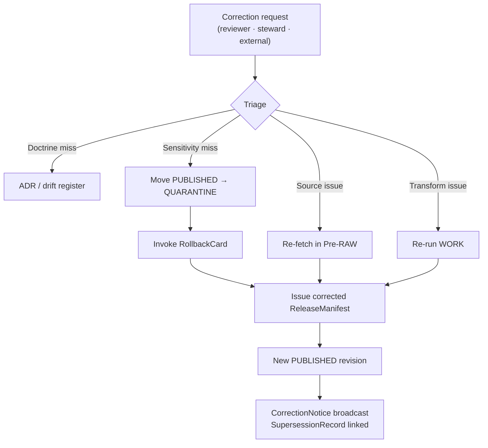

<!-- [KFM_META_BLOCK_V2]
doc_id: kfm://doc/00000000-0000-0000-0000-000000000000
title: Agriculture — Pipeline
type: standard
version: v1
status: draft
owners: agriculture-stewards (TODO confirm CODEOWNERS)
created: 2026-05-26
updated: 2026-05-26
policy_label: public
related:
  - ai-build-operating-contract.md
  - directory-rules.md
  - docs/domains/agriculture/README.md
  - docs/domains/agriculture/DOMAIN.md
  - docs/domains/agriculture/OBJECTS.md
  - docs/domains/agriculture/OBJECT_FAMILIES.md
  - docs/domains/agriculture/SENSITIVITY.md
  - docs/domains/agriculture/CROSS_LANE.md
  - docs/domains/agriculture/MISSING_OR_PLANNED_FILES.md
  - pipelines/domains/agriculture/
  - pipeline_specs/agriculture/
  - connectors/usda/nass/
  - connectors/nrcs/ssurgo/
  - connectors/nrcs/scan/
  - connectors/kansas/mesonet/
  - connectors/noaa/uscrn/
  - connectors/nasa/smap/
  - connectors/nasa/hls/
  - contracts/domains/agriculture/
  - schemas/contracts/v1/domains/agriculture/
  - policy/domains/agriculture/
  - tests/domains/agriculture/
  - fixtures/domains/agriculture/
  - release/candidates/agriculture/
  - data/raw/agriculture/
  - data/work/agriculture/
  - data/quarantine/agriculture/
  - data/processed/agriculture/
  - data/catalog/domain/agriculture/
  - data/published/layers/agriculture/
  - data/registry/sources/agriculture/
tags: [kfm, domain, agriculture, pipeline, lifecycle, runbook]
notes:
  - Pinned to CONTRACT_VERSION = "3.0.0".
  - Conformance language follows RFC 2119 / RFC 8174 per directory-rules.md §2.2.
  - Repository is not mounted in this session; all path-shaped claims are PROPOSED.
  - This file is the per-domain pipeline reference for Agriculture.
  - Sensitive-domain routing deferred to ai-build-operating-contract.md §23.2.
  - Watchers MUST NOT publish (Watcher-as-Non-Publisher invariant).
  - Connectors MUST NOT publish (Connector-Non-Publisher rule, DIRRULES §13.5).
[/KFM_META_BLOCK_V2] -->

# 🌾 Agriculture — Pipeline

> **Purpose.** The canonical pipeline reference for the Agriculture domain: how Agriculture data moves from source signal through `RAW → WORK / QUARANTINE → PROCESSED → CATALOG / TRIPLET → PUBLISHED`, which gates must close at each step, which receipts are emitted, and which policy bundles, validators, and fixtures govern each transition. This file complements the per-object register ([`OBJECT_FAMILIES.md`](OBJECT_FAMILIES.md)) and the narrative reference ([`OBJECTS.md`](OBJECTS.md)) by binding object families to the lifecycle that produces them.

<p>
  
  
  
  
  
  
  
  
  
  
</p>

**Status** · `draft` &nbsp;·&nbsp; **Owners** · `agriculture-stewards` *(TODO confirm CODEOWNERS)* &nbsp;·&nbsp; **Updated** · `2026-05-26` &nbsp;·&nbsp; **Contract** · `CONTRACT_VERSION = "3.0.0"`

> [!CAUTION]
> **Sensitive-domain routing.** Agriculture pipelines admit operator-resolvable, private-parcel-adjacent, NASS-confidential, and quarantine-adjacent material. Disposition for any pipeline output MUST be routed through `ai-build-operating-contract.md` §23.2 (Sensitive-Domain Decision Matrix). The most restrictive applicable row applies. **The pipeline default for any field-level or operator-resolved candidate is DENY at public release** unless `AggregationReceipt` + `PolicyDecision` + steward review close. Disposition is **not** re-derived here; routing is.

---

## 📑 Contents

1. [Scope & posture](#1-scope--posture)
2. [Evidence basis](#2-evidence-basis)
3. [Lifecycle spine](#3-lifecycle-spine)
4. [Promotion gates A–G](#4-promotion-gates-ag)
5. [Stage-by-stage handling](#5-stage-by-stage-handling)
   - 5.1 [Pre-RAW · source signal & admission](#51-pre-raw--source-signal--admission)
   - 5.2 [RAW · immutable capture](#52-raw--immutable-capture)
   - 5.3 [WORK · normalize, transform, validate](#53-work--normalize-transform-validate)
   - 5.4 [QUARANTINE · fail-closed hold](#54-quarantine--fail-closed-hold)
   - 5.5 [PROCESSED · normalized candidates](#55-processed--normalized-candidates)
   - 5.6 [CATALOG / TRIPLET · closure & projection](#56-catalog--triplet--closure--projection)
   - 5.7 [PUBLISHED · governed public surface](#57-published--governed-public-surface)
6. [Receipts emitted per stage](#6-receipts-emitted-per-stage)
7. [Connectors & pipeline specs](#7-connectors--pipeline-specs)
8. [Per-family pipeline routing](#8-per-family-pipeline-routing)
9. [Aggregation profiles & threshold registry](#9-aggregation-profiles--threshold-registry)
10. [Correction & rollback](#10-correction--rollback)
11. [Anti-patterns this pipeline rejects](#11-anti-patterns-this-pipeline-rejects)
12. [Operational telemetry & observability](#12-operational-telemetry--observability)
13. [Open questions register](#13-open-questions-register)
14. [Verification backlog](#14-verification-backlog)
15. [Changelog](#15-changelog)
16. [Definition of done](#16-definition-of-done)
17. [Related docs](#17-related-docs)

---

## 1. Scope & posture

This file is the **Agriculture domain's pipeline reference**: how the domain's twelve object families move from a source change-event through governed publication, what each stage produces, what each stage MUST NOT produce, and which contracts / schemas / policies / validators / fixtures bind each transition.

| Role | This file (`PIPELINE.md`) | Companion (`OBJECT_FAMILIES.md`) | Companion (`OBJECTS.md`) |
|---|---|---|---|
| Form | Lifecycle reference + per-stage runbook | ID register + placement | Narrative reference |
| Audience | Pipeline authors, reviewers, on-call | Reviewers, tooling, ADR authors | Contributors learning the domain |
| Authority for stages | **This file** (§3–§5) | — | — |
| Authority for gates | **This file** (§4) bound to BUILD-MANUAL §6.2 | — | — |
| Authority for receipts emitted | **This file** (§6) | — | — |
| Authority for placement paths | — | **`OBJECT_FAMILIES.md`** | — |
| Authority for object meaning | — | — | **`OBJECTS.md` §6** |

> [!IMPORTANT]
> **Repository is not mounted in this session.** The lifecycle spine, Promotion Gates A–G, and receipt families are `CONFIRMED` from `KFM_Unified_Implementation_Architecture_Build_Manual.md` §6, Atlas v1.1 §9 H, and `directory-rules.md` §6 / §13. Concrete pipeline files, workflow YAML, route names, and CI integration are `PROPOSED` until verified against a mounted repo or accepted ADR. *(`ai-build-operating-contract.md` §11.)*

### 1.1 What this file is

- A **stage-by-stage runbook** for Agriculture data lifecycle.
- A **gate map** binding Agriculture promotion to BUILD-MANUAL §6.2 Gates A–G.
- A **receipt manifest** declaring which receipt families are emitted at each stage.
- A **per-family routing table** showing where each of the twelve `OF-AG-NN` families lives at each stage.
- An **anti-pattern register** scoped to Agriculture pipeline failures.

### 1.2 What this file is **not**

- ❌ A pipeline implementation — executable code lives under `pipelines/domains/agriculture/`.
- ❌ A pipeline spec — declarative specs live under `pipeline_specs/agriculture/`.
- ❌ A connector — source-specific fetch code lives under `connectors/<source>/`.
- ❌ A policy bundle — admissibility rules live under `policy/domains/agriculture/`.
- ❌ A receipt schema — receipt shapes live under `schemas/contracts/v1/receipts/` (or `schemas/contracts/v1/domains/agriculture/receipts/`, pending ADR-S-03).
- ❌ A repo status report — no row claims any pipeline, spec, or workflow exists today.

### 1.3 Truth labels used

This file uses the authoring labels from `ai-build-operating-contract.md` §8: **CONFIRMED**, **INFERRED**, **PROPOSED**, **UNKNOWN**, **NEEDS VERIFICATION**, **CONFLICTED**, **LINEAGE**, **EXPLORATORY**, **EXTERNAL**. Runtime outcomes (`ANSWER` / `ABSTAIN` / `DENY` / `ERROR` / `NARROWED` / `BOUNDED` / `SOURCE_STALE`) are used where they describe actual pipeline finite outcomes — **not** as rhetorical hedging in prose. Memory is not evidence.

[⤴ Back to top](#-contents)

---

## 2. Evidence basis

| Source ID | Document | Role here | Citation |
|---|---|---|---|
| `OPCON` | `ai-build-operating-contract.md` (v3.0; `CONTRACT_VERSION = "3.0.0"`) | Operating contract; §8 truth labels; §23.2 sensitive-domain matrix; §34 receipt discipline; §37 lifecycle | CONFIRMED doctrine |
| `BUILD-MANUAL` | `KFM_Unified_Implementation_Architecture_Build_Manual.md` | §6.1 lifecycle table (Pre-RAW → PUBLISHED); §6.2 Promotion Gates A–G; §7.1 object map (incl. `EventEnvelope`, `EventRunReceipt`, `RunReceipt`, `IntakeReceipt`, `TransformReceipt`, `ValidationReport`, `PolicyDecision`, `EvidenceBundle`, `ReleaseManifest`, `ProofPack`, `RollbackCard`) | CONFIRMED doctrine |
| `ATLAS-v1.1` | `Kansas Frontier Matrix - Domains v1.1 + Pass 23/32 Consolidated Atlas` | §9 H pipeline shape (RAW → PUBLISHED) for Agriculture; §9 D source families; §9 K validators | CONFIRMED doctrine |
| `ENCY` | `KFM_Encyclopedia.md` / `kfm_unified_doctrine_synthesis.md` | §16 per-domain sensitivity matrix; §17 cross-lane anti-collapse; lifecycle anti-patterns | CONFIRMED doctrine |
| `DIRRULES` | `directory-rules.md` (v1.3) | Lane placement (§6.3–§6.5, §7.3, §7.4, §12); anti-patterns (§13.5: watcher-as-non-publisher, connector-non-publisher, lifecycle-skip) | CONFIRMED doctrine |
| `OBJECTS-MD` | [`docs/domains/agriculture/OBJECTS.md`](OBJECTS.md) | Per-family narrative reference (this pipeline cites OBJECTS §6.N for object meaning) | CONFIRMED (this session) |
| `OBJ-FAM-MD` | [`docs/domains/agriculture/OBJECT_FAMILIES.md`](OBJECT_FAMILIES.md) | Per-family ID register (this pipeline uses `OF-AG-NN` IDs) | CONFIRMED (this session) |

> [!NOTE]
> No external (web) research was performed for this file. All claims are KFM-internal doctrine. Per `ai-build-operating-contract.md` §5 and the v3.0 prompt's `<external_research>` rule, external sources MUST NOT be used to make KFM repo-state or doctrine claims.

[⤴ Back to top](#-contents)

---

## 3. Lifecycle spine

The Agriculture pipeline follows the KFM canonical spine. The spine is **CONFIRMED** doctrine; the per-stage Agriculture-specific wiring is **PROPOSED** until contracts/schemas/policies land.

```mermaid
flowchart LR
  subgraph PRERAW["Pre-RAW · source signal & admission"]
    EV["EventEnvelope"]
    SD["SourceDescriptor lookup"]
    PRECHECK["Rights + sensitivity pre-check"]
    ERR["EventRunReceipt"]
  end

  subgraph RAW["RAW · immutable capture"]
    CN["connectors/&lt;source&gt;/"]
    RAWDIR["data/raw/agriculture/&lt;source_id&gt;/&lt;run_id&gt;/"]
    INTAKE["IntakeReceipt"]
  end

  subgraph WORK["WORK · normalize / transform / validate"]
    NORM["pipelines/domains/agriculture/normalize/"]
    VAL["pipelines/domains/agriculture/validate/"]
    TR["TransformReceipt"]
    VR["ValidationReport"]
  end

  subgraph QUAR["QUARANTINE · fail-closed hold"]
    QDIR["data/quarantine/agriculture/"]
    QR["QuarantineRecord"]
  end

  subgraph PROC["PROCESSED · normalized candidates"]
    PDIR["data/processed/agriculture/"]
    EREF["EvidenceRef (per record)"]
  end

  subgraph CAT["CATALOG / TRIPLET · closure & projection"]
    CDIR["data/catalog/domain/agriculture/"]
    EB["EvidenceBundle"]
    TRIP["Triplet projection"]
    AGGR["AggregationReceipt (when aggregating)"]
  end

  subgraph REL["Release decisions"]
    RCAND["release/candidates/agriculture/&lt;slice&gt;/"]
    PDEC["PolicyDecision"]
    RM["ReleaseManifest"]
    PP["ProofPack"]
    RC["RollbackCard"]
  end

  subgraph PUB["PUBLISHED · governed surface"]
    PDIR2["data/published/layers/agriculture/"]
    API["apps/governed-api/"]
  end

  EV --> SD --> PRECHECK --> ERR --> CN
  CN --> RAWDIR --> INTAKE --> NORM
  NORM --> TR --> VAL --> VR
  VAL -->|fail| QDIR
  QDIR --> QR
  VAL -->|pass| PDIR
  PDIR --> EREF --> CDIR
  CDIR --> EB --> TRIP
  EB -->|aggregate| AGGR
  CDIR --> RCAND --> PDEC --> RM --> PP --> RC --> PDIR2 --> API
  PDEC -. DENY .-> QDIR
```



**Reading the spine:**

- **Forward edges** = doctrine-required transitions. None may be skipped (lifecycle-skip is an anti-pattern; see §11).
- **`fail` / `DENY` edges to QUARANTINE** = the only off-spine branch. QUARANTINE is fail-closed; promotion back to WORK requires a reason-coded `QuarantineRecord` and steward review.
- **Aggregation edge** = produces `AggregationReceipt` (`OF-AG-12`) whenever an aggregate variant is materialized from field-level inputs.

[⤴ Back to top](#-contents)

---

## 4. Promotion gates A–G

Per BUILD-MANUAL §6.2. The Agriculture pipeline binds each gate to specific stages, contracts, schemas, policies, validators, and receipts. **Letter assignment** is doctrine-stable but may be ADR-refined.

| Gate | Purpose | Bound at stage | Required proof | Agriculture-specific risk |
|---|---|---|---|---|
| **A** Source identity | `SourceDescriptor` exists; source role and authority class known. | Pre-RAW · §5.1 | `SourceDescriptor` validation report | Source-role collapse (NASS `authority` ↔ CDL `model`). |
| **B** Rights & terms | License/terms/contact/attribution obligations resolved. | Pre-RAW · §5.1 | `RightsReviewRecord` | NASS confidentiality; SSURGO/HLS/SMAP terms; Mesonet terms. |
| **C** Sensitivity | Living-person, operator-resolvable, private-parcel, quarantine-adjacent, or rare-species risks resolved. | WORK → PROCESSED · §5.3 / §5.5 | `PolicyDecision` + transform receipts | **Highest-frequency failure** for Agriculture: operator × parcel × yield joins. |
| **D** Schema/contract | Artifacts match `schemas/contracts/v1/domains/agriculture/<object>.schema.json` and contract semantics. | WORK · §5.3 | `SchemaValidationReport` | Per-family fields (PROPOSED in `OBJECTS.md` §6) MUST close; `source_role` enum MUST carry. |
| **E** Evidence closure | `EvidenceRef → EvidenceBundle` resolves; citations valid. | CATALOG · §5.6 | `EvidenceBundle` + `CitationValidationReport` | Cross-lane cites (Soil `MUKEY`, Hydrology HUC, Atmosphere weather) MUST resolve. |
| **F** Catalog / provenance | STAC/DCAT/PROV/CatalogMatrix closed; `model_version` carried for derived families. | CATALOG · §5.6 | `CatalogMatrixReport` | `OF-AG-07`/`OF-AG-10`/`OF-AG-11` derived-indicator provenance MUST close. |
| **G** Review / release / rollback | `PromotionDecision`, `ReleaseManifest`, `ProofPack`, `RollbackCard`, correction path. | Release · §5.6 → §5.7 | `PromotionReceipt` + `ReleaseManifest` + `RollbackCard` | Missing `RollbackCard` is a build-stop defect. |

> [!IMPORTANT]
> **Gate C is the load-bearing gate for Agriculture.** Operator-resolvable promotion is the single highest-frequency Agriculture failure mode (per ENCY §17). The `tests/domains/agriculture/policy_deny/` family of fixtures exists specifically to prove Gate C closes against this risk. *(Per `OBJECT_FAMILIES.md` §5.04, §5.02, §5.08.)*

[⤴ Back to top](#-contents)

---

## 5. Stage-by-stage handling

Each subsection below records: **inputs**, **outputs**, **receipts emitted**, **gates closed at this stage**, **forbidden actions**, **validators/fixtures**, **finite outcomes**, and **path placements** (all PROPOSED).

### 5.1 Pre-RAW · source signal & admission

- **Inputs.** Watcher signal, source-change event, scheduled cadence tick, or upload notice. Source identity MUST resolve to a `SourceDescriptor` in `data/registry/sources/agriculture/`.
- **Outputs.** Admitted source-change event passed to RAW; OR `ABSTAIN` (no change material); OR `DENY` (rights/sensitivity pre-check fails).
- **Receipts emitted.** `EventEnvelope`, `EventRunReceipt`. *(Per BUILD-MANUAL §7.1.)*
- **Gates closed.** **A** (Source identity), **B** (Rights & terms).
- **Forbidden actions.** Watchers MUST NOT publish (**Watcher-as-Non-Publisher** invariant). Pre-RAW MUST NOT write to `data/raw/`, `data/work/`, `data/processed/`, or `data/published/` — it only signals admission.
- **Validators / fixtures (PROPOSED).** `tests/domains/agriculture/source_descriptor/`; `fixtures/domains/agriculture/no_network/<source>_station_series/`.
- **Finite outcomes.** `ANSWER` (admit) · `ABSTAIN` (no change) · `DENY` (rights/sensitivity) · `ERROR` (envelope malformed).
- **Path placements (PROPOSED).**
  - Source descriptors: `data/registry/sources/agriculture/<source>.yaml`
  - Watchers: `pipelines/domains/agriculture/watchers/<source>/` *(or per-source connector watcher under `connectors/<source>/watch/`; routing TBD by ADR)*
  - Event records: `data/receipts/agriculture/events/<run_id>/`

> [!NOTE]
> Pre-RAW is the **only** place rights can refuse admission cheaply, before any source bytes are captured. Pushing rights checks downstream is an Agriculture-specific risk because NASS confidentiality terms can vary per indicator.

[⤴ Back to top](#-contents)

### 5.2 RAW · immutable capture

- **Inputs.** Admitted `EventRunReceipt` from §5.1.
- **Outputs.** Immutable source-native payload captured into `data/raw/agriculture/<source_id>/<run_id>/` with retrieval-time hash, license snapshot, and source descriptor reference.
- **Receipts emitted.** `IntakeReceipt`.
- **Gates closed.** *(Gate A and B already closed in §5.1; this stage carries them forward.)*
- **Forbidden actions.**
  - Connectors MUST NOT publish (**Connector-Non-Publisher** rule, DIRRULES §13.5).
  - Connectors MUST NOT write to `data/processed/`, `data/catalog/`, `data/published/`.
  - RAW payloads MUST NOT be mutated after capture (immutability invariant).
- **Validators / fixtures (PROPOSED).** `tests/domains/agriculture/no_network/`; per-source no-network fixtures for `nass_cdl`, `nass_quickstats`, `ssurgo_sda`, `mesonet`, `scan`, `uscrn`, `smap`, `hls_vi`.
- **Finite outcomes.** `ANSWER` (captured) · `ERROR` (fetch failed / hash mismatch / license mismatch).
- **Path placements (PROPOSED).**
  - Connectors: `connectors/usda/nass/`, `connectors/nrcs/ssurgo/`, `connectors/nrcs/scan/`, `connectors/kansas/mesonet/`, `connectors/noaa/uscrn/`, `connectors/nasa/smap/`, `connectors/nasa/hls/` *(per `MISSING_OR_PLANNED_FILES.md` §4.7; new connector roots `connectors/usda/`, `connectors/nasa/` require ADR-CN-01)*.
  - RAW lane: `data/raw/agriculture/<source_id>/<run_id>/`.
  - Intake receipts: `data/receipts/agriculture/intake/<run_id>/`.

[⤴ Back to top](#-contents)

### 5.3 WORK · normalize, transform, validate

- **Inputs.** RAW payload reference + `IntakeReceipt`.
- **Outputs.** Normalized in-flight candidate records aligned to `schemas/contracts/v1/domains/agriculture/<object>.schema.json`; OR routed to QUARANTINE (§5.4) on failure.
- **Receipts emitted.** `TransformReceipt`, `ValidationReport`.
- **Gates closed.** **C** (Sensitivity — initial transforms applied; redaction/generalization emitted as receipts), **D** (Schema/contract — schema validation pass).
- **Forbidden actions.**
  - WORK MUST NOT mutate RAW.
  - WORK MUST NOT publish — outputs are candidates, not releases.
  - Source-role downcast/upcast is forbidden (`model` → `authority` collapse is a Gate-C/D dual failure; see §11).
- **Validators / fixtures (PROPOSED).** All from `tests/domains/agriculture/`: `schema_validation/`, `geometry_validity/`, `temporal_logic/`, `source_role_mismatch/`, `policy_deny/`, `aggregation_threshold/`, `sensitivity_validation/`.
- **Finite outcomes.** `ANSWER` (normalized → PROCESSED) · `DENY` (policy fail → QUARANTINE) · `ABSTAIN` (insufficient evidence) · `ERROR` (transform failure → QUARANTINE).
- **Path placements (PROPOSED).**
  - Pipelines: `pipelines/domains/agriculture/normalize/`, `pipelines/domains/agriculture/validate/`
  - Pipeline specs: `pipeline_specs/agriculture/normalize/`, `pipeline_specs/agriculture/validate/`
  - WORK lane: `data/work/agriculture/`
  - Transform receipts: `data/receipts/agriculture/transform/<run_id>/`
  - Validation reports: `data/receipts/agriculture/validation/<run_id>/`

> [!WARNING]
> **WORK is where source-role collapse is most easily introduced.** Normalization scripts that promote a CDL classified raster (`model`) into a per-place "crop observation" without preserving `source_role` create a defect that downstream stages cannot recover from. Source-role validators MUST run at WORK exit.

[⤴ Back to top](#-contents)

### 5.4 QUARANTINE · fail-closed hold

- **Inputs.** Any record from WORK that fails validation, rights, sensitivity, or schema; OR any release candidate denied at §5.6 / §5.7.
- **Outputs.** `QuarantineRecord` with reason code, remediation owner, source refs, obligation. Records remain held until remediated or formally retired.
- **Receipts emitted.** `QuarantineRecord`.
- **Gates closed.** None — QUARANTINE is the **fail-closed branch**, not a forward stage.
- **Forbidden actions.**
  - QUARANTINE MUST NOT be skipped by routing failures back to WORK silently. Every failure MUST be reason-coded.
  - QUARANTINE records MUST NOT be promoted directly to PROCESSED/CATALOG/PUBLISHED. Re-entry to WORK is required.
- **Validators / fixtures (PROPOSED).** `tests/domains/agriculture/policy_deny/`, `…/source_role_mismatch/`, `…/aggregation_threshold/` (negative fixtures).
- **Finite outcomes.** `DENY` (held) · `ERROR` (held with error reason).
- **Path placements (PROPOSED).**
  - QUARANTINE lane: `data/quarantine/agriculture/<reason_code>/<run_id>/`
  - Quarantine records: co-located with held content; indexed in `data/registry/quarantine/agriculture/`.

> [!IMPORTANT]
> **QUARANTINE is the project's truth-protecting branch.** Pulling records back into WORK without a reason-coded `QuarantineRecord` is a doctrine violation and a publication risk.

[⤴ Back to top](#-contents)

### 5.5 PROCESSED · normalized candidates

- **Inputs.** Records passing WORK validation; `TransformReceipt` + `ValidationReport`.
- **Outputs.** Validated normalized records carrying deterministic IDs, distinct temporal axes, schema-conformant payloads, and a resolvable `EvidenceRef` (not yet a closed bundle).
- **Receipts emitted.** Receipts are carried forward from WORK; PROCESSED itself does not introduce new receipt families, but **per-record `EvidenceRef` MUST exist** and digest closure MUST hold.
- **Gates closed.** **C** confirmed, **D** confirmed. (Gates E–G open downstream.)
- **Forbidden actions.**
  - PROCESSED MUST NOT be exposed via public clients (`apps/governed-api/` reads from PUBLISHED, never PROCESSED).
  - Assumptions of release/public status MUST NOT propagate from PROCESSED.
- **Validators / fixtures (PROPOSED).** `tests/domains/agriculture/evidence_closure/`, `…/temporal_logic/`, `…/citation_validation/`.
- **Finite outcomes.** `ANSWER` (candidate ready for CATALOG) · `ABSTAIN` (held for evidence closure).
- **Path placements (PROPOSED).**
  - PROCESSED lane: `data/processed/agriculture/<object_family>/<run_id>/`.

[⤴ Back to top](#-contents)

### 5.6 CATALOG / TRIPLET · closure & projection

- **Inputs.** PROCESSED candidate records + `EvidenceRef`.
- **Outputs.** Catalog records (STAC/DCAT/PROV per cross-cutting standards), `EvidenceBundle` per claim, optional triplet projection for graph surfaces, and (when aggregating) an `AggregationReceipt`.
- **Receipts emitted.** `EvidenceBundle`, `AggregationReceipt` *(`OF-AG-12`, emit at this stage)*, `CatalogMatrixReport`.
- **Gates closed.** **E** (Evidence closure), **F** (Catalog/provenance).
- **Forbidden actions.**
  - CATALOG MUST NOT publish. Catalog records reference PUBLISHED material; they do not replace promotion gates.
  - Triplet projections MUST NOT overwrite canonical truth — they project, they do not own.
- **Validators / fixtures (PROPOSED).** `tests/domains/agriculture/citation_validation/`, `…/aggregation_threshold/`, `…/release_manifest/`.
- **Finite outcomes.** `ANSWER` (catalog closed → release candidate) · `ABSTAIN` (evidence not closeable) · `DENY` (policy denies aggregation profile).
- **Path placements (PROPOSED).**
  - Catalog lane: `data/catalog/domain/agriculture/<object_family>/<run_id>/`
  - STAC: `data/catalog/stac/...`; DCAT: `data/catalog/dcat/...`; PROV: `data/catalog/prov/...` *(cross-cutting catalog roots; not Agriculture-owned)*.
  - Triplets: `data/triplets/agriculture/<object_family>/<run_id>/`
  - Aggregation receipts: `data/receipts/agriculture/aggregation/<run_id>/` *(or under shared `data/receipts/aggregation/<run_id>/` per ADR-S-03)*.

> [!NOTE]
> **`AggregationReceipt` is the load-bearing transformation receipt for Agriculture.** It MUST be emitted by every aggregate-tier transition (field → county/HUC). Per `OBJECT_FAMILIES.md` §5.12, its schema home is open under ADR-S-03; pipeline outputs use whichever path the ADR ratifies.

[⤴ Back to top](#-contents)

### 5.7 PUBLISHED · governed public surface

- **Inputs.** A release candidate under `release/candidates/agriculture/<slice>/` with `EvidenceBundle`, `CatalogMatrixReport`, and `AggregationReceipt` (where applicable).
- **Outputs.** `PolicyDecision`, `ReleaseManifest`, `ProofPack`, `RollbackCard`, and the public-safe materialization under `data/published/layers/agriculture/`. Public access flows through `apps/governed-api/` only.
- **Receipts emitted.** `PolicyDecision`, `PromotionReceipt`, `ReleaseManifest`, `ProofPack`, `RollbackCard`.
- **Gates closed.** **G** (Review / release / rollback).
- **Forbidden actions.**
  - PUBLISHED MUST NOT include RAW / WORK / QUARANTINE payloads.
  - PUBLISHED MUST NOT include exact restricted geometry (operator-resolvable, parcel-resolvable, quarantine-adjacent) — those DENY at this gate.
  - Public clients MUST NOT read `data/processed/` or `data/catalog/` directly; the trust membrane is the governed API.
  - Style-only hiding of sensitive geometry (e.g., MapLibre style opacity) is **not** sensitivity policy.
- **Validators / fixtures (PROPOSED).** `tests/domains/agriculture/release_manifest/`, `…/rollback_drill/`, `…/policy_deny/`, `…/non_regression/`, `…/stale_state/`.
- **Finite outcomes.** `ANSWER` (released) · `DENY` (denied at Gate G) · `ABSTAIN` (review incomplete) · `ERROR` (manifest/proof closure failed) · `NARROWED` (released at a coarser support geometry than requested) · `SOURCE_STALE` (badge applied; surface remains read-only).
- **Path placements (PROPOSED).**
  - Release candidates: `release/candidates/agriculture/<slice>/`
  - Manifests: `release/manifests/agriculture/<slice>/release_manifest.json`
  - Proof packs: `release/proofs/agriculture/<slice>/proof_pack.json`
  - Rollback cards: `release/rollback_cards/agriculture/<slice>/rollback_card.json`
  - Promotion decisions: `release/promotion_decisions/agriculture/<slice>/promotion_decision.json`
  - PUBLISHED lane: `data/published/layers/agriculture/<layer>/`
  - Public API: `apps/governed-api/` *(route names PROPOSED)*.

> [!CAUTION]
> A `ReleaseManifest` placed under `data/releases/` instead of `release/` is a **build-stop defect** per `directory-rules.md` §13.5. The release lane is the canonical home.

[⤴ Back to top](#-contents)

---

## 6. Receipts emitted per stage

This is the receipt-emission contract for the Agriculture pipeline. Each receipt family is `CONFIRMED` in BUILD-MANUAL §7.1 as an object family; per-receipt schema bodies remain `NEEDS VERIFICATION` (per `OBJECTS.md` §6.12 and `OBJECT_FAMILIES.md` §5.12 for `AggregationReceipt`).

| Stage | Receipts emitted | Required? | Authority |
|---|---|---|---|
| Pre-RAW · §5.1 | `EventEnvelope`, `EventRunReceipt` | MUST | BUILD-MANUAL §7.1 |
| RAW · §5.2 | `IntakeReceipt` | MUST | BUILD-MANUAL §7.1 |
| WORK · §5.3 | `TransformReceipt`, `ValidationReport` | MUST | BUILD-MANUAL §7.1 |
| QUARANTINE · §5.4 | `QuarantineRecord` | MUST (when QUARANTINE entered) | BUILD-MANUAL §7.1 / DIRRULES §13.5 |
| PROCESSED · §5.5 | (none new; carries forward; per-record `EvidenceRef` MUST exist) | — | BUILD-MANUAL §6.1 |
| CATALOG · §5.6 | `EvidenceBundle`, `CatalogMatrixReport`, `AggregationReceipt` *(when aggregating)*, `RedactionReceipt` *(when redacting)* | MUST (aggregation receipt: MUST when aggregating) | BUILD-MANUAL §7.1; ENCY §16 |
| Release · §5.6 → §5.7 | `PolicyDecision`, `PromotionReceipt`, `ReleaseManifest`, `ProofPack`, `RollbackCard` | MUST (all five) | BUILD-MANUAL §6.2 Gate G |
| PUBLISHED · §5.7 | (no new receipts; `ReleaseManifest` is the binding object) | — | BUILD-MANUAL §6.2 |

> [!IMPORTANT]
> **Movement without a receipt is a defect.** Per BUILD-MANUAL §6.1 / §7.1, every lifecycle transition emits at least one receipt. Agriculture is no exception; any audit that finds a transition without the matching receipt family is a Gate-G failure, not a paperwork miss.

[⤴ Back to top](#-contents)

---

## 7. Connectors & pipeline specs

Per `directory-rules.md` §7.3, connectors are **source-specific** roots (not domain-specific); each connector outputs only to `data/raw/agriculture/<source_id>/<run_id>/`. Per `MISSING_OR_PLANNED_FILES.md` §4.7, the Agriculture pipeline requires the connectors below; the `connectors/usda/`, `connectors/nasa/` root segments are PROPOSED and require **ADR-CN-01**.

| Connector path (PROPOSED) | Source family | Pipeline spec (PROPOSED) | Notes |
|---|---|---|---|
| `connectors/usda/nass/cdl/` *(new root segment)* | USDA NASS Cropland Data Layer | `pipeline_specs/agriculture/ingest_nass_cdl.yaml` | Source role: `model` (classified raster). |
| `connectors/usda/nass/quickstats/` *(new root segment)* | USDA NASS QuickStats / Crop Progress | `pipeline_specs/agriculture/ingest_nass_quickstats.yaml` | Source role: `authority` (state/county aggregate). NASS confidentiality terms apply. |
| `connectors/nrcs/ssurgo/` | SSURGO via Soil Data Access | `pipeline_specs/agriculture/ingest_ssurgo_sda.yaml` | Soil cite; Agriculture does not own soil semantics. |
| `connectors/nrcs/scan/` | NRCS SCAN soil-moisture stations | `pipeline_specs/agriculture/ingest_nrcs_scan.yaml` | Source role: `observation` (station). |
| `connectors/kansas/mesonet/` | Kansas Mesonet REST | `pipeline_specs/agriculture/ingest_mesonet.yaml` | Source role: `observation`. Local terms apply. |
| `connectors/noaa/uscrn/` | NOAA USCRN | `pipeline_specs/agriculture/ingest_noaa_uscrn.yaml` | Source role: `observation`. |
| `connectors/nasa/smap/` *(new root segment)* | NASA SMAP soil moisture | `pipeline_specs/agriculture/ingest_smap.yaml` | Source role: `model` (retrieval). |
| `connectors/nasa/hls/` *(new root segment)* | NASA HLS / HLS-VI | `pipeline_specs/agriculture/ingest_hls_vi.yaml` | Source role: `context` for vegetation index; `model` for derived VI products. |

**Downstream pipelines (PROPOSED):**

| Pipeline (PROPOSED) | Stage | Notes |
|---|---|---|
| `pipelines/domains/agriculture/normalize/` | WORK | Per-family normalization to `schemas/contracts/v1/domains/agriculture/`. |
| `pipelines/domains/agriculture/validate/` | WORK | Invokes `tests/domains/agriculture/` validator families. |
| `pipelines/domains/agriculture/catalog/` | CATALOG | Emits STAC/DCAT/PROV catalog records + `EvidenceBundle`. |
| `pipelines/domains/agriculture/publish_aggregates/` | Release · §5.6 → §5.7 | County / HUC / grid aggregates with `AggregationReceipt`. Spec: `pipeline_specs/agriculture/publish_aggregates/county_year_panel.yaml`. |
| `pipelines/domains/agriculture/rollback/` | Release recovery | Drives rollback per `RollbackCard`. |

> [!WARNING]
> **Connectors do not publish. Watchers do not publish. Pipelines publish only at Gate G.** Per `directory-rules.md` §13.5, any connector or watcher that writes to `data/processed/`, `data/catalog/`, or `data/published/` is an anti-pattern; the lifecycle-skip defect applies.

[⤴ Back to top](#-contents)

---

## 8. Per-family pipeline routing

How each of the twelve `OF-AG-NN` families flows through the lifecycle. Each row identifies the connector(s) the family originates from, the WORK normalization pass, the CATALOG closure form, and the release lane. Family IDs and placement paths are from [`OBJECT_FAMILIES.md`](OBJECT_FAMILIES.md).

| Family | Primary connectors (PROPOSED) | WORK normalization | CATALOG form | Release lane (PROPOSED) | `AggregationReceipt` required? |
|---|---|---|---|---|---|
| `OF-AG-01 · CropObservation` | NASS CDL · NASS QuickStats · Mesonet · USCRN · SCAN · HLS-VI · SMAP | `normalize/crop_observation/` | `EvidenceBundle` + per-record `EvidenceRef` | `data/published/layers/agriculture/crop_observation/` | Yes — aggregate variants only. |
| `OF-AG-02 · FieldCandidate` | NASS CDL · HLS | `normalize/field_candidate/` | Generalized polygon set + `EvidenceBundle` | `data/published/layers/agriculture/field_candidate_generalized/` *(operator-resolvable: DENY)* | Yes — for any operator-adjacent release. |
| `OF-AG-03 · CropRotation` | NASS CDL series | `normalize/crop_rotation/` (multi-year join) | Rotation sequence + `EvidenceBundle` | `data/published/layers/agriculture/crop_rotation/` | Yes — aggregate variants. |
| `OF-AG-04 · YieldObservation` | NASS QuickStats | `normalize/yield_observation/` | `EvidenceBundle` + `CatalogMatrixReport` | `data/published/layers/agriculture/yield_county_year/` *(operator-resolvable: DENY)* | Yes — always at county/HUC release. |
| `OF-AG-05 · IrrigationLink` | State water-right registries · Mesonet near-pivot · well logs | `normalize/irrigation_link/` | Edge set + `EvidenceBundle` (cites Hydrology) | `data/published/layers/agriculture/irrigation_link/` *(well-owner joinable: Reviewer)* | No — but `RedactionReceipt` MAY apply. |
| `OF-AG-06 · ConservationPractice` | NRCS practice records (public) · CDL/HLS classification | `normalize/conservation_practice/` | `EvidenceBundle` + practice provenance | `data/published/layers/agriculture/conservation_practice/` | No — but operator-resolvable variants DENY. |
| `OF-AG-07 · SoilCropSuitability` | SSURGO/SDA · crop parameter tables | `normalize/soil_crop_suitability/` (Soil cite + crop join) | `EvidenceBundle` + `model_version` | `data/published/layers/agriculture/soil_crop_suitability/` | No — `model_version` MUST close. |
| `OF-AG-08 · AgriculturalEconomyObservation` | NASS QuickStats · Census of Agriculture | `normalize/agricultural_economy_observation/` | `EvidenceBundle` + indicator provenance | `data/published/layers/agriculture/economy_county_year/` *(operator-detail: DENY)* | Yes — always. |
| `OF-AG-09 · SupplyChainNode` | Regulatory facility registries · industry directories | `normalize/supply_chain_node/` | Topology nodes + `EvidenceBundle` (cites Roads/Rail) | `data/published/layers/agriculture/supply_chain_node/` *(capacity: rights-bound)* | No. |
| `OF-AG-10 · DroughtStressIndicator` | Mesonet · USCRN · SCAN · SMAP · HLS-VI | `normalize/drought_stress_indicator/` (composite) | `EvidenceBundle` + `model_version` + input EvidenceRefs | `data/published/layers/agriculture/drought_stress/` | Yes — aggregate variants. |
| `OF-AG-11 · PestStressIndicator` | Regulatory pest detections · scout reports · HLS-VI · weather | `normalize/pest_stress_indicator/` (composite) | `EvidenceBundle` + `model_version` + input EvidenceRefs | `data/published/layers/agriculture/pest_stress/` *(quarantine-adjacent: Reviewer)* | Yes — aggregate variants. |
| `OF-AG-12 · AggregationReceipt` | (n/a — produced **by** other families' aggregation transitions) | Emit at CATALOG §5.6 | Receipt object, referenced by `ReleaseManifest` | `data/receipts/agriculture/aggregation/` *(or shared, per ADR-S-03)* | Self — the receipt **is** the proof. |

> [!IMPORTANT]
> The "**`AggregationReceipt` required?**" column is the most important Gate-C/Gate-E control in the pipeline. **Yes** means the aggregate output cannot promote past Gate E without an emitted receipt; **No** means the family's default release tier does not require aggregation, though redaction may.

[⤴ Back to top](#-contents)

---

## 9. Aggregation profiles & threshold registry

Aggregation transitions are the most common Agriculture release path: field-level inputs → county/HUC/grid public-safe outputs. The pipeline MUST cite a named threshold profile when emitting `AggregationReceipt`.

**Profile registry location (PROPOSED).** `policy/domains/agriculture/redaction_profiles.yaml`. *(Per `MISSING_OR_PLANNED_FILES.md` §4.4.)*

**Profile contract — illustrative skeleton (PROPOSED).**

```yaml
# policy/domains/agriculture/redaction_profiles.yaml (PROPOSED skeleton)
profiles:
  county_yield_v1:
    support_geometry: county
    minimum_cell_count: <NEEDS VERIFICATION — sensitivity-steward to set>
    suppression_rule: <NEEDS VERIFICATION — k-anonymity / NASS-style suppression>
    applies_to:
      - OF-AG-04   # YieldObservation
      - OF-AG-08   # AgriculturalEconomyObservation
  huc12_drought_v1:
    support_geometry: huc12
    minimum_cell_count: <NEEDS VERIFICATION>
    suppression_rule: <NEEDS VERIFICATION>
    applies_to:
      - OF-AG-10   # DroughtStressIndicator
      - OF-AG-11   # PestStressIndicator (aggregate)
  generalized_field_v1:
    support_geometry: generalized_polygon
    generalization_rule: <NEEDS VERIFICATION — buffer / centroid jitter / parcel snap>
    applies_to:
      - OF-AG-02   # FieldCandidate (generalized)
      - OF-AG-06   # ConservationPractice (generalized)
```

**Threshold values for every profile are `NEEDS VERIFICATION`** until the sensitivity steward and Agriculture stewards ratify them. They are tracked under `AG-V-08` in `MISSING_OR_PLANNED_FILES.md` §6 and as `OQ-AG-PIPE-04` here in §13.

> [!CAUTION]
> A pipeline emitting an aggregate without a named threshold profile is an anti-pattern. The `AggregationReceipt` MUST cite `threshold_profile_ref` exactly (e.g., `policy/domains/agriculture/redaction_profiles.yaml#county_yield_v1`).

[⤴ Back to top](#-contents)

---

## 10. Correction & rollback

Per BUILD-MANUAL §6.2 Gate G, every release MUST carry a `RollbackCard` and a correction path. Agriculture's correction flow follows the cross-cutting pattern.



**Required artifacts for every Agriculture correction:**

| Artifact | Path (PROPOSED) |
|---|---|
| `CorrectionNotice` | `release/correction_notices/agriculture/<slice>/<correction_id>.json` |
| `SupersessionRecord` | `release/supersessions/agriculture/<slice>/<superseded_release_id>.json` |
| Updated `ReleaseManifest` | `release/manifests/agriculture/<slice>/release_manifest.json` *(new revision)* |
| Updated `RollbackCard` | `release/rollback_cards/agriculture/<slice>/rollback_card.json` *(new revision)* |
| Updated `ProofPack` | `release/proofs/agriculture/<slice>/proof_pack.json` *(new revision)* |

> [!IMPORTANT]
> A rollback that is **not drilled** is not a rollback. `tests/domains/agriculture/rollback_drill/` (PROPOSED) MUST exercise the full restore path against a representative slice (the county-year panel slice is the canonical first drill, per `MISSING_OR_PLANNED_FILES.md` §5).

[⤴ Back to top](#-contents)

---

## 11. Anti-patterns this pipeline rejects

Per `directory-rules.md` §13.5, ENCY §17, and Agriculture-specific risk surface.

| Anti-pattern | What goes wrong | Counter-rule |
|---|---|---|
| **Connector publishes** | A connector writes to `data/processed/`, `data/catalog/`, or `data/published/`. | Connectors emit only to `data/raw/agriculture/`; pipelines promote. *(DIRRULES §13.5.)* |
| **Watcher publishes** | A watcher writes to `data/catalog/` or `data/published/`. | Watcher-as-Non-Publisher invariant; watchers emit `EventRunReceipt` candidates only. *(DIRRULES §13.5.)* |
| **Lifecycle skip** | A pipeline writes directly from RAW or WORK to PUBLISHED, bypassing PROCESSED / CATALOG / release gating. | All phases run; promotion is a governed state transition. *(BUILD-MANUAL §6.1.)* |
| **Operator × parcel join in public release** | `YieldObservation` × `FieldCandidate` × parcel × operator joined and published. | DENY at Gate C; `tests/domains/agriculture/policy_deny/` MUST fire. *(ENCY §17.)* |
| **Source-role collapse: `model` → `authority`** | CDL-classified raster rendered as if it were NASS authority. | `source_role` enum carried in every record; UI MUST surface role badge. *(ENCY §17.)* |
| **Source-role collapse: `aggregate` → `observation`** | County-aggregate yield cited as a field measurement. | Support geometry MUST be carried; aggregate ≠ point. *(ENCY §17.)* |
| **Aggregation without threshold profile** | `AggregationReceipt` emitted with no `threshold_profile_ref`. | Profile MUST be named and resolvable in `policy/domains/agriculture/redaction_profiles.yaml`. |
| **Style-only geoprivacy** | MapLibre style opacity hides sensitive geometry on a public layer. | Sensitivity is policy + transform, not style. *(MAP-MASTER doctrine; ENCY §16.)* |
| **`ReleaseManifest` outside `release/`** | A release manifest appears under `data/releases/` or `artifacts/release/`. | Canonical home is `release/`. *(DIRRULES §13.5.)* |
| **Rollback never drilled** | Releases ship with `RollbackCard` but `tests/domains/agriculture/rollback_drill/` never runs. | Drill MUST run at least once per release lane. *(BUILD-MANUAL §6.2 Gate G.)* |
| **Stale-state hidden** | A surface continues to answer with no `SOURCE_STALE` badge after the source freshness window expires. | Stale-state rule MUST fire; finite outcome `SOURCE_STALE`. *(ENCY §16; OBJECTS §6.10.)* |

> [!WARNING]
> Each anti-pattern above maps to **at least one negative-fixture test** under `tests/domains/agriculture/` (PROPOSED, per `MISSING_OR_PLANNED_FILES.md` §4.5). A pipeline that promotes an artifact while a negative-fixture test passes is a Gate-G review failure, not a software bug.

[⤴ Back to top](#-contents)

---

## 12. Operational telemetry & observability

Lightweight observability surface (PROPOSED) for Agriculture pipelines. Bound to receipts; not a substitute for them.

| Metric (PROPOSED) | What it measures | Healthy posture |
|---|---|---|
| `event_run_receipts_per_source` | Pre-RAW admissions per source per day | Within source-specific cadence; flat-zero is a freshness fault. |
| `intake_receipts_per_source` | RAW captures per source | Tracks admissions; gap implies fetch failure. |
| `validation_pass_rate_per_family` | Gate-D pass rate per `OF-AG-NN` | Trending stable per family; sudden drop = upstream schema drift. |
| `quarantine_rate_per_reason` | `QuarantineRecord` counts per reason code | Reviewer-attended; aged entries triaged. |
| `policy_decision_deny_rate_per_family` | Gate-C DENY rate per family | Visibly tracked; spike implies operator-join leak or new sensitive joins. |
| `aggregation_receipt_emit_rate` | `AggregationReceipt` emissions per release lane | One per aggregate release; missing = Gate-E failure. |
| `release_manifest_emit_rate` | `ReleaseManifest` emissions per slice | One per release; missing = Gate-G failure. |
| `rollback_drill_pass_rate` | `tests/domains/agriculture/rollback_drill/` pass | 100% per release lane; below = blocking. |
| `stale_state_badge_fire_rate` | `SOURCE_STALE` finite outcome per family | Tracked; freshness rule per source. |
| `source_role_mismatch_fire_rate` | Negative `source_role_mismatch/` tests caught | Zero passes; any pass = doctrine violation slipped in. |

> [!NOTE]
> Telemetry MUST NOT replace receipts. Metrics are aggregate signals over receipt-bearing events; the receipts themselves are the audit trail.

[⤴ Back to top](#-contents)

---

## 13. Open questions register

| ID | Question | Owner role | Resolution path |
|---|---|---|---|
| OQ-AG-PIPE-01 | Should Agriculture watchers live under `pipelines/domains/agriculture/watchers/<source>/` or under each `connectors/<source>/watch/` subtree? | pipeline-steward · connector-steward | ADR; current PROPOSED posture in §5.1 records both options. |
| OQ-AG-PIPE-02 | Final form of `pipeline_specs/agriculture/publish_aggregates/county_year_panel.yaml` — declarative schema + cadence. | pipeline-steward · agriculture-stewards | Author spec; validate against fixture under `fixtures/domains/agriculture/no_network/county_year_panel/`. |
| OQ-AG-PIPE-03 | `AggregationReceipt` emission lane (per-domain `data/receipts/agriculture/aggregation/` vs. shared `data/receipts/aggregation/`). | receipt-steward | Resolved jointly with ADR-S-03 (schema home). |
| OQ-AG-PIPE-04 | Threshold values for each profile in `policy/domains/agriculture/redaction_profiles.yaml`. | sensitivity-steward · agriculture-stewards | Sensitive-steward review; ratify in policy file; test in `tests/domains/agriculture/aggregation_threshold/`. |
| OQ-AG-PIPE-05 | New connector roots (`connectors/usda/`, `connectors/nasa/`) — accept, fold into existing roots, or reorganize. | connector-steward · directory-steward | ADR-CN-01 *(per `MISSING_OR_PLANNED_FILES.md` §7)*. |
| OQ-AG-PIPE-06 | Triplet projection for `OF-AG-10` and `OF-AG-11` derived indicators — single composite node, or one per input EvidenceRef? | catalog-steward | Cataloging review; record outcome in pipeline spec for `catalog/`. |
| OQ-AG-PIPE-07 | Stale-state rule per source (Mesonet, USCRN, SCAN, SMAP, HLS, NASS). | source-steward · agriculture-stewards | Per-source freshness window committed to source descriptors in `data/registry/sources/agriculture/`. |
| OQ-AG-PIPE-08 | First-drill slice for `tests/domains/agriculture/rollback_drill/` — county-year panel or `OF-AG-07 · SoilCropSuitability` (no operator risk)? | qa-steward | Choose smallest credible slice; PROPOSED: county-year panel. *(Per `MISSING_OR_PLANNED_FILES.md` §5.)* |
| OQ-AG-PIPE-09 | Is the `CorrectionNotice` schema home shared or per-domain? | release-steward | ADR; current PROPOSED posture in §10 records shared home with per-domain subtree. |
| OQ-AG-PIPE-10 | Observability backend (OpenLineage emitters at admission / transform / validation / publication boundaries — confirm). | observability-steward | Spike + ADR if emitter choice affects schema. |

[⤴ Back to top](#-contents)

---

## 14. Verification backlog

Items that MUST remain `NEEDS VERIFICATION` until evidence (mounted repo files, schemas, registry entries, tests, logs, emitted artifacts, review records, or release manifests) is produced.

| # | Item | Evidence that would settle it | Status |
|---|---|---|---|
| AG-PIPE-V-01 | `pipelines/domains/agriculture/normalize/` + `validate/` + `catalog/` + `publish_aggregates/` + `rollback/` present. | Mounted repo files. | NEEDS VERIFICATION |
| AG-PIPE-V-02 | `pipeline_specs/agriculture/` per-source ingest YAMLs present and validated. | Mounted repo files + spec validator. | NEEDS VERIFICATION |
| AG-PIPE-V-03 | Each `OF-AG-NN` family has a corresponding `normalize/<family>/` directory under `pipelines/domains/agriculture/normalize/`. | Mounted repo tree. | NEEDS VERIFICATION |
| AG-PIPE-V-04 | `EventRunReceipt`, `IntakeReceipt`, `TransformReceipt`, `ValidationReport`, `QuarantineRecord`, `EvidenceBundle`, `AggregationReceipt`, `PolicyDecision`, `PromotionReceipt`, `ReleaseManifest`, `ProofPack`, `RollbackCard`, `CorrectionNotice`, `SupersessionRecord` emit at the stages declared in §6. | Sample run + emitted receipts. | NEEDS VERIFICATION |
| AG-PIPE-V-05 | `policy/domains/agriculture/redaction_profiles.yaml` exists and is referenced by `AggregationReceipt` emissions. | File present + receipt cross-reference. | NEEDS VERIFICATION |
| AG-PIPE-V-06 | All anti-pattern tests in §11 have negative fixtures under `fixtures/domains/agriculture/invalid/` and `tests/domains/agriculture/policy_deny/`. | Test files + runs. | NEEDS VERIFICATION |
| AG-PIPE-V-07 | First credible thin slice (county crop-year panel) passes Gates A–G end-to-end with no-network fixtures. | CI workflow + receipts. | NEEDS VERIFICATION |
| AG-PIPE-V-08 | Rollback drill (`tests/domains/agriculture/rollback_drill/`) restores a prior released manifest end-to-end. | Test runs. | NEEDS VERIFICATION |
| AG-PIPE-V-09 | OpenLineage events emitted at admission · transform · validation · publication boundaries with consistent run/job/dataset identities. | Lineage events + replay. | NEEDS VERIFICATION |
| AG-PIPE-V-10 | New connector roots `connectors/usda/`, `connectors/nasa/` are ADR-CN-01-ratified or folded. | ADR + repo state. | NEEDS VERIFICATION |
| AG-PIPE-V-11 | Stale-state badge fires for each Agriculture published layer once the source freshness window expires. | Source descriptor + UI/Evidence Drawer review. | NEEDS VERIFICATION |

[⤴ Back to top](#-contents)

---

## 15. Changelog

| Change | Type (per `ai-build-operating-contract.md` §37) | Reason |
|---|---|---|
| v1 creation (this file). | new | Per-domain pipeline reference for Agriculture, binding lifecycle to gates, receipts, validators, and per-family routing. Complements `OBJECTS.md` (narrative) and `OBJECT_FAMILIES.md` (register). |
| Pinned `CONTRACT_VERSION = "3.0.0"` in meta block, badge row, status line, footer. | clarification | Doctrine-adjacent doc requirement. |
| Top-of-file `> [!CAUTION]` callout for sensitive-domain routing per OPCON §23.2. | new | Agriculture pipelines admit operator-resolvable, NASS-confidential, and quarantine-adjacent material. |
| Lifecycle spine §3 introduced as a single Mermaid diagram with every stage, receipt, and the QUARANTINE branch. | new | One-page pipeline overview; reviewer-aid. |
| Stage-by-stage §5 with a uniform skeleton (inputs / outputs / receipts / gates / forbidden / validators / finite outcomes / paths). | new | Reviewer-friendly runbook; predictable per-stage shape. |
| Receipts-per-stage table §6. | new | Single-source authority for receipt-emission contract. |
| Per-family pipeline routing §8 keyed to `OF-AG-NN` IDs. | new | Crosswalk to `OBJECT_FAMILIES.md`. |
| Aggregation profiles & threshold registry §9. | new | Names the policy file and the receipt-binding requirement; threshold values remain `NEEDS VERIFICATION`. |
| Correction & rollback §10 with the cross-cutting flow. | new | Closes the Gate-G obligation per BUILD-MANUAL §6.2. |
| Anti-pattern register §11 scoped to Agriculture. | new | Aligns Agriculture pipeline tests to DIRRULES §13.5 + ENCY §17. |
| Observability §12 as a metrics-bound-to-receipts table. | new | Tells implementers what to watch without inventing telemetry that displaces receipts. |
| 10 open questions (`OQ-AG-PIPE-01..10`) and 11 verification items (`AG-PIPE-V-01..11`). | new | Surfaces design decisions and verification gaps explicitly. |

> [!NOTE]
> **Backward compatibility.** This is a new file; no anchor changes apply. Future revisions SHOULD preserve §1–§12 anchors because they are likely to be referenced from `docs/registers/VERIFICATION_BACKLOG.md`, `docs/domains/agriculture/README.md`, and any `pipeline_specs/agriculture/` README headers.

[⤴ Back to top](#-contents)

---

## 16. Definition of done

This document is done enough to enter the repository when:

- it is placed under `docs/domains/agriculture/PIPELINE.md` per `directory-rules.md` §12;
- a docs steward, `agriculture-stewards`, and a pipeline-steward review and approve it;
- it is linked from `docs/domains/agriculture/README.md`, [`OBJECTS.md`](OBJECTS.md), [`OBJECT_FAMILIES.md`](OBJECT_FAMILIES.md), `MISSING_OR_PLANNED_FILES.md`, and `docs/registers/VERIFICATION_BACKLOG.md`;
- it does not conflict with accepted ADRs (in particular `ADR-0001`, `ADR-S-03`, `ADR-S-04`, `ADR-S-05`, `ADR-CN-01`);
- any conflict with current repo conventions is logged in `docs/registers/DRIFT_REGISTER.md`;
- the `GENERATED_RECEIPT.json` planned in Section 2 (Notes & Citations) is produced and wired into CI per `ai-build-operating-contract.md` §34;
- the meta-block `doc_id` placeholder is replaced with an issued `kfm://doc/<uuid>`;
- CODEOWNERS for `agriculture-stewards` is confirmed;
- the cadence rule for revisiting this pipeline reference is recorded — **PROPOSED**: re-review whenever (a) an `OF-AG-NN` family is added, removed, or renumbered, (b) a stage or gate is amended in BUILD-MANUAL §6, (c) a new connector lands, or (d) a new threshold profile is ratified; and at minimum quarterly;
- future changes follow the operating contract's §37 lifecycle (MINOR for new stages/specs/routing rows; MAJOR if Promotion Gates A–G change letter-assignment or a stage is removed).

[⤴ Back to top](#-contents)

---

## 17. Related docs

> [!NOTE]
> The links below are **relative path placeholders** until the corresponding files are confirmed in a mounted repo. If any are not yet present, treat the link target as `TODO`.

- `ai-build-operating-contract.md` *(present in project knowledge; canonical operating contract; `CONTRACT_VERSION = "3.0.0"`)*
- `directory-rules.md` *(present in project knowledge)*
- `KFM_Unified_Implementation_Architecture_Build_Manual.md` *(present in project knowledge; §6 lifecycle and gates)*
- [`OBJECTS.md`](OBJECTS.md) *(narrative reference; this pipeline cites OBJECTS §6.N per family)*
- [`OBJECT_FAMILIES.md`](OBJECT_FAMILIES.md) *(ID register; this pipeline uses `OF-AG-NN` IDs)*
- `docs/domains/agriculture/README.md` *(TODO)*
- `docs/domains/agriculture/DOMAIN.md` *(TODO)*
- `docs/domains/agriculture/SENSITIVITY.md` *(TODO)*
- `docs/domains/agriculture/CROSS_LANE.md` *(TODO)*
- `docs/domains/agriculture/MISSING_OR_PLANNED_FILES.md` *(planning inventory)*
- `pipelines/domains/agriculture/` *(TODO; executable pipeline code)*
- `pipeline_specs/agriculture/` *(TODO; declarative pipeline specs)*
- `connectors/usda/`, `connectors/nrcs/`, `connectors/kansas/`, `connectors/noaa/`, `connectors/nasa/` *(TODO; source-specific connectors per `MISSING_OR_PLANNED_FILES.md` §4.7)*
- `contracts/domains/agriculture/`, `schemas/contracts/v1/domains/agriculture/`, `policy/domains/agriculture/` *(TODO)*
- `tests/domains/agriculture/`, `fixtures/domains/agriculture/` *(TODO)*
- `release/candidates/agriculture/` *(TODO)*
- `data/raw/agriculture/`, `data/work/agriculture/`, `data/quarantine/agriculture/`, `data/processed/agriculture/`, `data/catalog/domain/agriculture/`, `data/published/layers/agriculture/`, `data/registry/sources/agriculture/` *(TODO; lifecycle lanes)*
- `docs/registers/VERIFICATION_BACKLOG.md`, `docs/registers/DRIFT_REGISTER.md`, `docs/registers/OBJECT_FAMILY_MAP.md` *(TODO)*
- `docs/adr/README.md` *(TODO; ADR-0001, ADR-S-03, ADR-S-04, ADR-S-05, ADR-CN-01)*

[⤴ Back to top](#-contents)

---

<sub>**Last reviewed:** 2026-05-26 · domain-pipeline artifact · pinned to `CONTRACT_VERSION = "3.0.0"` · all pipeline paths PROPOSED unless verified · [⤴ Back to top](#-contents)</sub>
