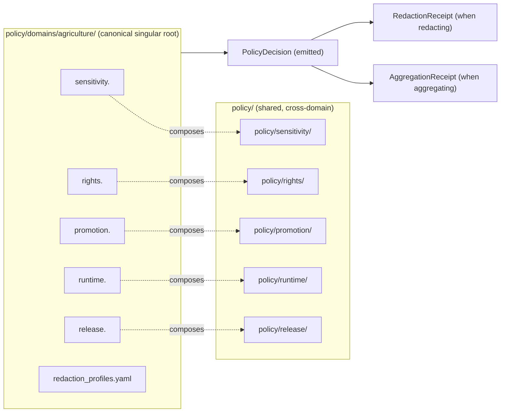
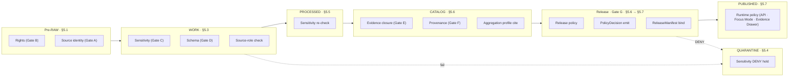

<!-- [KFM_META_BLOCK_V2]
doc_id: kfm://doc/00000000-0000-0000-0000-000000000000
title: Agriculture — Policy
type: standard
version: v1
status: draft
owners: agriculture-stewards · sensitivity-steward (TODO confirm CODEOWNERS)
created: 2026-05-26
updated: 2026-05-26
policy_label: public
related:
  - ai-build-operating-contract.md
  - directory-rules.md
  - docs/domains/agriculture/README.md
  - docs/domains/agriculture/DOMAIN.md
  - docs/domains/agriculture/OBJECTS.md
  - docs/domains/agriculture/OBJECT_FAMILIES.md
  - docs/domains/agriculture/PIPELINE.md
  - docs/domains/agriculture/SENSITIVITY.md
  - docs/domains/agriculture/CROSS_LANE.md
  - docs/domains/agriculture/MISSING_OR_PLANNED_FILES.md
  - policy/domains/agriculture/
  - policy/sensitivity/
  - policy/rights/
  - policy/promotion/
  - policy/runtime/
  - policy/release/
  - tests/domains/agriculture/
  - fixtures/domains/agriculture/
  - data/registry/sources/agriculture/
  - schemas/contracts/v1/domains/agriculture/
tags: [kfm, domain, agriculture, policy, admissibility, sensitivity, rights]
notes:
  - Pinned to CONTRACT_VERSION = "3.0.0".
  - Conformance language follows RFC 2119 / RFC 8174 per directory-rules.md §2.2.
  - Repository is not mounted in this session; all path-shaped claims are PROPOSED.
  - This file is the policy reference for the Agriculture domain.
  - Sensitive-domain routing deferred to ai-build-operating-contract.md §23.2.
  - This file describes policy intent and contracts; it is NOT itself the policy bundle.
  - The canonical executable policy lives under policy/domains/agriculture/ (Rego/OPA assumed; syntax NEEDS VERIFICATION).
[/KFM_META_BLOCK_V2] -->

# 🌾 Agriculture — Policy

> **Purpose.** The canonical policy reference for the Agriculture domain: which admissibility, rights, sensitivity, promotion, runtime, and release rules govern Agriculture data; how those rules bind to the twelve `OF-AG-NN` object families; how they fire at each pipeline stage; and how they fail closed. This file describes **policy intent and contracts**; the executable policy bundle lives under `policy/domains/agriculture/`.

<p>
  
  
  
  
  
  
  
  
  
  
</p>

**Status** · `draft` &nbsp;·&nbsp; **Owners** · `agriculture-stewards · sensitivity-steward` *(TODO confirm CODEOWNERS)* &nbsp;·&nbsp; **Updated** · `2026-05-26` &nbsp;·&nbsp; **Contract** · `CONTRACT_VERSION = "3.0.0"`

> [!CAUTION]
> **Sensitive-domain routing.** Several Agriculture object families carry operator-resolvable, private-parcel-adjacent, NASS-confidential, or quarantine-adjacent semantics. Disposition for any concrete public surface MUST be routed through `ai-build-operating-contract.md` §23.2 (Sensitive-Domain Decision Matrix). The most restrictive applicable row applies. **Default posture for field-level or operator-resolved Agriculture data is DENY public exact exposure → GENERALIZE → REQUIRE steward review → REQUIRE `AggregationReceipt` or `RedactionReceipt`.** Disposition is **not** re-derived here.

> [!IMPORTANT]
> **This file is policy intent, not policy code.** The executable policy bundle (Rego/OPA or equivalent) lives under `policy/domains/agriculture/`. This document is the **reading aid**: it records the doctrine that policy code MUST enforce, the inputs each rule consumes, the finite outcomes each rule emits, and the tests that prove the rule enforceable. Treat policy *intent* as authoritative for review; treat the *bundle* as authoritative for runtime.

---

## 📑 Contents

1. [Scope & posture](#1-scope--posture)
2. [Evidence basis](#2-evidence-basis)
3. [Authority order & conflict resolution](#3-authority-order--conflict-resolution)
4. [Policy families](#4-policy-families)
5. [Bundle map](#5-bundle-map)
6. [Per-family policy detail](#6-per-family-policy-detail)
   - 6.1 [Sensitivity policy](#61-sensitivity-policy)
   - 6.2 [Rights policy](#62-rights-policy)
   - 6.3 [Promotion policy](#63-promotion-policy)
   - 6.4 [Runtime policy](#64-runtime-policy)
   - 6.5 [Release policy](#65-release-policy)
   - 6.6 [Redaction profiles](#66-redaction-profiles)
7. [Per-`OF-AG-NN` policy matrix](#7-per-of-ag-nn-policy-matrix)
8. [Per-stage policy enforcement points](#8-per-stage-policy-enforcement-points)
9. [Finite outcomes & their meanings](#9-finite-outcomes--their-meanings)
10. [Deny-by-default register](#10-deny-by-default-register)
11. [`PolicyDecision` contract](#11-policydecision-contract)
12. [Policy tests, fixtures, and CI binding](#12-policy-tests-fixtures-and-ci-binding)
13. [Cross-lane policy edges](#13-cross-lane-policy-edges)
14. [Anti-patterns this policy rejects](#14-anti-patterns-this-policy-rejects)
15. [Lifecycle, versioning, and supersession](#15-lifecycle-versioning-and-supersession)
16. [Open questions register](#16-open-questions-register)
17. [Verification backlog](#17-verification-backlog)
18. [Changelog](#18-changelog)
19. [Definition of done](#19-definition-of-done)
20. [Related docs](#20-related-docs)

---

## 1. Scope & posture

This file is the **Agriculture domain's policy reference**: a single, browsable surface that names which rules govern Agriculture data, where they live, what they read, what they emit, and how they are tested. It complements but does not replace:

| Role | This file (`POLICY.md`) | `PIPELINE.md` | `OBJECT_FAMILIES.md` | `OBJECTS.md` |
|---|---|---|---|---|
| Form | Policy-family reference | Lifecycle / gates runbook | ID register + placement | Narrative reference |
| Authority for policy intent | **This file** (§4–§6, §10) | — | — | — |
| Authority for stage enforcement points | **This file** (§8) bound to `PIPELINE.md` §5 | `PIPELINE.md` §5 | — | — |
| Authority for finite outcomes | **This file** (§9, §11) | `PIPELINE.md` §5 | — | — |
| Authority for executable rules | **`policy/domains/agriculture/`** (PROPOSED) | — | — | — |
| Authority for object meaning | — | — | — | `OBJECTS.md` §6 |
| Authority for object IDs | — | — | `OBJECT_FAMILIES.md` §4 | — |

> [!IMPORTANT]
> **Repository is not mounted in this session.** Policy **intent**, doctrine references, the deny-by-default register, and the policy-family taxonomy are `CONFIRMED` from `directory-rules.md` §6.5, ENCY §16/§17, BUILD-MANUAL §6.2, and Atlas v1.1 §9. Concrete **policy files**, **bundle structure**, **Rego/OPA syntax choice**, and **CI binding** are `PROPOSED` until verified against a mounted repo or accepted ADR. *(`ai-build-operating-contract.md` §11.)*

### 1.1 What this file is

- A **reading aid** for reviewers, stewards, and policy authors: where each Agriculture rule lives, what it reads, what it emits.
- A **doctrine-to-bundle bridge** binding ENCY §16/§17, Atlas v1.1 §9, BUILD-MANUAL §6.2, and OPCON §23.2 to concrete `policy/domains/agriculture/` paths.
- A **review tool**: the per-`OF-AG-NN` matrix (§7) and the deny-by-default register (§10) are the surfaces a reviewer scans before signing off Gate C / Gate G.
- A **test contract**: every rule named here MUST map to at least one positive and one negative fixture in `tests/domains/agriculture/`.

### 1.2 What this file is **not**

- ❌ Executable policy. The Rego/OPA bundle lives at `policy/domains/agriculture/`.
- ❌ A sensitivity tier definition. T0–T4 are defined in ENCY §16; this file *applies* them.
- ❌ An ADR. Open architectural questions are surfaced in §16 and routed to `docs/adr/`.
- ❌ A repo status report. No row claims any rule, bundle, or test exists today.
- ❌ A substitute for `PIPELINE.md` Promotion Gates. This file says *what* the rule is; `PIPELINE.md` §4 says *where* the gate closes.

### 1.3 Truth labels used

This file uses the authoring labels from `ai-build-operating-contract.md` §8: **CONFIRMED**, **INFERRED**, **PROPOSED**, **UNKNOWN**, **NEEDS VERIFICATION**, **CONFLICTED**, **LINEAGE**, **EXPLORATORY**, **EXTERNAL**. Runtime outcomes (`ANSWER` / `ABSTAIN` / `DENY` / `ERROR` / `NARROWED` / `BOUNDED` / `SOURCE_STALE`) are used where they describe **actual policy decisions** — never as rhetorical hedging. Memory is not evidence.

[⤴ Back to top](#-contents)

---

## 2. Evidence basis

| Source ID | Document | Role here | Citation |
|---|---|---|---|
| `OPCON` | `ai-build-operating-contract.md` (v3.0; `CONTRACT_VERSION = "3.0.0"`) | Operating contract; §8 truth labels; §11 repo preflight; §12 untrusted-content rule; §23.2 sensitive-domain matrix; §34 receipt discipline; §37 lifecycle | CONFIRMED doctrine |
| `DIRRULES` | `directory-rules.md` (v1.3) | §6.5 `policy/` canonical singular root; §13.5 anti-patterns; §15 per-folder README contract | CONFIRMED doctrine |
| `BUILD-MANUAL` | `KFM_Unified_Implementation_Architecture_Build_Manual.md` | §6.2 Promotion Gates A–G; §7.1 `PolicyDecision`, `RightsReviewRecord`, `RedactionReceipt`, `AggregationReceipt`, `RollbackCard` object families | CONFIRMED doctrine |
| `ATLAS-v1.1` | `Kansas Frontier Matrix - Domains v1.1 + Pass 23/32 Consolidated Atlas` | §9 D source families and rights posture; §9 F cross-lane constraints; §24.5.2 per-domain tier matrix | CONFIRMED doctrine |
| `ENCY` | `KFM_Encyclopedia.md` / `kfm_unified_doctrine_synthesis.md` | §15 tier scheme (T0–T4); §16 per-domain sensitivity matrix; §17 cross-lane anti-collapse and source-role discipline | CONFIRMED doctrine |
| `OBJECTS-MD` | [`docs/domains/agriculture/OBJECTS.md`](OBJECTS.md) | Per-family narrative + sensitivity defaults | CONFIRMED (this session) |
| `OBJ-FAM-MD` | [`docs/domains/agriculture/OBJECT_FAMILIES.md`](OBJECT_FAMILIES.md) | `OF-AG-NN` ID register; source-role matrix | CONFIRMED (this session) |
| `PIPELINE-MD` | [`docs/domains/agriculture/PIPELINE.md`](PIPELINE.md) | Stage-by-stage runbook; Promotion-Gate binding; anti-pattern register | CONFIRMED (this session) |
| `MOPF-MD` | [`docs/domains/agriculture/MISSING_OR_PLANNED_FILES.md`](MISSING_OR_PLANNED_FILES.md) | Planning inventory; `policy/domains/agriculture/` file list per §4.4; deny-by-default scope | CONFIRMED (this session) |

> [!NOTE]
> No external (web) research was performed for this file. All claims are KFM-internal doctrine. Per `ai-build-operating-contract.md` §5 and the v3.0 prompt's `<external_research>` rule, external sources MUST NOT be used to make KFM repo-state or doctrine claims.

[⤴ Back to top](#-contents)

---

## 3. Authority order & conflict resolution

When sources disagree about an Agriculture policy decision, resolve in this order (mirrors `directory-rules.md` §2.1 and OPCON §5):

1. **KFM core invariants and operating law.** Lifecycle spine; cite-or-abstain; trust membrane; watcher-as-non-publisher; connector-non-publisher.
2. **Accepted ADRs** that explicitly amend KFM policy.
3. **`ai-build-operating-contract.md` §23.2** sensitive-domain matrix (most restrictive row wins).
4. **ENCY §16/§17** per-domain sensitivity matrix and cross-lane anti-collapse.
5. **Atlas v1.1 §9** Agriculture dossier (especially §9 D rights, §9 F cross-lane, §9 L sensitivity).
6. **`directory-rules.md`** placement rules (this file MUST live under `docs/domains/agriculture/`; executable policy MUST live under `policy/domains/agriculture/`).
7. **This document** (policy intent / reading aid).
8. **Per-root READMEs** in `policy/domains/agriculture/`, `policy/sensitivity/`, etc. (refine but cannot contradict higher tiers).
9. **`data/registry/sources/agriculture/`** per-source descriptors (refine per-source posture; cannot loosen tiers).
10. **Convention from the current mounted repo state** — when it conflicts, raise it as a `docs/registers/DRIFT_REGISTER.md` entry, **not** as new authority.

> [!IMPORTANT]
> If the executable policy bundle under `policy/domains/agriculture/` is found to contradict this document, that is a **CONFLICTED** state, not a default-to-bundle outcome. Conflicts MUST be logged in `docs/registers/DRIFT_REGISTER.md` and resolved by ADR. Bundle drift never quietly overrules doctrine.

[⤴ Back to top](#-contents)

---

## 4. Policy families

Six policy families govern Agriculture. Each is `CONFIRMED` as a doctrine-level family; each family's concrete file(s) under `policy/domains/agriculture/` are `PROPOSED`.



| Family | What it governs | Primary fires at | Primary `OF-AG-NN` exposure |
|---|---|---|---|
| **Sensitivity** (§6.1) | Tier assignment (T0–T4), operator/parcel/quarantine-adjacent denial, generalization rules. | Gate C (WORK → PROCESSED, CATALOG); runtime queries. | `OF-AG-02`, `OF-AG-04`, `OF-AG-08`, `OF-AG-11`. |
| **Rights** (§6.2) | License, terms, attribution, NASS confidentiality, regulatory-disclosure compliance, source-vintage gates. | Gate B (Pre-RAW admission); pre-publish at Gate G. | `OF-AG-04`, `OF-AG-05`, `OF-AG-08`, `OF-AG-11`. |
| **Promotion** (§6.3) | Stage-to-stage admission rules; PROCESSED → CATALOG → release-candidate. | Gates A–G across `PIPELINE.md` §5. | All twelve. |
| **Runtime** (§6.4) | Live query-time decisions: Focus Mode abstain, governed-API responses, stale-state badge, AI surface DENY paths. | Live API; UI Evidence Drawer; Focus Mode. | All twelve at the API surface. |
| **Release** (§6.5) | Per-slice release gates: `ReleaseManifest`, `RollbackCard`, supersession, correction. | Gate G; correction & rollback (`PIPELINE.md` §10). | All twelve at release lane. |
| **Redaction profiles** (§6.6) | Threshold parameters consumed by `AggregationReceipt` and `RedactionReceipt`. | CATALOG (§5.6 of `PIPELINE.md`). | `OF-AG-02`, `OF-AG-04`, `OF-AG-08`, `OF-AG-10`, `OF-AG-11`. |

> [!NOTE]
> The **shared cross-domain bundles** (`policy/sensitivity/`, `policy/rights/`, etc.) hold cross-cutting rules that Agriculture **composes**, not duplicates. Agriculture's domain bundle imports shared rules and refines them; it MUST NOT redefine cross-cutting primitives like the tier scheme.

[⤴ Back to top](#-contents)

---

## 5. Bundle map

The PROPOSED file layout for `policy/domains/agriculture/`. Per `MISSING_OR_PLANNED_FILES.md` §4.4 and `directory-rules.md` §6.5 / §15.

```text
policy/domains/agriculture/                          # canonical singular (per ADR-0003 PROPOSED)
├── README.md                                        # per-folder README contract (DIRRULES §15)
├── sensitivity.<ext>                                # tier assignment + operator-join DENY rules
├── rights.<ext>                                     # per-source license + terms enforcement
├── promotion.<ext>                                  # PROCESSED → CATALOG → PUBLISHED gates
├── runtime.<ext>                                    # query-time Focus Mode + API decisions
├── release.<ext>                                    # release-manifest binding gates
├── redaction_profiles.yaml                          # named threshold profiles (§6.6)
├── deny_by_default/                                 # explicit DENY scopes
│   ├── operator_join.<ext>
│   ├── parcel_join.<ext>
│   ├── quarantine_adjacent.<ext>
│   └── alert_authority_claim.<ext>
└── tests/                                            # policy-bundle-local tests
    └── <see tests/domains/agriculture/policy_*>     # canonical tests live under tests/
```

> [!WARNING]
> The `policy/` singular root is canonical. A `policies/` mirror is **compatibility-only** per DIRRULES §6.5 / §8.1. Any rule discovered under `policies/domains/agriculture/` is **CONFLICTED / LEGACY** under ADR-0003 (PROPOSED) and MUST migrate.

> [!NOTE]
> The bundle syntax extension (`.<ext>`) is `NEEDS VERIFICATION`. Rego (`.rego`) is the strongly-implied default per `MISSING_OR_PLANNED_FILES.md` §4.4 ("Rego/OPA assumed"). YAML/JSON declarative profiles MAY be used where they read cleaner (e.g., `redaction_profiles.yaml`). The choice is `OQ-AG-POL-01`.

[⤴ Back to top](#-contents)

---

## 6. Per-family policy detail

Each subsection below records: **purpose**, **inputs the rule reads**, **finite outcomes the rule emits**, **stages it fires at**, **`OF-AG-NN` exposure**, **canonical file(s)**, **test families**, and **doctrine basis**.

### 6.1 Sensitivity policy

- **Purpose.** Assigns sensitivity tiers (T0–T4 per ENCY §15) to Agriculture records and denies operator-resolvable, parcel-resolvable, and quarantine-adjacent public releases.
- **Inputs the rule reads.**
  - The record itself (geometry support, `source_role`, joined keys).
  - `data/registry/sources/agriculture/<source>.yaml` (source-specific sensitivity tier).
  - `policy/domains/agriculture/redaction_profiles.yaml` (when redaction is the proposed transform).
  - Cross-domain rules from `policy/sensitivity/` for `Settlements` (operator address) and `People/Land` (operator identity, parcel).
- **Finite outcomes.** `ANSWER` (tier assigned) · `DENY` (operator/parcel join) · `NARROWED` (generalized geometry returned) · `ABSTAIN` (insufficient evidence to assign tier) · `ERROR`.
- **Fires at.** Pipeline Gate C (`PIPELINE.md` §5.3 / §5.5); CATALOG aggregation transitions (§5.6); runtime queries (§6.4 of this file).
- **`OF-AG-NN` exposure.** Especially `OF-AG-02 · FieldCandidate`, `OF-AG-04 · YieldObservation`, `OF-AG-08 · AgriculturalEconomyObservation`, `OF-AG-11 · PestStressIndicator`; reviewed for every family at promotion.
- **Canonical file(s).** `policy/domains/agriculture/sensitivity.<ext>` (PROPOSED); composes `policy/sensitivity/` shared rules.
- **Test families.** `tests/domains/agriculture/sensitivity_validation/` · `…/policy_deny/` · `…/aggregation_threshold/` · `…/source_role_mismatch/`.
- **Doctrine basis.** ENCY §15 (tier scheme), §16 (per-domain matrix: "Agriculture — county histograms T0/T1; private farm/operator × parcel joins DENY"), §17 (source-role anti-collapse); Atlas v1.1 §24.5.2; OPCON §23.2.

> [!CAUTION]
> Style-only geoprivacy (e.g., MapLibre style opacity hiding a sensitive layer) is **not** sensitivity policy. Sensitivity is policy + transform + receipt; rendering choices are downstream of those. Per `PIPELINE.md` §11 anti-patterns.

[⤴ Back to top](#-contents)

### 6.2 Rights policy

- **Purpose.** Enforces per-source license, attribution, NASS confidentiality, regulatory disclosure constraints, and source-vintage rules.
- **Inputs the rule reads.**
  - `SourceDescriptor` for the originating source (`data/registry/sources/agriculture/<source>.yaml`).
  - License snapshot captured at Pre-RAW (`EventRunReceipt`) and at RAW (`IntakeReceipt`).
  - Shared license rules from `policy/rights/` (e.g., generic open-data baseline; CC license matrix).
- **Finite outcomes.** `ANSWER` (rights closed; release allowed) · `DENY` (license incompatible; restricted terms) · `ABSTAIN` (rights unresolved) · `ERROR`.
- **Fires at.** Pipeline Gate B (`PIPELINE.md` §5.1 Pre-RAW admission); pre-publish re-check at Gate G (§5.7).
- **`OF-AG-NN` exposure.** Especially `OF-AG-04 · YieldObservation` (NASS confidentiality), `OF-AG-05 · IrrigationLink` (water-right terms), `OF-AG-08 · AgriculturalEconomyObservation` (NASS QuickStats / Census of Agriculture), `OF-AG-11 · PestStressIndicator` (regulatory pest disclosure); reviewed for every family.
- **Canonical file(s).** `policy/domains/agriculture/rights.<ext>` (PROPOSED); composes `policy/rights/` shared rules.
- **Test families.** `tests/domains/agriculture/rights_validation/`.
- **Doctrine basis.** Atlas v1.1 §9 D ("rights and current terms NEEDS VERIFICATION; sensitive joins fail closed"); OPCON §23.2 row for **Restricted source terms**.

> [!IMPORTANT]
> Per `MISSING_OR_PLANNED_FILES.md` §6 (AG-V-07), **rights for every Agriculture source family are `NEEDS VERIFICATION`**: SSURGO, gSSURGO, Mesonet, SCAN, USCRN, SMAP, HLS, NASS. The policy MUST emit `ABSTAIN` (not `ANSWER`) until a `SourceDescriptor` has a verified rights record.

[⤴ Back to top](#-contents)

### 6.3 Promotion policy

- **Purpose.** Enforces stage-to-stage admission rules — that Pre-RAW admits only when Gate A and Gate B close, that WORK admits only when Gate C and Gate D close at the record level, that CATALOG admits only when Gate E and Gate F close, that release candidates admit only when Gate G is satisfied.
- **Inputs the rule reads.** Receipts from prior stages (`EventRunReceipt`, `IntakeReceipt`, `TransformReceipt`, `ValidationReport`); composition of sensitivity (§6.1) + rights (§6.2) outcomes; `EvidenceBundle` closure status; `CatalogMatrixReport`.
- **Finite outcomes.** `ANSWER` (promotion allowed) · `DENY` (gate failure) · `ABSTAIN` (gate inputs incomplete) · `ERROR`.
- **Fires at.** Every promotion edge in `PIPELINE.md` §3 lifecycle spine.
- **`OF-AG-NN` exposure.** All twelve.
- **Canonical file(s).** `policy/domains/agriculture/promotion.<ext>` (PROPOSED); composes `policy/promotion/` shared rules.
- **Test families.** `tests/domains/agriculture/release_manifest/` · `…/non_regression/` · `…/no_network/`.
- **Doctrine basis.** BUILD-MANUAL §6.2 Promotion Gates A–G; `PIPELINE.md` §4.

[⤴ Back to top](#-contents)

### 6.4 Runtime policy

- **Purpose.** Live-query enforcement: governed-API responses, Focus Mode abstain conditions, AI surface DENY paths, stale-state badge logic.
- **Inputs the rule reads.** Released `LayerManifest`s and `EvidenceBundle`s; `ReleaseManifest` referenced from the layer; source-freshness windows; user/role context (where applicable).
- **Finite outcomes.** `ANSWER` (cited, bounded) · `ABSTAIN` (cite-or-abstain default; no evidence) · `DENY` (sensitivity/rights/role) · `NARROWED` (coarser support geometry returned) · `BOUNDED` (limit imposed) · `SOURCE_STALE` (badge applied; surface read-only with disclaimer) · `ERROR`.
- **Fires at.** Live `apps/governed-api/` requests; Focus Mode answers; Evidence Drawer renderings.
- **`OF-AG-NN` exposure.** All twelve at the API surface; especially `OF-AG-04`, `OF-AG-08`, `OF-AG-10`, `OF-AG-11` for stale-state and aggregation-threshold queries.
- **Canonical file(s).** `policy/domains/agriculture/runtime.<ext>` (PROPOSED); composes `policy/runtime/` shared rules.
- **Test families.** `tests/domains/agriculture/stale_state/` · `…/citation_validation/` · `…/policy_deny/` (runtime variant).
- **Doctrine basis.** ENCY §17 (source-role anti-collapse at runtime); MAP-MASTER doctrine for Evidence Drawer surfaces; `PIPELINE.md` §12 telemetry rules; OPCON §23.2.

> [!NOTE]
> The runtime policy enforces the **cite-or-abstain** invariant for Agriculture surfaces: any AI or API response that cannot cite an `EvidenceRef` closure MUST emit `ABSTAIN`, never a synthesized claim.

[⤴ Back to top](#-contents)

### 6.5 Release policy

- **Purpose.** Per-slice release gates beyond Promotion: that every released Agriculture slice carries `ReleaseManifest` + `RollbackCard` + `ProofPack` + `PolicyDecision` + `PromotionReceipt`, and that correction/supersession paths are intact.
- **Inputs the rule reads.** Release-candidate folder contents under `release/candidates/agriculture/<slice>/`; `CatalogMatrixReport`; prior released `ReleaseManifest` (for supersession check).
- **Finite outcomes.** `ANSWER` (release allowed) · `DENY` (Gate G fail; missing rollback / proof / manifest) · `ABSTAIN` (reviewer not yet engaged) · `ERROR`.
- **Fires at.** Gate G (`PIPELINE.md` §5.6 → §5.7); correction & rollback (§10 of `PIPELINE.md`).
- **`OF-AG-NN` exposure.** Every release lane in `PIPELINE.md` §8.
- **Canonical file(s).** `policy/domains/agriculture/release.<ext>` (PROPOSED); composes `policy/release/` shared rules.
- **Test families.** `tests/domains/agriculture/release_manifest/` · `…/rollback_drill/`.
- **Doctrine basis.** BUILD-MANUAL §6.2 Gate G; DIRRULES §13.5 (`ReleaseManifest` outside `release/` is build-stop).

[⤴ Back to top](#-contents)

### 6.6 Redaction profiles

- **Purpose.** Named, parameterized profiles consumed by `AggregationReceipt` and `RedactionReceipt`. The profile is the canonical reference that an aggregation cites; the receipt is the proof.
- **Inputs the rule reads.** N/A (profiles are *consumed*, not active rules).
- **Finite outcomes.** N/A (a profile produces no outcome by itself; the consuming rule does).
- **Fires at.** Cited by sensitivity policy (§6.1) at CATALOG aggregation transitions.
- **`OF-AG-NN` exposure.** `OF-AG-02 · FieldCandidate` (generalized), `OF-AG-04 · YieldObservation` (county/HUC), `OF-AG-08 · AgriculturalEconomyObservation` (county), `OF-AG-10 · DroughtStressIndicator` (HUC/grid), `OF-AG-11 · PestStressIndicator` (HUC/grid).
- **Canonical file(s).** `policy/domains/agriculture/redaction_profiles.yaml` (PROPOSED).
- **Test families.** `tests/domains/agriculture/aggregation_threshold/`.
- **Doctrine basis.** `PIPELINE.md` §9; ENCY §16; OPCON §23.2.

**Profile contract — illustrative skeleton (PROPOSED, reproduced from `PIPELINE.md` §9 for convenience).**

```yaml
# policy/domains/agriculture/redaction_profiles.yaml (PROPOSED skeleton)
profiles:
  county_yield_v1:
    support_geometry: county
    minimum_cell_count: <NEEDS VERIFICATION>
    suppression_rule: <NEEDS VERIFICATION>
    applies_to:
      - OF-AG-04
      - OF-AG-08
  huc12_drought_v1:
    support_geometry: huc12
    minimum_cell_count: <NEEDS VERIFICATION>
    suppression_rule: <NEEDS VERIFICATION>
    applies_to:
      - OF-AG-10
      - OF-AG-11
  generalized_field_v1:
    support_geometry: generalized_polygon
    generalization_rule: <NEEDS VERIFICATION>
    applies_to:
      - OF-AG-02
      - OF-AG-06
```

> [!CAUTION]
> Threshold *values* are deliberately blank. The sensitivity steward and `agriculture-stewards` MUST set them via review; fabricating numbers in this file would weaken sensitivity policy, not strengthen it. *(Tracked in §17 as `AG-POL-V-04` and in `PIPELINE.md` `OQ-AG-PIPE-04`.)*

[⤴ Back to top](#-contents)

---

## 7. Per-`OF-AG-NN` policy matrix

How each of the twelve object families interacts with each policy family. Default tiers from [`OBJECT_FAMILIES.md`](OBJECT_FAMILIES.md) §4 and ENCY §16.

| Family | Sensitivity default | Sensitivity escalation | Rights primary concern | Promotion-gate-critical | Runtime DENY conditions | `AggregationReceipt` required? |
|---|---|---|---|---|---|---|
| `OF-AG-01 · CropObservation` | T0 agg · T1 field | T3+ if operator-resolvable | NASS terms for QuickStats source | Gates C, E | Operator join; missing citation | Yes — aggregate variants |
| `OF-AG-02 · FieldCandidate` | T1 | **T3+ if operator-resolvable** | CDL/HLS terms | Gates C, G | Operator join; source-role collapse (`model` → `authority`) | Yes — for any operator-adjacent release |
| `OF-AG-03 · CropRotation` | T0 agg · T1 field | T3+ if operator-resolvable | CDL series terms | Gates D, E | Operator join | Yes — aggregate variants |
| `OF-AG-04 · YieldObservation` | T0 county · T1 field | **T3+ DENY if operator-resolvable** | **NASS confidentiality** | Gate C (highest-frequency failure) | Operator × parcel × yield join | **Yes — always at county/HUC release** |
| `OF-AG-05 · IrrigationLink` | T1 | T2 if well-owner joinable | Water-right terms | Gates B, C | Well-owner identity exposure | No — but `RedactionReceipt` MAY apply |
| `OF-AG-06 · ConservationPractice` | T1 | T2 if operator-resolvable | NRCS terms (public subset) | Gates B, C | Operator-resolvable detail | No — but operator-resolvable variants DENY |
| `OF-AG-07 · SoilCropSuitability` | T0 | None standard | Soil source terms (cited) | Gate F | `model` cited as observed; missing `model_version` | No — `model_version` MUST close |
| `OF-AG-08 · AgriculturalEconomyObservation` | T0 county | **DENY operator-detail** | **NASS confidentiality** | Gates B, C | Operator-detail join | **Yes — always** |
| `OF-AG-09 · SupplyChainNode` | T0 agg · T1+ facility | Capacity restricted by rights | Facility-registry terms | Gate B | Restricted capacity disclosure | No |
| `OF-AG-10 · DroughtStressIndicator` | T0 agg · T1 field | None standard | Composite source terms | Gate F | Missing `model_version`; alert-authority claim | Yes — aggregate variants |
| `OF-AG-11 · PestStressIndicator` | T0 agg · T1 field | **T2+ if quarantine-adjacent** | Regulatory pest-disclosure terms | Gates B, C | Quarantine-adjacent detail | Yes — aggregate variants |
| `OF-AG-12 · AggregationReceipt` | T0 metadata · payload-bound | Receipt does not launder payload | Cross-cutting | Gates E, G | N/A (receipt object) | Self — the receipt **is** the proof |

> [!IMPORTANT]
> Tier is **resolved against the shape actually released**, not against the family name. `OF-AG-04` may publish at T0 as a county roll-up *and* DENY at T3+ when joined to operator identity. Both rows are simultaneously correct. The validator that enforces this is `tests/domains/agriculture/policy_deny/` (PROPOSED).

[⤴ Back to top](#-contents)

---

## 8. Per-stage policy enforcement points

Where each policy family fires across the Agriculture pipeline. Cross-reference with [`PIPELINE.md` §5](PIPELINE.md#5-stage-by-stage-handling).



| Stage | Policy families that fire | Notes |
|---|---|---|
| Pre-RAW · §5.1 | Rights (§6.2), Promotion (§6.3) | Cheap denial point; rights MUST close here when possible. |
| RAW · §5.2 | (none — capture is immutable) | Policy fires upstream (Pre-RAW) and downstream (WORK). |
| WORK · §5.3 | Sensitivity (§6.1), Promotion (§6.3) | Source-role discipline enforced here. |
| QUARANTINE · §5.4 | Sensitivity (§6.1) | Hold reason-coded; no policy bypass back to WORK. |
| PROCESSED · §5.5 | Sensitivity re-check (§6.1), Promotion (§6.3) | Evidence ref closure prep. |
| CATALOG · §5.6 | Sensitivity (§6.1), Promotion (§6.3), Redaction profile cite (§6.6) | `AggregationReceipt` MUST cite profile. |
| Release · Gate G | Release (§6.5), Promotion (§6.3) | `PolicyDecision` emitted; manifest/proof/rollback bound. |
| PUBLISHED · §5.7 | Runtime (§6.4) | API, Focus Mode, Evidence Drawer. |

[⤴ Back to top](#-contents)

---

## 9. Finite outcomes & their meanings

The runtime taxonomy (per OPCON §8 and `PIPELINE.md` §5 finite-outcome rows), interpreted for Agriculture policy decisions.

| Outcome | Meaning in Agriculture policy | Where it fires |
|---|---|---|
| `ANSWER` | Rule passed; record is admitted at this stage with bounded confidence and cited evidence. | All stages. |
| `ABSTAIN` | Cite-or-abstain default; no closed `EvidenceRef`, or rights unresolved. | Rights (§6.2); Runtime cite check (§6.4). |
| `DENY` | Sensitivity, rights, role, or release-gate failure. Hard refusal. | Sensitivity (§6.1); Rights (§6.2); Release (§6.5); deny-by-default (§10). |
| `ERROR` | Integrity/system error: malformed envelope, hash mismatch, schema crash. Distinct from policy DENY. | All stages. |
| `NARROWED` | Coarser support geometry returned (county instead of field); records the narrowing in `RedactionReceipt`. | Sensitivity (§6.1); Runtime (§6.4). |
| `BOUNDED` | Result returned with explicit scope limits (e.g., "results limited to T0 layers only"). | Runtime (§6.4). |
| `SOURCE_STALE` | Source freshness window expired; layer becomes read-only with stale-state badge. | Runtime (§6.4); per-source freshness windows in `data/registry/sources/agriculture/`. |

> [!IMPORTANT]
> `DENY` and `ERROR` are doctrinally distinct. A `DENY` is a **policy** outcome — the record could not be admitted under the rules; this is normal pipeline behavior. An `ERROR` is a **system** outcome — something is broken. Conflating them in audit logs is itself a defect.

[⤴ Back to top](#-contents)

---

## 10. Deny-by-default register

Doctrine-grounded DENY scopes for the Agriculture domain. Each row is `CONFIRMED` doctrine, with the executable `policy/domains/agriculture/deny_by_default/` files `PROPOSED`.

| ID | Scope | Why DENY | Doctrine basis |
|---|---|---|---|
| AG-DENY-01 | Operator × parcel × yield public join | Privacy of agricultural businesses; NASS confidentiality; private-land assertions. | ENCY §17; Atlas v1.1 §9 F; OPCON §23.2. |
| AG-DENY-02 | `FieldCandidate` joined to operator identity | Source-role collapse risk (`model` → `authority`); private-business inference. | ENCY §17; `OBJECT_FAMILIES.md` §5.02. |
| AG-DENY-03 | `AgriculturalEconomyObservation` at operator-detail tier | NASS confidentiality; private-business detail. | Atlas v1.1 §9 D ("rights NEEDS VERIFICATION; sensitive joins fail closed"); `OBJECT_FAMILIES.md` §5.08. |
| AG-DENY-04 | `IrrigationLink` with well-owner identity exposed | Privacy of water-right holders. | Atlas v1.1 §9 F; `OBJECT_FAMILIES.md` §5.05. |
| AG-DENY-05 | `PestStressIndicator` at quarantine-adjacent detail | Regulatory disclosure constraints; biosecurity. | `OBJECT_FAMILIES.md` §5.11; OPCON §23.2 row for restricted source terms. |
| AG-DENY-06 | Agriculture surfaces claiming alert authority for drought/wildfire | Alert authority is Hazards-owned. Agriculture is `model`/`context`. | ENCY §16 ("Hazards — alert-authority claims deny"); `PIPELINE.md` §11. |
| AG-DENY-07 | Agriculture record published without resolvable `EvidenceRef` | Cite-or-abstain default. | OPCON §8; ENCY §15. |
| AG-DENY-08 | Agriculture aggregate published without `AggregationReceipt` citing a named threshold profile | Aggregation is the load-bearing transform; receipt is the proof. | `PIPELINE.md` §9; OPCON §23.2. |
| AG-DENY-09 | Source-role downcast or upcast at WORK exit (`model` → `authority`, `aggregate` → `observation`) | Source-role anti-collapse — single most common silent failure. | ENCY §17; `OBJECT_FAMILIES.md` §6. |
| AG-DENY-10 | Style-only geoprivacy on public Agriculture layers | Sensitivity is policy + transform + receipt; style is downstream. | MAP-MASTER doctrine; `PIPELINE.md` §11. |
| AG-DENY-11 | Agriculture release without `RollbackCard` | Gate G requires rollback target. | BUILD-MANUAL §6.2 Gate G. |
| AG-DENY-12 | `ReleaseManifest` placed under `data/releases/` or `artifacts/release/` | Canonical home is `release/`. Build-stop defect. | DIRRULES §13.5. |
| AG-DENY-13 | Public client reads `data/processed/agriculture/` or `data/catalog/` directly | Trust-membrane bypass. | DIRRULES §13.5; `PIPELINE.md` §5.7. |
| AG-DENY-14 | Connector or watcher writes to `data/processed/`, `data/catalog/`, or `data/published/` | Connector/Watcher-Non-Publisher invariants. | DIRRULES §13.5; `PIPELINE.md` §11. |

> [!WARNING]
> **Each AG-DENY row MUST map to at least one negative-fixture test** under `tests/domains/agriculture/policy_deny/` (or the appropriate sibling family). A test missing for an AG-DENY scope is a Gate-G review failure, not a backlog item.

[⤴ Back to top](#-contents)

---

## 11. `PolicyDecision` contract

`PolicyDecision` is the receipt emitted whenever an Agriculture policy rule fires. Object family: CONFIRMED in BUILD-MANUAL §7.1. Schema body: `NEEDS VERIFICATION` per `OBJECT_FAMILIES.md` §5.12 receipt-home discussion.

**Illustrative skeleton (PROPOSED).**

```yaml
# PolicyDecision shape (illustrative; NEEDS VERIFICATION against schemas/contracts/v1/...)
PolicyDecision:
  decision_id:       <ULID or UUID>
  contract_version:  "3.0.0"
  policy_family:     sensitivity | rights | promotion | runtime | release
  rule_ref:          policy/domains/agriculture/<file>#<rule_id>
  inputs_digest:     <BLAKE3 or SHA-256 of normalized inputs>
  subject_evidence_ref: <EvidenceRef pointing to record(s) under decision>
  source_role_set:   [<role>, ...]
  outcome:           ANSWER | ABSTAIN | DENY | NARROWED | BOUNDED | SOURCE_STALE | ERROR
  reason_code:       <stable code, e.g., AG-DENY-01>
  reason_text:       <human-readable; non-PII>
  cited_profile_ref: <optional; e.g., policy/domains/agriculture/redaction_profiles.yaml#county_yield_v1>
  related_receipts:
    - <AggregationReceipt receipt_id, if applicable>
    - <RedactionReceipt receipt_id, if applicable>
  policy_version:    <version of the policy bundle that decided>
  decided_at:        <ISO-8601 UTC>
  decided_by:        <runtime identity; e.g., kfm://service/governed-api>
  spec_hash:         <JCS-canonical SHA-256 of the PolicyDecision payload>
```

> [!NOTE]
> Per OPCON §34, every `PolicyDecision` is itself an audit-bearing receipt. Bundle changes between decision-time and audit-time MUST be reconcilable via `policy_version`, which is why §15 mandates supersession discipline.

[⤴ Back to top](#-contents)

---

## 12. Policy tests, fixtures, and CI binding

Per `MISSING_OR_PLANNED_FILES.md` §4.5, Agriculture policy is tested via specific validator families under `tests/domains/agriculture/`. The mapping below binds each policy family to its test families.

| Policy family | Test families (PROPOSED, under `tests/domains/agriculture/`) | Fixtures (PROPOSED, under `fixtures/domains/agriculture/`) |
|---|---|---|
| Sensitivity (§6.1) | `sensitivity_validation/` · `policy_deny/` · `aggregation_threshold/` · `source_role_mismatch/` | `valid/<family>/` · `invalid/<family>/` · `no_network/county_year_panel/` |
| Rights (§6.2) | `rights_validation/` | `valid/<source>_descriptor/` · `invalid/<source>_descriptor/` |
| Promotion (§6.3) | `release_manifest/` · `non_regression/` · `no_network/` | `no_network/<source>/` |
| Runtime (§6.4) | `stale_state/` · `citation_validation/` · `policy_deny/` (runtime variant) | `valid/runtime_envelope/` · `invalid/runtime_envelope/` |
| Release (§6.5) | `release_manifest/` · `rollback_drill/` | `valid/release_candidate/` · `invalid/release_candidate/` |
| Redaction profiles (§6.6) | `aggregation_threshold/` | `valid/aggregation_input/` · `invalid/aggregation_input/` |

**CI binding (PROPOSED).** The Agriculture policy bundle MUST be exercised by CI before merge. PROPOSED gate: a merge that touches `policy/domains/agriculture/`, `schemas/contracts/v1/domains/agriculture/`, `data/registry/sources/agriculture/`, or `pipelines/domains/agriculture/` MUST run the full `tests/domains/agriculture/` suite plus the policy-deny suite. The workflow file's path remains `NEEDS VERIFICATION` until mounted-repo inspection.

> [!IMPORTANT]
> **Each `AG-DENY-NN` row from §10 MUST resolve to at least one negative fixture.** A reviewer MUST confirm coverage before any Agriculture release lane goes live.

[⤴ Back to top](#-contents)

---

## 13. Cross-lane policy edges

Per Atlas v1.1 §9 F and ENCY §17, Agriculture has explicit cross-lane edges. Cross-lane joins MUST preserve the cited family's `EvidenceBundle`, `source_role`, sensitivity tier, and release state. Where Agriculture is the consumer, Agriculture policy MUST defer to the cited lane's stricter rule.

| Cross-lane edge | Cited lane | Agriculture policy posture | Cross-lane policy reference (PROPOSED) |
|---|---|---|---|
| `SoilCropSuitability` cites `MUKEY`/`SoilComponent` | Soil | Cite, don't republish. `source_role = model` carried. | `policy/sensitivity/` Soil rules (cross-cutting). |
| `IrrigationLink` cites well/diversion/HUC | Hydrology | Cite, don't republish. Well-owner identity → T2 reviewer. | `policy/sensitivity/` Hydrology rules. |
| `DroughtStressIndicator` cites `WeatherObservation` | Atmosphere/Air | Cite, don't republish. No alert-authority claims (AG-DENY-06). | `policy/release/hazards/` (consumer-side alert authority). |
| Any Agriculture × operator identity / parcel | People/Land | **DENY public release** (AG-DENY-01..04). | `policy/sensitivity/people/`; `policy/consent/people/`. |
| `SupplyChainNode` cites Roads/Rail topology | Roads/Rail | Cite, don't republish. Capacity restricted by source terms (AG-DENY scope). | `policy/sensitivity/` Roads/Rail rules. |
| Any Agriculture × Hazards (drought, wildfire) | Hazards | Agriculture provides `model`/`context`; **Hazards owns alert authority**. | `policy/release/hazards/` (AG-DENY-06 binds here). |
| Agriculture feeds Frontier Matrix | Frontier Matrix | Source-role + uncertainty preserved across cell boundaries. | `policy/release/matrix/` (PROPOSED). |

> [!WARNING]
> The most consequential cross-lane policy edge for Agriculture is **`Agriculture × People/Land`**. Per ENCY §17, joining `YieldObservation × FieldCandidate × parcel × operator` is the canonical operator-resolved combination that MUST DENY at public release. Cross-lane policy MUST NOT be weakened by Agriculture-side rules.

[⤴ Back to top](#-contents)

---

## 14. Anti-patterns this policy rejects

Per `directory-rules.md` §13.5, ENCY §17, `PIPELINE.md` §11, and the deny-by-default register §10.

| Anti-pattern | Counter-rule | Test family |
|---|---|---|
| Policy in `policies/domains/agriculture/` (compat root) treated as authority | Canonical singular `policy/`; ADR-0003 PROPOSED. | repo-layout audit |
| Schema authority drifted into policy ("`.schema.json` under `policy/`") | Schemas under `schemas/contracts/v1/...`; policies under `policy/`. ADR-0001. | repo-layout audit |
| `release/*.rego` (policy code under release lane) | Move to `policy/release/` or `policy/domains/agriculture/`. | repo-layout audit |
| Operator × parcel × yield join published | AG-DENY-01; sensitivity Gate C. | `tests/domains/agriculture/policy_deny/` |
| Source-role collapse (`model` → `authority`, `aggregate` → `observation`) | AG-DENY-09; `source_role` enum carried. | `…/source_role_mismatch/` |
| Aggregation without named threshold profile | AG-DENY-08; `AggregationReceipt.cited_profile_ref` required. | `…/aggregation_threshold/` |
| Style-only geoprivacy on public layers | AG-DENY-10; sensitivity is policy + transform + receipt. | `…/policy_deny/` (style fixture) |
| `ReleaseManifest` outside `release/` | AG-DENY-12; canonical home is `release/`. | repo-layout audit |
| Public client reads canonical store | AG-DENY-13; trust membrane is governed API. | `…/policy_deny/` (route fixture) |
| Connector or watcher publishes | AG-DENY-14; Connector/Watcher-Non-Publisher invariants. | repo-layout audit + lifecycle-skip test |
| Agriculture surface claims drought/wildfire alert authority | AG-DENY-06; Hazards owns alerts. | `…/policy_deny/` (alert-claim fixture) |
| Surface continues to `ANSWER` past stale window | Runtime emits `SOURCE_STALE`. | `…/stale_state/` |
| Cite-or-abstain violated (Agriculture surface returns synthesized claim without `EvidenceRef`) | AG-DENY-07; runtime MUST `ABSTAIN`. | `…/citation_validation/` |

[⤴ Back to top](#-contents)

---

## 15. Lifecycle, versioning, and supersession

Agriculture policy is itself an artifact under KFM lifecycle discipline (per OPCON §37 and the operating contract's "policy is replaceable via accepted ADR; old policy retained" rule).

**Versioning (PROPOSED).** `policy/domains/agriculture/` files carry a version stamp; bundle releases are version-tagged in CI. Concrete versioning scheme is `OQ-AG-POL-04`.

**Supersession.** When a policy rule is replaced:

1. Author the new rule under `policy/domains/agriculture/<file>` with an ADR reference in the rule header.
2. Retain the prior version with a status header (`status: superseded`) and a forward link to the replacement.
3. Emit a `SupersessionRecord` per `PIPELINE.md` §10.
4. Re-run negative fixtures to confirm the new rule fires correctly across `tests/domains/agriculture/`.
5. Update `data/registry/policy_versions/` (PROPOSED location).
6. Communicate via `CorrectionNotice` if any released slice is materially affected.

**MAJOR change triggers (per OPCON §37):** Removing an AG-DENY row; loosening any operator-join or quarantine-adjacent DENY; changing the cite-or-abstain default; removing `AggregationReceipt` requirement for an aggregate transition. These MUST be ADR-ratified.

**MINOR change triggers:** Adding a new AG-DENY scope; tightening a threshold profile; adding a new policy file under `policy/domains/agriculture/`; cross-link reorganization.

**PATCH change triggers:** Documentation-only clarifications; typo fixes; non-semantic refactors.

[⤴ Back to top](#-contents)

---

## 16. Open questions register

| ID | Question | Owner role | Resolution path |
|---|---|---|---|
| OQ-AG-POL-01 | Policy bundle syntax — Rego/OPA (`.rego`), Conftest, declarative YAML, or a mix per file? | policy-steward · agriculture-stewards | ADR; default PROPOSED: Rego/OPA for `sensitivity/rights/promotion/runtime/release`, YAML for `redaction_profiles.yaml`. |
| OQ-AG-POL-02 | Is `deny_by_default/` a subdirectory of `policy/domains/agriculture/`, or split across the per-family files? | policy-steward | Repo inspection + ADR; default PROPOSED: dedicated subdirectory per §5 bundle map. |
| OQ-AG-POL-03 | Where does `AggregationReceipt` schema live (`schemas/contracts/v1/domains/agriculture/` vs. `schemas/contracts/v1/receipts/`)? | receipt-steward | ADR-S-03; same question as in `OBJECT_FAMILIES.md` §5.12. |
| OQ-AG-POL-04 | Policy-bundle versioning scheme (semver, date-stamped, monotonic). | policy-steward | ADR; affects `PolicyDecision.policy_version` shape. |
| OQ-AG-POL-05 | Threshold values for each profile in `redaction_profiles.yaml`. | sensitivity-steward · agriculture-stewards | Sensitive-steward review; ratify in policy file; tested by `aggregation_threshold/`. |
| OQ-AG-POL-06 | Should sensitivity rules consume `policy/sensitivity/` shared rules via OPA bundle import, file include, or copy-with-supersession? | policy-steward · DRY-steward | ADR; default PROPOSED: bundle import (avoids drift). |
| OQ-AG-POL-07 | Stale-state freshness window per source (Mesonet, USCRN, SCAN, SMAP, HLS, NASS QuickStats, NASS CDL, SSURGO). | source-steward · agriculture-stewards | Per-source value in `data/registry/sources/agriculture/`. |
| OQ-AG-POL-08 | `PolicyDecision` schema home (cross-cutting `schemas/contracts/v1/runtime/` vs. shared receipts lane). | receipt-steward | ADR; current PROPOSED posture: cross-cutting runtime. |
| OQ-AG-POL-09 | Role context for runtime DENY paths: does Agriculture expose any role-gated surfaces (reviewer-only, steward-only), or is everything public/abstain? | runtime-steward · agriculture-stewards | Affects shape of runtime policy. |
| OQ-AG-POL-10 | Agriculture-specific cite-or-abstain wording in `runtime.<ext>` for AI surfaces (Focus Mode). | runtime-steward · GAI-steward | Per ENCY §17; record exact ABSTAIN reason codes. |

[⤴ Back to top](#-contents)

---

## 17. Verification backlog

Items that MUST remain `NEEDS VERIFICATION` until evidence (mounted repo files, schemas, registry entries, tests, logs, emitted artifacts, review records, or release manifests) is produced.

| # | Item | Evidence that would settle it | Status |
|---|---|---|---|
| AG-POL-V-01 | `policy/domains/agriculture/` present with the six policy-family files + `deny_by_default/` + `redaction_profiles.yaml`. | Mounted repo files. | NEEDS VERIFICATION |
| AG-POL-V-02 | Bundle syntax decided (per `OQ-AG-POL-01`) and applied consistently. | Repo files + ADR. | NEEDS VERIFICATION |
| AG-POL-V-03 | Per-source rights closed (NASS, SSURGO, gSSURGO, Mesonet, SCAN, USCRN, SMAP, HLS) and recorded in `data/registry/sources/agriculture/`. | Source descriptors + rights validation test. | NEEDS VERIFICATION |
| AG-POL-V-04 | All four threshold profiles in `redaction_profiles.yaml` have steward-ratified values. | Policy file + `aggregation_threshold/` test. | NEEDS VERIFICATION |
| AG-POL-V-05 | Every `AG-DENY-NN` row in §10 has at least one negative fixture under `tests/domains/agriculture/`. | Fixtures + test runs. | NEEDS VERIFICATION |
| AG-POL-V-06 | Every Agriculture release lane emits a `PolicyDecision` referencing the rule that admitted it. | Sample releases + `PolicyDecision` audit. | NEEDS VERIFICATION |
| AG-POL-V-07 | `AggregationReceipt`s cite a named profile from `redaction_profiles.yaml`. | Sample receipts + cross-reference check. | NEEDS VERIFICATION |
| AG-POL-V-08 | CI binding: a workflow runs the full policy test suite on any change to `policy/domains/agriculture/`, `schemas/.../agriculture/`, `data/registry/sources/agriculture/`, or `pipelines/.../agriculture/`. | `.github/workflows/` evidence. | NEEDS VERIFICATION |
| AG-POL-V-09 | Stale-state freshness windows committed per source. | Source descriptors + `stale_state/` test. | NEEDS VERIFICATION |
| AG-POL-V-10 | Cross-lane policy edges from §13 enforced — Agriculture-side rules do not override stricter cited-lane rules. | Cross-lane fixture passes. | NEEDS VERIFICATION |
| AG-POL-V-11 | Policy versioning scheme decided and applied to bundle releases. | Tag/release history. | NEEDS VERIFICATION |
| AG-POL-V-12 | `policies/` compat root drift absent (no `policies/domains/agriculture/`). | Repo-layout scan. | NEEDS VERIFICATION |

[⤴ Back to top](#-contents)

---

## 18. Changelog

| Change | Type (per `ai-build-operating-contract.md` §37) | Reason |
|---|---|---|
| v1 creation (this file). | new | Per-domain policy reference for Agriculture, binding doctrine (ENCY §16/§17, Atlas v1.1 §9, BUILD-MANUAL §6.2, OPCON §23.2) to `policy/domains/agriculture/`. Complements `PIPELINE.md`, `OBJECT_FAMILIES.md`, `OBJECTS.md`. |
| Pinned `CONTRACT_VERSION = "3.0.0"` in meta block, badge row, status line, footer. | clarification | Doctrine-adjacent doc requirement. |
| Top-of-file `> [!CAUTION]` callout for sensitive-domain routing per OPCON §23.2. | new | Agriculture policy admits operator-resolvable and NASS-confidential material. |
| Authority order §3 made explicit (mirrors DIRRULES §2.1 and OPCON §5). | new | Conflict-resolution path for reviewers; surfaces that bundle drift is CONFLICTED, not loose. |
| Six-family policy taxonomy §4 surfaced as the top-level structure. | new | Reviewer can scan the families before drilling per-family. |
| Bundle map §5 names the PROPOSED file layout, marks `policies/` as compat-only. | new | Closes a directory-rules anti-pattern explicitly. |
| Per-`OF-AG-NN` policy matrix §7 keyed to the ID register. | new | Crosswalk to `OBJECT_FAMILIES.md`. |
| Per-stage enforcement points §8 with a Mermaid diagram. | new | Crosswalk to `PIPELINE.md` §5. |
| Finite outcomes §9 reconciles policy decisions with the runtime-outcome taxonomy. | new | Distinguishes DENY (policy) from ERROR (system). |
| Deny-by-default register §10 with 14 enumerated AG-DENY scopes. | new | Single-source list reviewers and policy authors share. |
| `PolicyDecision` contract §11 with illustrative skeleton. | new | Makes the receipt expectations explicit; field shape labeled NEEDS VERIFICATION. |
| Tests / fixtures / CI binding §12. | new | Closes the loop between rule and proof. |
| Cross-lane policy edges §13. | new | Reinforces Agriculture × People/Land DENY as primary risk. |
| Anti-pattern register §14 (policy-scoped slice of `PIPELINE.md` §11). | new | Reviewer-aid. |
| Lifecycle / versioning / supersession §15. | new | Closes the OPCON §37 obligation for policy artifacts. |
| 10 open questions (`OQ-AG-POL-01..10`) and 12 verification items (`AG-POL-V-01..12`). | new | Surfaces design decisions and verification gaps explicitly. |

> [!NOTE]
> **Backward compatibility.** This is a new file; no anchor changes apply. Future revisions SHOULD preserve §1–§15 anchors, because they are likely to be referenced from `policy/domains/agriculture/README.md`, `tests/domains/agriculture/README.md`, `MISSING_OR_PLANNED_FILES.md`, and `docs/registers/VERIFICATION_BACKLOG.md`.

[⤴ Back to top](#-contents)

---

## 19. Definition of done

This document is done enough to enter the repository when:

- it is placed under `docs/domains/agriculture/POLICY.md` per `directory-rules.md` §12;
- a docs steward, `agriculture-stewards`, and the sensitivity steward review and approve it;
- it is linked from `docs/domains/agriculture/README.md`, [`OBJECTS.md`](OBJECTS.md), [`OBJECT_FAMILIES.md`](OBJECT_FAMILIES.md), [`PIPELINE.md`](PIPELINE.md), `MISSING_OR_PLANNED_FILES.md`, and `docs/registers/VERIFICATION_BACKLOG.md`;
- it does not conflict with accepted ADRs (in particular `ADR-0001`, `ADR-0003`, `ADR-S-03`, `ADR-S-04`, `ADR-S-05`, `ADR-CN-01`);
- any conflict with current repo conventions is logged in `docs/registers/DRIFT_REGISTER.md`;
- the `GENERATED_RECEIPT.json` planned in Section 2 (Notes & Citations) is produced and wired into CI per `ai-build-operating-contract.md` §34;
- the meta-block `doc_id` placeholder is replaced with an issued `kfm://doc/<uuid>`;
- CODEOWNERS for `agriculture-stewards` and the sensitivity steward role is confirmed;
- the cadence rule for revisiting this policy reference is recorded — **PROPOSED**: re-review whenever (a) any `AG-DENY-NN` is added/removed/loosened, (b) a threshold profile is ratified or changed, (c) `OF-AG-NN` family changes, (d) Promotion Gates A–G change, (e) cross-lane policy edges change; and at minimum quarterly;
- future changes follow the operating contract's §37 lifecycle (MAJOR for any AG-DENY loosening; MINOR for additions; PATCH for documentation-only fixes).

[⤴ Back to top](#-contents)

---

## 20. Related docs

> [!NOTE]
> The links below are **relative path placeholders** until the corresponding files are confirmed in a mounted repo. If any are not yet present, treat the link target as `TODO`.

- `ai-build-operating-contract.md` *(present in project knowledge; canonical operating contract; `CONTRACT_VERSION = "3.0.0"`)*
- `directory-rules.md` *(present in project knowledge)*
- `KFM_Unified_Implementation_Architecture_Build_Manual.md` *(present in project knowledge; §6.2 Promotion Gates A–G; §7.1 receipt families)*
- [`OBJECTS.md`](OBJECTS.md) *(narrative reference; per-object sensitivity discussion)*
- [`OBJECT_FAMILIES.md`](OBJECT_FAMILIES.md) *(ID register; source-role matrix)*
- [`PIPELINE.md`](PIPELINE.md) *(lifecycle + gates; this file's stage cross-references go here)*
- `docs/domains/agriculture/README.md` *(TODO)*
- `docs/domains/agriculture/DOMAIN.md` *(TODO)*
- `docs/domains/agriculture/SENSITIVITY.md` *(TODO; this policy file expects to share authorship with SENSITIVITY.md)*
- `docs/domains/agriculture/CROSS_LANE.md` *(TODO)*
- `docs/domains/agriculture/MISSING_OR_PLANNED_FILES.md` *(planning inventory; §4.4 plans `policy/domains/agriculture/`)*
- `policy/domains/agriculture/` *(TODO; the executable bundle this file describes)*
- `policy/sensitivity/`, `policy/rights/`, `policy/promotion/`, `policy/runtime/`, `policy/release/` *(TODO; shared cross-domain bundles composed by Agriculture)*
- `schemas/contracts/v1/domains/agriculture/` *(TODO)*
- `tests/domains/agriculture/`, `fixtures/domains/agriculture/` *(TODO)*
- `data/registry/sources/agriculture/` *(TODO)*
- `docs/registers/VERIFICATION_BACKLOG.md`, `docs/registers/DRIFT_REGISTER.md`, `docs/registers/OBJECT_FAMILY_MAP.md` *(TODO)*
- `docs/adr/README.md` *(TODO; ADR-0001 schema-home; ADR-0003 policy singular; ADR-S-03 receipt-home; ADR-S-04 source-role vocabulary; ADR-S-05 sensitivity tier scheme; ADR-CN-01 connector roots)*

[⤴ Back to top](#-contents)

---

<sub>**Last reviewed:** 2026-05-26 · domain-policy reference · pinned to `CONTRACT_VERSION = "3.0.0"` · all bundle paths PROPOSED unless verified · [⤴ Back to top](#-contents)</sub>
