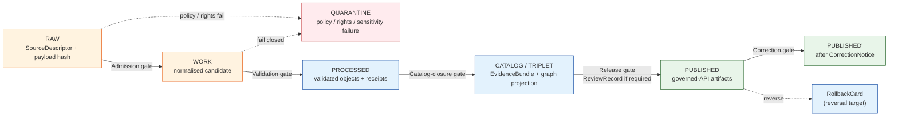
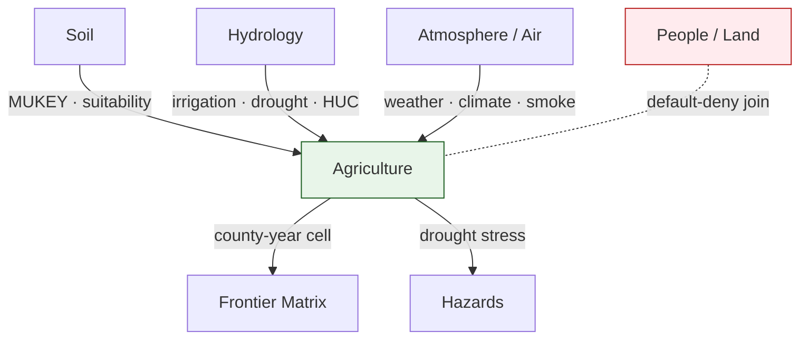

<!-- [KFM_META_BLOCK_V2]
doc_id: kfm://doc/agriculture-preservation-matrix
title: Agriculture Preservation Matrix
type: standard
version: v1
status: draft
owners: TODO — Agriculture domain steward + ENCY doctrine reviewer
created: 2026-05-15
updated: 2026-05-15
policy_label: public
related:
  - docs/domains/agriculture/README.md
  - docs/doctrine/lifecycle-law.md
  - docs/doctrine/truth-posture.md
  - docs/doctrine/directory-rules.md
  - docs/registers/VERIFICATION_BACKLOG.md
  - contracts/OBJECT_MAP.md
tags: [kfm, domain, agriculture, preservation, lifecycle, sensitivity, evidence]
notes:
  - PRESERVATION_MATRIX as a doctrinal artifact is PROPOSED; no indexed evidence confirms a prior file at this path.
  - All schema/policy/test paths cited are PROPOSED until verified against a mounted repo.
[/KFM_META_BLOCK_V2] -->

# Agriculture Preservation Matrix

> What the Agriculture domain must preserve, at which lifecycle stage, under which sensitivity tier, and with which receipts — so every public claim resolves to evidence and every release remains reversible.

-9e9e9e)

**Status:** draft &nbsp;·&nbsp; **Owners:** TODO — Agriculture domain steward + ENCY doctrine reviewer &nbsp;·&nbsp; **Last updated:** 2026-05-15

> [!NOTE]
> This document is a **preservation matrix**, not a release decision and not a runtime contract. It restates what existing KFM doctrine already requires of the Agriculture domain, cross-tabulated for review. Where doctrine is silent on a specific cell, the cell is labeled **PROPOSED** or **NEEDS VERIFICATION**.

---

## Contents

1. [Purpose & scope](#1-purpose--scope)
2. [Doctrinal basis](#2-doctrinal-basis)
3. [Agriculture object families — preservation profile](#3-agriculture-object-families--preservation-profile)
4. [Lifecycle preservation matrix](#4-lifecycle-preservation-matrix)
5. [Sensitivity tier matrix for Agriculture](#5-sensitivity-tier-matrix-for-agriculture)
6. [Required preservation artifacts](#6-required-preservation-artifacts)
7. [Cross-domain preservation edges](#7-cross-domain-preservation-edges)
8. [Retention, correction, and reversibility](#8-retention-correction-and-reversibility)
9. [Governance gates & failure posture](#9-governance-gates--failure-posture)
10. [Open verification items](#10-open-verification-items)
11. [Related docs](#11-related-docs)

---

## 1. Purpose & scope

**CONFIRMED doctrine.** The Agriculture domain represents crops, fields, soils, irrigation, yields, conservation practices, and agricultural economy in **public-safe aggregate** or **permissioned** form, and must not publish private farm operations, field-level sensitive detail, or source-rights-limited data without review.

**Purpose of this matrix.** Make the preservation obligations of that scope reviewable in one place — which Agriculture objects must be preserved, at what stage of the lifecycle, with what receipts, under what sensitivity tier, and with what reversibility — so any auditor, steward, or release authority can trace a public claim back to its evidentiary trail without reconstructing it from prose.

**Out of scope** (delegated elsewhere):

- Object **meaning** — owned by `contracts/domains/agriculture/` (PROPOSED).
- Object **machine shape** — owned by `schemas/contracts/v1/domains/agriculture/...` (PROPOSED, per ADR-0001).
- **Allow / deny / restrict / abstain** decisions — owned by `policy/domains/agriculture/` and `policy/sensitivity/agriculture/` (PROPOSED).
- **Release decisions** — owned by `release/candidates/agriculture/` (PROPOSED).
- **Enforcement proof** — owned by `tests/domains/agriculture/` and `fixtures/domains/agriculture/` (PROPOSED).

This matrix **explains**; it does not **decide**.

---

## 2. Doctrinal basis

| Source | Authority class | What it provides for this matrix |
|---|---|---|
| KFM Domain & Capability Encyclopedia §7.7 (Agriculture) | Primary (doctrine) | Mission, boundary, canonical object families, source families, knowledge-system objects. **CONFIRMED.** |
| Domains Culmination Atlas v1.1 §24.4 (sensitivity defaults) and §24.5 (tier scheme) | Primary (doctrine) | Per-object sensitivity defaults and the T0–T4 scheme. **CONFIRMED doctrine.** |
| Domains Culmination Atlas v1.1 §24.6 (lifecycle gates) | Primary (doctrine) | Universal gates RAW → PUBLISHED, required artifacts, failure-closed outcomes. **CONFIRMED doctrine.** |
| Directory Rules (`docs/doctrine/directory-rules.md`) | Primary (doctrine) | Domain placement law; `docs/domains/<domain>/` as the explanatory home for domain doctrine. **CONFIRMED.** |
| Whole-UI + Governed AI Expansion Report, Appendix A | Secondary (lineage) | PROPOSED file-tree shape for `docs/domains/`; treat as lineage, not as repo proof. **PROPOSED.** |

> [!IMPORTANT]
> **Cite-or-abstain.** No row in this matrix authorises a public release. A row binds only when the relevant `EvidenceBundle`, `ReleaseManifest`, `ReviewRecord` (where required), `AggregationReceipt` or `RedactionReceipt`, and `RollbackCard` are present and validated. Absent any required artifact, the gate **fails closed**.

[Back to top](#agriculture-preservation-matrix)

---

## 3. Agriculture object families — preservation profile

**CONFIRMED canonical object families** for Agriculture: `CropObservation`, `FieldCandidate`, `CropRotation`, `YieldObservation`, `IrrigationLink`, `ConservationPractice`, `SoilCropSuitability`, `AgriculturalEconomyObservation`, `SupplyChainNode`, `DroughtStressIndicator`, `PestStressIndicator`, `AggregationReceipt`.

The table below profiles each family's preservation duties. Identity, temporal handling, and the deterministic-identity basis follow the Atlas v1.1 form (source id + object role + temporal scope + normalized digest, PROPOSED). Sensitivity defaults are taken from Atlas v1.1 §24.4 where stated; cells marked PROPOSED extend the doctrine within its boundaries.

| Object family | Default sensitivity tier | Public release form | Aggregation / transform receipt | Preservation duty (CONFIRMED doctrine / PROPOSED realisation) |
|---|---|---|---|---|
| `CropObservation` | **T0** aggregate · **T1** field | County / HUC / grid aggregate; CDL-derived public layer | `AggregationReceipt` required for any spatial generalisation | Preserve raw `SourceDescriptor`, normalised observation, `EvidenceRef` → `EvidenceBundle`, validation report, release manifest |
| `FieldCandidate` | **T1** (default) · **T4** for private field detail | Generalised or denied; no field polygon publication absent review | `RedactionReceipt` for geometry generalisation; `ReviewRecord` if T2 reviewer path used | Preserve candidate provenance separately from confirmed objects (candidate-vs-confirmed discipline mirrors Archaeology pattern) |
| `CropRotation` | **T0** aggregate | County / HUC rotation summary | `AggregationReceipt` if rotation reconstructed across multiple sources | Preserve detection inputs and version of detection model, not only the result |
| `YieldObservation` | **T0** aggregate · **T1** field candidate | County / district yield panel | `AggregationReceipt` for any cell with low-count suppression | Preserve crop-year, growing-season, observed/source/retrieval/release time distinctly |
| `IrrigationLink` | **T1** (default, links to private detail) — PROPOSED | Generalised irrigation context; denied where it would expose operator | `RedactionReceipt`; `ReviewRecord` for any restricted-tier release | Preserve link rationale (which source supports the link) and the rights envelope on both endpoints |
| `ConservationPractice` | **T0** where NRCS source terms permit — PROPOSED; **T2** where private detail | Public conservation-practice layer "where permitted" (CONFIRMED) | `ReviewRecord` where source rights are uncertain | Preserve source terms and review state alongside the practice record |
| `SoilCropSuitability` | **T0** | Suitability map | Source-version traceable to SSURGO / SDA version | Preserve the soil source version and the suitability model version, jointly |
| `AgriculturalEconomyObservation` | **T0** aggregate; **T2/T4** for proprietary detail — PROPOSED | Aggregate economic series only | `AggregationReceipt`; rights validator | Preserve source-rights envelope; never invert aggregate to individual operator |
| `SupplyChainNode` | **T1** or stricter — PROPOSED | Generalised supply-chain context | `RedactionReceipt` if identity bearing | Preserve node identity rule and the bounded role (source, observation, model) |
| `DroughtStressIndicator` | **T0** | Public drought / stress indicator layer | None at default tier | Preserve indicator model version and the contributing hydrology / atmosphere refs |
| `PestStressIndicator` | **T0** aggregate — PROPOSED | Aggregate pest / stress indicator | `AggregationReceipt` for low-count cells | Preserve model version and confidence interval |
| `AggregationReceipt` (Agriculture-emitted) | **T0** (metadata) | Always preserved alongside the released aggregate | n/a (this is itself the receipt) | Receipt **never** detaches from its aggregate; rollback of the aggregate invalidates the receipt |

> [!CAUTION]
> Field-level Agriculture detail (`FieldCandidate`, `YieldObservation` at field granularity, `IrrigationLink` to private operators) **fails closed by default**. The public path is `apps/governed-api/` → released aggregates only. No browser, no public route, and no AI surface reads RAW / WORK / PROCESSED Agriculture stores directly.

[Back to top](#agriculture-preservation-matrix)

---

## 4. Lifecycle preservation matrix

**CONFIRMED doctrine.** Agriculture follows the universal lifecycle invariant: **RAW → WORK / QUARANTINE → PROCESSED → CATALOG / TRIPLET → PUBLISHED**, with promotion as a governed state transition and **default-deny** at the public surface.

*Diagram: PROPOSED visualisation of CONFIRMED doctrine. Stage labels and gate names follow Atlas v1.1 §24.6; arrow geometry is illustrative.*

The table below restates each gate's preservation obligation, specialised to Agriculture. The "Required artifacts" column lists the **minimum** set; per-source rules may demand more.

| Gate (transition) | Pre-condition | Required artifacts (Agriculture, PROPOSED minimum) | Failure posture |
|---|---|---|---|
| **Admission** ( — → RAW) | Source identity & rights established; source role set | `SourceDescriptor` (role: authority / observation / context / model; rights: NASS, NRCS, SSURGO terms; sensitivity default; cadence); payload or reference hash | Source not admitted; logged as steward candidate |
| **Normalisation** (RAW → WORK / QUARANTINE) | Schema, geometry, time, identity, evidence, rights, policy rules are runnable | `TransformReceipt`; working-set `ValidationReport`; `PolicyDecision`; QUARANTINE reason recorded on failure | Quarantine with reason; never silent promotion |
| **Validation** (WORK → PROCESSED) | Validators deterministic and fixture-bound | `ValidationReport` (PASS); `RedactionReceipt` where sensitivity transform applies; `AggregationReceipt` where geometry is generalised | Stay in WORK; structured FAIL outcome |
| **Catalog closure** (PROCESSED → CATALOG / TRIPLET) | `EvidenceRef` resolves; catalog matrix and digests close | `CatalogMatrix` entry; `EvidenceBundle`; graph / triplet projection if applicable | HOLD at PROCESSED; no public edge |
| **Release** (CATALOG → PUBLISHED) | Review state where required; release authority distinct from author when materiality applies | `ReleaseManifest`; `RollbackCard` target; correction path; `ReviewRecord` (when required) | HOLD at CATALOG; no public surface change |
| **Correction** (PUBLISHED → PUBLISHED′) | Detected error or new evidence; downstream derivatives identified | `CorrectionNotice`; updated `EvidenceBundle`; downstream invalidation list | Public surface shows stale-state badge until corrected manifest replaces prior |
| **Rollback** (PUBLISHED → withdrawn) | Material policy, rights, or evidence failure | `RollbackCard` activated; affected layers withdrawn; correction broadcast | Public surface defaults to prior verified state or empty layer |

> [!TIP]
> The first credible Agriculture thin slice in doctrine is a **county-level crop-year panel** using CDL / QuickStats + SSURGO suitability + Kansas Mesonet weather, **with field-level detail denied by default**. Every cell of that thin slice should produce, at minimum, the artifacts listed at each gate above.

[Back to top](#agriculture-preservation-matrix)

---

## 5. Sensitivity tier matrix for Agriculture

**CONFIRMED tier scheme** (Atlas v1.1 §24.5.1): T0 Open · T1 Generalized · T2 Reviewer · T3 Restricted · T4 Denied. A **tier upgrade** (toward more public) always requires both a transform receipt and a `ReviewRecord`. A **tier downgrade** (toward less public) requires only a `CorrectionNotice`.

| Agriculture class | Default tier | Allowed transforms (PROPOSED) | Required gates | Reversibility |
|---|---|---|---|---|
| `CropObservation` — aggregate | **T0** | None required at default tier | `ReleaseManifest` | Rollback via `RollbackCard` |
| `CropObservation` — field-resolution | **T1** | Generalisation to county / HUC / grid + `AggregationReceipt` | `AggregationReceipt` + `ReviewRecord` | Demotion to T4 via `CorrectionNotice` |
| `FieldCandidate` — private detail | **T4** | Generalised geometry + steward review → T2; further aggregation → T1 | `RedactionReceipt` + `ReviewRecord` + `PolicyDecision` | Always reversible to T4 |
| `YieldObservation` — county / district | **T0** | None at default | `ReleaseManifest` | Rollback supported |
| `YieldObservation` — field-resolution | **T1** | Generalisation + `AggregationReceipt` | `AggregationReceipt` + `ReviewRecord` | Demotion to T4 via correction |
| `IrrigationLink` — to private operator | **T2 / T4** — PROPOSED | Generalised endpoint + `RedactionReceipt` → T1 only after review | `RedactionReceipt` + `ReviewRecord` | Reversible |
| `ConservationPractice` — where source terms permit | **T0** — PROPOSED | None at default | `ReleaseManifest`; rights validator pass | Rollback if source terms change |
| `ConservationPractice` — operator-identifying | **T2 / T4** — PROPOSED | Generalisation + `ReviewRecord` → T1 | `RedactionReceipt` + `ReviewRecord` | Reversible |
| `AgriculturalEconomyObservation` — proprietary detail | **T2 / T4** — PROPOSED | Aggregation + `AggregationReceipt` → T0 series only | `AggregationReceipt` + rights validator | Reversible; aggregation never inverts |

> [!WARNING]
> **No transform** permits Agriculture to publish private farm operations, field-level sensitive detail, or source-rights-limited data without review (CONFIRMED). The matrix above describes what is **permitted within doctrine** when the listed receipts and reviews are present — not what is allowed by default.

[Back to top](#agriculture-preservation-matrix)

---

## 6. Required preservation artifacts

All artifacts below are **CONFIRMED doctrinal objects** in the Agriculture knowledge-system list. Their **field-level shape** belongs in `schemas/contracts/v1/...` (PROPOSED home, per ADR-0001) and is out of scope for this matrix.

| Artifact | Required for | What it preserves | Doctrinal authority |
|---|---|---|---|
| `SourceDescriptor` | Every admitted source | Source role (authority / observation / context / model), rights, sensitivity default, cadence, hash | Source steward + ENCY |
| `EvidenceRef` → `EvidenceBundle` | Every public claim | The closed evidentiary trail backing a published feature, layer, or AI answer | ENCY doctrine |
| `DatasetVersion` | Every dataset citation | Stable version identity for SSURGO, CDL, QuickStats, Mesonet, etc. | ENCY |
| `ValidationReport` | Promotion from WORK | Schema, geometry, time, identity, evidence, rights, policy validation results | ENCY + policy authority |
| `RunReceipt` | Every deterministic pipeline run | Inputs, parameters, code identity, output digests; reproducible re-run target | Pipelines + ENCY |
| `AggregationReceipt` (Agriculture-emitted) | Any release that aggregates field-level signal | Aggregation key, minimum cell count, suppression rule, source version | Agriculture domain |
| `RedactionReceipt` | Any geometry generalisation or content redaction | Profile id, parameters, seed, reversibility note | Policy / sensitivity authority |
| `DecisionEnvelope` | Every gate decision | Inputs, rule version, outcome (ALLOW / RESTRICT / DENY / ABSTAIN), reviewer | Governed-API + ENCY |
| `ReleaseManifest` | Every PUBLISHED artifact | What was released, under what evidence, by what authority, with what rollback target | Release authority |
| `LayerManifest` | Every map-bearing public layer | Layer identity, descriptor, source closure, content-tier note | MapLibre adapter + governed-API |
| `ReviewRecord` | Tier upgrades; sensitive promotions | Reviewer, decision, rationale, prior tier, new tier | Domain steward + release authority |
| `CorrectionNotice` | Any error or evidence change post-release | Cause, scope, downstream invalidation list | Correction reviewer |
| `RollbackCard` | Every released artifact | Reversal target, drill record, rollback test | Release authority |
| `AIReceipt` | Every Focus Mode Agriculture answer | Evidence refs, policy decision, citation validation, outcome (ANSWER / ABSTAIN / DENY / ERROR) | Governed AI |

> [!NOTE]
> Of these, only `AggregationReceipt` and (sometimes) `RedactionReceipt` originate **inside** the Agriculture domain. The rest are cross-cutting governance objects that Agriculture **consumes** and **must not redefine** parallel to canonical schemas.

[Back to top](#agriculture-preservation-matrix)

---

## 7. Cross-domain preservation edges

Agriculture's preservation duties extend to the joins it participates in. **CONFIRMED doctrine** specifies the four edges below; the constraint column is doctrinally identical for every cross-lane relation: ownership, source role, sensitivity, and `EvidenceBundle` support must be preserved through the join.

| Edge | Direction | What flows | Preservation duty for Agriculture |
|---|---|---|---|
| Agriculture ↔ Soil | Agriculture consumes | `MUKEY` joins; suitability support from `SoilMapUnit` / `SoilComponent` | Cite the soil source version inside the suitability product; never reproduce soil truth locally |
| Agriculture ↔ Hydrology | Agriculture consumes | Irrigation context; drought; water-use; HUC / Watershed / Reach | Cite hydrology owner; preserve the regulatory-vs-advisory distinction where it applies |
| Agriculture ↔ Atmosphere / Air | Agriculture consumes | `WeatherObservation`, climate normals, smoke / heat / vegetation-stress context | Cite atmosphere owner; preserve advisory-only posture; never act as alert authority |
| Agriculture ↔ People / Land | Restricted | Farm / operator and parcel-sensitive context | **Default-deny**: parcel-identifying joins are denied at the public surface; T2/T4 only via `ReviewRecord` |
| Agriculture → Frontier Matrix | Cited by | County-year `AgricultureObservation` cells | Frontier Matrix cites Agriculture aggregates; Agriculture preserves its own release manifest so the matrix cell can be traced back |
| Agriculture → Hazards | Cited by (drought) | `DroughtStressIndicator`; drought context | Hazards cites; Agriculture must remain non-authoritative for emergency alerts |

*Diagram: CONFIRMED edges from Atlas v1.1 §24.4 cross-lane tables. The dashed edge to People / Land marks a default-deny join, not an absent relation.*

[Back to top](#agriculture-preservation-matrix)

---

## 8. Retention, correction, and reversibility

**Three principles, all CONFIRMED doctrine:**

1. **Receipts never detach.** An `AggregationReceipt` or `RedactionReceipt` lives **with** the artifact it justifies. Removing the artifact invalidates the receipt; removing the receipt withdraws the artifact.
2. **Correction is always allowed.** Any tier may drop to **T4** via `CorrectionNotice` alone — review is not required to make something less public. Tier *upgrades* require both a transform receipt and a `ReviewRecord`.
3. **Rollback is a first-class outcome.** Every PUBLISHED Agriculture artifact must name its `RollbackCard` target. A release without a rollback target does not pass the release gate.

> [!IMPORTANT]
> **Vacuuming / purging Agriculture state is a governance decision, not a storage decision.** Any retention policy that would remove RAW or PROCESSED Agriculture state must be recorded as a vacuuming receipt and reviewed against the **lost-query-capability** test. The default is **preserve**.

**PROPOSED retention defaults for Agriculture** (subject to ADR review):

| State | Default retention | Why |
|---|---|---|
| RAW (admitted source payload or reference) | Indefinite | Without RAW, the evidentiary trail cannot be reproduced |
| WORK / QUARANTINE | Until promotion or expiry of a defined quarantine TTL | WORK is a candidate state; QUARANTINE retains failure context |
| PROCESSED | Indefinite while any release cites it | Catalogs and triplets resolve through PROCESSED |
| CATALOG / TRIPLET | Indefinite | Required for evidence closure |
| PUBLISHED | Indefinite, with stale-state badge on supersession | Public surfaces remain auditable across corrections |
| Receipts (`*Receipt`, `*Manifest`, `ReviewRecord`, `CorrectionNotice`, `RollbackCard`) | Indefinite | Governance trail is non-vacuumable absent ADR |

[Back to top](#agriculture-preservation-matrix)

---

## 9. Governance gates & failure posture

**Default posture:** every gate is **deny-by-default at the public surface**. The Agriculture domain does not expose RAW, WORK, PROCESSED, canonical stores, graph stores, vector indexes, or AI runtimes to public clients. The public path is **`apps/governed-api/` → released payloads only** (PROPOSED path; canonical path subject to repo verification).

| Gate | Failure-closed outcome | Public-surface consequence |
|---|---|---|
| Admission | Source rejected; steward candidate logged | No layer, no map, no AI mention |
| Normalisation | Quarantine with reason | No promotion; quarantine reason preserved |
| Validation | Stay in WORK; FAIL outcome | No public surface change |
| Catalog closure | HOLD at PROCESSED | No public edge |
| Release | HOLD at CATALOG | No layer change; no manifest update |
| Correction | Public surface shows stale-state badge until replaced | Layer continues to render with provenance updated |
| Rollback | Affected layers withdrawn; prior verified state restored | Public surface returns to prior verified or empty |

> [!CAUTION]
> **Watcher-as-non-publisher** invariant applies to Agriculture pipelines: watchers and connectors emit to `data/raw/` or `data/quarantine/` only. Promotion to `data/catalog/`, `data/published/`, or any layer surface is a **governed pipeline transition**, not a side effect.

[Back to top](#agriculture-preservation-matrix)

---

## 10. Open verification items

<strong>Items the matrix asserts as PROPOSED, pending evidence (click to expand)</strong>

| # | Item | Why it is PROPOSED | Evidence that would settle it |
|---|---|---|---|
| AG-PM-01 | `docs/domains/agriculture/PRESERVATION_MATRIX.md` is the canonical home for this artifact | No mounted repo in this session; no indexed prior file at this path | Mounted repo inspection; per-root README declaring `docs/domains/agriculture/` and listing accepted contents |
| AG-PM-02 | Sensitivity default of **T0 — PROPOSED** for `ConservationPractice` where NRCS terms permit | Atlas v1.1 §24.4 does not state a default for `ConservationPractice`; the encyclopedia notes "where permitted" | NRCS rights validator output; recorded source-rights envelope per NRCS dataset |
| AG-PM-03 | Sensitivity default of **T1 — PROPOSED** for `IrrigationLink` | Atlas v1.1 §24.4 lists Agriculture defaults at the `CropObservation` / `YieldObservation` level only | Domain ADR fixing per-object defaults for the remaining Agriculture object families |
| AG-PM-04 | Sensitivity default of **T2 / T4 — PROPOSED** for `AgriculturalEconomyObservation` proprietary detail | Doctrine names economy as in-scope but does not pin a tier for proprietary detail | Source-rights review for each economy source family; ADR if a generalised default is adopted |
| AG-PM-05 | `AggregationReceipt` is an Agriculture-emitted artifact in addition to a cross-cutting one | Encyclopedia §7.7 H lists `AggregationReceipt` in Agriculture's knowledge system; canonical home may be cross-cutting | ADR-S-03 (receipt-class home) outcome; schema home decision |
| AG-PM-06 | Public path is `apps/governed-api/` for Agriculture layers | Trust-membrane doctrine confirms governed-API access, but the specific Agriculture route shape is unverified | Mounted repo inspection of `apps/governed-api/src/routes/`; route map in `docs/architecture/governed-ai/ROUTE_MAP.md` |
| AG-PM-07 | Retention defaults in §8 are correct | These are PROPOSED extensions of "preserve by default" doctrine; no per-state retention spec is indexed | A `docs/runbooks/retention-agriculture.md` or ADR pinning per-state retention |
| AG-PM-08 | The PROPOSED file-path quartet (`schemas/contracts/v1/domains/agriculture/...`, `policy/domains/agriculture/...`, `tests/domains/agriculture/...`, `fixtures/domains/agriculture/...`) is canonical | Encyclopedia §7.7 J labels these PROPOSED; Directory Rules §4 step 3 confirms the **pattern** without confirming the **paths** | Mounted repo inspection; presence of per-root READMEs and validators at each path |

<strong>ADR-class questions adjacent to this matrix (Atlas v1.1 §24.12 backlog)</strong>

- **ADR-S-01** — Schema home: `schemas/contracts/v1/...` (confirm or amend ADR-0001).
- **ADR-S-03** — Receipt class home: `schemas/contracts/v1/receipts/` vs. `schemas/contracts/v1/<domain>/receipts/`.
- **ADR-S-04** — Source-role enum: canonical vocabulary and evolution rule (affects every Agriculture `SourceDescriptor`).
- **ADR-S-05** — Sensitivity tier scheme T0–T4: adopt as canonical or revise (the matrix above assumes adoption).

[Back to top](#agriculture-preservation-matrix)

---

## 11. Related docs

- [`docs/domains/agriculture/README.md`](./README.md) &nbsp;·&nbsp; *PROPOSED* &nbsp;·&nbsp; domain landing page (TODO if not present)
- [`docs/doctrine/lifecycle-law.md`](../../doctrine/lifecycle-law.md) &nbsp;·&nbsp; *PROPOSED path* &nbsp;·&nbsp; RAW → PUBLISHED invariant
- [`docs/doctrine/truth-posture.md`](../../doctrine/truth-posture.md) &nbsp;·&nbsp; *PROPOSED path* &nbsp;·&nbsp; cite-or-abstain
- [`docs/doctrine/trust-membrane.md`](../../doctrine/trust-membrane.md) &nbsp;·&nbsp; *PROPOSED path* &nbsp;·&nbsp; governed-API as the public path
- [`docs/doctrine/directory-rules.md`](../../doctrine/directory-rules.md) &nbsp;·&nbsp; *PROPOSED path* &nbsp;·&nbsp; placement law for this file
- [`docs/registers/VERIFICATION_BACKLOG.md`](../../registers/VERIFICATION_BACKLOG.md) &nbsp;·&nbsp; *PROPOSED path* &nbsp;·&nbsp; AG-PM-01 … AG-PM-08
- [`contracts/OBJECT_MAP.md`](../../../contracts/OBJECT_MAP.md) &nbsp;·&nbsp; *PROPOSED path* &nbsp;·&nbsp; cross-cutting object meanings
- [`docs/standards/PROV.md`](../../standards/PROV.md) &nbsp;·&nbsp; *PROPOSED path* &nbsp;·&nbsp; provenance crosswalk
- [`docs/standards/ISO-19115.md`](../../standards/ISO-19115.md) &nbsp;·&nbsp; *PROPOSED path* &nbsp;·&nbsp; geospatial metadata crosswalk
- *Atlas v1.1 Chapter 24* — master sensitivity, lifecycle gate, and ADR-backlog references

---

**Last updated:** 2026-05-15 &nbsp;·&nbsp; **Version:** v1 (draft) &nbsp;·&nbsp; **Authority class:** domain-scoped doctrine, subordinate to `docs/doctrine/` and Atlas v1.1 &nbsp;·&nbsp; [↑ Back to top](#agriculture-preservation-matrix)
