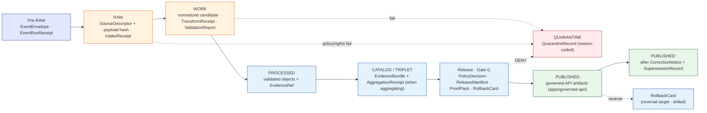
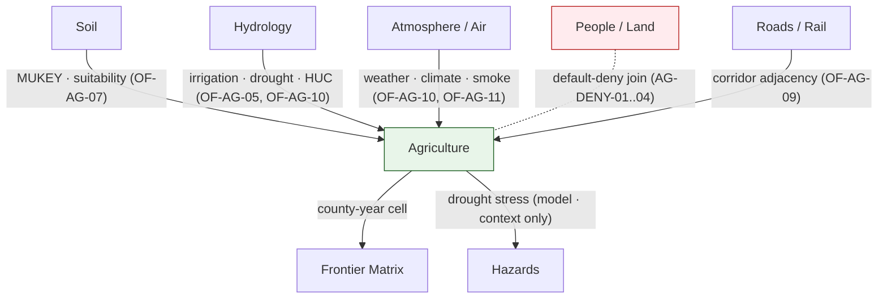

<!-- [KFM_META_BLOCK_V2]
doc_id: kfm://doc/agriculture-preservation-matrix
title: Agriculture — Preservation Matrix
type: standard
version: v2
status: draft
owners: agriculture-stewards · sensitivity-steward · ENCY-doctrine-reviewer (TODO confirm CODEOWNERS)
created: 2026-05-15
updated: 2026-05-26
policy_label: public
related:
  - ai-build-operating-contract.md
  - directory-rules.md
  - docs/domains/agriculture/README.md
  - docs/domains/agriculture/DOMAIN.md
  - docs/domains/agriculture/OBJECTS.md
  - docs/domains/agriculture/OBJECT_FAMILIES.md
  - docs/domains/agriculture/PIPELINE.md
  - docs/domains/agriculture/POLICY.md
  - docs/domains/agriculture/SENSITIVITY.md
  - docs/domains/agriculture/CROSS_LANE.md
  - docs/domains/agriculture/MISSING_OR_PLANNED_FILES.md
  - docs/registers/VERIFICATION_BACKLOG.md
  - docs/registers/DRIFT_REGISTER.md
  - docs/registers/OBJECT_FAMILY_MAP.md
  - contracts/domains/agriculture/
  - schemas/contracts/v1/domains/agriculture/
  - policy/domains/agriculture/
  - tests/domains/agriculture/
  - fixtures/domains/agriculture/
  - release/candidates/agriculture/
  - data/registry/sources/agriculture/
tags: [kfm, domain, agriculture, preservation, lifecycle, sensitivity, evidence, register]
notes:
  - Pinned to CONTRACT_VERSION = "3.0.0".
  - Conformance language follows RFC 2119 / RFC 8174 per directory-rules.md §2.2.
  - Repository is not mounted in this session; all path-shaped claims are PROPOSED.
  - This file restates what existing KFM doctrine already requires of the Agriculture domain, cross-tabulated for review.
  - Sensitive-domain routing deferred to ai-build-operating-contract.md §23.2.
  - This file is a reference and review aid; it is NOT a release decision, NOT a policy bundle, and NOT a runtime contract.
  - Uses OF-AG-NN ID namespace from OBJECT_FAMILIES.md and AG-DENY-NN scopes from POLICY.md.
[/KFM_META_BLOCK_V2] -->

# 🌾 Agriculture — Preservation Matrix

> **Purpose.** What the Agriculture domain MUST preserve, at which lifecycle stage, under which sensitivity tier, with which receipts, and against which rollback target — so every public claim resolves to evidence and every release remains reversible. This is a **review matrix**: it restates existing doctrine cross-tabulated against the twelve `OF-AG-NN` object families and the seven lifecycle stages, so a reviewer can trace any public Agriculture claim back to its evidentiary trail without reconstructing it from prose.

  
  
  
  
  
  
  
  
  
  
  

**Status** · `draft` &nbsp;·&nbsp; **Owners** · `agriculture-stewards · sensitivity-steward · ENCY-doctrine-reviewer` *(TODO confirm CODEOWNERS)* &nbsp;·&nbsp; **Updated** · `2026-05-26` &nbsp;·&nbsp; **Contract** · `CONTRACT_VERSION = "3.0.0"`

> [!CAUTION]
> **Sensitive-domain routing.** Agriculture preservation duties span operator-resolvable, private-parcel-adjacent, NASS-confidential, and quarantine-adjacent material. Disposition for any public release MUST be routed through `ai-build-operating-contract.md` §23.2 (Sensitive-Domain Decision Matrix). The most restrictive applicable row applies. **Default posture: DENY public exact exposure → GENERALIZE → REQUIRE steward review → REQUIRE `AggregationReceipt` or `RedactionReceipt`.** Disposition is **not** re-derived here; preservation duties for it are.

> [!IMPORTANT]
> **This document explains; it does not decide.** No row binds a public release on its own. A row binds only when the relevant `EvidenceBundle`, `ReleaseManifest`, `ReviewRecord` (where required), `AggregationReceipt` or `RedactionReceipt`, and `RollbackCard` are present and validated. Absent any required artifact, the gate **fails closed**. Per OPCON §11, repo-state is `NEEDS VERIFICATION`; every path below is PROPOSED.

---

## 📑 Contents

1. [Scope & posture](#1-scope--posture)
2. [Evidence basis](#2-evidence-basis)
3. [How this matrix relates to companion docs](#3-how-this-matrix-relates-to-companion-docs)
4. [Lifecycle preservation spine](#4-lifecycle-preservation-spine)
5. [Per-`OF-AG-NN` preservation profile](#5-per-of-ag-nn-preservation-profile)
6. [Gate-by-gate preservation obligations](#6-gate-by-gate-preservation-obligations)
7. [Sensitivity tier matrix for Agriculture](#7-sensitivity-tier-matrix-for-agriculture)
8. [Required preservation artifacts](#8-required-preservation-artifacts)
9. [Cross-lane preservation edges](#9-cross-lane-preservation-edges)
10. [Retention, correction, and reversibility](#10-retention-correction-and-reversibility)
11. [Governance gates & failure posture](#11-governance-gates--failure-posture)
12. [Anti-patterns this matrix rejects](#12-anti-patterns-this-matrix-rejects)
13. [Open questions register](#13-open-questions-register)
14. [Verification backlog](#14-verification-backlog)
15. [Changelog](#15-changelog)
16. [Definition of done](#16-definition-of-done)
17. [Related docs](#17-related-docs)

---

## 1. Scope & posture

This matrix is a **per-domain review aid** that cross-tabulates Agriculture's doctrine into a single browsable surface: which objects to preserve, at which stage, with which receipts, under which tier, and with which rollback target. It is the **single page** a reviewer scans before signing off Gate G, or that an auditor opens when tracing a public Agriculture claim back to evidence.

### 1.1 What this file is

- A **cross-tabulation** of CONFIRMED Agriculture doctrine across object families × lifecycle stages × sensitivity tiers.
- A **traceability surface** so any released Agriculture claim can be walked back to its `EvidenceBundle`, `ReleaseManifest`, and `RollbackCard`.
- A **retention contract** (PROPOSED) for per-state defaults.
- A **review companion** to `POLICY.md` (the deny-by-default register) and `PIPELINE.md` (the lifecycle runbook).

### 1.2 What this file is **not**

- ❌ A release decision — `release/candidates/agriculture/<slice>/release_manifest.json` decides.
- ❌ A runtime contract — `policy/domains/agriculture/runtime.<ext>` enforces at API time.
- ❌ Executable policy — the bundle lives at `policy/domains/agriculture/`.
- ❌ A schema definition — JSON Schemas live at `schemas/contracts/v1/domains/agriculture/`.
- ❌ A semantic contract — Markdown contracts live at `contracts/domains/agriculture/`.
- ❌ An ADR — open architectural questions are surfaced in §13 and routed to `docs/adr/`.
- ❌ A repo status report — no row claims any file exists today.

### 1.3 Truth labels used

This file uses the authoring labels from `ai-build-operating-contract.md` §8: **CONFIRMED**, **INFERRED**, **PROPOSED**, **UNKNOWN**, **NEEDS VERIFICATION**, **CONFLICTED**, **LINEAGE**, **EXPLORATORY**, **EXTERNAL**. Runtime outcomes (`ANSWER` / `ABSTAIN` / `DENY` / `ERROR` / `NARROWED` / `BOUNDED` / `SOURCE_STALE`) are used where they describe actual policy decisions, not as rhetorical hedging. Memory is not evidence.

[⤴ Back to top](#-contents)

---

## 2. Evidence basis

| Source ID | Document | Role here | Citation |
|---|---|---|---|
| `OPCON` | `ai-build-operating-contract.md` (v3.0; `CONTRACT_VERSION = "3.0.0"`) | Operating contract; §8 truth labels; §11 repo preflight; §23.2 sensitive-domain matrix; §34 receipt discipline; §37 lifecycle | CONFIRMED doctrine |
| `DIRRULES` | `directory-rules.md` (v1.3) | §6.5 `policy/` canonical singular; §12 Domain Placement Law; §13.5 anti-patterns; §15 per-folder README | CONFIRMED doctrine |
| `BUILD-MANUAL` | `KFM_Unified_Implementation_Architecture_Build_Manual.md` | §6.1 lifecycle phases; §6.2 Promotion Gates A–G with required proof; §7.1 object map including all receipt families | CONFIRMED doctrine |
| `ATLAS-v1.1` | `Kansas Frontier Matrix - Domains v1.1 + Pass 23/32 Consolidated Atlas` | §9 A–N Agriculture dossier; §24.5.1 tier scheme (T0–T4); §24.5.2 per-domain matrix; §24.6 lifecycle gates; §24.12 ADR backlog | CONFIRMED doctrine |
| `ENCY` | `KFM_Encyclopedia.md` / `kfm_unified_doctrine_synthesis.md` | §7.7 Agriculture entry; §15 tier scheme; §16 per-domain sensitivity matrix; §17 cross-lane anti-collapse | CONFIRMED doctrine |
| `OBJECTS-MD` | [`docs/domains/agriculture/OBJECTS.md`](OBJECTS.md) | Per-family narrative and identity rule | CONFIRMED (this session) |
| `OBJ-FAM-MD` | [`docs/domains/agriculture/OBJECT_FAMILIES.md`](OBJECT_FAMILIES.md) | `OF-AG-NN` ID register; source-role matrix | CONFIRMED (this session) |
| `PIPELINE-MD` | [`docs/domains/agriculture/PIPELINE.md`](PIPELINE.md) | Lifecycle stage runbook; gate binding; receipt emission contract | CONFIRMED (this session) |
| `POLICY-MD` | [`docs/domains/agriculture/POLICY.md`](POLICY.md) | Policy taxonomy; AG-DENY-NN register; `PolicyDecision` contract | CONFIRMED (this session) |
| `MOPF-MD` | [`docs/domains/agriculture/MISSING_OR_PLANNED_FILES.md`](MISSING_OR_PLANNED_FILES.md) | Planning inventory; PROPOSED file locations | CONFIRMED (this session) |

> [!NOTE]
> No external (web) research was performed for this file. All claims are KFM-internal doctrine. Per `ai-build-operating-contract.md` §5 and the v3.0 prompt's `<external_research>` rule, external sources MUST NOT be used to make KFM repo-state or doctrine claims.

[⤴ Back to top](#-contents)

---

## 3. How this matrix relates to companion docs

This is the v3.0 companion-set view. **Authority does not duplicate**; each doc owns its surface.

| Surface | Authority | Form |
|---|---|---|
| **Preservation duties** (what to keep, at which stage, with what receipts) | **`PRESERVATION_MATRIX.md`** (this file) | Cross-tabulated matrix + retention contract |
| Object meaning + key fields | [`OBJECTS.md`](OBJECTS.md) | Narrative reference |
| Object IDs + placement paths | [`OBJECT_FAMILIES.md`](OBJECT_FAMILIES.md) | ID register |
| Stage-by-stage runbook + Promotion Gates A–G | [`PIPELINE.md`](PIPELINE.md) | Lifecycle runbook |
| Admissibility rules + deny-by-default scopes | [`POLICY.md`](POLICY.md) | Policy reference |
| Tier mechanics (T0–T4 definitions) | `SENSITIVITY.md` *(TODO)* + ENCY §15 | Tier scheme |
| Cross-lane relations | `CROSS_LANE.md` *(TODO)* + Atlas §9 F | Cross-lane reference |
| Planned files inventory | [`MISSING_OR_PLANNED_FILES.md`](MISSING_OR_PLANNED_FILES.md) | Planning |

> [!NOTE]
> The preservation matrix **cites** the rules; it does not **redefine** them. Where this file appears to disagree with `POLICY.md` (deny scope), `PIPELINE.md` (gate binding), `OBJECT_FAMILIES.md` (placement path), or `OBJECTS.md` (object meaning), those win — and the disagreement is logged in `docs/registers/DRIFT_REGISTER.md`.

[⤴ Back to top](#-contents)

---

## 4. Lifecycle preservation spine

**CONFIRMED doctrine.** Agriculture follows the universal KFM lifecycle: **Pre-RAW → RAW → WORK / QUARANTINE → PROCESSED → CATALOG / TRIPLET → PUBLISHED**, with promotion as a governed state transition and default-deny at the public surface.

*Diagram: CONFIRMED doctrine. Stage labels and gate names follow BUILD-MANUAL §6.1 / §6.2 and Atlas v1.1 §24.6; arrow geometry is illustrative.*

> [!IMPORTANT]
> **Movement without a receipt is a defect.** Per BUILD-MANUAL §6.1, every lifecycle transition emits at least one receipt. The receipt table per stage is in [`PIPELINE.md` §6](PIPELINE.md#6-receipts-emitted-per-stage); the preservation duty for each receipt is in §8 of this file.

[⤴ Back to top](#-contents)

---

## 5. Per-`OF-AG-NN` preservation profile

For each of the twelve Agriculture object families (from [`OBJECT_FAMILIES.md`](OBJECT_FAMILIES.md) §4), this table records: default tier, public release form, aggregation/transform receipt requirement, and preservation duty. Default tiers consolidated from `OBJECTS.md` §6, `OBJECT_FAMILIES.md` §4, ENCY §16, and Atlas v1.1 §24.5.2.

| ID | Family | Default tier | Public release form | Aggregation / transform receipt | Preservation duty (CONFIRMED doctrine · PROPOSED realization) |
|---|---|---|---|---|---|
| `OF-AG-01` | `CropObservation` | T0 aggregate · T1 field | County / HUC / grid aggregate; CDL-derived public layer | `AggregationReceipt` for any spatial generalization | Preserve `SourceDescriptor`, normalized observation, `EvidenceRef → EvidenceBundle`, `ValidationReport`, `ReleaseManifest`, `RollbackCard` |
| `OF-AG-02` | `FieldCandidate` | T1 default · **T3+ if operator-resolvable** | Generalized geometry; **operator-resolvable: DENY** | `RedactionReceipt` for geometry generalization; `ReviewRecord` for any T2 path | Preserve candidate provenance separately from confirmed objects (candidate-vs-confirmed discipline); preserve `source_role = model` carry-through |
| `OF-AG-03` | `CropRotation` | T0 aggregate · T1 field | County / HUC rotation summary | `AggregationReceipt` when reconstructed across multiple sources | Preserve detection inputs, detection-model version, multi-year `EvidenceRef` chain |
| `OF-AG-04` | `YieldObservation` | T0 county · T1 field · **T3+ DENY if operator-resolvable** | County / district yield panel; **operator-resolvable: DENY** | `AggregationReceipt` for any cell with low-count suppression | Preserve crop-year, growing-season, observed/source/retrieval/release/correction times distinctly; **AG-DENY-01** binds at public release |
| `OF-AG-05` | `IrrigationLink` | T1 · **T2 if well-owner joinable** | Generalized irrigation context; well-owner identity DENY | `RedactionReceipt`; `ReviewRecord` for any restricted-tier release | Preserve link rationale (which source supports the link) and rights envelope on both endpoints |
| `OF-AG-06` | `ConservationPractice` | T1 · **T2 if operator-resolvable** | Public conservation-practice layer where source terms permit | `ReviewRecord` where source rights are uncertain | Preserve source terms and review state alongside the practice record |
| `OF-AG-07` | `SoilCropSuitability` | T0 | Suitability map | `model_version` MUST close; no aggregation by default | Preserve soil source version (Soil cite via `EvidenceRef`) **and** suitability `model_version`, jointly; never republish soil truth |
| `OF-AG-08` | `AgriculturalEconomyObservation` | T0 county · **DENY operator-detail** | Aggregate economic series only | `AggregationReceipt`; rights validator | Preserve source-rights envelope; **AG-DENY-03** binds; aggregate MUST NOT invert to individual operator |
| `OF-AG-09` | `SupplyChainNode` | T0 agg · T1+ facility | Generalized supply-chain context | `RedactionReceipt` if identity-bearing | Preserve node identity rule and the bounded role (source, observation, model) |
| `OF-AG-10` | `DroughtStressIndicator` | T0 aggregate · T1 field | Public drought / stress indicator layer | Aggregate variants: `AggregationReceipt` | Preserve indicator `model_version` and contributing Hydrology / Atmosphere `EvidenceRef`s; **AG-DENY-06** binds (no alert authority) |
| `OF-AG-11` | `PestStressIndicator` | T0 aggregate · T1 field · **T2+ if quarantine-adjacent** | Aggregate pest / stress indicator | `AggregationReceipt` for low-count cells | Preserve `model_version`, confidence interval, regulatory disclosure terms (**AG-DENY-05** binds for quarantine-adjacent) |
| `OF-AG-12` | `AggregationReceipt` | T0 metadata · payload-bound | Always preserved alongside the released aggregate | Self — the receipt **is** the proof | Receipt **never** detaches from its aggregate; rollback of aggregate invalidates the receipt; receipt MUST cite `threshold_profile_ref` |

> [!CAUTION]
> Field-level Agriculture detail (`OF-AG-02`, `OF-AG-04` at field granularity, `OF-AG-05` to private operators, `OF-AG-08` at operator detail) **fails closed by default**. The public path is `apps/governed-api/` → released aggregates only. No browser, no public route, and no AI surface reads `data/raw/agriculture/`, `data/work/agriculture/`, or `data/processed/agriculture/` directly. Per `POLICY.md` §10 AG-DENY-13 and `PIPELINE.md` §11.

[⤴ Back to top](#-contents)

---

## 6. Gate-by-gate preservation obligations

Each Agriculture promotion gate (per BUILD-MANUAL §6.2 and [`PIPELINE.md` §4](PIPELINE.md#4-promotion-gates-ag)) carries a minimum preservation obligation. The "Required artifacts" column lists the **minimum** set; per-source rules may demand more.

| Gate | Stage | Pre-condition | Required artifacts (Agriculture, PROPOSED minimum) | Failure posture |
|---|---|---|---|---|
| **A** Source identity | Pre-RAW · `PIPELINE.md` §5.1 | `SourceDescriptor` exists; source role set; authority class known | `SourceDescriptor` (role: `authority`/`observation`/`context`/`model`/`aggregate`; rights envelope; sensitivity default; cadence); `EventEnvelope`; `EventRunReceipt` | Source not admitted; logged as steward candidate; `ABSTAIN` |
| **B** Rights & terms | Pre-RAW · `PIPELINE.md` §5.1 | License/terms/contact/attribution closed | `RightsReviewRecord`; per-source descriptor with verified rights field | `ABSTAIN` until rights resolved; `DENY` for incompatible terms |
| **C** Sensitivity | WORK → PROCESSED · `PIPELINE.md` §5.3 / §5.5 | Operator/parcel/quarantine-adjacent risks resolved | `PolicyDecision` (sensitivity outcome) + `TransformReceipt`; `RedactionReceipt` when generalizing; `QuarantineRecord` on `DENY` | QUARANTINE with reason; **highest-frequency Agriculture failure** |
| **D** Schema / contract | WORK · `PIPELINE.md` §5.3 | Schema validation passes; `source_role` enum carried | `SchemaValidationReport`; `TransformReceipt` | Stay in WORK; structured `ERROR` outcome |
| **E** Evidence closure | CATALOG · `PIPELINE.md` §5.6 | `EvidenceRef → EvidenceBundle` resolves; cross-lane cites close | `EvidenceBundle`; `CitationValidationReport`; `AggregationReceipt` when aggregating | HOLD at PROCESSED; no public edge |
| **F** Catalog / provenance | CATALOG · `PIPELINE.md` §5.6 | STAC/DCAT/PROV/CatalogMatrix closed; `model_version` carried for derived families | `CatalogMatrixReport`; graph / triplet projection if applicable | HOLD at CATALOG |
| **G** Review / release / rollback | Release · `PIPELINE.md` §5.6 → §5.7 | Review state where required; release authority distinct from author when materiality applies | `PromotionReceipt` + `ReleaseManifest` + `ProofPack` + `RollbackCard`; `ReviewRecord` when required; correction path declared | HOLD at CATALOG; no public surface change; `DENY` |
| **Correction** | PUBLISHED → PUBLISHED′ · `PIPELINE.md` §10 | Detected error or new evidence; downstream derivatives identified | `CorrectionNotice`; `SupersessionRecord`; updated `EvidenceBundle`; downstream invalidation list | Public surface shows stale-state badge until corrected manifest replaces prior |
| **Rollback** | PUBLISHED → withdrawn · `PIPELINE.md` §10 | Material policy, rights, or evidence failure | `RollbackCard` activated; affected layers withdrawn; correction broadcast | Public surface defaults to prior verified state or empty layer |

> [!TIP]
> The first credible Agriculture thin slice in doctrine is a **county-level crop-year panel** using NASS CDL / QuickStats + SSURGO suitability + Kansas Mesonet weather, **with field-level detail denied by default** (per `MISSING_OR_PLANNED_FILES.md` §5 and `PIPELINE.md` §8). Every cell of that thin slice MUST produce, at minimum, the artifacts listed at each gate above.

[⤴ Back to top](#-contents)

---

## 7. Sensitivity tier matrix for Agriculture

**CONFIRMED tier scheme** (ENCY §15 / Atlas v1.1 §24.5.1): **T0 Open · T1 Generalized · T2 Reviewer · T3 Restricted · T4 Denied**. The reversibility rules below are CONFIRMED doctrine; per-Agriculture-class realizations are PROPOSED.

**Tier transitions are governed:**

- A **tier upgrade** (toward more public, T2 → T1, T1 → T0) requires **both** a transform receipt (`AggregationReceipt` or `RedactionReceipt`) **and** a `ReviewRecord`.
- A **tier downgrade** (toward less public, T0 → T4) requires only a `CorrectionNotice` — making something less public is always allowed.
- Moving T4 → T1 specifically requires `RedactionReceipt` + `ReviewRecord` + `PolicyDecision`, plus standard Promotion Gates A–G (per ENCY §15).

| Agriculture class | Default tier | Allowed transforms (PROPOSED) | Required gates | Reversibility |
|---|---|---|---|---|
| `OF-AG-01 · CropObservation` (aggregate) | **T0** | None required at default tier | `ReleaseManifest` | Rollback via `RollbackCard` |
| `OF-AG-01 · CropObservation` (field-resolution) | **T1** | Generalization to county / HUC / grid + `AggregationReceipt` | `AggregationReceipt` + `ReviewRecord` | Demotion to T4 via `CorrectionNotice` |
| `OF-AG-02 · FieldCandidate` (operator-resolvable) | **T3+** | Generalized geometry + steward review → T2; further aggregation → T1 | `RedactionReceipt` + `ReviewRecord` + `PolicyDecision` | Always reversible to T4 |
| `OF-AG-04 · YieldObservation` (county/district) | **T0** | None at default | `ReleaseManifest` | Rollback supported |
| `OF-AG-04 · YieldObservation` (field-resolution) | **T1** | Generalization + `AggregationReceipt` | `AggregationReceipt` + `ReviewRecord` | Demotion to T4 via correction |
| `OF-AG-04 · YieldObservation` (operator-resolvable) | **T3+ DENY** | None — no transform releases this to public | n/a | Always reversible (already at deny) |
| `OF-AG-05 · IrrigationLink` (default) | **T1** | Generalized endpoint + `RedactionReceipt` | `RedactionReceipt` (when generalizing) | Reversible |
| `OF-AG-05 · IrrigationLink` (well-owner joinable) | **T2** | `ReviewRecord` required for any release | `ReviewRecord` + `PolicyDecision` | Reversible |
| `OF-AG-06 · ConservationPractice` (where source terms permit) | **T1** | None at default | `ReleaseManifest`; rights validator pass | Rollback if source terms change |
| `OF-AG-06 · ConservationPractice` (operator-resolvable) | **T2** | Generalization + `ReviewRecord` → T1 | `RedactionReceipt` + `ReviewRecord` | Reversible |
| `OF-AG-07 · SoilCropSuitability` | **T0** | None at default | `ReleaseManifest`; `model_version` MUST close | Rollback via `RollbackCard` |
| `OF-AG-08 · AgriculturalEconomyObservation` (county) | **T0** | None at default | `ReleaseManifest`; rights validator | Rollback supported |
| `OF-AG-08 · AgriculturalEconomyObservation` (operator-detail) | **DENY** | None — no transform releases to public | n/a | n/a |
| `OF-AG-09 · SupplyChainNode` (aggregate) | **T0** | None at default | `ReleaseManifest` | Rollback supported |
| `OF-AG-09 · SupplyChainNode` (facility-specific) | **T1+** | `RedactionReceipt` for identity-bearing detail | `RedactionReceipt` | Reversible |
| `OF-AG-10 · DroughtStressIndicator` | **T0 agg · T1 field** | Aggregation + `AggregationReceipt` | `AggregationReceipt` + `model_version` close | Rollback supported |
| `OF-AG-11 · PestStressIndicator` (default) | **T0 agg · T1 field** | Aggregation + `AggregationReceipt` | `AggregationReceipt` | Rollback supported |
| `OF-AG-11 · PestStressIndicator` (quarantine-adjacent) | **T2+** | `ReviewRecord` + `PolicyDecision` required | `ReviewRecord` + regulatory clearance | Reversible |
| `OF-AG-12 · AggregationReceipt` | **T0 metadata** | n/a (receipt; payload-bound by source tier) | Always preserved with aggregate | Withdrawn with aggregate |

> [!WARNING]
> **No transform** permits Agriculture to publish private farm operations, field-level sensitive detail, or source-rights-limited data without review (CONFIRMED). This matrix describes what is **permitted within doctrine** when the listed receipts and reviews are present — not what is allowed by default. Per `POLICY.md` §10 AG-DENY-01..08.

[⤴ Back to top](#-contents)

---

## 8. Required preservation artifacts

All artifacts below are **CONFIRMED doctrinal objects** per BUILD-MANUAL §7.1 and Atlas v1.1 §9 J. Their **field-level shape** belongs in `schemas/contracts/v1/...` (PROPOSED home per ADR-0001) and is out of scope for this matrix.

| Artifact | Required for | What it preserves | Authority |
|---|---|---|---|
| `SourceDescriptor` | Every admitted source | Source role, rights, sensitivity default, cadence, hash | Source steward + ENCY |
| `EventEnvelope` | Every Pre-RAW source-change event | Source identity hint, actor/tool, timestamp, policy pre-check | BUILD-MANUAL §7.1 |
| `EventRunReceipt` | Every Pre-RAW admission | Signed proof a source-change event was admitted | BUILD-MANUAL §7.1 |
| `IntakeReceipt` | Every RAW capture | Retrieval time, URL/source, checksum, headers, license snapshot | BUILD-MANUAL §7.1 |
| `TransformReceipt` | Every WORK transform | Inputs, parameters, tool versions, output digests | BUILD-MANUAL §7.1 |
| `ValidationReport` | Promotion from WORK | Schema, geometry, time, identity, evidence, rights, policy validation results | BUILD-MANUAL §7.1 |
| `QuarantineRecord` | Every QUARANTINE entry | Reason code, remediation owner, obligations, source refs | DIRRULES §13.5 / BUILD-MANUAL §6.1 |
| `EvidenceRef` → `EvidenceBundle` | Every public claim | Closed evidentiary trail backing a published feature, layer, or AI answer | ENCY doctrine |
| `DatasetVersion` | Every dataset citation | Stable version identity for SSURGO, CDL, QuickStats, Mesonet, etc. | ENCY |
| `RunReceipt` | Every deterministic pipeline run | Inputs, parameters, code identity, output digests; reproducible re-run target | Pipelines + ENCY |
| `AggregationReceipt` (Agriculture-emitted at `OF-AG-12`) | Any release that aggregates field-level signal | Aggregation method, threshold profile ref, inputs digest, minimum cell count, suppression rule | Agriculture domain |
| `RedactionReceipt` | Any geometry generalization or content redaction | Profile id, parameters, seed, reversibility note | Policy / sensitivity authority |
| `PolicyDecision` | Every gate decision that fires policy | Rule ref, inputs digest, outcome, reason code, policy version | `POLICY.md` §11; BUILD-MANUAL §7.1 |
| `CatalogMatrixReport` | Every CATALOG closure | STAC/DCAT/PROV closure, digest, source refs, release refs | BUILD-MANUAL §6.2 Gate F |
| `PromotionReceipt` | Every Gate-G admission | Promotion decision binding `ReleaseManifest` + `ProofPack` + `RollbackCard` | BUILD-MANUAL §6.2 Gate G |
| `ReleaseManifest` | Every PUBLISHED artifact | What was released, under what evidence, by what authority, with what rollback target | Release authority |
| `ProofPack` | Every released slice | Attestation bundle / verification dossier required at Gate G | BUILD-MANUAL §6.2 Gate G |
| `LayerManifest` | Every map-bearing public layer | Layer identity, descriptor, source closure, content-tier note | MapLibre adapter + governed-API |
| `ReviewRecord` | Tier upgrades; sensitive promotions | Reviewer, decision, rationale, prior tier, new tier | Domain steward + release authority |
| `CorrectionNotice` | Any error or evidence change post-release | Cause, scope, downstream invalidation list | Correction reviewer |
| `SupersessionRecord` | Any superseded release | Prior release id, replacement release id, supersession reason | `PIPELINE.md` §10 |
| `RollbackCard` | Every released artifact | Reversal target, drill record, rollback test | Release authority |
| `AIReceipt` | Every Focus Mode Agriculture answer | Evidence refs, policy decision, citation validation, finite outcome | Governed AI |

> [!NOTE]
> Of these, only `AggregationReceipt` originates **inside** the Agriculture domain at `OF-AG-12`. `RedactionReceipt` is emitted by Agriculture pipelines when generalizing but is owned cross-cutting. The rest are cross-cutting governance objects that Agriculture **consumes** and **MUST NOT** redefine in parallel to canonical schemas. *(Per `OBJECT_FAMILIES.md` §5.12 and `OBJECTS.md` §6.12.)*

[⤴ Back to top](#-contents)

---

## 9. Cross-lane preservation edges

Agriculture's preservation duties extend to the joins it participates in. **CONFIRMED doctrine** (Atlas v1.1 §9 F; ENCY §17) specifies the edges below; the constraint is doctrinally identical for every cross-lane relation: **ownership, source role, sensitivity tier, and `EvidenceBundle` support MUST be preserved through the join**.

| Edge | Direction | What flows | Preservation duty for Agriculture |
|---|---|---|---|
| Agriculture ↔ Soil | Agriculture consumes | `MUKEY` joins; suitability support from `SoilMapUnit` / `SoilComponent` | Cite the soil source version inside `OF-AG-07 · SoilCropSuitability`; never reproduce soil truth locally |
| Agriculture ↔ Hydrology | Agriculture consumes | Irrigation context; drought; water-use; HUC / Watershed / Reach | Cite hydrology owner via `OF-AG-05 · IrrigationLink`; preserve regulatory-vs-advisory distinction |
| Agriculture ↔ Atmosphere/Air | Agriculture consumes | `WeatherObservation`, climate normals, smoke / heat / vegetation-stress context | Cite atmosphere owner; preserve advisory-only posture; never act as alert authority *(AG-DENY-06)* |
| Agriculture ↔ People/Land | **Restricted** | Farm / operator and parcel-sensitive context | **Default-deny**: parcel-identifying joins DENY at the public surface (`AG-DENY-01..04`); T2/T4 only via `ReviewRecord` |
| Agriculture → Frontier Matrix | Cited by | County-year `AgricultureObservation` cells | Frontier Matrix cites Agriculture aggregates; Agriculture preserves its own `ReleaseManifest` so the matrix cell can be traced back |
| Agriculture → Hazards | Cited by (drought) | `OF-AG-10 · DroughtStressIndicator`; drought context | Hazards cites; Agriculture MUST remain non-authoritative for emergency alerts *(AG-DENY-06)* |
| Agriculture ↔ Roads/Rail | Agriculture cites | `OF-AG-09 · SupplyChainNode` corridor adjacency | Cite Roads/Rail topology; capacity restricted by rights envelope |

*Diagram: CONFIRMED edges from Atlas v1.1 §9 F and ENCY §17. The dashed edge to People/Land marks a default-deny join, not an absent relation.*

> [!WARNING]
> The most consequential cross-lane preservation edge for Agriculture is **`Agriculture × People/Land`**. Joining `YieldObservation × FieldCandidate × parcel × operator` is the canonical operator-resolved combination that MUST DENY at public release. Cross-lane preservation MUST NOT be weakened by Agriculture-side convenience.

[⤴ Back to top](#-contents)

---

## 10. Retention, correction, and reversibility

**Three principles, all CONFIRMED doctrine:**

1. **Receipts never detach.** An `AggregationReceipt` or `RedactionReceipt` lives **with** the artifact it justifies. Removing the artifact invalidates the receipt; removing the receipt withdraws the artifact.
2. **Correction is always allowed.** Any tier MAY drop to **T4** via `CorrectionNotice` alone — review is not required to make something less public. Tier *upgrades* require both a transform receipt and a `ReviewRecord`.
3. **Rollback is a first-class outcome.** Every PUBLISHED Agriculture artifact MUST name its `RollbackCard` target. A release without a rollback target does not pass Gate G (per `POLICY.md` §10 AG-DENY-11).

> [!IMPORTANT]
> **Vacuuming / purging Agriculture state is a governance decision, not a storage decision.** Any retention policy that would remove RAW or PROCESSED Agriculture state MUST be recorded as a vacuuming receipt and reviewed against the **lost-query-capability** test. The default is **preserve**.

**PROPOSED retention defaults for Agriculture** (subject to ADR review; tracked as `OQ-AG-PRES-04`):

| State | Default retention | Why |
|---|---|---|
| Pre-RAW envelopes (`EventEnvelope`, `EventRunReceipt`) | Indefinite | Admission trail anchor |
| RAW (admitted source payload or reference) | Indefinite | Without RAW, the evidentiary trail cannot be reproduced |
| WORK | Until promotion or expiry of a defined WORK-TTL | WORK is a candidate state, not an archival state |
| QUARANTINE | Indefinite (with `QuarantineRecord`) | Failure context is itself audit-bearing |
| PROCESSED | Indefinite while any release cites it | Catalogs and triplets resolve through PROCESSED |
| CATALOG / TRIPLET | Indefinite | Required for evidence closure |
| PUBLISHED | Indefinite, with stale-state badge on supersession | Public surfaces remain auditable across corrections |
| Receipts (`*Receipt`, `*Manifest`, `ReviewRecord`, `CorrectionNotice`, `SupersessionRecord`, `RollbackCard`) | Indefinite | Governance trail is non-vacuumable absent ADR |

> [!NOTE]
> Per `POLICY.md` §9 and OPCON §8, the runtime outcome `SOURCE_STALE` MAY be emitted by Agriculture surfaces when a source freshness window expires. Stale-state is **not** retention failure; the artifact remains preserved and surfaced read-only with a badge.

[⤴ Back to top](#-contents)

---

## 11. Governance gates & failure posture

**Default posture:** every gate is **deny-by-default at the public surface**. The Agriculture domain does not expose RAW, WORK, PROCESSED, canonical stores, graph stores, vector indexes, or AI runtimes to public clients. The public path is **`apps/governed-api/` → released payloads only** (per `POLICY.md` §10 AG-DENY-13 and `PIPELINE.md` §5.7).

| Gate | Failure-closed outcome | Public-surface consequence |
|---|---|---|
| Admission (Gate A) | Source rejected; steward candidate logged | No layer, no map, no AI mention |
| Rights (Gate B) | `ABSTAIN` until rights resolved; `DENY` for incompatible terms | No admission past Pre-RAW |
| Normalization / Sensitivity (Gate C/D) | QUARANTINE with reason code | No promotion; quarantine reason preserved |
| Validation (Gate D, schema) | Stay in WORK; `ERROR` outcome | No public surface change |
| Evidence closure (Gate E) | HOLD at PROCESSED | No public edge |
| Catalog (Gate F) | HOLD at CATALOG | No release candidate created |
| Release (Gate G) | HOLD at CATALOG | No layer change; no manifest update |
| Correction | Public surface shows stale-state badge until replaced | Layer continues to render with provenance updated |
| Rollback | Affected layers withdrawn; prior verified state restored | Public surface returns to prior verified or empty |

> [!CAUTION]
> **Watcher-as-Non-Publisher** and **Connector-Non-Publisher** invariants apply to Agriculture pipelines: watchers and connectors emit only to `data/raw/agriculture/` or `data/quarantine/agriculture/`. Promotion to `data/catalog/`, `data/published/`, or any layer surface is a **governed pipeline transition**, not a side effect. Per `POLICY.md` §10 AG-DENY-14 and `PIPELINE.md` §11.

[⤴ Back to top](#-contents)

---

## 12. Anti-patterns this matrix rejects

Each anti-pattern below has its full counter-rule in `POLICY.md` §14 or `PIPELINE.md` §11; this matrix surfaces the **preservation-specific** consequences.

| Anti-pattern | Preservation consequence | Counter-rule reference |
|---|---|---|
| Aggregate published without `AggregationReceipt` citing a named threshold profile | Aggregation is unprovable; rollback target becomes ambiguous | `POLICY.md` AG-DENY-08; `PIPELINE.md` §9 |
| Receipt detached from its aggregate | Aggregation is unverifiable; correction path broken | §10 principle 1; OPCON §34 |
| `ReleaseManifest` placed under `data/releases/` instead of `release/` | Build-stop; release artifact location is canonical | `POLICY.md` AG-DENY-12; DIRRULES §13.5 |
| Release without `RollbackCard` | Reversal is impossible; Gate G fails | `POLICY.md` AG-DENY-11; BUILD-MANUAL §6.2 Gate G |
| Operator × parcel × yield join published | Privacy / NASS confidentiality breach; release MUST DENY | `POLICY.md` AG-DENY-01; ENCY §17 |
| Source-role downcast/upcast at WORK exit (`model` → `authority`, `aggregate` → `observation`) | Provenance trail falsified; cite-or-abstain broken | `POLICY.md` AG-DENY-09; ENCY §17 |
| Public client reads canonical store directly | Trust membrane bypassed; preservation chain skipped | `POLICY.md` AG-DENY-13; DIRRULES §13.5 |
| Connector or watcher writes to PROCESSED/CATALOG/PUBLISHED | Lifecycle skip; receipts skipped | `POLICY.md` AG-DENY-14; `PIPELINE.md` §11 |
| Style-only geoprivacy (e.g., MapLibre opacity) substituted for sensitivity transform | No `RedactionReceipt` emitted; preservation chain broken | `POLICY.md` AG-DENY-10; MAP-MASTER doctrine |
| Agriculture surface claims drought/wildfire alert authority | Source-role collapse; Hazards owns alerts | `POLICY.md` AG-DENY-06; ENCY §16 |
| Vacuuming RAW or PROCESSED without a vacuuming receipt and lost-query-capability review | Preservation trail broken; correction becomes impossible | §10 IMPORTANT block; OPCON §37 MAJOR change |
| Per-source rights claimed CONFIRMED without verified `SourceDescriptor` rights field | Gate B fails silently; release leaks | `POLICY.md` §6.2; Atlas §9 D ("rights NEEDS VERIFICATION") |
| `model_version` missing on `OF-AG-07` / `OF-AG-10` / `OF-AG-11` releases | Gate F fails; derived-indicator provenance broken | `POLICY.md` §6.1; `OBJECT_FAMILIES.md` §5.07 / §5.10 / §5.11 |
| Stale-state badge hidden on Agriculture published layers | Runtime cite-or-abstain weakened; users see stale answers as fresh | `POLICY.md` §6.4; `PIPELINE.md` §12 |

> [!WARNING]
> Each row maps to **at least one negative-fixture test** in `tests/domains/agriculture/` (PROPOSED, per `MISSING_OR_PLANNED_FILES.md` §4.5). A pipeline that promotes an artifact while a negative-fixture test passes is a Gate-G review failure, not a software bug.

[⤴ Back to top](#-contents)

---

## 13. Open questions register

| ID | Question | Owner role | Resolution path |
|---|---|---|---|
| OQ-AG-PRES-01 | Canonical filename for this artifact (`PRESERVATION_MATRIX.md` here vs. `PRESERVATION.md` elsewhere). | docs-steward | Repo inspection; ADR if both names appear. |
| OQ-AG-PRES-02 | Sensitivity default for `OF-AG-06 · ConservationPractice` where NRCS terms permit (T0 vs. T1). | sensitivity-steward · agriculture-stewards | Source-rights review per NRCS dataset; record in `data/registry/sources/agriculture/` and `policy/domains/agriculture/sensitivity.<ext>`. |
| OQ-AG-PRES-03 | Sensitivity default for `OF-AG-09 · SupplyChainNode` proprietary capacity detail (T1 vs. T2). | sensitivity-steward · agriculture-stewards | Per-source rights review; ADR if a generalized default is adopted. |
| OQ-AG-PRES-04 | Per-state retention defaults (§10 table) — ratify as PROPOSED or amend. | retention-steward · agriculture-stewards | ADR; document in `docs/runbooks/retention-agriculture.md` or equivalent. |
| OQ-AG-PRES-05 | WORK-TTL value (how long candidates may sit before expiry or promotion). | pipeline-steward | Operational review; record in pipeline specs. |
| OQ-AG-PRES-06 | `AggregationReceipt` schema home (per-domain `schemas/contracts/v1/domains/agriculture/` vs. shared `schemas/contracts/v1/receipts/`). | receipt-steward | ADR-S-03 — same question raised in `OBJECT_FAMILIES.md` §5.12 and `POLICY.md` `OQ-AG-POL-03`. |
| OQ-AG-PRES-07 | Public path for Agriculture layers — exact route shape under `apps/governed-api/`. | runtime-steward · agriculture-stewards | Repo inspection of `apps/governed-api/src/routes/`; route map in `docs/architecture/governed-ai/`. |
| OQ-AG-PRES-08 | Stale-state freshness windows per source (Mesonet, USCRN, SCAN, SMAP, HLS, NASS QuickStats, NASS CDL, SSURGO). | source-steward · agriculture-stewards | Per-source value in `data/registry/sources/agriculture/<source>.yaml`. |
| OQ-AG-PRES-09 | Whether `RollbackCard` drills are exercised per release lane or per slice (county-year panel is the canonical first drill). | qa-steward | Decide policy in `policy/domains/agriculture/release.<ext>`; matches `PIPELINE.md` `OQ-AG-PIPE-08`. |
| OQ-AG-PRES-10 | Cross-link discipline: when this matrix is updated, are companion files (`POLICY.md`, `PIPELINE.md`, `OBJECT_FAMILIES.md`, `OBJECTS.md`) auto-checked for drift? | docs-steward | CI lint or repo-side check; record in `docs/registers/DRIFT_REGISTER.md`. |

[⤴ Back to top](#-contents)

---

## 14. Verification backlog

Items that MUST remain `NEEDS VERIFICATION` until evidence (mounted repo files, schemas, registry entries, tests, logs, emitted artifacts, review records, or release manifests) is produced. Numbered to extend the v1 backlog (`AG-PM-01..08`) without conflict.

| # | Item | Evidence that would settle it | Status |
|---|---|---|---|
| AG-PRES-V-01 | `docs/domains/agriculture/PRESERVATION_MATRIX.md` is the canonical home for this artifact. | Mounted repo inspection; per-root README declaring contents. | NEEDS VERIFICATION |
| AG-PRES-V-02 | Sensitivity default of T1 for `OF-AG-06 · ConservationPractice` where NRCS terms permit. | NRCS rights validator output; recorded source-rights envelope. | NEEDS VERIFICATION |
| AG-PRES-V-03 | Sensitivity default of T1 for `OF-AG-05 · IrrigationLink` (default) and T2 for well-owner joinable. | Domain ADR fixing per-object defaults. | NEEDS VERIFICATION |
| AG-PRES-V-04 | Sensitivity default of T0 county / DENY operator-detail for `OF-AG-08`. | Source-rights review per economy source family; ADR if generalized default adopted. | NEEDS VERIFICATION |
| AG-PRES-V-05 | `AggregationReceipt` is an Agriculture-emitted artifact at `OF-AG-12` in addition to a cross-cutting receipt family. | ADR-S-03 outcome; schema home decision. | NEEDS VERIFICATION |
| AG-PRES-V-06 | Public path is `apps/governed-api/` for Agriculture layers. | Mounted repo inspection of `apps/governed-api/src/routes/`. | NEEDS VERIFICATION |
| AG-PRES-V-07 | Retention defaults in §10 are correct. | A `docs/runbooks/retention-agriculture.md` or ADR pinning per-state retention. | NEEDS VERIFICATION |
| AG-PRES-V-08 | The PROPOSED file-path quartet (`schemas/contracts/v1/domains/agriculture/...`, `policy/domains/agriculture/...`, `tests/domains/agriculture/...`, `fixtures/domains/agriculture/...`) is canonical. | Mounted repo inspection; per-root READMEs at each path. | NEEDS VERIFICATION |
| AG-PRES-V-09 | Every release lane carries a drilled `RollbackCard` (rollback drill executes). | `tests/domains/agriculture/rollback_drill/` test runs. | NEEDS VERIFICATION |
| AG-PRES-V-10 | Receipts-never-detach principle (§10.1) is mechanically enforced (removing aggregate invalidates receipt). | Receipt-lifecycle test; sample run. | NEEDS VERIFICATION |
| AG-PRES-V-11 | Cross-lane edge `Agriculture × People/Land` defaults to DENY at the public surface with `tests/domains/agriculture/policy_deny/` proving it. | Negative-fixture test pass. | NEEDS VERIFICATION |
| AG-PRES-V-12 | Per-state retention rules (§10) are enforced by tooling (e.g., a vacuuming pre-check). | Tooling + sample audit. | NEEDS VERIFICATION |
| AG-PRES-V-13 | `model_version` carry-through verified for `OF-AG-07`, `OF-AG-10`, `OF-AG-11` releases. | Sample releases + `EvidenceBundle` audit. | NEEDS VERIFICATION |

[⤴ Back to top](#-contents)

---

## 15. Changelog

| Change | Type (per `ai-build-operating-contract.md` §37) | Reason |
|---|---|---|
| Pinned `CONTRACT_VERSION = "3.0.0"` in meta block, badge row, status line, footer. | clarification | v3.0 doctrine-adjacent doc requirement. |
| Top-of-file `> [!CAUTION]` callout for sensitive-domain routing per OPCON §23.2. | new | Agriculture preservation duties span operator-resolvable and NASS-confidential material. |
| Added §1.3 *Truth labels used* per v3.0 prompt template. | clarification | Aligns label vocabulary with OPCON §8. |
| Added §3 *How this matrix relates to companion docs* with explicit authority split. | new | The v3.0 Agriculture doc suite now has `OBJECTS.md`, `OBJECT_FAMILIES.md`, `PIPELINE.md`, `POLICY.md`, `MISSING_OR_PLANNED_FILES.md` as companions; authority must not duplicate. |
| Rewrote §3 (now §5) per-family profile to key off `OF-AG-NN` IDs from `OBJECT_FAMILIES.md` and cite `AG-DENY-NN` scopes from `POLICY.md`. | reconciliation | Single ID namespace across the Agriculture doc set. |
| Added the missing object families to the per-family profile: `OF-AG-03 · CropRotation`, `OF-AG-05 · IrrigationLink`, `OF-AG-06 · ConservationPractice`, `OF-AG-07 · SoilCropSuitability`, `OF-AG-09 · SupplyChainNode`, `OF-AG-10 · DroughtStressIndicator`, `OF-AG-11 · PestStressIndicator`, `OF-AG-12 · AggregationReceipt`. | gap closure | v1 listed twelve in prose but only profiled five in the table. v2 profiles all twelve. |
| Rewrote §6 *Gate-by-gate preservation obligations* to align letter-for-letter with BUILD-MANUAL §6.2 Gates A–G and `PIPELINE.md` §4. | reconciliation | v1 used "Admission / Normalisation / Validation / Catalog closure / Release / Correction / Rollback" stage labels; v2 keeps those names but binds each to the canonical gate letter (A–G) plus correction/rollback. |
| Sensitivity matrix §7 expanded to row-per-tier-realization for every family that has tier escalation (`OF-AG-02`, `OF-AG-04`, `OF-AG-05`, `OF-AG-06`, `OF-AG-08`, `OF-AG-09`, `OF-AG-11`). | gap closure | v1 covered three families. v2 covers all twelve with their realized variants. |
| Updated §8 *Required preservation artifacts* to include the full BUILD-MANUAL §7.1 set: `EventEnvelope`, `EventRunReceipt`, `IntakeReceipt`, `TransformReceipt`, `ValidationReport`, `QuarantineRecord`, `CatalogMatrixReport`, `PromotionReceipt`, `ProofPack`, `SupersessionRecord`. | gap closure | v1 omitted several receipt families present in BUILD-MANUAL. |
| §9 cross-lane edges added `Agriculture ↔ Roads/Rail` and bound each edge to its owning `OF-AG-NN` object. | gap closure | Atlas v1.1 §9 F edge list now fully reflected; matches `PIPELINE.md` §8 routing. |
| §10 retention extended with Pre-RAW envelopes and `SupersessionRecord` rows; reaffirmed "preserve by default." | clarification | Pre-RAW family is CONFIRMED in BUILD-MANUAL §7.1; preservation duty needed an explicit row. |
| §12 *Anti-patterns this matrix rejects* added as a new section, cross-linking `POLICY.md` AG-DENY-NN and `PIPELINE.md` §11. | new | v3.0 doc-set discipline: anti-patterns surfaced consistently across the four companion files. |
| Section reordering: Companion-section pattern (Open questions · Verification backlog · Changelog · Definition of done · Related docs) seated after the body, replacing v1's single "Open verification items" + "Related docs" tail. | reconciliation | v3.0 template requires Open Qs · Verification · Changelog · DoD ordering. |
| Added §13 Open questions (`OQ-AG-PRES-01..10`) and §16 Definition of done. | new | v3.0 companion-section template. |
| Renumbered v1 verification backlog `AG-PM-01..08` to `AG-PRES-V-01..13`. | reconciliation | v3.0 verification-id namespace matches sibling files (`AG-PIPE-V-NN`, `AG-POL-V-NN`, `AG-OBJ-V-NN`, `AG-OFR-V-NN`). v1 ID stems retained in `OQ-AG-PRES-01` (filename) and the items themselves preserved 1:1 below the renumber. |
| Lifecycle diagram §4 expanded to include Pre-RAW, `EventRunReceipt`, `ProofPack`, `SupersessionRecord`. | gap closure | v1 diagram omitted Pre-RAW and several Gate-G artifacts. |
| Cross-lane diagram §9 updated to include Roads/Rail and labeled edges with their owning `OF-AG-NN`. | gap closure | Atlas §9 F edge list completeness. |
| All `<picture>`-style banner badges normalized to Shields.io static labels matching the sibling files. | clarification | Visual rhythm consistency across the Agriculture doc set. |

> [!NOTE]
> **Backward compatibility.** The v1 anchors `#1-purpose--scope`, `#2-doctrinal-basis`, `#3-agriculture-object-families--preservation-profile`, `#4-lifecycle-preservation-matrix`, `#5-sensitivity-tier-matrix-for-agriculture`, `#6-required-preservation-artifacts`, `#7-cross-domain-preservation-edges`, `#8-retention-correction-and-reversibility`, `#9-governance-gates--failure-posture`, `#10-open-verification-items`, `#11-related-docs` are renamed/renumbered. External references SHOULD be updated. Drift logged for tooling; affected anchors:
> - `#1-purpose--scope` → `#1-scope--posture`
> - `#2-doctrinal-basis` → `#2-evidence-basis`
> - `#3-agriculture-object-families--preservation-profile` → `#5-per-of-ag-nn-preservation-profile`
> - `#4-lifecycle-preservation-matrix` → `#4-lifecycle-preservation-spine` (and §6 gate-by-gate)
> - `#5-sensitivity-tier-matrix-for-agriculture` → `#7-sensitivity-tier-matrix-for-agriculture`
> - `#6-required-preservation-artifacts` → `#8-required-preservation-artifacts`
> - `#7-cross-domain-preservation-edges` → `#9-cross-lane-preservation-edges`
> - `#8-retention-correction-and-reversibility` → `#10-retention-correction-and-reversibility`
> - `#9-governance-gates--failure-posture` → `#11-governance-gates--failure-posture`
> - `#10-open-verification-items` → split into `#13-open-questions-register` + `#14-verification-backlog`
> - `#11-related-docs` → `#17-related-docs`

[⤴ Back to top](#-contents)

---

## 16. Definition of done

This document is done enough to enter the repository when:

- it is placed under `docs/domains/agriculture/PRESERVATION_MATRIX.md` per `directory-rules.md` §12;
- a docs steward, `agriculture-stewards`, and the ENCY doctrine reviewer approve it;
- it is linked from `docs/domains/agriculture/README.md`, [`OBJECTS.md`](OBJECTS.md), [`OBJECT_FAMILIES.md`](OBJECT_FAMILIES.md), [`PIPELINE.md`](PIPELINE.md), [`POLICY.md`](POLICY.md), `MISSING_OR_PLANNED_FILES.md`, and `docs/registers/VERIFICATION_BACKLOG.md`;
- it does not conflict with accepted ADRs (in particular `ADR-0001`, `ADR-0003`, `ADR-S-01`, `ADR-S-03`, `ADR-S-04`, `ADR-S-05`);
- any conflict with current repo conventions is logged in `docs/registers/DRIFT_REGISTER.md`;
- the `GENERATED_RECEIPT.json` planned in Section 2 (Notes & Citations) is produced and wired into CI per `ai-build-operating-contract.md` §34;
- the meta-block `doc_id` is verified (`kfm://doc/agriculture-preservation-matrix` is the v1-stamped value; confirm namespace policy);
- CODEOWNERS for `agriculture-stewards`, the sensitivity steward role, and the ENCY doctrine reviewer is confirmed;
- the cadence rule for revisiting this matrix is recorded — **PROPOSED**: re-review whenever (a) any `OF-AG-NN` family changes, (b) any `AG-DENY-NN` is added/removed/loosened in `POLICY.md`, (c) Promotion Gates A–G change in BUILD-MANUAL, (d) sensitivity tier scheme changes, (e) a new cross-lane edge appears in Atlas §9 F; and at minimum quarterly;
- future changes follow the operating contract's §37 lifecycle (MAJOR for retention loosening, AG-DENY removal, or tier-default loosening; MINOR for additions; PATCH for documentation fixes).

[⤴ Back to top](#-contents)

---

## 17. Related docs

> [!NOTE]
> The links below are **relative path placeholders** until the corresponding files are confirmed in a mounted repo. If any are not yet present, treat the link target as `TODO`.

- `ai-build-operating-contract.md` *(present in project knowledge; canonical operating contract; `CONTRACT_VERSION = "3.0.0"`)*
- `directory-rules.md` *(present in project knowledge)*
- `KFM_Unified_Implementation_Architecture_Build_Manual.md` *(present in project knowledge; §6.2 Gates A–G; §7.1 receipt families)*
- [`OBJECTS.md`](OBJECTS.md) *(narrative reference; per-object sensitivity discussion)*
- [`OBJECT_FAMILIES.md`](OBJECT_FAMILIES.md) *(ID register; this matrix uses `OF-AG-NN`)*
- [`PIPELINE.md`](PIPELINE.md) *(lifecycle runbook; this matrix cross-references stages and gates)*
- [`POLICY.md`](POLICY.md) *(policy reference; this matrix cross-references `AG-DENY-NN`)*
- `docs/domains/agriculture/README.md` *(TODO)*
- `docs/domains/agriculture/DOMAIN.md` *(TODO)*
- `docs/domains/agriculture/SENSITIVITY.md` *(TODO)*
- `docs/domains/agriculture/CROSS_LANE.md` *(TODO)*
- `docs/domains/agriculture/MISSING_OR_PLANNED_FILES.md` *(planning inventory)*
- `docs/doctrine/lifecycle-law.md` *(TODO; RAW → PUBLISHED invariant)*
- `docs/doctrine/truth-posture.md` *(TODO; cite-or-abstain)*
- `docs/doctrine/trust-membrane.md` *(TODO; governed-API as the public path)*
- `docs/standards/PROV.md` *(TODO; provenance crosswalk)*
- `docs/standards/ISO-19115.md` *(TODO; geospatial metadata crosswalk)*
- `docs/registers/VERIFICATION_BACKLOG.md`, `docs/registers/DRIFT_REGISTER.md`, `docs/registers/OBJECT_FAMILY_MAP.md` *(TODO)*
- `contracts/domains/agriculture/`, `schemas/contracts/v1/domains/agriculture/`, `policy/domains/agriculture/` *(TODO)*
- `tests/domains/agriculture/`, `fixtures/domains/agriculture/` *(TODO)*
- `release/candidates/agriculture/` *(TODO)*
- `data/registry/sources/agriculture/` *(TODO)*
- `docs/runbooks/retention-agriculture.md` *(TODO; per-state retention pin)*
- *Atlas v1.1 Chapter 24* — master sensitivity, lifecycle gate, and ADR-backlog references *(present in project knowledge)*
- `docs/adr/README.md` *(TODO; ADR-0001 schema-home; ADR-0003 policy singular; ADR-S-01..S-15 backlog)*

[⤴ Back to top](#-contents)

---

**Last reviewed:** 2026-05-26 · domain-review matrix · pinned to `CONTRACT_VERSION = "3.0.0"` · subordinate to `docs/doctrine/` and Atlas v1.1 · all paths PROPOSED unless verified · [↑ Back to top](#-contents)
