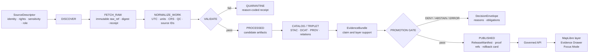

<!-- [KFM_META_BLOCK_V2]
doc_id: kfm://doc/TODO-register-agriculture-readme
title: Agriculture Domain
type: standard
version: v1
status: draft
owners: TODO-agriculture-domain-steward
created: 2026-04-22
updated: 2026-05-06
policy_label: TODO-policy-label
related: [../README.md, ../../README.md, governance/STATE_OF_LANE.md, governance/FILE_INDEX.md, governance/SOURCE_COVERAGE_MATRIX.md, governance/SOURCE_REGISTRY.md, governance/VALIDATION_PLAN.md, governance/SUPERSESSION_MAP.md, architecture/DATA_CONTRACTS.md, architecture/EVIDENCE_AND_PROVENANCE.md, operations/PIPELINE_RUNBOOK.md, operations/CHANGELOG.md, archive/README.md, ../../adr/ADR-0001-schema-home.md, ../../adr/ADR-0002-responsibility-root-monorepo.md, ../../adr/ADR-0208-domain-lane-template.md]
tags: [kfm, agriculture, domain-readme, evidence-first, map-first, time-aware, source-role, fixture-first, fail-closed]
notes: [GitHub connector confirmed this README and companion Agriculture docs on main; local checkout, owners, CODEOWNERS, policy label, CI enforcement, machine schema home, live source activation, release manifests, proof packs, runtime/API/UI behavior, dashboards, and logs remain review items.]
[/KFM_META_BLOCK_V2] -->

<a id="top"></a>

# Agriculture Domain

*Purpose: orient the KFM Agriculture lane as a governed, source-role-preserving, evidence-first domain for Kansas agricultural context, fixture-first validation, and public-safe claims.*

<p align="center">
  <strong>Kansas Frontier Matrix · Agriculture lane</strong><br>
  Evidence-first · map-first · time-aware · source-role-preserving · fixture-first · fail-closed
</p>

<p align="center">
  
  
  
  
  
  
</p>

<p align="center">
  <a href="#scope">Scope</a> ·
  <a href="#repo-fit">Repo fit</a> ·
  <a href="#accepted-inputs">Inputs</a> ·
  <a href="#exclusions">Exclusions</a> ·
  <a href="#directory-tree">Tree</a> ·
  <a href="#source-role-guardrails">Source roles</a> ·
  <a href="#lifecycle">Lifecycle</a> ·
  <a href="#quickstart">Quickstart</a> ·
  <a href="#definition-of-done">Done</a> ·
  <a href="#faq">FAQ</a>
</p>

> [!IMPORTANT]
> **Impact block**
>
> **Status:** `experimental` · **Owners:** `TODO-agriculture-domain-steward` · **Path:** `docs/domains/agriculture/README.md` · **Policy label:** `TODO-policy-label`
>
> This README and its companion documentation package are confirmed in the GitHub `main` branch. It does **not** prove live source activation, machine-schema enforcement, policy-as-code execution, CI enforcement, public API behavior, MapLibre layer wiring, Evidence Drawer payload behavior, Focus Mode behavior, release manifests, proof packs, dashboards, logs, or deployment state.

---

## Scope

The Agriculture lane covers Kansas-centered agricultural evidence and context where public-facing statements must remain traceable to source role, spatial support, temporal support, rights, sensitivity, validation state, policy posture, review state, release state, and correction lineage.

This README is the lane landing page. It routes maintainers to the current Agriculture documentation control set and explains how source families, source descriptors, contracts, validators, policy gates, catalog objects, EvidenceBundles, release objects, MapLibre layers, Evidence Drawer payloads, and Focus Mode responses should fit together without turning derived products into root truth.

### What this lane is responsible for

| Area | Responsibility | Current posture |
|---|---|---:|
| Lane orientation | Explain Agriculture scope, repo fit, accepted inputs, exclusions, source-role guardrails, lifecycle, and release burden. | **CONFIRMED docs** |
| Source-family coverage | Track SSURGO/SDA, gSSURGO/gNATSGO, Kansas Mesonet, SCAN, USCRN, SMAP, HLS/HLS-VI, NASS, CDL, and restricted future classes. | **CONFIRMED docs** |
| Source admission | Require source identity, owner/steward, rights, sensitivity, source role, stable keys, temporal support, spatial support, activation state, fixtures, validation, catalog closure, release, and rollback expectations before activation. | **CONFIRMED guidance** |
| Contract burden | Preserve differences between soil survey context, station observations, satellite/gridded products, aggregate statistics, derived indicators, released layers, and public claims. | **CONFIRMED guidance** |
| Validation burden | Define fixture-first, fail-closed gates for source role, rights, sensitivity, temporal support, unit/depth, geospatial support, aggregate misuse, catalog closure, public-path safety, and rollback readiness. | **CONFIRMED guidance** |
| Evidence and provenance | Require public claims, layers, exports, Evidence Drawer payloads, and Focus Mode answers to resolve `EvidenceRef -> EvidenceBundle`. | **CONFIRMED guidance** |
| Release and correction | Preserve `ReleaseManifest`, proof refs, rollback cards, correction notices, and supersession instead of overwriting history. | **PROPOSED / NEEDS VERIFICATION for artifacts** |
| Runtime and UI trust | Keep governed API, MapLibre, Evidence Drawer, and Focus Mode downstream of released evidence and policy-safe payloads. | **UNKNOWN enforcement** |

### What this lane must not become

Agriculture must not become a general farm-management database, a private operator data store, a crop-insurance adjudication surface, a pesticide-record publication lane, a field-level truth engine from aggregate products, or a convenience source-scraping layer.

Unknown rights, unresolved sensitivity, unsupported precision, missing source role, missing stable keys, stale temporal support, missing EvidenceBundle support, or missing rollback path must fail closed.

[Back to top](#top)

---

## Repo fit

`docs/domains/agriculture/README.md` lives under `docs/`, the human-facing documentation control plane. Agriculture is a domain lane beneath a responsibility root; it should not become a root-level `agriculture/` folder.

| Relationship | Relative path | Status | Role |
|---|---|---:|---|
| Current file | `docs/domains/agriculture/README.md` | **CONFIRMED** | Lane landing page. |
| Domain index | [`../README.md`](../README.md) | **CONFIRMED** | Domain-lane orientation and shared lane requirements. |
| Docs landing | [`../../README.md`](../../README.md) | **NEEDS VERIFICATION** | Upstream docs index. |
| Root README | [`../../../README.md`](../../../README.md) | **NEEDS VERIFICATION** | Repository-wide orientation. |
| Lane state | [`governance/STATE_OF_LANE.md`](governance/STATE_OF_LANE.md) | **CONFIRMED** | Current maturity, blockers, and next actions. |
| File index | [`governance/FILE_INDEX.md`](governance/FILE_INDEX.md) | **CONFIRMED** | Authoritative navigation for the Agriculture doc package. |
| Source coverage | [`governance/SOURCE_COVERAGE_MATRIX.md`](governance/SOURCE_COVERAGE_MATRIX.md) | **CONFIRMED** | Source-family readiness and release defaults. |
| Source admission | [`governance/SOURCE_REGISTRY.md`](governance/SOURCE_REGISTRY.md) | **CONFIRMED** | Source descriptor rules and admission checklist. |
| Validation plan | [`governance/VALIDATION_PLAN.md`](governance/VALIDATION_PLAN.md) | **CONFIRMED** | Fixture-first validation and CI expectations. |
| Supersession map | [`governance/SUPERSESSION_MAP.md`](governance/SUPERSESSION_MAP.md) | **CONFIRMED** | Successor mapping from older placeholder guidance. |
| Data contracts | [`architecture/DATA_CONTRACTS.md`](architecture/DATA_CONTRACTS.md) | **CONFIRMED** | Contract families, identity, schema-home warning, public payload obligations. |
| Evidence and provenance | [`architecture/EVIDENCE_AND_PROVENANCE.md`](architecture/EVIDENCE_AND_PROVENANCE.md) | **CONFIRMED** | EvidenceBundle, provenance, catalog closure, release, correction, rollback posture. |
| Pipeline runbook | [`operations/PIPELINE_RUNBOOK.md`](operations/PIPELINE_RUNBOOK.md) | **CONFIRMED** | Fixture-first lifecycle and incident/rollback operation notes. |
| Changelog | [`operations/CHANGELOG.md`](operations/CHANGELOG.md) | **CONFIRMED** | Human-readable Agriculture documentation change history. |
| Archive rules | [`archive/README.md`](archive/README.md) | **CONFIRMED** | Superseded Agriculture documentation handling. |
| Schema-home ADR | [`../../adr/ADR-0001-schema-home.md`](../../adr/ADR-0001-schema-home.md) | **DRAFT / NEEDS VERIFICATION** | Proposed machine schema home and contract/schema split. |
| Responsibility-root ADR | [`../../adr/ADR-0002-responsibility-root-monorepo.md`](../../adr/ADR-0002-responsibility-root-monorepo.md) | **ACCEPTED / REVIEW REVISION** | Root folders are responsibility boundaries, not domain buckets. |
| Domain-lane template ADR | [`../../adr/ADR-0208-domain-lane-template.md`](../../adr/ADR-0208-domain-lane-template.md) | **DRAFT / NEEDS VERIFICATION** | Proposed lane package and burden template. |
| Adjacent lane: Soil | [`../soil/README.md`](../soil/README.md) | **CONFIRMED** | Soil survey and MUKEY context that Agriculture may consume without forking soil authority. |

> [!WARNING]
> Do not create parallel schema, contract, policy, source-registry, proof, release, or root-level Agriculture homes. If `contracts/` and `schemas/` both appear relevant, resolve authority through ADR and migration notes instead of maintaining divergent definitions.

[Back to top](#top)

---

## Accepted inputs

This directory accepts documentation that helps maintainers understand, review, validate, and evolve the Agriculture lane.

| Accepted here | Examples | Gate |
|---|---|---|
| Domain orientation | Scope, neighboring lane boundaries, source-role rules, anti-collapse rules, release posture. | Must preserve KFM truth labels. |
| Source-family guidance | Human-readable source readiness, source-role notes, stable-key expectations, activation blockers. | Must not activate sources by prose alone. |
| Source admission rules | Required SourceDescriptor fields, rights/sensitivity expectations, activation states, fixture obligations. | Must route machine descriptors to registry homes. |
| Contract guidance | Object-family inventory, identity rules, schema-home posture, public payload obligations. | Must not become machine-schema authority. |
| Validation expectations | Negative fixtures, fail-closed behavior, no-raw-public checks, promotion dry-run requirements. | Must be testable or clearly marked **PROPOSED**. |
| Evidence/provenance posture | EvidenceBundle support, catalog closure, receipt/proof separation, correction and rollback rules. | Must preserve cite-or-abstain behavior. |
| Operations notes | Fixture-first run modes, quarantine handling, rollback drills, incident response. | Must not include secrets or live credentials. |
| Open verification backlog | Source terms, toolchain, owners, CODEOWNERS, schema home, app paths, CI workflows. | Must stay visible until resolved. |

[Back to top](#top)

---

## Exclusions

| Does not belong here | Where it goes instead | Why |
|---|---|---|
| RAW source payloads | `data/raw/agriculture/` or repo-confirmed lifecycle path | RAW is immutable evidence input, not documentation. |
| WORK or QUARANTINE artifacts | `data/work/agriculture/`, `data/quarantine/agriculture/`, or repo-confirmed equivalents | Candidate and failed artifacts must not become public docs. |
| Machine source descriptors | `data/registry/agriculture/` or repo-confirmed source registry | Source admission must be machine-readable and validated. |
| Active JSON Schemas | `schemas/contracts/v1/...` or ADR-confirmed schema home | README prose cannot be executable validation. |
| Narrative semantic contract bodies | `contracts/` or repo-confirmed contract home | This README routes to architecture guidance; it does not define detailed object contracts. |
| Policy-as-code | `policy/` or repo-confirmed policy root | Policy must be testable and versioned separately. |
| Source connector code | `connectors/`, `pipelines/`, `packages/`, `tools/`, or repo-confirmed implementation homes | This README documents behavior; it does not implement fetchers. |
| Valid/invalid fixtures | `fixtures/`, `tests/fixtures/`, `tests/`, or repo-confirmed fixture homes | Fixtures must be checked by validators and CI. |
| Receipts, proofs, release manifests, published artifacts | `data/receipts/`, `data/proofs/`, `release/`, `data/published/`, or repo-confirmed equivalents | Trust-bearing outputs require governed storage. |
| Runtime route or UI component code | `apps/`, `packages/`, `ui/`, `web/`, or repo-confirmed runtime homes | Runtime behavior needs implementation evidence. |
| Private farm/operator/yield/pesticide records | Restricted future lane only after consent, rights, sensitivity, and steward policy | Out of scope and deny-by-default. |
| Field-level crop claims from aggregate statistics | Nowhere without direct field-level evidence and policy approval | Aggregate statistics do not prove field truth. |
| Public exact sensitive locations | Published only after policy-approved generalization/redaction | Precision is a policy consequence, not a renderer choice. |

[Back to top](#top)

---

## Directory tree

Current Agriculture documentation package:

```text
docs/domains/agriculture/
├── README.md
├── governance/
│   ├── STATE_OF_LANE.md
│   ├── FILE_INDEX.md
│   ├── SOURCE_COVERAGE_MATRIX.md
│   ├── SOURCE_REGISTRY.md
│   ├── VALIDATION_PLAN.md
│   └── SUPERSESSION_MAP.md
├── architecture/
│   ├── DATA_CONTRACTS.md
│   └── EVIDENCE_AND_PROVENANCE.md
├── operations/
│   ├── PIPELINE_RUNBOOK.md
│   └── CHANGELOG.md
└── archive/
    └── README.md
```

Proposed or verification-dependent implementation surfaces:

```text
data/registry/agriculture/             # SourceDescriptor records and activation state — NEEDS VERIFICATION
schemas/contracts/v1/.../agriculture/  # machine schemas after ADR decision — NEEDS VERIFICATION
contracts/.../agriculture/             # semantic contracts if repo convention uses contracts/ — NEEDS VERIFICATION
policy/.../agriculture/                # rights, sensitivity, source-role, public-precision, promotion rules — NEEDS VERIFICATION
fixtures/.../agriculture/              # valid/invalid no-network fixtures — NEEDS VERIFICATION
tests/.../agriculture/                 # validators, policy tests, promotion dry-runs — NEEDS VERIFICATION
tools/validators/.../agriculture/      # validator CLIs or repo-native equivalents — NEEDS VERIFICATION
pipelines/.../agriculture/             # watcher/normalizer/catalog emitters after approval — NEEDS VERIFICATION
release/.../agriculture/               # release candidates, manifests, rollback cards — NEEDS VERIFICATION
```

> [!NOTE]
> The documentation package is confirmed. The implementation surfaces above are not confirmed as Agriculture-specific active paths unless a current repo inspection, test, workflow, or emitted artifact proves them.

[Back to top](#top)

---

## Source-role guardrails

Agriculture is a multi-source domain. The same place can carry soil survey context, station observations, satellite grids, aggregate statistics, remote-sensing products, and derived indicators. These sources are not interchangeable.

| Source family | Role boundary | Stable support to preserve | Current coverage state | Public rule |
|---|---|---|---:|---|
| SSURGO / SDA | Authoritative vector/tabular soil survey and MUKEY-centered properties. | `mukey`, `cokey`, `chkey`, source table/version, query identity. | `PLANNED` | Do not replace vector/tabular provenance silently with a raster companion. |
| gSSURGO / gNATSGO | Gridded or derivative soil companion useful for statewide/raster analysis. | grid/cell/tile identity, MUKEY mapping, product version, resolution, digest. | `PLANNED` | Label as gridded/derived companion; do not treat as independent soil authority. |
| Kansas Mesonet | Station observations for soil moisture/weather context. | station ID, variable, depth, timestamp, unit, QC/freshness. | `FIXTURE-READY` at documentation level | Do not generalize station observations into field-level truth without a declared transform. |
| NRCS SCAN | Observation/corroboration reference station network. | station ID, element, depth, timestamp, QC/status. | `PLANNED` | Normalize units/time/depth and preserve source QC/status. |
| NOAA USCRN | Observation/corroboration reference climate and soil products. | station ID, product, timestamp, element/depth metadata. | `PLANNED` | Do not overstate field or parcel support. |
| NASA SMAP | Satellite/grid soil-moisture product context. | grid cell, product ID/version, granule/time window, QA/mask fields. | `FIXTURE-READY` at documentation level | Public claims must say satellite/grid context; not station, parcel, or operator truth. |
| NASA HLS / HLS-VI | Remote-sensing reflectance, vegetation-index, mask, and derived-change context. | STAC item, asset, acquisition time, time window, mask/cloud metadata, index formula. | `FIXTURE-READY` at documentation level | Distinguish observed asset, masked index, and derived stress indicator. |
| USDA NASS QuickStats / Crop Progress | Official aggregate statistics and crop/phenology context. | commodity, geography, year/week, statistic, unit, query identity. | `PLANNED` | Never present as field-level, parcel-level, or operator-level truth. |
| USDA NASS Cropland Data Layer | Annual crop/land-cover classification context. | product year, class code, raster cell, product version, accuracy/caveat notes. | `PLANNED` | Classification context is not operator or management truth. |
| Private/proprietary farm data | Restricted future source class only. | authorization, consent, agreement, owner/steward, sensitivity, retention, revocation path. | `BLOCKED` | Deny by default until restricted-data governance exists. |
| PMTiles, search indexes, summaries, embeddings, dashboards | Rebuildable delivery or discovery products. | source release, spec hash, artifact digest, build receipt. | **Derived** | Useful for access and performance; never sovereign truth. |

### Anti-collapse rules

- **Aggregate is not field-level.** A county/week crop statistic cannot become a parcel, field, or operator claim.
- **Station is not surface.** A station reading does not become a statewide or field layer without a declared interpolation/model transform.
- **Grid is not ground truth.** SMAP/HLS/CDL/gSSURGO/gNATSGO outputs are product-specific gridded or remote-sensing context.
- **Derived is not canonical.** PMTiles, dashboards, embeddings, summaries, layer manifests, and scenes are rebuildable artifacts.
- **Soil context does not silently move domains.** Agriculture may consume soil support, but it must not fork Soil-lane authority or weaken MUKEY/source semantics.
- **Unknown rights fail closed.** Missing rights, terms, sensitivity, steward, or source-role fields block public release.
- **AI remains interpretive.** Focus Mode may synthesize released evidence, but generated language does not validate sources or outrank EvidenceBundle support.

[Back to top](#top)

---

## Lifecycle

Agriculture follows the KFM trust path:

```text
SOURCE EDGE -> RAW -> WORK / QUARANTINE -> PROCESSED -> CATALOG / TRIPLET -> PUBLISHED
```

Promotion is a governed state transition, not a file move.



| Stage | Agriculture requirement | Failure behavior |
|---|---|---|
| DISCOVER | Source identity, owner/steward, rights, sensitivity, cadence, stable keys, spatial support, temporal support, and fetch window are recorded. | Disable or block source activation. |
| FETCH_RAW | Preserve raw payload digest and immutable RAW pointer; record retrieval identity when available. | Emit failure receipt; do not mutate raw. |
| NORMALIZE_WORK | Preserve source IDs, source timezone, QC flags, units, depth, CRS, product versions, masks, and source-specific warnings. | Quarantine malformed candidate. |
| VALIDATE | Run schema, source-role, rights/sensitivity, duplicate, range, component-total, temporal, unit/depth, geospatial, public-path, and catalog checks. | Fail closed with reason codes. |
| PROCESS / CATALOG | Emit catalog/provenance objects and EvidenceBundle candidates only from validated outputs. | Block catalog closure. |
| PUBLISH | Require evidence, rights, sensitivity, validation, catalog closure, proof, policy, review, release, correction, and rollback readiness. | Record `DENY`, `ABSTAIN`, or `ERROR`. |

[Back to top](#top)

---

## Quickstart

Run this read-only inspection after mounting the real repository.

```bash
# Phase 0 — read-only repo and lane inventory
pwd
git status --short
git branch --show-current || true

find docs/domains/agriculture -maxdepth 4 -type f 2>/dev/null | sort || true

find docs contracts schemas policy tools tests fixtures apps packages pipelines data release .github \
  -maxdepth 5 -type f 2>/dev/null \
  | grep -Ei 'agriculture|agri|crop|nass|mesonet|ssurgo|sda|soil_moisture|smap|hls|EvidenceBundle|DecisionEnvelope|PromotionDecision|ReleaseManifest|CatalogMatrix|SourceDescriptor' \
  | sort \
  | head -500 || true
```

Use the results to update [`governance/STATE_OF_LANE.md`](governance/STATE_OF_LANE.md) before creating new implementation files or upgrading maturity claims.

### Placeholder validation commands

These commands are **NEEDS VERIFICATION** because package manager, validator paths, policy tooling, and CI workflows must be confirmed in the mounted repo.

```bash
# NEEDS VERIFICATION — replace with repo-native equivalents.
python -m pytest tests/agriculture -q

python tools/validators/agriculture/validate_source_registry.py \
  data/registry/agriculture/sources.yaml

python tools/validators/agriculture/validate_manifest.py \
  tests/agriculture/fixtures/agriculture_dataset_manifest_sample.json

python tools/validators/agriculture/validate_receipt.py \
  tests/agriculture/fixtures/agriculture_run_receipt_sample.json

python tools/validators/agriculture/validate_catalog_closure.py \
  tests/agriculture/fixtures/catalog_matrix_pass.json
```

```bash
# NEEDS VERIFICATION — only after OPA/Conftest or repo-native policy tooling is installed and pinned.
conftest test tests/agriculture/fixtures/policy_cases -p policy/agriculture
opa test policy/agriculture
```

[Back to top](#top)

---

## Usage

### Add a new Agriculture source

1. Draft a SourceDescriptor in the repo-confirmed source registry.
2. Record source identity, official access path, owner/steward, rights/terms, sensitivity, source role, knowledge character, cadence, stable keys, spatial support, temporal support, intended publication class, and activation state.
3. Keep `ingest_mode: fixture_only` until source terms, automation posture, fixtures, validators, and policy cases are reviewed.
4. Add at least one valid fixture and one invalid fixture before any live fetch.
5. Add or update source-role and rights/sensitivity validators.
6. Add policy cases for missing rights, missing sensitivity, disabled source state, source-role misuse, and public-precision misuse.
7. Add catalog/provenance expectations and EvidenceBundle support.
8. Keep live source activation disabled until source terms, cadence, and automation permissions are verified.

### Promote an Agriculture-derived layer

1. Confirm no public layer manifest references RAW, WORK, QUARANTINE, internal receipt paths, unpublished candidates, direct source side effects, or direct model output.
2. Confirm layer manifest has source role, knowledge character, freshness, policy label, catalog refs, evidence refs, release ref, correction state, and rollback ref.
3. Confirm STAC/DCAT/PROV/CatalogMatrix/release digest closure or repo-confirmed equivalent.
4. Confirm the Evidence Drawer payload opens from the layer and resolves its EvidenceBundle.
5. Confirm Focus Mode answers only from released evidence and emits `ANSWER`, `ABSTAIN`, `DENY`, or `ERROR` with reason codes.
6. Exercise rollback by repointing the current alias to a prior release manifest or an explicit no-prior-release basis and emitting a rollback receipt/proof.

[Back to top](#top)

---

## Contract surfaces to verify

| Object family | Agriculture use | Status |
|---|---|---:|
| `SourceDescriptor` | Source identity, role, rights, cadence, sensitivity, steward, stable keys. | **Shared dependency / NEEDS VERIFICATION** |
| `EvidenceRef` | Links claims, layers, observations, and artifacts to support. | **Shared dependency / NEEDS VERIFICATION** |
| `EvidenceBundle` | Support package for a public claim, layer, Focus answer, or export. | **Shared dependency / NEEDS VERIFICATION** |
| `ValidationReport` | Schema, source-role, rights/sensitivity, temporal, unit/depth, geospatial, catalog, and public-path validation results. | **Shared dependency / NEEDS VERIFICATION** |
| `DecisionEnvelope` | Finite runtime or policy-significant outcome: `ANSWER`, `ABSTAIN`, `DENY`, `ERROR`. | **Shared dependency / NEEDS VERIFICATION** |
| `PromotionDecision` | Release-gate decision with policy, validation, catalog, review, and rollback state. | **Shared dependency / NEEDS VERIFICATION** |
| `ReleaseManifest` | Published release identity, artifacts, digests, policy label, proof refs, rollback target. | **Shared dependency / NEEDS VERIFICATION** |
| `CatalogMatrix` | Closure across catalog, provenance, release, and digest identity. | **Shared dependency / NEEDS VERIFICATION** |
| `CorrectionNotice` | Public or steward-visible correction/supersession notice. | **Shared dependency / NEEDS VERIFICATION** |
| `RollbackCard` | Reversible release operation target and instructions. | **Shared dependency / NEEDS VERIFICATION** |
| `SoilMoistureStation` | Station metadata, provider, location support, depths, variables, status. | **PROPOSED** |
| `SoilMoistureReading` | Normalized reading with station, variable, depth, value, UTC timestamp, QC, hashes. | **PROPOSED** |
| `SSURGOMukeyProperties` | MUKEY-level properties and aggregate provenance consumed from Soil-lane support. | **PROPOSED** |
| `AgricultureAggregateStat` | NASS-style statistic by commodity, geography, period, statistic, and unit. | **PROPOSED** |
| `CropProgressObservation` | Crop progress/phenology aggregate by geography and week/year. | **PROPOSED** |
| `AgricultureGridProduct` | Gridded product slice such as SMAP, CDL, or HLS-derived product context. | **PROPOSED** |
| `VegetationIndexObservation` | HLS/NDVI/VI observation or derived change with STAC asset refs and masks. | **PROPOSED** |
| `AgricultureDerivedIndicator` | Stress, anomaly, suitability, condition, or fused indicator output. | **PROPOSED** |
| `AgricultureLayerManifest` | Public layer source role, catalog refs, evidence refs, freshness, policy, style, rollback. | **PROPOSED** |
| `AgricultureEvidenceDrawerPayload` | Trust payload for a selected feature, layer, or claim. | **PROPOSED** |
| `AgricultureFocusPayload` | Focus Mode request/response context for agriculture questions. | **PROPOSED** |

[Back to top](#top)

---

## Definition of done

A first useful Agriculture PR is done only when it reduces uncertainty without pretending that unverified implementation exists.

- [ ] `governance/STATE_OF_LANE.md` records current repo findings: branch, package manager, schema home, test runner, policy tools, app paths, existing Agriculture files, and open gaps.
- [ ] Owner, CODEOWNERS, and policy-label placeholders are replaced or explicitly tracked as unresolved.
- [ ] Schema-home ADR status is checked before adding machine schemas.
- [ ] Source descriptors include owner/steward, source role, rights/terms, sensitivity, cadence, stable keys, spatial support, temporal support, and activation state.
- [ ] Valid and invalid fixtures exist before live source activation.
- [ ] Negative fixtures fail closed for missing rights, missing sensitivity, missing source role, aggregate-as-field truth, station-as-surface truth, grid-as-ground-truth, missing provenance, public RAW/WORK/QUARANTINE references, and missing rollback target.
- [ ] Validators emit reason-coded outcomes and do not call live sources in ordinary PR CI.
- [ ] Public API/UI contract tests prove normal clients consume governed APIs and published artifacts only.
- [ ] Evidence Drawer payloads include EvidenceBundle ref, source role, knowledge character, freshness, validation summary, review/release state, policy label, correction state, and rollback linkage.
- [ ] Focus Mode payloads use finite outcomes: `ANSWER`, `ABSTAIN`, `DENY`, `ERROR`.
- [ ] Catalog closure ties catalog/provenance records, release manifest, digest identity, proof refs, and rollback card.
- [ ] Rollback is exercised on a fixture release.
- [ ] Live source activation waits for rights, terms, cadence, automation permission, and steward review.
- [ ] Documentation changes are reflected in [`operations/CHANGELOG.md`](operations/CHANGELOG.md) and indexed in [`governance/FILE_INDEX.md`](governance/FILE_INDEX.md).

[Back to top](#top)

---

## FAQ

### Can NASS QuickStats or Crop Progress prove a field-level crop condition?

No. Treat those sources as aggregate official statistics. They may support state, county, commodity, week/year, and statistic context, but they do not establish parcel, operator, or field-level truth.

### Can SMAP, HLS, HLS-VI, or CDL support Agriculture layers?

Yes, as **remote-sensing**, **grid**, or **derived context** after product version, masks, time window, spatial support, source role, quality metadata, catalog/provenance, and release posture are explicit. They are not direct field observations unless stronger evidence and policy support that narrow claim.

### Should Agriculture own SSURGO?

Not silently. Agriculture may consume soil context, but soil survey authority and MUKEY semantics should stay aligned with the Soil lane. Agriculture should document how it uses soil-derived context rather than becoming the canonical soil source.

### Can Focus Mode answer Agriculture questions?

Only from released, policy-safe evidence. It must show scope, freshness, policy, evidence, and finite outcome state. It must abstain or deny when support is weak, restricted, stale, or outside source-role scope.

### What is the safest first slice?

A fixture-only slice: one source descriptor set, one SSURGO/SDA sample, one station soil-moisture sample, one NASS aggregate sample, one remote-sensing/grid sample, validators, invalid fixtures, catalog candidate, EvidenceBundle candidate, PromotionDecision, release dry-run, and rollback card. No live fetch and no public promotion until source terms and repo gates are verified.

### Does a passing validator publish Agriculture data?

No. A passing validator can make a candidate eligible for downstream review. Publication still requires EvidenceBundle support, policy, catalog closure, proof refs, review state, ReleaseManifest, correction path, and rollback target.

[Back to top](#top)

---

<details>
<summary>Appendix A — Negative fixture targets</summary>

| Fixture target | Expected outcome |
|---|---|
| Source descriptor missing `rights` | `DENY` source activation or public release. |
| Source descriptor missing `sensitivity` | `DENY` source activation or public release. |
| Ambiguous source role | `DENY` activation or `ABSTAIN` from claim. |
| NASS aggregate used as field-level, parcel-level, or operator-level truth | `DENY` public claim. |
| Station observation rendered as field-level or statewide surface without declared transform | `DENY` or `QUARANTINE`. |
| SMAP/HLS/CDL/gSSURGO grid described as station observation or direct ground truth | `DENY` public claim. |
| Soil moisture reading missing depth or unit | `ERROR` or `QUARANTINE`. |
| HLS/HLS-VI object missing mask/cloud/time-window metadata | `ABSTAIN` or `QUARANTINE`. |
| Derived stress indicator without input refs or processing receipt | `DENY` promotion. |
| Layer manifest referencing RAW, WORK, QUARANTINE, internal receipt path, or unpublished candidate | Fail public-path safety check. |
| Receipt claiming proof authority | Fail receipt-not-proof check. |
| CatalogMatrix with mismatched catalog/provenance/release digests | `DENY` promotion. |
| Promotion candidate without rollback target | `ERROR` or `DENY` release. |
| Focus Mode answer with no resolved EvidenceBundle | `ABSTAIN` or `DENY`. |

</details>

<details>
<summary>Appendix B — Suggested maintainer reading order</summary>

1. Read this README.
2. Read [`governance/STATE_OF_LANE.md`](governance/STATE_OF_LANE.md) for current maturity and blockers.
3. Use [`governance/FILE_INDEX.md`](governance/FILE_INDEX.md) as the navigation source of truth for Agriculture docs.
4. Review [`governance/SOURCE_COVERAGE_MATRIX.md`](governance/SOURCE_COVERAGE_MATRIX.md) before naming or upgrading any source family.
5. Use [`governance/SOURCE_REGISTRY.md`](governance/SOURCE_REGISTRY.md) before drafting machine-readable source descriptors.
6. Use [`architecture/DATA_CONTRACTS.md`](architecture/DATA_CONTRACTS.md) before adding schemas, DTOs, or object families.
7. Use [`governance/VALIDATION_PLAN.md`](governance/VALIDATION_PLAN.md) before adding fixtures, validators, or CI gates.
8. Use [`architecture/EVIDENCE_AND_PROVENANCE.md`](architecture/EVIDENCE_AND_PROVENANCE.md) before emitting catalog, EvidenceBundle, release, correction, or rollback objects.
9. Use [`operations/PIPELINE_RUNBOOK.md`](operations/PIPELINE_RUNBOOK.md) before running fixture-first lifecycle work.
10. Update [`operations/CHANGELOG.md`](operations/CHANGELOG.md) for user-visible documentation changes.

</details>

<details>
<summary>Appendix C — Open verification backlog</summary>

| Item | Status | Why it matters |
|---|---:|---|
| Owners, CODEOWNERS, and Agriculture steward review path | **NEEDS VERIFICATION** | Required before stable or published doc/release status. |
| `policy_label` for Agriculture docs and outputs | **NEEDS VERIFICATION** | Required for public/restricted classification. |
| Canonical Agriculture machine schema subpath | **CONFLICTED / NEEDS VERIFICATION** | Prevents duplicate authority between `schemas/` and `contracts/`. |
| Existing shared schemas for `SourceDescriptor`, `EvidenceBundle`, `DecisionEnvelope`, `PromotionDecision`, `ReleaseManifest`, `CatalogMatrix`, `CorrectionNotice`, and `RollbackCard` | **UNKNOWN** | Agriculture should reuse shared trust objects before creating domain forks. |
| Agriculture-specific machine source descriptors | **PROPOSED / NEEDS VERIFICATION** | Source activation and source-role validation depend on them. |
| Agriculture-specific policy-as-code path and commands | **UNKNOWN** | Needed for enforceable rights, sensitivity, source-role, and promotion decisions. |
| Agriculture-specific validator scripts and CI workflow names | **UNKNOWN** | Needed before claiming runnable validation. |
| Valid/invalid fixture paths | **UNKNOWN / NEEDS VERIFICATION** | Required for fixture-first validation. |
| Source terms and automation permission for SSURGO/SDA/gSSURGO, Mesonet, SCAN, USCRN, SMAP, HLS/HLS-VI, NASS, and CDL | **NEEDS VERIFICATION** | Blocks live source activation. |
| Governed API route conventions, MapLibre layer registry, Evidence Drawer adapter, and Focus Mode schema | **UNKNOWN** | Required before public UI/API/AI claims. |
| First Agriculture ReleaseManifest, proof pack, rollback card, and correction notice refs | **UNKNOWN / PROPOSED** | Required before any Agriculture release becomes active. |
| Local test output, workflow logs, dashboards, runtime traces, and deployment state | **UNKNOWN** | Required before enforcement or runtime maturity claims. |
| Restricted-data lane for private/proprietary farm data | **BLOCKED / PROPOSED** | Required before private farm/operator/yield/pesticide/proprietary records can be considered. |

</details>

[Back to top](#top)
