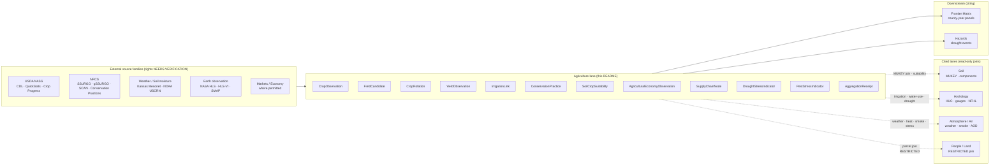
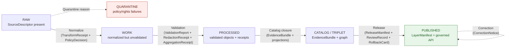

<a id="top"></a>
<!--
═══════════════════════════════════════════════════════════════════════════════
KFM META BLOCK v2
─────────────────────────────────────────────────────────────────────────────
doc_id:            kfm://doc/docs/domains/agriculture/README-v2
title:             Agriculture — KFM Domain Lane (README)
subtitle:          Governed, evidence-first crop, field, rotation, yield,
                   irrigation, suitability, conservation, stress, and
                   agricultural-economy lane for Kansas.
type:              standard / README-like (domain lane)
version:           v2 (PROPOSED)
prior_version:     v1 (2026-05-15)
status:            draft
created:           2026-05-15
updated:           2026-05-26
owners:            Agriculture domain steward + Docs steward (PROPOSED)
authoring_session: Docs-only. No mounted repo, CI workflow, runtime log,
                   dashboard, or release artifact inspected. All implementation
                   maturity is bounded per ai-build-operating-contract.md §17
                   current-session evidence limit.
contract_version:  "3.0.0"  # pinned per ai-build-operating-contract.md §0, §34, §37
proposed_home:     docs/domains/agriculture/README.md
                   (PROPOSED — Directory Rules §6.1 docs tree;
                    §12 Domain Placement Law; §15 README Contract.)
policy_label:      public
truth_posture:     CONFIRMED doctrine synthesis from KFM corpus (Atlas v1.1
                   Ch. 9, Encyclopedia §7.7, Build Manual §6.12, dossier
                   SRC-028); PROPOSED implementation paths, ADR numbers,
                   schema homes, validator names, route names, owners;
                   UNKNOWN current mounted-repo and runtime state unless
                   separately verified; NEEDS VERIFICATION for source rights
                   on every external source family until SourceDescriptor
                   review.
related:
  - kfm://doc/docs/doctrine/directory-rules.md
  - kfm://doc/docs/doctrine/ai-build-operating-contract.md
  - kfm://doc/docs/doctrine/lifecycle-law.md
  - kfm://doc/docs/doctrine/truth-posture.md
  - kfm://doc/docs/doctrine/trust-membrane.md
  - kfm://doc/docs/architecture/governed-api.md
  - kfm://doc/docs/architecture/map-shell.md
  - kfm://doc/docs/architecture/maplibre-3d.md
  - kfm://doc/docs/architecture/contract-schema-policy-split.md
  - kfm://doc/docs/adr/ADR-0001-schema-home.md
  - kfm://doc/docs/domains/soil/README.md
  - kfm://doc/docs/domains/hydrology/README.md
  - kfm://doc/docs/domains/atmosphere/README.md
  - kfm://doc/docs/domains/hazards/README.md
  - kfm://doc/docs/domains/people-dna-land/README.md
  - kfm://doc/docs/domains/flora/README.md
  - kfm://doc/domains/frontier-matrix/README.md
spec_hash:         PROPOSED — emit via canonical JCS+SHA-256 of frontmatter
                   plus body once the MetaBlock validator (KFM-P22-PROG-0017)
                   is wired.
rollback_target:   docs/domains/agriculture/README.md v1 (2026-05-15);
                   reverting v2 companion sections (Open Questions, Verification,
                   Changelog, Definition of Done) and the MetaBlock v2 wrapper
                   yields v1.
tags:              [kfm, domain, agriculture, doctrine-adjacent, readme]
notes:
  - Doctrine-adjacent domain lane README; carries CONTRACT_VERSION pin per
    ai-build-operating-contract.md §34, §37.
  - RFC 2119 / RFC 8174 conformance language applied per directory-rules.md §2.2.
  - Mounted repo NOT inspected; every repo-shaped claim is PROPOSED or
    NEEDS VERIFICATION per ai-build-operating-contract.md §17 / §13.
═══════════════════════════════════════════════════════════════════════════════
-->

# 🌾 Agriculture — KFM Domain Lane

> The agriculture lane governs evidence-backed crop, field, rotation, yield, suitability, irrigation, conservation, stress, and agricultural-economy observations for Kansas — published only as aggregate or permissioned products, with field-level and operator-level detail **denied by default**.

[](#3-status--authority)
[](#3-status--authority)
[-blue)](#5-repo-fit)
[](#14-pipeline-shape-raw--published)
[](#12-sensitivity--rights-posture)
[](#3-status--authority)
[](#-rfc-2119-conformance)
[](#3-status--authority)
[](#top)
[](#5-repo-fit)
[](#last-updated)

| Field | Value |
|---|---|
| **Lane** | `docs/domains/agriculture/` |
| **Authority class (this README)** | Canonical (per Directory Rules §15 README Contract) |
| **Authority class (paths/owners herein)** | `PROPOSED` until verified against mounted-repo evidence |
| **Doctrine status** | `CONFIRMED` — Atlas v1.1 Ch. 9 · Encyclopedia §7.7 · Build Manual §6.12 |
| **Implementation status** | `PROPOSED` — no mounted repo inspected in this session |
| **Sensitivity defaults** | `T0` aggregate · `T1` field-candidate · `T4` operator / private join |
| **Owners** | `<TBD — Agriculture domain steward + Docs steward>` *(placeholder)* |
| **Source dossier** | `KFM_Agriculture_Domain_Implementation_Dossier_REVISED_2026-04-21.pdf` (SRC-028) `[DOM-AG]` |
| **Atlas reference** | Domains Culmination Atlas v1.1, Ch. 9 — Agriculture `[ENCY]` |
| **Operating contract** | `ai-build-operating-contract.md` v3.0 (`CONTRACT_VERSION = "3.0.0"`) |
| **Last reviewed** | `2026-05-26` |

---

## Quick jump

[1. Purpose](#1-purpose) ·
[2. Scope & boundary](#2-scope--boundary) ·
[3. Status & authority](#3-status--authority) ·
[4. What belongs here / what doesn't](#4-what-belongs-here--what-doesnt) ·
[5. Repo fit](#5-repo-fit) ·
[6. Proposed lane tree](#6-proposed-lane-tree) ·
[7. Domain at a glance (diagram)](#7-domain-at-a-glance) ·
[8. Ubiquitous language](#8-ubiquitous-language) ·
[9. Canonical object families](#9-canonical-object-families) ·
[10. Source families](#10-source-families) ·
[11. Cross-lane relations](#11-cross-lane-relations) ·
[12. Sensitivity & rights posture](#12-sensitivity--rights-posture) ·
[13. Map layers & viewing products](#13-map-layers--viewing-products) ·
[14. Pipeline shape (RAW → PUBLISHED)](#14-pipeline-shape-raw--published) ·
[15. First credible thin slice](#15-first-credible-thin-slice) ·
[16. Validation & review](#16-validation--review) ·
[17. Verification backlog](#17-verification-backlog) ·
[18. Related folders & docs](#18-related-folders--docs) ·
[19. ADRs](#19-adrs) ·
[20. FAQ](#20-faq) ·
[Appendix](#appendix) ·
[Open questions register](#open-questions-register) ·
[Changelog](#changelog-v1--v2) ·
[Definition of done](#definition-of-done)

> [!IMPORTANT]
> **Agriculture is rights- and privacy-sensitive.** Field polygons, operator identities, and source-rights-limited datasets MUST be **denied by default** in any public surface. Public products MUST aggregate to county / HUC / grid thresholds and MUST resolve every claim to an `EvidenceBundle`. Field-level publication MUST require explicit rights, sensitivity review, and a recorded `AggregationReceipt` *or* `RedactionReceipt`. See [§12](#12-sensitivity--rights-posture). `[DOM-AG]` `[ENCY]`

<a id="-rfc-2119-conformance"></a>

> [!NOTE]
> **RFC 2119 / RFC 8174 conformance.** This README uses **MUST / MUST NOT / SHOULD / SHOULD NOT / MAY** per `directory-rules.md` §2.2 and `ai-build-operating-contract.md` §5.1.1. MUST-class statements are non-negotiable absent an accepted ADR; SHOULD-class deviations require a logged justification.

---

## 1. Purpose

The Agriculture lane represents crops, fields, soils-as-substrate, irrigation, yields, conservation practices, stress indicators, and agricultural economy across Kansas — **as governed, citable, public-safe observations**, not as a private farm-management surface. `[DOM-AG]` `[ENCY]`

It exists to:

- Make agricultural claims **inspectable**: every published claim MUST resolve to an `EvidenceBundle` and MUST carry its source role, sensitivity, time, validation, and release lineage. `[ENCY]`
- Keep the **trust membrane intact**: public clients and standard UI surfaces MUST read released `LayerManifest` and governed-API products, and MUST NOT read canonical / internal stores. `[DIRRULES]` `[GAI]`
- Honor **source rights and privacy**: USDA NASS terms, Kansas Mesonet usage, NASA HLS / SMAP product terms, NRCS SCAN / NOAA USCRN terms, and farm-operator privacy MUST fail closed when unclear. `[DOM-AG]`
- Provide the agronomic substrate for cross-lane reasoning with **Soil**, **Hydrology**, **Atmosphere / Air**, **Hazards**, **People / DNA / Land**, and the **Frontier Matrix**.

> *CONFIRMED doctrine / PROPOSED implementation.* The dossier and Atlas govern what this lane **owns and means**; the on-disk schemas, validators, fixtures, policies, tests, and pipelines that realize it remain `PROPOSED` until verified against a mounted KFM repository.

[Back to top ↑](#top)

---

## 2. Scope & boundary

### 2.1 What this domain owns

**`CONFIRMED` (doctrine):** Agricultural observations and derivatives, plus a small public-safe family of indicators. Concretely, the lane owns the following **twelve** object families ([§9](#9-canonical-object-families)): `[DOM-AG]` `[ENCY]`

`CropObservation` · `FieldCandidate` · `CropRotation` · `YieldObservation` · `IrrigationLink` · `ConservationPractice` · `SoilCropSuitability` · `AgriculturalEconomyObservation` · `SupplyChainNode` · `DroughtStressIndicator` · `PestStressIndicator` · `AggregationReceipt`

### 2.2 What this domain explicitly does **not** own

**`CONFIRMED` (doctrine):** `[DOM-AG]` `[ENCY]`

| Concern | Owning lane |
|---|---|
| Soil map units, components, horizons, hydrologic group, MUKEY semantics | **Soil** (`docs/domains/soil/`) |
| Streamflow, gauges, NFHL, water levels, flood context | **Hydrology** (`docs/domains/hydrology/`) |
| Weather observations, climate normals, smoke / AOD context | **Atmosphere / Air** (`docs/domains/atmosphere/`) |
| Drought as a hazard event, disaster declarations | **Hazards** (`docs/domains/hazards/`) |
| Parcels, ownership, title, living-person privacy, DNA | **People / DNA / Land** (`docs/domains/people-dna-land/`) |
| Vegetation taxa, rare-plant geometry | **Flora** (`docs/domains/flora/`) |

Agriculture **cites** Soil, Hydrology, Atmosphere / Air, and People / Land through governed cross-lane joins ([§11](#11-cross-lane-relations)). Agriculture MUST NOT re-define another lane's canonical truth.

### 2.3 Hard boundary statements

- **No private farm operations.** Operator-identified records MUST NOT appear on public surfaces.
- **No field-level sensitive detail without review.** Field polygons MAY be sensitive; the public default MUST be aggregation to county / HUC / grid thresholds.
- **No source-rights-limited data without review.** Terms for NASS, Mesonet, SCAN, HLS, SMAP, USCRN, and any market / economy source are `NEEDS VERIFICATION` and MUST fail closed until reviewed.
- **No private person-parcel join in public surfaces.** Agriculture × People / Land joins MUST remain restricted by default (`T2` / `T4`).

[Back to top ↑](#top)

---

## 3. Status & authority

| Field | Value |
|---|---|
| **Doctrine status** | `CONFIRMED` — Atlas v1.1 Ch. 9 · Encyclopedia §7.7 · Build Manual §6.12 `[DOM-AG]` `[ENCY]` |
| **Implementation status** | `PROPOSED` — no mounted repo inspected in this session |
| **Authority class (this README)** | Canonical (per Directory Rules §15 README Contract) |
| **Authority class (proposed paths)** | `PROPOSED` until verified against mounted-repo evidence |
| **Operating contract** | `ai-build-operating-contract.md` v3.0 · `CONTRACT_VERSION = "3.0.0"` |
| **Schema home** | `schemas/contracts/v1/domains/agriculture/` (default per **ADR-0001** schema-home) — `PROPOSED` |
| **Truth posture** | Cite-or-abstain. `EvidenceBundle` outranks generated language, renderer state, tiles, search indexes, and graph projections. `[ENCY]` `[GAI]` |
| **Lifecycle invariant** | `RAW → WORK / QUARANTINE → PROCESSED → CATALOG / TRIPLET → PUBLISHED`. Promotion is a **governed state transition, not a file move.** `[DIRRULES]` |
| **Trust membrane** | Public clients MUST use governed APIs and released artifacts and MUST NOT reach canonical / internal stores. `[DIRRULES]` `[GAI]` |
| **AI boundary** | Governed AI is interpretive only. Finite outcomes: `ANSWER` · `ABSTAIN` · `DENY` · `ERROR` (with optional `NARROWED` / `BOUNDED` / `SOURCE_STALE`). No uncited claims about Kansas agriculture. `[GAI]` |
| **Renderer doctrine** | MapLibre is a downstream renderer; `docs/architecture/maplibre-3d.md` is load-bearing for any 3D / globe / terrain agriculture surface. `[MAP-MASTER]` |

> [!NOTE]
> **Doctrine vs. implementation.** When this README says "the lane does X," read it as *"the lane is doctrinally specified to do X; whether the current repo enforces X is `NEEDS VERIFICATION` until a mounted-repo inspection confirms."* Every implementation-shaped statement is `PROPOSED` unless explicitly labeled otherwise.

[Back to top ↑](#top)

---

## 4. What belongs here / what doesn't

This is a `docs/`-scoped README. It explains what the agriculture **lane** is and points to where each kind of agriculture file lives. It MUST NOT host schemas, policy bundles, fixtures, code, or data — those live under their own responsibility roots, with `domains/agriculture/` as a **segment** inside each root ([§5](#5-repo-fit)). `[DIRRULES]`

### 4.1 What belongs in `docs/domains/agriculture/`

| File type | Purpose | Status |
|---|---|---|
| `README.md` *(this file)* | Lane landing page, scope, boundaries, status | `PROPOSED` |
| `overview.md` | Long-form domain narrative; mission, history, viewing products | `PROPOSED` (placeholder) |
| `ubiquitous-language.md` | Glossary of agriculture-specific terms with citation back to dossier | `PROPOSED` (placeholder) |
| `cross-lane-relations.md` | Soil, hydrology, atmosphere, people / land joins and their constraints | `PROPOSED` (placeholder) |
| `sensitivity-and-rights.md` | Tier matrix, allowed transforms, deny-by-default register entries | `PROPOSED` (placeholder) |
| `viewing-products.md` | Map layers, dashboards, Evidence Drawer payloads, Focus Mode rules | `PROPOSED` (placeholder) |
| `thin-slice.md` | First credible slice acceptance criteria and Definition of Done | `PROPOSED` (placeholder) |
| `verification-backlog.md` | Open verification items keyed to dossier sections | `PROPOSED` (placeholder) |

### 4.2 What does **not** belong here

| File type | Belongs in | Reason |
|---|---|---|
| Object schemas (`.schema.json`) | `schemas/contracts/v1/domains/agriculture/` | Shape is owned by `schemas/`. **ADR-0001.** |
| Object semantics (Markdown contracts) | `contracts/domains/agriculture/` | Meaning is owned by `contracts/`. |
| OPA / Conftest policy bundles | `policy/domains/agriculture/` | Allow / deny / restrict / abstain decisions are policy authority. |
| Validators, builders, generators | `tools/validators/agriculture/` *(or topic root)* | Repo-wide validation logic. |
| Fixtures (golden / valid / invalid) | `fixtures/domains/agriculture/` | Test inputs are not docs. |
| Pipeline logic | `pipelines/domains/agriculture/` | Executable pipeline logic. |
| Pipeline specs | `pipeline_specs/agriculture/` | Declarative pipeline configs. |
| Connectors (NASS, SSURGO, Mesonet…) | `connectors/<source>/` | Source-specific fetchers are not domain-keyed. |
| RAW / WORK / PROCESSED / PUBLISHED data | `data/<phase>/agriculture/` | Lifecycle data. Promotion is governed. |
| Release manifests, rollback cards | `release/candidates/agriculture/`, `release/manifests/` | Release decisions are not docs. |
| Receipts (`AggregationReceipt`, `RedactionReceipt`, `RunReceipt`, `AIReceipt`, `GENERATED_RECEIPT`) | `data/receipts/`, `data/proofs/` | Trust-bearing artifacts. **Never** under `artifacts/`. `[DIRRULES §13.2]` |
| Source descriptors | `data/registry/sources/agriculture/` | Source registry. |

> [!WARNING]
> If a file in this directory starts to host schemas, policy, code, or trust-bearing receipts, it is **drift**. Open an entry in `docs/registers/DRIFT_REGISTER.md` per Directory Rules §2.5 and route the file to its actual responsibility root.

[Back to top ↑](#top)

---

## 5. Repo fit

`PROPOSED` lane application of Directory Rules §12 (*Domain Placement Law*): Agriculture lives as a **segment** inside each responsibility root, never as a root folder itself. `[DIRRULES §3]` `[DIRRULES §12]`

### 5.1 Upstream of this README

- **Doctrine** — `docs/doctrine/` (lifecycle law, truth posture, trust membrane, authority ladder, directory rules)
- **Operating contract** — `docs/doctrine/ai-build-operating-contract.md` v3.0 (`CONTRACT_VERSION = "3.0.0"`)
- **Architecture** — `docs/architecture/` (`governed-api.md`, `map-shell.md`, `maplibre-3d.md`, `contract-schema-policy-split.md`)
- **ADRs** — `docs/adr/` (notably **`ADR-0001`** schema home)
- **Sibling domains** — `docs/domains/{soil,hydrology,atmosphere,hazards,people-dna-land,flora,frontier-matrix}/`

### 5.2 Downstream lanes (cross-root) — `PROPOSED`

```text
contracts/domains/agriculture/
schemas/contracts/v1/domains/agriculture/
policy/domains/agriculture/
tests/domains/agriculture/
fixtures/domains/agriculture/
packages/domains/agriculture/
pipelines/domains/agriculture/
pipeline_specs/agriculture/
data/raw/agriculture/
data/work/agriculture/
data/quarantine/agriculture/
data/processed/agriculture/
data/catalog/domain/agriculture/
data/published/layers/agriculture/
data/registry/sources/agriculture/
release/candidates/agriculture/
```

All paths above are `PROPOSED` until a mounted-repo inspection records them as present. Where the realized repo conflicts with these names, open a `docs/registers/DRIFT_REGISTER.md` entry and resolve by ADR or migration. A parallel `agriculture/` root folder MUST NOT be introduced silently. `[DIRRULES §2.5]` `[DIRRULES §13.4]`

[Back to top ↑](#top)

---

## 6. Proposed lane tree

`PROPOSED` directory tree for `docs/domains/agriculture/` only. (The wider lane footprint across other responsibility roots is summarized in [§5](#5-repo-fit).)

```text
docs/domains/agriculture/
├── README.md                       # this file
├── overview.md                     # PROPOSED: long-form narrative
├── ubiquitous-language.md          # PROPOSED: term glossary (§8)
├── cross-lane-relations.md         # PROPOSED: soil/hydro/air/people joins (§11)
├── sensitivity-and-rights.md       # PROPOSED: tier matrix and gates (§12)
├── viewing-products.md             # PROPOSED: map layers, drawer, Focus Mode (§13)
├── thin-slice.md                   # PROPOSED: first credible slice (§15)
└── verification-backlog.md         # PROPOSED: open items (§17)
```

> [!NOTE]
> **No nested implementation.** This directory MUST NOT develop a private `schemas/`, `policy/`, `data/`, or `release/` subtree — that is the Directory Rules §13.4 anti-pattern *"Domain folders becoming root folders and fragmenting the lifecycle."*

[Back to top ↑](#top)

---

## 7. Domain at a glance

The agriculture lane sits inside KFM's cross-domain spine, citing soil, hydrology, and atmosphere, and feeding the Frontier Matrix and Hazards (drought) lanes. `[DOM-AG]` `[ENCY]`



*Diagram is doctrinal; the realized graph structure depends on mounted-repo schemas, contracts, and policy bundles (`PROPOSED`).*

[Back to top ↑](#top)

---

## 8. Ubiquitous language

`CONFIRMED` terms (per Atlas v1.1 Ch. 9 §C `[DOM-AG]` `[ENCY]`) — meaning constrained by source role, evidence, time, and release state. Field realization is `PROPOSED`.

| Term | Use within Agriculture |
|---|---|
| **Crop Observation** | A bounded, time-keyed observation of crop presence, type, condition, or progress; carries source role, sensitivity, and evidence. |
| **Field Candidate** | A candidate field-shaped geometry derived from CDL or imagery; **never** equated with a private farm-management record. |
| **Crop Rotation** | Multi-year crop sequence at a candidate or aggregate unit; observation, not prescription. |
| **Yield Observation** | Bounded yield evidence at the public-safe aggregation level (county, HUC, grid); operator-level yields are not public. |
| **Soil Crop Suitability** | Derived suitability indicator joining Soil MUKEY semantics with crop suitability rules; downstream of Soil authority. |
| **Drought Stress Indicator** | Public-safe agricultural drought-stress derivative; cites hydrology and atmospheric inputs; not an emergency advisory. |
| **Pest Stress Indicator** | Public-safe pest-stress derivative; never a treatment recommendation. |
| **Aggregation Receipt** | Record of public-safe aggregation transform (threshold, unit, k-cell). Required for any field → aggregate publication. |
| **MUKEY** | SSURGO map-unit key; **cited** from Soil, not redefined here. |
| **Component percentage** | SSURGO component proportion within a map unit; **cited** from Soil. |
| **Hydrologic group** | NRCS hydrologic soil group (A / B / C / D); **cited** from Soil. |
| **VWC** | Volumetric water content; soil-moisture observation property cited via Soil / Atmosphere-Air. |
| **Spec hash** | Deterministic content digest used to lock parameters and pipeline specifications for receipt reproducibility. |

[Back to top ↑](#top)

---

## 9. Canonical object families

`CONFIRMED` doctrine / `PROPOSED` field realization. Identity rule for each object family is a `PROPOSED` deterministic basis: *source id + object role + temporal scope + normalized digest*. `CONFIRMED` temporal handling: source / observed / valid / retrieval / release / correction times stay distinct where material. `[DOM-AG]` `[ENCY]`

| Object family | One-line role | Spatial unit (typical) | Sensitivity default |
|---|---|---|---|
| **`CropObservation`** | Bounded crop presence / type / condition / progress evidence | County, HUC, grid cell, candidate field | `T0` aggregate · `T1` field |
| **`FieldCandidate`** | Candidate field-shaped geometry from CDL or imagery | Polygon | `T1` (geometry generalized) · `T4` if operator-joined |
| **`CropRotation`** | Multi-year crop sequence at aggregate or candidate unit | County / HUC / grid / candidate field | `T0` aggregate · `T1` field |
| **`YieldObservation`** | Yield evidence at the public-safe unit | County / HUC | `T0` aggregate · `T4` operator-level |
| **`IrrigationLink`** | Relation linking agricultural unit to water-use context | Polygon / point reference | `T1` default · `T2` / `T4` for private operator joins |
| **`ConservationPractice`** | Practice observation (cover crop, no-till, buffer, etc.) where permitted | Polygon / point | `T1` default · `T2` / `T4` for operator joins |
| **`SoilCropSuitability`** | Derived suitability cell or polygon (cites Soil) | Grid / polygon | `T0` |
| **`AgriculturalEconomyObservation`** | Aggregate market / production / economy indicator | County / region | `T0` aggregate; permitted sources only |
| **`SupplyChainNode`** | Aggregate supply-chain node (elevator, processor, market) | Point / area | `T0` aggregate |
| **`DroughtStressIndicator`** | Public-safe drought-stress signal for agriculture | Grid / HUC / county | `T0` |
| **`PestStressIndicator`** | Public-safe pest-stress signal | Grid / region | `T0` |
| **`AggregationReceipt`** | Record of public-safe aggregation transform (threshold, k-cell, unit) | n/a (receipt) | `T0` |

[Back to top ↑](#top)

---

## 10. Source families

`CONFIRMED` source basis from Atlas v1.1 Ch. 9 §D: **SRC-AG**, SRC-SOIL, SRC-HYD, EXT-NASS, EXT-SSURGO, EXT-3DEP. Rights and current terms are `NEEDS VERIFICATION` for every external source until a mounted-repo `SourceDescriptor` is inspected; sensitive joins **MUST fail closed** until reviewed. `[DOM-AG]` `[ENCY]`

| Source family | Role(s) | Rights / sensitivity | Freshness | Status |
|---|---|---|---|---|
| **USDA NASS — CDL** | authority · observation · context · model | terms `NEEDS VERIFICATION`; sensitive joins fail closed | annual; vintage-specific | `PROPOSED` |
| **USDA NASS — QuickStats / Crop Progress** | authority · observation · context | terms `NEEDS VERIFICATION` | weekly / annual | `PROPOSED` |
| **NRCS — SSURGO / Soil Data Access** | authority · observation · context · model | static-vs-observation distinction required | survey vintage | `PROPOSED` *(owned by Soil)* |
| **NRCS — gSSURGO** | authority · observation · context · model | as SSURGO | survey vintage | `PROPOSED` *(owned by Soil)* |
| **NRCS — Conservation practice data** | observation · context | rights review required for operator-level | cadence-specific | `PROPOSED` |
| **NRCS — SCAN** | observation · context | usage terms `NEEDS VERIFICATION` | hourly / sub-hourly | `PROPOSED` |
| **Kansas Mesonet** | authority · observation · context | written consent / attribution `NEEDS VERIFICATION` | sub-hourly | `PROPOSED` |
| **NOAA USCRN** | authority · observation · context | public; terms `NEEDS VERIFICATION` | sub-hourly | `PROPOSED` |
| **NASA SMAP** | observation · context · model | product terms `NEEDS VERIFICATION` | daily | `PROPOSED` |
| **NASA HLS / HLS-VI** | observation · context | product terms `NEEDS VERIFICATION` | 2–3 days | `PROPOSED` |
| **Irrigation / water-use sources** | observation · context | rights and disclosure rules `NEEDS VERIFICATION` | varies | `PROPOSED` |
| **Crop insurance / market / economy sources** | observation · context | rights-restricted; permitted-only | varies | `PROPOSED` *(deny by default)* |
| **Local extension sources** | context · observation | rights and attribution `NEEDS VERIFICATION` | varies | `PROPOSED` |

> [!CAUTION]
> Activating any of these connectors without a `SourceDescriptor`, rights review, and a recorded sensitivity tier is the *"connector publishes"* anti-pattern. Connectors MUST emit to `data/raw/` or `data/quarantine/`; promotion to public surfaces is gated. `[DIRRULES §13.4]`

[Back to top ↑](#top)

---

## 11. Cross-lane relations

`CONFIRMED` / `PROPOSED`. Each relation MUST preserve ownership, source role, sensitivity, and `EvidenceBundle` support. Agriculture **cites**; it MUST NOT re-define another lane's truth. `[DOM-AG]` `[ENCY]`

| Related lane | Relation type | Constraint | Default tier on joined output |
|---|---|---|---|
| **Soil** | `MUKEY` joins; suitability support | MUKEY semantics owned by Soil; agriculture consumes via governed join | `T0` |
| **Hydrology** | Irrigation, drought, water-use context | Flow / NFHL / gauge semantics owned by Hydrology; agriculture cites HUC / reach | `T0` aggregate; `T1` if join exposes operator |
| **Atmosphere / Air** | Weather, heat, smoke / AOD, vegetation stress | Weather / climate normals / AOD owned by Atmosphere / Air | `T0` |
| **People / Land** | Farm / operator / parcel context | **Restricted** by default; private person-parcel joins denied; aggregate or de-identified only | `T2` / `T4` for private joins; `T0` aggregate |
| **Frontier Matrix** | Agriculture observations contribute to county-year panels | Agriculture remains the owner of agriculture truth; Frontier Matrix cites | `T0` |
| **Hazards (drought)** | Agricultural drought signals cited as context | Drought-as-event remains a Hazards object; agriculture supplies indicator context | `T0` |
| **Flora** | Vegetation indices / habitat adjacency | Flora owns plant taxa; agriculture does not own vegetation truth | `T0` |

> [!IMPORTANT]
> **People / Land joins are the highest-risk surface in this lane.** Any cross-lane edge that could re-identify a private operator, parcel owner, or living person MUST be reviewed under the People / DNA / Land sensitivity rules and MUST fail closed until a `RedactionReceipt` and `ReviewRecord` exist. `[DOM-PEOPLE]` `[DOM-AG]`

> [!WARNING]
> **Source-role anti-collapse.** Observed / regulatory / modeled / aggregate roles MUST remain distinct on every cross-lane join. A modeled value cited as an observation, or an aggregate cited as a per-place observation, is a doctrine violation even when the underlying data are correct. `[ENCY §17]`

[Back to top ↑](#top)

---

## 12. Sensitivity & rights posture

The agriculture lane uses the master sensitivity tier scheme (Atlas v1.1 §24.5). Tiers are `PROPOSED` defaults; allowed transforms and required gates MUST be recorded as receipts and review records. `[ENCY]` `[DOM-AG]`

| Tier | Name | Definition | Audience |
|---|---|---|---|
| `T0` | Open | Public-safe without transforms | Any public client via governed API |
| `T1` | Generalized | Public-safe after generalization / aggregation / redaction | Any public client via governed API |
| `T2` | Reviewer | Released only to authenticated reviewers or domain stewards | Stewards, reviewers, named collaborators |
| `T3` | Restricted | Released only under named agreement (rights / consent / sovereignty) | Named authorized parties only |
| `T4` | Denied | Not released; existence MAY be released only by steward review | — |

### 12.1 Agriculture-specific tier defaults (`PROPOSED`)

| Object class / surface | Default | Allowed transforms | Required gates |
|---|---|---|---|
| `CropObservation` (county / HUC aggregate) | `T0` | — | release manifest |
| `CropObservation` (`FieldCandidate` join) | `T1` | aggregation to k-cell; geometry generalization | `AggregationReceipt` + `ReviewRecord` |
| `YieldObservation` (operator-level) | `T4` | aggregation to county / HUC → `T0` | `AggregationReceipt` + `ReviewRecord` + `PolicyDecision` |
| `IrrigationLink` (private operator join) | `T4` | aggregation / de-identification → `T1` | `RedactionReceipt` + `ReviewRecord` |
| `ConservationPractice` (operator-identified) | `T4` | aggregation / de-identification → `T1` | `RedactionReceipt` + `ReviewRecord` |
| `AgriculturalEconomyObservation` (permitted source) | `T0` | — | rights confirmation |
| `AgriculturalEconomyObservation` (restricted source) | `T2` / `T4` | per source terms | `PolicyDecision` + `ReviewRecord` |
| `DroughtStressIndicator` / `PestStressIndicator` | `T0` | — | indicator-uncertainty labeling; non-emergency disclaimer |

### 12.2 Deny-by-default register entries

- **Private farm operations** — denied unless rights and review support permit. `[DOM-AG]`
- **Field-level sensitive detail** — denied at public surfaces; public products MUST aggregate to county / HUC / grid thresholds.
- **Source-rights-limited data** — denied until terms are recorded and review supports release.
- **Indicator-as-advisory** — agriculture **MUST NOT** issue emergency or treatment advisories; advisory framing fails closed. KFM is **never** an alert authority. `[DOM-HAZ]`

### 12.3 Tier transitions

Upgrading toward public always requires both a transform receipt and a review record. Downgrading (toward `T4`) only requires a `CorrectionNotice` + `ReviewRecord` and always precedes invalidation of derivatives. `[ENCY Appendix E]`

> [!CAUTION]
> **Operating contract §23.2 sensitive-domain matrix applies.** Default disposition when no row clearly matches: DENY public exact exposure · GENERALIZE before publication · REDACT when needed · QUARANTINE uncertain source material · REQUIRE steward review · REQUIRE transform receipt (`RedactionReceipt`) · ABSTAIN when support is inadequate. `[CONTRACT §23.2]`

[Back to top ↑](#top)

---

## 13. Map layers & viewing products

`CONFIRMED` doctrine / `PROPOSED` realization. Public viewing products are governed surfaces — they MUST render `LayerManifest` + released `EvidenceBundle`, and MUST NOT read raw / canonical stores. `[MAP-MASTER]` `[DOM-AG]`

| Product | Object basis | Sensitivity | Notes |
|---|---|---|---|
| Crop / soil / weather dashboard | `CropObservation` + cited Soil + cited Atmosphere / Air | `T0` aggregate | Cross-lane composition only via governed API |
| CDL crop map | `CropObservation` | `T0` | Renders CDL-derived layer; field detail not exposed |
| Public-safe county / HUC aggregation | `CropObservation`, `YieldObservation`, `AggregationReceipt` | `T0` | Aggregation thresholds enforced by gate |
| Irrigation context | `IrrigationLink` aggregate | `T0` / `T1` | Operator joins denied |
| Suitability analysis | `SoilCropSuitability` | `T0` | Soil semantics cited |
| Drought / pest / stress indicators | `DroughtStressIndicator`, `PestStressIndicator` | `T0` | Non-emergency disclaimer; cites Hydrology / Atmosphere |
| Conservation practices where permitted | `ConservationPractice` aggregate | `T0` / `T1` | Operator joins denied |

### 13.1 Cross-cutting viewing products

These apply to **every** map-bearing surface in this lane: `[MAP-MASTER]` `[GAI]`

- **Evidence Drawer** — feature click resolves to `EvidenceBundle` → support, policy, review, release, correction lineage. Missing bundle returns `ABSTAIN` / `ERROR`.
- **Time slider / compare / export** — temporal UI and public-safe export with `ExportReceipt`; export preserves evidence and policy.
- **Trust badges** — release state, sensitivity, freshness, and correction lineage MUST be visible on every layer.
- **Sensitivity-redacted view** — public-safe derivative is the default; steward view is gated.
- **Correction / stale-state view** — corrected and stale records MUST be visibly labeled, not hidden.
- **Focus Mode (governed AI)** — evidence-bounded QA; `ANSWER` / `ABSTAIN` / `DENY` / `ERROR`; no uncited claims; `AIReceipt` recorded.

> [!NOTE]
> **MapLibre is a renderer, not a truth source.** The map shell renders released artifacts and view state. It is never the truth store, publication authority, policy authority, citation authority, or AI authority. Cesium / 3D, where used, consumes the same `EvidenceBundle` and `DecisionEnvelope` as 2D. Any 3D / globe / terrain agriculture surface MUST conform to `docs/architecture/maplibre-3d.md`. `[MAP-MASTER]`

[Back to top ↑](#top)

---

## 14. Pipeline shape (RAW → PUBLISHED)

`CONFIRMED` doctrine: Agriculture follows the KFM lifecycle invariant. Promotion is a **governed state transition**, not a file move. Each transition is gated, has required artifacts, and fails closed. `[DIRRULES §3]` `[DOM-AG]`



| Stage | Handling | Gate | Required artifacts | Status |
|---|---|---|---|---|
| **RAW** | Capture immutable source payload or reference with source role, rights, sensitivity, citation, time, hash | `SourceDescriptor` exists | `SourceDescriptor`; payload / reference hash | `PROPOSED` |
| **WORK / QUARANTINE** | Normalize schema, geometry, time, identity, evidence, rights, policy; quarantine failures | Validation + policy gate pass, or quarantine reason recorded | `TransformReceipt`; `ValidationReport` (working); `PolicyDecision` | `PROPOSED` |
| **PROCESSED** | Emit validated normalized objects, receipts, public-safe candidates | `EvidenceRef`, `ValidationReport`, digest closure | `ValidationReport` pass; `RedactionReceipt` if sensitivity applies; `AggregationReceipt` if aggregation applies | `PROPOSED` |
| **CATALOG / TRIPLET** | Emit catalog records, `EvidenceBundle`, graph / triplet projections, release candidates | Catalog / proof closure passes | `CatalogMatrix` entry; `EvidenceBundle`; graph / triplet projections | `PROPOSED` |
| **PUBLISHED** | Serve released public-safe artifacts through governed APIs and manifests | Review where required; rollback target; correction path | `ReleaseManifest`; `RollbackCard`; `CorrectionNotice` path; `ReviewRecord` | `PROPOSED` |

### 14.1 Failure-closed outcomes

- Source not admitted → logged as candidate, awaits steward.
- Normalization fails → `QUARANTINE` with structured reason; never silently promotes.
- Validation fails → stay in `WORK`; structured `FAIL` outcome.
- Catalog closure fails → `HOLD` at `PROCESSED`; no public edge.
- Release prerequisites missing → `HOLD` at `CATALOG`; no public surface change.

[Back to top ↑](#top)

---

## 15. First credible thin slice

`PROPOSED` first credible slice (per Encyclopedia §7.7 and Atlas v1.1 Ch. 9): `[ENCY]` `[DOM-AG]`

> **One county-level, crop-year panel using CDL + QuickStats, joined to SSURGO suitability and a Kansas Mesonet weather fixture — with field-level detail denied by default.**

### 15.1 Definition of Done (`PROPOSED`)

- [ ] `SourceDescriptor` exists for NASS CDL, NASS QuickStats, SSURGO (cited from Soil), and one Mesonet station.
- [ ] `CropObservation` and `YieldObservation` schemas pin to `schemas/contracts/v1/domains/agriculture/` and load valid + invalid fixtures.
- [ ] `SoilCropSuitability` cites Soil MUKEY via governed join; never re-defines soil semantics.
- [ ] Policy bundle denies field-level publication absent `AggregationReceipt` + `ReviewRecord`.
- [ ] Validation suite covers: source rights present, county aggregation threshold respected, sensitivity tier recorded, evidence closure, digest stability (`spec_hash`).
- [ ] `EvidenceBundle` resolves for every public claim on the county-year panel.
- [ ] `LayerManifest` references only released bundles.
- [ ] Evidence Drawer payload renders with source, time, sensitivity, release, and correction lineage.
- [ ] `ReleaseManifest` and `RollbackCard` exist; rollback drill is documented.
- [ ] Focus Mode QA on the panel returns `ANSWER` with citations *or* `ABSTAIN` — never uncited.
- [ ] Connectors emit to `data/raw/agriculture/`, never directly to `data/processed/` or `data/published/`.
- [ ] AI-authored components carry `GENERATED_RECEIPT.json` per `ai-build-operating-contract.md` §34.

[Back to top ↑](#top)

---

## 16. Validation & review

### 16.1 How the lane is checked (`PROPOSED`)

| Concern | Validator / check (proposed) | Lives in |
|---|---|---|
| Schema shape | JSON Schema validation | `tools/validators/` against `schemas/contracts/v1/domains/agriculture/` |
| Policy gates | OPA / Conftest bundles | `policy/domains/agriculture/` |
| Sensitivity transforms | Redaction / aggregation receipt presence | `tools/validators/sensitivity/` |
| Evidence closure | `EvidenceBundle` resolution check | `tools/validators/evidence/` |
| Cross-lane joins | Constraint check (no operator joins in public) | `tools/validators/cross-lane/` |
| Lifecycle skips | Pipeline auditor (no `raw → published` jumps) | `tools/validators/lifecycle/` |
| README contract drift | README scan against Directory Rules §15 | `tools/validators/docs/` |
| MetaBlock v2 fields | MetaBlock validator (KFM-P22-PROG-0017) | `tools/validators/docs/` |
| AI-authored artifact provenance | `GENERATED_RECEIPT.json` validator (operating contract §34) | `tools/validators/receipts/` |

### 16.2 Review burden (`PROPOSED`)

| Change class | Reviewers required |
|---|---|
| README content / scope | Docs steward + Agriculture domain steward |
| Object family additions / renames | Agriculture domain steward + ADR |
| Schema home migration | Schemas steward + ADR (per ADR-0001) |
| Policy bundle changes | Policy steward + Agriculture domain steward |
| Sensitivity tier change | Agriculture domain steward + Privacy / rights reviewer |
| Cross-lane edge to People / Land | Agriculture steward + People / Land steward + rights reviewer |
| Release manifest | Release authority distinct from author (when materiality applies) |
| AI-authored merges to schemas / policy / release / receipts | AI surface steward (verifies `GENERATED_RECEIPT.json`) + responsible-root steward |

CODEOWNERS entries are `PROPOSED` and depend on the mounted-repo `CODEOWNERS` file. Separation of duties for sensitive-lane release follows `ai-build-operating-contract.md` §33.

[Back to top ↑](#top)

---

## 17. Verification backlog

Items copied forward from Atlas v1.1 Ch. 9 §N `[DOM-AG]` `[ENCY]`. Each is `NEEDS VERIFICATION` until mounted-repo evidence (files, schemas, registry entries, tests, logs, emitted artifacts, review records, or release manifests) settles it.

- [ ] **Verify NASS CDL + QuickStats + Crop Progress activation.** Evidence: connector specs, source descriptors, ingestion logs, terms.
- [ ] **Verify Kansas Mesonet and HLS / SMAP product terms.** Evidence: rights documents, source descriptors, attribution records.
- [ ] **Verify public release sensitivity rules for farm / operator joins.** Evidence: policy bundles in `policy/domains/agriculture/`, deny-by-default register entries.
- [ ] **Verify Agriculture API and layer registry.** Evidence: governed-API route table, layer manifests under `data/published/layers/agriculture/`.
- [ ] **Verify ADR linkage for schema-home defaults.** Evidence: `docs/adr/ADR-0001-schema-home.md` and any agriculture-specific ADRs.
- [ ] **Verify presence of `AggregationReceipt` schema and validator.** Evidence: schema file and fixture coverage.
- [ ] **Verify cross-lane join contracts with Soil, Hydrology, Atmosphere / Air, People / Land.** Evidence: cross-lane contracts under `contracts/` or `docs/architecture/`.
- [ ] **Verify rollback drill artifact for the first credible thin slice.** Evidence: `release/rollback_cards/` entry plus drill log.
- [ ] **Verify `GENERATED_RECEIPT.json` schema is wired into CI for AI-authored agriculture artifacts.** Evidence: workflow file, schema at `schemas/contracts/v1/receipts/generated_receipt.schema.json`, fixture coverage.

Open and track these in `docs/registers/VERIFICATION_BACKLOG.md`.

[Back to top ↑](#top)

---

## 18. Related folders & docs

> Internal links — relative when both targets are inside `docs/`. All targets `PROPOSED` until verified in the mounted repo.

**Sibling domains**

- [`../soil/`](../soil/) — owns Soil semantics; agriculture cites MUKEY, components, hydrologic group
- [`../hydrology/`](../hydrology/) — owns water observations, NFHL; agriculture cites for irrigation and drought
- [`../atmosphere/`](../atmosphere/) — owns weather and AOD; agriculture cites for stress and growing-season context
- [`../hazards/`](../hazards/) — owns drought / disaster events; agriculture supplies indicator context
- [`../people-dna-land/`](../people-dna-land/) — owns parcels, ownership, living-person privacy; agriculture joins restricted
- [`../flora/`](../flora/) — owns plant taxa; agriculture does not own vegetation truth
- [`../frontier-matrix/`](../frontier-matrix/) — county-year panels cite agriculture

**Doctrine**

- [`../../doctrine/ai-build-operating-contract.md`](../../doctrine/ai-build-operating-contract.md) — operating contract v3.0 *(PROPOSED path)*
- [`../../doctrine/directory-rules.md`](../../doctrine/directory-rules.md) — placement law (§12 Domain Placement Law; §15 README Contract)
- [`../../doctrine/lifecycle-law.md`](../../doctrine/lifecycle-law.md) — RAW → PUBLISHED invariant *(PROPOSED)*
- [`../../doctrine/truth-posture.md`](../../doctrine/truth-posture.md) — cite-or-abstain *(PROPOSED)*
- [`../../doctrine/trust-membrane.md`](../../doctrine/trust-membrane.md) — public clients use governed APIs *(PROPOSED)*

**Architecture**

- [`../../architecture/governed-api.md`](../../architecture/governed-api.md) — finite-outcome envelope *(PROPOSED)*
- [`../../architecture/map-shell.md`](../../architecture/map-shell.md) — MapLibre is downstream of trust *(PROPOSED)*
- [`../../architecture/maplibre-3d.md`](../../architecture/maplibre-3d.md) — MapLibre 3D / globe / terrain doctrine *(PROPOSED)*
- [`../../architecture/contract-schema-policy-split.md`](../../architecture/contract-schema-policy-split.md) — meaning / shape / decision split *(PROPOSED)*

**Cross-root lanes (paths `PROPOSED`)**

- `contracts/domains/agriculture/`
- `schemas/contracts/v1/domains/agriculture/`
- `policy/domains/agriculture/`
- `tests/domains/agriculture/`
- `fixtures/domains/agriculture/`
- `pipelines/domains/agriculture/`
- `pipeline_specs/agriculture/`
- `data/raw/agriculture/`, `data/work/agriculture/`, `data/quarantine/agriculture/`, `data/processed/agriculture/`, `data/catalog/domain/agriculture/`, `data/published/layers/agriculture/`, `data/registry/sources/agriculture/`
- `release/candidates/agriculture/`

[Back to top ↑](#top)

---

## 19. ADRs

| ADR | Topic | Status |
|---|---|---|
| `ADR-0001` | Schema home (`schemas/contracts/v1/...` canonical) | Accepted *(PROPOSED — verify in `docs/adr/`)* |
| *TODO* | Agriculture aggregation thresholds (k-cell, county, HUC) | `PROPOSED` |
| *TODO* | Agriculture × People / Land join policy | `PROPOSED` |
| *TODO* | Indicator-vs-advisory boundary for `DroughtStressIndicator` / `PestStressIndicator` | `PROPOSED` |
| *TODO* | NASS / Mesonet / HLS / SMAP rights handling | `PROPOSED` |
| *TODO* | Operating contract adoption (`CONTRACT_VERSION = "3.0.0"`) for this lane | `PROPOSED` |

[Back to top ↑](#top)

---

## 20. FAQ

<details>
<summary><strong>Why isn't there an <code>agriculture/</code> folder at the repo root?</strong></summary>

Per Directory Rules §3 and §12, **a folder MUST appear at repo root only if it carries one or more repo-wide responsibilities**. "Agriculture" is a domain, not a repo-wide responsibility. Domains live as **segments** inside responsibility roots: `docs/domains/agriculture/`, `schemas/contracts/v1/domains/agriculture/`, `policy/domains/agriculture/`, and so on. A root-level `agriculture/` folder is the §13.4 anti-pattern — *Domain folders becoming root folders and fragmenting the lifecycle.*
</details>

<details>
<summary><strong>Can I publish a field-level crop map?</strong></summary>

Not by default. Field-level publication requires:

1. Rights confirmation from the source steward.
2. Sensitivity tier review (default `T1` after generalization; `T4` if operator-identifiable).
3. A recorded `AggregationReceipt` or `RedactionReceipt`.
4. A `ReviewRecord` and (for `T1` → `T0`) a `ReleaseManifest`.

Without those, the field-level publish path **fails closed** at the policy gate. Aggregate (county / HUC / grid) products are the public default.
</details>

<details>
<summary><strong>Is <code>SoilCropSuitability</code> agriculture or soil?</strong></summary>

It is an **agriculture** object family. Soil owns `SoilMapUnit`, `SoilComponent`, `Horizon`, `HydrologicSoilGroup`, and so on. Agriculture **cites** those via a governed join (e.g., `MUKEY`) and emits its own derived suitability object. The suitability *interpretation* is agriculture's responsibility; the soil *semantics* remain Soil's authority.
</details>

<details>
<summary><strong>Can the agriculture lane issue drought advisories?</strong></summary>

No. Agriculture emits `DroughtStressIndicator` as a **public-safe indicator** — it is descriptive, evidence-bound, and uncertainty-labeled. KFM is **not** an emergency-alert authority; that boundary holds for all lanes (Atlas v1.1 §24.5 hazards row: *T4 forever*). Treatment recommendations are likewise out of scope for `PestStressIndicator`.
</details>

<details>
<summary><strong>What goes in <code>contracts/domains/agriculture/</code> vs. <code>schemas/contracts/v1/domains/agriculture/</code>?</strong></summary>

Per Directory Rules §13.1 and **ADR-0001**:

- **`contracts/domains/agriculture/`** — Markdown that defines what each object **means** (semantics, source-role constraints, temporal handling, identity rule).
- **`schemas/contracts/v1/domains/agriculture/`** — JSON Schema (or equivalent) that defines what each object **looks like** on the wire.

Two parallel schema homes is a §13.1 anti-pattern. The `schemas/` path is canonical; `contracts/` carries semantic Markdown only.
</details>

<details>
<summary><strong>How does Focus Mode behave on agriculture surfaces?</strong></summary>

Focus Mode is evidence-bounded QA with finite outcomes: `ANSWER` (cited), `ABSTAIN`, `DENY`, or `ERROR` (with optional `NARROWED` / `BOUNDED` / `SOURCE_STALE`). Every reply on an agriculture surface MUST:

- Resolve `EvidenceRef` → released `EvidenceBundle`.
- Pass policy and sensitivity checks (no operator-identifying claims; no advisory framing).
- Record an `AIReceipt`.

Uncited generation is `DENY`; missing bundle is `ABSTAIN` / `ERROR`. Generated language never substitutes for evidence, policy, review state, or release state.
</details>

<details>
<summary><strong>Where do <code>AggregationReceipt</code> and <code>RedactionReceipt</code> live?</strong></summary>

Trust-bearing receipts live under `data/receipts/` and `data/proofs/` — **not** under `artifacts/`. Putting receipts in `artifacts/` is the §13.2 anti-pattern (*mixing proof, process memory, build output, and release decisions*). `artifacts/` is for build / docs / qa / temporary content only.
</details>

<details>
<summary><strong>Does an AI-authored change to this lane need a <code>GENERATED_RECEIPT.json</code>?</strong></summary>

Yes — per `ai-build-operating-contract.md` §34, any AI-authored or AI-substantively-modified artifact (schema, policy, fixture, validator, doc, connector, runbook, prompt template) that enters this lane MUST ship with a `GENERATED_RECEIPT.json` carrying `contract_version: "3.0.0"`, `artifact_paths`, `artifact_hashes`, `model_identity`, `truth_labels`, validation gates, and human-review state. A receipt with `human_review.state == "pending"` is well-formed but **not mergeable** until approved or covered by a valid `override_record`.
</details>

[Back to top ↑](#top)

---

## Appendix

<details>
<summary><strong>A. Atlas v1.1 Ch. 9 — Agriculture: section anchors</strong></summary>

| Atlas section | Topic | Mapped here |
|---|---|---|
| §9.A | Domain identity and one-line purpose | §1 Purpose |
| §9.B | Scope, boundary, explicit non-ownership | §2 Scope & boundary |
| §9.C | Ubiquitous language | §8 |
| §9.D | Key source families | §10 |
| §9.E | Main object families | §9 |
| §9.F | Cross-lane relations | §11 |
| §9.G | Map and viewing products | §13 |
| §9.H | Pipeline shape (RAW → PUBLISHED) | §14 |
| §9.I | AI and Focus Mode possibilities | §13.1 |
| §9.M | Publication, correction, rollback | §14, §16 |
| §9.N | Verification backlog | §17 |
</details>

<details>
<summary><strong>B. Programming-possibilities backlog placement</strong></summary>

Per Encyclopedia §12 (Programming Possibilities Backlog), Agriculture sits in **Phase 5 — Domain expansion**, after the trust spine (Phase 0), hydrology proof lane (Phase 1), soil / habitat / fauna (Phase 2), MapLibre + Evidence Drawer (Phase 3), and governed AI Focus Mode (Phase 4). All phases are `PROPOSED`.

Rollback path for the Agriculture slice: per-domain rollback via `RollbackCard`; disable sensitive joins on failure.
</details>

<details>
<summary><strong>C. Anti-patterns to avoid in this lane</strong></summary>

From Directory Rules §13 and Atlas v1.1 §24.9, applied to Agriculture:

| Anti-pattern | What it looks like here | Counter-rule |
|---|---|---|
| Domain folder at repo root | `agriculture/` at root with its own `data/`, `schemas/`, etc. | Use the lane pattern (§5) |
| Parallel schema home | `contracts/domains/agriculture/*.schema.json` and `schemas/contracts/v1/domains/agriculture/*.schema.json` diverge | `schemas/` canonical; `contracts/` is semantic Markdown only |
| Public route reads canonical store | UI reads `data/processed/agriculture/` directly | Go through governed API |
| Connector publishes | An ag connector writes to `data/processed/agriculture/` | Connectors emit to `data/raw/` or `data/quarantine/` |
| Watcher publishes | A worker writes to `data/published/layers/agriculture/` | Watcher-as-non-publisher: emit candidates and receipts only |
| Lifecycle skip | Pipeline writes `data/raw/agriculture/` → `data/published/...` | All phases run; promotion is governed |
| Trust content in `artifacts/` | `AggregationReceipt` or `ReleaseManifest` lands in `artifacts/` | Receipts → `data/receipts/` / `data/proofs/`; release → `release/` |
| Documentation as truth | A statement in this README cited as the canonical decision | Promote to ADR or `control_plane/` register |
| AI-authored merge without receipt | Schema or policy lands without `GENERATED_RECEIPT.json` | Block merge per operating contract §34 |
</details>

<details>
<summary><strong>D. Glossary cross-reference</strong></summary>

Terms used here that live in other lanes or in cross-cutting doctrine:

- `EvidenceBundle`, `EvidenceRef` — cross-cutting (ENCY doctrine)
- `SourceDescriptor` — owned by source steward (cross-cutting)
- `LayerManifest`, `MapReleaseManifest` — owned by MapLibre / governed API
- `ReleaseManifest`, `RollbackCard`, `CorrectionNotice` — owned by release authority (`release/`)
- `ValidationReport`, `RunReceipt`, `DecisionEnvelope`, `RuntimeResponseEnvelope` — cross-cutting trust artifacts
- `AIReceipt`, `GENERATED_RECEIPT` — owned by Governed AI doctrine / `ai-build-operating-contract.md` §34
- `MUKEY`, `SoilMapUnit`, `SoilComponent`, `Horizon`, `HydrologicSoilGroup` — owned by **Soil**
- `HUC`, `Watershed`, `Reach`, `GaugeSite`, `FlowObservation`, `NFHLZone` — owned by **Hydrology**
- `WeatherObservation`, `ClimateNormal` — owned by **Atmosphere / Air**
- `LandParcel`, `PersonAssertion` — owned by **People / Land**
- `FrontierDefinition`, `CountyYearPanel` — owned by **Frontier Matrix**
</details>

<details>
<summary><strong>E. Doctrine cross-reference (short-name index)</strong></summary>

| Short name | Source | Role here |
|---|---|---|
| `[DIRRULES]` | `docs/doctrine/directory-rules.md` | Placement law, lifecycle invariant, ADR triggers, anti-patterns |
| `[CONTRACT]` | `docs/doctrine/ai-build-operating-contract.md` v3.0 | Operating law, RFC 2119 conformance, `GENERATED_RECEIPT`, sensitive-domain matrix, separation of duties |
| `[ENCY]` | KFM Encyclopedia (master domain/object/source/capability spine) | Object semantics, source families, sensitivity tiers, doctrine glossary |
| `[DOM-AG]` | Agriculture dossier (SRC-028) | Domain identity, object families, source families, cross-lane relations, viewing products |
| `[DOM-SOIL]`, `[DOM-HYD]`, `[DOM-AIR]`, `[DOM-HAZ]`, `[DOM-PEOPLE]`, `[DOM-FLORA]` | Sibling dossiers | Cross-lane authority |
| `[MAP-MASTER]` | Master MapLibre Components-Functions-Features atlas | Renderer doctrine, Evidence Drawer, Focus Mode surfaces |
| `[GAI]` | Governed AI dossier | Finite outcomes, `AIReceipt`, AI boundary |
| `[DDD]` | Domain-Driven Design Reference (Evans, 2015) | Bounded-context and ubiquitous-language vocabulary |
</details>

[Back to top ↑](#top)

---

<a id="open-questions-register"></a>

## Open questions register

| ID | Question | Owner role | Resolution path |
|---|---|---|---|
| `OQ-AG-01` | Are the §12.1 tier defaults (`YieldObservation` operator-level → `T4`; `IrrigationLink` / `ConservationPractice` operator-identified → `T4`) the ratified defaults, or do they need amendment? | Agriculture domain steward + Privacy / rights reviewer | ADR + `policy/domains/agriculture/sensitivity.rego` review |
| `OQ-AG-02` | What k-cell / county / HUC aggregation threshold parameters apply for the first credible thin slice? | Agriculture domain steward + Release authority | ADR specifying thresholds; record in `policy/domains/agriculture/aggregation.rego` |
| `OQ-AG-03` | Where do `DroughtStressIndicator` and `PestStressIndicator` sit on the *indicator-vs-advisory* boundary? Required disclaimer wording? | Agriculture domain steward + Hazards steward | ADR; runbook for non-emergency disclaimer text |
| `OQ-AG-04` | Are `NASS CDL`, `NASS QuickStats`, `Kansas Mesonet`, `NOAA USCRN`, `NRCS SCAN`, `NASA SMAP`, and `NASA HLS / HLS-VI` terms reviewed and recorded as `SourceDescriptor` entries? | Source steward + Rights reviewer | `data/registry/sources/agriculture/` review; rights documents archived under `data/registry/sources/<source>/rights/` |
| `OQ-AG-05` | What is the canonical governed-API route table for agriculture (feature/detail, layer manifest, Evidence Drawer payload, Focus Mode)? | Architecture steward + Agriculture domain steward | `contracts/api/` route table; `docs/architecture/governed-api.md` |
| `OQ-AG-06` | Does this lane's documentation tree (`overview.md`, `ubiquitous-language.md`, etc., §6) match the realized repo, or does it diverge? | Docs steward | Mounted-repo inspection; drift register entry if divergence found |
| `OQ-AG-07` | Should `IrrigationLink` be defined here or move to `docs/domains/hydrology/` as a Hydrology-owned cross-lane object? | Agriculture domain steward + Hydrology domain steward | ADR; cross-lane contract under `contracts/cross-lane/` |
| `OQ-AG-08` | What is the rollback drill cadence (annual? release-gated?) for the first credible thin slice? | Release authority + Agriculture domain steward | Runbook under `docs/runbooks/agriculture/`; entry in `release/rollback_cards/` |

[Back to top ↑](#top)

---

## Open verification backlog

These items remain `NEEDS VERIFICATION` before promotion of this README from `draft` to `published`:

1. Mounted-repo inspection confirming the proposed `docs/domains/agriculture/` tree (§6) is present or recording the drift.
2. Mounted-repo inspection confirming `schemas/contracts/v1/domains/agriculture/` exists and is wired to validators.
3. Mounted-repo inspection confirming `policy/domains/agriculture/` bundles are wired into CI.
4. Mounted-repo inspection confirming `data/registry/sources/agriculture/` contains `SourceDescriptor` entries for the source families listed in §10.
5. Mounted-repo inspection confirming `CODEOWNERS` carries the reviewer entries proposed in §16.2.
6. Mounted-repo inspection confirming `docs/registers/VERIFICATION_BACKLOG.md` and `docs/registers/DRIFT_REGISTER.md` are present and current.
7. Confirmation that `ADR-0001` is accepted and that no agriculture-specific ADRs (per §19) supersede it.
8. Confirmation that the operating contract is placed at `docs/doctrine/ai-build-operating-contract.md` with `CONTRACT_VERSION = "3.0.0"`.
9. Confirmation that the `GENERATED_RECEIPT.json` schema (`schemas/contracts/v1/receipts/generated_receipt.schema.json`) is wired into CI for any AI-authored agriculture artifact.
10. Confirmation that source rights / terms for every external source in §10 are recorded and current.

[Back to top ↑](#top)

---

<a id="changelog-v1--v2"></a>

## Changelog v1 → v2

| Change | Type (per operating contract §37) | Reason |
|---|---|---|
| Added KFM Meta Block v2 wrapper (full HTML comment block at top) | new | Aligns this lane README with the project-wide MetaBlock v2 pattern (KFM-P22-PROG-0002, KFM-P7-PROG-0008). |
| Pinned `CONTRACT_VERSION = "3.0.0"` | new | Required for doctrine-adjacent docs per `ai-build-operating-contract.md` §34, §37. |
| Added RFC 2119 / RFC 8174 conformance pass (MUST / SHOULD / MAY) | conformance | Per `directory-rules.md` §2.2 and operating contract §5.1.1. |
| Added Contract / Conformance / MetaBlock badges; existing badges preserved | refresh | Polish per authoring rules. |
| Added §13 reference to `docs/architecture/maplibre-3d.md` for 3D / globe / terrain agriculture surfaces | clarification | Renderer-doctrine refresh (2026-05-24) makes maplibre-3d.md load-bearing. |
| Added §14.1 / §16.1 / §17 entries for `GENERATED_RECEIPT.json` flow | gap closure | Required for AI-authored agriculture artifacts per operating contract §34. |
| Added FAQ entry on `GENERATED_RECEIPT.json` | gap closure | Surfaces the receipt requirement for contributors. |
| Added §16.2 row for AI-authored merges and separation-of-duties pointer | gap closure | Operating contract §33 separation-of-duties matrix. |
| Added Open Questions Register, Open Verification Backlog, Changelog, Definition of Done | new | Doctrine-doc companion sections per authoring rules. |
| Added Appendix E: Doctrine cross-reference (short-name index) | new | Makes citation short-names (`[DIRRULES]`, `[ENCY]`, `[DOM-AG]`, etc.) discoverable. |
| Strengthened §11 with explicit *source-role anti-collapse* warning | clarification | Per Encyclopedia §17 cross-lane discipline. |
| Updated `Last reviewed` date to `2026-05-26`; bumped lane version to `v2 (PROPOSED)` | housekeeping | Reflects current authoring session date. |

> **Backward compatibility.** All v1 section anchors (`#1-purpose`, `#2-scope--boundary`, …, `#20-faq`, `#appendix`, `#last-updated`) are preserved. New section anchors (`#open-questions-register`, `#changelog-v1--v2`, `#definition-of-done`, `#-rfc-2119-conformance`) are additive. Section-numbering scheme (1–20 + Appendix) is unchanged.

[Back to top ↑](#top)

---

<a id="definition-of-done"></a>

## Definition of done

This README is done enough to enter the repository at `docs/domains/agriculture/README.md` when:

- It is placed under `docs/domains/agriculture/README.md` per Directory Rules §6.1, §12, §15.
- A docs steward and the Agriculture domain steward review and accept it.
- It is linked from `docs/domains/README.md` and from the docs index.
- It does not conflict with any accepted ADR (notably `ADR-0001` schema home).
- Any conflict with current repo conventions is logged in `docs/registers/DRIFT_REGISTER.md` per Directory Rules §2.5.
- A `GENERATED_RECEIPT.json` is emitted alongside this README per `ai-build-operating-contract.md` §34, carrying `contract_version: "3.0.0"`, the artifact hash, truth labels, and the docs-steward review state.
- The Open Questions Register entries above are tracked in `docs/registers/VERIFICATION_BACKLOG.md` or in dedicated ADRs.
- Future changes to this README follow the `ai-build-operating-contract.md` §37 lifecycle (MAJOR / MINOR / PATCH triggers; ADR required for object-family additions / renames and for sensitivity-tier changes).

[Back to top ↑](#top)

---

### Related docs

- Atlas: `KFM Domains Culmination Atlas v1.1` — Ch. 9 (Agriculture); Ch. 24.5 (Sensitivity tiers); Ch. 24.6 (Pipeline gates) `[ENCY]`
- Encyclopedia: `KFM Domain and Capability Encyclopedia v0.1` — §7.7 (Agriculture)
- Build Manual: `KFM Unified Implementation Architecture Build Manual` — §6.12 (Agriculture)
- Dossier: `KFM_Agriculture_Domain_Implementation_Dossier_REVISED_2026-04-21.pdf` (SRC-028) `[DOM-AG]`
- Doctrine: `docs/doctrine/ai-build-operating-contract.md` v3.0 (`CONTRACT_VERSION = "3.0.0"`)
- Doctrine: `docs/doctrine/directory-rules.md` §12 (Domain Placement Law), §15 (README Contract)
- Architecture: `docs/architecture/governed-api.md`, `docs/architecture/map-shell.md`, `docs/architecture/maplibre-3d.md`, `docs/architecture/contract-schema-policy-split.md`
- Sibling lane READMEs: `docs/domains/{soil,hydrology,atmosphere,hazards,people-dna-land,flora,frontier-matrix}/README.md` *(PROPOSED)*

<a id="last-updated"></a>**Last updated:** `2026-05-26` · **Lane README version:** `v2 (PROPOSED)` · **Doctrine basis:** Atlas v1.1 (2026-05-12) · **Operating contract:** v3.0 (`CONTRACT_VERSION = "3.0.0"`)

[⤴ Back to top](#top)
