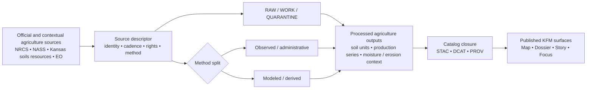

<!-- [KFM_META_BLOCK_V2]
doc_id: kfm://doc/NEEDS-VERIFICATION
title: Kansas Frontier Matrix — Agriculture Domain
type: standard
version: v1
status: draft
owners: NEEDS VERIFICATION
created: YYYY-MM-DD
updated: YYYY-MM-DD
policy_label: NEEDS VERIFICATION
related: [../README.md, ../../design/pasture-biomass/README.md, ../../data/pasture/README.md, ../../standards/governance/ROOT-GOVERNANCE.md, ../../standards/faircare/FAIRCARE-GUIDE.md, ../../standards/README.md]
tags: [kfm, agriculture, soils, erosion, land-cover, rural-production, agro-ecology]
notes: [Current-session verification was PDF-only; exact owner, UUID, dates, in-repo inventory, and agriculture-specific child paths remain NEEDS VERIFICATION.]
[/KFM_META_BLOCK_V2] -->

# Kansas Frontier Matrix — Agriculture Domain

Domain index and routing surface for KFM agriculture, soils, erosion, land cover, and rural production work in Kansas.

> [!NOTE]
> **Status:** experimental  
> **Owners:** NEEDS VERIFICATION  
>      
> **Quick jumps:** [Scope](#scope) · [Repo fit](#repo-fit) · [Accepted inputs](#accepted-inputs) · [Exclusions](#exclusions) · [Current verified snapshot](#current-verified-snapshot) · [Domain scope & routing](#domain-scope--routing) · [Source families](#source-families--publication-burdens) · [Directory tree](#directory-tree) · [Quickstart](#quickstart) · [Diagram](#diagram) · [Validation & governance](#validation-faircare--governance) · [Definition of done](#task-list--definition-of-done) · [FAQ](#faq)  
> **Repo fit:** `docs/domains/agriculture/README.md` → upstream: [`../README.md`](../README.md) · adjacent: [`../../design/pasture-biomass/README.md`](../../design/pasture-biomass/README.md), [`../../data/pasture/README.md`](../../data/pasture/README.md) · standards: [`../../standards/governance/ROOT-GOVERNANCE.md`](../../standards/governance/ROOT-GOVERNANCE.md), [`../../standards/faircare/FAIRCARE-GUIDE.md`](../../standards/faircare/FAIRCARE-GUIDE.md), [`../../standards/README.md`](../../standards/README.md)

> [!IMPORTANT]
> Agriculture is a **structural Kansas operating lane** in KFM, not a catch-all notebook for anything rural. Keep soil survey units, annual production series, moisture context, erosion exposure, land-cover products, and agro-ecology design work separated enough that **provenance, method, support, and release state remain inspectable**.

> [!WARNING]
> Current-session workspace verification was **PDF-only**. This draft is grounded in attached KFM doctrine and project-visible adjacent docs, but exact in-repo owners, child inventories under `docs/domains/agriculture/`, agriculture-specific analyses, pipelines, schemas, and workflow wiring remain **NEEDS VERIFICATION**.

## Scope

The agriculture lane covers KFM work whose dominant truth object is **agricultural production, soil behavior, rural landscape change, or agro-ecology context**. In current project doctrine, that lane includes **soils, cropping systems, erosion exposure, irrigation, land cover, and agricultural context**.

This README should function as the lane’s **routing surface**:

- it explains what belongs here,
- it points maintainers toward adjacent domain, design, data, and standards docs,
- it preserves the lane’s publication burdens,
- and it keeps unverified implementation depth visible rather than smoothing it into confident prose.

This lane should stay especially disciplined about:

- observed versus modeled distinctions,
- soil unit identity and joins,
- temporal support for annual and seasonal products,
- statewide completeness claims,
- and public-safe interpretation of rural and environmental context.

## Repo fit

| Path | Role | Relationship |
| --- | --- | --- |
| `docs/domains/README.md` | domains subtree index | upstream routing surface for domain lanes |
| `docs/domains/agriculture/README.md` | this file | agriculture lane entry point |
| `docs/design/pasture-biomass/README.md` | adjacent design pack | route image-based pasture biomass model design, specs, and evaluation details here |
| `docs/data/pasture/README.md` | adjacent data index | route pasture data inventory and dataset-facing bundle notes here |
| `docs/standards/governance/ROOT-GOVERNANCE.md` | governing doctrine | root decision, audit, and publication rules |
| `docs/standards/faircare/FAIRCARE-GUIDE.md` | ethics / stewardship guidance | FAIR+CARE posture for data and publication |
| `docs/standards/README.md` | standards hub | subtree entry point for broader standards context |
| `docs/analyses/agriculture/README.md` | NEEDS VERIFICATION | likely analysis lane if agriculture analyses already exist |
| `src/pipelines/agriculture/` | NEEDS VERIFICATION | likely implementation subtree if agriculture ETL has a dedicated package |
| `data/agriculture/` | NEEDS VERIFICATION | likely data-facing subtree if agriculture assets are already separated in-tree |

## Accepted inputs

Place material here when it primarily defines, routes, or constrains the **agriculture lane itself**, including:

- soil survey and soil-property references for Kansas agriculture,
- source-family notes for SSURGO, SDA, gSSURGO, gNATSGO, NASS, CDL, and comparable lane sources,
- lane-level guidance for erosion, land cover, irrigation, soil moisture, and rural production context,
- routing notes that connect agriculture docs to STAC, DCAT, PROV, Story Nodes, Focus Mode, and adjacent design packs,
- publication-burden notes about support, uncertainty, rights, provenance, and method tags,
- KFM-specific crosswalks that explain where specialized agriculture work should live.

## Exclusions

Do **not** place the following here:

- detailed pasture biomass model recipes, preprocessing specs, or evaluation packs → [`../../design/pasture-biomass/README.md`](../../design/pasture-biomass/README.md)
- dataset-by-dataset pasture inventory pages → [`../../data/pasture/README.md`](../../data/pasture/README.md)
- watershed- or regulatory-water dominated workflows such as water-quality submission mechanics → route to the hydrology lane
- raw implementation code, notebooks, or pipeline internals → keep in `src/` or the implementation-owning subtree
- unsupported claims of statewide completeness for erosion, moisture, or vegetation-change coverage
- silent blending of observed, administrative, modeled, and derived layers
- rights-unclear or sensitivity-bearing material presented as publication-ready without explicit review posture

## Status vocabulary used in this lane

| Label | Use here |
| --- | --- |
| **CONFIRMED** | Directly supported by the attached KFM corpus or clearly project-visible adjacent docs in the current session |
| **INFERRED** | Conservative structural completion that fits KFM doctrine but is not directly mounted as repo fact |
| **PROPOSED** | Recommended lane shape, file shape, or next step consistent with doctrine |
| **UNKNOWN** | Not verified strongly enough in the current session |
| **NEEDS VERIFICATION** | A review flag for owners, paths, inventory, implementation depth, or workflow behavior |

## Current verified snapshot

| Item | Verified state | Notes |
| --- | --- | --- |
| Agriculture is a structural KFM operating lane | **CONFIRMED** | Central doctrine names agriculture, soils, erosion, land cover, and rural production as a lane with its own publication burden |
| `docs/design/pasture-biomass/README.md` | **CONFIRMED** | Adjacent agriculture-facing design pack is project-visible in the corpus |
| `docs/data/pasture/README.md` | **CONFIRMED** | Adjacent pasture data index path is referenced in the design-pack footer |
| `docs/domains/hydrology/README.md` | **CONFIRMED** | Neighboring domain-index pattern is project-visible and useful as a structural exemplar |
| `docs/domains/agriculture/README.md` | **NEEDS VERIFICATION** | This target path is the requested output, but no mounted copy was directly inspected in the current session |
| `docs/analyses/agriculture/**` | **NEEDS VERIFICATION** | Plausible lane shape, not directly surfaced |
| `src/pipelines/agriculture/**` | **NEEDS VERIFICATION** | Plausible implementation shape, not directly surfaced |
| Lane owners for this README | **NEEDS VERIFICATION** | Adjacent design-pack evidence mentions a Data & Agronomy Working Group, but ownership for this file is not directly confirmed |

## Domain scope & routing

### 1. Soils and survey units

This sublane covers soil identity, soil properties, and survey-backed agricultural context.

Typical materials:

- SSURGO mapunits and components,
- Soil Data Access query patterns,
- gSSURGO and gNATSGO routing notes,
- Kansas soil-resource crosswalks,
- soil-health and survey-update notes.

Core discipline:

- preserve `mukey` / `cokey` joins,
- keep direct survey/tabular lineage visible,
- do not collapse soil units into generic land-cover summaries.

### 2. Crop production and rural statistics

This sublane covers agricultural production context expressed through stable annual or county-level series.

Typical materials:

- NASS QuickStats references,
- CDL / cropland layer routing notes,
- county-year production crosswalks,
- release-cadence notes for annual agricultural statistics.

Core discipline:

- keep statistical aggregates distinct from field- or parcel-scale interpretations,
- state temporal grain explicitly,
- avoid implying direct field truth where the product is regional or annual.

### 3. Moisture, irrigation, and erosion context

This sublane covers agricultural environmental context that materially affects land use, production, or land condition.

Typical materials:

- soil-moisture context references,
- irrigation or rural water-use context where agriculture is the dominant interpretation frame,
- erosion exposure notes,
- staged vegetation-change or degradation indicators.

Core discipline:

- mark observed, modeled, and derived layers explicitly,
- keep partial coverage visible,
- do not imply statewide completeness where evidence says staged growth or limited coverage.

### 4. Pasture and agro-ecology

This sublane is agriculture-facing but already has at least one specialized adjacent design pack.

Route the following outward when appropriate:

- image-based pasture biomass model design,
- quadrat semantics,
- model metrics and evaluation,
- STAC/DCAT/PROV examples specific to pasture biomass.

Keep this README focused on **lane routing and burden**, not on becoming a second model-design manual.

### 5. Stories, Focus Mode, and public interpretation

Agriculture can appear in Story Nodes and Focus Mode, but public-facing interpretation must remain evidence-led.

For consequential outward use, agriculture material should preserve:

- source family and method tags,
- visible dates and support,
- observed versus modeled distinctions,
- release linkage,
- correction visibility where applicable.

### Routing rule for mixed agriculture–water material

When the dominant truth object is:

- **production, soils, land cover, or agro-ecology context** → keep it in agriculture,
- **watershed state, water-quality governance, or hydrologic regulatory submission** → route it to hydrology,
- **specialized image-based pasture biomass model design** → route it to the pasture biomass design pack,
- **dataset-facing pasture inventory / bundles** → route it to the pasture data lane.

## Source families & publication burdens

### First-wave source families

| Source family | Typical contribution | Lane status | Key handling rule |
| --- | --- | --- | --- |
| **USDA NRCS — SSURGO / SDA / gSSURGO / gNATSGO** | detailed soil units, mapunit/component records, statewide gridded soil backbones | **CONFIRMED** | preserve `mukey` / `cokey`, canonical query logic, and release provenance |
| **USDA NASS — QuickStats / CDL** | county-year agricultural statistics and annual cropland / land-cover context | **CONFIRMED** | keep annual statistical products distinct from soil units and field-scale claims |
| **Kansas soils resources / conservation context** | local agronomy, soil-health, conservation, and soil-context signals | **CONFIRMED** | retain source identity, rights posture, and update cadence rather than flattening into generic context |
| **Mesonet / SCAN / SMAP moisture context** | time-varying moisture context for agricultural interpretation | **CONFIRMED** | useful context; not a substitute for soil survey identity or field-specific truth |
| **EO and derived erosion / vegetation products** | explanatory land-condition and staged change signals | **PROPOSED / STAGED** | keep modeled / derived status visible and do not imply statewide baseline completeness |

### Lane-specific publication burdens

| Burden | Why it matters |
| --- | --- |
| **Observed vs modeled must stay distinct** | The lane explicitly warns against blending observed, administrative, and derived products into one flattened truth surface |
| **Groundwater, erosion, and soil-moisture gaps remain active priorities** | Missing-data pressure is part of the lane, not a minor footnote |
| **Join integrity matters** | Soil products become misleading quickly if `mukey` / `cokey` or component relationships are dropped |
| **Release provenance must stay visible** | Agricultural outputs should carry source versioning, cadence, and release-linked metadata rather than generic summary labels |
| **Support and grain must be explicit** | County-year production series, annual cropland maps, soil units, and moisture context do not operate at the same support |
| **Rights and sensitivity still apply** | Even public agricultural context can intersect sovereignty, exact-location, or reuse constraints |

## Directory tree

```text
docs/
├── domains/
│   ├── README.md                              # project-visible domains index
│   └── agriculture/
│       └── README.md                          # this file
├── design/
│   └── pasture-biomass/
│       └── README.md                          # confirmed adjacent design pack
├── data/
│   └── pasture/
│       └── README.md                          # confirmed adjacent data index
└── standards/
    ├── README.md                              # standards hub
    ├── faircare/
    │   └── FAIRCARE-GUIDE.md
    └── governance/
        └── ROOT-GOVERNANCE.md

# Lane-shaped expansion paths below remain NEEDS VERIFICATION:
# - docs/domains/agriculture/references/
# - docs/analyses/agriculture/
# - src/pipelines/agriculture/
# - data/agriculture/
```

## Quickstart

### Add a new agriculture leaf

1. Start with the **dominant truth object**. Decide whether the page is mainly about soils, production, erosion, moisture context, land cover, or agro-ecology routing.
2. Name the **source family** up front. Do not make readers infer whether the page is NRCS-, NASS-, EO-, or context-led.
3. State the **support / grain** explicitly. County-year, annual raster, component-level soil record, and modeled moisture context are not interchangeable.
4. Mark **observed / statutory / modeled / derived** status visibly.
5. If the page becomes model-design heavy, route it to the pasture biomass design pack or the implementation-owning subtree.

Use this starter shape:

```md
# Agriculture Leaf Title

One-line purpose for this leaf.

## What this page covers
- **CONFIRMED:**
- **INFERRED:**
- **PROPOSED:**
- **NEEDS VERIFICATION:**

## Source family
- NRCS / NASS / Kansas soils resources / EO / other

## Publication burden
- support / grain:
- observed vs modeled:
- rights / sensitivity:
- release / correction notes:

## Routing
- Parent lane: `docs/domains/agriculture/README.md`
- Specialized design or data lane:
- Related standards / governance docs:
```

### Route pasture biomass correctly

Use the agriculture lane for **routing and burden**. Use the pasture biomass design pack for:

- image-based quadrat semantics,
- preprocessing and model profiles,
- evaluation metrics,
- design-time STAC/DCAT/PROV examples.

## Diagram



## Validation, FAIR+CARE & governance

Agriculture material in KFM should be reviewed against the same evidence-first posture as other lanes.

Minimum expectations:

- source onboarding behaves like a contract, not a blind download,
- stable identifiers and joins are preserved where the source family depends on them,
- release provenance is attached before trust is implied downstream,
- modeled and derived layers stay visibly tagged,
- public interpretation does not outrun support, grain, or rights posture,
- sensitivity and sovereignty handling remain visible where exact location or culturally significant land context could matter.

Adjacent evidence suggests a `KFM Data & Agronomy Working Group` exists for pasture-biomass design work, but **ownership of this domain README remains NEEDS VERIFICATION**.

## Task list — definition of done

- [ ] Lane purpose is stated in Kansas-first terms
- [ ] Repo fit includes upstream, adjacent, and standards links
- [ ] Accepted inputs and exclusions are explicit
- [ ] Observed vs modeled distinction is visible
- [ ] Source families table includes agricultural handling rules
- [ ] Publication burdens are written in lane-specific terms
- [ ] Directory tree keeps confirmed items separate from unverified placeholders
- [ ] Quickstart gives maintainers a repeatable leaf pattern
- [ ] At least one Mermaid diagram is present
- [ ] Long-form source register and verification backlog are tucked into `<details>`
- [ ] No unverified implementation depth is presented as settled repo fact

## FAQ

### Is this lane only about crop maps?

No. The lane covers soils, cropping systems, erosion exposure, irrigation context, land cover, and rural production. Crop maps are only one source family within that broader agriculture frame.

### Should pasture biomass live here?

Use this README as the routing and burden surface. Keep image-based pasture biomass model design in [`../../design/pasture-biomass/README.md`](../../design/pasture-biomass/README.md).

### Can annual land-cover layers stand in for soil truth?

No. Annual cropland or land-cover products can be important context, but they do not replace soil-unit identity, component relationships, or direct soil-property lineage.

### What should happen when a page mixes agriculture and hydrology?

Route by dominant truth object. Agricultural production and soil context belong here; watershed and regulatory water workflows belong in hydrology.

## Appendix

<details>
<summary><strong>First-wave agriculture source register</strong></summary>

| Family | Typical examples | Why it matters | Caution |
| --- | --- | --- | --- |
| Soil survey backbone | SSURGO, SDA, gSSURGO, gNATSGO | Gives the lane its most stable soil identity surfaces | Preserve joins, release metadata, and query provenance |
| Agricultural production | QuickStats, county-year production series | Provides durable rural production context | Do not overread aggregate stats as field truth |
| Annual land-cover / cropland | CDL and similar annual raster products | Useful for crop/land-use change framing | Annual raster change is not the same as soil or parcel change |
| Moisture context | Mesonet, SCAN, SMAP | Adds time-aware agricultural condition context | Often contextual, derived, or multi-scale rather than direct local truth |
| Erosion / vegetation stress context | EO products, staged erosion products | Helps surface landscape pressure and change | Coverage and method can vary; avoid blanket statewide completeness claims |

</details>

<details>
<summary><strong>Open verification backlog</strong></summary>

The following items should be checked against the mounted repository before this README is treated as published:

1. Whether `docs/domains/agriculture/README.md` already exists and, if so, what strong content should be preserved.
2. Exact owners for the agriculture lane.
3. Whether agriculture already has:
   - `docs/domains/agriculture/references/`
   - `docs/analyses/agriculture/`
   - `src/pipelines/agriculture/`
   - `data/agriculture/`
4. Which sovereignty-policy file name is canonical in the current repo.
5. Whether lane-specific schemas, fixtures, or CI checks already exist and should be linked here.
6. Whether a `docs/domains/README.md` domains index is still the current upstream path.

</details>

[Back to top](#kansas-frontier-matrix--agriculture-domain)
