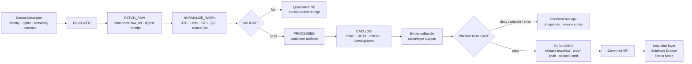

<!-- [KFM_META_BLOCK_V2]
doc_id: kfm://doc/TODO-register-agriculture-readme
title: Agriculture Domain
type: standard
version: v1
status: draft
owners: TODO-agriculture-domain-steward
created: 2026-04-22
updated: 2026-04-22
policy_label: TODO-policy-label
related: [TODO-verify-docs-domains-index, TODO-verify-agriculture-schema-home, TODO-verify-source-registry]
tags: [kfm, agriculture, domain-readme, evidence-first, map-first, time-aware]
notes: [Created from attached KFM agriculture and pipeline doctrine; repo checkout was not mounted during authoring; replace TODO values after repository verification.]
[/KFM_META_BLOCK_V2] -->

<a id="top"></a>

# Agriculture Domain

*Purpose: orient the KFM agriculture lane as a governed, source-role-preserving, evidence-first domain for Kansas agricultural context and public-safe claims.*

> [!IMPORTANT]
> **Impact block**
>
> **Status:** experimental · **Owners:** TODO-agriculture-domain-steward · **Path:** `docs/domains/agriculture/README.md` · **Policy label:** TODO-policy-label
>
> 
> 
> 
> 
>
> **Quick jumps:** [Scope](#scope) · [Repo fit](#repo-fit) · [Accepted inputs](#accepted-inputs) · [Exclusions](#exclusions) · [Directory tree](#directory-tree) · [Source-role guardrails](#source-role-guardrails) · [Lifecycle](#lifecycle) · [Quickstart](#quickstart) · [Definition of done](#definition-of-done) · [FAQ](#faq)

> [!NOTE]
> **Authoring boundary — CONFIRMED:** this README was prepared from the attached KFM corpus and workspace inspection. A mounted KFM Git checkout was not visible during authoring, so actual owners, package manager, schema home, CI workflow names, app paths, route names, and emitted proof objects remain **NEEDS VERIFICATION**.

---

## Scope

The Agriculture domain covers Kansas-centered agricultural evidence and context where public-facing statements must remain traceable to source role, spatial support, temporal support, policy posture, review state, release state, and correction lineage.

This README is the human landing page for the lane. It explains how agriculture sources, documents, schemas, validators, policies, fixtures, catalog objects, MapLibre layers, Evidence Drawer payloads, and Focus Mode responses should fit together without turning derived products into root truth.

### What this lane is responsible for

| Area | Responsibility | Truth posture |
|---|---|---|
| Soil and site context | Coordinate with the Soil lane for SSURGO/SDA/gSSURGO-derived context, preserving MUKEY and source provenance. | **PROPOSED / NEEDS VERIFICATION** |
| Soil moisture observations | Model station, depth, variable, timestamp, unit, QC, freshness, and source identity explicitly. | **PROPOSED** |
| Crop progress and agricultural statistics | Admit NASS-style aggregate statistics as aggregate official context, not parcel or field truth. | **PROPOSED** |
| Satellite and gridded products | Treat SMAP, HLS, HLS-VI, vegetation indices, and stress surfaces as grid/remote-sensing/derived context with masks, product versions, and time windows. | **PROPOSED** |
| Public layers and claims | Publish only through governed manifests, EvidenceBundle resolution, policy checks, catalog closure, and rollback references. | **PROPOSED** |
| Review and correction | Preserve release, supersession, rollback, and correction lineage instead of overwriting history. | **PROPOSED** |

### What this lane must not become

Agriculture must not become a general farm-management database, a private operator data store, a crop-insurance adjudication surface, a pesticide-record publication lane, or a source-scraping convenience layer. Unknown rights, unclear sensitivity, unsupported precision, missing source roles, or missing EvidenceBundle support fail closed.

[Back to top](#top)

---

## Repo fit

The target file is a README-like directory document. Because the repository tree was not mounted during authoring, path relationships below are recorded as **link candidates** rather than clickable links. Convert them to relative Markdown links only after the files exist in the real checkout.

| Relationship | Candidate path from repo root | Status | Handling |
|---|---|---:|---|
| Current document | `docs/domains/agriculture/README.md` | **CONFIRMED target** | This file. |
| Domain index | `docs/domains/README.md` | **NEEDS VERIFICATION** | Link after repo inspection. |
| Documentation landing | `docs/README.md` | **NEEDS VERIFICATION** | Upstream entry point when verified. |
| Adjacent domain: soil | `docs/domains/soil/README.md` | **NEEDS VERIFICATION** | Agriculture must not duplicate soil authority. |
| Adjacent domain: hydrology | `docs/domains/hydrology/README.md` | **NEEDS VERIFICATION** | Useful for water/irrigation context, not a replacement. |
| Adjacent domain: atmosphere/air | `docs/domains/atmosphere/README.md` | **NEEDS VERIFICATION** | Weather, climate, smoke, and EO context must keep knowledge-character labels. |
| Source descriptors | `data/registry/agriculture/` | **PROPOSED** | Source activation starts here after rights and steward review. |
| Machine contracts | `schemas/contracts/v1/agriculture/` or `contracts/agriculture/` | **CONFLICTED / NEEDS VERIFICATION** | Resolve with ADR before landing schemas. |
| Policy | `policy/agriculture/` | **PROPOSED** | Deny/allow rules for rights, sensitivity, source role, promotion, and public precision. |
| Fixtures and tests | `tests/agriculture/` or repo-native equivalent | **PROPOSED** | No-network valid/invalid fixtures first. |
| Pipelines/watchers | `pipelines/agriculture/` or repo-native equivalent | **PROPOSED** | Live fetch disabled until source approvals pass. |
| Public API/UI | repo-native `apps/*` / `ui/*` | **UNKNOWN** | Bind only after actual framework and route conventions are verified. |

> [!WARNING]
> Do not create parallel schema homes. If both `contracts/` and `schemas/` exist in the mounted repo, decide the canonical home through an ADR and leave aliases or migration notes instead of maintaining divergent definitions.

[Back to top](#top)

---

## Accepted inputs

This directory accepts documentation that helps maintainers understand, review, validate, and evolve the Agriculture lane.

| Accepted here | Examples | Gate |
|---|---|---|
| Domain orientation | Scope, source-role rules, anti-collapse rules, release posture. | Must preserve KFM truth labels. |
| Source admission notes | Source identity, steward, rights, cadence, stable keys, sensitivity, source role. | Must not activate live source by prose alone. |
| Validation expectations | Negative fixtures, fail-closed behaviors, no-raw-public checks. | Must be testable or clearly marked **PROPOSED**. |
| API/UI trust contracts | Evidence Drawer payload expectations, Focus outcomes, layer manifest duties. | Must remain downstream of published evidence. |
| Release and rollback guidance | Promotion gates, release manifests, proof packs, rollback cards, correction notes. | Must not delete lineage. |
| Open verification backlog | Source terms, toolchain, CODEOWNERS, schema home, app paths. | Must stay visible until resolved. |

[Back to top](#top)

---

## Exclusions

| Does not belong here | Where it goes instead | Why |
|---|---|---|
| RAW source payloads | `data/raw/agriculture/` or repo-native lifecycle storage — **NEEDS VERIFICATION** | RAW is immutable evidence input, not documentation. |
| WORK or QUARANTINE artifacts | `data/work/agriculture/`, `data/quarantine/agriculture/` — **NEEDS VERIFICATION** | Candidate and failed artifacts must not become public docs. |
| Machine schemas as active authority | `schemas/contracts/v1/agriculture/` or `contracts/agriculture/` after ADR | README prose cannot be executable validation. |
| Policy-as-code | `policy/agriculture/` or repo-native policy tree | Policy must be testable and versioned separately. |
| Source connector code | `pipelines/agriculture/`, `packages/*`, or repo-native equivalent | This README documents behavior; it does not implement fetchers. |
| Private farm/operator/yield/pesticide records | Restricted future lane only after rights, sensitivity, and steward policy | Out of scope unless explicitly governed and denied by default. |
| Field-level crop claims from aggregate stats | Nowhere without direct field-level evidence and policy approval | NASS-style aggregate statistics do not prove field truth. |
| Public exact sensitive locations | Published only after policy-approved generalization/redaction | Precision is a policy consequence, not a renderer choice. |

[Back to top](#top)

---

## Directory tree

**PROPOSED directory shape** for this documentation lane. Create only the files that match actual repo conventions after Phase 0 inspection.

```text
docs/domains/agriculture/
├── README.md                         # this file
├── STATE_OF_LANE.md                  # NEEDS VERIFICATION: current repo/lane status
├── FILE_INDEX.md                     # PROPOSED: active docs, schemas, policies, tests, registries
├── SOURCE_COVERAGE_MATRIX.md         # PROPOSED: source-family coverage and activation state
├── SOURCE_REGISTRY.md                # PROPOSED: human-readable companion to source descriptor YAML/JSON
├── DATA_CONTRACTS.md                 # PROPOSED: schema/version summary and shared-object dependencies
├── VALIDATION_PLAN.md                # PROPOSED: validator, fixture, policy, and CI expectations
├── EVIDENCE_AND_PROVENANCE.md        # PROPOSED: EvidenceBundle, catalog, receipt, proof, release posture
├── PIPELINE_RUNBOOK.md               # PROPOSED: fixture-first watcher and rollback operation notes
├── CHANGELOG.md                      # PROPOSED: human-readable evolution log
├── SUPERSESSION_MAP.md               # PROPOSED: prior scaffold/report lineage and successor mapping
└── archive/
    └── README.md                     # PROPOSED: lineage and superseded report handling
```

**PROPOSED adjacent implementation surfaces**:

```text
data/registry/agriculture/             # source descriptors and activation state
schemas/contracts/v1/agriculture/      # machine-checkable schemas if ADR selects schemas/
contracts/agriculture/                 # semantic contracts or schema home if ADR selects contracts/
policy/agriculture/                    # rights, sensitivity, source-role, and promotion rules
tests/agriculture/                     # no-network fixtures, validators, policy cases
tools/validators/agriculture/          # validator CLIs or repo-native equivalents
pipelines/agriculture/                 # watcher/normalizer/catalog emitters after verification
```

[Back to top](#top)

---

## Source-role guardrails

Agriculture is a multi-source domain. The same map area can carry soil survey, station observation, satellite grid, aggregate crop statistic, and derived vegetation-index context at the same time. Those sources do not mean the same thing.

| Source family | Role boundary | Stable keys to preserve | Hard public rule |
|---|---|---|---|
| SSURGO / SDA | Authoritative vector/tabular soil survey and MUKEY-centered properties. | `mukey`, `cokey`, `chkey`, source table/version. | Do not replace vector/tabular provenance silently with a raster companion. |
| gSSURGO | Gridded companion useful for raster and large-area analysis. | grid cell, MUKEY/product version. | Label as gridded/derived companion; do not treat as independent soil authority. |
| Kansas Mesonet | Station observations for soil moisture/weather context. | station ID, variable, depth, timestamp. | Do not generalize station observations into field-level truth without a declared transform. |
| NRCS SCAN / NOAA USCRN | Station observation or corroborative reference network. | station ID, element/product, depth, timestamp. | Normalize units/time/depth and preserve source QC/status. |
| NASA SMAP | Satellite/grid soil moisture product context. | grid cell, product ID/version, time. | Public claims must say satellite/grid; not station, parcel, or operator truth. |
| NASA HLS / HLS-VI | Remote-sensing reflectance, vegetation-index, mask, and derived-change context. | STAC item, asset, time window, mask metadata. | Distinguish observed asset, masked index, and derived stress indicator. |
| USDA NASS QuickStats / Crop Progress | Official aggregate statistics and crop/phenology context. | commodity, geography, year/week, statistic, unit. | Never present as field-level or parcel-level truth. |
| Private/proprietary farm data | Restricted future source class only. | owner, authorization, consent, source agreement, sensitivity. | Out of scope until a restricted policy lane exists; never public by default. |
| PMTiles, search indexes, summaries, embeddings, dashboards | Rebuildable derived delivery products. | source release, spec hash, build receipt. | Useful for access and performance; never sovereign truth. |

### Anti-collapse rules

- **Aggregate is not field-level.** A county/week crop statistic cannot become a parcel or operator claim.
- **Station is not surface.** A station reading does not become a statewide layer without a declared interpolation/model transform.
- **Grid is not ground truth.** SMAP/HLS outputs are product-specific gridded or remote-sensing context.
- **Derived is not canonical.** PMTiles, search views, layer manifests, summaries, embeddings, and scenes are rebuildable artifacts.
- **Unknown rights fail closed.** Missing rights, terms, sensitivity, steward, or source-role fields block public release.
- **AI remains interpretive.** Focus Mode may synthesize released evidence, but generated language does not outrank EvidenceBundle support.

[Back to top](#top)

---

## Lifecycle

Agriculture follows the KFM truth path:

```text
SOURCE EDGE -> RAW -> WORK / QUARANTINE -> PROCESSED -> CATALOG / TRIPLET -> PUBLISHED
```

Promotion is a governed state transition, not a file move.



| Stage | Agriculture requirement | Failure behavior |
|---|---|---|
| DISCOVER | Source identity, owner/steward, rights, sensitivity, cadence, stable keys, and fetch window are recorded. | Disable or block source activation. |
| FETCH_RAW | Preserve raw payload digest and immutable RAW pointer; record ETag/Last-Modified when available. | Emit failure receipt; do not mutate raw. |
| NORMALIZE_WORK | Preserve source IDs, source timezone, QC flags, units, depth, CRS, and source-specific warnings. | Quarantine malformed candidate. |
| VALIDATE | Run schema, source-role, rights/sensitivity, duplicate, range, component-total, and catalog checks. | Fail closed with reason codes. |
| PROCESS / CATALOG | Emit catalog/provenance objects and EvidenceBundle candidates only from validated outputs. | Block catalog closure. |
| PUBLISH | Require evidence, rights, sensitivity, validation, catalog closure, proof, policy, review, and rollback readiness. | DecisionEnvelope records DENY / ABSTAIN / ERROR. |

[Back to top](#top)

---

## Quickstart

Run this read-only inspection first after mounting the real repository.

```bash
# Phase 0 — read-only repo and lane inventory
pwd
git status --short
git branch --show-current || true

find docs/domains/agriculture -maxdepth 3 -type f 2>/dev/null | sort || true

find docs contracts schemas policy tools tests apps packages pipelines data .github \
  -maxdepth 4 -type f 2>/dev/null \
  | grep -Ei 'agriculture|agri|crop|nass|mesonet|ssurgo|sda|soil_moisture|smap|hls|EvidenceBundle|DecisionEnvelope|PromotionDecision|ReleaseManifest|CatalogMatrix|SourceDescriptor' \
  | sort \
  | head -300 || true
```

Use the result to fill `STATE_OF_LANE.md` before creating new implementation files.

### Placeholder validation commands

These commands are **NEEDS VERIFICATION** because the mounted repo’s package manager, test runner, and policy tooling were not available during authoring.

```bash
# NEEDS VERIFICATION — replace with repo-native equivalents after Phase 0.
python -m pytest tests/agriculture -q

python tools/validators/agriculture/validate_source_registry.py \
  data/registry/agriculture/sources.yaml

python tools/validators/agriculture/validate_manifest.py \
  tests/agriculture/fixtures/agriculture_dataset_manifest_sample.json

python tools/validators/agriculture/validate_catalog_closure.py \
  tests/agriculture/fixtures/catalog_matrix_pass.json

# Only after OPA/Conftest is installed and pinned.
conftest test tests/agriculture/fixtures/policy_cases -p policy/agriculture
opa test policy/agriculture
```

[Back to top](#top)

---

## Usage

### Add a new agriculture source

1. Create or update a SourceDescriptor in the repo-native source registry.
2. Record source identity, official URL/acquisition path, steward, rights/terms, sensitivity, cadence, stable keys, temporal basis, spatial basis, and intended publication class.
3. Add at least one valid fixture and one invalid fixture before any live fetch.
4. Add or update the source-role validator.
5. Add policy cases for missing rights, missing sensitivity, disabled source state, and source-role misuse.
6. Add catalog/provenance expectations and EvidenceBundle resolution.
7. Keep live source activation disabled until source terms, cadence, and automation permissions are verified.

### Promote an agriculture-derived layer

1. Confirm no public layer manifest references RAW, WORK, QUARANTINE, internal receipts, or canonical-only stores.
2. Confirm the layer manifest has source role, knowledge character, freshness, policy label, catalog refs, evidence refs, release ref, and rollback ref.
3. Confirm STAC/DCAT/PROV/CatalogMatrix/release digest closure.
4. Confirm the Evidence Drawer payload opens from the layer and resolves its EvidenceBundle.
5. Confirm Focus Mode answers only from released evidence and emits ANSWER / ABSTAIN / DENY / ERROR with reason codes.
6. Exercise rollback by repointing the current alias to a prior release manifest and emitting a rollback receipt/proof.

[Back to top](#top)

---

## Contract surfaces to verify

| Object family | Agriculture use | Status |
|---|---|---:|
| `SourceDescriptor` | Source identity, role, rights, cadence, sensitivity, steward, stable keys. | **PROPOSED / shared dependency** |
| `EvidenceBundle` | Support package for a public claim, layer, Focus answer, or export. | **PROPOSED / shared dependency** |
| `DecisionEnvelope` / `PromotionDecision` | Finite allow/deny/abstain/error state for governed transitions. | **PROPOSED / shared dependency** |
| `ReleaseManifest` | Published release identity, digests, catalog refs, proof refs, rollback target. | **PROPOSED / shared dependency** |
| `CatalogMatrix` | Closure across STAC, DCAT, PROV, release manifest, and digest identity. | **PROPOSED / shared dependency** |
| `agriculture_source` | Agriculture-specific source profile if shared SourceDescriptor is insufficient. | **PROPOSED** |
| `soil_moisture_station` | Station metadata, provider, location support, depths, variables, status. | **PROPOSED** |
| `soil_moisture_reading` | Normalized reading with station, variable, depth, value, UTC timestamp, QC, hashes. | **PROPOSED** |
| `ssurgo_mukey_properties` | MUKEY-level properties and aggregate provenance. | **PROPOSED** |
| `crop_progress_observation` | NASS-style statistic by commodity, geography, week/year, statistic, unit. | **PROPOSED** |
| `vegetation_index_observation` | HLS/NDVI/VI observation or derived change with STAC asset refs and masks. | **PROPOSED** |
| `agriculture_layer_manifest` | Public layer source role, catalog refs, evidence refs, freshness, policy, style, rollback. | **PROPOSED** |

[Back to top](#top)

---

## Definition of done

A first useful Agriculture PR is done only when it reduces uncertainty without pretending that unverified implementation exists.

- [ ] `STATE_OF_LANE.md` records the mounted repo findings: branch, package manager, schema home, test runner, policy tools, app paths, existing agriculture files, and open gaps.
- [ ] Schema-home ADR resolves `contracts/agriculture` versus `schemas/contracts/v1/agriculture`.
- [ ] Source descriptors include owner/steward, source role, rights/terms, sensitivity, cadence, stable keys, spatial basis, temporal basis, and activation state.
- [ ] Valid and invalid fixtures exist before live source activation.
- [ ] Negative fixtures fail closed for missing rights, missing sensitivity, missing source role, aggregate-as-field truth, station-as-field truth, grid-as-ground truth, and public RAW/WORK references.
- [ ] Validators emit reason-coded outcomes and do not call live sources in PR CI.
- [ ] Public API/UI contract tests prove normal clients consume governed APIs and published artifacts only.
- [ ] Evidence Drawer payloads include EvidenceBundle ref, source role, knowledge character, freshness, review/release state, policy label, and correction/rollback linkage.
- [ ] Focus Mode payloads use finite outcomes: ANSWER, ABSTAIN, DENY, ERROR.
- [ ] Catalog closure ties STAC, DCAT, PROV, release manifest, digest identity, proof pack, and rollback card.
- [ ] Rollback procedure is exercised on a fixture release.
- [ ] Owners, CODEOWNERS, policy label, source terms, and external endpoint behavior are verified before any public release.

[Back to top](#top)

---

## FAQ

### Can NASS QuickStats or Crop Progress prove a field-level crop condition?

No. Treat those as aggregate official statistics. They may support state, county, commodity, week/year, and statistic context, but they do not establish parcel, operator, or field-level truth.

### Can SMAP or HLS/HLS-VI produce agriculture stress layers?

Yes, as **derived context** after product version, masks, time window, spatial support, source role, and catalog/provenance are explicit. A stress indicator is not a direct field observation unless evidence and policy say so.

### Should Agriculture own SSURGO?

Not silently. Agriculture may consume soil context, but soil survey authority and MUKEY semantics should stay aligned with the Soil lane. The Agriculture lane should document how it uses soil-derived context rather than becoming the canonical soil source.

### Can Focus Mode answer agriculture questions?

Only from released, policy-safe evidence. It must show scope, freshness, policy, evidence, and finite outcome state. It must abstain or deny when support is weak, restricted, stale, or outside scope.

### What is the safest first slice?

A fixture-only slice: one source descriptor set, one SSURGO/SDA sample, one station soil-moisture sample, one NASS aggregate sample, validators, invalid fixtures, catalog candidate, EvidenceBundle candidate, PromotionDecision, and rollback card. No live fetch and no public promotion until source terms and repo gates are verified.

[Back to top](#top)

---

## Open verification backlog

| Item | Status | Why it matters |
|---|---:|---|
| Actual repo branch, dirty state, package manager, language/test stack, and build commands | **UNKNOWN** | Determines runnable validation commands. |
| Canonical schema home | **CONFLICTED / NEEDS VERIFICATION** | Prevents duplicate schema authority. |
| Existing shared `EvidenceBundle`, `DecisionEnvelope`, `ReleaseManifest`, `CatalogMatrix`, `SourceDescriptor`, `PromotionDecision` schemas | **UNKNOWN** | Agriculture should extend shared contracts, not fork them unnecessarily. |
| OPA/Rego, Conftest, Cosign/Sigstore, proof-pack implementation | **UNKNOWN** | Determines policy and release-hardening enforcement. |
| MapLibre layer registry, Evidence Drawer adapter, Focus Mode schema, governed API route conventions | **UNKNOWN** | Determines UI/API binding paths. |
| SSURGO/SDA/gSSURGO endpoints, terms, release metadata, query limits | **NEEDS VERIFICATION** | Blocks live automation. |
| Kansas Mesonet Data Usage Policy, variable names, station roster, cadence, retention, automation permission | **NEEDS VERIFICATION** | Blocks live station watcher. |
| NASS QuickStats API key/terms and Crop Progress mapping | **NEEDS VERIFICATION** | Blocks live aggregate-stat watcher. |
| SCAN, USCRN, SMAP, HLS/HLS-VI product schemas, auth, cadence, support, licenses | **NEEDS VERIFICATION** | Blocks live satellite/station expansion. |
| CODEOWNERS and steward identities | **NEEDS VERIFICATION** | Blocks policy-significant releases. |

[Back to top](#top)

---

<details>
<summary>Appendix A — Negative fixture targets</summary>

| Fixture target | Expected outcome |
|---|---|
| Missing `rights` on source descriptor | DENY source activation. |
| Missing `sensitivity_class` | DENY source activation. |
| `NASS` aggregate used as parcel/field truth | DENY public claim. |
| Station observation rendered as field-level truth without declared transform | DENY or QUARANTINE. |
| SMAP grid cell described as station reading | DENY public claim. |
| HLS vegetation index without mask/time-window metadata | ABSTAIN or QUARANTINE. |
| Layer manifest referencing RAW, WORK, QUARANTINE, or internal receipt path | FAIL no-raw-public test. |
| Catalog matrix with mismatched STAC/DCAT/PROV/release digests | DENY promotion. |
| Receipt claiming proof authority | FAIL receipt validator. |
| Promotion without rollback target | DENY release. |

</details>

<details>
<summary>Appendix B — Suggested maintainer reading order</summary>

1. Read this README.
2. Fill `STATE_OF_LANE.md` from a real repo inspection.
3. Resolve schema-home ADR.
4. Create source descriptor fixtures before live sources.
5. Add negative fixtures and fail-closed policy tests.
6. Add no-network validators.
7. Emit a catalog candidate and EvidenceBundle candidate.
8. Bind layer manifest, Evidence Drawer, and Focus payload contracts.
9. Exercise promotion and rollback on fixtures.
10. Activate one live source only after rights, terms, cadence, and automation permissions are verified.

</details>