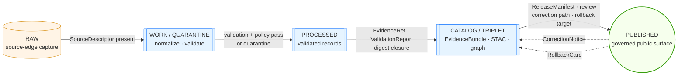

<!-- [KFM_META_BLOCK_V2]
doc_id: kfm://doc/domains/agriculture/release-index
title: Agriculture Release Index
type: standard
version: v1
status: draft
owners: NEEDS_VERIFICATION (agriculture-stewards, release-stewards)
created: 2026-05-15
updated: 2026-05-15
policy_label: public
related:
  - docs/domains/agriculture/README.md
  - docs/architecture/release-model.md
  - release/README.md
  - release/candidates/agriculture/README.md
  - data/published/layers/agriculture/README.md
  - control_plane/registers/DRIFT_REGISTER.md
  - docs/registers/VERIFICATION_BACKLOG.md
tags: [kfm, agriculture, release, manifest, publication, governance]
notes:
  - All path-shaped claims PROPOSED until verified against a mounted repository.
  - No agriculture release is asserted to exist; this is the doctrinal index template.
  - ReleaseManifest schema referenced from cross-cutting work; agriculture-specific
    profile NEEDS VERIFICATION.
[/KFM_META_BLOCK_V2] -->

# 🌾 Agriculture — Release Index

> The governed index of release decisions, published artifacts, and rollback targets
> for the **Agriculture** domain of the Kansas Frontier Matrix (KFM).

<!-- Badge row -->
[](#)
[](./README.md)
[](#-publication-gates)
[](#-lifecycle-and-promotion)
[](#-release-manifest-index)
[](#)
[](#-open-questions--verification-backlog)

**Status:** `draft` · **Owners:** `agriculture-stewards`, `release-stewards` *(NEEDS VERIFICATION)* · **Last reviewed:** 2026-05-15

---

## 📑 Contents

- [What this document is](#-what-this-document-is)
- [Scope](#-scope)
- [Repo fit](#-repo-fit)
- [Inputs (what this index points to)](#-inputs-what-this-index-points-to)
- [Exclusions (what this index does NOT own)](#-exclusions-what-this-index-does-not-own)
- [Proposed directory tree](#-proposed-directory-tree)
- [Lifecycle and promotion](#-lifecycle-and-promotion)
- [The release-decision lattice](#-the-release-decision-lattice)
- [Publication gates](#-publication-gates)
- [Release manifest index](#-release-manifest-index)
- [Published-layer index](#-published-layer-index)
- [Correction, withdrawal, and rollback registers](#-correction-withdrawal-and-rollback-registers)
- [Cross-lane release dependencies](#-cross-lane-release-dependencies)
- [Sensitivity and rights posture](#-sensitivity-and-rights-posture)
- [Governed AI behavior at release surfaces](#-governed-ai-behavior-at-release-surfaces)
- [Validators, tests, fixtures](#-validators-tests-fixtures)
- [Open questions / verification backlog](#-open-questions--verification-backlog)
- [FAQ](#-faq)
- [Related docs](#-related-docs)
- [Appendix](#-appendix)

---

## 🧭 What this document is

This file is the **human-readable index** for everything the Agriculture domain has
*decided* to release, plus everything it has *actually* published downstream. It is a
docs-layer artifact — it **explains and navigates**; it **does not decide**.

> [!IMPORTANT]
> Per Directory Rules §13.5, a `docs/` page is never the source of a canonical release
> decision. Canonical release decisions live under `release/`; canonical released
> artifacts live under `data/published/layers/agriculture/`. This index points to both
> and tells stewards how to read them together. *(CONFIRMED doctrine.)*

Two distinct authorities meet here and must not be conflated:

| Authority | Owns | Lives in |
|---|---|---|
| **Release decisions** | `ReleaseManifest`, `PromotionDecision`, `RollbackCard`, `CorrectionNotice`, signatures | `release/` *(CONFIRMED root)* |
| **Released artifacts** | Public-safe layers, PMTiles, county/HUC aggregates, evidence resolutions | `data/published/layers/agriculture/` *(CONFIRMED phase, PROPOSED segmentation)* |

Mixing them is one of the four canonical drift patterns (§13.2). *(CONFIRMED doctrine.)*

---

## 🎯 Scope

This index covers, for the Agriculture domain only:

- Every **`ReleaseManifest`** filed under `release/manifests/` whose `domain == "agriculture"`. *(PROPOSED filter; field name confirmed by cross-cutting manifest schema, agriculture-specific manifest profile NEEDS VERIFICATION.)*
- Every **`PromotionDecision`** (`ALLOW` / `RESTRICT` / `DENY` / `ABSTAIN`) that pointed at an agriculture candidate. *(PROPOSED.)*
- Every **`RollbackCard`** that names an agriculture release as its rollback target. *(PROPOSED.)*
- Every **`CorrectionNotice`** or **`WithdrawalNotice`** issued against a published agriculture layer. *(PROPOSED.)*
- Every **published agriculture artifact** (e.g., county/HUC crop-progress aggregates, public-safe CDL-derived layers, drought/pest stress indicator surfaces, conservation-practice context where source rights permit). *(CONFIRMED viewing-product families; specific named layers PROPOSED.)*

Object families this domain may carry through release are bounded by the canonical list:
**CropObservation**, **FieldCandidate**, **CropRotation**, **YieldObservation**, **IrrigationLink**, **ConservationPractice**, **SoilCropSuitability**, **AgriculturalEconomyObservation**, **SupplyChainNode**, **DroughtStressIndicator**, **PestStressIndicator**, **AggregationReceipt**. *(CONFIRMED object inventory; in-release realization PROPOSED.)*

---

## 🗂️ Repo fit

Domain Placement Law (Directory Rules §12) places this file as a **segment** under the `docs/` responsibility root — never as a domain root of its own. *(CONFIRMED placement rule.)*

```text
docs/domains/agriculture/RELEASE_INDEX.md   ← you are here
```

**Upstream (where decisions originate):**

- `release/candidates/agriculture/` — candidate dossiers awaiting promotion *(PROPOSED path; §12 + §9.2)*
- `release/manifests/` — ReleaseManifest by `release_id` *(CONFIRMED root layout, agriculture segmentation NEEDS VERIFICATION)*
- `release/promotion_decisions/` — `PromotionDecision` records *(CONFIRMED root layout)*
- `release/rollback_cards/` — rollback artifacts *(CONFIRMED root layout)*
- `release/correction_notices/` and `release/withdrawal_notices/` *(CONFIRMED root layout)*
- `release/signatures/` — DSSE / Sigstore artifacts *(CONFIRMED root layout)*

**Downstream (where consumers read):**

- `data/published/layers/agriculture/` — public-safe layers *(PROPOSED domain segmentation under §12)*
- `data/catalog/domain/agriculture/` — catalog records and EvidenceBundle entry points *(PROPOSED domain segmentation under §12)*
- `apps/governed-api/` — the **only** sanctioned public read path *(CONFIRMED trust-membrane invariant)*

> [!WARNING]
> Public clients **MUST NOT** read `data/processed/`, `data/work/`, `data/raw/`, or
> `data/quarantine/` directly. Public route reads go through `apps/governed-api/`.
> *(CONFIRMED doctrine; anti-pattern §13.5.)*

---

## 📥 Inputs (what this index points to)

| Input class | Source path (PROPOSED unless noted) | What it carries |
|---|---|---|
| Release candidate dossier | `release/candidates/agriculture/<release_id>/` | Pre-promotion bundle: validation report, EvidenceBundle, policy decision, review record |
| `ReleaseManifest` | `release/manifests/<release_id>.json` | Canonical publication envelope: artifacts, hashes, evidence refs, rollback target |
| `PromotionDecision` | `release/promotion_decisions/<release_id>.json` | Auditable gate decision (`ALLOW` / `RESTRICT` / `DENY` / `ABSTAIN`) |
| `RollbackCard` | `release/rollback_cards/<release_id>.json` | Rollback target and drill record |
| `CorrectionNotice` | `release/correction_notices/<notice_id>.json` | Public correction lineage entry |
| `WithdrawalNotice` | `release/withdrawal_notices/<notice_id>.json` | Withdrawal lineage entry |
| Signatures (DSSE / Sigstore) | `release/signatures/<release_id>/` | Attestation bundles, Rekor indices |
| Published-layer manifest | `data/published/layers/agriculture/<layer>/LayerManifest.json` | Per-layer descriptor bound to a `release_id` |
| Catalog closure | `data/catalog/domain/agriculture/` | STAC/DCAT/PROV records *(KFM STAC profile PROPOSED, BLD-GREEN)* |

---

## 🚫 Exclusions (what this index does NOT own)

- ❌ **Source descriptors / source rights** → `data/registry/sources/agriculture/` *(PROPOSED domain segmentation)*
- ❌ **Schemas (machine shape)** → `schemas/contracts/v1/domains/agriculture/` *(per ADR-0001; CONFIRMED schema-home rule, agriculture path PROPOSED)*
- ❌ **Contracts (object meaning)** → `contracts/domains/agriculture/` *(PROPOSED domain segmentation)*
- ❌ **Policies (allow/deny rego)** → `policy/domains/agriculture/` *(PROPOSED domain segmentation)*
- ❌ **Tests / fixtures** → `tests/domains/agriculture/`, `fixtures/domains/agriculture/` *(PROPOSED domain segmentation)*
- ❌ **Process memory (run / validation / AI receipts)** → `data/receipts/` *(CONFIRMED phase home)*
- ❌ **Proof bundles (EvidenceBundle, ProofPack)** → `data/proofs/` *(CONFIRMED phase home)*
- ❌ **Pipeline logic** → `pipelines/domains/agriculture/`, `pipeline_specs/agriculture/` *(PROPOSED domain segmentation)*
- ❌ **Raw / work / quarantine data** → never indexed publicly *(CONFIRMED lifecycle rule)*

> [!CAUTION]
> Receipts, proofs, manifests, and release decisions placed in `artifacts/` is a
> Directory Rules §13.2 drift pattern. If you find one, open a drift entry and migrate
> per §14.2. *(CONFIRMED doctrine.)*

---

## 🌲 Proposed directory tree

> [!NOTE]
> The tree below is **PROPOSED** — no live repository was inspected for this revision.
> Per §17, all path-shaped claims are subject to mounted-repo verification.

```text
docs/domains/agriculture/
├── README.md                     # domain landing page (PROPOSED)
├── RELEASE_INDEX.md              # this file
├── OBJECT_FAMILIES.md            # CropObservation, FieldCandidate, ... (PROPOSED)
├── SENSITIVITY.md                # rights, geoprivacy, aggregation rules (PROPOSED)
└── CROSS_LANE.md                 # joins to Soil / Hydrology / Air / People (PROPOSED)

# Upstream — release decisions (release/ is CONFIRMED canonical root)
release/
├── candidates/agriculture/<release_id>/
├── manifests/<release_id>.json
├── promotion_decisions/<release_id>.json
├── rollback_cards/<release_id>.json
├── correction_notices/<notice_id>.json
├── withdrawal_notices/<notice_id>.json
├── signatures/<release_id>/
└── changelog/

# Downstream — released artifacts
data/published/layers/agriculture/
├── crop_progress_county/
├── crop_progress_huc/
├── soil_crop_suitability/
├── drought_stress_indicator/
├── pest_stress_indicator/
├── conservation_practice_context/
└── ...   # PROPOSED layer roster; exact set NEEDS VERIFICATION

data/catalog/domain/agriculture/
├── stac/
├── dcat/
└── prov/
```

---

## 🔄 Lifecycle and promotion

KFM lifecycle for any domain — agriculture included — is a governed state transition,
not a file move. *(CONFIRMED operating law.)*



**Promotion gates for an agriculture release candidate**
*(CONFIRMED doctrine, [DOM-AG §§12–19], [ENCY Appendix E]):*

1. `SourceDescriptor` resolved (source role, rights, sensitivity, citation, time, hash).
2. Schema, geometry, time, identity, evidence, rights, and policy normalization passed (or candidate quarantined with reason).
3. `EvidenceRef` resolves to `EvidenceBundle`; `ValidationReport` and digest closure present.
4. Catalog / proof closure passes (STAC + DCAT + PROV per KFM STAC profile v1 — PROPOSED).
5. `ReleaseManifest`, review state where required, correction path, stale-state rule, and rollback target all bound.
6. `PromotionDecision` issued and signed.

Any step missing → **DENY** by default; no path-level "publish by copy." *(CONFIRMED.)*

---

## 🧮 The release-decision lattice

A single agriculture release ties together multiple governed objects. Reading them
*together* is how a steward — or an auditor — can answer "why was this allowed?"

| Object | Role | Must not become |
|---|---|---|
| `SourceDescriptor` | Identifies source role, rights, sensitivity | Standing claim authority |
| `EvidenceBundle` | Resolved evidence package | UI substitute |
| `ValidationReport` | Schema / geometry / identity / time checks | Policy decision |
| `PolicyDecision` *(OPA)* | Allow / restrict / deny / abstain | Evidence replacement |
| `ReviewRecord` | Steward action with reason | Automation bypass |
| `RunReceipt` | Process memory, reproducibility record | Policy decision |
| `PromotionDecision` | Auditable gate record | Human review replacement |
| **`ReleaseManifest`** | **Published artifact set + rollback target** | **File-copy log** |
| `LayerManifest` | Per-layer descriptor bound to a `release_id` | Standalone truth |
| `CorrectionNotice` | Public correction lineage entry | Quiet edit |
| `RollbackCard` | Rollback target and drill record | Deletion of prior meaning |

*(CONFIRMED publication-object table, derived from `[UNIFIED] §5.5` and `[ENCY]` knowledge-system inventory.)*

---

## 🚦 Publication gates

> [!IMPORTANT]
> Agriculture's default public posture is **aggregate-only** (county / HUC / grid
> thresholds). Field-level joins to operator identity, parcel ownership, proprietary
> yield, pesticide records, and crop insurance details **fail closed** absent rights
> and review. *(CONFIRMED, [DOM-AG] §§5–14, [ENCY] §13 Deny-by-Default Register.)*

| Gate | Question the gate asks | Default if unresolved |
|---|---|---|
| **G-Identity** | Is the SourceDescriptor present with stable identity? | `DENY` |
| **G-Rights** | Are source rights and redistribution class explicit? | `DENY` |
| **G-Sensitivity** | Is the geometry public-safe at the proposed scale? | `DENY` (over-precise → quarantine) |
| **G-Privacy** | Does this expose operator / owner / parcel identity? | `DENY` |
| **G-Evidence** | Does every `EvidenceRef` resolve to an `EvidenceBundle`? | `ABSTAIN` |
| **G-Validation** | Did schema, geometry, units, and time checks pass? | `DENY` |
| **G-Review** | Where required, is there a `ReviewRecord` with reason? | `DENY` |
| **G-Manifest** | Does the `ReleaseManifest` carry artifacts, hashes, rollback? | `DENY` |
| **G-Stale** | Is the freshness window for this layer respected? | `RESTRICT` (stale view) |
| **G-Rollback** | Is the rollback target validated by a drill? | `DENY` |

*(CONFIRMED gate semantics; specific gate ID strings PROPOSED until cross-cutting policy register confirms.)*

---

## 📋 Release manifest index

> [!NOTE]
> **No agriculture `ReleaseManifest` is asserted to exist at the time of writing.**
> The table below is the canonical form this index will take once releases are filed.
> All rows below are illustrative.

| `release_id` | Status | Created (UTC) | Policy posture | Layers | Manifest | Rollback target |
|---|---|---|---|---|---|---|
| `agri-county-crop-progress-2026Q2-001` *(illustrative)* | `candidate` | `NEEDS_VERIFICATION` | `public_safe` | `crop_progress_county` | `release/manifests/agri-county-crop-progress-2026Q2-001.json` | *(none — first release)* |
| `agri-soil-crop-suitability-v1-001` *(illustrative)* | `candidate` | `NEEDS_VERIFICATION` | `public_safe` | `soil_crop_suitability` | `release/manifests/agri-soil-crop-suitability-v1-001.json` | *(none — first release)* |

**Status vocabulary** *(CONFIRMED enum from cross-cutting `ReleaseManifest.schema.json`):*

`DRAFT` · `REVIEW` · `PUBLISHED` · `REVOKED` · `SUPERSEDED` *(generic schema)*
or `candidate` · `released` · `rejected` *(per perf-manifest profile observed in attached artifacts; agriculture-specific profile NEEDS VERIFICATION)*.

> [!CAUTION]
> The two status vocabularies above come from different attached design slices and have
> not been reconciled in this session. The agriculture profile MUST choose one and
> declare it in an ADR before first release. **OPEN ADR.**

---

## 🗺️ Published-layer index

> [!NOTE]
> No agriculture layer is asserted to be **PUBLISHED** at the time of writing. The
> table below is the planning roster derived from `[DOM-AG]` §E (Map layers and viewing
> modes) and `[ENCY]` §7.7. All rows are PROPOSED.

| Layer name (PROPOSED) | Aggregation | Object family | Public surface | Bound `release_id` |
|---|---|---|---|---|
| `crop_progress_county` | County × crop-year | `CropObservation`, `AggregationReceipt` | aggregate map + Evidence Drawer | *(none)* |
| `crop_progress_huc` | HUC × growing season | `CropObservation`, `AggregationReceipt` | aggregate map | *(none)* |
| `soil_crop_suitability` | MUKEY × crop | `SoilCropSuitability` (joins SSURGO via Soil domain) | suitability surface | *(none)* |
| `drought_stress_indicator` | Grid × period | `DroughtStressIndicator` | indicator layer + uncertainty | *(none)* |
| `pest_stress_indicator` | County / HUC × period | `PestStressIndicator` | indicator layer | *(none)* |
| `irrigation_context` | Aggregate (district / HUC) | `IrrigationLink` | context only | *(none)* |
| `conservation_practice_context` | Aggregate where rights permit | `ConservationPractice` | context only | *(none)* |
| `vegetation_index_context` | Grid × period | (derived; carries `AggregationReceipt`) | context only | *(none)* |
| `crop_rotation_summary` | Aggregate | `CropRotation` | aggregate only | *(none)* |
| `yield_aggregate` | County × crop-year | `YieldObservation` (aggregate) | aggregate only | *(none)* |

Field-level (`FieldCandidate`) layers and operator-joined economy surfaces are **explicitly excluded** from this roster: they fail closed under the deny-by-default sensitivity register. *(CONFIRMED, [ENCY] §13.)*

---

## ↩️ Correction, withdrawal, and rollback registers

Three registers, kept distinct:

| Register | Purpose | Index target |
|---|---|---|
| **Corrections** | Visible, dated public corrections that supersede a prior public statement | `release/correction_notices/` |
| **Withdrawals** | Records of a layer's removal from public surfaces, with reason | `release/withdrawal_notices/` |
| **Rollbacks** | Rollback cards plus rollback-drill receipts | `release/rollback_cards/` |

<details>
<summary><strong>Why three registers and not one</strong> (click to expand)</summary>

A **correction** asserts a *new* public statement that replaces an old one (the old
statement remains visible with supersession lineage). A **withdrawal** asserts that a
public statement should no longer be served, but it does not silently delete the
record — the record's existence and reason for withdrawal remain visible. A
**rollback** repoints current release state to a prior known-good release; it does
*not* erase the failed candidate's lineage. Collapsing these into one register
destroys the audit trail KFM relies on for inspectable claims.

*(CONFIRMED doctrine, [UNIFIED] §5.6, [ENCY Appendix E].)*

</details>

> [!WARNING]
> A rollback that deletes prior meanings violates the §9.1 invariant for `rollback/`:
> *"Rollback cards, alias revert receipts — MUST NOT delete prior meanings."*
> Rollbacks **repoint**; they do not **erase**. *(CONFIRMED.)*

---

## 🔗 Cross-lane release dependencies

A change in an upstream lane can invalidate an agriculture release. Stewards should
re-run release closure when any of the following move:

| Upstream lane | Why it matters to agriculture | Relation |
|---|---|---|
| **Soil** | MUKEY joins underpin `SoilCropSuitability`; gSSURGO revisions change suitability surfaces | `SoilMapUnit` → `SoilCropSuitability` *(CONFIRMED cross-lane relation)* |
| **Hydrology** | HUC framework supports HUC-aggregate crop products; irrigation context depends on water-use observations | `Watershed` / `IrrigationLink` *(CONFIRMED)* |
| **Atmosphere / Air** | Weather, heat, smoke, precipitation drive stress indicators | `WeatherObservation` → stress indicators *(CONFIRMED)* |
| **People / Land** | Farm/operator identity and parcel sensitivity are **denied** for public joins | parcel / operator restriction *(CONFIRMED)* |
| **Hazards** | Drought events frame `DroughtStressIndicator` context | `DroughtIndicator` *(CONFIRMED)* |

*(CONFIRMED relation set, [DOM-AG] §F.)*

---

## 🛡️ Sensitivity and rights posture

> [!CAUTION]
> Aggregate statistics and satellite products **must not** become field- or
> operator-level truth. Farm/operator private data, proprietary yield, pesticide
> records, and private-sensitive joins **fail closed** at the publication gate.
> *(CONFIRMED, [DOM-AG] §I.)*

Per the cross-cutting deny-by-default register:

- **Private landowner-sensitive data** (field boundaries, owner identity, operations) → `DENY` exact/public if private or rights unclear; mitigation is aggregation, permissions, or policy review.
- **Source-rights-limited records** (licensed, restricted, no-redistribution, unclear terms) → `DENY` public release until rights are resolved; no public derivative if redistribution is barred.

*(CONFIRMED, [ENCY] §13 Deny-by-Default Register.)*

Aggregation thresholds (county / HUC / grid) are the **first** lever; redaction
receipts and geoprivacy transforms are the **second**. Both are recorded in the
release dossier; neither is optional. *(CONFIRMED doctrine; threshold values
PROPOSED until a Sensitivity ADR fixes them.)*

---

## 🤖 Governed AI behavior at release surfaces

AI is interpretive and subordinate to evidence, policy, review, and release state.
Outcomes are finite: `ANSWER` / `ABSTAIN` / `DENY` / `ERROR`. *(CONFIRMED operating law.)*

| Surface | Allowed | Disallowed |
|---|---|---|
| Focus Mode answer | Evidence-bounded summary of **released** agriculture `EvidenceBundle`s; comparison of evidence; explanation of limits; steward-draft note | Generation of field-level claims; inference of operator identity; replacement of `EvidenceBundle` |
| Evidence Drawer | Presentation of evidence resolution and policy decision | Authoring new claims |
| Search / vector retrieval | Index over released or review-authorized evidence | Treating index as root truth |

Every AI response **MUST** emit an `AIReceipt` plus `RuntimeResponseEnvelope`. AI must
`ABSTAIN` when evidence is insufficient and `DENY` where policy, rights, sensitivity,
or release state blocks the request. *(CONFIRMED, [GAI] + [DOM-AG] §L.)*

---

## ✅ Validators, tests, fixtures

The following validator family **must** be green before any agriculture release manifest
can be promoted. Validator paths are PROPOSED; the validator *responsibilities* are
CONFIRMED doctrine.

| Validator family | What it proves | Status |
|---|---|---|
| SSURGO / SDA lineage tests | Soil joins preserve MUKEY identity | PROPOSED |
| Soil-moisture unit / depth / QC tests | Numeric integrity for derived indicators | PROPOSED |
| Crop progress aggregate-only tests | No field-level claim leaks into public layer | PROPOSED |
| Vegetation index mask / time tests | Mask discipline and temporal alignment | PROPOSED |
| Policy denial for field-level NASS claims | Privacy boundary enforced at policy gate | PROPOSED |
| Catalog closure tests | STAC / DCAT / PROV closure for the release | PROPOSED |
| ReleaseManifest validation | Schema + required artifact roles + integrity | PROPOSED (cross-cutting validator exists in design; agriculture profile NEEDS VERIFICATION) |
| Artifact integrity verification (SHA-256) | Tamper detection vs manifest hashes | PROPOSED |
| Rollback drill | Rollback target actually serves | PROPOSED |
| No-network fixtures | Releases reproducible offline | PROPOSED |

*(CONFIRMED validator backlog, [DOM-AG] §K + [INDEX-18] release-discipline expansion.)*

---

## ❓ Open questions / verification backlog

> [!NOTE]
> These items are explicitly **not resolved** in this revision. They should be tracked
> in `docs/registers/VERIFICATION_BACKLOG.md` per Directory Rules §18.

- **NEEDS VERIFICATION** — Whether `release/manifests/` is domain-segmented (e.g., `release/manifests/agriculture/`) or globally flat with `domain` as a manifest field. Atlas examples show both shapes.
- **NEEDS VERIFICATION** — Whether the agriculture `ReleaseManifest` profile uses the generic enum (`DRAFT` / `REVIEW` / `PUBLISHED` / `REVOKED` / `SUPERSEDED`) or the candidate-flow enum (`candidate` / `released` / `rejected`). **An ADR is required** before the first agriculture release.
- **NEEDS VERIFICATION** — Activation status of NASS / QuickStats and Crop Progress source terms. *([DOM-AG] §N.)*
- **NEEDS VERIFICATION** — Mesonet and HLS / SMAP product redistribution terms. *([DOM-AG] §N.)*
- **NEEDS VERIFICATION** — Public-release sensitivity rules for farm / operator joins (which aggregation thresholds count as public-safe). *([DOM-AG] §N.)*
- **NEEDS VERIFICATION** — Agriculture API surface (route names, DTO shape, finite outcomes implementation). *([DOM-AG] §J.)*
- **NEEDS VERIFICATION** — Layer registry contents for `data/published/layers/agriculture/` — whether any layer has actually been published.
- **OPEN ADR** — Receipt-class home (`schemas/contracts/v1/receipts/` vs. `schemas/contracts/v1/<domain>/receipts/`). *([DIRRULES] §2.4(5); Master Open-ADR Backlog ADR-S-03.)*
- **OPEN ADR** — KFM STAC profile v1 for agriculture catalog closure. *([BLD-GREEN] §§11, 19, 24.)*

---

## 💬 FAQ

<details>
<summary><strong>Q: Is this file the source of truth for what's published?</strong></summary>

No. The source of truth for **decisions** is `release/`; the source of truth for
**served artifacts** is `data/published/layers/agriculture/`. This file is a
human-readable index — it explains and navigates, it does not decide. *(CONFIRMED
Directory Rules §13.5 anti-pattern: "Documentation as truth".)*

</details>

<details>
<summary><strong>Q: Can a release that fails one validator still be published with a waiver?</strong></summary>

No. Publication is a governed state transition with all gates green by default. A
waiver, if ever permitted, would itself be a documented `PolicyDecision` with explicit
authority, scope, expiry, and rollback target — never an informal override. KFM
default posture is fail-closed. *(CONFIRMED.)*

</details>

<details>
<summary><strong>Q: A consumer found stale data on a public layer. What now?</strong></summary>

The freshness gate (`G-Stale`) should have restricted the layer to a stale view. If a
fully fresh view served stale data, this is a release defect:

1. File a `CorrectionNotice` *(per `release/correction_notices/`)*.
2. If correction is insufficient, file a `WithdrawalNotice` and a `RollbackCard`.
3. Run a rollback drill against the previous good `release_id`.
4. Open a drift entry in the drift register and a verification item here.

*(CONFIRMED rollback / correction posture, [UNIFIED] §5.6.)*

</details>

<details>
<summary><strong>Q: Why is there no agriculture release listed yet?</strong></summary>

Because no agriculture release has been promoted in any session-visible evidence. The
domain dossier `[DOM-AG]` and the encyclopedia `[ENCY]` describe the lane as
"CONFIRMED doctrine / PROPOSED implementation," and the verification backlog explicitly
lists "Agriculture API and layer registry" as `NEEDS VERIFICATION`. This index is
prepared to receive the first release the moment one promotes.

</details>

<details>
<summary><strong>Q: Can AI in Focus Mode make field-level agriculture statements if the user asks nicely?</strong></summary>

No. Field-level agriculture statements about identifiable operators or parcels are in
the deny-by-default register; AI must return `DENY` (with reason) or `ABSTAIN`.
Persuasive phrasing does not change the policy decision. *(CONFIRMED [GAI] + [ENCY] §13.)*

</details>

---

## 🔗 Related docs

> [!NOTE]
> The links below are **PROPOSED** targets; their presence in the live repository has
> not been verified in this session.

- [`docs/domains/agriculture/README.md`](./README.md) — domain landing page *(PROPOSED)*
- [`docs/domains/agriculture/OBJECT_FAMILIES.md`](./OBJECT_FAMILIES.md) — canonical object inventory *(PROPOSED)*
- [`docs/domains/agriculture/SENSITIVITY.md`](./SENSITIVITY.md) — rights, geoprivacy, aggregation rules *(PROPOSED)*
- [`docs/domains/agriculture/CROSS_LANE.md`](./CROSS_LANE.md) — joins to Soil / Hydrology / Air / People *(PROPOSED)*
- [`docs/architecture/release-model.md`](../../architecture/release-model.md) — cross-cutting release doctrine *(PROPOSED)*
- [`release/README.md`](../../../release/README.md) — release decisions root README *(PROPOSED)*
- [`release/candidates/agriculture/README.md`](../../../release/candidates/agriculture/README.md) — agriculture candidates README *(PROPOSED)*
- [`data/published/layers/agriculture/README.md`](../../../data/published/layers/agriculture/README.md) — published-layer roster *(PROPOSED)*
- [`docs/registers/VERIFICATION_BACKLOG.md`](../../registers/VERIFICATION_BACKLOG.md) — open verification items *(PROPOSED)*
- [`control_plane/registers/DRIFT_REGISTER.md`](../../../control_plane/registers/DRIFT_REGISTER.md) — drift entries *(PROPOSED)*

[⬆ Back to top](#-agriculture--release-index)

---

## 🧰 Appendix

<details>
<summary><strong>A.1 — Proposed <code>release_id</code> shape</strong></summary>

A canonical `release_id` for agriculture is **PROPOSED** as:

```text
agri-<layer-or-bundle>-<period>-<seq>
```

Examples (illustrative only):

```text
agri-county-crop-progress-2026Q2-001
agri-soil-crop-suitability-v1-001
agri-drought-stress-indicator-2026W20-001
```

Constraints (PROPOSED):

- Lowercase, hyphen-delimited.
- `agri-` prefix names the domain.
- Period segment uses `YYYY`, `YYYYQn`, `YYYYWnn`, or `vN` as appropriate.
- `seq` is a zero-padded counter scoped to layer + period.

An ADR is needed before this shape is treated as canonical.

</details>

<details>
<summary><strong>A.2 — Minimal <code>ReleaseManifest</code> envelope (illustrative)</strong></summary>

Drawn from the cross-cutting `ReleaseManifest.schema.json` slice in the attached
design notes. **Illustrative only**; the agriculture-specific profile must be
ratified by ADR.

```json
{
  "object_type": "ReleaseManifest",
  "schema_version": "v1",
  "release_id": "agri-county-crop-progress-2026Q2-001",
  "created": "2026-05-15T00:00:00Z",
  "domain": "agriculture",
  "spec_hash": "<sha256-of-canonicalized-spec>",
  "release_state": "DRAFT",
  "policy_label": "public",
  "rights_status": "open",
  "sensitivity": "public",
  "artifacts": [
    {
      "artifact_id": "crop-progress-county-2026Q2.pmtiles",
      "kind": "pmtiles",
      "path": "data/published/layers/agriculture/crop_progress_county/2026Q2.pmtiles",
      "sha256": "<sha256>",
      "blake3": "<blake3>"
    }
  ],
  "evidence_refs": [
    "data/proofs/agriculture/<bundle>.json"
  ],
  "attestations": [
    "release/signatures/agri-county-crop-progress-2026Q2-001/run-receipt.dsse.json"
  ],
  "correction_lineage": [],
  "rollback": {
    "rollback_supported": true,
    "previous_release": null,
    "rollback_plan_ref": "release/rollback_cards/agri-county-crop-progress-2026Q2-001.json"
  }
}
```

*(PROPOSED illustrative profile; required fields and enum values derived from attached schema slices.)*

</details>

<details>
<summary><strong>A.3 — Inspection checklist (steward use)</strong></summary>

Before promoting an agriculture candidate, the reviewing steward should be able to
answer "yes" to each line.

- [ ] Candidate dossier present under `release/candidates/agriculture/<release_id>/`
- [ ] `SourceDescriptor` resolved for every contributing source
- [ ] `EvidenceBundle` resolves for every `EvidenceRef`
- [ ] `ValidationReport` is green
- [ ] `PolicyDecision` is `ALLOW` (or explicitly `RESTRICT` with documented scope)
- [ ] No field-level / operator-level claim leaks into the public layer
- [ ] Aggregation thresholds (county / HUC / grid) match the layer roster
- [ ] `ReviewRecord` present where required
- [ ] `ReleaseManifest` carries: artifacts, hashes, evidence refs, attestations, rollback
- [ ] `RollbackCard` exists and has been drilled
- [ ] `LayerManifest` for each artifact binds to the `release_id`
- [ ] `RunReceipt` signed; DSSE attestation present; Rekor index captured
- [ ] Catalog closure (STAC + DCAT + PROV) emitted

</details>

<details>
<summary><strong>A.4 — Glossary (selected KFM terms used here)</strong></summary>

- **EvidenceBundle** — resolved evidence package for a claim; outranks generated language.
- **EvidenceRef** — reference that must resolve to an `EvidenceBundle` before public claim authority.
- **PromotionDecision** — auditable gate decision record (allow / restrict / deny / abstain).
- **ReleaseManifest** — published artifact set and rollback target; canonical publication envelope.
- **LayerManifest** — per-layer descriptor bound to a `release_id`.
- **CorrectionNotice** — public correction lineage entry.
- **WithdrawalNotice** — record of a layer's removal from public surfaces, with reason.
- **RollbackCard** — rollback target and drill object; preserves history while repointing current state.
- **AggregationReceipt** — record of public-safe aggregation transform (agriculture-specific).
- **Trust membrane** — the boundary preventing raw, unreviewed, restricted, or generated state from becoming public truth.

*(CONFIRMED definitions, [ENCY] glossary + [DIRRULES] vocabulary.)*

</details>

---

**Related:** [Domain README](./README.md) · [Release decisions root](../../../release/README.md) · [Published layers](../../../data/published/layers/agriculture/) · [Verification backlog](../../registers/VERIFICATION_BACKLOG.md) *(all PROPOSED targets)*

**Last updated:** 2026-05-15 · **Version:** v1 · **Status:** draft

[⬆ Back to top](#-agriculture--release-index)
