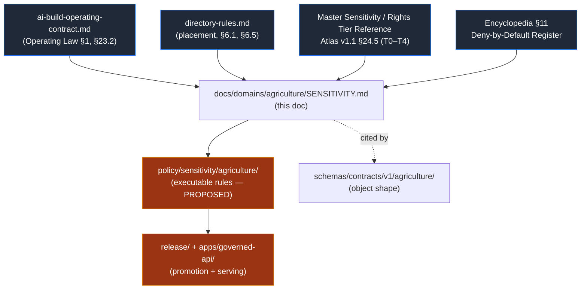
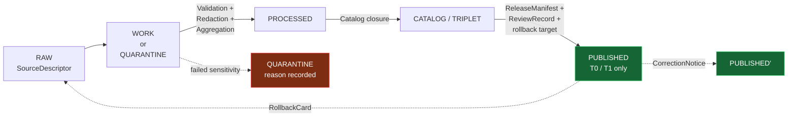

<!-- [KFM_META_BLOCK_V2]
doc_id: kfm://doc/agriculture-sensitivity
title: Agriculture Domain — Sensitivity, Rights, and Public-Release Posture
type: standard
version: v0.1
status: draft
owners: agriculture domain steward + policy steward + docs steward
created: 2026-05-26
updated: 2026-05-26
policy_label: public
related:
  - docs/doctrine/ai-build-operating-contract.md
  - docs/doctrine/directory-rules.md
  - docs/domains/agriculture/README.md
  - docs/domains/agriculture/ARCHITECTURE.md
  - docs/domains/agriculture/VERIFICATION_BACKLOG.md
  - docs/registers/DRIFT_REGISTER.md
  - policy/sensitivity/agriculture/
  - schemas/contracts/v1/agriculture/
  - contracts/agriculture/
tags: [kfm, domain, agriculture, sensitivity, rights, policy, deny-by-default]
notes:
  - CONTRACT_VERSION pin = "3.0.0"
  - Path docs/domains/agriculture/SENSITIVITY.md is PROPOSED; sibling to README, ARCHITECTURE, VERIFICATION_BACKLOG per Directory Rules §6.1.
  - All implementation/repo-state claims are PROPOSED or NEEDS VERIFICATION until a mounted KFM repository is inspected.
[/KFM_META_BLOCK_V2] -->

# Agriculture Domain — Sensitivity, Rights, and Public-Release Posture

> The Agriculture lane publishes the **safest representation that still answers the
> public's and the steward's reasonable needs**. Aggregate observations and satellite
> products **MUST NOT** be presented as field- or operator-level truth, and any private
> farm/operator × parcel join **fails closed**.

> **Doctrine pin.** `CONTRACT_VERSION = "3.0.0"`. Every `GENERATED_RECEIPT.json`, every
> PR body, and every doctrine-adjacent doc derived from this file MUST emit this string.

| Field | Value |
|---|---|
| **Document role** | Per-domain sensitivity, rights, and release-posture doctrine (Agriculture). |
| **Authority** | Subordinate to `ai-build-operating-contract.md` (Operating Law §1) and `directory-rules.md` (placement); subordinate to the Master Sensitivity/Rights Tier Reference (Atlas v1.1 §24.5). When this doc disagrees with the operating contract, the contract wins. |
| **Owner role** | Agriculture domain steward (PROPOSED owner) |
| **Required reviewers** | Agriculture steward · policy steward · rights reviewer · sensitivity reviewer · privacy reviewer (when People/Land joins are in scope) |
| **Status** | `draft` — PROPOSED until ADR-S-05 (sensitivity tier scheme) is accepted and `policy/sensitivity/agriculture/` is wired in CI. |
| **Last updated** | 2026-05-26 |

---

## Quick jump

1. [Purpose and scope](#1-purpose-and-scope)
2. [Authority, sources, and conformance](#2-authority-sources-and-conformance)
3. [Tier matrix](#3-tier-matrix)
4. [Required transforms and receipts](#4-required-transforms-and-receipts)
5. [Lifecycle and gate requirements](#5-lifecycle-and-gate-requirements)
6. [Cross-lane sensitivity inheritance](#6-cross-lane-sensitivity-inheritance)
7. [Deny-by-default register](#7-deny-by-default-register)
8. [Governed AI behavior](#8-governed-ai-behavior)
9. [Validators, fixtures, and tests](#9-validators-fixtures-and-tests)
10. [Open questions register](#10-open-questions-register)
11. [Open verification backlog](#11-open-verification-backlog)
12. [Changelog v0 → v0.1](#12-changelog-v0--v01)
13. [Definition of done](#definition-of-done)
14. [Related docs](#related-docs)

---

## 1. Purpose and scope

**CONFIRMED doctrine / PROPOSED implementation.** This document encodes the
sensitivity, rights, and public-release posture for the **Agriculture** domain
(`[DOM-AG]`). It operationalizes, for one domain only, the Master Sensitivity / Rights
Tier Reference (Atlas v1.1 §24.5), the Encyclopedia's Deny-by-Default Register, and the
sensitive-domain decision matrix in `ai-build-operating-contract.md` §23.2.

**What this doc decides.** The default sensitivity tier for each Agriculture object
class; the transforms that may move an object across tiers; the receipts and review
records that MUST accompany those transforms; the cross-lane joins that fail closed; and
the audit posture for governed AI surfaces operating on Agriculture evidence.

**What this doc does not decide.** It does NOT decide: the canonical schema shape for
Agriculture objects (lives under `schemas/contracts/v1/agriculture/`); soil semantics
(owned by `[DOM-SOIL]`); water observations (owned by `[DOM-HYD]`); ownership / title /
parcel / living-person fields (owned by `[DOM-PEOPLE]`); the publication routes (owned
by `apps/governed-api/` and the LayerManifest registry).

> [!IMPORTANT]
> **Most-restrictive-row rule.** When more than one row of any sensitivity matrix
> (this doc, Atlas v1.1 §24.5, or contract §23.2) applies to the same object, the
> **most restrictive row wins**. Aggregating a NASS county count alongside a private
> operator identifier does not make the operator field releasable.

---

## 2. Authority, sources, and conformance

### 2.1 Authority stack

> [!NOTE]
> The arrow from this document into `policy/sensitivity/agriculture/` is **PROPOSED**.
> No `.rego` bundle for Agriculture sensitivity is asserted to exist in any mounted
> repository in this session. Until ADR-S-05 is accepted and the policy bundle is
> wired into CI, treat the rules in this document as **doctrine, not enforcement**.

### 2.2 Conformance language

This document uses RFC 2119 / RFC 8174 conformance language as required by
`directory-rules.md` §2.2 and `ai-build-operating-contract.md` §5.1.1: **MUST / MUST
NOT** are non-negotiable; **SHOULD / SHOULD NOT** are strong defaults that require
recorded justification to deviate from; **MAY** is permissive.

### 2.3 Sources consulted

The doctrine in this document is grounded in the project knowledge corpus. No external
web research was performed; KFM-specific sensitivity rules are governed by project
sources, not generic public-records guidance.

<strong>Show source basis</strong>

| Short name | Source | Role |
|---|---|---|
| `[DOM-AG]` | Agriculture dossier (`KFM_Domains_v1_1_plus_Pass23_Pass32_Consolidated_Atlas.pdf`, Ch. 9) | Authoritative per-domain dossier; §I (Sensitivity), §K (validators), §N (verification backlog). |
| `[ENCY]` | `KFM Encyclopedia.md` | §11 Deny-by-Default Register; cross-domain sensitivity defaults; tier table for Ch. 7.9. |
| `[ATLAS-v1.1 §24.5]` | Atlas v1.1 — Master Sensitivity / Rights Tier Reference | Tier scheme T0–T4; allowed transforms; tier transitions; receipts. |
| `[CONTRACT §23.2]` | `ai-build-operating-contract.md` v3.0 | Sensitive-domain decision matrix and most-restrictive-row rule. |
| `[DIRRULES]` | `directory-rules.md` v1.2+ | Placement: `docs/domains/<domain>/`, `policy/sensitivity/<domain>/`, `schemas/contracts/v1/<domain>/`. |
| `[DDD]` | `DomainDriven_Design_Reference.pdf` | Bounded-context discipline informs the Agriculture ↔ People/Land anticorruption boundary. |

---

## 3. Tier matrix

The Master Sensitivity / Rights Tier Reference (Atlas v1.1 §24.5.1) defines the
five-tier scheme. The Agriculture domain instantiates that scheme as follows.

### 3.1 Tier scheme (reproduced for in-doc reference)

| Tier | Name | Audience | Default for Agriculture |
|---|---|---|---|
| **T0** | Open | Any public client via the governed API. | Aggregate county-year statistics; static soil-crop suitability layers. |
| **T1** | Generalized | Any public client, after generalization / aggregation / redaction. | Field-level satellite indices and station soil-moisture series presented as **context**, not field truth. |
| **T2** | Reviewer | Authenticated reviewers and named stewards. | Field-candidate footprints derived from CDL-style classifications. |
| **T3** | Restricted | Named-agreement parties only. | Producer-supplied or research-collaboration-supplied operator-linked records. |
| **T4** | Denied | No release; existence may be acknowledged only as steward review permits. | Private farm/operator × parcel joins; proprietary yield; pesticide application records. |

### 3.2 Per-object-class tier matrix (Agriculture)

> [!CAUTION]
> Rows below labeled **`T4`** are **DENY-default**. Public exposure of any of these,
> at any precision sufficient to identify an operator, an applicator, a private
> parcel, or a unique field, is forbidden by §23.2 of the operating contract and by
> the Encyclopedia Deny-by-Default Register. The deny lane holds even when the
> underlying record was acquired under a permissive license.

| Agriculture object class | Default tier | Allowed transforms (PROPOSED) | Required gates (PROPOSED) |
|---|---|---|---|
| **Crop Observation — aggregate (county-year, CRD-year)** | `T0` | None required for aggregate; `AggregationReceipt` documents the unit. | Standard Gates A–G; `AggregationReceipt`. |
| **Crop Observation — field-level satellite context** | `T1` | Generalize to public-safe grid; never present as field truth; cite source role. | `AggregationReceipt` or `RedactionReceipt`; `ModelRunReceipt` when derived from an index. |
| **Crop Observation — field-level NASS claim** | **`T4`** | None — field-level NASS claims **DENY** per the validators backlog item *"policy denial for field-level NASS claims."* | Policy boundary; deny at runtime. |
| **Field Candidate (CDL- or remote-sensing-derived footprint)** | `T2` | Steward review; generalize to grid before public exposure → `T1`. | `RedactionReceipt` + `ReviewRecord`. |
| **Crop Rotation — aggregate** | `T0` | None required. | Standard Gates A–G. |
| **Crop Rotation — field-level** | **`T4`** | `RedactionReceipt` + steward review → at most `T2`. | `RedactionReceipt` + `ReviewRecord` + `PolicyDecision`. |
| **Yield Observation — aggregate (county/CRD)** | `T0` / `T1` | None required at county level; `T1` when sample sizes risk re-identification. | `AggregationReceipt`. |
| **Yield Observation — proprietary / operator-supplied** | **`T4`** | None — no transform releases this to a public tier; `T3` only under named research agreement. | Named consent + `ReviewRecord` + `PolicyDecision`. |
| **Irrigation Link (well ↔ field ↔ operator)** | **`T4`** | Generalized parcel + de-identified operator → `T2` only. Public publication of well-to-operator joins is denied. | `RedactionReceipt` + `ReviewRecord`; coordinate with `[DOM-HYD]` well/withdrawal denial. |
| **Conservation Practice — aggregate context** | `T0` | None required. | Standard Gates A–G. |
| **Conservation Practice — operator-supplied detail** | **`T4`** | `RedactionReceipt` + steward review → at most `T2`. | `RedactionReceipt` + `ReviewRecord` + `PolicyDecision`. |
| **Soil Crop Suitability surface (modeled)** | `T0` | None required. | `ModelRunReceipt`; Standard Gates A–G. |
| **Agricultural Economy Observation — aggregate** | `T0` / `T1` | Suppress small-cell counts; `AggregationReceipt`. | `AggregationReceipt`. |
| **SupplyChainNode — public node** | `T0` | None required for public-utility nodes (e.g., named elevators, mills). | Standard Gates A–G; rights review for private operator names. |
| **SupplyChainNode — private operator chain** | **`T4`** | Steward review + redaction → at most `T2`. | `RedactionReceipt` + `ReviewRecord` + `PolicyDecision`. |
| **Drought Stress Indicator (modeled)** | `T0` / `T1` | None required at county/HUC scope; `T1` when downscaled below indicator resolution. | `ModelRunReceipt`; uncertainty surface. |
| **Pest Stress Indicator (modeled)** | `T1` | Generalize spatially; defer to authoritative monitoring program; never present as advisory. | `ModelRunReceipt`; `CitationValidationReport` to authoritative source. |
| **Aggregation Receipt (the receipt itself)** | `T0` | n/a (it is the receipt). | Standard Gates A–G. |

> [!NOTE]
> The tier defaults above are **PROPOSED**. ADR-S-05 (sensitivity tier scheme
> adoption) is the authoritative resolution path. Until accepted, treat the table as
> the working default and surface deviations to `docs/registers/DRIFT_REGISTER.md`.

### 3.3 Tier transitions (Atlas v1.1 §24.5.3, reproduced)

| From → To | Required artifacts | Required reviewer | Reversibility |
|---|---|---|---|
| `T4 → T3` | `PolicyDecision` + `ReviewRecord` + named agreement | Agriculture steward + rights-holder rep | Reversible: agreement revocation returns object to `T4` with `CorrectionNotice`. |
| `T4 → T2` | `PolicyDecision` + `ReviewRecord` | Agriculture steward | Reversible: review revocation returns to `T4`. |
| `T4 → T1` | `RedactionReceipt` + `ReviewRecord` | Agriculture steward | Reversible: redaction may be re-evaluated. |
| `T3 → T2` | `PolicyDecision` + `ReviewRecord` | Agriculture steward | Reversible. |
| `T2 → T1` | `RedactionReceipt` + `ReviewRecord` | Agriculture steward | Reversible. |
| `T1 → T0` | `ReleaseManifest` + `ReviewRecord` | Agriculture steward + release authority | Reversible via `RollbackCard`. |
| **Any tier → `T4`** (downgrade) | `CorrectionNotice` + `ReviewRecord` | Agriculture steward (+ rights-holder where applicable) | Always permitted; precedes derivative invalidation. |

**Reading rule (CONFIRMED doctrine).** A tier *upgrade* (toward more public) always
needs both a transform receipt **and** a review record. A tier *downgrade* (toward less
public) never needs both — `CorrectionNotice` alone is sufficient to remove or restrict.

---

## 4. Required transforms and receipts

Every transition above is inspectable because it produces a receipt. The receipts
relevant to Agriculture are catalogued in Atlas v1.1 §24.2; the Agriculture-specific
required fields are summarized below.

| Receipt | When Agriculture MUST emit it | Minimum field set (PROPOSED) | Schema home (PROPOSED) |
|---|---|---|---|
| `SourceDescriptor` | At admission of any new Agriculture source (NASS, Mesonet, SMAP, HLS, CDL, SSURGO/SDA, …). | `source_id`, `source_role` ∈ {observed, regulatory, modeled, aggregate, administrative, candidate, synthetic}, `authority`, `rights`, `sensitivity`, `cadence`, `ingest_hash`, `time`, `citation`. | `data/registry/source_descriptors/agriculture/` |
| `AggregationReceipt` | Every county/HUC/CRD aggregate publication; every matrix-cell roll-up. | `geometry_scope`, `time_scope`, `aggregation_method`, `input_source_refs`, `suppression_rule`, `output_unit`. | `schemas/contracts/v1/receipts/aggregation_receipt.schema.json` |
| `RedactionReceipt` | Every transform that removed, masked, fuzzed, or withheld an operator/parcel/field-level field. | `policy_ref`, `redaction_method`, `kept_fields`, `removed_fields`, `geometry_transform`, `reviewer`. | `schemas/contracts/v1/receipts/redaction_receipt.schema.json` |
| `ModelRunReceipt` | Every modeled Agriculture surface: suitability, drought stress, pest stress, vegetation index, downscaled moisture. | `model_id`, `model_version`, `inputs[]`, `parameters`, `run_time`, `uncertainty_surface_ref`, `validation_ref`. | `schemas/contracts/v1/receipts/model_run_receipt.schema.json` |
| `PolicyDecision` | Every sensitivity gate evaluation; every cross-lane join decision; every Focus Mode answer with Agriculture evidence. | `policy_id`, `target_object`, `decision` ∈ {`ALLOW`, `RESTRICT`, `DENY`, `HOLD`}, `reason_code`, `time`, `evidence_refs[]`. | `schemas/contracts/v1/receipts/policy_decision.schema.json` |
| `ReviewRecord` | Every promotion of Agriculture material from a more restrictive tier to a less restrictive one. | `reviewer`, `role`, `decision`, `evidence_refs[]`, `policy_ref`, `time`. | `schemas/contracts/v1/receipts/review_record.schema.json` |
| `CitationValidationReport` | Every public Agriculture claim that depends on an external authority (NASS, Mesonet, SMAP, HLS, CDL). | `claim`, `citations[]`, `missing[]`, `stale[]`, outcome. | `schemas/contracts/v1/receipts/citation_validation_report.schema.json` |
| `AIReceipt` | Every Focus Mode answer or AI-drafted note that references Agriculture evidence. | `prompt_scope`, `evidence_refs[]`, `policy_ref`, `outcome`, `reason_code`, `model_id`, `time`. | `schemas/contracts/v1/receipts/ai_receipt.schema.json` |
| `ReleaseManifest` | Every public Agriculture release. | `release_id`, `contents[]`, `digests`, `evidence_refs[]`, `rollback_target`, `time`. | `schemas/contracts/v1/release/release_manifest.schema.json` |
| `CorrectionNotice` | Every post-publication change to a public Agriculture claim. | `corrected_claim`, `reason`, `invalidated_derivatives[]`, `time`. | `schemas/contracts/v1/release/correction_notice.schema.json` |

> [!IMPORTANT]
> **Receipts are not optional.** Atlas v1.1 §24.2: *"if no receipt exists, the
> operation did not happen in the governed sense."* An Agriculture publication
> without an `AggregationReceipt` (when aggregation occurred) or `RedactionReceipt`
> (when redaction occurred) MUST NOT be promoted to `PUBLISHED`.

---

## 5. Lifecycle and gate requirements

Agriculture follows the universal lifecycle: `RAW → WORK / QUARANTINE → PROCESSED →
CATALOG / TRIPLET → PUBLISHED`. The table below is the Agriculture-specific overlay on
the Master Pipeline Gate Reference (Atlas v1.1 §24.6.1).

| Gate (transition) | Agriculture-specific pre-condition | Required artifacts | Failure-closed outcome |
|---|---|---|---|
| Admission (— → RAW) | `SourceDescriptor` with `source_role` set; rights and sensitivity tagged at source family level (see §2.3). | `SourceDescriptor`; payload/reference hash. | Source not admitted; logged as candidate awaiting steward. |
| Normalization (RAW → WORK/QUARANTINE) | Geometry / time / identity / evidence / rights / policy rules runnable; private farm/operator × parcel join blocked. | `TransformReceipt`; `ValidationReport`; `PolicyDecision`. | `QUARANTINE` with reason; never silent promotion. |
| Validation (WORK → PROCESSED) | Aggregate-only check; field-level NASS claim deny; soil-moisture unit/depth/QC pass; CDL/HLS time mask pass. | `ValidationReport`; `RedactionReceipt` (if sensitivity applies); `AggregationReceipt` (if applies). | Hold in WORK; structured FAIL. |
| Catalog closure (PROCESSED → CATALOG/TRIPLET) | `EvidenceRef` resolves to `EvidenceBundle`; digest closure. | `CatalogMatrix` entry; `EvidenceBundle`; triplet projection if applicable. | Hold at PROCESSED; no public edge. |
| Release (CATALOG → PUBLISHED) | Review state present for `T1` releases; release authority distinct from author when materiality applies. | `ReleaseManifest`; rollback target; correction path; `ReviewRecord` if `T1`. | Hold at CATALOG; no public surface change. |
| Correction (PUBLISHED → PUBLISHED') | Detected error or new evidence; derivatives identified. | `CorrectionNotice`; updated `ReleaseManifest`; downstream invalidation list. | Stale-state badge surfaces in UI; AI surfaces ABSTAIN until correction lands. |

---

## 6. Cross-lane sensitivity inheritance

Agriculture's sensitivity posture is shaped by its joins. The matrix below restates the
cross-lane edges from `[DOM-AG]` §F with the most-restrictive-row rule applied.

| Joined lane | Relation | Inherited constraint | Required reviewer beyond Agriculture steward |
|---|---|---|---|
| **Soil (`[DOM-SOIL]`)** | MUKEY joins; suitability support. | Preserve source role; preserve `EvidenceBundle` support; tier is the higher (more restrictive) of Soil and Agriculture. | none additional for routine MUKEY joins. |
| **Hydrology (`[DOM-HYD]`)** | Irrigation, drought, water-use context. | Well/withdrawal records carry `T1`/`T2` defaults; private-owner joins deny. **Operator ↔ well joins inherit the more restrictive tier.** | Hydrology steward when private withdrawals are touched. |
| **Atmosphere / Air (`[DOM-AIR]`)** | Weather, heat, smoke, vegetation stress. | Stale-state badge required; operational disclaimer required for observed data. | Atmosphere steward when smoke / wildfire stress is propagated. |
| **People / Genealogy / DNA / Land (`[DOM-PEOPLE]`)** | Farm/operator and parcel-sensitive contexts. | **`T4` DENY-default for any join that resolves to a living person, a private parcel, or a private operator identity.** | Privacy reviewer + rights reviewer. |

> [!CAUTION]
> The Agriculture ↔ People/Land seam is the highest-risk join in this domain.
> Whether the operator name, parcel ID, or applicator identity is the *primary* field
> or a *joined* field, the outcome is the same: **DENY** at public surfaces unless a
> named-agreement (`T3`) or generalization + de-identification (`T2`) has been
> recorded with the appropriate receipts.

---

## 7. Deny-by-default register

The following claims **MUST** fail closed at the public surface, regardless of how
they are framed, joined, summarized, or visualized. This register is reproduced from
the Encyclopedia Deny-by-Default Register and Atlas v1.1 §24.5.2, restricted to the
Agriculture lane.

| Claim / surface | Disposition | Reason |
|---|---|---|
| Private agriculture join (farm/operator × parcel) | **DENY** | Encyclopedia §11; aggregation receipts are central; private joins fail closed. |
| Field-level NASS claim presented as field truth | **DENY** | Atlas v1.1 §K validator: *"policy denial for field-level NASS claims."* |
| Proprietary yield data attributed to an operator | **DENY** | `[DOM-AG]` §I; proprietary yield records fail closed. |
| Pesticide / herbicide application records linked to an operator or parcel | **DENY** | `[DOM-AG]` §I; pesticide records fail closed. |
| Satellite or model-derived field-level value presented as ground truth | **DENY** | `[DOM-AG]` §I: *"Aggregate statistics and satellite products must not become field/operator truth."* |
| Operator-supplied conservation practice detail attached to an identifiable parcel | **DENY** | `[DOM-AG]` §I; private-sensitive joins fail closed. |
| Well-to-operator irrigation join | **DENY** | Cross-lane inheritance from `[DOM-HYD]` private-owner join denial. |
| Unknown rights, unresolved license, missing consent | **DENY** | Trust membrane; cite-or-abstain. |
| Public release without `ReleaseManifest` + `EvidenceBundle` + validation + policy + (where required) `ReviewRecord` | **DENY** | Operating Law §4; lifecycle invariant. |
| Focus Mode answer derived from rendered features alone, without `EvidenceBundle` | **DENY** | `[GAI]`; AI never root truth. |

---

## 8. Governed AI behavior

**CONFIRMED doctrine / PROPOSED implementation.** Agriculture Focus Mode answers and
AI-drafted notes operate on **released** `EvidenceBundle` projections only. The AI
surface MUST NOT read `RAW`, `WORK`, or `QUARANTINE` Agriculture content; the AI
surface MUST emit a finite outcome (`ANSWER` / `ABSTAIN` / `DENY` / `ERROR`) plus an
`AIReceipt`.

| AI behavior | Allowed? | Required artifact |
|---|---|---|
| Summarize a released Agriculture `EvidenceBundle`. | Yes | `AIReceipt`; `CitationValidationReport`. |
| Compare two released Agriculture bundles (e.g., NASS vs. CDL coverage). | Yes | `AIReceipt`; both `EvidenceBundle` refs. |
| Explain limitations of a modeled Agriculture surface. | Yes | `AIReceipt`; `ModelRunReceipt` ref. |
| Draft a steward-review note for a redaction proposal. | Yes (review-bound) | `AIReceipt`; routed to `ReviewRecord` workflow. |
| Answer a field-level NASS question using public county aggregates. | `NARROWED` answer permitted; field-level extrapolation **DENY**. | `AIReceipt` with `outcome = NARROWED` and `reason_code = aggregate_only`. |
| Identify a specific operator from a satellite-derived field footprint. | **DENY** | `AIReceipt` with `outcome = DENY` and `reason_code = operator_reidentification_risk`. |
| Operate on unreleased / quarantined Agriculture material. | **DENY** | `PolicyDecision` with `decision = DENY`. |

---

## 9. Validators, fixtures, and tests

The Agriculture dossier (`[DOM-AG]` §K) names six PROPOSED validator/test items
relevant to sensitivity. They are reproduced here as the testable surface for this
document. None of these tests is asserted to exist in any mounted repository in this
session.

| Test (PROPOSED) | What it must check | Fixture lane |
|---|---|---|
| SSURGO / SDA lineage tests | Source-role anti-collapse; MUKEY join preserves source authority. | `tests/fixtures/agriculture/ssurgo/` |
| Soil-moisture unit / depth / QC tests | Mesonet / SCAN / USCRN / SMAP units, depths, and QC flags survive normalization. | `tests/fixtures/agriculture/soil_moisture/` |
| Crop progress aggregate-only tests | NASS Crop Progress publications are county / CRD only; no field-level claims survive validation. | `tests/fixtures/agriculture/crop_progress/` |
| Vegetation index mask / time tests | HLS / HLS-VI products carry mask and time-window discipline; no synthetic-as-observed leakage. | `tests/fixtures/agriculture/hls/` |
| **Policy denial for field-level NASS claims** | Any Focus Mode / API request resolving to a field-level NASS claim returns `DENY` with `reason_code = field_level_nass_denied`. | `tests/policy/agriculture/` |
| Catalog closure tests | EvidenceRef resolves to `EvidenceBundle`; digests close; release manifests pin rollback targets. | `tests/fixtures/agriculture/catalog/` |

Suggested additional sensitivity-specific tests:

- **Private join denial** — any join surface attempting to resolve `operator_id` against
  `parcel_id` MUST return `DENY` with `reason_code = private_join_denied`.
- **Aggregation-receipt presence** — public Agriculture statistics MUST link an
  `AggregationReceipt` whose `geometry_scope` is at most county or CRD resolution.
- **Tier-transition receipt presence** — any object whose default tier is `T4` MUST
  carry both `RedactionReceipt` and `ReviewRecord` before serving at `T1`.

---

## 10. Open questions register

| ID | Question | Owner role | Resolution path |
|---|---|---|---|
| `OQ-AG-SENS-01` | Should ADR-S-05 (sensitivity tier scheme adoption) be authored Agriculture-first, or after at least one sibling domain (Flora, Fauna) has been wired? | Policy steward + Agriculture steward | ADR queue. |
| `OQ-AG-SENS-02` | Is `policy/sensitivity/agriculture/` the canonical home for executable Agriculture sensitivity rules, or does it live under `policy/domains/agriculture/sensitivity/` per `KFM_Unified_Implementation_Architecture_Build_Manual.md` §5? | Policy steward | Directory Rules check + ADR-0003 alignment. |
| `OQ-AG-SENS-03` | What is the suppression threshold for small-cell NASS county-level yield publications before tier rises from `T0` to `T1`? | Agriculture steward + privacy reviewer | NASS disclosure-avoidance guidance review (treated as external reference, not authority). |
| `OQ-AG-SENS-04` | Does the Agriculture ↔ Hydrology join surface require its own deny-list document, or is the cross-lane inheritance table in §6 sufficient? | Agriculture steward + Hydrology steward | Joint review. |
| `OQ-AG-SENS-05` | Should `Field Candidate` default to `T2` (reviewer) or `T1` (generalized, public-safe grid)? Defaulting to `T2` matches the dossier; defaulting to `T1` matches Fauna range polygons. | Agriculture steward | ADR. |
| `OQ-AG-SENS-06` | Is `SupplyChainNode` truly split-tier (`T0` for public-utility nodes, `T4` for private chains), or should the whole class default to `T1` with named-public-node exceptions? | Agriculture steward + rights reviewer | Steward review. |
| `OQ-AG-SENS-07` | Does the Pest Stress Indicator carry an authoritative-source obligation (i.e., always cite the monitoring program), or may it stand alone as a modeled product? | Agriculture steward | `CitationValidationReport` policy review. |

---

## 11. Open verification backlog

These items remain **`NEEDS VERIFICATION`** before promotion from `draft` to `published`:

1. `policy/sensitivity/agriculture/` exists in the mounted repository with `.rego`
   rules implementing the deny lanes in §7.
2. `schemas/contracts/v1/agriculture/` exists in the mounted repository and includes
   the object classes named in §3.2.
3. `schemas/contracts/v1/receipts/` includes `aggregation_receipt`, `redaction_receipt`,
   `model_run_receipt`, `policy_decision`, and `review_record` schemas, OR per-domain
   variants per ADR-S-03.
4. CI workflow under `.github/workflows/` runs the five sensitivity-relevant
   Agriculture tests named in §9 with negative-fixture coverage.
5. `release/` lane carries at least one Agriculture `ReleaseManifest` + rollback
   target as a worked example.
6. `data/registry/source_descriptors/agriculture/` carries `SourceDescriptor` entries
   for NASS, Mesonet, SCAN, USCRN, SMAP, HLS, CDL, and SSURGO/SDA with rights and
   sensitivity fields populated.
7. `apps/governed-api/` Agriculture detail resolver returns `DENY` with a stable
   `reason_code` for the deny lanes in §7.
8. The Agriculture chapter of the Encyclopedia (Ch. 7.9) and this document agree on
   defaults; any drift is filed to `docs/registers/DRIFT_REGISTER.md`.
9. ADR-S-05 (sensitivity tier scheme) is accepted and pins this document's tier table.

---

## 12. Changelog v0 → v0.1

| Change | Type (per contract §37) | Reason |
|---|---|---|
| Initial draft of `docs/domains/agriculture/SENSITIVITY.md`. | new | First per-domain instantiation of Atlas v1.1 §24.5 and contract §23.2 for Agriculture. |
| Reproduced Agriculture rows from Atlas v1.1 §24.5.2 verbatim into §3.2. | clarification | Local copy reduces cross-doc chasing; conflicts resolve in favor of the Atlas. |
| Encoded the Encyclopedia Deny-by-Default Register row for "Private agriculture join" as the §7 anchor. | reconciliation | Surfaces the highest-risk deny lane next to the matrix it constrains. |
| Added a cross-lane sensitivity inheritance table (§6). | gap closure | The Agriculture dossier names the joined lanes but does not state the inherited tier discipline. |
| Added a governed-AI behavior table (§8). | gap closure | The dossier names AI behavior abstractly; this table names the receipt obligations per action. |
| Added a validator/test table (§9) anchored on dossier §K. | gap closure | Makes the testable surface of this doc explicit. |
| Added Open Questions register (§10) and Verification backlog (§11). | housekeeping | Conformance with the doctrine-doc companion-sections pattern. |

> **Backward compatibility.** This is a new file; no anchors are at risk of breakage.
> Sibling documents (`README.md`, `ARCHITECTURE.md`, `VERIFICATION_BACKLOG.md`) under
> `docs/domains/agriculture/` SHOULD link to this file under a "Sensitivity" section
> heading. When that linking lands, anchors used should be `#3-tier-matrix`,
> `#7-deny-by-default-register`, and `#11-open-verification-backlog`.

---

## Definition of done

This document is done enough to enter the repository when:

- it is placed at `docs/domains/agriculture/SENSITIVITY.md` per Directory Rules §6.1
  (PROPOSED — sibling slot to `README.md`, `ARCHITECTURE.md`, `VERIFICATION_BACKLOG.md`);
- the Agriculture steward, the policy steward, and the docs steward have reviewed it;
- it is linked from `docs/domains/agriculture/README.md` and the doctrine index;
- it does not conflict with accepted ADRs (ADR-S-05 sensitivity tier scheme, ADR-0003
  policy singular, ADR-S-03 receipt class home);
- any conflict with current repo conventions is logged in
  `docs/registers/DRIFT_REGISTER.md`;
- the `GENERATED_RECEIPT.json` planned in the authoring notes is wired into CI;
- future changes follow the operating contract's §37 lifecycle (MAJOR / MINOR / PATCH).

---

## Related docs

- `docs/doctrine/ai-build-operating-contract.md` — Operating Law §1 and Sensitive-Domain
  Decision Matrix §23.2 (PROPOSED canonical).
- `docs/doctrine/directory-rules.md` — placement authority for this file.
- `docs/atlases/KFM_Domains_v1_1_plus_Pass23_Pass32_Consolidated_Atlas.md` — Master
  Sensitivity / Rights Tier Reference (Atlas v1.1 §24.5).
- `docs/encyclopedia/KFM_Encyclopedia.md` §11 — Deny-by-Default Register.
- `docs/domains/agriculture/README.md` — Agriculture lane landing (TODO link).
- `docs/domains/agriculture/ARCHITECTURE.md` — Agriculture architecture dossier (TODO link).
- `docs/domains/agriculture/VERIFICATION_BACKLOG.md` — Agriculture verification backlog (TODO link).
- `docs/registers/DRIFT_REGISTER.md` — register drift between this doc and repo evidence.
- `policy/sensitivity/agriculture/` — PROPOSED executable rules home.
- `schemas/contracts/v1/agriculture/` — Agriculture object shape.

---

**Last updated:** 2026-05-26 · `CONTRACT_VERSION = "3.0.0"` ·
[Back to top](#agriculture-domain--sensitivity-rights-and-public-release-posture)
