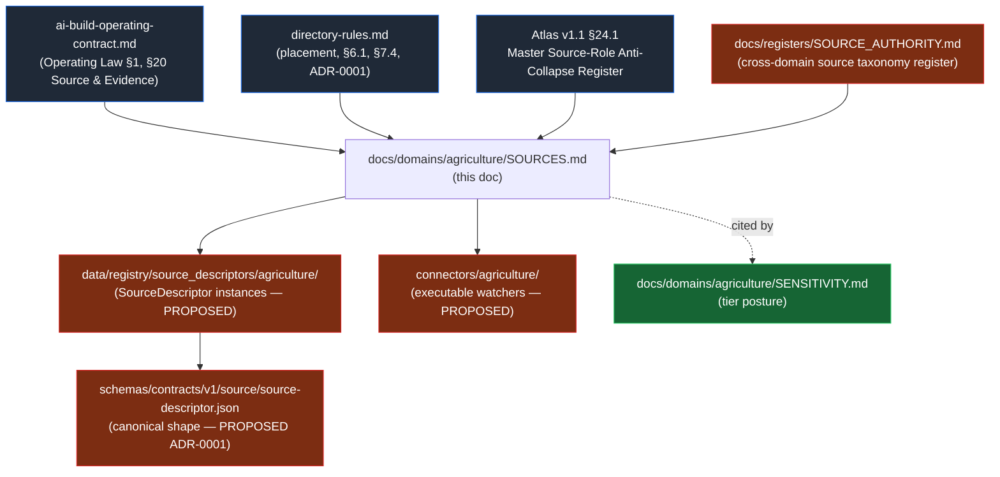
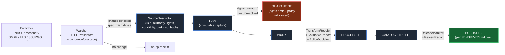

<!-- [KFM_META_BLOCK_V2]
doc_id: kfm://doc/agriculture-sources
title: Agriculture Domain — Source Families, SourceDescriptors, and Intake Posture
type: standard
version: v0.1
status: draft
owners: agriculture domain steward + source steward + docs steward
created: 2026-05-26
updated: 2026-05-26
policy_label: public
related:
  - docs/doctrine/ai-build-operating-contract.md
  - docs/doctrine/directory-rules.md
  - docs/domains/agriculture/README.md
  - docs/domains/agriculture/ARCHITECTURE.md
  - docs/domains/agriculture/SENSITIVITY.md
  - docs/domains/agriculture/VERIFICATION_BACKLOG.md
  - data/registry/source_descriptors/agriculture/
  - schemas/contracts/v1/source/
  - schemas/contracts/v1/agriculture/
  - docs/standards/SMART_SYNC.md
  - docs/registers/SOURCE_AUTHORITY.md
  - connectors/agriculture/
tags: [kfm, domain, agriculture, sources, source-descriptor, watcher, intake]
notes:
  - CONTRACT_VERSION pin = "3.0.0"
  - Path docs/domains/agriculture/SOURCES.md is PROPOSED; sibling slot to README, ARCHITECTURE, SENSITIVITY, VERIFICATION_BACKLOG per Directory Rules §6.1.
  - All source endpoints, rights, cadences, and watcher cadences below are PROPOSED or NEEDS VERIFICATION. Authoritative resolution requires consultation of each publisher's current terms and a mounted-repo check.
[/KFM_META_BLOCK_V2] -->

# Agriculture Domain — Source Families, SourceDescriptors, and Intake Posture

> The Agriculture lane admits each source under its **own** governed envelope. Source
> role is set at admission and preserved through every promotion — an observation
> never silently becomes an aggregate, an aggregate never becomes a per-place truth,
> and a candidate never reaches `PUBLISHED` without a governed transition.

[](../../doctrine/ai-build-operating-contract.md)
[](#definition-of-done)
[](#1-purpose-and-scope)
[](#13-open-verification-backlog)
[](#5-admission-and-intake-lifecycle)
[](#7-anti-collapse-failure-modes-for-agriculture)
[](#22-conformance-language)
[](#3-source-family-register)

> **Doctrine pin.** `CONTRACT_VERSION = "3.0.0"`. Every `GENERATED_RECEIPT.json`,
> every PR body, and every doctrine-adjacent document derived from this file MUST
> emit this string.

| Field | Value |
|---|---|
| **Document role** | Per-domain source-family register, role discipline, and intake posture for Agriculture. |
| **Authority** | Subordinate to `ai-build-operating-contract.md` (§1 Operating Law, §20 Source and evidence handling), `directory-rules.md` (placement), Atlas v1.1 §24.1 (Master Source-Role Anti-Collapse Register), and the Agriculture dossier `[DOM-AG]` §D (Key source families). |
| **Sibling docs** | `SENSITIVITY.md` (rights/release posture) · `ARCHITECTURE.md` (lane architecture) · `VERIFICATION_BACKLOG.md` (open items). |
| **Owner role** | Agriculture domain steward + source steward (PROPOSED owners). |
| **Required reviewers** | Agriculture steward · source steward · rights reviewer · policy steward. |
| **Status** | `draft` — all rights, cadence, and endpoint claims remain `NEEDS VERIFICATION` until checked against current publisher terms and mounted-repo evidence. |
| **Last updated** | 2026-05-26 |

---

## Quick jump

1. [Purpose and scope](#1-purpose-and-scope)
2. [Authority, sources, and conformance](#2-authority-sources-and-conformance)
3. [Source family register](#3-source-family-register)
4. [Source-role discipline](#4-source-role-discipline)
5. [Admission and intake lifecycle](#5-admission-and-intake-lifecycle)
6. [SourceDescriptor shape (PROPOSED)](#6-sourcedescriptor-shape-proposed)
7. [Anti-collapse failure modes for Agriculture](#7-anti-collapse-failure-modes-for-agriculture)
8. [Watcher cadence and freshness](#8-watcher-cadence-and-freshness)
9. [Cross-lane source sharing](#9-cross-lane-source-sharing)
10. [Rights, license, and steward review](#10-rights-license-and-steward-review)
11. [Validators, fixtures, and tests](#11-validators-fixtures-and-tests)
12. [Open questions register](#12-open-questions-register)
13. [Open verification backlog](#13-open-verification-backlog)
14. [Changelog v0 → v0.1](#14-changelog-v0--v01)
15. [Definition of done](#definition-of-done)
16. [Related docs](#related-docs)

---

## 1. Purpose and scope

**CONFIRMED doctrine / PROPOSED implementation.** This document is the per-domain
source register for **Agriculture** (`[DOM-AG]`). It names the source families the
lane admits, the role each source carries, the rights and cadence posture for each,
and the SourceDescriptor shape that anchors every downstream receipt. It is the
companion to `SENSITIVITY.md` (which governs publication tiers) and `ARCHITECTURE.md`
(which governs lane shape).

**What this doc decides.** Which sources Agriculture admits today; what `source_role`
each carries at admission; what cadence each watcher MUST honor; what fields the
SourceDescriptor MUST carry; what anti-collapse failure modes are most likely in this
lane; and which sources are shared with neighboring lanes (Soil, Hydrology, Atmosphere,
People/Land).

**What this doc does not decide.** It does NOT decide: the canonical SourceDescriptor
schema shape (lives at `schemas/contracts/v1/source/source-descriptor.json` per
ADR-0001); the executable watcher implementations (live under `connectors/agriculture/`
and `tools/ingest/watchers/`); the publication tiers (governed by `SENSITIVITY.md`);
the catalog records (governed by `data/catalog/`).

> [!IMPORTANT]
> **Source identity is set once, at admission, and preserved.** Promotion through
> `RAW → WORK / QUARANTINE → PROCESSED → CATALOG / TRIPLET → PUBLISHED` MUST NOT
> change `source_role`. Atlas v1.1 §24.1.1: *"Promotion does not upgrade an
> observation to a regulation, or a model to an aggregate, or a candidate to a
> verified record — those are separate governed transitions with their own evidence
> and review requirements."*

---

## 2. Authority, sources, and conformance

### 2.1 Authority stack



> [!NOTE]
> The arrows into `data/registry/source_descriptors/agriculture/`,
> `connectors/agriculture/`, and `schemas/contracts/v1/source/source-descriptor.json`
> are **PROPOSED**. No `SourceDescriptor` instance, no watcher implementation, and no
> canonical schema is asserted to exist in any mounted repository in this session.

### 2.2 Conformance language

This document uses RFC 2119 / RFC 8174 conformance language as required by
`directory-rules.md` §2.2 and `ai-build-operating-contract.md` §5.1.1: **MUST / MUST
NOT** are non-negotiable; **SHOULD / SHOULD NOT** are strong defaults that require
recorded justification to deviate from; **MAY** is permissive.

### 2.3 Sources consulted

All claims are grounded in the project knowledge corpus. No external web research was
performed; KFM source policy is governed by project sources, not by generic ingestion
guidance.

<details>
<summary><strong>Show source basis</strong></summary>

| Short name | Source | Role in this doc |
|---|---|---|
| `[DOM-AG]` | Agriculture dossier (Atlas Ch. 9), §D Key source families and §N Verification backlog | Canonical source-family list for Agriculture. |
| `[ATLAS-v1.1 §24.1]` | Atlas v1.1 Master Source-Role Anti-Collapse Register | Source-role enum; anti-collapse failure modes; SourceDescriptor field shape. |
| `[ATLAS-v1.1 §24.2]` | Master Receipt Catalog | SourceDescriptor anchors every downstream receipt. |
| `[CONTRACT §20]` | `ai-build-operating-contract.md` v3.0 §20 Source and evidence handling | Source intake duties. |
| `[ENCY]` | `KFM Encyclopedia.md` §11 Deny-by-Default Register | Cross-domain sensitivity defaults referenced from `SENSITIVITY.md`. |
| `[DIRRULES]` | `directory-rules.md` v1.2+ | `docs/domains/<domain>/`, `data/registry/source_descriptors/`, `connectors/<source_family>/`. |
| `[P10-C3]` | Pass 10 Idea Index, Category C3 (Event-Driven Ingestion and Smart Sync) | Watcher pattern: HTTP validators, manifest checksums, object-store events, debounce/coalesce windows. |
| `[P10-C10]` | Pass 10 Category C10 (Authoritative Domain Datasets — Kansas-first) | Source-stack rationale for soil/water/air/biodiversity. |

</details>

---

## 3. Source family register

**CONFIRMED dossier text / NEEDS VERIFICATION current terms.** The Agriculture
dossier `[DOM-AG]` §D names eight source families. Each is listed below with its
declared source role, default sensitivity posture, and intake notes. **Rights,
endpoints, and current terms remain `NEEDS VERIFICATION` for every row** and MUST be
confirmed against the publisher's current documentation before any ingestion run.

> [!CAUTION]
> Rights and current terms for **all eight** source families are explicitly labeled
> `NEEDS VERIFICATION` in the Agriculture dossier `[DOM-AG]` §D. Do not infer rights
> from the source's reputation, prior KFM usage, or the fact that other publishers
> in the same family carry permissive terms. Resolve rights at the `SourceDescriptor`
> field level, per source, per ingestion.

### 3.1 Source families admitted by Agriculture

| Source family | Publisher (PROPOSED) | Primary `source_role` | Secondary roles permitted | Default sensitivity (per `SENSITIVITY.md`) | Status |
|---|---|---|---|---|---|
| **SSURGO / Soil Data Access (SDA)** | USDA NRCS | `observed` (soil pedon descriptions; survey data) | `aggregate` for MUKEY summaries | `T0` for public layers; private joins fail closed | `[DOM-AG]` §D |
| **gSSURGO** | USDA NRCS | `aggregate` (gridded derivative of SSURGO) | none — never relabel as `observed` | `T0` for public layers | `[DOM-AG]` §D |
| **Kansas Mesonet** | Kansas State University Mesonet | `observed` (in-situ sensor: soil moisture and temperature at 5 / 10 / 20 / 50 cm; weather variables) | `aggregate` for station-period summaries | `T0` for station series | `[DOM-AG]` §D; `[P10-C10]` C10-01 |
| **NRCS SCAN** (Soil Climate Analysis Network) | USDA NRCS | `observed` (in-situ sensor) | `aggregate` for daily/monthly summaries | `T0` for station series | `[DOM-AG]` §D |
| **NOAA USCRN** (US Climate Reference Network) | NOAA NCEI | `observed` (in-situ reference-quality sensor) | `aggregate` for daily/monthly summaries | `T0` for station series | `[DOM-AG]` §D |
| **NASA SMAP** | NASA (Earthdata) | `modeled` (Level-3/4 soil moisture; the Level-1 brightness temperature is `observed`, derived L3/L4 are modeled) | `aggregate` for downscaled or temporally averaged surfaces | `T0` / `T1` (downscaled contexts) | `[DOM-AG]` §D; `[P10-C10]` C10-01 |
| **NASA HLS / HLS-VI** (Harmonized Landsat–Sentinel; Vegetation Indices) | NASA LP DAAC | `modeled` (surface-reflectance harmonization; VI derivatives) | `aggregate` for temporally composited products | `T0` for public layers; field-level claims constrained | `[DOM-AG]` §D |
| **USDA NASS QuickStats / Crop Progress** | USDA NASS | `aggregate` (county / CRD / state county-year statistics) | `administrative` for survey panel definitions | `T0` for county aggregates; **field-level claims DENY** | `[DOM-AG]` §D, §K validator: *policy denial for field-level NASS claims* |

### 3.2 Adjacent / PROPOSED context sources

These are not in the dossier `[DOM-AG]` §D list but are referenced in adjacent corpus
material as Agriculture-context sources. Each is **PROPOSED** for admission only;
none should be ingested into the Agriculture lane without a separate ADR or
`SourceDescriptor` review.

| Source family | Notes | Citation |
|---|---|---|
| **USDA CDL (Cropland Data Layer)** | Annual crop-focused land-cover classification; `modeled`. Native classification preserved; advisory crosswalks only. | `KFM-P2-IDEA-0028`; `[P10-C10]` |
| **NRCS gNATSGO** | Gridded national-scale soil derivative (CONUS, 30 m). `aggregate` role. Mentioned under Soil lane; co-admitted by Agriculture for suitability surfaces. | `[DOM-SOIL]` §D; `[P10-C10]` C10-01 |
| **ISRIC SoilGrids** | Global comparability layer (250 m, CC-BY-4.0). `modeled`. PROPOSED admission only if international comparability becomes a stated need. | `[P10-C10]` C10-01 |
| **Kansas Department of Agriculture (KDA)** | State-agency layer for crop/livestock/conservation context. Roles vary per layer. PROPOSED admission via separate ADR. | `KFM-P2-IDEA-0024` |
| **USDA RMA (Risk Management Agency)** | Crop insurance and producer-level data. **Sensitive.** PROPOSED admission only under a `T3`/`T4` posture per `SENSITIVITY.md`. | adjacent corpus |

---

## 4. Source-role discipline

**CONFIRMED doctrine.** KFM treats `source_role` as a first-class identity attribute.
Atlas v1.1 §24.1.1 defines seven canonical roles. The table below restates the roles
relevant to Agriculture, with Agriculture-specific examples drawn from §3.1.

| Role | Definition (CONFIRMED doctrine) | Agriculture example | Allowed downstream role |
|---|---|---|---|
| **observed** | A direct reading, measurement, or first-hand evidentiary record tied to a place and time. | Mesonet station soil-moisture reading at 5 cm; SCAN daily record; USCRN reference sensor; SSURGO pedon description. | MAY feed `modeled` or `aggregate` products; **never** relabeled as `regulatory` or `administrative`. |
| **regulatory** | An authoritative determination by a regulatory or governing body with legal or administrative force. | (rare in Agriculture) — designated critical-habitat overlay or USDA conservation-easement designation. | Cite as regulatory context; **never** labeled `observed` or `modeled`. |
| **modeled** | A derived product from inputs, assumptions, or fitted parameters; uncertainty and provenance of inputs MUST be preserved. | SMAP Level-3/4 surface moisture; HLS-VI vegetation indices; Soil Crop Suitability surface; Drought Stress Indicator. | Cite with model identity, `ModelRunReceipt`, and bounds; **never** labeled an observation. |
| **aggregate** | A published summary, total, or average over a unit (county, year, watershed); irreversible loss of individual record fidelity. | NASS Crop Progress county percentage; NASS QuickStats county-year yield; gSSURGO grid-cell summary. | Cite with `AggregationReceipt`; **never** treated as a per-place / per-field record. |
| **administrative** | A compiled record produced by an agency for administration, registration, or accounting purposes. | NASS survey panel definitions; NRCS service-center rosters. | Cite as administrative context; never collapsed with observation or regulation. |
| **candidate** | A proposed record awaiting validation, evidence resolution, deduplication, or steward review. | Quarantined connector output; unmerged Field Candidate footprint; rejected SDA join result. | MAY be cited as candidate evidence in `WORK` / `QUARANTINE`; **MUST NOT** appear in `PUBLISHED` without promotion. |
| **synthetic** | Content generated by simulation, reconstruction, AI, or interpolation that has no underlying first-hand observation. | AI-drafted Agriculture EvidenceBundle summary; reconstructed historical crop layer. | Carries Reality Boundary Note and `RepresentationReceipt`; **MUST NEVER** be presented or queried as observed reality. |

> [!IMPORTANT]
> **Reading rule.** The role of a source is set at admission and is preserved
> through every promotion. The SMAP "soil moisture" value is **modeled**, not
> observed, even though the underlying brightness temperatures are observed — the
> Level-3/4 derivative is the artifact Agriculture admits, and it carries the
> `modeled` role. Reclassifying it later requires a new `SourceDescriptor` and a
> `CorrectionNotice`.

---

## 5. Admission and intake lifecycle

Agriculture sources follow the universal lifecycle. The table below is the
Agriculture-specific overlay on the Master Pipeline Gate Reference (Atlas v1.1
§24.6.1), restricted to the admission and normalization gates.



### 5.1 Admission gates for an Agriculture source

| Gate | Pre-condition | Required artifacts | Failure-closed outcome |
|---|---|---|---|
| **Discovery** | Publisher endpoint reachable; minimal terms reviewable; preliminary `source_role` assignable. | Watcher draft (`connectors/agriculture/<source>/`); preliminary descriptor. | Source not admitted; logged as candidate awaiting steward. |
| **Admission (— → RAW)** | `SourceDescriptor` with `source_role`, `authority`, `rights`, `sensitivity`, `cadence`, `ingest_hash`, `time`, `citation`. | `SourceDescriptor`; payload or reference hash. | Source not admitted; descriptor remains in PROPOSED state. |
| **Normalization (RAW → WORK)** | Schema, geometry, time, identity, evidence, rights, and policy rules runnable. | `TransformReceipt`; `ValidationReport` (working set); `PolicyDecision`. | `QUARANTINE` with reason. |
| **Quarantine triage** | Quarantine reason recorded; remediation owner assigned. | Quarantine ticket; `SourceDescriptor` update; reviewer note. | Source remains held; no PUBLISHED edge. |

---

## 6. SourceDescriptor shape (PROPOSED)

**PROPOSED schema home.** `schemas/contracts/v1/source/source-descriptor.json` per
Directory Rules §7.4 and ADR-0001 unless an accepted ADR relocates it (Atlas v1.1
§24.1.3). The exact field names below are illustrative; the canonical resolution is a
schema PR plus an ADR.

### 6.1 Required base fields (every Agriculture SourceDescriptor)

| Field | Type / vocabulary | Required? | Notes |
|---|---|---|---|
| `source_id` | string (stable URN, e.g., `kfm:source:agriculture:nass-quickstats:v1`) | MUST | Stable across renames; corrections produce a new descriptor + `CorrectionNotice`. |
| `source_role` | enum: `observed` \| `regulatory` \| `modeled` \| `aggregate` \| `administrative` \| `candidate` \| `synthetic` | MUST | Set at admission; never edited in-place. |
| `authority` | string (issuing body — e.g., `USDA NASS`, `NASA LP DAAC`, `Kansas State University Mesonet`) | MUST | Disambiguates cite text. |
| `rights` | structured: `{ license, url, conditions[], steward_contact, last_reviewed }` | MUST | `NEEDS VERIFICATION` per row in §3 until checked against publisher's current documentation. |
| `sensitivity` | structured: `{ default_tier, deny_lanes[], notes }` referencing `SENSITIVITY.md` rows | MUST | Sets the default release posture for downstream products. |
| `cadence` | structured: `{ poll_interval, validator_method, debounce_window, expected_frequency }` | MUST | See §8 for Agriculture defaults. |
| `ingest_hash` | hex digest (e.g., BLAKE3 or SHA-256) of the most recent payload or reference | MUST | Conditional-GET memory; supports no-op receipts. |
| `time` | structured: `{ first_admitted, last_seen, last_changed }` | MUST | Drives stale-state UI. |
| `citation` | string (publisher-prescribed citation text) | MUST | Verbatim where the publisher prescribes a citation form. |

### 6.2 Role-conditional fields

| Field | When required | Notes |
|---|---|---|
| `role_authority` | when `source_role` ∈ {`regulatory`, `modeled`, `aggregate`} | Issuing body / model identity / steward. |
| `role_aggregation_unit` | when `source_role = aggregate` | Token: `county`, `CRD`, `HUC`, `state`, `year`, `decade`, …. Prevents geometry-scope drift on join. |
| `role_model_run_ref` | when `source_role = modeled` | `EvidenceRef → ModelRunReceipt`. Pins inputs, parameters, version. |
| `role_synthetic_basis` | when `source_role = synthetic` | `{ method, inputs, reality_boundary_note_ref }`. |
| `role_candidate_disposition` | when `source_role = candidate` | enum: `pending` \| `merged` \| `rejected` \| `quarantined`. PUBLISHED edge forbidden until `merged`. |

<details>
<summary><strong>Illustrative SourceDescriptor stubs (PROPOSED, non-authoritative)</strong></summary>

The blocks below are illustrative skeletons of how the eight Agriculture source
families would land as `SourceDescriptor` instances. Endpoint URLs, license strings,
and cadence values are placeholders — **DO NOT** treat them as authoritative. Resolve
each field from the publisher's current documentation before ingestion.

```yaml
# data/registry/source_descriptors/agriculture/nass-quickstats.yaml (PROPOSED)
source_id: kfm:source:agriculture:nass-quickstats:v1
source_role: aggregate
authority: USDA NASS
role_authority: USDA National Agricultural Statistics Service
role_aggregation_unit: county        # also: state, CRD, ag-district
rights:
  license: NEEDS VERIFICATION
  url: https://quickstats.nass.usda.gov/
  conditions: [NEEDS VERIFICATION]
  steward_contact: TODO
  last_reviewed: 2026-05-26
sensitivity:
  default_tier: T0                   # county aggregates only
  deny_lanes: [field_level_nass_claim]
  notes: "Field-level NASS claims DENY per SENSITIVITY.md §7."
cadence:
  poll_interval: NEEDS VERIFICATION
  validator_method: etag_or_last_modified
  debounce_window_seconds: 300
  expected_frequency: monthly_or_quarterly_panel_release
ingest_hash: TODO
time: { first_admitted: TODO, last_seen: TODO, last_changed: TODO }
citation: "USDA National Agricultural Statistics Service, QuickStats."
```

```yaml
# data/registry/source_descriptors/agriculture/mesonet.yaml (PROPOSED)
source_id: kfm:source:agriculture:ks-mesonet:v1
source_role: observed
authority: Kansas State University Mesonet
rights:
  license: NEEDS VERIFICATION
  url: https://mesonet.k-state.edu/
  conditions: [NEEDS VERIFICATION]
  steward_contact: TODO
  last_reviewed: 2026-05-26
sensitivity:
  default_tier: T0                   # station series
  deny_lanes: []
  notes: "Station series are public; private-operator joins fail closed."
cadence:
  poll_interval: 300                 # seconds (PROPOSED short-debounce sensor)
  validator_method: etag_or_last_modified
  debounce_window_seconds: 30        # P10 C3-04 short-window for high-churn sensors
  expected_frequency: 5_min
ingest_hash: TODO
time: { first_admitted: TODO, last_seen: TODO, last_changed: TODO }
citation: "Kansas Mesonet, Kansas State University."
```

```yaml
# data/registry/source_descriptors/agriculture/smap.yaml (PROPOSED)
source_id: kfm:source:agriculture:nasa-smap-l3:v1
source_role: modeled                 # Level-3/4 derivative
authority: NASA LP DAAC
role_authority: NASA Soil Moisture Active Passive mission
role_model_run_ref: NEEDS VERIFICATION   # EvidenceRef -> ModelRunReceipt
rights:
  license: NEEDS VERIFICATION
  url: https://nsidc.org/data/smap
  conditions: [NEEDS VERIFICATION]
  steward_contact: TODO
  last_reviewed: 2026-05-26
sensitivity:
  default_tier: T0                   # context layer
  deny_lanes: [field_level_satellite_as_truth]
  notes: "Aggregate / context only; not field truth."
cadence:
  poll_interval: NEEDS VERIFICATION
  validator_method: manifest_checksum
  debounce_window_seconds: 120
  expected_frequency: daily
ingest_hash: TODO
time: { first_admitted: TODO, last_seen: TODO, last_changed: TODO }
citation: "NASA SMAP Mission, distributed by NSIDC DAAC."
```

</details>

---

## 7. Anti-collapse failure modes for Agriculture

**CONFIRMED doctrine.** Atlas v1.1 §24.1.2 names seven anti-collapse failure modes
that fail closed at publication. Three of them are acute for the Agriculture lane.
The table below restates those rows and names the Agriculture-specific guardrail.

| Collapse pattern | Agriculture-specific risk | Denied outcome | Required guardrail |
|---|---|---|---|
| **Modeled product labeled or queried as observed.** | Presenting a SMAP L3/L4 soil-moisture value, an HLS-VI vegetation index, or a Soil Crop Suitability surface as a ground-truth field measurement. | `DENY` at publication; `ABSTAIN` at AI surface. | `ModelRunReceipt` + uncertainty surface + role-preserving DTO field on every public payload. |
| **Aggregate cited as a per-place truth.** | Joining a NASS county-year yield to a single field, parcel, or operator; downscaling a CDL county histogram to imply per-field crop choice. | `DENY` join from aggregate cell to single record; `ABSTAIN` at AI surface. | `AggregationReceipt` + `role_aggregation_unit` guard + matrix-cell semantics. |
| **Candidate record exposed on a public surface.** | A Field Candidate footprint, an unmerged CDL-derived field, or a quarantined Mesonet reading appearing in a public layer. | `DENY` at trust membrane; route to `QUARANTINE`. | Promotion gate; `role_candidate_disposition` enforced; no `PUBLISHED` edge to `WORK` / `QUARANTINE`. |
| **Administrative compilation cited as observation.** | Treating a NASS survey panel definition or NRCS service-center roster as a per-place observation. | `DENY` publication of compilation as observation timeline. | `source_role = administrative` preserved; named `AdminEvent` types where temporal. |
| **Synthetic content presented as observed reality.** | AI-drafted summary of an Agriculture EvidenceBundle presented as field truth. | `DENY` publication; `HOLD` for steward review; `ABSTAIN` at AI. | Reality Boundary Note; `RepresentationReceipt`; UI badge. |

> [!CAUTION]
> The **aggregate-as-per-place** collapse is the highest-risk failure mode for
> Agriculture. NASS county totals, NASS Crop Progress percentages, and CDL county
> histograms are *aggregate* by construction — re-projecting them to imply
> field-level truth is a `DENY` lane, not a UI choice.

---

## 8. Watcher cadence and freshness

**PROPOSED defaults.** The watcher pattern follows Pass 10 Category C3 (Event-Driven
Ingestion and Smart Sync): conditional GETs first, manifest checksums second,
object-store events third, change-data-capture fourth, with a debounce/coalesce layer
sized per source class.

| Source class | Example sources | PROPOSED `debounce_window` | PROPOSED validator method | Expected freshness |
|---|---|---|---|---|
| High-churn sensor | Mesonet (5-min), SCAN sub-daily | 5–30 s | ETag / Last-Modified | Sub-hour |
| Moderate sensor / panel | USCRN daily, NASS Crop Progress | 30–120 s | ETag / Last-Modified | Daily–weekly |
| Heavy batch product | SMAP daily, HLS scene, CDL annual | 120–300 s | Manifest checksum (SHA-256) | Daily–annual |
| Static survey | SSURGO / SDA county packages, gSSURGO | 120–300 s | Manifest checksum (SHA-256) | Annual–multi-year |

> [!NOTE]
> Per-source cadence numbers above are **PROPOSED** and intentionally bounded — Pass
> 10 C3-04 directs that a `docs/standards/SMART_SYNC.md` (PROPOSED, not yet authored)
> codify per-source-class windows with tuning metrics. Until that document lands,
> treat the table above as a starting point, not a runtime contract.

**Materialization rule.** A change is *materialized* (i.e., promoted from RAW capture
to WORK normalization) only when the `spec_hash` of the canonicalized payload differs
from the prior `ingest_hash`. Otherwise a **no-op receipt** is still emitted so audit
trails are complete.

**Stale-state rule.** When a source's `last_seen − last_changed` exceeds the expected
freshness window, the lane SHOULD emit a stale-state badge on every downstream
product that cites that source, and Agriculture Focus Mode SHOULD `ABSTAIN` until the
source refreshes or the steward marks the staleness acceptable for the answer scope.

---

## 9. Cross-lane source sharing

Several Agriculture sources are also admitted by neighboring lanes. The table below
names the sharing surface so that source descriptors stay consistent across lanes and
no source is admitted under conflicting roles.

| Source family | Also admitted by | Shared semantics | Risk to manage |
|---|---|---|---|
| SSURGO / SDA, gSSURGO | `[DOM-SOIL]` (canonical owner of soil semantics) | Same `SourceDescriptor` instance SHOULD be reused; Agriculture cites Soil for canonical map-unit and horizon semantics. | Duplicate descriptors with drifted rights/cadence. |
| gNATSGO | `[DOM-SOIL]` | gridded derivative; `aggregate` role; cite gNATSGO unit consistently across lanes. | Resolution mismatch when joined (10 m SSURGO vs 30 m gNATSGO). |
| Kansas Mesonet | `[DOM-SOIL]` (soil moisture), `[DOM-AIR]` (weather) | Same source; per-variable roles preserved. | Variable-level role drift across lanes. |
| NRCS SCAN, NOAA USCRN | `[DOM-SOIL]`, `[DOM-AIR]` | Same source; per-variable roles preserved. | Variable-level role drift across lanes. |
| NASA SMAP | `[DOM-SOIL]`, `[DOM-HYD]` | `modeled` Level-3/4 derivative shared; downscaling discipline per-lane. | Downscaling drift. |
| NASA HLS / HLS-VI | `[DOM-HAB]`, `[DOM-FLORA]` (vegetation context) | `modeled` derivative; same descriptor. | Misuse as observed truth. |
| USDA NASS QuickStats | `[DOM-PEOPLE]` (Frontier Matrix demography panels) | Same source; per-question roles preserved. | Aggregate-as-per-place. |
| USDA CDL | `[DOM-HAB]`, `[DOM-FLORA]` (vegetation / land cover) | `modeled` annual classification; native categories preserved. | Crosswalk lossiness. |

> [!IMPORTANT]
> **One source, one role per descriptor.** A shared source like the Mesonet admits a
> different `source_role` per **variable** (soil moisture is `observed`; a derived
> daily summary is `aggregate`). The shared `SourceDescriptor` MAY enumerate variables
> with role-per-variable; OR a descriptor MAY exist per variable. Both patterns are
> permissible; ADR-S-04 (source-role vocabulary) is the authoritative resolution.

---

## 10. Rights, license, and steward review

**CONFIRMED doctrine.** Per `ai-build-operating-contract.md` §23.2 row *"Restricted
source terms"*: derivative public release of restricted-source-derived fields is
**DENY** until the rights field is explicit. Until rights are resolved, the source
remains in `QUARANTINE`.

| Rights state | Disposition | Required artifacts |
|---|---|---|
| `license` resolved as public-domain or open license; no `conditions[]`. | Proceed with admission. | `SourceDescriptor.rights` populated; `last_reviewed` set. |
| `license` resolved but `conditions[]` non-empty (e.g., attribution required, no commercial use, no redistribution of derivatives). | Proceed under recorded conditions; downstream products MUST honor the conditions in the cite text and the ReleaseManifest. | `SourceDescriptor.rights.conditions[]` populated; `PolicyDecision` referencing the conditions. |
| `license` unknown or unresolved. | **QUARANTINE.** Do not promote. | Quarantine ticket; rights reviewer assigned. |
| Source restricts derivative public release (e.g., RMA producer-level data). | **DENY public release** of derivatives; admit only under `T3`/`T4` posture per `SENSITIVITY.md`. | `PolicyDecision`; `RedactionReceipt` for derived products. |

**Last-reviewed cadence.** Rights for every Agriculture source SHOULD be re-reviewed
at least annually, and immediately when the publisher posts a terms-of-service or
license change. Add the re-review ticket to `docs/registers/VERIFICATION_BACKLOG.md`
when scheduling.

---

## 11. Validators, fixtures, and tests

The Agriculture dossier `[DOM-AG]` §K names test items relevant to source intake.
Two of them are squarely in this document's scope. None is asserted to exist in any
mounted repository in this session.

| Test (PROPOSED) | What it must check | Fixture lane |
|---|---|---|
| **SSURGO / SDA lineage tests** | Source-role anti-collapse; MUKEY join preserves source authority; `SourceDescriptor` round-trips. | `tests/fixtures/agriculture/ssurgo/` |
| **Soil-moisture unit / depth / QC tests** | Mesonet / SCAN / USCRN / SMAP units, depths, and QC flags survive normalization without role drift. | `tests/fixtures/agriculture/soil_moisture/` |
| **Vegetation index mask / time tests** | HLS / HLS-VI products carry mask and time-window discipline; no synthetic-as-observed leakage. | `tests/fixtures/agriculture/hls/` |

Sources-specific tests recommended in this document (PROPOSED additions):

- **SourceDescriptor schema round-trip.** Every Agriculture `SourceDescriptor` parses
  against `schemas/contracts/v1/source/source-descriptor.json` (canonical home per
  ADR-0001) and re-serializes identically.
- **Role anti-collapse fixtures.** Negative fixtures asserting that a `modeled`
  SourceDescriptor cannot be promoted under an `observed` envelope; that an
  `aggregate` cannot be joined to a single record without an `AggregationReceipt`;
  that a `candidate` cannot reach `PUBLISHED`.
- **Rights-unresolved quarantine.** A SourceDescriptor with `rights.license = "NEEDS
  VERIFICATION"` (or any `UNKNOWN` value) MUST route the source to `QUARANTINE` at
  admission.
- **Conditional-GET memory.** The watcher records the validator (ETag /
  Last-Modified) in the `RunReceipt`; a 304 response yields a no-op receipt, not a
  re-ingest.
- **Stale-state propagation.** When a source's `last_seen − last_changed` exceeds
  its expected freshness, the lane emits a stale-state badge to every downstream
  `LayerManifest` citing the source.

---

## 12. Open questions register

| ID | Question | Owner role | Resolution path |
|---|---|---|---|
| `OQ-AG-SRC-01` | Is `data/registry/source_descriptors/agriculture/` the canonical home for Agriculture descriptors, or should they live under `data/registry/sources/` per the alternate layout in the Repository Structure Guiding Document? | Source steward + docs steward | Directory Rules check + ADR. |
| `OQ-AG-SRC-02` | Does a shared source (e.g., Mesonet, SCAN, USCRN, SMAP) admit **one** `SourceDescriptor` per source with per-variable role enumeration, or **N** descriptors per variable? | Source steward | ADR-S-04 (source-role vocabulary) resolves. |
| `OQ-AG-SRC-03` | Should USDA CDL be admitted by Agriculture as a first-class source, or by Habitat / Flora with Agriculture citing across lanes? | Agriculture steward + Habitat steward | Joint review. |
| `OQ-AG-SRC-04` | Does USDA RMA (Risk Management Agency) producer-level data enter the lane at all, or remain explicitly out-of-scope? | Agriculture steward + rights reviewer | Steward decision; recorded in `SENSITIVITY.md` if admitted. |
| `OQ-AG-SRC-05` | What is the canonical re-review cadence for source rights — annual, semiannual, or trigger-only (on publisher TOS change)? | Source steward + policy steward | `docs/runbooks/source-rights-review.md` (PROPOSED). |
| `OQ-AG-SRC-06` | Does `docs/standards/SMART_SYNC.md` codify per-source debounce/coalesce numbers for the Agriculture sources in §8, or is per-domain tuning expected? | Source steward | `SMART_SYNC.md` authoring. |
| `OQ-AG-SRC-07` | When the same source admits at different roles per variable (e.g., Mesonet observed sensor reading vs. derived daily summary), how is the role transition between variables recorded — implicitly via the per-variable descriptor, or via an explicit `derivation_chain` field? | Source steward | Schema ADR. |

---

## 13. Open verification backlog

These items remain `NEEDS VERIFICATION` before promotion from `draft` to `published`:

1. Rights and current terms for each of the eight source families in §3.1 are
   confirmed against the publisher's current documentation and recorded in a
   `SourceDescriptor` instance.
2. `data/registry/source_descriptors/agriculture/` exists in the mounted repository
   and contains at least one descriptor per source family in §3.1.
3. `schemas/contracts/v1/source/source-descriptor.json` exists in the mounted
   repository and validates the descriptors in (2).
4. `connectors/agriculture/<source>/` exists for each source family with at least
   a watcher entry point and a fixture lane under `tests/fixtures/agriculture/`.
5. CI workflow under `.github/workflows/` runs the SSURGO lineage, soil-moisture,
   and vegetation-index tests named in `[DOM-AG]` §K.
6. The cross-lane source-sharing matrix in §9 agrees with the corresponding sections
   of `[DOM-SOIL]`, `[DOM-HYD]`, `[DOM-AIR]`, `[DOM-HAB]`, `[DOM-FLORA]`, and
   `[DOM-PEOPLE]`. Any drift filed to `docs/registers/DRIFT_REGISTER.md`.
7. `docs/standards/SMART_SYNC.md` exists and pins the debounce/coalesce numbers
   referenced in §8.
8. `docs/registers/SOURCE_AUTHORITY.md` exists and lists each Agriculture source
   under its canonical source-authority role (per the source taxonomy register).
9. ADR-S-04 (source-role vocabulary) and ADR-S-05 (sensitivity tier scheme) are
   accepted, pinning the role enum and tier defaults used by this document.
10. The Agriculture chapter of the Encyclopedia (Ch. 7.9) and this document agree on
    admitted source families; any drift filed to `docs/registers/DRIFT_REGISTER.md`.

---

## 14. Changelog v0 → v0.1

| Change | Type (per contract §37) | Reason |
|---|---|---|
| Initial draft of `docs/domains/agriculture/SOURCES.md`. | new | First per-domain source register for Agriculture, anchoring the eight families named in `[DOM-AG]` §D and the role discipline in Atlas v1.1 §24.1. |
| Reproduced the Agriculture rows from `[DOM-AG]` §D into §3.1 with explicit primary/secondary source-role assignments. | clarification | The dossier names role categories abstractly (*"authority / observation / context / model as source role requires"*); this document fixes the **primary** role per source so SourceDescriptors are unambiguous. |
| Added §3.2 listing adjacent PROPOSED sources (CDL, gNATSGO, SoilGrids, KDA, RMA). | gap closure | The dossier list is the floor, not the ceiling; adjacent sources need a clear PROPOSED holding pen. |
| Added §6 SourceDescriptor shape with role-conditional fields, transcribed from Atlas v1.1 §24.1.3. | reconciliation | Local copy reduces cross-doc chasing for the lane steward; conflicts resolve in favor of the Atlas and the schema PR. |
| Added §7 Agriculture-specific anti-collapse table from §24.1.2. | gap closure | The lane is acutely exposed to *aggregate-as-per-place* and *modeled-as-observed* collapses; surfacing them next to the source register makes the deny rules visible. |
| Added §8 watcher cadence table grounded in Pass 10 C3 debounce windows. | gap closure | The dossier names cadence as "source-vintage or cadence specific" with no numbers; this table at least gives starting windows pending `SMART_SYNC.md`. |
| Added §9 cross-lane source-sharing matrix. | gap closure | Sources are shared with `[DOM-SOIL]`, `[DOM-HYD]`, `[DOM-AIR]`, `[DOM-HAB]`, `[DOM-FLORA]`, `[DOM-PEOPLE]`; making the sharing explicit prevents drifted SourceDescriptors. |
| Added §10 rights / license / steward review. | gap closure | The dossier marks rights as `NEEDS VERIFICATION` everywhere; this section sets the disposition for each rights state. |
| Added §11 validators / fixtures / tests. | housekeeping | Pulls the relevant `[DOM-AG]` §K test items into the source-register scope and proposes additional source-specific tests. |
| Added Open Questions register (§12) and Verification backlog (§13). | housekeeping | Conformance with the doctrine-doc companion-sections pattern. |

> **Backward compatibility.** This is a new file; no anchors are at risk of
> breakage. Sibling documents (`README.md`, `ARCHITECTURE.md`, `SENSITIVITY.md`,
> `VERIFICATION_BACKLOG.md`) under `docs/domains/agriculture/` SHOULD link to this
> file under a "Sources" section. Stable anchors to use:
> `#3-source-family-register`, `#4-source-role-discipline`,
> `#6-sourcedescriptor-shape-proposed`, `#7-anti-collapse-failure-modes-for-agriculture`.

---

## Definition of done

This document is done enough to enter the repository when:

- it is placed at `docs/domains/agriculture/SOURCES.md` per Directory Rules §6.1
  (PROPOSED — sibling slot to `README.md`, `ARCHITECTURE.md`, `SENSITIVITY.md`,
  `VERIFICATION_BACKLOG.md`);
- the Agriculture steward, the source steward, the rights reviewer, and the docs
  steward have reviewed it;
- it is linked from `docs/domains/agriculture/README.md` and from
  `docs/registers/SOURCE_AUTHORITY.md`;
- it does not conflict with accepted ADRs (ADR-0001 schema home, ADR-S-04
  source-role vocabulary, ADR-S-05 sensitivity tier scheme);
- any conflict with current repo conventions is logged in
  `docs/registers/DRIFT_REGISTER.md`;
- the `GENERATED_RECEIPT.json` planned in the authoring notes is wired into CI;
- future changes follow the operating contract's §37 lifecycle (MAJOR / MINOR / PATCH).

---

## Related docs

- `docs/doctrine/ai-build-operating-contract.md` — Operating Law §1, §20 Source and
  evidence handling, §23.2 sensitive-domain decision matrix.
- `docs/doctrine/directory-rules.md` — placement authority for this file and for
  `data/registry/source_descriptors/`.
- `docs/atlases/KFM_Domains_v1_1_plus_Pass23_Pass32_Consolidated_Atlas.md` — Master
  Source-Role Anti-Collapse Register (§24.1) and Master Receipt Catalog (§24.2).
- `docs/encyclopedia/KFM_Encyclopedia.md` §11 — Deny-by-Default Register
  (cross-referenced from `SENSITIVITY.md`).
- `docs/domains/agriculture/README.md` — Agriculture lane landing (TODO link).
- `docs/domains/agriculture/ARCHITECTURE.md` — Agriculture architecture dossier (TODO link).
- `docs/domains/agriculture/SENSITIVITY.md` — Agriculture rights and release posture.
- `docs/domains/agriculture/VERIFICATION_BACKLOG.md` — Agriculture verification backlog (TODO link).
- `docs/standards/SMART_SYNC.md` — PROPOSED standards doc for debounce/coalesce
  windows (Pass 10 C3-04).
- `docs/registers/SOURCE_AUTHORITY.md` — closed source-authority register.
- `docs/registers/DRIFT_REGISTER.md` — register drift between this doc and repo evidence.
- `connectors/agriculture/` — executable watcher implementations (PROPOSED).
- `schemas/contracts/v1/source/source-descriptor.json` — canonical SourceDescriptor
  shape (PROPOSED per ADR-0001).

---

<sub>**Last updated:** 2026-05-26 · `CONTRACT_VERSION = "3.0.0"` ·
[Back to top](#agriculture-domain--source-families-sourcedescriptors-and-intake-posture)</sub>
