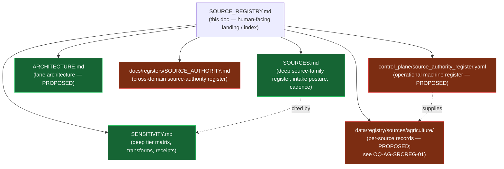
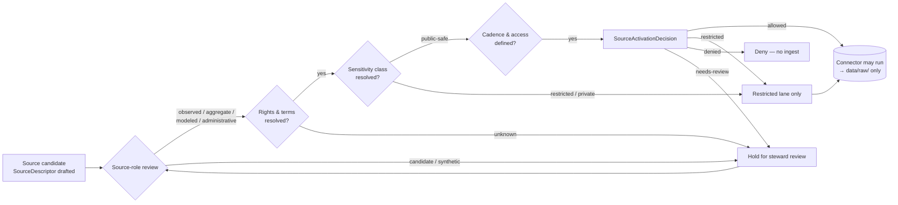

<!-- [KFM_META_BLOCK_V2]
doc_id: kfm://doc/domains/agriculture/source-registry
title: Agriculture · Source Registry
type: standard
version: v1.1
status: draft
owners: TODO — Agriculture domain steward + Source-registry steward
created: 2026-05-15
updated: 2026-05-26
policy_label: public
related:
  - docs/doctrine/ai-build-operating-contract.md
  - docs/doctrine/directory-rules.md
  - docs/domains/agriculture/README.md
  - docs/domains/agriculture/ARCHITECTURE.md
  - docs/domains/agriculture/SOURCES.md
  - docs/domains/agriculture/SENSITIVITY.md
  - docs/domains/agriculture/VERIFICATION_BACKLOG.md
  - docs/domains/README.md
  - docs/sources/SOURCE_DESCRIPTOR_STANDARD.md
  - docs/registers/SOURCE_AUTHORITY.md
  - control_plane/source_authority_register.yaml
  - schemas/contracts/v1/source/source-descriptor.schema.json
  - policy/domains/agriculture/
  - data/registry/sources/agriculture/
tags: [kfm, domain, agriculture, source-registry, governance]
notes:
  - CONTRACT_VERSION pin = "3.0.0"
  - This file is the human-facing **landing page** for the Agriculture-domain source registry slice. It indexes; it is not the operational register.
  - The operational machine surface lives under `control_plane/source_authority_register.yaml` and `data/registry/sources/agriculture/` (or `data/registry/source_descriptors/agriculture/` — see OQ-AG-SRCREG-01 conflict).
  - Two sibling docs carry the deep content: `SOURCES.md` (source-family register, source-role discipline, intake cadence) and `SENSITIVITY.md` (per-object-class tier matrix, transforms, receipts).
  - All repo-path-shaped claims remain PROPOSED until verified against a mounted repository.
[/KFM_META_BLOCK_V2] -->

# 🌾 Agriculture · Source Registry

> Admission and authority-control surface for every source that may shape Agriculture-domain claims in KFM. Sources are admitted, restricted, quarantined, or denied **before** they reach a public layer.

> **Doctrine pin.** `CONTRACT_VERSION = "3.0.0"`. Every `GENERATED_RECEIPT.json`, every PR body, and every doctrine-adjacent document derived from this file MUST emit this string.

**Status:** draft &nbsp;·&nbsp; **Owners:** TODO — Agriculture domain steward + Source-registry steward &nbsp;·&nbsp; **Last updated:** 2026-05-26

**Companion documents (Agriculture lane):**
[`SOURCES.md`](./SOURCES.md) — deep source-family register and intake posture &nbsp;·&nbsp;
[`SENSITIVITY.md`](./SENSITIVITY.md) — deep tier matrix and release posture &nbsp;·&nbsp;
[`ARCHITECTURE.md`](./ARCHITECTURE.md) — lane architecture (PROPOSED)

---

## Quick jump

- [1 · Scope](#1--scope)
- [2 · Repo fit](#2--repo-fit)
- [3 · What belongs here](#3--what-belongs-here)
- [4 · What does NOT belong here](#4--what-does-not-belong-here)
- [5 · Source families](#5--source-families)
- [6 · Source roles (anti-collapse)](#6--source-roles-anti-collapse)
- [7 · Rights and sensitivity posture](#7--rights-and-sensitivity-posture)
- [8 · Source-activation flow](#8--source-activation-flow)
- [9 · SourceDescriptor field surface](#9--sourcedescriptor-field-surface)
- [10 · Lifecycle posture](#10--lifecycle-posture)
- [11 · Validators and tests](#11--validators-and-tests)
- [12 · Related docs](#12--related-docs)
- [13 · Verification backlog](#13--verification-backlog)
- [14 · Open questions register](#14--open-questions-register)
- [15 · Changelog v1.0 → v1.1](#15--changelog-v10--v11)
- [16 · Definition of done](#16--definition-of-done)
- [Appendix · Per-source notes](#appendix--per-source-notes)

---

## 1 · Scope

This document is the **human-facing landing page** for the Agriculture-domain slice of the KFM source registry. It records, at index depth, which source families the Agriculture lane may admit, the **source-role** each may carry, the rights and sensitivity posture each enters with, the activation flow that precedes ingestion, and the lifecycle and validator surfaces that govern downstream use.

The KFM source registry as a whole is doctrinally defined as **"an admission and authority-control surface, not a bibliography"** — it records *source identity, role, rights posture, access method, cadence, steward, sensitivity, freshness expectations, attribution requirements, and public-release class* so that source material is admitted, quarantined, restricted, or denied before it shapes public claims (CONFIRMED doctrine; `[Unified Manual §3.6]`, `[ENCY §6]`).

> [!IMPORTANT]
> Agriculture's public posture is **aggregate or permissioned only**. Field-level NASS claims, farm-operator private data, proprietary yield, pesticide records, and private-sensitive joins **fail closed** by default (CONFIRMED doctrine; `[DOM-AG]`, `[ENCY §7.7]`). The deep tier matrix that governs every release decision is `SENSITIVITY.md`; the deep intake register is `SOURCES.md`.

[Back to top ↑](#-agriculture--source-registry)

---

## 2 · Repo fit

**This file (PROPOSED path):** `docs/domains/agriculture/SOURCE_REGISTRY.md`
**Authority root:** `docs/` — human explanation of doctrine and governance.
**Domain placement:** Agriculture appears as a **segment** under `docs/domains/`, not as a root folder (Directory Rules §3 Step 3 — Domain Placement Law).

**Upstream of this file:**

| Source | Relationship |
| --- | --- |
| `docs/doctrine/ai-build-operating-contract.md` (CONFIRMED) | Operating Law §1 and §20 (Source and evidence handling); pins `CONTRACT_VERSION = "3.0.0"`. |
| `docs/doctrine/directory-rules.md` (CONFIRMED) | Governs placement; §3 (Step 3) places domain files under responsibility roots, not new root folders; §7.4 / ADR-0001 set schema home. |
| `docs/sources/SOURCE_DESCRIPTOR_STANDARD.md` (PROPOSED) | Cross-domain field standard this doc conforms to. |
| `docs/registers/SOURCE_AUTHORITY.md` (PROPOSED) | Closed cross-domain source-authority taxonomy register. |
| `control_plane/source_authority_register.yaml` (PROPOSED) | Canonical, machine-readable register of approved/retired/quarantined sources and source-authority roles. |
| `schemas/contracts/v1/source/source-descriptor.schema.json` (PROPOSED) | Canonical schema home per Directory Rules §7.4 / ADR-0001. |

**Sibling documents (Agriculture lane):**

| Sibling | Relationship |
| --- | --- |
| [`SOURCES.md`](./SOURCES.md) | **Deep** source-family register, fixed primary `source_role` per source, watcher cadence, SourceDescriptor field shape, cross-lane source sharing. This doc indexes; `SOURCES.md` is the load-bearing register. |
| [`SENSITIVITY.md`](./SENSITIVITY.md) | **Deep** per-object-class tier matrix (T0–T4), allowed transforms, required receipts, tier transitions, deny lanes. This doc names the posture in summary; `SENSITIVITY.md` decides per-class. |
| [`ARCHITECTURE.md`](./ARCHITECTURE.md) (PROPOSED) | Lane architecture: object families, cross-lane relations, API surfaces, validators. |
| `VERIFICATION_BACKLOG.md` (PROPOSED) | Aggregated open items across all Agriculture documents. |

**Downstream of this file:**

| Target | Relationship |
| --- | --- |
| `data/registry/sources/agriculture/` (PROPOSED) | Per-source records emitted alongside lifecycle data. See OQ-AG-SRCREG-01 for the `sources/` vs `source_descriptors/` naming conflict. |
| `connectors/<source>/` (PROPOSED) | Connector inventory MUST cite a SourceDescriptor and remain inactive until activation. |
| `policy/domains/agriculture/` (PROPOSED) | Rights / sensitivity / publication gates enforced against descriptor fields. |
| `policy/sensitivity/agriculture/` (PROPOSED) | Sensitivity rules; sourced from `SENSITIVITY.md`. |
| `tests/domains/agriculture/` (PROPOSED) | Validator coverage referenced in [§11](#11--validators-and-tests). |
| `release/candidates/agriculture/` (PROPOSED) | Release packages must close back to descriptors for every contributing source. |

> [!NOTE]
> Paths above are PROPOSED until a mounted repository confirms them. Per Directory Rules §7.4 and ADR-0001, `schemas/contracts/v1/<...>` is the default schema home; any divergent location requires an ADR. The `data/registry/sources/` vs `data/registry/source_descriptors/` naming conflict is logged at OQ-AG-SRCREG-01.

[Back to top ↑](#-agriculture--source-registry)

---

## 3 · What belongs here

- A **roster** of Agriculture source families (this doc's [§5](#5--source-families)) — concise; the deep register is `SOURCES.md` §3.
- The **source-role** discipline applied across those families (this doc's [§6](#6--source-roles-anti-collapse)) — summarized; the deep discussion is `SOURCES.md` §4.
- Rights, sensitivity, and public-release posture per family (this doc's [§7](#7--rights-and-sensitivity-posture)) — summarized; the deep tier matrix is `SENSITIVITY.md` §3.
- The **activation flow** every Agriculture source must clear before connectors run (this doc's [§8](#8--source-activation-flow)).
- The descriptor field surface as it applies to Agriculture (this doc's [§9](#9--sourcedescriptor-field-surface)) — illustrative; the deep field shape is `SOURCES.md` §6.
- Pointers to the validators and policy gates that enforce admission (this doc's [§11](#11--validators-and-tests)).

## 4 · What does NOT belong here

- **The operational register itself.** Per-source approved/retired/quarantined records live under `control_plane/source_authority_register.yaml` (PROPOSED) and `data/registry/sources/agriculture/` (PROPOSED).
- **The full deep source-family register.** That lives at [`SOURCES.md`](./SOURCES.md); this doc summarizes and links.
- **The full deep sensitivity matrix.** That lives at [`SENSITIVITY.md`](./SENSITIVITY.md); this doc summarizes and links.
- **The SourceDescriptor schema.** Machine shape lives under `schemas/contracts/v1/source/source-descriptor.schema.json` (PROPOSED; per ADR-0001).
- **Connector implementations.** They live under `connectors/` and emit only to `data/raw/` or `data/quarantine/` (CONFIRMED; Directory Rules §7.3).
- **Released layers or tiles.** Those live under `data/published/layers/agriculture/` (PROPOSED) and are governed by `LayerManifest` and `ReleaseManifest`.
- **Field-level / farm-operator records as public truth.** These are denied by default and routed to quarantine or restricted access (CONFIRMED doctrine; `[DOM-AG]`).

[Back to top ↑](#-agriculture--source-registry)

---

## 5 · Source families

CONFIRMED domain dossier / PROPOSED implementation. The following families are catalogued for the Agriculture lane (`[DOM-AG]`, `[ENCY §7.7]`). Primary `source_role` assignments are aligned with [`SOURCES.md` §3.1](./SOURCES.md#3-source-family-register); ADR-S-04 (source-role vocabulary) is the authoritative resolution path.

| Source family | Primary role (per `SOURCES.md` §3.1) | Secondary roles permitted | Public-release default | Sensitivity flag | Status |
| --- | --- | --- | --- | --- | --- |
| USDA NASS CDL (Cropland Data Layer) | `modeled` (annual crop classification) | `aggregate` for county roll-ups | aggregate-safe at native scale (context layer) | low (public product) | PROPOSED |
| USDA NASS QuickStats / Crop Progress | **`aggregate`** (county / state / year) | `administrative` for survey panel definitions | aggregate-safe ONLY; field-level joins **DENY** | high (re-identification on join) | PROPOSED |
| NRCS conservation practice data | `administrative` | `observed` per practice record | restricted unless aggregated | high (operator-identifying) | PROPOSED |
| NRCS SSURGO / Soil Data Access (SDA) | **`observed`** (soil pedon descriptions; survey data) | `aggregate` for MUKEY summaries | aggregate-safe; map-unit publication allowed under terms | low–medium | PROPOSED |
| NRCS gSSURGO (gridded SSURGO) | **`aggregate`** (gridded derivative of SSURGO) | none — never relabel as `observed` | aggregate-safe; freshness pinned to survey vintage | low–medium | PROPOSED |
| Kansas Mesonet (soil moisture / ag-weather) | **`observed`** (station: 5/10/20/50 cm soil moisture; weather) | `aggregate` for station-period summaries | terms-dependent; attribution required | low | PROPOSED |
| NRCS SCAN (Soil Climate Analysis Network) | **`observed`** (station) | `aggregate` for daily/monthly summaries | terms-dependent | low | PROPOSED |
| NOAA USCRN | **`observed`** (in-situ reference-quality sensor) | `aggregate` for daily/monthly summaries | public; attribution | low | PROPOSED |
| NASA SMAP (soil moisture) | **`modeled`** (Level-3/4 retrieval; the L1 brightness temperature is `observed`, the L3/L4 product Agriculture admits is modeled) | `aggregate` for downscaled or temporally averaged surfaces | aggregate / context layer | low | PROPOSED |
| NASA HLS / HLS-VI (harmonized Landsat–Sentinel + vegetation index) | **`modeled`** (surface-reflectance harmonization; VI derivatives) | `aggregate` for temporally composited products | context layer only; not field truth | low | PROPOSED |
| Irrigation / water-use sources | `administrative` | `observed` per well/meter record | **RESTRICT public**; operator joins DENY | high | PROPOSED |
| Crop insurance / market / economy (where permitted) | `administrative` | `aggregate` where rights allow | aggregate-safe ONLY where rights allow | high | PROPOSED |
| Local extension sources | varies | varies | per-source; activation gate applies | varies | PROPOSED |

> [!CAUTION]
> *Aggregate-cited-as-per-place-truth* is an Atlas-named anti-pattern: **DENY** joining an aggregate cell (county, HUC, year) to a single field, parcel, or operator record. AI must `ABSTAIN`; the trust membrane must `DENY` (`[Atlas v1.1 §24.1.2]`, `[DOM-AG]`). This is the highest-risk collapse pattern for Agriculture and is enumerated again in `SENSITIVITY.md` §7 and `SOURCES.md` §7.

[Back to top ↑](#-agriculture--source-registry)

---

## 6 · Source roles (anti-collapse)

CONFIRMED doctrine: KFM treats **source role** as a first-class identity attribute. An observed reading is not interchangeable with a modeled estimate; a regulatory determination is not interchangeable with an administrative compilation; an aggregate publication is not interchangeable with candidate evidence; synthetic content is never observed reality (`[Atlas v1.1 §24.1]`, `[ENCY]`). The deep discussion lives at [`SOURCES.md` §4](./SOURCES.md#4-source-role-discipline).

| Role | Definition | Agriculture example | Anti-collapse rule |
| --- | --- | --- | --- |
| `observed` | Direct reading, measurement, or first-hand evidentiary record tied to place and time. | Mesonet station soil-moisture reading; SCAN sensor sample; SSURGO pedon description. | Never relabeled as `regulatory` or `administrative`. May feed `modeled` / `aggregate` products. |
| `regulatory` | Authoritative determination by a body with legal or administrative force. | (Limited in Agriculture; e.g., conservation-program designation or USDA easement designation when present.) | Never labeled `observed` or `modeled`. |
| `modeled` | Derived product from inputs, assumptions, or fitted parameters. | SMAP L3/L4 retrievals; HLS-VI derived indices; Soil Crop Suitability rasters; CDL annual classification. | Must cite model identity + `ModelRunReceipt`; never labeled an observation. |
| `aggregate` | Summary / total / average over a geometry-time unit; irreversible loss of individual record fidelity. | NASS QuickStats county totals; CDL county roll-ups; decadal climate normals; gSSURGO grid summary. | Cite with `AggregationReceipt`; never per-place truth. |
| `administrative` | Compiled record for administration, registration, or accounting — not necessarily observation or regulation. | Crop-insurance enrollment compilations; conservation-practice rosters; NASS survey panel definitions. | Cite as administrative context; never collapsed with observation. |
| `candidate` | Pre-merge evidence under review. | Remote-sensing anomaly candidates (e.g., vegetation-stress detections); unmerged Field Candidate footprints. | `PUBLISHED` edge forbidden until merged. Candidate exposure on a public surface DENIES at the trust membrane. |
| `synthetic` | Generated content — model surfaces or AI carriers — that is not real observation. | AI-drafted summary of an Agriculture EvidenceBundle; reconstructed historical crop layer. (Avoid in Agriculture public outputs; if used, requires Reality Boundary Note + `RepresentationReceipt`.) | Synthetic cannot be presented as observed reality. |

> [!WARNING]
> **Source role cannot be inferred from convenience.** A remote-sensing anomaly is a *candidate* until reviewed; a NASS county total is *aggregate*, never a field-level fact; a conservation-practice roster is *administrative*, never an observation of practice on a specific parcel; a SMAP L3/L4 product is *modeled*, even though its inputs are observed brightness temperatures (CONFIRMED cross-domain rule; `[Unified Manual §3.6]`, `[Atlas v1.1 §24.1.1]`).

[Back to top ↑](#-agriculture--source-registry)

---

## 7 · Rights and sensitivity posture

CONFIRMED doctrine: unclear rights, unresolved source role, missing evidence, unresolved sensitivity, or absent release state **block public promotion** (`[ENCY]`, `[Directory Rules]`). The deep per-object-class tier matrix and tier-transition gates live at [`SENSITIVITY.md` §3](./SENSITIVITY.md#3-tier-matrix) and [`SENSITIVITY.md` §4](./SENSITIVITY.md#4-required-transforms-and-receipts).

### 7.1 · Default postures

| Class | Default outcome | Required controls | Agriculture example |
| --- | --- | --- | --- |
| Private landowner-sensitive data | **DENY** exact/public if private or rights unclear | aggregation; permissions; policy review | Field boundaries, owner identity, operations (`SRC-AG`, `SRC-PEOPLE`) |
| Source-rights-limited records | **DENY** public release until terms resolved | rights register; attribution; no public derivative if barred | Crop insurance, restricted market feeds |
| Aggregate cited as per-place truth | **DENY** join from aggregate cell to single record; AI `ABSTAIN` | `AggregationReceipt`; geometry-scope guard (`role_aggregation_unit`) | NASS county total joined to a single farm |
| Candidate on a public surface | **DENY** at trust membrane; route to `QUARANTINE` | Promotion gate; no `PUBLISHED` edge to WORK/QUARANTINE | Unreviewed remote-sensing stress detection |
| Model output as observation | **DENY** publication of modeled as observed | `role_model_run_ref`; source-role badge in UI | SMAP retrieval presented as a ground measurement |

### 7.2 · Public surfaces — what may publish

PROPOSED (consistent with `[DOM-AG]`, `[ENCY §7.7]`, and the per-class table in [`SENSITIVITY.md` §3.2](./SENSITIVITY.md#32-per-object-class-tier-matrix-agriculture)):

- Public-safe **county / HUC / grid aggregations** of crop area, condition, and yield (default `T0`/`T1`).
- **CDL** at native scale (raster classification) as a context layer.
- **SSURGO / gSSURGO** map units and gridded soils as context (under current terms).
- **Mesonet / SCAN / USCRN** time series at station scope.
- **SMAP / HLS-VI** as context layers with source-role badges.
- **AggregationReceipt** + **RedactionReceipt** alongside any product where transformation removed or generalized content.

### 7.3 · Public surfaces — what may NOT publish

- Field-level NASS claims as observation (`[DOM-AG]` validator: `policy denial for field-level NASS claims`).
- Operator-identifying conservation, irrigation, insurance, or pesticide records.
- Joins from aggregate cells to individual operators or fields.
- Modeled values presented without `role_authority` + `role_model_run_ref`.
- Candidates without merge / review state.

[Back to top ↑](#-agriculture--source-registry)

---

## 8 · Source-activation flow

PROPOSED activation flow (CONFIRMED doctrine; per `[Unified Manual §3.6]`, `[BLD-COMP §§8.1–8.2]`): create or update `SourceDescriptor`; review source role, rights, sensitivity, cadence, and access; issue `SourceActivationDecision` declaring `allowed | restricted | denied | needs-review`; keep connectors and watchers **inactive** until activation decision, fixtures, validators, and policy gates exist. The cadence numbers consumed by the activation decision live at [`SOURCES.md` §8](./SOURCES.md#8-watcher-cadence-and-freshness).

> [!NOTE]
> **Connectors do not publish.** Per Directory Rules §7.3, connector output MUST land in `data/raw/<domain>/<source_id>/<run_id>/` or `data/quarantine/...`. Movement onward through `WORK → PROCESSED → CATALOG → PUBLISHED` is a *governed state transition*, not a file move (CONFIRMED).

[Back to top ↑](#-agriculture--source-registry)

---

## 9 · SourceDescriptor field surface

PROPOSED schema-home note: the canonical schema for `SourceDescriptor` defaults to `schemas/contracts/v1/source/source-descriptor.schema.json` per Directory Rules §7.4 and ADR-0001 (PROPOSED until verified). The field surface below is **illustrative, not authoritative** — it reflects Atlas v1.1 §24.1.3 and the ENCY Appendix E feature index. The deep field shape and role-conditional fields are in [`SOURCES.md` §6](./SOURCES.md#6-sourcedescriptor-shape-proposed). Implementation in the mounted schema is **NEEDS VERIFICATION**.

| Field | Type / vocabulary | Required? | Notes (Agriculture-relevant) |
| --- | --- | --- | --- |
| `source_id` | string (stable identifier) | MUST | E.g., `SRC-AG-NASS-QUICKSTATS`, `SRC-AG-NRCS-SSURGO`. |
| `source_role` | enum: `observed` \| `regulatory` \| `modeled` \| `aggregate` \| `administrative` \| `candidate` \| `synthetic` | MUST | Set at admission. Never edited in-place; corrections produce a new descriptor + `CorrectionNotice`. |
| `role_authority` | string (issuing body / model identity / steward) | MUST when role ∈ {`regulatory`, `modeled`, `aggregate`} | E.g., "USDA NASS" for QuickStats aggregates; "NASA SMAP" for L3/L4 retrievals. |
| `role_aggregation_unit` | geometry-scope token (county, HUC, tract, year, decade, …) | MUST when `source_role = aggregate` | Prevents geometry-scope drift on join. E.g., `county`, `crop_year`. |
| `role_model_run_ref` | EvidenceRef → `ModelRunReceipt` | MUST when `source_role = modeled` | Pins inputs, parameters, and version. Required for SMAP, HLS-VI, CDL, suitability rasters. |
| `role_synthetic_basis` | structured `{ method, inputs, reality_boundary_note_ref }` | MUST when `source_role = synthetic` | Records what is and is not real. Avoid in Agriculture public outputs. |
| `role_candidate_disposition` | enum: `pending` \| `merged` \| `rejected` \| `quarantined` | MUST when `source_role = candidate` | `PUBLISHED` edge forbidden until merged. |
| `rights` | structured (license, attribution, redistribution, terms_ref) | MUST | "Unknown rights fail closed." |
| `sensitivity` | enum (per cross-domain sensitivity register) | MUST | Drives public-release class and required transforms; see `SENSITIVITY.md` §3.2. |
| `cadence` | structured (issue, retrieval, freshness expectation) | MUST | Source-vintage or cadence specific for SSURGO; near-real-time for Mesonet; weekly for NASS Crop Progress. Per-class starting windows in `SOURCES.md` §8. |
| `access` | structured (method, credentials class, rate limits) | MUST | Mesonet / AirNow / etc. may carry written-consent or attribution constraints. |
| `citation` | string / structured (attribution text) | MUST | Surfaces in Evidence Drawer and exports. |
| `ingest_hash` | content / spec hash | MUST | `spec_hash` ≠ `content_hash` ≠ `run_hash`. |

[Back to top ↑](#-agriculture--source-registry)

---

## 10 · Lifecycle posture

CONFIRMED doctrine / PROPOSED lane application — Agriculture follows the KFM lifecycle invariant (`[Directory Rules §9]`, `[DOM-AG]`):

> **RAW → WORK / QUARANTINE → PROCESSED → CATALOG / TRIPLET → PUBLISHED**

| Stage | Handling (Agriculture) | Gate |
| --- | --- | --- |
| **RAW** | Capture immutable source payload or reference with role, rights, sensitivity, citation, time, hash. | `SourceDescriptor` exists. |
| **WORK / QUARANTINE** | Normalize schema, geometry, time, identity, evidence, rights, policy; hold failures (rights-unknown, field-level NASS attempts, candidate exposure attempts). | Validation + policy gate pass, or quarantine reason recorded. |
| **PROCESSED** | Emit validated normalized objects (`CropObservation`, `FieldCandidate`, `YieldObservation` aggregates, `IrrigationLink`, `ConservationPractice`, `SoilCropSuitability`, `AgriculturalEconomyObservation`, `SupplyChainNode`, `DroughtStressIndicator`, `PestStressIndicator`, `AggregationReceipt`). | `EvidenceRef`, `ValidationReport`, digest closure. |
| **CATALOG / TRIPLET** | Emit catalog records, `EvidenceBundle`s, graph/triplet projections, release candidates. | Catalog / proof closure passes. |
| **PUBLISHED** | Serve released public-safe artifacts through governed APIs and manifests; field-level detail still denied. | `ReleaseManifest`, correction path, rollback target, review/policy state. |

> [!IMPORTANT]
> **Promotion is a governed state transition, not a file move.** A path-level write that bypasses validators, policy gates, `EvidenceBundle` creation, catalog closure, and release-decision recording is a violation of the invariant regardless of which directory the bytes ended up in (CONFIRMED; `[Directory Rules §9.1]`).

[Back to top ↑](#-agriculture--source-registry)

---

## 11 · Validators and tests

PROPOSED test coverage (`[DOM-AG]`, `[ENCY]`). The Agriculture lane test surface is enumerated in [`SENSITIVITY.md` §9](./SENSITIVITY.md#9-validators-fixtures-and-tests) and [`SOURCES.md` §11](./SOURCES.md#11-validators-fixtures-and-tests); the items below are the source-registry slice:

- **SSURGO / SDA lineage tests** — verify map-unit and component lineage round-trips.
- **Soil-moisture unit / depth / QC tests** — Mesonet, SCAN, USCRN, SMAP normalization (units, depths, QA flags).
- **Crop-progress aggregate-only tests** — QuickStats / Crop Progress published only at allowed aggregation units.
- **Vegetation index mask / time tests** — HLS-VI cloud and AOD masking; temporal alignment to growing season.
- **Policy denial for field-level NASS claims** — DENY validator covering aggregate-cited-as-per-place-truth.
- **Catalog closure tests** — every Agriculture released dataset / layer has source, schema, validation, policy, and release metadata.
- **Cross-domain (Soil / Hydrology / Atmosphere / People-Land)** — joins must preserve ownership, source role, sensitivity, and EvidenceBundle support (CONFIRMED / PROPOSED; `[Atlas v1.1 §F]`).
- **SourceDescriptor schema round-trip** (per `SOURCES.md` §11) — every Agriculture descriptor parses and re-serializes identically.
- **Rights-unresolved quarantine** (per `SOURCES.md` §11) — a `SourceDescriptor` with `rights.license = "NEEDS VERIFICATION"` or any `UNKNOWN` value routes to `QUARANTINE` at admission.

PROPOSED home (subject to Directory Rules + ADR): `tests/domains/agriculture/`, `fixtures/domains/agriculture/`, `tools/validators/domains/agriculture/`.

> [!TIP]
> No-network fixtures should be the default for Agriculture admission tests. A connector that requires the network to pass its admission test cannot be activated under the source-activation flow.

[Back to top ↑](#-agriculture--source-registry)

---

## 12 · Related docs

**Sibling Agriculture documents:**

- [`docs/domains/agriculture/SOURCES.md`](./SOURCES.md) — **deep** source-family register, intake posture, cadence, cross-lane source sharing.
- [`docs/domains/agriculture/SENSITIVITY.md`](./SENSITIVITY.md) — **deep** per-object-class tier matrix and release posture.
- [`docs/domains/agriculture/README.md`](./README.md) — Agriculture-lane landing page (PROPOSED).
- [`docs/domains/agriculture/ARCHITECTURE.md`](./ARCHITECTURE.md) — Agriculture architecture dossier (PROPOSED).
- [`docs/domains/agriculture/VERIFICATION_BACKLOG.md`](./VERIFICATION_BACKLOG.md) — aggregated open items (PROPOSED).

**Upstream doctrine and registers:**

- [`docs/doctrine/ai-build-operating-contract.md`](../../doctrine/ai-build-operating-contract.md) — Operating Law and `CONTRACT_VERSION = "3.0.0"`.
- [`docs/doctrine/directory-rules.md`](../../doctrine/directory-rules.md) — placement and lifecycle law (CONFIRMED doctrine).
- [`docs/sources/SOURCE_DESCRIPTOR_STANDARD.md`](../../sources/SOURCE_DESCRIPTOR_STANDARD.md) — cross-domain SourceDescriptor standard (PROPOSED).
- [`docs/registers/SOURCE_AUTHORITY.md`](../../registers/SOURCE_AUTHORITY.md) — closed cross-domain source-authority register (PROPOSED).
- [`docs/registers/DRIFT_REGISTER.md`](../../registers/DRIFT_REGISTER.md) — register drift between this doc and repo evidence.
- [`docs/domains/README.md`](../README.md) — domain lane index (PROPOSED).

**Downstream operational surfaces (PROPOSED):**

- `control_plane/source_authority_register.yaml` — machine-readable source register.
- `schemas/contracts/v1/source/source-descriptor.schema.json` — canonical SourceDescriptor schema (per ADR-0001).
- `policy/domains/agriculture/` — domain policy gates.
- `policy/sensitivity/agriculture/` — sensitivity rules (per `SENSITIVITY.md`).
- `tests/domains/agriculture/` — domain validators.

[Back to top ↑](#-agriculture--source-registry)

---

## 13 · Verification backlog

The following items are **NEEDS VERIFICATION** until a mounted repository (or an authoritative ADR) resolves them:

| Item | Evidence that would settle it | Status |
| --- | --- | --- |
| Exact path of this file in the mounted repo | Mounted-repo inspection or ADR | PROPOSED |
| Final SourceDescriptor schema-home and field names | Mounted schema file or ADR-0001 verification | NEEDS VERIFICATION |
| Existence and contents of `control_plane/source_authority_register.yaml` | Mounted-repo inspection | NEEDS VERIFICATION |
| Per-source license, attribution, and redistribution terms for every family in [§5](#5--source-families) | `SourceActivationDecision` records issued and stored | NEEDS VERIFICATION |
| Public-release thresholds (county vs HUC vs grid) — actual cell sizes and minimum cell counts | Domain steward decision + policy package | NEEDS VERIFICATION |
| Agriculture validator names and exit-code contract | `tools/validators/domains/agriculture/` inspection | NEEDS VERIFICATION |
| Owner identities for this file (placeholders in meta block) | CODEOWNERS or steward roster | TODO |
| `[DOM-AG]` vs `[ENCY §7.7]` reconciliation of any drift | Side-by-side review with Atlas v1.1 §24 anti-collapse rules | NEEDS VERIFICATION |
| Naming: `data/registry/sources/agriculture/` vs `data/registry/source_descriptors/agriculture/` | ADR + mounted-repo inspection | CONFLICTED (see OQ-AG-SRCREG-01) |
| Agreement between this doc's [§5](#5--source-families) primary-role assignments and `SOURCES.md` §3.1 | Side-by-side review under ADR-S-04 | NEEDS VERIFICATION |
| Agreement between this doc's [§7](#7--rights-and-sensitivity-posture) and `SENSITIVITY.md` §3.2 default tiers | Side-by-side review under ADR-S-05 | NEEDS VERIFICATION |

[Back to top ↑](#-agriculture--source-registry)

---

## 14 · Open questions register

| ID | Question | Owner role | Resolution path |
| --- | --- | --- | --- |
| `OQ-AG-SRCREG-01` | Is the canonical operational home `data/registry/sources/agriculture/` (this doc's working path) or `data/registry/source_descriptors/agriculture/` (Build Manual §5 + `SOURCES.md` working path)? | Source steward + docs steward | Directory Rules check + ADR; once resolved, both sibling docs update in lockstep. |
| `OQ-AG-SRCREG-02` | Should this landing-page document and `SOURCES.md` be merged into a single deep document, or should the index / deep split be preserved? | Docs steward + Agriculture steward | Maintainer review; decision recorded as a CHANGELOG note in v1.2 if a merge is chosen. |
| `OQ-AG-SRCREG-03` | What `source_id` URN convention does Agriculture adopt — `SRC-AG-<UPPER>` (current §5 examples) or `kfm:source:agriculture:<lower>:v1` (`SOURCES.md` §6 examples)? | Source steward | ADR-S-04 (source-role vocabulary) or a dedicated naming ADR. |
| `OQ-AG-SRCREG-04` | Does CDL land as `modeled` (this doc's revised §5 row, aligned with `SOURCES.md`) or as `observed → aggregate/modeled` (v1.0 phrasing, treating the raster classification as observation of a satellite product)? | Agriculture steward | ADR-S-04 worked example. |
| `OQ-AG-SRCREG-05` | When a source admits at different roles per variable (e.g., Mesonet `observed` sensor vs. derived daily summary `aggregate`), does this landing page record one row or multiple? | Source steward | Resolution mirrors `SOURCES.md` OQ-AG-SRC-02. |
| `OQ-AG-SRCREG-06` | Is the activation flow in [§8](#8--source-activation-flow) covered by a `SourceActivationDecision` schema, or is it implicit in `PolicyDecision`? | Policy steward | Schema ADR. |
| `OQ-AG-SRCREG-07` | Should the per-source notes appendix be promoted to a standalone document under `docs/domains/agriculture/sources/<source>.md`, or kept inline here as a collapsed appendix? | Docs steward | Maintainer review. |

[Back to top ↑](#-agriculture--source-registry)

---

## 15 · Changelog v1.0 → v1.1

| Change | Type (per contract §37) | Reason |
| --- | --- | --- |
| Pinned `CONTRACT_VERSION = "3.0.0"` in meta block, top-of-file callout, and footer. | clarification | Doctrine-adjacent docs MUST emit the contract version. |
| Added `Contract`, `Doctrine basis`, and `Lifecycle` badges; promoted `Field-level: DENY` to link the sibling `SENSITIVITY.md`. | clarification | Polish + makes the deny posture clickable from the landing page. |
| Added a "Companion documents" row under the status line and an authority-stack Mermaid diagram in [§1](#1--scope). | clarification | Makes the SOURCE_REGISTRY / SOURCES / SENSITIVITY relationship visible at first read. |
| Updated `related:` block in the meta to include `SOURCES.md`, `SENSITIVITY.md`, `ARCHITECTURE.md`, `VERIFICATION_BACKLOG.md`, `ai-build-operating-contract.md`, and `docs/registers/SOURCE_AUTHORITY.md`. | clarification | Cross-references for reviewers. |
| Tightened [§2](#2--repo-fit) Repo fit with a new "Sibling documents" sub-table and an explicit OQ-AG-SRCREG-01 conflict note. | reconciliation | Surfaces the `sources/` vs `source_descriptors/` naming conflict without smoothing it over. |
| Updated [§5](#5--source-families) Source families table: fixed primary `source_role` per source aligned to `SOURCES.md` §3.1; renamed columns to "Primary role" / "Secondary roles permitted"; reclassified SMAP as `modeled` primary, HLS/HLS-VI as `modeled` primary, CDL as `modeled` primary. | reconciliation | The v1.0 phrasings were under-specified ("modeled / observed", "observed → modeled"); the revised rows fix the primary role at the admission descriptor and route variants to the secondary-roles column or to ADR-S-04. |
| Strengthened [§6](#6--source-roles-anti-collapse) with the SMAP-as-modeled example (the L1 brightness temperature is observed, the L3/L4 product Agriculture admits is modeled). | clarification | Explicit illustration of the role-preservation rule. |
| Added explicit cross-references from [§7](#7--rights-and-sensitivity-posture), [§9](#9--sourcedescriptor-field-surface), and [§11](#11--validators-and-tests) to the deep sibling docs. | clarification | Reduces drift risk; reviewers can jump to the authoritative depth. |
| Added two test items to [§11](#11--validators-and-tests): SourceDescriptor schema round-trip; rights-unresolved quarantine. | gap closure | Surfaces test obligations already named in `SOURCES.md` §11 so this landing doc references the same surface. |
| Added rows to [§13](#13--verification-backlog) for the `sources/` vs `source_descriptors/` conflict and for cross-doc primary-role / tier-default agreement checks. | housekeeping | Routes drift to the verification backlog rather than silently picking a side. |
| Added [§14 Open questions register](#14--open-questions-register), [§15 Changelog](#15--changelog-v10--v11), and [§16 Definition of done](#16--definition-of-done). | new | Aligns with the doctrine-doc companion-sections pattern under contract §37. |
| Did NOT change: original H2 anchors `#1--scope` through `#13--verification-backlog`, original Appendix anchor `#appendix--per-source-notes`. | n/a | Backward-compatibility commitment for any sibling doc that already links here. |

> **Backward compatibility.** All v1.0 section anchors are preserved. Existing inbound links to `#1--scope` through `#13--verification-backlog` and to the Appendix continue to resolve. New sections appear at §14, §15, §16, before the Appendix.

[Back to top ↑](#-agriculture--source-registry)

---

## 16 · Definition of done

This document is done enough to graduate from `draft` to `review` when:

- it is placed at `docs/domains/agriculture/SOURCE_REGISTRY.md` per Directory Rules §3 and §6.1 (PROPOSED — sibling to `README.md`, `ARCHITECTURE.md`, `SOURCES.md`, `SENSITIVITY.md`, `VERIFICATION_BACKLOG.md`);
- the Agriculture domain steward, the source-registry steward, and the docs steward have reviewed it;
- it is linked from `docs/domains/agriculture/README.md` and from `docs/registers/SOURCE_AUTHORITY.md`;
- it does not conflict with accepted ADRs (ADR-0001 schema home, ADR-S-04 source-role vocabulary, ADR-S-05 sensitivity tier scheme);
- the OQ-AG-SRCREG-01 (`sources/` vs `source_descriptors/`) naming conflict is recorded in `docs/registers/DRIFT_REGISTER.md`;
- the primary-role assignments in [§5](#5--source-families) agree with `SOURCES.md` §3.1, and the default postures in [§7](#7--rights-and-sensitivity-posture) agree with `SENSITIVITY.md` §3.2;
- the `GENERATED_RECEIPT.json` planned in the authoring notes is wired into CI;
- future changes follow the operating contract's §37 lifecycle (MAJOR / MINOR / PATCH).

[Back to top ↑](#-agriculture--source-registry)

---

## Appendix · Per-source notes

<strong>USDA NASS — CDL and QuickStats / Crop Progress</strong> (click to expand)

- **CDL (Cropland Data Layer):** annual raster crop classification at native scale. **Primary role: `modeled`** (the classification is a derived product from satellite inputs and a classifier, not an observation of a crop on the ground). Downstream roll-ups carry `aggregate` as a secondary role. Native classification is preserved; advisory crosswalks only (`KFM-P2-IDEA-0028`).
- **QuickStats / Crop Progress:** weekly / seasonal county-and-state aggregates. **Primary role: `aggregate`.** `role_aggregation_unit` MUST be set (typically `state_county_crop_year` or `state_crop_week`). DENY any join from these aggregates to a single field or operator.
- **Public release default:** aggregate-safe at original aggregation unit; field-level claim DENY by default.
- **Sensitivity:** low for the published aggregate; **re-identification risk on join** is the central anti-collapse concern.

<strong>NRCS — SSURGO, gSSURGO, Soil Data Access (SDA)</strong>

- **SSURGO / SDA:** soil map units, components, horizons, properties (static survey). **Primary role: `observed`** (pedon descriptions tied to place and survey time); `aggregate` for MUKEY summaries.
- **gSSURGO:** gridded derivative of SSURGO. **Primary role: `aggregate`** (gridded summary over map-unit polygons; never relabel as `observed`).
- **Public release default:** aggregate-safe under current NRCS terms. **NEEDS VERIFICATION** for current terms.
- **Freshness:** source-vintage specific; SSURGO survey areas vary in last-survey date.
- **Use in joins:** soil–crop suitability (cross-domain → Soil; MUKEY joins) MUST preserve ownership and source role.

<strong>Kansas Mesonet · NRCS SCAN · NOAA USCRN — station soil moisture and ag-weather</strong>

- **Primary role: `observed`** (station readings); `aggregate` for daily/monthly summaries.
- **Public release default:** terms-dependent; Kansas Mesonet typically requires attribution and may require written consent for bulk REST consumption (**NEEDS VERIFICATION** — see external admissibility check before connector activation).
- **Sensitivity:** low.
- **Use:** station-scope time series for drought and crop-stress context. Do not present a single station as field truth.

<strong>NASA SMAP · HLS / HLS-VI — satellite soil moisture and vegetation index</strong>

- **SMAP:** **Primary role: `modeled`** (Level-3/4 retrieval; the Level-1 brightness temperature is observed, the L3/L4 product Agriculture admits is modeled). `role_authority` = "NASA SMAP"; `role_model_run_ref` MUST resolve.
- **HLS / HLS-VI:** **Primary role: `modeled`** (the harmonized surface-reflectance product is itself a modeled derivative; the VI is a further model). `role_authority` = "NASA LP DAAC". Cloud + AOD masking and seasonal baselines are pipeline-mandatory; vegetation-stress candidates remain `candidate` until reviewed.
- **Public release default:** context layer; aggregate-safe.
- **Caveat:** satellite products **must not become field/operator truth** (CONFIRMED `[DOM-AG]`).

<strong>Irrigation / water-use · Crop-insurance / market / economy · Local extension</strong>

- **Irrigation / water-use:** often operator-identifying. **Primary role typically `administrative`**; `observed` per well/meter record where applicable. Public posture: RESTRICT or aggregate-only. Cross-lane inheritance from `[DOM-HYD]` private-well denial applies (see `SENSITIVITY.md` §6).
- **Crop-insurance / market / economy:** publish only where rights allow; usually `administrative` (primary) or `aggregate` (where rights allow). Operator-identifying joins DENY.
- **Local extension:** per-source; activation flow applies. Often `observed` or `administrative`; rights vary.

<strong>Cross-lane relations (Agriculture ↔ Soil / Hydrology / Atmosphere / People–Land)</strong>

| Related lane | Relation type | Constraint |
| --- | --- | --- |
| Soil | MUKEY joins and suitability support | Preserve ownership, source role, sensitivity, EvidenceBundle support. |
| Hydrology | Irrigation, drought, water-use context | Preserve ownership, source role, sensitivity, EvidenceBundle support; well/withdrawal records inherit `T1`/`T2` from `[DOM-HYD]`. |
| Atmosphere / Air | Weather, heat, smoke, vegetation stress | Preserve ownership, source role, sensitivity, EvidenceBundle support; stale-state badge required for observed data. |
| People / Land | Farm-operator and parcel-sensitive contexts | Remain restricted; **DENY** public joins. Highest-risk seam; see `SENSITIVITY.md` §6. |

(CONFIRMED / PROPOSED; `[Atlas v1.1 §F]`, `[DOM-AG]`. Deep cross-lane source-sharing table at [`SOURCES.md` §9](./SOURCES.md#9-cross-lane-source-sharing).)

[Back to top ↑](#-agriculture--source-registry)

---

**Last updated:** 2026-05-26 &nbsp;·&nbsp; **`CONTRACT_VERSION = "3.0.0"`** &nbsp;·&nbsp; **Owners:** TODO — Agriculture domain steward + Source-registry steward &nbsp;·&nbsp; **Doctrine basis:** `[CONTRACT v3.0]`, `[DOM-AG]`, `[ENCY §7.7]`, `[Atlas v1.1 §24]`, `[Directory Rules §§3, 7.3–7.4, 9]`, `[Unified Manual §3.6]`

[Back to top ↑](#-agriculture--source-registry)
