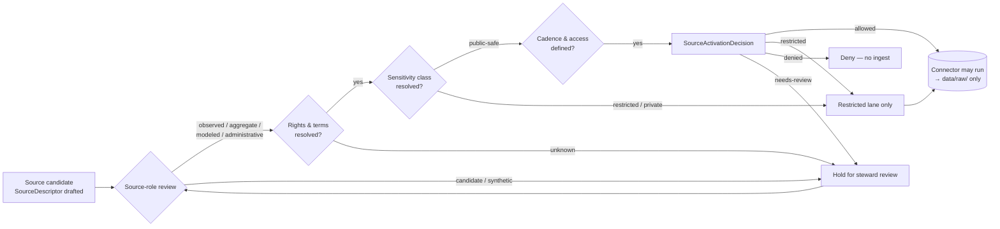

<!-- [KFM_META_BLOCK_V2]
doc_id: kfm://doc/domains/agriculture/source-registry
title: Agriculture · Source Registry
type: standard
version: v1
status: draft
owners: TODO — Agriculture domain steward + Source-registry steward
created: 2026-05-15
updated: 2026-05-15
policy_label: public
related:
  - docs/domains/agriculture/README.md
  - docs/domains/README.md
  - docs/sources/SOURCE_DESCRIPTOR_STANDARD.md
  - docs/doctrine/directory-rules.md
  - control_plane/source_authority_register.yaml
  - schemas/contracts/v1/source/source-descriptor.schema.json
  - policy/domains/agriculture/
  - data/registry/sources/agriculture/
tags: [kfm, domain, agriculture, source-registry, governance]
notes:
  - This file is the human-facing registry overview for the Agriculture domain.
  - It is NOT the operational source register; that surface lives under control_plane/ and data/registry/sources/agriculture/.
  - All repo-path-shaped claims are PROPOSED until verified against a mounted repository.
[/KFM_META_BLOCK_V2] -->

# 🌾 Agriculture · Source Registry

> Admission and authority-control surface for every source that may shape Agriculture-domain claims in KFM. Sources are admitted, restricted, quarantined, or denied **before** they reach a public layer.

**Status:** draft &nbsp;·&nbsp; **Owners:** TODO — Agriculture domain steward + Source-registry steward &nbsp;·&nbsp; **Last updated:** 2026-05-15

---

## Quick jump

- [1 · Scope](#1--scope)
- [2 · Repo fit](#2--repo-fit)
- [3 · What belongs here](#3--what-belongs-here)
- [4 · What does NOT belong here](#4--what-does-not-belong-here)
- [5 · Source families](#5--source-families)
- [6 · Source roles (anti-collapse)](#6--source-roles-anti-collapse)
- [7 · Rights and sensitivity posture](#7--rights-and-sensitivity-posture)
- [8 · Source-activation flow](#8--source-activation-flow)
- [9 · SourceDescriptor field surface](#9--sourcedescriptor-field-surface)
- [10 · Lifecycle posture](#10--lifecycle-posture)
- [11 · Validators and tests](#11--validators-and-tests)
- [12 · Related docs](#12--related-docs)
- [13 · Verification backlog](#13--verification-backlog)
- [Appendix · Per-source notes](#appendix--per-source-notes)

---

## 1 · Scope

This document is the **human-facing landing page** for the Agriculture-domain slice of the KFM source registry. It records which source families the Agriculture lane may admit, the **source-role** each may carry, the rights and sensitivity posture each enters with, the activation flow that precedes ingestion, and the lifecycle and validator surfaces that govern downstream use.

The KFM source registry as a whole is doctrinally defined as **"an admission and authority-control surface, not a bibliography"** — it records *source identity, role, rights posture, access method, cadence, steward, sensitivity, freshness expectations, attribution requirements, and public-release class* so that source material is admitted, quarantined, restricted, or denied before it shapes public claims (CONFIRMED doctrine; `[Unified Manual §3.6]`, `[ENCY §6]`).

> [!IMPORTANT]
> Agriculture's public posture is **aggregate or permissioned only**. Field-level NASS claims, farm-operator private data, proprietary yield, pesticide records, and private-sensitive joins **fail closed** by default (CONFIRMED doctrine; `[DOM-AG]`, `[ENCY §7.7]`).

[Back to top ↑](#-agriculture--source-registry)

---

## 2 · Repo fit

**This file (PROPOSED path):** `docs/domains/agriculture/SOURCE_REGISTRY.md`
**Authority root:** `docs/` — human explanation of doctrine and governance.
**Domain placement:** Agriculture appears as a **segment** under `docs/domains/`, not as a root folder (Directory Rules §3 Step 3 — Domain Placement Law).

**Upstream of this file:**

| Source | Relationship |
| --- | --- |
| `docs/sources/SOURCE_DESCRIPTOR_STANDARD.md` (PROPOSED) | Cross-domain field standard this doc conforms to. |
| `docs/doctrine/directory-rules.md` (CONFIRMED) | Governs placement; §3 (Step 3) places domain files under responsibility roots, not new root folders. |
| `control_plane/source_authority_register.yaml` (PROPOSED) | Canonical, machine-readable register of approved/retired/quarantined sources and source-authority roles. |
| `schemas/contracts/v1/source/source-descriptor.schema.json` (PROPOSED) | Canonical schema home per Directory Rules §7.4 / ADR-0001. |

**Downstream of this file:**

| Target | Relationship |
| --- | --- |
| `data/registry/sources/agriculture/` (PROPOSED) | Per-source records emitted alongside lifecycle data. |
| `connectors/<source>/` (PROPOSED) | Connector inventory MUST cite a SourceDescriptor and remain inactive until activation. |
| `policy/domains/agriculture/` (PROPOSED) | Rights / sensitivity / publication gates enforced against descriptor fields. |
| `tests/domains/agriculture/` (PROPOSED) | Validator coverage referenced in [§11](#11--validators-and-tests). |
| `release/candidates/agriculture/` (PROPOSED) | Release packages must close back to descriptors for every contributing source. |

> [!NOTE]
> Paths above are PROPOSED until a mounted repository confirms them. Per Directory Rules §7.4 and ADR-0001 (referenced), `schemas/contracts/v1/<...>` is the default schema home; any divergent location requires an ADR.

[Back to top ↑](#-agriculture--source-registry)

---

## 3 · What belongs here

- A **roster** of Agriculture source families (this doc's [§5](#5--source-families)).
- The **source-role** discipline applied across those families (this doc's [§6](#6--source-roles-anti-collapse)).
- Rights, sensitivity, and public-release posture per family (this doc's [§7](#7--rights-and-sensitivity-posture)).
- The **activation flow** every Agriculture source must clear before connectors run (this doc's [§8](#8--source-activation-flow)).
- The descriptor field surface as it applies to Agriculture (this doc's [§9](#9--sourcedescriptor-field-surface)).
- Pointers to the validators and policy gates that enforce admission (this doc's [§11](#11--validators-and-tests)).

## 4 · What does NOT belong here

- **The operational register itself.** Per-source approved/retired/quarantined records live under `control_plane/source_authority_register.yaml` (PROPOSED) and `data/registry/sources/agriculture/` (PROPOSED).
- **The SourceDescriptor schema.** Machine shape lives under `schemas/contracts/v1/source/source-descriptor.schema.json` (PROPOSED; per ADR-0001).
- **Connector implementations.** They live under `connectors/` and emit only to `data/raw/` or `data/quarantine/` (CONFIRMED; Directory Rules §7.3).
- **Released layers or tiles.** Those live under `data/published/layers/agriculture/` (PROPOSED) and are governed by `LayerManifest` and `ReleaseManifest`.
- **Field-level / farm-operator records as public truth.** These are denied by default and routed to quarantine or restricted access (CONFIRMED doctrine; `[DOM-AG]`).

[Back to top ↑](#-agriculture--source-registry)

---

## 5 · Source families

CONFIRMED domain dossier / PROPOSED implementation. The following families are catalogued for the Agriculture lane (`[DOM-AG]`, `[ENCY §7.7]`):

| Source family | Typical role(s) | Public-release default | Sensitivity flag | Status |
| --- | --- | --- | --- | --- |
| USDA NASS CDL (Cropland Data Layer) | observed (raster classification) → aggregate / modeled | aggregate-safe; per-pixel public OK at published scale | low (public product) | PROPOSED |
| USDA NASS QuickStats / Crop Progress | aggregate (county / state / year) | aggregate-safe ONLY; field-level joins DENY | high (re-identification on join) | PROPOSED |
| NRCS conservation practice data | administrative / observed | restricted unless aggregated | high (operator-identifying) | PROPOSED |
| NRCS SSURGO / Soil Data Access (SDA) | authority / observed (static survey) | aggregate-safe; map-unit publication allowed under terms | low–medium | PROPOSED |
| NRCS gSSURGO (gridded SSURGO) | authority / aggregate (gridded derivative) | aggregate-safe; freshness pinned to survey vintage | low–medium | PROPOSED |
| Kansas Mesonet (soil moisture / ag-weather) | observed (station) | terms-dependent; attribution required | low | PROPOSED |
| NRCS SCAN (Soil Climate Analysis Network) | observed (station) | terms-dependent | low | PROPOSED |
| NOAA USCRN | observed (station) | public; attribution | low | PROPOSED |
| NASA SMAP (soil moisture) | modeled / observed (satellite L-band) | aggregate / context layer | low | PROPOSED |
| NASA HLS / HLS-VI (harmonized Landsat–Sentinel + vegetation index) | observed (satellite) → modeled (VI) | context layer only; not field truth | low | PROPOSED |
| Irrigation / water-use sources | administrative / observed | RESTRICT public; operator joins DENY | high | PROPOSED |
| Crop insurance / market / economy (where permitted) | administrative / aggregate | aggregate-safe ONLY where rights allow | high | PROPOSED |
| Local extension sources | observed / administrative | per-source; activation gate applies | varies | PROPOSED |

> [!CAUTION]
> *Aggregate-cited-as-per-place-truth* is an Atlas-named anti-pattern: DENY joining an aggregate cell (county, HUC, year) to a single field, parcel, or operator record. AI must ABSTAIN; the trust membrane must DENY (`[Atlas v1.1 §24]`, `[DOM-AG]`).

[Back to top ↑](#-agriculture--source-registry)

---

## 6 · Source roles (anti-collapse)

CONFIRMED doctrine: KFM treats **source role** as a first-class identity attribute. An observed reading is not interchangeable with a modeled estimate; a regulatory determination is not interchangeable with an administrative compilation; an aggregate publication is not interchangeable with candidate evidence; synthetic content is never observed reality (`[Atlas v1.1 §24.1]`, `[ENCY]`).

| Role | Definition | Agriculture example | Anti-collapse rule |
| --- | --- | --- | --- |
| `observed` | Direct reading, measurement, or first-hand evidentiary record tied to place and time. | Mesonet station soil-moisture reading; SCAN sensor sample. | Never relabeled as `regulatory` or `administrative`. May feed `modeled` / `aggregate` products. |
| `regulatory` | Authoritative determination by a body with legal or administrative force. | (Limited in Agriculture; e.g., conservation-program designation when present.) | Never labeled `observed` or `modeled`. |
| `modeled` | Derived product from inputs, assumptions, or fitted parameters. | SMAP retrievals; HLS-VI derived indices; suitability rasters. | Must cite model identity + run receipt; never labeled an observation. |
| `aggregate` | Summary / total / average over a geometry-time unit; irreversible loss of individual record fidelity. | NASS QuickStats county totals; CDL county roll-ups; decadal climate normals. | Cite with `AggregationReceipt`; never per-place truth. |
| `administrative` | Compiled record for administration, registration, or accounting — not necessarily observation or regulation. | Crop-insurance enrollment compilations; conservation-practice rosters. | Cite as administrative context; never collapsed with observation. |
| `candidate` | Pre-merge evidence under review. | Remote-sensing anomaly candidates (e.g., vegetation-stress detections). | `PUBLISHED` edge forbidden until merged. Candidate exposure on a public surface DENIES at the trust membrane. |
| `synthetic` | Generated content — model surfaces or AI carriers — that is not real observation. | (Avoid in Agriculture public outputs; if used, requires Reality Boundary Note.) | Synthetic cannot be presented as observed reality. |

> [!WARNING]
> **Source role cannot be inferred from convenience.** A remote-sensing anomaly is a *candidate* until reviewed; a NASS county total is *aggregate*, never a field-level fact; a conservation-practice roster is *administrative*, never an observation of practice on a specific parcel (CONFIRMED cross-domain rule; `[Unified Manual §3.6]`).

[Back to top ↑](#-agriculture--source-registry)

---

## 7 · Rights and sensitivity posture

CONFIRMED doctrine: unclear rights, unresolved source role, missing evidence, unresolved sensitivity, or absent release state **block public promotion** (`[ENCY]`, `[Directory Rules]`).

### 7.1 · Default postures

| Class | Default outcome | Required controls | Agriculture example |
| --- | --- | --- | --- |
| Private landowner-sensitive data | DENY exact/public if private or rights unclear | aggregation; permissions; policy review | Field boundaries, owner identity, operations (`SRC-AG`, `SRC-PEOPLE`) |
| Source-rights-limited records | DENY public release until terms resolved | rights register; attribution; no public derivative if barred | Crop insurance, restricted market feeds |
| Aggregate cited as per-place truth | DENY join from aggregate cell to single record; AI ABSTAIN | AggregationReceipt; geometry-scope guard | NASS county total joined to a single farm |
| Candidate on a public surface | DENY at trust membrane; route to QUARANTINE | Promotion gate; no `PUBLISHED` edge to WORK/QUARANTINE | Unreviewed remote-sensing stress detection |
| Model output as observation | DENY publication of modeled as observed | model_run_ref; source-role badge in UI | SMAP retrieval presented as a ground measurement |

### 7.2 · Public surfaces — what may publish

PROPOSED (consistent with `[DOM-AG]` and `[ENCY §7.7]`):

- Public-safe **county / HUC / grid aggregations** of crop area, condition, and yield.
- **CDL** at native scale (raster classification) as a context layer.
- **SSURGO / gSSURGO** map units and gridded soils as context (under current terms).
- **Mesonet / SCAN / USCRN** time series at station scope.
- **SMAP / HLS-VI** as context layers with source-role badges.
- **AggregationReceipt** + **RedactionReceipt** alongside any product where transformation removed or generalized content.

### 7.3 · Public surfaces — what may NOT publish

- Field-level NASS claims as observation (`[DOM-AG]` — proposed validator `policy denial for field-level NASS claims`).
- Operator-identifying conservation, irrigation, insurance, or pesticide records.
- Joins from aggregate cells to individual operators or fields.
- Modeled values presented without `role_authority` + `role_model_run_ref`.
- Candidates without merge / review state.

[Back to top ↑](#-agriculture--source-registry)

---

## 8 · Source-activation flow

PROPOSED activation flow (CONFIRMED doctrine; per `[Unified Manual §3.6]`, `[BLD-COMP §§8.1–8.2]`): create or update `SourceDescriptor`; review source role, rights, sensitivity, cadence, and access; issue `SourceActivationDecision` declaring `allowed | restricted | denied | needs-review`; keep connectors and watchers **inactive** until activation decision, fixtures, validators, and policy gates exist.

> [!NOTE]
> **Connectors do not publish.** Per Directory Rules §7.3, connector output MUST land in `data/raw/<domain>/<source_id>/<run_id>/` or `data/quarantine/...`. Movement onward through `WORK → PROCESSED → CATALOG → PUBLISHED` is a *governed state transition*, not a file move (CONFIRMED).

[Back to top ↑](#-agriculture--source-registry)

---

## 9 · SourceDescriptor field surface

PROPOSED schema-home note: the canonical schema for `SourceDescriptor` defaults to `schemas/contracts/v1/source/source-descriptor.schema.json` per Directory Rules §7.4 and ADR-0001 (PROPOSED until verified). The field surface below is **illustrative, not authoritative** — it reflects Atlas v1.1 §24.1.3 and the ENCY Appendix E feature index. Implementation in the mounted schema is **NEEDS VERIFICATION**.

| Field | Type / vocabulary | Required? | Notes (Agriculture-relevant) |
| --- | --- | --- | --- |
| `source_id` | string (stable identifier) | MUST | E.g., `SRC-AG-NASS-QUICKSTATS`, `SRC-AG-NRCS-SSURGO`. |
| `source_role` | enum: `observed` \| `regulatory` \| `modeled` \| `aggregate` \| `administrative` \| `candidate` \| `synthetic` | MUST | Set at admission. Never edited in-place; corrections produce a new descriptor + `CorrectionNotice`. |
| `role_authority` | string (issuing body / model identity / steward) | MUST when role ∈ {`regulatory`, `modeled`, `aggregate`} | E.g., "USDA NASS" for QuickStats aggregates. |
| `role_aggregation_unit` | geometry-scope token (county, HUC, tract, year, decade, …) | MUST when `source_role = aggregate` | Prevents geometry-scope drift on join. E.g., `county`, `crop_year`. |
| `role_model_run_ref` | EvidenceRef → `ModelRunReceipt` | MUST when `source_role = modeled` | Pins inputs, parameters, and version. Required for SMAP, HLS-VI, suitability rasters. |
| `role_synthetic_basis` | structured `{ method, inputs, reality_boundary_note_ref }` | MUST when `source_role = synthetic` | Records what is and is not real. Avoid in Agriculture public outputs. |
| `role_candidate_disposition` | enum: `pending` \| `merged` \| `rejected` \| `quarantined` | MUST when `source_role = candidate` | `PUBLISHED` edge forbidden until merged. |
| `rights` | structured (license, attribution, redistribution, terms_ref) | MUST | "Unknown rights fail closed." |
| `sensitivity` | enum (per cross-domain sensitivity register) | MUST | Drives public-release class and required transforms. |
| `cadence` | structured (issue, retrieval, freshness expectation) | MUST | Source-vintage or cadence specific for SSURGO; near-real-time for Mesonet; weekly for NASS Crop Progress. |
| `access` | structured (method, credentials class, rate limits) | MUST | Mesonet / AirNow / etc. may carry written-consent or attribution constraints. |
| `citation` | string / structured (attribution text) | MUST | Surfaces in Evidence Drawer and exports. |
| `ingest_hash` | content / spec hash | MUST | `spec_hash` ≠ `content_hash` ≠ `run_hash`. |

[Back to top ↑](#-agriculture--source-registry)

---

## 10 · Lifecycle posture

CONFIRMED doctrine / PROPOSED lane application — Agriculture follows the KFM lifecycle invariant (`[Directory Rules §9]`, `[DOM-AG]`):

> **RAW → WORK / QUARANTINE → PROCESSED → CATALOG / TRIPLET → PUBLISHED**

| Stage | Handling (Agriculture) | Gate |
| --- | --- | --- |
| **RAW** | Capture immutable source payload or reference with role, rights, sensitivity, citation, time, hash. | `SourceDescriptor` exists. |
| **WORK / QUARANTINE** | Normalize schema, geometry, time, identity, evidence, rights, policy; hold failures (rights-unknown, field-level NASS attempts, candidate exposure attempts). | Validation + policy gate pass, or quarantine reason recorded. |
| **PROCESSED** | Emit validated normalized objects (CropObservation, FieldCandidate, YieldObservation aggregates, IrrigationLink, ConservationPractice, SoilCropSuitability, AgriculturalEconomyObservation, SupplyChainNode, DroughtStressIndicator, PestStressIndicator, AggregationReceipt). | EvidenceRef, ValidationReport, digest closure. |
| **CATALOG / TRIPLET** | Emit catalog records, EvidenceBundles, graph/triplet projections, release candidates. | Catalog / proof closure passes. |
| **PUBLISHED** | Serve released public-safe artifacts through governed APIs and manifests; field-level detail still denied. | ReleaseManifest, correction path, rollback target, review/policy state. |

> [!IMPORTANT]
> **Promotion is a governed state transition, not a file move.** A path-level write that bypasses validators, policy gates, EvidenceBundle creation, catalog closure, and release-decision recording is a violation of the invariant regardless of which directory the bytes ended up in (CONFIRMED; `[Directory Rules §9.1]`).

[Back to top ↑](#-agriculture--source-registry)

---

## 11 · Validators and tests

PROPOSED test coverage (`[DOM-AG]`, `[ENCY]`):

- **SSURGO / SDA lineage tests** — verify map-unit and component lineage round-trips.
- **Soil-moisture unit / depth / QC tests** — Mesonet, SCAN, USCRN, SMAP normalization (units, depths, QA flags).
- **Crop-progress aggregate-only tests** — QuickStats / Crop Progress published only at allowed aggregation units.
- **Vegetation index mask / time tests** — HLS-VI cloud and AOD masking; temporal alignment to growing season.
- **Policy denial for field-level NASS claims** — DENY validator covering aggregate-cited-as-per-place-truth.
- **Catalog closure tests** — every Agriculture released dataset / layer has source, schema, validation, policy, and release metadata.
- **Cross-domain (Soil / Hydrology / Atmosphere / People-Land)** — joins must preserve ownership, source role, sensitivity, and EvidenceBundle support (CONFIRMED / PROPOSED; `[Atlas v1.1 §F]`).

PROPOSED home (subject to Directory Rules + ADR): `tests/domains/agriculture/`, `fixtures/domains/agriculture/`, `tools/validators/domains/agriculture/`.

> [!TIP]
> No-network fixtures should be the default for Agriculture admission tests. A connector that requires the network to pass its admission test cannot be activated under the source-activation flow.

[Back to top ↑](#-agriculture--source-registry)

---

## 12 · Related docs

- [`docs/domains/agriculture/README.md`](./README.md) — Agriculture-lane landing page (PROPOSED).
- [`docs/domains/README.md`](../README.md) — Domain lane index (PROPOSED).
- [`docs/sources/SOURCE_DESCRIPTOR_STANDARD.md`](../../sources/SOURCE_DESCRIPTOR_STANDARD.md) — Cross-domain SourceDescriptor standard (PROPOSED).
- [`docs/doctrine/directory-rules.md`](../../doctrine/directory-rules.md) — Placement and lifecycle law (CONFIRMED doctrine).
- `control_plane/source_authority_register.yaml` — Machine-readable source register (PROPOSED).
- `schemas/contracts/v1/source/source-descriptor.schema.json` — Canonical schema (PROPOSED; per ADR-0001).
- `policy/domains/agriculture/` — Domain policy gates (PROPOSED).
- `tests/domains/agriculture/` — Domain validators (PROPOSED).

[Back to top ↑](#-agriculture--source-registry)

---

## 13 · Verification backlog

The following items are **NEEDS VERIFICATION** until a mounted repository (or an authoritative ADR) resolves them:

| Item | Evidence that would settle it | Status |
| --- | --- | --- |
| Exact path of this file in the mounted repo | Mounted-repo inspection or ADR | PROPOSED |
| Final SourceDescriptor schema-home and field names | Mounted schema file or ADR-0001 verification | NEEDS VERIFICATION |
| Existence and contents of `control_plane/source_authority_register.yaml` | Mounted-repo inspection | NEEDS VERIFICATION |
| Per-source license, attribution, and redistribution terms for every family in [§5](#5--source-families) | `SourceActivationDecision` records issued and stored | NEEDS VERIFICATION |
| Public-release thresholds (county vs HUC vs grid) — actual cell sizes and minimum cell counts | Domain steward decision + policy package | NEEDS VERIFICATION |
| Agriculture validator names and exit-code contract | `tools/validators/domains/agriculture/` inspection | NEEDS VERIFICATION |
| Owner identities for this file (placeholders in meta block) | CODEOWNERS or steward roster | TODO |
| `[DOM-AG] vs [ENCY §7.7]` reconciliation of any drift | Side-by-side review with Atlas v1.1 §24 anti-collapse rules | NEEDS VERIFICATION |

[Back to top ↑](#-agriculture--source-registry)

---

## Appendix · Per-source notes

<strong>USDA NASS — CDL and QuickStats / Crop Progress</strong> (click to expand)

- **CDL (Cropland Data Layer):** raster crop classification at native scale. Treated as `observed` (classification of an observed satellite product) for the purposes of the raster itself; downstream roll-ups are `aggregate`.
- **QuickStats / Crop Progress:** weekly / seasonal county-and-state aggregates. **Role: `aggregate`.** `role_aggregation_unit` MUST be set (typically `state_county_crop_year` or `state_crop_week`). DENY any join from these aggregates to a single field or operator.
- **Public release default:** aggregate-safe at original aggregation unit; field-level claim DENY by default.
- **Sensitivity:** low for the published aggregate; **re-identification risk on join** is the central anti-collapse concern.

<strong>NRCS — SSURGO, gSSURGO, Soil Data Access (SDA)</strong>

- **SSURGO / SDA:** soil map units, components, horizons, properties (static survey). Role: `authority` / `observed` (per Atlas family table; canonical role assignment per descriptor).
- **gSSURGO:** gridded derivative of SSURGO. Role typically `aggregate` (gridded summary over map-unit polygons).
- **Public release default:** aggregate-safe under current NRCS terms. **NEEDS VERIFICATION** for current terms.
- **Freshness:** source-vintage specific; SSURGO survey areas vary in last-survey date.
- **Use in joins:** soil–crop suitability (cross-domain → Soil; MUKEY joins) MUST preserve ownership and source role.

<strong>Kansas Mesonet · NRCS SCAN · NOAA USCRN — station soil moisture and ag-weather</strong>

- **Role:** `observed` (station readings).
- **Public release default:** terms-dependent; Kansas Mesonet typically requires attribution and may require written consent for bulk REST consumption (**NEEDS VERIFICATION** — see external admissibility check before connector activation).
- **Sensitivity:** low.
- **Use:** station-scope time series for drought and crop-stress context. Do not present a single station as field truth.

<strong>NASA SMAP · HLS / HLS-VI — satellite soil moisture and vegetation index</strong>

- **SMAP:** Role `modeled` (L-band retrieval product) — `role_authority` = "NASA SMAP"; `role_model_run_ref` MUST resolve.
- **HLS / HLS-VI:** Role `observed` for the harmonized surface reflectance product; `modeled` for derived indices. Cloud + AOD masking and seasonal baselines are pipeline-mandatory; vegetation-stress candidates remain `candidate` until reviewed.
- **Public release default:** context layer; aggregate-safe.
- **Caveat:** satellite products **must not become field/operator truth** (CONFIRMED `[DOM-AG]`).

<strong>Irrigation / water-use · Crop-insurance / market / economy · Local extension</strong>

- **Irrigation / water-use:** often operator-identifying. Role typically `administrative` or `observed` depending on source. Public posture: RESTRICT or aggregate-only.
- **Crop-insurance / market / economy:** publish only where rights allow; usually `administrative` or `aggregate`. Operator-identifying joins DENY.
- **Local extension:** per-source; activation flow applies. Often `observed` or `administrative`; rights vary.

<strong>Cross-lane relations (Agriculture ↔ Soil / Hydrology / Atmosphere / People–Land)</strong>

| Related lane | Relation type | Constraint |
| --- | --- | --- |
| Soil | MUKEY joins and suitability support | Preserve ownership, source role, sensitivity, EvidenceBundle support. |
| Hydrology | Irrigation, drought, water-use context | Preserve ownership, source role, sensitivity, EvidenceBundle support. |
| Atmosphere / Air | Weather, heat, smoke, vegetation stress | Preserve ownership, source role, sensitivity, EvidenceBundle support. |
| People / Land | Farm-operator and parcel-sensitive contexts | Remain restricted; DENY public joins. |

(CONFIRMED / PROPOSED; `[Atlas v1.1 §F]`, `[DOM-AG]`.)

[Back to top ↑](#-agriculture--source-registry)

---

**Last updated:** 2026-05-15 &nbsp;·&nbsp; **Owners:** TODO — Agriculture domain steward + Source-registry steward &nbsp;·&nbsp; **Doctrine basis:** `[DOM-AG]`, `[ENCY §7.7]`, `[Atlas v1.1 §24]`, `[Directory Rules §§3, 7.3–7.4, 9]`, `[Unified Manual §3.6]`

[Back to top ↑](#-agriculture--source-registry)
