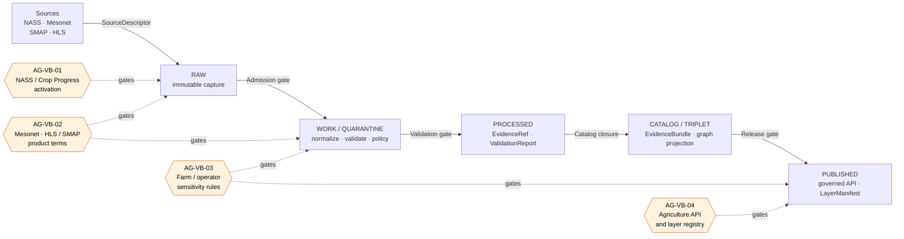

<!-- [KFM_META_BLOCK_V2]
doc_id: kfm://doc/docs-domains-agriculture-verification-backlog
title: Agriculture Domain — Verification Backlog
type: standard
version: v1.1
status: draft
owners: <TODO: agriculture-steward; docs-steward>
created: 2026-05-15
updated: 2026-05-27
policy_label: public
related:
  - docs/doctrine/ai-build-operating-contract.md
  - docs/doctrine/directory-rules.md
  - docs/domains/agriculture/README.md
  - docs/registers/VERIFICATION_BACKLOG.md
  - docs/registers/DRIFT_REGISTER.md
  - docs/registers/CANONICAL_LINEAGE_EXPLORATORY.md
  - docs/adr/README.md
  - docs/sources/SOURCE_DESCRIPTOR_STANDARD.md
tags: [kfm, register, agriculture, verification, governance]
notes:
  - CONTRACT_VERSION = "3.0.0" (pinned per ai-build-operating-contract.md §37).
  - Domain-scoped projection of docs/registers/VERIFICATION_BACKLOG.md.
  - Canonical item text is Atlas v1.0 Ch. 9 §N (reproduced verbatim in §5).
  - Atlas v1.1 Ch. 24 is navigational; v1.0 retains authority on conflict.
[/KFM_META_BLOCK_V2] -->

# Agriculture Domain — Verification Backlog

> Domain-scoped, cite-or-abstain register tracking what remains **NEEDS VERIFICATION** before Agriculture surfaces can be treated as implemented, enforced, automated, or released.

  
  
  
  
  
  
  
  <!-- TODO: replace with live Shields.io endpoints (CI status, last-updated, owners, ADR coverage) once verified against the mounted repo. -->

**Status:** draft · **Owners:** _TODO: agriculture-steward; docs-steward_ · **Last updated:** 2026-05-27

> [!IMPORTANT]
> This file is a **register**, not a doctrine source. The canonical statement of Agriculture's open verification items is **Atlas v1.0 Ch. 9 §N**. Atlas v1.1 Ch. 24 is navigational and does not override v1.0. Conflicts between this file and v1.0 are filed to `docs/registers/DRIFT_REGISTER.md` per Directory Rules §2.5.

---

## 0. Status & Authority

| Field | Value |
|---|---|
| **Document type** | Register (standard doc, domain-scoped). |
| **Edition** | v1.1 draft. |
| **Proposed repo path** | `docs/domains/agriculture/VERIFICATION_BACKLOG.md` |
| **Placement basis** | **CONFIRMED** — Directory Rules §4 Step 3 (domain-segment pattern under canonical responsibility root `docs/`) and KFM Encyclopedia §6.2 (per-domain dossiers under `docs/domains/<domain>/` carry README, ARCHITECTURE, PRESERVATION_MATRIX, VERIFICATION_BACKLOG, etc.). |
| **Operating contract** | `ai-build-operating-contract.md` — `CONTRACT_VERSION = "3.0.0"`. |
| **Canonical item authority** | **CONFIRMED** — Atlas v1.0 Ch. 9 §N (four items, status `NEEDS VERIFICATION`). |
| **Cross-domain roll-up** | `docs/registers/VERIFICATION_BACKLOG.md` — canonical per Directory Rules §6.1; mounted-repo presence **NEEDS VERIFICATION**. |
| **Status of this file in any repo** | `draft` until reviewed and merged. AI-authored — `GENERATED_RECEIPT.json` required at merge per contract §34. |
| **Required reviewers** | Docs steward + agriculture-domain steward + policy steward (for AG-VB-03 sensitivity language) + AI surface steward (receipt review per contract §33). |

---

## Contents

1. [Purpose and scope](#1-purpose-and-scope)
2. [Source authority](#2-source-authority)
3. [Verification posture](#3-verification-posture)
4. [Where verification gates the pipeline](#4-where-verification-gates-the-pipeline)
5. [Open verification items (canonical)](#5-open-verification-items-canonical)
6. [Per-item evidence checklists](#6-per-item-evidence-checklists)
7. [Cross-lane verification touchpoints](#7-cross-lane-verification-touchpoints)
8. [Sensitivity-tier obligations](#8-sensitivity-tier-obligations)
9. [Related ADR-class questions](#9-related-adr-class-questions)
10. [Related validators and tests](#10-related-validators-and-tests-proposed)
11. [Resolution workflow](#11-resolution-workflow)
12. [Drift handling](#12-drift-handling)
13. [Open questions register (this file)](#13-open-questions-register-this-file)
14. [Open verification backlog (this file's own)](#14-open-verification-backlog-this-files-own)
15. [Changelog](#15-changelog)
16. [Definition of done](#16-definition-of-done)
17. [Related docs](#17-related-docs)

---

## 1. Purpose and scope

The Agriculture domain Verification Backlog tracks the **four CONFIRMED open verification items** named in Atlas v1.0 Ch. 9 §N. These are the questions that prevent any Agriculture surface from being treated as implemented, enforced, automated, or released until evidence resolves them.

### What this register tracks

- The four canonical items from Atlas v1.0 Ch. 9 §N (status: **NEEDS VERIFICATION**).
- For each item: the **evidence that would settle it**, the **pipeline gates** it governs, the **cross-lane touchpoints** it affects, and the **ADR-class questions** it is entangled with.
- The **resolution workflow** that moves an item from `NEEDS VERIFICATION` toward `CONFIRMED`.

### What this register does **not** track

| Out of scope | Lives in |
|---|---|
| Object-family meaning (`CropObservation`, `FieldCandidate`, etc.) | `contracts/` (PROPOSED) |
| Machine schema shape | `schemas/contracts/v1/...` (PROPOSED, per ADR-0001) |
| Sensitivity / rights tier policy text | `policy/domains/agriculture/...` (PROPOSED) |
| Source rights and cadence per dataset | `docs/sources/` + `data/registry/sources/` (PROPOSED) |
| Cross-domain rollups for *all* domains | `docs/registers/VERIFICATION_BACKLOG.md` (canonical roll-up) |
| Mounted-repo path inventory | `git`-side inspection, not this file |

> [!NOTE]
> This file is a **domain-scoped projection** of the cross-domain `docs/registers/VERIFICATION_BACKLOG.md`. Per **KFM Encyclopedia §6.2**, per-domain dossiers under `docs/domains/<domain>/` canonically carry `VERIFICATION_BACKLOG.md` alongside README, ARCHITECTURE, and PRESERVATION_MATRIX. This is **not** a parallel register home in the sense of Directory Rules §2.4(5) — it is the per-domain projection of the canonical cross-domain register.

[↑ Back to top](#contents)

---

## 2. Source authority

CONFIRMED authority ladder for this register:

1. **Atlas v1.0 Ch. 9 §N — Verification backlog and open questions** is the canonical statement of Agriculture's open items. It is reproduced verbatim in §5.
2. **Atlas v1.1 Ch. 24.12 — Master Open-ADR Backlog** is navigational. It consolidates v1.0 §N items into ADR-class questions but does not override v1.0.
3. **Directory Rules §§2.4–2.5, §4, §6.1** govern how this register relates to ADRs, drift, placement, and per-root README contracts.
4. **`ai-build-operating-contract.md` v3.0** governs truth-label use, AI-authored artifact discipline, receipt emission (§34), and PR posture (§27).

> [!CAUTION]
> Per Atlas v1.1 conflict rule: where Chapter 24 and v1.0 §N appear to disagree, **v1.0 retains authority** and the conflict is filed to `docs/registers/DRIFT_REGISTER.md` per Directory Rules §2.5.

External sources consulted: **none**. All claims here are KFM-internal; no `<external_research>` trigger applied.

[↑ Back to top](#contents)

---

## 3. Verification posture

The KFM truth posture for this register is **cite-or-abstain** (CONFIRMED doctrine, `ai-build-operating-contract.md` §1 Operating Law).

- `NEEDS VERIFICATION` means **checkable** but **not yet checked strongly enough** to act as fact in this session.
- The session does **not** mount the repository. No statement of the form _"the repo contains X"_, _"the path exists"_, _"the workflow enforces Y"_ is made here.
- Until each item is settled by **admissible evidence** — mounted repo files, schemas, registry entries, tests, logs, emitted artifacts, review records, or release manifests — Agriculture implementation maturity remains **PROPOSED**.
- Promotion of an item to `CONFIRMED` requires the evidence pointer to resolve to a real artifact and a recorded `ReviewRecord` where materiality applies (per Atlas Ch. 24.6 Validation and Catalog-closure gates and contract §10.8 _Promotion is auditable_).

> [!TIP]
> The shortest path from `NEEDS VERIFICATION` to `CONFIRMED` for any Agriculture item is: mount the repo → inspect the named artifacts → record the finding in this file's §5 table → record the lineage entry in `docs/registers/CANONICAL_LINEAGE_EXPLORATORY.md` → open an ADR only if Directory Rules §2.4 applies.

[↑ Back to top](#contents)

---

## 4. Where verification gates the pipeline

PROPOSED mapping of each open item to the lifecycle gate it most directly governs. The lifecycle invariant **RAW → WORK / QUARANTINE → PROCESSED → CATALOG / TRIPLET → PUBLISHED** is CONFIRMED doctrine (contract §10.1); the gate-to-item mapping below is PROPOSED.

> [!NOTE]
> The diagram is **illustrative**. Stage-to-item mapping is **PROPOSED** based on Atlas v1.0 Ch. 9 §§D–N and the Master Pipeline Gate Reference (Atlas v1.1 §24.6.1). Exact gate placement may shift after mounted-repo inspection or after an ADR resolves any of the items in §9.

[↑ Back to top](#contents)

---

## 5. Open verification items (canonical)

CONFIRMED list (Atlas v1.0 Ch. 9 §N). All four items are **NEEDS VERIFICATION**.

| ID | Item to verify | Evidence that would settle it (CONFIRMED) | Status (CONFIRMED) | Likely owner (PROPOSED) |
|---|---|---|---|---|
| **AG-VB-01** | Verify NASS / QuickStats and Crop Progress activation. | Mounted repo files, schemas, registry entries, tests, logs, emitted artifacts, review records, or release manifests. | NEEDS VERIFICATION | _TODO: agriculture-steward + connector owner_ |
| **AG-VB-02** | Verify Mesonet and HLS / SMAP product terms. | Mounted repo files, schemas, registry entries, tests, logs, emitted artifacts, review records, or release manifests. | NEEDS VERIFICATION | _TODO: agriculture-steward + source steward_ |
| **AG-VB-03** | Verify public release sensitivity rules for farm / operator joins. | Mounted repo files, schemas, registry entries, tests, logs, emitted artifacts, review records, or release manifests. | NEEDS VERIFICATION | _TODO: agriculture-steward + policy steward + people-land steward_ |
| **AG-VB-04** | Verify Agriculture API and layer registry. | Mounted repo files, schemas, registry entries, tests, logs, emitted artifacts, review records, or release manifests. | NEEDS VERIFICATION | _TODO: agriculture-steward + governed-API owner_ |

> [!WARNING]
> Item identifiers (`AG-VB-01`…`AG-VB-04`) are **PROPOSED** local handles for this register. The canonical statement of the items lives in Atlas v1.0 Ch. 9 §N and does **not** use these handles. If a domain-scoped identifier scheme is adopted, the canonical scheme should be recorded via ADR (see [OQ-AG-VB-01](#13-open-questions-register-this-file)).

[↑ Back to top](#contents)

---

## 6. Per-item evidence checklists

PROPOSED checklists. Each list names the artifacts whose presence (or absence) would move the item toward `CONFIRMED` or surface a definite gap. No checklist asserts that any path or artifact exists in the current repo.

<strong>AG-VB-01 — NASS / QuickStats and Crop Progress activation</strong>

Source families covered (CONFIRMED, Atlas v1.0 Ch. 9 §D): **USDA NASS QuickStats / Crop Progress**.

> Cropland Data Layer (CDL) is referenced elsewhere in [DOM-AG]; the AG-VB-01 item text explicitly names only **QuickStats / Crop Progress**, so CDL is not in scope for this item without an item amendment ([OQ-AG-VB-03](#13-open-questions-register-this-file)).

Artifacts whose presence would settle this item (PROPOSED):

- `data/registry/sources/agriculture/nass_quickstats.yaml` — SourceDescriptor with role, authority, rights, sensitivity, cadence.
- `data/registry/sources/agriculture/nass_crop_progress.yaml` — SourceDescriptor.
- `connectors/usda/nass/` or `connectors/nrcs/...` — connector code or spec (NEEDS VERIFICATION of canonical home; connectors emit to `data/raw/` only).
- `pipeline_specs/agriculture/nass_quickstats.yaml` — declarative pipeline spec.
- `schemas/contracts/v1/domains/agriculture/crop_observation.schema.json` — schema with NASS-sourced field coverage.
- `fixtures/domains/agriculture/no_network/nass/` — no-network fixture.
- `tests/domains/agriculture/test_nass_aggregate_only.py` — test enforcing aggregate-only release (mirrors Atlas §K "crop progress aggregate-only tests").
- `.github/workflows/agriculture-validate.yml` — CI workflow exercising the validators.
- A representative `RunReceipt` and `ValidationReport` under `data/receipts/` and `data/proofs/`.

Failure-closed outcome until settled: connector is **not admitted**; SourceDescriptor candidate logged but no RAW capture treated as authoritative (per Atlas §24.6.1 Admission gate).

<strong>AG-VB-02 — Mesonet and HLS / SMAP product terms</strong>

Source families covered (CONFIRMED, Atlas v1.0 Ch. 9 §D): **Kansas Mesonet**, **NASA SMAP**, **NASA HLS / HLS-VI**, with adjacent sources **NRCS SCAN** and **NOAA USCRN**.

Artifacts whose presence would settle this item (PROPOSED):

- `data/registry/sources/agriculture/ks_mesonet.yaml` — SourceDescriptor capturing **rights, redistribution terms, cadence, endpoint, product variants** (REST CSV; soil moisture at 5/10/20/50 cm; station metadata).
- `data/registry/sources/agriculture/nasa_smap.yaml` — SourceDescriptor (Earthdata credentials posture; product version pin).
- `data/registry/sources/agriculture/nasa_hls.yaml` — SourceDescriptor (HLS vs HLS-VI distinction; cloud-mask handling).
- `policy/sources/rights/nasa.rego` and `policy/sources/rights/mesonet.rego` — rights validators with deterministic outcomes.
- `tests/domains/agriculture/test_soil_moisture_units_depths.py` — soil-moisture unit/depth/QC tests (mirrors Atlas §K).
- `tests/domains/agriculture/test_vegetation_index_mask_time.py` — vegetation-index mask/time tests (mirrors Atlas §K).
- `docs/sources/SOURCE_DESCRIPTOR_STANDARD.md` reference applied to each.

Failure-closed outcome until settled: WORK / QUARANTINE stops at policy gate when rights or product-term fields are absent or stale (per Atlas §24.6.1 Normalization and Validation gates).

<strong>AG-VB-03 — Public release sensitivity rules for farm / operator joins</strong>

Doctrinal anchor (CONFIRMED, Atlas v1.0 Ch. 9 §I): _"Aggregate statistics and satellite products must not become field/operator truth; farm/operator private data, proprietary yield, pesticide records, and private-sensitive joins fail closed."_

This item also intersects the **Agriculture × People/Land** cross-lane relation (Atlas Ch. 9 §F) and the Master Sensitivity / Rights Tier Reference (Atlas Ch. 24.5).

Artifacts whose presence would settle this item (PROPOSED):

- `policy/sensitivity/agriculture/farm_operator_join.rego` — denial rule for unreviewed `FieldCandidate × PersonAssertion / LandParcel` joins.
- `policy/sensitivity/agriculture/aggregation_thresholds.yaml` — minimum-cell suppression thresholds (county / HUC / grid).
- `schemas/contracts/v1/domains/agriculture/aggregation_receipt.schema.json` — `AggregationReceipt` schema covering threshold, transform, and review reference.
- `tests/domains/agriculture/test_policy_denial_field_level_nass.py` — policy denial for field-level NASS claims (mirrors Atlas §K).
- `tests/domains/agriculture/test_farm_operator_join_deny.py` — deny-by-default behavior on cross-lane joins.
- A representative `RedactionReceipt` and `ReviewRecord` under `data/receipts/` for any T1 release derived from a T4 default.
- Default-tier assignment table consistent with Atlas Ch. 24.5: **CropObservation / YieldObservation = T0 (aggregate) / T1 (field candidate)**; **farm/operator private joins fail closed (T4-class)**.

Failure-closed outcome until settled: **DENY by default** at the PUBLISHED gate; Focus Mode and Evidence Drawer suppress field-level fields; layer manifest resolver returns `DENY` for unauthorized layers.

<strong>AG-VB-04 — Agriculture API and layer registry</strong>

Doctrinal anchor (CONFIRMED, Atlas v1.0 Ch. 9 §J): four governed-API surfaces are PROPOSED with **route TBD** and **exact route UNKNOWN**.

| Surface (Atlas §J) | Artifact | Outcome envelope |
|---|---|---|
| Agriculture feature/detail resolver | `AgricultureDecisionEnvelope` | `ANSWER` / `ABSTAIN` / `DENY` / `ERROR` |
| Agriculture layer manifest resolver | `LayerManifest` / domain layer descriptor | `ANSWER` / `DENY` / `ERROR` |
| Agriculture Evidence Drawer payload | `EvidenceDrawerPayload` + `EvidenceBundle` projection | `ANSWER` / `ABSTAIN` / `DENY` / `ERROR` |
| Agriculture Focus Mode answer | `RuntimeResponseEnvelope` + `AIReceipt` | `ANSWER` / `ABSTAIN` / `DENY` / `ERROR` |

Artifacts whose presence would settle this item (PROPOSED):

- `apps/governed-api/src/routes/agriculture/*` — route handlers behind the trust membrane (per Directory Rules §7.1; public clients MUST go through `apps/governed-api/`, not `data/processed/` or `data/published/` directly).
- `schemas/contracts/v1/domains/agriculture/decision_envelope.schema.json`.
- `schemas/contracts/v1/layers/layer_manifest.schema.json` instances under `data/published/layers/agriculture/`.
- `control_plane/domain_lane_register.yaml` row for `agriculture` confirming route map and layer registry handles.
- `tests/e2e/agriculture/` — end-to-end tests verifying the Evidence Drawer / Focus Mode flow with an `AIReceipt`.
- `tests/domains/agriculture/test_catalog_closure.py` — catalog closure tests (mirrors Atlas §K).

Failure-closed outcome until settled: any Agriculture public surface is treated as **non-existent**; AI Focus Mode answers `ABSTAIN`; layer manifest resolver returns `DENY`; no public client may bypass the governed API to reach canonical stores.

[↑ Back to top](#contents)

---

## 7. Cross-lane verification touchpoints

CONFIRMED relations (Atlas v1.0 Ch. 9 §F) plus PROPOSED sensitivity defaults (Atlas Ch. 24.5). A verification finding in Agriculture may also satisfy or weaken evidence in a neighboring lane; the cross-lane impact must be tracked.

| Related lane | Relation type (CONFIRMED) | Items touched | Constraint (CONFIRMED) | Sensitivity default (PROPOSED) |
|---|---|---|---|---|
| **Soil** | MUKEY joins and `SoilCropSuitability` support | AG-VB-02, AG-VB-04 | Must preserve ownership, source role, sensitivity, and `EvidenceBundle` support. | T0 (`SoilMapUnit` / `SoilComponent`) |
| **Hydrology** | Irrigation, drought, water-use context | AG-VB-02 | Same. | T0 (`GaugeSite` / `FlowObservation`, `HUC`) |
| **Atmosphere / Air** | Weather, heat, smoke, vegetation stress | AG-VB-02 | Same. | T0 (`WeatherObservation` / `ClimateNormal`) |
| **People / Land** | Farm / operator and parcel-sensitive contexts remain restricted | **AG-VB-03** (primary) | Same — and **farm/operator private joins fail closed**. | T4 default (`LandParcel` private join detail); T0 only on aggregate. |

> [!IMPORTANT]
> The **Agriculture × People/Land** relation is the highest-risk cross-lane edge for this register. A verification step that loosens AG-VB-03 must trigger a parallel review in `docs/domains/people-dna-land/VERIFICATION_BACKLOG.md` (or its equivalent) and may surface ADR-S-14 (Cross-lane join policy).

[↑ Back to top](#contents)

---

## 8. Sensitivity-tier obligations

PROPOSED tier mapping, drawn from Atlas v1.1 Ch. 24.5 (Master Sensitivity / Rights Tier Reference) and Atlas v1.0 Ch. 9 §I. Adoption of T0–T4 as canonical is itself an ADR-class question (**ADR-S-05**).

| Agriculture object / surface | Default tier (PROPOSED) | Allowed transforms (PROPOSED) | Required gates |
|---|---|---|---|
| `CropObservation` / `YieldObservation` — aggregate (county / HUC / grid) | **T0** | None required beyond standard release. | `ReleaseManifest`, `EvidenceBundle`, rollback target. |
| `CropObservation` / `YieldObservation` — field-candidate scope | **T1** | Aggregation / generalization with `AggregationReceipt`. | `AggregationReceipt` + `ReviewRecord`. |
| `FieldCandidate` (field-level geometry / attributes) | **T1** at best; often higher | Generalization to county / HUC; suppression below minimum-cell threshold. | `RedactionReceipt` or `AggregationReceipt` + `ReviewRecord`. |
| Farm / operator private join (e.g., field × parcel × operator) | **T4 — Denied** | None permit T0 / T1 release without policy + steward review; T3 only under named agreement. | `PolicyDecision` + `ReviewRecord` + named agreement (T3). |
| Proprietary yield, pesticide, or rights-limited records | **T4 — Denied** | Per source rights; default deny. | Source-rights review + steward review. |

> [!CAUTION]
> Aggregate statistics and satellite products **must not** become field / operator truth. AI Focus Mode answers and Evidence Drawer payloads that paraphrase aggregate observations as per-field facts are a **source-role upgrade** failure mode (Atlas Ch. 24.10 risk register) and `DENY`-class behavior.

[↑ Back to top](#contents)

---

## 9. Related ADR-class questions

PROPOSED. Five of the fifteen ADR-S items in the Master Open-ADR Backlog (Atlas v1.1 Ch. 24.12) materially intersect Agriculture verification. None is currently ADR-resolved.

| ADR-S | Question / decision needed | Intersection with this register |
|---|---|---|
| **ADR-S-01** | Where is the canonical schema home? Confirm `schemas/contracts/v1/…` by ADR-0001 or amend. | AG-VB-04 (schemas for envelopes, layer manifests, aggregation receipts). |
| **ADR-S-04** | Source-role enum — canonical vocabulary, evolution rule. | AG-VB-01, AG-VB-02 (NASS / Mesonet / SMAP / HLS source roles). |
| **ADR-S-05** | Sensitivity tier scheme (T0–T4) — adopt as canonical or revise. | AG-VB-03 (farm/operator deny default); §8 of this file. |
| **ADR-S-12** | Connector cadence and quarantine recovery policy. | AG-VB-01, AG-VB-02 (connector behavior for NASS, Mesonet, SMAP, HLS). |
| **ADR-S-14** | Cross-lane join policy: which joins require steward review, which are denied, which are open. | AG-VB-03 (Agriculture × People/Land farm-operator joins). |

> [!NOTE]
> Movement on any of these ADR-S items can change the evidence threshold for one or more Agriculture verification items. When an ADR is opened, link it back to this register so the dependency is visible.

[↑ Back to top](#contents)

---

## 10. Related validators and tests (PROPOSED)

CONFIRMED list of PROPOSED validators from Atlas v1.0 Ch. 9 §K. Each is currently **PROPOSED**, not implemented:

- SSURGO / SDA lineage tests.
- Soil-moisture unit / depth / QC tests.
- Crop-progress aggregate-only tests.
- Vegetation-index mask / time tests.
- Policy denial for field-level NASS claims.
- Catalog-closure tests.

> [!TIP]
> Each validator above maps to one or more of AG-VB-01…AG-VB-04. Building any of these validators against a no-network fixture is the lowest-friction way to flip a single sub-claim from `NEEDS VERIFICATION` to `CONFIRMED` without taking on a network-dependent integration.

[↑ Back to top](#contents)

---

## 11. Resolution workflow

PROPOSED workflow for moving an item out of `NEEDS VERIFICATION`. Step numbering does not imply atomicity; multiple items may share a step.

1. **Inspect.** Mount the repo and check the artifacts listed in the item's §6 checklist. Record what is present, what is absent, what is divergent.
2. **Label.** Record per-artifact findings as `CONFIRMED`, `PROPOSED`, `UNKNOWN`, or `NEEDS VERIFICATION` in this file's §5 table. Do not collapse multiple findings into a single label.
3. **Drift?** If the repo contradicts doctrine, file an entry in `docs/registers/DRIFT_REGISTER.md` per Directory Rules §2.5. Do **not** silently conform to drifted repo state.
4. **ADR?** If the finding meets any §2.4 trigger (new root, schema-home change, lifecycle phase split, parallel home for schemas / contracts / policy / sources / registries / releases / proofs / receipts, invariant bend), open an ADR. Link the ADR back to this register.
5. **Receipt.** Record any state change in `docs/registers/CANONICAL_LINEAGE_EXPLORATORY.md` per the lineage-by-extension rule (Atlas Appendix E). For AI-assisted edits, emit `GENERATED_RECEIPT.json` per contract §34.
6. **Review.** When an item flips to `CONFIRMED`, attach a `ReviewRecord` reference. When an item is released to a public surface (a derivative depends on the change), attach a `ReleaseManifest` reference and a rollback target.
7. **Update.** Bump the document `updated:` date in the meta block and the "Last updated" footer line. Note material changes in §15 changelog.

> [!IMPORTANT]
> Promotion of an item from `NEEDS VERIFICATION` to `CONFIRMED` is a **governed state transition**, not a file edit. The artifact pointer must resolve. A label change without an evidence pointer is drift.

[↑ Back to top](#contents)

---

## 12. Drift handling

CONFIRMED rule (Atlas v1.1 conflict rule + Directory Rules §2.5): if this file disagrees with **Atlas v1.0 Ch. 9 §N** or the canonical **`docs/registers/VERIFICATION_BACKLOG.md`**:

1. **Atlas v1.0 wins** for the item statement and the evidence-that-would-settle text.
2. **`docs/registers/VERIFICATION_BACKLOG.md` wins** as the cross-domain roll-up.
3. **This file** captures only the domain-scoped projection plus PROPOSED enrichments (item IDs, owners, checklists, ADR links).
4. **Conflicts go to `docs/registers/DRIFT_REGISTER.md`** with the affected paths named, and are resolved by ADR or correction.

Anti-patterns to avoid (Directory Rules §13.5; contract §38):

| Anti-pattern | Why it matters here |
|---|---|
| Treating this file as the authority for item text | Atlas v1.0 §N is canonical; this file is a projection. |
| Adding a new item to this file without recording it in the cross-domain register | Creates parallel authority; ADR-class per §2.4(5). |
| Marking an item `CONFIRMED` without an artifact pointer | Memory is not evidence (contract §1 Operating Law). |
| Quoting Atlas v1.1 Ch. 24 as if it overrides v1.0 | v1.1 is navigational; conflict goes to drift register. |
| Sprinkling labels on persuasive text without evidence | `CONFIRMED` is a claim about evidence state, not rhetorical emphasis (contract §8). |

[↑ Back to top](#contents)

---

## 13. Open questions register (this file)

PROPOSED. Questions about the design and operation of this register itself, distinct from the Agriculture verification items it tracks.

| ID | Question | Owner role | Resolution path |
|---|---|---|---|
| **OQ-AG-VB-01** | Should `AG-VB-NN` identifiers be canonized as register handles, or replaced by ADR-S handles when an ADR opens? | Docs steward | ADR; cross-reference Atlas v1.1 Ch. 24.12. |
| **OQ-AG-VB-02** | Should the per-domain `VERIFICATION_BACKLOG.md` pattern be adopted across all 16 domains in `docs/domains/<domain>/`, or remain ad hoc? | Docs steward + each domain steward | ADR or Directory Rules amendment to §6.1. |
| **OQ-AG-VB-03** | Should Cropland Data Layer (CDL) be a fifth open item alongside AG-VB-01, or remain folded into broader NASS coverage? | Agriculture steward | Item amendment in Atlas v1.0 Ch. 9 §N + register sync. |
| **OQ-AG-VB-04** | Where should `policy/sensitivity/agriculture/` live exactly — flat under `policy/sensitivity/` or under `policy/domains/agriculture/`? Two patterns appear in doctrine. | Policy steward + docs steward | ADR; cross-reference Atlas v1.1 Ch. 24.13 crosswalk and Directory Rules §4 Step 3. |
| **OQ-AG-VB-05** | Should this register expose a machine-readable companion (e.g., `verification_backlog.agriculture.yaml`) to feed CI dashboards? | Docs steward + AI surface steward | ADR or Directory Rules amendment. |

[↑ Back to top](#contents)

---

## 14. Open verification backlog (this file's own)

PROPOSED. Items that remain `NEEDS VERIFICATION` for **this register itself** before promotion from `draft` to `published`. These are distinct from the four Agriculture verification items in §5.

1. Confirm placement at `docs/domains/agriculture/VERIFICATION_BACKLOG.md` exists in the mounted repo (or land it there).
2. Confirm the parent `docs/registers/VERIFICATION_BACKLOG.md` exists and contains a cross-link to this projection.
3. Confirm `agriculture-steward` and `docs-steward` are roles defined in `CODEOWNERS` (or equivalent).
4. Confirm linked relative paths (`./README.md`, `../../registers/`, `../../doctrine/`, `../../adr/`, `../../sources/`) resolve when the file is placed.
5. Confirm Shields.io badge endpoints (currently placeholders) can be wired to live CI / last-updated signals.
6. Confirm `GENERATED_RECEIPT.json` for this file's authorship is emitted at merge and references `CONTRACT_VERSION = "3.0.0"`.
7. Confirm the schema-home path used in §6 checklists (`schemas/contracts/v1/domains/agriculture/...`) aligns with the final ADR-S-01 resolution (vs. Atlas Ch. 24.13's shorter form `schemas/contracts/v1/agriculture/`).

[↑ Back to top](#contents)

---

## 15. Changelog

Per `ai-build-operating-contract.md` §37 lifecycle (MAJOR / MINOR / PATCH).

| Version | Date | Change | Type (per §37) | Reason |
|---|---|---|---|---|
| v1 (draft) | 2026-05-15 | Initial draft. Items copied verbatim from Atlas v1.0 Ch. 9 §N. PROPOSED item IDs `AG-VB-01`…`AG-VB-04` introduced for local reference only. | new | First placement of domain-scoped projection. |
| v1.1 (draft) | 2026-05-27 | Added §0 Status & Authority table. Added `CONTRACT_VERSION = "3.0.0"` pin. Strengthened placement basis to CONFIRMED per Encyclopedia §6.2 + Directory Rules §4 Step 3 + §6.1. Added doctrine companion sections (§§13–16). Added anti-pattern table row referencing contract §8 (labels-as-rhetoric). Added `GENERATED_RECEIPT.json` requirement to §11 step 5 per contract §34. Minor wording cleanup throughout. | MINOR — clarification + housekeeping | Aligns with operating contract v3.0; closes gap on doctrine companion sections; preserves all v1 content and anchors. |

> **Backward compatibility.** Section anchors §§1–12 preserved. §13 (Related docs) renumbered to §17 to make room for doctrine companion sections; any external link to `#13-related-docs` becomes `#17-related-docs`. Item IDs `AG-VB-01`…`AG-VB-04` unchanged.

[↑ Back to top](#contents)

---

## 16. Definition of done

This document is done enough to enter the repository when:

- it is placed at `docs/domains/agriculture/VERIFICATION_BACKLOG.md` per Directory Rules §4 Step 3;
- a docs steward, the agriculture-domain steward, and the policy steward (for §8 sensitivity language) have reviewed and approved it;
- it is linked from `docs/domains/agriculture/README.md` and from `docs/registers/VERIFICATION_BACKLOG.md` (cross-domain register);
- it does not conflict with accepted ADRs, including ADR-0001 (schema home) and any of ADR-S-01, ADR-S-04, ADR-S-05, ADR-S-12, ADR-S-14 once filed;
- any conflict with current repo conventions is logged in `docs/registers/DRIFT_REGISTER.md`;
- the `GENERATED_RECEIPT.json` planned for AI authorship is wired into CI per contract §34 with `CONTRACT_VERSION = "3.0.0"`;
- §13 Open questions register and §14 Open verification backlog are stable enough to merge as draft (resolution does not block first placement);
- future changes follow contract §37 lifecycle and update §15 accordingly.

[↑ Back to top](#contents)

---

## 17. Related docs

PROPOSED links. All paths are PROPOSED until verified against a mounted repo.

- [`docs/doctrine/ai-build-operating-contract.md`](../../doctrine/ai-build-operating-contract.md) — _TODO_ — operating contract v3.0; `CONTRACT_VERSION = "3.0.0"`.
- [`docs/doctrine/directory-rules.md`](../../doctrine/directory-rules.md) — _TODO_ — placement, ADR triggers, per-root README contract.
- [`docs/domains/agriculture/README.md`](./README.md) — _TODO_ — domain README per Directory Rules §15.
- [`docs/registers/VERIFICATION_BACKLOG.md`](../../registers/VERIFICATION_BACKLOG.md) — _TODO_ — canonical cross-domain register.
- [`docs/registers/DRIFT_REGISTER.md`](../../registers/DRIFT_REGISTER.md) — _TODO_ — drift entries between this file and authority sources.
- [`docs/registers/CANONICAL_LINEAGE_EXPLORATORY.md`](../../registers/CANONICAL_LINEAGE_EXPLORATORY.md) — _TODO_ — lineage of state changes recorded by this register.
- [`docs/adr/README.md`](../../adr/README.md) — _TODO_ — ADR index; link AG-VB items to ADR-S-01, ADR-S-04, ADR-S-05, ADR-S-12, ADR-S-14 as they open.
- [`docs/sources/SOURCE_DESCRIPTOR_STANDARD.md`](../../sources/SOURCE_DESCRIPTOR_STANDARD.md) — _TODO_ — source-descriptor standard applied to NASS, Mesonet, SMAP, HLS.

---

> [!NOTE]
> **Last updated:** 2026-05-27 · **Edition:** v1.1 draft · **`CONTRACT_VERSION = "3.0.0"`** · **Authority:** Atlas v1.0 Ch. 9 §N (canonical) + Atlas v1.1 Ch. 24.5 / §24.6 / §24.12 (navigational).

[↑ Back to top](#contents)
