<!-- [KFM_META_BLOCK_V2]
doc_id: kfm://doc/TODO-register-agriculture-data-contracts
title: Agriculture Data Contracts
type: standard
version: v1
status: draft
owners: TODO-agriculture-domain-steward
created: NEEDS-VERIFICATION
updated: 2026-05-06
policy_label: TODO-policy-label
related: [../README.md, ../governance/STATE_OF_LANE.md, ../governance/FILE_INDEX.md, ../governance/SOURCE_REGISTRY.md, ../governance/SOURCE_COVERAGE_MATRIX.md, ../governance/VALIDATION_PLAN.md, ./EVIDENCE_AND_PROVENANCE.md, ../../../adr/ADR-0001-schema-home.md, ../../../adr/ADR-0002-responsibility-root-monorepo.md, ../../soil/README.md, ../../../../data/registry/README.md]
tags: [kfm, agriculture, data-contracts, schemas, evidence-first, source-role, validation]
notes: [Expanded from the prior thin object-family inventory; doc_id, owner, created date, policy label, exact machine schema subpath, and enforcement maturity remain NEEDS VERIFICATION.]
[/KFM_META_BLOCK_V2] -->

<a id="top"></a>

# Agriculture Data Contracts

Purpose: define the agriculture lane’s contract families, identity rules, schema-home posture, validation expectations, and public-facing evidence obligations.

<p>
  
  
  
  
  
</p>

> [!IMPORTANT]
> **Status:** draft  
> **Owners:** `TODO-agriculture-domain-steward`  
> **Path:** `docs/domains/agriculture/architecture/DATA_CONTRACTS.md`  
> **Role:** architecture-facing contract map, not machine schema authority  
> **Quick jumps:** [Contract posture](#contract-posture) · [Repo fit](#repo-fit) · [Scope](#scope) · [Schema home](#schema-home) · [Source-role compatibility](#source-role-compatibility) · [Object families](#object-families) · [Required field families](#required-field-families) · [Validation gates](#validation-gates) · [Publication contracts](#publication-contracts) · [Open verification](#open-verification)

> [!NOTE]
> This document describes what agriculture contracts must mean and what validators should prove. It does **not** declare that any listed schema, validator, policy bundle, workflow, API route, or UI adapter is already enforced unless another repo file or validation artifact proves it.

---

## Contract posture

The Agriculture lane is a governed domain lane. Its contracts must preserve the difference between soil survey context, station observations, satellite or gridded products, aggregate statistics, derived indicators, released layers, and public claims.

The minimum contract law is:

1. **Source role is part of meaning.** Aggregate, station, gridded, remote-sensing, derived, and authoritative source families do not support the same claim types.
2. **Public claims resolve evidence.** Any consequential public API, layer, Evidence Drawer, export, or Focus Mode statement must resolve to an `EvidenceBundle`.
3. **Machine schemas live under one canonical machine-contract home.** The exact agriculture subpath remains **NEEDS VERIFICATION** until schema-home ADR acceptance and repo inventory are complete.
4. **Unknown rights, sensitivity, or source role fail closed.** Contracts must make denial, abstention, and quarantine states inspectable.
5. **Corrections supersede; they do not rewrite history.** Published agriculture releases require release identity, correction lineage, and rollback references.

```mermaid
flowchart LR
    SD[SourceDescriptor<br/>source identity · role · rights · sensitivity] --> C[Contract family<br/>meaning · identity · required field groups]
    C --> S[Machine schema<br/>shape · version · fixtures]
    S --> V[Validators<br/>schema · role · rights · temporal · unit · catalog]
    V --> E[EvidenceBundle<br/>support · provenance · review · policy]
    E --> D[DecisionEnvelope / PromotionDecision<br/>ANSWER · ABSTAIN · DENY · ERROR]
    D --> R[ReleaseManifest<br/>artifacts · digests · rollback]
    R --> U[Governed API / MapLibre / Evidence Drawer / Focus Mode]
```



[Back to top](#top)

---

## Repo fit

| Relationship | Relative path | Status | Contract role |
|---|---|---:|---|
| Agriculture landing page | [../README.md](../README.md) | **CONFIRMED in repo** | Lane scope, lifecycle posture, source-role guardrails. |
| Lane state snapshot | [../governance/STATE_OF_LANE.md](../governance/STATE_OF_LANE.md) | **CONFIRMED in repo** | Current gaps and next actions. |
| File index | [../governance/FILE_INDEX.md](../governance/FILE_INDEX.md) | **CONFIRMED in repo** | Places this file in the agriculture documentation set. |
| Source registry guidance | [../governance/SOURCE_REGISTRY.md](../governance/SOURCE_REGISTRY.md) | **CONFIRMED in repo** | Required source descriptor fields and source admission checks. |
| Source coverage matrix | [../governance/SOURCE_COVERAGE_MATRIX.md](../governance/SOURCE_COVERAGE_MATRIX.md) | **CONFIRMED in repo** | Source-family readiness and release defaults. |
| Validation plan | [../governance/VALIDATION_PLAN.md](../governance/VALIDATION_PLAN.md) | **CONFIRMED in repo** | Contract test classes and fixture expectations. |
| Evidence and provenance | [./EVIDENCE_AND_PROVENANCE.md](./EVIDENCE_AND_PROVENANCE.md) | **CONFIRMED in repo** | EvidenceBundle and provenance expectations. |
| Schema-home ADR | [../../../adr/ADR-0001-schema-home.md](../../../adr/ADR-0001-schema-home.md) | **CONFIRMED draft ADR** | Proposed canonical machine-contract root. |
| Responsibility-root ADR | [../../../adr/ADR-0002-responsibility-root-monorepo.md](../../../adr/ADR-0002-responsibility-root-monorepo.md) | **CONFIRMED accepted ADR** | Keeps domain work under responsibility roots. |
| Adjacent soil domain | [../../soil/README.md](../../soil/README.md) | **CONFIRMED in repo** | Soil authority and MUKEY context must not be duplicated casually. |
| Data registry | [../../../../data/registry/README.md](../../../../data/registry/README.md) | **CONFIRMED in repo** | Source admission and registry-backed publication readiness. |

### Accepted inputs

This document accepts architecture-level contract guidance for:

- agriculture source roles and claim compatibility;
- agriculture object-family inventory;
- identity keys, stable keys, timestamps, digests, and version expectations;
- schema-home decision notes and migration cautions;
- validation classes and required negative fixtures;
- public API, MapLibre, Evidence Drawer, and Focus Mode contract obligations;
- release, correction, rollback, and supersession expectations.

### Exclusions

| Excluded from this file | Belongs instead | Reason |
|---|---|---|
| JSON Schema files | `schemas/contracts/v1/...` after ADR resolution | This document defines meaning, not machine shape. |
| Narrative semantic contracts | `contracts/` or `contracts/domains/` after repo convention verification | This file summarizes architecture; detailed contract prose may live closer to object families. |
| Policy-as-code | `policy/` | Allow, deny, restrict, and obligation logic must be executable and testable. |
| Valid/invalid fixtures | `fixtures/`, `tests/`, or repo-confirmed fixture home | Fixtures prove edge cases; docs must not substitute for them. |
| RAW, WORK, or QUARANTINE payloads | `data/raw/`, `data/work/`, `data/quarantine/` | Lifecycle data must stay out of architecture docs. |
| Live source connector code | `connectors/`, `pipelines/`, `packages/`, or repo-confirmed implementation roots | Connector behavior requires source terms, tests, and receipts. |
| Public layer artifacts | `data/published/`, `release/`, or repo-confirmed release home | Published artifacts require release manifests and rollback targets. |

[Back to top](#top)

---

## Scope

This contract map covers agriculture contracts for Kansas-centered agricultural context and public-safe claims.

### In scope

| Contract area | Examples | Required posture |
|---|---|---|
| Source admission | SSURGO/SDA, gSSURGO, Kansas Mesonet, SCAN, USCRN, SMAP, HLS/HLS-VI, NASS QuickStats/Crop Progress | SourceDescriptor before live activation. |
| Observations | Station soil moisture, station weather context, gridded moisture products, vegetation-index products | Preserve source keys, timestamp semantics, units, depth, QC, product version, and spatial support. |
| Aggregate statistics | County/state/week/year crop progress or agricultural statistics | Aggregate-only scope; no field-level claim affordance. |
| Derived indicators | Stress, anomaly, suitability, condition, change, or fused indicator products | Declare input refs, algorithm/version, masks, processing receipt, uncertainty, and limitations. |
| Public delivery | Layer manifests, Evidence Drawer payloads, Focus Mode payloads, API DTOs | Downstream of released artifacts and EvidenceBundle support only. |
| Release/correction | ReleaseManifest, CatalogMatrix, proof pack refs, rollback card, correction notice | Required before public promotion. |

### Out of scope

- Private farm/operator records without a restricted-data lane.
- Crop-insurance adjudication or legal compliance decisions.
- Pesticide, chemical, or proprietary operational records as public material.
- Field-level claims inferred from county/state aggregate statistics.
- Direct publication from RAW, WORK, QUARANTINE, live source payloads, or model output.
- AI-generated agricultural conclusions without resolved evidence and citation validation.

[Back to top](#top)

---

## Schema home

> [!WARNING]
> The Agriculture lane currently treats schema home as **NEEDS VERIFICATION**. Do not create or maintain parallel machine schemas in both `contracts/` and `schemas/`.

### Current decision posture

| Surface | Role | Agriculture handling |
|---|---|---|
| `contracts/` | Human-readable meaning and semantic contract explanation. | Use for narrative contract docs after repo convention verification. |
| `schemas/contracts/v1/` | Proposed canonical machine-contract root for JSON Schema or equivalent machine shapes. | Use only after ADR and exact domain subpath are verified. |
| `policy/` | Admissibility, release, sensitivity, rights, and obligation rules. | Must reference canonical object shapes but remains separate. |
| `tests/` / `fixtures/` | Valid/invalid proof that schemas and policies fail closed. | Required before live source activation or release. |
| `data/registry/` | Source admission and source-role registry. | Descriptors must conform to source contracts; registry is not schema authority. |

### Candidate agriculture schema subpaths

The exact domain subpath must be resolved before adding or moving machine schemas.

| Candidate | Status | Notes |
|---|---:|---|
| `schemas/contracts/v1/agriculture/` | **PROPOSED / NEEDS VERIFICATION** | Used in agriculture lane language and prior implementation planning. |
| `schemas/contracts/v1/domains/agriculture/` | **PROPOSED / NEEDS VERIFICATION** | Aligns with responsibility-root domain placement style. |
| `contracts/agriculture/` | **LINEAGE / CONFLICTED** | Appears in agriculture planning as an alternate or prior scaffold home. |
| `contracts/domains/agriculture/` | **PROPOSED / NEEDS VERIFICATION** | Aligns with semantic-contract domain placement, not machine-schema authority. |

### Minimum schema metadata

Every agriculture machine schema should include, at minimum:

| Field | Requirement |
|---|---|
| `$schema` | JSON Schema draft/version or repo-native equivalent. |
| `$id` | Stable `kfm://schema/...` or repo-approved URI. |
| `title` | Human-readable object title. |
| `version` | Contract/schema version. |
| `family` | Shared family such as `source`, `evidence`, `data`, `release`, or domain family `agriculture`. |
| `required` | Required fields for identity, evidence, policy, and lifecycle safety. |
| `additionalProperties` posture | Explicit allow/deny rule, with extension point if needed. |
| examples | Valid examples close to fixture strategy, not untested prose only. |
| supersession | Replacement or compatibility note when schema evolves. |

[Back to top](#top)

---

## Source-role compatibility

Agriculture data contracts must reject unsupported claim scopes. A source can be reliable within one scope and invalid for another.

| Source role | Supports | Must not support | Required contract fields |
|---|---|---|---|
| `authority` | Source-defined official or authoritative context within declared scope, such as soil survey attributes when source role is verified. | Claims outside the source’s jurisdiction, version, or spatial/temporal support. | `source_id`, publisher, authoritative scope, version, stable keys, rights, sensitivity. |
| `observation` | Measured station/depth/time variables, such as soil moisture readings. | Field-level surfaces, parcel claims, or interpolated layers without declared transform. | station/grid key, variable, unit, depth, timestamp, QC, observation basis. |
| `aggregate` | Aggregate geography/time/statistic statements, such as county/week crop progress. | Parcel, operator, field, or exact-location truth. | geography version, commodity, statistic, period, unit, source release. |
| `remote_sensing` | Product-specific grid, pixel, asset, mask, and time-window context. | Direct ground truth unless supported by declared validation and policy. | product ID, product version, asset refs, masks, CRS, grid support, time window. |
| `derived` | Declared indicator output from validated inputs and reproducible processing. | Original source truth, legal determination, or field-level claim without support. | algorithm/version, input evidence refs, processing receipt, uncertainty, limitations. |
| `mirror` | Convenience copy of another governed source when rights and identity are preserved. | New authority or transformed claim source unless explicitly declared. | upstream source ref, mirror status, digest, refresh time, license/terms. |
| `documentary` | Narrative, report, or text-source support for claims where citation and scope are explicit. | Machine-observation or spatial precision it does not carry. | citation, page/section, extraction method, rights, interpretation status. |
| `private_restricted` | Restricted future evidence class only after policy approval. | Public release by default. | consent/authorization, sensitivity, access role, review state, denial defaults. |

### Anti-collapse rules

- Aggregate statistics must not carry field-level claim affordances.
- Station readings must not be promoted as surfaces without a declared interpolation/model contract.
- Remote-sensing assets must expose product/version lineage, masks, spatial support, and time window.
- Derived indicators must name inputs, algorithm/version, processing receipt, uncertainty, and release basis.
- SourceDescriptor records must precede live source activation.
- EvidenceBundle support must precede consequential public explanation.
- Unknown rights, sensitivity, source role, or release status blocks public promotion.

[Back to top](#top)

---

## Object families

### Shared KFM families used by agriculture

| Object family | Agriculture use | Required identity | Contract status |
|---|---|---|---|
| `SourceDescriptor` | Defines source identity, source role, rights, sensitivity, stable keys, cadence, and activation state. | `source_id` + version/review state. | **Shared dependency / REQUIRED** |
| `EvidenceRef` | Points from claims, artifacts, observations, and layers to resolvable evidence. | `evidence_ref_id` + target object/ref + support role. | **Shared dependency / REQUIRED** |
| `EvidenceBundle` | Resolved support package for claim, layer, API, Evidence Drawer, Focus Mode, or export. | `bundle_id` + evidence refs + release/policy/review status. | **Shared dependency / REQUIRED** |
| `ValidationReport` | Records schema, role, rights, temporal, unit, geospatial, and catalog validation results. | `validation_report_id` + target ref + validator version. | **Shared dependency / REQUIRED** |
| `DatasetVersion` | Versioned dataset or product snapshot identity. | `dataset_id` + `version_id` + source/version metadata. | **Shared dependency / REQUIRED** |
| `DecisionEnvelope` | Finite runtime or policy-significant outcome: `ANSWER`, `ABSTAIN`, `DENY`, `ERROR`. | `decision_id` + outcome + scope + reasons. | **Shared dependency / REQUIRED** |
| `PromotionDecision` | Release-gate decision with policy, validation, catalog, review, and rollback state. | `promotion_decision_id` + release candidate ref. | **Shared dependency / REQUIRED** |
| `ReleaseManifest` | Published release identity, artifacts, digests, policy label, proof refs, rollback target. | `release_id` + spec/content hash + artifact digests. | **Shared dependency / REQUIRED** |
| `CatalogMatrix` | Closure across STAC/DCAT/PROV/release references and digest identity. | `catalog_matrix_id` + release manifest digest. | **Shared dependency / REQUIRED** |
| `CorrectionNotice` | Public or steward-visible correction/supersession notice. | `correction_notice_id` + affected release/object refs. | **Shared dependency / REQUIRED** |
| `RollbackCard` | Reversible release operation target and instructions. | `rollback_card_id` + current/prior release refs. | **Shared dependency / REQUIRED** |

### Agriculture-specific families

| Object family | Purpose | Required identity | Notes |
|---|---|---|---|
| `AgricultureObservation` | Generic long-form measured or observed agriculture variable record. | `source_id` + station/grid/location key + variable + timestamp + value basis. | Use only when a more specific observation schema is not available. |
| `SoilMoistureStation` | Station metadata for agriculture soil-moisture observations. | provider + station ID + location support + effective period. | Must preserve depth and variable availability, not just point geometry. |
| `SoilMoistureReading` | Normalized station/depth/time soil moisture reading. | station ID + variable + depth + observed_at UTC + source record digest. | Preserve original unit and normalized unit. |
| `SoilMoistureAnomaly` | Derived anomaly/outage/stress event from station or gridded moisture context. | anomaly ID + source refs + baseline/version + time window. | Derived, not observed truth. |
| `SSURGOMukeyProperties` | MUKEY-level soil survey property context consumed by agriculture. | source version + MUKEY + property set + component/horizon basis. | Coordinate with Soil lane; do not fork soil authority. |
| `AgricultureAggregateStat` | Aggregate official statistic, including NASS-style records. | source ID + geography/version + period + commodity + statistic. | Must carry aggregate-only public affordance. |
| `CropProgressObservation` | Crop progress/phenology aggregate by geography and week/year. | source ID + geography + commodity + week/year + statistic. | Subclass/profile of aggregate statistic if schemas support it. |
| `AgricultureGridProduct` | Gridded product slice, such as SMAP or HLS-derived asset context. | product ID + product version + grid/cell/asset + time window. | Must expose CRS, grid support, and product lineage. |
| `VegetationIndexObservation` | Remote-sensing vegetation index observation or masked product output. | STAC/item/asset + index name + mask version + time window. | Must preserve cloud/mask/quality constraints. |
| `AgricultureDerivedIndicator` | Stress, suitability, anomaly, change, or fused indicator product. | indicator ID + input refs + algorithm version + processing run. | Must not replace evidence sources. |
| `AgricultureLayerManifest` | Public map/API layer contract for agriculture-derived delivery. | layer ID + release ref + artifact digests + source/evidence refs. | Public layer is derived and rollback-bound. |
| `AgricultureEvidenceDrawerPayload` | UI payload explaining support for a selected feature/layer/claim. | payload ID + layer/feature/claim ref + EvidenceBundle ref. | Must hide internal raw paths and expose trust state. |
| `AgricultureFocusPayload` | Focus Mode request/response context for agriculture questions. | query ID + scope + evidence bundle refs + finite outcome. | Must cite or abstain and respect policy obligations. |

[Back to top](#top)

---

## Required field families

The fields below describe minimum families rather than exact schema syntax. Machine schemas must refine names and types after schema-home verification.

### `AgricultureObservation`

| Field family | Required content |
|---|---|
| Identity | `observation_id`, `source_id`, source record key, source snapshot/version. |
| Variable | variable name/code, measurement basis, unit, normalized unit, value, valid range. |
| Space | spatial support type, station/grid/location key, CRS, geometry or geometry ref, precision class. |
| Time | observed time, valid time or period when material, retrieved time, normalized UTC timestamp. |
| Quality | source QC flag, KFM validation state, missing-value rule, uncertainty/caveat. |
| Evidence | evidence refs, source role, source descriptor ref, citation or source artifact ref. |
| Governance | rights, sensitivity, policy label, review state, release eligibility. |
| Integrity | content hash, source digest, normalization run ID, validation report ref. |

### `SoilMoistureReading`

| Field family | Required content |
|---|---|
| Station | provider, station ID, station status, location support. |
| Depth | depth value, unit, normalized `depth_cm`, sensor/layer descriptor if available. |
| Measurement | variable, value, original unit, normalized value such as `value_m3m3` when applicable. |
| Time | observed_at UTC, source timestamp, retrieval timestamp, staleness classification. |
| Quality | QC flag, range check, missing/suspect flag, validator outcome. |
| Evidence/governance | SourceDescriptor ref, EvidenceRef, rights, sensitivity, policy label. |

### `SSURGOMukeyProperties`

| Field family | Required content |
|---|---|
| Survey identity | source, release/version, table family, query/snapshot identity. |
| Stable keys | MUKEY plus component/horizon keys where component/horizon semantics are used. |
| Property basis | property name, unit, aggregation basis, component percentage or horizon basis where material. |
| Spatial support | map unit geometry ref or MUKEY join context, CRS, geometry version. |
| Caveats | soil survey interpretation notes, missing/aggregation rules, resolution caveat. |
| Lane boundary | Soil-lane reference or upstream source ref to prevent duplicated soil authority. |

### `AgricultureAggregateStat`

| Field family | Required content |
|---|---|
| Aggregate identity | source ID, source release, geography ID/version, period, commodity, statistic. |
| Scope | geography level, time period, population/statistical universe, aggregation basis. |
| Value | value, unit, denominator where relevant, missing/suppression code. |
| Source role | `aggregate`, official statistic/publication status, citation. |
| Restrictions | explicit prohibition on field/parcel/operator-level claim use. |
| Evidence/governance | evidence refs, rights, sensitivity, review state, release eligibility. |

### `AgricultureGridProduct`

| Field family | Required content |
|---|---|
| Product identity | product ID, product version, provider, STAC item/asset refs where applicable. |
| Grid identity | grid/cell/tile key, CRS, resolution, bounds, time window. |
| Asset integrity | asset digest, mask refs, quality band/flag, product-specific caveats. |
| Semantics | variable/index, unit, scale/offset, valid range, no-data rule. |
| Evidence/governance | source descriptor, evidence refs, rights, sensitivity, policy label. |

### `AgricultureDerivedIndicator`

| Field family | Required content |
|---|---|
| Indicator identity | indicator ID, indicator type, version, target scope. |
| Inputs | evidence refs, dataset versions, release refs, input digests. |
| Method | algorithm name/version, parameters, thresholds, masks, processing environment. |
| Output | value/category, spatial/temporal support, uncertainty, limitations. |
| Receipt/proof | run receipt, validation report, catalog refs, proof refs, release candidate refs. |
| Governance | policy label, review state, allowed claim scope, rollback target if published. |

### `AgricultureLayerManifest`

| Field family | Required content |
|---|---|
| Layer identity | layer ID, title, description, source families, knowledge character. |
| Release state | current/published status, release manifest ref, rollback card ref. |
| Artifacts | PMTiles/GeoParquet/COG/vector/metadata refs, digests, spec hash. |
| Evidence | EvidenceBundle refs, source descriptor refs, catalog matrix refs. |
| Policy | policy label, rights, sensitivity, redaction/generalization transforms. |
| UI behavior | popup fields, Evidence Drawer payload ref, Focus Mode scope, stale-state handling. |
| Correction | correction notice refs, supersession state, public-facing explanation. |

[Back to top](#top)

---

## Validation gates

Validation is fixture-first and fail-closed. The Agriculture lane’s validation plan requires schema, source-role, rights/sensitivity, temporal, unit/depth, geospatial, aggregate-misuse, and catalog-closure validation.

| Gate | Must prove | Required negative fixture |
|---|---|---|
| Schema shape | Required fields, enum values, formats, object families, and version compatibility. | Missing required identity, schema version, source role, or evidence ref. |
| Source role | Claim type is compatible with source role and source support. | Aggregate statistic used as field-level truth. |
| Rights/sensitivity | Rights and sensitivity are explicit before source activation or release. | Missing rights or missing sensitivity. |
| Temporal support | Observed, valid, retrieved, release, and correction time are not collapsed where material. | Stale or missing timestamp used as current claim. |
| Unit/depth | Station variables preserve original/normalized unit and depth context. | Soil moisture reading without depth or unit normalization. |
| Geospatial support | CRS, geometry validity, support type, precision class, and transform provenance are explicit. | Layer manifest with public exact geometry when policy requires generalization. |
| Remote-sensing product lineage | Product/version, grid, asset, mask, quality, and time window are present. | HLS/SMAP-derived object missing product version or mask metadata. |
| Derived indicator reproducibility | Inputs, algorithm/version, parameters, receipt, and uncertainty are recorded. | Derived stress indicator without input refs or processing receipt. |
| Catalog closure | Public claims resolve to EvidenceBundle, catalog refs, release refs, and digests. | Release candidate with open catalog matrix or mismatched digest. |
| Public path safety | API/UI/layer payloads do not reference RAW, WORK, QUARANTINE, unpublished candidate, or internal receipt path. | Public layer manifest containing `data/raw/`, `data/work/`, or `data/quarantine/`. |
| Correction/rollback | Published object has correction lineage and rollback target. | Release manifest without rollback card. |

### Decision outcomes

| Outcome | Meaning | Agriculture example |
|---|---|---|
| `ANSWER` | Evidence and policy support the scoped response or release. | Released layer can show county-level aggregate crop statistic with EvidenceBundle support. |
| `ABSTAIN` | Evidence is missing, stale, ambiguous, or insufficient for the requested scope. | Focus Mode cannot answer a field-level crop condition from county aggregate data. |
| `DENY` | Policy, rights, sensitivity, or source-role rules block disclosure or promotion. | Private farm data or unknown-rights source requested for public layer. |
| `ERROR` | System, validation, contract, or catalog failure prevents reliable decision. | Catalog matrix digest mismatch or unresolved schema reference. |

[Back to top](#top)

---

## Publication contracts

A contract is publication-ready only when it can support release, public explanation, correction, and rollback.

### Release readiness matrix

| Surface | Required contract evidence |
|---|---|
| Dataset release | `DatasetVersion`, validation report, source descriptor refs, rights/sensitivity state, catalog refs. |
| Public layer | `AgricultureLayerManifest`, `ReleaseManifest`, `CatalogMatrix`, artifact digests, EvidenceBundle refs, rollback card. |
| API response | DTO schema, finite DecisionEnvelope, EvidenceBundle refs, policy label, scope, freshness, correction state. |
| Evidence Drawer | EvidenceBundle ref, source roles, support class, validation summary, policy state, release/correction refs. |
| Focus Mode | request scope, admissible EvidenceBundles, citation validation, finite outcome, reason codes and obligations. |
| Export | release ref, artifact digests, catalog/provenance refs, rights/attribution, correction/withdrawal path. |

### Public UI/API rules

- Public clients must use governed APIs and released artifacts.
- Public DTOs must carry enough scope to prevent overclaiming: spatial scope, temporal scope, source role, release state, policy label, and support class.
- Evidence Drawer payloads must show source role and support class, not only display-friendly labels.
- Focus Mode must cite resolved evidence or return `ABSTAIN`, `DENY`, or `ERROR`.
- Internal lifecycle paths must not appear in public payloads.
- Released layer aliases must be rollback-safe and correction-aware.

[Back to top](#top)

---

## Identity and versioning

### Stable identity guidance

| Object | Deterministic identity ingredients |
|---|---|
| `SourceDescriptor` | source family + publisher/system + source ID + review/version state. |
| `AgricultureObservation` | source ID + source record key + variable + spatial support + observed_at + normalized content hash. |
| `SoilMoistureReading` | provider + station ID + variable + depth + observed_at UTC + source snapshot digest. |
| `SSURGOMukeyProperties` | source version + MUKEY + property set + aggregation/component/horizon basis. |
| `AgricultureAggregateStat` | source ID + geography/version + period + commodity + statistic + unit. |
| `AgricultureGridProduct` | product ID + product version + asset/tile/grid key + time window + digest. |
| `AgricultureDerivedIndicator` | indicator type + target scope + algorithm version + input digest set + run ID. |
| `AgricultureLayerManifest` | layer ID + release ID + spec hash + artifact digest set. |
| `EvidenceBundle` | bundle ID + claim/layer scope + evidence ref set + release/policy state. |
| `ReleaseManifest` | release ID + spec/content hash + artifact digests + release timestamp. |

### Hash separation

Do not collapse these digest families:

| Digest | Meaning |
|---|---|
| `source_digest` | Digest of the captured source payload or source snapshot. |
| `content_hash` | Digest of normalized content after deterministic canonicalization. |
| `geometry_hash` | Digest of normalized geometry after CRS and precision rules. |
| `spec_hash` | Digest of the normalized specification or manifest used for a released artifact. |
| `run_hash` | Digest of the run context, inputs, parameters, and outputs where appropriate. |
| `artifact_digest` | Digest of a materialized file or published artifact. |
| `release_manifest_digest` | Digest of the release manifest itself. |

[Back to top](#top)

---

## Contract review checklist

Use this checklist for PRs that change agriculture contract meaning, schemas, fixtures, policies, validators, API DTOs, layer manifests, or release artifacts.

- [ ] The change does not create a new root-level domain folder.
- [ ] The change does not create competing machine schema homes.
- [ ] The contract names source role and supported claim scope.
- [ ] Source rights and sensitivity are explicit or public promotion is denied.
- [ ] Stable keys survive normalization.
- [ ] Temporal semantics are explicit.
- [ ] Units, depth, CRS, product version, masks, and QC are preserved when relevant.
- [ ] Aggregate records cannot be used as field-level truth.
- [ ] Station records cannot be used as surface truth without a declared transform.
- [ ] Remote-sensing and grid products expose product/version lineage.
- [ ] Derived indicators declare input refs, algorithm/version, receipt, uncertainty, and limitations.
- [ ] Public payloads resolve EvidenceBundle support.
- [ ] Catalog closure is testable before release.
- [ ] ReleaseManifest includes artifact digests and rollback target.
- [ ] Correction/supersession path is visible.
- [ ] Negative fixtures fail closed.
- [ ] Documentation updates land with behavior changes.

[Back to top](#top)

---

## Open verification

| Item | Status | Why it matters |
|---|---:|---|
| Exact canonical agriculture machine schema subpath | **NEEDS VERIFICATION** | Prevents `contracts/` versus `schemas/` drift. |
| Accepted status of schema-home ADR | **NEEDS VERIFICATION** | This document should not upgrade a draft ADR into enforced law. |
| Existing shared schemas for `SourceDescriptor`, `EvidenceBundle`, `DecisionEnvelope`, `ReleaseManifest`, `CatalogMatrix`, `PromotionDecision` | **UNKNOWN** | Agriculture should reuse shared contracts before creating domain forks. |
| Existing agriculture machine schemas | **UNKNOWN** | Determines whether this document is greenfield guidance or migration guidance for schema files. |
| Existing validator commands and CI workflow names | **UNKNOWN** | This file can state gates, but executable enforcement requires repo evidence. |
| OPA/Rego, Conftest, Cosign/Sigstore, proof-pack implementation | **UNKNOWN** | Determines policy and release-hardening mechanics. |
| CODEOWNERS and steward assignments | **NEEDS VERIFICATION** | Required for owner fields and review burden. |
| Source endpoint terms for SSURGO/SDA/gSSURGO, Kansas Mesonet, SCAN, USCRN, SMAP, HLS/HLS-VI, and NASS | **NEEDS VERIFICATION** | Blocks live source activation. |
| Public API, MapLibre layer registry, Evidence Drawer, and Focus Mode adapter paths | **UNKNOWN** | Determines downstream DTO and UI binding. |
| Release manifest, rollback card, and correction notice storage conventions | **UNKNOWN** | Required before publication claims. |

[Back to top](#top)

---

<details>
<summary>Appendix A — Illustrative valid object skeletons</summary>

> [!CAUTION]
> These snippets are illustrative contract examples, not canonical schemas. Validate exact names, types, and locations against the accepted schema home before implementation.

### `SoilMoistureReading`

```json
{
  "object_type": "SoilMoistureReading",
  "schema_version": "v1",
  "reading_id": "kfm://agriculture/soil-moisture-reading/example",
  "source_id": "kfm://source/kansas-mesonet/soil-moisture",
  "station": {
    "provider": "Kansas Mesonet",
    "station_id": "EXAMPLE",
    "spatial_support": "station_point",
    "crs": "EPSG:4326"
  },
  "measurement": {
    "variable": "volumetric_water_content",
    "depth_cm": 10,
    "value": 0.23,
    "unit": "m3/m3"
  },
  "time": {
    "observed_at_utc": "2026-04-21T12:00:00Z",
    "retrieved_at_utc": "2026-04-21T12:10:00Z"
  },
  "quality": {
    "source_qc": "NEEDS_VERIFICATION",
    "kfm_validation_state": "valid_fixture"
  },
  "governance": {
    "source_role": "observation",
    "rights": "NEEDS_VERIFICATION",
    "sensitivity": "public",
    "policy_label": "NEEDS_VERIFICATION"
  },
  "evidence_refs": [
    "kfm://evidence-ref/agriculture/example"
  ],
  "integrity": {
    "source_digest": "sha256:NEEDS_VERIFICATION",
    "content_hash": "sha256:NEEDS_VERIFICATION",
    "validation_report_ref": "kfm://validation-report/agriculture/example"
  }
}
```

### `AgricultureAggregateStat`

```json
{
  "object_type": "AgricultureAggregateStat",
  "schema_version": "v1",
  "stat_id": "kfm://agriculture/aggregate-stat/example",
  "source_id": "kfm://source/usda-nass/example",
  "source_role": "aggregate",
  "scope": {
    "geography_id": "kfm://geo/kansas/county/example",
    "geography_version": "NEEDS_VERIFICATION",
    "period": "2026-W17",
    "commodity": "corn"
  },
  "statistic": {
    "name": "crop_progress",
    "value": 42,
    "unit": "percent"
  },
  "claim_affordance": {
    "allowed_scope": "aggregate_geography_period_only",
    "field_level_claims_allowed": false
  },
  "governance": {
    "rights": "NEEDS_VERIFICATION",
    "sensitivity": "public",
    "policy_label": "NEEDS_VERIFICATION"
  },
  "evidence_refs": [
    "kfm://evidence-ref/agriculture/aggregate-example"
  ]
}
```

### `AgricultureLayerManifest`

```json
{
  "object_type": "AgricultureLayerManifest",
  "schema_version": "v1",
  "layer_id": "kfm://layer/agriculture/example",
  "title": "Example Agriculture Layer",
  "knowledge_character": "derived_public_layer",
  "release": {
    "release_manifest_ref": "kfm://release/agriculture/example",
    "catalog_matrix_ref": "kfm://catalog-matrix/agriculture/example",
    "rollback_card_ref": "kfm://rollback-card/agriculture/example"
  },
  "artifacts": [
    {
      "artifact_ref": "kfm://artifact/agriculture/example.pmtiles",
      "artifact_type": "pmtiles",
      "artifact_digest": "sha256:NEEDS_VERIFICATION"
    }
  ],
  "evidence": {
    "evidence_bundle_ref": "kfm://evidence-bundle/agriculture/example",
    "source_descriptor_refs": [
      "kfm://source/agriculture/example"
    ]
  },
  "policy": {
    "policy_label": "public",
    "sensitivity": "public",
    "public_release_allowed": false,
    "release_blockers": [
      "NEEDS_VERIFICATION: source rights and schema home"
    ]
  },
  "ui": {
    "evidence_drawer_payload_ref": "kfm://ui/evidence-drawer/agriculture/example",
    "focus_mode_allowed": true
  }
}
```

</details>

<details>
<summary>Appendix B — Negative fixture targets</summary>

| Fixture | Expected result |
|---|---|
| Missing `source_role` on SourceDescriptor | `DENY` source activation. |
| Missing `rights` or `sensitivity` | `DENY` source activation and public release. |
| NASS/Crop Progress aggregate used as parcel or field-level truth | `DENY` public claim. |
| Station reading missing depth or unit | `ERROR` or `QUARANTINE` candidate record. |
| Station reading promoted as a surface without transform contract | `DENY` layer promotion. |
| SMAP/HLS grid product missing product version or mask metadata | `ABSTAIN` or `QUARANTINE`. |
| Derived stress indicator missing input refs or algorithm version | `DENY` promotion. |
| Public layer manifest referencing RAW, WORK, or QUARANTINE path | `DENY` publication. |
| CatalogMatrix not closed | `DENY` release. |
| ReleaseManifest missing rollback target | `DENY` release. |
| Focus Mode response without citations or EvidenceBundle refs | `ABSTAIN` or `ERROR`. |

</details>

[Back to top](#top)
