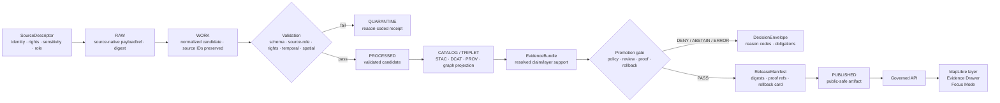

<!-- [KFM_META_BLOCK_V2]
doc_id: kfm://doc/TODO-register-agriculture-evidence-provenance
title: Agriculture Evidence and Provenance
type: standard
version: v1
status: draft
owners: TODO-agriculture-domain-steward
created: 2026-04-27
updated: 2026-05-06
policy_label: TODO-policy-label
related: [../README.md, ./DATA_CONTRACTS.md, ../governance/SOURCE_REGISTRY.md, ../governance/SOURCE_COVERAGE_MATRIX.md, ../governance/VALIDATION_PLAN.md, ../operations/PIPELINE_RUNBOOK.md]
tags: [kfm, agriculture, evidence, provenance, EvidenceBundle, catalog-closure, governed-release]
notes: [Revised from the existing thin evidence/provenance placeholder; doc_id, owner, and policy label remain review placeholders until registered by stewards.]
[/KFM_META_BLOCK_V2] -->

<a id="top"></a>

# Agriculture Evidence and Provenance

*Purpose: define how Agriculture lane claims, layers, summaries, and releases remain traceable to source-role-aware evidence, provenance, validation, policy, review, catalog closure, and rollback.*

> [!IMPORTANT]
> **Impact block**
>
> **Status:** draft · **Owners:** TODO-agriculture-domain-steward · **Path:** `docs/domains/agriculture/architecture/EVIDENCE_AND_PROVENANCE.md` · **Policy label:** TODO-policy-label
>
> 
> 
> 
> 
>
> **Quick jumps:** [Scope](#scope) · [Repo fit](#repo-fit) · [Evidence spine](#evidence-spine) · [EvidenceBundle requirements](#evidencebundle-requirements) · [Source-role support](#source-role-support) · [Provenance requirements](#provenance-requirements) · [Catalog and release closure](#catalog-and-release-closure) · [Public trust payloads](#public-trust-payloads) · [Validation checklist](#validation-checklist) · [Open verification backlog](#open-verification-backlog)

> [!NOTE]
> **Truth posture:** this document is authoritative as Agriculture lane documentation guidance. It does **not** prove that machine schemas, validators, policy-as-code, catalog emitters, release manifests, proof packs, API routes, UI components, or CI workflows already enforce every rule. Where implementation evidence is not confirmed, claims are labeled **PROPOSED**, **UNKNOWN**, or **NEEDS VERIFICATION**.

---

## Scope

Agriculture evidence is not a single table, layer, tile, or model output. It is a governed chain of support that keeps source identity, source role, spatial support, temporal support, product/version lineage, validation state, policy posture, review state, release state, and correction lineage inspectable.

This file governs the evidence and provenance burden for Agriculture lane outputs such as:

| Output surface | Evidence burden | Release posture |
|---|---|---|
| Public map layer | Must resolve to released layer manifest, catalog closure, source roles, EvidenceBundle refs, policy state, and rollback target. | **Fail closed** until closure is proven. |
| Evidence Drawer payload | Must expose support class, source refs, freshness, validation state, policy label, review/release state, and correction lineage. | **Public-safe only**; no RAW/WORK/QUARANTINE paths. |
| Focus Mode answer | Must cite released EvidenceBundle support or return ABSTAIN / DENY / ERROR. | **Generated text is never root truth.** |
| Agriculture aggregate statistic | Must preserve source, geography, period, commodity/statistic/unit, and aggregate-only scope. | **Never field-level truth.** |
| Soil moisture observation | Must preserve station/grid key, provider, depth, variable, units, timestamp semantics, QC, and source role. | **Not a field surface without declared transform.** |
| Remote-sensing / gridded product | Must preserve product/version, grid/time window, masks, asset refs, and derived/remote-sensing label. | **Not ground truth by default.** |

### Accepted here

This document accepts evidence/provenance guidance, release-burden rules, review checklists, EvidenceBundle requirements, catalog/proof/receipt distinctions, public payload obligations, and negative examples that help maintainers prevent unsupported Agriculture claims.

### Exclusions

| Does not belong here | Where it goes instead | Reason |
|---|---|---|
| Machine schema definitions | `./DATA_CONTRACTS.md` plus the canonical schema home after ADR | Prose cannot be executable validation. |
| Source descriptor field rules | `../governance/SOURCE_REGISTRY.md` | Source admission has its own registry checklist. |
| Source-family readiness status | `../governance/SOURCE_COVERAGE_MATRIX.md` | Readiness changes independently from evidence doctrine. |
| Validator implementation and fixture inventory | `../governance/VALIDATION_PLAN.md` | Tests and gates must stay runnable and reviewable. |
| Pipeline operations and incident response | `../operations/PIPELINE_RUNBOOK.md` | Runtime handling belongs in the runbook. |
| RAW, WORK, QUARANTINE, or private payload contents | Lifecycle data roots, not documentation | Internal-stage data must not leak into public docs. |

[Back to top](#top)

---

## Repo fit

This document sits inside the Agriculture domain documentation set and narrows the evidence burden for downstream architecture, validation, operations, API, UI, and release work.

| Relationship | Path | Status | Role |
|---|---|---:|---|
| Domain landing page | [`../README.md`](../README.md) | **CONFIRMED** | Agriculture scope, lifecycle, source-role guardrails, and quickstart. |
| Lane state | [`../governance/STATE_OF_LANE.md`](../governance/STATE_OF_LANE.md) | **CONFIRMED** | Current maturity snapshot and open gaps. |
| File index | [`../governance/FILE_INDEX.md`](../governance/FILE_INDEX.md) | **CONFIRMED** | Documentation package inventory. |
| Source coverage | [`../governance/SOURCE_COVERAGE_MATRIX.md`](../governance/SOURCE_COVERAGE_MATRIX.md) | **CONFIRMED** | Source-family readiness, role, and public-release default. |
| Source registry guidance | [`../governance/SOURCE_REGISTRY.md`](../governance/SOURCE_REGISTRY.md) | **CONFIRMED** | Required source descriptor fields and admission checklist. |
| Data contracts | [`./DATA_CONTRACTS.md`](./DATA_CONTRACTS.md) | **CONFIRMED** | Object families and schema-home expectations. |
| Validation plan | [`../governance/VALIDATION_PLAN.md`](../governance/VALIDATION_PLAN.md) | **CONFIRMED** | Fail-closed fixture and CI expectations. |
| Pipeline runbook | [`../operations/PIPELINE_RUNBOOK.md`](../operations/PIPELINE_RUNBOOK.md) | **CONFIRMED** | Fixture-first lifecycle and incident responses. |
| Changelog | [`../operations/CHANGELOG.md`](../operations/CHANGELOG.md) | **CONFIRMED** | Human-readable lane documentation history. |
| Supersession map | [`../governance/SUPERSESSION_MAP.md`](../governance/SUPERSESSION_MAP.md) | **CONFIRMED** | Placeholder-to-companion-doc mapping. |
| Repo source ledger | [`../../../registers/SOURCE_LEDGER.md`](../../../registers/SOURCE_LEDGER.md) | **CONFIRMED** | Cross-project source ledger; use when source IDs are registered. |

> [!WARNING]
> Do not treat a derived layer, map tile, vegetation index, graph projection, summary, embedding, dashboard, or Focus Mode answer as proof by itself. Agriculture public claims must resolve through evidence and release objects.

[Back to top](#top)

---

## Evidence spine

Agriculture preserves the KFM lifecycle law:

```text
SOURCE EDGE -> RAW -> WORK / QUARANTINE -> PROCESSED -> CATALOG / TRIPLET -> PUBLISHED
```

Promotion is a governed state transition, not a file move.



### Chain-of-custody rule

Every consequential Agriculture claim needs a traceable path from public surface back to support:

```text
public claim
  -> layer/API/Focus payload
  -> EvidenceBundle
  -> EvidenceRef(s)
  -> catalog/provenance record(s)
  -> validation report(s)
  -> processed candidate(s)
  -> normalization receipt(s)
  -> RAW digest or source-native immutable reference
  -> SourceDescriptor
```

If any link is missing, unresolved, blocked by policy, stale beyond its declared support window, or incompatible with the claim being made, the system must return a finite negative outcome rather than smoothing the gap into narrative prose.

[Back to top](#top)

---

## EvidenceBundle requirements

An Agriculture `EvidenceBundle` is the resolved support package for a claim, layer, drawer payload, export, or bounded Focus Mode answer.

### Required support fields

| Field family | Required contents | Why it matters |
|---|---|---|
| Identity | `bundle_id`, bundle version, contract/schema version, created timestamp, producer/run reference. | Makes the support package auditable and comparable. |
| Claim target | Claim ID or layer/feature/export/answer target; semantic scope; intended audience. | Prevents generic evidence from supporting the wrong claim. |
| Spatial scope | Geography, geometry support class, CRS/precision class, spatial generalization/redaction if applied. | Separates station, grid, county, map unit, and derived geometry support. |
| Temporal scope | Observation time, source time, retrieval time, processing time, release time, validity window, stale rule. | Prevents old or mismatched observations from appearing current. |
| Source support | EvidenceRefs, SourceDescriptor refs, source roles, stable source keys, citation text/attribution. | Keeps evidence traceable and role-aware. |
| Provenance | RAW ref/digest, normalization receipt, transform/spec hash, validation report refs, catalog refs. | Allows rebuild and audit without exposing internal paths publicly. |
| Integrity | Artifact digests, content/spec hash, run hash where applicable, release digest refs. | Detects artifact swaps and drift. |
| Policy posture | Rights, sensitivity, access class, public precision, disclosure obligations, denial reasons if any. | Blocks unclear rights, sensitivity, or precision exposure. |
| Review state | Reviewer/steward refs, review status, obligations, risk class, approval timestamp when applicable. | Separates machine validity from human/steward approval. |
| Uncertainty | Support class, caveats, known gaps, confidence/quality label if repo contracts define one. | Prevents over-precise public language. |
| Release lineage | ReleaseManifest ref, PromotionDecision/DecisionEnvelope ref, rollback card, correction/supersession refs. | Makes publication reversible and correctable. |

> [!IMPORTANT]
> An EvidenceBundle outranks generated language. Focus Mode, summaries, popups, reports, and dashboards must not claim more than the resolved bundle supports.

### Minimum public claim test

Before publishing or displaying a consequential Agriculture claim, reviewers should be able to answer:

1. Which `SourceDescriptor` authorized the source and source role?
2. Which exact EvidenceBundle supports this claim?
3. What is the claim’s spatial, temporal, and semantic scope?
4. What validation reports passed?
5. What policy decision allowed the public precision and content?
6. What release manifest published the artifact?
7. What rollback or correction path reverses it?

If any answer is **UNKNOWN**, the claim is not ready for public release.

[Back to top](#top)

---

## Source-role support

Agriculture sources are not interchangeable. The same county, field, station, or grid cell can have multiple evidence types with different authority and precision.

| Source family | Support class | May support | Must not support |
|---|---|---|---|
| SSURGO / SDA | Authoritative soil survey context | MUKEY-centered soil properties, component attributes, map-unit context, soil-derived constraints. | Real-time soil moisture, crop condition, field/operator truth, or replacement of source provenance. |
| gSSURGO | Gridded soil companion context | Rasterized soil survey companion use when explicitly labeled as gridded. | Independent soil authority or silently replacing SSURGO/SDA tabular/vector provenance. |
| Kansas Mesonet | Station observation context | Station/depth/time soil moisture or weather observations with units, QC, and freshness. | Field-level truth or statewide surface without an explicit transform/model and EvidenceBundle support. |
| NRCS SCAN / NOAA USCRN | Station corroboration | Station-level corroborative observations after unit/depth/QC normalization. | Parcel/field truth, aggregate crop statistics, or official crop-condition claims. |
| NASA SMAP | Satellite/grid soil moisture context | Product/version-specific gridded soil moisture context and derived indicators. | Station observation, parcel truth, or field/operator condition. |
| NASA HLS / HLS-VI | Remote-sensing vegetation context | Reflectance/index/masked vegetation observations and derived stress/context indicators. | Direct crop yield, field operation, or unmasked ground truth. |
| USDA NASS QuickStats / Crop Progress | Official aggregate agricultural context | Aggregate geography/period/commodity/statistic context. | Field-level, parcel-level, operator-level, or point-specific claims. |
| Private/proprietary farm data | Restricted future class | Nothing public by default; future restricted workflows only after policy approval. | Public release without rights, consent, sensitivity review, and restricted-data lane controls. |
| PMTiles / search / summary / embedding / dashboard | Rebuildable derived carrier | Faster access, visualization, review, and navigation. | Sovereign truth or evidence root. |

### Anti-collapse rules

- **Aggregate is not field-level.** A county/week statistic cannot prove field or parcel condition.
- **Station is not surface.** A station reading needs a declared interpolation/model transform before supporting surface claims.
- **Grid is not station.** SMAP and HLS products must remain product/version-specific gridded or remote-sensing context.
- **Derived is not canonical.** Tiles, indexes, embeddings, dashboards, reports, and scenes are rebuilt from governed evidence.
- **Source role constrains claim scope.** A source role that cannot support a claim must produce DENY or ABSTAIN.
- **Unknown rights fail closed.** Missing rights, sensitivity, steward, citation, or public-release terms block promotion.

[Back to top](#top)

---

## Provenance requirements

Provenance is the record of how source material became a candidate, how a candidate became validated, and how a validated candidate became publishable. It is not optional metadata.

### Stage-by-stage provenance

| Lifecycle stage | Required provenance | Public exposure |
|---|---|---|
| SOURCE EDGE | SourceDescriptor, steward, rights/terms, sensitivity, source role, cadence, citation rule, stable keys, activation state. | Source identity and public attribution only where allowed. |
| RAW | Immutable source-native payload/ref, retrieval time, source URL/path where allowed, digest, fetch receipt, source headers/checksums if used. | No normal public exposure. |
| WORK | Normalization run, preserved source IDs, CRS/unit/time conversions, warnings, transform/spec hash, candidate receipt. | No normal public exposure. |
| QUARANTINE | Reason code, failed validation/policy outcome, steward obligation, repair/correction task. | No public exposure unless a public correction notice is required. |
| PROCESSED | Validated candidate record, validation report refs, normalized identity, source-role-compatible claim affordances. | Still not public unless promoted. |
| CATALOG / TRIPLET | STAC/DCAT/PROV records, CatalogMatrix, graph projection refs, digest closure, EvidenceBundle candidates. | Public catalog metadata only after release policy allows. |
| PUBLISHED | ReleaseManifest, proof pack, PromotionDecision, rollback card, public layer/API manifest, correction lineage. | Public-safe artifacts only. |

### Receipt versus proof

| Object | Role | Not allowed to do |
|---|---|---|
| Receipt | Process memory for fetch, normalize, validate, transform, catalog, or rollback operations. | It cannot prove public truth by itself. |
| ValidationReport | Machine or reviewer check result with pass/fail, reasons, obligations, and fixture/run refs. | It cannot replace evidence or policy. |
| EvidenceBundle | Resolved support package for a claim or layer. | It cannot exceed source-role or policy scope. |
| ProofPack | Release-grade bundle used by gates; may include validation, EvidenceBundle, catalog closure, release refs, signatures/attestations if available. | It cannot hide missing evidence or unresolved rights. |
| ReleaseManifest | Public release identity and artifact digest/control object. | It cannot be created as a simple copy from candidate files. |
| RollbackCard | Reversal/repointing plan and target. | It cannot delete prior published lineage. |

[Back to top](#top)

---

## Catalog and release closure

A publishable Agriculture artifact must close across catalog, provenance, evidence, proof, and rollback surfaces.

| Closure surface | Required check | Failure outcome |
|---|---|---|
| STAC | Asset IDs, time range, geometry/bbox, media type, checksums, provider/source refs when applicable. | DENY promotion until catalog repaired. |
| DCAT | Dataset/distribution identity, checksum, access URL/path class, rights/terms, publisher/steward. | DENY if distribution cannot be traced or rights are unclear. |
| PROV | Entity/activity/agent links, generated-by run, source attribution, transform refs. | DENY if provenance chain is broken. |
| CatalogMatrix | Crosswalk tying STAC/DCAT/PROV/release/digest identities. | DENY if IDs/checksums disagree. |
| EvidenceBundle | Claim/layer support, policy, review, citations, uncertainty, correction lineage. | ABSTAIN or DENY if unresolved. |
| ProofPack | Release-grade validation/evidence/catalog summary, signatures/attestations if required and available. | DENY release-significant promotion. |
| ReleaseManifest | Artifact refs, digests, policy state, review state, public manifest refs, rollback target. | ERROR if missing rollback target. |
| CorrectionNotice | Public correction or supersession when an exposed claim changes materially. | ERROR if published history is silently overwritten. |

### Promotion gate set

| Gate | Question | Expected disposition |
|---|---|---|
| A. Source authority | Are owner/steward, source role, rights, sensitivity, cadence, stable keys, and citation rules explicit? | DENY if incomplete. |
| B. Schema validity | Do candidate objects validate under the canonical schema home? | QUARANTINE on failure. |
| C. Evidence closure | Does every public claim/layer resolve to EvidenceBundle support? | ABSTAIN or DENY if missing. |
| D. Catalog closure | Do STAC/DCAT/PROV/CatalogMatrix/release digests agree? | DENY if mismatched. |
| E. Policy compliance | Are rights, sensitivity, precision, source role, and access rules satisfied? | DENY if unclear. |
| F. Review state | Does risk class require steward/human review, and is it recorded? | DENY until reviewed. |
| G. Release readiness | Are proof pack, ReleaseManifest, rollback card, and correction path present? | ERROR if publication path is incomplete. |
| H. Public client safety | Does API/UI avoid RAW/WORK/QUARANTINE/internal store references? | DENY public surface. |

[Back to top](#top)

---

## Public trust payloads

Public clients and ordinary UI surfaces must consume governed APIs and released artifacts only.

### Evidence Drawer payload

The Evidence Drawer should expose enough trust context to inspect a claim without revealing restricted internal paths.

| Drawer field | Backing object | Required behavior |
|---|---|---|
| Layer / claim identity | LayerManifest, claim target, ReleaseManifest | Show public layer/claim ID, release ID, and current/published state. |
| Evidence | EvidenceBundle | Show source refs, source roles, citations/attribution, support class, review state. |
| Provenance | CatalogMatrix, PROV, receipts summary | Show public-safe lineage summary and digest/support refs. |
| Freshness | Dataset manifest, receipt summary, EvidenceBundle | Show observation window, checked/retrieved time, stale/unknown status. |
| Policy | PolicyDecision / DecisionEnvelope | Show public/restricted/review-required class, transforms, obligations, denial reasons where public-safe. |
| Validation | Validation reports | Show pass/fail summary and gate outcomes; hide RAW/WORK/QUARANTINE/internal paths. |
| Correction | CorrectionNotice, rollback card | Show current/prior release refs and public correction summary. |

### Focus Mode payload

Focus Mode may interpret released Agriculture evidence, but it must stay bounded.

| Requirement | Rule |
|---|---|
| Evidence first | Resolve EvidenceRef -> EvidenceBundle before answer generation. |
| Citation validation | Cite released support or abstain. |
| Source-role fit | Refuse field-level claims from aggregate, station, grid, or derived-only support. |
| Policy safety | Return DENY when rights/sensitivity/public precision blocks disclosure. |
| Finite outcome | Emit ANSWER, ABSTAIN, DENY, or ERROR with reason codes and evidence refs. |
| No direct model truth | Do not publish raw model output as evidence, proof, or release state. |
| No hidden internals | Do not expose RAW, WORK, QUARANTINE, private source terms, secrets, or internal receipts in public output. |

[Back to top](#top)

---

## Validation checklist

Evidence and provenance validation should stay fixture-first and fail closed.

### Minimum fixture targets

| Fixture | Expected outcome |
|---|---|
| Valid station observation with provider, station ID, depth, unit, timestamp, QC, and source descriptor. | PASS to PROCESSED candidate. |
| Missing rights or missing sensitivity in source descriptor. | DENY source activation or public release. |
| NASS aggregate used as field/parcel condition. | DENY claim. |
| Station reading used as statewide/field surface without transform. | DENY or QUARANTINE. |
| SMAP grid described as station observation. | DENY claim. |
| HLS vegetation index missing mask/product/time-window metadata. | ABSTAIN or QUARANTINE. |
| Layer manifest pointing to RAW, WORK, QUARANTINE, or internal receipt path. | FAIL no-raw-public-path check. |
| CatalogMatrix with mismatched STAC/DCAT/PROV/release digests. | DENY promotion. |
| Receipt claiming release proof authority. | FAIL receipt-not-proof check. |
| Release candidate without rollback target. | ERROR or DENY promotion. |

### Reviewer checklist

- [ ] SourceDescriptor has source role, owner/steward, rights, sensitivity, cadence, stable keys, spatial support, temporal support, citation rule, and activation state.
- [ ] EvidenceBundle resolves every public claim/layer/answer support requirement.
- [ ] Source role supports the claim scope.
- [ ] Spatial precision and public geometry match policy.
- [ ] Temporal support and freshness are visible.
- [ ] Validation reports exist and negative fixtures still fail.
- [ ] Catalog closure is complete across STAC/DCAT/PROV/CatalogMatrix/release digest identities.
- [ ] ReleaseManifest includes artifact digests, proof refs, policy/review state, and rollback target.
- [ ] Evidence Drawer and Focus Mode payloads show finite trust states.
- [ ] Corrections supersede rather than overwrite prior published lineage.

[Back to top](#top)

---

## Illustrative EvidenceBundle shape

This example is illustrative only. Use the repo’s canonical schema once the schema-home ADR is resolved.

```json
{
  "bundle_id": "kfm://evidence-bundle/agriculture/example-soil-moisture-001",
  "bundle_version": "v1",
  "claim_target": {
    "target_type": "layer_feature",
    "target_id": "kfm://layer-feature/agriculture/example-soil-moisture-cell",
    "claim_scope": {
      "semantic": "station soil moisture context",
      "spatial_support": "station",
      "temporal_support": "observation_time_window"
    }
  },
  "support": [
    {
      "evidence_ref": "kfm://evidence/agriculture/example-mesonet-reading",
      "source_descriptor_ref": "kfm://source/agriculture/kansas-mesonet",
      "source_role": "observation",
      "stable_keys": ["station_id", "variable", "depth_cm", "observed_at_utc"]
    }
  ],
  "provenance": {
    "raw_digest": "sha256:TODO-fixture-digest",
    "normalization_receipt_ref": "kfm://receipt/agriculture/normalize/example",
    "validation_report_refs": ["kfm://validation/agriculture/example-pass"],
    "catalog_matrix_ref": "kfm://catalog-matrix/agriculture/example"
  },
  "policy": {
    "policy_label": "public",
    "sensitivity": "public",
    "public_precision": "station",
    "obligations": ["show_source_role", "show_freshness", "show_uncertainty"]
  },
  "review": {
    "review_state": "draft",
    "reviewer": "TODO-agriculture-domain-steward"
  },
  "release": {
    "release_manifest_ref": "kfm://release/agriculture/example",
    "rollback_card_ref": "kfm://rollback/agriculture/example"
  },
  "uncertainty": {
    "support_class": "direct station observation",
    "caveat": "Does not establish field-level or statewide surface truth."
  }
}
```

[Back to top](#top)

---

## Rollback and correction

Rollback is a public trust requirement, not an operational afterthought.

| Scenario | Required action |
|---|---|
| Bad source descriptor | Disable source entry, preserve descriptor lineage, block dependent releases. |
| Bad RAW fetch | Preserve failed receipt, quarantine payload/ref, do not mutate prior RAW object. |
| Bad normalization | Quarantine candidate, preserve source refs and reason codes. |
| Bad validation rule | Re-run affected fixtures, reopen candidates, issue correction if public state was affected. |
| Bad catalog closure | Block promotion; repair catalog identities and digest refs before retry. |
| Bad public layer | Repoint current layer alias to prior ReleaseManifest; invalidate caches if needed; emit rollback receipt/proof. |
| Bad public claim | Publish CorrectionNotice or supersession; do not silently overwrite history. |
| Bad Focus Mode answer | Record finite failure, fix evidence/citation/policy route, and avoid using generated text as correction evidence. |

[Back to top](#top)

---

## Open verification backlog

| Item | Status | Why it matters |
|---|---:|---|
| `doc_id`, owner, CODEOWNERS, and policy label registration | **NEEDS VERIFICATION** | Metadata placeholders should be replaced by steward-approved values. |
| Canonical schema home | **CONFLICTED / NEEDS VERIFICATION** | Prevents divergent `contracts/` and `schemas/` authority. |
| Shared `EvidenceBundle`, `DecisionEnvelope`, `PromotionDecision`, `ReleaseManifest`, `CatalogMatrix`, `ProofPack`, and `RollbackCard` schemas | **UNKNOWN** | Agriculture should reuse shared governance objects when present. |
| Concrete validators, command names, and CI workflow paths | **UNKNOWN** | This doc defines expectations, not enforcement proof. |
| OPA/Rego, Conftest, signing/proof-pack tooling | **UNKNOWN** | Policy/release-hardening enforcement depends on verified toolchain. |
| API route names, Evidence Drawer component path, Focus Mode schema, MapLibre layer registry | **UNKNOWN** | Public trust payload binding must follow actual app conventions. |
| SSURGO/SDA/gSSURGO current terms, endpoints, versions, and query limits | **NEEDS VERIFICATION** | Blocks live source activation. |
| Kansas Mesonet, SCAN, USCRN, SMAP, HLS/HLS-VI, and NASS source terms/cadence/automation permissions | **NEEDS VERIFICATION** | Blocks live watchers and publication. |
| First release manifest and rollback card references | **UNKNOWN** | Lane state notes this as a next action. |

[Back to top](#top)

---

<details>
<summary>Appendix A — Evidence language patterns</summary>

Use language that preserves support boundaries.

| Safer wording | Avoid |
|---|---|
| “This county-level NASS statistic reports…” | “This field produced…” |
| “This station observed soil moisture at this depth and time…” | “The farm had this moisture level…” |
| “This SMAP grid product indicates gridded soil moisture context…” | “Ground truth moisture was…” |
| “This HLS-derived index suggests vegetation stress context after mask and time-window checks…” | “The crop is failing…” |
| “The EvidenceBundle supports this released layer at this scope.” | “The map proves…” |
| “Focus Mode abstained because evidence was missing or source role was incompatible.” | “The model could not figure it out.” |

</details>

<details>
<summary>Appendix B — Maintainer handoff checklist</summary>

1. Confirm metadata placeholders in the KFM meta block.
2. Verify relative links after the file is placed in `docs/domains/agriculture/architecture/`.
3. Confirm whether shared governance schemas already exist before adding agriculture-specific variants.
4. Update `../governance/FILE_INDEX.md` if this file moves or changes role.
5. Update `../operations/CHANGELOG.md` after commit.
6. Add or update fixtures in the repo-native test location before claiming enforcement.
7. Keep source activation disabled until rights, sensitivity, cadence, and automation permissions are verified.

</details>
