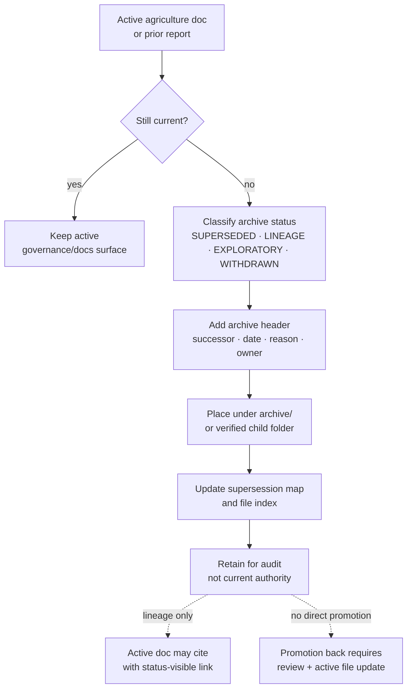

<!-- [KFM_META_BLOCK_V2]
doc_id: kfm://doc/TODO-register-agriculture-archive-readme
title: Agriculture Archive
type: standard
version: v1
status: draft
owners: TODO-agriculture-domain-steward; TODO-documentation-steward
created: NEEDS-VERIFICATION
updated: 2026-05-06
policy_label: NEEDS-VERIFICATION
related: [../README.md, ../../README.md, ../governance/STATE_OF_LANE.md, ../governance/FILE_INDEX.md, ../governance/SUPERSESSION_MAP.md, ../../../adr/ADR-0002-responsibility-root-monorepo.md]
tags: [kfm, agriculture, archive, lineage, supersession, evidence-first, governance]
notes: [Existing archive README confirmed in repository; doc_id, created date, owners, and policy_label require registry and steward verification. This revision expands archive rules without claiming child archive folders already exist.]
[/KFM_META_BLOCK_V2] -->

<a id="top"></a>

# Agriculture Archive

*Purpose: preserve superseded agriculture-domain documentation as inspectable lineage without granting it current authority.*

> [!IMPORTANT]
> **Impact block**
>
> **Status:** active archive directory · **Document status:** draft · **Owners:** TODO-agriculture-domain-steward; TODO-documentation-steward · **Path:** `docs/domains/agriculture/archive/README.md`
>
> 
> 
> 
> 
> 
>
> **Quick jumps:** [Scope](#scope) · [Repo fit](#repo-fit) · [Accepted inputs](#accepted-inputs) · [Exclusions](#exclusions) · [Directory tree](#directory-tree) · [Archive labels](#archive-labels) · [Usage](#usage) · [Diagram](#diagram) · [Definition of done](#definition-of-done) · [FAQ](#faq)

---

## Scope

This directory is the agriculture lane’s **lineage-safe holding area** for documents that no longer act as current lane guidance but must remain available for audit, supersession, correction, rollback reasoning, or historical continuity.

Archived material may explain how the Agriculture lane evolved. It must not silently re-enter the active control plane as current doctrine, current schema authority, current policy, current source admission, current release state, or current public evidence.

### Working rule

> An archived agriculture document can preserve context. It cannot create current authority without a successor map, review note, and explicit promotion back into an active responsibility root.

| Archive concern | Required posture |
|---|---|
| Current authority | **No** — active lane docs and governed registries outrank archive contents. |
| Evidence retention | **Yes** — preserve enough prior evidence context for audit and correction. |
| Public data storage | **No** — this archive is documentation lineage, not lifecycle data storage. |
| Supersession | **Required** for anything moved here from active docs. |
| Rollback/correction value | **Allowed** when the archived item helps explain a prior decision, release, or reversal. |
| Direct import into active canon | **Denied by default** unless the successor map or ADR explicitly allows it. |

[Back to top](#top)

---

## Repo fit

| Relationship | Path | Status | Role |
|---|---|---:|---|
| This document | `docs/domains/agriculture/archive/README.md` | **CONFIRMED** | Archive directory README and placement rules. |
| Agriculture lane landing page | [`../README.md`](../README.md) | **CONFIRMED** | Current lane orientation, scope, lifecycle, and guardrails. |
| Domain lanes index | [`../../README.md`](../../README.md) | **CONFIRMED** | Cross-domain documentation entry point. |
| Agriculture state snapshot | [`../governance/STATE_OF_LANE.md`](../governance/STATE_OF_LANE.md) | **CONFIRMED** | Current lane maturity and verification gaps. |
| Agriculture file index | [`../governance/FILE_INDEX.md`](../governance/FILE_INDEX.md) | **CONFIRMED** | Lists archive README as part of the documentation package. |
| Supersession map | [`../governance/SUPERSESSION_MAP.md`](../governance/SUPERSESSION_MAP.md) | **CONFIRMED** | Maps archive policy to this README. |
| Responsibility-root ADR | [`../../../adr/ADR-0002-responsibility-root-monorepo.md`](../../../adr/ADR-0002-responsibility-root-monorepo.md) | **CONFIRMED** | Places domain docs under responsibility roots instead of root-level topic folders. |
| Docs landing page | [`../../../README.md`](../../../README.md) | **NEEDS VERIFICATION** | Upstream documentation control plane. |
| Repository landing page | [`../../../../README.md`](../../../../README.md) | **CONFIRMED** | Project-wide KFM orientation and trust law. |
| Global docs archive | `docs/archive/README.md` | **UNKNOWN / NEEDS VERIFICATION** | A future global archive policy may supersede or complement this lane-local archive. |

### Upstream/downstream boundary

```text
Active agriculture docs
  -> governance/SUPERSESSION_MAP.md
  -> archive/README.md
  -> archived item with header note
  -> retained lineage only
```

This archive is downstream of the active Agriculture lane and its governance docs. It is not upstream of source descriptors, schemas, policy, tests, release manifests, or public UI behavior.

[Back to top](#top)

---

## Accepted inputs

Archive material belongs here only when its status is clear and its successor path is visible.

| Accepted input | Examples | Required gate |
|---|---|---|
| Superseded agriculture docs | Older README sections, replaced runbook notes, retired domain guidance. | Replacement path and supersession date recorded. |
| Lineage materials | Prior scaffold notes, PDF-derived excerpts, design-history notes, migration background. | Marked **LINEAGE**, not current authority. |
| Withdrawn guidance | Prior guidance removed for rights, sensitivity, accuracy, source-role, or placement reasons. | Withdrawal reason and replacement/denial state recorded. |
| Exploratory agriculture notes | Draft ideas intentionally retained after triage. | Marked **EXPLORATORY** and not linked as canon. |
| Correction support notes | Notes needed to explain a rollback, correction, narrowed republication, or supersession. | Linked to correction or rollback surface when verified. |
| Archive indexes | Child README files, index cards, successor maps, retention notes. | Must not duplicate active `governance/FILE_INDEX.md` authority. |
| Redacted excerpts | Short excerpts of superseded material retained for audit. | Rights and sensitivity reviewed before inclusion. |

> [!NOTE]
> Archive admission is not a rescue path for unclear files. Unknown purpose, unknown rights, unknown sensitivity, unknown successor, or unknown owner stays **NEEDS VERIFICATION** until reviewed.

[Back to top](#top)

---

## Exclusions

| Does not belong here | Where it goes instead | Why |
|---|---|---|
| RAW source payloads | `data/raw/agriculture/` or repo-native RAW lifecycle home — **NEEDS VERIFICATION** | RAW is source-native evidence input, not archive prose. |
| WORK or QUARANTINE candidates | `data/work/agriculture/`, `data/quarantine/agriculture/`, or repo-native equivalents — **NEEDS VERIFICATION** | Unvalidated or blocked data must not become documentation. |
| PROCESSED, CATALOG, TRIPLET, or PUBLISHED artifacts | `data/processed/`, `data/catalog/`, `data/triplets/`, `data/published/` — **NEEDS VERIFICATION** | Lifecycle artifacts have their own governed homes. |
| Active Agriculture guidance | [`../README.md`](../README.md) and verified active companion docs | Archive material must not compete with active lane docs. |
| Current state and file inventory | [`../governance/STATE_OF_LANE.md`](../governance/STATE_OF_LANE.md), [`../governance/FILE_INDEX.md`](../governance/FILE_INDEX.md) | Current operational status belongs in active governance docs. |
| Active supersession routing | [`../governance/SUPERSESSION_MAP.md`](../governance/SUPERSESSION_MAP.md) | This archive follows the map; it does not replace it. |
| Machine schemas or active semantic contracts | `schemas/`, `contracts/`, or repo-native schema/contract homes | Archive prose cannot be executable validation authority. |
| Policy-as-code or live policy bundles | `policy/` or repo-native policy home | Policy must remain executable, testable, and separately reviewable. |
| Tests, fixtures, validators, and CI workflows | `tests/`, `fixtures/`, `tools/validators/`, `.github/workflows/` | Archive files should not become hidden enforcement surfaces. |
| SourceDescriptor records or activation state | `data/registry/agriculture/` or repo-native registry home | Source admission must be governed and current. |
| Release manifests, proof packs, receipts, rollback cards | `release/`, `data/proofs/`, `data/receipts/`, or repo-native release/proof homes | Archive notes may link to these objects; they do not store them. |
| Secrets, credentials, private source URLs, tokens | Secret manager or restricted runtime configuration | Never commit secrets to Markdown archives. |
| Private farm/operator/yield/pesticide records | Restricted future lane only after policy approval | Agriculture archive docs must not expose private or sensitive operational data. |

[Back to top](#top)

---

## Directory tree

Current confirmed minimum:

```text
docs/domains/agriculture/archive/
└── README.md
```

Permitted future child folders, **PROPOSED** until verified in the repository:

```text
docs/domains/agriculture/archive/
├── README.md                 # archive policy and usage rules
├── lineage/                  # prior design/source lineage retained without current authority
├── superseded/               # replaced agriculture docs with successor headers
├── exploratory/              # triaged ideas retained as non-canon
└── reports/                  # prior report excerpts or report-index notes, rights permitting
```

> [!WARNING]
> Do not create child folders just because this tree names them. Add them only after updating the Agriculture file index and supersession map, or after a broader docs archive ADR makes them canonical.

[Back to top](#top)

---

## Archive labels

Use these labels on archived files and index rows when confidence materially matters.

| Label | Meaning | May active docs cite it? |
|---|---|---:|
| **SUPERSEDED** | Replaced by a newer active file or section. | Yes, only as history or predecessor. |
| **LINEAGE** | Preserved to explain origin, migration, or prior design pressure. | Yes, only with a current successor or context note. |
| **EXPLORATORY** | Idea retained after triage but not promoted. | No, unless explicitly promoted through intake/review. |
| **WITHDRAWN** | Removed because it is inaccurate, unsafe, rights-conflicted, sensitivity-conflicted, or misplaced. | No, except to explain correction history. |
| **REFERENCE** | Useful background that does not define KFM canon. | Yes, only as background. |
| **NEEDS VERIFICATION** | Archived item lacks enough review to classify more narrowly. | No. |
| **RETAINED FOR AUDIT** | Must remain available to explain prior release, rollback, correction, or review state. | Yes, only in audit/correction context. |

### Required archive header

Every archived Markdown file should start with a short status note after any existing meta block.

```markdown
> [!NOTE]
> **Archive status:** SUPERSEDED | LINEAGE | EXPLORATORY | WITHDRAWN | REFERENCE | NEEDS VERIFICATION  
> **Archived on:** YYYY-MM-DD  
> **Superseded by:** ../path/to/current-file.md or `NO SUCCESSOR — explain why`  
> **Reason:** short reason  
> **Original role:** active doc | draft | report | scaffold note | runbook | other  
> **Reviewer / owner:** TODO or verified reviewer  
> **Public-use posture:** cite only as lineage; not current authority
```

[Back to top](#top)

---

## Usage

### Archive a superseded Agriculture document

1. Confirm the current replacement file or section.
2. Add the archive header to the superseded file.
3. Preserve evidence, policy, release, correction, and rollback context that future reviewers need.
4. Remove or update active links so users land on the current file first.
5. Update [`../governance/SUPERSESSION_MAP.md`](../governance/SUPERSESSION_MAP.md).
6. Update [`../governance/FILE_INDEX.md`](../governance/FILE_INDEX.md) when the archive structure changes.
7. Run repo-native markdown, link, and docs-index checks when available.
8. Keep the change reversible.

### Reference an archived item from active docs

Active docs may link to archived items only when the link text makes the status visible.

| Good link text | Avoid |
|---|---|
| `Superseded 2026-04-27 source matrix retained for lineage` | `Source matrix` |
| `Withdrawn draft — do not use as current policy` | `Policy draft` |
| `Prior agriculture scaffold report, retained as lineage` | `Implementation plan` |

### Restore an archived idea to active work

Archived material can return to the active control plane only through a reviewed change:

1. Re-check source rights, sensitivity, and current repo placement.
2. Decide whether restoration is a correction, new proposal, or full canon promotion.
3. Create or update the active file in the proper responsibility root.
4. Link the old archive item as predecessor, not as live authority.
5. Add a supersession or restoration note.
6. Validate links and affected docs.

[Back to top](#top)

---

## Diagram



[Back to top](#top)

---

## Definition of done

An Agriculture archive change is ready for review when all applicable gates pass.

- [ ] The archived item has a visible archive header.
- [ ] Archive status is one of: **SUPERSEDED**, **LINEAGE**, **EXPLORATORY**, **WITHDRAWN**, **REFERENCE**, **NEEDS VERIFICATION**, or **RETAINED FOR AUDIT**.
- [ ] A replacement path, successor note, or `NO SUCCESSOR` reason is recorded.
- [ ] The archive move preserves evidence, policy, release, correction, and rollback context needed for audit.
- [ ] Active docs no longer point to the archived item as if it were current authority.
- [ ] [`../governance/SUPERSESSION_MAP.md`](../governance/SUPERSESSION_MAP.md) is updated when predecessor/successor relationships change.
- [ ] [`../governance/FILE_INDEX.md`](../governance/FILE_INDEX.md) is updated when archive structure changes.
- [ ] No RAW, WORK, QUARANTINE, PROCESSED, PUBLISHED, secret, credential, private farm/operator, or live source payload is stored here.
- [ ] Links are relative and valid, or explicitly marked **NEEDS VERIFICATION**.
- [ ] The change is reversible without erasing lineage.
- [ ] Any restoration to active canon goes through review rather than direct archive import.

[Back to top](#top)

---

## Quickstart

Run these read-only checks from the repository root before changing archive contents.

```bash
git status --short
git branch --show-current || true

find docs/domains/agriculture -maxdepth 4 -type f 2>/dev/null | sort
find docs/domains/agriculture/archive -maxdepth 3 -type f 2>/dev/null | sort || true

grep -RInE "Archive status:|SUPERSEDED|LINEAGE|EXPLORATORY|WITHDRAWN|NEEDS VERIFICATION" \
  docs/domains/agriculture/archive 2>/dev/null || true
```

Repo-native validation commands remain **NEEDS VERIFICATION**. Use the project’s current markdown/link-check/test tooling when verified.

[Back to top](#top)

---

## FAQ

### Is an archived Agriculture document still authoritative?

No. An archive item may preserve history, evidence context, or prior reasoning, but active docs, verified registries, current schemas, current policy, reviewed release objects, and current EvidenceBundle-backed surfaces outrank it.

### Can the archive store old source data?

No. Source data belongs in the governed data lifecycle, not in Markdown archives. This archive is for documentation lineage and supersession context.

### Can active docs cite archived material?

Yes, but only with a status-visible link and only for lineage, audit, correction, or predecessor context. Do not cite archived material as current guidance.

### What happens when a superseded document contains useful language?

Move the useful language into the active file through a normal reviewed doc change, then cite the archived item as predecessor lineage. Do not rely on the archive copy to carry current meaning.

### Should this archive mirror a future global `docs/archive/` structure?

Only after a global archive README or ADR is verified. Until then, this file governs the lane-local archive and keeps global archive placement **NEEDS VERIFICATION**.

[Back to top](#top)

---

<details>
<summary>Appendix A — Archive review card</summary>

| Field | Value |
|---|---|
| Archived item | `path/to/file.md` |
| Archive status | `SUPERSEDED | LINEAGE | EXPLORATORY | WITHDRAWN | REFERENCE | NEEDS VERIFICATION | RETAINED FOR AUDIT` |
| Archived on | `YYYY-MM-DD` |
| Superseded by | `relative/path.md` or `NO SUCCESSOR` |
| Reason | `short reason` |
| Original role | `active doc | draft | report | scaffold | runbook | other` |
| Evidence context retained? | `yes/no` |
| Policy/release/correction context retained? | `yes/no/not applicable` |
| Active links updated? | `yes/no` |
| Supersession map updated? | `yes/no/not applicable` |
| File index updated? | `yes/no/not applicable` |
| Reviewer / owner | `TODO or verified owner` |

</details>

<details>
<summary>Appendix B — Common archive anti-patterns</summary>

| Anti-pattern | Safer handling |
|---|---|
| Moving a file to archive without a successor note | Add a header with replacement path, date, and reason. |
| Keeping old docs because they “might still be useful” | Classify as **LINEAGE** or **EXPLORATORY** and link only with status. |
| Treating a prior report as implementation proof | Use it as lineage; verify current repo files, tests, workflows, and artifacts separately. |
| Letting archive docs define active schema or policy | Move current meaning into `schemas/`, `contracts/`, `policy/`, or active docs. |
| Storing source payloads in docs | Use governed data lifecycle homes. |
| Deleting superseded context completely | Preserve lineage where it affects audit, correction, rollback, or public explanation. |

</details>

[Back to top](#top)
