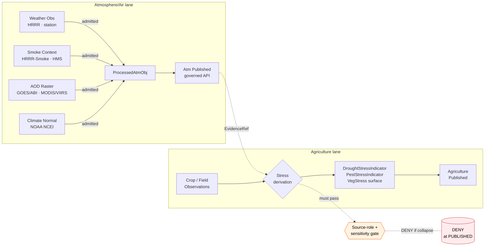

<!-- [KFM_META_BLOCK_V2]
doc_id: kfm://doc/docs-domains-agriculture-atmosphere-stress
title: Agriculture × Atmosphere/Air — Stress Indicator Cross-Lane Reference
type: standard
version: v1
status: draft
owners: <TODO: agriculture-steward; atmosphere-steward; docs-steward>
created: 2026-05-27
updated: 2026-05-27
policy_label: public
related:
  - docs/doctrine/ai-build-operating-contract.md
  - docs/doctrine/directory-rules.md
  - docs/domains/agriculture/README.md
  - docs/domains/agriculture/VERIFICATION_BACKLOG.md
  - docs/domains/atmosphere/README.md
  - docs/registers/VERIFICATION_BACKLOG.md
  - docs/registers/DRIFT_REGISTER.md
  - docs/adr/README.md
  - docs/sources/SOURCE_DESCRIPTOR_STANDARD.md
tags: [kfm, agriculture, atmosphere, cross-lane, stress, source-role, governance]
notes:
  - CONTRACT_VERSION = "3.0.0" (pinned per ai-build-operating-contract.md §37).
  - Cross-lane reference; not a doctrine source.
  - Canonical relation is Atlas v1.0 Ch. 9 §F (Agriculture side) and Ch. 11 §F (Atmosphere side).
  - Source-role anti-collapse for observed/regulatory/modeled/aggregate is acute on this edge (Atlas v1.1 Ch. 24.13).
[/KFM_META_BLOCK_V2] -->

# Agriculture × Atmosphere/Air — Stress Indicator Cross-Lane Reference

> How the Agriculture domain cites Atmosphere/Air evidence for `DroughtStressIndicator`, `PestStressIndicator`, and vegetation-stress products — and the source-role, sensitivity, and lifecycle discipline that keeps modeled smoke and aggregate climate from being mistaken for field truth.

<p align="left">
  
  
  
  
  
  
  
  
  <!-- TODO: replace with live Shields.io endpoints (CI status, last-updated, ADR coverage) once verified against the mounted repo. -->
</p>

**Status:** draft · **Owners:** _TODO: agriculture-steward; atmosphere-steward; docs-steward_ · **Last updated:** 2026-05-27

> [!IMPORTANT]
> This file is a **cross-lane reference**, not a doctrine source. The canonical relation statement is **Atlas v1.0 Ch. 9 §F** (Agriculture side) and **Ch. 11 §F** (Atmosphere/Air side). Atlas v1.1 Ch. 24 is navigational. Conflicts between this file and v1.0 are filed to `docs/registers/DRIFT_REGISTER.md` per Directory Rules §2.5.

---

## 0. Status & Authority

| Field | Value |
|---|---|
| **Document type** | Cross-lane reference (standard doc, domain-scoped). |
| **Edition** | v1 draft. |
| **Proposed repo path** | `docs/domains/agriculture/atmosphere-stress.md` |
| **Placement basis** | **CONFIRMED** — Directory Rules §4 Step 3 (domain-segment pattern under canonical responsibility root `docs/`); KFM Encyclopedia §6.2 (per-domain dossiers under `docs/domains/<domain>/` carry topic-scoped reference docs alongside README, ARCHITECTURE, VERIFICATION_BACKLOG, etc.). |
| **Operating contract** | `ai-build-operating-contract.md` — `CONTRACT_VERSION = "3.0.0"`. |
| **Canonical relation authority** | **CONFIRMED** — Atlas v1.0 Ch. 9 §F + Ch. 11 §F (cross-lane relation rows). |
| **Source-role anti-collapse posture** | **CONFIRMED acute** for Atmosphere/Air per Atlas v1.1 Ch. 24.13 notes column. |
| **Sensitivity envelope** | Mostly T0 / T1 (aggregate climate, public smoke products); **T4 fail-closed** when a stress indicator approaches farm/operator scope (intersects AG-VB-03). |
| **Status of this file in any repo** | `draft` until reviewed and merged. AI-authored — `GENERATED_RECEIPT.json` required at merge per contract §34. |
| **Required reviewers** | Docs steward + agriculture-domain steward + atmosphere-domain steward + policy steward (for §7 sensitivity language) + AI surface steward (receipt review per contract §33). |

---

## Contents

1. [Purpose and scope](#1-purpose-and-scope)
2. [Source authority](#2-source-authority)
3. [The cross-lane edge](#3-the-cross-lane-edge)
4. [Flow: Atmosphere evidence into Agriculture stress products](#4-flow-atmosphere-evidence-into-agriculture-stress-products)
5. [Object-family mapping (referenced vs owned)](#5-object-family-mapping-referenced-vs-owned)
6. [Source-role discipline at this edge](#6-source-role-discipline-at-this-edge)
7. [Sensitivity and rights posture](#7-sensitivity-and-rights-posture)
8. [DENY conditions specific to this edge](#8-deny-conditions-specific-to-this-edge)
9. [Pipeline gates for citing Atmosphere evidence](#9-pipeline-gates-for-citing-atmosphere-evidence)
10. [Validators and tests (PROPOSED)](#10-validators-and-tests-proposed)
11. [Open questions register](#11-open-questions-register)
12. [Open verification backlog](#12-open-verification-backlog)
13. [Changelog](#13-changelog)
14. [Definition of done](#14-definition-of-done)
15. [Related docs](#15-related-docs)

---

## 1. Purpose and scope

This document governs **how Agriculture cites Atmosphere/Air evidence** for the three stress-context surfaces Agriculture owns:

- `DroughtStressIndicator` (CONFIRMED term, Atlas Ch. 9 §C).
- `PestStressIndicator` (CONFIRMED term, Atlas Ch. 9 §C).
- The "vegetation stress" surface implicit in Agriculture's map products (Atlas Ch. 9 §G: _"vegetation-index context; drought/pest stress indicators"_).

The cross-lane relation itself is CONFIRMED in two places — Atlas Ch. 9 §F (_"Atmosphere/Air — weather, heat, smoke, vegetation stress"_) and Ch. 11 §F (_"Agriculture — heat, smoke, precipitation, vegetation stress"_). What is **not** doctrinally specified is the **governance** of the edge: which Atmosphere object families may be cited, under what source-role, with what receipts, into which Agriculture surfaces, with what DENY defaults. That governance is what this file proposes.

### What this file covers

- The Atmosphere/Air object families Agriculture may cite (CONFIRMED list from Atlas Ch. 11 §E).
- The Agriculture object families that consume them (CONFIRMED list from Atlas Ch. 9 §B / §E).
- The source-role discipline that prevents modeled-as-observed and aggregate-as-per-place collapse (CONFIRMED doctrine, Atlas Ch. 24.1).
- The PROPOSED DENY rules at the edge, mapped to the governed-API trust membrane.

### What this file does **not** cover

| Out of scope | Lives in |
|---|---|
| Atmosphere/Air object meaning | `contracts/atmosphere/` (PROPOSED) |
| Atmosphere/Air schema shape | `schemas/contracts/v1/air/` or `schemas/contracts/v1/domains/air/` (PROPOSED; placement conflict — see [OQ-AG-ATM-04](#11-open-questions-register)) |
| Agriculture object meaning | `contracts/agriculture/` (PROPOSED) |
| Agriculture sensitivity & private-join policy | `policy/sensitivity/agriculture/` (PROPOSED; tracked at AG-VB-03 in [`./VERIFICATION_BACKLOG.md`](./VERIFICATION_BACKLOG.md)) |
| Cross-domain verification roll-up | `docs/registers/VERIFICATION_BACKLOG.md` |
| Hazards' own use of smoke/heat (alert authority) | `docs/domains/hazards/` (and Atmosphere × Hazards reference, separate file) |

> [!NOTE]
> KFM is **never an alert authority** (Atlas Ch. 24.13, Hazards row). This document does not author advisories; it documents how aggregate / generalized atmospheric context can be cited safely in stress-indicator products.

[↑ Back to top](#contents)

---

## 2. Source authority

CONFIRMED authority ladder for this reference:

1. **Atlas v1.0 Ch. 9 §F** — Agriculture's cross-lane relation row naming Atmosphere/Air ("weather, heat, smoke, vegetation stress").
2. **Atlas v1.0 Ch. 11 §F** — Atmosphere/Air's cross-lane relation row naming Agriculture ("heat, smoke, precipitation, vegetation stress").
3. **Atlas v1.1 Ch. 24.1** — Master Source-Role Anti-Collapse Register (Observed / Regulatory / Modeled / Aggregate / Administrative / Candidate / Synthetic) and §24.1.2 DENY conditions.
4. **Atlas v1.1 Ch. 24.5** — Master Sensitivity / Rights Tier Reference (T0–T4 scheme).
5. **Atlas v1.1 Ch. 24.13** — Atlas ↔ Dossier ↔ Responsibility-Root crosswalk; notes that Atmosphere/Air source-role anti-collapse is **acute**.
6. **Directory Rules §§2.4–2.5, §4, §6.1** — placement, ADR triggers, drift handling.
7. **`ai-build-operating-contract.md` v3.0** — §1 Operating Law, §8 truth labels, §10.1 lifecycle invariant, §34 receipt discipline.

> [!CAUTION]
> Per Atlas v1.1 conflict rule: where Chapter 24 and v1.0 §F appear to disagree, **v1.0 retains authority** and the conflict is filed to `docs/registers/DRIFT_REGISTER.md` per Directory Rules §2.5.

External sources consulted: **none**. No `<external_research>` trigger applied; all claims are KFM-internal.

[↑ Back to top](#contents)

---

## 3. The cross-lane edge

The edge between Agriculture and Atmosphere/Air is built on a simple asymmetry: **Atmosphere/Air owns the atmospheric record; Agriculture owns the stress interpretation that cites it.** Atmosphere data crosses into Agriculture as **evidence**, not as owned objects.

### What each side owns (CONFIRMED, Atlas Ch. 9 §B and Ch. 11 §E)

| Side | Owned objects relevant to this edge |
|---|---|
| **Atmosphere/Air** | `WeatherStation`, `WeatherObservation`, `PrecipitationObservation`, `TemperatureObservation`, `WindField`, `SmokeContext`, `AODRaster`, `ClimateNormal`. |
| **Agriculture** | `DroughtStressIndicator`, `PestStressIndicator`, `CropObservation`, `YieldObservation`, `FieldCandidate`, `AggregationReceipt`. |

### Direction of citation

- Atmosphere/Air objects are **cited** by Agriculture stress products via `EvidenceRef` → `EvidenceBundle` resolution (CONFIRMED doctrine, contract §9.2 Trust Objects).
- Agriculture **does not** redefine, re-own, or re-author atmospheric objects — that would collapse domain responsibility (Atlas Ch. 9 §B explicit non-ownership: Atmosphere is not on the Agriculture-owns list).
- Bidirectional reads are PROPOSED through governed APIs only — never by direct cross-store joins (Directory Rules §7.1; contract §11.1).

> [!TIP]
> If a proposed Agriculture surface would create or modify an `AirObservation`, that is the signal that responsibility has been confused. The path is to add `EvidenceRef` to the existing Atmosphere object, not to fork it into Agriculture.

[↑ Back to top](#contents)

---

## 4. Flow: Atmosphere evidence into Agriculture stress products

PROPOSED flow. The lifecycle invariant `RAW → WORK / QUARANTINE → PROCESSED → CATALOG / TRIPLET → PUBLISHED` is CONFIRMED doctrine (contract §10.1); the per-edge wiring is PROPOSED.



> [!NOTE]
> The diagram is **illustrative**. Source naming follows Atlas Ch. 11 §D (Atmosphere/Air key source families: HRRR-Smoke, HMS smoke, GOES/ABI AOD, VIIRS fire/hotspot, OpenAQ-like, EPA AQS-like, AirNow, CAMS / ECMWF-family). Agriculture-side surface naming follows Atlas Ch. 9 §B and §G.

[↑ Back to top](#contents)

---

## 5. Object-family mapping (referenced vs owned)

CONFIRMED ownership columns; PROPOSED citation columns. The table below names which Atmosphere object family appears as evidence behind which Agriculture surface, and the source-role(s) it typically carries on arrival.

| Atmosphere/Air object cited | Typical source-role at admission | Agriculture surface that cites it | Aggregate / per-place posture |
|---|---|---|---|
| `WeatherObservation` (station-scale) | **Observed** | `DroughtStressIndicator`, `PestStressIndicator` | Per-station observed; aggregated to county / HUC for public-safe release. |
| `PrecipitationObservation` (station / radar) | **Observed** (station); **Modeled** (radar QPE) | `DroughtStressIndicator` | Cite source-role explicitly; never relabel QPE as gauge. |
| `TemperatureObservation` | **Observed** | `DroughtStressIndicator`, `PestStressIndicator` (degree-day) | Aggregate to release; preserve station-level only in WORK. |
| `WindField` | **Modeled** (HRRR-class) | `PestStressIndicator` (drift / dispersal context) | Always `Modeled` with `RunReceipt` + uncertainty surface. |
| `SmokeContext` | **Modeled** (HRRR-Smoke); **Observed** (HMS, where applicable) | `PestStressIndicator` (insect dispersal / visibility); vegetation-stress surface | Modeled vs observed lanes never merged; UI banner required. |
| `AODRaster` | **Modeled** / remote-sensing-derived | Vegetation-stress surface (mask context) | Cite mask + time; never as field truth. |
| `ClimateNormal` (decadal) | **Aggregate** | `DroughtStressIndicator` (anomaly framing) | Always `AggregationReceipt`; never per-place. |
| `AirObservation` / `PM2.5 Observation` | **Observed** (regulatory or low-cost) | `PestStressIndicator` (air quality for spray windows) | Regulatory vs low-cost lanes never merged; QC posture per descriptor. |

> [!IMPORTANT]
> The same atmospheric quantity can arrive under more than one source-role across products (e.g., a precipitation value as `Observed` from a gauge or `Modeled` from radar QPE). The `SourceDescriptor` set at admission is **load-bearing** here — Agriculture must not summarize across roles without explicit governance (Atlas Ch. 24.1 reading note).

[↑ Back to top](#contents)

---

## 6. Source-role discipline at this edge

CONFIRMED doctrine (Atlas v1.1 Ch. 24.1): the source-role classes are **Observed**, **Regulatory**, **Modeled**, **Aggregate**, **Administrative**, **Candidate**, **Synthetic**. Atmosphere/Air is flagged as having an **acute** anti-collapse posture (Atlas Ch. 24.13). This edge inherits that posture in full.

PROPOSED operational rules:

1. **Modeled never collapses to Observed.** `WindField`, `SmokeContext` (HRRR-Smoke), `AODRaster`, and radar-QPE precipitation are `Modeled`. They MUST carry a `RunReceipt`, model identity, and bounds. Agriculture surfaces that cite them MUST surface those bounds — no per-field "smoke was here" claims from a 3 km grid.
2. **Aggregate never collapses to per-place truth.** `ClimateNormal` (decadal county / division) is `Aggregate`. Anomaly framing in `DroughtStressIndicator` MUST keep aggregation receipts; field-candidate scope MUST suppress until aggregation thresholds are met (per `policy/sensitivity/agriculture/aggregation_thresholds.yaml`, PROPOSED in AG-VB-03 checklist).
3. **Regulatory never collapses to Observed.** Air-quality non-attainment determinations are `Regulatory` context — they do not become "the air was bad here on this date" claims at field scope.
4. **Candidate stays in WORK / QUARANTINE.** Unvalidated connector output (e.g., a Mesonet sensor reading that has not cleared QC) is `Candidate` until promoted; it MUST NOT appear in PUBLISHED `DroughtStressIndicator` evidence.
5. **Synthetic carries a Reality Boundary Note.** Any AI-summarized or interpolated bridging text MUST carry `RealityBoundaryNote` and `RepresentationReceipt`; the `AIReceipt` outcome is bounded.

> [!WARNING]
> "Source-role anti-collapse for observed/regulatory/modeled/aggregate is **acute**" for Atmosphere/Air per Atlas Ch. 24.13. Read that as: this edge fails more visibly than most when the discipline slips, because users naturally read a smoke plume on a map as observed reality.

[↑ Back to top](#contents)

---

## 7. Sensitivity and rights posture

PROPOSED tier mapping for the Atmosphere × Agriculture edge, drawn from Atlas Ch. 24.5.2.

| Stress-product surface | Default tier | Allowed transforms | Required gates |
|---|---|---|---|
| `DroughtStressIndicator` — county / HUC aggregate | **T0** | None required beyond standard release; staleness badge if source is stale (Atlas Ch. 24.5.2 Atmosphere row guidance). | `ReleaseManifest` + `EvidenceBundle` + rollback target. |
| `DroughtStressIndicator` — field-candidate scope | **T1** | Aggregation to county / HUC; suppression below minimum-cell threshold. | `AggregationReceipt` + `ReviewRecord`. |
| `PestStressIndicator` — county / region aggregate | **T0** | None required beyond standard release. | `ReleaseManifest` + `EvidenceBundle`. |
| `PestStressIndicator` — field-candidate scope | **T1** | Generalization; mask vegetation-index time/cloud per Atlas Ch. 9 §K. | `AggregationReceipt` or `RedactionReceipt` + `ReviewRecord`. |
| Vegetation-stress surface (NDVI / NDWI / EVI) | **T1** | Mask + time-binning; cloud-mask handling per HLS / SMAP product terms (AG-VB-02). | `RedactionReceipt` for generalized release. |
| Any stress product joining farm / operator scope | **T4 — Denied** | None permit T0 / T1 without policy + steward review (intersects AG-VB-03). | `PolicyDecision` + `ReviewRecord` + named agreement (T3) at minimum. |

> [!CAUTION]
> A vegetation-stress map that resolves field-candidate geometry is **one join away from farm/operator identity**. AG-VB-03 (`./VERIFICATION_BACKLOG.md`) makes the cross-lane farm/operator join `T4 fail-closed` by default; that boundary holds here too. Atmospheric context never elevates an Agriculture surface above the strictest applicable tier.

[↑ Back to top](#contents)

---

## 8. DENY conditions specific to this edge

PROPOSED. Five of the seven DENY patterns in Atlas Ch. 24.1.2 are reachable on the Atmosphere × Agriculture edge; the table below names the edge-specific surface where each applies.

| Collapse pattern (Atlas §24.1.2) | Atmosphere × Agriculture surface | Required guardrail |
|---|---|---|
| **Modeled product labeled or queried as observed** | HRRR-Smoke or radar QPE cited as "observed smoke / rain here at field X." | `RunReceipt` + uncertainty surface + role-preserving DTO field; UI banner. |
| **Aggregate cited as a per-place truth** | Decadal `ClimateNormal` paraphrased as a per-field anomaly statement (especially in AI Focus Mode). | `AggregationReceipt`; geometry-scope guard; matrix-cell semantics. |
| **Regulatory zone labeled as observed event** | Air-quality non-attainment cited as "the air was bad on this day at this field." | Separate regulatory and observed-event lanes; banner in UI. |
| **Candidate record exposed on a public surface** | Unvalidated Mesonet / SCAN / USCRN stream surfaced in `PestStressIndicator` PUBLISHED before QC. | Promotion gate; no PUBLISHED edge to WORK / QUARANTINE. |
| **Synthetic content presented as observed reality** | AI-drafted "drought is severe in southwest Kansas" rendered without `RealityBoundaryNote`. | `RealityBoundaryNote` + `RepresentationReceipt`; UI badge; `AIReceipt` mandatory. |

Outcome envelope (per `RuntimeResponseEnvelope`, contract §9.2):

```text
ANSWER   — request satisfied within source-role and sensitivity bounds.
ABSTAIN  — evidence missing, stale (SOURCE_STALE), or source-role unresolved.
DENY     — policy or sensitivity blocks the requested join (e.g., field × operator).
ERROR    — validation or tooling failure; structured.
NARROWED — answered within a tighter scope than requested (e.g., county not field).
BOUNDED  — answered with explicit confidence / coverage bounds (e.g., model run bounds).
```

[↑ Back to top](#contents)

---

## 9. Pipeline gates for citing Atmosphere evidence

PROPOSED mapping of where Atmosphere evidence must clear gates before it can support an Agriculture stress product. The gate set is CONFIRMED doctrine (Atlas v1.1 Ch. 24.6.1, Master Pipeline Gate Reference); the per-edge wiring is PROPOSED.

| Gate (Atlas §24.6.1) | What this edge requires | Failure-closed outcome |
|---|---|---|
| **Admission** (— → RAW) | Atmosphere `SourceDescriptor` exists with role, authority, rights, sensitivity, cadence; matches Atlas Ch. 11 §D source families. | Source not admitted; Agriculture cannot cite it as evidence. |
| **Normalization** (RAW → WORK / QUARANTINE) | Schema, geometry, time, identity, evidence, rights, and policy rules are runnable on the atmospheric object; QC quarantine on failure. | `QUARANTINE` with reason; Agriculture's `EvidenceRef` returns `SOURCE_STALE` or unresolved. |
| **Validation** (WORK → PROCESSED) | Soil-moisture / vegetation-index / smoke / AOD validators (per Atlas Ch. 9 §K and Ch. 11 §K) pass; required receipts present. | Stay in WORK; `ValidationReport` `FAIL`. |
| **Catalog closure** (PROCESSED → CATALOG / TRIPLET) | `EvidenceRef` resolves; `EvidenceBundle` and graph projections close. | HOLD at PROCESSED; no public Agriculture edge. |
| **Release** (CATALOG → PUBLISHED) | `ReleaseManifest` + rollback target + correction path; `ReviewRecord` where materiality applies; Agriculture-side `AggregationReceipt` if aggregate. | HOLD at CATALOG; no public surface change. |
| **Correction** (PUBLISHED → PUBLISHED′) | Atmosphere correction (e.g., revised HRRR-Smoke run, retracted regulatory designation) MUST trigger Agriculture stress-product re-evaluation. | `CorrectionNotice` + derivative invalidation; rollback supported. |

> [!IMPORTANT]
> A correction in Atmosphere propagates to Agriculture: an `Atmosphere` `CorrectionNotice` is a trigger for any `DroughtStressIndicator` or `PestStressIndicator` that cited the corrected source. Stale-state behavior here is governed by contract §9.2 (`SOURCE_STALE`) and Atlas Ch. 24.8 (Stale-State and Supersession Reference).

[↑ Back to top](#contents)

---

## 10. Validators and tests (PROPOSED)

PROPOSED, drawn from Atlas Ch. 9 §K + Ch. 11 §K. Each currently lives in the Agriculture verification backlog under AG-VB-01, AG-VB-02, or AG-VB-04 (see [`./VERIFICATION_BACKLOG.md`](./VERIFICATION_BACKLOG.md)).

- **Vegetation-index mask / time tests** (Atlas Ch. 9 §K) — verify cloud-mask handling, time-binning, and source-role preservation when HLS / HLS-VI / SMAP citations cross into `PestStressIndicator` or vegetation-stress surfaces.
- **Soil-moisture unit / depth / QC tests** (Atlas Ch. 9 §K) — verify VWC units, depth attribution (5 / 10 / 20 / 50 cm), and QC flag preservation when Mesonet / SCAN / USCRN feed `DroughtStressIndicator`.
- **Source-role anti-collapse tests** (PROPOSED, Atlas Ch. 24.1.2) — assert that a `Modeled` smoke product cannot be queried as `Observed`; assert that a `ClimateNormal` aggregate cannot be joined to field-candidate scope without `AggregationReceipt`.
- **Stale-state tests** (PROPOSED, Atlas Ch. 24.8) — assert that an expired Atmosphere `SourceDescriptor` causes `EvidenceRef` to resolve `SOURCE_STALE` on the Agriculture side.
- **AI Focus Mode `ABSTAIN` tests** (PROPOSED, contract §1 + §22) — assert that a Focus Mode question asking "is field X drought-stressed today?" returns `ABSTAIN` or `NARROWED` (to county / HUC), not `ANSWER`.
- **Cross-lane farm/operator join deny tests** (PROPOSED, AG-VB-03) — assert that any stress-product join that resolves farm / operator identity returns `DENY`.

> [!TIP]
> Source-role anti-collapse tests are the lowest-friction, highest-value validators for this edge. They can be implemented against no-network fixtures and flip multiple sub-claims from `NEEDS VERIFICATION` to `CONFIRMED` simultaneously.

[↑ Back to top](#contents)

---

## 11. Open questions register

PROPOSED. Questions about this cross-lane reference, distinct from Agriculture's general verification backlog.

| ID | Question | Owner role | Resolution path |
|---|---|---|---|
| **OQ-AG-ATM-01** | Should this file be paired with a mirror under `docs/domains/atmosphere/agriculture-citations.md`, or is the per-Agriculture placement sufficient? | Docs steward + atmosphere steward | ADR or Directory Rules amendment to §6.1. |
| **OQ-AG-ATM-02** | Should `WindField` source-role default to `Modeled` always, or are there `Observed` wind-station cases (e.g., FAA AWOS) that warrant a split? | Atmosphere steward | Source-descriptor standard refresh; cross-reference Atlas Ch. 24.1.1. |
| **OQ-AG-ATM-03** | Does `SmokeContext` from HMS qualify as `Observed` (analyst-drawn perimeter) or `Modeled` (interpretive product)? Atlas Ch. 24.1 examples lean Modeled; HMS is borderline. | Atmosphere steward + policy steward | ADR-S-04 (source-role enum); document outcome here. |
| **OQ-AG-ATM-04** | Schema-home placement for the atmospheric schemas this edge cites — `schemas/contracts/v1/air/` (Atlas Ch. 24.13 crosswalk) vs `schemas/contracts/v1/domains/air/` (Directory Rules §4 Step 3). Mirrors the analogous Agriculture question in AG-VB §14 item 7. | Docs steward + atmosphere steward | ADR-S-01; consolidate with the Agriculture schema-home question. |
| **OQ-AG-ATM-05** | Should AI Focus Mode allow `NARROWED` answers that paraphrase county-aggregate climate normals as field anomaly framing, or must those always `ABSTAIN`? | AI surface steward + policy steward | ADR-S-05 / Atlas Ch. 24.10 risk register entry. |

[↑ Back to top](#contents)

---

## 12. Open verification backlog

PROPOSED. Items that remain `NEEDS VERIFICATION` for this file before promotion from `draft` to `published`.

1. Confirm placement at `docs/domains/agriculture/atmosphere-stress.md` exists (or land it there).
2. Confirm `docs/domains/atmosphere/README.md` (or equivalent) exists to link back from §15.
3. Confirm that the Atmosphere source families named in §5 match the live `data/registry/sources/atmosphere/` entries — if any are missing or differ, file drift to `docs/registers/DRIFT_REGISTER.md`.
4. Confirm `AG-VB-02` (Mesonet, HLS / SMAP product terms) treatment of vegetation-index masks is consistent with §5 and §10 of this file.
5. Confirm `AG-VB-03` (farm / operator deny default) governs the §7 row "Any stress product joining farm / operator scope" — and that the deny rule lives at `policy/sensitivity/agriculture/farm_operator_join.rego` (PROPOSED).
6. Confirm `RealityBoundaryNote` and `RepresentationReceipt` are defined upstream (Atlas Ch. 24.1.1 names them; contract §29 lists `RedactionReceipt` but not these by name — verify schema home).
7. Confirm `GENERATED_RECEIPT.json` for this file's authorship is emitted at merge and references `CONTRACT_VERSION = "3.0.0"`.

[↑ Back to top](#contents)

---

## 13. Changelog

Per `ai-build-operating-contract.md` §37 lifecycle.

| Version | Date | Change | Type (per §37) | Reason |
|---|---|---|---|---|
| v1 (draft) | 2026-05-27 | Initial draft. Documents the Agriculture × Atmosphere/Air cross-lane edge governing `DroughtStressIndicator`, `PestStressIndicator`, and vegetation-stress citation discipline. CONTRACT_VERSION pinned to 3.0.0. | new | Atlas Ch. 9 §F + Ch. 11 §F state the relation; Atlas Ch. 24.13 flags source-role anti-collapse as acute for Atmosphere/Air; no per-edge governance reference existed yet. |

> **Backward compatibility.** New file; no anchors to preserve. All cross-references to this file from `docs/domains/agriculture/VERIFICATION_BACKLOG.md` and `docs/domains/atmosphere/` (if added) should use the path `docs/domains/agriculture/atmosphere-stress.md`.

[↑ Back to top](#contents)

---

## 14. Definition of done

This document is done enough to enter the repository when:

- it is placed at `docs/domains/agriculture/atmosphere-stress.md` per Directory Rules §4 Step 3;
- a docs steward, the agriculture-domain steward, the atmosphere-domain steward, and the policy steward (for §7 sensitivity language) have reviewed and approved it;
- it is linked from `docs/domains/agriculture/README.md` and from the Atmosphere domain dossier (when that dossier exists);
- it does not conflict with accepted ADRs, including ADR-0001 (schema home) and any of ADR-S-01, ADR-S-04, ADR-S-05 once filed;
- any conflict with current repo conventions is logged in `docs/registers/DRIFT_REGISTER.md`;
- the `GENERATED_RECEIPT.json` planned for AI authorship is wired into CI per contract §34 with `CONTRACT_VERSION = "3.0.0"`;
- §§11–12 (Open questions, Open verification backlog) are stable enough to merge as draft (resolution does not block first placement);
- future changes follow contract §37 lifecycle and update §13 accordingly.

[↑ Back to top](#contents)

---

## 15. Related docs

PROPOSED links. All paths are PROPOSED until verified against a mounted repo.

- [`docs/doctrine/ai-build-operating-contract.md`](../../doctrine/ai-build-operating-contract.md) — _TODO_ — operating contract v3.0; `CONTRACT_VERSION = "3.0.0"`.
- [`docs/doctrine/directory-rules.md`](../../doctrine/directory-rules.md) — _TODO_ — placement, ADR triggers, drift handling.
- [`./README.md`](./README.md) — _TODO_ — Agriculture domain README.
- [`./VERIFICATION_BACKLOG.md`](./VERIFICATION_BACKLOG.md) — Agriculture verification backlog (AG-VB-01…AG-VB-04).
- [`docs/domains/atmosphere/README.md`](../atmosphere/README.md) — _TODO_ — Atmosphere/Air domain README (existence NEEDS VERIFICATION; cross-reference target).
- [`docs/registers/VERIFICATION_BACKLOG.md`](../../registers/VERIFICATION_BACKLOG.md) — _TODO_ — canonical cross-domain register.
- [`docs/registers/DRIFT_REGISTER.md`](../../registers/DRIFT_REGISTER.md) — _TODO_ — drift entries between this file and authority sources.
- [`docs/adr/README.md`](../../adr/README.md) — _TODO_ — ADR index; link OQ items to ADR-S-01, ADR-S-04, ADR-S-05 as they open.
- [`docs/sources/SOURCE_DESCRIPTOR_STANDARD.md`](../../sources/SOURCE_DESCRIPTOR_STANDARD.md) — _TODO_ — source-descriptor standard applied to Atmosphere source families.

---

> [!NOTE]
> **Last updated:** 2026-05-27 · **Edition:** v1 draft · **`CONTRACT_VERSION = "3.0.0"`** · **Authority:** Atlas v1.0 Ch. 9 §F + Ch. 11 §F (canonical relation) + Atlas v1.1 Ch. 24.1 / §24.5 / §24.6.1 / §24.13 (navigational).

[↑ Back to top](#contents)
