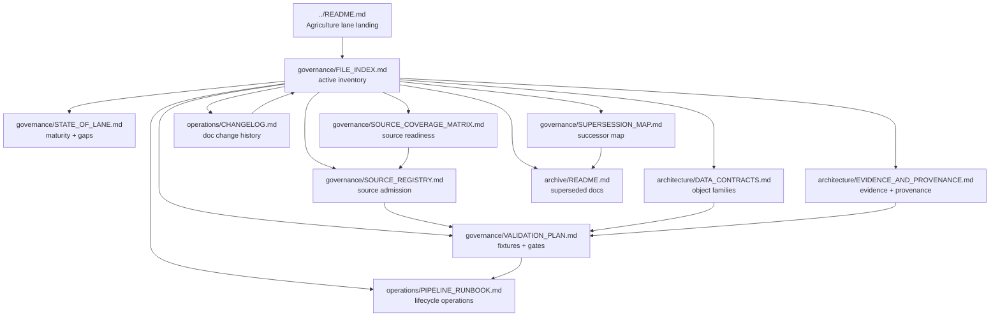

<!-- [KFM_META_BLOCK_V2]
doc_id: kfm://doc/TODO-register-agriculture-file-index
title: Agriculture Governance File Index
type: standard
version: v1
status: draft
owners: TODO-agriculture-domain-steward + TODO-documentation-steward
created: 2026-04-27
updated: 2026-05-06
policy_label: TODO-policy-label
related: [../README.md, STATE_OF_LANE.md, SOURCE_COVERAGE_MATRIX.md, SOURCE_REGISTRY.md, VALIDATION_PLAN.md, SUPERSESSION_MAP.md, ../architecture/DATA_CONTRACTS.md, ../architecture/EVIDENCE_AND_PROVENANCE.md, ../operations/PIPELINE_RUNBOOK.md, ../operations/CHANGELOG.md, ../archive/README.md, ../../../adr/ADR-0002-responsibility-root-monorepo.md, ../../../adr/ADR-0208-domain-lane-template.md]
tags: [kfm, agriculture, file-index, domain-lane, governance, documentation-control-plane]
notes: [doc_id, owners, and policy_label require steward verification; created date follows the agriculture changelog entry for the companion doc set; this revision is grounded in GitHub connector evidence for main plus local workspace no-mount checks.]
[/KFM_META_BLOCK_V2] -->

<a id="top"></a>

# Agriculture Governance File Index

*Purpose: provide the authoritative navigation and maintenance index for the Agriculture lane’s in-repo governance, architecture, operations, and archive documentation.*

<p align="center">
  <strong>Kansas Frontier Matrix · Agriculture lane</strong><br>
  Evidence-first · map-first · time-aware · source-role-preserving · reversible
</p>

<p align="center">
  
  
  
  
  
  
</p>

<p align="center">
  <a href="#scope">Scope</a> ·
  <a href="#repo-fit">Repo fit</a> ·
  <a href="#index-at-a-glance">Index</a> ·
  <a href="#relationship-map">Map</a> ·
  <a href="#accepted-inputs">Inputs</a> ·
  <a href="#exclusions">Exclusions</a> ·
  <a href="#maintenance-rules">Maintenance</a> ·
  <a href="#verification-backlog">Backlog</a> ·
  <a href="#review-checklist">Checklist</a>
</p>

> [!IMPORTANT]
> This file indexes the Agriculture documentation control set. It does **not** activate sources, publish data, prove runtime behavior, define machine schemas, or substitute for policy-as-code. Public or semi-public agriculture claims still require source-role compatibility, EvidenceBundle support, validation, policy review, release state, and rollback coverage.

---

## Scope

`docs/domains/agriculture/governance/FILE_INDEX.md` is the navigation and stewardship index for the Agriculture lane documentation package.

It answers four maintainer questions:

| Question | Index responsibility |
|---|---|
| What files exist in the Agriculture documentation package? | List the active docs and their repo-relative roles. |
| Which doc owns which concern? | Separate governance, architecture, operations, and archive surfaces. |
| What is still only proposed or needs verification? | Keep unresolved machine, policy, owner, CI, and source-activation surfaces visible. |
| How should future Agriculture docs be added? | Preserve KFM responsibility-root placement and avoid parallel authority homes. |

This index should stay compact enough to scan during review and explicit enough to prevent documentation drift.

[Back to top](#top)

---

## Repo fit

| Field | Value |
|---|---|
| Current file | `docs/domains/agriculture/governance/FILE_INDEX.md` |
| Owning root | `docs/` — human-facing documentation control plane |
| Domain lane | `docs/domains/agriculture/` |
| Governance subfolder | `docs/domains/agriculture/governance/` |
| Upstream lane landing page | [`../README.md`](../README.md) |
| Upstream domain index | [`../../README.md`](../../README.md) |
| Architecture companion folder | [`../architecture/`](../architecture/) |
| Operations companion folder | [`../operations/`](../operations/) |
| Archive companion folder | [`../archive/`](../archive/) |
| Directory rule basis | Domain names belong under responsibility roots; Agriculture docs belong under `docs/domains/agriculture/`, not a root-level `agriculture/` folder. |
| Evidence mode | **CONFIRMED** via GitHub connector for the listed Markdown files; local repository checkout was not mounted in this workspace. |
| Remaining repo-state limit | CI enforcement, machine schema home, policy-as-code paths, validator commands, CODEOWNERS, dashboards, and runtime behavior remain **NEEDS VERIFICATION** unless separately inspected. |

> [!NOTE]
> The current Agriculture documentation package is split by responsibility: governance files live in `governance/`, schema/evidence explanation lives in `architecture/`, pipeline and changelog material live in `operations/`, and superseded material belongs in `archive/`.

[Back to top](#top)

---

## Index at a glance

| Layer | Active files | Primary job |
|---|---:|---|
| Lane landing | 1 | Orient the Agriculture domain. |
| Governance | 6 | Track lane state, file ownership, source coverage, source admission, validation, and supersession. |
| Architecture | 2 | Explain data contracts, EvidenceBundle burden, provenance, public trust, and release linkage. |
| Operations | 2 | Preserve pipeline runbook and change history. |
| Archive | 1 | Keep superseded Agriculture docs auditable and out of active guidance. |

### Active documentation set

| File | Status | Purpose | Update when… |
|---|---:|---|---|
| [`../README.md`](../README.md) | **CONFIRMED** | Domain landing page: scope, repo fit, accepted inputs, exclusions, source-role guardrails, lifecycle, and definition of done. | The lane scope, public posture, source-role guardrails, or companion doc map changes. |
| [`STATE_OF_LANE.md`](STATE_OF_LANE.md) | **CONFIRMED** | Current lane maturity snapshot, gaps, and next actions. | Repo inspection, source activation, schema-home status, CI/tooling, or owner status changes. |
| [`FILE_INDEX.md`](FILE_INDEX.md) | **CONFIRMED** | This file: active documentation inventory, ownership map, and maintenance rules. | Any Agriculture documentation file is added, moved, renamed, archived, or superseded. |
| [`SOURCE_COVERAGE_MATRIX.md`](SOURCE_COVERAGE_MATRIX.md) | **CONFIRMED** | Source-family readiness matrix for SSURGO/SDA, gSSURGO, Mesonet, SCAN/USCRN, SMAP, HLS/HLS-VI, NASS/Crop Progress, and restricted future classes. | A source family changes status, release default, blocking condition, or source-role interpretation. |
| [`SOURCE_REGISTRY.md`](SOURCE_REGISTRY.md) | **CONFIRMED** | Human-readable source descriptor requirements and admission checklist. | Required SourceDescriptor fields, activation states, source roles, rights, sensitivity, or stable-key rules change. |
| [`VALIDATION_PLAN.md`](VALIDATION_PLAN.md) | **CONFIRMED** | Fixture-first, fail-closed validation classes, negative fixtures, and CI expectations. | Validators, fixture classes, policy tests, catalog closure, or promotion checks change. |
| [`SUPERSESSION_MAP.md`](SUPERSESSION_MAP.md) | **CONFIRMED** | Maps former README placeholder intents to the current companion documentation set. | A placeholder is retired, a successor file changes, or old guidance is archived. |
| [`../architecture/DATA_CONTRACTS.md`](../architecture/DATA_CONTRACTS.md) | **CONFIRMED** | Minimum Agriculture object families and schema-home warning. | Contract objects, schema placement, public DTO rules, or correction semantics change. |
| [`../architecture/EVIDENCE_AND_PROVENANCE.md`](../architecture/EVIDENCE_AND_PROVENANCE.md) | **CONFIRMED** | EvidenceBundle, provenance, product/version lineage, digests, uncertainty, and public trust guardrails. | EvidenceBundle shape, provenance burden, correction lineage, or Focus/Evidence Drawer expectations change. |
| [`../operations/PIPELINE_RUNBOOK.md`](../operations/PIPELINE_RUNBOOK.md) | **CONFIRMED** | Fixture-first lifecycle runbook and standard incident responses. | Pipeline sequence, quarantine handling, catalog closure, publication gate, rollback, or incident response changes. |
| [`../operations/CHANGELOG.md`](../operations/CHANGELOG.md) | **CONFIRMED** | Human-readable Agriculture lane documentation change history. | Any user-visible Agriculture documentation change lands. |
| [`../archive/README.md`](../archive/README.md) | **CONFIRMED** | Archive rules for superseded Agriculture docs. | Archive policy, supersession header requirements, or audit-retention posture changes. |

[Back to top](#top)

---

## Relationship map



[Back to top](#top)

---

## File ownership matrix

### Governance files

| File | Owns | Does not own |
|---|---|---|
| [`STATE_OF_LANE.md`](STATE_OF_LANE.md) | Snapshot of maturity, next actions, and unresolved lane gaps. | Detailed source coverage, schema definitions, runtime behavior, or release evidence. |
| [`FILE_INDEX.md`](FILE_INDEX.md) | Documentation inventory, navigation, maintenance rules, and review checklist. | Source activation, machine validation, policy enforcement, or CI execution. |
| [`SOURCE_COVERAGE_MATRIX.md`](SOURCE_COVERAGE_MATRIX.md) | Source-family role, readiness status, release default, and blocker summary. | Full source descriptors or live endpoint terms. |
| [`SOURCE_REGISTRY.md`](SOURCE_REGISTRY.md) | Required fields and admission checklist for agriculture source descriptors. | Machine-readable registry records or connector code. |
| [`VALIDATION_PLAN.md`](VALIDATION_PLAN.md) | Validation classes, minimum fixture set, CI expectations, and fail-closed posture. | Actual validator implementation unless linked to verified tools. |
| [`SUPERSESSION_MAP.md`](SUPERSESSION_MAP.md) | Mapping from placeholder guidance to current companion docs. | Full changelog or archive storage policy. |

### Architecture files

| File | Owns | Does not own |
|---|---|---|
| [`../architecture/DATA_CONTRACTS.md`](../architecture/DATA_CONTRACTS.md) | Agriculture object-family expectations, schema-home warning, and contract rules. | Canonical JSON Schema authority until schema home is verified. |
| [`../architecture/EVIDENCE_AND_PROVENANCE.md`](../architecture/EVIDENCE_AND_PROVENANCE.md) | EvidenceBundle requirements, provenance rules, product/version lineage, digests, and public trust guardrails. | Generated proof packs or catalog artifacts. |

### Operations and archive files

| File | Owns | Does not own |
|---|---|---|
| [`../operations/PIPELINE_RUNBOOK.md`](../operations/PIPELINE_RUNBOOK.md) | Fixture-first pipeline sequence and standard incident responses. | Live connector scheduling, credentials, or runtime deployment state. |
| [`../operations/CHANGELOG.md`](../operations/CHANGELOG.md) | Human-readable documentation history for the Agriculture lane. | Machine release manifest or proof-pack history. |
| [`../archive/README.md`](../archive/README.md) | Rules for retaining superseded Agriculture docs. | RAW/WORK/QUARANTINE storage, active policy, or current guidance. |

[Back to top](#top)

---

## Adjacent implementation surfaces

The files below are not fully indexed as active Agriculture implementation surfaces in this document unless later verified. They are listed so reviewers know where documentation should connect after repo inspection.

| Surface | Candidate / verified path | Status | Agriculture use |
|---|---|---:|---|
| Source registry root | `data/registry/` | **CONFIRMED root README from search; agriculture-specific records NEEDS VERIFICATION** | Machine-readable source descriptors and activation state. |
| Semantic contract root | `contracts/` | **CONFIRMED root family from repo search; agriculture-specific home NEEDS VERIFICATION** | Human-readable semantic contracts if the repo keeps contract prose there. |
| Machine schema root | `schemas/` | **CONFIRMED root family from repo search; canonical agriculture home NEEDS VERIFICATION** | Machine-checkable Agriculture object schemas after schema-home decision. |
| Policy root | `policy/` | **CONFIRMED root family from repo search; agriculture-specific policy NEEDS VERIFICATION** | Rights, sensitivity, source-role, promotion, and public-precision rules. |
| Test / fixture roots | `tests/`, `fixtures/` | **NEEDS VERIFICATION** | Fixture-first validation, negative cases, and no-network checks. |
| Pipeline root | `pipelines/` | **CONFIRMED root family from repo search; agriculture-specific pipeline NEEDS VERIFICATION** | Watcher, normalization, catalog, and publication dry-run implementation. |
| ADR: responsibility roots | [`../../../adr/ADR-0002-responsibility-root-monorepo.md`](../../../adr/ADR-0002-responsibility-root-monorepo.md) | **CONFIRMED** | Governs why Agriculture remains under responsibility roots, not as root-level topic folders. |
| ADR: domain lane template | [`../../../adr/ADR-0208-domain-lane-template.md`](../../../adr/ADR-0208-domain-lane-template.md) | **CONFIRMED / draft** | Defines the proposed minimum domain-lane package and validation burden. |

> [!WARNING]
> Do not copy documentation entries into `contracts/`, `schemas/`, `policy/`, `tests/`, `fixtures/`, `data/`, or `pipelines/` merely to make this index look complete. Add machine or runtime surfaces only after the owning root, schema home, toolchain, and validation path are verified.

[Back to top](#top)

---

## Accepted inputs

This file accepts only index-maintenance content.

| Accepted here | Example |
|---|---|
| Active Agriculture documentation paths | New or moved files under `docs/domains/agriculture/`. |
| File-purpose summaries | One-sentence descriptions of what each doc owns. |
| Status labels | `CONFIRMED`, `PROPOSED`, `UNKNOWN`, `NEEDS VERIFICATION`, `CONFLICTED`. |
| Maintenance rules | When to update this index, changelog, supersession map, and archive. |
| Link integrity notes | Relative link updates after moves or renames. |
| Verification backlog entries | Checkable documentation, owner, schema-home, policy, test, or CI gaps. |

[Back to top](#top)

---

## Exclusions

| Does not belong in this index | Where it goes instead | Reason |
|---|---|---|
| Source descriptors | `data/registry/` or repo-confirmed registry home | This index describes docs; source descriptors are machine/source-control records. |
| JSON Schema or machine validation definitions | `schemas/` or the ADR-confirmed schema home | Machine validation must not live in prose. |
| Semantic contract bodies | `contracts/` or [`../architecture/DATA_CONTRACTS.md`](../architecture/DATA_CONTRACTS.md) | This index points to contract guidance; it does not define object semantics. |
| Policy-as-code | `policy/` or repo-confirmed policy home | Policy must be executable or testable. |
| Validator scripts | `tools/validators/` or repo-confirmed tooling home | This file should not hide implementation logic. |
| RAW, WORK, QUARANTINE, or PROCESSED data | `data/raw/`, `data/work/`, `data/quarantine/`, `data/processed/` | Documentation is not lifecycle storage. |
| Published artifacts, proof packs, receipts, or release manifests | `data/catalog/`, `data/proofs/`, `data/receipts/`, `data/published/`, `release/` | Trust-bearing outputs need their own governed homes. |
| Runtime route or UI component code | `apps/`, `packages/`, `ui/`, `web/`, or repo-confirmed runtime homes | This index is documentation control-plane content. |

[Back to top](#top)

---

## Maintenance rules

### Update this file when…

- a documentation file under `docs/domains/agriculture/` is added, renamed, moved, archived, or removed;
- a file’s responsibility changes;
- a link target changes;
- a companion file moves between `governance/`, `architecture/`, `operations/`, or `archive/`;
- a proposed implementation surface becomes confirmed repo evidence;
- a new ADR changes domain-lane placement, schema-home authority, source admission, validation, publication, or rollback expectations.

### Also update…

| Change | Companion file |
|---|---|
| Documentation set changes | [`../operations/CHANGELOG.md`](../operations/CHANGELOG.md) |
| Placeholder-to-successor mapping changes | [`SUPERSESSION_MAP.md`](SUPERSESSION_MAP.md) |
| Lane maturity or next action changes | [`STATE_OF_LANE.md`](STATE_OF_LANE.md) |
| Source-family readiness changes | [`SOURCE_COVERAGE_MATRIX.md`](SOURCE_COVERAGE_MATRIX.md) |
| Source admission field changes | [`SOURCE_REGISTRY.md`](SOURCE_REGISTRY.md) |
| Validation or fixture burden changes | [`VALIDATION_PLAN.md`](VALIDATION_PLAN.md) |
| Contract object changes | [`../architecture/DATA_CONTRACTS.md`](../architecture/DATA_CONTRACTS.md) |
| Evidence/provenance burden changes | [`../architecture/EVIDENCE_AND_PROVENANCE.md`](../architecture/EVIDENCE_AND_PROVENANCE.md) |
| Pipeline sequence or incident response changes | [`../operations/PIPELINE_RUNBOOK.md`](../operations/PIPELINE_RUNBOOK.md) |
| Superseded docs are moved | [`../archive/README.md`](../archive/README.md) |

### Relative-link check

From this file, use these path patterns:

```text
Same governance folder:      STATE_OF_LANE.md
Architecture folder:         ../architecture/DATA_CONTRACTS.md
Operations folder:           ../operations/PIPELINE_RUNBOOK.md
Archive folder:              ../archive/README.md
Agriculture landing page:    ../README.md
Domain index:                ../../README.md
Docs ADR folder:             ../../../adr/<adr-file>.md
Repo root README:            ../../../../README.md
```

[Back to top](#top)

---

## Verification backlog

| Item | Status | Why it matters |
|---|---:|---|
| Confirm owners / CODEOWNERS for Agriculture docs | **NEEDS VERIFICATION** | Required before published or stable documentation status. |
| Confirm `policy_label` for this file and companion docs | **NEEDS VERIFICATION** | Required for publication posture. |
| Confirm schema-home decision for Agriculture machine contracts | **NEEDS VERIFICATION / CONFLICTED** | Prevents duplicate authority between `schemas/` and `contracts/`. |
| Confirm agriculture-specific machine source descriptor registry path | **NEEDS VERIFICATION** | Source admission cannot be proven from docs alone. |
| Confirm agriculture-specific policy-as-code home and commands | **NEEDS VERIFICATION** | Fail-closed release rules need executable checks. |
| Confirm validator scripts and CI workflow names | **NEEDS VERIFICATION** | `VALIDATION_PLAN.md` expectations need runnable enforcement. |
| Confirm test and fixture paths | **NEEDS VERIFICATION** | Fixture-first validation depends on actual repo conventions. |
| Confirm release manifest, rollback card, proof-pack, and receipt homes | **NEEDS VERIFICATION** | Publication must be reviewable and reversible. |
| Confirm MapLibre layer registry / Evidence Drawer / Focus Mode integration paths | **NEEDS VERIFICATION** | UI and AI surfaces must stay downstream of governed evidence. |
| Confirm live source terms and automation permission for Agriculture source families | **NEEDS VERIFICATION** | SSURGO/SDA, Mesonet, SMAP, HLS/HLS-VI, NASS, SCAN/USCRN, and private/proprietary sources require source-specific review before activation. |

[Back to top](#top)

---

## Review checklist

Before committing a revision to this file:

- [ ] Every listed active Markdown file exists or is clearly marked **PROPOSED** / **NEEDS VERIFICATION**.
- [ ] Relative links resolve from `docs/domains/agriculture/governance/FILE_INDEX.md`.
- [ ] The index reflects the current `governance/`, `architecture/`, `operations/`, and `archive/` split.
- [ ] No machine schema, policy, validator, source descriptor, runtime, or release object is presented as implemented unless verified.
- [ ] `STATE_OF_LANE.md` still matches the current maturity and verification backlog.
- [ ] `SUPERSESSION_MAP.md` still maps prior placeholders to the current doc set.
- [ ] `../operations/CHANGELOG.md` records the documentation change.
- [ ] Owner and policy placeholders remain visible if unresolved.
- [ ] No Agriculture domain folder is proposed at repository root.
- [ ] Public-facing Agriculture claims remain cite-or-abstain, source-role-compatible, policy-aware, reviewable, and rollback-capable.

[Back to top](#top)
