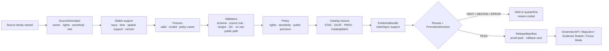

<!-- [KFM_META_BLOCK_V2]
doc_id: kfm://doc/TODO-register-agriculture-source-coverage-matrix
title: Agriculture Source Coverage Matrix
type: standard
version: v1
status: draft
owners: TODO-agriculture-domain-steward
created: TODO-VERIFY
updated: 2026-05-06
policy_label: TODO-policy-label
related: [../README.md, ./STATE_OF_LANE.md, ./FILE_INDEX.md, ./SOURCE_REGISTRY.md, ../../../adr/ADR-0001-schema-home.md, ../../soil/README.md]
tags: [kfm, agriculture, source-coverage, source-registry, evidence-first, map-first, time-aware]
notes: [Expanded from the existing agriculture source matrix; owners, policy label, created date, machine-readable source descriptors, fixture file paths, CI checks, and live activation remain review items.]
[/KFM_META_BLOCK_V2] -->

# Agriculture Source Coverage Matrix

*Purpose: track which Agriculture source families are admitted, blocked, fixture-ready, or still waiting on governed source descriptors, validation, policy, and release evidence.*

  
  
  
  
  

  <a href="#scope">Scope</a> ·
  <a href="#repo-fit-and-authority">Repo fit</a> ·
  <a href="#status-legend">Status legend</a> ·
  <a href="#coverage-summary">Coverage summary</a> ·
  <a href="#source-coverage-matrix">Matrix</a> ·
  <a href="#activation-gates">Activation gates</a> ·
  <a href="#anti-collapse-rules">Anti-collapse rules</a> ·
  <a href="#change-control">Change control</a> ·
  <a href="#verification-backlog">Backlog</a>

> [!IMPORTANT]
> This file is a **human-facing governance matrix**, not a source descriptor, connector, schema, policy rule, catalog record, release manifest, proof pack, or runtime switch.
>
> A row marked `FIXTURE-READY` means this documentation lane treats the family as ready for fixture-first validation work. It does **not** prove that live fetchers, CI fixtures, validators, policies, source descriptors, or release artifacts already exist.

---

## Scope

This matrix tracks Agriculture source-family readiness across source role, stable support, public-release posture, and blockers.

It exists to prevent three common failures:

1. **source activation before governance** — a connector is built before rights, sensitivity, source role, stable keys, and validation rules are reviewable;
2. **false precision** — aggregate, station, grid, remote-sensing, and derived products are flattened into one unsupported “agriculture layer”;
3. **publication drift** — source, catalog, evidence, proof, release, and rollback objects are updated out of sync.

### In scope

| In scope | Examples | Handling |
|---|---|---|
| Source-family coverage | SSURGO/SDA, gSSURGO/gNATSGO, Kansas Mesonet, SCAN, USCRN, SMAP, HLS/HLS-VI, NASS, CDL | Track role, readiness, blockers, and release posture. |
| Source-role boundaries | `authority`, `observation`, `aggregate`, `remote_sensing`, `derived`, `restricted_future_class` | Preserve meaning before source descriptors or pipelines are activated. |
| Public-release defaults | allowed, allowed-with-labels, restricted, deny-by-default | Keep release burden visible before layers, exports, or Focus answers ship. |
| Verification backlog | missing rights, source terms, schema home, fixtures, policy tests, catalog closure | Fail closed until resolved. |

### Out of scope

| Out of scope | Goes instead | Reason |
|---|---|---|
| Machine-readable source descriptors | `data/registry/agriculture/` or repo-confirmed source registry | This matrix summarizes coverage; descriptors govern admission. |
| Raw source payloads | `data/raw/agriculture/` or repo-confirmed lifecycle path | RAW data is evidence input, not documentation. |
| Validator code and fixtures | `tools/validators/agriculture/`, `tests/fixtures/agriculture/`, or repo-native equivalents | Validation must be executable and reviewable. |
| Policy-as-code | `policy/agriculture/` or repo-native policy path | Rights, sensitivity, and release rules need tests. |
| Published layer manifests and artifacts | `data/published/`, `release/`, or repo-confirmed release path | Publication is a governed state transition. |
| Private farm/operator records | Restricted future lane only | No restricted-data lane is approved here. |

[Back to top](#top)

---

## Repo fit and authority

| Surface | Relative path | Current role | Status |
|---|---|---|---:|
| Agriculture landing page | [`../README.md`](../README.md) | Lane scope, lifecycle, source-role guardrails, definition of done. | CONFIRMED link target |
| Lane state snapshot | [`./STATE_OF_LANE.md`](./STATE_OF_LANE.md) | Current lane maturity and next actions. | CONFIRMED link target |
| File index | [`./FILE_INDEX.md`](./FILE_INDEX.md) | Documentation package inventory. | CONFIRMED link target |
| Source registry guidance | [`./SOURCE_REGISTRY.md`](./SOURCE_REGISTRY.md) | Required descriptor fields and source admission checklist. | CONFIRMED link target |
| Schema-home ADR | [`../../../adr/ADR-0001-schema-home.md`](../../../adr/ADR-0001-schema-home.md) | Proposed canonical machine-contract home and schema/contract split. | CONFIRMED link target |
| Soil lane context | [`../../soil/README.md`](../../soil/README.md) | Adjacent soil authority and soil-moisture boundary guidance. | CONFIRMED link target |
| Machine source descriptors | `data/registry/agriculture/` | SourceDescriptor records and activation state. | NEEDS VERIFICATION |
| Machine schemas | `schemas/contracts/v1/agriculture/` or ADR-confirmed equivalent | Validation shape for Agriculture objects. | NEEDS VERIFICATION |
| Policies and fixtures | `policy/agriculture/`, `tests/fixtures/agriculture/` or repo-native equivalents | Fail-closed checks for source role, rights, sensitivity, and release. | NEEDS VERIFICATION |

> [!WARNING]
> Do not use this matrix as evidence that a source is live. A source becomes active only after descriptor, rights, sensitivity, fixture, validation, policy, catalog, review, release, and rollback gates pass.

[Back to top](#top)

---

## Status legend

| Status | Meaning | Minimum burden before upgrade |
|---|---|---|
| `PLANNED` | Source family is in scope, but not ready for live intake. | Create/verify SourceDescriptor, stable keys, rights, sensitivity, fixtures, and policy cases. |
| `FIXTURE-READY` | Source family is ready for no-network fixture-first validation work in this documentation lane. | Verify actual fixture paths, schemas, validators, and CI before treating as repo-enforced. |
| `READY-FOR-LIVE-INTAKE` | Descriptor, rights, sensitivity, fixtures, validators, and policies are ready for a reviewed live-source dry run. | Steward approval, rate-limit/terms confirmation, dry-run receipt, and rollback plan. |
| `ACTIVE` | Live intake is approved and governed by tests, receipts, catalog closure, and release controls. | Keep receipts, proof, release, correction, and rollback evidence current. |
| `BLOCKED` | Source family is denied or intentionally unavailable until a missing governance lane exists. | Resolve the named blocker through ADR, policy, steward review, and test coverage. |

### Verification labels used in this matrix

| Label | Use |
|---|---|
| `CONFIRMED` | Verified from current repo evidence or governing docs. |
| `PROPOSED` | Recommended treatment not yet proven by implementation evidence. |
| `NEEDS VERIFICATION` | Checkable item that must be confirmed before source activation or release. |
| `UNKNOWN` | Not verified strongly enough to treat as current repo behavior. |

[Back to top](#top)

---

## Coverage summary

| Coverage state | Source families currently listed | Release posture |
|---|---:|---|
| `FIXTURE-READY` | 3 | Can proceed to no-network fixtures and negative tests; not live. |
| `PLANNED` | 6 | Needs descriptors, fixtures, policy, and source-term review. |
| `READY-FOR-LIVE-INTAKE` | 0 | No family is documented here as ready for live intake. |
| `ACTIVE` | 0 | No family is documented here as live or release-active. |
| `BLOCKED` | 1 | Deny-by-default until a restricted-data lane exists. |

> [!NOTE]
> Counts reflect this document’s coverage rows, not runtime state, connector state, CI state, or publication state.

[Back to top](#top)

---

## Source coverage matrix

| Source family | Source role / knowledge character | Coverage state | Verification posture | Stable support to preserve | Public release default | Blocking condition / next gate |
|---|---|---:|---:|---|---|---|
| SSURGO / SDA | `authority` — vector/tabular soil survey and MUKEY-centered properties | `PLANNED` | NEEDS VERIFICATION | `mukey`, `cokey`, `chkey`, source table, query hash, source version | Allowed only after validated aggregates, source citations, provenance, and catalog closure | Schema home and source descriptor remain unresolved; fixtures and component/horizon validation needed. |
| gSSURGO / gNATSGO | `derived` companion — gridded soil product useful for statewide/raster analysis | `PLANNED` | NEEDS VERIFICATION | grid cell, MUKEY mapping, product version, package digest, resolution | Allowed only with explicit gridded/derived labels | Must never silently replace direct SSURGO/SDA vector/tabular provenance. |
| Kansas Mesonet | `observation` — station soil-moisture/weather context | `FIXTURE-READY` | NEEDS VERIFICATION | station ID, variable, depth, timestamp, source timezone, QC/freshness | Allowed only as normalized station/depth/time context with caveats | Actual fixture paths, data-use posture, automation permission, unit/QC normalization, and freshness tests need verification. |
| NRCS SCAN | `observation` / `corroboration` — reference station network | `PLANNED` | NEEDS VERIFICATION | station ID, element, depth, timestamp, source QC/status | Allowed as corroborative/reference station context after normalization | Source mapping, units/depth/time normalization, and QC propagation are not finalized. |
| NOAA USCRN | `observation` / `corroboration` — reference climate/soil products | `PLANNED` | NEEDS VERIFICATION | station ID, product, timestamp, element/depth metadata | Allowed as reference station context; do not overstate field truth | Product mapping, cadence, QC fields, and source-role policy remain unresolved. |
| NASA SMAP | `remote_sensing` — satellite/grid soil-moisture context | `FIXTURE-READY` | NEEDS VERIFICATION | grid cell, product ID/version, granule/time window, QA/mask fields | Allowed only as satellite/grid context | Product/version, mask capture, QA fields, auth/cadence, and “not field-level truth” tests needed. |
| NASA HLS / HLS-VI | `remote_sensing` / `derived` — surface reflectance, vegetation index, masks, and derived change context | `FIXTURE-READY` | NEEDS VERIFICATION | STAC item, asset, acquisition time, time window, mask/cloud metadata, index formula | Allowed as remote-sensing or derived layer only | Must distinguish observation, masked index, and derived stress indicator; mask/cloud-quality constraints pending. |
| USDA NASS QuickStats / Crop Progress | `aggregate` — official aggregate statistics and phenology/crop-condition context | `PLANNED` | NEEDS VERIFICATION | commodity, geography, year/week, statistic, unit, API/query identity | Allowed only at aggregate geography/time support | Field-level, parcel-level, and operator-level misuse guardrails must be tested. |
| USDA NASS Cropland Data Layer | `remote_sensing` / `derived` — annual crop/land-cover classification context | `PLANNED` | PROPOSED / NEEDS VERIFICATION | product year, class code, raster cell, product version, mask/accuracy notes | Allowed as annual classified raster context with product-year caveats | Source descriptor, product/version capture, accuracy caveats, and “classification is not operator truth” tests needed. |
| Private/proprietary farm data | `restricted_future_class` — private operator, field, yield, pesticide, or proprietary records | `BLOCKED` | CONFIRMED policy posture / NEEDS VERIFICATION for any future lane | authorization, consent, agreement, owner/steward, sensitivity, retention, revocation path | Deny by default | No restricted-data lane, consent model, steward policy, rights review, or public-safe publication model approved. |

[Back to top](#top)

---

## Activation gates

A source family may not move beyond `PLANNED` or `FIXTURE-READY` until the relevant gates are satisfied.

| Gate | Required evidence | Blocks when missing |
|---|---|---|
| Source descriptor | owner/steward, source role, rights, sensitivity, access method, cadence, stable keys, temporal support, spatial support, activation state | Source activation |
| Rights and sensitivity review | license/terms, citation, redistribution, privacy, exact-location implications, source-specific restrictions | Public release |
| Stable-key preservation | source-native IDs survive normalization and hashing | EvidenceBundle resolution |
| Fixture set | at least one valid fixture and one invalid fixture per source family before live intake | CI and promotion |
| Source-role validator | aggregate, station, grid, remote-sensing, authority, and derived products cannot be used outside their support | Public claims |
| Catalog closure | STAC/DCAT/PROV or repo-confirmed catalog records agree with release digests and evidence refs | Published layer or export |
| Policy decision | finite allow/deny/abstain/error with reason and obligation codes | Promotion |
| Rollback target | release manifest points to previous safe state or explicit no-prior-release basis | Current alias update |

[Back to top](#top)

---

## Anti-collapse rules

| Rule | Failure prevented | Expected outcome |
|---|---|---|
| Aggregate is not field-level. | NASS county/week or state/year values becoming parcel, operator, or field truth. | `DENY` or `ABSTAIN` public claim. |
| Station is not surface. | Mesonet, SCAN, or USCRN readings becoming statewide or field-level surfaces without an explicit transform. | Quarantine candidate or require declared model/interpolation. |
| Grid is not ground truth. | SMAP, HLS, CDL, gSSURGO, or gNATSGO being described as direct station or field observation. | Require product, resolution, accuracy, mask, and support labels. |
| Derived is not canonical. | PMTiles, dashboards, embeddings, summaries, and layer manifests becoming evidence authority. | Treat as rebuildable delivery artifacts. |
| Soil context does not silently move domains. | Agriculture duplicating Soil lane authority or weakening MUKEY/source semantics. | Use Soil lane support by reference and preserve provenance. |
| Unknown rights fail closed. | Source convenience outrunning legal or stewardship review. | `DENY` activation or release until rights are explicit. |
| AI does not validate sources. | Focus Mode answer becoming a source-admission decision. | AI can summarize released evidence only; generated text never outranks EvidenceBundle. |

[Back to top](#top)

---

## Change control

Update this matrix whenever any of the following changes:

| Trigger | Required updates |
|---|---|
| New source family proposed | Add row here, draft SourceDescriptor, add verification backlog item, and create invalid fixture target. |
| SourceDescriptor added or changed | Update `SOURCE_REGISTRY.md` summary, registry index, validation plan, and this matrix. |
| Rights, terms, sensitivity, or access method changes | Downgrade coverage state if needed; update policy cases and release obligations. |
| Fixture set lands | Update `Coverage state`, `Verification posture`, and fixture references after path verification. |
| Validator or CI gate lands | Update blockers and link to validator/test docs only after repo evidence confirms paths. |
| Schema-home ADR accepted or superseded | Update schema-path notes and any row blocked by schema-home ambiguity. |
| Source becomes live | Require release notes, run receipt, validation report, policy decision, catalog closure, and rollback reference. |
| Public release or correction occurs | Update release posture, correction lineage, and any row whose public default changed. |

### Suggested review checklist

- [ ] The row’s `source role / knowledge character` matches the SourceDescriptor.
- [ ] Stable keys are specific enough to preserve evidence identity.
- [ ] Public-release default does not overstate source support.
- [ ] Blockers are actionable and testable.
- [ ] Any upgrade is backed by descriptor, fixture, validation, policy, catalog, and release evidence.
- [ ] No row claims live implementation unless repo evidence proves it.

[Back to top](#top)

---

## Verification backlog

| Item | Status | Why it matters |
|---|---:|---|
| Confirm owner/steward and CODEOWNERS for Agriculture source admission | NEEDS VERIFICATION | Required for policy-significant source activation. |
| Confirm canonical machine schema home after ADR-0001 acceptance or supersession | NEEDS VERIFICATION | Blocks stable contract and fixture placement. |
| Verify `data/registry/agriculture/` source descriptor format and file paths | NEEDS VERIFICATION | This matrix cannot activate sources by itself. |
| Verify fixture paths for Kansas Mesonet, SMAP, and HLS/HLS-VI | NEEDS VERIFICATION | Current `FIXTURE-READY` status is documentation-level only. |
| Add invalid fixtures for aggregate-as-field truth, station-as-field truth, grid-as-ground-truth, missing rights, and missing sensitivity | PROPOSED | Negative-path coverage is required for fail-closed behavior. |
| Confirm policy engine, policy paths, and CI command names | UNKNOWN | Determines how release-blocking rules are enforced. |
| Verify SSURGO/SDA/gSSURGO/gNATSGO source terms, refresh cadence, and citation requirements | NEEDS VERIFICATION | Blocks live soils/agriculture source automation. |
| Verify Kansas Mesonet data-use policy and acceptable automation pattern | NEEDS VERIFICATION | Blocks live station watcher activation. |
| Verify SCAN, USCRN, SMAP, HLS/HLS-VI, QuickStats, Crop Progress, and CDL endpoint/product details | NEEDS VERIFICATION | Blocks live fetch, catalog, and publication. |
| Confirm Evidence Drawer and Focus payload contracts for Agriculture layers | UNKNOWN | Needed before public UI or AI surfaces can expose claims. |
| Record first Agriculture release manifest and rollback card references | PROPOSED | Required before any row becomes `ACTIVE`. |

[Back to top](#top)

---

Appendix A — Row upgrade criteria

| From | To | Upgrade criteria |
|---|---|---|
| `PLANNED` | `FIXTURE-READY` | Source family has a proposed descriptor shape, stable support fields, at least one planned valid fixture, and at least one named invalid fixture. |
| `FIXTURE-READY` | `READY-FOR-LIVE-INTAKE` | Actual repo fixtures, validators, policies, descriptor, rights review, and no-network CI checks are verified. |
| `READY-FOR-LIVE-INTAKE` | `ACTIVE` | Steward-reviewed live dry run emits receipt, validation report, catalog closure, EvidenceBundle support, policy decision, release manifest, proof pack, and rollback card. |
| Any state | `BLOCKED` | Rights, sensitivity, consent, source reliability, public precision, or policy posture makes activation unsafe. |
| `ACTIVE` | lower state | Source terms change, validation regresses, evidence cannot resolve, policy obligations change, or rollback/correction requires withdrawal. |

Appendix B — Minimum invalid fixture targets

| Fixture target | Expected outcome |
|---|---|
| Source descriptor missing `rights` | `DENY` source activation. |
| Source descriptor missing `sensitivity` | `DENY` source activation. |
| NASS aggregate statistic used as field-level truth | `DENY` public claim. |
| Station reading used as field-level or statewide surface without declared transform | `DENY` or quarantine. |
| SMAP/HLS/CDL/gSSURGO grid described as station observation | `DENY` public claim. |
| HLS/HLS-VI index without cloud/mask/time-window metadata | `ABSTAIN` or quarantine. |
| Layer manifest references RAW, WORK, QUARANTINE, or internal receipt path | Fail no-raw-public-path check. |
| Catalog matrix has mismatched STAC/DCAT/PROV/release digests | `DENY` promotion. |
| Receipt is treated as release proof | Fail proof/receipt separation check. |
| Promotion lacks rollback target | `DENY` release. |

