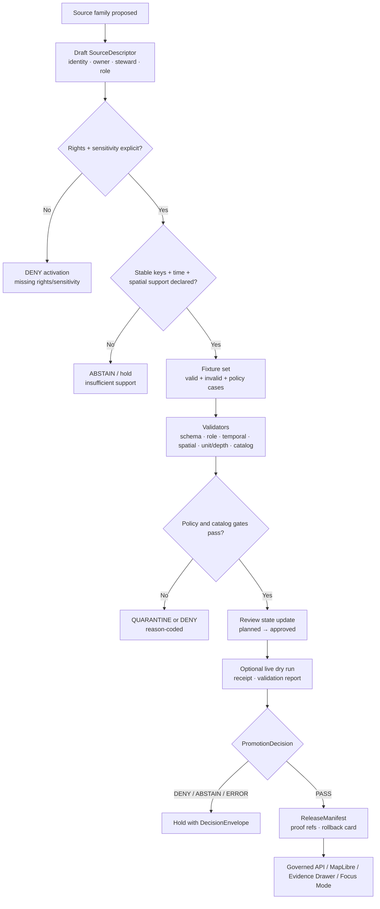

<!-- [KFM_META_BLOCK_V2]
doc_id: kfm://doc/TODO-register-agriculture-source-registry
title: Agriculture Source Registry
type: standard
version: v1
status: draft
owners: TODO-agriculture-domain-steward
created: NEEDS-VERIFICATION
updated: 2026-05-06
policy_label: TODO-policy-label
related: [../README.md, STATE_OF_LANE.md, FILE_INDEX.md, SOURCE_COVERAGE_MATRIX.md, VALIDATION_PLAN.md, SUPERSESSION_MAP.md, ../architecture/DATA_CONTRACTS.md, ../architecture/EVIDENCE_AND_PROVENANCE.md, ../operations/PIPELINE_RUNBOOK.md, ../../../adr/ADR-0001-schema-home.md]
tags: [kfm, agriculture, source-registry, source-descriptor, evidence-first, map-first, time-aware, fail-closed]
notes: [Expanded from the existing Agriculture Source Registry Guidance; doc_id, created date, owners, policy_label, machine-readable registry path, fixture paths, policy commands, and live activation evidence remain review items.]
[/KFM_META_BLOCK_V2] -->

<a id="top"></a>

# Agriculture Source Registry

*Purpose: define the human-readable admission rules for Agriculture source descriptors before any source can feed validation, catalog, EvidenceBundle, release, API, MapLibre, Evidence Drawer, or Focus Mode surfaces.*

<p align="center">
  <strong>Kansas Frontier Matrix · Agriculture lane</strong><br>
  Source-role-preserving · evidence-first · map-first · time-aware · fail-closed
</p>

<p align="center">
  
  
  
  
  
</p>

<p align="center">
  <a href="#scope">Scope</a> ·
  <a href="#repo-fit">Repo fit</a> ·
  <a href="#accepted-inputs">Inputs</a> ·
  <a href="#exclusions">Exclusions</a> ·
  <a href="#descriptor-requirements">Descriptor requirements</a> ·
  <a href="#source-role-taxonomy">Roles</a> ·
  <a href="#admission-flow">Admission flow</a> ·
  <a href="#validation-burden">Validation</a> ·
  <a href="#review-checklist">Checklist</a> ·
  <a href="#verification-backlog">Backlog</a>
</p>

> [!IMPORTANT]
> This file is source-registry **guidance**, not a live source registry, connector switch, proof pack, release manifest, policy bundle, schema authority, or publication decision.
>
> A source is not active because it is named here. A source is admissible only after source identity, rights, sensitivity, source role, stable keys, fixtures, validation, policy, catalog closure, review state, release state, and rollback path are all reviewable.

---

## Scope

`docs/domains/agriculture/governance/SOURCE_REGISTRY.md` defines what an Agriculture source descriptor must contain before the source can move beyond planning.

It preserves the project rule that agriculture evidence is not a single interchangeable data blob. Soil survey context, station observations, satellite grids, aggregate crop statistics, remote-sensing products, derived indicators, and restricted private records have different source roles and different claim burdens.

### This file owns

| Concern | Registry responsibility |
|---|---|
| Source admission fields | Define the minimum descriptor fields required before fixture work, live intake, or release consideration. |
| Source-role vocabulary | Preserve the meaning of `authority`, `observation`, `aggregate`, `remote_sensing`, `derived`, `mirror`, and `documentary`. |
| Activation boundaries | Explain `fixture_only`, `live`, and `planned` / `approved` / `active` / `blocked` without claiming runtime activation. |
| Claim compatibility | Prevent aggregate-as-field truth, station-as-surface truth, grid-as-ground-truth, and derived-as-canonical drift. |
| Negative fixture expectations | Name the failure cases that must deny, abstain, quarantine, or error before public exposure. |
| Review hooks | Tell maintainers when to update the source coverage matrix, validation plan, data contracts, evidence/provenance notes, and runbook. |

### This file does not own

| Not owned here | Owning surface |
|---|---|
| Machine-readable source descriptor records | `data/registry/agriculture/` or repo-confirmed registry home — **NEEDS VERIFICATION** |
| JSON Schema or machine contract definitions | ADR-confirmed schema home — **NEEDS VERIFICATION** |
| Policy-as-code | `policy/agriculture/` or repo-confirmed policy home — **NEEDS VERIFICATION** |
| Validator scripts and fixtures | `tools/`, `tests/`, `fixtures/`, or repo-native equivalents — **NEEDS VERIFICATION** |
| RAW, WORK, QUARANTINE, PROCESSED, CATALOG, or PUBLISHED artifacts | `data/` lifecycle roots and `release/` — **NEEDS VERIFICATION** |
| Runtime routes, UI components, layer registry, or Focus Mode implementation | Repo-native `apps/`, `packages/`, `ui/`, `web/`, or governed runtime homes — **UNKNOWN / NEEDS VERIFICATION** |

[Back to top](#top)

---

## Repo fit

| Field | Value |
|---|---|
| Current file | `docs/domains/agriculture/governance/SOURCE_REGISTRY.md` |
| Owning root | `docs/` — human-facing documentation control plane |
| Domain lane | `docs/domains/agriculture/` |
| Governance folder | `docs/domains/agriculture/governance/` |
| Lane landing page | [`../README.md`](../README.md) |
| File index | [`FILE_INDEX.md`](FILE_INDEX.md) |
| Lane state snapshot | [`STATE_OF_LANE.md`](STATE_OF_LANE.md) |
| Source readiness matrix | [`SOURCE_COVERAGE_MATRIX.md`](SOURCE_COVERAGE_MATRIX.md) |
| Validation plan | [`VALIDATION_PLAN.md`](VALIDATION_PLAN.md) |
| Data contract map | [`../architecture/DATA_CONTRACTS.md`](../architecture/DATA_CONTRACTS.md) |
| Evidence/provenance map | [`../architecture/EVIDENCE_AND_PROVENANCE.md`](../architecture/EVIDENCE_AND_PROVENANCE.md) |
| Operations runbook | [`../operations/PIPELINE_RUNBOOK.md`](../operations/PIPELINE_RUNBOOK.md) |
| Schema-home ADR | [`../../../adr/ADR-0001-schema-home.md`](../../../adr/ADR-0001-schema-home.md) |
| Directory-rule basis | Agriculture is a domain lane under a responsibility root. It belongs under `docs/domains/agriculture/`, not a root-level `agriculture/` folder. |
| Current implementation posture | Documentation path is repo-confirmed; machine registry files, live source activation, CI enforcement, and runtime behavior remain **NEEDS VERIFICATION** unless separate evidence proves them. |

> [!NOTE]
> Use [`SOURCE_COVERAGE_MATRIX.md`](SOURCE_COVERAGE_MATRIX.md) for source-family readiness state. Use this file for the descriptor rules that a source must satisfy before that readiness state can be safely upgraded.

[Back to top](#top)

---

## Accepted inputs

This file accepts source-registry guidance that helps maintainers decide whether a source family can enter the Agriculture lane.

| Accepted here | Example |
|---|---|
| Required descriptor fields | `source_id`, `source_role`, `rights`, `sensitivity`, `stable_keys`, `temporal_support`, `spatial_support`, `activation_state`. |
| Source-role interpretation | Why NASS aggregate data cannot prove field truth; why Mesonet station readings cannot become a surface without a declared transform. |
| Admission gate rules | Fixture-first requirement, rights review, steward approval, policy checks, catalog closure, rollback readiness. |
| Human-readable source-family notes | SSURGO/SDA, gSSURGO, Kansas Mesonet, SCAN, USCRN, SMAP, HLS/HLS-VI, NASS, CDL, and restricted future classes. |
| Negative fixture targets | Missing rights, missing sensitivity, source-role misuse, missing provenance, public RAW path, missing rollback target. |
| Change-control requirements | When to update source matrix, validation plan, contract map, evidence/provenance doc, and runbook. |

[Back to top](#top)

---

## Exclusions

| Does not belong in this file | Where it goes instead | Why |
|---|---|---|
| Live source credentials, keys, tokens, or secrets | Secret manager or runtime config, never documentation | Source access must be least-privilege and auditable. |
| Full source payloads | `data/raw/agriculture/` or repo-confirmed RAW home | Documentation must not become lifecycle storage. |
| Work products or failed candidates | `data/work/agriculture/` or `data/quarantine/agriculture/` | Candidate and failed artifacts must stay governed and non-public. |
| Machine source descriptors | `data/registry/agriculture/` or repo-confirmed registry home | Descriptor records must be machine-readable and validated. |
| Machine schemas | ADR-confirmed schema home | Docs explain meaning; schemas enforce shape. |
| Policy-as-code | `policy/agriculture/` or repo-confirmed policy home | Rights, sensitivity, and release rules must be executable/testable. |
| Validator implementation | `tools/validators/`, `tests/`, `fixtures/`, or repo-native equivalents | This file names gates; it does not run them. |
| Public layer manifests | Published/release artifact homes | Public layers require catalog closure, release manifest, proof refs, and rollback card. |
| Private farm, operator, yield, pesticide, or proprietary records | Restricted future lane only after policy, consent, stewardship, and denial defaults exist | Public Agriculture docs must not normalize restricted private records into ordinary sources. |

[Back to top](#top)

---

## Descriptor requirements

Every Agriculture source descriptor must be complete enough for a reviewer, validator, policy gate, and future maintainer to answer: **what is this source, what can it support, what can it not support, what rights govern it, and how can it be rolled back or corrected if it later proves wrong?**

### Minimum required fields

| Field | Required content | Blocks when missing |
|---|---|---|
| `source_id` | Immutable unique source key. Prefer a stable namespace such as `agriculture.<family>.<publisher>.<short_name>`. | Source admission |
| `source_name` | Human-friendly name. | Review readability |
| `source_family` | Family such as `SSURGO/SDA`, `Kansas Mesonet`, `SMAP`, `HLS/HLS-VI`, `NASS QuickStats`, `CDL`. | Coverage matrix alignment |
| `owner` | Accountable KFM owner or `TODO-*` placeholder when unresolved. | Stable/public status |
| `steward` | Domain or source steward responsible for review. | Source activation |
| `source_role` | One of the approved source roles listed in [Source-role taxonomy](#source-role-taxonomy). | Claim compatibility |
| `knowledge_character` | Human-readable support type: survey, station observation, aggregate statistic, satellite/grid product, derived indicator, documentary support, mirror. | UI trust labels |
| `rights` | License/terms, redistribution constraints, citation requirement, automation permission, and review state. | Public release |
| `sensitivity` | `public`, `review_required`, or `restricted`; include precision/redaction notes when spatial exposure matters. | Public release |
| `spatial_support` | Geometry/support type, CRS, geography version, precision class, and support caveats. | Map layer / API release |
| `temporal_support` | Observed time, valid time, source time, retrieval time, cadence, staleness window, and timestamp semantics. | Time-aware claims |
| `stable_keys` | Source-native IDs that must survive normalization. | EvidenceBundle resolution |
| `ingest_mode` | `fixture_only` or `live`. Default must be `fixture_only` until activation gates pass. | Live intake |
| `activation_state` | `planned`, `approved`, `active`, or `blocked`. | Source lifecycle clarity |
| `claim_scope_allowed` | The claim scopes this source can support. | Public claims |
| `claim_scope_denied` | Claim scopes this source must never support. | Fail-closed policy |
| `required_fixtures` | Valid and invalid fixtures needed before activation. | CI and validation |
| `validators` | Schema, source-role, rights/sensitivity, temporal, spatial, unit/depth, catalog, and policy checks expected. | Promotion |
| `catalog_requirements` | STAC/DCAT/PROV/CatalogMatrix or repo-confirmed catalog closure needs. | Publication |
| `evidence_requirements` | EvidenceRef/EvidenceBundle support expectations. | API/UI/Focus answers |
| `release_requirements` | ReleaseManifest, proof refs, rollback card, correction path. | Public release |
| `review_state` | `draft`, `review_required`, `approved`, `deprecated`, or repo-confirmed equivalent. | Promotion |
| `notes` | Human-readable caveats and unresolved review items. | Steward review |

### Recommended field grouping

| Descriptor section | Fields |
|---|---|
| Identity | `source_id`, `source_name`, `source_family`, `publisher`, `source_url_or_access_ref`, `source_version`, `descriptor_version` |
| Accountability | `owner`, `steward`, `review_state`, `reviewed_at`, `review_due`, `contact_or_ticket_ref` |
| Rights and sensitivity | `rights`, `license`, `terms_ref`, `citation`, `redistribution`, `automation_allowed`, `sensitivity`, `public_precision_class` |
| Role and support | `source_role`, `knowledge_character`, `claim_scope_allowed`, `claim_scope_denied`, `spatial_support`, `temporal_support` |
| Identity preservation | `stable_keys`, `source_record_key_fields`, `geography_version`, `product_version`, `digest_strategy` |
| Intake | `ingest_mode`, `activation_state`, `fetch_method`, `cadence`, `rate_limit_notes`, `raw_capture_required` |
| Validation | `required_fixtures`, `validators`, `negative_cases`, `policy_cases`, `catalog_requirements` |
| Publication | `evidence_requirements`, `release_requirements`, `rollback_requirement`, `correction_requirement` |

[Back to top](#top)

---

## Source-role taxonomy

The current Agriculture guidance preserves these source roles:

| `source_role` | Meaning | Can support | Must not support |
|---|---|---|---|
| `authority` | A source with authoritative scope inside a declared domain, geography, period, and version. | Claims inside its explicit authority boundary, such as soil survey attributes when source lineage supports them. | Claims outside jurisdiction, source version, spatial support, or temporal support. |
| `observation` | A measured station, sensor, or direct observation record. | Station/depth/time/variable-specific statements with QC and timestamp support. | Field-level, parcel-level, statewide, or interpolated surfaces without a declared transform. |
| `aggregate` | Aggregate statistic by geography, commodity, period, or class. | County/state/week/year or other aggregate-scope statements. | Field, parcel, operator, or exact-location truth. |
| `remote_sensing` | Satellite, aerial, gridded, or imagery-derived source product. | Product-specific grid/pixel/asset/time-window context with masks and quality metadata. | Direct ground truth unless validated and explicitly supported. |
| `derived` | Rebuildable output produced from inputs, algorithms, masks, thresholds, or processing runs. | Declared indicator, anomaly, suitability, stress, or visualization context with input refs and receipts. | Original source authority or unreviewed public truth. |
| `mirror` | A convenience copy of another governed source. | Access acceleration when upstream identity, rights, digests, and lineage are preserved. | New authority or transformed claim semantics unless separately declared. |
| `documentary` | Text, report, narrative, or citation support. | Scoped statements backed by citation and interpretation status. | Machine observation, measured value, or spatial precision the document does not carry. |

> [!CAUTION]
> Do not add new `source_role` enum values casually. `restricted_future_class`, `private_restricted`, or similar labels may be useful as matrix or policy states, but they should not become schema values until the contract, schema, policy, and fixture burden is accepted.

[Back to top](#top)

---

## First-wave source family notes

The source families below are listed so reviewers can apply the same descriptor discipline consistently. Their live endpoint behavior, terms, cadence, and automation permissions remain **NEEDS VERIFICATION** unless a machine descriptor and validation evidence prove otherwise.

| Source family | Likely role | Stable support to preserve | Registry note |
|---|---|---|---|
| SSURGO / SDA | `authority` | `mukey`, `cokey`, `chkey`, source table/version, query/snapshot identity | Coordinate with Soil lane; Agriculture consumes soil context and must not fork soil authority casually. |
| gSSURGO / gNATSGO | `derived` / gridded companion | grid/cell/tile identity, MUKEY mapping, product version, digest, resolution | Must be labeled as gridded/derived companion; not a silent replacement for SSURGO/SDA provenance. |
| Kansas Mesonet | `observation` | station ID, variable, depth, timestamp, unit, QC/freshness | Station readings do not become field truth without declared transform and policy support. |
| NRCS SCAN | `observation` / corroboration | station ID, element, depth, timestamp, QC/status | Useful reference network; normalize unit/depth/time and preserve QC. |
| NOAA USCRN | `observation` / corroboration | station ID, product, timestamp, element/depth metadata | Useful reference context; do not overstate field support. |
| NASA SMAP | `remote_sensing` | product ID/version, grid cell, granule/time window, QA/mask fields | Satellite/grid context only unless validation supports a narrower claim. |
| NASA HLS / HLS-VI | `remote_sensing` / `derived` | STAC item, asset, acquisition time, mask/cloud metadata, index formula | Distinguish observed asset, masked index, and derived stress indicator. |
| USDA NASS QuickStats / Crop Progress | `aggregate` | commodity, geography, year/week, statistic, unit, query identity | Aggregate-only support; not field, parcel, or operator truth. |
| USDA NASS Cropland Data Layer | `remote_sensing` / `derived` | product year, class code, raster cell, product version, accuracy/caveat notes | Annual classification context; not operator truth. |
| Private/proprietary farm data | future restricted class only | authorization, consent, agreement, owner/steward, sensitivity, retention, revocation | **Blocked by default** until a restricted-data lane, consent model, policy, and review process exist. |

[Back to top](#top)

---

## Admission flow

A source enters the Agriculture lane only through a governed progression. The default is fixture-first and fail-closed.



### Activation states

| `activation_state` | Meaning | Allowed behavior |
|---|---|---|
| `planned` | Source family or descriptor is known but not approved. | Documentation, descriptor drafting, and fixture planning only. |
| `approved` | Descriptor, rights, sensitivity, stable keys, fixtures, and validation plan are reviewed enough for controlled intake work. | Fixture validation and reviewed dry-run planning. |
| `active` | Source is live under governed intake, receipts, validation, catalog closure, release controls, correction path, and rollback path. | Governed live intake and release-candidate generation. |
| `blocked` | Source cannot be used because rights, sensitivity, consent, steward review, support, or policy posture is unresolved or unsafe. | No intake or public release; keep reason visible. |

### Ingest modes

| `ingest_mode` | Meaning | Default |
|---|---|---|
| `fixture_only` | Source may be represented through no-network fixtures and validation cases only. | **Default for all new sources.** |
| `live` | Source may be fetched or refreshed through reviewed runtime/pipeline code. | Only after activation gates pass. |

[Back to top](#top)

---

## Admission checklist

A source is admissible only when all required checks pass.

| Gate | Required evidence | Fail-closed result |
|---|---|---|
| Identity | `source_id`, `source_name`, family, version/snapshot basis, publisher/source reference. | Hold descriptor. |
| Stewardship | Owner/steward and review state are explicit. | Keep source in `planned`. |
| Rights | License/terms, redistribution, citation, automation permission, and restrictions are reviewed. | `DENY` activation or public release. |
| Sensitivity | Public/review/restricted class and precision/redaction implications are explicit. | `DENY` public release. |
| Source role | Role is non-ambiguous and claim-scope-compatible. | `ABSTAIN` or `DENY` unsupported claim. |
| Stable keys | Source-native identifiers and version keys survive normalization. | Block EvidenceBundle support. |
| Temporal support | Observed/valid/source/retrieved time semantics and staleness windows are explicit. | Mark stale, `ABSTAIN`, or quarantine. |
| Spatial support | CRS, geometry/support type, precision class, geography version, and transform basis are explicit. | Block map/API layer release. |
| Fixtures | Valid fixture and invalid fixtures exist before live activation. | Block CI/promotion. |
| Validators | Schema, role, rights/sensitivity, temporal, unit/depth, spatial, aggregate-misuse, catalog, and public-path checks exist or are planned. | Block promotion. |
| Catalog closure | Catalog/provenance/release digest closure is defined. | `DENY` release. |
| EvidenceBundle | Public claims, layers, exports, Evidence Drawer payloads, and Focus answers can resolve evidence. | `ABSTAIN` or `ERROR`. |
| Rollback | Release can point to rollback target or explicit no-prior-release basis. | `DENY` current alias update. |

[Back to top](#top)

---

## Descriptor skeleton

The example below is illustrative only. It is not a machine schema, not a live descriptor, and not proof that the registry path exists.

```yaml
# Illustrative Agriculture SourceDescriptor skeleton.
# Keep machine-readable descriptors in the repo-confirmed source registry.
# Status: PROPOSED / NEEDS VERIFICATION.

source_id: agriculture.example.publisher.short_name
source_name: Example Agriculture Source
source_family: Example family
descriptor_version: v1
review_state: draft

owner: TODO-agriculture-domain-steward
steward: TODO-source-steward

source_role: observation
knowledge_character: station_observation
claim_scope_allowed:
  - station_depth_time_variable_context
claim_scope_denied:
  - field_level_truth
  - parcel_level_truth
  - operator_level_truth
  - statewide_surface_without_declared_transform

rights:
  license: NEEDS_VERIFICATION
  terms_ref: NEEDS_VERIFICATION
  citation_required: true
  redistribution: NEEDS_VERIFICATION
  automation_allowed: NEEDS_VERIFICATION

sensitivity:
  class: review_required
  public_precision_class: generalized_or_reviewed
  redaction_required: NEEDS_VERIFICATION

spatial_support:
  support_type: point_station
  crs: EPSG:4326
  precision_class: source_reported
  geometry_source: source_metadata
  geography_version: NEEDS_VERIFICATION

temporal_support:
  observed_time_field: observed_at
  source_time_zone: NEEDS_VERIFICATION
  normalized_time_zone: UTC
  retrieval_time_required: true
  cadence: NEEDS_VERIFICATION
  staleness_rule: NEEDS_VERIFICATION

stable_keys:
  - station_id
  - variable
  - depth
  - observed_at

ingest_mode: fixture_only
activation_state: planned

required_fixtures:
  valid:
    - tests/fixtures/agriculture/TODO-valid-example.json
  invalid:
    - tests/fixtures/agriculture/TODO-missing-rights-invalid.json
    - tests/fixtures/agriculture/TODO-unsupported-claim-invalid.json

validators:
  - schema
  - source_role
  - rights_sensitivity
  - temporal
  - unit_depth
  - geospatial
  - catalog_closure
  - no_raw_public_path

catalog_requirements:
  stac: NEEDS_VERIFICATION
  dcat: NEEDS_VERIFICATION
  prov: NEEDS_VERIFICATION
  catalog_matrix: required_before_public_release

evidence_requirements:
  evidence_ref_required: true
  evidence_bundle_required_for_public_claims: true

release_requirements:
  release_manifest_required: true
  rollback_card_required: true
  correction_notice_required_if_superseded: true

notes:
  - "Illustrative only; replace with source-specific descriptor after rights and steward review."
```

[Back to top](#top)

---

## Validation burden

Validation is fixture-first and fail-closed. The descriptor must be testable before source activation.

| Validation class | Source-registry burden | Required negative case |
|---|---|---|
| Schema validation | Required fields, enum values, formats, and descriptor version are present. | Missing `source_id`, `source_role`, `rights`, or `sensitivity`. |
| Source-role validation | Claim scope is compatible with source role and source support. | NASS aggregate used as field-level truth. |
| Rights/sensitivity validation | Rights, terms, citation, redistribution, automation, and sensitivity are explicit. | Unknown rights or missing sensitivity. |
| Temporal validation | Observed, valid, source, retrieval, release, and correction time are not collapsed where material. | Stale source used as current without stale state. |
| Unit/depth validation | Station readings preserve original/normalized unit and depth context. | Soil-moisture reading without depth or unit. |
| Geospatial validation | CRS, geometry validity, spatial support, precision class, and transform provenance are explicit. | Public exact geometry where policy requires generalization. |
| Remote-sensing lineage | Product/version, grid, asset, mask, quality, and time window are present. | HLS/SMAP object missing product version or mask metadata. |
| Derived indicator validation | Input refs, algorithm/version, parameters, receipt, and uncertainty are present. | Stress indicator without input evidence refs. |
| Catalog closure validation | Public claims resolve to EvidenceBundle, catalog refs, release refs, and digests. | Release candidate with mismatched catalog/release digest. |
| Public-path safety | Public payloads do not reference RAW, WORK, QUARANTINE, or unpublished candidate paths. | Layer manifest contains `data/raw/`, `data/work/`, or `data/quarantine/`. |
| Rollback validation | Release candidate has rollback target or explicit no-prior-release basis. | Release manifest without rollback card. |

### Minimum fixture set

Every activated source family should have, at minimum:

- [ ] one valid source descriptor fixture;
- [ ] one invalid missing-rights fixture;
- [ ] one invalid missing-sensitivity fixture;
- [ ] one invalid source-role-misuse fixture;
- [ ] one invalid missing-stable-key fixture;
- [ ] one invalid stale/missing timestamp fixture when time matters;
- [ ] one invalid public RAW/WORK/QUARANTINE reference fixture;
- [ ] one promotion-denied fixture with reason-coded `DecisionEnvelope` or `PromotionDecision`.

[Back to top](#top)

---

## Public claim compatibility

Source descriptors must make unsupported claims impossible to miss.

| Claim pattern | Supporting source role | Required qualifiers | Default when unsupported |
|---|---|---|---|
| “This MUKEY has property X in source version Y.” | `authority` or verified soil-lane support | MUKEY, source table/version, property basis, component/horizon basis where material | `ABSTAIN` |
| “Station S reported soil moisture V at depth D and time T.” | `observation` | station ID, depth, unit, QC, observed_at, retrieval_at, source descriptor | `ABSTAIN` or `ERROR` |
| “County C had crop statistic X for period P.” | `aggregate` | geography version, commodity, statistic, unit, period, source release | `ABSTAIN` |
| “Grid/product G indicates remote-sensing context for window W.” | `remote_sensing` | product/version, grid, asset, mask, time window, quality metadata | `ABSTAIN` |
| “Derived indicator I suggests stress/anomaly/suitability.” | `derived` | input evidence refs, algorithm/version, parameters, receipt, uncertainty, limitations | `DENY` or `ABSTAIN` |
| “Field F has crop condition Y.” | Usually none in public Agriculture lane | Direct field-level evidence, rights, sensitivity, consent, policy, review, release | `DENY` |
| “Private operator record says X.” | Restricted future class only | Consent, authorization, restricted policy, access role, retention/revocation | `DENY` |

[Back to top](#top)

---

## Change control

Update this file when source admission requirements change. Also update companion docs when the change touches their responsibility.

| Change | Also update |
|---|---|
| Source-role enum or meaning changes | [`../architecture/DATA_CONTRACTS.md`](../architecture/DATA_CONTRACTS.md), [`VALIDATION_PLAN.md`](VALIDATION_PLAN.md), policy/schema docs |
| Source-family readiness changes | [`SOURCE_COVERAGE_MATRIX.md`](SOURCE_COVERAGE_MATRIX.md), [`STATE_OF_LANE.md`](STATE_OF_LANE.md) |
| Required descriptor field changes | Machine schema, fixture set, validators, [`VALIDATION_PLAN.md`](VALIDATION_PLAN.md) |
| Rights/sensitivity requirements change | Policy-as-code, negative fixtures, release checklist |
| Stable-key or temporal-support rules change | Source descriptors, validators, EvidenceBundle generation |
| Public release requirements change | Release manifest docs, proof-pack docs, rollback docs, runbook |
| Source is blocked or withdrawn | Coverage matrix, changelog, correction/rollback records |
| Source activation becomes live | Run receipt, validation report, catalog closure, release refs, rollback card, and changelog |

[Back to top](#top)

---

## Review checklist

Before a source descriptor moves beyond `planned`:

- [ ] `source_id` is immutable, unique, and namespace-safe.
- [ ] `source_name`, `source_family`, `owner`, and `steward` are present.
- [ ] `source_role` is one of the approved roles.
- [ ] Rights, license/terms, citation, redistribution, and automation posture are explicit.
- [ ] Sensitivity and public precision class are explicit.
- [ ] Stable source keys survive normalization.
- [ ] Spatial support, CRS, precision class, and geometry/geography version are explicit.
- [ ] Temporal semantics and staleness rule are explicit.
- [ ] `ingest_mode` is `fixture_only` until reviewed live activation.
- [ ] `activation_state` is accurate and reason-coded if `blocked`.
- [ ] Claim scopes allowed and denied are explicit.
- [ ] Valid and invalid fixtures are listed.
- [ ] Negative fixtures cover missing rights, missing sensitivity, and source-role misuse.
- [ ] Public claims can resolve EvidenceBundle support.
- [ ] Catalog closure and release requirements are named.
- [ ] Release requires ReleaseManifest, proof refs, correction path, and rollback card.
- [ ] No descriptor implies public RAW, WORK, QUARANTINE, unpublished candidate, or direct model access.
- [ ] Any AI/Focus use is downstream of released evidence and finite outcomes.
- [ ] Companion docs and changelog are updated when requirements change.

[Back to top](#top)

---

## Verification backlog

| Item | Status | Why it matters |
|---|---:|---|
| Confirm machine-readable Agriculture source registry path | **NEEDS VERIFICATION** | This guidance should point to the actual descriptor home before linking files. |
| Confirm Agriculture source descriptor machine schema | **NEEDS VERIFICATION** | Descriptor field rules need executable validation. |
| Confirm accepted schema-home ADR status | **NEEDS VERIFICATION** | Prevents duplicate contract/schema authority. |
| Confirm policy-as-code location and command names | **NEEDS VERIFICATION** | Rights, sensitivity, source-role, and public precision rules need enforcement. |
| Confirm validator scripts and CI workflow names | **NEEDS VERIFICATION** | This file defines gates; CI must prove them. |
| Confirm fixture paths for source descriptors and negative cases | **NEEDS VERIFICATION** | Fixture-first activation depends on actual repo conventions. |
| Confirm owners, CODEOWNERS, and source stewards | **NEEDS VERIFICATION** | Policy-significant activation requires accountable review. |
| Confirm source-family terms for SSURGO/SDA, gSSURGO/gNATSGO, Kansas Mesonet, SCAN, USCRN, SMAP, HLS/HLS-VI, NASS QuickStats/Crop Progress, and CDL | **NEEDS VERIFICATION** | Live intake and public release depend on current source terms and access rules. |
| Confirm EvidenceBundle, DecisionEnvelope, PromotionDecision, ReleaseManifest, CatalogMatrix, CorrectionNotice, and RollbackCard schemas | **NEEDS VERIFICATION** | Agriculture should reuse shared trust objects rather than fork them. |
| Confirm MapLibre layer registry, Evidence Drawer, and Focus Mode payload contracts | **UNKNOWN / NEEDS VERIFICATION** | UI and AI surfaces must remain downstream of governed evidence. |
| Record first Agriculture release manifest and rollback card | **PROPOSED** | No source family should be treated as `active` without release and rollback evidence. |

[Back to top](#top)

---

<details>
<summary>Appendix A — Source descriptor field checklist</summary>

| Field | Required | Notes |
|---|---:|---|
| `source_id` | Yes | Immutable unique key. |
| `source_name` | Yes | Human-readable source name. |
| `source_family` | Yes | Align with coverage matrix. |
| `descriptor_version` | Yes | Enables descriptor evolution. |
| `owner` | Yes | Placeholder allowed while draft; must be resolved before stable/published posture. |
| `steward` | Yes | Placeholder allowed while draft; must be resolved before activation. |
| `source_role` | Yes | Approved role only. |
| `knowledge_character` | Yes | Helps UI/API explain what kind of support this is. |
| `rights` | Yes | Unknown rights deny public release. |
| `sensitivity` | Yes | Missing sensitivity denies public release. |
| `spatial_support` | Yes | Include support type and precision class. |
| `temporal_support` | Yes | Include cadence and staleness where material. |
| `stable_keys` | Yes | Required for evidence resolution. |
| `ingest_mode` | Yes | Default `fixture_only`. |
| `activation_state` | Yes | `planned`, `approved`, `active`, or `blocked`. |
| `required_fixtures` | Yes | At least one valid and one invalid before activation. |
| `validators` | Yes | Name expected checks even before implementation. |
| `catalog_requirements` | Yes before release | Required for public publication. |
| `evidence_requirements` | Yes before API/UI/Focus | Required for claims and explanation. |
| `release_requirements` | Yes before publication | Release manifest, proof refs, rollback card. |

</details>

<details>
<summary>Appendix B — Negative fixture targets</summary>

| Fixture target | Expected result |
|---|---|
| Descriptor missing `rights` | `DENY` activation. |
| Descriptor missing `sensitivity` | `DENY` activation. |
| Unknown source role | `DENY` activation. |
| NASS aggregate used as field-level truth | `DENY` public claim. |
| Station reading used as statewide or field-level surface without declared transform | `DENY` or quarantine. |
| SMAP/HLS/CDL/gSSURGO grid described as direct station observation | `DENY` public claim. |
| HLS/HLS-VI object missing mask/cloud/time-window metadata | `ABSTAIN` or quarantine. |
| Derived stress indicator without input EvidenceRefs or processing receipt | `DENY` promotion. |
| Public layer manifest references RAW, WORK, QUARANTINE, or unpublished candidate path | Fail no-public-internal-path validation. |
| Catalog matrix digest mismatch | `DENY` release. |
| Release candidate without rollback card | `DENY` publication. |
| Focus Mode answer without resolved EvidenceBundle | `ABSTAIN` or `ERROR`. |

</details>
