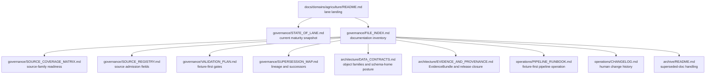

<!-- [KFM_META_BLOCK_V2]
doc_id: kfm://doc/TODO-register-agriculture-state-of-lane
title: Agriculture Lane State of Lane
type: standard
version: v1
status: draft
owners: TODO-agriculture-domain-steward
created: 2026-04-27
updated: 2026-05-06
policy_label: TODO-policy-label
related: [../README.md, FILE_INDEX.md, SOURCE_COVERAGE_MATRIX.md, SOURCE_REGISTRY.md, VALIDATION_PLAN.md, SUPERSESSION_MAP.md, ../architecture/DATA_CONTRACTS.md, ../architecture/EVIDENCE_AND_PROVENANCE.md, ../operations/PIPELINE_RUNBOOK.md, ../operations/CHANGELOG.md, ../../../adr/ADR-0001-schema-home.md, ../../../adr/ADR-0002-responsibility-root-monorepo.md, ../../../adr/ADR-0208-domain-lane-template.md]
tags: [kfm, agriculture, state-of-lane, governance, source-role, evidence-first, map-first, time-aware]
notes: [Revised from the existing 2026-04-27 state snapshot; GitHub connector confirmed the target file and companion Agriculture docs on main; local workspace was not mounted as a Git checkout; owners, CODEOWNERS, policy label, machine schema home, validator commands, CI enforcement, live source terms, release manifests, and runtime/API/UI behavior remain review items.]
[/KFM_META_BLOCK_V2] -->

# Agriculture Lane State of Lane

*Purpose: record the current maturity, evidence boundary, blockers, and next governed actions for the KFM Agriculture lane.*

  <strong>Kansas Frontier Matrix · Agriculture lane</strong> 
  Evidence-first · map-first · time-aware · source-role-preserving · fixture-first · fail-closed

  
  
  
  
  

  <a href="#snapshot">Snapshot</a> ·
  <a href="#repo-fit">Repo fit</a> ·
  <a href="#present-in-this-lane">Present</a> ·
  <a href="#maturity-scorecard">Maturity</a> ·
  <a href="#source-and-claim-posture">Sources</a> ·
  <a href="#gaps-still-marked-for-verification">Gaps</a> ·
  <a href="#next-actions">Next actions</a> ·
  <a href="#release-readiness-gate">Release gate</a> ·
  <a href="#review-checklist">Checklist</a>

> [!IMPORTANT]
> This file is a **state snapshot**, not proof that runtime behavior, source connectors, schemas, validators, policy-as-code, CI workflows, API routes, MapLibre layers, Evidence Drawer payloads, Focus Mode payloads, release manifests, proof packs, or rollback cards are already enforced.
>
> Current repo evidence was checked through the GitHub connector on `main`. A local Git checkout was **not** mounted in this workspace, so branch dirty state, local test output, workflow logs, dashboards, and runtime traces remain **UNKNOWN**.

---

## Snapshot

The Agriculture lane now has an in-repo documentation control set under `docs/domains/agriculture/` covering lane orientation, source coverage, source registry guidance, data contracts, validation, evidence/provenance, operations, changelog, file indexing, supersession, and archive handling.

**Current lane state:** documentation control plane is **CONFIRMED**; implementation enforcement remains **NEEDS VERIFICATION**.

| State area | Current status | What that means |
|---|---:|---|
| Documentation package | **CONFIRMED** | The lane has a structured doc set with governance, architecture, operations, and archive files. |
| Source-family coverage | **CONFIRMED as documentation** | Source families are categorized by role and readiness; no live source is documented here as active. |
| Source admission rules | **CONFIRMED as guidance** | Required source descriptor fields and admission checklist are documented. |
| Machine schema home | **NEEDS VERIFICATION / CONFLICTED** | ADR-0001 is still draft/proposed; do not create duplicate schema authority. |
| Validation posture | **CONFIRMED as guidance** | Fail-closed, fixture-first validation classes and minimum fixtures are documented. |
| Validator implementation | **UNKNOWN** | Runnable validator paths and CI workflow enforcement were not verified. |
| Public release state | **UNKNOWN / NOT READY** | No first Agriculture `ReleaseManifest`, proof pack, or rollback card was confirmed. |
| Runtime/API/UI state | **UNKNOWN** | Governed API routes, MapLibre layer registry, Evidence Drawer adapter, and Focus Mode schemas were not verified. |
| Owners / CODEOWNERS | **NEEDS VERIFICATION** | Steward identities and policy labels remain placeholders. |

**Bottom line:** Agriculture is ready for a fixture-first implementation hardening pass, not for public promotion or live-source activation.

[Back to top](#top)

---

## Repo fit

| Field | Value |
|---|---|
| Current file | `docs/domains/agriculture/governance/STATE_OF_LANE.md` |
| Owning root | `docs/` — human-facing documentation control plane |
| Domain lane root | `docs/domains/agriculture/` |
| Governance folder | `docs/domains/agriculture/governance/` |
| Upstream lane landing page | [`../README.md`](../README.md) |
| Documentation inventory | [`FILE_INDEX.md`](FILE_INDEX.md) |
| Source coverage | [`SOURCE_COVERAGE_MATRIX.md`](SOURCE_COVERAGE_MATRIX.md) |
| Source admission | [`SOURCE_REGISTRY.md`](SOURCE_REGISTRY.md) |
| Validation guidance | [`VALIDATION_PLAN.md`](VALIDATION_PLAN.md) |
| Contract guidance | [`../architecture/DATA_CONTRACTS.md`](../architecture/DATA_CONTRACTS.md) |
| Evidence/provenance guidance | [`../architecture/EVIDENCE_AND_PROVENANCE.md`](../architecture/EVIDENCE_AND_PROVENANCE.md) |
| Pipeline runbook | [`../operations/PIPELINE_RUNBOOK.md`](../operations/PIPELINE_RUNBOOK.md) |
| Change history | [`../operations/CHANGELOG.md`](../operations/CHANGELOG.md) |
| Supersession map | [`SUPERSESSION_MAP.md`](SUPERSESSION_MAP.md) |
| Schema-home ADR | [`../../../adr/ADR-0001-schema-home.md`](../../../adr/ADR-0001-schema-home.md) |
| Responsibility-root ADR | [`../../../adr/ADR-0002-responsibility-root-monorepo.md`](../../../adr/ADR-0002-responsibility-root-monorepo.md) |
| Domain lane template ADR | [`../../../adr/ADR-0208-domain-lane-template.md`](../../../adr/ADR-0208-domain-lane-template.md) |

### Accepted inputs

This state file accepts only lane-status evidence and review-maintenance notes:

| Accepted here | Examples |
|---|---|
| Current maturity findings | Documentation confirmed, implementation unverified, blocked source family, accepted ADR, test evidence. |
| Repo inspection results | Branch/default branch, target files confirmed, local checkout status, search results, verified companion docs. |
| Open gaps | Owners, schema home, validator commands, CI workflows, source terms, proof objects, release state. |
| Next governed actions | Fixture-first PR sequence, ADR resolution, source descriptor work, validator wiring, rollback drill. |
| Status downgrades | Regressed validation, missing rights, source-term change, stale release, superseded docs. |

### Exclusions

| Does not belong here | Belongs instead |
|---|---|
| Machine schemas | `schemas/contracts/v1/...` or the ADR-confirmed schema home |
| Semantic contract bodies | `contracts/` or [`../architecture/DATA_CONTRACTS.md`](../architecture/DATA_CONTRACTS.md) |
| Source descriptors | `data/registry/agriculture/` or repo-confirmed source registry |
| Policy-as-code | `policy/` or repo-confirmed policy root |
| Validator scripts | `tools/validators/`, `packages/`, `pipelines/`, or repo-confirmed implementation roots |
| RAW / WORK / QUARANTINE / PROCESSED data | `data/raw/`, `data/work/`, `data/quarantine/`, `data/processed/` |
| Release artifacts, proof packs, receipts, published outputs | `release/`, `data/proofs/`, `data/receipts/`, `data/published/`, or repo-confirmed equivalents |
| Runtime route/component code | `apps/`, `packages/`, `ui/`, `web/`, or repo-confirmed runtime homes |

[Back to top](#top)

---

## Present in this lane

The current Agriculture documentation package is split by responsibility rather than topic sprawl.

| File | State | Lane role |
|---|---:|---|
| [`../README.md`](../README.md) | **CONFIRMED** | Agriculture landing page, scope, repo fit, accepted inputs, exclusions, source-role guardrails, lifecycle, and definition of done. |
| [`STATE_OF_LANE.md`](STATE_OF_LANE.md) | **CONFIRMED / revised here** | Current maturity snapshot, gaps, and next governed actions. |
| [`FILE_INDEX.md`](FILE_INDEX.md) | **CONFIRMED** | Authoritative navigation and maintenance index for Agriculture documentation. |
| [`SOURCE_COVERAGE_MATRIX.md`](SOURCE_COVERAGE_MATRIX.md) | **CONFIRMED** | Source-family readiness, source-role boundaries, release defaults, and activation blockers. |
| [`SOURCE_REGISTRY.md`](SOURCE_REGISTRY.md) | **CONFIRMED** | Required source descriptor fields and source admission checklist. |
| [`VALIDATION_PLAN.md`](VALIDATION_PLAN.md) | **CONFIRMED** | Fail-closed validation classes, minimum fixture set, and CI expectations. |
| [`SUPERSESSION_MAP.md`](SUPERSESSION_MAP.md) | **CONFIRMED** | Mapping from earlier placeholder guidance to the current companion documentation set. |
| [`../architecture/DATA_CONTRACTS.md`](../architecture/DATA_CONTRACTS.md) | **CONFIRMED** | Agriculture object-family expectations, schema-home caution, source-role compatibility, and publication contract duties. |
| [`../architecture/EVIDENCE_AND_PROVENANCE.md`](../architecture/EVIDENCE_AND_PROVENANCE.md) | **CONFIRMED** | Evidence spine, EvidenceBundle requirements, provenance, catalog/release closure, public trust payloads, and correction/rollback guidance. |
| [`../operations/PIPELINE_RUNBOOK.md`](../operations/PIPELINE_RUNBOOK.md) | **CONFIRMED** | Fixture-first operational sequence, run modes, lifecycle stages, incidents, rollback, and illustrative commands. |
| [`../operations/CHANGELOG.md`](../operations/CHANGELOG.md) | **CONFIRMED** | Records the 2026-04-27 addition of the complete companion doc set. |
| [`../archive/README.md`](../archive/README.md) | **CONFIRMED via file index** | Archive rules for superseded Agriculture docs. |

[Back to top](#top)

---

## Maturity scorecard

| Capability | Status | Evidence basis | Upgrade condition |
|---|---:|---|---|
| Lane documentation control plane | **CONFIRMED** | Companion docs are present and indexed. | Keep links, changelog, and state snapshot synchronized. |
| Source-family role map | **CONFIRMED as docs** | Coverage matrix defines planned, fixture-ready, blocked, and active-state meanings. | Source descriptors and fixtures land in machine-readable registry/test homes. |
| Live source activation | **NOT CONFIRMED** | Coverage matrix documents no active live source families. | SourceDescriptor, rights/sensitivity review, fixtures, validators, policy, catalog, review, release, rollback. |
| Source descriptor requirements | **CONFIRMED as docs** | Registry guidance lists required fields and admission checks. | Machine-readable descriptors validated in repo-native registry. |
| Contract/object-family map | **CONFIRMED as docs** | Data contracts document shared and Agriculture-specific object families. | Machine schemas and fixtures land under accepted schema home. |
| Schema-home authority | **NEEDS VERIFICATION** | ADR-0001 remains proposed/draft. | ADR accepted or superseded; repo consumers updated; duplicate authority blocked. |
| Validation doctrine | **CONFIRMED as docs** | Validation plan requires schema, source-role, rights/sensitivity, temporal, unit/depth, geospatial, aggregate-misuse, and catalog-closure checks. | Executable validators and negative fixtures run in CI. |
| Pipeline operations | **CONFIRMED as docs** | Runbook defines fixture-first run modes and lifecycle sequence. | Repo-native command names, scripts, workflows, logs, and run receipts verified. |
| Evidence and provenance burden | **CONFIRMED as docs** | Evidence/provenance guide defines EvidenceBundle and catalog/release closure expectations. | First fixture EvidenceBundle, CatalogMatrix, PromotionDecision, and ReleaseManifest are emitted and validated. |
| Public API/UI/Focus contracts | **PROPOSED / UNKNOWN enforcement** | Docs define downstream payload obligations. | Actual governed API, MapLibre, Evidence Drawer, and Focus Mode paths are inspected and tested. |
| Release and rollback | **PROPOSED / UNKNOWN artifacts** | Docs require release manifest, proof pack, rollback card, correction path. | First fixture release and rollback drill pass. |
| Stewardship metadata | **NEEDS VERIFICATION** | Owner and policy placeholders remain in lane docs. | CODEOWNERS/steward/policy labels confirmed and recorded. |

[Back to top](#top)

---

## Source and claim posture

Agriculture currently has a **documentation-level source coverage model**. It does not yet have confirmed live-source operation in this state file.

| Source family | Current state | Public claim posture |
|---|---:|---|
| SSURGO / SDA | `PLANNED` | Soil survey and MUKEY context only after descriptor, fixtures, validation, provenance, and catalog closure. |
| gSSURGO / gNATSGO | `PLANNED` | Gridded/derived companion context; never silently replaces direct SSURGO/SDA provenance. |
| Kansas Mesonet | `FIXTURE-READY` | Station/depth/time observation context; not field-level or statewide surface truth without a declared transform. |
| NRCS SCAN | `PLANNED` | Corroborative/reference station context after source mapping, units, depth, time, and QC semantics are verified. |
| NOAA USCRN | `PLANNED` | Reference station context; no parcel, field, or operator truth. |
| NASA SMAP | `FIXTURE-READY` | Satellite/grid soil moisture context with product/version/time-window labels. |
| NASA HLS / HLS-VI | `FIXTURE-READY` | Remote-sensing or derived vegetation-index context with STAC asset, mask, quality, and time-window metadata. |
| USDA NASS QuickStats / Crop Progress | `PLANNED` | Aggregate geography/time/statistic context only; never field-level truth. |
| USDA NASS Cropland Data Layer | `PLANNED` | Annual classified raster context with product-year caveats. |
| Private/proprietary farm data | `BLOCKED` | Deny-by-default until a restricted-data lane, consent/authorization, steward review, and policy gates exist. |

### Current anti-collapse law

- **Aggregate is not field-level.**
- **Station is not surface.**
- **Grid is not ground truth.**
- **Derived is not canonical.**
- **Unknown rights fail closed.**
- **AI does not validate sources or publish truth.**

[Back to top](#top)

---

## Gaps still marked for verification

These are the current blockers before Agriculture can claim implementation maturity or public release readiness.

| Gap | Status | Blocks |
|---|---:|---|
| Confirm owners, CODEOWNERS, and Agriculture steward review path | **NEEDS VERIFICATION** | Published/stable doc status, policy-significant releases. |
| Confirm `policy_label` for Agriculture docs and outputs | **NEEDS VERIFICATION** | Public/restricted classification and release posture. |
| Resolve canonical schema home | **CONFLICTED / NEEDS VERIFICATION** | Machine schemas, validators, fixtures, and policy input contracts. |
| Confirm shared governance schemas | **UNKNOWN** | Reuse of `SourceDescriptor`, `EvidenceBundle`, `DecisionEnvelope`, `PromotionDecision`, `ReleaseManifest`, `CatalogMatrix`, `CorrectionNotice`, and `RollbackCard`. |
| Add machine-readable Agriculture source descriptors | **PROPOSED / NEEDS VERIFICATION** | Source activation and source-role validation. |
| Verify agriculture-specific registry paths | **NEEDS VERIFICATION** | Descriptor, dataset, layer, sensitivity, and backlog registration. |
| Add no-network fixture suite | **PROPOSED** | Validator confidence and CI gating. |
| Implement or verify Agriculture validators | **UNKNOWN** | Schema, source-role, rights/sensitivity, temporal, unit/depth, geospatial, catalog, public-path, and rollback checks. |
| Confirm policy-as-code path and tooling | **UNKNOWN** | Fail-closed rights, sensitivity, source-role, public-precision, and promotion decisions. |
| Confirm CI workflow names and command surface | **UNKNOWN** | Merge-blocking validation and artifact summary output. |
| Verify source terms and automation permission | **NEEDS VERIFICATION** | Any live connector for SSURGO/SDA/gSSURGO, Mesonet, SCAN, USCRN, SMAP, HLS/HLS-VI, NASS, or CDL. |
| Confirm governed API route conventions | **UNKNOWN** | Public API DTO and no-raw-public tests. |
| Confirm MapLibre layer registry / Evidence Drawer / Focus Mode paths | **UNKNOWN** | Public trust payload binding. |
| Record first Agriculture release manifest, proof pack, and rollback card | **PROPOSED / UNKNOWN** | Any public release or release-like artifact. |
| Verify local test output, workflow logs, dashboards, and runtime traces | **UNKNOWN** | Claims of enforcement or deployed behavior. |

[Back to top](#top)

---

## Next actions

Prioritize small, reversible work that converts the documentation control plane into enforceable trust gates.

| Priority | Action | Owner placeholder | Exit condition |
|---:|---|---|---|
| 1 | Replace owner and policy placeholders in Agriculture docs. | `TODO-agriculture-domain-steward` | CODEOWNERS/steward and policy label are verified or explicitly tracked as open. |
| 2 | Resolve schema-home authority with ADR-0001 acceptance or supersession. | Schema steward + documentation steward | Agriculture contract docs point to one canonical machine schema home. |
| 3 | Add machine-readable source descriptors in fixture-only mode. | Agriculture steward + source registry steward | Descriptors include source role, rights, sensitivity, spatial/temporal support, stable keys, ingest mode, and activation state. |
| 4 | Land minimum valid and invalid fixtures. | Test steward | Missing rights, missing sensitivity, aggregate-as-field truth, station-as-surface truth, grid-as-ground-truth, missing provenance, and rollback-missing cases fail closed. |
| 5 | Implement or verify validators. | Validator/tooling steward | Repo-native commands validate source registry, schemas, catalog closure, public-path safety, and release readiness. |
| 6 | Wire CI without live source calls. | CI steward | PR checks run fixture validators and fail when negative fixtures unexpectedly pass. |
| 7 | Produce a fixture-only Agriculture thin slice. | Pipeline steward + Agriculture steward | SourceDescriptor → RAW fixture → WORK candidate → ValidationReport → CatalogMatrix candidate → EvidenceBundle candidate → PromotionDecision → rollback card. |
| 8 | Bind public trust payload contracts only after evidence closure. | API/UI steward | Governed API, MapLibre layer, Evidence Drawer, and Focus Mode payloads consume released or release-candidate fixtures only. |
| 9 | Exercise release and rollback on fixtures. | Release steward | ReleaseManifest, proof refs, rollback card, and correction path are validated. |
| 10 | Consider one live source only after terms are verified. | Source steward + policy reviewer | Source approval is recorded; watcher emits receipts; public promotion remains gated. |

[Back to top](#top)

---

## Release readiness gate

A public or semi-public Agriculture release is not ready until every gate below is either **CONFIRMED** with evidence or explicitly **DENIED / DEFERRED**.

```mermaid
flowchart LR
    A[SourceDescriptor<br/>rights · sensitivity · role] --> B[Fixtures<br/>valid + invalid]
    B --> C[Validators<br/>schema · role · temporal · unit · geo]
    C --> D[Policy<br/>rights · public precision · source role]
    D --> E[Catalog closure<br/>STAC · DCAT · PROV · CatalogMatrix]
    E --> F[EvidenceBundle<br/>claim/layer support]
    F --> G[PromotionDecision<br/>ANSWER · ABSTAIN · DENY · ERROR]
    G --> H[ReleaseManifest<br/>proof refs · rollback card]
    H --> I[Governed API / MapLibre / Evidence Drawer / Focus Mode]
```

| Gate | Required disposition before release |
|---|---|
| Source role and rights | **PASS** or release **DENY** |
| Sensitivity and public precision | **PASS** or release **DENY** |
| Schema validation | **PASS** or candidate **QUARANTINE / ERROR** |
| Negative fixture behavior | Negative cases must fail closed |
| Catalog closure | **PASS** across catalog/provenance/release digest identities |
| EvidenceBundle resolution | **PASS** for every public claim/layer/answer |
| Policy decision | Finite outcome with reason codes and obligations |
| Review state | Steward/policy review recorded where required |
| Release manifest | Artifact digests, policy state, proof refs, correction path, rollback target |
| Public client safety | No RAW, WORK, QUARANTINE, unpublished candidate, internal receipt, direct model, or canonical-store bypass |

[Back to top](#top)

---

## Review checklist

Before committing an update to this file:

- [ ] The snapshot still matches the current GitHub or mounted-repo evidence.
- [ ] Any implementation claim is backed by inspected files, tests, workflows, logs, emitted artifacts, or runtime traces.
- [ ] No live source, policy, validator, CI, API route, UI component, release, proof pack, dashboard, or deployment behavior is claimed without evidence.
- [ ] `FILE_INDEX.md` still lists this file and its neighbors accurately.
- [ ] `../operations/CHANGELOG.md` records the user-visible documentation change.
- [ ] `SOURCE_COVERAGE_MATRIX.md` matches the source-family states summarized here.
- [ ] `VALIDATION_PLAN.md` still matches the fixture and validator expectations summarized here.
- [ ] `../architecture/DATA_CONTRACTS.md` still matches the schema-home and object-family posture summarized here.
- [ ] `../architecture/EVIDENCE_AND_PROVENANCE.md` still matches the EvidenceBundle, catalog closure, release, correction, and rollback posture summarized here.
- [ ] Owner, policy, and doc metadata placeholders remain visible if unresolved.
- [ ] No root-level `agriculture/` folder is proposed.
- [ ] Public Agriculture claims remain cite-or-abstain, evidence-bound, source-role-compatible, policy-aware, reviewable, and rollback-capable.

[Back to top](#top)

---

## Current state summary

The Agriculture lane has moved beyond a placeholder into a structured documentation control plane.

It has **not** yet crossed the evidence threshold for live source activation, public release, CI enforcement, or runtime/API/UI maturity. The safest next increment is a fixture-only, no-network, release-denied-by-default validation slice that proves source descriptors, negative fixtures, EvidenceBundle closure, PromotionDecision output, and rollback readiness before any live connector or public layer ships.
