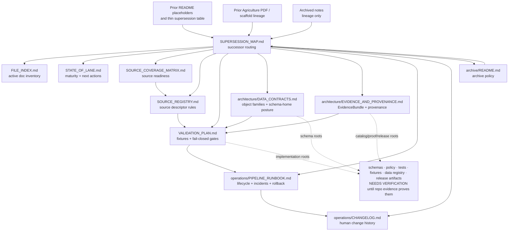

<!-- [KFM_META_BLOCK_V2]
doc_id: kfm://doc/TODO-register-agriculture-supersession-map
title: Agriculture Supersession Map
type: standard
version: v1
status: draft
owners: TODO-agriculture-domain-steward + TODO-documentation-steward
created: 2026-04-27
updated: 2026-05-06
policy_label: TODO-policy-label
related: [../README.md, STATE_OF_LANE.md, FILE_INDEX.md, SOURCE_COVERAGE_MATRIX.md, SOURCE_REGISTRY.md, VALIDATION_PLAN.md, ../architecture/DATA_CONTRACTS.md, ../architecture/EVIDENCE_AND_PROVENANCE.md, ../operations/PIPELINE_RUNBOOK.md, ../operations/CHANGELOG.md, ../archive/README.md, ../../../adr/ADR-0001-schema-home.md, ../../../adr/ADR-0002-responsibility-root-monorepo.md, ../../../adr/ADR-0208-domain-lane-template.md]
tags: [kfm, agriculture, supersession, lineage, governance, documentation-control-plane]
notes: [doc_id, owners, and policy_label require steward verification; created date follows the agriculture changelog entry for the companion doc set; this revision replaces the thin placeholder map with a lineage-safe successor map grounded in current GitHub connector evidence and KFM directory doctrine.]
[/KFM_META_BLOCK_V2] -->

<a id="top"></a>

# Agriculture Supersession Map

*Purpose: map superseded Agriculture README placeholders, prior report lineage, and retired guidance into the current active companion documentation set without granting old material current authority.*

<p align="center">
  <strong>Kansas Frontier Matrix · Agriculture lane</strong><br>
  Source-role-preserving · evidence-first · fail-closed · lineage-safe · reversible
</p>

<p align="center">
  
  
  
  
  
</p>

<p align="center">
  <a href="#scope">Scope</a> ·
  <a href="#repo-fit">Repo fit</a> ·
  <a href="#status-legend">Legend</a> ·
  <a href="#successor-map">Successor map</a> ·
  <a href="#lineage-map">Lineage map</a> ·
  <a href="#diagram">Diagram</a> ·
  <a href="#change-rules">Change rules</a> ·
  <a href="#review-checklist">Checklist</a>
</p>

> [!IMPORTANT]
> This file is a **routing and lineage map**. It does not define source descriptors, machine schemas, policy-as-code, validators, release manifests, proof packs, live source activation, or runtime behavior.
>
> When older Agriculture guidance conflicts with an active successor file, the active successor file wins unless a reviewer explicitly restores the older material through an ADR, changelog entry, and updated supersession row.

---

## Scope

This document answers one narrow question:

> **When older or placeholder Agriculture guidance exists, which active file now owns that concern?**

It exists to prevent three documentation-control failures:

| Failure | What this map prevents |
|---|---|
| Placeholder drift | A short README placeholder keeps being treated as the real owner after companion docs exist. |
| Lineage loss | Prior report or scaffold wording is discarded without replacement, archive note, or successor path. |
| Authority laundering | An archived or exploratory item is linked as if it were current governance, schema, policy, or release authority. |

### In scope

| In scope | Examples |
|---|---|
| README placeholder successors | Lane health, file inventory, source coverage, source registry, contracts, validation, evidence, operations, changelog, archive policy. |
| Companion-doc ownership | Which active file owns each concern inside `docs/domains/agriculture/`. |
| Supersession and archive routing | When old guidance belongs in active docs, `../archive/`, or nowhere. |
| Cross-file update triggers | Which files must be updated together to preserve documentation control. |
| Truth labels | `CONFIRMED`, `PROPOSED`, `NEEDS VERIFICATION`, `SUPERSEDED`, `ARCHIVE ONLY`, `OUT OF SCOPE`. |

### Out of scope

| Not owned here | Goes instead | Why |
|---|---|---|
| Current maturity snapshot | [`STATE_OF_LANE.md`](STATE_OF_LANE.md) | This map routes lineage; lane state owns maturity. |
| Active documentation inventory | [`FILE_INDEX.md`](FILE_INDEX.md) | File inventory owns active package structure. |
| Source-family readiness | [`SOURCE_COVERAGE_MATRIX.md`](SOURCE_COVERAGE_MATRIX.md) | Source status changes independently from supersession. |
| Source descriptor requirements | [`SOURCE_REGISTRY.md`](SOURCE_REGISTRY.md) | Source admission must remain descriptor-first. |
| Object-family and schema guidance | [`../architecture/DATA_CONTRACTS.md`](../architecture/DATA_CONTRACTS.md) | Contract meaning and schema-home posture need a dedicated architecture surface. |
| Evidence/provenance burden | [`../architecture/EVIDENCE_AND_PROVENANCE.md`](../architecture/EVIDENCE_AND_PROVENANCE.md) | EvidenceBundle, catalog, proof, and release closure require a fuller guide. |
| Pipeline operations | [`../operations/PIPELINE_RUNBOOK.md`](../operations/PIPELINE_RUNBOOK.md) | Operational run modes and incidents belong in the runbook. |
| Change history | [`../operations/CHANGELOG.md`](../operations/CHANGELOG.md) | Chronological history belongs in the changelog. |
| Archived documents | [`../archive/README.md`](../archive/README.md) | Archive admission and labels belong in the archive README. |

[Back to top](#top)

---

## Repo fit

| Field | Value |
|---|---|
| Current file | `docs/domains/agriculture/governance/SUPERSESSION_MAP.md` |
| Owning root | `docs/` — human-facing documentation control plane |
| Domain lane | `docs/domains/agriculture/` |
| Subfolder | `governance/` |
| Upstream lane landing page | [`../README.md`](../README.md) |
| Active file index | [`FILE_INDEX.md`](FILE_INDEX.md) |
| Active archive policy | [`../archive/README.md`](../archive/README.md) |
| Architecture companions | [`../architecture/DATA_CONTRACTS.md`](../architecture/DATA_CONTRACTS.md), [`../architecture/EVIDENCE_AND_PROVENANCE.md`](../architecture/EVIDENCE_AND_PROVENANCE.md) |
| Operations companions | [`../operations/PIPELINE_RUNBOOK.md`](../operations/PIPELINE_RUNBOOK.md), [`../operations/CHANGELOG.md`](../operations/CHANGELOG.md) |
| Placement basis | Domain docs belong under `docs/domains/agriculture/`, not a root-level `agriculture/` folder. |
| Current repo evidence | **CONFIRMED:** this file and its companion Agriculture docs are visible in the GitHub repository. |
| Remaining verification limits | Owners, policy label, CODEOWNERS, schema-home enforcement, policy-as-code paths, validator commands, CI workflows, release objects, dashboards, and runtime behavior remain **NEEDS VERIFICATION** unless separately inspected. |

> [!NOTE]
> This file was originally a thin placeholder table. The active Agriculture documentation package now uses a split structure: `governance/`, `architecture/`, `operations/`, and `archive/`. This supersession map preserves the old placeholder intent while routing maintainers to the current files.

[Back to top](#top)

---

## Status legend

| Label | Meaning | May be used as current guidance? |
|---|---|---:|
| `CURRENT SUCCESSOR` | Active file now owns the concern. | Yes |
| `PARTIAL SUCCESSOR` | Active file owns part of the concern; another file also applies. | Yes, with linked companion |
| `SUPERSEDED` | Older item was replaced by current docs. | No, except as lineage |
| `ARCHIVE ONLY` | Retained for audit, migration history, or predecessor context. | No |
| `NEEDS VERIFICATION` | Checkable but not verified strongly enough. | No |
| `OUT OF SCOPE` | Not accepted in this lane or directory. | No |
| `DEFERRED` | Planned but intentionally not active yet. | No, unless active docs say otherwise |

### Authority rule

If two files disagree, use this order:

1. Active governance, architecture, operations, and archive docs in `docs/domains/agriculture/`.
2. Accepted ADRs and root/domain directory rules.
3. Machine schemas, policy, tests, registries, and release artifacts when verified.
4. Archived Agriculture material.
5. Prior PDFs, planning reports, scaffolds, and exploratory packets as **LINEAGE** only.

[Back to top](#top)

---

## Successor map

The table below maps older README placeholder intents and thin-map entries to the current active Agriculture companion docs.

| Placeholder or prior intent | Current successor | Status | Successor owns | Update trigger |
|---|---|---:|---|---|
| Agriculture lane landing and scope | [`../README.md`](../README.md) | `CURRENT SUCCESSOR` | Lane purpose, accepted inputs, exclusions, lifecycle, source-role guardrails, quickstart, definition of done. | Scope, public posture, directory shape, or domain boundary changes. |
| Lane health snapshot | [`STATE_OF_LANE.md`](STATE_OF_LANE.md) | `CURRENT SUCCESSOR` | Maturity snapshot, verified gaps, and next actions. | Repo inspection, source activation, schema-home status, CI/tooling, owner, release, or rollback status changes. |
| File inventory and doc ownership | [`FILE_INDEX.md`](FILE_INDEX.md) | `CURRENT SUCCESSOR` | Active doc set, file ownership, relationship map, maintenance rules, review checklist. | Any Agriculture doc is added, moved, renamed, archived, or superseded. |
| Source-family readiness and status | [`SOURCE_COVERAGE_MATRIX.md`](SOURCE_COVERAGE_MATRIX.md) | `CURRENT SUCCESSOR` | Source-family coverage, source-role boundaries, readiness, blockers, release defaults. | Source family, coverage state, blocker, rights, or release posture changes. |
| Source descriptor expectations | [`SOURCE_REGISTRY.md`](SOURCE_REGISTRY.md) | `CURRENT SUCCESSOR` | Required source descriptor fields and source admission checklist. | Required source fields, activation states, source roles, stable keys, rights, or sensitivity rules change. |
| Contract and schema expectations | [`../architecture/DATA_CONTRACTS.md`](../architecture/DATA_CONTRACTS.md) | `CURRENT SUCCESSOR` | Object-family contract posture, schema-home warnings, source-role compatibility, publication contract burden. | Contract objects, schema-home decision, DTO expectations, or correction semantics change. |
| Validation and fixture expectations | [`VALIDATION_PLAN.md`](VALIDATION_PLAN.md) | `CURRENT SUCCESSOR` | Fail-closed validation classes, fixture minimums, negative cases, CI expectations. | Validator, fixture, policy, catalog closure, or promotion checks change. |
| Evidence/provenance publication burden | [`../architecture/EVIDENCE_AND_PROVENANCE.md`](../architecture/EVIDENCE_AND_PROVENANCE.md) | `CURRENT SUCCESSOR` | EvidenceBundle burden, chain of custody, provenance, catalog/release closure, public trust payloads. | EvidenceBundle shape, catalog closure, proof/receipt separation, public trust payload, or correction lineage changes. |
| Lifecycle operations and incident handling | [`../operations/PIPELINE_RUNBOOK.md`](../operations/PIPELINE_RUNBOOK.md) | `CURRENT SUCCESSOR` | Fixture-first pipeline modes, lifecycle stages, incidents, rollback, correction, and command sketches. | Pipeline sequence, incident response, source activation, rollback, or release operation changes. |
| Change history | [`../operations/CHANGELOG.md`](../operations/CHANGELOG.md) | `CURRENT SUCCESSOR` | Human-readable Agriculture lane documentation history. | Any user-visible Agriculture documentation change lands. |
| Archive policy | [`../archive/README.md`](../archive/README.md) | `CURRENT SUCCESSOR` | Archive labels, accepted archive inputs, exclusions, archive headers, archive definition of done. | A file enters archive, archive structure changes, or global archive policy supersedes lane-local rules. |
| Supersession routing | `SUPERSESSION_MAP.md` | `CURRENT SUCCESSOR` | Placeholder-to-successor mapping and predecessor lineage routing. | A predecessor, successor, archive rule, or companion doc responsibility changes. |

> [!WARNING]
> This map does not make a successor file executable. If the successor describes schemas, validators, policies, workflows, or release objects, the executable implementation still belongs in the appropriate responsibility root and remains **NEEDS VERIFICATION** until repo evidence proves it.

[Back to top](#top)

---

## Lineage map

This section maps prior or predecessor Agriculture material into active successor handling. It preserves continuity without treating prior planning artifacts as current implementation proof.

| Predecessor or lineage item | Status | Current handling | Active successor(s) | Review note |
|---|---:|---|---|---|
| Thin `SUPERSESSION_MAP.md` table | `SUPERSEDED` | Replaced by this expanded map. | This file | Preserve the original placeholder intents through the successor map above. |
| Agriculture README placeholder list | `SUPERSEDED / PARTIAL SUCCESSOR` | Its placeholder concerns now route to the split companion doc package. | [`FILE_INDEX.md`](FILE_INDEX.md), this file | If README links or directory-tree assumptions drift, update README, file index, changelog, and this map together. |
| Prior Agriculture PDF dossier / implementation report | `LINEAGE` | Use as design lineage and source-role pressure, not as current repo implementation proof. | [`SOURCE_COVERAGE_MATRIX.md`](SOURCE_COVERAGE_MATRIX.md), [`DATA_CONTRACTS.md`](../architecture/DATA_CONTRACTS.md), [`VALIDATION_PLAN.md`](VALIDATION_PLAN.md), [`EVIDENCE_AND_PROVENANCE.md`](../architecture/EVIDENCE_AND_PROVENANCE.md), [`PIPELINE_RUNBOOK.md`](../operations/PIPELINE_RUNBOOK.md) | Reuse only after current repo placement, rights, sensitivity, schema-home, fixtures, policy, and validation gates are verified. |
| Prior source-family matrices | `PARTIAL SUCCESSOR` | Source families and anti-collapse rules are retained in active matrix and contract/evidence docs. | [`SOURCE_COVERAGE_MATRIX.md`](SOURCE_COVERAGE_MATRIX.md), [`SOURCE_REGISTRY.md`](SOURCE_REGISTRY.md), [`DATA_CONTRACTS.md`](../architecture/DATA_CONTRACTS.md) | Do not upgrade a source to live because it appears in a matrix. |
| Prior object-family sketches | `PARTIAL SUCCESSOR` | Object names and field families are retained as contract planning guidance. | [`DATA_CONTRACTS.md`](../architecture/DATA_CONTRACTS.md), [`VALIDATION_PLAN.md`](VALIDATION_PLAN.md) | Machine schemas require canonical schema-home verification. |
| Prior lifecycle and promotion sketches | `PARTIAL SUCCESSOR` | Lifecycle flow and promotion burden are retained in active evidence and runbook docs. | [`EVIDENCE_AND_PROVENANCE.md`](../architecture/EVIDENCE_AND_PROVENANCE.md), [`PIPELINE_RUNBOOK.md`](../operations/PIPELINE_RUNBOOK.md) | Publication still requires release manifest, proof, policy, review, and rollback evidence. |
| Archived Agriculture notes | `ARCHIVE ONLY` | Store only if archive header, successor, date, reason, and status are visible. | [`../archive/README.md`](../archive/README.md) | Archive material cannot re-enter current guidance without review and successor update. |
| Machine source descriptors | `NEEDS VERIFICATION` | Must live in the repo-confirmed source registry, not this Markdown map. | [`SOURCE_REGISTRY.md`](SOURCE_REGISTRY.md), `data/registry/...` after verification | This file may link to descriptors only after path and status are confirmed. |
| Machine schemas | `NEEDS VERIFICATION / CONFLICTED` | Must follow schema-home ADR and repo convention. | [`../architecture/DATA_CONTRACTS.md`](../architecture/DATA_CONTRACTS.md), [`../../../adr/ADR-0001-schema-home.md`](../../../adr/ADR-0001-schema-home.md) | Do not create parallel schemas in `contracts/` and `schemas/`. |
| Policy-as-code, tests, fixtures, validators, CI, release artifacts | `NEEDS VERIFICATION` | Belong under responsibility roots when verified. | [`VALIDATION_PLAN.md`](VALIDATION_PLAN.md), [`PIPELINE_RUNBOOK.md`](../operations/PIPELINE_RUNBOOK.md), repo-native implementation roots | This document does not claim they exist or run. |

[Back to top](#top)

---

## Diagram



[Back to top](#top)

---

## Change rules

### Update this file when…

- an older Agriculture placeholder is replaced by a current companion doc;
- a companion doc moves, is renamed, is archived, or changes ownership;
- `FILE_INDEX.md` adds or removes an Agriculture documentation file;
- `../archive/README.md` accepts a superseded Agriculture document;
- an ADR changes schema-home, domain-lane template, archive, or responsibility-root placement;
- README directory-tree or quick-jump language changes;
- prior report lineage is promoted, rejected, narrowed, or archived;
- a verification item changes from `NEEDS VERIFICATION` to `CONFIRMED`.

### Also update…

| Change | Companion update required |
|---|---|
| Successor mapping changes | [`FILE_INDEX.md`](FILE_INDEX.md) and [`../operations/CHANGELOG.md`](../operations/CHANGELOG.md) |
| Archive admission changes | [`../archive/README.md`](../archive/README.md), this file, and the active file that superseded the archived item |
| Lane maturity changes | [`STATE_OF_LANE.md`](STATE_OF_LANE.md) |
| Source-family status changes | [`SOURCE_COVERAGE_MATRIX.md`](SOURCE_COVERAGE_MATRIX.md) |
| Source descriptor field changes | [`SOURCE_REGISTRY.md`](SOURCE_REGISTRY.md) |
| Schema or object-family meaning changes | [`../architecture/DATA_CONTRACTS.md`](../architecture/DATA_CONTRACTS.md) |
| Evidence/provenance burden changes | [`../architecture/EVIDENCE_AND_PROVENANCE.md`](../architecture/EVIDENCE_AND_PROVENANCE.md) |
| Pipeline or rollback handling changes | [`../operations/PIPELINE_RUNBOOK.md`](../operations/PIPELINE_RUNBOOK.md) |
| User-visible doc change lands | [`../operations/CHANGELOG.md`](../operations/CHANGELOG.md) |

### Supersession row rule

Every new supersession row should answer:

| Field | Required answer |
|---|---|
| Predecessor | What older doc, placeholder, report, scaffold, or section is being replaced? |
| Status | `SUPERSEDED`, `PARTIAL SUCCESSOR`, `ARCHIVE ONLY`, `NEEDS VERIFICATION`, or `OUT OF SCOPE`. |
| Successor | Which active file owns the concern now? |
| Reason | Why the older item no longer owns it. |
| Linkage | Which file index, changelog, archive, or ADR entry also changed? |
| Rollback | How a reviewer can find prior context if the change is reverted or corrected. |

[Back to top](#top)

---

## Archive routing

Use archive routing only when prior material should remain inspectable but not active.

| Material type | Archive routing | Required header |
|---|---|---|
| Superseded active doc | Move or copy to `../archive/` only after successor exists. | `Archive status: SUPERSEDED` |
| Prior scaffold/report excerpt | Retain only as lineage or report-index note if rights and usefulness are clear. | `Archive status: LINEAGE` |
| Exploratory note | Archive only if it helps future triage and is clearly non-canon. | `Archive status: EXPLORATORY` |
| Withdrawn unsafe guidance | Archive only if needed for correction/audit and safe to retain. | `Archive status: WITHDRAWN` |
| Unknown-purpose file | Do not archive as authority. Hold as **NEEDS VERIFICATION** until reviewed. | `Archive status: NEEDS VERIFICATION` |

> [!CAUTION]
> Archive is not a lifecycle data home. Do not place RAW, WORK, QUARANTINE, PROCESSED, PUBLISHED artifacts, source payloads, private farm/operator records, receipts, proof packs, secrets, or live source outputs in `docs/domains/agriculture/archive/`.

[Back to top](#top)

---

## Verification backlog

| Item | Status | Why it matters |
|---|---:|---|
| `doc_id` registration for this file | `NEEDS VERIFICATION` | Metadata placeholder must be replaced by registry value. |
| Owners / CODEOWNERS for Agriculture documentation | `NEEDS VERIFICATION` | Supersession and archive decisions need accountable review. |
| Policy label for this file | `NEEDS VERIFICATION` | Determines publication and access posture. |
| Current README directory-tree accuracy | `NEEDS VERIFICATION` | README may still describe direct sibling docs while active files live in split subfolders. |
| Schema-home ADR acceptance and enforcement | `NEEDS VERIFICATION / CONFLICTED` | Prevents duplicate machine-schema authority. |
| Machine source descriptor registry path | `NEEDS VERIFICATION` | Source admission cannot be inferred from this map. |
| Validator scripts and CI commands | `UNKNOWN` | Validation plan expectations need executable proof. |
| Release manifest, proof pack, rollback card, and correction object homes | `UNKNOWN` | Publication and rollback cannot be claimed until verified. |
| Existing archived Agriculture child folders | `UNKNOWN` | Archive README names permitted future folders but does not confirm they exist. |
| Whether old Agriculture report excerpts should be archived locally | `NEEDS VERIFICATION` | Requires rights, usefulness, successor, and archive-header review. |

[Back to top](#top)

---

## Review checklist

Before committing a change to this file:

- [ ] Every successor path is relative and valid from `docs/domains/agriculture/governance/SUPERSESSION_MAP.md`.
- [ ] Active successor files match the split between `governance/`, `architecture/`, `operations/`, and `archive/`.
- [ ] No archived, prior-report, scaffold, or exploratory item is presented as current implementation proof.
- [ ] `FILE_INDEX.md` agrees with this map.
- [ ] `../operations/CHANGELOG.md` records the documentation change.
- [ ] `../archive/README.md` is updated if any file is archived, restored, or reclassified.
- [ ] `STATE_OF_LANE.md` is updated if the change alters maturity, gaps, or next actions.
- [ ] Schema, policy, validator, CI, release, or runtime claims remain **NEEDS VERIFICATION** unless repo evidence proves them.
- [ ] No root-level `agriculture/` folder is proposed.
- [ ] Public Agriculture claims remain source-role-compatible, EvidenceBundle-backed, policy-aware, reviewable, and rollback-capable.
- [ ] The change is reversible without losing predecessor context.

[Back to top](#top)

---

<details>
<summary>Appendix A — Archive header snippet</summary>

Use this after the KFM meta block on archived Agriculture Markdown files.

```markdown
> [!NOTE]
> **Archive status:** SUPERSEDED | LINEAGE | EXPLORATORY | WITHDRAWN | REFERENCE | NEEDS VERIFICATION  
> **Archived on:** YYYY-MM-DD  
> **Superseded by:** ../path/to/current-file.md or `NO SUCCESSOR — explain why`  
> **Reason:** short reason  
> **Original role:** active doc | draft | report | scaffold note | runbook | other  
> **Reviewer / owner:** TODO or verified reviewer  
> **Public-use posture:** cite only as lineage; not current authority
```

</details>

<details>
<summary>Appendix B — Anti-patterns this map should catch</summary>

| Anti-pattern | Safer handling |
|---|---|
| “The old PDF said it, so the repo implements it.” | Treat the PDF as **LINEAGE**; verify current repo files, tests, workflows, artifacts, or runtime evidence. |
| “The README placeholder still owns this topic.” | Route to the active successor file and update README/File Index if needed. |
| “Archive docs can be linked as current guidance.” | Link archived items only with status-visible lineage text. |
| “A source family row means the source is live.” | Require SourceDescriptor, rights, sensitivity, fixtures, validators, policy, catalog closure, review, release, and rollback evidence. |
| “Schema prose is enough.” | Use the schema-home ADR and machine validation surfaces after verification. |
| “A release is just a copied file.” | Require PromotionDecision, ReleaseManifest, proof refs, catalog closure, rollback card, and correction path. |
| “Generated map tiles or Focus answers prove the claim.” | Resolve EvidenceBundle support and source-role compatibility first. |

</details>
