<!-- [KFM_META_BLOCK_V2]
doc_id: kfm://doc/TODO-register-agriculture-validation-plan
title: Agriculture Validation Plan
type: standard
version: v1
status: draft
owners: TODO-agriculture-domain-steward + TODO-validation-steward
created: NEEDS-VERIFICATION
updated: 2026-05-06
policy_label: TODO-policy-label
related: [../README.md, ./STATE_OF_LANE.md, ./FILE_INDEX.md, ./SOURCE_REGISTRY.md, ./SOURCE_COVERAGE_MATRIX.md, ./SUPERSESSION_MAP.md, ../architecture/DATA_CONTRACTS.md, ../architecture/EVIDENCE_AND_PROVENANCE.md, ../operations/PIPELINE_RUNBOOK.md, ../operations/CHANGELOG.md, ../../../adr/ADR-0001-schema-home.md, ../../../adr/ADR-0002-responsibility-root-monorepo.md]
tags: [kfm, agriculture, validation, fixtures, fail-closed, evidence-first, source-role, catalog-closure]
notes: [Revised from the existing thin validation plan; doc_id, owners, created date, policy label, exact validator paths, CI workflow names, policy tooling, and live-source enforcement remain NEEDS VERIFICATION.]
[/KFM_META_BLOCK_V2] -->

<a id="top"></a>

# Agriculture Validation Plan

*Purpose: define the fixture-first, fail-closed validation gates that keep Agriculture lane claims source-role-compatible, evidence-bound, public-safe, catalog-closed, and rollback-ready.*

<p align="center">
  
  
  
  
  
</p>

<p align="center">
  <a href="#scope">Scope</a> ·
  <a href="#repo-fit">Repo fit</a> ·
  <a href="#validation-spine">Validation spine</a> ·
  <a href="#validation-classes">Validation classes</a> ·
  <a href="#minimum-fixture-set">Fixtures</a> ·
  <a href="#source-family-gates">Source gates</a> ·
  <a href="#ci-expectations">CI</a> ·
  <a href="#promotion-readiness">Promotion</a> ·
  <a href="#review-checklist">Checklist</a> ·
  <a href="#open-verification-backlog">Backlog</a>
</p>

> [!IMPORTANT]
> This file is the Agriculture lane’s **validation contract for maintainers**. It does not implement validators, activate live sources, prove CI enforcement, publish artifacts, or certify release readiness by itself. Where implementation evidence is not confirmed, this plan keeps the claim **PROPOSED**, **UNKNOWN**, or **NEEDS VERIFICATION**.

> [!WARNING]
> Public or semi-public Agriculture claims must not be emitted from RAW, WORK, QUARANTINE, unpublished candidates, internal receipts, direct source-system side effects, or generated model language. They must resolve through released artifacts, governed APIs, and `EvidenceBundle` support.

---

## Scope

The Agriculture lane validates Kansas-centered agricultural evidence and derived outputs before they can support public layers, API responses, Evidence Drawer payloads, Focus Mode answers, exports, or release candidates.

This plan preserves eight validation classes from the original lane document and expands them into reviewable gates, fixtures, CI expectations, release checks, and rollback obligations.

### In scope

| Area | Examples | Validation burden |
|---|---|---|
| Source admission | SSURGO/SDA, gSSURGO/gNATSGO, Kansas Mesonet, SCAN, USCRN, SMAP, HLS/HLS-VI, NASS QuickStats, Crop Progress, CDL | Source role, rights, sensitivity, stable keys, cadence, temporal support, spatial support. |
| Observations | Soil moisture station readings, station weather context, remote-sensing/gridded observations | Units, depth, QC, timestamp semantics, product version, grid/asset lineage, source keys. |
| Aggregates | NASS county/state/week/year crop statistics and progress reports | Aggregate-only scope; explicit denial of field, parcel, and operator truth. |
| Derived indicators | Stress, anomaly, suitability, vegetation index, change, fused layers | Input refs, algorithm/spec version, masks, uncertainty, processing receipts, catalog closure. |
| Public delivery | Layer manifests, governed API DTOs, Evidence Drawer payloads, Focus Mode payloads | No internal lifecycle paths; EvidenceBundle refs; policy label; release/correction/rollback state. |
| Release candidates | Dataset releases, public-safe artifacts, catalog/proof/release packages | STAC/DCAT/PROV/CatalogMatrix closure, proof refs, PromotionDecision, ReleaseManifest, RollbackCard. |

### Out of scope

| Not validated by this file alone | Goes instead | Reason |
|---|---|---|
| Machine schema definitions | `schemas/` or ADR-confirmed schema home | Prose cannot be executable validation. |
| Policy-as-code | `policy/` or repo-confirmed policy home | Allow/deny/restrict logic must be runnable and tested. |
| Source descriptor records | `data/registry/` or repo-confirmed registry home | Source admission needs machine-readable source state. |
| Validator scripts | `tools/validators/`, `packages/`, `pipelines/`, or repo-native equivalent | This plan defines expected behavior, not implementation. |
| Fixtures | `fixtures/`, `tests/fixtures/`, or repo-confirmed fixture home | Fixtures must be checked by tests and validators. |
| RAW / WORK / QUARANTINE data | `data/raw/`, `data/work/`, `data/quarantine/` | Internal lifecycle data must not become documentation. |
| Published artifacts and release objects | `data/published/`, `data/proofs/`, `data/receipts/`, `release/`, or repo-confirmed release homes | Trust-bearing outputs require their own governed homes. |

[Back to top](#top)

---

## Repo fit

| Field | Value |
|---|---|
| Current file | `docs/domains/agriculture/governance/VALIDATION_PLAN.md` |
| Owning root | `docs/` — human-facing documentation control plane |
| Domain lane | `docs/domains/agriculture/` |
| Governance folder | `docs/domains/agriculture/governance/` |
| Upstream lane page | [`../README.md`](../README.md) |
| File index | [`FILE_INDEX.md`](FILE_INDEX.md) |
| Lane state snapshot | [`STATE_OF_LANE.md`](STATE_OF_LANE.md) |
| Source coverage matrix | [`SOURCE_COVERAGE_MATRIX.md`](SOURCE_COVERAGE_MATRIX.md) |
| Source registry guidance | [`SOURCE_REGISTRY.md`](SOURCE_REGISTRY.md) |
| Data contract companion | [`../architecture/DATA_CONTRACTS.md`](../architecture/DATA_CONTRACTS.md) |
| Evidence companion | [`../architecture/EVIDENCE_AND_PROVENANCE.md`](../architecture/EVIDENCE_AND_PROVENANCE.md) |
| Operations companion | [`../operations/PIPELINE_RUNBOOK.md`](../operations/PIPELINE_RUNBOOK.md) |
| Schema-home ADR | [`../../../adr/ADR-0001-schema-home.md`](../../../adr/ADR-0001-schema-home.md) |
| Responsibility-root ADR | [`../../../adr/ADR-0002-responsibility-root-monorepo.md`](../../../adr/ADR-0002-responsibility-root-monorepo.md) |

### Accepted inputs

This file accepts validation guidance, gate definitions, fixture expectations, failure-mode tables, CI expectations, release-readiness checks, and review checklists for the Agriculture lane.

### Exclusions

This file must not contain live source credentials, private farm/operator data, raw source payloads, executable policy bundles, active JSON Schema definitions, release manifests, proof packs, or validator implementation code.

> [!NOTE]
> The Agriculture lane has confirmed in-repo documentation companions. The exact Agriculture validator scripts, fixture paths, CI workflow names, machine schema subpath, policy bundle path, CODEOWNERS, release manifests, proof packs, and live-source enforcement are still **NEEDS VERIFICATION** unless separately proven.

[Back to top](#top)

---

## Validation spine

Agriculture validation follows the KFM trust path:

```text
SOURCE EDGE -> RAW -> WORK / QUARANTINE -> PROCESSED -> CATALOG / TRIPLET -> PUBLISHED
```

Validation is not one check. It is a gate sequence that prevents unsupported meaning from moving forward.

```mermaid
flowchart LR
    SD[SourceDescriptor<br/>identity · role · rights · sensitivity] --> F[Fixtures<br/>valid · invalid · policy cases]
    F --> S[Schema validation<br/>shape · version · required fields]
    S --> R[Source-role validation<br/>support matches claim scope]
    R --> P[Rights + sensitivity<br/>default deny if unclear]
    P --> T[Temporal + freshness<br/>observed · retrieved · release time]
    T --> U[Unit · depth · CRS · product lineage]
    U --> G[Geospatial + precision<br/>support class · public-safe geometry]
    G --> C[Catalog closure<br/>STAC · DCAT · PROV · CatalogMatrix]
    C --> EB[EvidenceBundle resolution]
    EB --> D{Decision}
    D -- pass --> PR[PromotionDecision<br/>ReleaseManifest · proof refs · rollback]
    D -- fail --> Q[DENY / ABSTAIN / ERROR<br/>or QUARANTINE with reason codes]
```



### Validation laws

1. **Fixture-first:** no live source activation before valid and invalid fixtures prove the gate.
2. **Fail-closed:** unknown rights, sensitivity, source role, schema home, temporal support, catalog closure, or rollback target blocks promotion.
3. **Source-role-compatible:** a source may support one claim type and fail another.
4. **No public internal paths:** public payloads must not reference RAW, WORK, QUARANTINE, unpublished candidates, internal receipts, or canonical-only stores.
5. **Evidence resolves before explanation:** public claims, layer popups, Evidence Drawer payloads, Focus Mode answers, and exports must resolve `EvidenceRef -> EvidenceBundle`.
6. **Receipts are process memory:** receipts support audit but do not prove public truth by themselves.
7. **Promotion is reviewable:** release candidates require validation, policy, catalog, proof, review, release, correction, and rollback readiness.

[Back to top](#top)

---

## Validation classes

| Class | Must prove | Agriculture examples | Expected negative case |
|---|---|---|---|
| 1. Schema validation | Required fields, enum values, object shape, version, and schema compatibility. | `SourceDescriptor`, `SoilMoistureReading`, `AgricultureAggregateStat`, `AgricultureLayerManifest`. | Missing `source_id`, source role, schema version, evidence ref, or required support field. |
| 2. Source-role validation | Claim type is compatible with source role and source support. | NASS aggregate supports county/week statistic; Mesonet supports station/depth/time observation. | NASS aggregate used as field truth; station reading used as statewide/field truth without declared transform. |
| 3. Rights/sensitivity validation | Rights, terms, attribution, sensitivity, access class, and public precision are explicit. | SSURGO/SDA terms, Mesonet data-use posture, private/proprietary source denial. | Missing rights, missing sensitivity, or unknown redistribution class. |
| 4. Temporal validation | Observed, valid, source, retrieved, processing, release, and correction time are not collapsed where material. | Station reading timestamp, NASS week/year, HLS acquisition window, SMAP granule time. | Stale or missing timestamp used as current claim. |
| 5. Unit/depth validation | Variables preserve original and normalized units, depth, QC, and measurement basis. | Soil moisture depth and unit normalization; station variable mapping. | Reading without depth, unit, source QC, or impossible physical value. |
| 6. Geospatial validation | CRS, geometry validity, spatial support, precision class, and transform provenance are explicit. | Station point, county aggregate geography, grid cell, MUKEY map unit, generalized public layer. | Public exact geometry when policy requires generalization; invalid or unversioned geometry. |
| 7. Aggregate misuse validation | Aggregate products cannot support field, parcel, operator, or point-level claims. | NASS QuickStats, Crop Progress, CDL caveats. | County/state aggregate used as farm-level truth. |
| 8. Catalog closure validation | Every public claim resolves to catalog/provenance/release evidence. | STAC/DCAT/PROV/CatalogMatrix agreement, EvidenceBundle refs, ReleaseManifest digests. | Mismatched digests, missing EvidenceBundle, missing rollback card, or open catalog edge. |
| 9. Remote-sensing lineage validation | Product ID/version, asset refs, masks, quality bands, CRS/grid support, and time window are present. | SMAP, HLS, HLS-VI, CDL, gridded soil products. | HLS-derived stress indicator without mask/cloud metadata or product version. |
| 10. Derived-indicator validation | Inputs, algorithm/spec version, parameters, uncertainty, run receipt, and limitations are recorded. | Stress, anomaly, suitability, vegetation-index, fused indicator. | Derived result without input evidence refs or processing receipt. |
| 11. Public-path safety validation | API/UI/layer payloads do not leak internal lifecycle paths or unreleased candidates. | Layer manifests, Evidence Drawer payloads, Focus Mode payloads. | Public payload contains `data/raw/`, `data/work/`, `data/quarantine/`, or internal receipt path. |
| 12. Correction/rollback validation | Published objects have release identity, correction lineage, and rollback target. | ReleaseManifest, CorrectionNotice, RollbackCard. | Promotion candidate lacks rollback target or silently overwrites prior release. |

[Back to top](#top)

---

## Minimum fixture set

A useful first Agriculture validation slice should include no-network fixtures before any live intake.

### Required positive fixtures

| Fixture | Purpose | Minimum support |
|---|---|---|
| Valid source descriptor | Proves source-admission shape and required governance fields. | owner/steward, role, rights, sensitivity, cadence, stable keys, spatial/temporal support, activation state. |
| Valid station soil-moisture observation | Proves station/depth/time observation handling. | station ID, variable, original unit, normalized unit, depth, observed time, QC, source ref. |
| Valid SSURGO/SDA MUKEY property candidate | Proves soil-context use without forking Soil lane authority. | MUKEY, table/version, property, aggregation/component/horizon basis, source ref. |
| Valid NASS aggregate statistic | Proves aggregate official context and scope. | geography, geography version, commodity, statistic, unit, year/week or period, source release. |
| Valid remote-sensing/grid product | Proves product/version, asset, grid, mask, and time-window handling. | product ID/version, STAC item/asset ref, CRS/grid, mask/QA, time window, digest. |
| Valid derived indicator candidate | Proves input refs, method/version, uncertainty, and run receipt. | input EvidenceRefs, algorithm/spec version, parameters, output support, receipt. |
| Valid catalog closure candidate | Proves STAC/DCAT/PROV/CatalogMatrix/release digest agreement. | catalog refs, release manifest ref, artifact digests, EvidenceBundle ref. |
| Valid release dry-run | Proves promotion can PASS only when evidence, policy, catalog, proof, review, and rollback are closed. | PromotionDecision, ReleaseManifest, proof refs, RollbackCard. |

### Required negative fixtures

| Fixture | Expected outcome |
|---|---|
| Missing `rights` in source descriptor | `DENY` source activation or public release. |
| Missing `sensitivity` in source descriptor | `DENY` source activation or public release. |
| Ambiguous source role | `DENY` activation or `ABSTAIN` from claim. |
| Aggregate-as-field claim | `DENY` public claim. |
| Station-as-surface claim without transform | `DENY` or `QUARANTINE`. |
| Grid-as-ground-truth wording | `DENY` public claim. |
| Soil moisture reading missing depth or unit | `ERROR` or `QUARANTINE`. |
| HLS/SMAP/CDL object missing product version or mask/QA metadata | `ABSTAIN` or `QUARANTINE`. |
| Derived stress indicator without input refs or processing receipt | `DENY` promotion. |
| Public layer manifest referencing RAW / WORK / QUARANTINE | fail public-path safety check. |
| Receipt claiming proof authority | fail receipt-not-proof check. |
| CatalogMatrix with mismatched STAC/DCAT/PROV/release digest | `DENY` promotion. |
| Promotion candidate without rollback target | `ERROR` or `DENY` release. |
| Focus Mode answer with no resolved EvidenceBundle | `ABSTAIN` or `DENY`. |

[Back to top](#top)

---

## Source-family gates

The source-family statuses below are validation posture summaries. They do not prove live-source activation.

| Source family | Validation posture | Required gate before live intake | Public misuse to block |
|---|---|---|---|
| SSURGO / SDA | `PLANNED` | MUKEY/component/horizon fixtures, source descriptor, rights/citation, Soil-lane boundary check, schema-home verification. | Treating soil context as real-time crop or field condition. |
| gSSURGO / gNATSGO | `PLANNED` | Product/version, grid support, raster metadata, source descriptor, companion/derived label. | Silently replacing SSURGO/SDA provenance. |
| Kansas Mesonet | `FIXTURE-READY` at documentation level | Station/variable/depth/unit/QC fixtures, data-use review, freshness tests, no station-as-field truth policy. | Turning a station reading into field or statewide truth without transform. |
| NRCS SCAN | `PLANNED` | Station mapping, units/depth/QC normalization, cadence and terms review. | Treating corroborative station data as parcel truth. |
| NOAA USCRN | `PLANNED` | Product mapping, station metadata, QC, source descriptor, temporal/freshness checks. | Merging networks without preserving source semantics. |
| NASA SMAP | `FIXTURE-READY` at documentation level | Product/version, grid, granule/time, QA/mask, spatial support, and product caveats. | Calling satellite/grid context ground truth. |
| NASA HLS / HLS-VI | `FIXTURE-READY` at documentation level | STAC item/asset, mask/cloud metadata, index formula, acquisition window, product version. | Publishing stress claims without mask/time-window or algorithm support. |
| USDA NASS QuickStats / Crop Progress | `PLANNED` | Aggregate geography/version, commodity/statistic/unit/period fixtures, source terms, API key posture if applicable. | Field, parcel, operator, or point-level claims. |
| USDA NASS CDL | `PLANNED` | Product-year, class code, raster/grid, accuracy/caveat metadata, source descriptor. | Treating classification as operator or crop-management truth. |
| Private/proprietary farm data | `BLOCKED` | Restricted-data lane, consent/authorization, steward policy, sensitivity, access roles, retention/revocation path. | Public release by default. |

[Back to top](#top)

---

## Decision outcomes

Validators and promotion gates should emit finite outcomes with reason codes. Narrative prose should not soften failed validation.

| Outcome | Use when | Agriculture example |
|---|---|---|
| `ANSWER` | Evidence and policy support the scoped claim or release. | Released county-level aggregate statistic has source, EvidenceBundle, catalog closure, and release manifest. |
| `ABSTAIN` | Evidence is missing, stale, ambiguous, or insufficient for the requested scope. | Focus Mode cannot answer field-level crop condition from county aggregate data. |
| `DENY` | Policy, rights, sensitivity, source role, public precision, or release state blocks exposure. | Unknown-rights source requested for a public layer. |
| `ERROR` | Schema, validator, catalog, runtime, digest, or integrity failure prevents a reliable decision. | Release candidate has mismatched catalog digests or unresolved schema reference. |
| `QUARANTINE` | Candidate data cannot safely proceed through lifecycle. | Normalized station reading loses stable source key, unit, depth, or QC semantics. |

### Reason-code examples

| Reason code | Meaning |
|---|---|
| `source_rights_missing` | Source descriptor lacks rights or terms. |
| `source_sensitivity_missing` | Source descriptor lacks sensitivity classification. |
| `source_role_incompatible` | Source role cannot support requested claim scope. |
| `aggregate_field_misuse` | Aggregate statistic is used as field/parcel/operator truth. |
| `station_surface_misuse` | Station reading is used as surface/field truth without declared transform. |
| `grid_ground_truth_misuse` | Grid/remote-sensing product is represented as direct ground truth. |
| `temporal_support_missing` | Required observed/valid/retrieved/release time is missing. |
| `unit_depth_missing` | Soil-moisture record lacks required unit or depth context. |
| `product_lineage_missing` | Remote-sensing/gridded product lacks product/version/mask/asset metadata. |
| `catalog_closure_failed` | STAC/DCAT/PROV/CatalogMatrix/release closure failed. |
| `evidence_bundle_unresolved` | Public claim cannot resolve EvidenceBundle support. |
| `public_internal_path_leak` | Public payload references RAW, WORK, QUARANTINE, or internal-only paths. |
| `rollback_target_missing` | Release candidate lacks rollback target. |
| `receipt_claims_proof_authority` | Receipt is treated as proof instead of process memory. |

[Back to top](#top)

---

## CI expectations

CI should prove validation behavior with deterministic, no-network fixtures before source activation. Exact command names and workflow locations are **NEEDS VERIFICATION**.

### Required CI properties

| Property | Expected behavior |
|---|---|
| No-network by default | PR validation uses fixtures and does not fetch live source systems. |
| Negative fixtures are hard failures | Expected invalid inputs must fail; if they pass, CI fails. |
| Reason-coded output | Validators emit explicit failure classes, not vague textual errors. |
| Deterministic IDs and hashes | Runs can be repeated and compared. |
| Policy mirrors fail closed | If OPA/Conftest is unavailable, any temporary Python mirror must preserve deny semantics and be marked temporary. |
| Public path check | API/layer/Drawer/Focus fixtures cannot contain RAW, WORK, QUARANTINE, or internal receipt paths. |
| Catalog closure check | STAC/DCAT/PROV/CatalogMatrix/release digest mismatch blocks promotion. |
| Rollback check | Release dry-runs must prove rollback target or return `DENY`/`ERROR`. |
| Artifact summary | CI should publish or log validation summary artifacts with deterministic run IDs once workflow conventions are confirmed. |

### Illustrative command sheet

> [!WARNING]
> These commands are **illustrative**. Replace them with repo-native commands after package manager, validator paths, policy tooling, and CI workflows are confirmed.

```bash
# Phase 0 — read-only inspection before implementation claims
pwd
git status --short
git branch --show-current || true

find docs/domains/agriculture -maxdepth 4 -type f 2>/dev/null | sort

find docs contracts schemas policy tools tests fixtures apps packages pipelines data release .github \
  -maxdepth 5 -type f 2>/dev/null \
  | grep -Ei 'agriculture|agri|crop|nass|mesonet|ssurgo|sda|soil_moisture|smap|hls|EvidenceBundle|DecisionEnvelope|PromotionDecision|ReleaseManifest|CatalogMatrix|SourceDescriptor' \
  | sort \
  | head -500 || true
```

```bash
# NEEDS VERIFICATION — fixture and validator examples only
python -m pytest tests/agriculture -q

python tools/validators/agriculture/validate_source_registry.py \
  data/registry/agriculture/sources.yaml

python tools/validators/agriculture/validate_manifest.py \
  tests/agriculture/fixtures/agriculture_dataset_manifest_sample.json

python tools/validators/agriculture/validate_receipt.py \
  tests/agriculture/fixtures/agriculture_run_receipt_sample.json

python tools/validators/agriculture/validate_soil_moisture.py \
  tests/agriculture/fixtures/mesonet_sample.csv

python tools/validators/agriculture/validate_ssurgo.py \
  tests/agriculture/fixtures/ssurgo_sda_sample.json

python tools/validators/agriculture/validate_crop_progress.py \
  tests/agriculture/fixtures/nass_quickstats_sample.json

python tools/validators/agriculture/validate_catalog_closure.py \
  tests/agriculture/fixtures/catalog_matrix_pass.json
```

```bash
# NEEDS VERIFICATION — only after OPA/Conftest or repo-native policy tooling is installed and pinned
conftest test tests/agriculture/fixtures/policy_cases -p policy/agriculture
opa test policy/agriculture
```

### Expected output classes

| Command family | Expected result |
|---|---|
| Phase 0 inspection | Prints actual repo topology. If no repo is mounted, stop at documentation planning. |
| Fixture suite | PASS for valid fixtures; explicit FAIL for invalid fixtures. |
| Source registry validator | PASS only when every source has owner/steward, role, rights, sensitivity, stable keys, and status. |
| Manifest validator | FAIL public RAW/WORK/QUARANTINE refs. |
| Receipt validator | PASS receipt shape; FAIL if receipt claims proof authority. |
| Catalog closure validator | PASS matching STAC/DCAT/PROV/release digests; DENY mismatches. |
| Policy tests | PASS only when allow/deny fixtures match expected finite outcomes. |
| Promotion gate dry-run | PASS only when all gates close; otherwise `ABSTAIN`, `DENY`, or `ERROR` with obligations/reasons. |

[Back to top](#top)

---

## Promotion readiness

A validation plan is only useful if it can block unsafe release candidates. Agriculture release candidates should pass the matrix below before public exposure.

| Gate | Required evidence | Release failure behavior |
|---|---|---|
| Source authority | SourceDescriptor with role, owner/steward, rights, sensitivity, cadence, stable keys, citation obligations. | `DENY` |
| Schema shape | Canonical schema-home validation passes. | `ERROR` or `QUARANTINE` |
| Source-role compatibility | Source role supports claim, layer, or answer scope. | `DENY` or `ABSTAIN` |
| Rights and sensitivity | Public precision and access class are allowed. | `DENY` |
| Temporal freshness | Observation/source/retrieval/release time and stale state are clear. | `ABSTAIN` or stale label |
| Unit/depth/product lineage | Units, depth, QC, product version, masks, and support class are preserved. | `QUARANTINE` or `DENY` |
| Geospatial support | Geometry/CRS/precision/generalization support policy is satisfied. | `DENY` |
| Catalog closure | STAC/DCAT/PROV/CatalogMatrix/release digests agree. | `DENY` |
| Evidence resolution | Public claim resolves `EvidenceRef -> EvidenceBundle`. | `ABSTAIN` or `DENY` |
| Proof and receipts | Receipts, validation reports, proof refs, and release metadata are distinct. | `ERROR` |
| Public path safety | No RAW/WORK/QUARANTINE/unpublished/internal paths in public payloads. | `DENY` |
| Rollback/correction | RollbackCard and CorrectionNotice path are present. | `ERROR` or `DENY` |

### Release dry-run test

Before the first real Agriculture publication, maintainers should run a fixture release dry-run that proves both outcomes:

| Dry-run case | Expected outcome |
|---|---|
| Complete release fixture with evidence, catalog, proof, policy, review, and rollback closure | `ANSWER` / PASS |
| Same fixture with one gate broken, such as missing rollback target or catalog digest mismatch | `DENY` or `ERROR` with reason code |

[Back to top](#top)

---

## Public trust payload checks

### Evidence Drawer

| Field | Required validation |
|---|---|
| Layer / feature / claim ID | Matches released layer or API object; no unpublished candidate IDs. |
| EvidenceBundle ref | Resolves and supports the exact scope shown. |
| Source role | Displays support class, such as aggregate, station observation, remote sensing, derived indicator, or authority context. |
| Freshness | Shows observed/source/retrieved/release time and stale status. |
| Policy label | Shows public/review/restricted posture and obligations. |
| Validation summary | Shows gate outcomes without exposing restricted internal paths. |
| Correction / rollback | Shows current release, supersession/correction state, and rollback lineage when public-safe. |

### Focus Mode

| Field | Required validation |
|---|---|
| Request scope | Spatial, temporal, and semantic scope are explicit. |
| Evidence set | All answerable statements resolve EvidenceBundle support. |
| Citation state | Claims cite released support or return `ABSTAIN`. |
| Source-role fit | Aggregate/station/grid/derived support is not widened. |
| Policy result | Restricted or unknown-rights evidence returns `DENY`. |
| Outcome | One of `ANSWER`, `ABSTAIN`, `DENY`, `ERROR`. |
| Public safety | No private data, secrets, RAW/WORK/QUARANTINE paths, or direct model output. |

[Back to top](#top)

---

## Change control

Update this validation plan when any validation burden changes.

| Change | Also update |
|---|---|
| Source family added or source status changes | [`SOURCE_COVERAGE_MATRIX.md`](SOURCE_COVERAGE_MATRIX.md), [`SOURCE_REGISTRY.md`](SOURCE_REGISTRY.md), source descriptors, fixtures. |
| Required SourceDescriptor fields change | [`SOURCE_REGISTRY.md`](SOURCE_REGISTRY.md), source descriptor schema, valid/invalid fixtures. |
| Contract/object family changes | [`../architecture/DATA_CONTRACTS.md`](../architecture/DATA_CONTRACTS.md), schema files, fixtures, CI tests. |
| Evidence or provenance requirements change | [`../architecture/EVIDENCE_AND_PROVENANCE.md`](../architecture/EVIDENCE_AND_PROVENANCE.md), catalog/proof/release fixtures. |
| Pipeline sequence or incident response changes | [`../operations/PIPELINE_RUNBOOK.md`](../operations/PIPELINE_RUNBOOK.md). |
| Public UI/API payload changes | Layer manifest, Evidence Drawer payload, Focus Mode fixtures, public-path tests. |
| Promotion or rollback gates change | Release manifest fixtures, rollback fixtures, policy tests, changelog. |
| File moved or superseded | [`FILE_INDEX.md`](FILE_INDEX.md), [`SUPERSESSION_MAP.md`](SUPERSESSION_MAP.md), [`../operations/CHANGELOG.md`](../operations/CHANGELOG.md). |

[Back to top](#top)

---

## Review checklist

Before approving a PR that changes Agriculture validation behavior:

- [ ] The PR does not create a root-level `agriculture/` directory.
- [ ] Schema-home changes align with the current status of `ADR-0001`.
- [ ] SourceDescriptor fields are explicit for owner/steward, source role, rights, sensitivity, cadence, stable keys, spatial support, temporal support, and activation state.
- [ ] At least one valid fixture and one invalid fixture exist for each changed source family.
- [ ] Negative fixtures still fail closed.
- [ ] Aggregate products cannot support field, parcel, or operator truth.
- [ ] Station readings cannot support surface or field claims without declared transform and evidence.
- [ ] Remote-sensing/grid products expose product/version, grid/asset, mask/QA, CRS, and time-window metadata.
- [ ] Derived indicators declare input refs, method/spec version, parameters, uncertainty, and receipt.
- [ ] Public API/layer/Drawer/Focus payloads contain no RAW, WORK, QUARANTINE, unpublished candidate, internal receipt, or direct model-output path.
- [ ] EvidenceBundle support resolves before public explanation.
- [ ] Catalog closure is testable.
- [ ] Release candidates include proof refs, release manifest, correction path, and rollback target.
- [ ] Changelog and companion docs are updated.
- [ ] Any unverified implementation claim remains **NEEDS VERIFICATION**.

[Back to top](#top)

---

## Open verification backlog

| Item | Status | Why it matters |
|---|---:|---|
| `doc_id`, created date, owners, CODEOWNERS, and policy label | **NEEDS VERIFICATION** | Required before moving beyond draft status. |
| Accepted status and current enforcement of schema-home ADR | **NEEDS VERIFICATION** | Blocks canonical schema path claims. |
| Exact Agriculture machine schema subpath | **NEEDS VERIFICATION** | Prevents divergent `contracts/` and `schemas/` authority. |
| Agriculture-specific source descriptor files under `data/registry/` | **NEEDS VERIFICATION** | This doc cannot prove source admission by itself. |
| Agriculture-specific validators and command names | **UNKNOWN / NEEDS VERIFICATION** | Needed before claiming runnable validation. |
| Agriculture-specific policy-as-code path and policy tooling | **UNKNOWN / NEEDS VERIFICATION** | Needed before claiming enforceable deny/allow behavior. |
| Test and fixture paths for valid/invalid Agriculture cases | **UNKNOWN / NEEDS VERIFICATION** | Required for fixture-first validation. |
| CI workflow names and merge-blocking behavior | **UNKNOWN / NEEDS VERIFICATION** | Required before saying CI enforces this plan. |
| Shared schemas for `EvidenceBundle`, `DecisionEnvelope`, `PromotionDecision`, `ReleaseManifest`, `CatalogMatrix`, `RollbackCard` | **UNKNOWN / NEEDS VERIFICATION** | Agriculture should reuse shared trust objects before forking. |
| MapLibre layer registry, Evidence Drawer payload path, Focus Mode schema, governed API routes | **UNKNOWN / NEEDS VERIFICATION** | Required for public trust payload checks. |
| First Agriculture release manifest, proof pack, rollback card, and correction notice refs | **UNKNOWN / PROPOSED** | Required before any Agriculture row becomes release-active. |
| SSURGO/SDA/gSSURGO, Mesonet, SCAN, USCRN, SMAP, HLS/HLS-VI, NASS, CDL terms and automation permission | **NEEDS VERIFICATION** | Blocks live source activation. |
| Restricted-data lane for private/proprietary farm data | **BLOCKED / PROPOSED** | Private data must remain denied by default until a governed restricted lane exists. |

[Back to top](#top)

---

<details>
<summary>Appendix A — Source-role misuse examples</summary>

| Unsupported statement | Safer validation disposition |
|---|---|
| “This county NASS record proves crop condition on this field.” | `DENY` — aggregate source role is incompatible with field claim. |
| “This Mesonet station proves the whole county soil moisture condition.” | `ABSTAIN` or `DENY` — station observation is not a surface without transform. |
| “SMAP says the farm’s soil moisture was exactly X.” | `DENY` — grid/remote-sensing context is not field/operator truth. |
| “HLS NDVI proves the crop failed.” | `ABSTAIN` unless source support, mask, time window, method, uncertainty, and review support the scoped claim. |
| “The map tile proves the claim.” | `DENY` — tile is a derived delivery artifact; EvidenceBundle must carry support. |
| “The model answered, so publish it.” | `DENY` — generated text is not evidence, policy, review, or release state. |

</details>

<details>
<summary>Appendix B — Minimal Agriculture validator inventory to confirm or create</summary>

| Validator | Status | Purpose |
|---|---:|---|
| `validate_source_registry` | **PROPOSED / NEEDS VERIFICATION** | Required SourceDescriptor fields, activation states, rights, sensitivity, and stable keys. |
| `validate_schema_shape` | **PROPOSED / NEEDS VERIFICATION** | Canonical schema validation for Agriculture object families. |
| `validate_source_role` | **PROPOSED / NEEDS VERIFICATION** | Claim-support compatibility across authority, observation, aggregate, remote-sensing, derived, and restricted classes. |
| `validate_rights_sensitivity` | **PROPOSED / NEEDS VERIFICATION** | Default-deny checks for unknown rights/sensitivity/public precision. |
| `validate_temporal_support` | **PROPOSED / NEEDS VERIFICATION** | Observed/retrieved/release/correction time and stale-state checks. |
| `validate_unit_depth` | **PROPOSED / NEEDS VERIFICATION** | Soil-moisture unit/depth/QC handling. |
| `validate_geospatial_support` | **PROPOSED / NEEDS VERIFICATION** | CRS, geometry validity, support class, and precision controls. |
| `validate_remote_sensing_lineage` | **PROPOSED / NEEDS VERIFICATION** | Product/version, asset, mask, QA, grid, and time-window checks. |
| `validate_aggregate_misuse` | **PROPOSED / NEEDS VERIFICATION** | Blocks field/parcel/operator claims from aggregate statistics. |
| `validate_receipt` | **PROPOSED / NEEDS VERIFICATION** | Ensures receipts remain process memory and do not claim proof authority. |
| `validate_catalog_closure` | **PROPOSED / NEEDS VERIFICATION** | STAC/DCAT/PROV/CatalogMatrix/release digest agreement. |
| `validate_public_payload` | **PROPOSED / NEEDS VERIFICATION** | Blocks public RAW/WORK/QUARANTINE/unreleased/internal refs. |
| `validate_release_candidate` | **PROPOSED / NEEDS VERIFICATION** | PromotionDecision, ReleaseManifest, proof refs, correction path, rollback card. |
| `validate_continuity_non_regression` | **PROPOSED / NEEDS VERIFICATION** | Preserves or explicitly supersedes prior Agriculture scaffold semantics. |

</details>

<details>
<summary>Appendix C — Maintainer handoff</summary>

1. Verify current branch, dirty state, and target file path in the mounted checkout.
2. Confirm this file’s metadata placeholders with the Agriculture domain steward.
3. Confirm whether `ADR-0001` is still draft or has been accepted/superseded.
4. Inventory actual Agriculture schemas, policies, fixtures, validators, and CI workflows before claiming enforcement.
5. Add no-network fixtures before adding live source fetchers.
6. Add negative fixtures before public promotion.
7. Keep live-source activation disabled until source terms, rights, sensitivity, cadence, and automation permission are verified.
8. Preserve failed candidates and prior releases as lineage; do not silently overwrite.
9. Update `FILE_INDEX.md`, `STATE_OF_LANE.md`, and `../operations/CHANGELOG.md` when this validation plan changes.
10. Exercise rollback on a fixture release before first public Agriculture publication.

</details>
