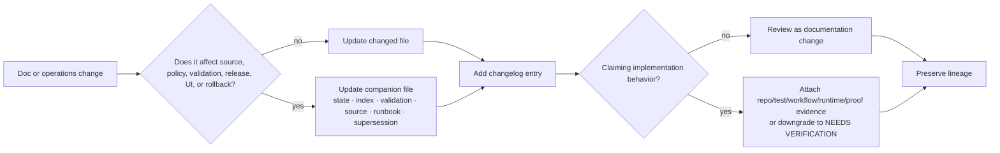

<!-- [KFM_META_BLOCK_V2]
doc_id: kfm://doc/TODO-register-agriculture-operations-changelog
title: Agriculture Operations Changelog
type: standard
version: v1
status: draft
owners: TODO-agriculture-domain-steward + TODO-documentation-steward
created: 2026-04-27
updated: 2026-05-06
policy_label: TODO-policy-label
related: [../README.md, ./PIPELINE_RUNBOOK.md, ../governance/STATE_OF_LANE.md, ../governance/FILE_INDEX.md, ../governance/SOURCE_COVERAGE_MATRIX.md, ../governance/SOURCE_REGISTRY.md, ../governance/VALIDATION_PLAN.md, ../governance/SUPERSESSION_MAP.md, ../architecture/DATA_CONTRACTS.md, ../architecture/EVIDENCE_AND_PROVENANCE.md, ../archive/README.md, ../../../adr/ADR-0001-schema-home.md, ../../../adr/ADR-0002-responsibility-root-monorepo.md, ../../../adr/ADR-0208-domain-lane-template.md]
tags: [kfm, agriculture, changelog, operations, governance, evidence-first, map-first, time-aware, auditability, rollback]
notes: [Created date follows the existing 2026-04-27 Agriculture changelog entry and adjacent companion-doc metadata; doc_id, owners, CODEOWNERS, policy_label, release/proof artifact linkage, and CI enforcement remain NEEDS VERIFICATION.]
[/KFM_META_BLOCK_V2] -->

<a id="top"></a>

# Agriculture Operations Changelog

*Track human-readable Agriculture lane documentation and operations changes without confusing changelog entries with release manifests, proof packs, receipts, or runtime evidence.*

<p align="center">
  <strong>Kansas Frontier Matrix · Agriculture lane</strong><br>
  Evidence-first · source-role-preserving · fixture-first · fail-closed · reversible
</p>

<p align="center">
  
  
  
  
  
</p>

<p align="center">
  <a href="#scope">Scope</a> ·
  <a href="#repo-fit">Repo fit</a> ·
  <a href="#accepted-inputs">Inputs</a> ·
  <a href="#exclusions">Exclusions</a> ·
  <a href="#change-semantics">Semantics</a> ·
  <a href="#change-entries">Entries</a> ·
  <a href="#review-checklist">Checklist</a> ·
  <a href="#appendix-a-entry-template">Template</a>
</p>

> [!IMPORTANT]
> This changelog records **human-readable documentation and operations history** for the Agriculture lane. It does **not** prove that sources are active, validators run in CI, release manifests exist, proof packs were emitted, MapLibre layers are live, or Focus Mode is integrated.
>
> Treat runtime, workflow, source-term, release, proof, dashboard, and deployment claims as **NEEDS VERIFICATION** unless a separate inspected artifact supports them.

---

## Scope

This file belongs to the Agriculture lane’s operations documentation. It records user-visible changes to Agriculture documentation, runbooks, governance posture, validation expectations, source-readiness notes, evidence/provenance guidance, and rollback/correction instructions.

It is intentionally narrower than a project release log. KFM release history belongs in governed release objects such as `ReleaseManifest`, `PromotionDecision`, proof packs, rollback cards, receipts, and catalog/provenance records after those homes are verified.

### What this changelog is for

| Records here | Example |
|---|---|
| Documentation package changes | Added, moved, or revised Agriculture governance, architecture, operations, or archive docs. |
| Operations guidance changes | Revised fixture-first runbook steps, incident playbooks, rollback drill expectations, or public-surface guardrails. |
| Source-readiness documentation changes | Changed source-family status text, blockers, source-role wording, or admission checklist guidance. |
| Validation guidance changes | Added negative fixture targets, fail-closed cases, catalog closure expectations, or no-raw-public checks. |
| Lineage and supersession changes | Marked older placeholders as superseded, archived a doc, or updated successor mappings. |
| Verification posture changes | Promoted or downgraded a claim between `CONFIRMED`, `PROPOSED`, `UNKNOWN`, and `NEEDS VERIFICATION`. |

[Back to top](#top)

---

## Repo fit

| Field | Value |
|---|---|
| Current file | `docs/domains/agriculture/operations/CHANGELOG.md` |
| Owning root | `docs/` — human-facing documentation control plane |
| Domain lane | `docs/domains/agriculture/` |
| Operations folder | `docs/domains/agriculture/operations/` |
| Upstream lane README | [`../README.md`](../README.md) |
| Operations runbook | [`PIPELINE_RUNBOOK.md`](PIPELINE_RUNBOOK.md) |
| Lane state snapshot | [`../governance/STATE_OF_LANE.md`](../governance/STATE_OF_LANE.md) |
| File index | [`../governance/FILE_INDEX.md`](../governance/FILE_INDEX.md) |
| Source coverage | [`../governance/SOURCE_COVERAGE_MATRIX.md`](../governance/SOURCE_COVERAGE_MATRIX.md) |
| Source registry guidance | [`../governance/SOURCE_REGISTRY.md`](../governance/SOURCE_REGISTRY.md) |
| Validation plan | [`../governance/VALIDATION_PLAN.md`](../governance/VALIDATION_PLAN.md) |
| Supersession map | [`../governance/SUPERSESSION_MAP.md`](../governance/SUPERSESSION_MAP.md) |
| Data contracts | [`../architecture/DATA_CONTRACTS.md`](../architecture/DATA_CONTRACTS.md) |
| Evidence/provenance guide | [`../architecture/EVIDENCE_AND_PROVENANCE.md`](../architecture/EVIDENCE_AND_PROVENANCE.md) |
| Archive rules | [`../archive/README.md`](../archive/README.md) |
| Schema-home ADR | [`../../../adr/ADR-0001-schema-home.md`](../../../adr/ADR-0001-schema-home.md) |
| Responsibility-root ADR | [`../../../adr/ADR-0002-responsibility-root-monorepo.md`](../../../adr/ADR-0002-responsibility-root-monorepo.md) |
| Domain-lane template ADR | [`../../../adr/ADR-0208-domain-lane-template.md`](../../../adr/ADR-0208-domain-lane-template.md) |

> [!NOTE]
> Agriculture remains a domain lane under `docs/domains/agriculture/`. Do not create a root-level `agriculture/` folder to make changelog or operations work easier.

[Back to top](#top)

---

## Accepted inputs

This changelog accepts concise, reviewable entries for human-facing Agriculture lane changes.

| Accepted here | Required detail |
|---|---|
| Documentation changes | File path, change type, and reason. |
| Operations runbook changes | Run mode, lifecycle stage, incident class, rollback/correction impact, or verification effect. |
| Governance changes | Status label changed, owner placeholder changed, source family changed, or blocker added/removed. |
| Architecture explanation changes | Object family, schema-home caveat, EvidenceBundle/provenance burden, or public payload expectation. |
| Verification changes | What became `CONFIRMED`, `PROPOSED`, `UNKNOWN`, or `NEEDS VERIFICATION`, and why. |
| Supersession/archive changes | Old location, new successor, lineage preservation rule, and rollback note. |

[Back to top](#top)

---

## Exclusions

| Do not record as changelog authority | Belongs instead | Why |
|---|---|---|
| RAW source payloads | `data/raw/agriculture/` or repo-confirmed lifecycle home | Changelog prose is not immutable source capture. |
| WORK or QUARANTINE artifacts | `data/work/agriculture/`, `data/quarantine/agriculture/`, or repo-confirmed lifecycle home | Candidate and failed artifacts require receipts and reason codes. |
| Machine-readable source descriptors | `data/registry/agriculture/` or repo-confirmed source registry | Source activation must be machine-checkable and steward-reviewable. |
| JSON Schemas | ADR-confirmed schema home, currently proposed as `schemas/contracts/v1/` | Changelog entries cannot validate object shape. |
| Policy-as-code | `policy/` or repo-confirmed policy root | Rights, sensitivity, source-role, and promotion logic must be executable/testable. |
| Validator code | `tools/validators/`, `packages/`, `pipelines/`, or repo-confirmed implementation roots | This changelog may reference validators, not implement them. |
| Release manifests or proof packs | `release/`, `data/proofs/`, or repo-confirmed release/proof homes | Publication is a governed state transition, not a Markdown entry. |
| Run receipts | `data/receipts/` or repo-confirmed receipt home | Receipts are operational memory, not prose history. |
| CI logs and dashboard state | Workflow artifacts, dashboards, or runtime observability homes | Changelog can summarize verified outcomes but is not enforcement evidence. |
| Public API/UI runtime behavior | `apps/`, `packages/`, `ui/`, `web/`, workflow logs, or test artifacts | Runtime behavior requires implementation evidence. |

[Back to top](#top)

---

## Change semantics

Use changelog entries to preserve the Agriculture lane’s review trail. Prefer append, supersede, or correct with explicit lineage over silent overwrite.

### Entry labels

| Label | Use when |
|---|---|
| `Added` | A new doc, section, checklist, diagram, source family, fixture target, or operational expectation was introduced. |
| `Changed` | Existing guidance was clarified, reorganized, corrected, or made more specific. |
| `Deprecated` | A file, path, term, or guidance pattern should no longer be used but remains visible for lineage. |
| `Superseded` | A successor file or rule replaces older guidance. |
| `Fixed` | A broken link, stale path, contradictory phrase, formatting issue, or misleading claim was repaired. |
| `Verification` | A claim changed status because new repo evidence, source evidence, or review evidence was inspected. |
| `Deferred` | A planned source, validator, release, UI/API binding, or live operation remains intentionally unimplemented. |
| `Risk` | A governance, rights, sensitivity, source-role, schema-home, or public-surface risk was documented. |

### Truth labels

| Label | Meaning in this changelog |
|---|---|
| `CONFIRMED` | Verified from current repo files, inspected project documents, or current-session evidence. |
| `PROPOSED` | Planned or recommended, but not yet proven as current implementation. |
| `UNKNOWN` | Not verified strongly enough to claim. |
| `NEEDS VERIFICATION` | Checkable before use as implementation, release, policy, or source fact. |
| `DENY / ABSTAIN / ERROR` | System outcomes used by KFM gates and runtime envelopes, not rhetorical labels. |

> [!CAUTION]
> Do not use a changelog entry to upgrade implementation maturity. A note that “validation guidance was added” is not the same as “validators enforce this in CI.”

[Back to top](#top)

---

## Change flow



[Back to top](#top)

---

## Change entries

### 2026-05-06 — Changelog governance hardening

**Status:** `draft` documentation revision  
**Impact:** Agriculture operations documentation only; no source activation, runtime behavior, CI enforcement, release, proof, or public publication claimed.

#### Added

- Added `KFM_META_BLOCK_V2` metadata to make this changelog registerable and reviewable.
- Added explicit [scope](#scope), [repo fit](#repo-fit), [accepted inputs](#accepted-inputs), and [exclusions](#exclusions) so the changelog does not become a hidden release ledger or proof surface.
- Added change labels, truth labels, and a changelog [change flow](#change-flow) for consistent future entries.
- Added a maintainer [review checklist](#review-checklist) and appendix entry template.

#### Changed

- Reconciled the earlier flat Agriculture companion-doc list with the current responsibility-folder layout:
  - `governance/` for state, file index, source coverage, source registry, validation, and supersession.
  - `architecture/` for data contracts and evidence/provenance guidance.
  - `operations/` for runbook and changelog.
  - `archive/` for superseded Agriculture documentation handling.
- Clarified that changelog entries are not substitutes for:
  - `ReleaseManifest`,
  - `PromotionDecision`,
  - proof packs,
  - receipts,
  - source descriptors,
  - policy-as-code,
  - validator output,
  - CI logs,
  - runtime dashboards.

#### Verification

- `CONFIRMED`: Agriculture docs currently include a documentation control plane under `docs/domains/agriculture/`.
- `CONFIRMED`: This changelog path is part of the Agriculture operations folder.
- `NEEDS VERIFICATION`: owners, CODEOWNERS, policy label, schema-home acceptance, agriculture-specific machine descriptors, validator commands, CI enforcement, release/proof artifacts, and runtime/API/UI behavior.

#### Deferred

- Live source activation remains deferred.
- Public Agriculture release remains deferred.
- Agriculture-specific CI enforcement remains **NEEDS VERIFICATION**.
- MapLibre layer registry, Evidence Drawer payloads, and Focus Mode integration remain **UNKNOWN** unless separately verified from implementation evidence.

[Back to top](#top)

---

### 2026-04-27 — Agriculture companion documentation set

**Status:** documentation package added and indexed  
**Impact:** Agriculture lane documentation control plane; no runtime or release behavior claimed from this entry alone.

#### Added

Added the Agriculture documentation companion set, organized by responsibility:

| Responsibility | Path |
|---|---|
| Lane landing page | [`../README.md`](../README.md) |
| Current maturity snapshot | [`../governance/STATE_OF_LANE.md`](../governance/STATE_OF_LANE.md) |
| File inventory and maintenance index | [`../governance/FILE_INDEX.md`](../governance/FILE_INDEX.md) |
| Source-family readiness | [`../governance/SOURCE_COVERAGE_MATRIX.md`](../governance/SOURCE_COVERAGE_MATRIX.md) |
| Source admission guidance | [`../governance/SOURCE_REGISTRY.md`](../governance/SOURCE_REGISTRY.md) |
| Data contract guidance | [`../architecture/DATA_CONTRACTS.md`](../architecture/DATA_CONTRACTS.md) |
| Validation and fixture guidance | [`../governance/VALIDATION_PLAN.md`](../governance/VALIDATION_PLAN.md) |
| Evidence and provenance guidance | [`../architecture/EVIDENCE_AND_PROVENANCE.md`](../architecture/EVIDENCE_AND_PROVENANCE.md) |
| Pipeline operations runbook | [`PIPELINE_RUNBOOK.md`](PIPELINE_RUNBOOK.md) |
| Supersession map | [`../governance/SUPERSESSION_MAP.md`](../governance/SUPERSESSION_MAP.md) |
| Archive rules | [`../archive/README.md`](../archive/README.md) |

#### Changed

- Updated the Agriculture README’s quick-jump and directory-tree assumptions to reflect the implemented companion documentation set.
- Established the Agriculture documentation split between governance, architecture, operations, and archive surfaces.

#### Verification

- `CONFIRMED as documentation`: Agriculture companion files are intended to support source-role discipline, fixture-first validation, EvidenceBundle/provenance expectations, and rollback-aware operations.
- `NEEDS VERIFICATION`: machine schema home, validator implementation, policy-as-code, source descriptors, CI workflows, release manifests, proof packs, and runtime behavior.

[Back to top](#top)

---

## Review checklist

Before committing a change to this file:

- [ ] The entry names affected files with relative paths from `docs/domains/agriculture/operations/CHANGELOG.md`.
- [ ] The entry distinguishes documentation changes from implementation or release behavior.
- [ ] Any `CONFIRMED` implementation claim is backed by inspected repo evidence, tests, workflows, runtime logs, generated artifacts, or proof objects.
- [ ] Any unverified implementation, source, owner, policy, CI, release, API, UI, dashboard, or runtime claim is marked `UNKNOWN` or `NEEDS VERIFICATION`.
- [ ] `../governance/FILE_INDEX.md` still lists this changelog accurately.
- [ ] `../governance/STATE_OF_LANE.md` is updated if maturity, blockers, or next actions changed.
- [ ] `../governance/SUPERSESSION_MAP.md` is updated if a file moved, was renamed, was archived, or replaced older guidance.
- [ ] `PIPELINE_RUNBOOK.md` is updated if operations, incident response, rollback, or publication steps changed.
- [ ] `../governance/SOURCE_COVERAGE_MATRIX.md` and `../governance/SOURCE_REGISTRY.md` are updated if source status, source-role treatment, or admission fields changed.
- [ ] `../governance/VALIDATION_PLAN.md` is updated if fixture or validator expectations changed.
- [ ] `../architecture/DATA_CONTRACTS.md` is updated if object-family or schema-home guidance changed.
- [ ] `../architecture/EVIDENCE_AND_PROVENANCE.md` is updated if EvidenceBundle, catalog, provenance, release, correction, or rollback burden changed.
- [ ] No entry treats generated text, map tiles, search indexes, dashboards, embeddings, PMTiles, graph projections, summaries, or UI payloads as sovereign truth.
- [ ] No entry implies public release without validation, policy, review, release manifest, correction path, and rollback target.

[Back to top](#top)

---

## Appendix A — Entry template

<details>
<summary>Copy/paste template for a future changelog entry</summary>

```markdown
### YYYY-MM-DD — Short change title

**Status:** draft | review | published | NEEDS VERIFICATION  
**Impact:** documentation only | validation guidance | source posture | operations | release support | runtime support

#### Added

- ...

#### Changed

- ...

#### Fixed

- ...

#### Deprecated / Superseded

- ...

#### Verification

- `CONFIRMED`: ...
- `PROPOSED`: ...
- `UNKNOWN`: ...
- `NEEDS VERIFICATION`: ...

#### Deferred

- ...

#### Review notes

- Companion docs updated:
  - [ ] `../governance/STATE_OF_LANE.md`
  - [ ] `../governance/FILE_INDEX.md`
  - [ ] `../governance/SUPERSESSION_MAP.md`
  - [ ] `../governance/SOURCE_COVERAGE_MATRIX.md`
  - [ ] `../governance/SOURCE_REGISTRY.md`
  - [ ] `../governance/VALIDATION_PLAN.md`
  - [ ] `../architecture/DATA_CONTRACTS.md`
  - [ ] `../architecture/EVIDENCE_AND_PROVENANCE.md`
  - [ ] `PIPELINE_RUNBOOK.md`
```

</details>

[Back to top](#top)
