<!-- [KFM_META_BLOCK_V2]
doc_id: kfm://doc/TODO-register-agriculture-pipeline-runbook
title: Agriculture Pipeline Runbook
type: standard
version: v1
status: draft
owners: TODO-agriculture-domain-steward
created: 2026-04-27
updated: 2026-05-06
policy_label: TODO-policy-label
related: [../README.md, ../governance/STATE_OF_LANE.md, ../governance/FILE_INDEX.md, ../governance/SOURCE_REGISTRY.md, ../governance/SOURCE_COVERAGE_MATRIX.md, ../governance/VALIDATION_PLAN.md, ../architecture/DATA_CONTRACTS.md, ../architecture/EVIDENCE_AND_PROVENANCE.md, ./CHANGELOG.md, ../governance/SUPERSESSION_MAP.md, ../../../adr/ADR-0001-schema-home.md]
tags: [kfm, agriculture, pipeline-runbook, operations, evidence-first, fixture-first, fail-closed, rollback]
notes: [Expanded from the existing minimal fixture-first runbook; doc_id, owner, policy label, exact CI commands, validator script paths, source terms, and live-source enforcement remain NEEDS VERIFICATION.]
[/KFM_META_BLOCK_V2] -->

<a id="top"></a>

# Agriculture Pipeline Runbook

*Operate the KFM agriculture lane through fixture-first, evidence-bound, fail-closed pipeline steps from source admission to rollback.*

<p>
  
  
  
  
  
</p>

> [!IMPORTANT]
> **Status:** draft  
> **Owners:** `TODO-agriculture-domain-steward`  
> **Path:** `docs/domains/agriculture/operations/PIPELINE_RUNBOOK.md`  
> **Role:** human-facing operations runbook; not source data, not policy-as-code, not machine schema authority  
> **Quick jumps:** [Operating posture](#operating-posture) · [Repo fit](#repo-fit) · [Accepted inputs](#accepted-inputs) · [Exclusions](#exclusions) · [Triggers](#triggers) · [Prerequisites](#prerequisites) · [Run modes](#run-modes) · [Lifecycle sequence](#lifecycle-sequence) · [Validation gates](#validation-gates) · [Incident response](#incident-response) · [Rollback and correction](#rollback-and-correction) · [Verification checklist](#verification-checklist) · [Appendix](#appendix-a-illustrative-command-sheet)

> [!WARNING]
> Command names, validator paths, workflow names, package manager behavior, live source activation, and CI enforcement are **NEEDS VERIFICATION**. Treat code blocks in this runbook as operational sketches until they are replaced by repo-native commands and backed by tests or workflow artifacts.

---

## Operating posture

Agriculture pipelines in KFM move source-backed agricultural context toward public-safe claims without collapsing source roles, precision, time, rights, or evidence support.

The agriculture lane must preserve the difference between:

- authoritative soil survey context,
- station observations,
- satellite or gridded remote-sensing products,
- aggregate crop statistics,
- derived indicators,
- released layers,
- public API responses,
- Evidence Drawer payloads,
- Focus Mode answers.

The pipeline law is:

```text
SOURCE EDGE -> RAW -> WORK / QUARANTINE -> PROCESSED -> CATALOG / TRIPLET -> PUBLISHED
```

Promotion is a governed state transition, not a file move. Public clients consume governed APIs, released artifacts, layer manifests, and resolved `EvidenceBundle` support only.

### Truth labels used here

| Label | Meaning in this runbook |
|---|---|
| **CONFIRMED** | Verified from current repo files, current workspace inspection, or attached KFM doctrine inspected for this revision. |
| **PROPOSED** | Operational design or command/path expectation that fits KFM doctrine but is not yet proven as executable behavior. |
| **UNKNOWN** | Not verified because runtime logs, CI artifacts, dashboards, workflow execution, source terms, or live pipeline output were not inspected. |
| **NEEDS VERIFICATION** | Checkable before use as implementation fact. |
| **DENY / ABSTAIN / ERROR** | System outcomes, not prose style. Use them when evidence, policy, or runtime state blocks a safe answer or release. |

[Back to top](#top)

---

## Repo fit

| Relationship | Relative path | Status | Operational role |
|---|---|---:|---|
| Agriculture landing page | [../README.md](../README.md) | **CONFIRMED in repo** | Lane scope, lifecycle posture, source-role guardrails. |
| Lane state snapshot | [../governance/STATE_OF_LANE.md](../governance/STATE_OF_LANE.md) | **CONFIRMED in repo** | Current gaps and next actions. |
| File index | [../governance/FILE_INDEX.md](../governance/FILE_INDEX.md) | **CONFIRMED in repo** | Places this runbook in the agriculture documentation set. |
| Source registry guidance | [../governance/SOURCE_REGISTRY.md](../governance/SOURCE_REGISTRY.md) | **CONFIRMED in repo** | Required source descriptor fields and admission checklist. |
| Source coverage matrix | [../governance/SOURCE_COVERAGE_MATRIX.md](../governance/SOURCE_COVERAGE_MATRIX.md) | **CONFIRMED in repo** | Source-family readiness and release defaults. |
| Validation plan | [../governance/VALIDATION_PLAN.md](../governance/VALIDATION_PLAN.md) | **CONFIRMED in repo** | Validation classes, fixtures, and CI expectations. |
| Data contract map | [../architecture/DATA_CONTRACTS.md](../architecture/DATA_CONTRACTS.md) | **CONFIRMED in repo** | Object families, identity, schema-home posture, publication contracts. |
| Evidence/provenance guide | [../architecture/EVIDENCE_AND_PROVENANCE.md](../architecture/EVIDENCE_AND_PROVENANCE.md) | **CONFIRMED in repo** | EvidenceBundle and provenance expectations. |
| Operations changelog | [./CHANGELOG.md](./CHANGELOG.md) | **CONFIRMED in repo** | Human-readable operational/doc evolution. |
| Supersession map | [../governance/SUPERSESSION_MAP.md](../governance/SUPERSESSION_MAP.md) | **CONFIRMED in repo** | Maps placeholder intent to current companion docs. |
| Schema-home ADR | [../../../adr/ADR-0001-schema-home.md](../../../adr/ADR-0001-schema-home.md) | **CONFIRMED draft ADR** | Schema-home proposal; acceptance/enforcement still **NEEDS VERIFICATION**. |
| Soil lane | [../../soil/README.md](../../soil/README.md) | **CONFIRMED in linked repo docs** | Agriculture consumes soil context without forking soil authority. |
| Data registry | [../../../../data/registry/README.md](../../../../data/registry/README.md) | **CONFIRMED in linked repo docs** | Source admission and registry-backed publication readiness. |

> [!NOTE]
> Some companion summaries refer to `PIPELINE_RUNBOOK.md` by filename only. The current repo path for this file is `docs/domains/agriculture/operations/PIPELINE_RUNBOOK.md`; preserve this location unless a migration note and supersession record say otherwise.

[Back to top](#top)

---

## Accepted inputs

This file accepts human-facing operational guidance for the agriculture pipeline.

| Accepted here | Examples | Gate |
|---|---|---|
| Pipeline trigger guidance | Source descriptor update, fixture run, validation failure, promotion dry-run, rollback drill. | Must identify evidence, policy, and lifecycle stage. |
| Stage-level operator steps | Discover, fetch, normalize, validate, catalog, promote, publish, rollback. | Must preserve fail-closed behavior. |
| Incident playbooks | Malformed payload, missing rights, aggregate misuse, stale evidence, catalog closure failure. | Must name system outcome and recovery path. |
| Verification checklists | Read-only repo inventory, fixture gates, no-raw-public checks, release closure. | Must be testable or marked **NEEDS VERIFICATION**. |
| Public-surface guardrails | Layer manifests, Evidence Drawer payloads, Focus Mode finite outcomes. | Must remain downstream of released evidence. |
| Rollback/correction drills | Release alias reversal, correction notice, rollback card, validation artifact. | Must preserve lineage. |

[Back to top](#top)

---

## Exclusions

| Does not belong here | Belongs instead | Reason |
|---|---|---|
| RAW source payloads | `data/raw/agriculture/` or repo-confirmed lifecycle home | RAW is immutable source capture, not documentation. |
| WORK candidates | `data/work/agriculture/` or repo-confirmed lifecycle home | WORK may contain unreviewed or failed candidates. |
| QUARANTINE artifacts | `data/quarantine/agriculture/` or repo-confirmed lifecycle home | Quarantine needs reason-coded receipts, not prose. |
| Machine schemas | `schemas/contracts/v1/...` after ADR resolution | This runbook explains operations; it is not schema authority. |
| Policy-as-code | `policy/` or repo-confirmed policy root | Deny/allow/restrict logic must be executable and testable. |
| Source descriptor YAML/JSON | `data/registry/...` or repo-confirmed source registry | Registry state must be machine-readable and steward-reviewable. |
| Validator implementation | `tools/validators/...`, `pipelines/...`, `packages/...`, or repo-native equivalent | This runbook may point to validators, not replace them. |
| Live credentials, API keys, private farm data, or proprietary operator records | Restricted secret/source management after policy approval | Agriculture public outputs must deny private or business-sensitive data by default. |
| Public exact sensitive locations | Published only after policy-approved generalization/redaction and transform receipts | Precision is a governed publication decision. |

[Back to top](#top)

---

## Triggers

Use this runbook when one of the following events occurs.

| Trigger | Required first action | Default outcome until checks pass |
|---|---|---|
| New agriculture source proposed | Create or update a `SourceDescriptor` candidate and source admission checklist. | **DENY** live activation. |
| Source descriptor changed | Re-run source-role, rights, sensitivity, cadence, and stable-key checks. | **ABSTAIN** from release claims until revalidated. |
| Fixture added or changed | Run no-network fixture validation and negative tests. | **ERROR** if expected failures do not fail. |
| RAW payload fetched | Record immutable raw ref, digest, source snapshot, and fetch receipt. | **QUARANTINE** malformed or unsupported payloads. |
| Normalizer changed | Re-run schema, unit/depth, temporal, CRS, stable-key, and record-hash checks. | **ERROR** on unsupported mutation or missing receipt. |
| Catalog candidate emitted | Verify STAC/DCAT/PROV/CatalogMatrix closure and EvidenceBundle resolution. | **DENY** promotion on any open catalog edge. |
| Public layer or API candidate emitted | Check no RAW/WORK/QUARANTINE/internal receipt references. | **DENY** public publication if internal-stage paths leak. |
| Focus Mode or Evidence Drawer payload changed | Validate evidence refs, source role, support class, policy state, and finite outcome. | **ABSTAIN** or **DENY** unsupported claims. |
| Release candidate promoted | Confirm proof pack, release manifest, rollback card, review state, and policy decision. | **ERROR** if release is just a copy or file move. |
| Correction or rollback requested | Locate release manifest, rollback card, affected EvidenceBundles, and correction notice. | **DENY** silent overwrite or history deletion. |

[Back to top](#top)

---

## Prerequisites

Before any agriculture pipeline run moves beyond fixture-only mode, confirm:

- [ ] Current branch and dirty state have been recorded.
- [ ] Source family status is checked in [SOURCE_COVERAGE_MATRIX.md](../governance/SOURCE_COVERAGE_MATRIX.md).
- [ ] Source descriptor contains required fields from [SOURCE_REGISTRY.md](../governance/SOURCE_REGISTRY.md).
- [ ] Schema-home decision is verified against the current status of [ADR-0001](../../../adr/ADR-0001-schema-home.md).
- [ ] Valid and invalid fixtures exist for the source family.
- [ ] Rights, terms, redistribution class, citation requirements, and sensitivity are explicit.
- [ ] Stable keys and timestamp semantics are known.
- [ ] Unit, depth, CRS, QC, product version, mask, or aggregate scope requirements are known where applicable.
- [ ] Validators run with no live network dependency in PR mode.
- [ ] Failure modes emit reason-coded results.
- [ ] Catalog/provenance closure can be checked before promotion.
- [ ] `EvidenceBundle` support is resolvable before public explanation.
- [ ] `ReleaseManifest` and rollback target exist before publication.
- [ ] CODEOWNERS/steward review requirements are verified for policy-significant changes.

> [!CAUTION]
> Missing rights, missing sensitivity, ambiguous source role, unknown source terms, stale evidence, unsupported precision, unresolved EvidenceBundle, or missing rollback target blocks promotion.

[Back to top](#top)

---

## Run modes

| Mode | Use when | Network allowed? | May publish? | Required outcome |
|---|---|---:|---:|---|
| `fixture-dry-run` | PR validation, schema/validator/policy changes, first source admission. | No | No | `ValidationReport` with valid/invalid fixture results. |
| `source-discovery` | Source descriptor or source terms need review. | No by default | No | Source admission decision: planned, approved, active, blocked, or **NEEDS VERIFICATION**. |
| `live-candidate` | Source is approved and operational use is authorized. | Yes, if approved | No | RAW capture receipt, WORK candidate, validation report, quarantine or processed candidate. |
| `catalog-dry-run` | Processed candidate is ready for catalog/evidence closure. | No by default | No | CatalogMatrix candidate, provenance refs, EvidenceBundle candidate. |
| `promotion-dry-run` | Release candidate needs gate evaluation. | No | No | `PromotionDecision` with allow/deny/abstain/error, reason codes, obligations. |
| `publish-release` | Steward/policy/release review has passed. | No by default | Yes | `ReleaseManifest`, proof pack refs, rollback card, published aliases. |
| `rollback-drill` | Testing reversibility or responding to release defect. | No | Changes current alias only when approved | Rollback receipt, correction/supersession note, updated release/correction state. |

[Back to top](#top)

---

## Lifecycle sequence

```mermaid
flowchart LR
    SD[SourceDescriptor<br/>identity · role · rights · sensitivity · cadence] --> DISCOVER[DISCOVER<br/>admission review]
    DISCOVER --> RAW[FETCH_RAW<br/>immutable raw_ref · digest · fetch receipt]
    RAW --> WORK[NORMALIZE_WORK<br/>UTC · units · depth · CRS · QC · stable keys]
    WORK --> VALIDATE{VALIDATE<br/>schema · role · rights · temporal · unit · geo}
    VALIDATE -- fail --> Q[QUARANTINE<br/>reason-coded receipt]
    VALIDATE -- pass --> PROCESSED[PROCESSED<br/>candidate artifacts]
    PROCESSED --> CATALOG[CATALOG / TRIPLET<br/>STAC · DCAT · PROV · CatalogMatrix]
    CATALOG --> EVIDENCE[EvidenceBundle<br/>support · policy · review · uncertainty]
    EVIDENCE --> PROMOTE{PROMOTION GATE}
    PROMOTE -- deny / abstain / error --> DECISION[DecisionEnvelope<br/>reason codes · obligations]
    PROMOTE -- allow --> RELEASE[ReleaseManifest<br/>proof refs · rollback card]
    RELEASE --> PUBLISHED[PUBLISHED<br/>released artifacts only]
    PUBLISHED --> API[Governed API]
    API --> UI[MapLibre layer<br/>Evidence Drawer<br/>Focus Mode]
```



### Stage responsibilities

| Stage | Operator action | Required objects | Fail-closed behavior |
|---|---|---|---|
| DISCOVER | Verify source identity, steward, source role, rights, sensitivity, cadence, stable keys, and intended claim scope. | `SourceDescriptor`, source review note, source coverage update. | **DENY** source activation if required fields are missing. |
| FETCH_RAW | Capture source-native payload without mutation; record digest, retrieval time, and source snapshot. | raw ref, source digest, fetch/run receipt. | **ERROR** on unsupported fetch; **QUARANTINE** malformed payload. |
| NORMALIZE_WORK | Normalize to canonical shape while preserving source keys, original timestamps, units, depth, CRS, QC flags, masks, and caveats. | WORK candidate, transform receipt, record/content/geometry hashes. | **QUARANTINE** if stable keys or semantics are lost. |
| VALIDATE | Run schema, source-role, rights/sensitivity, temporal, unit/depth, geospatial, aggregate-misuse, and catalog-precheck validators. | `ValidationReport`, policy decision candidate. | **DENY** release; **ERROR** if expected negative fixtures pass. |
| PROCESS | Emit processed candidate only from validated WORK. | dataset version, processed artifact refs, receipts. | **ERROR** if candidate bypasses validation. |
| CATALOG / TRIPLET | Emit catalog/provenance/graph candidates and link EvidenceRefs. | STAC/DCAT/PROV refs, `CatalogMatrix`, `EvidenceBundle` candidate. | **DENY** promotion on catalog closure failure. |
| PROMOTION | Evaluate evidence, rights, sensitivity, validation, catalog, policy, review, release, and rollback readiness. | `PromotionDecision`, `DecisionEnvelope`, proof refs. | **DENY / ABSTAIN / ERROR** with reason codes. |
| PUBLISH | Materialize released artifacts and public aliases only after promotion. | `ReleaseManifest`, proof pack refs, rollback card, published refs. | **ERROR** if publication is a file copy without governed decision. |
| SERVE | Expose only released artifacts through governed API, layer manifests, Evidence Drawer, and Focus Mode. | public DTOs, layer manifest, Evidence Drawer payload, Focus payload. | **DENY** direct RAW/WORK/QUARANTINE/internal-store access. |
| CORRECT / ROLLBACK | Supersede, withdraw, or repoint release aliases while preserving lineage. | `CorrectionNotice`, rollback receipt, updated release refs. | **ERROR** if history is overwritten or rollback target is absent. |

[Back to top](#top)

---

## Source-family playbooks

The current source status belongs in [SOURCE_COVERAGE_MATRIX.md](../governance/SOURCE_COVERAGE_MATRIX.md). This section gives operator handling rules; it is not the canonical readiness matrix.

| Source family | Operational handling | Never do this |
|---|---|---|
| SSURGO / SDA | Preserve MUKEY and source table/version. Coordinate with the Soil lane before treating soil context as agriculture-derived meaning. | Do not replace authoritative vector/tabular soil context with a gridded companion silently. |
| gSSURGO | Label as gridded soil companion context. Preserve product/version and grid support. | Do not promote as independent soil authority. |
| Kansas Mesonet | Preserve station ID, depth, variable, unit, QC flag, source timestamp, and normalized UTC time. | Do not turn a station observation into field-level or statewide truth without a declared transform. |
| NRCS SCAN / NOAA USCRN | Use as station corroboration only after source mapping, QC semantics, and units are normalized. | Do not merge with Mesonet as if station networks share identical semantics. |
| NASA SMAP | Treat as satellite/grid soil moisture context with product ID/version, grid support, and time window. | Do not describe as station, parcel, operator, or field-level ground truth. |
| NASA HLS / HLS-VI | Preserve STAC item, asset refs, mask/cloud quality metadata, product version, and time window. | Do not publish stress/vegetation conclusions without masks, provenance, and algorithm version. |
| USDA NASS QuickStats / Crop Progress | Treat as aggregate official agricultural context by geography, commodity, statistic, unit, period. | Never present as parcel, operator, or field-level truth. |
| Private/proprietary farm data | Block until a restricted-data lane, consent/authorization, steward review, and policy gates exist. | Do not publicize or fixture real private farm/operator/yield/pesticide records by default. |

[Back to top](#top)

---

## Validation gates

Validation is fixture-first and fail-closed. The minimum fixture set is owned by [VALIDATION_PLAN.md](../governance/VALIDATION_PLAN.md).

| Gate | Proves | Expected negative case |
|---|---|---|
| Schema validation | Required fields, enum values, object shape, version compatibility. | Missing identity, source role, schema version, or evidence ref. |
| Source-role validation | Claim type matches source role and support. | Aggregate statistic used as field-level claim. |
| Rights/sensitivity validation | Rights, terms, redistribution class, citation, and sensitivity are explicit. | Missing rights or missing sensitivity. |
| Temporal validation | Observed, valid, retrieved, release, and correction times are not collapsed where material. | Stale or missing timestamp used as current claim. |
| Unit/depth validation | Station variables preserve original and normalized unit/depth context. | Soil moisture reading without depth or unit normalization. |
| Geospatial validation | CRS, geometry validity, precision class, spatial support, and transform provenance are explicit. | Public layer uses unsupported exact precision. |
| Remote-sensing lineage validation | Product/version, grid, assets, masks, quality bands, and time windows exist. | HLS/SMAP-derived object missing product version or masks. |
| Derived-indicator validation | Inputs, algorithm/version, parameters, uncertainty, and receipt exist. | Stress indicator without input refs or processing receipt. |
| Catalog closure validation | Public claim resolves to EvidenceBundle, catalog refs, release refs, and digests. | Release candidate with mismatched catalog or artifact digest. |
| Public path safety | Public layer/API/Focus/Drawer payloads contain no RAW, WORK, QUARANTINE, or internal receipt paths. | Public payload references `data/raw/`, `data/work/`, or `data/quarantine/`. |
| Rollback readiness | Published release has rollback card and correction path. | Release manifest without rollback target. |

### Required decision outcomes

| Outcome | Use when | Required content |
|---|---|---|
| `ANSWER` | Evidence, policy, and scope support the claim or operation. | Evidence refs, scope, policy label, release state, caveats. |
| `ABSTAIN` | Evidence is missing, stale, ambiguous, or insufficient for requested scope. | Reason code, narrowed scope if available, evidence gap. |
| `DENY` | Policy, rights, sensitivity, source role, or release state blocks exposure. | Reason code, obligation, reviewer or policy ref where applicable. |
| `ERROR` | Validation, catalog, schema, runtime, or integrity failure prevents a reliable decision. | Failure class, artifact/run refs, recovery task. |

[Back to top](#top)

---

## Evidence and publication rules

A release candidate is not publishable until its public claims and artifacts can be inspected.

### EvidenceBundle requirements

Every consequential public layer, API response, Evidence Drawer payload, export, or Focus Mode answer must resolve a bundle with:

- claim target and claim scope: spatial, temporal, semantic;
- supporting evidence refs and source roles;
- policy outcome and review status;
- uncertainty or limitation statement;
- generation metadata: run ID, contract version, policy version;
- release/correction state when public.

### Catalog closure requirements

A publishable agriculture candidate should have closure across:

| Surface | Required check |
|---|---|
| STAC | Item/asset refs, asset digest, spatial/temporal extent, product metadata where applicable. |
| DCAT | Dataset/distribution identity, checksum, license/rights, publisher/steward metadata. |
| PROV | Entity/activity/agent lineage, input refs, processing run, generated outputs. |
| CatalogMatrix | Cross-surface digest agreement and closure status. |
| ReleaseManifest | Artifacts, digests, policy label, release state, rollback target. |
| Proof pack | Release-grade evidence and validation support. |
| Correction/Rollback | Correction notice and rollback card available before public promotion. |

### Public-surface rules

- Public API/UI surfaces must not read RAW, WORK, QUARANTINE, unpublished candidates, canonical internal stores, direct source-system side effects, or direct model runtime output.
- Public layer manifests must point to released artifacts only.
- Evidence Drawer payloads must expose source role and support class.
- Focus Mode must cite resolved evidence or return `ABSTAIN`, `DENY`, or `ERROR`.
- Derived products are rebuildable carriers, not sovereign truth.

[Back to top](#top)

---

## Incident response

| Incident | Immediate action | Required record | Recovery path |
|---|---|---|---|
| Malformed source payload | Stop normalization; quarantine payload. | Quarantine receipt with reason code, raw ref, source digest. | Fix parser or source descriptor; rerun fixture before live retry. |
| Missing rights or sensitivity | Block source activation and promotion. | `DecisionEnvelope` or source admission denial. | Steward review; update source descriptor; add negative fixture. |
| Source role ambiguity | Stop claim generation. | Source-role validation failure. | Clarify source role in registry and contracts; rerun source-role fixtures. |
| Aggregate-as-field misuse | Deny public claim. | Aggregate misuse validation report. | Narrow claim to aggregate geography/time or obtain proper field-level evidence. |
| Station-as-surface misuse | Deny or quarantine derived surface. | Unit/depth/geospatial/source-role failure. | Add transform contract, interpolation/model receipt, uncertainty, and review. |
| Remote-sensing lineage gap | Quarantine product candidate. | Product lineage validation failure. | Add product version, asset, mask, quality, CRS, and time-window metadata. |
| Stale evidence | Abstain or mark stale; do not answer as current. | Temporal validation report and stale-state reason. | Refresh source or narrow answer to historical state. |
| Catalog closure failure | Block promotion. | CatalogMatrix failure and unresolved refs. | Repair STAC/DCAT/PROV/release digest refs; rerun catalog validation. |
| EvidenceBundle resolution failure | Abstain or deny public explanation. | Evidence resolution report. | Rebuild EvidenceBundle candidate from validated refs. |
| Public internal-path leak | Block release immediately. | No-raw-public-path failure. | Replace with released artifact refs; add regression fixture. |
| Policy regression | Stop promotion and reopen review. | Policy test failure and affected release candidate. | Revert policy change or add reviewed exception with tests. |
| Missing rollback card | Block publication. | PromotionDecision denial. | Create rollback target and exercise rollback drill before release. |
| Published artifact defect | Freeze current release alias if needed; prepare correction/rollback. | CorrectionNotice candidate and rollback receipt. | Repoint alias to prior approved release or publish corrected superseding release. |

[Back to top](#top)

---

## Rollback and correction

Rollback is a governed operation. It restores a known good public state or withdraws a defective release without erasing lineage.

### Rollback drill

1. Identify affected `release_id`, layer ID, dataset version, EvidenceBundle refs, public alias, and correction scope.
2. Confirm the rollback card points to an approved prior release or a withdrawal state.
3. Freeze or disable the defective public alias when policy requires it.
4. Run catalog and public-path checks against the rollback target.
5. Emit rollback receipt and `CorrectionNotice` or supersession record.
6. Repoint public alias only after review if the release is policy-significant.
7. Verify Evidence Drawer and Focus Mode now resolve the corrected or prior release.
8. Update [CHANGELOG.md](./CHANGELOG.md), [STATE_OF_LANE.md](../governance/STATE_OF_LANE.md), and [SUPERSESSION_MAP.md](../governance/SUPERSESSION_MAP.md) if documentation lineage changed.
9. Preserve defective release artifacts, receipts, and proof refs as lineage unless policy requires restricted access.

### Correction classes

| Class | Use when | Public behavior |
|---|---|---|
| `supersede` | New evidence, improved transform, or corrected derived artifact replaces a prior release. | Show replacement ref and effective time. |
| `withdraw` | Release should no longer be used publicly. | Hide or mark withdrawn; preserve explanation. |
| `rollback` | Alias returns to prior approved release. | Show rollback reason and prior/current release refs. |
| `narrow_scope` | Claim remains valid only under narrower spatial/temporal/semantic scope. | Update scope and require EvidenceBundle refresh. |
| `policy_restrict` | Rights, sensitivity, or steward review changes exposure class. | Restrict or deny public access; record policy reason. |

[Back to top](#top)

---

## Verification checklist

Run this checklist before changing source activation, validators, public layer manifests, Evidence Drawer payloads, Focus Mode behavior, release manifests, or rollback cards.

### Phase 0 repo check

- [ ] Current branch recorded.
- [ ] Dirty state recorded.
- [ ] Target file path confirmed.
- [ ] Related agriculture docs still exist at linked paths.
- [ ] Schema-home ADR status checked.
- [ ] Package manager and test runner checked.
- [ ] Policy tooling checked.
- [ ] Workflow names checked.
- [ ] CODEOWNERS/stewards checked.

### Source admission

- [ ] `source_id` is immutable and unique.
- [ ] `source_name`, owner, and steward are explicit.
- [ ] `source_role` is one of the accepted source-role values or reviewed extension.
- [ ] Rights, redistribution constraints, and citation requirements are explicit.
- [ ] Sensitivity is `public`, `review_required`, or `restricted`.
- [ ] Spatial support and precision class are explicit.
- [ ] Temporal support and staleness rule are explicit.
- [ ] Stable keys survive normalization.
- [ ] Ingest mode and activation state are explicit.
- [ ] Negative fixtures exist before live activation.

### Pipeline run

- [ ] RAW payload has immutable ref and digest.
- [ ] WORK candidate preserves source keys, timestamps, units, depth, CRS, QC, product version, masks, and caveats where material.
- [ ] Validation report includes schema, source-role, rights/sensitivity, temporal, unit/depth, geospatial, aggregate-misuse, and catalog checks.
- [ ] Failures go to QUARANTINE with reason-coded receipt.
- [ ] Processed candidates are produced only from validated WORK.
- [ ] Catalog/provenance objects close.
- [ ] EvidenceBundle resolves before public explanation.
- [ ] PromotionDecision has finite outcome.
- [ ] ReleaseManifest includes artifact digests and rollback target.
- [ ] Public API/layer/Drawer/Focus payloads contain no internal lifecycle paths.

### Review and release

- [ ] Domain steward review is recorded.
- [ ] Policy reviewer is involved for rights/sensitivity/public precision changes.
- [ ] Contract/schema reviewer is involved for object meaning or shape changes.
- [ ] UI/shell reviewer is involved for public payload or layer behavior changes.
- [ ] Changelog updated.
- [ ] State of lane updated.
- [ ] Supersession map updated when lineage changes.
- [ ] Rollback drill passed for the release candidate.

[Back to top](#top)

---

## Appendix A — Illustrative command sheet

> [!IMPORTANT]
> These commands are examples only. Replace them with repo-native commands after verifying the package manager, validator framework, policy engine, workflow names, and fixture paths.

<details>
<summary>Phase 0 read-only inventory</summary>

```bash
pwd
git status --short
git branch --show-current || true

find docs/domains/agriculture -maxdepth 4 -type f 2>/dev/null | sort

find docs contracts schemas policy tools tests fixtures apps packages pipelines pipeline_specs data release .github \
  -maxdepth 5 -type f 2>/dev/null \
  | grep -Ei 'agriculture|agri|crop|nass|mesonet|ssurgo|sda|soil_moisture|smap|hls|EvidenceBundle|DecisionEnvelope|PromotionDecision|ReleaseManifest|CatalogMatrix|SourceDescriptor' \
  | sort \
  | head -500 || true
```

</details>

<details>
<summary>Fixture-only validation sketch</summary>

```bash
# NEEDS VERIFICATION — replace with repo-native command.
python -m pytest tests/agriculture -q

# NEEDS VERIFICATION — examples only.
python tools/validators/agriculture/validate_source_registry.py \
  data/registry/agriculture/sources.yaml

python tools/validators/agriculture/validate_manifest.py \
  tests/agriculture/fixtures/agriculture_dataset_manifest_sample.json

python tools/validators/agriculture/validate_catalog_closure.py \
  tests/agriculture/fixtures/catalog_matrix_pass.json
```

</details>

<details>
<summary>Policy sketch</summary>

```bash
# NEEDS VERIFICATION — only after OPA/Conftest or repo-native policy tooling is installed and pinned.
conftest test tests/agriculture/fixtures/policy_cases -p policy/agriculture
opa test policy/agriculture
```

</details>

<details>
<summary>Release dry-run sketch</summary>

```bash
# NEEDS VERIFICATION — illustrative release gate names only.
python tools/validators/agriculture/validate_release_candidate.py \
  --candidate data/processed/agriculture/release_candidates/example.json \
  --catalog-matrix data/catalog/agriculture/catalog_matrix/example.json \
  --evidence-bundle data/catalog/agriculture/evidence/example.json \
  --policy policy/agriculture \
  --dry-run
```

Expected dry-run result shape:

```json
{
  "outcome": "DENY",
  "release_candidate": "kfm://release-candidate/agriculture/example",
  "reason_codes": [
    "rollback_card_missing",
    "source_terms_needs_verification"
  ],
  "obligations": [
    "attach_rollback_card",
    "complete_source_rights_review"
  ],
  "published": false
}
```

</details>

[Back to top](#top)

---

## Appendix B — Minimum emitted object checklist

<details>
<summary>Object families to confirm before public release</summary>

| Object | Required before release? | Notes |
|---|---:|---|
| `SourceDescriptor` | Yes | Identity, role, rights, sensitivity, cadence, stable keys, activation state. |
| `FetchReceipt` / `RunReceipt` | Yes | Process memory; not proof by itself. |
| `ValidationReport` | Yes | Must include negative-fixture coverage where relevant. |
| `DatasetVersion` | Yes | Versioned candidate or released dataset identity. |
| `EvidenceRef` | Yes | Claims/layers must point to resolvable evidence. |
| `EvidenceBundle` | Yes | Support package for public claim or layer. |
| `PolicyDecision` / `DecisionEnvelope` | Yes | Finite outcome and reason codes. |
| `CatalogMatrix` | Yes | STAC/DCAT/PROV/release digest closure. |
| `PromotionDecision` | Yes | Governed state transition record. |
| `ReleaseManifest` | Yes | Released artifact identity, digests, refs, policy label. |
| `ProofPack` refs | Yes | Release-grade support; separate from receipts. |
| `RollbackCard` | Yes | Required before publication. |
| `CorrectionNotice` | Required on correction/supersession | Preserves public lineage. |
| `AgricultureLayerManifest` | Required for public map layer | Must point to released artifacts only. |
| `AgricultureEvidenceDrawerPayload` | Required for public inspected layer/feature | Must show source role, support class, policy, freshness. |
| `AgricultureFocusPayload` | Required for Focus Mode integration | Must cite or abstain and respect policy. |

</details>

[Back to top](#top)

---

## Appendix C — Anti-collapse quick reference

<details>
<summary>Use during reviews</summary>

| If a claim says… | Check… | Default if unsupported |
|---|---|---|
| “This field is dry.” | Is there field-level evidence and authorization, or only station/grid/aggregate context? | **ABSTAIN** or **DENY** |
| “County crop condition is X.” | Does NASS/aggregate source support the geography, week/year, statistic, and unit? | **ABSTAIN** |
| “Station reading applies to this polygon.” | Is there a declared interpolation/model transform and uncertainty statement? | **DENY** |
| “Satellite product shows stress.” | Are product version, masks, time window, algorithm, and evidence refs present? | **ABSTAIN** |
| “Layer is current.” | Is source time, retrieval time, release time, and staleness rule present? | **ABSTAIN** or stale badge |
| “AI summary says…” | Does Focus Mode cite released EvidenceBundle support? | **ABSTAIN** |
| “Release can go public.” | Are rights, sensitivity, validation, catalog closure, proof, review, and rollback complete? | **DENY** |
| “Rollback is possible.” | Is rollback card present and tested against a prior approved release? | **ERROR** |

</details>

[Back to top](#top)
