<!-- [KFM_META_BLOCK_V2]
doc_id: kfm://doc/<TODO-uuid>
title: Agriculture · Policy
type: readme
subtype: domain-aspect-index
version: v0.1 (draft)
status: draft
contract_version: "3.0.0"
domain: agriculture
aspect: policy
owners: <TODO: Docs steward + Policy steward + Agriculture domain steward + Sensitivity reviewer (per ai-build-operating-contract.md §0 reviewer pattern)>
created: 2026-05-26
updated: 2026-05-26
policy_label: public
related:
  - docs/doctrine/ai-build-operating-contract.md
  - docs/doctrine/directory-rules.md
  - docs/doctrine/trust-membrane.md
  - docs/doctrine/policy-aware.md
  - docs/doctrine/lifecycle-law.md
  - docs/doctrine/evidence-first.md
  - docs/doctrine/authority-ladder.md
  - docs/domains/agriculture/README.md
  - docs/domains/agriculture/architecture/README.md
  - policy/domains/agriculture/
  - policy/sensitivity/agriculture/
  - policy/release/agriculture/
  - schemas/contracts/v1/domains/agriculture/
  - contracts/domains/agriculture/
tags: [kfm, docs-index, domain, agriculture, policy, sensitivity, aggregation-receipt, fail-closed]
notes:
  - Docs **explain** policy for the agriculture domain; canonical machine policy artifacts live under `policy/` per Directory Rules §6.5.
  - Aspect pattern `docs/domains/<domain>/<aspect>/README.md` follows the sibling `docs/domains/flora/architecture/README.md` work and is PROPOSED — open question OQ-AG-POL-01.
  - Pinned to `CONTRACT_VERSION = "3.0.0"` per `ai-build-operating-contract.md` §0 / §37.
  - All concrete paths under `policy/`, `schemas/`, `contracts/`, `data/`, `tests/`, and `.github/workflows/` are PROPOSED until verified against the live repository.
[/KFM_META_BLOCK_V2] -->

# Agriculture · Policy

> **Where the rights, sensitivity, source-role, aggregation, and release rules for KFM's agriculture domain are explained — and where the canonical machine policy artifacts that enforce them are indexed.**


<!-- TODO — wire repo-level Shields endpoints (CI status, policy-coverage for `policy/domains/agriculture/`) once the policy CI workflow is verified. -->

**Status:** Draft · **Owners:** *TODO — Docs steward + Policy steward + Agriculture domain steward + Sensitivity reviewer* `[NEEDS VERIFICATION]` · **Last updated:** 2026-05-26 · **Pinned to:** `CONTRACT_VERSION = "3.0.0"`

> [!IMPORTANT]
> **This is a docs index, not the policy itself.** This README is the human-facing explanation surface for *what policy means for the agriculture domain* in KFM. The **canonical machine policy artifacts** (rule files, sensitivity tags, release lanes) live under `policy/domains/agriculture/` per [`directory-rules.md`](../../../doctrine/directory-rules.md) §6.5 — never duplicated here. If text here ever conflicts with the canonical policy artifacts, the canonical artifacts win, and this README is the drift to fix. `[CONFIRMED doctrine — directory-rules.md §6.5; policy/ paths PROPOSED until verified.]`

---

## Contents

1. [Scope](#1-scope)
2. [Repo fit](#2-repo-fit)
3. [Inputs (accepted)](#3-inputs-accepted)
4. [Exclusions (not here)](#4-exclusions-not-here)
5. [Companion directory tree](#5-companion-directory-tree)
6. [Agriculture-specific policy posture](#6-agriculture-specific-policy-posture)
7. [Policy gates in the agriculture pipeline](#7-policy-gates-in-the-agriculture-pipeline)
8. [Canonical policy artifacts](#8-canonical-policy-artifacts)
9. [Cross-lane policy considerations](#9-cross-lane-policy-considerations)
10. [Anti-patterns specific to agriculture policy](#10-anti-patterns-specific-to-agriculture-policy)
11. [Validators and tests](#11-validators-and-tests)
12. [Acceptance checklist](#12-acceptance-checklist)
13. [Open questions register](#13-open-questions-register)
14. [FAQ](#14-faq)
15. [Related docs](#15-related-docs)
16. [Appendix](#16-appendix)

---

## 1. Scope

This README orients reviewers, stewards, contributors, and AI builders to the **policy surface of the agriculture domain** in KFM. "Policy" here means the recorded `PolicyDecision`s that govern admission, transformation, exposure, release, correction, and rollback of agricultural material — as defined by [`policy-aware.md`](../../../doctrine/policy-aware.md). `[CONFIRMED — doctrine sibling.]`

For the agriculture domain specifically, policy is non-trivial because the lane sits at the intersection of:

- **public-safe aggregate observations** (county-year crop progress, yield, drought stress indicators, vegetation indices, soil-moisture grid) — the public-promotion lane;
- **private operator and field-level data** (proprietary yield, pesticide records, field candidate joins to LandParcel) — the **fail-closed-by-default** lane; and
- **multiple source roles** (regulatory, observed, modeled, aggregate, admin) whose collapse is a CONFIRMED anti-pattern. `[CONFIRMED — `KFM_Domains_v1_1_plus_Pass23_Pass32_Consolidated_Atlas` §24.9.2.]`

> [!NOTE]
> **What "policy" is *not* in KFM.** Policy is not styling, not validation shape, not catalog indexing, and not AI prompt tuning. Each of those has its own responsibility root per [`directory-rules.md`](../../../doctrine/directory-rules.md) §4. Policy answers exactly one question: *"allow, deny, restrict, abstain — under what conditions?"*

[⬆ Back to top](#agriculture--policy)

---

## 2. Repo fit

### 2.1 Where this lives, and why

| Element | Path | Status | Rationale |
|---|---|---|---|
| **This README** | `docs/domains/agriculture/policy/README.md` | PROPOSED | `docs/` is the canonical human-facing responsibility root; `domains/<domain>/` is the domain-segment pattern from [`directory-rules.md`](../../../doctrine/directory-rules.md) §4 Step 3; `<aspect>/` follows the sibling `docs/domains/flora/architecture/README.md` pattern. See OQ-AG-POL-01. |
| **Canonical policy artifacts** | `policy/domains/agriculture/` | PROPOSED | `policy/` is the canonical (singular) responsibility root per [`directory-rules.md`](../../../doctrine/directory-rules.md) §5 / ADR-0003. |
| **Sensitivity tags** | `policy/sensitivity/agriculture/` | PROPOSED | Sensitivity lanes are named explicitly in the Atlas v1.1 §24.13 responsibility-root crosswalk; agriculture's row notes "private-join denial defaults." `[CONFIRMED rule / PROPOSED path.]` |
| **Release policy** | `policy/release/agriculture/` | PROPOSED | Release-time policy decisions live under `policy/release/` per the Build Manual §5 tree. |
| **Schema home (agriculture domain)** | `schemas/contracts/v1/domains/agriculture/` | PROPOSED | `schemas/contracts/v1/...` is the default schema home per ADR-0001; `domains/<domain>/` follows Directory Rules §4 Step 3. `[CONFIRMED rule / PROPOSED path — Atlas §24.13.]` |
| **Object-meaning contracts** | `contracts/domains/agriculture/` | PROPOSED | `contracts/` owns object meaning; pairs with the schema home above. |

### 2.2 Upstream sources

This README inherits from and MUST stay consistent with:

- [`ai-build-operating-contract.md`](../../../doctrine/ai-build-operating-contract.md) (`CONTRACT_VERSION = "3.0.0"`) — operating law.
- [`directory-rules.md`](../../../doctrine/directory-rules.md) — placement protocol.
- [`trust-membrane.md`](../../../doctrine/trust-membrane.md) — the trust contract.
- [`policy-aware.md`](../../../doctrine/policy-aware.md) — finite policy outcomes.
- [`lifecycle-law.md`](../../../doctrine/lifecycle-law.md) — `RAW → WORK / QUARANTINE → PROCESSED → CATALOG / TRIPLET → PUBLISHED`.
- [`evidence-first.md`](../../../doctrine/evidence-first.md) — cite-or-abstain.
- [`authority-ladder.md`](../../../doctrine/authority-ladder.md) — source authority hierarchy.

### 2.3 Downstream consumers

- The agriculture pipeline (`pipelines/domains/agriculture/`, PROPOSED) reads the canonical policy artifacts at each gate.
- Validators (`tools/validators/`, PROPOSED) consume the agriculture policy register.
- The governed-API resolver for `AgricultureDecisionEnvelope` (PROPOSED per Atlas §9.J) consults policy at call time.
- The Evidence Drawer and Focus Mode render agriculture-specific policy outcomes per [`map-first.md`](../../../doctrine/map-first.md).

[⬆ Back to top](#agriculture--policy)

---

## 3. Inputs (accepted)

The following materials belong **here** (i.e., under `docs/domains/agriculture/policy/`):

- Plain-Markdown explanations of agriculture-specific policy decisions, their rationales, their cross-lane interactions, and their failure modes.
- Worked examples of agriculture policy in action (e.g., the aggregate-vs-field-truth case in §16 Appendix B).
- Reviewer-facing checklists, walkthroughs, FAQs, and orientation guides for the agriculture policy lane.
- Pointers to canonical machine policy artifacts under `policy/domains/agriculture/`, `policy/sensitivity/agriculture/`, `policy/release/agriculture/`.
- Glossary entries specific to agriculture policy that do not belong in the doctrine-wide glossary.
- Open questions about agriculture policy that have not yet been resolved by ADR.

[⬆ Back to top](#agriculture--policy)

---

## 4. Exclusions (not here)

The following materials do **not** belong here. Each has a canonical home elsewhere; misplacing them silently creates a parallel authority. `[CONFIRMED rule — directory-rules.md §3; Atlas §24.9.1.]`

| Material | Belongs at | Why not here |
|---|---|---|
| Rego, JSON, or YAML policy rules. | `policy/domains/agriculture/` (PROPOSED) | `policy/` owns admissibility decisions; `docs/` only explains them. |
| Sensitivity-tag definitions or registries. | `policy/sensitivity/agriculture/` (PROPOSED) | Machine sensitivity tags live with policy enforcement. |
| Release-lane allow/deny rules. | `policy/release/agriculture/` (PROPOSED) | Release-time policy is machine-readable; this folder is human-facing. |
| Machine schemas (`*.schema.json`). | `schemas/contracts/v1/domains/agriculture/` (PROPOSED) | `schemas/` owns shape; `contracts/` owns meaning; `policy/` owns admissibility. |
| Object-meaning contracts (Markdown semantic contracts). | `contracts/domains/agriculture/` (PROPOSED) | `contracts/` is the canonical meaning home. |
| Test fixtures and policy-test cases. | `tests/domains/agriculture/`, `fixtures/domains/agriculture/` (PROPOSED) | Tests prove the rule; the rule's *explanation* lives here. |
| Source descriptors for ag data sources. | `data/registry/sources/agriculture/` (PROPOSED) | Source identity, role, rights, cadence belong with `data/registry/`. |
| Pipeline logic or admission code. | `pipelines/domains/agriculture/` (PROPOSED) | Executable pipeline code is a separate responsibility. |
| Architecture or system design. | `docs/domains/agriculture/architecture/` (PROPOSED, per the flora pattern) | Architecture aspect ≠ policy aspect. |

> [!CAUTION]
> **A policy rule in `docs/` and a separate rule under `policy/` is a parallel-authority failure.** If you find yourself wanting to write a "policy" here that has not landed in `policy/`, open the policy artifact first. This README points to it, never substitutes for it. `[CONFIRMED — Atlas §24.9.1; directory-rules.md §3.]`

[⬆ Back to top](#agriculture--policy)

---

## 5. Companion directory tree

The agriculture domain spans several responsibility roots. The agriculture **policy aspect** in particular touches the following, all PROPOSED until verified against the mounted repo.

```text
Kansas-Frontier-Matrix/
├── docs/
│   ├── doctrine/                                      # operating doctrine — upstream
│   │   ├── ai-build-operating-contract.md
│   │   ├── directory-rules.md
│   │   ├── policy-aware.md
│   │   ├── trust-membrane.md
│   │   ├── lifecycle-law.md
│   │   └── evidence-first.md
│   └── domains/
│       └── agriculture/
│           ├── README.md                              # domain index (PROPOSED)
│           ├── architecture/
│           │   └── README.md                          # architecture aspect (PROPOSED)
│           └── policy/
│               └── README.md                          # ← THIS FILE
├── contracts/
│   └── domains/
│       └── agriculture/                               # object-meaning contracts (PROPOSED)
├── schemas/
│   └── contracts/
│       └── v1/
│           └── domains/
│               └── agriculture/                       # machine schemas (PROPOSED)
├── policy/                                            # canonical singular policy root
│   ├── domains/
│   │   └── agriculture/                               # ag-specific policy rules (PROPOSED)
│   ├── sensitivity/
│   │   └── agriculture/                               # ag sensitivity tags (PROPOSED)
│   └── release/
│       └── agriculture/                               # ag release-lane rules (PROPOSED)
├── data/
│   ├── registry/
│   │   └── sources/
│   │       └── agriculture/                           # SourceDescriptors (PROPOSED)
│   └── <phase>/agriculture/                           # RAW → WORK → … → PUBLISHED
├── fixtures/
│   └── domains/
│       └── agriculture/                               # valid/invalid test fixtures (PROPOSED)
├── tests/
│   └── domains/
│       └── agriculture/                               # contract & policy tests (PROPOSED)
├── pipelines/
│   └── domains/
│       └── agriculture/                               # pipeline logic (PROPOSED)
└── release/
    └── candidates/
        └── agriculture/                               # release candidates (PROPOSED)
```

> [!NOTE]
> The tree above mirrors the responsibility-root pattern in [`directory-rules.md`](../../../doctrine/directory-rules.md) §4 Step 3 and the agriculture row in `KFM_Domains_v1_1_plus_Pass23_Pass32_Consolidated_Atlas` §24.13. Nothing in this tree is verified in a mounted repo this session; every path is PROPOSED.

[⬆ Back to top](#agriculture--policy)

---

## 6. Agriculture-specific policy posture

Six policy concerns are **load-bearing** for agriculture and warrant explicit reviewer attention. Each is CONFIRMED doctrine from the Atlas and operating contract; per-rule enforcement is PROPOSED.

### 6.1 The aggregation receipt is central

Agriculture aggregates (county-year crop, yield, vegetation index summaries, soil-moisture grids) MUST carry an `AggregationReceipt` recording the bin or cell over which underlying records were aggregated. `[CONFIRMED — Atlas §24.13: "Aggregation receipts central; private-join denial defaults."; `kfm_unified_doctrine_synthesis.md` glossary.]`

Without an `AggregationReceipt`, an aggregate that derives from private or operator-level records leaks those records by inference. The receipt is the audit object that proves aggregation actually happened and at what bin width.

### 6.2 Private operator and field-level data fail closed

`[CONFIRMED — Atlas §9.I.]` Farm/operator private data, proprietary yield, pesticide records, and private-sensitive joins MUST `DENY` on public exposure. This is the agriculture lane's default; any allow path requires a `PolicyDecision` with explicit, narrow, reviewed scope.

### 6.3 Source-role anti-collapse is acute

Agricultural data arrives in four primary source-role flavors — **regulatory** (NASS official statistics, FSA, USDA programs), **observed** (in-field sensor, ground truth), **modeled** (vegetation indices, drought models, simulated yield), and **aggregate** (rolled-up county-year stats). The trust membrane MUST NOT collapse one role into another; a modeled drought stress indicator is not an observed measurement, an aggregate yield is not a per-field claim. `[CONFIRMED — Atlas §24.9.2; `KFM_Unified_Implementation_Architecture_Build_Manual.md` §3 source-role anti-collapse.]`

### 6.4 Field-level NASS claims default to DENY

Public surfaces MUST NOT serve field-level claims derived from NASS or regulatory sources whose authority covers aggregates. Field-level rendering of aggregate data is a CONFIRMED-rejection pattern. `[CONFIRMED — Atlas §9.K validators list: "policy denial for field-level NASS claims."]`

### 6.5 Person-parcel joins fail closed

Cross-lane joins from agriculture into People/Land that resolve to identifiable operators, owners, or residents MUST `DENY` by default. The default is an operating-doctrine invariant, not a per-source decision. `[CONFIRMED — Atlas §24.4.7.]`

### 6.6 KFM is never an alert or instructional authority for agriculture

Drought stress indicators, pest stress indicators, conservation-practice context, and similar agriculture surfaces MUST NOT be presented as alerts, regulatory guidance, or instructions to land managers. They are inspectable claims for analysis; the authority for any agronomic decision lies outside KFM. `[CONFIRMED — Atlas §24.4.7 (Conservation-practice candidates … never used to instruct land management) and the general "KFM used as alert / instruction authority" anti-pattern in §24.9.2.]`

[⬆ Back to top](#agriculture--policy)

---

## 7. Policy gates in the agriculture pipeline

Policy decisions attach to each lifecycle gate. The diagram below restates the agriculture-specific policy questions per gate; the underlying gate sequence is the canonical KFM pipeline (`RAW → WORK / QUARANTINE → PROCESSED → CATALOG / TRIPLET → PUBLISHED`) defined in [`lifecycle-law.md`](../../../doctrine/lifecycle-law.md). The letter-form labels follow the `A`–`G` Promotion Gate sequence in `kfm_unified_doctrine_synthesis.md` §8.

```mermaid
flowchart LR
    classDef stage fill:#F4F4F4,stroke:#444,color:#1F1F1F;
    classDef gate fill:#FFE6CC,stroke:#B85C38,color:#3B1B0A;
    classDef pub fill:#D9EAD3,stroke:#3B7A57,color:#1B3A24;
    classDef quar fill:#F2D7D7,stroke:#A33,color:#5A0A0A;

    SRC["Source<br/>(NASS · SSURGO · FSA · sensors · models)"]:::stage
    RAW["RAW"]:::stage
    WORK["WORK"]:::stage
    QUAR["QUARANTINE"]:::quar
    PROC["PROCESSED"]:::stage
    CAT["CATALOG / TRIPLET"]:::stage
    PUB["PUBLISHED"]:::pub

    SRC --> |"A · Source identity<br/>B · Rights and terms<br/>SourceDescriptor + IntakeReceipt"| RAW
    RAW --> |"C · Sensitivity<br/>private operator/field check<br/>person-parcel join check"| WORK
    WORK --> |"D · Schema/contract<br/>E · Evidence closure<br/>+ AggregationReceipt where applicable"| PROC
    WORK -.-> |"fail-closed:<br/>private data,<br/>field-level NASS,<br/>source-role collapse"| QUAR
    PROC --> |"F · Catalog/provenance<br/>no field-level leakage check"| CAT
    CAT --> |"G · Review/release/rollback<br/>ReleaseManifest + ProofPack +<br/>ReviewRecord + RollbackCard"| PUB
    QUAR -.-> |"remediation only"| WORK
    PUB -.-> |"revocation:<br/>CorrectionNotice + RollbackCard"| QUAR
```



> [!IMPORTANT]
> **Gate `C` (sensitivity) is where agriculture's fail-closed defaults live.** Operator/field-private records, person-parcel joins, and field-level claims derived from aggregate-authority sources are stopped here. Material that fails gate `C` moves to `QUARANTINE` with a `QuarantineReceipt`, never to silent deletion. `[CONFIRMED — Atlas §9.I; trust-membrane.md §8.]`

| Gate | Letter-form | Agriculture-specific policy question | Receipt(s) |
|---|---|---|---|
| **Intake** | `A` Source identity · `B` Rights and terms | "Is this an admitted ag source under known role, cadence, and terms?" | `SourceDescriptor` + `IntakeReceipt`. |
| **Verification (sensitivity)** | `C` Sensitivity | "Does this material expose private operator/field data, a person-parcel join, or a field-level claim derived from aggregate authority?" | `PolicyDecision` + `RedactionReceipt` (where transformed). |
| **Verification (schema/evidence)** | `D` Schema/contract · `E` Evidence closure | "Does the unit close as a valid ag object with resolved `EvidenceRef` and (where relevant) an `AggregationReceipt`?" | `EvidenceBundle` + `ValidationReport` + `AggregationReceipt`. |
| **Catalog** | `F` Catalog/provenance | "Is the indexed form free of inferential leaks to private records?" | Catalog record + closure report. |
| **Publication** | `G` Review/release/rollback | "MAY this be exposed under the operative policy label, with rollback in place, and source-role faithfully preserved?" | `PromotionDecision` + `ReleaseManifest` + `ProofPack` + `ReviewRecord` + `RollbackCard`. |

[⬆ Back to top](#agriculture--policy)

---

## 8. Canonical policy artifacts

The artifacts below are the **machine-readable** policy surface for agriculture. This README does not duplicate them; it points to them. All paths are PROPOSED.

| Artifact (PROPOSED path) | Owns | Status |
|---|---|---|
| [`policy/domains/agriculture/`](../../../../policy/domains/agriculture/) | Agriculture-specific allow/deny/restrict/abstain rules at each gate. | PROPOSED |
| [`policy/sensitivity/agriculture/`](../../../../policy/sensitivity/agriculture/) | Sensitivity tag registry for agriculture objects (private-operator, person-parcel, field-level-aggregate-derived, regulatory-source). | PROPOSED |
| [`policy/release/agriculture/`](../../../../policy/release/agriculture/) | Release-lane policy (which agriculture units may publish on which surface). | PROPOSED |
| [`policy/sensitivity/people/`](../../../../policy/sensitivity/people/) | Cross-referenced from agriculture for any join that touches operators or owners. | PROPOSED |
| `data/registry/sources/agriculture/` | `SourceDescriptor` instances for every admitted agriculture source family (NASS, SSURGO, FSA, USDA, sensor, modeled). | PROPOSED |
| `schemas/contracts/v1/domains/agriculture/` | Machine schemas for agriculture object families and their receipts (incl. `AggregationReceipt`). | PROPOSED |
| `contracts/domains/agriculture/` | Object-meaning contracts (semantic Markdown for Crop Observation, Field Candidate, Yield Observation, etc.). | PROPOSED |
| `tests/domains/agriculture/` | Contract tests, policy tests, and source-role anti-collapse tests. | PROPOSED |
| `fixtures/domains/agriculture/` | Valid + invalid fixtures (incl. a private-operator fixture that MUST `DENY`). | PROPOSED |
| `release/candidates/agriculture/` | Release candidates awaiting `PromotionDecision`. | PROPOSED |

> [!NOTE]
> Adding or moving any of the above requires a Directory Rules citation in the PR (per [`directory-rules.md`](../../../doctrine/directory-rules.md) §4 Step 5). If a needed home does not yet exist, mark the PR `PROPOSED` and open a `docs/registers/DRIFT_REGISTER.md` entry.

[⬆ Back to top](#agriculture--policy)

---

## 9. Cross-lane policy considerations

Agriculture is one of the most cross-cutting domains in KFM. The table below names the cross-lane edges from `KFM_Domains_v1_1_plus_Pass23_Pass32_Consolidated_Atlas` §24.4.7 and §24.4.5–§24.4.6, restating each as a policy concern.

| Cross-lane edge | Policy concern | Default disposition |
|---|---|---|
| **Agriculture × Soil** (MUKEY joins, suitability support) | Preserve source role; soil-canonical semantics owned by Soil, not Agriculture. | `ALLOW` with source-role preservation. |
| **Agriculture × Hydrology** (irrigation, drought, water-use context) | Preserve sensitivity; irrigation withdrawal records may be regulated. | `ALLOW` for context; `DENY` for facility-specific exposure. |
| **Agriculture × Atmosphere/Air** (weather, heat, smoke, vegetation stress) | Preserve source-role distinction between observed station and modeled grid. | `ALLOW` with role preservation. |
| **Agriculture × People/Land** (farm, operator, parcel-sensitive contexts) | **FAIL CLOSED on private person-parcel joins.** `[CONFIRMED — Atlas §24.4.7, §24.4.14.]` | `DENY` by default. |
| **Agriculture × Habitat** (conservation-practice context) | Conservation-practice candidates framed by habitat-quality scores; **never used to instruct land management**. `[CONFIRMED — Atlas §24.4.4.]` | `ALLOW` as context only; no instructional surface. |
| **Agriculture × Fauna** (pest stress indicators) | Agriculture owns pest stress indicators; fauna provides taxonomic identity only. `[CONFIRMED — Atlas §24.4.5.]` | `ALLOW` with strict role boundary. |
| **Agriculture × Flora** (invasive-plant context) | Invasive-plant context informs management framing; **never an instruction**. `[CONFIRMED — Atlas §24.4.6.]` | `ALLOW` as context only; no instructional surface. |
| **Agriculture × Geology** (resource and soil-parent material) | Advisory, not regulatory; not aggregate-substitutable. `[CONFIRMED — Atlas §24.4.8.]` | `ALLOW` as advisory context. |
| **Agriculture × Frontier Matrix** (county-year crop/yield aggregates) | Aggregate observations are matrix-cell inputs **with `AggregationReceipt`**. `[CONFIRMED — Atlas §24.4.7.]` | `ALLOW` only with `AggregationReceipt`. |
| **Agriculture × Hazards** (drought/pest stress indicators as context) | Context only; **never regulatory**, never an alert authority. `[CONFIRMED — Atlas §24.4.7.]` | `ALLOW` as context only; no alert surface. |

[⬆ Back to top](#agriculture--policy)

---

## 10. Anti-patterns specific to agriculture policy

The following are CONFIRMED-rejection patterns drawn from `KFM_Domains_v1_1_plus_Pass23_Pass32_Consolidated_Atlas` §24.9.2 (trust-membrane anti-patterns) and the agriculture-specific guardrails in §9.I and §24.4.7. Each MUST fail closed at the relevant gate.

| Anti-pattern | What goes wrong | Failing gate | Corrective rule |
|---|---|---|---|
| **Aggregate cited as per-place observation.** | Source-role collapse: an aggregate yield from a county-year roll-up is read as a field measurement. | Verification gate (`C` Sensitivity + `D` Schema/contract). | `AggregationReceipt` MUST resolve and the source role MUST remain `aggregate`. `[CONFIRMED — Atlas §24.9.2.]` |
| **Field-level NASS claims served to public surfaces.** | Aggregate-authority data exposed at field resolution. | Verification gate (`C`). | Public field-level NASS claims `DENY` by default. `[CONFIRMED — Atlas §9.K.]` |
| **Private operator yield / pesticide records exposed.** | Operator-level proprietary records leak to public. | Verification gate (`C`); publication gate (`G`). | Operator and field-level fail closed; require `RedactionReceipt` for any transformed exposure. `[CONFIRMED — Atlas §9.I.]` |
| **Person-parcel join exposed.** | Cross-lane join identifies the operator or owner. | Verification gate (`C`); cross-lane policy gate. | `DENY` by default. `[CONFIRMED — Atlas §24.4.7.]` |
| **Source-role upgrade through promotion.** | A modeled indicator becomes "observed" at publication time. | Publication gate (`G`). | Source role is fixed at admission; never upgraded by promotion. `[CONFIRMED — `KFM_Domains_v1_1_plus_Pass23_Pass32_Consolidated_Atlas` §24.9.3.]` |
| **Conservation practice rendered as instruction.** | Habitat-quality-framed conservation suggestion presented as land-management guidance. | Catalog gate (`F`); publication gate (`G`). | Context only; no instructional surface. `[CONFIRMED — Atlas §24.4.4.]` |
| **Drought / pest indicator rendered as alert.** | Stress indicator presented as a life-safety or regulatory alert. | Publication gate (`G`). | KFM is not an alert authority; ag stress is analytical context. `[CONFIRMED — Atlas §24.9.2 anti-pattern row.]` |
| **Aggregation without receipt.** | Aggregate object emitted without an `AggregationReceipt`. | Verification gate (`D`). | `AggregationReceipt` is required for any aggregate. `[CONFIRMED — Atlas §24.13; `kfm_unified_doctrine_synthesis.md` §10.]` |
| **Aggregation receipt without bin/cell semantics.** | Receipt exists but does not record the aggregation bin / cell width. | Verification gate (`D`). | Receipt MUST record bin/cell semantics; otherwise it is not an aggregation receipt. `[CONFIRMED — `kfm_unified_doctrine_synthesis.md` glossary.]` |
| **Cross-domain edge silently re-classified.** | Pest indicator treated as a fauna observation, or invasive-plant context treated as flora authority. | Catalog gate (`F`). | Edge ownership preserved per Atlas §24.4.5 / §24.4.6 / §24.4.7. `[CONFIRMED.]` |

[⬆ Back to top](#agriculture--policy)

---

## 11. Validators and tests

The following validators and CI jobs are **PROPOSED to create** for the agriculture policy lane. Each lives under `tests/domains/agriculture/` or `tools/validators/`. The list mirrors `KFM_Domains_v1_1_plus_Pass23_Pass32_Consolidated_Atlas` §9.K with policy-specific additions.

| Validator / CI job | Purpose | Acceptance gate |
|---|---|---|
| `agriculture-source-role-anti-collapse-tests` | Verify that regulatory / observed / modeled / aggregate source roles are preserved through every transform and gate. | Any test that crosses roles → `FAIL` with `ROLE_COLLAPSE` reason. |
| `agriculture-aggregation-receipt-presence-tests` | Verify every aggregate object resolves an `AggregationReceipt` with bin / cell semantics. | Missing or malformed receipt → `FAIL`. |
| `agriculture-field-level-nass-deny-tests` | Verify public-facing field-level claims derived from NASS or other aggregate authority sources are denied. | Any `ANSWER` on a field-level NASS claim → `FAIL`. |
| `agriculture-private-operator-deny-tests` | Verify public exposure of operator/field private data is denied. | Any `ANSWER` exposing private operator data → `FAIL`. |
| `agriculture-person-parcel-join-deny-tests` | Verify public-facing person-parcel joins are denied by default. | Any `ANSWER` joining ag to identifiable operator/owner → `FAIL`. |
| `agriculture-no-instructional-surface-tests` | Verify conservation-practice and drought/pest stress surfaces do not render as instructions or alerts. | Any imperative or alert-keyed payload → `FAIL`. |
| `agriculture-aggregate-as-place-observation-deny-tests` | Verify aggregate-cited-as-per-place anti-pattern fails closed. | Any feature payload that claims field-level truth from an aggregate `EvidenceRef` → `FAIL`. |
| `agriculture-vegetation-index-mask-time-tests` | Verify vegetation-index / satellite products carry valid time and mask metadata. `[CONFIRMED — Atlas §9.K.]` | Missing mask / time → `FAIL`. |
| `agriculture-ssurgo-sda-lineage-tests` | Verify SSURGO / Soil Data Access lineage closure. `[CONFIRMED — Atlas §9.K.]` | Broken lineage → `FAIL`. |
| `agriculture-crop-progress-aggregate-only-tests` | Verify crop progress claims emit only at aggregate scope. `[CONFIRMED — Atlas §9.K.]` | Field-level crop progress claim → `FAIL`. |
| `agriculture-catalog-closure-tests` | Verify ag catalog records close their `EvidenceRef`s. `[CONFIRMED — Atlas §9.K.]` | Any unresolved `EvidenceRef` → `FAIL`. |
| `agriculture-api-finite-outcome-fixtures` | Verify `AgricultureDecisionEnvelope` returns only `{ANSWER, ABSTAIN, DENY, ERROR}` (plus optional `NARROWED` / `BOUNDED` if schemas admit). | Any outcome outside the canonical four → `FAIL`. |
| `agriculture-no-live-network-fixture-pipeline` | Verify the entire ag fixture pipeline runs without live network. `[CONFIRMED — Atlas §9.K.]` | Any live-network access in the fixture pipeline → `FAIL`. |
| `agriculture-policy-deny-no-contents-leak-tests` | Verify `DENY` payloads carry reason **shape**, never reason **contents** of denied values. | Any `DENY` payload that leaks the denied value → `FAIL`. `[CONFIRMED — `ai-build-operating-contract.md` §22.]` |

> [!NOTE]
> Each validator MUST ship with both **valid** and **invalid** fixtures, and the invalid fixtures MUST fail *for the expected reason*. A test that fails for the wrong reason is not a passing negative test. `[CONFIRMED posture — operating contract §6.]`

[⬆ Back to top](#agriculture--policy)

---

## 12. Acceptance checklist

A repository implementation of the agriculture policy lane conforms to this README when **all** of the following hold:

- [ ] `policy/domains/agriculture/`, `policy/sensitivity/agriculture/`, and `policy/release/agriculture/` exist with per-folder READMEs declaring authority class.
- [ ] Every admitted agriculture source has a `SourceDescriptor` under `data/registry/sources/agriculture/` with explicit source role.
- [ ] Every agriculture aggregate object carries a resolvable `AggregationReceipt` with bin / cell semantics.
- [ ] Public surfaces never serve field-level claims derived from aggregate-authority sources.
- [ ] Private operator and field-level data fail closed by default.
- [ ] Person-parcel joins fail closed by default.
- [ ] Source-role transitions through transforms are validated and preserved (no upgrade through promotion).
- [ ] Conservation-practice and drought/pest stress surfaces are non-instructional and non-alert.
- [ ] Every validator in §11 has both valid and invalid fixtures, and invalid fixtures fail for the expected reason.
- [ ] The `AgricultureDecisionEnvelope` resolver returns only the canonical four runtime outcomes (plus schema-admitted optional extensions).
- [ ] All cross-lane edges in §9 are policed at the relevant gate.
- [ ] `DENY` payloads from agriculture surfaces describe denial **shape**, never denial **contents**.

[⬆ Back to top](#agriculture--policy)

---

## 13. Open questions register

| ID | Question | Owner role | Resolution path |
|---|---|---|---|
| **OQ-AG-POL-01** | Should this README live as `docs/domains/agriculture/policy/README.md` (the sub-aspect-folder pattern, matching the flora sibling `docs/domains/flora/architecture/README.md`), or as a single-file `docs/domains/agriculture/POLICY.md`? | Docs steward | Repo inspection of `docs/domains/<other>/`; ADR if the project consolidates on one pattern. |
| **OQ-AG-POL-02** | Is `policy/domains/agriculture/` the canonical home for ag-specific policy rules, or do they belong under `policy/sensitivity/`, `policy/release/`, and `policy/core/` (decomposed by policy class rather than by domain)? | Policy steward | ADR — agriculture sits at the intersection of all three policy classes; decomposition vs domain-grouping is a doctrine call. |
| **OQ-AG-POL-03** | Should the `AggregationReceipt` schema live at `schemas/contracts/v1/receipts/aggregation_receipt.schema.json` or `schemas/contracts/v1/domains/agriculture/aggregation_receipt.schema.json`? Cross-domain receipt class home is itself ADR-class per `KFM_Domains_v1_1_plus_Pass23_Pass32_Consolidated_Atlas` §24.12 ADR-S-03. | Architecture steward | ADR-S-03 resolution. |
| **OQ-AG-POL-04** | What is the canonical bin granularity for `AggregationReceipt` in agriculture (county-year? state-year? HUC8-quarter? ZIP code? other)? | Agriculture domain steward + Policy steward | Per-source review during source admission. |
| **OQ-AG-POL-05** | Which agriculture source families require a steward-review gate at admission vs which clear by automated checks? (NASS routine vs FSA sensitive vs operator-supplied very sensitive.) | Source steward + Sensitivity reviewer | Per-source `SourceActivationDecision`. |
| **OQ-AG-POL-06** | How does the `AggregationReceipt` interact with stale-state propagation when an underlying source family is corrected upstream? | Architecture steward + Correction reviewer | Reconcile with [`corrections-are-first-class.md`](../../../doctrine/corrections-are-first-class.md). |
| **OQ-AG-POL-07** | Should drought / pest stress indicator surfaces carry a doctrine-level "NOT AN ALERT" caveat in their `LayerManifest`, or is the doctrine-wide alert-authority anti-pattern sufficient? | Docs steward + AI surface steward | Surface decision; light ADR if doctrine surfacing is required. |

[⬆ Back to top](#agriculture--policy)

---

## 14. FAQ

**Why does the agriculture domain need its own policy README at all?**
Because agriculture's policy concerns are denser than most lanes — it sits at the intersection of regulatory data, modeled products, private operator records, person-parcel joins, and aggregate-vs-field truth. A reviewer who knows the doctrine-wide rules still benefits from an agriculture-specific orientation.

**Is the `AggregationReceipt` agriculture-only?**
No. The `AggregationReceipt` object is corpus-wide (see [`kfm_unified_doctrine_synthesis.md`](../../../../kfm_unified_doctrine_synthesis.md) glossary). It just happens to be **load-bearing** for agriculture because most ag public products are aggregates.

**What's the difference between a field candidate and a field-level NASS claim?**
A **field candidate** is an unreleased identifier KFM holds in `WORK` for cross-lane joins and stays internal unless a clear public-safe transform applies. A **field-level NASS claim** is a public-facing assertion at field resolution derived from a source whose authority is aggregate; this is denied by default. The two are different objects with different policy postures.

**Can AI summarize agriculture EvidenceBundles?**
Yes — AI MAY summarize released agriculture `EvidenceBundle`s, compare evidence, and explain limitations. AI MUST `ABSTAIN` when evidence is insufficient and `DENY` where policy, rights, sensitivity, or release state blocks the request. `[CONFIRMED — Atlas §9.L; `ai-as-assistant.md`.]`

**What is the difference between `policy/domains/agriculture/` and this README?**
The first is **the policy** (machine-readable rules). This README is **the explanation** (human-readable rationale, anti-patterns, orientation, FAQ). Per [`directory-rules.md`](../../../doctrine/directory-rules.md) §6.5, policy lives in `policy/`, never in `docs/`. If this README ever drifts from the canonical policy, the canonical policy wins.

**What if I'm proposing a new agriculture-related policy?**
Open the policy artifact at `policy/domains/agriculture/` first (with a per-folder README declaring authority class). Then, if the rule warrants reviewer-facing explanation, link to it from §8 of this README. Never write the rule here.

**What about hemp, cannabis, or other regulated crop categories?**
Treat regulated-crop categories as a sensitivity dimension — file under `policy/sensitivity/agriculture/` (PROPOSED) and require steward review for any public exposure. Surface as an open question if state regulations differ materially from federal.

[⬆ Back to top](#agriculture--policy)

---

## 15. Related docs

> [!NOTE]
> All paths below are PROPOSED until verified against the live repository.

**Operating doctrine**

- [`docs/doctrine/ai-build-operating-contract.md`](../../../doctrine/ai-build-operating-contract.md) — canonical operating contract (`CONTRACT_VERSION = "3.0.0"`). `[CONFIRMED sibling.]`
- [`docs/doctrine/directory-rules.md`](../../../doctrine/directory-rules.md) — placement protocol. `[CONFIRMED sibling.]`

**Trust-boundary doctrine**

- [`docs/doctrine/trust-membrane.md`](../../../doctrine/trust-membrane.md) — the trust contract that every policy decision feeds. `[CONFIRMED sibling.]`
- [`docs/doctrine/policy-aware.md`](../../../doctrine/policy-aware.md) — policy gate at publication; finite policy outcomes. `[CONFIRMED sibling.]`
- [`docs/doctrine/lifecycle-law.md`](../../../doctrine/lifecycle-law.md) — `RAW → … → PUBLISHED`. `[CONFIRMED sibling.]`
- [`docs/doctrine/evidence-first.md`](../../../doctrine/evidence-first.md) — cite-or-abstain. `[CONFIRMED sibling.]`
- [`docs/doctrine/authority-ladder.md`](../../../doctrine/authority-ladder.md) — source authority hierarchy. `[CONFIRMED sibling.]`
- [`docs/doctrine/corrections-are-first-class.md`](../../../doctrine/corrections-are-first-class.md) — `CorrectionNotice` workflow. `[CONFIRMED sibling.]`
- [`docs/doctrine/ai-as-assistant.md`](../../../doctrine/ai-as-assistant.md) — AI containment and finite outcomes. `[CONFIRMED sibling.]`
- [`docs/doctrine/map-first.md`](../../../doctrine/map-first.md) — Evidence Drawer and trust badges. `[CONFIRMED sibling.]`

**Domain orientation (agriculture)**

- [`docs/domains/agriculture/README.md`](../README.md) — agriculture domain index. `[PROPOSED.]`
- [`docs/domains/agriculture/architecture/README.md`](../architecture/README.md) — agriculture architecture aspect. `[PROPOSED.]`
- [`docs/domains/agriculture/sources/README.md`](../sources/README.md) — agriculture source ledger orientation. `[PROPOSED.]`

**Canonical policy artifacts**

- [`policy/domains/agriculture/`](../../../../policy/domains/agriculture/) — agriculture-specific policy rules. `[PROPOSED.]`
- [`policy/sensitivity/agriculture/`](../../../../policy/sensitivity/agriculture/) — sensitivity tags. `[PROPOSED.]`
- [`policy/release/agriculture/`](../../../../policy/release/agriculture/) — release-lane rules. `[PROPOSED.]`
- [`policy/sensitivity/people/`](../../../../policy/sensitivity/people/) — cross-referenced for person-parcel joins. `[PROPOSED.]`

**Schemas and contracts**

- [`schemas/contracts/v1/domains/agriculture/`](../../../../schemas/contracts/v1/domains/agriculture/) — agriculture machine schemas. `[PROPOSED.]`
- [`contracts/domains/agriculture/`](../../../../contracts/domains/agriculture/) — agriculture object-meaning contracts. `[PROPOSED.]`

**Atlas and synthesis evidence basis**

- `KFM_Domains_v1_1_plus_Pass23_Pass32_Consolidated_Atlas` §9 (Agriculture chapter), §24.4.7 (Edges owned by Agriculture), §24.9.2 (trust-membrane anti-patterns), §24.13 (responsibility-root crosswalk).
- `kfm_unified_doctrine_synthesis.md` §8 (Promotion Gates A–G), §10 (Object families incl. `AggregationReceipt`).

[⬆ Back to top](#agriculture--policy)

---

## 16. Appendix

<details>
<summary><strong>A. Glossary used in this README</strong></summary>

| Term | Meaning here |
|---|---|
| **Aggregate (in agriculture)** | A statistical roll-up over a stated geographic bin and time window (e.g., county-year crop progress). Carries an `AggregationReceipt`. |
| **`AggregationReceipt`** | Record of bin / cell aggregation applied to protect underlying records and to retain audit trail. `[CONFIRMED — kfm_unified_doctrine_synthesis.md glossary.]` |
| **Field candidate** | KFM's internal placeholder for a candidate field-resolution unit before policy-safe normalization. Stays internal unless transformed; **not** a public-safe identifier. |
| **Field-level claim** | A public-facing assertion at field resolution. Denied by default when derived from aggregate-authority sources. |
| **Operator** | The person or entity managing a field or farm. Operator-level data is private and fails closed. |
| **Person-parcel join** | A cross-lane join between agriculture (field, operation) and People/Land (parcel, owner). Public exposure denied by default. |
| **Source role (in agriculture)** | One of `regulatory`, `observed`, `modeled`, `aggregate`, `admin`. Fixed at admission; never upgraded by promotion. |
| **Aggregate-as-place-observation** | The CONFIRMED-rejection anti-pattern of citing an aggregate as if it were a per-place observation. |
| **NASS** | USDA National Agricultural Statistics Service; aggregate-authority source for crop and yield statistics. |
| **SSURGO / SDA** | NRCS Soil Survey Geographic / Soil Data Access; canonical soil source consumed by agriculture for MUKEY joins. |

</details>

<details>
<summary><strong>B. Worked example — aggregate vs field-truth</strong></summary>

**Scenario.** A reviewer asks: *"Show me the 2024 corn yield for this 160-acre quarter-section in Ellsworth County."*

**What policy does, step by step:**

1. **Intake (`A`/`B`).** The relevant `SourceDescriptor` for NASS county-year corn yield is admitted; its source role is `aggregate`.
2. **Verification — sensitivity (`C`).** The request resolves a field-level claim from an aggregate-authority source. The agriculture `policy/domains/agriculture/` rule for aggregate-vs-field-truth applies: `DENY`.
3. **Runtime envelope.** The `AgricultureDecisionEnvelope` returns:

```json
    {
      "decision": "DENY",
      "reason_code": "agriculture.aggregate_as_place_observation",
      "exposure": "public",
      "guidance": "Aggregate county-year statistic available at county scope. Field-level corn yield is not warranted by NASS authority.",
      "ui_negative_state": "DENIED_BY_POLICY",
      "contract_version": "3.0.0"
    }
```

4. **UI rendering.** The Evidence Drawer surfaces `DENIED_BY_POLICY` with a reason **shape** ("aggregate_as_place_observation"), never the underlying value, and offers the county-year aggregate as an alternative public surface.
5. **AI behavior.** Focus Mode, asked the same question, MUST `ABSTAIN` at the runtime layer because the underlying request resolves to a denied surface. AI does not "compute" a field-level yield from county-year aggregates — that would be the same anti-pattern, executed in prose.

**Why this matters.** The denial is *not* a refusal to be helpful. It is a refusal to silently collapse source roles. The county-year aggregate **is** available; the field-level claim is not warranted by the underlying source's authority. The membrane preserves what is true rather than what is plausible.

</details>

<details>
<summary><strong>C. Quick-reference: which agriculture artifacts go where</strong></summary>

| If you are writing… | …it belongs at | Why |
|---|---|---|
| A rule that returns `ALLOW` / `DENY` / `RESTRICT` for an agriculture surface. | `policy/domains/agriculture/` | Admissibility decision. |
| A sensitivity tag (e.g., `agriculture.private_operator`, `agriculture.field_level_aggregate_derived`). | `policy/sensitivity/agriculture/` | Sensitivity registry. |
| A release-lane rule. | `policy/release/agriculture/` | Release-time policy. |
| The `AggregationReceipt` JSON Schema. | `schemas/contracts/v1/receipts/aggregation_receipt.schema.json` *(PROPOSED — pending OQ-AG-POL-03)* | Receipt class home. |
| The "Crop Observation" object-meaning contract. | `contracts/domains/agriculture/crop_observation.md` | Object meaning. |
| Valid + invalid fixtures for `agriculture-aggregation-receipt-presence-tests`. | `fixtures/domains/agriculture/aggregation_receipt/{valid,invalid}/` | Fixtures. |
| A contract test that asserts the `AgricultureDecisionEnvelope` finite outcomes. | `tests/domains/agriculture/runtime/` | Test enforcement. |
| A reviewer-facing explanation of why an ag rule exists. | This README | Human explanation. |
| A change log entry for a new sensitivity tag. | The relevant policy artifact's per-folder README. | Co-located with the artifact. |
| An ADR proposing a new source-role enum value for agriculture. | `docs/adr/` | ADR-class decision. |

</details>

---

### Related docs (compact)

[`ai-build-operating-contract.md`](../../../doctrine/ai-build-operating-contract.md) · [`directory-rules.md`](../../../doctrine/directory-rules.md) · [`trust-membrane.md`](../../../doctrine/trust-membrane.md) · [`policy-aware.md`](../../../doctrine/policy-aware.md) · [`lifecycle-law.md`](../../../doctrine/lifecycle-law.md) · [`evidence-first.md`](../../../doctrine/evidence-first.md) · [`authority-ladder.md`](../../../doctrine/authority-ladder.md) · [`corrections-are-first-class.md`](../../../doctrine/corrections-are-first-class.md)

**Last updated:** 2026-05-26 · **Version:** v0.1 (draft) · **Status:** awaiting review · **Pinned to:** `CONTRACT_VERSION = "3.0.0"`

[⬆ Back to top](#agriculture--policy)
