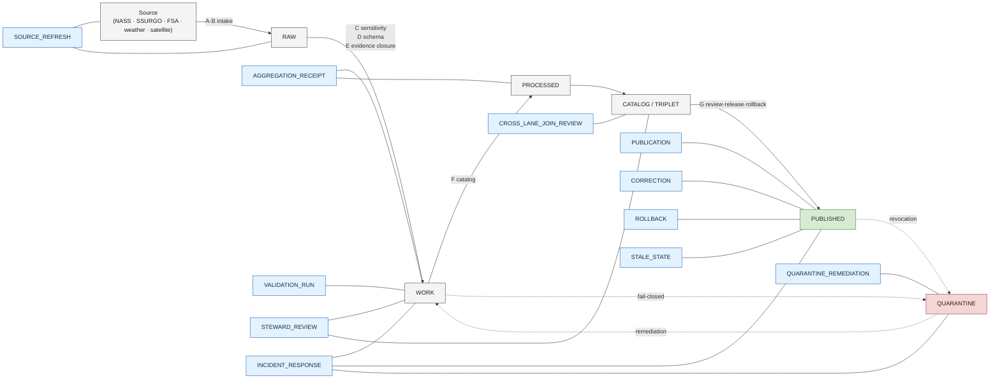

<!-- [KFM_META_BLOCK_V2]
doc_id: kfm://doc/<TODO-uuid>
title: Agriculture · Runbooks
type: readme
subtype: domain-aspect-index
version: v0.1 (draft)
status: draft
contract_version: "3.0.0"
domain: agriculture
aspect: runbooks
owners: <TODO: Docs steward + Agriculture domain steward + Source steward + Release authority + Sensitivity reviewer + Correction reviewer (per ai-build-operating-contract.md §0 reviewer pattern)>
created: 2026-05-26
updated: 2026-05-26
policy_label: public
related:
  - docs/doctrine/ai-build-operating-contract.md
  - docs/doctrine/directory-rules.md
  - docs/doctrine/trust-membrane.md
  - docs/doctrine/policy-aware.md
  - docs/doctrine/lifecycle-law.md
  - docs/doctrine/evidence-first.md
  - docs/doctrine/corrections-are-first-class.md
  - docs/runbooks/agriculture/
  - docs/runbooks/fauna/SOURCE_REFRESH_RUNBOOK.md
  - docs/domains/agriculture/README.md
  - docs/domains/agriculture/policy/README.md
  - docs/domains/agriculture/architecture/README.md
  - policy/domains/agriculture/
  - control_plane/source_authority_register.yaml
  - control_plane/verification_backlog.yaml
tags: [kfm, docs-index, domain, agriculture, runbooks, operations, source-refresh, incident-response, correction, rollback, fail-closed]
notes:
  - Docs **explain** how to operate; the canonical home for runbook files is `docs/runbooks/<domain>/` per Directory Rules §6.1.b (CONFIRMED by the fauna precedent). This README is a **domain-side index** that points to those runbooks from the `docs/domains/agriculture/` orientation surface.
  - Aspect pattern `docs/domains/<domain>/<aspect>/README.md` follows the sibling `docs/domains/agriculture/policy/README.md` work and is PROPOSED — open question OQ-AG-RUN-01.
  - Runbook subfolder convention (Pattern A vs Pattern B) is the doctrine-level OPEN-DR-02 in Directory Rules §18.b; this README adopts Pattern A.
  - Pinned to `CONTRACT_VERSION = "3.0.0"` per `ai-build-operating-contract.md` §0 / §37.
  - Incident response framework follows NIST SP 800-61 per atlas card KFM-P8-PROG-0014.
  - All concrete runbook paths under `docs/runbooks/agriculture/` are PROPOSED until verified against the live repository.
[/KFM_META_BLOCK_V2] -->

# Agriculture · Runbooks

> **Where the operational procedures for KFM's agriculture domain are explained — source refresh, validation runs, steward review, correction, rollback, incident response — and where the canonical runbook files that drive them are indexed.**


<!-- TODO — wire repo-level Shields endpoints (CI status; runbook-coverage for `docs/runbooks/agriculture/`) once the runbook CI workflow is verified. -->

**Status:** Draft · **Owners:** *TODO — Docs steward + Agriculture domain steward + Source steward + Release authority + Sensitivity reviewer + Correction reviewer* `[NEEDS VERIFICATION]` · **Last updated:** 2026-05-26 · **Pinned to:** `CONTRACT_VERSION = "3.0.0"`

> [!IMPORTANT]
> **This is a docs index, not the runbooks themselves.** This README is the human-facing **orientation surface** for *operational procedures touching the agriculture domain*. The **canonical runbook files** live under [`docs/runbooks/agriculture/`](../../../runbooks/agriculture/) following Pattern A in [`directory-rules.md`](../../../doctrine/directory-rules.md) §6.1.b — the same pattern the fauna runbook ([`docs/runbooks/fauna/SOURCE_REFRESH_RUNBOOK.md`](../../../runbooks/fauna/SOURCE_REFRESH_RUNBOOK.md)) already uses. If text here ever conflicts with the canonical runbook files, the canonical files win, and this README is the drift to fix. `[CONFIRMED doctrine — directory-rules.md §6.1.b; runbook paths PROPOSED until verified.]`

> [!NOTE]
> **Open doctrine question.** Two patterns are live for runbook placement (OPEN-DR-02 in Directory Rules §18.b): Pattern A (`docs/runbooks/<domain>/<TOPIC>_RUNBOOK.md`, recommended) and Pattern B (flat with prefix). This README adopts Pattern A. A separate sub-aspect question — whether this README should live at `docs/domains/agriculture/runbooks/README.md` (the requested path) or be folded into a single `docs/domains/agriculture/README.md` — is tracked as OQ-AG-RUN-01.

---

## Contents

1. [Scope](#1-scope)
2. [Repo fit](#2-repo-fit)
3. [Inputs (accepted)](#3-inputs-accepted)
4. [Exclusions (not here)](#4-exclusions-not-here)
5. [Companion directory tree](#5-companion-directory-tree)
6. [Operational concerns for the agriculture domain](#6-operational-concerns-for-the-agriculture-domain)
7. [Runbook inventory](#7-runbook-inventory)
8. [Runbook ↔ lifecycle gate map](#8-runbook--lifecycle-gate-map)
9. [Cross-cutting operational concerns](#9-cross-cutting-operational-concerns)
10. [Anti-patterns specific to agriculture operations](#10-anti-patterns-specific-to-agriculture-operations)
11. [Validators and CI for runbook hygiene](#11-validators-and-ci-for-runbook-hygiene)
12. [Acceptance checklist](#12-acceptance-checklist)
13. [Open questions register](#13-open-questions-register)
14. [FAQ](#14-faq)
15. [Related docs](#15-related-docs)
16. [Appendix](#16-appendix)

---

## 1. Scope

This README orients reviewers, stewards, operators, AI builders, and reviewers to the **operational procedures** that govern KFM's agriculture domain. "Runbook" here means a step-by-step, human-readable procedure that explains *how to operate* a recurring or response-class workflow — source refresh, validation runs, incident response, steward review, correction handling, rollback drills, evaluator workflows. `[CONFIRMED — directory-rules.md §6.1.b.]`

For the agriculture domain specifically, runbooks matter because:

- **Aggregation receipts are load-bearing.** Most public ag products are aggregates; refresh cycles, bin/cell changes, and stale-state handling all flow through receipt logic. `[CONFIRMED — Atlas §24.13; kfm_unified_doctrine_synthesis.md glossary.]`
- **Multiple source families with different cadences** (NASS quarterly, USDA programs, SSURGO/SDA periodic, weather products near-real-time, satellite vegetation indices regular). Each refresh has its own runbook entry.
- **Sensitive sub-lanes fail closed by default** (private operator/field data, person-parcel joins, field-level claims from aggregate authority). Incident response runbooks need agriculture-specific decision steps. `[CONFIRMED — Atlas §9.I, §24.4.7.]`
- **Correction propagation is non-trivial** because ag claims often feed Frontier Matrix cells; a correction upstream cascades to multiple downstream cells. `[CONFIRMED — Atlas §24.4.7, §24.4.15.]`

> [!NOTE]
> **What "runbook" is *not* in KFM.** Runbooks are not policy (`policy/`), not object meaning (`contracts/`), not machine schemas (`schemas/`), not pipeline executable logic (`pipelines/`), and not architecture (`docs/architecture/` or `docs/domains/<domain>/architecture/`). Each of those has its own responsibility root per [`directory-rules.md`](../../../doctrine/directory-rules.md) §4. Runbooks answer exactly one question: *"how do I do this operation, step by step, and what receipts/decisions does each step emit?"*

[⬆ Back to top](#agriculture--runbooks)

---

## 2. Repo fit

### 2.1 Where this lives, and why

| Element | Path | Status | Rationale |
|---|---|---|---|
| **This README (domain-side index)** | `docs/domains/agriculture/runbooks/README.md` | PROPOSED | Domain-side index following the sibling `docs/domains/agriculture/policy/README.md` pattern. See OQ-AG-RUN-01. |
| **Canonical runbook files** | `docs/runbooks/agriculture/<TOPIC>_RUNBOOK.md` | PROPOSED (Pattern A per OPEN-DR-02) | `docs/runbooks/` is the canonical operational-procedure home; the fauna sibling already uses Pattern A. `[CONFIRMED rule — directory-rules.md §6.1.b.]` |
| **Runbook fixtures** (e.g., a deterministic source-refresh dry-run scenario) | `fixtures/runbooks/agriculture/<TOPIC>/` | PROPOSED | Fixtures prove the runbook is executable. |
| **Runbook validators** (e.g., link-check, step-emits-receipt audit) | `tools/validators/runbooks/` | PROPOSED | Tool-class enforceability. |
| **Drift register entries** (when a runbook step encounters a divergence) | `docs/registers/DRIFT_REGISTER.md` | PROPOSED | Per the operating contract §37.3. |

### 2.2 Upstream sources

This README inherits from and MUST stay consistent with:

- [`ai-build-operating-contract.md`](../../../doctrine/ai-build-operating-contract.md) (`CONTRACT_VERSION = "3.0.0"`) — operating law.
- [`directory-rules.md`](../../../doctrine/directory-rules.md) §6.1.b — runbook placement contract.
- [`trust-membrane.md`](../../../doctrine/trust-membrane.md) — what each runbook step warrants.
- [`policy-aware.md`](../../../doctrine/policy-aware.md) — finite policy outcomes consumed by runbooks.
- [`lifecycle-law.md`](../../../doctrine/lifecycle-law.md) — the `RAW → WORK / QUARANTINE → PROCESSED → CATALOG / TRIPLET → PUBLISHED` invariant.
- [`corrections-are-first-class.md`](../../../doctrine/corrections-are-first-class.md) — `CorrectionNotice` workflow.
- [`evidence-first.md`](../../../doctrine/evidence-first.md) — cite-or-abstain.

### 2.3 Downstream consumers

- The agriculture pipeline (`pipelines/domains/agriculture/`, PROPOSED) executes the steps a runbook describes.
- Stewards and reviewers follow these procedures during admission, validation, release, correction, and rollback.
- Operators on incident-response duty consult the `INCIDENT_RESPONSE_RUNBOOK.md` for the NIST SP 800-61 path adapted with KFM signals. `[CONFIRMED framework — atlas card KFM-P8-PROG-0014.]`
- CI workflows (under `.github/workflows/`, PROPOSED) link to the validation runbook for triage steps.

[⬆ Back to top](#agriculture--runbooks)

---

## 3. Inputs (accepted)

The following materials belong **here** (i.e., under `docs/domains/agriculture/runbooks/`):

- The **domain-side index** itself (this README).
- Reviewer-facing orientation guides for the agriculture operations lane.
- Mapping tables linking operational concerns to canonical runbook files.
- Walkthroughs of how runbooks compose for cross-runbook scenarios (e.g., correction → rollback → re-release).
- Open questions about agriculture runbook scope, cadence, ownership.
- Cross-references to fauna, flora, or hazards runbooks where the agriculture lane consumes them.

[⬆ Back to top](#agriculture--runbooks)

---

## 4. Exclusions (not here)

The following materials do **not** belong here. Each has a canonical home; misplacing them silently creates a parallel authority. `[CONFIRMED rule — directory-rules.md §3, §6.1.b; Atlas §24.9.1.]`

| Material | Belongs at | Why not here |
|---|---|---|
| Step-by-step procedure files (e.g., `SOURCE_REFRESH_RUNBOOK.md`). | `docs/runbooks/agriculture/` (Pattern A) | `docs/runbooks/` is the canonical operational-procedure home per Directory Rules §6.1.b. |
| Policy rules (Rego, JSON, YAML). | `policy/domains/agriculture/` (PROPOSED) | `policy/` owns admissibility decisions. See [`docs/domains/agriculture/policy/README.md`](../policy/README.md). |
| Machine schemas. | `schemas/contracts/v1/domains/agriculture/` (PROPOSED) | `schemas/` owns shape. |
| Object-meaning contracts. | `contracts/domains/agriculture/` (PROPOSED) | `contracts/` owns meaning. |
| Pipeline executable logic. | `pipelines/domains/agriculture/` (PROPOSED) | Runbooks **describe** what executable code does; they are not the executable code. |
| Source descriptors. | `data/registry/sources/agriculture/` (PROPOSED) | Source identity, role, rights, cadence live with `data/registry/`. |
| Architecture or system design. | `docs/domains/agriculture/architecture/` (PROPOSED) | Architecture aspect ≠ runbook aspect. |
| Test fixtures and assertions. | `tests/domains/agriculture/`, `fixtures/runbooks/agriculture/` (PROPOSED) | Tests prove the rule; runbooks describe the operation. |
| Standards profiles (ISO, OGC, W3C). | `docs/standards/` per Directory Rules §6.1.a | External standards are conformance references, not procedures. |
| Incident artifacts (live IRs, postmortems). | `docs/registers/incidents/` or a separate `incidents/` lane (PROPOSED) | Live records vs procedural template. |

> [!CAUTION]
> **A runbook step that mutates trust state without a receipt is a runbook defect, not a feature.** Every step in a canonical runbook MUST name the receipt or decision it emits (`SourceDescriptor`, `IntakeReceipt`, `ValidationReport`, `PolicyDecision`, `AggregationReceipt`, `TransformReceipt`, `RedactionReceipt`, `PromotionDecision`, `ReleaseManifest`, `ProofPack`, `ReviewRecord`, `CorrectionNotice`, `RollbackCard`, `RunReceipt`, `AIReceipt`, `GENERATED_RECEIPT`, `QuarantineReceipt`). A step with no recorded artifact is a step that did not happen for audit purposes. `[CONFIRMED — trust-membrane.md §4.1; ai-build-operating-contract.md §34.]`

[⬆ Back to top](#agriculture--runbooks)

---

## 5. Companion directory tree

The agriculture **runbooks aspect** touches the following responsibility roots. All paths are PROPOSED until verified against the mounted repo.

```text
Kansas-Frontier-Matrix/
├── docs/
│   ├── doctrine/                                       # operating doctrine — upstream
│   │   ├── ai-build-operating-contract.md
│   │   ├── directory-rules.md
│   │   ├── trust-membrane.md
│   │   ├── policy-aware.md
│   │   ├── lifecycle-law.md
│   │   ├── corrections-are-first-class.md
│   │   └── evidence-first.md
│   ├── runbooks/                                       # canonical runbook home (Directory Rules §6.1.b)
│   │   ├── README.md                                   # runbooks landing page (PROPOSED)
│   │   ├── FIRST_GOVERNED_PR_RUNBOOK.md                # operating-contract companion (PROPOSED)
│   │   ├── fauna/
│   │   │   └── SOURCE_REFRESH_RUNBOOK.md               # CONFIRMED-authored sibling (Pattern A)
│   │   └── agriculture/                                # ← canonical home for ag runbooks
│   │       ├── README.md                               # runbook-side index (PROPOSED)
│   │       ├── SOURCE_REFRESH_RUNBOOK.md               # PROPOSED
│   │       ├── AGGREGATION_RECEIPT_RUNBOOK.md          # PROPOSED
│   │       ├── VALIDATION_RUN_RUNBOOK.md               # PROPOSED
│   │       ├── STEWARD_REVIEW_RUNBOOK.md               # PROPOSED
│   │       ├── PUBLICATION_RUNBOOK.md                  # PROPOSED
│   │       ├── CORRECTION_RUNBOOK.md                   # PROPOSED
│   │       ├── ROLLBACK_RUNBOOK.md                     # PROPOSED
│   │       ├── QUARANTINE_REMEDIATION_RUNBOOK.md       # PROPOSED
│   │       ├── INCIDENT_RESPONSE_RUNBOOK.md            # PROPOSED — NIST SP 800-61 path
│   │       ├── STALE_STATE_RUNBOOK.md                  # PROPOSED
│   │       ├── CROSS_LANE_JOIN_REVIEW_RUNBOOK.md       # PROPOSED
│   │       ├── SCHEMA_MIGRATION_RUNBOOK.md             # PROPOSED
│   │       └── EVALUATOR_RUNBOOK.md                    # PROPOSED — per KFM-P19-FEAT-0008
│   └── domains/
│       └── agriculture/
│           ├── README.md                               # domain index (PROPOSED)
│           ├── architecture/
│           │   └── README.md                           # architecture aspect (PROPOSED)
│           ├── policy/
│           │   └── README.md                           # policy aspect (PROPOSED — companion)
│           └── runbooks/
│               └── README.md                           # ← THIS FILE (domain-side index)
├── policy/                                             # admissibility decisions consumed by runbooks
│   └── domains/agriculture/                            # PROPOSED
├── pipelines/                                          # executable pipeline logic
│   └── domains/agriculture/                            # PROPOSED
├── tests/                                              # contract & runbook tests
│   └── domains/agriculture/                            # PROPOSED
├── fixtures/                                           # no-network fixtures incl. runbook dry-runs
│   ├── domains/agriculture/                            # PROPOSED
│   └── runbooks/agriculture/                           # PROPOSED
├── tools/
│   └── validators/runbooks/                            # runbook hygiene validators (PROPOSED)
├── control_plane/
│   ├── source_authority_register.yaml                  # consumed by SOURCE_REFRESH_RUNBOOK
│   └── verification_backlog.yaml                       # consumed by runbook drift entries
└── docs/registers/
    └── DRIFT_REGISTER.md                               # runbook-step drift logged here (PROPOSED)
```

[⬆ Back to top](#agriculture--runbooks)

---

## 6. Operational concerns for the agriculture domain

Twelve concerns are **load-bearing** enough to warrant their own runbook in the agriculture lane. Each is CONFIRMED doctrine or directly inferred from CONFIRMED ag-domain rules; the per-runbook content is PROPOSED until the file lands.

| Concern | Why ag-specific | Primary upstream doctrine |
|---|---|---|
| **Source refresh** | NASS/SSURGO/USDA/FSA/weather/satellite cadences vary widely; source role MUST be preserved across refreshes. | [`evidence-first.md`](../../../doctrine/evidence-first.md); Atlas §9.K (SSURGO/SDA lineage tests). |
| **Aggregation receipt regeneration** | Agriculture aggregates depend on receipts with explicit bin / cell semantics; receipt regen MUST preserve bin semantics. | `kfm_unified_doctrine_synthesis.md` §10 (`AggregationReceipt`); Atlas §24.13. |
| **Validation run** | Multiple ag validators (SSURGO lineage, soil-moisture QC, crop progress aggregate-only, vegetation index mask/time, field-level NASS deny). | Atlas §9.K. |
| **Steward review** | Sensitive sub-lanes (private operator, person-parcel) require steward sign-off before any allow path. | Atlas §9.I, §24.7 separation-of-duties. |
| **Publication** | Release-time `ReleaseManifest` + `ProofPack` + `ReviewRecord` + `RollbackCard` MUST all close. | [`trust-membrane.md`](../../../doctrine/trust-membrane.md) §6 publication gate. |
| **Correction** | Ag claims feed Frontier Matrix cells; correction MUST cascade and emit `CorrectionNotice`. | [`corrections-are-first-class.md`](../../../doctrine/corrections-are-first-class.md); Atlas §24.4.15. |
| **Rollback** | Releases MUST have a resolvable rollback target before publish; rollback execution emits a `RollbackCard`. | `kfm_unified_doctrine_synthesis.md` §10. |
| **Quarantine remediation** | Containment, not deletion; remediation re-presents at the verification gate from scratch. | [`trust-membrane.md`](../../../doctrine/trust-membrane.md) §8. |
| **Incident response** | NIST SP 800-61 framework adapted with KFM signals from the governance ledger and IOC catalogs. | Atlas card KFM-P8-PROG-0014. `[CONFIRMED framework.]` |
| **Stale-state handling** | Source cadence lapses produce `ABSTAIN freshness.window_lapsed` + UI `SOURCE_STALE`; ag aggregates often go stale before they go wrong. | [`trust-membrane.md`](../../../doctrine/trust-membrane.md) §7.4; Atlas §24.8 stale-state markers. |
| **Cross-lane join review** | Person-parcel joins fail closed; soil/hydrology/atmosphere joins require source-role preservation. | Atlas §24.4.7. |
| **Schema migration** | Ag schemas evolve (e.g., a new source-role enum value); migration is governed and may require ADR. | Directory Rules §2.4; ADR-S-04 (Atlas §24.12). |

[⬆ Back to top](#agriculture--runbooks)

---

## 7. Runbook inventory

This is the **agriculture runbook index**. Each row is a PROPOSED file under `docs/runbooks/agriculture/`. Files do not yet exist in this session; the inventory is the placement target.

| Runbook (PROPOSED) | Purpose | Triggers | Receipts emitted |
|---|---|---|---|
| [`SOURCE_REFRESH_RUNBOOK.md`](../../../runbooks/agriculture/SOURCE_REFRESH_RUNBOOK.md) | Refresh one or more admitted ag source families on cadence. | Scheduled cadence reached; manual refresh requested. | `IntakeReceipt`, `SourceActivationDecision`, `TransformReceipt`, `RunReceipt`. |
| [`AGGREGATION_RECEIPT_RUNBOOK.md`](../../../runbooks/agriculture/AGGREGATION_RECEIPT_RUNBOOK.md) | Generate or regenerate an `AggregationReceipt` for a published or candidate aggregate. | Bin/cell semantics change; aggregate revalidation; correction-driven regen. | `AggregationReceipt`, `RunReceipt`. |
| [`VALIDATION_RUN_RUNBOOK.md`](../../../runbooks/agriculture/VALIDATION_RUN_RUNBOOK.md) | Run the agriculture validator suite (SSURGO lineage, crop progress aggregate-only, field-level NASS deny, vegetation index mask/time, etc.). | Pre-promotion; CI; investigation. | `ValidationReport`, `RunReceipt`. |
| [`STEWARD_REVIEW_RUNBOOK.md`](../../../runbooks/agriculture/STEWARD_REVIEW_RUNBOOK.md) | Steward and sensitivity-reviewer workflow for sensitive ag lanes. | Sensitivity lane activation; private-join request; pre-release. | `ReviewRecord`, `PolicyDecision`. |
| [`PUBLICATION_RUNBOOK.md`](../../../runbooks/agriculture/PUBLICATION_RUNBOOK.md) | Promote a release candidate to `PUBLISHED` for the agriculture lane. | Release candidate accepted; release authority signs off. | `PromotionDecision`, `ReleaseManifest`, `ProofPack`, `ReviewRecord`, `RollbackCard`. |
| [`CORRECTION_RUNBOOK.md`](../../../runbooks/agriculture/CORRECTION_RUNBOOK.md) | Issue a `CorrectionNotice` for a published ag claim; identify and notify downstream derivatives. | Upstream source correction; internal error detected; reviewer-initiated. | `CorrectionNotice`, `RunReceipt`. |
| [`ROLLBACK_RUNBOOK.md`](../../../runbooks/agriculture/ROLLBACK_RUNBOOK.md) | Execute the `RollbackCard` for an ag release; restore prior state visibly. | Failed release; correction with rollback requirement; incident response. | `RollbackCard` execution record; `RunReceipt`. |
| [`QUARANTINE_REMEDIATION_RUNBOOK.md`](../../../runbooks/agriculture/QUARANTINE_REMEDIATION_RUNBOOK.md) | Remediate quarantined ag material and re-present at the verification gate. | Quarantine triggered; rights / sensitivity / source-role resolved. | `QuarantineReceipt` close-out; re-entry to `WORK`. |
| [`INCIDENT_RESPONSE_RUNBOOK.md`](../../../runbooks/agriculture/INCIDENT_RESPONSE_RUNBOOK.md) | NIST SP 800-61 path (Preparation → Detection & Analysis → Containment, Eradication & Recovery → Post-Incident Activity) adapted with KFM governance-ledger signals and IOC catalogs. `[CONFIRMED framework — KFM-P8-PROG-0014.]` | Suspected private-data leak; field-level-from-aggregate leak; alert-authority misuse; supply-chain anomaly. | Incident record; post-incident artifact; updated IOC entries. |
| [`STALE_STATE_RUNBOOK.md`](../../../runbooks/agriculture/STALE_STATE_RUNBOOK.md) | Detect, surface, and propagate stale state for ag claims; produce `ABSTAIN freshness.window_lapsed` + UI `SOURCE_STALE`. | Cadence lapse; downstream stale-propagation event. | Stale-state markers; `RunReceipt`. |
| [`CROSS_LANE_JOIN_REVIEW_RUNBOOK.md`](../../../runbooks/agriculture/CROSS_LANE_JOIN_REVIEW_RUNBOOK.md) | Steward review of cross-lane joins (Soil, Hydrology, Atmosphere, People/Land, Habitat). Person-parcel joins fail closed. | New cross-lane join proposal; cross-lane edge change. | `ReviewRecord`, `PolicyDecision`. |
| [`SCHEMA_MIGRATION_RUNBOOK.md`](../../../runbooks/agriculture/SCHEMA_MIGRATION_RUNBOOK.md) | Migrate an agriculture schema to a new version under ADR. | Schema-home or schema-version change; ADR-S-04 source-role evolution. | ADR reference; migration receipt; `RunReceipt`. |
| [`EVALUATOR_RUNBOOK.md`](../../../runbooks/agriculture/EVALUATOR_RUNBOOK.md) | Evaluator and threshold-owner surface per KFM-P19-FEAT-0008. Threshold ownership, reviewer checklist, no-network run, metric definitions, response steps. | Evaluator-policy failure; threshold breach. | `ValidationReport`, `RunReceipt`. |

> [!TIP]
> **Author one runbook before you generalize the pattern.** The fauna lane authored `SOURCE_REFRESH_RUNBOOK.md` first and let other runbooks accumulate as the lane matured. For agriculture, candidates for first-authored runbooks are `SOURCE_REFRESH_RUNBOOK.md` (parallel to fauna) and `AGGREGATION_RECEIPT_RUNBOOK.md` (ag-specific load-bearing concern).

[⬆ Back to top](#agriculture--runbooks)

---

## 8. Runbook ↔ lifecycle gate map

Each runbook attaches to one or more gates in the agriculture pipeline. The diagram below maps the canonical lifecycle (`RAW → WORK / QUARANTINE → PROCESSED → CATALOG / TRIPLET → PUBLISHED`) to the runbooks that operate at each gate.



> [!IMPORTANT]
> **A runbook is the human-readable view of the gate it serves.** It MUST NOT introduce new gates, new receipts, or new outcomes; if a runbook needs something the lifecycle doctrine does not name, that is an ADR-class question, not a runbook authoring task. `[CONFIRMED — directory-rules.md §2.4; trust-membrane.md §6.]`

| Lifecycle gate | Primary runbook(s) | Secondary runbook(s) |
|---|---|---|
| **Pre-RAW / Intake (`A`, `B`)** | `SOURCE_REFRESH_RUNBOOK.md` | `INCIDENT_RESPONSE_RUNBOOK.md` (source-side breach). |
| **Verification (`C`, `D`, `E`)** | `VALIDATION_RUN_RUNBOOK.md`, `AGGREGATION_RECEIPT_RUNBOOK.md`, `STEWARD_REVIEW_RUNBOOK.md` | `QUARANTINE_REMEDIATION_RUNBOOK.md`, `CROSS_LANE_JOIN_REVIEW_RUNBOOK.md`. |
| **Catalog (`F`)** | `STEWARD_REVIEW_RUNBOOK.md`, `CROSS_LANE_JOIN_REVIEW_RUNBOOK.md` | `EVALUATOR_RUNBOOK.md`. |
| **Publication (`G`)** | `PUBLICATION_RUNBOOK.md` | `EVALUATOR_RUNBOOK.md`, `INCIDENT_RESPONSE_RUNBOOK.md`. |
| **Post-publication corrections** | `CORRECTION_RUNBOOK.md`, `ROLLBACK_RUNBOOK.md` | `STALE_STATE_RUNBOOK.md`, `INCIDENT_RESPONSE_RUNBOOK.md`. |
| **Quarantine** | `QUARANTINE_REMEDIATION_RUNBOOK.md` | `INCIDENT_RESPONSE_RUNBOOK.md`. |
| **Cross-cutting** | `INCIDENT_RESPONSE_RUNBOOK.md`, `STALE_STATE_RUNBOOK.md` | `SCHEMA_MIGRATION_RUNBOOK.md`. |

[⬆ Back to top](#agriculture--runbooks)

---

## 9. Cross-cutting operational concerns

### 9.1 Determinism and no-network defaults

Every runbook MUST identify which steps are deterministic (idempotent, replayable, no-network) and which require live network or external state. CI workflows that consume runbooks SHOULD run the deterministic subset by default. `[CONFIRMED posture — kfm_unified_doctrine_synthesis.md §23 "Replay determinism: Same inputs → same `RunReceipt` hash; drift is a build break."]`

### 9.2 Receipts at every step

Every consequential step in a runbook MUST emit (or reference) an admissible artifact: a receipt, a decision, a manifest, a report, a record. A runbook step with no recorded artifact is unauditable.

### 9.3 Separation of duties

Per [`ai-build-operating-contract.md`](../../../doctrine/ai-build-operating-contract.md) §33 and Atlas §24.7:

- **Release authority** is distinct from authorship for sensitive ag lanes (private-operator, person-parcel-related releases).
- **Sensitivity reviewer** is required for steward review of redactions, generalizations, withholdings.
- **Correction reviewer** is required for correction issuance on published claims.
- **Source steward** owns admission, rights confirmation, and sensitivity tag.

Each runbook MUST name the role that performs each step; ambiguous "the operator" or "an engineer" steps are a runbook defect.

### 9.4 NIST SP 800-61 alignment for incident response

`INCIDENT_RESPONSE_RUNBOOK.md` follows the NIST SP 800-61 phase sequence — **Preparation → Detection & Analysis → Containment, Eradication & Recovery → Post-Incident Activity** — adapted with KFM-specific signals from the governance ledger and IOC catalogs. `[CONFIRMED framework — atlas card KFM-P8-PROG-0014.]`

For agriculture-specific incidents the most likely scenarios are:

1. Private-operator data inferentially exposed through an aggregate (aggregate-as-place-observation incident).
2. Field-level claim served against an aggregate-authority source (NASS-resolution incident).
3. Person-parcel join unintentionally surfaced.
4. Drought / pest indicator presented as alert authority.
5. Source-role upgrade through promotion.

### 9.5 Correction propagation

When a `CORRECTION_RUNBOOK.md` execution affects a Frontier Matrix cell that consumed an ag aggregate, the runbook MUST identify and surface every cell that referenced the corrected unit. Cells re-evaluate at their next call and MAY downgrade to `ABSTAIN evidence.revoked_upstream` per [`trust-membrane.md`](../../../doctrine/trust-membrane.md) §8.

### 9.6 Drift handling

If a runbook step encounters a divergence between doctrine and live state (e.g., an admitted source is missing rights metadata), the step MUST open or update an entry in `docs/registers/DRIFT_REGISTER.md`, not silently work around it. `[CONFIRMED — ai-build-operating-contract.md §37.3.]`

[⬆ Back to top](#agriculture--runbooks)

---

## 10. Anti-patterns specific to agriculture operations

The following are CONFIRMED-rejection patterns. Each represents a real failure mode and MUST fail closed.

| Anti-pattern | What goes wrong | Failing gate / step | Corrective rule |
|---|---|---|---|
| **Source refresh without `IntakeReceipt`.** | The refresh happened but no audit record proves it. | Intake gate; `SOURCE_REFRESH_RUNBOOK` step 1. | Every refresh emits an `IntakeReceipt`. |
| **Re-derivation that upgrades source role.** | A modeled drought indicator becomes "observed" after a refresh. | Verification gate; `SOURCE_REFRESH_RUNBOOK` step 4. | Source role is fixed at admission. `[CONFIRMED — Atlas §24.9.3.]` |
| **Aggregate regenerated without `AggregationReceipt`.** | New aggregate emitted with no record of bin/cell semantics. | Verification gate; `AGGREGATION_RECEIPT_RUNBOOK`. | `AggregationReceipt` is mandatory. `[CONFIRMED — Atlas §24.13.]` |
| **Validation run without `ValidationReport`.** | Validator output is logged ad-hoc but no formal report exists. | Verification gate; `VALIDATION_RUN_RUNBOOK`. | `ValidationReport` is the validator artifact. |
| **Steward review approved by the author.** | Same role authored and approved a sensitive-lane change. | Catalog / publication gate; `STEWARD_REVIEW_RUNBOOK`. | Separation of duties per Atlas §24.7.2. |
| **Publication without `RollbackCard`.** | A release goes live with no rollback target identified. | Publication gate; `PUBLICATION_RUNBOOK`. | `RollbackCard` MUST exist before release. |
| **Correction silently deletes prior release.** | Correction overwrites history instead of issuing `CorrectionNotice`. | `CORRECTION_RUNBOOK`. | Append-only audit; `CorrectionNotice` mandatory. `[CONFIRMED — corrections-are-first-class.md.]` |
| **Rollback without `RollbackCard` execution record.** | Rollback happens but no record proves it. | `ROLLBACK_RUNBOOK`. | `RollbackCard` execution record is mandatory. |
| **Quarantine resolved by deletion.** | Quarantined material disappears without remediation. | `QUARANTINE_REMEDIATION_RUNBOOK`. | Containment is not deletion. `[CONFIRMED — trust-membrane.md §8.]` |
| **Incident closed without post-incident artifact.** | Incident response stops at recovery; no lessons / IOC update. | `INCIDENT_RESPONSE_RUNBOOK`. | NIST SP 800-61 Phase 4 (Post-Incident Activity) is mandatory. `[CONFIRMED — atlas KFM-P8-PROG-0014.]` |
| **Stale state silently treated as current.** | Cadence lapsed but the surface keeps answering. | `STALE_STATE_RUNBOOK`. | `ABSTAIN freshness.window_lapsed` + UI `SOURCE_STALE`. |
| **Cross-lane join executed without review.** | Person-parcel or sensitive cross-lane edge silently activated. | `CROSS_LANE_JOIN_REVIEW_RUNBOOK`. | `ReviewRecord` mandatory; person-parcel fail-closed by default. `[CONFIRMED — Atlas §24.4.7.]` |
| **Schema migration without ADR.** | Source-role enum changed without governance trace. | `SCHEMA_MIGRATION_RUNBOOK`. | Source-role evolution is ADR-class (ADR-S-04 per Atlas §24.12). |
| **Evaluator-policy failure handled out-of-band.** | Threshold breach handled informally; no record. | `EVALUATOR_RUNBOOK`. | Evaluator failure follows the runbook's response steps. `[CONFIRMED — KFM-P19-FEAT-0008.]` |
| **Runbook step without a receipt.** | A consequential step happened with no recorded artifact. | Any runbook. | Every consequential step emits an artifact. §9.2. |

[⬆ Back to top](#agriculture--runbooks)

---

## 11. Validators and CI for runbook hygiene

The following validators / CI jobs are **PROPOSED to create** for the agriculture runbooks aspect. Each lives under `tools/validators/runbooks/` or `tests/runbooks/`. Inventory mirrors the receipts-at-every-step rule from §9.2.

| Validator / CI job | Purpose | Acceptance gate |
|---|---|---|
| `runbook-link-check` | Verify every link in `docs/runbooks/agriculture/*.md` resolves (to repo paths, to doctrine, to control-plane registers). | Any broken link → `FAIL`. |
| `runbook-step-emits-receipt-audit` | For each step labeled "consequential" in a runbook, verify the step names the artifact it emits. | Step without artifact reference → `FAIL`. |
| `runbook-role-named-audit` | Verify every step names the role performing it (per §9.3). | Step without role → `FAIL`. |
| `runbook-no-policy-encoding-audit` | Verify runbooks do not encode rules that belong under `policy/`. | Embedded policy logic → `FAIL`. |
| `runbook-pattern-A-conformance` | Verify ag runbooks live at `docs/runbooks/agriculture/<TOPIC>_RUNBOOK.md` per Pattern A (OPEN-DR-02). | Misplaced runbook → `FAIL`. |
| `runbook-deterministic-step-no-network` | For each step labeled deterministic, verify no live network call is required. | Live-network requirement → `FAIL`. |
| `runbook-incident-response-nist-conformance` | Verify `INCIDENT_RESPONSE_RUNBOOK.md` presents the NIST SP 800-61 four-phase sequence. | Missing phase → `FAIL`. |
| `runbook-correction-cascade-audit` | Verify `CORRECTION_RUNBOOK.md` includes a derivative-identification step for Frontier Matrix cells. | Missing cascade step → `FAIL`. |
| `runbook-rollback-target-exists` | Verify `PUBLICATION_RUNBOOK.md` blocks publication when `RollbackCard` is missing. | Publication without rollback → `FAIL`. |
| `runbook-separation-of-duties-audit` | Verify the steward-review and release-authority steps reference Atlas §24.7.2 SoD matrix. | Missing SoD enforcement → `FAIL`. |

> [!NOTE]
> Each validator MUST ship with both **valid** and **invalid** fixtures, and the invalid fixtures MUST fail *for the expected reason*. A test that fails for the wrong reason is not a passing negative test. `[CONFIRMED posture — ai-build-operating-contract.md §6.]`

[⬆ Back to top](#agriculture--runbooks)

---

## 12. Acceptance checklist

A repository implementation of the agriculture runbooks aspect conforms to this README when **all** of the following hold:

- [ ] `docs/runbooks/agriculture/` exists with a per-folder `README.md` declaring authority class (per Directory Rules §15).
- [ ] At least `SOURCE_REFRESH_RUNBOOK.md` is authored under `docs/runbooks/agriculture/` (parallel to the fauna sibling).
- [ ] Every authored runbook follows Pattern A naming (`<TOPIC>_RUNBOOK.md` UPPERCASE_WITH_UNDERSCORES).
- [ ] Every authored runbook names the role that performs each step (§9.3).
- [ ] Every consequential step names the artifact it emits (§9.2).
- [ ] `INCIDENT_RESPONSE_RUNBOOK.md` presents the NIST SP 800-61 four-phase sequence (§9.4).
- [ ] `CORRECTION_RUNBOOK.md` includes a derivative-identification cascade step (§9.5).
- [ ] `PUBLICATION_RUNBOOK.md` blocks publication when a `RollbackCard` is missing.
- [ ] `STEWARD_REVIEW_RUNBOOK.md` references the Atlas §24.7.2 separation-of-duties matrix.
- [ ] `CROSS_LANE_JOIN_REVIEW_RUNBOOK.md` enforces person-parcel fail-closed default.
- [ ] All validators in §11 ship with both valid and invalid fixtures, and invalid fixtures fail for the expected reason.
- [ ] Drift between a runbook step and doctrine is logged in `docs/registers/DRIFT_REGISTER.md`.
- [ ] Every AI-authored runbook merge emits a `GENERATED_RECEIPT.json` with `contract_version = "3.0.0"`. `[CONFIRMED — ai-build-operating-contract.md §34.]`

[⬆ Back to top](#agriculture--runbooks)

---

## 13. Open questions register

| ID | Question | Owner role | Resolution path |
|---|---|---|---|
| **OQ-AG-RUN-01** | Should this README live as `docs/domains/agriculture/runbooks/README.md` (a domain-side index, following the sibling `docs/domains/agriculture/policy/README.md` pattern) — or be folded into a single `docs/domains/agriculture/README.md` orientation page that links directly to `docs/runbooks/agriculture/`? | Docs steward | Repo inspection; ADR if the project consolidates on one pattern. |
| **OQ-AG-RUN-02** | Should runbook subfolder convention be Pattern A (`docs/runbooks/<domain>/<TOPIC>_RUNBOOK.md`) or Pattern B (flat with prefix)? Tracked as OPEN-DR-02 in [`directory-rules.md`](../../../doctrine/directory-rules.md) §18.b. This README adopts Pattern A. | Docs steward | ADR. |
| **OQ-AG-RUN-03** | Which agriculture runbook should be authored first — `SOURCE_REFRESH_RUNBOOK.md` (parallels fauna) or `AGGREGATION_RECEIPT_RUNBOOK.md` (ag-specific load-bearing concern)? | Agriculture domain steward + Docs steward | Maintainer decision; document the choice in a brief ADR or in the per-folder README at `docs/runbooks/agriculture/README.md`. |
| **OQ-AG-RUN-04** | Does `INCIDENT_RESPONSE_RUNBOOK.md` live per-domain (`docs/runbooks/agriculture/INCIDENT_RESPONSE_RUNBOOK.md`) or as a cross-cutting runbook (`docs/runbooks/INCIDENT_RESPONSE_RUNBOOK.md`) with ag-specific annexes? | Architecture steward + Docs steward | ADR. |
| **OQ-AG-RUN-05** | Should runbook step "consequential" labels be machine-checkable (e.g., via a YAML front-matter or a step-naming convention), so the `runbook-step-emits-receipt-audit` validator can run without natural-language parsing? | Architecture steward | Repo inspection + tooling decision. |
| **OQ-AG-RUN-06** | What cadence should `SOURCE_REFRESH_RUNBOOK.md` propose for each ag source family (NASS quarterly? SSURGO annual? FSA event-driven? satellite weekly/monthly?), and where is the cadence canonically recorded — `SourceDescriptor`, `control_plane/source_authority_register.yaml`, or both? | Source steward + Architecture steward | Per-source review; ADR if cadence is contested. |
| **OQ-AG-RUN-07** | How should runbook drift entries be triaged — daily by docs steward, weekly by architecture steward, or event-driven? Cross-references ADR-S-13 (drift register triage) per Atlas §24.12. | Docs steward | ADR-S-13. |

[⬆ Back to top](#agriculture--runbooks)

---

## 14. FAQ

**Why is this README here if the runbooks themselves live at `docs/runbooks/agriculture/`?**
Because readers exploring the agriculture domain from the domain side (`docs/domains/agriculture/`) deserve a clear pointer to the operational procedures, not silence. This README is the **domain-side index**; the canonical runbook files are under `docs/runbooks/agriculture/`. Same pattern as [`docs/domains/agriculture/policy/README.md`](../policy/README.md), which points to `policy/domains/agriculture/`.

**Why not put the runbooks here directly?**
Because `docs/runbooks/` is the canonical operational-procedure home per [`directory-rules.md`](../../../doctrine/directory-rules.md) §6.1.b (CONFIRMED by the fauna precedent). Splitting runbooks across `docs/runbooks/<domain>/` and `docs/domains/<domain>/runbooks/` would create a parallel-authority problem.

**Is `INCIDENT_RESPONSE_RUNBOOK.md` agriculture-specific?**
The framework is corpus-wide (NIST SP 800-61, per atlas card KFM-P8-PROG-0014). The agriculture incident-response runbook is the **agriculture-specific instantiation** — it lists the ag-specific incident scenarios (aggregate-as-place-observation leak, field-level NASS leak, person-parcel join surfacing, alert-authority misuse, source-role upgrade) and walks each through the four NIST phases. Whether this lives per-domain or cross-cuttingly is OQ-AG-RUN-04.

**Can AI execute these runbooks?**
AI MAY draft, summarize, or trace through runbook steps (per [`ai-as-assistant.md`](../../../doctrine/ai-as-assistant.md)), and AI MAY emit a `GENERATED_RECEIPT.json` for AI-authored runbook edits. AI MUST NOT execute steps whose receipts require a human role under §9.3 (release authority, sensitivity reviewer, correction reviewer, source steward). AI is a consumer of warranted evidence, not an issuer of warrants.

**What if a runbook step needs to call live network (e.g., to fetch from NASS)?**
Label that step `requires-network` and provide a deterministic, no-network dry-run alternative in fixtures. CI runs the deterministic subset by default; live-network steps run in staged or scheduled jobs. `[CONFIRMED posture — kfm_unified_doctrine_synthesis.md §23.]`

**What about Kansas-specific producer or operator data we already hold?**
Anything operator-level fails closed by default per [`docs/domains/agriculture/policy/README.md`](../policy/README.md) §6.2. The `STEWARD_REVIEW_RUNBOOK.md` walks the steward through the narrow review path needed before any allow exception. There is no shortcut, and there is no admin bypass that becomes a normal public path. `[CONFIRMED — Atlas §24.9.2 admin-shortcut anti-pattern.]`

**Where do I record a near-miss that didn't become an incident?**
In the post-incident artifact slot of `INCIDENT_RESPONSE_RUNBOOK.md`. KFM treats near-misses as input to the IOC catalog so the next preparation phase is better. `[CONFIRMED — atlas KFM-P8-PROG-0014: "recovery is not just restoration; it is restoration plus a verified post-incident artifact."]`

[⬆ Back to top](#agriculture--runbooks)

---

## 15. Related docs

> [!NOTE]
> All paths below are PROPOSED until verified against the live repository.

**Operating doctrine**

- [`docs/doctrine/ai-build-operating-contract.md`](../../../doctrine/ai-build-operating-contract.md) — canonical operating contract (`CONTRACT_VERSION = "3.0.0"`). `[CONFIRMED sibling.]`
- [`docs/doctrine/directory-rules.md`](../../../doctrine/directory-rules.md) — placement protocol; §6.1.b runbook home; §18.b OPEN-DR-02. `[CONFIRMED sibling.]`

**Trust-boundary and lifecycle doctrine**

- [`docs/doctrine/trust-membrane.md`](../../../doctrine/trust-membrane.md) — the trust contract every runbook step warrants. `[CONFIRMED sibling.]`
- [`docs/doctrine/lifecycle-law.md`](../../../doctrine/lifecycle-law.md) — `RAW → … → PUBLISHED`. `[CONFIRMED sibling.]`
- [`docs/doctrine/policy-aware.md`](../../../doctrine/policy-aware.md) — finite policy outcomes. `[CONFIRMED sibling.]`
- [`docs/doctrine/evidence-first.md`](../../../doctrine/evidence-first.md) — cite-or-abstain. `[CONFIRMED sibling.]`
- [`docs/doctrine/corrections-are-first-class.md`](../../../doctrine/corrections-are-first-class.md) — `CorrectionNotice` workflow. `[CONFIRMED sibling.]`
- [`docs/doctrine/authority-ladder.md`](../../../doctrine/authority-ladder.md) — source authority hierarchy. `[CONFIRMED sibling.]`

**Sibling domain-side indexes**

- [`docs/domains/agriculture/README.md`](../README.md) — agriculture domain index. `[PROPOSED.]`
- [`docs/domains/agriculture/policy/README.md`](../policy/README.md) — agriculture policy aspect. `[PROPOSED — companion to this doc.]`
- [`docs/domains/agriculture/architecture/README.md`](../architecture/README.md) — agriculture architecture aspect. `[PROPOSED.]`
- [`docs/domains/agriculture/sources/README.md`](../sources/README.md) — agriculture source ledger orientation. `[PROPOSED.]`

**Canonical runbook home**

- [`docs/runbooks/`](../../../runbooks/) — operational-procedure root per Directory Rules §6.1.b. `[CONFIRMED rule / PROPOSED path.]`
- [`docs/runbooks/agriculture/`](../../../runbooks/agriculture/) — ag runbook subfolder (Pattern A). `[PROPOSED.]`
- [`docs/runbooks/fauna/SOURCE_REFRESH_RUNBOOK.md`](../../../runbooks/fauna/SOURCE_REFRESH_RUNBOOK.md) — fauna sibling precedent. `[CONFIRMED authored per Directory Rules §6.1.b note.]`
- [`docs/runbooks/FIRST_GOVERNED_PR_RUNBOOK.md`](../../../runbooks/FIRST_GOVERNED_PR_RUNBOOK.md) — operating-contract companion runbook. `[PROPOSED — ai-build-operating-contract.md §47.]`

**Companion artifacts**

- [`policy/domains/agriculture/`](../../../../policy/domains/agriculture/) — ag policy rules consumed by runbook steps. `[PROPOSED.]`
- [`schemas/contracts/v1/domains/agriculture/`](../../../../schemas/contracts/v1/domains/agriculture/) — ag schemas validated by runbook steps. `[PROPOSED.]`
- [`control_plane/source_authority_register.yaml`](../../../../control_plane/source_authority_register.yaml) — consumed by `SOURCE_REFRESH_RUNBOOK.md`. `[PROPOSED.]`
- [`control_plane/verification_backlog.yaml`](../../../../control_plane/verification_backlog.yaml) — open verification items surfaced from runbook steps. `[PROPOSED.]`
- [`docs/registers/DRIFT_REGISTER.md`](../../../registers/DRIFT_REGISTER.md) — runbook-step drift logged here. `[PROPOSED.]`

**Atlas and synthesis evidence basis**

- `KFM_Domains_v1_1_plus_Pass23_Pass32_Consolidated_Atlas` §9 (Agriculture chapter), §24.4.7 (Edges owned by Agriculture), §24.7 (Reviewer roles and separation-of-duties), §24.8 (Stale-state markers), §24.9.2 (trust-membrane anti-patterns), §24.9.3 (governance-process anti-patterns), §24.12 (Open ADR backlog), §24.13 (responsibility-root crosswalk).
- `kfm_unified_doctrine_synthesis.md` §10 (object families incl. `AggregationReceipt`, `CorrectionNotice`, `RollbackCard`), §11 (finite outcome envelope vocabulary), §23 (implementation path / replay determinism).
- Atlas card **KFM-P8-PROG-0014** (incident response and recovery framework, NIST SP 800-61).
- Atlas card **KFM-P19-FEAT-0008** (evaluator runbook and threshold owner surface).

[⬆ Back to top](#agriculture--runbooks)

---

## 16. Appendix

<details>
<summary><strong>A. Glossary used in this README</strong></summary>

| Term | Meaning here |
|---|---|
| **Runbook** | A step-by-step, human-readable operational procedure for a recurring or response-class workflow. Lives at `docs/runbooks/<domain>/` per Directory Rules §6.1.b. |
| **Pattern A (OPEN-DR-02)** | Runbook subfolder convention: `docs/runbooks/<domain>/<TOPIC>_RUNBOOK.md`. Recommended; used by fauna. |
| **Pattern B (OPEN-DR-02)** | Runbook flat convention: `docs/runbooks/<domain>_<topic>.md`. Discouraged for multi-runbook domains. |
| **Receipt** | Any of the trust-bearing audit objects emitted by lifecycle gates and runbook steps (`IntakeReceipt`, `TransformReceipt`, `ValidationReport`, `PolicyDecision`, `AggregationReceipt`, `RedactionReceipt`, `PromotionDecision`, `ReleaseManifest`, `ProofPack`, `ReviewRecord`, `CorrectionNotice`, `RollbackCard`, `RunReceipt`, `AIReceipt`, `GENERATED_RECEIPT`, `QuarantineReceipt`). |
| **Consequential step** | A runbook step that mutates trust state or emits an auditable artifact. Distinguished from informational / advisory steps. |
| **Cadence** | The expected refresh interval for a source family (e.g., quarterly for NASS, annual for SSURGO). Recorded on the `SourceDescriptor`. |
| **NIST SP 800-61 phases** | Preparation → Detection & Analysis → Containment, Eradication & Recovery → Post-Incident Activity. `[CONFIRMED — atlas KFM-P8-PROG-0014.]` |
| **Drift entry** | A divergence between doctrine and live state logged in `docs/registers/DRIFT_REGISTER.md`. |
| **Stale state** | The state a published claim enters when its source's freshness window has lapsed. Renders as `ABSTAIN freshness.window_lapsed` + UI `SOURCE_STALE`. |

</details>

<details>
<summary><strong>B. Worked example — source refresh of NASS crop progress</strong></summary>

**Scenario.** NASS publishes a new weekly Crop Progress release. The agriculture lane MUST admit the new data, refresh derived aggregates, and surface stale-state markers for any data that depended on the prior release.

**Step-by-step (the `SOURCE_REFRESH_RUNBOOK.md` for NASS Crop Progress, illustrative):**

1. **Trigger.** Scheduled cadence reached (weekly), or manual refresh requested. Role: *Source steward*.
2. **Pre-flight.** Verify `SourceDescriptor` for NASS Crop Progress resolves and is current. Emit nothing; abort if stale. Role: *Source steward*. `[Step is deterministic / no-network if SourceDescriptor is repo-local.]`
3. **Fetch.** Connector executes the NASS retrieval. Emit `IntakeReceipt` with source hash, timestamp, source role (`aggregate`). Role: *Source steward* (automated). `[Step requires-network.]`
4. **Schema validation.** Run schema validator against the fetched payload. Emit `ValidationReport`. If FAIL → move to `QUARANTINE` per `QUARANTINE_REMEDIATION_RUNBOOK.md`. Role: *Source steward* (automated). `[Step is deterministic.]`
5. **Policy precheck.** Run policy gate `C` (sensitivity). Crop Progress is aggregate-authority public; no operator-private fields expected. Emit `PolicyDecision`. Role: *Sensitivity reviewer* (only if anomalous). `[Step is deterministic.]`
6. **Aggregation receipt regeneration.** If the new release changes bin / cell semantics, regenerate the `AggregationReceipt`. Emit a new receipt; supersede the old. Role: *Agriculture domain steward*. `[Step is deterministic.]`
7. **Stale-state propagation.** Any Frontier Matrix cell that consumed the prior weekly release MAY downgrade to `ABSTAIN evidence.revoked_upstream` at its next call. Surface in stale-state markers. Role: *Correction reviewer* (sample audit). `[Step is deterministic.]`
8. **Catalog refresh.** Update catalog records and triple-form projections. Emit catalog closure report. Role: *Agriculture domain steward* (automated). `[Step is deterministic.]`
9. **Publication candidate.** If the refreshed material warrants a new release candidate, hand off to `PUBLICATION_RUNBOOK.md`. Role: *Release authority* (separate). `[Step is gated by SoD.]`
10. **Drift check.** If any step encountered doctrine/live divergence, open or update an entry in `docs/registers/DRIFT_REGISTER.md`. Role: *Docs steward*. `[Step is deterministic.]`
11. **Post-run summary.** Emit `RunReceipt` summarizing inputs, outputs, hashes, tool versions, times. Role: automated. `[Step is deterministic.]`

**Why this matters.** The refresh is mundane on a good week. The receipts are what make it auditable on a bad week — when NASS issues a correction three weeks later, the chain back through `IntakeReceipt` → `ValidationReport` → `AggregationReceipt` → catalog closure → `RunReceipt` is what lets the correction propagate cleanly.

</details>

<details>
<summary><strong>C. Quick-reference: where does this runbook artifact live?</strong></summary>

| If you are writing… | …it belongs at | Why |
|---|---|---|
| A step-by-step ag source refresh procedure. | `docs/runbooks/agriculture/SOURCE_REFRESH_RUNBOOK.md` | Pattern A canonical home. |
| An ag aggregation-receipt regeneration procedure. | `docs/runbooks/agriculture/AGGREGATION_RECEIPT_RUNBOOK.md` | Pattern A. |
| A walkthrough explaining how runbooks compose for ag scenarios. | This README | Domain-side orientation. |
| The deterministic dry-run fixture for the NASS source refresh. | `fixtures/runbooks/agriculture/source_refresh/nass/` | Fixtures prove executability. |
| A validator that audits step-emits-receipt for every ag runbook. | `tools/validators/runbooks/` | Tool-class enforceability. |
| The Rego policy rule that denies a field-level NASS claim. | `policy/domains/agriculture/` | Policy, not runbook. See [`docs/domains/agriculture/policy/README.md`](../policy/README.md). |
| The `AggregationReceipt` JSON Schema. | `schemas/contracts/v1/receipts/aggregation_receipt.schema.json` (PROPOSED — pending OQ-AG-POL-03) | Schema home. |
| A drift entry generated mid-runbook. | `docs/registers/DRIFT_REGISTER.md` | Drift register is the canonical home. |
| An ADR proposing Pattern A as canonical (closes OPEN-DR-02). | `docs/adr/` | ADR-class decision. |
| A near-miss / post-incident artifact for an ag-specific incident. | `docs/registers/incidents/` (PROPOSED) and the post-incident slot of `INCIDENT_RESPONSE_RUNBOOK.md`. | Two-layer record: live record + procedural template update. |

</details>

---

### Related docs (compact)

[`ai-build-operating-contract.md`](../../../doctrine/ai-build-operating-contract.md) · [`directory-rules.md`](../../../doctrine/directory-rules.md) · [`trust-membrane.md`](../../../doctrine/trust-membrane.md) · [`lifecycle-law.md`](../../../doctrine/lifecycle-law.md) · [`corrections-are-first-class.md`](../../../doctrine/corrections-are-first-class.md) · [`docs/runbooks/agriculture/`](../../../runbooks/agriculture/) · [`docs/runbooks/fauna/SOURCE_REFRESH_RUNBOOK.md`](../../../runbooks/fauna/SOURCE_REFRESH_RUNBOOK.md) · [`docs/domains/agriculture/policy/README.md`](../policy/README.md)

**Last updated:** 2026-05-26 · **Version:** v0.1 (draft) · **Status:** awaiting review · **Pinned to:** `CONTRACT_VERSION = "3.0.0"`

[⬆ Back to top](#agriculture--runbooks)
