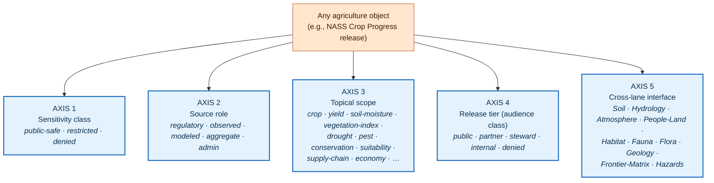

<!-- [KFM_META_BLOCK_V2]
doc_id: kfm://doc/<TODO-uuid>
title: Agriculture · Sublanes
type: readme
subtype: domain-aspect-index
version: v0.1 (draft)
status: draft
contract_version: "3.0.0"
domain: agriculture
aspect: sublanes
owners: <TODO: Docs steward + Agriculture domain steward + Source steward + Sensitivity reviewer (per ai-build-operating-contract.md §0 reviewer pattern)>
created: 2026-05-26
updated: 2026-05-26
policy_label: public
related:
  - docs/doctrine/ai-build-operating-contract.md
  - docs/doctrine/directory-rules.md
  - docs/doctrine/trust-membrane.md
  - docs/doctrine/policy-aware.md
  - docs/doctrine/lifecycle-law.md
  - docs/doctrine/evidence-first.md
  - docs/doctrine/authority-ladder.md
  - docs/domains/agriculture/README.md
  - docs/domains/agriculture/policy/README.md
  - docs/domains/agriculture/runbooks/README.md
  - docs/domains/agriculture/architecture/README.md
  - policy/sensitivity/agriculture/
  - policy/domains/agriculture/
  - schemas/contracts/v1/domains/agriculture/
  - contracts/domains/agriculture/
tags: [kfm, docs-index, domain, agriculture, sublanes, decomposition, sensitivity, source-role, release-tier, fail-closed]
notes:
  - The term **"sublane"** is PROPOSED documentation-organizing vocabulary, not (yet) ratified KFM doctrine. The CONFIRMED terms it composes with are *lane* (a domain is a "bounded responsibility lane" per Atlas §1.1), *sensitive lane*, *release lane*, *cross-lane relation*, *source role*, *sensitivity tier*, and *audience class*. See §2 and OQ-AG-SUB-01.
  - This README is a **domain-side index** orienting readers to the agriculture domain's internal decomposition axes. The CONFIRMED machine policy artifacts that enforce each sublane's posture live under `policy/sensitivity/agriculture/`, `policy/domains/agriculture/`, and `policy/release/agriculture/` — never duplicated here.
  - Aspect pattern `docs/domains/<domain>/<aspect>/README.md` follows the sibling `docs/domains/agriculture/policy/README.md` and `docs/domains/agriculture/runbooks/README.md` work and is PROPOSED — open question OQ-AG-SUB-02.
  - Pinned to `CONTRACT_VERSION = "3.0.0"` per `ai-build-operating-contract.md` §0 / §37.
  - All concrete paths under `policy/`, `schemas/`, `contracts/`, and CI workflow names are PROPOSED until verified against the live repository.
[/KFM_META_BLOCK_V2] -->

# Agriculture · Sublanes

> **Where the agriculture domain's internal partitions — by sensitivity class, source role, topical scope, release tier, and cross-lane interface — are explained as orthogonal axes on the same trust spine.**


<!-- TODO — wire repo-level Shields endpoints once sublane-coverage / sensitivity-tier CI workflows are verified. -->

**Status:** Draft · **Owners:** *TODO — Docs steward + Agriculture domain steward + Source steward + Sensitivity reviewer* `[NEEDS VERIFICATION]` · **Last updated:** 2026-05-26 · **Pinned to:** `CONTRACT_VERSION = "3.0.0"`

> [!IMPORTANT]
> **Term notice — "sublane" is PROPOSED documentation vocabulary.** The KFM corpus uses *lane* extensively (`[CONFIRMED]` — a domain is a "bounded responsibility lane" per `KFM_Domains_v1_1_plus_Pass23_Pass32_Consolidated_Atlas` §1.1) and uses *sensitive lane*, *release lane*, *cross-lane*, *sensitivity tier*, *source role*, and *audience class* as CONFIRMED compounds. **"Sublane" is not (yet) in that vocabulary.** This README adopts "sublane" as an organizing concept for documenting *how a single domain lane decomposes along multiple orthogonal axes* — it is a docs-side term, not a runtime term, and it MUST NOT escape the documentation surface into schemas, policy rule names, runtime envelopes, or audit receipts without ADR ratification. See §2 and OQ-AG-SUB-01.

> [!NOTE]
> **This is a docs index, not the decomposition logic itself.** The canonical machine artifacts that enforce each axis live under their respective responsibility roots — `policy/sensitivity/agriculture/` (sensitivity), `data/registry/sources/agriculture/` (source role on `SourceDescriptor`), `policy/release/agriculture/` (release tier), and the cross-lane edges in `policy/domains/agriculture/` and `contracts/domains/agriculture/`. If text here ever conflicts with canonical artifacts, the canonical artifacts win, and this README is the drift to fix. `[CONFIRMED rule — directory-rules.md §6.5; paths PROPOSED.]`

---

## Contents

1. [Scope](#1-scope)
2. [Definitions and naming](#2-definitions-and-naming)
3. [Repo fit](#3-repo-fit)
4. [Inputs (accepted)](#4-inputs-accepted)
5. [Exclusions (not here)](#5-exclusions-not-here)
6. [Companion directory tree](#6-companion-directory-tree)
7. [The five sublane axes for agriculture](#7-the-five-sublane-axes-for-agriculture)
8. [Sublane × lifecycle gate map](#8-sublane--lifecycle-gate-map)
9. [Specific agriculture sublanes (detail)](#9-specific-agriculture-sublanes-detail)
10. [Sublane composition rules](#10-sublane-composition-rules)
11. [Anti-patterns specific to sublane decomposition](#11-anti-patterns-specific-to-sublane-decomposition)
12. [Validators and CI for sublane hygiene](#12-validators-and-ci-for-sublane-hygiene)
13. [Acceptance checklist](#13-acceptance-checklist)
14. [Open questions register](#14-open-questions-register)
15. [FAQ](#15-faq)
16. [Related docs](#16-related-docs)
17. [Appendix](#17-appendix)

---

## 1. Scope

This README orients reviewers, stewards, contributors, and AI builders to the **internal decomposition** of KFM's agriculture domain. The agriculture lane is not monolithic — it carries:

- different **sensitivity classes** (public-safe aggregates vs. restricted private operator/field data vs. fully denied person-parcel joins);
- multiple **source roles** in active use (regulatory / observed / modeled / aggregate / admin);
- many **topical scopes** under one domain umbrella (crop progress, yield, soil moisture, vegetation indices, drought stress, pest stress, conservation practice, soil-crop suitability, supply chain, agricultural economy);
- distinct **release tiers** (audience classes — public / partner / steward / internal / denied per `KFM-P9-PROG-0069`); and
- multiple **cross-lane interfaces** (Soil, Hydrology, Atmosphere, People/Land, Habitat, Fauna, Flora, Geology, Frontier Matrix, Hazards).

Each of these is an orthogonal axis along which agriculture material classifies. This README treats them as the **five sublane axes** for the agriculture domain.

> [!NOTE]
> **What sublanes are *not*.** Sublanes are not new domains, not new responsibility roots, not new runtime outcomes, not new receipts, and not new policy classes. They are **documentation-side classification axes** that help reviewers see how the same trust spine carries materially different evidence, policy, and release postures across one domain lane. `[CONFIRMED constraint — Directory Rules §3 "domain files live as lanes inside responsibility roots, never as new root folders."]`

[⬆ Back to top](#agriculture--sublanes)

---

## 2. Definitions and naming

### 2.1 Working definitions

| Term | Status | Meaning here |
|---|---|---|
| **Lane** | `[CONFIRMED — Atlas §1.1, glossary.]` | A bounded responsibility area inside KFM. *A KFM domain is a lane* with owned object semantics and governed cross-lane relations. |
| **Sublane** | `[PROPOSED — this doc; see OQ-AG-SUB-01.]` | A documentation-side classification of *one decomposition axis* on a single domain lane. Sublanes are read-side organizing concepts; they MUST NOT replace CONFIRMED lane-level concepts in schemas, policy rule names, runtime envelopes, or audit receipts without ADR ratification. |
| **Cross-lane relation** | `[CONFIRMED — Atlas §24.4 / per-domain F. sections.]` | A relation between two distinct domain lanes (e.g., Agriculture × Soil, Agriculture × People/Land). |
| **Sensitivity tier** | `[CONFIRMED — Atlas §24.12 ADR-S-05; T0–T4.]` | An axis ranging from public-safe to fully denied; movement between tiers requires recorded transforms and review. |
| **Source role** | `[CONFIRMED — Atlas §11 source-role anti-collapse; ADR-S-04.]` | The named flavor of a source — `regulatory`, `observed`, `modeled`, `aggregate`, `admin`. Fixed at admission; never upgraded by promotion. |
| **Audience class** | `[CONFIRMED — KFM-P9-PROG-0069 (Atlas card).]` | The classification of an API endpoint or resource as `public` / `partner` / `steward` / `internal` / `denied`, aligning exposure, documentation, and trust-membrane obligations. |
| **Sensitive lane** | `[CONFIRMED — Atlas §1, §24.7.2.]` | A sublane within a domain whose default posture is fail-closed (e.g., `policy/sensitivity/agriculture/private_operator/`). |
| **Public-safe lane** | `[CONFIRMED — Atlas Master Capability Matrix.]` | A sublane whose material has passed rights, sensitivity, and source-role checks for public exposure. |
| **Release tier / lane** | `[CONFIRMED — Atlas §24.13 policy/release/ per-domain entries.]` | A release-time policy partition (e.g., `policy/release/agriculture/`). |

### 2.2 Why introduce "sublane" at all?

The agriculture lane is **load-bearing along five axes simultaneously**, and existing single-axis terms (sensitivity tier, source role, audience class) each capture only one axis. Reviewers who only know one of those terms miss the others; reviewers who try to reason across all five lack a unifying word.

"Sublane" is a docs-side noun that says, *"a partition of one domain lane, named by which axis it partitions on, classified by which value along that axis it represents."* It is useful as documentation language and it stays out of runtime, schema, and policy-rule-name surfaces.

### 2.3 What "sublane" is *not*

A sublane is **not**:

- a new responsibility root (Directory Rules §3 forbids domain folders at repo root; sublanes do not warrant new roots either);
- a new lifecycle stage (the lifecycle stages are CONFIRMED: `RAW → WORK / QUARANTINE → PROCESSED → CATALOG / TRIPLET → PUBLISHED`);
- a new finite runtime outcome (the canonical four are `ANSWER` / `ABSTAIN` / `DENY` / `ERROR`, with optional `NARROWED` / `BOUNDED` per `ai-build-operating-contract.md` §21.2);
- a new receipt class (the corpus-wide object families in `kfm_unified_doctrine_synthesis.md` §10 are exhaustive without it);
- a new policy class (admissibility, sensitivity, release, and consent each have their own homes under `policy/`);
- a way to escape Directory Rules placement protocol (every sublane's machine artifacts still belong under their responsibility roots).

[⬆ Back to top](#agriculture--sublanes)

---

## 3. Repo fit

### 3.1 Where this lives, and why

| Element | Path | Status | Rationale |
|---|---|---|---|
| **This README (domain-side decomposition index)** | `docs/domains/agriculture/sublanes/README.md` | PROPOSED | Domain-side index following the sibling `docs/domains/agriculture/policy/README.md` and `docs/domains/agriculture/runbooks/README.md` patterns. See OQ-AG-SUB-02. |
| **Sensitivity sublane artifacts** | `policy/sensitivity/agriculture/<sublane>/` | PROPOSED | Sensitivity-tier policy decomposed by sublane (e.g., `private_operator/`, `field_level_aggregate_derived/`, `person_parcel_join/`). |
| **Source-role registry** | `data/registry/sources/agriculture/<source-family>/` (each carries `SourceDescriptor.source_role`) | PROPOSED | Source role is a field on each `SourceDescriptor`. |
| **Release-tier artifacts** | `policy/release/agriculture/<tier>/` | PROPOSED | Release-tier (audience-class) policy decomposed (e.g., `public/`, `steward/`, `internal/`, `denied/`). |
| **Topical scope artifacts** | `schemas/contracts/v1/domains/agriculture/<object_family>/` and `contracts/domains/agriculture/<object_family>/` | PROPOSED | Each topical sublane maps to one or more agriculture object families (Crop Observation, Yield Observation, etc.). |
| **Cross-lane interface artifacts** | `policy/domains/agriculture/cross_lane/<other-lane>/`; cross-lane edge definitions in `contracts/domains/agriculture/` | PROPOSED | Cross-lane edges are governed per Atlas §24.4. |

### 3.2 Upstream sources

This README inherits from and MUST stay consistent with:

- [`ai-build-operating-contract.md`](../../../doctrine/ai-build-operating-contract.md) (`CONTRACT_VERSION = "3.0.0"`) — operating law.
- [`directory-rules.md`](../../../doctrine/directory-rules.md) — placement protocol; domain-as-segment rule.
- [`trust-membrane.md`](../../../doctrine/trust-membrane.md) — the trust contract each sublane composes against.
- [`policy-aware.md`](../../../doctrine/policy-aware.md) — policy axes (rights, sensitivity, release).
- [`evidence-first.md`](../../../doctrine/evidence-first.md) — cite-or-abstain across sublanes.
- [`authority-ladder.md`](../../../doctrine/authority-ladder.md) — source authority hierarchy informs source-role sublane.

### 3.3 Downstream consumers

- The agriculture pipeline (`pipelines/domains/agriculture/`, PROPOSED) routes material along sublane-aware code paths.
- Validators (`tools/validators/`, PROPOSED) check sublane invariants (e.g., source-role anti-collapse, sensitivity-tier ratchet).
- The governed-API resolver for `AgricultureDecisionEnvelope` (PROPOSED per Atlas §9.J) consults sublane-aware policy at call time.
- Map UI and Focus Mode render sublane-relevant trust badges (sensitivity-redacted view, source-role badge, audience-class indicator) per [`map-first.md`](../../../doctrine/map-first.md).

[⬆ Back to top](#agriculture--sublanes)

---

## 4. Inputs (accepted)

The following materials belong **here** (i.e., under `docs/domains/agriculture/sublanes/`):

- Plain-Markdown explanations of how the agriculture domain decomposes along each sublane axis.
- Mapping tables between agriculture object families and the sublanes they typically classify under.
- Worked examples of how a single object (e.g., a "weekly NASS Crop Progress release") classifies along all five axes simultaneously.
- Cross-references to canonical sensitivity, source-role, release-tier, and cross-lane artifacts.
- Open questions about sublane terminology, axis selection, and orthogonality.
- Glossary entries clarifying sublane vocabulary as it applies to agriculture.

[⬆ Back to top](#agriculture--sublanes)

---

## 5. Exclusions (not here)

The following materials do **not** belong here. Each has a canonical home elsewhere; misplacing them silently creates a parallel authority. `[CONFIRMED rule — directory-rules.md §3, §6.5; Atlas §24.9.1.]`

| Material | Belongs at | Why not here |
|---|---|---|
| Sensitivity tags and policy rules. | `policy/sensitivity/agriculture/` (PROPOSED) | Policy admissibility decisions live in `policy/`. See [`docs/domains/agriculture/policy/README.md`](../policy/README.md). |
| Source descriptors (with `source_role`). | `data/registry/sources/agriculture/` (PROPOSED) | Source identity, role, rights, and cadence live in `data/registry/`. |
| Release-tier (audience-class) rules. | `policy/release/agriculture/` (PROPOSED) | Release-time policy lives in `policy/release/`. |
| Object-family meaning (Crop Observation, Yield Observation, etc.). | `contracts/domains/agriculture/` (PROPOSED) | `contracts/` owns object meaning. |
| Object-family shape (machine schemas). | `schemas/contracts/v1/domains/agriculture/` (PROPOSED) | `schemas/` owns machine shape. |
| Cross-lane edge enforcement (e.g., person-parcel deny). | `policy/domains/agriculture/cross_lane/<other-lane>/` (PROPOSED) | Policy enforcement, not docs orientation. |
| Operational procedures (refresh, correction, rollback). | `docs/runbooks/agriculture/` (PROPOSED — Pattern A per OPEN-DR-02) | Runbooks own how-to. See [`docs/domains/agriculture/runbooks/README.md`](../runbooks/README.md). |
| Architecture / system design. | `docs/domains/agriculture/architecture/` (PROPOSED) | Architecture aspect ≠ sublane aspect. |
| ADRs about new sublane axes or term ratification. | `docs/adr/` | ADR-class decisions. |
| Runtime envelope schemas. | `schemas/contracts/v1/runtime/` (PROPOSED) | Runtime shape is not domain-specific. |

> [!CAUTION]
> **"Sublane" MUST stay on the docs surface.** If you find a Rego rule, a JSON schema field, or a `RuntimeResponseEnvelope` slot named `sublane`, that is a doctrine defect — file an ADR to ratify the term or rename the artifact. `[CONFIRMED constraint — directory-rules.md §3 stable-vocabulary discipline.]`

[⬆ Back to top](#agriculture--sublanes)

---

## 6. Companion directory tree

The agriculture **sublanes aspect** touches the following responsibility roots. All paths are PROPOSED until verified against the mounted repo.

```text
Kansas-Frontier-Matrix/
├── docs/
│   ├── doctrine/                                       # operating doctrine — upstream
│   │   ├── ai-build-operating-contract.md
│   │   ├── directory-rules.md
│   │   ├── trust-membrane.md
│   │   ├── policy-aware.md
│   │   ├── lifecycle-law.md
│   │   ├── evidence-first.md
│   │   └── authority-ladder.md
│   └── domains/
│       └── agriculture/
│           ├── README.md                               # domain index (PROPOSED)
│           ├── architecture/README.md                  # architecture aspect (PROPOSED)
│           ├── policy/README.md                        # policy aspect (PROPOSED — sibling)
│           ├── runbooks/README.md                      # runbooks aspect (PROPOSED — sibling)
│           └── sublanes/
│               └── README.md                           # ← THIS FILE
├── policy/
│   ├── sensitivity/
│   │   └── agriculture/                                # sensitivity sublane artifacts (PROPOSED)
│   │       ├── private_operator/
│   │       ├── field_level_aggregate_derived/
│   │       ├── person_parcel_join/
│   │       └── public_safe_aggregate/
│   ├── domains/
│   │   └── agriculture/
│   │       └── cross_lane/                             # cross-lane sublane artifacts (PROPOSED)
│   │           ├── soil/
│   │           ├── hydrology/
│   │           ├── atmosphere/
│   │           ├── people_land/
│   │           ├── habitat/
│   │           ├── fauna/
│   │           ├── flora/
│   │           ├── geology/
│   │           ├── frontier_matrix/
│   │           └── hazards/
│   └── release/
│       └── agriculture/                                # release-tier sublane artifacts (PROPOSED)
│           ├── public/
│           ├── partner/
│           ├── steward/
│           ├── internal/
│           └── denied/
├── data/
│   └── registry/
│       └── sources/
│           └── agriculture/                            # source-role sublane carried on SourceDescriptor
├── schemas/
│   └── contracts/v1/
│       └── domains/
│           └── agriculture/                            # topical sublane artifacts (object families)
│               ├── crop_observation/
│               ├── yield_observation/
│               ├── soil_moisture/
│               ├── vegetation_index/
│               ├── drought_stress/
│               ├── pest_stress/
│               ├── conservation_practice/
│               ├── soil_crop_suitability/
│               ├── supply_chain_node/
│               ├── agricultural_economy/
│               ├── crop_rotation/
│               ├── field_candidate/
│               ├── irrigation_link/
│               └── aggregation_receipt/
└── contracts/
    └── domains/
        └── agriculture/                                # object-meaning contracts
            └── (mirror of schemas tree by family)
```

[⬆ Back to top](#agriculture--sublanes)

---

## 7. The five sublane axes for agriculture

Five axes classify every agriculture object family along orthogonal dimensions. A single object — say, a weekly NASS Crop Progress release — has one value on each axis at any given time.



### 7.1 Axis summary

| # | Axis | Value space (agriculture) | Canonical artifact | Doctrine basis |
|---|---|---|---|---|
| **1** | **Sensitivity class** | `public_safe_aggregate` · `restricted_private_operator` · `restricted_field_level_aggregate_derived` · `denied_person_parcel_join` | `policy/sensitivity/agriculture/<class>/` | `[CONFIRMED — Atlas §9.I, §24.4.7, §24.12 ADR-S-05.]` |
| **2** | **Source role** | `regulatory` · `observed` · `modeled` · `aggregate` · `admin` | `SourceDescriptor.source_role` under `data/registry/sources/agriculture/` | `[CONFIRMED — Atlas §11 source-role anti-collapse; ADR-S-04.]` |
| **3** | **Topical scope** | One or more ag object families (Crop Observation, Yield Observation, Soil Moisture, Vegetation Index, Drought Stress Indicator, Pest Stress Indicator, Conservation Practice, Soil Crop Suitability, Supply Chain Node, Agricultural Economy Observation, Crop Rotation, Field Candidate, Irrigation Link, Aggregation Receipt) | `schemas/contracts/v1/domains/agriculture/<family>/` + `contracts/domains/agriculture/<family>/` | `[CONFIRMED — Atlas §9.B.]` |
| **4** | **Release tier (audience class)** | `public` · `partner` · `steward` · `internal` · `denied` | `policy/release/agriculture/<tier>/`; carried on API endpoint metadata | `[CONFIRMED — Atlas card KFM-P9-PROG-0069.]` |
| **5** | **Cross-lane interface** | Soil · Hydrology · Atmosphere · People/Land · Habitat · Fauna · Flora · Geology · Frontier Matrix · Hazards | `policy/domains/agriculture/cross_lane/<other-lane>/`; edge definitions in `contracts/domains/agriculture/` | `[CONFIRMED — Atlas §24.4.7 (edges owned by Agriculture).]` |

[⬆ Back to top](#agriculture--sublanes)

---

## 8. Sublane × lifecycle gate map

Each axis is consulted at one or more lifecycle gates. The matrix below mirrors the gate sequence from [`trust-membrane.md`](../../../doctrine/trust-membrane.md) §6 (`A`–`G`) and shows where each sublane axis surfaces.

| Axis | Intake (`A`,`B`) | Verification (`C`,`D`,`E`) | Catalog (`F`) | Publication (`G`) | Post-publication |
|---|---|---|---|---|---|
| **Sensitivity class** | sensitivity tag attached to `SourceDescriptor` | gate `C` — fail-closed by default | catalog admission filtered | publication-tier filter | revocation if rights change |
| **Source role** | `source_role` set on `SourceDescriptor` | gate `D` — anti-collapse check | catalog records carry source role | release manifest preserves source role | source role MUST NOT be upgraded by promotion |
| **Topical scope** | source family aligned to object family | gate `D` — schema match per family | catalog records keyed by family | release manifest groups by family | corrections cascade by family |
| **Release tier** | not yet known | not yet known | candidate tier proposed | gate `G` — tier-aware `PromotionDecision` | tier-aware `CorrectionNotice` |
| **Cross-lane interface** | source dossier flags cross-lane consumers | gate `C` cross-lane policy check | catalog edge consistency check | publication respects edge contract | corrections propagate across edges |

> [!IMPORTANT]
> **All five axes are checked. Skipping one is not a refinement; it is a gate failure.** A material that "passes" gate `C` only because the sensitivity axis was checked and the cross-lane axis was not is a build-stop defect, regardless of how clean each individual check looks. `[CONFIRMED — trust-membrane.md §6.1 "a gate that did not run is a gate that failed."]`

[⬆ Back to top](#agriculture--sublanes)

---

## 9. Specific agriculture sublanes (detail)

### 9.1 Sensitivity-class sublanes

| Sensitivity sublane | Default disposition | Canonical artifact | Notes |
|---|---|---|---|
| **`public_safe_aggregate`** | `ALLOW` for public surface (per release tier). | `policy/sensitivity/agriculture/public_safe_aggregate/` | County-year crop progress, vegetation-index summaries, drought-grid context. Requires `AggregationReceipt`. `[CONFIRMED — Atlas §24.13.]` |
| **`restricted_private_operator`** | `DENY` for public; `ALLOW` for steward under review. | `policy/sensitivity/agriculture/private_operator/` | Operator-level yield, pesticide, planting records. Fails closed by default. `[CONFIRMED — Atlas §9.I.]` |
| **`restricted_field_level_aggregate_derived`** | `DENY` for public field resolution; `ALLOW` at aggregate scope. | `policy/sensitivity/agriculture/field_level_aggregate_derived/` | Aggregate-authority sources (NASS) rendered at field resolution. `[CONFIRMED — Atlas §9.K policy-deny test.]` |
| **`denied_person_parcel_join`** | `DENY` by default; case-by-case steward review required. | `policy/sensitivity/agriculture/person_parcel_join/` | Cross-lane joins to People/Land that resolve to identifiable operators / owners / residents. `[CONFIRMED — Atlas §24.4.7.]` |

### 9.2 Source-role sublanes

| Source-role sublane | Examples in agriculture | Disposition |
|---|---|---|
| **`regulatory`** | USDA program records, FSA, agency releases. | `ALLOW` for context; treated as authoritative for what the agency asserts, not as field-level observation. |
| **`observed`** | In-field sensor data, ground-truth survey, weather-station soil moisture. | `ALLOW` at the resolution the observation supports. |
| **`modeled`** | Vegetation indices, drought models, modeled yield, soil-moisture grids. | `ALLOW` with explicit `modeled` source-role badge; never silently collapsed to `observed`. `[CONFIRMED — Atlas §24.9.2.]` |
| **`aggregate`** | NASS crop progress, yield aggregates, USDA roll-ups. | `ALLOW` only with `AggregationReceipt` recording bin / cell semantics. `[CONFIRMED — Atlas §24.13.]` |
| **`admin`** | Internal source descriptors, registry entries, calibration tables. | `ALLOW` only for steward / internal audience classes; never public. |

### 9.3 Topical-scope sublanes

Each topical sublane maps to one or more agriculture object families per Atlas §9.B:

| Topical sublane | Primary object families | Notes |
|---|---|---|
| **Crop progress** | Crop Observation, Crop Rotation | Weekly NASS releases dominate. |
| **Yield** | Yield Observation | County-year aggregates public-safe; field-level fail closed. |
| **Soil moisture** | (consumed from Soil + Atmosphere) | Station + grid; source-role discipline acute. |
| **Vegetation index** | (modeled product) | Mask/time metadata required. `[CONFIRMED — Atlas §9.K.]` |
| **Drought stress** | Drought Stress Indicator | Context only; never an alert authority. |
| **Pest stress** | Pest Stress Indicator | Owned by Agriculture; Fauna provides taxonomic identity only. `[CONFIRMED — Atlas §24.4.5.]` |
| **Conservation practice** | Conservation Practice | Context only; never instructional. `[CONFIRMED — Atlas §24.4.4.]` |
| **Soil-crop suitability** | Soil Crop Suitability | Cross-lane Soil edge; MUKEY joins. `[CONFIRMED — Atlas §24.4.7.]` |
| **Supply chain** | SupplyChainNode | Rights-sensitive; private-operator overlap. |
| **Agricultural economy** | Agricultural Economy Observation | Aggregate scope; admin/regulatory sources. |
| **Field candidates** | Field Candidate | Internal-only by default; not public-safe. |
| **Irrigation** | Irrigation Link | Cross-lane Hydrology edge; facility-level fails closed. |

### 9.4 Release-tier (audience-class) sublanes

| Release-tier sublane | Audience | Default disposition |
|---|---|---|
| **`public`** | Anonymous public web client. | `ALLOW` only for public-safe aggregate sensitivity sublane. |
| **`partner`** | Identified partner with explicit terms. | `ALLOW` for documented partner scope; receipts mandatory. |
| **`steward`** | Internal steward, sensitivity reviewer, rights-holder representative. | `ALLOW` for steward-review surfaces; sensitive lanes accessible here. |
| **`internal`** | KFM internal infrastructure (validators, pipelines, catalog). | `ALLOW` for trust-bearing internal use; never reaches public surface. |
| **`denied`** | Nothing legitimate. | Default for materials whose audience cannot be classified. |

### 9.5 Cross-lane-interface sublanes

| Cross-lane sublane | Edge type | Default disposition |
|---|---|---|
| **Agriculture × Soil** | MUKEY joins; suitability support. | `ALLOW` with source-role preservation. `[CONFIRMED — Atlas §24.4.7.]` |
| **Agriculture × Hydrology** | irrigation; drought; water-use. | `ALLOW` for context; facility-specific `DENY`. |
| **Agriculture × Atmosphere/Air** | weather; heat; smoke; vegetation stress. | `ALLOW` with role preservation. |
| **Agriculture × People/Land** | farm / operator / parcel-sensitive contexts. | `DENY` person-parcel by default. `[CONFIRMED — Atlas §24.4.7.]` |
| **Agriculture × Habitat** | conservation-practice context. | `ALLOW` as context; non-instructional. `[CONFIRMED — Atlas §24.4.4.]` |
| **Agriculture × Fauna** | pest stress (Agriculture owns); taxonomic identity (Fauna provides). | Strict role boundary. `[CONFIRMED — Atlas §24.4.5.]` |
| **Agriculture × Flora** | invasive-plant context. | `ALLOW` as context; non-instructional. `[CONFIRMED — Atlas §24.4.6.]` |
| **Agriculture × Geology** | resource and soil-parent material context. | `ALLOW` as advisory. `[CONFIRMED — Atlas §24.4.8.]` |
| **Agriculture × Frontier Matrix** | county-year crop/yield aggregates as cell inputs. | `ALLOW` with `AggregationReceipt`. `[CONFIRMED — Atlas §24.4.7.]` |
| **Agriculture × Hazards** | drought / pest stress as context. | `ALLOW` as context; **never an alert authority**. `[CONFIRMED — Atlas §24.4.7.]` |

[⬆ Back to top](#agriculture--sublanes)

---

## 10. Sublane composition rules

The five axes are orthogonal but not independent. Composition rules govern which combinations are admissible.

### 10.1 The fail-closed-from-any-axis rule

If **any** sublane on **any** axis returns `DENY` for the operative caller / surface, the call returns `DENY`. The most restrictive axis wins. `[CONFIRMED — operating contract §1.6 trust-membrane invariant; §23.2 sensitive-domain matrix.]`

### 10.2 The source-role anti-collapse rule

Promotion MUST NOT upgrade the source-role axis. A `modeled` indicator stays `modeled` through all gates; an `aggregate` cannot become `observed`. `[CONFIRMED — Atlas §24.9.3.]`

### 10.3 The sensitivity-tier ratchet rule

Sensitivity sublane transitions are one-way absent a recorded transform: material MAY move from `restricted_*` to `public_safe_aggregate` only via a recorded `RedactionReceipt` or `AggregationReceipt`. Movement in the other direction is automatic on rights / sensitivity escalation. `[CONFIRMED — Atlas §24.4.7; §24.12 ADR-S-05.]`

### 10.4 The audience-class containment rule

`internal` and `denied` audience-class sublanes MUST NOT leak into `public` or `partner` surfaces. The trust membrane forbids public surfaces from reading internal stores. `[CONFIRMED — trust-membrane.md §5; lifecycle-law.md.]`

### 10.5 The topical sublane consistency rule

Each topical sublane carries one or more object families; an artifact's topical sublane MUST match its declared object families. A "Yield Observation" classified as the "Crop progress" topical sublane is misclassification, not a refinement. `[CONFIRMED — Atlas §9.B.]`

### 10.6 The cross-lane edge contract

Cross-lane sublanes MUST preserve ownership, source role, sensitivity, and `EvidenceBundle` support across the edge. A relation that drops any of these is a CONFIRMED-rejection pattern. `[CONFIRMED — Atlas §24.4 per-domain F. sections.]`

### 10.7 The orthogonality discipline

The five axes are orthogonal: a single artifact has one value on each axis. A "sensitivity sublane" that secretly carries source-role logic is doctrine collapse, not refinement.

> [!TIP]
> A useful exercise when classifying any new ag material: ask the five questions in order — *sensitivity?* *source role?* *topical scope?* *release tier?* *cross-lane?* — and write down the answer for each before proposing the storage / policy / release path. If you can't answer one, you're not ready to admit the material.

[⬆ Back to top](#agriculture--sublanes)

---

## 11. Anti-patterns specific to sublane decomposition

The following are CONFIRMED-rejection patterns drawn from Atlas §24.9.2–§24.9.3 and the agriculture-specific posture in §9.I / §24.4.7. Each MUST fail closed.

| Anti-pattern | What goes wrong | Failing axis / gate | Corrective rule |
|---|---|---|---|
| **"Sublane" introduced into a Rego rule, schema field, or runtime envelope.** | Docs-side term escapes into machine surfaces without ratification. | Term-stability discipline (any axis). | ADR-class ratification first, or rename the artifact. §2.3. |
| **Two axes silently collapsed.** | E.g., a sensitivity sublane that secretly enforces a source-role decision. | Orthogonality (any axis). | One axis, one decision. §10.7. |
| **One axis "passed," others not consulted.** | Material released because sensitivity cleared, source-role unchecked. | Composition (any gate). | Five axes, every gate. §8 + §10.1. |
| **Source role upgraded on promotion.** | `modeled` becomes `observed` when promoted to `PROCESSED`. | Source-role axis; gate `D`. | Source role fixed at admission. §10.2; `[CONFIRMED — Atlas §24.9.3.]` |
| **Sensitivity tier downgraded without `RedactionReceipt`.** | `restricted_private_operator` becomes `public_safe_aggregate` without recorded transform. | Sensitivity axis; gate `C`. | Ratchet rule. §10.3. |
| **Topical misclassification.** | "Yield Observation" routed through the "Crop progress" topical sublane. | Topical axis; gate `D`. | Topical sublane matches declared object family. §10.5. |
| **Aggregate-as-place-observation through a topical sublane.** | A vegetation-index sublane serves field-level claims derived from grid-resolution aggregate. | Topical + sensitivity axes; gate `C`. | `DENY` agriculture.aggregate_as_place_observation. `[CONFIRMED — Atlas §24.9.2.]` |
| **`internal` material reaches `public` audience class.** | Audience-class containment violated. | Release-tier axis; gate `G`. | Trust-membrane forbids public read of internal stores. §10.4. |
| **Cross-lane edge drops sensitivity.** | An Agriculture × People/Land join surfaces without sensitivity preservation. | Cross-lane axis; gate `C` or `F`. | Edge contract. §10.6. |
| **Person-parcel join admitted because "the rest cleared."** | Sensitivity cleared, source-role cleared, but cross-lane to People/Land surfaces identifiable operator. | Cross-lane axis; gate `C`. | Fail-closed-from-any-axis. §10.1. |
| **A new sublane proposed without an axis label.** | Material classified into an unnamed sublane; orthogonality breaks. | Term discipline. | Sublanes name the axis they classify on. §2.1. |
| **Domain root folder proposed because "sublanes need a home."** | E.g., proposing `agriculture/` at repo root. | Directory Rules §3. | Responsibility root wins. Sublanes are segments inside responsibility roots. `[CONFIRMED.]` |

[⬆ Back to top](#agriculture--sublanes)

---

## 12. Validators and CI for sublane hygiene

The following validators / CI jobs are **PROPOSED to create** for sublane-level discipline in the agriculture lane. Each lives under `tools/validators/` or `tests/domains/agriculture/`. Names are illustrative; final names follow the `tools/README.md` exit-code contract per Directory Rules §7.5.a.

| Validator / CI job | Purpose | Acceptance gate |
|---|---|---|
| `agriculture-sublane-five-axis-coverage-tests` | Verify every admitted ag artifact has a value on all five axes (sensitivity / source-role / topical / release-tier / cross-lane). | Missing axis → `FAIL` with `SUBLANE_AXIS_MISSING`. |
| `agriculture-sublane-orthogonality-tests` | Verify no single sublane enforces decisions belonging to a different axis. | Cross-axis logic leak → `FAIL`. |
| `agriculture-source-role-anti-collapse-tests` | Same as the policy-layer test; restated here because it is a sublane-axis invariant. `[CONFIRMED requirement — Atlas §24.9.2/§24.9.3.]` | Any role upgrade → `FAIL`. |
| `agriculture-sensitivity-ratchet-tests` | Verify sensitivity-sublane downgrades require a `RedactionReceipt` or `AggregationReceipt`. | Bare downgrade → `FAIL`. |
| `agriculture-topical-family-match-tests` | Verify topical-sublane label matches declared object family. | Mismatch → `FAIL`. |
| `agriculture-audience-class-containment-tests` | Verify `internal` / `denied` audience-class material does not appear in `public` / `partner` envelopes. | Any leak → build-stop `FAIL`. |
| `agriculture-cross-lane-edge-contract-tests` | Verify every cross-lane edge preserves ownership, source role, sensitivity, and `EvidenceBundle` support. | Edge violation → `FAIL`. |
| `agriculture-sublane-term-stability-lint` | Lint docs and code to confirm `sublane` does **not** appear in schemas, Rego rules, or runtime envelopes without an accepted ADR. | Term leak → `FAIL`. |
| `agriculture-fail-closed-any-axis-tests` | For each axis, inject a `DENY` and verify the composite result is `DENY`. | Composite passes when one axis denies → `FAIL`. |

> [!NOTE]
> Each validator MUST ship with both **valid** and **invalid** fixtures, and the invalid fixtures MUST fail *for the expected reason*. A test that fails for the wrong reason is not a passing negative test. `[CONFIRMED posture — ai-build-operating-contract.md §6.]`

[⬆ Back to top](#agriculture--sublanes)

---

## 13. Acceptance checklist

A repository implementation conforms to this README when **all** of the following hold:

- [ ] All five axes are documented for the agriculture domain with canonical artifact paths.
- [ ] Every admitted ag material classifies on all five axes by intake gate `B`.
- [ ] Sensitivity-sublane folders exist under `policy/sensitivity/agriculture/` with per-folder READMEs declaring authority class.
- [ ] Cross-lane-sublane folders exist under `policy/domains/agriculture/cross_lane/<other-lane>/` for every relation in §9.5.
- [ ] Release-tier-sublane folders exist under `policy/release/agriculture/` for `public` / `partner` / `steward` / `internal` / `denied`.
- [ ] Every `SourceDescriptor` under `data/registry/sources/agriculture/` carries an explicit `source_role`.
- [ ] Topical sublanes align to declared object families per Atlas §9.B.
- [ ] All composition rules (§10) are enforced by at least one validator (§12).
- [ ] No machine artifact (Rego, schema, runtime envelope) uses `sublane` as a field name absent an accepted ADR.
- [ ] `DENY` from any one axis produces `DENY` for the composite call.
- [ ] Sensitivity-tier downgrades require a `RedactionReceipt` or `AggregationReceipt`.
- [ ] Source-role transitions across gates are forbidden (anti-collapse).
- [ ] Every AI-authored sublane-doctrine merge emits a `GENERATED_RECEIPT.json` with `contract_version = "3.0.0"`. `[CONFIRMED — ai-build-operating-contract.md §34.]`

[⬆ Back to top](#agriculture--sublanes)

---

## 14. Open questions register

| ID | Question | Owner role | Resolution path |
|---|---|---|---|
| **OQ-AG-SUB-01** | Is **"sublane"** the right term, or should this README adopt CONFIRMED KFM compounds (e.g., "decomposition axis", "axis label", or extend "lane" with explicit suffixes — `sensitivity-lane`, `source-role-lane`, `audience-class-lane`)? Term ratification is ADR-class. | Docs steward + Architecture steward | ADR. |
| **OQ-AG-SUB-02** | Should this README live as `docs/domains/agriculture/sublanes/README.md` (sub-aspect-folder, following the sibling policy / runbooks aspect pattern) or be folded into a single `docs/domains/agriculture/README.md` with a §"Sublanes" subsection? Parallels OQ-AG-POL-01 / OQ-AG-RUN-01. | Docs steward | Repo inspection; ADR if needed. |
| **OQ-AG-SUB-03** | Are the **five axes** complete, or should additional axes be named (e.g., **time-scale** — instantaneous / observation-window / multi-year; **spatial-scale** — point / station / pixel / parcel / HUC / county / state; **release-cadence** — real-time / weekly / monthly / quarterly / annual)? | Agriculture domain steward + Architecture steward | Per-domain review; ADR if accepted. |
| **OQ-AG-SUB-04** | Should the five axes be reusable across **other** KFM domains, or are they agriculture-specific? Hydrology, Atmosphere, Hazards, People/Land, and Archaeology each have their own decomposition pressures. | Architecture steward | Cross-domain ADR. |
| **OQ-AG-SUB-05** | Should sublane axes be **encoded as labels** on `SourceDescriptor`, `LayerManifest`, and `ReleaseManifest` (for machine consumption), or kept purely on the docs side? Encoding requires ADR-class ratification. | Architecture steward + Policy steward | ADR. |
| **OQ-AG-SUB-06** | Is the **release-tier (audience-class) sublane** the same as the API audience class in Atlas card `KFM-P9-PROG-0069`, or are they distinct concepts that happen to share a value space? | Architecture steward | Card reconciliation; ADR if distinct. |
| **OQ-AG-SUB-07** | When sensitivity-sublane and release-tier-sublane both reduce the audience, which sublane "owns" the visible reason in the UI negative state (e.g., `DENIED_BY_POLICY` vs `RESTRICTED_ACCESS`)? | Architecture steward + AI surface steward | Reconcile against `ai-build-operating-contract.md` §22.2 UI negative states. |

[⬆ Back to top](#agriculture--sublanes)

---

## 15. FAQ

**Why introduce "sublane" at all if it isn't doctrine?**
Because the agriculture lane is load-bearing along five orthogonal axes simultaneously, and existing single-axis terms each cover only one axis. "Sublane" is a docs-side noun that lets reviewers reason about all five at once without renaming any of the CONFIRMED single-axis concepts. The trade is term-stability discipline (§2.3, §10.7, §11): `sublane` MUST stay on the docs surface unless ratified.

**Could "axis" or "dimension" work instead?**
Yes — and OQ-AG-SUB-01 is open precisely on this question. "Axis" is precise but generic; "decomposition axis" is wordy; "lane sub-axis" is closer to KFM phrasing. The ADR resolving OQ-AG-SUB-01 will pick the canonical term.

**Are the five axes universal across KFM domains?**
Unknown. OQ-AG-SUB-04 is open on this. Several axes (sensitivity class, source role, audience class) are CONFIRMED corpus-wide concepts and likely apply to every domain. Topical scope and cross-lane interface are clearly per-domain. A future ADR could either generalize the framework or scope it to agriculture-only.

**If five axes is too many, can we collapse some?**
Each axis is CONFIRMED as a distinct doctrine concern by KFM. Collapsing two would re-introduce one of the anti-patterns in §11 ("two axes silently collapsed"). What you *can* do is build per-axis validators (§12) that run independently and report independently, so any one axis can be debugged without entangling the others.

**Is "field candidate" a topical sublane, a sensitivity sublane, or both?**
Both — orthogonally. Field Candidate is a **topical** sublane (the object family) AND classifies under the **sensitivity** axis as `restricted_*` by default (per Atlas §9.I private operator/field-level fail-closed posture) AND under the **release-tier** axis as `internal` by default. The five axes are independent classifications of the same object.

**Can AI summarize sublane-aware EvidenceBundles?**
Yes — AI MAY summarize released EvidenceBundles regardless of how many sublanes classify them. AI MUST `ABSTAIN` if any axis returns `ABSTAIN` and `DENY` if any axis returns `DENY`. AI MUST NOT compress a five-axis classification into informal prose ("it's complicated"); it MUST cite the specific axis that produced the outcome. `[CONFIRMED — ai-as-assistant.md.]`

**What if a new agriculture object family doesn't fit any of the five axes?**
That is a strong signal either to revise the five-axis model (OQ-AG-SUB-03) or to reconsider whether the object family belongs in agriculture at all. Filing a drift register entry is the right move; silently extending the axes is not.

[⬆ Back to top](#agriculture--sublanes)

---

## 16. Related docs

> [!NOTE]
> All paths below are PROPOSED until verified against the live repository.

**Operating doctrine**

- [`docs/doctrine/ai-build-operating-contract.md`](../../../doctrine/ai-build-operating-contract.md) — canonical operating contract (`CONTRACT_VERSION = "3.0.0"`). `[CONFIRMED sibling.]`
- [`docs/doctrine/directory-rules.md`](../../../doctrine/directory-rules.md) — placement protocol; domain-as-segment rule. `[CONFIRMED sibling.]`

**Trust-boundary doctrine**

- [`docs/doctrine/trust-membrane.md`](../../../doctrine/trust-membrane.md) — the trust contract every sublane composes against. `[CONFIRMED sibling.]`
- [`docs/doctrine/policy-aware.md`](../../../doctrine/policy-aware.md) — finite policy outcomes. `[CONFIRMED sibling.]`
- [`docs/doctrine/lifecycle-law.md`](../../../doctrine/lifecycle-law.md) — `RAW → … → PUBLISHED`. `[CONFIRMED sibling.]`
- [`docs/doctrine/evidence-first.md`](../../../doctrine/evidence-first.md) — cite-or-abstain. `[CONFIRMED sibling.]`
- [`docs/doctrine/authority-ladder.md`](../../../doctrine/authority-ladder.md) — source authority hierarchy informs source-role sublane. `[CONFIRMED sibling.]`

**Sibling domain-side indexes**

- [`docs/domains/agriculture/README.md`](../README.md) — agriculture domain index. `[PROPOSED.]`
- [`docs/domains/agriculture/policy/README.md`](../policy/README.md) — agriculture policy aspect. `[PROPOSED — companion.]`
- [`docs/domains/agriculture/runbooks/README.md`](../runbooks/README.md) — agriculture runbooks aspect. `[PROPOSED — companion.]`
- [`docs/domains/agriculture/architecture/README.md`](../architecture/README.md) — agriculture architecture aspect. `[PROPOSED.]`
- [`docs/domains/agriculture/sources/README.md`](../sources/README.md) — agriculture source ledger orientation. `[PROPOSED.]`

**Canonical sublane-aware artifacts (PROPOSED paths)**

- [`policy/sensitivity/agriculture/`](../../../../policy/sensitivity/agriculture/) — sensitivity sublanes.
- [`policy/domains/agriculture/cross_lane/`](../../../../policy/domains/agriculture/cross_lane/) — cross-lane sublanes.
- [`policy/release/agriculture/`](../../../../policy/release/agriculture/) — release-tier sublanes.
- [`data/registry/sources/agriculture/`](../../../../data/registry/sources/agriculture/) — source-role on `SourceDescriptor`.
- [`schemas/contracts/v1/domains/agriculture/`](../../../../schemas/contracts/v1/domains/agriculture/) — topical sublanes (machine schemas).
- [`contracts/domains/agriculture/`](../../../../contracts/domains/agriculture/) — topical sublanes (object meaning).

**Atlas and synthesis evidence basis**

- `KFM_Domains_v1_1_plus_Pass23_Pass32_Consolidated_Atlas` §1.1 (Domain = bounded responsibility lane), §9 (Agriculture chapter), §9.B (agriculture object families), §9.I (sensitivity posture), §11 (source-role anti-collapse), §24.4.7 (edges owned by Agriculture), §24.9.2 / §24.9.3 (anti-patterns), §24.12 (open ADR backlog incl. ADR-S-04 source-role, ADR-S-05 sensitivity-tier), §24.13 (responsibility-root crosswalk).
- Atlas card **KFM-P9-PROG-0069** — API audience class as a contract and exposure field (`public` · `partner` · `steward` · `internal` · `denied`).
- `kfm_unified_doctrine_synthesis.md` §10 (object families), §11 (finite outcomes).
- `connected-dots-architecture-brief.md` §7 (lane family table — "lane patterns that reuse a shared governance kernel").

[⬆ Back to top](#agriculture--sublanes)

---

## 17. Appendix

<details>
<summary><strong>A. Glossary used in this README</strong></summary>

| Term | Meaning here |
|---|---|
| **Lane** | A bounded responsibility area; a domain. `[CONFIRMED.]` |
| **Sublane** | A documentation-side classification of one decomposition axis on a single domain lane. `[PROPOSED — see §2.1.]` |
| **Axis** | One of the five orthogonal classification dimensions for the agriculture domain (sensitivity / source-role / topical / release-tier / cross-lane). |
| **Five-axis classification** | The act of assigning a single agriculture material exactly one value on each of the five axes. |
| **Composite decision** | The combined outcome across all five axes for a single call; governed by §10.1 fail-closed-from-any-axis. |
| **Term stability discipline** | The rule that `sublane` MUST stay on the docs surface unless ADR-ratified. §11. |
| **Audience class** | `[CONFIRMED — KFM-P9-PROG-0069.]` API endpoint classification: `public` / `partner` / `steward` / `internal` / `denied`. |
| **Sensitivity tier** | `[CONFIRMED — Atlas §24.12 ADR-S-05.]` T0–T4 scale. |
| **Source role** | `[CONFIRMED — Atlas §11.]` `regulatory` / `observed` / `modeled` / `aggregate` / `admin`. Fixed at admission. |
| **Cross-lane edge** | A relation between two distinct domain lanes; governed by Atlas §24.4. |

</details>

<details>
<summary><strong>B. Worked example — classifying a NASS Crop Progress release on all five axes</strong></summary>

**Scenario.** A new weekly NASS Crop Progress release arrives. Before any pipeline action, the source steward classifies it along all five axes.

| Axis | Classification | Why |
|---|---|---|
| **Sensitivity class** | `public_safe_aggregate` | County-year aggregate; no operator-private fields; `AggregationReceipt` resolves with county-week bin semantics. `[CONFIRMED — Atlas §9.I.]` |
| **Source role** | `aggregate` | NASS authority is aggregate; field-level claims from this source would `DENY`. `[CONFIRMED — Atlas §11.]` |
| **Topical scope** | `crop_progress` (`Crop Observation`, `Crop Rotation`) | Object family declared by the source dossier. `[CONFIRMED — Atlas §9.B.]` |
| **Release tier** | `public` (released); `partner`/`steward`/`internal` also accept | County-year crop progress is public-safe with `AggregationReceipt`. |
| **Cross-lane interface** | feeds Agriculture × Frontier Matrix; advisory to Agriculture × Hazards | County-year aggregates are matrix-cell inputs with `AggregationReceipt`; provides drought / pest stress context but not regulatory authority. `[CONFIRMED — Atlas §24.4.7.]` |

**What the five-axis classification enables:**

1. **At gate `C`** (sensitivity), the public-safe-aggregate sublane passes; nothing in this release exposes private operator data.
2. **At gate `D`** (schema/evidence), the aggregate source-role sublane requires `AggregationReceipt` resolution; the validator checks this.
3. **At gate `F`** (catalog), topical-sublane consistency check verifies the release's object families match the topical claim.
4. **At gate `G`** (publication), the release-tier sublane decides which audience classes get the release.
5. **Post-publication**, cross-lane sublane edges identify the Frontier Matrix cells that consume the release; corrections cascade along those edges.

**What goes wrong if one axis is dropped:**

- Skip sensitivity → operator-private records leak inferentially.
- Skip source-role → field-level claims served against aggregate authority.
- Skip topical → schema-vs-meaning drift; reviewers can't audit.
- Skip release-tier → `internal` material leaks to `public`.
- Skip cross-lane → corrections fail to propagate to matrix cells.

</details>

<details>
<summary><strong>C. Five-axis quick reference card</strong></summary>

```text
For any agriculture material, answer these five questions before proposing
any storage / policy / release / publication step:

  1. SENSITIVITY:  public-safe / restricted-private-operator
                 / restricted-field-level-aggregate-derived
                 / denied-person-parcel-join

  2. SOURCE ROLE:  regulatory / observed / modeled / aggregate / admin
                 (Fixed at admission. Never upgraded.)

  3. TOPICAL:      Crop Observation / Yield Observation / Soil Moisture /
                 Vegetation Index / Drought Stress / Pest Stress /
                 Conservation Practice / Soil Crop Suitability /
                 Supply Chain / Agricultural Economy /
                 Crop Rotation / Field Candidate / Irrigation Link /
                 Aggregation Receipt

  4. RELEASE TIER: public / partner / steward / internal / denied
                 (Audience class.)

  5. CROSS-LANE:   Soil / Hydrology / Atmosphere / People-Land /
                 Habitat / Fauna / Flora / Geology /
                 Frontier-Matrix / Hazards
                 (Multiple may apply.)

Rule of composition: DENY on any axis → DENY composite.
```

</details>

---

### Related docs (compact)

[`ai-build-operating-contract.md`](../../../doctrine/ai-build-operating-contract.md) · [`directory-rules.md`](../../../doctrine/directory-rules.md) · [`trust-membrane.md`](../../../doctrine/trust-membrane.md) · [`policy-aware.md`](../../../doctrine/policy-aware.md) · [`lifecycle-law.md`](../../../doctrine/lifecycle-law.md) · [`docs/domains/agriculture/policy/README.md`](../policy/README.md) · [`docs/domains/agriculture/runbooks/README.md`](../runbooks/README.md)

**Last updated:** 2026-05-26 · **Version:** v0.1 (draft) · **Status:** awaiting review · **Pinned to:** `CONTRACT_VERSION = "3.0.0"`

[⬆ Back to top](#agriculture--sublanes)
